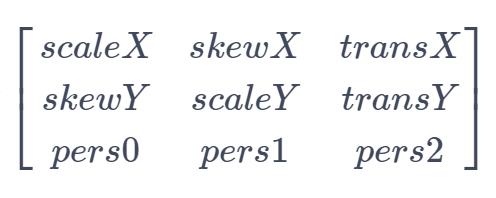

# Class (Matrix)

<!--Kit: ArkGraphics 2D-->
<!--Subsystem: Graphics-->
<!--Owner: @hangmengxin-->
<!--Designer: @wangyanglan-->
<!--Tester: @nobuggers-->
<!--Adviser: @ge-yafang-->

矩阵对象。

表示为3*3的矩阵，如下图所示：



矩阵中的元素从左到右，从上到下分别表示水平缩放系数、水平倾斜系数、水平位移系数、垂直倾斜系数、垂直缩放系数、垂直位移系数、X轴透视系数、Y轴透视系数、透视缩放系数。
设(x<sub>1</sub>, y<sub>1</sub>)为源坐标点，(x<sub>2</sub>, y<sub>2</sub>)为源坐标点通过矩阵变换后的坐标点，则两个坐标点的关系如下：


> **说明：**
>
> - 本模块同时支持ArkTS-Dyn、ArkTS-Sta。
>
> - 本模块首批接口从API version 11开始支持。后续版本的新增接口，采用上角标单独标记接口的起始版本。
>
> - 本Class首批接口从API version 12开始支持。
>
> - 本模块使用屏幕物理像素单位px。
>
> - 本模块为单线程模型策略，需要调用方自行管理线程安全和上下文状态的切换。

## 导入模块

```ts
import { drawing } from '@kit.ArkGraphics2D';
```

## constructor<sup>12+</sup>

constructor()

构造一个矩阵对象。

**系统能力：** SystemCapability.Graphics.Drawing

**ArkTS-Dyn起始版本：** 12

**ArkTS-Sta起始版本：** 23

**示例：**

```ts
import { drawing } from '@kit.ArkGraphics2D';

let matrix = new drawing.Matrix();
```

## constructor<sup>20+</sup>

constructor(matrix: Matrix)

拷贝一个矩阵。

**系统能力：** SystemCapability.Graphics.Drawing

**ArkTS-Dyn起始版本：** 20

**ArkTS-Sta起始版本：** 23

**参数：**

| 参数名         | 类型                                       | 必填   | 说明                  |
| ----------- | ---------------------------------------- | ---- | ------------------- |
| matrix      | [Matrix](arkts-apis-graphics-drawing-Matrix.md)                  | 是    | 被拷贝的矩阵。|

**示例：**

```ts
import { drawing } from '@kit.ArkGraphics2D';

let matrix = new drawing.Matrix();
let matrix2 = new drawing.Matrix(matrix);
```

## isAffine<sup>20+</sup>

isAffine(): boolean

判断当前矩阵是否为仿射矩阵。仿射矩阵是一种包括平移、旋转、缩放等变换的矩阵。

**系统能力：** SystemCapability.Graphics.Drawing

**ArkTS-Dyn起始版本：** 20

**ArkTS-Sta起始版本：** 24

**返回值：**

| 类型                        | 说明                  |
| --------------------------- | -------------------- |
| boolean | 返回当前矩阵是否为仿射矩阵。true表示是仿射矩阵，false表示不是仿射矩阵。 |

**示例：**

```ts
import { drawing } from '@kit.ArkGraphics2D';

let matrix = new drawing.Matrix();
matrix.setMatrix([1.0, 0.5, 1.0, 0.5, 1.0, 1.0, 1.0, 1.0, 1.0]);
let isAff = matrix.isAffine();
console.info('isAff :', isAff);
```

## rectStaysRect<sup>20+</sup>

rectStaysRect(): boolean

判断经过该矩阵映射后的矩形的形状是否仍为矩形。

**系统能力：** SystemCapability.Graphics.Drawing

**ArkTS-Dyn起始版本：** 20

**ArkTS-Sta起始版本：** 24

**返回值：**

| 类型                        | 说明                  |
| --------------------------- | -------------------- |
| boolean | 返回经过该矩阵映射后的矩形的形状是否仍为矩形。true表示仍是矩形，false表示不是矩形。 |

**示例：**

```ts
import { drawing } from '@kit.ArkGraphics2D';

let matrix = new drawing.Matrix();
matrix.setMatrix([1.0, 0.5, 1.0, 0.5, 1.0, 1.0, 1.0, 1.0, 1.0]);
let matrix2 = new drawing.Matrix(matrix);
let isRect = matrix2.rectStaysRect();
console.info('isRect :', isRect);
```

## setSkew<sup>20+</sup>

ArkTS-Dyn: setSkew(kx: number, ky: number, px: number, py: number): void

ArkTS-Sta: setSkew(kx: double, ky: double, px: double, py: double): void

设置矩阵的倾斜系数。

**系统能力：** SystemCapability.Graphics.Drawing

**ArkTS-Dyn起始版本：** 20

**ArkTS-Sta起始版本：** 24

**参数：**

| 参数名         | 类型                                       | 必填   | 说明                       |
| ----------- | ---------------------------------------- | ---- | -------------------             |
| kx          | ArkTS-Dyn: number<br/>ArkTS-Sta: double | 是    | x轴上的倾斜量，该参数为浮点数。正值会使绘制沿y轴增量方向向右倾斜；负值会使绘制沿y轴增量方向向左倾斜。        |
| ky          | ArkTS-Dyn: number<br/>ArkTS-Sta: double | 是    | y轴上的倾斜量，该参数为浮点数。正值会使绘制沿x轴增量方向向下倾斜；负值会使绘制沿x轴增量方向向上倾斜。        |
| px          | ArkTS-Dyn: number<br/>ArkTS-Sta: double | 是    | 倾斜中心点的x轴坐标，该参数为浮点数。0表示坐标原点，正数表示位于坐标原点右侧，负数表示位于坐标原点左侧。     |
| py          | ArkTS-Dyn: number<br/>ArkTS-Sta: double | 是    | 倾斜中心点的y轴坐标，该参数为浮点数。0表示坐标原点，正数表示位于坐标原点下侧，负数表示位于坐标原点上侧。     |

**示例：**

```ts
import { drawing } from '@kit.ArkGraphics2D';

let matrix = new drawing.Matrix();
matrix.setMatrix([1.0, 0.5, 1.0, 0.5, 1.0, 1.0, 1.0, 1.0, 1.0]);
matrix.setSkew(2.0, 0.5, 0.5, 2.0);
```

## setSinCos<sup>20+</sup>

ArkTS-Dyn: setSinCos(sinValue: number, cosValue: number, px: number, py: number): void

ArkTS-Sta: setSinCos(sinValue: double, cosValue: double, px: double, py: double): void

设置矩阵，使其围绕旋转中心(px, py)以指定的正弦值和余弦值旋转。

**系统能力：** SystemCapability.Graphics.Drawing

**ArkTS-Dyn起始版本：** 20

**ArkTS-Sta起始版本：** 24

**参数：**

| 参数名         | 类型                                       | 必填   | 说明            |
| ----------- | ---------------------------------------- | ---- | ------------------- |
| sinValue          | ArkTS-Dyn: number<br/>ArkTS-Sta: double | 是    | 旋转角度的正弦值。仅当正弦值和余弦值的平方和为1时，为旋转变换，否则矩阵可能包含平移缩放等其他变换。          |
| cosValue          | ArkTS-Dyn: number<br/>ArkTS-Sta: double | 是    | 旋转角度的余弦值。仅当正弦值和余弦值的平方和为1时，为旋转变换，否则矩阵可能包含平移缩放等其他变换。            |
| px          | ArkTS-Dyn: number<br/>ArkTS-Sta: double | 是    | 旋转中心的x轴坐标，该参数为浮点数。0表示坐标原点，正数表示位于坐标原点右侧，负数表示位于坐标原点左侧。     |
| py          | ArkTS-Dyn: number<br/>ArkTS-Sta: double | 是    | 旋转中心的y轴坐标，该参数为浮点数。0表示坐标原点，正数表示位于坐标原点下侧，负数表示位于坐标原点上侧。    |

**示例：**

```ts
import { drawing } from '@kit.ArkGraphics2D';

let matrix = new drawing.Matrix();
matrix.setMatrix([1.0, 0.5, 1.0, 0.5, 1.0, 1.0, 1.0, 1.0, 1.0]);
matrix.setSinCos(0.0, 1.0, 1.0, 0.0);
```

## setRotation<sup>12+</sup>

ArkTS-Dyn: setRotation(degree: number, px: number, py: number): void

ArkTS-Sta: setRotation(degree: double, px: double, py: double): void

设置矩阵为单位矩阵，并围绕位于(px, py)的旋转轴点进行旋转。

**系统能力：** SystemCapability.Graphics.Drawing

**ArkTS-Dyn起始版本：** 12

**ArkTS-Sta起始版本：** 23

**参数：**

| 参数名         | 类型                                       | 必填   | 说明                  |
| ----------- | ---------------------------------------- | ---- | ------------------- |
| degree      | ArkTS-Dyn: number<br/>ArkTS-Sta: double | 是    | 角度，单位为度。正数表示顺时针旋转，负数表示逆时针旋转，该参数为浮点数。|
| px          | ArkTS-Dyn: number<br/>ArkTS-Sta: double | 是    | 旋转轴点的横坐标，该参数为浮点数。     |
| py          | ArkTS-Dyn: number<br/>ArkTS-Sta: double | 是    | 旋转轴点的纵坐标，该参数为浮点数。     |

**错误码：**

以下错误码的详细介绍请参见[通用错误码](../errorcode-universal.md)。

| 错误码ID | 错误信息 |
| ------- | --------------------------------------------|
| 401 | Parameter error.Possible causes:1.Mandatory parameters are left unspecified;2.Incorrect parameter types. |

**示例：**

```ts
import { drawing } from '@kit.ArkGraphics2D';

let matrix = new drawing.Matrix();
matrix.setRotation(90.0, 100.0, 100.0);
```

## setScale<sup>12+</sup>

ArkTS-Dyn: setScale(sx: number, sy: number, px: number, py: number): void

ArkTS-Sta: setScale(sx: double, sy: double, px: double, py: double): void

设置矩阵为单位矩阵围绕位于(px, py)的中心点，以sx和sy进行缩放后的结果。

**系统能力：** SystemCapability.Graphics.Drawing

**ArkTS-Dyn起始版本：** 12

**ArkTS-Sta起始版本：** 23

**参数：**

| 参数名         | 类型                                       | 必填   | 说明                  |
| ----------- | ---------------------------------------- | ---- | ------------------- |
| sx          | ArkTS-Dyn: number<br/>ArkTS-Sta: double | 是    | x轴方向缩放系数，为负数时可看作是先关于y = px作镜像翻转后再进行缩放，该参数为浮点数。     |
| sy          | ArkTS-Dyn: number<br/>ArkTS-Sta: double | 是    | y轴方向缩放系数，为负数时可看作是先关于x = py作镜像翻转后再进行缩放，该参数为浮点数。     |
| px          | ArkTS-Dyn: number<br/>ArkTS-Sta: double | 是    |  缩放中心点的横坐标，该参数为浮点数。      |
| py          | ArkTS-Dyn: number<br/>ArkTS-Sta: double | 是    |  缩放中心点的纵坐标，该参数为浮点数。      |

**错误码：**

以下错误码的详细介绍请参见[通用错误码](../errorcode-universal.md)。

| 错误码ID | 错误信息 |
| ------- | --------------------------------------------|
| 401 | Parameter error.Possible causes:1.Mandatory parameters are left unspecified;2.Incorrect parameter types. |

**示例：**

```ts
import { drawing } from '@kit.ArkGraphics2D';

let matrix = new drawing.Matrix();
matrix.setScale(100.0, 100.0, 150.0, 150.0);
```

## setTranslation<sup>12+</sup>

ArkTS-Dyn: setTranslation(dx: number, dy: number): void

ArkTS-Sta: setTranslation(dx: double, dy: double): void

设置矩阵为单位矩阵平移(dx, dy)后的结果。

**系统能力：** SystemCapability.Graphics.Drawing

**ArkTS-Dyn起始版本：** 12

**ArkTS-Sta起始版本：** 23

**参数：**

| 参数名 | 类型                                    | 必填 | 说明                                                         |
| ------ | --------------------------------------- | ---- | ------------------------------------------------------------ |
| dx     | ArkTS-Dyn: number<br/>ArkTS-Sta: double | 是   | x轴方向平移距离，正数表示往x轴正方向平移，负数表示往x轴负方向平移，该参数为浮点数。 |
| dy     | ArkTS-Dyn: number<br/>ArkTS-Sta: double | 是   | y轴方向平移距离，正数表示往y轴正方向平移，负数表示往y轴负方向平移，该参数为浮点数。 |

**错误码：**

以下错误码的详细介绍请参见[通用错误码](../errorcode-universal.md)。

| 错误码ID | 错误信息 |
| ------- | --------------------------------------------|
| 401 | Parameter error.Possible causes:1.Mandatory parameters are left unspecified;2.Incorrect parameter types. |

**示例：**

```ts
import { drawing } from '@kit.ArkGraphics2D';

let matrix = new drawing.Matrix();
matrix.setTranslation(100.0, 100.0);
```

## setMatrix<sup>12+</sup>

ArkTS-Dyn: setMatrix(values: Array\<number>): void

ArkTS-Sta: setMatrix(values: Array\<double>): void

设置矩阵对象的各项参数。

**系统能力：** SystemCapability.Graphics.Drawing

**ArkTS-Dyn起始版本：** 12

**ArkTS-Sta起始版本：** 23

**参数：**

| 参数名 | 类型                                                 | 必填 | 说明             |
| ------ | ---------------------------------------------------- | ---- | ---------------- |
| values  | ArkTS-Dyn: Array\<number><br/>ArkTS-Sta:  Array\<double> | 是   | 长度为9的浮点数组，表示矩阵对象参数。数组中的值按下标从小，到大分别表示水平缩放系数、水平倾斜系数、水平位移系数、垂直倾斜系数、垂直缩放系数、垂直位移系数、X轴透视系数、Y轴透视系数、透视缩放系数。 |

**错误码：**

以下错误码的详细介绍请参见[通用错误码](../errorcode-universal.md)。

| 错误码ID | 错误信息 |
| ------- | --------------------------------------------|
| 401 | Parameter error.Possible causes:1.Mandatory parameters are left unspecified;2.Incorrect parameter types; 3. Parameter verification failed. |

**示例：**

```ts
import { drawing } from '@kit.ArkGraphics2D';

let matrix = new drawing.Matrix();
let value: Array<double> = [2.0, 2.0, 2.0, 2.0, 2.0, 2.0, 2.0, 2.0, 2.0];
matrix.setMatrix(value);
```

## preConcat<sup>12+</sup>

preConcat(matrix: Matrix): void

将当前矩阵设置为当前矩阵左乘matrix的结果。

**系统能力：** SystemCapability.Graphics.Drawing

**ArkTS-Dyn起始版本：** 12

**ArkTS-Sta起始版本：** 23

**参数：**

| 参数名 | 类型                                                 | 必填 | 说明             |
| ------ | ---------------------------------------------------- | ---- | ---------------- |
| matrix  | [Matrix](arkts-apis-graphics-drawing-Matrix.md) | 是   | 表示矩阵对象，位于乘法表达式右侧。 |

**错误码：**

以下错误码的详细介绍请参见[通用错误码](../errorcode-universal.md)。

| 错误码ID | 错误信息 |
| ------- | --------------------------------------------|
| 401 | Parameter error.Possible causes:1.Mandatory parameters are left unspecified;2.Incorrect parameter types. |

**示例：**

```ts
import { drawing } from '@kit.ArkGraphics2D';

let matrix1 = new drawing.Matrix();
matrix1.setMatrix([2.0, 1.0, 3.0, 1.0, 2.0, 1.0, 3.0, 1.0, 2.0]);
let matrix2 = new drawing.Matrix();
matrix2.setMatrix([-2.0, 1.0, 3.0, 1.0, 0.0, -1.0, 3.0, -1.0, 2.0]);
matrix1.preConcat(matrix2);
```

## setMatrix<sup>20+</sup>

ArkTS-Dyn: setMatrix(matrix: Array\<number> \| Matrix): void

ArkTS-Sta: setMatrix(matrix: Array\<double> \| Matrix): void

用一个矩阵对当前矩阵进行更新。

**系统能力：** SystemCapability.Graphics.Drawing

**ArkTS-Dyn起始版本：** 20

**ArkTS-Sta起始版本：** 24

**参数：**

| 参数名 | 类型                                                 | 必填 | 说明             |
| ------ | ---------------------------------------------------- | ---- | ---------------- |
| matrix | ArkTS-Dyn: Array\<number> \| [Matrix](arkts-apis-graphics-drawing-Matrix.md)<br/>ArkTS-Sta: Array<double> | 是   | 用于更新的数组或矩阵。 |

**示例：**

```ts
import { drawing } from '@kit.ArkGraphics2D';

let matrix1 = new drawing.Matrix();
matrix1.setMatrix([2.0, 1.0, 3.0, 1.0, 2.0, 1.0, 3.0, 1.0, 2.0]);
let matrix2 = new drawing.Matrix();
matrix1.setMatrix(matrix2);
```

## setConcat<sup>20+</sup>

setConcat(matrixA: Matrix, matrixB: Matrix): void

用两个矩阵的乘积更新当前矩阵。

**系统能力：** SystemCapability.Graphics.Drawing

**ArkTS-Dyn起始版本：** 20

**ArkTS-Sta起始版本：** 24

**参数：**

| 参数名 | 类型                                                 | 必填 | 说明             |
| ------ | ---------------------------------------------------- | ---- | ---------------- |
| matrixA  | [Matrix](arkts-apis-graphics-drawing-Matrix.md) | 是   | 用于运算的矩阵A。 |
| matrixB  | [Matrix](arkts-apis-graphics-drawing-Matrix.md) | 是   | 用于运算的矩阵B。 |

**示例：**

```ts
import { drawing } from '@kit.ArkGraphics2D';

let matrix1 = new drawing.Matrix();
matrix1.setMatrix([2.0, 1.0, 3.0, 1.0, 2.0, 1.0, 3.0, 1.0, 2.0]);
let matrix2 = new drawing.Matrix();
matrix2.setMatrix([-2.0, 1.0, 3.0, 1.0, 0.0, -1.0, 3.0, -1.0, 2.0]);
matrix1.setConcat(matrix2, matrix1);
```

## postConcat<sup>20+</sup>

postConcat(matrix: Matrix): void

用当前矩阵右乘一个矩阵。

**系统能力：** SystemCapability.Graphics.Drawing

**ArkTS-Dyn起始版本：** 20

**ArkTS-Sta起始版本：** 24

**参数：**

| 参数名 | 类型                                                 | 必填 | 说明             |
| ------ | ---------------------------------------------------- | ---- | ---------------- |
| matrix | [Matrix](arkts-apis-graphics-drawing-Matrix.md) | 是   | 用于运算的矩阵。 |

**示例：**

```ts
import { drawing } from '@kit.ArkGraphics2D';

let matrix = new drawing.Matrix();
if (matrix.isIdentity()) {
  console.info("matrix is identity.");
} else {
  console.info("matrix is not identity.");
}
let matrix1 = new drawing.Matrix();
matrix1.setMatrix([2.0, 1.0, 3.0, 1.0, 2.0, 1.0, 3.0, 1.0, 2.0]);
let matrix2 = new drawing.Matrix();
matrix2.setMatrix([-2.0, 1.0, 3.0, 1.0, 0.0, -1.0, 3.0, -1.0, 2.0]);
matrix1.postConcat(matrix2);
```

## isEqual<sup>12+</sup>

ArkTS-Dyn: isEqual(matrix: Matrix): Boolean

ArkTS-Sta: isEqual(matrix: Matrix): boolean

判断两个矩阵是否相等。

**系统能力：** SystemCapability.Graphics.Drawing

**ArkTS-Dyn起始版本：** 12

**ArkTS-Sta起始版本：** 23

**参数：**

| 参数名 | 类型                                                 | 必填 | 说明             |
| ------ | ---------------------------------------------------- | ---- | ---------------- |
| matrix  | [Matrix](arkts-apis-graphics-drawing-Matrix.md) | 是   | 另一个矩阵。 |

**返回值：**

| 类型                        | 说明                  |
| --------------------------- | -------------------- |
| ArkTS-Dyn: Boolean<br/>ArkTS-Sta: boolean | 返回两个矩阵的比较结果。true表示两个矩阵相等，false表示两个矩阵不相等。 |

**错误码：**

以下错误码的详细介绍请参见[通用错误码](../errorcode-universal.md)。

| 错误码ID | 错误信息 |
| ------- | --------------------------------------------|
| 401 | Parameter error.Possible causes:1.Mandatory parameters are left unspecified;2.Incorrect parameter types. |

**示例：**

```ts
import { drawing } from '@kit.ArkGraphics2D';

let matrix1 = new drawing.Matrix();
matrix1.setMatrix([2, 1, 3, 1, 2, 1, 3, 1, 2]);
let matrix2 = new drawing.Matrix();
matrix2.setMatrix([-2, 1, 3, 1, 0, -1, 3, -1, 2]);
if (matrix1.isEqual(matrix2)) {
  console.info("matrix1 and matrix2 are equal.");
} else {
  console.info("matrix1 and matrix2 are not equal.");
}
```

## invert<sup>12+</sup>

ArkTS-Dyn: invert(matrix: Matrix): Boolean

ArkTS-Sta: invert(matrix: Matrix): boolean

将矩阵matrix设置为当前矩阵的逆矩阵，并返回是否设置成功的结果。

**系统能力：** SystemCapability.Graphics.Drawing

**ArkTS-Dyn起始版本：** 12

**ArkTS-Sta起始版本：** 23

**参数：**

| 参数名 | 类型                                                 | 必填 | 说明             |
| ------ | ---------------------------------------------------- | ---- | ---------------- |
| matrix  | [Matrix](arkts-apis-graphics-drawing-Matrix.md) | 是   | 矩阵对象，用于存储获取到的逆矩阵。 |

**返回值：**

| 类型                        | 说明                  |
| --------------------------- | -------------------- |
| ArkTS-Dyn: Boolean<br/>ArkTS-Sta: boolean | 返回matrix是否被设置为逆矩阵的结果。true表示当前矩阵可逆，matrix被设置为逆矩阵，false表示当前矩阵不可逆，matrix不被设置。 |

**错误码：**

以下错误码的详细介绍请参见[通用错误码](../errorcode-universal.md)。

| 错误码ID | 错误信息 |
| ------- | --------------------------------------------|
| 401 | Parameter error.Possible causes:1.Mandatory parameters are left unspecified;2.Incorrect parameter types. |

**示例：**

```ts
import { drawing } from '@kit.ArkGraphics2D';

let matrix1 = new drawing.Matrix();
matrix1.setMatrix([2, 1, 3, 1, 2, 1, 3, 1, 2]);
let matrix2 = new drawing.Matrix();
matrix2.setMatrix([-2, 1, 3, 1, 0, -1, 3, -1, 2]);
if (matrix1.invert(matrix2)) {
  console.info("matrix1 is invertible and matrix2 is set as an inverse matrix of the matrix1.");
} else {
  console.info("matrix1 is not invertible and matrix2 is not changed.");
}
```

## isIdentity<sup>12+</sup>

isIdentity(): Boolean

判断矩阵是否是单位矩阵。

**系统能力：** SystemCapability.Graphics.Drawing

**ArkTS-Dyn起始版本：** 12

**ArkTS-Sta起始版本：** 23

**返回值：**

| 类型                        | 说明                  |
| --------------------------- | -------------------- |
| Boolean | 返回矩阵是否是单位矩阵。true表示矩阵是单位矩阵，false表示矩阵不是单位矩阵。 |

**示例：**

```ts
import { drawing } from '@kit.ArkGraphics2D';

let matrix = new drawing.Matrix();
if (matrix.isIdentity()) {
  console.info("matrix is identity.");
} else {
  console.info("matrix is not identity.");
}
```

## getValue<sup>12+</sup>

ArkTS-Dyn: getValue(index: number): number

ArkTS-Sta: getValue(index: int): double

获取矩阵给定索引位的值。索引范围0-8。

**系统能力：** SystemCapability.Graphics.Drawing

**ArkTS-Dyn起始版本：** 12

**ArkTS-Sta起始版本：** 23

**参数：**

| 参数名          | 类型    | 必填 | 说明                                                        |
| --------------- | ------- | ---- | ----------------------------------------------------------- |
| index | ArkTS-Dyn: number<br/>ArkTS-Sta: int | 是   | 索引位置，范围0-8，该参数为整数。 |

**返回值：**

| 类型                  | 说明           |
| --------------------- | -------------- |
| ArkTS-Dyn: number<br/>ArkTS-Sta: double | 函数返回矩阵给定索引位对应的值，该返回值为整数。 |

**错误码：**

以下错误码的详细介绍请参见[通用错误码](../errorcode-universal.md)。

| 错误码ID | 错误信息 |
| ------- | --------------------------------------------|
| 401 | Parameter error. Possible causes: 1. Mandatory parameters are left unspecified;2. Incorrect parameter types;3. Parameter verification failed.|

**示例：**

```ts
import {drawing} from "@kit.ArkGraphics2D";

let matrix = new drawing.Matrix();
for (let i = 0; i < 9; i++) {
    console.info("matrix "+matrix.getValue(i).toString());
}
```

## postRotate<sup>12+</sup>

ArkTS-Dyn: postRotate(degree: number, px: number, py: number): void

ArkTS-Sta: postRotate(degree: double, px: double, py: double): void

将矩阵设置为矩阵右乘围绕轴心点旋转一定角度的单位矩阵后得到的矩阵。

**系统能力：** SystemCapability.Graphics.Drawing

**ArkTS-Dyn起始版本：** 12

**ArkTS-Sta起始版本：** 23

**参数：**

| 参数名          | 类型    | 必填 | 说明                                                        |
| --------------- | ------- | ---- | ----------------------------------------------------------- |
| degree | ArkTS-Dyn: number<br/>ArkTS-Sta: double | 是   | 旋转角度，单位为度。正数表示顺时针旋转，负数表示逆时针旋转，该参数为浮点数。 |
| px | ArkTS-Dyn: number<br/>ArkTS-Sta: double | 是   | 旋转中心点的横坐标，该参数为浮点数。 |
| py | ArkTS-Dyn: number<br/>ArkTS-Sta: double | 是   | 旋转中心点的纵坐标，该参数为浮点数。 |

**错误码：**

以下错误码的详细介绍请参见[通用错误码](../errorcode-universal.md)。

| 错误码ID | 错误信息 |
| ------- | --------------------------------------------|
| 401 | Parameter error.Possible causes:1.Mandatory parameters are left unspecified;2.Incorrect parameter types. |

**示例：**

ArkTS-Dyn示例：
```ts
import {drawing} from "@kit.ArkGraphics2D";

let matrix = new drawing.Matrix();
let degree: number = 2;
let px: number = 3;
let py: number = 4;
matrix.postRotate(degree, px, py);
console.info("matrix= "+matrix.getAll().toString());
```

ArkTS-Sta示例：
```ts
import {drawing} from "@kit.ArkGraphics2D";

let matrix = new drawing.Matrix();
let degree: double = 2.0;
let px: double = 3.0;
let py: double = 4.0;
matrix.postRotate(degree, px, py);
if (matrix.getAll() != undefined) {
  console.info("matrix= "+matrix.getAll()!.toString());
}
```

## postScale<sup>12+</sup>

ArkTS-Dyn: postScale(sx: number, sy: number, px: number, py: number): void

ArkTS-Sta: postScale(sx: double, sy: double, px: double, py: double): void

将矩阵设置为矩阵右乘围绕轴心点按一定缩放系数缩放后的单位矩阵后得到的矩阵。

**系统能力：** SystemCapability.Graphics.Drawing

**ArkTS-Dyn起始版本：** 12

**ArkTS-Sta起始版本：** 23

**参数：**

| 参数名          | 类型    | 必填 | 说明                                                        |
| --------------- | ------- | ---- | ----------------------------------------------------------- |
| sx | ArkTS-Dyn: number<br/>ArkTS-Sta: double | 是   | x轴方向缩放系数，负数表示先关于y = px作镜像翻转后再进行缩放，该参数为浮点数。 |
| sy | ArkTS-Dyn: number<br/>ArkTS-Sta: double | 是   | y轴方向缩放系数，负数表示先关于x = py作镜像翻转后再进行缩放，该参数为浮点数。 |
| px | ArkTS-Dyn: number<br/>ArkTS-Sta: double | 是   | 缩放中心点的横坐标，该参数为浮点数。 |
| py | ArkTS-Dyn: number<br/>ArkTS-Sta: double | 是   | 缩放中心点的纵坐标，该参数为浮点数。 |

**错误码：**

以下错误码的详细介绍请参见[通用错误码](../errorcode-universal.md)。

| 错误码ID | 错误信息 |
| ------- | --------------------------------------------|
| 401 | Parameter error.Possible causes:1.Mandatory parameters are left unspecified;2.Incorrect parameter types. |

**示例：**

ArkTS-Dyn示例：
```ts
import {drawing} from "@kit.ArkGraphics2D";

let matrix = new drawing.Matrix();
let sx: number = 2;
let sy: number = 0.5;
let px: number = 1;
let py: number = 1;
matrix.postScale(sx, sy, px, py);
console.info("matrix= "+matrix.getAll().toString());
```

ArkTS-Sta示例：
```ts
import {drawing} from "@kit.ArkGraphics2D";

let matrix = new drawing.Matrix();
let sx: double = 2.0;
let sy: double = 0.5;
let px: double = 1.0;
let py: double = 1.0;
matrix.postScale(sx, sy, px, py);
if (matrix.getAll() != undefined) {
  console.info("matrix= "+matrix.getAll()!.toString());
}
```

## postTranslate<sup>12+</sup>

ArkTS-Dyn: postTranslate(dx: number, dy: number): void

ArkTS-Sta: postTranslate(dx: double, dy: double): void

将矩阵设置为矩阵右乘平移一定距离后的单位矩阵后得到的矩阵。

**系统能力：** SystemCapability.Graphics.Drawing

**ArkTS-Dyn起始版本：** 12

**ArkTS-Sta起始版本：** 23

**参数：**

| 参数名          | 类型    | 必填 | 说明                                                        |
| --------------- | ------- | ---- | ----------------------------------------------------------- |
| dx | ArkTS-Dyn: number<br/>ArkTS-Sta: double | 是   | x轴方向平移距离，正数表示往x轴正方向平移，负数表示往x轴负方向平移，该参数为浮点数。 |
| dy | ArkTS-Dyn: number<br/>ArkTS-Sta: double | 是   | y轴方向平移距离，正数表示往y轴正方向平移，负数表示往y轴负方向平移，该参数为浮点数。 |

**错误码：**

以下错误码的详细介绍请参见[通用错误码](../errorcode-universal.md)。

| 错误码ID | 错误信息 |
| ------- | --------------------------------------------|
| 401 | Parameter error.Possible causes:1.Mandatory parameters are left unspecified;2.Incorrect parameter types. |

**示例：**

ArkTS-Dyn示例：
```ts
import {drawing} from "@kit.ArkGraphics2D";

let matrix = new drawing.Matrix();
let dx: number = 3;
let dy: number = 4;
matrix.postTranslate(dx, dy);
console.info("matrix= "+matrix.getAll().toString());
```

ArkTS-Sta示例：
```ts
import {drawing} from "@kit.ArkGraphics2D";

let matrix = new drawing.Matrix();
let dx: double = 3.0;
let dy: double = 4.0;
matrix.postTranslate(dx, dy);
if (matrix.getAll() != undefined) {
  console.info("matrix= "+matrix.getAll()!.toString());
}
```

## preRotate<sup>12+</sup>

ArkTS-Dyn: preRotate(degree: number, px: number, py: number): void

ArkTS-Sta: preRotate(degree: double, px: double, py: double): void

将矩阵设置为矩阵左乘围绕轴心点旋转一定角度的单位矩阵后得到的矩阵。

**系统能力：** SystemCapability.Graphics.Drawing

**ArkTS-Dyn起始版本：** 12

**ArkTS-Sta起始版本：** 23

**参数：**

| 参数名          | 类型    | 必填 | 说明                                                        |
| --------------- | ------- | ---- | ----------------------------------------------------------- |
| degree | ArkTS-Dyn: number<br/>ArkTS-Sta: double | 是   | 旋转角度，单位为度。正数表示顺时针旋转，负数表示逆时针旋转，该参数为浮点数。 |
| px | ArkTS-Dyn: number<br/>ArkTS-Sta: double | 是   | 旋转中心点的横坐标，该参数为浮点数。 |
| py | ArkTS-Dyn: number<br/>ArkTS-Sta: double | 是   | 旋转中心点的纵坐标，该参数为浮点数。 |

**错误码：**

以下错误码的详细介绍请参见[通用错误码](../errorcode-universal.md)。

| 错误码ID | 错误信息 |
| ------- | --------------------------------------------|
| 401 | Parameter error.Possible causes:1.Mandatory parameters are left unspecified;2.Incorrect parameter types. |

**示例：**

ArkTS-Dyn示例：
```ts
import {drawing} from "@kit.ArkGraphics2D";

let matrix = new drawing.Matrix();
let degree: number = 2;
let px: number = 3;
let py: number = 4;
matrix.preRotate(degree, px, py);
console.info("matrix= "+matrix.getAll().toString());
```

ArkTS-Sta示例：
```ts
import {drawing} from "@kit.ArkGraphics2D";

let matrix = new drawing.Matrix();
let degree: double = 2.0;
let px: double = 3.0;
let py: double = 4.0;
matrix.preRotate(degree, px, py);
if (matrix.getAll() != undefined) {
  console.info("matrix= "+matrix.getAll()!.toString());
}
```

## postSkew<sup>20+</sup>

ArkTS-Dyn: (kx: number, ky: number, px: number, py: number): void

ArkTS-Sta: (kx: double, ky: double, px: double, py: double): void

当前矩阵右乘一个倾斜变换矩阵。

**系统能力：** SystemCapability.Graphics.Drawing

**ArkTS-Dyn起始版本：** 20

**ArkTS-Sta起始版本：** 24

**参数：**

| 参数名         | 类型                                       | 必填   | 说明             |
| ----------- | ---------------------------------------- | ---- | -------------------   |
| kx          | ArkTS-Dyn: number<br/>ArkTS-Sta: double | 是    | x轴上的倾斜量，该参数为浮点数。正值会使绘制沿y轴增量方向向右倾斜；负值会使绘制沿y轴增量方向向左倾斜。           |
| ky          | ArkTS-Dyn: number<br/>ArkTS-Sta: double | 是    | y轴上的倾斜量，该参数为浮点数。正值会使绘制沿x轴增量方向向下倾斜；负值会使绘制沿x轴增量方向向上倾斜。           |
| px          | ArkTS-Dyn: number<br/>ArkTS-Sta: double | 是    | 倾斜中心点的x轴坐标，该参数为浮点数。0表示坐标原点，正数表示位于坐标原点右侧，负数表示位于坐标原点左侧。    |
| py          | ArkTS-Dyn: number<br/>ArkTS-Sta: double | 是    | 倾斜中心点的y轴坐标，该参数为浮点数。0表示坐标原点，正数表示位于坐标原点下侧，负数表示位于坐标原点上侧。   |

**示例：**

```ts
import {drawing} from "@kit.ArkGraphics2D"
let matrix = new drawing.Matrix();
matrix.postSkew(2.0, 1.0, 2.0, 1.0);
```

## preSkew<sup>20+</sup>

ArkTS-Dyn: preSkew(kx: number, ky: number, px: number, py: number): void

ArkTS-Sta: preSkew(kx: double, ky: double, px: double, py: double): void

当前矩阵左乘一个倾斜变换矩阵。

**系统能力：** SystemCapability.Graphics.Drawing

**ArkTS-Dyn起始版本：** 20

**ArkTS-Sta起始版本：** 24

**参数：**

| 参数名         | 类型                                       | 必填   | 说明             |
| ----------- | ---------------------------------------- | ---- | -------------------   |
| kx          | ArkTS-Dyn: number<br/>ArkTS-Sta: double | 是    | x轴上的倾斜量，该参数为浮点数。正值会使绘制沿y轴增量方向向右倾斜；负值会使绘制沿y轴增量方向向左倾斜。           |
| ky          | ArkTS-Dyn: number<br/>ArkTS-Sta: double | 是    | y轴上的倾斜量，该参数为浮点数。正值会使绘制沿x轴增量方向向下倾斜；负值会使绘制沿x轴增量方向向上倾斜。           |
| px          | ArkTS-Dyn: number<br/>ArkTS-Sta: double | 是    | 倾斜中心点的x轴坐标，该参数为浮点数。0表示坐标原点，正数表示位于坐标原点右侧，负数表示位于坐标原点左侧。        |
| py          | ArkTS-Dyn: number<br/>ArkTS-Sta: double | 是    | 倾斜中心点的y轴坐标，该参数为浮点数。0表示坐标原点，正数表示位于坐标原点下侧，负数表示位于坐标原点上侧。        |

**示例：**

```ts
import {drawing} from "@kit.ArkGraphics2D"
let matrix = new drawing.Matrix();
matrix.preSkew(2.0, 1.0, 2.0, 1.0);
```

## mapRadius<sup>20+</sup>

ArkTS-Dyn: mapRadius(radius: number): number

ArkTS-Sta: mapRadius(radius: double): double

返回半径为radius的圆经过当前矩阵映射形成的椭圆的平均半径。平均半径的平方为椭圆长轴长度和短轴长度的乘积。若当前矩阵包含透视变换，则该结果无意义。

**系统能力：** SystemCapability.Graphics.Drawing

**ArkTS-Dyn起始版本：** 20

**ArkTS-Dyn起始版本：** 24

**参数：**

| 参数名 | 类型                                                 | 必填 | 说明             |
| ------ | ---------------------------------------------------- | ---- | ---------------- |
| radius  | ArkTS-Dyn: number<br/>ArkTS-Sta: double | 是   | 用于计算的圆的半径，浮点数。如果是负数，则按照绝对值进行计算。 |

**返回值：**

| 类型                        | 说明                  |
| --------------------------- | -------------------- |
| ArkTS-Dyn: number<br/>ArkTS-Sta: double | 返回经过变换之后的平均半径。 |

**示例：**

```ts
import {drawing} from "@kit.ArkGraphics2D"

let matrix = new drawing.Matrix();
matrix.setMatrix([2.0, 1.0, 3.0, 1.0, 2.0, 1.0, 3.0, 1.0, 2.0]);
let radius = matrix.mapRadius(10.0);
console.info('radius', radius);
```

## preScale<sup>12+</sup>

ArkTS-Dyn: preScale(sx: number, sy: number, px: number, py: number): void

ArkTS-Sta: preScale(sx: double, sy: double, px: double, py: double): void

将矩阵设置为矩阵左乘围绕轴心点按一定缩放系数缩放后的单位矩阵后得到的矩阵。

**系统能力：** SystemCapability.Graphics.Drawing

**ArkTS-Dyn起始版本：** 12

**ArkTS-Sta起始版本：** 23

**参数：**

| 参数名          | 类型    | 必填 | 说明                                                        |
| --------------- | ------- | ---- | ----------------------------------------------------------- |
| sx | ArkTS-Dyn: number<br/>ArkTS-Sta: double | 是   | x轴方向缩放系数，为负数时可看作是先关于y = px作镜像翻转后再进行缩放，该参数为浮点数。 |
| sy | ArkTS-Dyn: number<br/>ArkTS-Sta: double | 是   | y轴方向缩放系数，为负数时可看作是先关于x = py作镜像翻转后再进行缩放，该参数为浮点数。 |
| px | ArkTS-Dyn: number<br/>ArkTS-Sta: double | 是   | 轴心点横坐标，该参数为浮点数。 |
| py | ArkTS-Dyn: number<br/>ArkTS-Sta: double | 是   | 轴心点纵坐标，该参数为浮点数。 |

**错误码：**

以下错误码的详细介绍请参见[通用错误码](../errorcode-universal.md)。

| 错误码ID | 错误信息 |
| ------- | --------------------------------------------|
| 401 | Parameter error.Possible causes:1.Mandatory parameters are left unspecified;2.Incorrect parameter types. |

**示例：**

ArkTS-Dyn示例：
```ts
import {drawing} from "@kit.ArkGraphics2D";

let matrix = new drawing.Matrix();
let sx: number = 2;
let sy: number = 0.5;
let px: number = 1;
let py: number = 1;
matrix.preScale(sx, sy, px, py);
console.info("matrix"+matrix.getAll().toString());
```

ArkTS-Sta示例：
```ts
import {drawing} from "@kit.ArkGraphics2D";

let matrix = new drawing.Matrix();
let sx: double = 2.0;
let sy: double = 0.5;
let px: double = 1.0;
let py: double = 1.0;
matrix.preScale(sx, sy, px, py);
if (matrix.getAll() != undefined) {
  console.info("matrix= "+matrix.getAll()!.toString());
}
```

## preTranslate<sup>12+</sup>

ArkTS-Dyn: preTranslate(dx: number, dy: number): void

ArkTS-Sta: preTranslate(dx: double, dy: double): void

将矩阵设置为矩阵左乘平移一定距离后的单位矩阵后得到的矩阵。

**系统能力：** SystemCapability.Graphics.Drawing

**ArkTS-Dyn起始版本：** 12

**ArkTS-Sta起始版本：** 23

**参数：**

| 参数名          | 类型    | 必填 | 说明                                                        |
| --------------- | ------- | ---- | ----------------------------------------------------------- |
| dx | ArkTS-Dyn: number<br/>ArkTS-Sta: double | 是   | x轴方向平移距离，正数表示往x轴正方向平移，负数表示往x轴负方向平移，该参数为浮点数。 |
| dy | ArkTS-Dyn: number<br/>ArkTS-Sta: double | 是   | y轴方向平移距离，正数表示往y轴正方向平移，负数表示往y轴负方向平移，该参数为浮点数。 |

**错误码：**

以下错误码的详细介绍请参见[通用错误码](../errorcode-universal.md)。

| 错误码ID | 错误信息 |
| ------- | --------------------------------------------|
| 401 | Parameter error.Possible causes:1.Mandatory parameters are left unspecified;2.Incorrect parameter types. |

**示例：**

ArkTS-Dyn示例：
```ts
import {drawing} from "@kit.ArkGraphics2D";

let matrix = new drawing.Matrix();
let dx: number = 3;
let dy: number = 4;
matrix.preTranslate(dx, dy);
console.info("matrix"+matrix.getAll().toString());
```

ArkTS-Sta示例：
```ts
import {drawing} from "@kit.ArkGraphics2D";

let matrix = new drawing.Matrix();
let dx: double = 3.0;
let dy: double = 4.0;
matrix.preTranslate(dx, dy);
if (matrix.getAll() != undefined) {
  console.info("matrix= "+matrix.getAll()!.toString());
}
```

## reset<sup>12+</sup>

reset(): void

重置当前矩阵为单位矩阵。

**系统能力：** SystemCapability.Graphics.Drawing

**ArkTS-Dyn起始版本：** 12

**ArkTS-Sta起始版本：** 23

**示例：**

ArkTS-Dyn示例：
```ts
import {drawing} from "@kit.ArkGraphics2D";

let matrix = new drawing.Matrix();
matrix.postScale(2, 3, 4, 5);
matrix.reset();
console.info("matrix= "+matrix.getAll().toString());
```

ArkTS-Sta示例：
```ts
import {drawing} from "@kit.ArkGraphics2D";

let matrix = new drawing.Matrix();
matrix.postScale(2.0, 3.0, 4.0, 5.0);
matrix.reset();
if (matrix.getAll() != undefined) {
  console.info("matrix= "+matrix.getAll()!.toString());
}
```

## mapPoints<sup>12+</sup>

ArkTS-Dyn: mapPoints(src: Array\<common2D.Point>): Array\<common2D.Point>

ArkTS-Sta: mapPoints(src: Array\<common2D.Point>): Array\<common2D.Point> | undefined

通过矩阵变换将源点数组映射到目标点数组。

**系统能力：** SystemCapability.Graphics.Drawing

**ArkTS-Dyn起始版本：** 12

**ArkTS-Sta起始版本：** 23

**参数：**

| 参数名          | 类型    | 必填 | 说明                                                        |
| --------------- | ------- | ---- | ----------------------------------------------------------- |
| src | Array\<[common2D.Point](js-apis-graphics-common2D.md#point12)> | 是   | 源点数组。 |

**返回值：**

| 类型                  | 说明           |
| --------------------- | -------------- |
| ArkTS-Dyn: Array\<[common2D.Point](js-apis-graphics-common2D.md#point12)><br/>ArkTS-Sta: Array\<[common2D.Point](js-apis-graphics-common2D.md#point12)> \| undefined | 源点数组经矩阵变换后的点数组。创建对象失败时返回undefined。 |

**错误码：**

以下错误码的详细介绍请参见[通用错误码](../errorcode-universal.md)。

| 错误码ID | 错误信息 |
| ------- | --------------------------------------------|
| 401 | Parameter error.Possible causes:1.Mandatory parameters are left unspecified;2.Incorrect parameter types. |

**示例：**

```ts
import {drawing,common2D} from "@kit.ArkGraphics2D";

let src: Array<common2D.Point> = [];
src.push({x: 15, y: 20});
src.push({x: 20, y: 15});
src.push({x: 30, y: 10});
let matrix = new drawing.Matrix();
let dst: Array<common2D.Point> = matrix.mapPoints(src);
console.info("matrix= src: "+JSON.stringify(src));
console.info("matrix= dst: "+JSON.stringify(dst));
```

## getAll<sup>12+</sup>

ArkTS-Dyn: getAll(): Array\<number>

ArkTS-Sta: getAll(): Array\<double> | undefined

获取矩阵的所有元素值。

**系统能力：** SystemCapability.Graphics.Drawing

**ArkTS-Dyn起始版本：** 12

**ArkTS-Sta起始版本：** 23

**返回值：**

| 类型                  | 说明           |
| --------------------- | -------------- |
| ArkTS-Dyn: Array\<number><br/>ArkTS-Sta: Array\<double> \| undefined | 存储矩阵元素值的浮点数组，长度为9。获取失败时返回undefined。 |

**示例：**

```ts
import {drawing} from "@kit.ArkGraphics2D";

let matrix = new drawing.Matrix();
console.info("matrix "+ matrix.getAll());
```

## mapRect<sup>12+</sup>

mapRect(dst: common2D.Rect, src: common2D.Rect): boolean

将目标矩形设置为源矩形通过矩阵变换后的图形的外接矩形。如下图所示，蓝色矩形为源矩形，假设黄色矩形为源矩形通过矩阵变换形成的图形，此时黄色矩形的边不与坐标轴平行，无法使用矩形对象表示，因此，将目标矩形设置为黄色矩形的外接矩形，即黑色矩形。


**系统能力：** SystemCapability.Graphics.Drawing

**ArkTS-Dyn起始版本：** 12

**ArkTS-Sta起始版本：** 23

**参数：**

| 参数名          | 类型    | 必填 | 说明                                                        |
| --------------- | ------- | ---- | ----------------------------------------------------------- |
| dst | [common2D.Rect](js-apis-graphics-common2D.md#rect) | 是   | 目标矩形对象，用于存储源矩形经矩阵变换后的图形的外接矩形。 |
| src | [common2D.Rect](js-apis-graphics-common2D.md#rect) | 是   | 源矩形对象。 |

**返回值：**

| 类型                  | 说明           |
| --------------------- | -------------- |
| boolean | 返回源矩形经过矩阵变换后的图形是否仍然是矩形，true表示是矩形，false表示不是矩形。 |

**错误码：**

以下错误码的详细介绍请参见[通用错误码](../errorcode-universal.md)。

| 错误码ID | 错误信息 |
| ------- | --------------------------------------------|
| 401 | Parameter error.Possible causes:1.Mandatory parameters are left unspecified;2.Incorrect parameter types. |

**示例：**

```ts
import {drawing,common2D} from "@kit.ArkGraphics2D";

let dst: common2D.Rect = { left: 100.0, top: 20.0, right: 130.0, bottom: 60.0 };
let src: common2D.Rect = { left: 100.0, top: 80.0, right: 130.0, bottom: 120.0 };
let matrix = new drawing.Matrix();
if (matrix.mapRect(dst, src)) {
    console.info("matrix= dst "+JSON.stringify(dst));
}
```

## setRectToRect<sup>12+</sup>

setRectToRect(src: common2D.Rect, dst: common2D.Rect, scaleToFit: ScaleToFit): boolean

将当前矩阵设置为能使源矩形映射到目标矩形的变换矩阵。

**系统能力：** SystemCapability.Graphics.Drawing

**ArkTS-Dyn起始版本：** 12

**ArkTS-Sta起始版本：** 23

**参数：**

| 参数名          | 类型    | 必填 | 说明                                                        |
| --------------- | ------- | ---- | ----------------------------------------------------------- |
| src | [common2D.Rect](js-apis-graphics-common2D.md#rect) | 是   | 源矩形。 |
| dst | [common2D.Rect](js-apis-graphics-common2D.md#rect) | 是   | 目标矩形。 |
| scaleToFit | [ScaleToFit](arkts-apis-graphics-drawing-e.md#scaletofit12) | 是   | 源矩形到目标矩形的映射方式。 |

**返回值：**

| 类型                  | 说明           |
| --------------------- | -------------- |
| boolean | 返回矩阵是否可以表示矩形之间的映射，true表示可以，false表示不可以。如果源矩形的宽高任意一个小于等于0，则返回false，并将矩阵设置为单位矩阵；如果目标矩形的宽高任意一个小于等于0，则返回true，并将矩阵设置为除透视缩放系数为1外其余值皆为0的矩阵。 |

**错误码：**

以下错误码的详细介绍请参见[通用错误码](../errorcode-universal.md)。

| 错误码ID | 错误信息 |
| ------- | --------------------------------------------|
| 401 | Parameter error.Possible causes:1.Mandatory parameters are left unspecified;2.Incorrect parameter types;3.Parameter verification failed. |

**示例：**

ArkTS-Dyn示例：
```ts
import {drawing,common2D} from "@kit.ArkGraphics2D";

let src: common2D.Rect = { left: 100, top: 100, right: 300, bottom: 300 };
let dst: common2D.Rect = { left: 200, top: 200, right: 600, bottom: 600 };
let scaleToFit: drawing.ScaleToFit = drawing.ScaleToFit.FILL_SCALE_TO_FIT
let matrix = new drawing.Matrix();
if (matrix.setRectToRect(src, dst, scaleToFit)) {
    console.info("matrix"+matrix.getAll().toString());
}
```

ArkTS-Sta示例：
```ts
import {drawing,common2D} from "@kit.ArkGraphics2D";

let src: common2D.Rect = { left: 100.0, top: 100.0, right: 300.0, bottom: 300.0 };
let dst: common2D.Rect = { left: 200.0, top: 200.0, right: 600.0, bottom: 600.0 };
let scaleToFit: drawing.ScaleToFit = drawing.ScaleToFit.FILL_SCALE_TO_FIT
let matrix = new drawing.Matrix();
if (matrix.setRectToRect(src, dst, scaleToFit) && matrix.getAll() != undefined) {
  console.info("matrix"+matrix.getAll()!.toString());
}
```

## setPolyToPoly<sup>12+</sup>

ArkTS-Dyn: setPolyToPoly(src: Array\<common2D.Point>, dst: Array\<common2D.Point>, count: number): boolean

ArkTS-Sta: setPolyToPoly(src: Array\<common2D.Point>, dst: Array\<common2D.Point>, count: int): boolean

将当前矩阵设置为能够将源点数组映射到目标点数组的变换矩阵。源点和目标点的个数必须大于等于0，小于等于4。

**系统能力：** SystemCapability.Graphics.Drawing

**ArkTS-Dyn起始版本：** 12

**ArkTS-Sta起始版本：** 23

**参数：**

| 参数名          | 类型    | 必填 | 说明                                                        |
| --------------- | ------- | ---- | ----------------------------------------------------------- |
| src | Array\<[common2D.Point](js-apis-graphics-common2D.md#point12)> | 是   | 源点数组，长度必须为count。 |
| dst | Array\<[common2D.Point](js-apis-graphics-common2D.md#point12)> | 是   | 目标点数组，长度必须为count。 |
| count | ArkTS-Dyn: number<br/>ArkTS-Sta: int | 是   | 在src和dst点的数量，该参数为整数。 |

**返回值：**

| 类型                  | 说明           |
| --------------------- | -------------- |
| boolean | 返回设置矩阵是否成功的结果，true表示设置成功，false表示设置失败。 |

**错误码：**

以下错误码的详细介绍请参见[通用错误码](../errorcode-universal.md)。

| 错误码ID | 错误信息 |
| ------- | --------------------------------------------|
| 401 | Parameter error.Possible causes:1.Mandatory parameters are left unspecified;2.Incorrect parameter types. |

**示例：**

ArkTS-Dyn示例：
```ts
import {drawing,common2D} from "@kit.ArkGraphics2D";

let srcPoints: Array<common2D.Point> = [ {x: 10, y: 20}, {x: 200, y: 150} ];
let dstPoints: Array<common2D.Point> = [{ x:0, y: 10 }, { x:300, y: 600 }];
let matrix = new drawing.Matrix();
if (matrix.setPolyToPoly(srcPoints, dstPoints, 2)) {
    console.info("matrix"+matrix.getAll().toString());
}
```

ArkTS-Sta示例：
```ts
import {drawing,common2D} from "@kit.ArkGraphics2D";

let srcPoints: Array<common2D.Point> = [ {x: 10.0, y: 20.0}, {x: 200.0, y: 150.0} ];
let dstPoints: Array<common2D.Point> = [{ x:0.0, y: 10.0 }, { x:300.0, y: 600.0 }];
let matrix = new drawing.Matrix();
if (matrix.setPolyToPoly(srcPoints, dstPoints, 2) && matrix.getAll() != undefined) {
  console.info("matrix"+matrix.getAll()!.toString());
}
```