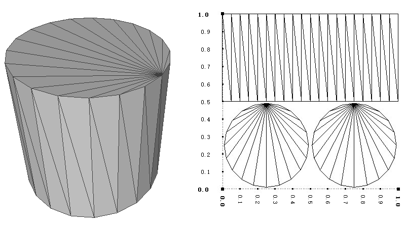

# SceneType
<!--Kit: ArkGraphics 3D-->
<!--Subsystem: Graphics-->
<!--Owner: @zzhao0-->
<!--Designer: @zdustc-->
<!--Tester: @zhangyue283-->
<!--Adviser: @ge-yafang-->

本模块提供3D图形中常用的数据类型。

> **说明：** 
> - 本模块首批接口从API version 12开始支持，后续版本的新增接口，采用上角标标记接口的起始版本。

## 导入模块
```ts
import { Vec2, Vec3, Vec4, Quaternion, Aabb, Color, Rect, GeometryType, PrimitiveTopology, CustomGeometry, CubeGeometry, PlaneGeometry, SphereGeometry, CylinderGeometry, Position3, Rotation3, Scale3 } from '@kit.ArkGraphics3D';
```

## Vec2
二维向量，通常用于表示2D空间中的点或方向，由x和y两个分量组成。

**系统能力：** SystemCapability.ArkUi.Graphics3D

| 名称 | 类型 | 只读 | 可选 | 说明 |
| ---- | ---- | ---- | ---- | ---- |
| x | number | 否 | 否 | x轴分量，取值范围是实数。 |
| y | number | 否 | 否 | y轴分量，取值范围是实数。|

## Vec3
三维向量，通常用于表示3D空间中的点、方向或向量变换，由x、y和z三个分量组成。

**系统能力：** SystemCapability.ArkUi.Graphics3D
| 名称 | 类型 | 只读 | 可选 | 说明 |
| ---- | ---- | ---- | ---- | ---- |
| x | number | 否 | 否 | x轴分量，取值范围是实数。 |
| y | number | 否 | 否 | y轴分量，取值范围是实数。 |
| z | number | 否 | 否 | z轴分量，取值范围是实数。 |

## Vec4
四维向量，通常用于表示4D空间中的点、方向或向量变换，由x、y、z和w四个分量组成，增加第四个分量为各种计算和变换增加了规整性和便捷性。

**系统能力：** SystemCapability.ArkUi.Graphics3D
| 名称 | 类型 | 只读 | 可选 | 说明 |
| ---- | ---- | ---- | ---- | ---- |
| x | number | 否 | 否 | x轴分量，取值范围是实数。 |
| y | number | 否 | 否 | y轴分量，取值范围是实数。 |
| z | number | 否 | 否 | z轴分量，取值范围是实数。 |
| w | number | 否 | 否 | w轴分量，取值范围是实数。 |

## Quaternion
用于表示3D空间中旋转的数学结构。与传统的欧拉角相比，四元数在数值稳定性和避免万向节锁方面具有优势。

**系统能力：** SystemCapability.ArkUi.Graphics3D
| 名称 | 类型 | 只读 | 可选 | 说明 |
| ---- | ---- | ---- | ---- | ---- |
| x | number | 否 | 否 | x轴分量，取值范围是实数。 |
| y | number | 否 | 否 | y轴分量，取值范围是实数。 |
| z | number | 否 | 否 | z轴分量，取值范围是实数。 |
| w | number | 否 | 否 | w轴分量，取值范围是实数。 |

## Aabb
轴对齐边界盒，主要用于判断空间中的物体是否重叠。

**系统能力：** SystemCapability.ArkUi.Graphics3D
| 名称 | 类型 | 只读 | 可选 | 说明 |
| ---- | ---- | ---- | ---- | ---- |
| aabbMin | [Vec3](#vec3) | 否 | 否 | 轴对齐边界盒的小值点。 |
| aabbMax | [Vec3](#vec3) | 否 | 否 | 轴对齐边界盒的大值点。 |

## Color
用于表示RGBA格式的颜色，包含四个分量，依次为红色、绿色、蓝色和透明度。

**系统能力：** SystemCapability.ArkUi.Graphics3D
| 名称 | 类型 | 只读 | 可选 | 说明 |
| ---- | ---- | ---- | ---- | ---- |
| r | number | 否 | 否 | 红色分量，取值范围是[0, 1]。 |
| g | number | 否 | 否 | 绿色分量，取值范围是[0, 1]。 |
| b | number | 否 | 否 | 蓝色分量，取值范围是[0, 1]。 |
| a | number | 否 | 否 | 透明度分量，取值范围是[0, 1]。 |

## Rect
用于表示平面中的矩形。

**系统能力：** SystemCapability.ArkUi.Graphics3D
| 名称 | 类型 | 只读 | 可选 | 说明 |
| ---- | ---- | ---- | ---- | ---- |
| x | number | 否 | 否 | 矩形左下角x轴分量，单位为所属坐标系的单位长度，取值为任意实数，具体范围依赖场景坐标系设置。 |
| y | number | 否 | 否 | 矩形左下角y轴分量，单位为所属坐标系的单位长度，取值为任意实数，具体范围依赖场景坐标系设置。 |
| width | number | 否 | 否 | 矩形宽度，单位为所属坐标系的单位长度，有效取值范围大于0。 |
| height | number | 否 | 否 | 矩形高度，单位为所属坐标系的单位长度，有效取值范围大于0。 |
## RenderingPipelineType<sup>21+</sup>

渲染管线类型枚举。

**系统能力：** SystemCapability.ArkUi.Graphics3D

| 名称 | 值 | 说明 |
| ---- | ---- | ---- |
| FORWARD_LIGHTWEIGHT | 0 | 轻量级前向渲染管线，直接渲染到后缓冲区。该管线只能在着色器中实现逐像素效果（例如色调映射），不支持复杂效果（例如光晕）。 |
| FORWARD | 1 | 高质量前向渲染管线，用于复杂的视觉效果（例如光晕）。 |

## GeometryType<sup>18+</sup>

几何类型枚举，用于指定不同的几何类型。

**系统能力：** SystemCapability.ArkUi.Graphics3D

| 名称 | 值 | 说明 |
| ---- | ---- | ---- |
| CUSTOM | 0 | 自定义几何体类型。 |
| CUBE | 1 | 立方体类型。 |
| PLANE | 2 | 平面类型。 |
| SPHERE | 3 | 球体类型。 |
| CYLINDER<sup>23+</sup> | 4 | 圆柱体类型。|

## GeometryDefinition<sup>18+</sup>
几何类型定义抽象类，用于解释特定几何类型的属性。

**系统能力：** SystemCapability.ArkUi.Graphics3D
| 名称 | 类型 | 只读 | 可选 | 说明 |
| ---- | ---- | ---- | ---- | ---- |
| geometryType | [GeometryType](#geometrytype18)| 是 | 否 | 定义不同的几何类型。 |

## PrimitiveTopology<sup>18+</sup>
 图元拓扑枚举，在顶点处理过程中，指定顶点的不同处理方式。

**系统能力：** SystemCapability.ArkUi.Graphics3D

| 名称 | 值 | 说明 |
| ---- | ---- | ---- |
| TRIANGLE_LIST | 0 | 由不相交的顶点集合构成不同的三角形。 |
| TRIANGLE_STRIP | 1 | 每个顶点和前一个三角形的一条边构成新的三角形。 |

## CustomGeometry<sup>18+</sup>
自定义几何类型，继承自[GeometryDefinition](#geometrydefinition18)。

**系统能力：** SystemCapability.ArkUi.Graphics3D

| 名称 | 类型 | 只读 | 可选 | 说明 |
| ---- | ---- | ---- | ---- | ---- |
| topology | [PrimitiveTopology](#primitivetopology18)| 否 | 是 | 三角形图元的解析方式，默认值为TRIANGLE_LIST。 |
| vertices | [Vec3](#vec3)[] | 否 | 否 | 模型的顶点数组。 |
| indices | number[] | 否 | 是 | 顶点索引数组，数组中元素的取值范围大于等于0，默认值为undefined。 |
| normals | [Vec3](#vec3)[] | 否 | 是 | 顶点数组对应的法向量数组，默认值为undefined。 |
| uvs | [Vec2](#vec2)[] | 否 | 是 | 顶点数组对应的UV坐标数组，默认值为undefined。 |
| colors | [Color](#color)[] | 否 | 是 | 顶点数组对应的颜色数组，默认值为undefined。 |

## CubeGeometry<sup>18+</sup>
立方体几何类型，继承自[GeometryDefinition](#geometrydefinition18)。

**系统能力：** SystemCapability.ArkUi.Graphics3D

| 名称 | 类型 | 只读 | 可选 | 说明 |
| ---- | ---- | ---- | ---- | ---- |
| size | [Vec3](#vec3) | 否 | 否 | 立方体的宽、高和深度，表示立方体的大小。 |

## PlaneGeometry<sup>18+</sup>
平面几何类型，继承自[GeometryDefinition](#geometrydefinition18)。

**系统能力：** SystemCapability.ArkUi.Graphics3D

| 名称 | 类型 | 只读 | 可选 | 说明 |
| ---- | ---- | ---- | ---- | ---- |
| size | [Vec2](#vec2) | 否 | 否 | 平面的宽、高，表示平面的大小。 |

## SphereGeometry<sup>18+</sup>
球体几何类型，继承自[GeometryDefinition](#geometrydefinition18)。

**系统能力：** SystemCapability.ArkUi.Graphics3D

| 名称 | 类型 | 只读 | 可选 | 说明 |
| ---- | ---- | ---- | ---- | ---- |
| radius | number | 否 | 否 | 球体半径，单位为世界坐标系下的场景单位（比如cm、m、km等），取值范围大于0。 |
| segmentCount | number | 否 | 否 | 在球体上以经纬度分割的段数，取值范围大于0。 |

## CylinderGeometry<sup>23+</sup>

圆柱体几何类型，继承自[GeometryDefinition](#geometrydefinition18)。

**系统能力：** SystemCapability.ArkUi.Graphics3D

| 名称 | 类型 | 只读 | 可选 | 说明 |
| ---- | ---- | ---- | ---- | ---- |
| radius | number | 否 | 否 | 圆柱体的底面半径，取值范围大于0。 |
| height | number | 否 | 否 | 圆柱体的高度，取值范围大于0。 |
| segmentCount | number | 否 | 否 | 圆柱体圆周方向的分段面数量，取值范围是大于等于3的正整数，若设为浮点数将自动向下取整。该数值直接影响圆柱体侧面的光滑度：数值越大，侧面包含的面片数量越多，视觉上越接近光滑曲面；数值越小，侧面会呈现明显的多边形轮廓。注意数值过大会延长几何创建耗时，还可能导致线程阻塞。|

>**说明：**
>
>开发者需保证上述三个参数设置正确，否则无法创建圆柱体并可能引发未定义行为。

以radius=0.5，height=1，segmentCount=20为例，生成圆柱体的网格以及UV布局如下：



## Mat4x4<sup>23+</sup>
相机矩阵，它是一个将三维世界坐标映射到二维图像坐标的数学工具。

**系统能力：** SystemCapability.ArkUi.Graphics3D
| 名称 | 类型 | 只读 | 可选 | 说明 |
| ---- | ---- | ---- | ---- | ---- |
| x | [Vec4](#vec4) | 否 | 否 | 矩阵的第一列，其值是一个四维向量。 |
| y | [Vec4](#vec4) | 否 | 否 | 矩阵的第二列，其值是一个四维向量。 |
| z | [Vec4](#vec4) | 否 | 否 | 矩阵的第三列，其值是一个四维向量。 |
| w | [Vec4](#vec4) | 否 | 否 | 矩阵的第四列，其值是一个四维向量。 |

## Position3
type Position3 = Vec3

用于表示3维空间中物体的位置，是[Vec3](#vec3)类型。

**系统能力：** SystemCapability.ArkUi.Graphics3D

| 类型  | 说明 |
| ---- | ---- |
| [Vec3](#vec3) | 类型为三维向量，可取任意值。 |

## Rotation3
type Rotation3 = Vec3

用于表示3维空间中物体的旋转，是[Vec3](#vec3)类型。

**系统能力：** SystemCapability.ArkUi.Graphics3D

| 类型  | 说明 |
| ---- | ---- |
| [Vec3](#vec3) | 类型为三维向量，可取任意值。 |

## Scale3
type Scale3 = Vec3

用于表示3维空间中物体的缩放，是[Vec3](#vec3)类型。

**系统能力：** SystemCapability.ArkUi.Graphics3D

| 类型 | 说明 |
| ---- | ---- |
| [Vec3](#vec3) | 类型为三维向量，可取任意值。 |
