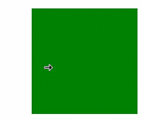
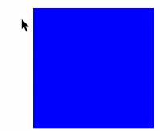
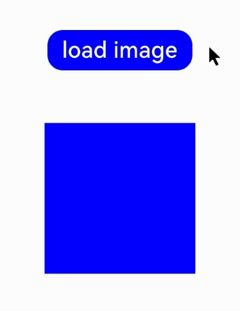

# Class (CursorController)
<!--Kit: ArkUI-->
<!--Subsystem: ArkUI-->
<!--Owner: @yihao-lin-->
<!--Designer: @piggyguy-->
<!--Tester: @songyanhong-->
<!--Adviser: @Brilliantry_Rui-->

提供光标样式设置的能力。

> **说明：**
>
> - 本模块同时支持ArkTS-Dyn、ArkTS-Sta。
>
> - 本模块首批接口从API version 10开始支持。后续版本的新增接口，采用上角标单独标记接口的起始版本。
>
> - 本Class首批接口从API version 12开始支持。
>
> - 以下API需先使用UIContext中的[getCursorController()](arkts-apis-uicontext-uicontext.md#getcursorcontroller12)方法获取CursorController实例，再通过此实例调用对应方法。

## restoreDefault<sup>12+</sup>

restoreDefault(): void

恢复默认的光标样式。

**原子化服务API：** 从API version 12开始，该接口支持在原子化服务中使用。

**系统能力：** SystemCapability.ArkUI.ArkUI.Full

**ArkTS-Dyn起始版本：** 12

**ArkTS-Sta起始版本：** 23

**示例：**

当光标移出绿框时，通过CursorController的restoreDefault方法恢复默认光标样式。

```ts
import { pointer } from '@kit.InputKit';
import { UIContext, CursorController } from '@kit.ArkUI';

@Entry
@Component
struct CursorControlExample {
  @State text: string = '';
  cursorCustom: CursorController = this.getUIContext().getCursorController();

  build() {
    Column() {
      Row().height(200).width(200).backgroundColor(Color.Green).position({x: 150 ,y:70})
        .onHover((flag) => {
          if (flag) {
            this.cursorCustom.setCursor(pointer.PointerStyle.EAST);
          } else {
            console.info("restoreDefault");
            this.cursorCustom.restoreDefault();
          }
        })
    }.width('100%')
  }
}
```


## setCursor<sup>12+</sup>

setCursor(value: PointerStyle): void

更改当前的鼠标光标样式。

> **说明：**
>
> 该接口调用后不会立即生效，而是在下一帧改变鼠标光标样式。

**原子化服务API：** 从API version 12开始，该接口支持在原子化服务中使用。

**系统能力：** SystemCapability.ArkUI.ArkUI.Full

**ArkTS-Dyn起始版本：** 12

**ArkTS-Sta起始版本：** 23

**参数：**

| 参数名     | 类型                                       | 必填   | 说明      |
| ------- | ---------------------------------------- | ---- | ------- |
| value | [PointerStyle](arkts-apis-uicontext-t.md#pointerstyle12) | 是    | 光标样式。 |

**示例：**

当光标进入蓝框时，通过CursorController的setCursor方法修改光标样式为PointerStyle.WEST。

```ts
import { pointer } from '@kit.InputKit';
import { UIContext, CursorController } from '@kit.ArkUI';

@Entry
@Component
struct CursorControlExample {
  @State text: string = '';
  cursorCustom: CursorController = this.getUIContext().getCursorController();

  build() {
    Column() {
      Row().height(200).width(200).backgroundColor(Color.Blue).position({x: 100 ,y:70})
        .onHover((flag) => {
          if (flag) {
            this.cursorCustom.setCursor(pointer.PointerStyle.WEST);
          } else {
            this.cursorCustom.restoreDefault();
          }
        })
    }.width('100%')
  }
}
```


## setCustomCursor

ArkTS-Dyn: setCustomCursor(value: image.PixelMap, focusX?: number, focusY?: number): void

ArkTS-Sta: setCustomCursor(value: image.PixelMap, focusX?: int, focusY?: int): void

设置自定义鼠标光标样式。

> **说明：**
>
> 该接口调用后不会立即生效，而是在下一帧改变鼠标光标样式。

**原子化服务API：** 从API版本26.0.0开始，该接口支持在原子化服务中使用。

**系统能力：** SystemCapability.ArkUI.ArkUI.Full

**模型约束：** 此接口仅可在Stage模型下使用。

**ArkTS-Dyn起始版本：** 26.0.0
 
**ArkTS-Sta起始版本：** 26.0.0

**参数：**

| 参数名    | 类型                              | 必填   | 说明                                     |
| ------- | ------------------------------- | ---- | -------------------------------------- |
| value   | [image.PixelMap](../apis-image-kit/arkts-apis-image-PixelMap.md) | 是    | 自定义鼠标光标样式的像素图。最大尺寸为256*256px，超过该尺寸时设置自定义鼠标光标样式不生效。                             |
| focusX  | ArkTS-Dyn: number</br>ArkTS-Sta: int  | 否    | 自定义光标的焦点X坐标。焦点指的是鼠标实际点击的位置，焦点设置为(0, 0)时表示图片左上角为实际点击位置。<br/>默认值：0<br/>单位：px<br/>取值范围：[0, +∞)              |
| focusY  | ArkTS-Dyn: number</br>ArkTS-Sta: int  | 否    | 自定义光标的焦点Y坐标。<br/>默认值：0<br/>单位：px<br/>取值范围：[0, +∞)                                         |

**示例：**

该示例通过调用[setCustomCursor](#setcustomcursor)接口，设置自定义鼠标光标样式。

从API版本26.0.0开始，新增setCustomCursor接口。

ArkTS-Dyn示例：
```ts
import { image } from '@kit.ImageKit';
import { CursorController } from '@kit.ArkUI';
import { BusinessError } from '@kit.BasicServicesKit';

@Entry
@Component
struct CustomCursorExample {
  cursorController: CursorController = this.getUIContext().getCursorController();
  @State pixelMap: image.PixelMap | undefined = undefined;

  async loadPixelMapFromRawFile(): Promise<void> {
    try {
      // 1.获取资源管理器，添加空值检查
      const uiContext = this.getUIContext();
      if (!uiContext) {
        console.error('UIContext is undefined');
        return;
      }
      const context = uiContext.getHostContext();
      if (!context) {
        console.error('HostContext is undefined');
        return;
      }
      const resourceMgr = context.resourceManager;
      if (!resourceMgr) {
        console.error('ResourceManager is undefined');
        return;
      }
      // 2.读取rawfile中的图片文件
      const fileData: Uint8Array = await resourceMgr.getRawFileContent('cursor.png');
      const buffer = fileData.buffer.slice(0);
      // 3.创建ImageSource
      const imageSource = image.createImageSource(buffer);
      // 4.创建PixelMap（可以指定期望的尺寸）
      const pixelMap = await imageSource.createPixelMap({
        desiredSize: { width: 32, height: 32 }
      });
      this.pixelMap = pixelMap;
      console.info('Custom cursor loaded successfully');
    } catch (error) {
      let err = error as BusinessError;
      console.error(`Failed to load cursor: ${err.code}, ${err.message}`);
    }
  }

  build() {
    Column() {
      Button('load image')
        .width("40%")
        .height('7%')
        .fontSize('30vp')
        .margin(70)
        .backgroundColor(Color.Blue)
        .onClick(() => {
          // 点击按钮加载PixelMap
          this.loadPixelMapFromRawFile();
        })
      Row()
        .height(200)
        .width(200)
        .backgroundColor(Color.Blue)
        .onHover((isHover: boolean) => {
          if (isHover && this.pixelMap != undefined) {
            // 设置自定义鼠标光标样式，焦点位置设为(16, 16)，即光标中心
            this.cursorController.setCustomCursor(this.pixelMap, 16, 16);
          } else {
            this.cursorController.restoreDefault();
          }
        })
    }
    .justifyContent(FlexAlign.Center)
    .alignItems(HorizontalAlign.Center)
    .width('100%')
    .height('100%')
  }

  aboutToDisappear(): void {
    // 释放PixelMap资源
    if (this.pixelMap) {
      this.pixelMap.release();
      this.pixelMap = undefined;
    }
    this.cursorController.restoreDefault();
  }
}
```

ArkTS-Sta示例：
```ts
import { BusinessError } from '@kit.BasicServicesKit';
import { Button, ClickEvent, Color, Column, Component, Entry, FlexAlign, HorizontalAlign, Margin, Row, State } from '@kit.ArkUI';
import { CursorController } from '@ohos.arkui.UIContext';
import { image } from '@kit.ImageKit';

@Entry
@Component
struct CustomCursorExample {
  cursorController: CursorController = this.getUIContext().getCursorController();
  @State pixelMap: image.PixelMap | undefined = undefined;

  async loadPixelMapFromRawFile(): Promise<void> {
    try {
      // 1.获取资源管理器，添加空值检查
      const uiContext = this.getUIContext();
      if (!uiContext) {
        console.error('UIContext is undefined');
        return;
      }
      const context = uiContext.getHostContext();
      if (!context) {
        console.error('HostContext is undefined');
        return;
      }
      const resourceMgr = context.resourceManager;
      if (!resourceMgr) {
        console.error('ResourceManager is undefined');
        return;
      }
      // 2.读取rawfile中的图片文件
      const fileData: Uint8Array = await resourceMgr.getRawFileContent('cursor.png');
      const buffer = fileData.buffer.slice(0);
      // 3.创建ImageSource
      const imageSource = image.createImageSource(buffer);
      // 4.创建PixelMap（可以指定期望的尺寸）
      const pixelMap = await imageSource?.createPixelMap({
        desiredSize: { width: 32, height: 32 }
      });
      this.pixelMap = pixelMap;
      console.info('Custom cursor loaded successfully');
    } catch (error) {
      let err = error as BusinessError;
      console.error(`Failed to load cursor: ${err.code}, ${err.message}`);
    }
  }

  build() {
    Column() {
      Button('load image')
        .width("40%")
        .height('7%')
        .fontSize('30vp')
        .margin(70)
        .backgroundColor(Color.Blue)
        .onClick(() => {
          // 点击按钮加载PixelMap
          this.loadPixelMapFromRawFile();
        })
      Row()
        .height(200)
        .width(200)
        .backgroundColor(Color.Blue)
        .onHover((isHover: boolean) => {
          if (isHover && this.pixelMap != undefined) {
            // 设置自定义鼠标光标样式，焦点位置设为(16, 16)，即光标中心
            this.cursorController.setCustomCursor(this.pixelMap as image.PixelMap, 16, 16);
          } else {
            this.cursorController.restoreDefault();
          }
        })
    }
    .justifyContent(FlexAlign.Center as FlexAlign)
    .alignItems(HorizontalAlign.Center)
    .width('100%')
    .height('100%')
  }

  aboutToDisappear(): void {
    // 释放PixelMap资源
    if (this.pixelMap) {
      this.pixelMap?.release();
      this.pixelMap = undefined;
    }
    this.cursorController.restoreDefault();
  }
}
```

