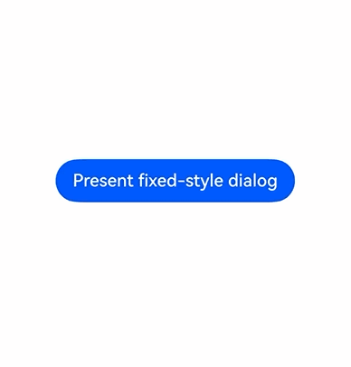
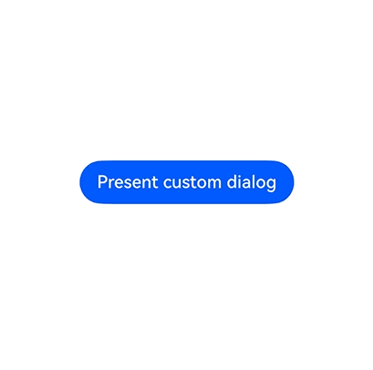
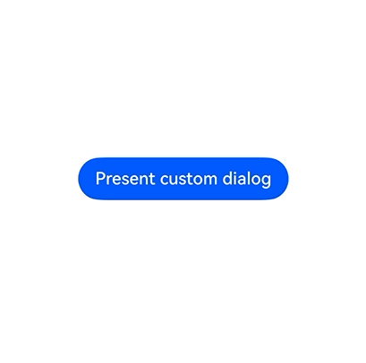

# Class (DialogPresenter)
<!--Kit: ArkUI-->
<!--Subsystem: ArkUI-->
<!--Owner: @houguobiao-->
<!--Designer: @houguobiao-->
<!--Tester: @lxl007-->
<!--Adviser: @Brilliantry_Rui-->

提供统一的Dialog API，可创建并显示固定样式弹出框、自定义样式弹出框，并支持更新与关闭弹出框。适用于应用中需要弹出提示、确认、选择等弹出框交互的场景。

> **说明：**
>
> 以下API需先使用UIContext中的[getDialogPresenter()](arkts-apis-uicontext-uicontext.md#getdialogpresenter)方法获取到DialogPresenter对象，再通过该对象调用对应方法。

**起始版本：** 26.1.0

## present

present(options?: dialog.DialogStyleOptions): Promise&lt;DialogResult&gt;

提供一个固定样式的弹出框，返回对话结果。使用Promise异步回调。适用于使用系统统一样式展示提示或确认信息的场景。

**原子化服务API：** 从API版本26.1.0开始，该接口支持在原子化服务中使用。

**模型约束：** 此接口仅可在Stage模型下使用。

**系统能力：** SystemCapability.ArkUI.ArkUI.Full

**参数：**

| 参数名  | 类型                                                         | 必填 | 说明           |
| ------- | ------------------------------------------------------------ | ---- | -------------- |
| options | [dialog.DialogStyleOptions](js-apis-dialog.md#dialogstyleoptions) | 否   | 固定样式弹出框的配置选项，用于配置弹出框的标题、副标题、消息、按钮及工作表项等内容。弹出框样式（背景、对齐、蒙层、避让等）继承自dialog.DialogBaseOptions。<br>**说明：** [dialog.DialogBaseOptions](js-apis-dialog.md#dialogbaseoptions)中的isModal与showInSubWindow不能同时设置为true。 |

**返回值：**

| 类型                                             | 说明                                   |
| ------------------------------------------------ | -------------------------------------- |
| Promise&lt;[DialogResult](js-apis-dialog.md#dialogresult)&gt; | Promise对象，返回对话结果，包含弹出框ID。 |

**错误码：**

以下错误码的详细介绍请参见[通用错误码](../errorcode-universal.md)和[弹窗错误码](errorcode-promptAction.md)。

| 错误码ID | 错误信息                                                     |
| -------- | ------------------------------------------------------------ |
| 401      | Parameter error. Possible causes: 1. Mandatory parameters are left unspecified; 2. Incorrect parameter types; 3. Parameter verification failed. |
| 103306   | The dialog cannot be opened due to node mount failure.       |
| 103308   | The dialog cannot be opened due to subwindow create failure. |

**示例：**

该示例通过调用present接口，展示固定样式弹出框并通过Promise获取对话结果的功能。

从API版本26.1.0开始，新增[present](#present)接口。

```ts
import { DialogPresenter, DialogResult } from '@kit.ArkUI';
import { BusinessError } from '@kit.BasicServicesKit';

@Entry
@Component
struct Index {
  private ctx: UIContext = this.getUIContext();
  private dialogPresenter: DialogPresenter = this.ctx.getDialogPresenter();

  build() {
    Column() {
      Button('Present fixed-style dialog')
        .onClick(() => {
          // 弹出固定样式弹出框，配置标题、消息和按钮
          this.dialogPresenter.present({
            title: 'Tips',
            message: { content: 'This is a fixed-style dialog' },
            buttons: [
              {
                value: 'Cancel',
                action: () => {
                  console.info('Cancel button clicked');
                }
              },
              {
                value: 'OK',
                action: () => {
                  console.info('OK button clicked');
                }
              }
            ]
          })
            .then((result: DialogResult) => {
              console.info('present success, dialogId: ' + result.dialogId);
            })
            .catch((error: BusinessError) => {
              console.error(`present error code is ${error.code}, message is ${error.message}`);
            })
        })
    }.width('100%').height('100%').justifyContent(FlexAlign.Center)
  }
}
```



## present

present(content: CustomBuilder \| CustomBuilderWithId \| ComponentContent&lt;Object&gt;, options?: dialog.DialogCustomOptions): Promise&lt;DialogResult&gt;

提供一个自定义样式的弹出框，其中包含所提供的内容，返回对话结果，使用Promise异步回调。适用于需要自定义弹出框内容、布局和样式的场景。

**原子化服务API：** 从API版本26.1.0开始，该接口支持在原子化服务中使用。

**模型约束：** 此接口仅可在Stage模型下使用。

**系统能力：** SystemCapability.ArkUI.ArkUI.Full

**参数：**

| 参数名  | 类型                                                         | 必填 | 说明               |
| ------- | ------------------------------------------------------------ | ---- | ------------------ |
| content | [CustomBuilder](arkui-ts/ts-types.md#custombuilder8) \| [CustomBuilderWithId](arkts-apis-uicontext-t.md#custombuilderwithid18) \| [ComponentContent](./js-apis-arkui-ComponentContent.md)&lt;Object&gt; | 是   | 自定义弹出框内容，支持三种类型：CustomBuilder（自定义内容的生成器函数）、CustomBuilderWithId（支持传入ID的生成器函数）、ComponentContent（支持状态驱动更新的组件内容）。 |
| options | [dialog.DialogCustomOptions](js-apis-dialog.md#dialogcustomoptions) | 否   | 自定义弹出框的配置选项，用于配置弹出框的背景、对齐、蒙层、避让等样式，继承自dialog.DialogBaseOptions。 |

**返回值：**

| 类型                                             | 说明                                   |
| ------------------------------------------------ | -------------------------------------- |
| Promise&lt;[DialogResult](js-apis-dialog.md#dialogresult)&gt; | Promise对象，返回对话结果，包含弹出框ID。 |

**错误码：**

以下错误码的详细介绍请参见[通用错误码](../errorcode-universal.md)和[弹窗错误码](errorcode-promptAction.md)。

| 错误码ID | 错误信息                                                     |
| -------- | ------------------------------------------------------------ |
| 401      | Parameter error. Possible causes: 1. Mandatory parameters are left unspecified; 2. Incorrect parameter types; 3. Parameter verification failed. |
| 103301   | Dialog content error. The ComponentContent is incorrect.     |
| 103302   | Dialog content already exist. The ComponentContent has already been opened. |
| 103306   | The dialog cannot be opened due to node mount failure.       |
| 103308   | The dialog cannot be opened due to subwindow create failure. |

**示例：**

该示例通过调用present、update和dismiss接口，展示了弹出、更新以及关闭自定义弹出框的功能。

从API版本26.1.0开始，新增[present](#present)、[update](#update)、[dismiss](#dismiss)接口。

```ts
import { ComponentContent, DialogPresenter, DialogResult, DialogBaseAlignment } from '@kit.ArkUI';
import { BusinessError } from '@kit.BasicServicesKit';

class Params {
  text: string = '';
  constructor(text: string) {
    this.text = text;
  }
}

@Builder
function buildText(params: Params) {
  Column({ space: 20 }) {
    Text(params.text)
      .fontSize(30)
      .fontWeight(FontWeight.Bold)
      .margin({ bottom: 36 })
    Button('Update dialog')
      .onClick(() => {
        dialogPresenter?.update(contentNode, {
          maskColor: Color.Pink,
          alignment: DialogBaseAlignment.CENTER_END,
          offset: { dx: 0, dy: 30}
        })
          .then(() => {
            console.info('update success');
          })
          .catch((error: BusinessError) => {
            console.error(`update error code is ${error.code}, message is ${error.message}`);
          })
      })
    Button('Dismiss dialog')
      .onClick(() => {
        dialogPresenter?.dismiss(contentNode)
          .then(() => {
            console.info('dismiss success');
          })
          .catch((error: BusinessError) => {
            console.error(`dismiss error code is ${error.code}, message is ${error.message}`);
          })
      })
  }
}

let dialogPresenter: DialogPresenter | null = null;
let contentNode: ComponentContent<Object> | null = null;

@Entry
@Component
struct Index {
  @State message: string = 'custom dialog';

  aboutToAppear(): void {
    dialogPresenter = this.getUIContext().getDialogPresenter();
    contentNode = new ComponentContent(this.getUIContext(), wrapBuilder(buildText), new Params(this.message));
  }

  build() {
    Column({ space: 10 }) {
      Button('Present custom dialog')
        .onClick(() => {
          dialogPresenter?.present(contentNode, {
            isModal: true
          })
            .then((result: DialogResult) => {
              console.info('present success, dialogId: ' + result.dialogId);
            })
            .catch((error: BusinessError) => {
              console.error(`present error code is ${error.code}, message is ${error.message}`);
            })
        })
    }.width('100%').height('100%').justifyContent(FlexAlign.Center)
  }
}
```



## update

update(content: ComponentContent&lt;Object&gt;, options?: dialog.DialogBaseOptions): Promise&lt;void&gt;

更新已弹出的自定义弹出框，无返回结果。使用Promise异步回调。适用于弹出框已弹出后需要动态更新其样式或位置的交互场景。

**原子化服务API：** 从API版本26.1.0开始，该接口支持在原子化服务中使用。

**模型约束：** 此接口仅可在Stage模型下使用。

**系统能力：** SystemCapability.ArkUI.ArkUI.Full

**参数：**

| 参数名  | 类型                                                         | 必填 | 说明                          |
| ------- | ------------------------------------------------------------ | ---- | ----------------------------- |
| content | [ComponentContent](./js-apis-arkui-ComponentContent.md)&lt;Object&gt; | 是   | 用于标识弹出框的组件内容。     |
| options | [dialog.DialogBaseOptions](js-apis-dialog.md#dialogbaseoptions) | 否   | 要更新的弹出框选项。目前仅支持更新alignment、offset、autoCancel、maskColor。  |

**返回值：**

| 类型                | 说明                |
| ------------------- | ------------------- |
| Promise&lt;void&gt; | Promise对象，无返回结果。 |

**错误码：**

以下错误码的详细介绍请参见[通用错误码](../errorcode-universal.md)和[弹窗错误码](errorcode-promptAction.md)。

| 错误码ID | 错误信息                                                     |
| -------- | ------------------------------------------------------------ |
| 401      | Parameter error. Possible causes: 1. Mandatory parameters are left unspecified; 2. Incorrect parameter types; 3. Parameter verification failed. |
| 103301   | Dialog content error. The ComponentContent is incorrect.     |
| 103303   | Dialog content not found. The ComponentContent cannot be found. |

**示例：**

请参考[present](#present)的示例。

## dismiss

dismiss(target: number \| ComponentContent&lt;Object&gt;): Promise&lt;void&gt;

关闭弹出框，无返回结果。使用Promise异步回调。适用于在用户完成交互后关闭弹出框的场景。

接受弹出框ID（由[present](#present)返回的[DialogResult](js-apis-dialog.md#dialogresult)中的dialogId）或[ComponentContent](./js-apis-arkui-ComponentContent.md)引用作为target，关闭对应的弹出框。

**原子化服务API：** 从API版本26.1.0开始，该接口支持在原子化服务中使用。

**模型约束：** 此接口仅可在Stage模型下使用。

**系统能力：** SystemCapability.ArkUI.ArkUI.Full

**参数：**

| 参数名 | 类型                                                         | 必填 | 说明                                   |
| ------ | ------------------------------------------------------------ | ---- | -------------------------------------- |
| target | number \| [ComponentContent](./js-apis-arkui-ComponentContent.md)&lt;Object&gt; | 是   | 要关闭的弹出框ID或组件内容。            |

**返回值：**

| 类型                | 说明                |
| ------------------- | ------------------- |
| Promise&lt;void&gt; | Promise对象，无返回结果。 |

**错误码：**

以下错误码的详细介绍请参见[通用错误码](../errorcode-universal.md)和[弹窗错误码](errorcode-promptAction.md)。

| 错误码ID | 错误信息                                                     |
| -------- | ------------------------------------------------------------ |
| 401      | Parameter error. Possible causes: 1. Mandatory parameters are left unspecified; 2. Incorrect parameter types; 3. Parameter verification failed. |
| 103301   | Dialog content error. The ComponentContent is incorrect.     |
| 103303   | Dialog content not found. The ComponentContent cannot be found. |

**示例：**

该示例通过调用dismiss接口，展示了通过弹出框ID关闭弹出框的功能。弹出框的弹出可参考[present](#present)的示例。

从API版本26.1.0开始，新增[present](#present)、[dismiss](#dismiss)接口。

```ts
import { DialogPresenter, DialogResult } from '@kit.ArkUI';
import { BusinessError } from '@kit.BasicServicesKit';


@Entry
@Component
struct Index {
  @State message: string = 'custom dialog';
  dialogPresenter: DialogPresenter | null = this.getUIContext().getDialogPresenter();
  dialogId: number = 0;

  @Builder
  customDialogComponent() {
    Column() {
      Text('A dialog is open').fontSize(20)
      Row({ space: 10 }) {
        Button('Close dialog').onClick(() => {
          this.getUIContext().getDialogPresenter().dismiss(this.dialogId)
            .then(() => {
              console.info('dismiss success');
            })
            .catch((error: BusinessError) => {
              console.error(`dismiss error code is ${error.code}, message is ${error.message}`);
            })
        })
      }
    }.height(150).padding(20).justifyContent(FlexAlign.SpaceBetween)
  }

  build() {
    Column({ space: 10 }) {
      Button('Present custom dialog')
        .onClick(() => {
          this.dialogPresenter?.present(() => {this.customDialogComponent();},
            {
              isModal: true,
              backgroundColor: Color.Pink,
              backgroundBlurStyle: BlurStyle.NONE
            })
            .then((result: DialogResult) => {
              this.dialogId = result.dialogId;
              console.info('present success, dialogId: ' + result.dialogId);
            })
            .catch((error: BusinessError) => {
              console.error(`present error code is ${error.code}, message is ${error.message}`);
            })
        })
    }.width('100%').height('100%').justifyContent(FlexAlign.Center)
  }
}
```


