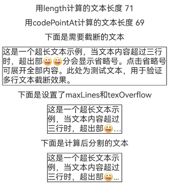
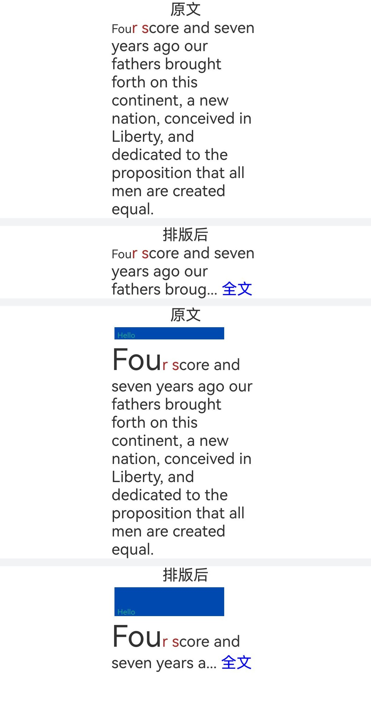

# Class (MeasureUtils)
<!--Kit: ArkUI-->
<!--Subsystem: ArkUI-->
<!--Owner: @hddgzw-->
<!--Designer: @pssea-->
<!--Tester: @jiaoaozihao-->
<!--Adviser: @Brilliantry_Rui-->

提供文本宽度、高度等相关计算。

> **说明：**
>
> - 本模块首批接口从API version 10开始支持。后续版本的新增接口，采用上角标单独标记接口的起始版本。
>
> - 本Class首批接口从API version 12开始支持。
>
> - 以下API需先使用UIContext中的[getMeasureUtils()](arkts-apis-uicontext-uicontext.md#getmeasureutils12)方法获取MeasureUtils实例，再通过此实例调用对应方法。
>
> - 如需更多测算文本参数，建议使用图形对应测算接口[Paragraph](../apis-arkgraphics2d/js-apis-graphics-text.md#paragraph)接口。
>
> - 调用文本计算接口时，不推荐同时用[ApplicationContext.setFontSizeScale](../apis-ability-kit/js-apis-inner-application-applicationContext.md#applicationcontextsetfontsizescale13)设置应用字体大小缩放比例。为了确保时序正确性，建议开发者自行监听字体缩放变化，以保证测算结果的准确性。
>
> - 在测算裁剪后的文本时，由于某些Unicode字符（如emoji）的码位长度大于1，直接按字符串长度裁剪会导致不准确的结果。建议基于Unicode码点进行迭代处理，避免错误截断字符，确保测算结果准确，请参考[measureTextSize方法的示例2](#measuretextsize12)。

## measureText<sup>12+</sup>

measureText(options: MeasureOptions): number

计算指定文本作为单行文本显示时的宽度。如果文本包含多行（由换行符`\n`分隔），则返回其中最长的行的宽度。

> **说明：**
>
> measureText接口的计算结果始终是单行文本的宽度，入参options中配置的布局约束（如constraintWidth、maxLines）对measureText的结果没有影响。如果需要计算布局约束下的宽度，请使用[measureTextSize](#measuretextsize12)方法。

**原子化服务API：** 从API version 12开始，该接口支持在原子化服务中使用。

**系统能力：** SystemCapability.ArkUI.ArkUI.Full

**参数：**

| 参数名     | 类型                              | 必填   | 说明        |
| ------- | ------------------------------- | ---- | --------- |
| options | [MeasureOptions](js-apis-measure.md#measureoptions) | 是    | 被计算文本描述信息。 |

**返回值：**

| 类型          | 说明       |
| ------------  | --------- |
| number        | 文本宽度。<br/>**说明:**<br/>浮点数会向上取整。<br/>单位：px |


**示例：** 

通过MeasureUtils的measureText方法获取"Hello World"文字的宽度。

```ts
import { MeasureUtils } from '@kit.ArkUI';

@Entry
@Component
struct Index {
  @State uiContext: UIContext = this.getUIContext();
  @State uiContextMeasure: MeasureUtils = this.uiContext.getMeasureUtils();
  @State textWidth: number = this.uiContextMeasure.measureText({
    textContent: "Hello World",
    fontSize: '50px'
  });

  build() {
    Row() {
      Column() {
        Text(`The width of 'Hello World': ${this.textWidth}`)
      }
      .width('100%')
    }
    .height('100%')
  }
}
```

## measureTextSize<sup>12+</sup>

measureTextSize(options: MeasureOptions): SizeOptions

计算指定文本单行布局下的宽度和高度。

**原子化服务API：** 从API version 12开始，该接口支持在原子化服务中使用。

**系统能力：** SystemCapability.ArkUI.ArkUI.Full

**参数：**

| 参数名     | 类型                              | 必填   | 说明        |
| ------- | ------------------------------- | ---- | --------- |
| options | [MeasureOptions](js-apis-measure.md#measureoptions) | 是    | 被计算文本描述信息。 |

**返回值：**

| 类型          | 说明       |
| ------------  | --------- |
| [SizeOptions](arkui-ts/ts-types.md#sizeoptions)   | 返回文本所占布局宽度和高度。<br/>**说明:**<br/>没有传参constraintWidth的情况下，文本宽度返回值浮点数会向上取整。<br/>文本宽度以及高度返回值单位均为px。 |


**示例1：** 

通过MeasureUtils的measureTextSize方法获取"Hello World"文字的宽度和高度。

```ts
import { MeasureUtils } from '@kit.ArkUI';

@Entry
@Component
struct Index {
  @State uiContext: UIContext = this.getUIContext();
  @State uiContextMeasure: MeasureUtils = this.uiContext.getMeasureUtils();
  textSize: SizeOptions = this.uiContextMeasure.measureTextSize({
    textContent: "Hello World",
    fontSize: '50px'
  });
  build() {
    Row() {
      Column() {
        Text(`The width of 'Hello World': ${this.textSize.width}`)
        Text(`The height of 'Hello World': ${this.textSize.height}`)
      }
      .width('100%')
    }
    .height('100%')
  }
}
```

**示例2：** 

通过MeasureUtils的measureTextSize方法和unicode码点计算，手动实现文本截断。与设置[maxLines](./arkui-ts/ts-basic-components-text.md#maxlines)、[textOverflow](./arkui-ts/ts-basic-components-text.md#textoverflow)实现同样的效果。

```ts
@Entry
@Component
struct TextDemo {
  @State isExpanded: boolean = false;
  @State displayedText: string = '';
  @State defaultFontSize: number = 16;
  @State textWidth: number = 150;
  @State numLength: number = 0;
  @State numUnicode: number = 0;
  private fullText: string =
    '这是一个超长文本示例，当文本内容超过三行时，超出部😀😀分会显示省略号。点击省略号可展开全部内容。此处为测试文本，用于验证多行文本截断效果。';
  private maxLines: number = 3;

  aboutToAppear() {
    const codePoints = this.getCodePoints(this.fullText);
    this.numLength = this.fullText.length;
    this.numUnicode = codePoints.length;
    this.calculateText(this.maxLines, this.fullText);
  }

  getCodePoints(text: string): number[] { // 使用codePointAt分割文本
    const codePoints: number[] = [];
    let index = 0;
    while (index < text.length) {
      const codePoint = text.codePointAt(index);
      if (codePoint === undefined) {
        break;
      }
      codePoints.push(codePoint);
      index += codePoint > 0xFFFF ? 2 : 1; // 处理四字节字符
    }
    return codePoints;
  }

  lastUnicodeLength(str: string) { // 获得字符串最后一个字符的unicode长度
    if (!str || str.length < 1) {
      return 0;
    }
    if (str.length < 2) {
      return 1;
    }
    let lastCodePoint = str.codePointAt(str.length - 2);
    if (lastCodePoint == undefined) {
      return 1;
    }
    let lastStr = String.fromCodePoint(lastCodePoint);
    return lastStr.length;
  }

  calculateText(maxLines: number, fullText: string) { // 计算文本是否需要截断
    const noMaxLinesSize = this.getUIContext().getMeasureUtils().measureTextSize({
      textContent: fullText,
      constraintWidth: this.textWidth
    });
    const hasMaxLinesSize = this.getUIContext().getMeasureUtils().measureTextSize({
      textContent: fullText,
      constraintWidth: this.textWidth,
      maxLines: this.maxLines
    });

    this.displayedText = this.displayedText = this.fullText;
    if (Number(noMaxLinesSize.height) > Number(hasMaxLinesSize.height)) { // 存在截断
      while (this.displayedText.length > 0) {
        this.displayedText =
          this.displayedText.slice(0,
            this.displayedText.length - this.lastUnicodeLength(this.displayedText)); // 删掉几个字
        let textAfterCut = this.displayedText + "…"; // 加上省略号
        let sizeAfterCut = this.getUIContext().getMeasureUtils().measureTextSize({
          textContent: textAfterCut,
          constraintWidth: this.textWidth
        });
        if (Number(sizeAfterCut.height) <= Number(hasMaxLinesSize.height)) {
          break;
        } else {
          console.info("displayedText: " + this.displayedText);
        }
      }
      this.displayedText = this.displayedText + "…";
    }
  }

  build() {
    Column({ space: 10 }) {
      Text(`用length计算的文本长度 ${this.numLength}`)
      Text(`用codePointAt计算的文本长度 ${this.numUnicode}`)
      Text('下面是需要截断的文本')
      Text(this.fullText)
        .borderWidth(1)

      Text('下面是设置了maxLines和texOverflow')
      Text(this.fullText)
        .maxLines(this.maxLines)
        .textOverflow({ overflow: TextOverflow.Ellipsis })
        .width(this.textWidth)
        .borderWidth(1)

      Text('下面是计算后分割的文本')
      Text(this.displayedText)
        .width(this.textWidth)
        .borderWidth(1)
    }
    .padding(20)
  }
}
```



## getParagraphs<sup>20+</sup>

getParagraphs(styledString: StyledString, options?: TextLayoutOptions): Array\<Paragraph\>

将属性字符串根据文本布局选项转换成对应的[Paragraph](../apis-arkgraphics2d/js-apis-graphics-text.md#paragraph)数组。

**系统能力：** SystemCapability.ArkUI.ArkUI.Full

**参数：**

| 参数名 | 类型   | 必填 | 说明           |
| ----- | ------ | ---- | -------------- |
| styledString | [StyledString](arkui-ts/ts-universal-styled-string.md#styledstring) | 是   | 待转换的属性字符串。|
| options | [TextLayoutOptions](arkui-ts/ts-text-common.md#textlayoutoptions对象说明20) | 否 | 文本布局选项。|

**返回值：**

| 类型     | 说明        |
| ------ | --------- |
| Array<[Paragraph](../apis-arkgraphics2d/js-apis-graphics-text.md#paragraph)> | [Paragraph](../apis-arkgraphics2d/js-apis-graphics-text.md#paragraph)的数组。 |

**示例：** 

通过MeasureUtils的getParagraphs方法测算文本，当内容超出最大显示行数的时候，截断文本显示并展示“...全文”的效果。

``` typescript
import { LengthMetrics } from '@kit.ArkUI';
import { drawing } from '@kit.ArkGraphics2D';

class MyCustomSpan extends CustomSpan {
  constructor(word: string, width: number, height: number, context: UIContext) {
    super();
    this.word = word;
    this.width = width;
    this.height = height;
    this.context = context;
  }

  onMeasure(measureInfo: CustomSpanMeasureInfo): CustomSpanMetrics {
    return { width: this.width, height: this.height };
  }

  onDraw(context: DrawContext, options: CustomSpanDrawInfo) {
    let canvas = context.canvas;
    const brush = new drawing.Brush();
    brush.setColor({
      alpha: 255,
      red: 0,
      green: 74,
      blue: 175
    });
    const font = new drawing.Font();
    font.setSize(25);
    const textBlob = drawing.TextBlob.makeFromString(this.word, font, drawing.TextEncoding.TEXT_ENCODING_UTF8);
    canvas.attachBrush(brush);
    canvas.drawRect({
      left: options.x + 10,
      right: options.x + this.context.vp2px(this.width) - 10,
      top: options.lineTop + 10,
      bottom: options.lineBottom - 10
    });
    brush.setColor({
      alpha: 255,
      red: 23,
      green: 169,
      blue: 141
    });
    canvas.attachBrush(brush);
    canvas.drawTextBlob(textBlob, options.x + 20, options.lineBottom - 15);
    canvas.detachBrush();
  }

  setWord(word: string) {
    this.word = word;
  }

  width: number = 160;
  word: string = "drawing";
  height: number = 10;
  context: UIContext;
}

@Entry
@Component
struct Index {
  str: string =
    "Four score and seven years ago our fathers brought forth on this continent, a new nation, conceived in Liberty, and dedicated to the proposition that all men are created equal.";
  mutableStr2 = new MutableStyledString(this.str, [
    {
      start: 0,
      length: 3,
      styledKey: StyledStringKey.FONT,
      styledValue: new TextStyle({ fontSize: LengthMetrics.px(20) })
    },
    {
      start: 3,
      length: 3,
      styledKey: StyledStringKey.FONT,
      styledValue: new TextStyle({ fontColor: Color.Brown })
    }
  ]);

  // 测算属性字符串在指定宽度下能显示的行数
  getLineNum(styledString: StyledString, width: LengthMetrics) {
    let paragraphArr = this.getUIContext().getMeasureUtils().getParagraphs(styledString, { constraintWidth: width });
    let res = 0;
    for (let i = 0; i < paragraphArr.length; ++i) {
      res += paragraphArr[i].getLineCount();
    }
    return res;
  }

  // 测算属性字符串显示maxLines行时最多可以显示的字数
  getCorrectIndex(styledString: MutableStyledString, maxLines: number, width: LengthMetrics) {
    let low = 0;
    let high = styledString.length - 1;
    // 使用二分查找
    while (low <= high) {
      let mid = (low + high) >> 1;
      console.info("demo: get " + low + " " + high + " " + mid);
      let moreStyledString = new MutableStyledString("... 全文", [{
        start: 4,
        length: 2,
        styledKey: StyledStringKey.FONT,
        styledValue: new TextStyle({ fontColor: Color.Blue })
      }]);
      moreStyledString.insertStyledString(0, styledString.subStyledString(0, mid));
      let lineNum = this.getLineNum(moreStyledString, LengthMetrics.px(500));
      if (lineNum <= maxLines) {
        low = mid + 1;
      } else {
        high = mid - 1;
      }
    }
    return high;
  }

  mutableStrAllContent = new MutableStyledString(this.str, [
    {
      start: 0,
      length: 3,
      styledKey: StyledStringKey.FONT,
      styledValue: new TextStyle({ fontSize: LengthMetrics.px(40) })
    },
    {
      start: 3,
      length: 3,
      styledKey: StyledStringKey.FONT,
      styledValue: new TextStyle({ fontColor: Color.Brown })
    }
  ]);
  customSpan1: MyCustomSpan = new MyCustomSpan("Hello", 120, 10, this.getUIContext());
  mutableStrAllContent2 = new MutableStyledString(this.str, [
    {
      start: 0,
      length: 3,
      styledKey: StyledStringKey.FONT,
      styledValue: new TextStyle({ fontSize: LengthMetrics.px(100) })
    },
    {
      start: 3,
      length: 3,
      styledKey: StyledStringKey.FONT,
      styledValue: new TextStyle({ fontColor: Color.Brown })
    }
  ]);
  controller: TextController = new TextController();
  controller2: TextController = new TextController();
  textController: TextController = new TextController();
  textController2: TextController = new TextController();

  aboutToAppear() {
    this.mutableStrAllContent2.insertStyledString(0, new StyledString(this.customSpan1));
    this.mutableStr2.insertStyledString(0, new StyledString(this.customSpan1));
  }

  build() {
    Scroll() {
      Column() {
        Text('原文')
        Text(undefined, { controller: this.controller }).width('500px').onAppear(() => {
          this.controller.setStyledString(this.mutableStrAllContent);
        })
        Divider().strokeWidth(8).color('#F1F3F5')
        Text('排版后')
        Text(undefined, { controller: this.textController }).onAppear(() => {
          let now = this.getCorrectIndex(this.mutableStrAllContent, 3, LengthMetrics.px(500));
          if (now != this.mutableStrAllContent.length - 1) {
            let moreStyledString = new MutableStyledString("... 全文", [{
              start: 4,
              length: 2,
              styledKey: StyledStringKey.FONT,
              styledValue: new TextStyle({ fontColor: Color.Blue })
            }]);
            moreStyledString.insertStyledString(0, this.mutableStrAllContent.subStyledString(0, now));
            this.textController.setStyledString(moreStyledString);
          } else {
            this.textController.setStyledString(this.mutableStrAllContent);
          }
        })
          .width('500px')
        Divider().strokeWidth(8).color('#F1F3F5')
        Text('原文')
        Text(undefined, { controller: this.controller2 }).width('500px').onAppear(() => {
          this.controller2.setStyledString(this.mutableStrAllContent2);
        })
        Divider().strokeWidth(8).color('#F1F3F5')
        Text('排版后')
        Text(undefined, { controller: this.textController2 }).onAppear(() => {
          let now = this.getCorrectIndex(this.mutableStrAllContent2, 3, LengthMetrics.px(500));
          let moreStyledString = new MutableStyledString("... 全文", [{
            start: 4,
            length: 2,
            styledKey: StyledStringKey.FONT,
            styledValue: new TextStyle({ fontColor: Color.Blue })
          }]);
          moreStyledString.insertStyledString(0, this.mutableStrAllContent2.subStyledString(0, now));
          this.textController2.setStyledString(moreStyledString);
        })
          .width('500px')
      }.width('100%')
    }
  }
}
```
