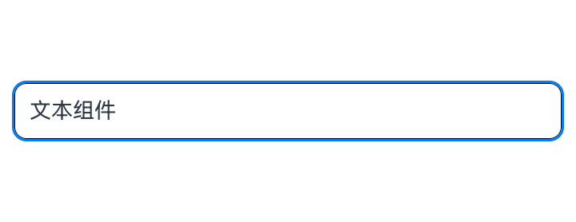
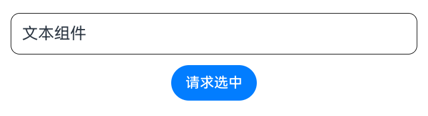
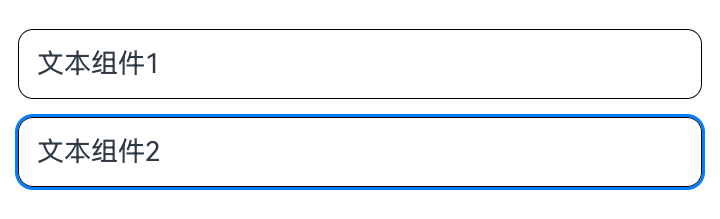
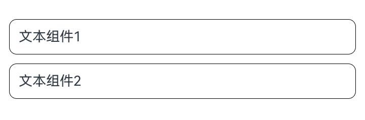
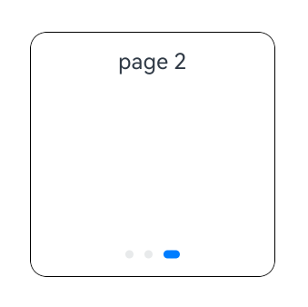
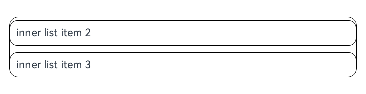
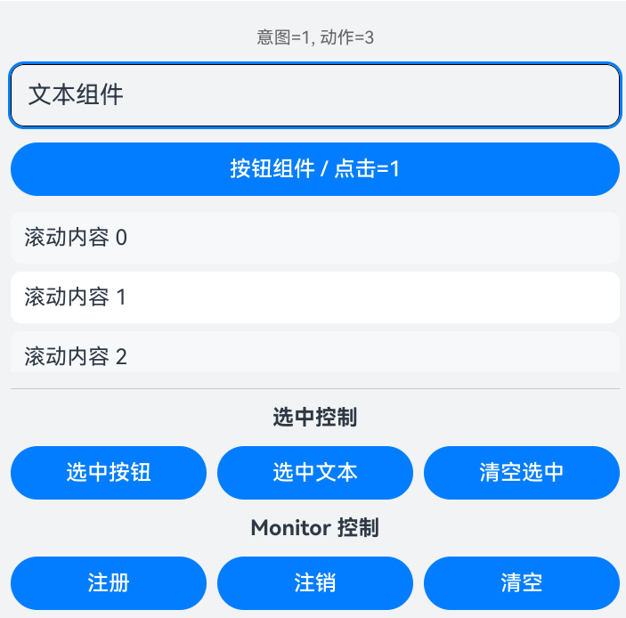

# Class (SmartGestureController)
<!--Kit: ArkUI-->
<!--Subsystem: ArkUI-->
<!--Owner: @yihao-lin-->
<!--Designer: @piggyguy-->
<!--Tester: @songyanhong-->
<!--Adviser: @Brilliantry_Rui-->

提供智慧手势使能、监听、选中态控制，以及动态决策智慧手势行为的能力。

> **说明：**
>
> 以下API需先使用UIContext中的[getSmartGestureController()](./arkts-apis-uicontext-uicontext.md#getsmartgesturecontroller)方法获取SmartGestureController实例，再通过该实例调用对应方法。

**起始版本：** 26.0.0

## enableSmartTapAndSlideGestures

enableSmartTapAndSlideGestures(enabled: boolean): void

设置是否启用智慧手势的敲一敲和划一划操作。

> **说明：**
>
> - 该接口仅影响智慧手势的敲一敲和划一划手势，不影响翻腕手势。
> - 关闭后，组件侧[smartGestureShortcut](arkui-ts/ts-universal-attributes-smart-gesture-shortcut.md#smartgestureshortcut)配置仍会保留，但不会响应智慧手势的敲一敲和划一划手势。

**起始版本：** 26.0.0

**模型约束：** 此接口仅可在Stage模型下使用。

**原子化服务API：** 从API版本26.0.0开始，该接口支持在原子化服务中使用。

**系统能力：** SystemCapability.ArkUI.ArkUI.Full

**参数：**

| 参数名 | 类型 | 必填 | 说明 |
| ---- | ---- | ---- | ---- |
| enabled | boolean | 是 | 是否启用智慧手势的敲一敲和划一划手势处理。true表示启用，false表示关闭。 |

**示例：** 

本示例通过enableSmartTapAndSlideGestures接口实现了启用和关闭智慧手势，完整示例请参考[示例1（启用智慧手势并自定义动作处理）](#示例1启用智慧手势并自定义动作处理)。

```ts
@Entry
@Component
struct SmartGestureControllerExample {
  private controller = this.getUIContext().getSmartGestureController();
  aboutToAppear(): void {
    this.controller.enableSmartTapAndSlideGestures(true);
  }

  aboutToDisappear(): void {
    this.controller.enableSmartTapAndSlideGestures(false);
  }

  build() {
    Scroll() {
      Column({ space: 12 }) {
        Text('文本组件')
          .id('target_text')
          .fontSize(18)
          .width('100%')
          .padding(12)
          .borderRadius(10)
          .borderWidth(1)
          .smartGestureShortcut({ action: GestureShortcut.PRIMARY, enabled: true, selectable: true })
      }.width('100%')
    }
    .layoutWeight(1)
    .width('100%')
    .height('100%')
    .padding(12)
  }
}
```


## registerMonitor

registerMonitor(monitorCallback: Callback<BaseGestureHandlingProposal, GestureHandlingResolution>): void

注册智慧手势监听回调。在系统处理当前智慧手势前，应用可接收当前手势的默认动作处理并进行自定义干预。使用callback异步回调。

> **说明：**
> 
> - 该接口使应用能够在系统处理当前智慧手势事件前接收其处理意图，并进行自定义干预。
> - 用户可通过该回调自定义决策本次智慧手势的行为。
> - 用户可注册多个监听回调，按照后注册先执行的顺序触发，当某个监听回调消费智慧手势事件后，即返回值[GestureHandlingResolution](#gesturehandlingresolution).isConsumed为true时，后续监听回调不再执行。
> - 当用户重复注册相同回调时，只会保存首次注册的回调，重复注册不生效。
> - 回调返回值必须是合法的[GestureHandlingResolution](#gesturehandlingresolution)实例，否则本次改写不生效。

**起始版本：** 26.0.0

**模型约束：** 此接口仅可在Stage模型下使用。

**原子化服务API：** 从API版本26.0.0开始，该接口支持在原子化服务中使用。

**系统能力：** SystemCapability.ArkUI.ArkUI.Full

**参数：**

| 参数名 | 类型 | 必填 | 说明 |
| ---- | ---- | ---- | ---- |
| monitorCallback | [Callback](arkui-ts/ts-types.md#callback12)&lt;[BaseGestureHandlingProposal](#basegesturehandlingproposal), [GestureHandlingResolution](#gesturehandlingresolution)&gt; | 是 | 智慧手势监听回调。回调参数为系统给出的默认动作处理，返回值用于声明是否消费当前智慧手势以及是否替换默认动作处理。 |

**示例：** 

本示例通过registerMonitor接口实现了注册智慧手势监听回调，完整示例请参考[示例1（启用智慧手势并自定义动作处理）](#示例1启用智慧手势并自定义动作处理)。

```ts
import {
  BaseGestureHandlingProposal,
  GestureHandlingResolution,
} from '@kit.ArkUI';

@Entry
@Component
struct SmartGestureControllerExample {
  private controller = this.getUIContext().getSmartGestureController();
  private smartGestureMonitor = (proposal: BaseGestureHandlingProposal) => {
    return new GestureHandlingResolution(true);
  }

  aboutToAppear(): void {
    this.controller.enableSmartTapAndSlideGestures(true);
    this.controller.registerMonitor(this.smartGestureMonitor);
  }

  aboutToDisappear(): void {
    this.controller.unregisterMonitor(this.smartGestureMonitor);
    this.controller.enableSmartTapAndSlideGestures(false);
  }

  build() {
    Scroll() {
      Column({ space: 12 }) {
        Text('文本组件')
          .id('target_text')
          .fontSize(18)
          .width('100%')
          .padding(12)
          .borderRadius(10)
          .borderWidth(1)
          .smartGestureShortcut({ action: GestureShortcut.PRIMARY, enabled: true, selectable: true })
          .onClick(() => {
            console.info('smartGesture click is triggered');
          })
      }.width('100%')
    }
    .layoutWeight(1)
    .width('100%')
    .height('100%')
    .padding(12)
  }
}
```


## unregisterMonitor

unregisterMonitor(monitorCallback: Callback<BaseGestureHandlingProposal, GestureHandlingResolution>): void

注销智慧手势监听回调。

**起始版本：** 26.0.0

**模型约束：** 此接口仅可在Stage模型下使用。

**原子化服务API：** 从API版本26.0.0开始，该接口支持在原子化服务中使用。

**系统能力：** SystemCapability.ArkUI.ArkUI.Full

**参数：**

| 参数名 | 类型 | 必填 | 说明 |
| ---- | ---- | ---- | ---- |
| monitorCallback | [Callback](arkui-ts/ts-types.md#callback12)&lt;[BaseGestureHandlingProposal](#basegesturehandlingproposal), [GestureHandlingResolution](#gesturehandlingresolution)&gt; | 是 | 需要注销的智慧手势监听回调。 |

**示例：** 

本示例通过unregisterMonitor接口实现了注销智慧手势监听回调，完整示例请参考[示例1（启用智慧手势并自定义动作处理）](#示例1启用智慧手势并自定义动作处理)。

```ts
import {
  BaseGestureHandlingProposal,
  GestureHandlingResolution,
} from '@kit.ArkUI';

@Entry
@Component
struct SmartGestureControllerExample {
  private controller = this.getUIContext().getSmartGestureController();
  private smartGestureMonitor = (proposal: BaseGestureHandlingProposal) => {
    return new GestureHandlingResolution(true);
  }

  aboutToAppear(): void {
    this.controller.enableSmartTapAndSlideGestures(true);
    this.controller.registerMonitor(this.smartGestureMonitor);
  }

  aboutToDisappear(): void {
    this.controller.unregisterMonitor(this.smartGestureMonitor);
    this.controller.enableSmartTapAndSlideGestures(false);
  }

  build() {
    Scroll() {
      Column({ space: 12 }) {
        Text('文本组件')
          .id('target_text')
          .fontSize(18)
          .width('100%')
          .padding(12)
          .borderRadius(10)
          .borderWidth(1)
          .smartGestureShortcut({ action: GestureShortcut.PRIMARY, enabled: true, selectable: true })
          .onClick(() => {
            console.info('smartGesture click is triggered');
          })
      }.width('100%')
    }
    .layoutWeight(1)
    .width('100%')
    .height('100%')
    .padding(12)
  }
}
```


## clearMonitors

clearMonitors(): void

清空当前UIContext下注册的全部智慧手势监听回调。

**起始版本：** 26.0.0

**模型约束：** 此接口仅可在Stage模型下使用。

**原子化服务API：** 从API版本26.0.0开始，该接口支持在原子化服务中使用。

**系统能力：** SystemCapability.ArkUI.ArkUI.Full

**示例：** 

本示例通过clearMonitors接口实现了清空智慧手势监听回调，完整示例请参考[示例1（启用智慧手势并自定义动作处理）](#示例1启用智慧手势并自定义动作处理)。

```ts
import {
  BaseGestureHandlingProposal,
  GestureHandlingResolution,
} from '@kit.ArkUI';

@Entry
@Component
struct SmartGestureControllerExample {
  private controller = this.getUIContext().getSmartGestureController();
  private smartGestureMonitor = (proposal: BaseGestureHandlingProposal) => {
    return new GestureHandlingResolution(true);
  }

  aboutToAppear(): void {
    this.controller.enableSmartTapAndSlideGestures(true);
    this.controller.registerMonitor(this.smartGestureMonitor);
  }

  aboutToDisappear(): void {
    this.controller.clearMonitors();
    this.controller.enableSmartTapAndSlideGestures(false);
  }

  build() {
    Scroll() {
      Column({ space: 12 }) {
        Text('文本组件')
          .id('target_text')
          .fontSize(18)
          .width('100%')
          .padding(12)
          .borderRadius(10)
          .borderWidth(1)
          .smartGestureShortcut({ action: GestureShortcut.PRIMARY, enabled: true, selectable: true })
          .onClick(() => {
            console.info('smartGesture click is triggered');
          })
      }.width('100%')
    }
    .layoutWeight(1)
    .width('100%')
    .height('100%')
    .padding(12)
  }
}
```


## requestSelected

requestSelected(id: string): void

请求将指定组件设置为当前智慧手势选中节点。成功选中后会显示选中提示框，选中框样式根据设备有所不同。

> **说明：**
> 
> - 仅当目标组件满足以下全部条件时，请求才会生效：组件可以响应智慧手势，组件在屏幕内可见，且组件绑定了[onClick](./arkui-ts/ts-universal-events-click.md#onclick)或绑定了单击手势[TapGesture](./arkui-ts/ts-basic-gestures-tapgesture.md#接口)。
> - 组件能否响应智慧手势由[smartGestureShortcut](arkui-ts/ts-universal-attributes-smart-gesture-shortcut.md#smartgestureshortcut)中的enabled决定。

**起始版本：** 26.0.0

**模型约束：** 此接口仅可在Stage模型下使用。

**原子化服务API：** 从API版本26.0.0开始，该接口支持在原子化服务中使用。

**系统能力：** SystemCapability.ArkUI.ArkUI.Full

**参数：**

| 参数名 | 类型 | 必填 | 说明 |
| ---- | ---- | ---- | ---- |
| id | string | 是 | 组件的[id](./arkui-ts/ts-universal-attributes-component-id.md#id)。 |

**示例：** 

本示例通过requestSelected接口和clearSelected接口实现了请求组件选中并在5000ms后自动清除选中，完整示例请参考[示例1（启用智慧手势并自定义动作处理）](#示例1启用智慧手势并自定义动作处理)。

```ts
@Entry
@Component
struct SmartGestureControllerExample {
  private controller = this.getUIContext().getSmartGestureController();

  aboutToAppear(): void {
    this.controller.enableSmartTapAndSlideGestures(true);
  }

  aboutToDisappear(): void {
    this.controller.enableSmartTapAndSlideGestures(false);
  }

  build() {
    Scroll() {
      Column({ space: 12 }) {
        Text('文本组件')
          .id('target_text')
          .fontSize(18)
          .width('100%')
          .padding(12)
          .borderRadius(10)
          .borderWidth(1)
          .smartGestureShortcut({ action: GestureShortcut.PRIMARY, enabled: true, selectable: true })
          .onClick(() => {
            console.info('smartGesture click is triggered');
          })
        Button('请求选中')
          .onClick(() => {
            this.controller.requestSelected('target_text');
            setTimeout(() => {
              this.controller.clearSelected();
              console.info('smartGesture selected is clear');
            }, 5000)
          })
      }.width('100%')
    }
    .layoutWeight(1)
    .width('100%')
    .height('100%')
    .padding(12)
  }
}
```


## clearSelected

clearSelected(): void

清空当前智慧手势选中节点。

**起始版本：** 26.0.0

**模型约束：** 此接口仅可在Stage模型下使用。

**原子化服务API：** 从API版本26.0.0开始，该接口支持在原子化服务中使用。

**系统能力：** SystemCapability.ArkUI.ArkUI.Full

**示例：** 

本示例通过requestSelected接口和clearSelected接口实现了请求组件选中并在5000ms后自动清除选中，完整示例请参考[示例1（启用智慧手势并自定义动作处理）](#示例1启用智慧手势并自定义动作处理)。

```ts
@Entry
@Component
struct SmartGestureControllerExample {
  private controller = this.getUIContext().getSmartGestureController();

  aboutToAppear(): void {
    this.controller.enableSmartTapAndSlideGestures(true);
  }

  aboutToDisappear(): void {
    this.controller.enableSmartTapAndSlideGestures(false);
  }

  build() {
    Scroll() {
      Column({ space: 12 }) {
        Text('文本组件')
          .id('target_text')
          .fontSize(18)
          .width('100%')
          .padding(12)
          .borderRadius(10)
          .borderWidth(1)
          .smartGestureShortcut({ action: GestureShortcut.PRIMARY, enabled: true, selectable: true })
          .onClick(() => {
            console.info('smartGesture click is triggered');
          })
        Button('请求选中')
          .onClick(() => {
            this.controller.requestSelected('target_text');
            setTimeout(() => {
              this.controller.clearSelected();
              console.info('smartGesture selected is clear');
            }, 5000)
          })
      }.width('100%')
    }
    .layoutWeight(1)
    .width('100%')
    .height('100%')
    .padding(12)
  }
}
```


## BaseGestureHandlingProposal

智慧手势处理基类。当通过[registerMonitor](#registermonitor)接口动态自定义智慧手势行为时，其回调参数类型为具体的子类类型实例。

**起始版本：** 26.0.0

**模型约束：** 此接口仅可在Stage模型下使用。

**原子化服务API：** 从API版本26.0.0开始，该接口支持在原子化服务中使用。

**系统能力：** SystemCapability.ArkUI.ArkUI.Full

| 名称 | 类型 | 只读 | 可选 | 说明 |
| ---- | ---- | ---- | ---- | ---- |
| action | [SmartGestureAction](arkui-ts/ts-appendix-enums.md#smartgestureaction) | 否 | 否 | 智慧手势最终执行动作。 |
| operateIntention | [OperateIntention](arkui-ts/ts-appendix-enums.md#operateintention) | 否 | 否 | 智慧手势底层操作意图。 |

**示例：** 

本示例实现了在智慧手势监听回调中，从BaseGestureHandlingProposal获取智慧手势处理信息，完整示例请参考[示例1（启用智慧手势并自定义动作处理）](#示例1启用智慧手势并自定义动作处理)。

```ts
import {
  BaseGestureHandlingProposal, GestureHandlingResolution,
} from '@kit.ArkUI';

@Entry
@Component
struct SmartGestureControllerExample {
  private controller = this.getUIContext().getSmartGestureController();
  private smartGestureMonitor = (proposal: BaseGestureHandlingProposal) => {
    console.info('smartGesture action is ', proposal.action, ', operateIntention is ', proposal.operateIntention)
    return new GestureHandlingResolution(true);
  }

  aboutToAppear(): void {
    this.controller.enableSmartTapAndSlideGestures(true);
    this.controller.registerMonitor(this.smartGestureMonitor);
  }

  aboutToDisappear(): void {
    this.controller.clearMonitors();
    this.controller.enableSmartTapAndSlideGestures(false);
  }

  build() {
    Scroll() {
      Column({ space: 12 }) {
        Text('文本组件')
          .id('target_text')
          .fontSize(18)
          .width('100%')
          .padding(12)
          .borderRadius(10)
          .borderWidth(1)
          .smartGestureShortcut({ action: GestureShortcut.PRIMARY, enabled: true, selectable: true })
          .onClick(() => {
            console.info('smartGesture click is triggered');
          })
      }.width('100%')
    }
    .layoutWeight(1)
    .width('100%')
    .height('100%')
    .padding(12)
  }
}
```


## TargetedGestureProposal

带目标节点的智慧手势处理基类。

**起始版本：** 26.0.0

**模型约束：** 此接口仅可在Stage模型下使用。

**原子化服务API：** 从API版本26.0.0开始，该接口支持在原子化服务中使用。

**系统能力：** SystemCapability.ArkUI.ArkUI.Full

| 名称 | 类型 | 只读 | 可选 | 说明 |
| ---- | ---- | ---- | ---- | ---- |
| node | [FrameNode](js-apis-arkui-frameNode.md#framenode-1) | 否 | 否 | 处理当前智慧手势的目标节点。 |

**示例：** 

本示例实现了在智慧手势监听回调中，从TargetedGestureProposal获取智慧手势处理信息，完整示例请参考[示例1（启用智慧手势并自定义动作处理）](#示例1启用智慧手势并自定义动作处理)。

```ts
import {
  BaseGestureHandlingProposal,
  GestureHandlingResolution,
  TargetedGestureProposal,
} from '@kit.ArkUI';

@Entry
@Component
struct SmartGestureControllerExample {
  private controller = this.getUIContext().getSmartGestureController();
  private smartGestureMonitor = (proposal: BaseGestureHandlingProposal) => {
    let targetProposal = proposal as TargetedGestureProposal;
    console.info('smartGesture action is', targetProposal.action, ', operateIntention is',
      targetProposal.operateIntention, ', nodeId is', targetProposal.node.getId());
    return new GestureHandlingResolution(true);
  }

  aboutToAppear(): void {
    this.controller.enableSmartTapAndSlideGestures(true);
    this.controller.registerMonitor(this.smartGestureMonitor);
  }

  aboutToDisappear(): void {
    this.controller.clearMonitors();
    this.controller.enableSmartTapAndSlideGestures(false);
  }

  build() {
    Scroll() {
      Column({ space: 12 }) {
        Text('文本组件')
          .id('target_text')
          .fontSize(18)
          .width('100%')
          .padding(12)
          .borderRadius(10)
          .borderWidth(1)
          .smartGestureShortcut({ action: GestureShortcut.PRIMARY, enabled: true, selectable: true })
          .onClick(() => {
            console.info('smartGesture click is triggered');
          })
      }.width('100%')
    }
    .layoutWeight(1)
    .width('100%')
    .height('100%')
    .padding(12)
  }
}
```


## ClickActionProposal

智慧手势点击动作处理。当通过[registerMonitor](#registermonitor)接口动态自定义智慧手势行为时，设置返回值[GestureHandlingResolution](#gesturehandlingresolution)的selectedProposal为该类型对象，会触发目标组件的点击操作。

> **说明：**
> 
> - 该动作处理遵循“先选中，再点击”的处理语义。
> - 当目标节点尚未被选中时，本次处理会优先建立选中态，而不会立即触发点击。

**起始版本：** 26.0.0

**模型约束：** 此接口仅可在Stage模型下使用。

**原子化服务API：** 从API版本26.0.0开始，该接口支持在原子化服务中使用。

**系统能力：** SystemCapability.ArkUI.ArkUI.Full

### constructor

constructor(node: FrameNode)

智慧手势点击动作处理的构造函数。

**起始版本：** 26.0.0

**模型约束：** 此接口仅可在Stage模型下使用。

**原子化服务API：** 从API版本26.0.0开始，该接口支持在原子化服务中使用。

**系统能力：** SystemCapability.ArkUI.ArkUI.Full

**参数：**

| 参数名 | 类型 | 必填 | 说明 |
| ---- | ---- | ---- | ---- |
| node | [FrameNode](js-apis-arkui-frameNode.md#framenode-1) | 是 | 响应点击动作的目标节点。 |

**示例：**

本示例实现了在智慧手势监听回调中，自定义智慧手势动作处理为智慧手势点击动作处理，完整示例请参考[示例1（启用智慧手势并自定义动作处理）](#示例1启用智慧手势并自定义动作处理)。

```ts
import {
  BaseGestureHandlingProposal,
  ClickActionProposal,
  GestureHandlingResolution,
  TargetedGestureProposal,
} from '@kit.ArkUI';

@Entry
@Component
struct SmartGestureControllerExample {
  private controller = this.getUIContext().getSmartGestureController();
  private smartGestureMonitor = (proposal: BaseGestureHandlingProposal) => {
    let targetProposal = proposal as TargetedGestureProposal;
    let result = new GestureHandlingResolution(true);
    console.info('smartGesture action is', targetProposal.action, ', operateIntention is',
      targetProposal.operateIntention, ', nodeId is', targetProposal.node.getId());
    if (targetProposal.node && targetProposal.node.getId() == 'target_text') {
      let clickProposal = new ClickActionProposal(targetProposal.node)
      result.selectedProposal = clickProposal;
    }
    return result;
  }

  aboutToAppear(): void {
    this.controller.enableSmartTapAndSlideGestures(true);
    this.controller.registerMonitor(this.smartGestureMonitor);
  }

  aboutToDisappear(): void {
    this.controller.clearMonitors();
    this.controller.enableSmartTapAndSlideGestures(false);
  }

  build() {
    Scroll() {
      Column({ space: 12 }) {
        Text('文本组件')
          .id('target_text')
          .fontSize(18)
          .width('100%')
          .padding(12)
          .borderRadius(10)
          .borderWidth(1)
          .smartGestureShortcut({ action: GestureShortcut.PRIMARY, enabled: true, selectable: true })
          .onClick(() => {
            console.info('smartGesture click is triggered');
          })
      }.width('100%')
    }
    .layoutWeight(1)
    .width('100%')
    .height('100%')
    .padding(12)
  }
}
```


## SelectActionProposal

智慧手势选中动作处理。当通过[registerMonitor](#registermonitor)接口动态自定义智慧手势行为时，设置返回值[GestureHandlingResolution](#gesturehandlingresolution)的selectedProposal为该类型对象，会使目标组件被选中。

**起始版本：** 26.0.0

**模型约束：** 此接口仅可在Stage模型下使用。

**原子化服务API：** 从API版本26.0.0开始，该接口支持在原子化服务中使用。

**系统能力：** SystemCapability.ArkUI.ArkUI.Full

### constructor

constructor(node: FrameNode)

智慧手势选中动作处理的构造函数。

**起始版本：** 26.0.0

**模型约束：** 此接口仅可在Stage模型下使用。

**原子化服务API：** 从API版本26.0.0开始，该接口支持在原子化服务中使用。

**系统能力：** SystemCapability.ArkUI.ArkUI.Full

**参数：**

| 参数名 | 类型 | 必填 | 说明 |
| ---- | ---- | ---- | ---- |
| node | [FrameNode](js-apis-arkui-frameNode.md#framenode-1) | 是 | 响应选中动作的目标节点。 |

**示例：** 

本示例实现了在智慧手势监听回调中，自定义智慧手势动作处理为智慧手势选中动作处理，完整示例请参考[示例1（启用智慧手势并自定义动作处理）](#示例1启用智慧手势并自定义动作处理)。

```ts
import {
  BaseGestureHandlingProposal,
  GestureHandlingResolution,
  SelectActionProposal,
} from '@kit.ArkUI';

@Entry
@Component
struct SmartGestureControllerExample {
  private controller = this.getUIContext().getSmartGestureController();
  private smartGestureMonitor = (proposal: BaseGestureHandlingProposal) => {
    let result = new GestureHandlingResolution(true);
    let node = this.getUIContext().getFrameNodeById('target_text2');
    if (node) {
      let selectProposal = new SelectActionProposal(node)
      result.selectedProposal = selectProposal;
    }
    return result;
  }

  aboutToAppear(): void {
    this.controller.enableSmartTapAndSlideGestures(true);
    this.controller.registerMonitor(this.smartGestureMonitor);
  }

  aboutToDisappear(): void {
    this.controller.clearMonitors();
    this.controller.enableSmartTapAndSlideGestures(false);
  }

  build() {
    Scroll() {
      Column({ space: 12 }) {
        Text('文本组件1')
          .id('target_text1')
          .fontSize(18)
          .width('100%')
          .padding(12)
          .borderRadius(10)
          .borderWidth(1)
          .smartGestureShortcut({ action: GestureShortcut.PRIMARY, enabled: true, selectable: true })
          .onClick(() => {
            console.info('smartGesture click is triggered');
          })
        Text('文本组件2')
          .id('target_text2')
          .fontSize(18)
          .width('100%')
          .padding(12)
          .borderRadius(10)
          .borderWidth(1)
          .smartGestureShortcut({ action: GestureShortcut.PRIMARY, enabled: true, selectable: true })
          .onClick(() => {
            console.info('smartGesture click is triggered');
          })
      }.width('100%')
    }
    .layoutWeight(1)
    .width('100%')
    .height('100%')
    .padding(12)
  }
}
```


## NoneActionProposal

智慧手势空动作处理。当通过[registerMonitor](#registermonitor)接口动态自定义智慧手势行为时，设置返回值[GestureHandlingResolution](#gesturehandlingresolution)的selectedProposal为该类型对象，不会触发任何动作。

**起始版本：** 26.0.0

**模型约束：** 此接口仅可在Stage模型下使用。

**原子化服务API：** 从API版本26.0.0开始，该接口支持在原子化服务中使用。

**系统能力：** SystemCapability.ArkUI.ArkUI.Full

### constructor

constructor()

智慧手势空动作处理的构造函数。

**起始版本：** 26.0.0

**模型约束：** 此接口仅可在Stage模型下使用。

**原子化服务API：** 从API版本26.0.0开始，该接口支持在原子化服务中使用。

**系统能力：** SystemCapability.ArkUI.ArkUI.Full

**示例：** 

本示例实现了在智慧手势监听回调中，自定义智慧手势动作处理为智慧手势空动作处理，完整示例请参考[示例1（启用智慧手势并自定义动作处理）](#示例1启用智慧手势并自定义动作处理)。

```ts
import {
  BaseGestureHandlingProposal,
  GestureHandlingResolution,
  NoneActionProposal,
} from '@kit.ArkUI';

@Entry
@Component
struct SmartGestureControllerExample {
  private controller = this.getUIContext().getSmartGestureController();
  private smartGestureMonitor = (proposal: BaseGestureHandlingProposal) => {
    let result = new GestureHandlingResolution(true);
    let noneProposal = new NoneActionProposal()
    result.selectedProposal = noneProposal;
    return result;
  }

  aboutToAppear(): void {
    this.controller.enableSmartTapAndSlideGestures(true);
    this.controller.registerMonitor(this.smartGestureMonitor);
  }

  aboutToDisappear(): void {
    this.controller.clearMonitors();
    this.controller.enableSmartTapAndSlideGestures(false);
  }

  build() {
    Scroll() {
      Column({ space: 12 }) {
        Text('文本组件1')
          .id('target_text1')
          .fontSize(18)
          .width('100%')
          .padding(12)
          .borderRadius(10)
          .borderWidth(1)
          .smartGestureShortcut({ action: GestureShortcut.PRIMARY, enabled: true, selectable: true })
          .onClick(() => {
            console.info('smartGesture click is triggered');
          })
        Text('文本组件2')
          .id('target_text2')
          .fontSize(18)
          .width('100%')
          .padding(12)
          .borderRadius(10)
          .borderWidth(1)
          .smartGestureShortcut({ action: GestureShortcut.PRIMARY, enabled: true, selectable: true })
          .onClick(() => {
            console.info('smartGesture click is triggered');
          })
      }.width('100%')
    }
    .layoutWeight(1)
    .width('100%')
    .height('100%')
    .padding(12)
  }
}
```


## BackPressActionProposal

智慧手势返回动作处理。当通过[registerMonitor](#registermonitor)接口动态自定义智慧手势行为时，设置返回值[GestureHandlingResolution](#gesturehandlingresolution)的selectedProposal为该类型对象，会返回上一页面。

**起始版本：** 26.0.0

**模型约束：** 此接口仅可在Stage模型下使用。

**原子化服务API：** 从API版本26.0.0开始，该接口支持在原子化服务中使用。

**系统能力：** SystemCapability.ArkUI.ArkUI.Full

### constructor

constructor()

智慧手势返回动作处理的构造函数。

**起始版本：** 26.0.0

**模型约束：** 此接口仅可在Stage模型下使用。

**原子化服务API：** 从API版本26.0.0开始，该接口支持在原子化服务中使用。

**系统能力：** SystemCapability.ArkUI.ArkUI.Full

**示例：** 

本示例实现了在智慧手势监听回调中，自定义智慧手势动作处理为智慧手势返回动作处理，完整示例请参考[示例1（启用智慧手势并自定义动作处理）](#示例1启用智慧手势并自定义动作处理)。

```ts
import {
  BackPressActionProposal,
  BaseGestureHandlingProposal,
  GestureHandlingResolution,
} from '@kit.ArkUI';

@Entry
@Component
struct SmartGestureControllerExample {
  private controller = this.getUIContext().getSmartGestureController();
  private smartGestureMonitor = (proposal: BaseGestureHandlingProposal) => {
    let result = new GestureHandlingResolution(true);
    let backProposal = new BackPressActionProposal()
    result.selectedProposal = backProposal;
    return result;
  }

  aboutToAppear(): void {
    this.controller.enableSmartTapAndSlideGestures(true);
    this.controller.registerMonitor(this.smartGestureMonitor);
  }

  aboutToDisappear(): void {
    this.controller.clearMonitors();
    this.controller.enableSmartTapAndSlideGestures(false);
  }

  build() {
    Scroll() {
      Column({ space: 12 }) {
        Text('文本组件1')
          .id('target_text1')
          .fontSize(18)
          .width('100%')
          .padding(12)
          .borderRadius(10)
          .borderWidth(1)
          .smartGestureShortcut({ action: GestureShortcut.PRIMARY, enabled: true, selectable: true })
          .onClick(() => {
            console.info('smartGesture click is triggered');
          })
        Text('文本组件2')
          .id('target_text2')
          .fontSize(18)
          .width('100%')
          .padding(12)
          .borderRadius(10)
          .borderWidth(1)
          .smartGestureShortcut({ action: GestureShortcut.PRIMARY, enabled: true, selectable: true })
          .onClick(() => {
            console.info('smartGesture click is triggered');
          })
      }.width('100%')
    }
    .layoutWeight(1)
    .width('100%')
    .height('100%')
    .padding(12)
  }
}
```


## PageSwitchActionProposal

智慧手势翻页动作处理，默认方向为向前翻页，包括向右和向下。当通过[registerMonitor](#registermonitor)接口动态自定义智慧手势行为时，设置返回值[GestureHandlingResolution](#gesturehandlingresolution)的selectedProposal为该类型对象，会触发目标组件的翻页操作。

**起始版本：** 26.0.0

**模型约束：** 此接口仅可在Stage模型下使用。

**原子化服务API：** 从API版本26.0.0开始，该接口支持在原子化服务中使用。

**系统能力：** SystemCapability.ArkUI.ArkUI.Full

### constructor

constructor(node: FrameNode, pageCount: number)

智慧手势翻页动作处理的构造函数。

**起始版本：** 26.0.0

**模型约束：** 此接口仅可在Stage模型下使用。

**原子化服务API：** 从API版本26.0.0开始，该接口支持在原子化服务中使用。

**系统能力：** SystemCapability.ArkUI.ArkUI.Full

**参数：**

| 参数名 | 类型 | 必填 | 说明 |
| ---- | ---- | ---- | ---- |
| node | [FrameNode](js-apis-arkui-frameNode.md#framenode-1) | 是 | 响应翻页动作的目标节点。 |
| pageCount | number | 是 | 翻页数量。<br/>取值范围：[0, +∞)，小于0时按0处理。<br/>单位为页。 |

### 属性

**起始版本：** 26.0.0

**模型约束：** 此接口仅可在Stage模型下使用。

**原子化服务API：** 从API版本26.0.0开始，该接口支持在原子化服务中使用。

**系统能力：** SystemCapability.ArkUI.ArkUI.Full

| 名称 | 类型 | 只读 | 可选 | 说明 |
| ---- | ---- | ---- | ---- | ---- |
| pageCount | number | 否 | 否 | 智慧手势翻页数量。<br/>取值范围：[0, +∞)，小于0时按0处理。<br/>单位为页。 |

**示例：** 

本示例实现了在智慧手势监听回调中，自定义智慧手势动作处理为智慧手势翻页动作处理，完整示例请参考[示例1（启用智慧手势并自定义动作处理）](#示例1启用智慧手势并自定义动作处理)。

```ts
import {
  BaseGestureHandlingProposal,
  GestureHandlingResolution,
  PageSwitchActionProposal,
} from '@kit.ArkUI';

@Entry
@Component
struct SmartGestureControllerExample {
  private controller = this.getUIContext().getSmartGestureController();
  private smartGestureMonitor = (proposal: BaseGestureHandlingProposal) => {
    let result = new GestureHandlingResolution(true);
    let node = this.getUIContext().getFrameNodeById('target_swiper');
    if (node) {
      let pageSwitchProposal = new PageSwitchActionProposal(node, 2);
      result.selectedProposal = pageSwitchProposal;
    }
    return result;
  }

  aboutToAppear(): void {
    this.controller.enableSmartTapAndSlideGestures(true);
    this.controller.registerMonitor(this.smartGestureMonitor);
  }

  aboutToDisappear(): void {
    this.controller.clearMonitors();
    this.controller.enableSmartTapAndSlideGestures(false);
  }

  build() {
    Scroll() {
      Column({ space: 12 }) {
        Swiper() {
          Column({ space: 8 }) {
            Text('page 0')
          }
          .justifyContent(FlexAlign.Start)
          .padding(12)

          Column({ space: 8 }) {
            Text('page 1')
          }
          .justifyContent(FlexAlign.Start)
          .padding(12)

          Column({ space: 8 }) {
            Text('page 2')
          }
          .justifyContent(FlexAlign.Start)
          .padding(12)
        }
        .width(180)
        .height(180)
        .id('target_swiper')
        .index(0)
        .loop(false)
        .borderRadius(12)
        .borderWidth(1)
      }.width('100%')
    }
    .layoutWeight(1)
    .width('100%')
    .height('100%')
    .padding(12)
  }
}
```


## ScrollActionProposal

智慧手势滚动动作处理，默认方向为向前滚动，包括向右和向下。当通过[registerMonitor](#registermonitor)接口动态自定义智慧手势行为时，设置返回值[GestureHandlingResolution](#gesturehandlingresolution)的selectedProposal为该类型对象，会触发目标组件的滚动操作。

**起始版本：** 26.0.0

**模型约束：** 此接口仅可在Stage模型下使用。

**原子化服务API：** 从API版本26.0.0开始，该接口支持在原子化服务中使用。

**系统能力：** SystemCapability.ArkUI.ArkUI.Full

### constructor

constructor(node: FrameNode, distance: number)

智慧手势滚动动作处理的构造函数。

**起始版本：** 26.0.0

**模型约束：** 此接口仅可在Stage模型下使用。

**原子化服务API：** 从API版本26.0.0开始，该接口支持在原子化服务中使用。

**系统能力：** SystemCapability.ArkUI.ArkUI.Full

**参数：**

| 参数名 | 类型 | 必填 | 说明 |
| ---- | ---- | ---- | ---- |
| node | [FrameNode](js-apis-arkui-frameNode.md#framenode-1) | 是 | 响应滚动动作的目标节点。 |
| distance | number | 是 | 滚动距离。<br/>取值范围：[0, +∞)，小于0时按0处理。<br/>单位为vp。 |

### 属性

**起始版本：** 26.0.0

**模型约束：** 此接口仅可在Stage模型下使用。

**原子化服务API：** 从API版本26.0.0开始，该接口支持在原子化服务中使用。

**系统能力：** SystemCapability.ArkUI.ArkUI.Full

| 名称 | 类型 | 只读 | 可选 | 说明 |
| ---- | ---- | ---- | ---- | ---- |
| distance | number | 否 | 是 | 智慧手势滚动距离。<br/>取值范围：[0, +∞)，小于0时按0处理。<br/>单位为vp。 |

**示例：** 

本示例实现了在智慧手势监听回调中，自定义智慧手势动作处理为智慧手势滚动动作处理，完整示例请参考[示例1（启用智慧手势并自定义动作处理）](#示例1启用智慧手势并自定义动作处理)。

```ts
import {
  BaseGestureHandlingProposal,
  GestureHandlingResolution,
  ScrollActionProposal,
} from '@kit.ArkUI';

@Entry
@Component
struct SmartGestureControllerExample {
  private controller = this.getUIContext().getSmartGestureController();
  private arrayList = [0, 1, 2, 3, 4, 5, 6];
  private smartGestureMonitor = (proposal: BaseGestureHandlingProposal) => {
    let result = new GestureHandlingResolution(true);
    let node = this.getUIContext().getFrameNodeById('target_list');
    if (node) {
      let scrollProposal = new ScrollActionProposal(node, 60);
      result.selectedProposal = scrollProposal;
    }
    return result;
  }

  aboutToAppear(): void {
    this.controller.enableSmartTapAndSlideGestures(true);
    this.controller.registerMonitor(this.smartGestureMonitor);
  }

  aboutToDisappear(): void {
    this.controller.clearMonitors();
    this.controller.enableSmartTapAndSlideGestures(false);
  }

  build() {
    Scroll() {
      Column({ space: 12 }) {
        List({ space: 8 }) {
          ForEach(this.arrayList, (item: number) => {
            ListItem() {
              Column({ space: 6 }) {
                Text(`inner list item ${item}`)
                  .id(`inner_list_item_${item}`)
                  .fontSize(14)
                  .padding(8)
                  .width('100%')
                  .borderRadius(10)
                  .borderWidth(1)
                  .smartGestureShortcut({ action: GestureShortcut.PRIMARY, enabled: true, selectable: true })
              }
              .width('100%')
            }
          }, (item: number) => item.toString())
        }
        .id('target_list')
        .width('100%')
        .height(80)
        .borderRadius(12)
        .borderWidth(1)
      }.width('100%')
    }
    .layoutWeight(1)
    .width('100%')
    .height('100%')
    .padding(12)
  }
}
```


## GestureHandlingResolution

智慧手势处理结果声明类。

**起始版本：** 26.0.0

**模型约束：** 此接口仅可在Stage模型下使用。

**原子化服务API：** 从API版本26.0.0开始，该接口支持在原子化服务中使用。

**系统能力：** SystemCapability.ArkUI.ArkUI.Full

### constructor

constructor(isConsumed: boolean)

智慧手势处理结果的构造函数。

**起始版本：** 26.0.0

**模型约束：** 此接口仅可在Stage模型下使用。

**原子化服务API：** 从API版本26.0.0开始，该接口支持在原子化服务中使用。

**系统能力：** SystemCapability.ArkUI.ArkUI.Full

**参数：**

| 参数名 | 类型 | 必填 | 说明 |
| ---- | ---- | ---- | ---- |
| isConsumed | boolean | 是 | 是否消费当前智慧手势。<br/>true表示消费当前智慧手势，此时如果未设置[selectedProposal](#属性-2)沿用系统默认动作处理，设置了[selectedProposal](#属性-2)以自定义动作处理。<br/>false表示不消费，系统将本次智慧手势视为未处理。 |

### 属性

**起始版本：** 26.0.0

**模型约束：** 此接口仅可在Stage模型下使用。

**原子化服务API：** 从API版本26.0.0开始，该接口支持在原子化服务中使用。

**系统能力：** SystemCapability.ArkUI.ArkUI.Full

| 名称 | 类型 | 只读 | 可选 | 说明 |
| ---- | ---- | ---- | ---- | ---- |
| isConsumed | boolean | 否 | 否 | 是否消费当前智慧手势。<br/>true表示消费当前智慧手势，此时如果未设置selectedProposal沿用系统默认动作处理，设置了selectedProposal以自定义动作处理。<br/>false表示不消费，系统将本次智慧手势视为未处理。 |
| selectedProposal | [BaseGestureHandlingProposal](#basegesturehandlingproposal) | 否 | 是 | 用户指定的智慧手势处理行为。<br/>当isConsumed为true时，如果未设置selectedProposal沿用系统默认动作处理，设置了selectedProposal以自定义动作处理。<br/>当isConsumed为false时，selectedProposal设置不生效。|

## 示例

### 示例1（启用智慧手势并自定义动作处理）

以下示例通过[enableSmartTapAndSlideGestures](arkts-apis-uicontext-smartgesturecontroller.md#enablesmarttapandslidegestures)接口启用、关闭智慧手势，通过[registerMonitor](arkts-apis-uicontext-smartgesturecontroller.md#registermonitor)、[unregisterMonitor](arkts-apis-uicontext-smartgesturecontroller.md#unregistermonitor)、[clearMonitors](arkts-apis-uicontext-smartgesturecontroller.md#clearmonitors)接口注册、注销或清空Monitor实现自定义动作处理，以及通过[requestSelected](arkts-apis-uicontext-smartgesturecontroller.md#requestselected)选中组件。

从API版本26.0.0开始，新增enableSmartTapAndSlideGestures、registerMonitor、unregisterMonitor、clearMonitors、requestSelected。

```ts
import {
  BackPressActionProposal,
  BaseGestureHandlingProposal,
  ClickActionProposal,
  GestureHandlingResolution,
  NoneActionProposal,
  PageSwitchActionProposal,
  ScrollActionProposal,
  SelectActionProposal
} from '@kit.ArkUI';

@Entry
@Component
struct SmartGestureControllerExample {
  private controller = this.getUIContext().getSmartGestureController();
  @State clickCount: number = 0;
  @State hint: string = '';
  // 自定义监听回调函数
  private callback = (proposal: BaseGestureHandlingProposal): GestureHandlingResolution => {
    // proposal.operateIntention表示底层操作意图，取值包括TAP/SLIDE_FORWARD/BACK_PRESS
    // proposal.action表示最终执行动作，取值包括NONE/SELECT/CLICK/PAGE_FORWARD/SCROLL_FORWARD/BACK_PRESS
    this.hint = `意图=${proposal.operateIntention}, 动作=${proposal.action}`;

    const resolution = new GestureHandlingResolution(true);

    // 覆盖为点击动作
    if (proposal.action === SmartGestureAction.CLICK) {
      const node = this.getUIContext().getFrameNodeById('target_button');
      if (node) {
        resolution.selectedProposal = new ClickActionProposal(node);
      }
    }
    // 覆盖为选中动作
    else if (proposal.action === SmartGestureAction.SELECT) {
      const node = this.getUIContext().getFrameNodeById('target_text');
      if (node) {
        resolution.selectedProposal = new SelectActionProposal(node);
      }
    }
    // 覆盖为翻页动作
    else if (proposal.action === SmartGestureAction.PAGE_FORWARD) {
      const node = this.getUIContext().getFrameNodeById('scroll_area');
      if (node) {
        // pageCount：取值为[0, +∞)，单位为页
        resolution.selectedProposal = new PageSwitchActionProposal(node, 1);
      }
    }
    // 覆盖为滚动动作
    else if (proposal.action === SmartGestureAction.SCROLL_FORWARD) {
      const node = this.getUIContext().getFrameNodeById('scroll_area');
      if (node) {
        // distance：取值为[0, +∞)，单位为vp
        resolution.selectedProposal = new ScrollActionProposal(node, 180);
      }
    }
    // 覆盖为空动作（不执行任何操作）
    else if (proposal.action === SmartGestureAction.NONE) {
      resolution.selectedProposal = new NoneActionProposal();
    }
    // 覆盖为返回动作
    else if (proposal.action === SmartGestureAction.BACK_PRESS) {
      resolution.selectedProposal = new BackPressActionProposal();
    }

    return resolution;
  };

  build() {
    Scroll() {
      Column({ space: 12 }) {
        // 操作意图提示
        Text(this.hint).fontSize(13).fontColor('#666')

        // 目标节点：文本
        Text('文本组件')
          .id('target_text')
          .fontSize(18)
          .width('100%')
          .padding(12)
          .borderRadius(10)
          .borderWidth(1)
          .smartGestureShortcut({ action: GestureShortcut.PRIMARY, enabled: true, selectable: true })

        // 目标节点：按钮
        Button(`按钮组件 / 点击=${this.clickCount}`)
          .id('target_button').width('100%')
          .smartGestureShortcut({ action: GestureShortcut.PRIMARY, enabled: true, selectable: true })
          .onClick(() => {
            this.clickCount += 1;
          })

        // 目标节点：滚动区域
        Scroll() {
          Column({ space: 6 }) {
            ForEach([0, 1, 2, 3], (item: number) => {
              Text(`滚动内容 ${item}`).width('100%').padding(10).borderRadius(8)
                .backgroundColor(item % 2 === 0 ? '#f6f8fa' : '#ffffff')
            })
          }.width('100%')
        }
        .id('scroll_area').height(120)

        Divider()

        // requestSelected/clearSelected
        Text('选中控制').fontWeight(FontWeight.Bold).fontSize(16)
        Row({ space: 8 }) {
          Button('选中按钮').layoutWeight(1)
            .onClick(() => this.controller.requestSelected('target_button'))
          Button('选中文本').layoutWeight(1)
            .onClick(() => this.controller.requestSelected('target_text'))
          Button('清空选中').layoutWeight(1)
            .onClick(() => this.controller.clearSelected())
        }.width('100%')

        // registerMonitor/unregisterMonitor/clearMonitors
        Text('Monitor 控制').fontWeight(FontWeight.Bold).fontSize(16)
        Row({ space: 8 }) {
          Button('注册').layoutWeight(1)
            .onClick(() => this.controller.registerMonitor(this.callback))
          Button('注销').layoutWeight(1)
            .onClick(() => this.controller.unregisterMonitor(this.callback))
          Button('清空').layoutWeight(1)
            .onClick(() => this.controller.clearMonitors())
        }.width('100%')

        // enableSmartTapAndSlideGestures
        Row({ space: 8 }) {
          Button('启用手势').layoutWeight(1)
            .onClick(() => this.controller.enableSmartTapAndSlideGestures(true))
          Button('禁用手势').layoutWeight(1)
            .onClick(() => this.controller.enableSmartTapAndSlideGestures(false))
        }.width('100%')
      }.width('100%')
    }
    .width('100%')
    .layoutWeight(1)
    .onAppear(() => {
      this.controller.enableSmartTapAndSlideGestures(true);
      this.controller.registerMonitor(this.callback);
    })
    .width('100%')
    .height('100%')
    .padding(12)
    .backgroundColor('#f1f3f5')
  }
}
```

