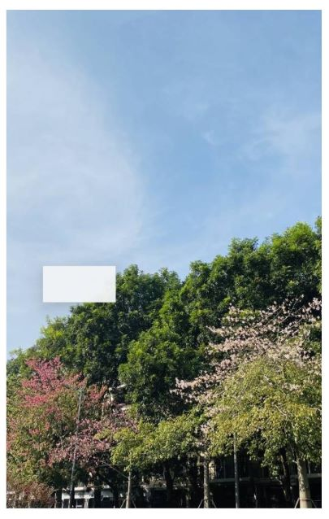

# @ohos.arkui.uiMaterial (系统材质)(系统接口)
<!--Kit: ArkUI-->
<!--Subsystem: ArkUI-->
<!--Owner: @hehongyang3-->
<!--Designer: @hehongyang3-->
<!--Tester: @lxl007-->
<!--Adviser: @Brilliantry_Rui-->

本模块提供系统材质的接口定义。不同的系统材质对应不同的UI效果，包括背景色[backgroundColor](arkui-ts/ts-universal-attributes-background.md#backgroundcolor)、边框颜色[borderColor](arkui-ts/ts-universal-attributes-border.md#bordercolor)、边框宽度[borderWidth](arkui-ts/ts-universal-attributes-border.md#borderwidth)、阴影[shadow](arkui-ts/ts-universal-attributes-image-effect.md#shadow)效果。

> **说明：**
>
> 本模块首批接口从API version 23开始支持。后续版本的新增接口，采用上角标单独标记接口的起始版本。

## 导入模块

``` ts
import { uiMaterial } from '@kit.ArkUI';
```

## MaterialType

系统材质类型枚举。

**模型约束：** 此接口仅可在Stage模型下使用。

**系统能力：** SystemCapability.ArkUI.ArkUI.Full

**系统接口：** 此接口为系统接口。

| 名称     | 值 | 说明              |
| ------ | --- | --------------- |
| NONE | 0 | 无系统材质效果。对应的效果为背景色[backgroundColor](arkui-ts/ts-universal-attributes-background.md#backgroundcolor)为透明色，边框颜色[borderColor](arkui-ts/ts-universal-attributes-border.md#bordercolor)为透明色，边框宽度[borderWidth](arkui-ts/ts-universal-attributes-border.md#borderwidth)为0，无阴影[shadow](arkui-ts/ts-universal-attributes-image-effect.md#shadow)。 |
| SEMI_TRANSPARENT | 1 | 半透明系统材质效果。对应的效果为：<br/>背景色[backgroundColor](arkui-ts/ts-universal-attributes-background.md#backgroundcolor)：浅色模式为"#f2f1f3f5"，深色模式为"#f2303131"。<br/>边框颜色[borderColor](arkui-ts/ts-universal-attributes-border.md#bordercolor)为混合10%的透明度的theme.colors.compForegroundPrimary的[token](../../ui/theme_skinning.md#系统缺省token色值)值。<br/>边框宽度[borderWidth](arkui-ts/ts-universal-attributes-border.md#borderwidth)为1vp。<br/>阴影[shadow](arkui-ts/ts-universal-attributes-image-effect.md#shadow)为ShadowStyle.OUTER_DEFAULT_SM。<br/>|

## ImmersiveStyle

材质样式枚举。以EC为后缀的部分枚举设置在[EffectComponent](arkui-ts/ts-container-effectcomponent-sys.md)上，以EC_SUB为后缀的部分材质设置在EffectComponent的子组件上，两者配合实现材质效果绘制的合并优化。设置在EffectComponent上的材质模糊最终将生效在子组件上。不同的材质样式对应不同的材质参数，主要包括材质的模糊程度、高光效果等，具体参见[ImmersiveStyle](arkts-apis-uimaterial.md#immersivestyle)。

**模型约束：** 此接口仅可在Stage模型下使用。

**原子化服务API：** 从API版本26.0.0开始，该接口支持在原子化服务中使用。

**系统能力：** SystemCapability.ArkUI.ArkUI.Full

**系统接口：** 此接口为系统接口。

**ArkTS-Dyn起始版本：** 26.0.0

**ArkTS-Sta起始版本：** 26.0.0

| 名称     | 值 | 说明              |
| ------ | --- | --------------- |
| ULTRA_THIN_EC | 5 | 超薄样式。材质层超薄，具有很强的透明效果。<br/>适用于[EffectComponent](arkui-ts/ts-container-effectcomponent-sys.md)。 |
| THIN_EC | 6 | 薄样式。材质层薄，具有较强的透明效果。<br/>适用于EffectComponent。 |
| REGULAR_EC | 7 | 常规样式。材质层的厚度常规。<br/>适用于EffectComponent。 |
| THICK_EC | 8 | 厚样式。模糊效果强。<br/>适用于EffectComponent。 |
| ULTRA_THICK_EC | 9 | 超厚样式。模糊效果很强。<br/>适用于EffectComponent。 |
| ULTRA_THIN_EC_SUB | 10 | 超薄样式。材质层超薄，具有很强的透明效果。<br/>适用于EffectComponent的子组件。 |
| THIN_EC_SUB | 11 | 薄样式。材质层薄，具有较强的透明效果。<br/>适用于EffectComponent的子组件。 |
| REGULAR_EC_SUB | 12 | 常规样式。材质层的厚度常规。<br/>适用于EffectComponent的子组件。 |
| THICK_EC_SUB | 13 | 厚样式。模糊效果强。<br/>适用于EffectComponent的子组件。 |
| ULTRA_THICK_EC_SUB | 14 | 超厚样式。模糊效果很强。<br/>适用于EffectComponent的子组件。 |

## uiMaterial.convertToECMaterial

convertToECMaterial(material: uiMaterial.ImmersiveMaterial): uiMaterial.ImmersiveMaterial

将一个[ImmersiveMaterial](arkts-apis-uimaterial.md#immersivematerial)材质转换为适用于[EffectComponent](arkui-ts/ts-container-effectcomponent-sys.md)的ImmersiveMaterial材质。

EffectComponent组件上不生效材质中的[materialColor](arkts-apis-uimaterial.md#immersiveoptions)、[applyShadow](arkts-apis-uimaterial.md#immersiveoptions)、[interactive](arkts-apis-uimaterial.md#immersiveoptions)、[lightEffect](arkts-apis-uimaterial.md#immersiveoptions)属性，经过该接口转换后的材质若配置的上述接口也将不会生效。

**模型约束：** 此接口仅可在Stage模型下使用。

**原子化服务API：** 从API版本26.0.0开始，该接口支持在原子化服务中使用。

**系统能力：** SystemCapability.ArkUI.ArkUI.Full

**系统接口：** 此接口为系统接口。

**ArkTS-Dyn起始版本：** 26.0.0

**ArkTS-Sta起始版本：** 26.0.0

**参数：**

| 参数名       | 类型                                                       | 必填 | 说明                                                         |
| ---------- | ----------------------------------------------------------- | ---- | ------------------------------------------------------------ |
|  material      | [uiMaterial.ImmersiveMaterial](arkts-apis-uimaterial.md#immersivematerial)                      | 是   | 待转换的沉浸式材质。    |

**返回值：**

| 类型   | 说明                     |
| ------ | ------------------------ |
| [uiMaterial.ImmersiveMaterial](arkts-apis-uimaterial.md#immersivematerial) | 经过转换后适用于[EffectComponent](arkui-ts/ts-container-effectcomponent-sys.md)的沉浸式材质。 |

## uiMaterial.convertToECSubMaterial

convertToECSubMaterial(material: uiMaterial.ImmersiveMaterial): uiMaterial.ImmersiveMaterial

将一个[ImmersiveMaterial](arkts-apis-uimaterial.md#immersivematerial)材质转换为适用于[EffectComponent](arkui-ts/ts-container-effectcomponent-sys.md)子组件的ImmersiveMaterial材质。

**模型约束：** 此接口仅可在Stage模型下使用。

**原子化服务API：** 从API版本26.0.0开始，该接口支持在原子化服务中使用。

**系统能力：** SystemCapability.ArkUI.ArkUI.Full

**系统接口：** 此接口为系统接口。

**ArkTS-Dyn起始版本：** 26.0.0

**ArkTS-Sta起始版本：** 26.0.0

**参数：**

| 参数名       | 类型                                                       | 必填 | 说明                                                         |
| ---------- | ----------------------------------------------------------- | ---- | ------------------------------------------------------------ |
|  material      | [uiMaterial.ImmersiveMaterial](arkts-apis-uimaterial.md#immersivematerial)                      | 是   | 待转换的沉浸式材质。    |

**返回值：**

| 类型   | 说明                     |
| ------ | ------------------------ |
| [uiMaterial.ImmersiveMaterial](arkts-apis-uimaterial.md#immersivematerial) | 经过转换后适用于[EffectComponent](arkui-ts/ts-container-effectcomponent-sys.md)子组件的沉浸式材质。 |


## MaterialOptions

系统材质选项。

**模型约束：** 此接口仅可在Stage模型下使用。

**系统能力：** SystemCapability.ArkUI.ArkUI.Full

**系统接口：** 此接口为系统接口。

| 名称       | 类型                                                        | 只读 | 可选 | 说明                                                     |
| ---------- | ----------------------------------------------------------- | ---- | ------- | ----------------------------------------------------- |
| type   | [MaterialType](#materialtype)                                   | 否 | 是   | 材质类型。<br/>默认值：MaterialType.NONE |

## Material

UI侧的系统材质对象。

### constructor

constructor(options?: MaterialOptions)

Material的构造函数。

**模型约束：** 此接口仅可在Stage模型下使用。

**系统能力：** SystemCapability.ArkUI.ArkUI.Full

**系统接口：** 此接口为系统接口。

**参数：** 

| 参数名       | 类型                                                       | 必填 | 说明                                                         |
| ---------- | ----------------------------------------------------------- | ---- | ------------------------------------------------------------ |
|  options      | [MaterialOptions](#materialoptions)                      | 否   | 系统材质配置选项，包括材质类型。<br/>默认值：{type:MaterialType.NONE}    |

## 示例

### 示例1（设置系统材质）

本示例介绍如何将半透明材质的Material对象通过[systemMaterial](arkui-ts/ts-universal-attributes-image-effect-sys.md#systemmaterial23)属性设置给组件。

``` ts
import { uiMaterial } from '@kit.ArkUI';

@Entry
@Component
struct SystemMaterialPage {
  build() {
    Column() {
      Stack() {
        Image($r('app.media.bg1')) // $r('app.media.bg1')需要替换为开发者所需的图像资源文件
          .width('100%')
          .height('100%')

        Column()
          .width(100)
          .height(50)
          .position({ x: 50, y: 350 })
          .systemMaterial(new uiMaterial.Material({ type: uiMaterial.MaterialType.SEMI_TRANSPARENT })) // 使用半透明的系统材质效果
      }
      .height('90%')
      .width('90%')
    }
    .height('100%')
    .width('100%')
    .alignItems(HorizontalAlign.Center)
    .justifyContent(FlexAlign.Center)
  }
}
```



### 示例2（使用EffectComponent设置系统材质）

本示例介绍如何使用[uiMaterial.convertToECMaterial](#uimaterialconverttoecmaterial)、[uiMaterial.convertToECSubMaterial](#uimaterialconverttoecsubmaterial)将[uiMaterial.ImmersiveMaterial](arkts-apis-uimaterial.md#immersivematerial)经过转换，分别设置到[EffectComponent](arkui-ts/ts-container-effectcomponent-sys.md)及其子组件上。

从API版本26.0.0开始，新增uiMaterial.convertToECMaterial、uiMaterial.convertToECSubMaterial接口。

```ts
import { uiMaterial } from '@kit.ArkUI';

@Entry
@Component
struct Index {
  @State myMaterialBase: uiMaterial.ImmersiveMaterial | undefined = new uiMaterial.ImmersiveMaterial({
    style: uiMaterial.ImmersiveStyle.ULTRA_THIN,
  });
  @State myMaterialEC: uiMaterial.ImmersiveMaterial | undefined = new uiMaterial.ImmersiveMaterial({
    style: uiMaterial.ImmersiveStyle.ULTRA_THIN_EC,
  });
  @State myMaterialECSub: uiMaterial.ImmersiveMaterial | undefined = new uiMaterial.ImmersiveMaterial({
    style: uiMaterial.ImmersiveStyle.ULTRA_THIN_EC_SUB,
  });

  build() {
    Stack() {
      // 请将$r('app.media.startIcon')替换为实际资源文件
      Image($r('app.media.startIcon'))
      Row() {
        // 推荐使用不同style为EffectComponent及其子组件设置材质
        EffectComponent() {
          Row() {
            Column()
              .width(100)
              .height(100)
              .systemMaterial(this.myMaterialECSub)
              .margin(5)
          }
        }
        .systemMaterial(this.myMaterialEC)

        EffectComponent() {
          Row() {
            Column()
              .width(100)
              .height(100)
              .systemMaterial(uiMaterial.convertToECSubMaterial(this.myMaterialBase))
              .margin(5)

            Column()
              .width(100)
              .height(100)
              .systemMaterial(uiMaterial.convertToECSubMaterial(this.myMaterialBase))
              .margin(5)
          }
        }
        .systemMaterial(uiMaterial.convertToECMaterial(this.myMaterialBase))
      }.height('100%').width('100%').justifyContent(FlexAlign.Center)
    }
  }
}
```
