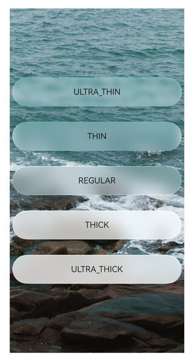
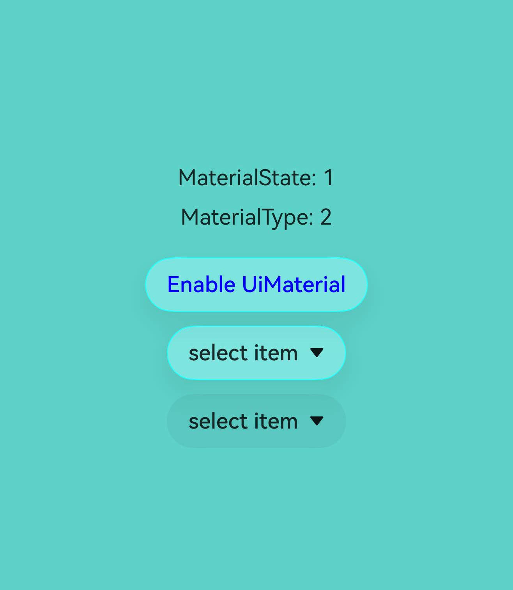
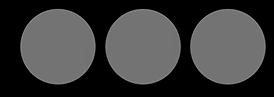

# @ohos.arkui.uiMaterial (系统材质)
<!--Kit: ArkUI-->
<!--Subsystem: ArkUI-->
<!--Owner: @hehongyang3-->
<!--Designer: @hehongyang3-->
<!--Tester: @lxl007-->
<!--Adviser: @Brilliantry_Rui-->

本模块提供系统材质的接口定义。不同的系统材质对应不同的UI效果，包括背景色[backgroundColor](arkui-ts/ts-universal-attributes-background.md#backgroundcolor)、边框颜色[borderColor](arkui-ts/ts-universal-attributes-border.md#bordercolor)、边框宽度[borderWidth](arkui-ts/ts-universal-attributes-border.md#borderwidth)、阴影[shadow](arkui-ts/ts-universal-attributes-image-effect.md#shadow)效果、材质层滤镜效果。材质对象本身在不同算力的设备上表现存在差异，设备算力的高、中、低档由设备厂商决定，分档效果具体参考[ImmersiveMaterial](#immersivematerial)的描述。

> **说明：**
>
> - 本模块同时支持ArkTS-Dyn、ArkTS-Sta。

**起始版本：** 26.0.0

## 导入模块

``` ts
import { uiMaterial } from '@kit.ArkUI';
```

## MaterialType

系统材质类型枚举。

**模型约束：** 此接口仅可在Stage模型下使用。

**原子化服务API：** 从API版本26.0.0开始，该接口支持在原子化服务中使用。

**系统能力：** SystemCapability.ArkUI.ArkUI.Full

**ArkTS-Dyn起始版本：** 26.0.0

**ArkTS-Sta起始版本：** 26.0.0

| 名称     | 值 | 说明              |
| ------ | --- | --------------- |
| NONE | 0 | 无材质类型。表示不应用任何材质效果。 |
| SEMI_TRANSPARENT | 1 | 半透明材质类型。包含预定义的backgroundColor、border和shadow效果。 |
| IMMERSIVE | 2 | 沉浸式材质类型。仅用于[MaterialInfo](#materialinfo)接口的type属性标识当前配置的材质类型，不映射到底层功能。实际材质效果通过[ImmersiveMaterial](#immersivematerial)类实现。 |

## MaterialState

材质使能状态枚举，表示应用级沉浸式系统材质配置的状态。

**模型约束：** 此接口仅可在Stage模型下使用。

**原子化服务API：** 从API版本26.0.0开始，该接口支持在原子化服务中使用。

**系统能力：** SystemCapability.ArkUI.ArkUI.Full

**ArkTS-Dyn起始版本：** 26.0.0

**ArkTS-Sta起始版本：** 26.0.0

| 名称     | 值 | 说明              |
| ------ | --- | --------------- |
| DEFAULT | 0 | 默认模式。[弹出框Dialog](../../ui/arkts-base-dialog-overview.md)、[即时反馈（Toast）](../../ui/arkts-create-toast.md)、[AlphabetIndexer](arkui-ts/ts-container-alphabet-indexer.md)在组件本身未设置背景颜色、模糊参数和阴影参数时默认开启沉浸式系统材质；[Text](arkui-ts/ts-basic-components-text.md)设置[copyOption](arkui-ts/ts-basic-components-text.md#copyoption9)后长按或双击触发的文本菜单默认开启沉浸式系统材质；其他组件由应用主动设置。 |
| ENABLE | 1 | 使能模式。[弹出框Dialog](../../ui/arkts-base-dialog-overview.md)、[即时反馈（Toast）](../../ui/arkts-create-toast.md)、[AlphabetIndexer](arkui-ts/ts-container-alphabet-indexer.md)、[ChipGroup](arkui-ts/ohos-arkui-advanced-ChipGroup.md)、[Chip](arkui-ts/ohos-arkui-advanced-Chip.md)、[Select](arkui-ts/ts-basic-components-select.md)、[菜单控制](arkui-ts/ts-universal-attributes-menu.md)、[Toggle](arkui-ts/ts-basic-components-toggle.md)、[SegmentButton](arkui-ts/ohos-arkui-advanced-SegmentButton.md)、[SegmentButtonV2](arkui-ts/ohos-arkui-advanced-SegmentButtonV2.md)、[Slider](arkui-ts/ts-basic-components-slider.md)、[bindSheet](arkui-ts/ts-universal-attributes-sheet-transition.md#bindsheet)、[SelectionMenu](arkui-ts/ohos-arkui-advanced-SelectionMenu.md)组件默认开启沉浸式系统材质；[Text](arkui-ts/ts-basic-components-text.md)设置[copyOption](arkui-ts/ts-basic-components-text.md#copyoption9)后长按或双击触发的文本菜单默认开启沉浸式系统材质。此模式下，沉浸式系统材质样式生效的优先级高于组件本身设置的背景色、模糊、阴影和边框样式。其他组件需开发者主动设置。|
| DISABLE | 2 | 禁用模式。所有组件禁止开启沉浸式系统材质，即使主动为组件设置沉浸式系统材质参数也不会生效。 |

## MaterialInfo

材质配置信息，包含材质使能状态和材质类型。

**模型约束：** 此接口仅可在Stage模型下使用。

**原子化服务API：** 从API版本26.0.0开始，该接口支持在原子化服务中使用。

**系统能力：** SystemCapability.ArkUI.ArkUI.Full

**ArkTS-Dyn起始版本：** 26.0.0

**ArkTS-Sta起始版本：** 26.0.0

| 名称       | 类型                                                        | 只读 | 可选 | 说明                                                     |
| ---------- | ----------------------------------------------------------- | ---- | ------- | ----------------------------------------------------- |
| state   | [MaterialState](#materialstate)                                   | 否 | 否   | 材质使能状态配置。 |
| type   | [MaterialType](#materialtype)                                   | 否 | 否   | 材质类型标识，表示当前配置对应的材质类型。该值仅用于类型标识，不映射到底层功能。 |

## uiMaterial.getMaterialInfo

getMaterialInfo(): MaterialInfo

获取当前应用的材质配置信息。返回的配置信息来自应用在[module.json5](../../quick-start/module-configuration-file.md)中配置的metadata。

**模型约束：** 此接口仅可在Stage模型下使用。

**原子化服务API：** 从API版本26.0.0开始，该接口支持在原子化服务中使用。

**系统能力：** SystemCapability.ArkUI.ArkUI.Full

**ArkTS-Dyn起始版本：** 26.0.0

**ArkTS-Sta起始版本：** 26.0.0

**返回值：**

| 类型   | 说明                     |
| ------ | ------------------------ |
| [MaterialInfo](#materialinfo) | 返回当前应用的材质配置信息，包含材质使能状态和材质类型。 |

## ImmersiveStyle

沉浸式材质样式枚举。不同的材质样式对应不同的材质参数，主要包括材质的模糊程度、高光效果等。

**模型约束：** 此接口仅可在Stage模型下使用。

**原子化服务API：** 从API版本26.0.0开始，该接口支持在原子化服务中使用。

**系统能力：** SystemCapability.ArkUI.ArkUI.Full

**ArkTS-Dyn起始版本：** 26.0.0

**ArkTS-Sta起始版本：** 26.0.0

| 名称     | 值 | 说明              |
| ------ | --- | --------------- |
| ULTRA_THIN | 0 | 超薄样式。材质层超薄，具有很强的透明效果。 |
| THIN | 1 | 薄样式。材质层薄，具有较强的透明效果。 |
| REGULAR | 2 | 常规样式。材质层的厚度常规。 |
| THICK | 3 | 厚样式。模糊效果强。 |
| ULTRA_THICK | 4 | 超厚样式。模糊效果很强。 |

## LightEffectOptions

沉浸式材质的光感交互反馈配置。用于自定义反馈光感的颜色。

**模型约束：** 此接口仅可在Stage模型下使用。

**原子化服务API：** 从API版本26.0.0开始，该接口支持在原子化服务中使用。

**系统能力：** SystemCapability.ArkUI.ArkUI.Full

**ArkTS-Dyn起始版本：** 26.0.0

**ArkTS-Sta起始版本：** 26.0.0

| 名称                           | 类型                                     | 只读 | 可选 | 说明                                     |
| ----------------------------- | ---------------------------------------- | ---- | ---------------------------------------- | ---------------------------------------- |
| color       | [ResourceColor](./arkui-ts/ts-types.md#resourcecolor) | 否    | 是   | 自定义交互反馈光感的颜色。<br/>默认值：Color.White |

## ImmersiveOptions

沉浸式材质参数。

**模型约束：** 此接口仅可在Stage模型下使用。

**原子化服务API：** 从API版本26.0.0开始，该接口支持在原子化服务中使用。

**系统能力：** SystemCapability.ArkUI.ArkUI.Full

**ArkTS-Dyn起始版本：** 26.0.0

**ArkTS-Sta起始版本：** 26.0.0

| 名称       | 类型                                                        | 只读 | 可选 | 说明                                                     |
| ---------- | ----------------------------------------------------------- | ---- | ------- | ----------------------------------------------------- |
| style   | [ImmersiveStyle](#immersivestyle)                                   | 否 | 是   | 材质样式。不同样式对应不同的材质参数，影响材质的厚度。<br/>**说明**：该参数仅对高档和中档算力设备的显示效果生效。<br/>默认值：ImmersiveStyle.REGULAR |
| materialColor   | [ResourceColor](arkui-ts/ts-types.md#resourcecolor)                                   | 否 | 是   | 材质层赋色，该参数会为材质滤镜再混合一层纯色效果。该颜色需要带一定的透明度值，不能为纯不透明的颜色，否则会将材质滤镜效果完全遮挡。<br/>**说明**：该参数仅对高档和中档算力设备的显示效果生效。<br/>默认值：Color.Transparent |
| colorInvert   | boolean                                   | 否 | 是   | 设置了材质对象的节点的子树是否自动适配材质到背景色的反色。<br/>若为false，则不会自动反色。<br/>若为true，则只有材质参数足够薄时才会自动反色。具体能反色的材质由系统定义，材质样式至少为THIN或ULTRA_THIN，且与设置应用的沉浸光感的强弱配置相关。材质越薄、沉浸光感越强，越容易符合反色材质的要求。<br/>自动反色能力仅对部分属性接口设置特殊资源值时生效，生效的属性接口包括：Text组件的[fontColor](arkui-ts/ts-basic-components-text.md#fontcolor)，Button组件的[fontColor](arkui-ts/ts-basic-components-button.md#fontcolor)，SymbolGlyph组件的[fontColor](arkui-ts/ts-basic-components-symbolGlyph.md#fontcolor)，Image组件的[fillColor](arkui-ts/ts-basic-components-image.md#fillcolor)，Search组件的[placeholderColor](arkui-ts/ts-basic-components-search.md#placeholdercolor)、[fontColor](arkui-ts/ts-basic-components-search.md#fontcolor10)、[searchIcon](arkui-ts/ts-basic-components-search.md#searchicon10)中的图标颜色、[cancelButton](arkui-ts/ts-basic-components-search.md#cancelbutton10)中的图标颜色、[caretStyle](arkui-ts/ts-basic-components-search.md#caretstyle10)中的光标颜色，TabContent组件的[tabBar](arkui-ts/ts-container-tabcontent.md#tabbar)属性使用[BottomTabBarStyle](arkui-ts/ts-container-tabcontent.md#bottomtabbarstyle9)样式时其中的文本和图标颜色。<br/>**说明**：该参数仅对高档和中档算力设备的显示效果生效。<br/>默认值：false |
| applyShadow   | boolean                                   | 否 | 是   | 是否添加材质的阴影效果。<br/>当该参数为true时，材质中的阴影效果固定生效，优先于[shadow](arkui-ts/ts-universal-attributes-image-effect.md#shadow)通用属性。当该参数为false时，shadow通用属性生效，材质的阴影效果不生效。<br/>**说明**：该参数仅对所有档位的算力设备的显示效果生效。<br/>默认值：true |
| interactive   | boolean                                   | 否 | 是   | 是否为设置材质的组件设置交互形变效果。<br/>**说明**：该参数对所有档位的算力设备的显示效果生效。<br/>默认值：false |
| lightEffect   | [LightEffectOptions](#lighteffectoptions) \| null                                   | 否 | 是   | 是否为设置材质的组件设置光感交互反馈效果。当该参数为null时，禁用光感交互反馈效果。<br/>**说明**：该参数对所有档位的算力设备的显示效果生效。<br/>默认值：undefined，不设置光感交互反馈效果。 |
## MaterialOptions

系统材质配置选项接口。

**模型约束：** 此接口仅可在Stage模型下使用。

**系统能力：** SystemCapability.ArkUI.ArkUI.Full

| 名称       | 类型                                                        | 只读 | 可选 | 说明                                                     |
| ---------- | ----------------------------------------------------------- | ---- | ------- | ----------------------------------------------------- |
| type   | [MaterialType](#materialtype)                                   | 否 | 是   | 材质类型。<br/>默认值：MaterialType.NONE |


## Material

系统材质对象基类。

**模型约束：** 此接口仅可在Stage模型下使用。

**原子化服务API：** 从API版本26.0.0开始，该接口支持在原子化服务中使用。

**卡片能力：** 从API版本26.0.0开始，该接口支持在ArkTS卡片中使用。

**系统能力：** SystemCapability.ArkUI.ArkUI.Full

**ArkTS-Dyn起始版本：** 26.0.0

**ArkTS-Sta起始版本：** 26.0.0

### constructor

constructor(options?: MaterialOptions)

Material的构造函数。

**模型约束：** 此接口仅可在Stage模型下使用。

**系统能力：** SystemCapability.ArkUI.ArkUI.Full

**参数：** 

| 参数名       | 类型                                                       | 必填 | 说明                                                         |
| ---------- | ----------------------------------------------------------- | ---- | ------------------------------------------------------------ |
|  options      | [MaterialOptions](#materialoptions)                      | 否   | 系统材质配置选项。<br/>默认值：{type:MaterialType.NONE}。    |

### empty

static get empty(): Material

返回空材质对象，用于组件单独关闭沉浸式系统材质效果。使用方式为`uiMaterial.Material.empty`。

在enable模式下，可通过设置`systemMaterial(uiMaterial.Material.empty)`来单独关闭某个组件的沉浸式系统材质效果。如果组件未支持组件级沉浸式系统材质接口，则无法通过此方法关闭材质效果。

**模型约束：** 此接口仅可在Stage模型下使用。

**原子化服务API：** 从API版本26.0.0开始，该接口支持在原子化服务中使用。

**系统能力：** SystemCapability.ArkUI.ArkUI.Full

**ArkTS-Dyn起始版本：** 26.0.0

**ArkTS-Sta起始版本：** 26.0.0

**返回值：**

| 类型   | 说明                     |
| ------ | ------------------------ |
| [Material](#material) | 返回空材质对象，表示无材质效果。 |

## ImmersiveMaterial

沉浸式材质类，继承自[Material](#material)。

沉浸式材质根据设备算力有分档表现，设备算力的高、中、低档由设备厂商决定，定义在系统配置文件中。在高档和中档算力设备上，影响材质层滤镜效果和阴影[shadow](arkui-ts/ts-universal-attributes-image-effect.md#shadow)效果。在低档算力设备上，影响背景色[backgroundColor](arkui-ts/ts-universal-attributes-background.md#backgroundcolor)、边框颜色[borderColor](arkui-ts/ts-universal-attributes-border.md#bordercolor)、边框宽度[borderWidth](arkui-ts/ts-universal-attributes-border.md#borderwidth)、阴影[shadow](arkui-ts/ts-universal-attributes-image-effect.md#shadow)效果。且同一材质的效果，会受到设置应用中沉浸光感配置项的影响，不同强弱程度的沉浸光感配置下，材质的参数和效果存在差异。

### constructor

constructor(options?: ImmersiveOptions)

ImmersiveMaterial的构造函数。

**模型约束：** 此接口仅可在Stage模型下使用。

**原子化服务API：** 从API版本26.0.0开始，该接口支持在原子化服务中使用。

**系统能力：** SystemCapability.ArkUI.ArkUI.Full

**ArkTS-Dyn起始版本：** 26.0.0

**ArkTS-Sta起始版本：** 26.0.0

**参数：** 

| 参数名       | 类型                                                       | 必填 | 说明                                                         |
| ---------- | ----------------------------------------------------------- | ---- | ------------------------------------------------------------ |
|  options      | [ImmersiveOptions](#immersiveoptions)                      | 否   | 系统材质配置选项，包括材质样式、材质层赋色等。<br/>默认值参考ImmersiveOptions接口各参数的默认值，即{style:ImmersiveStyle.REGULAR, materialColor:Color.Transparent, colorInvert:false, applyShadow:true, interactive:false, lightEffect:undefined}。    |

## 示例

### 示例1（设置沉浸式系统材质）

本示例介绍如何将沉浸式材质的[ImmersiveMaterial](#immersivematerial)对象通过[systemMaterial](arkui-ts/ts-universal-attributes-image-effect.md#systemmaterial)属性设置给组件。

从API版本26.0.0开始，新增ImmersiveMaterial对象和systemMaterial属性。

``` ts
import { uiMaterial } from '@kit.ArkUI';

@Entry
@Component
struct SystemMaterialPage {

  build() {
    Column() {
      Stack() {
        Image($r('app.media.bg1')) // $r('app.media.bg1')需要替换为开发者所需的图像资源文件
          .width('100%')
          .height('100%')

        Column({ space: 30 }) {
          Column() {
            Text("ULTRA_THIN")
          }
          .width(328)
          .height(56)
          .borderRadius(28)
          .justifyContent(FlexAlign.Center)
          .alignItems(HorizontalAlign.Center)
          .systemMaterial(new uiMaterial.ImmersiveMaterial({
            style: uiMaterial.ImmersiveStyle.ULTRA_THIN,
          }))

          Column() {
            Text("THIN")
          }
          .width(328)
          .height(56)
          .borderRadius(28)
          .justifyContent(FlexAlign.Center)
          .alignItems(HorizontalAlign.Center)
          .systemMaterial(new uiMaterial.ImmersiveMaterial({
            style: uiMaterial.ImmersiveStyle.THIN,
          }))

          Column() {
            Text("REGULAR")
          }
          .width(328)
          .height(56)
          .borderRadius(28)
          .justifyContent(FlexAlign.Center)
          .alignItems(HorizontalAlign.Center)
          .systemMaterial(new uiMaterial.ImmersiveMaterial({
            style: uiMaterial.ImmersiveStyle.REGULAR,
          }))

          Column() {
            Text("THICK")
          }
          .width(328)
          .height(56)
          .borderRadius(28)
          .justifyContent(FlexAlign.Center)
          .alignItems(HorizontalAlign.Center)
          .systemMaterial(new uiMaterial.ImmersiveMaterial({
            style: uiMaterial.ImmersiveStyle.THICK,
          }))

          Column() {
            Text("ULTRA_THICK")
          }
          .width(328)
          .height(56)
          .borderRadius(28)
          .justifyContent(FlexAlign.Center)
          .alignItems(HorizontalAlign.Center)
          .systemMaterial(new uiMaterial.ImmersiveMaterial({
            style: uiMaterial.ImmersiveStyle.ULTRA_THICK,
          }))
        }
      }
      .height('90%')
      .width('90%')
    }
    .height('100%')
    .width('100%')
    .alignItems(HorizontalAlign.Center)
    .justifyContent(FlexAlign.Center)
  }
}
```

在低档算力设备上表现：


在中档算力设备上表现：


在高档算力设备上表现：



### 示例2（获取材质配置信息并使用空材质关闭沉浸式系统材质）

本示例介绍如何通过[uiMaterial.getMaterialInfo](#uimaterialgetmaterialinfo)获取当前应用的材质配置信息，并根据配置状态使用[empty](#empty)关闭特定组件的沉浸式系统材质效果。

从API版本26.0.0开始，新增uiMaterial.getMaterialInfo方法和empty方法。

首先在[module.json5](../../quick-start/module-configuration-file.md)文件中配置开关信息，需注意只有在entry类型的module中配置才会生效。
``` json5
{
  "module": {
    // ···
    "type": "entry", // 需注意只有在entry类型的module中配置才会生效。
    // ···
    "metadata": [{
      "name": "ohos.arkui.UIMaterial.state",
      "value": "enable"
    }],
    // ···
  }
}
```
然后按照如下内容编写测试代码。
``` ts
import { uiMaterial } from '@kit.ArkUI';

@Entry
@Component
struct MaterialInfoPage {
  // 获取材质配置信息
  private info: uiMaterial.MaterialInfo = uiMaterial.getMaterialInfo();
  build() {
    Column() {
      Text(`MaterialState: ${this.info.state}`)
        .fontSize(16)
        .margin({ bottom: 10 })
      Text(`MaterialType: ${this.info.type}`)
        .fontSize(16)
        .margin({ bottom: 20 })

      // 根据状态决定组件行为
      if (this.info.state === uiMaterial.MaterialState.ENABLE) {
        // 主动使用沉浸式材质
        Button('Enable UiMaterial')
          .backgroundColor(Color.Transparent)
          .systemMaterial(new uiMaterial.ImmersiveMaterial({
            style: uiMaterial.ImmersiveStyle.ULTRA_THIN
          }))
          .fontColor(Color.Blue)
          .margin({ bottom: 10 })
        // Select组件默认开启沉浸式系统材质
        Select([
          {value: 'select item'}
        ]).value('select item')
        .margin({ bottom: 10 })
        // 单独关闭Select组件的沉浸式系统材质
        Select([
          {value: 'select item'}
        ]).value('select item')
        .systemMaterial(uiMaterial.Material.empty)
      }
    }
    .width('100%')
    .height('100%')
    .justifyContent(FlexAlign.Center)
    // $r('app.media.img')需要替换为开发者所需的图像资源文件
    .backgroundImage($r('app.media.img')).backgroundImageSize(ImageSize.FILL)
  }
}
```

在高档算力设备上表现：



### 示例3（设置组件材质的交互形变效果）

本示例介绍如何通过[ImmersiveOptions](#immersiveoptions)中的interactive接口使组件实现交互形变效果。

从API版本26.0.0开始，新增interactive接口。

``` ts
import { uiMaterial } from '@kit.ArkUI'

@Entry
@Component
struct Index {
  build() {
    Stack() {
      Image($r('app.media.startIcon'))
      Column() {
        Column() {
          Text("Context")
        }
        .margin({ bottom: 100 })
        .width(248)
        .height(56)
        .borderRadius(28)
        .justifyContent(FlexAlign.Center)
        .alignItems(HorizontalAlign.Center)
        .systemMaterial(new uiMaterial.ImmersiveMaterial({
          style: uiMaterial.ImmersiveStyle.ULTRA_THIN,
          interactive: true,
        }))
      }.height('100%').width('100%').justifyContent(FlexAlign.Center)
    }
  }
}
```


### 示例4（设置组件材质的光感交互反馈效果）

本示例介绍如何通过[ImmersiveOptions](#immersiveoptions)中的lightEffect接口使组件实现光感交互反馈效果。

从API版本26.0.0开始，新增lightEffect接口。

``` ts
import { uiMaterial } from '@kit.ArkUI';

@Entry
@Component
struct LightEffect {
  @State itemsKey: number[] = [0, 1, 2];
  @State circleRadius: number = 40;
  @State spaceValue: number = 10;
  @State myMaterial: uiMaterial.Material = new uiMaterial.ImmersiveMaterial({
    style: uiMaterial.ImmersiveStyle.ULTRA_THIN,
    interactive: true,
    lightEffect: { color: undefined },
  });

  build() {
    Column() {
      Row() {
        Text("标题")
          .flexGrow(2)
          .fontColor(Color.White)
        Row({ space: this.spaceValue }) {
          ForEach(this.itemsKey, (item: number, index: number) => {
            Row()
              .width(this.circleRadius * 2)
              .height(this.circleRadius * 2)
              .borderRadius(this.circleRadius)
              .systemMaterial(this.myMaterial)
          })
        }
      }
      .justifyContent(FlexAlign.End)
      .backgroundColor(Color.Black)
      .width('100%')
      .padding(20)
    }
    .height('100%')
    .width('100%')
  }
}
```


