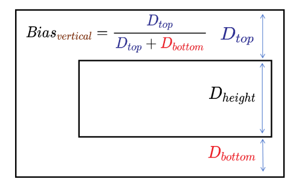

# Bias

```TypeScript
declare interface Bias
```

设置组件在锚点约束下的偏移参数。

以水平方向Bias为例，其值为组件到左锚点的距离 D&lt;sub&gt;start&lt;/sub&gt;与组件到水平方向锚点间总距离 D&lt;sub&gt;start&lt;/sub&gt; + D&lt;sub&gt;end&lt;/sub&gt;的比值。镜像语言下，D&lt;sub&gt;start&lt;/ sub&gt;为组件到右锚点的距离。下图中D&lt;sub&gt;width&lt;/sub&gt;表示组件宽度。


竖直方向同理，其值为组件到上锚点的距离D&lt;sub&gt;top&lt;/sub&gt;与组件到竖直方向锚点间总距离D&lt;sub&gt;top&lt;/sub&gt; + D&lt;sub&gt;bottom&lt;/sub&gt;的比值。下图中D&lt;sub&gt;height&lt;/sub&gt;表示组件高度。



**起始版本：** 11

**系统能力：** SystemCapability.ArkUI.ArkUI.Full

## horizontal

```TypeScript
horizontal?: number
```

水平方向上的bias值。

当子组件的width属性有正确值并且有2个水平方向的锚点时生效，设置的值必须大于等于0。

默认值： 0.5

**类型：** number

**默认值：** 0.5

**起始版本：** 11

**模型约束：** 此接口仅可在Stage模型下使用。

**原子化服务API：** 从API版本12开始，该接口支持在原子化服务中使用。

**卡片能力：** 从API版本11开始，该接口支持在ArkTS卡片中使用。

**系统能力：** SystemCapability.ArkUI.ArkUI.Full

## vertical

```TypeScript
vertical?: number
```

垂直方向上的bias值。

当子组件的height属性有正确值并且有2个垂直方向的锚点时生效，设置的值必须大于等于0。

默认值： 0.5

**类型：** number

**默认值：** 0.5

**起始版本：** 11

**模型约束：** 此接口仅可在Stage模型下使用。

**原子化服务API：** 从API版本12开始，该接口支持在原子化服务中使用。

**卡片能力：** 从API版本11开始，该接口支持在ArkTS卡片中使用。

**系统能力：** SystemCapability.ArkUI.ArkUI.Full
