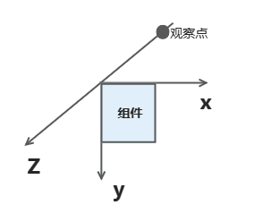

# CommonMethod

```TypeScript
declare class CommonMethod<T>
```

CommonMethod.

**起始版本：** 11

**系统能力：** SystemCapability.ArkUI.ArkUI.Full

## accessibilityActionOptions

```TypeScript
accessibilityActionOptions(option: AccessibilityActionOptions | undefined): T
```

设置组件无障碍操作的可选参数，用于限制或修改屏幕朗读等辅助应用发起的操作行为。

**起始版本：** 23

**模型约束：** 此接口仅可在Stage模型下使用。

**原子化服务API：** 从API版本23开始，该接口支持在原子化服务中使用。

**卡片能力：** 从API版本23开始，该接口支持在ArkTS卡片中使用。

**系统能力：** SystemCapability.ArkUI.ArkUI.Full

**参数：**

| 参数名 | 类型 | 必填 | 说明 |
| --- | --- | --- | --- |
| option | [AccessibilityActionOptions](../arkts-apis/arkts-arkui-accessibilityactionoptions-i.md) &#124; undefined | 是 | 无障碍操作的参数，用于限制或者修改无障碍操作下的滑动行为。<br> AccessibilityActionOptions中的scrollStep用于设置无障碍操作下的滑动步数。取值为undefined时scrollStep按1处理。 |

**返回值：**

| 类型 | 说明 |
| --- | --- |
| T | 返回当前对象。 |

## accessibilityChecked

```TypeScript
accessibilityChecked(isCheck: boolean): T
```

无障碍节点是否选中的状态维护，用于支持多选，表示组件是否被选中。此接口只影响屏幕朗读场景下的组件状态播报信息。

**起始版本：** 13

**模型约束：** 此接口仅可在Stage模型下使用。

**原子化服务API：** 从API版本13开始，该接口支持在原子化服务中使用。

**卡片能力：** 从API版本13开始，该接口支持在ArkTS卡片中使用。

**系统能力：** SystemCapability.ArkUI.ArkUI.Full

**参数：**

| 参数名 | 类型 | 必填 | 说明 |
| --- | --- | --- | --- |
| isCheck | boolean | 是 | 用于表示组件是否被选中。<br>支持的值为：<br>true：当前组件被选中。<br>false：当前组件未被选中。<br> undefined：由组件自行确定选中状态。<br>默认值：undefined **说明：** <br>1. 使用该接口设置true或false后，会默认修改该组件的checkable属性为true。 2. accessibilityChecked属性代表组件是多选模式，而accessibilitySelected属性代表组件是单选模式。 组件不能同时存在两种选择模式，会造成无障碍状态冲突，导致屏幕朗读等无障碍辅助应用无法正确识别选中状态。如使用当前接口设置组件为多选模式（设置为true、false），则需要保证未使用accessibilitySelected函数设置属性为true或者false，如果已设置，需使用accessibilitySelected函数设置accessibilitySelected属性为undefined模式。 |

**返回值：**

| 类型 | 说明 |
| --- | --- |
| T | 返回当前对象。 |

## accessibilityCustomActions

```TypeScript
accessibilityCustomActions(actions: Array<AccessibilityCustomAction> | undefined): T
```

设置组件的自定义无障碍操作，支持开发者设置一个自定义actions的数组，用于给组件按操作名进行自定义操作的回调绑定。

**起始版本：** 26.0.0

**模型约束：** 此接口仅可在Stage模型下使用。

**原子化服务API：** 从API版本26.0.0开始，该接口支持在原子化服务中使用。

**卡片能力：** 从API版本26.0.0开始，该接口支持在ArkTS卡片中使用。

**系统能力：** SystemCapability.ArkUI.ArkUI.Full

**参数：**

| 参数名 | 类型 | 必填 | 说明 |
| --- | --- | --- | --- |
| actions | Array&lt;[AccessibilityCustomAction](../arkts-apis/arkts-arkui-accessibilitycustomaction-i.md)&gt; &#124; undefined | 是 | 自定义无障碍操作数组，每个操作包含操作名称和回调，用于给组件按操作名进行自定义操作的回调绑定。<br>**说明：** <br>数组长度最大支持16个，超出部分将不生效。取值为undefined时，不设置自定义操作。 |

**返回值：**

| 类型 | 说明 |
| --- | --- |
| T | 返回当前对象。 |

## accessibilityDefaultFocus

```TypeScript
accessibilityDefaultFocus(focus: boolean): T
```

为页面设置屏幕朗读初始焦点。屏幕朗读首次进入当前页面时，会将焦点定位到设置为true的组件，便于开发者引导用户优先关注页面核心内容。

**起始版本：** 18

**模型约束：** 此接口仅可在Stage模型下使用。

**原子化服务API：** 从API版本18开始，该接口支持在原子化服务中使用。

**卡片能力：** 从API版本18开始，该接口支持在ArkTS卡片中使用。

**系统能力：** SystemCapability.ArkUI.ArkUI.Full

**参数：**

| 参数名 | 类型 | 必填 | 说明 |
| --- | --- | --- | --- |
| focus | boolean | 是 | 为页面设置屏幕朗读初始焦点。值为true则表示该组件为当前页默认首焦点，值为false则不设置该组件为默认首焦点。 |

**返回值：**

| 类型 | 说明 |
| --- | --- |
| T | 返回当前对象。 |

## accessibilityDescription

```TypeScript
accessibilityDescription(value: string): T
```

设置无障碍说明，支持通过Resource引用资源文件。该属性用于为用户进一步说明当前组件，开发人员可为组件设置相对较详细的解释文本，帮助用户理解将要执行的操作。

**起始版本：** 10

**模型约束：** 此接口仅可在Stage模型下使用。

**原子化服务API：** 从API版本11开始，该接口支持在原子化服务中使用。

**卡片能力：** 从API版本12开始，该接口支持在ArkTS卡片中使用。

**系统能力：** SystemCapability.ArkUI.ArkUI.Full

**参数：**

| 参数名 | 类型 | 必填 | 说明 |
| --- | --- | --- | --- |
| value | string | 是 | 无障碍说明，用于为用户进一步说明当前组件，开发人员可为组件的该属性设置相对较详细的解释文本，帮助用户理解将要执行的操作。如帮助用户理解将要执行的操作可能导致什么后果，尤其是当这些后果无法从组件本身属性与无障碍文本中了解到时。若组件既拥有文本属性又拥有无障碍说明属性，则组件被选中时，先播报组件的文本属性，再播报无障碍说明属性的内容。默认值：“” |

**返回值：**

| 类型 | 说明 |
| --- | --- |
| T | 返回当前对象。 |

<a id="accessibilitydescription-1"></a>

## accessibilityDescription

```TypeScript
accessibilityDescription(description: Resource): T
```

设置无障碍说明，支持通过Resource引用资源文件。该属性用于为用户进一步说明当前组件，开发人员可为组件设置相对较详细的解释文本，帮助用户理解将要执行的操作。

**起始版本：** 12

**模型约束：** 此接口仅可在Stage模型下使用。

**原子化服务API：** 从API版本12开始，该接口支持在原子化服务中使用。

**卡片能力：** 从API版本12开始，该接口支持在ArkTS卡片中使用。

**系统能力：** SystemCapability.ArkUI.ArkUI.Full

**参数：**

| 参数名 | 类型 | 必填 | 说明 |
| --- | --- | --- | --- |
| description | [Resource](../arkts-apis/arkts-arkui-resource-t.md) | 是 | 无障碍说明引用资源，用于为用户进一步说明当前组件，开发人员可为组件的该属性设置相对较详细的解释文本，帮助用户理解将要执行的操作。如帮助用户理解将要执行的操作可能导致什么后果，尤其是当这些后果无法从组件本身属性与无障碍文本中了解到时。若组件既拥有文本属性又拥有无障碍说明属性，则组件被选中时，先播报组件的文本属性，再播报无障碍说明属性的内容。 |

**返回值：**

| 类型 | 说明 |
| --- | --- |
| T | 返回当前对象。 |

## accessibilityFocusDrawLevel

```TypeScript
accessibilityFocusDrawLevel(drawLevel: FocusDrawLevel): T
```

设置无障碍焦点绿框的绘制层级。

**起始版本：** 19

**模型约束：** 此接口仅可在Stage模型下使用。

**原子化服务API：** 从API版本19开始，该接口支持在原子化服务中使用。

**卡片能力：** 从API版本19开始，该接口支持在ArkTS卡片中使用。

**系统能力：** SystemCapability.ArkUI.ArkUI.Full

**参数：**

| 参数名 | 类型 | 必填 | 说明 |
| --- | --- | --- | --- |
| drawLevel | [FocusDrawLevel](../arkts-apis/arkts-arkui-focusdrawlevel-e.md) | 是 | 无障碍焦点绿框的绘制层级，用于控制绿框的绘制位置。默认情况下在聚焦节点层级绘制（即绘制聚焦节点本身）。可选值及含义参见FocusDrawLevel枚举，包括在聚焦节点层级绘制和在Z序控制顶层绘制两种模式。 |

**返回值：**

| 类型 | 说明 |
| --- | --- |
| T | 返回当前对象。 |

## accessibilityGroup

```TypeScript
accessibilityGroup(value: boolean): T
```

设置是否启用无障碍分组。启用无障碍分组后，组件及其子组件作为一整个可选中组件，无障碍服务不再关注子组件内容。若组件启用无障碍分组，当组件不包含通用文本属性，同时未设置无障碍文本accessibilityText时，将默认拼接其子组件的通用文本属性作为组件的合并文本。若某一子组件没有通用文本属性，则忽略该子组件不进行拼接，此时合并文本不使用子组件的无障碍文本。当子组件accessibilityLevel设置为"yes"时则不受accessibilityGroup约束，在满足屏幕朗读其他规则下，子组件可聚焦。通过accessibilityPreferred启用优先拼接无障碍文本进行朗读后，将优先拼接其子组件的无障碍文本属性作为组件的合并文本。若某一子组件未设置无障碍文本，则继续拼接该子组件的通用文本属性，若该子组件没有通用文本属性，则忽略该子组件不进行拼接。从API version 23开始，通过accessibilityOptions中的相关配置项（stateControllerRoleType或stateControllerId、actionControllerRoleType或actionControllerId），可以指定一个特定子组件，由该子组件的状态信息和点击事件来接管当前聚合组件的无障碍能力。

**起始版本：** 12

**模型约束：** 此接口仅可在Stage模型下使用。

**原子化服务API：** 从API版本12开始，该接口支持在原子化服务中使用。

**卡片能力：** 从API版本12开始，该接口支持在ArkTS卡片中使用。

**系统能力：** SystemCapability.ArkUI.ArkUI.Full

**参数：**

| 参数名 | 类型 | 必填 | 说明 |
| --- | --- | --- | --- |
| value | boolean | 是 | 无障碍分组，设置为true时表示该组件及其所有子组件为一整个可以选中的组件，无障碍服务将不再关注其子组件内容，会合并子组件的文本与无障碍信息，并将其发送至无障碍服务；设置为false表示不启用无障碍分组。默认值：false |

**返回值：**

| 类型 | 说明 |
| --- | --- |
| T | 返回当前对象。 |

<a id="accessibilitygroup-1"></a>

## accessibilityGroup

```TypeScript
accessibilityGroup(isGroup: boolean, accessibilityOptions: AccessibilityOptions): T
```

设置是否启用无障碍分组。启用无障碍分组后，组件及其子组件作为一整个可选中组件，无障碍服务不再关注子组件内容。若组件启用无障碍分组，当组件不包含通用文本属性，同时未设置无障碍文本accessibilityText时，将默认拼接其子组件的通用文本属性作为组件的合并文本。若某一子组件没有通用文本属性，则忽略该子组件不进行拼接，此时合并文本不使用子组件的无障碍文本。当子组件accessibilityLevel设置为"yes"时则不受accessibilityGroup约束，在满足屏幕朗读其他规则下，子组件可聚焦。通过accessibilityPreferred启用优先拼接无障碍文本进行朗读后，将优先拼接其子组件的无障碍文本属性作为组件的合并文本。若某一子组件未设置无障碍文本，则继续拼接该子组件的通用文本属性，若该子组件没有通用文本属性，则忽略该子组件不进行拼接。从API version 23开始，通过accessibilityOptions中的相关配置项（stateControllerRoleType或stateControllerId、actionControllerRoleType或actionControllerId），可以指定一个特定子组件，由该子组件的状态信息和点击事件来接管当前聚合组件的无障碍能力。

**起始版本：** 14

**模型约束：** 此接口仅可在Stage模型下使用。

**原子化服务API：** 从API版本14开始，该接口支持在原子化服务中使用。

**卡片能力：** 从API版本14开始，该接口支持在ArkTS卡片中使用。

**系统能力：** SystemCapability.ArkUI.ArkUI.Full

**参数：**

| 参数名 | 类型 | 必填 | 说明 |
| --- | --- | --- | --- |
| isGroup | boolean | 是 | 无障碍分组，设置为true时表示该组件及其所有子组件为一整个可以选中的组件，无障碍服务将不再关注其子组件内容，会合并子组件的文本与无障碍信息，并将其发送至无障碍服务；设置为false表示不启用无障碍分组。默认值：false |
| accessibilityOptions | AccessibilityOptions | 是 | 无障碍分组的配置选项对象，包含以下属性：<br>   - accessibilityPreferred：设置为true时，使应用优先拼接无障碍文本进行朗读；设置为false时，应用进行屏幕朗读时不会优先使用无障碍文本。   - stateControllerRoleType或stateControllerId：从API version 23开始支持，指定一个特定子组件，使用该子组件的状态信息作为当前聚合组件的无障碍状态。   - actionControllerRoleType或actionControllerId：从API version 23开始支持，指定一个特定子组件，使用该子组件的点击事件作为当前聚合组件的无障碍操作。 |

**返回值：**

| 类型 | 说明 |
| --- | --- |
| T | 返回当前对象。 |

## accessibilityLevel

```TypeScript
accessibilityLevel(value: string): T
```

设置无障碍重要性。该属性用于控制某个组件是否可被无障碍辅助服务所识别。

**起始版本：** 12

**模型约束：** 此接口仅可在Stage模型下使用。

**原子化服务API：** 从API版本12开始，该接口支持在原子化服务中使用。

**卡片能力：** 从API版本12开始，该接口支持在ArkTS卡片中使用。

**系统能力：** SystemCapability.ArkUI.ArkUI.Full

**参数：**

| 参数名 | 类型 | 必填 | 说明 |
| --- | --- | --- | --- |
| value | string | 是 | 无障碍重要性，用于控制某个组件是否可被无障碍辅助服务所识别。<br>支持的值为：<br>"auto"：当前组件由无障碍辅助服务和ArkUI进行综合判断组件是否可被无障碍辅助服务所识别。"yes"：当前组件可被无障碍辅助服务所识别。当父组件启用无障碍分组时，设置为"yes"的子组件不受分组约束，在满足屏幕朗读其他规则下仍可聚焦。<br>"no"：当前组件不可被无障碍辅助服务所识别。"no-hide-descendants"：当前组件及其所有子组件不可被无障碍辅助服务所识别。<br>默认值："auto"<br>**说明：** 当accessibilityLevel设置成"auto"时，组件是否可被无障碍辅助服务所识别取决于以下多方面因素：<br>1. 组件是否可被识别由无障碍辅助服务内部判断，自行选择。 2. 若组件的父组件accessibilityGroup属性中isGroup设置为true，无障碍服务将不再关注其子组件内容，组件不可被无障碍辅助服务所识别。 3. 若组件的父组件accessibilityLevel属性设置为"no-hide-descendants"，组件不可被无障碍辅助服务所识别。 |

**返回值：**

| 类型 | 说明 |
| --- | --- |
| T | 返回当前对象。 |

## accessibilityNextFocusId

```TypeScript
accessibilityNextFocusId(nextId: string): T
```

指定屏幕朗读扫动走焦过程中组件的下一个焦点，并支持配置详细参数。通过AccessibilityNextFocusParams参数，可以配置是否在无障碍下一个焦点处理过程中查找后代节点中的焦点。

**起始版本：** 18

**模型约束：** 此接口仅可在Stage模型下使用。

**原子化服务API：** 从API版本18开始，该接口支持在原子化服务中使用。

**卡片能力：** 从API版本18开始，该接口支持在ArkTS卡片中使用。

**系统能力：** SystemCapability.ArkUI.ArkUI.Full

**参数：**

| 参数名 | 类型 | 必填 | 说明 |
| --- | --- | --- | --- |
| nextId | string | 是 | 下一个被指定聚焦组件的唯一标识id。若唯一标识id无对应组件，则设置的accessibilityNextFocusId不存在，设置无效。 |

**返回值：**

| 类型 | 说明 |
| --- | --- |
| T | 返回当前对象。 |

<a id="accessibilitynextfocusid-1"></a>

## accessibilityNextFocusId

```TypeScript
accessibilityNextFocusId(nextId: string, nextFocusParams : AccessibilityNextFocusParams | undefined): T
```

指定屏幕朗读扫动走焦过程中组件的下一个焦点，并支持配置详细参数。通过AccessibilityNextFocusParams参数，可以配置是否在无障碍下一个焦点处理过程中查找后代节点中的焦点。

**起始版本：** 26.0.0

**模型约束：** 此接口仅可在Stage模型下使用。

**原子化服务API：** 从API版本26.0.0开始，该接口支持在原子化服务中使用。

**卡片能力：** 从API版本26.0.0开始，该接口支持在ArkTS卡片中使用。

**系统能力：** SystemCapability.ArkUI.ArkUI.Full

**参数：**

| 参数名 | 类型 | 必填 | 说明 |
| --- | --- | --- | --- |
| nextId | string | 是 | 下一个被指定聚焦组件的唯一标识id。若唯一标识id无对应组件，则设置的accessibilityNextFocusId不存在，设置无效。 |
| nextFocusParams | [AccessibilityNextFocusParams](../arkts-apis/arkts-arkui-accessibilitynextfocusparams-i.md) &#124; undefined | 是 | 无障碍下一个焦点处理的详细参数，用于配置是否在后代节点中查找可聚焦节点。<br>取值为undefined时，不配置下一个焦点处理的详细参数，不在后代节点中查找焦点。 |

**返回值：**

| 类型 | 说明 |
| --- | --- |
| T | 返回当前对象。 |

## accessibilityRole

```TypeScript
accessibilityRole(role: AccessibilityRoleType): T
```

设置无障碍组件类型，不同组件类型有对应的朗读方式，可以根据应用诉求，修改组件类型，用于控制无障碍模式下对组件的朗读方式和朗读内容。

**起始版本：** 18

**模型约束：** 此接口仅可在Stage模型下使用。

**原子化服务API：** 从API版本18开始，该接口支持在原子化服务中使用。

**卡片能力：** 从API版本18开始，该接口支持在ArkTS卡片中使用。

**系统能力：** SystemCapability.ArkUI.ArkUI.Full

**参数：**

| 参数名 | 类型 | 必填 | 说明 |
| --- | --- | --- | --- |
| role | [AccessibilityRoleType](arkts-arkui-common-comp-accessibilityroletype-e.md) | 是 | 屏幕朗读播报的组件类型，如按钮、图表。具体类型可由开发者根据需要选择。 |

**返回值：**

| 类型 | 说明 |
| --- | --- |
| T | 返回当前对象。 |

## accessibilityScrollTriggerable

```TypeScript
accessibilityScrollTriggerable(isTriggerable: boolean): T
```

设置无障碍节点是否支持屏幕朗读滚动操作。当屏幕朗读在扫动走焦时，若容器内当前页面无可聚焦的组件，会发起一次自动滚动操作。

**起始版本：** 18

**模型约束：** 此接口仅可在Stage模型下使用。

**原子化服务API：** 从API版本18开始，该接口支持在原子化服务中使用。

**卡片能力：** 从API版本18开始，该接口支持在ArkTS卡片中使用。

**系统能力：** SystemCapability.ArkUI.ArkUI.Full

**参数：**

| 参数名 | 类型 | 必填 | 说明 |
| --- | --- | --- | --- |
| isTriggerable | boolean | 是 | 用于表示组件是否支持该能力。<br>支持的值为：<br>true：屏幕朗读焦点切换而容器内当前页面无可聚焦的组件时，需要自动滚动操作。false：屏幕朗读焦点切换而容器内当前页面无可聚焦的组件时，不需要自动滚动操作。<br>undefined：还原默认值。<br>默认值：true。<br>**说明：**  1. 该属性不影响原先无障碍节点属性ElementAttributeValues中的scrollable。<br>2. 组件在屏幕朗读下的滚动逻辑由屏幕朗读根据该属性和组件是否支持scroll来决定。 3. 该属性为通用属性，所有基础组件均可配置。建议配置的滚动组件类型，如List、Grid、Scroll、WaterFlow等。 |

**返回值：**

| 类型 | 说明 |
| --- | --- |
| T | 返回当前对象。 |

## accessibilitySelected

```TypeScript
accessibilitySelected(isSelect: boolean): T
```

无障碍节点是否选中的状态维护，用于支持单选，表示组件是否被选中。此接口只影响屏幕朗读场景下的组件状态播报信息。

**起始版本：** 13

**模型约束：** 此接口仅可在Stage模型下使用。

**原子化服务API：** 从API版本13开始，该接口支持在原子化服务中使用。

**卡片能力：** 从API版本13开始，该接口支持在ArkTS卡片中使用。

**系统能力：** SystemCapability.ArkUI.ArkUI.Full

**参数：**

| 参数名 | 类型 | 必填 | 说明 |
| --- | --- | --- | --- |
| isSelect | boolean | 是 | 用于表示组件是否被选中。<br>支持的值为：<br>true：当前组件被选中。<br>false：当前组件未被选中。<br> undefined：由组件自行确定选中状态。<br>默认值：undefined **说明：**  1. accessibilityChecked属性代表组件是多选模式，而accessibilitySelected属性代表组件是单选模式。 组件不能同时存在两种选择模式，会造成无障碍状态冲突，导致屏幕朗读等无障碍辅助应用无法正确识别选中状态。如使用当前接口设置组件为单选模式（true、false），则需要保证未使用accessibilityChecked函数设置属性为true或者false；如果已设置，需使用accessibilityChecked函数设置accessibilityChecked属性为undefined模式。 |

**返回值：**

| 类型 | 说明 |
| --- | --- |
| T | 返回当前对象。 |

## accessibilityStateDescription

```TypeScript
accessibilityStateDescription(description: string | Resource | undefined): T
```

设置组件的状态播报文本，用于屏幕朗读场景下清晰说明组件当前的实时状态。屏幕朗读时会优先播报该状态文本。

**起始版本：** 23

**模型约束：** 此接口仅可在Stage模型下使用。

**原子化服务API：** 从API版本23开始，该接口支持在原子化服务中使用。

**卡片能力：** 从API版本23开始，该接口支持在ArkTS卡片中使用。

**系统能力：** SystemCapability.ArkUI.ArkUI.Full

**参数：**

| 参数名 | 类型 | 必填 | 说明 |
| --- | --- | --- | --- |
| description | string &#124; [Resource](../arkts-apis/arkts-arkui-resource-t.md) &#124; undefined | 是 | 需要播报组件当前状态的语音播报文本。<br>设置文本超过1000字符时，截取前1000字符进行播报。<br> undefined：播报文本默认为空。 |

**返回值：**

| 类型 | 说明 |
| --- | --- |
| T | 返回当前对象。 |

## accessibilityText

```TypeScript
accessibilityText(value: string): T
```

设置无障碍文本，支持通过Resource引用资源文件。当组件不包含文本属性时，开发人员可通过设置无障碍文本属性，使不包含文字信息的组件能够播报无障碍文本的内容；当组件同时包含文本属性时，在朗读场景仅播报无障碍文本。

**起始版本：** 12

**模型约束：** 此接口仅可在Stage模型下使用。

**原子化服务API：** 从API版本12开始，该接口支持在原子化服务中使用。

**卡片能力：** 从API版本12开始，该接口支持在ArkTS卡片中使用。

**系统能力：** SystemCapability.ArkUI.ArkUI.Full

**参数：**

| 参数名 | 类型 | 必填 | 说明 |
| --- | --- | --- | --- |
| value | string | 是 | 无障碍文本，当组件不包含文本属性时，屏幕朗读选中此组件时不播报，使用者无法清楚地知道当前选中了什么组件。为了解决此场景，开发人员可为不包含文字信息的组件设置无障碍文本，当屏幕朗读选中此组件时播报无障碍文本的内容，帮助屏幕朗读的使用者清楚地知道自己选中了什么组件。默认值：“”<br>**说明：** <br>若组件既拥有文本属性，又拥有无障碍文本属性，则组件被选中时，仅播报无障碍文本内容。若组件设置了无障碍分组属性为true，但是既没有无障碍文本属性，也没有文本属性，会对其子节点的组件进行文本拼接（深度优先）。不对无障碍文本属性进行拼接，如需优先拼接无障碍文本，则需设置accessibilityGroup的accessibilityPreferred。 |

**返回值：**

| 类型 | 说明 |
| --- | --- |
| T | 返回当前对象。 |

<a id="accessibilitytext-1"></a>

## accessibilityText

```TypeScript
accessibilityText(text: Resource): T
```

设置无障碍文本，支持通过Resource引用资源文件。当组件不包含文本属性时，开发人员可通过设置无障碍文本属性，使不包含文字信息的组件能够播报无障碍文本的内容；当组件同时包含文本属性时，在朗读场景仅播报无障碍文本。

**起始版本：** 12

**模型约束：** 此接口仅可在Stage模型下使用。

**原子化服务API：** 从API版本12开始，该接口支持在原子化服务中使用。

**卡片能力：** 从API版本12开始，该接口支持在ArkTS卡片中使用。

**系统能力：** SystemCapability.ArkUI.ArkUI.Full

**参数：**

| 参数名 | 类型 | 必填 | 说明 |
| --- | --- | --- | --- |
| text | [Resource](../arkts-apis/arkts-arkui-resource-t.md) | 是 | 无障碍文本引用资源，当组件不包含文本属性时，屏幕朗读选中此组件时不播报，使用者无法清楚地知道当前选中了什么组件。为了解决此场景，开发人员可为不包含文字信息的组件设置无障碍文本，当屏幕朗读选中此组件时播报无障碍文本的内容，帮助屏幕朗读的使用者清楚地知道自己选中了什么组件。**说明：**<br>若组件既拥有文本属性，又拥有无障碍文本属性，则组件被选中时，仅播报无障碍文本内容。若组件设置了无障碍分组属性为true，但是既没有无障碍文本属性，也没有文本属性，会对其子节点的组件进行文本拼接（深度优先）。不对无障碍文本属性进行拼接，如需优先拼接无障碍文本，则需设置accessibilityGroup的accessibilityPreferred。 |

**返回值：**

| 类型 | 说明 |
| --- | --- |
| T | 返回当前对象。 |

## accessibilityTextHint

```TypeScript
accessibilityTextHint(value: string): T
```

设置组件的文本提示信息，仅在与车机交互的场景下供车机的无障碍服务监听并响应。

**起始版本：** 12

**模型约束：** 此接口仅可在Stage模型下使用。

**原子化服务API：** 从API版本12开始，该接口支持在原子化服务中使用。

**卡片能力：** 从API版本12开始，该接口支持在ArkTS卡片中使用。

**系统能力：** SystemCapability.ArkUI.ArkUI.Full

**参数：**

| 参数名 | 类型 | 必填 | 说明 |
| --- | --- | --- | --- |
| value | string | 是 | 组件的文本提示信息，仅在与车机交互的场景下供车机的无障碍服务监听并响应。 |

**返回值：**

| 类型 | 说明 |
| --- | --- |
| T | 返回当前对象。 |

## accessibilityUseSamePage

```TypeScript
accessibilityUseSamePage(pageMode: AccessibilitySamePageMode): T
```

设置当前组件和宿主应用为同page模式。针对跨进程嵌入式显示的组件，例如EmbeddedComponent，其子树场景中出现的跳焦问题，可通过设置accessibilityUseSamePage属性解决。因跨进程嵌入式显示的组件启动进程的页面变化事件与宿主页面变化事件发送时序不一致，可能导致焦点从当前组件移至另一组件，此现象称为“跳焦”。

**起始版本：** 18

**模型约束：** 此接口仅可在Stage模型下使用。

**原子化服务API：** 从API版本18开始，该接口支持在原子化服务中使用。

**卡片能力：** 从API版本18开始，该接口支持在ArkTS卡片中使用。

**系统能力：** SystemCapability.ArkUI.ArkUI.Full

**参数：**

| 参数名 | 类型 | 必填 | 说明 |
| --- | --- | --- | --- |
| pageMode | [AccessibilitySamePageMode](arkts-arkui-common-comp-accessibilitysamepagemode-e.md) | 是 | 当前跨进程嵌入式显示的组件和宿主应用的同page模式。 |

**返回值：**

| 类型 | 说明 |
| --- | --- |
| T | 返回当前对象。 |

## accessibilityVirtualNode

```TypeScript
accessibilityVirtualNode(builder: CustomBuilder): T
```

设置无障碍虚拟子节点。对自绘制组件传入一个CustomBuilder，该CustomBuilder中的组件在后端仅做布局不做显示，辅助应用获取无障碍节点信息时会返回CustomBuilder中的节点信息。如使用画布组件Canvas时，可以通过虚拟节点设置相应位置和大小匹配的占位组件，让无障碍服务识别到对应区域的自绘制信息。

**起始版本：** 11

**模型约束：** 此接口仅可在Stage模型下使用。

**原子化服务API：** 从API版本11开始，该接口支持在原子化服务中使用。

**卡片能力：** 从API版本12开始，该接口支持在ArkTS卡片中使用。

**系统能力：** SystemCapability.ArkUI.ArkUI.Full

**参数：**

| 参数名 | 类型 | 必填 | 说明 |
| --- | --- | --- | --- |
| builder | [CustomBuilder](arkts-arkui-common-comp-custombuilder-t.md) | 是 | 无障碍虚拟子节点，使开发者可以对自绘制组件传入一个CustomBuilder，该CustomBuilder中的组件在后端仅做布局不做显示，辅助应用获取无障碍节点信息时会返回CustomBuilder中的节点信息。 |

**返回值：**

| 类型 | 说明 |
| --- | --- |
| T | 返回当前对象。 |

## align

```TypeScript
align(value: Alignment): T
```

设置当前组件绘制区域内的子组件的对齐方式，支持 [attributeModifier](#attributemodifier)动态设置属性方法。

**起始版本：** 7

**原子化服务API：** 从API版本11开始，该接口支持在原子化服务中使用。

**卡片能力：** 从API版本9开始，该接口支持在ArkTS卡片中使用。

**系统能力：** SystemCapability.ArkUI.ArkUI.Full

**参数：**

| 参数名 | 类型 | 必填 | 说明 |
| --- | --- | --- | --- |
| value | [Alignment](../arkts-apis/arkts-arkui-alignment-e.md) | 是 | 设置当前组件绘制区域内的子组件的对齐方式。<br>只在Stack, [FolderStack](arkts-arkui-folderstack-comp.md#folderstack), [Shape](arkts-arkui-shape-comp.md#shape), Button, Marquee, [StepperItem](arkts-arkui-stepperitem-comp.md#stepperitem), Text, TextArea, TextInput, [RichEditor](arkts-arkui-richeditor-comp.md#richeditor), Hyperlink, SymbolGlyph, ListItem, GridItem, Scroll, FlowItem, [ImageAnimator](arkts-arkui-imageanimator-comp.md#imageanimator), LoadingProgress, [PatternLock](arkts-arkui-patternlock-comp.md#patternlock), Progress, QRCode, TextClock, TextTimer, MenuItem, Toggle, Checkbox, and [NodeContainer](arkts-arkui-nodecontainer-comp-attribute.md#nodecontainer)中生效，其中和文本相关的组件Marquee、Text、TextArea、TextInput、RichEditor、Hyperlink的align结果参考[textAlign](ts-basic- components-text.md#textalign)。<br>不支持textAlign属性的组件则无法设置水平方向的文字对齐。<br>默认值：Alignment.Center<br>**说明：** <br>该属性在[Stack](ts-container-stack.md)组件上支持镜像能力，在其他组件上不支持镜像能力。<br>在Stack中该属性与alignContent效果一致，只能设置子组件在当前组件内的对齐方式。 |

**返回值：**

| 类型 | 说明 |
| --- | --- |
| T | 返回当前组件。 |

<a id="align-1"></a>

## align

```TypeScript
align(alignment: Alignment | LocalizedAlignment): T
```

设置当前组件绘制区域内的子组件的对齐方式，增加支持镜像的能力，支持[attributeModifier](#attributemodifier)。

**起始版本：** 20

**模型约束：** 此接口仅可在Stage模型下使用。

**原子化服务API：** 从API版本20开始，该接口支持在原子化服务中使用。

**卡片能力：** 从API版本20开始，该接口支持在ArkTS卡片中使用。

**系统能力：** SystemCapability.ArkUI.ArkUI.Full

**参数：**

| 参数名 | 类型 | 必填 | 说明 |
| --- | --- | --- | --- |
| alignment | [Alignment](../arkts-apis/arkts-arkui-alignment-e.md) &#124; [LocalizedAlignment](../arkts-apis/arkts-arkui-localizedalignment-e.md) | 是 | 设置当前组件绘制区域内的子组件的对齐方式，增加支持镜像的能力。<br>[LocalizedAlignment](../arkts-apis/arkts-arkui-localizedalignment-e.md)只在[Shape](arkts-arkui-shape-comp.md#shape), Button, GridItem, FlowItem, [ImageAnimator](arkts-arkui-imageanimator-comp.md#imageanimator), LoadingProgress, [PatternLock](arkts-arkui-patternlock-comp.md#patternlock), Progress, QRCode, TextClock, TextTimer, [StepperItem](arkts-arkui-stepperitem-comp.md#stepperitem), [MenuItem](arkts-arkui-menuitem-comp.md#menuitem), [Toggle](arkts-arkui-menuitem-comp.md#menuitem), Checkbox, and ListItem中有效果。<br>其中，除ListItem与Alignment的效果保持一致以外，其他组件镜像切换均生效；其他设置LocalizedAlignment无效果的组件按其默认效果显示。<br>默认值：Al ignment.Center、LocalizedAlignment.CENTER<br>设置异常值按默认值处理，效果为居中显示。<br>**说明：** <br>Alignment类型不支持镜像能力；LocalizedAlignment类型支持镜像能力，选择LocalizedAlignment中的枚举值，根据direction或系统语言方向的改变实现镜像切换。其中dire ction的优先级高于系统语言方向，当设置direction且不为auto时，LocalizedAlignment的镜像按照direction进行布局；当设置direction为auto或未设置时，LocalizedAli gnment的镜像按照系统语言方向进行布局。 |

**返回值：**

| 类型 | 说明 |
| --- | --- |
| T | 返回当前组件。 |

## alignRules

```TypeScript
alignRules(value: AlignRuleOption): T
```

指定设置在相对布局组件中子组件的对齐规则，仅当父组件为RelativeContainer时生效，支持[attributeModifier](#attributemodifier)动态设置属性方法。

**起始版本：** 9

**原子化服务API：** 从API版本11开始，该接口支持在原子化服务中使用。

**卡片能力：** 从API版本9开始，该接口支持在ArkTS卡片中使用。

**系统能力：** SystemCapability.ArkUI.ArkUI.Full

**参数：**

| 参数名 | 类型 | 必填 | 说明 |
| --- | --- | --- | --- |
| value | [AlignRuleOption](arkts-arkui-common-comp-alignruleoption-i.md) | 是 | 指定设置在相对布局组件中子组件的对齐规则。 |

**返回值：**

| 类型 | 说明 |
| --- | --- |
| T | 返回当前组件。 |

<a id="alignrules-1"></a>

## alignRules

```TypeScript
alignRules(alignRule: LocalizedAlignRuleOptions): T
```

指定设置在相对布局组件中子组件的对齐规则，仅当父组件为RelativeContainer时生效。该方法水平方向上以start和end分别替代原方法的left和right，以便在RTL模式下能镜像显示，建议使用该方法指定设置在相对布局组件中子组件的对齐规则，支持[attributeModifier](#attributemodifier)动态设置属性方法。

**起始版本：** 12

**模型约束：** 此接口仅可在Stage模型下使用。

**原子化服务API：** 从API版本12开始，该接口支持在原子化服务中使用。

**卡片能力：** 从API版本12开始，该接口支持在ArkTS卡片中使用。

**系统能力：** SystemCapability.ArkUI.ArkUI.Full

**参数：**

| 参数名 | 类型 | 必填 | 说明 |
| --- | --- | --- | --- |
| alignRule | [LocalizedAlignRuleOptions](arkts-arkui-common-comp-localizedalignruleoptions-i.md) | 是 | 指定设置在相对布局组件中子组件的对齐规则。 |

**返回值：**

| 类型 | 说明 |
| --- | --- |
| T | 返回当前组件。 |

## alignSelf

```TypeScript
alignSelf(value: ItemAlign): T
```

子组件在父容器交叉轴的对齐格式。

**起始版本：** 7

**原子化服务API：** 从API版本11开始，该接口支持在原子化服务中使用。

**卡片能力：** 从API版本9开始，该接口支持在ArkTS卡片中使用。

**系统能力：** SystemCapability.ArkUI.ArkUI.Full

**参数：**

| 参数名 | 类型 | 必填 | 说明 |
| --- | --- | --- | --- |
| value | [ItemAlign](../arkts-apis/arkts-arkui-itemalign-e.md) | 是 | 子组件在父容器交叉轴的对齐格式，会覆盖(Flex, Column, Row, or GridRow)布局容器中的alignItems设置。<br>GridCol可以绑定alignSelf属性来改变它自身在交叉轴方向上的布局。<br>默认值：ItemAlign.Auto |

**返回值：**

| 类型 | 说明 |
| --- | --- |
| T | 返回当前组件。 |

## allowDrop

```TypeScript
allowDrop(value: Array<UniformDataType>  | null | Array<string>): T
```

设置该组件上允许落入的数据类型。如果未设置allowDrop，组件将默认接受所有数据类型。

**起始版本：** 10

**模型约束：** 此接口仅可在Stage模型下使用。

**原子化服务API：** 从API版本11开始，该接口支持在原子化服务中使用。

**系统能力：** SystemCapability.ArkUI.ArkUI.Full

**参数：**

| 参数名 | 类型 | 必填 | 说明 |
| --- | --- | --- | --- |
| value | Array&lt;[UniformDataType](arkts-arkui-common-comp-uniformdatatype-t.md)&gt; &#124; null &#124; Array&lt;string&gt; | 是 | 设置该组件上允许落入的数据类型。从API version 12开始，允许设置成null使该组件不接受所有的数据类型。从API version 23开始，支持设置自定义数据类型Array&lt;string&gt;，自定义数据类型为应用自行定义的数据类型字符串，字符串无明确格式要求，但不应与UniformDataType标准类型格式重复，建议以易记易区分为原则来定义。<br>**适用版本：** 23 |

**返回值：**

| 类型 | 说明 |
| --- | --- |
| T | 返回当前组件。 |

## allowForceDark

```TypeScript
allowForceDark(value: boolean): T
```

Set whether the component enables the ability to invert colors. This interface needs to be set as the first attribute of the component.

**起始版本：** 21

**模型约束：** 此接口仅可在Stage模型下使用。

**原子化服务API：** 从API版本21开始，该接口支持在原子化服务中使用。

**系统能力：** SystemCapability.ArkUI.ArkUI.Full

**参数：**

| 参数名 | 类型 | 必填 | 说明 |
| --- | --- | --- | --- |
| value | boolean | 是 | value indicates whether the component enables the ability to invert colors. |

**返回值：**

| 类型 | 说明 |
| --- | --- |
| T |  |

## animation

```TypeScript
animation(value: AnimateParam): T
```

设置组件的属性动画，当组件的通用属性发生变化时，按照AnimateParam参数配置对属性变化过程进行渐变过渡。

> **说明：** 
> 
> - 在单一页面上同时存在数十个及以上应用动效的组件时，可以使用[renderGroup](#rendergroup)方法来解决卡顿问题，从而提升动画性能。最佳实践请参考[动画使用指导-使用renderGroup](https://developer.huawei.com/consumer/cn/doc/best-practices/bpta-fair-use-animation#section1223162922415)。
> 
> - 该接口不支持在[attributeModifier](#attributemodifier)中调用，在attributeModifier中调用animation不会产生动画效果。如需在attributeModifier中实现 属性变化动画，请使用[显式动画](arkts-arkui-common-comp-animateto-f.md)替代。
> 
> - 仅对部分通用属性生效（包括width、height、backgroundColor、opacity、scale、rotate、translate等）。对于改变布局类属性（如宽高）的动画，组件内容（如文字或Canvas中的内容）通常会直接跳转到最终状态。如果希望内容跟随宽高变化平滑过渡，可以配合使用[renderFit](#renderfit)属性进行配置，建议将renderFit设置为RenderFit.CENTER或RenderFit.TOP_LEFT等值，使内容在动画过程中随组件尺寸同步变化。

**起始版本：** 7

**原子化服务API：** 从API版本11开始，该接口支持在原子化服务中使用。

**卡片能力：** 从API版本9开始，该接口支持在ArkTS卡片中使用。

**系统能力：** SystemCapability.ArkUI.ArkUI.Full

**参数：**

| 参数名 | 类型 | 必填 | 说明 |
| --- | --- | --- | --- |
| value | [AnimateParam](arkts-arkui-common-comp-animateparam-i.md) | 是 | 设置动画效果相关参数，各属性的取值范围及含义详见[AnimateParam对象说明](arkts-arkui-common-comp-animateparam-i.md)。 |

**返回值：**

| 类型 | 说明 |
| --- | --- |
| T | 返回当前组件，用于链式调用。 |

## aspectRatio

```TypeScript
aspectRatio(value: number): T
```

指定当前组件的宽高比，aspectRatio=width/height。  
- 仅设置width、aspectRatio时，height=width/aspectRatio。  
- 仅设置height、aspectRatio时，width=height*aspectRatio。  
- 同时设置width、height和aspectRatio时，height会被重新计算为width/aspectRatio，显式设置的height值不生效。

适用于需要保持固定宽高比的组件，例如图片展示、视频播放器、响应式布局中保持比例等场景。

设置aspectRatio属性后，组件宽高会受父组件内容区大小限制，[constraintSize](#constraintsize)的优先级高于aspectRatio。当constraintSize设置的maxWidth/maxHeight约束与aspectRatio计算结果冲突时，组件将优先遵循constraintSize的maxWidth/maxHeight约束，此时aspectRatio可能无法生效。

**起始版本：** 7

**模型约束：** 此接口可在Stage模型和FA模型下使用。

**原子化服务API：** 从API版本11开始，该接口支持在原子化服务中使用。

**卡片能力：** 从API版本9开始，该接口支持在ArkTS卡片中使用。

**系统能力：** SystemCapability.ArkUI.ArkUI.Full

**参数：**

| 参数名 | 类型 | 必填 | 说明 |
| --- | --- | --- | --- |
| value | number | 是 | 指定当前组件的宽高比。<br>API version 9及以前，默认值为：1.0。<br>API version 10：无默认值。<br>**说明：** <br>该属性在不设置值或者设置非法值(小于等于0)时不生效。<br>例如，Row只设置宽度且没有子组件，aspectRatio不设置值或者设置成负数时，此时Row高度为0。<br>取值限定为整数。 |

**返回值：**

| 类型 | 说明 |
| --- | --- |
| T | 返回当前组件。 |

## attributeModifier

```TypeScript
attributeModifier(modifier: AttributeModifier<T>): T
```

Sets the attribute modifier.

**起始版本：** 12

**模型约束：** 此接口仅可在Stage模型下使用。

**原子化服务API：** 从API版本12开始，该接口支持在原子化服务中使用。

**系统能力：** SystemCapability.ArkUI.ArkUI.Full

**参数：**

| 参数名 | 类型 | 必填 | 说明 |
| --- | --- | --- | --- |
| modifier | [AttributeModifier](arkts-arkui-common-comp-attributemodifier-i.md)&lt;T&gt; | 是 |  |

**返回值：**

| 类型 | 说明 |
| --- | --- |
| T |  |

## backdropBlur

```TypeScript
backdropBlur(value: number, options?: BlurOptions): T
```

为组件添加背景模糊效果，对组件背后的视觉内容进行采样和模糊处理，支持自定义设置模糊半径和灰阶参数。

**起始版本：** 7

**原子化服务API：** 从API版本11开始，该接口支持在原子化服务中使用。

**卡片能力：** 从API版本9开始，该接口支持在ArkTS卡片中使用。

**系统能力：** SystemCapability.ArkUI.ArkUI.Full

**参数：**

| 参数名 | 类型 | 必填 | 说明 |
| --- | --- | --- | --- |
| value | number | 是 | 为当前组件添加背景模糊效果，入参为模糊半径，模糊半径越大越模糊，为0时不模糊。传入负数时，自动修正为0。<br>取值范围：[0, +∞) <br>默认值：0 |
| options | [BlurOptions](arkts-arkui-common-comp-bluroptions-i.md) | 否 | 灰阶模糊参数。对图像中的黑白色进行色阶调整，使其趋于灰色，降低黑白对比度，对图像中的彩色调整没有效果。<br>默认值：grayscale: [0,0]<br>**适用版本：** 11 |

**返回值：**

| 类型 | 说明 |
| --- | --- |
| T | 返回当前组件，用于链式调用。 |

<a id="backdropblur-1"></a>

## backdropBlur

```TypeScript
backdropBlur(radius: Optional<number>, options?: BlurOptions): T
```

为组件添加背景模糊效果，对组件背后的视觉内容进行采样和模糊处理，支持自定义设置模糊半径和灰阶参数。与[backdropBlur](#backdropblur)相比，radius参数新增了对undefined类型的支持。

**起始版本：** 18

**模型约束：** 此接口仅可在Stage模型下使用。

**原子化服务API：** 从API版本18开始，该接口支持在原子化服务中使用。

**卡片能力：** 从API版本18开始，该接口支持在ArkTS卡片中使用。

**系统能力：** SystemCapability.ArkUI.ArkUI.Full

**参数：**

| 参数名 | 类型 | 必填 | 说明 |
| --- | --- | --- | --- |
| radius | [Optional](arkts-arkui-common-comp-optional-t.md)&lt;number&gt; | 是 | 为当前组件添加背景模糊效果，入参为模糊半径，模糊半径越大越模糊，为0时不模糊。当radius的值为undefined时，恢复为默认无模糊的背景。<br>取值范围：[0, +∞) <br>默认值：0 <br>单位：px |
| options | [BlurOptions](arkts-arkui-common-comp-bluroptions-i.md) | 否 | 灰阶模糊参数。对图像中的黑白色进行色阶调整，使其趋于灰色、过渡更为柔和，对图像中的彩色调整没有效果。<br>默认值：grayscale: [0,0] |

**返回值：**

| 类型 | 说明 |
| --- | --- |
| T | 返回当前组件，用于链式调用。 |

<a id="backdropblur-2"></a>

## backdropBlur

```TypeScript
backdropBlur(radius: Optional<number>, options?: BlurOptions, sysOptions?: SystemAdaptiveOptions): T
```

为组件添加背景模糊效果，支持自定义设置模糊半径和灰阶参数。与[backdropBlur&lt;sup&gt;18+&lt;/sup&gt;](#backdropblur-1)相比，新增了sysOptions参数，即支持系统自适应调节参数。

**起始版本：** 19

**模型约束：** 此接口仅可在Stage模型下使用。

**原子化服务API：** 从API版本19开始，该接口支持在原子化服务中使用。

**卡片能力：** 从API版本19开始，该接口支持在ArkTS卡片中使用。

**系统能力：** SystemCapability.ArkUI.ArkUI.Full

**参数：**

| 参数名 | 类型 | 必填 | 说明 |
| --- | --- | --- | --- |
| radius | [Optional](arkts-arkui-common-comp-optional-t.md)&lt;number&gt; | 是 | 为当前组件添加背景模糊效果，入参为模糊半径，模糊半径越大越模糊，为0时不模糊。传入负数时，自动修正为0。<br>当radius的值为undefined时，恢复为默认无模糊的背景。<br>取值范围：[0, +∞) <br>默认值：0 |
| options | [BlurOptions](arkts-arkui-common-comp-bluroptions-i.md) | 否 | 灰阶模糊参数。对图像中的黑白色进行色阶调整，使其趋于灰色、过渡更为柔和，对图像中的彩色调整没有效果。<br>默认值：grayscale: [0,0] |
| sysOptions | [SystemAdaptiveOptions](arkts-arkui-common-comp-systemadaptiveoptions-i.md) | 否 | 系统自适应调节参数。<br>默认值：{ disableSystemAdaptation: false } |

**返回值：**

| 类型 | 说明 |
| --- | --- |
| T | 返回当前组件，用于链式调用。 |

## background

```TypeScript
background(content: CustomBuilder | ResourceColor, options?: BackgroundOptions): T
```

设置组件背景。从API version 20开始，content参数新增了对[ResourceColor](../arkts-apis/arkts-arkui-resourcecolor-t.md)类型的支持，并新增了背景向父组件的安全区扩展的能力。当仅需设置背景色且不需要安全区扩展时，推荐使用[backgroundColor](#backgroundcolor)；当需要背景色同时扩展到安全区时，可使用background(content: ResourceColor)配合ignoresLayoutSafeAreaEdges属性。

> **说明：** 
> 
> - 不支持[onAppear](#onappear)和[onDisAppear](#ondisappear)等和节点挂载/卸载相关的事件。
> 
> - 从API version 20开始，该接口仅当content的入参类型为ResourceColor时支持在[attributeModifier](#attributemodifier)中调用。

**起始版本：** 10

**模型约束：** 此接口仅可在Stage模型下使用。

**原子化服务API：** 从API版本11开始，该接口支持在原子化服务中使用。

**系统能力：** SystemCapability.ArkUI.ArkUI.Full

**参数：**

| 参数名 | 类型 | 必填 | 说明 |
| --- | --- | --- | --- |
| content | [CustomBuilder](arkts-arkui-common-comp-custombuilder-t.md) &#124; [ResourceColor](../arkts-apis/arkts-arkui-resourcecolor-t.md) | 是 | 设置背景内容，支持CustomBuilder类型的自定义构建背景和ResourceColor类型的颜色背景。<br>**适用版本：** 20 |
| options | [BackgroundOptions](arkts-arkui-common-comp-backgroundoptions-i.md) | 否 | 设置自定义背景选项。<br>**说明：** <br>API version 20之前，options: <br>{<br>align?: [Alignment](../arkts-apis/arkts-arkui-alignment-e.md) <br>}<br>**适用版本：** 20 |

**返回值：**

| 类型 | 说明 |
| --- | --- |
| T | 返回当前组件，用于链式调用。 |

## backgroundBlurStyle

```TypeScript
backgroundBlurStyle(value: BlurStyle, options?: BackgroundBlurStyleOptions): T
```

为当前组件提供一种背景材质模糊能力，通过枚举值的方式封装了不同的模糊半径、蒙版颜色、蒙版透明度、饱和度、亮度。

> **说明：** 
> 
> backgroundBlurStyle、[backdropBlur](#backdropblur)和
> [backgroundEffect](#backgroundeffect)均为背景模糊接口，提供不同级别的模糊自定义能力：
> backgroundBlurStyle通过枚举值快速设置预定义模糊样式；backdropBlur支持自定义模糊半径和灰阶参数；backgroundEffect支持自定义模糊半径、亮度、饱和度和颜色等更多参数。同一组件上同时设置
> 多个背景模糊接口时，仅最后一个设置的接口生效，之前的模糊效果会被覆盖。

**起始版本：** 9

**原子化服务API：** 从API版本11开始，该接口支持在原子化服务中使用。

**卡片能力：** 从API版本9开始，该接口支持在ArkTS卡片中使用。

**系统能力：** SystemCapability.ArkUI.ArkUI.Full

**参数：**

| 参数名 | 类型 | 必填 | 说明 |
| --- | --- | --- | --- |
| value | [BlurStyle](arkts-arkui-common-comp-blurstyle-e.md) | 是 | 背景模糊样式。模糊样式中封装了模糊半径、蒙版颜色、蒙版透明度、饱和度、亮度五个参数。 |
| options | [BackgroundBlurStyleOptions](arkts-arkui-common-comp-backgroundblurstyleoptions-i.md) | 否 | 背景模糊选项，用于配置模糊激活策略和不生效时的背景色。不传入时使用默认激活策略[BlurStyleActivePolicy](arkts-arkui-common-comp-blurstyleactivepolicy-e.md).ALWAYS_ACTIVE。<br>该参数在ArkTS卡片中，暂不支持使用。 |

**返回值：**

| 类型 | 说明 |
| --- | --- |
| T | 返回当前组件，用于链式调用。 |

<a id="backgroundblurstyle-1"></a>

## backgroundBlurStyle

```TypeScript
backgroundBlurStyle(style: Optional<BlurStyle>, options?: BackgroundBlurStyleOptions): T
```

为当前组件提供一种背景材质模糊能力，通过枚举值的方式封装了不同的模糊半径、蒙版颜色、蒙版透明度、饱和度、亮度。与[backgroundBlurStyle&lt;sup&gt;9+&lt;/sup&gt;](#backgroundblurstyle)相比，style参数新增了对undefined类型的支持。

**起始版本：** 18

**模型约束：** 此接口仅可在Stage模型下使用。

**原子化服务API：** 从API版本18开始，该接口支持在原子化服务中使用。

**卡片能力：** 从API版本18开始，该接口支持在ArkTS卡片中使用。

**系统能力：** SystemCapability.ArkUI.ArkUI.Full

**参数：**

| 参数名 | 类型 | 必填 | 说明 |
| --- | --- | --- | --- |
| style | [Optional](arkts-arkui-common-comp-optional-t.md)&lt;[BlurStyle](arkts-arkui-common-comp-blurstyle-e.md)&gt; | 是 | 背景模糊样式。模糊样式中封装了模糊半径、蒙版颜色、蒙版透明度、饱和度、亮度五个参数。<br>当style的值为undefined时，恢复为默认关闭模糊的背景。 |
| options | [BackgroundBlurStyleOptions](arkts-arkui-common-comp-backgroundblurstyleoptions-i.md) | 否 | 背景模糊选项。用于配置模糊激活策略和不生效时的背景色。不传入时使用默认激活策略[BlurStyleActivePolicy](arkts-arkui-common-comp-blurstyleactivepolicy-e.md).ALWAYS_ACTIVE。<br>该参数在ArkTS卡片中，暂不支持使用。 |

**返回值：**

| 类型 | 说明 |
| --- | --- |
| T | 返回当前组件，用于链式调用。 |

<a id="backgroundblurstyle-2"></a>

## backgroundBlurStyle

```TypeScript
backgroundBlurStyle(style: Optional<BlurStyle>, options?: BackgroundBlurStyleOptions, sysOptions?: SystemAdaptiveOptions): T
```

为当前组件提供一种背景材质模糊能力，通过枚举值的方式封装了不同的模糊半径、蒙版颜色、蒙版透明度、饱和度、亮度。与[backgroundBlurStyle&lt;sup&gt;18+&lt;/sup&gt;](#backgroundblurstyle-1)相比，新增了sysOptions参数，即支持系统自适应调节参数。

**起始版本：** 19

**模型约束：** 此接口仅可在Stage模型下使用。

**原子化服务API：** 从API版本19开始，该接口支持在原子化服务中使用。

**卡片能力：** 从API版本19开始，该接口支持在ArkTS卡片中使用。

**系统能力：** SystemCapability.ArkUI.ArkUI.Full

**参数：**

| 参数名 | 类型 | 必填 | 说明 |
| --- | --- | --- | --- |
| style | [Optional](arkts-arkui-common-comp-optional-t.md)&lt;[BlurStyle](arkts-arkui-common-comp-blurstyle-e.md)&gt; | 是 | 背景模糊样式。模糊样式中封装了模糊半径、蒙版颜色、蒙版透明度、饱和度、亮度五个参数。<br>当style的值为undefined时，恢复为默认关闭模糊的背景。 |
| options | [BackgroundBlurStyleOptions](arkts-arkui-common-comp-backgroundblurstyleoptions-i.md) | 否 | 背景模糊选项。用于配置模糊激活策略和不生效时的背景色。不传入时使用默认激活策略[BlurStyleActivePolicy](arkts-arkui-common-comp-blurstyleactivepolicy-e.md).ALWAYS_ACTIVE。<br>该参数在ArkTS卡片中，暂不支持使用。 |
| sysOptions | [SystemAdaptiveOptions](arkts-arkui-common-comp-systemadaptiveoptions-i.md) | 否 | 系统自适应调节参数。<br>默认值：{ disableSystemAdaptation: false } |

**返回值：**

| 类型 | 说明 |
| --- | --- |
| T | 返回当前组件，用于链式调用。 |

## backgroundBrightness

```TypeScript
backgroundBrightness(params: BackgroundBrightnessOptions): T
```

设置组件背景提亮效果，通过调整亮度变化速率和提亮程度改变组件背景的亮度表现。

**起始版本：** 12

**模型约束：** 此接口仅可在Stage模型下使用。

**原子化服务API：** 从API版本12开始，该接口支持在原子化服务中使用。

**系统能力：** SystemCapability.ArkUI.ArkUI.Full

**参数：**

| 参数名 | 类型 | 必填 | 说明 |
| --- | --- | --- | --- |
| params | [BackgroundBrightnessOptions](arkts-arkui-common-comp-backgroundbrightnessoptions-i.md) | 是 | 设置组件背景提亮效果，包括：亮度变化速率、提亮程度。 |

**返回值：**

| 类型 | 说明 |
| --- | --- |
| T | 返回当前组件，用于链式调用。 |

<a id="backgroundbrightness-1"></a>

## backgroundBrightness

```TypeScript
backgroundBrightness(options: Optional<BackgroundBrightnessOptions>): T
```

设置组件背景提亮效果，通过调整亮度变化速率和提亮程度改变组件背景的亮度表现。与[backgroundBrightness&lt;sup&gt;12+&lt;/sup&gt;](#backgroundbrightness)相比，options参数新增了对undefined类型的支持。

**起始版本：** 18

**模型约束：** 此接口仅可在Stage模型下使用。

**原子化服务API：** 从API版本18开始，该接口支持在原子化服务中使用。

**系统能力：** SystemCapability.ArkUI.ArkUI.Full

**参数：**

| 参数名 | 类型 | 必填 | 说明 |
| --- | --- | --- | --- |
| options | [Optional](arkts-arkui-common-comp-optional-t.md)&lt;[BackgroundBrightnessOptions](arkts-arkui-common-comp-backgroundbrightnessoptions-i.md)&gt; | 是 | 设置组件背景提亮效果，包括：亮度变化速率、提亮程度。<br>当options的值为undefined时，恢复为无提亮效果的背景。 |

**返回值：**

| 类型 | 说明 |
| --- | --- |
| T | 返回当前组件，用于链式调用。 |

## backgroundColor

```TypeScript
backgroundColor(value: ResourceColor): T
```

设置组件背景色。

> **说明：** 
> 
> 同时设置background、backgroundColor、backgroundImage时，三者叠加显示规则如下：若background为ResourceColor类型，或设置
> ignoresLayoutSafeAreaEdges属性，则background位于最底层；其他情况下，background位于最上层。

**起始版本：** 7

**原子化服务API：** 从API版本11开始，该接口支持在原子化服务中使用。

**卡片能力：** 从API版本9开始，该接口支持在ArkTS卡片中使用。

**系统能力：** SystemCapability.ArkUI.ArkUI.Full

**参数：**

| 参数名 | 类型 | 必填 | 说明 |
| --- | --- | --- | --- |
| value | [ResourceColor](../arkts-apis/arkts-arkui-resourcecolor-t.md) | 是 | 设置组件的背景色。 |

**返回值：**

| 类型 | 说明 |
| --- | --- |
| T | 返回当前组件，用于链式调用。 |

<a id="backgroundcolor-1"></a>

## backgroundColor

```TypeScript
backgroundColor(color: Optional<ResourceColor>): T
```

设置组件背景色。与[backgroundColor](#backgroundcolor)相比，color参数新增了对undefined类型的支持。

**起始版本：** 18

**模型约束：** 此接口仅可在Stage模型下使用。

**原子化服务API：** 从API版本18开始，该接口支持在原子化服务中使用。

**卡片能力：** 从API版本18开始，该接口支持在ArkTS卡片中使用。

**系统能力：** SystemCapability.ArkUI.ArkUI.Full

**参数：**

| 参数名 | 类型 | 必填 | 说明 |
| --- | --- | --- | --- |
| color | [Optional](arkts-arkui-common-comp-optional-t.md)&lt;[ResourceColor](../arkts-apis/arkts-arkui-resourcecolor-t.md)&gt; | 是 | 设置组件的背景色。<br>当color的值为undefined时，恢复为默认透明的背景色。 |

**返回值：**

| 类型 | 说明 |
| --- | --- |
| T | 返回当前组件，用于链式调用。 |

<a id="backgroundcolor-2"></a>

## backgroundColor

```TypeScript
backgroundColor(color: Optional<ResourceColor | ColorMetrics>): T
```

设置组件背景色。与[backgroundColor](#backgroundcolor-1)相比，color参数新增了对[ColorMetrics](../arkts-apis/arkts-arkui-graphics-colormetrics-c.md)类型的支持。

> **说明：** 
> 
> 当通过
> [backgroundBlurStyle](#backgroundblurstyle)
> 中的inactiveColor指定背景色时，不建议再通过backgroundColor设置背景色。

**起始版本：** 20

**模型约束：** 此接口仅可在Stage模型下使用。

**原子化服务API：** 从API版本20开始，该接口支持在原子化服务中使用。

**卡片能力：** 从API版本20开始，该接口支持在ArkTS卡片中使用。

**系统能力：** SystemCapability.ArkUI.ArkUI.Full

**参数：**

| 参数名 | 类型 | 必填 | 说明 |
| --- | --- | --- | --- |
| color | [Optional](arkts-arkui-common-comp-optional-t.md)&lt;[ResourceColor](../arkts-apis/arkts-arkui-resourcecolor-t.md) &#124; ColorMetrics&gt; | 是 | 设置组件的背景色。<br>当color的值为undefined时，恢复为默认透明的背景色。<br>当需要设置P3广色域背景色时，需使用ColorMetrics类型参数。<br>**说明：** <br>当使用ColorMetrics设置P3色域颜色时，需先通过setColorSpace接口将当前窗口设置为广色域，否则P3色域颜色无法正确显示。 |

**返回值：**

| 类型 | 说明 |
| --- | --- |
| T | 返回当前组件，用于链式调用。 |

## backgroundEffect

```TypeScript
backgroundEffect(options: BackgroundEffectOptions): T
```

设置组件背景属性，以实时渲染方式处理，包括背景模糊半径、亮度、饱和度和颜色等参数。

> **说明：** 
> 
> backgroundEffect为实时接口，每帧对模糊效果执行实时渲染，性能负载较大。当组件背景模糊效果无需变动时，推荐采用静态模糊接口
> [blur](../../apis-arkgraphics2d/arkts-apis/arkts-arkgraphics2d-effectkit-filter-i.md#blur)实现模糊效果。

**起始版本：** 11

**模型约束：** 此接口仅可在Stage模型下使用。

**原子化服务API：** 从API版本12开始，该接口支持在原子化服务中使用。

**系统能力：** SystemCapability.ArkUI.ArkUI.Full

**参数：**

| 参数名 | 类型 | 必填 | 说明 |
| --- | --- | --- | --- |
| options | [BackgroundEffectOptions](arkts-arkui-common-comp-backgroundeffectoptions-i.md) | 是 | 设置组件背景属性包括：背景模糊半径、亮度、饱和度和颜色等参数。 |

**返回值：**

| 类型 | 说明 |
| --- | --- |
| T | 返回当前组件，用于链式调用。 |

<a id="backgroundeffect-1"></a>

## backgroundEffect

```TypeScript
backgroundEffect(options: Optional<BackgroundEffectOptions>): T
```

设置组件背景属性，包括背景模糊半径、亮度、饱和度和颜色等参数。与[backgroundEffect&lt;sup&gt;11+&lt;/sup&gt;](#backgroundeffect)相比，options参数新增了对undefined类型的支持。

**起始版本：** 18

**模型约束：** 此接口仅可在Stage模型下使用。

**原子化服务API：** 从API版本18开始，该接口支持在原子化服务中使用。

**系统能力：** SystemCapability.ArkUI.ArkUI.Full

**参数：**

| 参数名 | 类型 | 必填 | 说明 |
| --- | --- | --- | --- |
| options | [Optional](arkts-arkui-common-comp-optional-t.md)&lt;[BackgroundEffectOptions](arkts-arkui-common-comp-backgroundeffectoptions-i.md)&gt; | 是 | 设置组件背景属性包括：背景模糊半径、亮度、饱和度和颜色等参数。<br>当options的值为undefined时，恢复为无效果的背景。 |

**返回值：**

| 类型 | 说明 |
| --- | --- |
| T | 返回当前组件，用于链式调用。 |

<a id="backgroundeffect-2"></a>

## backgroundEffect

```TypeScript
backgroundEffect(options: Optional<BackgroundEffectOptions>, sysOptions?: SystemAdaptiveOptions): T
```

设置组件背景属性，包括背景模糊半径、亮度、饱和度和颜色等参数。与[backgroundEffect&lt;sup&gt;18+&lt;/sup&gt;](#backgroundeffect-1)相比，新增了sysOptions参数，即支持系统自适应调节参数。

> **说明：** 
> 
> backgroundEffect为实时接口，每帧对模糊效果执行实时渲染，性能负载较大。当组件背景模糊效果无需变动时，推荐采用静态模糊接口
> [blur](../../apis-arkgraphics2d/arkts-apis/arkts-arkgraphics2d-effectkit-filter-i.md#blur)实现模糊效果。最佳实践请参考：
> [图像模糊动效优化-使用场景](https://developer.huawei.com/consumer/cn/doc/best-practices/bpta-fuzzy-scene-performance-optimization#section4945532519)。

**起始版本：** 19

**模型约束：** 此接口仅可在Stage模型下使用。

**原子化服务API：** 从API版本19开始，该接口支持在原子化服务中使用。

**系统能力：** SystemCapability.ArkUI.ArkUI.Full

**参数：**

| 参数名 | 类型 | 必填 | 说明 |
| --- | --- | --- | --- |
| options | [Optional](arkts-arkui-common-comp-optional-t.md)&lt;[BackgroundEffectOptions](arkts-arkui-common-comp-backgroundeffectoptions-i.md)&gt; | 是 | 设置组件背景属性包括：背景模糊半径、亮度、饱和度和颜色等参数。<br>当options的值为undefined时，恢复为无效果的背景。 |
| sysOptions | [SystemAdaptiveOptions](arkts-arkui-common-comp-systemadaptiveoptions-i.md) | 否 |  |

**返回值：**

| 类型 | 说明 |
| --- | --- |
| T | 返回当前组件，用于链式调用。 |

## backgroundFilter

```TypeScript
backgroundFilter(filter: Filter): T
```

设置背景滤镜视觉效果，作用于组件背景层。各滤镜的绘制顺序参见[materialFilter](#materialfilter)。

> **说明：** 
> 
> 从API version 20开始，该接口支持在[attributeModifier](#attributemodifier)中调用。

**起始版本：** 12

**模型约束：** 此接口仅可在Stage模型下使用。

**原子化服务API：** 从API版本12开始，该接口支持在原子化服务中使用。

**系统能力：** SystemCapability.ArkUI.ArkUI.Full

**参数：**

| 参数名 | 类型 | 必填 | 说明 |
| --- | --- | --- | --- |
| filter | [Filter](arkts-arkui-common-comp-filter-t.md) | 是 | 背景滤镜视觉效果，如模糊、像素扩展等滤镜效果。该滤镜绘制晚于materialFilter，位于materialFilter上层。 |

**返回值：**

| 类型 | 说明 |
| --- | --- |
| T | 返回当前组件，用于链式调用。 |

## backgroundImage

```TypeScript
backgroundImage(src: ResourceStr | PixelMap, repeat?: ImageRepeat): T
```

设置组件的背景图片，支持网络图片、本地图片、Base64和PixelMap资源。

**起始版本：** 7

**原子化服务API：** 从API版本11开始，该接口支持在原子化服务中使用。

**卡片能力：** 从API版本9开始，该接口支持在ArkTS卡片中使用。

**系统能力：** SystemCapability.ArkUI.ArkUI.Full

**参数：**

| 参数名 | 类型 | 必填 | 说明 |
| --- | --- | --- | --- |
| src | [ResourceStr](../arkts-apis/arkts-arkui-resourcestr-t.md) &#124; [PixelMap](arkts-arkui-common-comp-pixelmap-t.md) | 是 | 图片地址。API version 22及之前版本，支持网络图片资源地址、本地图片资源地址、Base64和PixelMap资源，不支持svg图片，以及gif和webp等类型的动图。 从API version 23开始，新增支持webp和gif类型的动图，显示动图第一帧，不支持其他类型的动图。<br>**适用版本：** 12 |
| repeat | [ImageRepeat](../arkts-apis/arkts-arkui-imagerepeat-e.md) | 否 | 设置背景图片的重复样式，默认不重复。设置合法的[backgroundImageResizable](#backgroundimageresizable)时，该参数设置不生效。当设置的背景图片为透明底色图片，且同时设置了backgroundColor时，二者叠加显示，背景色在最底部。 |

**返回值：**

| 类型 | 说明 |
| --- | --- |
| T | 返回当前组件，用于链式调用。 |

<a id="backgroundimage-1"></a>

## backgroundImage

```TypeScript
backgroundImage(src: ResourceStr | PixelMap, options?: BackgroundImageOptions): T
```

设置组件的背景图片。与[backgroundImage](#backgroundimage)相比，增加了设置图片同步或异步加载方式的能力。

> **说明：** 
> 
> 该接口不支持在[attributeModifier](#attributemodifier)中调用。

**起始版本：** 18

**模型约束：** 此接口仅可在Stage模型下使用。

**原子化服务API：** 从API版本18开始，该接口支持在原子化服务中使用。

**卡片能力：** 从API版本18开始，该接口支持在ArkTS卡片中使用。

**系统能力：** SystemCapability.ArkUI.ArkUI.Full

**参数：**

| 参数名 | 类型 | 必填 | 说明 |
| --- | --- | --- | --- |
| src | [ResourceStr](../arkts-apis/arkts-arkui-resourcestr-t.md) &#124; [PixelMap](arkts-arkui-common-comp-pixelmap-t.md) | 是 | 图片地址。API version 22及之前版本，支持网络图片资源地址、本地图片资源地址、Base64和PixelMap资源，不支持svg图片，以及gif和webp等类型的动图。 从API version 23开始，新增支持webp和gif类型的动图，显示动图第一帧，不支持其他类型的动图。 |
| options | [BackgroundImageOptions](arkts-arkui-common-comp-backgroundimageoptions-i.md) | 否 | 设置背景图片选项，用于配置图片的同步或异步加载方式等参数。 |

**返回值：**

| 类型 | 说明 |
| --- | --- |
| T | 返回当前组件，用于链式调用。 |

## backgroundImagePosition

```TypeScript
backgroundImagePosition(value: Position | Alignment): T
```

设置背景图片的位置。当未设置backgroundImagePosition时，组件默认背景图片位置为当前组件左上角。

**起始版本：** 7

**原子化服务API：** 从API版本11开始，该接口支持在原子化服务中使用。

**卡片能力：** 从API版本9开始，该接口支持在ArkTS卡片中使用。

**系统能力：** SystemCapability.ArkUI.ArkUI.Full

**参数：**

| 参数名 | 类型 | 必填 | 说明 |
| --- | --- | --- | --- |
| value | Position &#124; [Alignment](../arkts-apis/arkts-arkui-alignment-e.md) | 是 | 设置背景图片在组件中显示位置，即相对于组件左上角的坐标。<br> x和y值设置百分比时，偏移量是相对组件自身宽高计算的。 |

**返回值：**

| 类型 | 说明 |
| --- | --- |
| T | 返回当前组件，用于链式调用。 |

## backgroundImageResizable

```TypeScript
backgroundImageResizable(value: ResizableOptions): T
```

设置背景图片在拉伸时的可分区拉伸图像选项，即定义图片中可拉伸区域与固定不变的区域，实现类似9-patch的切片拉伸效果。

设置合法的ResizableOptions时，[backgroundImage](#backgroundimage)属性中的repeat参数设置不生效。

当设置top+bottom大于原图的高或者left+right大于原图的宽时，ResizableOptions属性设置不生效。

**起始版本：** 12

**模型约束：** 此接口仅可在Stage模型下使用。

**原子化服务API：** 从API版本12开始，该接口支持在原子化服务中使用。

**系统能力：** SystemCapability.ArkUI.ArkUI.Full

**参数：**

| 参数名 | 类型 | 必填 | 说明 |
| --- | --- | --- | --- |
| value | [ResizableOptions](arkts-arkui-image-comp-resizableoptions-i.md) | 是 | 图像拉伸时可调整大小的图像选项。 |

**返回值：**

| 类型 | 说明 |
| --- | --- |
| T | 返回当前组件，用于链式调用。 |

## backgroundImageSize

```TypeScript
backgroundImageSize(value: SizeOptions | ImageSize): T
```

设置组件背景图片的宽度和高度。当未设置backgroundImageSize时，默认组件背景图片宽高效果为[ImageSize.Auto](../arkts-apis/arkts-arkui-imagesize-e.md)。

**起始版本：** 7

**原子化服务API：** 从API版本11开始，该接口支持在原子化服务中使用。

**卡片能力：** 从API版本9开始，该接口支持在ArkTS卡片中使用。

**系统能力：** SystemCapability.ArkUI.ArkUI.Full

**参数：**

| 参数名 | 类型 | 必填 | 说明 |
| --- | --- | --- | --- |
| value | [SizeOptions](../arkts-apis/arkts-arkui-sizeoptions-i.md) &#124; [ImageSize](../arkts-apis/arkts-arkui-imagesize-e.md) | 是 | 设置背景图片的高度和宽度。默认保持原图的比例不变。<br>width和height取值范围： [0, +∞) <br>ImageSize用于控制图片缩放显示模式，如保持比例、填充边界等。<br>**说明：** <br>width和height均设置为小于或等于0的值时，按值为0显示。当width和height中只有一个值未设置或者设置为小于等于0的值时，另一个会根据图片原始宽高比进行调整。 |

**返回值：**

| 类型 | 说明 |
| --- | --- |
| T | 返回当前组件，用于链式调用。 |

## bindContentCover

```TypeScript
bindContentCover(isShow: boolean, builder: CustomBuilder, type?: ModalTransition): T
```

给组件绑定全屏模态页面，通过isShow参数控制模态页面的显示与隐藏。模态页面内容自定义，显示方式可设置无动画转场、上下切换转场以及透明度渐变转场。

> **说明：** 
> 
> 该接口不支持在[attributeModifier](#attributemodifier)中调用。

**起始版本：** 10

**模型约束：** 此接口仅可在Stage模型下使用。

**原子化服务API：** 从API版本11开始，该接口支持在原子化服务中使用。

**系统能力：** SystemCapability.ArkUI.ArkUI.Full

**参数：**

| 参数名 | 类型 | 必填 | 说明 |
| --- | --- | --- | --- |
| isShow | boolean | 是 | 是否显示全屏模态页面。<br>-true：显示全屏模态页面。<br>-false：隐藏全屏模态页面。<br>从API version 10开始，该参数支持[$$](../../../ui/state-management/arkts-two-way-sync.md)双向绑定变量。<br>从API version 18开始，该参数支持[!!](../../../ui/state-management/arkts-new-binding.md#系统组件参数双向绑定)双向绑定变量。 |
| builder | [CustomBuilder](arkts-arkui-common-comp-custombuilder-t.md) | 是 | 配置全屏模态页面内容。builder中的根节点需唯一。&lt;!--RP1--&gt;&lt;!--RP1End--&gt; |
| type | [ModalTransition](arkts-arkui-common-comp-modaltransition-e.md) | 否 | 全屏模态页面的系统转场方式。<br>取值原则：DEFAULT-上下切换过渡，NONE-无动画过渡，ALPHA-透明渐变过渡。<br> 默认值：ModalTransition.DEFAULT，即上下切换过渡。<br>**说明：** <br> 与transition同时设置时，此属性不生效，仅transition生效。 |

**返回值：**

| 类型 | 说明 |
| --- | --- |
| T | 返回当前组件，用于链式调用。 |

<a id="bindcontentcover-1"></a>

## bindContentCover

```TypeScript
bindContentCover(isShow: boolean, builder: CustomBuilder, options?: ContentCoverOptions): T
```

给组件绑定全屏模态页面，通过isShow参数控制模态页面的显示与隐藏。模态页面内容与转场方式均可自定义设置。

> **说明：** 
> 
> 该接口不支持在[attributeModifier](#attributemodifier)中调用。

**起始版本：** 10

**模型约束：** 此接口仅可在Stage模型下使用。

**原子化服务API：** 从API版本11开始，该接口支持在原子化服务中使用。

**系统能力：** SystemCapability.ArkUI.ArkUI.Full

**参数：**

| 参数名 | 类型 | 必填 | 说明 |
| --- | --- | --- | --- |
| isShow | boolean | 是 | 是否显示全屏模态页面。<br>-true：显示全屏模态页面。<br>-false：隐藏全屏模态页面。<br>从API version 10开始，该参数支持[$$](../../../ui/state-management/arkts-two-way-sync.md)双向绑定变量。<br>从API version 18开始，该参数支持[!!](../../../ui/state-management/arkts-new-binding.md#系统组件参数双向绑定)双向绑定变量。 |
| builder | [CustomBuilder](arkts-arkui-common-comp-custombuilder-t.md) | 是 | 配置全屏模态页面内容。 |
| options | [ContentCoverOptions](arkts-arkui-common-comp-contentcoveroptions-i.md) | 否 | 配置全屏模态页面的可选属性。不传入此参数时，各可选属性使用各自默认值。 |

**返回值：**

| 类型 | 说明 |
| --- | --- |
| T | 返回当前组件，用于链式调用。 |

## bindContextMenu

```TypeScript
bindContextMenu(content: CustomBuilder, responseType: ResponseType, options?: ContextMenuOptions): T
```

Binds a context menu to this component, which is displayed when the user long-presses or right-clicks the component. Only custom menu items are supported.

**起始版本：** 11

**原子化服务API：** 从API版本11开始，该接口支持在原子化服务中使用。

**系统能力：** SystemCapability.ArkUI.ArkUI.Full

**参数：**

| 参数名 | 类型 | 必填 | 说明 |
| --- | --- | --- | --- |
| content | [CustomBuilder](arkts-arkui-common-comp-custombuilder-t.md) | 是 | Indicates the content of context menu. |
| responseType | [ResponseType](../arkts-apis/arkts-arkui-responsetype-e.md) | 是 | Indicates response type of context menu, Long pressing with a mouse device is not supported. |
| options | [ContextMenuOptions](arkts-arkui-common-comp-contextmenuoptions-i.md) | 否 | Indicates the options of context menu. |

**返回值：**

| 类型 | 说明 |
| --- | --- |
| T |  |

<a id="bindcontextmenu-1"></a>

## bindContextMenu

```TypeScript
bindContextMenu(isShown: boolean, content: CustomBuilder, options?: ContextMenuOptions): T
```

ContextMenu control

**起始版本：** 12

**模型约束：** 此接口仅可在Stage模型下使用。

**原子化服务API：** 从API版本12开始，该接口支持在原子化服务中使用。

**系统能力：** SystemCapability.ArkUI.ArkUI.Full

**参数：**

| 参数名 | 类型 | 必填 | 说明 |
| --- | --- | --- | --- |
| isShown | boolean | 是 | true means display content, false means hide content. |
| content | [CustomBuilder](arkts-arkui-common-comp-custombuilder-t.md) | 是 | Indicates the content of context menu. |
| options | [ContextMenuOptions](arkts-arkui-common-comp-contextmenuoptions-i.md) | 否 | Indicates the options of context menu. |

**返回值：**

| 类型 | 说明 |
| --- | --- |
| T |  |

## bindContextMenuByIsShow

```TypeScript
bindContextMenuByIsShow(isShow: boolean, content: CustomBuilder | Array<MenuElement>, options?: ContextMenuOptions): T
```

将上下文菜单绑定到组件，组件的可见性受isShow设置的约束。

**起始版本：** 26.0.0

**模型约束：** 此接口仅可在Stage模型下使用。

**原子化服务API：** 从API版本26.0.0开始，该接口支持在原子化服务中使用。

**系统能力：** SystemCapability.ArkUI.ArkUI.Full

**参数：**

| 参数名 | 类型 | 必填 | 说明 |
| --- | --- | --- | --- |
| isShow | boolean | 是 | true表示显示内容，false表示隐藏内容，默认为false。<p>&lt;strong&gt;注意&lt;/strong&gt;：<br>只有在构建了相关页面后，菜单才能正常显示。如果设置了该参数在构建完成之前设置为true，显示问题，如错位、扭曲或无法弹出上，可能会发生。不支持长按拖动。</p>. |
| content | [CustomBuilder](arkts-arkui-common-comp-custombuilder-t.md) &#124; Array&lt;[MenuElement](arkts-arkui-common-comp-menuelement-i.md)&gt; | 是 | 上下文菜单的内容。 |
| options | [ContextMenuOptions](arkts-arkui-common-comp-contextmenuoptions-i.md) | 否 | 上下文菜单选项。 |

**返回值：**

| 类型 | 说明 |
| --- | --- |
| T |  |

## bindContextMenuByResponseType

```TypeScript
bindContextMenuByResponseType(content: CustomBuilder | Array<MenuElement>, responseType: ResponseType,
      options?: ContextMenuOptions): T
```

将上下文菜单绑定到此组件，当用户长按或右键单击组件，支持自定义或固定样式的菜单项。

**起始版本：** 26.0.0

**模型约束：** 此接口仅可在Stage模型下使用。

**原子化服务API：** 从API版本26.0.0开始，该接口支持在原子化服务中使用。

**系统能力：** SystemCapability.ArkUI.ArkUI.Full

**参数：**

| 参数名 | 类型 | 必填 | 说明 |
| --- | --- | --- | --- |
| content | [CustomBuilder](arkts-arkui-common-comp-custombuilder-t.md) &#124; Array&lt;[MenuElement](arkts-arkui-common-comp-menuelement-i.md)&gt; | 是 | 上下文菜单的内容。 |
| responseType | [ResponseType](../arkts-apis/arkts-arkui-responsetype-e.md) | 是 | 上下文菜单响应类型。用鼠标设备长按不支持。 |
| options | [ContextMenuOptions](arkts-arkui-common-comp-contextmenuoptions-i.md) | 否 | 上下文菜单选项。 |

**返回值：**

| 类型 | 说明 |
| --- | --- |
| T |  |

## bindContextMenuWithResponse

```TypeScript
bindContextMenuWithResponse(content: CustomBuilderT<ResponseType> | undefined, options?: ContextMenuOptions): T
```

将上下文菜单绑定到组件上，当用户长按或右键该组件时显示。仅支持自定义菜单项。鼠标设备不支持长按操作。

**起始版本：** 23

**模型约束：** 此接口仅可在Stage模型下使用。

**原子化服务API：** 从API版本23开始，该接口支持在原子化服务中使用。

**系统能力：** SystemCapability.ArkUI.ArkUI.Full

**参数：**

| 参数名 | 类型 | 必填 | 说明 |
| --- | --- | --- | --- |
| content | [CustomBuilderT](arkts-arkui-common-comp-custombuildert-t.md)&lt;[ResponseType](../arkts-apis/arkts-arkui-responsetype-e.md)&gt; &#124; undefined | 是 | 表示上下文菜单的内容。传入undefined表示解绑。 |
| options | [ContextMenuOptions](arkts-arkui-common-comp-contextmenuoptions-i.md) | 否 | 表示上下文菜单的选项。 |

**返回值：**

| 类型 | 说明 |
| --- | --- |
| T |  |

<a id="bindcontextmenuwithresponse-1"></a>

## bindContextMenuWithResponse

```TypeScript
bindContextMenuWithResponse(content: CustomBuilderT<ResponseType> | Array<MenuElement> | undefined,
    options?: ContextMenuOptions): T
```

将上下文菜单绑定到此组件，当用户长按或右键单击组件，支持自定义或固定样式的菜单项。不支持使用鼠标设备长按。

**起始版本：** 26.0.0

**模型约束：** 此接口仅可在Stage模型下使用。

**原子化服务API：** 从API版本26.0.0开始，该接口支持在原子化服务中使用。

**系统能力：** SystemCapability.ArkUI.ArkUI.Full

**参数：**

| 参数名 | 类型 | 必填 | 说明 |
| --- | --- | --- | --- |
| content | [CustomBuilderT](arkts-arkui-common-comp-custombuildert-t.md)&lt;[ResponseType](../arkts-apis/arkts-arkui-responsetype-e.md)&gt; &#124; Array&lt;[MenuElement](arkts-arkui-common-comp-menuelement-i.md)&gt; &#124; undefined | 是 | 上下文菜单的内容。Undefined表示解除绑定。 |
| options | [ContextMenuOptions](arkts-arkui-common-comp-contextmenuoptions-i.md) | 否 | 上下文菜单选项。 |

**返回值：**

| 类型 | 说明 |
| --- | --- |
| T |  |

## bindMenu

```TypeScript
bindMenu(content: Array<MenuElement> | CustomBuilder, options?: MenuOptions): T
```

Menu control

**起始版本：** 11

**原子化服务API：** 从API版本11开始，该接口支持在原子化服务中使用。

**系统能力：** SystemCapability.ArkUI.ArkUI.Full

**参数：**

| 参数名 | 类型 | 必填 | 说明 |
| --- | --- | --- | --- |
| content | Array&lt;[MenuElement](arkts-arkui-common-comp-menuelement-i.md)&gt; &#124; [CustomBuilder](arkts-arkui-common-comp-custombuilder-t.md) | 是 | Indicates the content of menu.<br>**适用版本：** 11 |
| options | [MenuOptions](arkts-arkui-common-comp-menuoptions-i.md) | 否 | Indicates the options of menu. |

**返回值：**

| 类型 | 说明 |
| --- | --- |
| T |  |

<a id="bindmenu-1"></a>

## bindMenu

```TypeScript
bindMenu(isShow: boolean, content: Array<MenuElement> | CustomBuilder, options?: MenuOptions): T
```

Menu control

**起始版本：** 12

**模型约束：** 此接口仅可在Stage模型下使用。

**原子化服务API：** 从API版本12开始，该接口支持在原子化服务中使用。

**系统能力：** SystemCapability.ArkUI.ArkUI.Full

**参数：**

| 参数名 | 类型 | 必填 | 说明 |
| --- | --- | --- | --- |
| isShow | boolean | 是 | true means display menu, false means hide menu. |
| content | Array&lt;[MenuElement](arkts-arkui-common-comp-menuelement-i.md)&gt; &#124; [CustomBuilder](arkts-arkui-common-comp-custombuilder-t.md) | 是 | Indicates the content of menu. |
| options | [MenuOptions](arkts-arkui-common-comp-menuoptions-i.md) | 否 | Indicates the options of menu. |

**返回值：**

| 类型 | 说明 |
| --- | --- |
| T |  |

## bindPopup

```TypeScript
bindPopup(show: boolean, popup: PopupOptions | CustomPopupOptions): T
```

Popup control <p>&lt;strong&gt;NOTE&lt;/strong&gt;: <br>The popup can be displayed only after the entire page is fully constructed. Therefore, to avoid incorrect display positions and shapes, do not set this parameter to true while the page is still being constructed. </p>

**起始版本：** 11

**原子化服务API：** 从API版本11开始，该接口支持在原子化服务中使用。

**系统能力：** SystemCapability.ArkUI.ArkUI.Full

**参数：**

| 参数名 | 类型 | 必填 | 说明 |
| --- | --- | --- | --- |
| show | boolean | 是 |  |
| popup | [PopupOptions](arkts-arkui-common-comp-popupoptions-i.md) &#124; [CustomPopupOptions](arkts-arkui-common-comp-custompopupoptions-i.md) | 是 |  |

**返回值：**

| 类型 | 说明 |
| --- | --- |
| T |  |

## bindSheet

```TypeScript
bindSheet(isShow: boolean, builder: CustomBuilder, options?: SheetOptions): T
```

给组件绑定半模态页面，通过isShow参数控制半模态页面的显示与隐藏，builder参数配置半模态页面的内容，options参数配置半模态页面的可选属性。

> **说明：** 
> 
> 该接口不支持在[attributeModifier](#attributemodifier)中调用。

**起始版本：** 10

**模型约束：** 此接口仅可在Stage模型下使用。

**原子化服务API：** 从API版本11开始，该接口支持在原子化服务中使用。

**系统能力：** SystemCapability.ArkUI.ArkUI.Full

**参数：**

| 参数名 | 类型 | 必填 | 说明 |
| --- | --- | --- | --- |
| isShow | boolean | 是 | 是否显示半模态页面。<br>true：显示半模态页面。<br>false：隐藏半模态页面。<br>从API version 10开始，该参数支持[$$](../../../ui/state-management/arkts-two-way-sync.md)双向绑定变量。<br>从API version 18开始，该参数支持[!!](../../../ui/state-management/arkts-new-binding.md)双向绑定变量。 |
| builder | [CustomBuilder](arkts-arkui-common-comp-custombuilder-t.md) | 是 | 配置半模态页面内容。 |
| options | [SheetOptions](arkts-arkui-common-comp-sheetoptions-i.md) | 否 | 配置半模态页面的可选属性。如果不传入该参数，则不配置半模态页面的额外属性，各项属性使用其各自默认值。 |

**返回值：**

| 类型 | 说明 |
| --- | --- |
| T | 返回当前组件，用于链式调用。 |

## bindTips

```TypeScript
bindTips(message: TipsMessageType, options?: TipsOptions): T
```

Tips control

**起始版本：** 19

**模型约束：** 此接口仅可在Stage模型下使用。

**原子化服务API：** 从API版本19开始，该接口支持在原子化服务中使用。

**系统能力：** SystemCapability.ArkUI.ArkUI.Full

**参数：**

| 参数名 | 类型 | 必填 | 说明 |
| --- | --- | --- | --- |
| message | [TipsMessageType](arkts-arkui-common-comp-tipsmessagetype-t.md) | 是 |  |
| options | [TipsOptions](arkts-arkui-common-comp-tipsoptions-i.md) | 否 |  |

**返回值：**

| 类型 | 说明 |
| --- | --- |
| T |  |

## blendMode

```TypeScript
blendMode(value: BlendMode, type?: BlendApplyType): T
```

将当前控件的内容（包含子节点内容）与下方画布（可能为离屏画布）已有内容进行混合。

**起始版本：** 11

**模型约束：** 此接口仅可在Stage模型下使用。

**原子化服务API：** 从API版本12开始，该接口支持在原子化服务中使用。

**卡片能力：** 从API版本11开始，该接口支持在ArkTS卡片中使用。

**系统能力：** SystemCapability.ArkUI.ArkUI.Full

**参数：**

| 参数名 | 类型 | 必填 | 说明 |
| --- | --- | --- | --- |
| value | [BlendMode](arkts-arkui-common-comp-blendmode-e.md) | 是 | 混合模式。<br>默认值：BlendMode.NONE <br>**说明：** <br>混合模式设置为BlendMode.NONE时，blend效果实际为默认的BlendMode.SRC_OVER，且BlendApplyType不生效。 |
| type | [BlendApplyType](arkts-arkui-common-comp-blendapplytype-e.md) | 否 | blendMode实现方式是否离屏。<br>默认值：BlendApplyType.FAST <br>**说明：** <br>1. 设置BlendApplyType.FAST时，不离屏。<br>2. 设置BlendApplyType.OFFSCREEN时，会创建当前组件大小的离屏画布，再将当前组件（含子组件）的内容绘制到离屏画布上，再用指定的混合模式与下方画布已有内容进行混合。使用该实现方式时，将导致[linearGradientBlur&lt;sup&gt;12+&lt;/sup&gt;](#lineargradientblur)、[backgroundEffect](#backgroundeffect)、[brightness](#brightness)、[blur](#blur)等需要截屏的接口无法截取到正确的画面。<br>3. 混合模式设置为BlendMode.NONE时，BlendApplyType不生效。 |

**返回值：**

| 类型 | 说明 |
| --- | --- |
| T | 返回当前组件，用于链式调用。 |

<a id="blendmode-1"></a>

## blendMode

```TypeScript
blendMode(mode: Optional<BlendMode>, type?: BlendApplyType): T
```

将当前控件的内容（包含子节点内容）与下方画布（可能为离屏画布）已有内容进行混合。与[blendMode&lt;sup&gt;11+&lt;/sup&gt;](#blendmode)相比，mode参数新增了对undefined类型的支持。

**起始版本：** 18

**模型约束：** 此接口仅可在Stage模型下使用。

**原子化服务API：** 从API版本18开始，该接口支持在原子化服务中使用。

**卡片能力：** 从API版本18开始，该接口支持在ArkTS卡片中使用。

**系统能力：** SystemCapability.ArkUI.ArkUI.Full

**参数：**

| 参数名 | 类型 | 必填 | 说明 |
| --- | --- | --- | --- |
| mode | [Optional](arkts-arkui-common-comp-optional-t.md)&lt;[BlendMode](arkts-arkui-common-comp-blendmode-e.md)&gt; | 是 | 混合模式。<br>默认值：BlendMode.NONE <br>当mode的值为undefined时，恢复为内容不进行混合的效果。<br>**说明：** <br>混合模式设置为BlendMode.NONE时，blend效果实际为默认的BlendMode.SRC_OVER，且BlendApplyType不生效。 |
| type | [BlendApplyType](arkts-arkui-common-comp-blendapplytype-e.md) | 否 | blendMode实现方式是否离屏。<br>默认值：BlendApplyType.FAST <br>**说明：** <br>1. 设置BlendApplyType.FAST时，不离屏。<br>2. 设置BlendApplyType.OFFSCREEN时，会创建当前组件大小的离屏画布，再将当前组件（含子组件）的内容绘制到离屏画布上，再用指定的混合模式与下方画布已有内容进行混合。使用该实现方式时，将导致[linearGradientBlur&lt;sup&gt;12+&lt;/sup&gt;](#lineargradientblur)、[backgroundEffect](#backgroundeffect)、[brightness](#brightness)、[blur](#blur)等需要截屏的接口无法截取到正确的画面。<br>3. 混合模式设置为BlendMode.NONE时，BlendApplyType不生效。 |

**返回值：**

| 类型 | 说明 |
| --- | --- |
| T | 返回当前组件，用于链式调用。 |

## blur

```TypeScript
blur(value: number, options?: BlurOptions): T
```

为组件添加内容模糊效果。当组件设置了BlendApplyType.OFFSCREEN的blendMode时，该接口可能无法截取到正确画面。

**起始版本：** 7

**原子化服务API：** 从API版本11开始，该接口支持在原子化服务中使用。

**卡片能力：** 从API版本9开始，该接口支持在ArkTS卡片中使用。

**系统能力：** SystemCapability.ArkUI.ArkUI.Full

**参数：**

| 参数名 | 类型 | 必填 | 说明 |
| --- | --- | --- | --- |
| value | number | 是 | 模糊半径，模糊半径越大越模糊，值小于等于0时不模糊。<br>单位：px |
| options | [BlurOptions](arkts-arkui-common-comp-bluroptions-i.md) | 否 | 灰阶模糊参数。对图像中的黑白色进行色阶调整，使黑白灰度过渡更加平滑柔和，对图像中的彩色调整没有效果。<br>默认值：grayscale: [0,0]<br>**适用版本：** 11 |

**返回值：**

| 类型 | 说明 |
| --- | --- |
| T | 返回当前组件，用于链式调用。 |

<a id="blur-1"></a>

## blur

```TypeScript
blur(blurRadius: Optional<number>, options?: BlurOptions): T
```

为组件添加内容模糊效果。与[blur](#blur)相比，blurRadius参数新增了对undefined类型的支持。

**起始版本：** 18

**模型约束：** 此接口仅可在Stage模型下使用。

**原子化服务API：** 从API版本18开始，该接口支持在原子化服务中使用。

**卡片能力：** 从API版本18开始，该接口支持在ArkTS卡片中使用。

**系统能力：** SystemCapability.ArkUI.ArkUI.Full

**参数：**

| 参数名 | 类型 | 必填 | 说明 |
| --- | --- | --- | --- |
| blurRadius | [Optional](arkts-arkui-common-comp-optional-t.md)&lt;number&gt; | 是 | 模糊半径，模糊半径越大越模糊，值小于等于0时不模糊。<br>单位：px <br>当blurRadius的值为undefined时，维持之前取值。从未设置该属性时，默认值为0，表示不模糊。 |
| options | [BlurOptions](arkts-arkui-common-comp-bluroptions-i.md) | 否 | 灰阶模糊参数。对图像中的黑白色进行色阶调整，使其趋于灰色更为柔和美观，对图像中的彩色调整没有效果。<br>默认值：grayscale: [0,0] |

**返回值：**

| 类型 | 说明 |
| --- | --- |
| T | 返回当前组件，用于链式调用。 |

<a id="blur-2"></a>

## blur

```TypeScript
blur(blurRadius: Optional<number>, options?: BlurOptions, sysOptions?: SystemAdaptiveOptions): T
```

为组件添加内容模糊效果。与[blur&lt;sup&gt;18+&lt;/sup&gt;](#blur-1)相比，新增了sysOptions参数，即支持系统自适应调节参数。

**起始版本：** 19

**模型约束：** 此接口仅可在Stage模型下使用。

**原子化服务API：** 从API版本19开始，该接口支持在原子化服务中使用。

**卡片能力：** 从API版本19开始，该接口支持在ArkTS卡片中使用。

**系统能力：** SystemCapability.ArkUI.ArkUI.Full

**参数：**

| 参数名 | 类型 | 必填 | 说明 |
| --- | --- | --- | --- |
| blurRadius | [Optional](arkts-arkui-common-comp-optional-t.md)&lt;number&gt; | 是 | 模糊半径，模糊半径越大越模糊，值小于等于0时不模糊。<br>单位：px <br>当blurRadius的值为undefined时，维持之前取值。从未设置该属性时，默认值为0，表示不模糊。 |
| options | [BlurOptions](arkts-arkui-common-comp-bluroptions-i.md) | 否 | 灰阶模糊参数。对图像中的黑白色进行色阶调整，使其趋于灰色更为柔和美观，对图像中的彩色调整没有效果。<br>默认值：grayscale: [0,0] |
| sysOptions | [SystemAdaptiveOptions](arkts-arkui-common-comp-systemadaptiveoptions-i.md) | 否 | 系统自适应调节参数。<br>默认值：{ disableSystemAdaptation: false } |

**返回值：**

| 类型 | 说明 |
| --- | --- |
| T | 返回当前组件，用于链式调用。 |

## border

```TypeScript
border(value: BorderOptions): T
```

设置边框样式。

> **说明：** 
> 
> color、radius缺省时，为了保证[borderColor](#bordercolor)、borderRadius生效，需要将borderColor、borderRadius设置在[border](#border)后。

**起始版本：** 7

**原子化服务API：** 从API版本11开始，该接口支持在原子化服务中使用。

**卡片能力：** 从API版本9开始，该接口支持在ArkTS卡片中使用。

**系统能力：** SystemCapability.ArkUI.ArkUI.Full

**参数：**

| 参数名 | 类型 | 必填 | 说明 |
| --- | --- | --- | --- |
| value | [BorderOptions](../arkts-apis/arkts-arkui-borderoptions-i.md) | 是 | <br>统一边框样式设置接口。<br>**说明：** <br>边框宽度默认值为0，即不显示边框。<br>从API version 9开始，父节点的border显示在子节点内容之上。 |

**返回值：**

| 类型 | 说明 |
| --- | --- |
| T | 返回当前组件，用于链式调用。 |

## borderColor

```TypeScript
borderColor(value: ResourceColor | EdgeColors | LocalizedEdgeColors): T
```

设置边框的颜色。

> **说明：** 
> 
> 当使用border统一设置边框且color参数缺省时，需将borderColor设置在border之后调用才能生效。

**起始版本：** 7

**原子化服务API：** 从API版本11开始，该接口支持在原子化服务中使用。

**卡片能力：** 从API版本9开始，该接口支持在ArkTS卡片中使用。

**系统能力：** SystemCapability.ArkUI.ArkUI.Full

**参数：**

| 参数名 | 类型 | 必填 | 说明 |
| --- | --- | --- | --- |
| value | [ResourceColor](../arkts-apis/arkts-arkui-resourcecolor-t.md) &#124; EdgeColors &#124; [LocalizedEdgeColors](../arkts-apis/arkts-arkui-localizededgecolors-i.md) | 是 | 设置元素的边框圆角半径，支持百分比，百分比依据组件宽度，默认单位：vp。<br>默认值：0。设置圆角后，可搭配[clip](#clip)属性进行裁剪，避免子组件超出组件自身。<br>**说明：** <br>使用LocalizedBorderRadiuses类型时，在不同语言方向下边框圆角半径设置会有差异，具体参见示例2。<br>设置四个不同圆角值，若某个圆角值超过高度和宽度中的最小值的一半时，按值的比例绘制异形圆角，效果参见示例4。<br>**适用版本：** 12 |

**返回值：**

| 类型 | 说明 |
| --- | --- |
| T | 返回当前组件，用于链式调用。 |

## borderImage

```TypeScript
borderImage(value: BorderImageOption): T
```

Sets the border image of the component.

**起始版本：** 11

**原子化服务API：** 从API版本11开始，该接口支持在原子化服务中使用。

**卡片能力：** 从API版本11开始，该接口支持在ArkTS卡片中使用。

**系统能力：** SystemCapability.ArkUI.ArkUI.Full

**参数：**

| 参数名 | 类型 | 必填 | 说明 |
| --- | --- | --- | --- |
| value | [BorderImageOption](arkts-arkui-common-comp-borderimageoption-i.md) | 是 |  |

**返回值：**

| 类型 | 说明 |
| --- | --- |
| T |  |

## borderRadius

```TypeScript
borderRadius(value: Length | BorderRadiuses | LocalizedBorderRadiuses): T
```

设置边框的圆角半径。

> **说明：** 
> 
> 当使用border统一设置边框且radius参数缺省时，需将borderRadius设置在border之后调用才能生效。

**起始版本：** 7

**原子化服务API：** 从API版本11开始，该接口支持在原子化服务中使用。

**卡片能力：** 从API版本9开始，该接口支持在ArkTS卡片中使用。

**系统能力：** SystemCapability.ArkUI.ArkUI.Full

**参数：**

| 参数名 | 类型 | 必填 | 说明 |
| --- | --- | --- | --- |
| value | [Length](../arkts-apis/arkts-arkui-length-t.md) &#124; [BorderRadiuses](../arkts-apis/arkts-arkui-borderradiuses-t.md) &#124; [LocalizedBorderRadiuses](../arkts-apis/arkts-arkui-localizedborderradiuses-i.md) | 是 | 设置元素的边框圆角半径，支持百分比，百分比依据组件宽度，默认单位：vp。<br>默认值：0。设置圆角后，可搭配[clip](#clip)属性进行裁剪，避免子组件超出组件自身。<br>**说明：** <br>使用LocalizedBorderRadiuses类型时，在不同语言方向下边框圆角半径设置会有差异，具体参见示例2。<br>设置四个不同圆角值，若某个圆角值超过高度和宽度中的最小值的一半时，按值的比例绘制异形圆角，效果参见示例4。<br>**适用版本：** 12 |

**返回值：**

| 类型 | 说明 |
| --- | --- |
| T | 返回当前组件，用于链式调用。 |

<a id="borderradius-1"></a>

## borderRadius

```TypeScript
borderRadius(value: Length | BorderRadiuses | LocalizedBorderRadiuses, type?: RenderStrategy): T
```

设置边框的圆角半径和绘制圆角的模式。

> **说明：** 
> 
> 当使用border统一设置边框且radius参数缺省时，需将borderRadius设置在border之后调用才能生效。

**起始版本：** 22

**模型约束：** 此接口仅可在Stage模型下使用。

**原子化服务API：** 从API版本22开始，该接口支持在原子化服务中使用。

**卡片能力：** 从API版本22开始，该接口支持在ArkTS卡片中使用。

**系统能力：** SystemCapability.ArkUI.ArkUI.Full

**参数：**

| 参数名 | 类型 | 必填 | 说明 |
| --- | --- | --- | --- |
| value | [Length](../arkts-apis/arkts-arkui-length-t.md) &#124; [BorderRadiuses](../arkts-apis/arkts-arkui-borderradiuses-t.md) &#124; [LocalizedBorderRadiuses](../arkts-apis/arkts-arkui-localizedborderradiuses-i.md) | 是 | 设置元素的边框圆角半径，支持百分比，百分比依据组件宽度。设置圆角后，可搭配clip属性进行裁剪，避免子组件超出组件自身。 |
| type | [RenderStrategy](../arkts-apis/arkts-arkui-renderstrategy-e.md) | 否 | 设置组件绘制圆角的模式。<br>默认值：RenderStrategy.FAST。<br>可选值：<br>- RenderStrategy.FAST：快速绘制模式，适用于常规圆角场景，性能更优。若组件包含模糊等复杂视觉效果，使用该模式可能导致圆角裁剪异常。<br>- RenderStrategy.OFFSCREEN：离屏绘制模式，适用于包含模糊等复杂视觉效果的圆角场景，可正确渲染圆角但性能开销较大。<br>默认值： **RenderStrategy.FAST**。 |

**返回值：**

| 类型 | 说明 |
| --- | --- |
| T | 返回当前组件，用于链式调用。 |

## borderStyle

```TypeScript
borderStyle(value: BorderStyle | EdgeStyles): T
```

设置元素的边框线条样式。

**起始版本：** 7

**原子化服务API：** 从API版本11开始，该接口支持在原子化服务中使用。

**卡片能力：** 从API版本9开始，该接口支持在ArkTS卡片中使用。

**系统能力：** SystemCapability.ArkUI.ArkUI.Full

**参数：**

| 参数名 | 类型 | 必填 | 说明 |
| --- | --- | --- | --- |
| value | [BorderStyle](../arkts-apis/arkts-arkui-borderstyle-e.md) &#124; EdgeStyles | 是 | 设置元素的边框样式。<br>默认值：BorderStyle.Solid   - Border style.<br>Default value: **BorderStyle.Solid**.<br>**适用版本：** 9 |

**返回值：**

| 类型 | 说明 |
| --- | --- |
| T | 返回当前组件，用于链式调用。 |

## borderWidth

```TypeScript
borderWidth(value: Length | EdgeWidths | LocalizedEdgeWidths): T
```

设置边框的宽度。

**起始版本：** 7

**原子化服务API：** 从API版本11开始，该接口支持在原子化服务中使用。

**卡片能力：** 从API版本9开始，该接口支持在ArkTS卡片中使用。

**系统能力：** SystemCapability.ArkUI.ArkUI.Full

**参数：**

| 参数名 | 类型 | 必填 | 说明 |
| --- | --- | --- | --- |
| value | [Length](../arkts-apis/arkts-arkui-length-t.md) &#124; EdgeWidths &#124; [LocalizedEdgeWidths](../arkts-apis/arkts-arkui-localizededgewidths-i.md) | 是 | Border width. This parameter cannot be set in percentage.<br>**适用版本：** 12 |

**返回值：**

| 类型 | 说明 |
| --- | --- |
| T | 返回当前组件，用于链式调用。 |

## brightness

```TypeScript
brightness(value: number): T
```

为组件添加高光效果。未设置时，默认无变化。与lightUpEffect方法相比，brightness以乘数方式调节亮度（值大于1可超过原始亮度），适合需要增强或减弱亮度的场景；lightUpEffect以程度方式调节亮度（值范围[0,1]，不能超过原始亮度），适合需要控制图像亮起程度的场景。当组件设置了BlendApplyType.OFFSCREEN的blendMode时，该接口可能无法截取到正确画面。

**起始版本：** 7

**原子化服务API：** 从API版本11开始，该接口支持在原子化服务中使用。

**卡片能力：** 从API版本9开始，该接口支持在ArkTS卡片中使用。

**系统能力：** SystemCapability.ArkUI.ArkUI.Full

**参数：**

| 参数名 | 类型 | 必填 | 说明 |
| --- | --- | --- | --- |
| value | number | 是 | 为当前组件添加高光效果，入参为高光比例，值为1时没有效果，小于1时亮度变暗，小于或等于0为全黑，大于1时亮度增加，数值越大亮度越大，亮度大于或等于2时会变为全白。<br>取值范围：[0, +∞) <br>推荐取值范围：[0, 2] <br>**说明：** <br>设置小于0的值时，按值为0处理。 |

**返回值：**

| 类型 | 说明 |
| --- | --- |
| T | 返回当前组件，用于链式调用。 |

<a id="brightness-1"></a>

## brightness

```TypeScript
brightness(brightness: Optional<number>): T
```

为组件添加高光效果。未设置时，默认无变化。与[brightness](#brightness)相比，brightness参数新增了对undefined类型的支持。

**起始版本：** 18

**模型约束：** 此接口仅可在Stage模型下使用。

**原子化服务API：** 从API版本18开始，该接口支持在原子化服务中使用。

**卡片能力：** 从API版本18开始，该接口支持在ArkTS卡片中使用。

**系统能力：** SystemCapability.ArkUI.ArkUI.Full

**参数：**

| 参数名 | 类型 | 必填 | 说明 |
| --- | --- | --- | --- |
| brightness | [Optional](arkts-arkui-common-comp-optional-t.md)&lt;number&gt; | 是 | 为当前组件添加高光效果，入参为高光比例，值为1时没有效果，小于1时亮度变暗，小于或等于0为全黑，大于1时亮度增加，数值越大亮度越大，亮度大于或等于2时会变为全白。<br>取值范围：[0, +∞) <br>推荐取值范围：[0, 2] <br>**说明：** <br>设置小于0的值时，按值为0处理。<br>当brightness的值为undefined时，恢复为亮度为1的高光效果。 |

**返回值：**

| 类型 | 说明 |
| --- | --- |
| T | 返回当前组件，用于链式调用。 |

## chainMode

```TypeScript
chainMode(direction: Axis, style: ChainStyle): T
```

指定以该组件为链头所构成的链的参数，仅当父组件为RelativeContainer时生效。链头指满足成链规则时链的第一个组件（水平方向从左边起始，镜像语言下从右边起始；竖直方向从上边起始）。

**起始版本：** 12

**模型约束：** 此接口仅可在Stage模型下使用。

**原子化服务API：** 从API版本12开始，该接口支持在原子化服务中使用。

**系统能力：** SystemCapability.ArkUI.ArkUI.Full

**参数：**

| 参数名 | 类型 | 必填 | 说明 |
| --- | --- | --- | --- |
| direction | [Axis](../arkts-apis/arkts-arkui-axis-e.md) | 是 | 链的方向。 |
| style | [ChainStyle](arkts-arkui-common-comp-chainstyle-e.md) | 是 | 链的样式。 |

**返回值：**

| 类型 | 说明 |
| --- | --- |
| T |  |

## chainWeight

```TypeScript
chainWeight(chainWeight: ChainWeightOptions): T
```

对形成链的组件进行重新布局。仅当父组件为RelativeContainer时生效。

> **说明：** 
> 
> 从API version 23开始，支持 [attributeModifier](#attributemodifier)动态设置属性方法。

**起始版本：** 14

**模型约束：** 此接口仅可在Stage模型下使用。

**原子化服务API：** 从API版本14开始，该接口支持在原子化服务中使用。

**系统能力：** SystemCapability.ArkUI.ArkUI.Full

**参数：**

| 参数名 | 类型 | 必填 | 说明 |
| --- | --- | --- | --- |
| chainWeight | [ChainWeightOptions](../arkts-apis/arkts-arkui-chainweightoptions-i.md) | 是 | 设置了chainWeight属性的组件与同一条链上的兄弟组件在水平或竖直方向的尺寸会按照设置的权重进行分配，分配时会忽略组件本身尺寸设置，按分配的权重自适应占满剩余空间。 |

**返回值：**

| 类型 | 说明 |
| --- | --- |
| T | 返回当前组件。 |

## clickEffect

```TypeScript
clickEffect(value: ClickEffect | null): T
```

设置当前组件的点击回弹效果。点击回弹效果的强度等级决定回弹时的缩放幅度。

**起始版本：** 10

**模型约束：** 此接口仅可在Stage模型下使用。

**原子化服务API：** 从API版本11开始，该接口支持在原子化服务中使用。

**系统能力：** SystemCapability.ArkUI.ArkUI.Full

**参数：**

| 参数名 | 类型 | 必填 | 说明 |
| --- | --- | --- | --- |
| value | [ClickEffect](arkts-arkui-common-comp-clickeffect-i.md) &#124; null | 是 | 设置当前组件点击回弹效果。<br>**说明：** <br>可通过null取消点击回弹效果。<br>不建议在组件大小动态变化的场景中使用该功能，可能导致回弹效果异常。<br>当组件无法触发通用事件（如[点击事件](arkts-arkui-common-comp.md#common)等事件）时，不支持该属性。<br>回弹触发缩放后可能造成触摸点不在组件上，组件上无法响应手势事件。 |

**返回值：**

| 类型 | 说明 |
| --- | --- |
| T | 返回当前组件，用于链式调用。 |

<a id="clickeffect-1"></a>

## clickEffect

```TypeScript
clickEffect(effect: Optional<ClickEffect | null>): T
```

设置当前组件的点击回弹效果。与[clickEffect](#clickeffect)相比，新增了对undefined类型的支持。点击回弹效果的等级级别决定回弹时的缩放幅度。

**起始版本：** 18

**模型约束：** 此接口仅可在Stage模型下使用。

**原子化服务API：** 从API版本18开始，该接口支持在原子化服务中使用。

**系统能力：** SystemCapability.ArkUI.ArkUI.Full

**参数：**

| 参数名 | 类型 | 必填 | 说明 |
| --- | --- | --- | --- |
| effect | [Optional](arkts-arkui-common-comp-optional-t.md)&lt;[ClickEffect](arkts-arkui-common-comp-clickeffect-i.md) &#124; null&gt; | 是 | 点击回弹效果的级别，用于控制回弹的强度程度。<br>**说明：** <br>可通过undefined或者null取消点击回弹效果。<br>不建议在组件大小动态变化的场景中使用该功能。<br>当组件无法触发通用事件（如[点击事件](arkts-arkui-common-comp.md#common)等事件）时，不支持该属性。具体包括：组件被设置为disabled状态、组件不可见、组件被其他组件遮挡等场景下，无法触发通用事件，此时clickEffect属性不生效。<br>回弹触发缩放后可能造成触摸点不在组件上，组件上无法响应手势事件。 |

**返回值：**

| 类型 | 说明 |
| --- | --- |
| T | 返回当前组件，用于链式调用。 |

## clip

```TypeScript
clip(value: boolean): T
```

是否对子组件超出当前组件范围外的区域进行裁剪。不设置该接口时，默认不对子组件超出当前组件范围外的区域进行裁剪。

**起始版本：** 12

**模型约束：** 此接口仅可在Stage模型下使用。

**原子化服务API：** 从API版本12开始，该接口支持在原子化服务中使用。

**卡片能力：** 从API版本12开始，该接口支持在ArkTS卡片中使用。

**系统能力：** SystemCapability.ArkUI.ArkUI.Full

**参数：**

| 参数名 | 类型 | 必填 | 说明 |
| --- | --- | --- | --- |
| value | boolean | 是 | 设置子组件是否按照当前组件边缘轮廓进行裁剪。<br>true表示子组件按照当前组件边缘轮廓进行裁剪，false表示不对子组件进行裁剪。 <br>**说明：** 设置为true后，子组件超出当前组件范围外的区域将不响应绑定的手势事件。 |

**返回值：**

| 类型 | 说明 |
| --- | --- |
| T | 返回当前组件。 |

<a id="clip-1"></a>

## clip

```TypeScript
clip(clip: Optional<boolean>): T
```

是否对子组件超出当前组件范围外的区域进行裁剪。不设置该接口时，默认不对子组件超出当前组件范围外的区域进行裁剪。与[clip&lt;sup&gt;12+&lt;/sup&gt;](#clip)相比，新增了对undefined类型的支持。

**起始版本：** 18

**模型约束：** 此接口仅可在Stage模型下使用。

**原子化服务API：** 从API版本18开始，该接口支持在原子化服务中使用。

**卡片能力：** 从API版本18开始，该接口支持在ArkTS卡片中使用。

**系统能力：** SystemCapability.ArkUI.ArkUI.Full

**参数：**

| 参数名 | 类型 | 必填 | 说明 |
| --- | --- | --- | --- |
| clip | [Optional](arkts-arkui-common-comp-optional-t.md)&lt;boolean&gt; | 是 | 设置子组件是否按照当前组件边缘轮廓进行裁剪。<br>**说明：** 设置为true后，子组件超出当前组件范围外的区域将不响应绑定的手势事件。<br>当clip的值为undefined时，恢复为不对子组件超出当前组件范围外的区域进行裁剪。 |

**返回值：**

| 类型 | 说明 |
| --- | --- |
| T | 返回当前组件。 |

<a id="clip-2"></a>

## clip

```TypeScript
clip(value: boolean | CircleAttribute | EllipseAttribute | PathAttribute | RectAttribute): T
```

按指定的形状对当前组件进行裁剪。

> **说明：** 

**起始版本：** 7

**废弃版本：** 12

**替代接口：** [clipShape](#clipshape)(value: CircleShape | EllipseShape | PathShape | RectShape)

**原子化服务API：** 从API版本11开始，该接口支持在原子化服务中使用。

**卡片能力：** 从API版本9开始，该接口支持在ArkTS卡片中使用。

**系统能力：** SystemCapability.ArkUI.ArkUI.Full

**参数：**

| 参数名 | 类型 | 必填 | 说明 |
| --- | --- | --- | --- |
| value | boolean &#124; [CircleAttribute](arkts-arkui-circle-comp-attribute.md) &#124; [EllipseAttribute](arkts-arkui-ellipse-comp-attribute.md) &#124; [PathAttribute](arkts-arkui-path-comp-attribute.md) &#124; [RectAttribute](arkts-arkui-rect-comp-attribute.md) | 是 | 参数为相应类型的组件，按指定的形状对当前组件进行裁剪；参数为boolean类型时，设置是否按照父容器边缘轮廓进行裁剪。<br>默认值：false <br>**说明：** 参数为对应类型的组件时，裁剪不会导致被裁剪区域无法响应绑定的手势事件。参数为boolean类型时，裁剪会导致被裁剪区域无法响应绑定的手势事件。 |

**返回值：**

| 类型 | 说明 |
| --- | --- |
| T | 返回当前组件。 |

## clipShape

```TypeScript
clipShape(value: CircleShape | EllipseShape | PathShape | RectShape): T
```

按指定的形状（形状中可包含位置信息）对当前组件进行裁剪，将组件超出形状范围外的区域裁剪掉使其不可见。与[maskShape](#maskshape)不同，clipShape是将组件超出形状范围外的区域裁剪掉（不可见），而maskShape是在组件上叠加指定形状的遮罩覆盖层。

> **说明：** 
> 
> 不同的形状支持的属性范围不同，路径是一种形状，除此之外还有椭圆、矩形等形状。
> 
> 路径的形状不支持设置宽度和高度。具体形状支持的属性参考具体形状的文档。
> 
> 形状中的[fill](../arkts-apis/arkts-arkui-arkui-shape-commonshapemethod-c.md#fill)属性对clipShape接口不生效。

**起始版本：** 12

**模型约束：** 此接口仅可在Stage模型下使用。

**原子化服务API：** 从API版本12开始，该接口支持在原子化服务中使用。

**卡片能力：** 从API版本12开始，该接口支持在ArkTS卡片中使用。

**系统能力：** SystemCapability.ArkUI.ArkUI.Full

**参数：**

| 参数名 | 类型 | 必填 | 说明 |
| --- | --- | --- | --- |
| value | [CircleShape](arkts-arkui-common-comp-circleshape-t.md) &#124; [EllipseShape](arkts-arkui-common-comp-ellipseshape-t.md) &#124; [PathShape](arkts-arkui-common-comp-pathshape-t.md) &#124; [RectShape](arkts-arkui-common-comp-rectshape-t.md) | 是 | 参数为相应类型的组件，按指定的形状（形状中可包含位置信息）对当前组件进行裁剪。<br>**说明：** 裁剪不会导致被裁剪区域无法响应绑定的手势事件。 |

**返回值：**

| 类型 | 说明 |
| --- | --- |
| T | 返回当前组件，用于链式调用。 |

<a id="clipshape-1"></a>

## clipShape

```TypeScript
clipShape(shape: Optional<CircleShape | EllipseShape | PathShape | RectShape>): T
```

按指定的形状（形状中可包含位置信息）对当前组件进行裁剪。与[clipShape&lt;sup&gt;12+&lt;/sup&gt;](#clipshape)相比，新增了对undefined类型的支持。

> **说明：** 
> 
> 不同的形状支持的属性范围不同，路径是一种形状，除此之外还有椭圆、矩形等形状。
> 
> 路径的形状不支持设置宽度和高度。具体形状支持的属性参考具体形状的文档。
> 
> 形状中的[fill](../arkts-apis/arkts-arkui-arkui-shape-commonshapemethod-c.md#fill)属性对clipShape接口不生效。

**起始版本：** 18

**模型约束：** 此接口仅可在Stage模型下使用。

**原子化服务API：** 从API版本18开始，该接口支持在原子化服务中使用。

**卡片能力：** 从API版本18开始，该接口支持在ArkTS卡片中使用。

**系统能力：** SystemCapability.ArkUI.ArkUI.Full

**参数：**

| 参数名 | 类型 | 必填 | 说明 |
| --- | --- | --- | --- |
| shape | [Optional](arkts-arkui-common-comp-optional-t.md)&lt;[CircleShape](arkts-arkui-common-comp-circleshape-t.md) &#124; [EllipseShape](arkts-arkui-common-comp-ellipseshape-t.md) &#124; [PathShape](arkts-arkui-common-comp-pathshape-t.md) &#124; [RectShape](arkts-arkui-common-comp-rectshape-t.md)&gt; | 是 | 参数为相应类型的组件，按指定的形状（形状中可包含位置信息）对当前组件进行裁剪。<br>**说明：** 裁剪不会导致被裁剪区域无法响应绑定的手势事件。<br>当shape的值为undefined时，恢复为不添加指定形状的遮罩。 |

**返回值：**

| 类型 | 说明 |
| --- | --- |
| T | 返回当前组件，用于链式调用。 |

## colorBlend

```TypeScript
colorBlend(value: Color | string | Resource): T
```

为组件添加颜色叠加效果。

**起始版本：** 7

**原子化服务API：** 从API版本11开始，该接口支持在原子化服务中使用。

**卡片能力：** 从API版本9开始，该接口支持在ArkTS卡片中使用。

**系统能力：** SystemCapability.ArkUI.ArkUI.Full

**参数：**

| 参数名 | 类型 | 必填 | 说明 |
| --- | --- | --- | --- |
| value | [Color](../arkts-apis/arkts-arkui-color-e.md) &#124; string &#124; [Resource](../arkts-apis/arkts-arkui-resource-t.md) | 是 | 为当前组件添加颜色叠加效果，入参为叠加的颜色。取值可为Color类型、string类型或Resource类型，如使用Color.Green，或string类型如'0x000000'、'rgba(0,0,0,1)'。 |

**返回值：**

| 类型 | 说明 |
| --- | --- |
| T | 返回当前组件，用于链式调用。 |

<a id="colorblend-1"></a>

## colorBlend

```TypeScript
colorBlend(color: Optional<Color | string | Resource>): T
```

为组件添加颜色叠加效果。与[colorBlend](#colorblend)相比，color参数新增了对undefined类型的支持。

**起始版本：** 18

**模型约束：** 此接口仅可在Stage模型下使用。

**原子化服务API：** 从API版本18开始，该接口支持在原子化服务中使用。

**卡片能力：** 从API版本18开始，该接口支持在ArkTS卡片中使用。

**系统能力：** SystemCapability.ArkUI.ArkUI.Full

**参数：**

| 参数名 | 类型 | 必填 | 说明 |
| --- | --- | --- | --- |
| color | [Optional](arkts-arkui-common-comp-optional-t.md)&lt;[Color](../arkts-apis/arkts-arkui-color-e.md) &#124; string &#124; [Resource](../arkts-apis/arkts-arkui-resource-t.md)&gt; | 是 | 为当前组件添加颜色叠加效果，入参为叠加的颜色。取值可为Color枚举值、string类型（如'0x000000'、'rgba(0,0,0,1)'）或Resource资源引用。<br>当color的值为undefined时，恢复为无颜色叠加的效果。 |

**返回值：**

| 类型 | 说明 |
| --- | --- |
| T | 返回当前组件，用于链式调用。 |

## compositingFilter

```TypeScript
compositingFilter(filter: Filter): T
```

设置合成滤镜视觉效果，如模糊、像素扩展等。合成滤镜用于对组件前景与背景合成后的整体图像应用滤镜效果。多个滤镜同时设置在同一组件上时，合成滤镜的绘制位于背景滤镜之上、前景滤镜之下。绘制顺序从底到顶为：materialFilter → backgroundFilter → compositingFilter → foregroundFilter。

> **说明：** 
> 
> 从API version 20开始，该接口支持在[attributeModifier](#attributemodifier)中调用。

**起始版本：** 12

**模型约束：** 此接口仅可在Stage模型下使用。

**原子化服务API：** 从API版本12开始，该接口支持在原子化服务中使用。

**系统能力：** SystemCapability.ArkUI.ArkUI.Full

**参数：**

| 参数名 | 类型 | 必填 | 说明 |
| --- | --- | --- | --- |
| filter | [Filter](arkts-arkui-common-comp-filter-t.md) | 是 | 合成滤镜视觉效果，如模糊、像素扩展等滤镜效果。 |

**返回值：**

| 类型 | 说明 |
| --- | --- |
| T | 返回当前组件，用于链式调用。 |

## constraintSize

```TypeScript
constraintSize(value: ConstraintSizeOptions): T
```

设置约束尺寸，组件布局时进行尺寸范围限制。设置后组件的宽度和高度将被限制在指定的最小值和最大值范围内，constraintSize的优先级高于width和height属性。

从API version 10开始，该接口支持calc计算特性。

**起始版本：** 7

**模型约束：** 此接口可在Stage模型和FA模型下使用。

**原子化服务API：** 从API版本11开始，该接口支持在原子化服务中使用。

**卡片能力：** 从API版本9开始，该接口支持在ArkTS卡片中使用。

**系统能力：** SystemCapability.ArkUI.ArkUI.Full

**参数：**

| 参数名 | 类型 | 必填 | 说明 |
| --- | --- | --- | --- |
| value | [ConstraintSizeOptions](../arkts-apis/arkts-arkui-constraintsizeoptions-i.md) | 是 | 设置约束尺寸。constraintSize的优先级高于[width](#width)和[height](#height)。取值结果参考constraintSize取值对width/height影响。<br>默认值：<br>{<br>minWidth: 0, <br>maxWidth: Infinity, <br>minHeight: 0, <br>maxHeight: Infinity <br>} <br>异常值：数值开头的字符串仅解析出数字部分，非数值开头的字符串解析为0；其它异常值时，constraintSize属性恢复到不配置时的默认行为。<br>单位：vp |

**返回值：**

| 类型 | 说明 |
| --- | --- |
| T | 返回当前组件对象，用于链式调用。 |

## contrast

```TypeScript
contrast(value: number): T
```

为组件添加对比度效果。未设置时，默认无变化。

**起始版本：** 7

**模型约束：** 此接口可在Stage模型和FA模型下使用。

**原子化服务API：** 从API版本11开始，该接口支持在原子化服务中使用。

**卡片能力：** 从API版本9开始，该接口支持在ArkTS卡片中使用。

**系统能力：** SystemCapability.ArkUI.ArkUI.Full

**参数：**

| 参数名 | 类型 | 必填 | 说明 |
| --- | --- | --- | --- |
| value | number | 是 | 为当前组件添加对比度效果，入参为对比度的值。值为1时，显示原图，大于1时，值越大对比度越高，图像越清晰醒目，小于1时，值越小对比度越低，当对比度为0时，图像变为全灰。<br>取值范围：[0, +∞) <br>推荐取值范围：[0, 10) <br>**说明：** <br>设置小于0的值时，按值为0处理。 |

**返回值：**

| 类型 | 说明 |
| --- | --- |
| T | 返回当前组件，用于链式调用。 |

<a id="contrast-1"></a>

## contrast

```TypeScript
contrast(contrast: Optional<number>): T
```

为组件添加对比度效果。未设置时，默认无变化。与[contrast](#contrast)相比，contrast参数新增了对undefined类型的支持。

**起始版本：** 18

**模型约束：** 此接口仅可在Stage模型下使用。

**原子化服务API：** 从API版本18开始，该接口支持在原子化服务中使用。

**卡片能力：** 从API版本18开始，该接口支持在ArkTS卡片中使用。

**系统能力：** SystemCapability.ArkUI.ArkUI.Full

**参数：**

| 参数名 | 类型 | 必填 | 说明 |
| --- | --- | --- | --- |
| contrast | [Optional](arkts-arkui-common-comp-optional-t.md)&lt;number&gt; | 是 | 为当前组件添加对比度效果，入参为对比度的值。值为1时，显示原图，大于1时，值越大对比度越高，图像越清晰醒目，小于1时，值越小对比度越低，当对比度为0时，图像变为全灰。<br>取值范围：[0, +∞) <br>推荐取值范围：[0, 10) <br>**说明：** <br>设置小于0的值时，按值为0处理。<br>当contrast的值为undefined时，恢复为对比度为1的效果。 |

**返回值：**

| 类型 | 说明 |
| --- | --- |
| T | 返回当前组件，用于链式调用。 |

## customProperty

```TypeScript
customProperty(name: string, value: Optional<Object>): T
```

设置组件的自定义属性。

API版本26.0.0之前，[自定义组件](../../../ui/state-management/arkts-create-custom-components.md)不支持设置自定义属性。

从API版本26.0.0开始，自定义组件支持设置并读取自定义属性。

**起始版本：** 12

**模型约束：** 此接口仅可在Stage模型下使用。

**原子化服务API：** 从API版本12开始，该接口支持在原子化服务中使用。

**系统能力：** SystemCapability.ArkUI.ArkUI.Full

**参数：**

| 参数名 | 类型 | 必填 | 说明 |
| --- | --- | --- | --- |
| name | string | 是 | 自定义属性的名称。 |
| value | [Optional](arkts-arkui-common-comp-optional-t.md)&lt;Object&gt; | 是 | 自定义属性的值。 |

**返回值：**

| 类型 | 说明 |
| --- | --- |
| T | 当前控件 |

## defaultFocus

```TypeScript
defaultFocus(value: boolean): T
```

设置当前组件是否为当前[层级页面](../../../ui/arkts-common-events-focus-event.md#基础概念)上的默认焦点。当未设置defaultFocus时，组件默认不为当前层级页面的默认焦点。

> **说明：** 
> 
> 可以设置默认焦点的页面指的是支持页面路由或是弹窗类的容器组件，例如Page、NaviDestination、NavBar、PopUp、Dialog等。

**起始版本：** 9

**原子化服务API：** 从API版本11开始，该接口支持在原子化服务中使用。

**系统能力：** SystemCapability.ArkUI.ArkUI.Full

**参数：**

| 参数名 | 类型 | 必填 | 说明 |
| --- | --- | --- | --- |
| value | boolean | 是 | 设置当前组件是否为当前[层级页面](../../../ui/arkts-common-events-focus-event.md#基础概念)上的默认焦点，仅在初次创建的层级页面第一次进入时生效。<br>**说明：** <br>值为true则表示为默认焦点，值为false时无效。<br>若层级页面内无任何组件设置defaultFocus(true)，API version 11及之前，层级页面的默认焦点是当前层级页面上首个可获焦的非容器组件，API version 11之后，层级页面的默认焦点就是层级页面的根容器。<br>若某层级页面内有多个组件设置了defaultFocus(true)，则以组件树深度遍历找到的第一个组件为默认焦点。 |

**返回值：**

| 类型 | 说明 |
| --- | --- |
| T | 返回当前组件。 |

## direction

```TypeScript
direction(value: Direction): T
```

设置当前组件绘制区域内主轴方向上的布局，支持[attributeModifier](#attributemodifier)动态设置属性方法。

**起始版本：** 7

**模型约束：** 此接口可在Stage模型和FA模型下使用。

**原子化服务API：** 从API版本11开始，该接口支持在原子化服务中使用。

**卡片能力：** 从API版本9开始，该接口支持在ArkTS卡片中使用。

**系统能力：** SystemCapability.ArkUI.ArkUI.Full

**参数：**

| 参数名 | 类型 | 必填 | 说明 |
| --- | --- | --- | --- |
| value | [Direction](../arkts-apis/arkts-arkui-direction-e.md) | 是 | 设置当前组件绘制区域内主轴方向上的布局。<br>属性配置为auto的时候，按照系统语言方向进行布局。<br>该属性在Column组件上不生效。<br>默认值：Direction.Auto <br>direction取undefined或null时按默认值处理。 |

**返回值：**

| 类型 | 说明 |
| --- | --- |
| T | 返回当前组件。 |

## displayPriority

```TypeScript
displayPriority(value: number): T
```

设置当前组件在Row/Column/Flex(单行)容器中显示的优先级，优先级由数值的整数部分决定，整数部分越大优先级越高。适用于响应式布局中根据父容器空间动态显示/隐藏子组件的场景。例如，在不同屏幕尺寸下优先显示重要内容，隐藏次要内容。

**起始版本：** 7

**模型约束：** 此接口可在Stage模型和FA模型下使用。

**原子化服务API：** 从API版本11开始，该接口支持在原子化服务中使用。

**卡片能力：** 从API版本9开始，该接口支持在ArkTS卡片中使用。

**系统能力：** SystemCapability.ArkUI.ArkUI.Full

**参数：**

| 参数名 | 类型 | 必填 | 说明 |
| --- | --- | --- | --- |
| value | number | 是 | 设置当前组件在布局容器中显示的优先级，取值范围0, +∞)。<br>默认值：1<br>**说明：** <br>仅在[Row/Column/Flex(单行)容器组件中生效。<br>当容器空间有限，需要控制组件显示顺序或隐藏低优先级组件时使用（如在Flex容器中根据空间大小动态显示内容）。建议根据组件重要性设置优先级，关键组件设置较大的值（如2-10），次要组件设置较小的值（如1）。<br> 小数点后的数字不影响优先级。不大于1的所有值优先级相同。大于1时，displayPriority的整数部分越大，优先级越高；同一整数区间内的值优先级相同。例如：0.5和1.0优先级相同（均不大于1）；1.5和1.9优先级相同（整数部分均为1）；2.0和2.9优先级相同（整数部分均为2），且高于1.x的优先级。<br>若父容器空间不足，隐藏低优先级子组件。若某一优先级级别的子组件被隐藏，则所有更低优先级的子组件也都会被隐藏。 |

**返回值：**

| 类型 | 说明 |
| --- | --- |
| T | 返回当前组件。 |

## doubleSided

```TypeScript
doubleSided(value: Optional<boolean>): T
```

是否绘制组件的双面。

**起始版本：** 26.0.0

**模型约束：** 此接口仅可在Stage模型下使用。

**原子化服务API：** 从API版本26.0.0开始，该接口支持在原子化服务中使用。

**卡片能力：** 从API版本26.0.0开始，该接口支持在ArkTS卡片中使用。

**系统能力：** SystemCapability.ArkUI.ArkUI.Full

**参数：**

| 参数名 | 类型 | 必填 | 说明 |
| --- | --- | --- | --- |
| value | [Optional](arkts-arkui-common-comp-optional-t.md)&lt;boolean&gt; | 是 | 是否绘制组件的双面。<br>设置为true表示组件的正面和背面都是可见的。<br>设置为false表示组件的正面是可见的，旋转时组件的背面是不可见的。<br>设置为undefined时效果和设置为true时保持一致，默认开启双面绘制。 |

**返回值：**

| 类型 | 说明 |
| --- | --- |
| T | 返回当前组件，用于链式调用。 |

## draggable

```TypeScript
draggable(value: boolean): T
```

设置该组件是否允许拖拽。默认情况下，组件不允许拖拽。

**起始版本：** 10

**模型约束：** 此接口仅可在Stage模型下使用。

**原子化服务API：** 从API版本11开始，该接口支持在原子化服务中使用。

**系统能力：** SystemCapability.ArkUI.ArkUI.Full

**参数：**

| 参数名 | 类型 | 必填 | 说明 |
| --- | --- | --- | --- |
| value | boolean | 是 | 设置该组件是否允许进行拖拽。true表示允许拖拽，false表示不允许拖拽。 |

**返回值：**

| 类型 | 说明 |
| --- | --- |
| T | 返回当前组件。 |

## dragPreview

```TypeScript
dragPreview(value: CustomBuilder | DragItemInfo | string): T
```

设置组件浮起和拖拽过程中的预览图。

**起始版本：** 11

**模型约束：** 此接口仅可在Stage模型下使用。

**原子化服务API：** 从API版本12开始，该接口支持在原子化服务中使用。

**系统能力：** SystemCapability.ArkUI.ArkUI.Full

**参数：**

| 参数名 | 类型 | 必填 | 说明 |
| --- | --- | --- | --- |
| value | [CustomBuilder](arkts-arkui-common-comp-custombuilder-t.md) &#124; [DragItemInfo](arkts-arkui-common-comp-dragiteminfo-i.md) &#124; string | 是 | 设置组件浮起和拖拽过程中的预览图，仅在[onDragStart](#ondragstart)拖拽方式中有效。<br>当组件支持拖拽并同时设置[bindContextMenu](#bindcontextmenu)的预览图时，则长按浮起的预览图以[bindContextMenu](#bindcontextmenu)设置的预览图为准。开发者在[onDragStart](#ondragstart)中返回的背板图优先级低于[dragPreview](#dragpreview)设置的预览图，当设置了[dragPreview](#dragpreview)预览图时，拖拽过程中的背板图使用[dragPreview](#dragpreview)预览图。由于[CustomBuilder](arkts-arkui-common-comp-custombuilder-t.md)需要离线渲染之后才能使用，因此存在一定的性能开销和时延，推荐优先使用 [DragItemInfo](arkts-arkui-common-comp-dragiteminfo-i.md)中的[PixelMap](../../apis-image-kit/arkts-apis/arkts-image-image-pixelmap-i.md)方式。<br> 当传入类型为string的id时，则将id对应组件的截图作为预览图。如果id对应的组件无法查找到，或者id对应的组件Visibility属性设置成None/Hidden，则对组件自身进行截图作为拖拽预览图。目前截图不含有亮度、阴影、模糊和旋转等视觉效果。<br>**适用版本：** 12 |

**返回值：**

| 类型 | 说明 |
| --- | --- |
| T | 返回当前组件。 |

<a id="dragpreview-1"></a>

## dragPreview

```TypeScript
dragPreview(preview: CustomBuilder | DragItemInfo | string, config?: PreviewConfiguration): T
```

自定义组件拖拽过程中的预览图，仅用于设置浮起效果或者禁用浮起效果。

> **说明：** 
> 
> 该接口不支持在[attributeModifier](#attributemodifier)中调用。

**起始版本：** 15

**模型约束：** 此接口仅可在Stage模型下使用。

**原子化服务API：** 从API版本15开始，该接口支持在原子化服务中使用。

**系统能力：** SystemCapability.ArkUI.ArkUI.Full

**参数：**

| 参数名 | 类型 | 必填 | 说明 |
| --- | --- | --- | --- |
| preview | [CustomBuilder](arkts-arkui-common-comp-custombuilder-t.md) &#124; [DragItemInfo](arkts-arkui-common-comp-dragiteminfo-i.md) &#124; string | 是 | 设置组件浮起和拖拽过程中的预览图，仅在[onDragStart](#ondragstart)拖拽方式中有效。<br>当组件支持拖拽并同时设置[bindContextMenu](#bindcontextmenu)的预览图时，则长按浮起的预览图以[bindContextMenu](#bindcontextmenu)设置的预览图为准。开发者在[onDragStart](#ondragstart)中返回的背板图优先级低于[dragPreview](#dragpreview)设置的预览图，当设置了[dragPreview](#dragpreview)预览图时，拖拽过程中的背板图使用[dragPreview](#dragpreview)预览图。由于[CustomBuilder](arkts-arkui-common-comp-custombuilder-t.md)需要离线渲染之后才能使用，因此存在一定的性能开销和时延，推荐优先使用 [DragItemInfo](arkts-arkui-common-comp-dragiteminfo-i.md)中的[PixelMap](../../apis-image-kit/arkts-apis/arkts-image-image-pixelmap-i.md)方式。<br> 当传入类型为string的id时，则将id对应组件的截图作为预览图。如果id对应的组件无法查找到，或者id对应的组件Visibility属性设置成None/Hidden，则对组件自身进行截图作为拖拽预览图。目前截图不含有亮度、阴影、模糊和旋转等视觉效果。 |
| config | [PreviewConfiguration](arkts-arkui-common-comp-previewconfiguration-i.md) | 否 | 对自定义拖拽过程中的预览图进行配置。<br>只对[dragPreview](#dragpreview)中的预览生效。 |

**返回值：**

| 类型 | 说明 |
| --- | --- |
| T | 返回当前组件。 |

## dragPreviewOptions

```TypeScript
dragPreviewOptions(value: DragPreviewOptions, options?: DragInteractionOptions): T
```

设置拖拽过程中预览图处理模式，数量角标的显示以及预览图浮起的交互模式。不支持onItemDragStart拖拽方式。

> **说明：** 
> 
> 从API version 20开始，该接口支持在[attributeModifier](#attributemodifier)中调用。

**起始版本：** 11

**模型约束：** 此接口仅可在Stage模型下使用。

**原子化服务API：** 从API版本12开始，该接口支持在原子化服务中使用。

**系统能力：** SystemCapability.ArkUI.ArkUI.Full

**参数：**

| 参数名 | 类型 | 必填 | 说明 |
| --- | --- | --- | --- |
| value | [DragPreviewOptions](arkts-arkui-common-comp-dragpreviewoptions-i.md) | 是 | 设置拖拽过程中预览图处理模式及数量角标的显示。 |
| options | [DragInteractionOptions](arkts-arkui-common-comp-draginteractionoptions-i.md) | 否 | 设置拖拽过程中预览图浮起的交互模式。<br>默认值：空<br>**适用版本：** 12 |

**返回值：**

| 类型 | 说明 |
| --- | --- |
| T | 返回当前组件。 |

## drawModifier

```TypeScript
drawModifier(modifier: DrawModifier | undefined): T
```

Sets the drawModifier of the current component.

**起始版本：** 12

**模型约束：** 此接口仅可在Stage模型下使用。

**原子化服务API：** 从API版本12开始，该接口支持在原子化服务中使用。

**系统能力：** SystemCapability.ArkUI.ArkUI.Full

**参数：**

| 参数名 | 类型 | 必填 | 说明 |
| --- | --- | --- | --- |
| modifier | [DrawModifier](arkts-arkui-common-comp-drawmodifier-c.md) &#124; undefined | 是 | drawModifier used to draw, or undefined if it is not available. |

**返回值：**

| 类型 | 说明 |
| --- | --- |
| T |  |

## enableClickSoundEffect

```TypeScript
enableClickSoundEffect(enabled: boolean | undefined): T
```

设置组件是否启用默认点击音效。是否能够发音依赖设备声音相关的设置，如静音模式下不会播放音效。

**起始版本：** 24

**模型约束：** 此接口仅可在Stage模型下使用。

**原子化服务API：** 从API版本24开始，该接口支持在原子化服务中使用。

**系统能力：** SystemCapability.ArkUI.ArkUI.Full

**参数：**

| 参数名 | 类型 | 必填 | 说明 |
| --- | --- | --- | --- |
| enabled | boolean &#124; undefined | 是 | 设置此组件是否启用默认点击音效。true表示启用默认点击音效；false表示禁用默认点击音效。值为undefined时，启用默认点击音效。 |

**返回值：**

| 类型 | 说明 |
| --- | --- |
| T | 返回当前组件。 |

## enabled

```TypeScript
enabled(value: boolean): T
```

设置组件是否可交互。当未设置enabled时，组件默认可交互。

**起始版本：** 7

**模型约束：** 此接口可在Stage模型和FA模型下使用。

**原子化服务API：** 从API版本11开始，该接口支持在原子化服务中使用。

**卡片能力：** 从API版本9开始，该接口支持在ArkTS卡片中使用。

**系统能力：** SystemCapability.ArkUI.ArkUI.Full

**参数：**

| 参数名 | 类型 | 必填 | 说明 |
| --- | --- | --- | --- |
| value | boolean | 是 | 值为true表示组件可交互，响应点击等操作。<br>值为false表示组件不可交互，不响应点击等操作。 |

**返回值：**

| 类型 | 说明 |
| --- | --- |
| T | 返回当前组件。 |

## expandSafeArea

```TypeScript
expandSafeArea(types?: Array<SafeAreaType>, edges?: Array<SafeAreaEdge>): T
```

控制组件扩展其安全区域，实现沉浸式效果。

> **说明：** 
> 
> - 设置expandSafeArea属性进行组件绘制扩展时，建议组件尺寸不要设置固定宽高（百分比除外），当设置固定宽高（包括设置'auto'）时，扩展安全区域的方向只支持[SafeAreaEdge.TOP, SafeAreaEdge.START]，扩展后的组件尺寸保持不变。
> 
> - 安全区域不会限制内部组件的布局和大小，不会裁剪内部组件。
> 
> - 当父容器为滚动容器时，组件设置expandSafeArea属性后，自身不会延伸，但仍可触发其子节点中设置了expandSafeArea的延伸范围更新。
> 
> - 设置expandSafeArea()时，不传参，走默认值处理；设置expandSafeArea([],[])时，相当于入参是空数组，此时expandSafeArea属性设置无效。
> 
> - 组件设置expandSafeArea生效的条件为：1.type为SafeAreaType.KEYBOARD时默认生效，表现为组件不避让键盘。<br>2.设置其他type，组件的边界与安全区域重合时组件能够延伸到安全区域下。例如：设备顶部状态栏高度100，那么组件在屏幕中的绝对位置需要为0 &lt;= y &lt;= 100。
> 
> - 组件延伸到避让区时，在避让区的事件如点击事件等可能会被系统拦截，优先给状态栏等系统组件响应。
> 
> - 滚动类容器内的组件不建议设置expandSafeArea属性，如果设置，需要按照组件嵌套关系，将当前节点到滚动类祖先容器间所有直接节点设置expandSafeArea属性， 否则expandSafeArea属性在滚动后可能会失效，写法参考[示例7](#示例7滚动类容器扩展安全区)。
> 
> - expandSafeArea属性仅作用于当前组件，不会向父组件或子组件传递，因此使用过程中，所有相关组件均需配置。
> 
> - 同时设置expandSafeArea和position属性时，position属性会优先生效，expandSafeArea属性会后生效。 对于未设置position、offset等绘制属性的组件，如果其边界未与避让区重叠，设置expandSafeArea属性将不生效，如弹窗和半模态组件。
> 
> - 对于expandSafeArea属性无法生效的场景，若要将组件部署在避让区，需要手动调整组件的坐标。

**起始版本：** 10

**模型约束：** 此接口仅可在Stage模型下使用。

**原子化服务API：** 从API版本11开始，该接口支持在原子化服务中使用。

**系统能力：** SystemCapability.ArkUI.ArkUI.Full

**参数：**

| 参数名 | 类型 | 必填 | 说明 |
| --- | --- | --- | --- |
| types | Array&lt;[SafeAreaType](arkts-arkui-common-comp-safeareatype-e.md)&gt; | 否 | 配置扩展安全区域的类型。默认值包含SafeAreaType.CUTOUT，但未添加Metadata配置项时，页面不避让挖孔，CUTOUT类型不生效。<br>默认值：[SafeAreaType.SYSTEM, SafeAreaType.CUTOUT, SafeAreaType.KEYBOARD] <br>非法值：按默认值处理。 |
| edges | Array&lt;[SafeAreaEdge](arkts-arkui-common-comp-safeareaedge-e.md)&gt; | 否 | 配置扩展安全区域的边缘，默认扩展至所有避让区域。<br>默认值：[SafeAreaEdge.TOP, SafeAreaEdge.BOTTOM, SafeAreaEdge.START, SafeAreaEdge.END]。<br>非法值：按默认值处理。 |

**返回值：**

| 类型 | 说明 |
| --- | --- |
| T | 返回当前组件。 |

## flexBasis

```TypeScript
flexBasis(value: number | string): T
```

设置组件的基准尺寸。仅作为Flex、Column、Row和DynamicLayout容器的子组件时支持设置此属性。设置后组件会以该基准尺寸作为初始尺寸参与布局计算。当父容器为Column、Row时，需设置主轴方向的尺寸。Column和Row在未设置主轴尺寸（width/height/size）时仍遵守默认布局行为，在主轴上自适应子组件尺寸，此时可能影响flexBasis的效果。

**起始版本：** 7

**原子化服务API：** 从API版本11开始，该接口支持在原子化服务中使用。

**卡片能力：** 从API版本9开始，该接口支持在ArkTS卡片中使用。

**系统能力：** SystemCapability.ArkUI.ArkUI.Full

**参数：**

| 参数名 | 类型 | 必填 | 说明 |
| --- | --- | --- | --- |
| value | number &#124; string | 是 | 设置组件在父容器主轴方向上的基准尺寸。<br>默认值：'auto'（表示组件在主轴方向上的基准尺寸为组件原本的大小）。<br>string类型可选值：可以转化为数字的字符串（如'10'）或带长度单位的字符串（如'10px'）或'auto'，不允许设置百分比字符串。<br>number：取值范围(0,+∞)，单位为vp。<br>异常值：默认为'auto'。 |

**返回值：**

| 类型 | 说明 |
| --- | --- |
| T | 返回当前组件。 |

## flexGrow

```TypeScript
flexGrow(value: number): T
```

设置组件在父容器的剩余空间所占比例。

**起始版本：** 7

**模型约束：** 此接口可在Stage模型和FA模型下使用。

**原子化服务API：** 从API版本11开始，该接口支持在原子化服务中使用。

**卡片能力：** 从API版本9开始，该接口支持在ArkTS卡片中使用。

**系统能力：** SystemCapability.ArkUI.ArkUI.Full

**参数：**

| 参数名 | 类型 | 必填 | 说明 |
| --- | --- | --- | --- |
| value | number | 是 | 设置父容器在主轴方向上的剩余空间分配给此属性所在组件的比例。<br>取值范围：[0, +∞)<br>默认值：0<br>设置异常值时，该属性为默认值。<br>取值应为≥0的整数。 |

**返回值：**

| 类型 | 说明 |
| --- | --- |
| T | 返回当前组件。 |

## flexShrink

```TypeScript
flexShrink(value: number): T
```

设置父容器压缩尺寸分配给此属性所在组件的比例。当父容器为Column、Row时，需设置主轴方向的尺寸。

使用[getInspectorByKey](ts-universal-attributes-component-id.md#getinspectorbykey9)获取flexShrink属性时，如果该节点未设置flexShrink属性，默认返回1。

**起始版本：** 7

**模型约束：** 此接口可在Stage模型和FA模型下使用。

**原子化服务API：** 从API版本11开始，该接口支持在原子化服务中使用。

**卡片能力：** 从API版本9开始，该接口支持在ArkTS卡片中使用。

**系统能力：** SystemCapability.ArkUI.ArkUI.Full

**参数：**

| 参数名 | 类型 | 必填 | 说明 |
| --- | --- | --- | --- |
| value | number | 是 | 设置父容器压缩尺寸分配给此属性所在组件的比例。<br>取值限定为整数，父容器为 Column 、Row时， 取值范围0,+∞). <br>父容器为[Flex时，默认值：1 <br>[constraintSize](#constraintsize)限制组件的尺寸范围. Column和Row即使设置了constraintSize，在未设置主轴尺寸width/height/size时仍遵守默认布局行为，在主轴上自适应子组件尺寸，此时flexShrink不生效.<br>设置异常值时，该属性为默认值。 |

**返回值：**

| 类型 | 说明 |
| --- | --- |
| T | 返回当前组件。 |

## focusable

```TypeScript
focusable(value: boolean): T
```

设置当前组件是否可以获焦。

**起始版本：** 8

**原子化服务API：** 从API版本11开始，该接口支持在原子化服务中使用。

**系统能力：** SystemCapability.ArkUI.ArkUI.Full

**参数：**

| 参数名 | 类型 | 必填 | 说明 |
| --- | --- | --- | --- |
| value | boolean | 是 | 设置当前组件是否可以获焦，true表示组件可以获焦，false表示组件不可获焦。<br>**说明：** <br>存在默认交互逻辑的组件例如[Button](arkts-arkui-common-comp-mouseevent-i.md#button)、TextInput等，默认即为可获焦，Text、Image等组件则默认状态为不可获焦。不可获焦状态下，无法触发焦点事件。 |

**返回值：**

| 类型 | 说明 |
| --- | --- |
| T | 返回当前组件。 |

## focusBox

```TypeScript
focusBox(style: FocusBoxStyle): T
```

设置当前组件系统焦点框样式。

**起始版本：** 12

**模型约束：** 此接口仅可在Stage模型下使用。

**原子化服务API：** 从API版本12开始，该接口支持在原子化服务中使用。

**系统能力：** SystemCapability.ArkUI.ArkUI.Full

**参数：**

| 参数名 | 类型 | 必填 | 说明 |
| --- | --- | --- | --- |
| style | [FocusBoxStyle](../arkts-apis/arkts-arkui-focusboxstyle-i.md) | 是 | 设置当前组件系统焦点框样式。<br>**说明：** <br>仅影响走焦状态下展示了系统焦点框的组件。 |

**返回值：**

| 类型 | 说明 |
| --- | --- |
| T | 返回当前组件。 |

## focusOnTouch

```TypeScript
focusOnTouch(value: boolean): T
```

设置当前组件是否支持点击获焦能力。当组件未设置focusOnTouch时，组件默认不支持点击获焦能力。

**起始版本：** 9

**原子化服务API：** 从API版本11开始，该接口支持在原子化服务中使用。

**系统能力：** SystemCapability.ArkUI.ArkUI.Full

**参数：**

| 参数名 | 类型 | 必填 | 说明 |
| --- | --- | --- | --- |
| value | boolean | 是 | 设置当前组件是否支持点击获焦能力。true表示组件支持点击获焦，false表示不支持点击获焦。<br>**说明：** <br>仅在组件可点击时才能正常获取焦点。 |

**返回值：**

| 类型 | 说明 |
| --- | --- |
| T | 返回当前组件。 |

## focusScopeId

```TypeScript
focusScopeId(id: string, isGroup?: boolean): T
```

设置当前容器组件的id标识，以及是否为焦点组。

**起始版本：** 12

**模型约束：** 此接口仅可在Stage模型下使用。

**原子化服务API：** 从API版本12开始，该接口支持在原子化服务中使用。

**系统能力：** SystemCapability.ArkUI.ArkUI.Full

**参数：**

| 参数名 | 类型 | 必填 | 说明 |
| --- | --- | --- | --- |
| id | string | 是 | 设置当前容器组件的id标识。<br>**说明：** <br>单个[层级页面](../../../ui/arkts-common-events-focus-event.md#基础概念)下，id标识全局唯一，不可重复。 |
| isGroup | boolean | 否 | 设置当前容器组件是否为焦点组。true表示容器组件为焦点组，false表示容器组件不是焦点组。默认值为false。<br>**说明：** <br>焦点组不可嵌套，不可重复配置。<br> 焦点组不能和tabIndex混用。<br>配置焦点组的目的是使得容器及容器内的元素可以按照焦点组规则走焦。焦点组走焦规则：<br>1.焦点组容器内只能通过方向键走焦，tab键会使焦点跳出焦点组容器。<br>2.通过方向键使焦点从焦点组容器外切换到焦点组容器内时，若焦点组容器内存在优先级为PREVIOUS的组件，则优先级为PREVIOUS的组件获焦，否则，由焦点组容器内上次获焦的组件获焦。 |

**返回值：**

| 类型 | 说明 |
| --- | --- |
| T | 返回当前组件。 |

<a id="focusscopeid-1"></a>

## focusScopeId

```TypeScript
focusScopeId(id: string, isGroup?: boolean, arrowStepOut?: boolean): T
```

设置当前容器组件的id标识，以及是否为焦点组。新增参数arrowStepOut，用于设置能否使用方向键走焦出当前焦点组。

**起始版本：** 14

**模型约束：** 此接口仅可在Stage模型下使用。

**原子化服务API：** 从API版本14开始，该接口支持在原子化服务中使用。

**系统能力：** SystemCapability.ArkUI.ArkUI.Full

**参数：**

| 参数名 | 类型 | 必填 | 说明 |
| --- | --- | --- | --- |
| id | string | 是 | 设置当前容器组件的id标识。<br>**说明：** <br>单个[层级页面](../../../ui/arkts-common-events-focus-event.md#基础概念)下，id标识全局唯一，不可重复。 |
| isGroup | boolean | 否 | 设置当前容器组件是否为焦点组。true表示容器组件为焦点组，false表示容器组件不是焦点组。默认值为false。<br>**说明：** <br>焦点组不可嵌套，不可重复配置。<br> 焦点组不能和tabIndex混用。<br>配置焦点组的目的是使得容器及容器内的元素可以按照焦点组规则走焦。焦点组走焦规则：<br>1.焦点组容器内只能通过方向键走焦，tab键会使焦点跳出焦点组容器。<br>2.通过方向键使焦点从焦点组容器外切换到焦点组容器内时，若焦点组容器内存在优先级为PREVIOUS的组件，则优先级为PREVIOUS的组件获焦，否则，由焦点组容器内上次获焦的组件获焦。 |
| arrowStepOut | boolean | 否 | 设置能否使用方向键走焦出当前焦点组。true表示可以使用方向键走焦出当前焦点组，false表示不能使用方向键走焦出当前焦点组。默认值为true。 |

**返回值：**

| 类型 | 说明 |
| --- | --- |
| T | 返回当前组件。 |

## focusScopePriority

```TypeScript
focusScopePriority(scopeId: string, priority?: FocusPriority): T
```

设置当前组件在指定容器内获焦的优先级。需要配合[focusScopeId](#focusscopeid)一起使用。

**起始版本：** 12

**模型约束：** 此接口仅可在Stage模型下使用。

**原子化服务API：** 从API版本12开始，该接口支持在原子化服务中使用。

**系统能力：** SystemCapability.ArkUI.ArkUI.Full

**参数：**

| 参数名 | 类型 | 必填 | 说明 |
| --- | --- | --- | --- |
| scopeId | string | 是 | 当前组件设置的获焦优先级生效的容器组件的id标识。<br>**说明：** <br>1.当前组件必须在scopedId所标识的容器内，或其所属容器在scopeId所标识的容器内。<br>2.组件不可重复设置多个优先级。<br>3.设置了focusScopeId的容器租金按不可设置优先级。 |
| priority | [FocusPriority](../arkts-apis/arkts-arkui-focuspriority-e.md) | 否 | 获焦优先级。<br>**说明：** <br>未设置priority时，默认为AUTO优先级。<br>优先级对走焦以及获焦组件的影响：<br>1.容器整体获焦（[层级页面](../../../ui/arkts-common-events-focus-event.md#基础概念)切换/焦点切换到焦点组/容器组件使用requestFocus申请焦点）时，若容器内存在优先级为PREVIOUS的组件，则优先级为PREVIOUS的组件获焦，否则，由容器内上次获焦的组件获焦。<br>2.容器非整体获焦（非焦点组场景下使用tab键/方向键走焦）时，若容器为首次获焦，则容器内优先级最高的组件获焦，若容器非首次获焦，不考虑优先级按照位置顺序走焦。 |

**返回值：**

| 类型 | 说明 |
| --- | --- |
| T | 返回当前组件。 |

## foregroundBlurStyle

```TypeScript
foregroundBlurStyle(value: BlurStyle, options?: ForegroundBlurStyleOptions): T
```

为当前组件提供内容模糊能力。

> **说明：** 
> 
> 从API version 18开始，该接口支持在[attributeModifier](#attributemodifier)中调用。

**起始版本：** 10

**模型约束：** 此接口仅可在Stage模型下使用。

**原子化服务API：** 从API版本11开始，该接口支持在原子化服务中使用。

**系统能力：** SystemCapability.ArkUI.ArkUI.Full

**参数：**

| 参数名 | 类型 | 必填 | 说明 |
| --- | --- | --- | --- |
| value | [BlurStyle](arkts-arkui-common-comp-blurstyle-e.md) | 是 | 内容模糊样式。 |
| options | [ForegroundBlurStyleOptions](arkts-arkui-common-comp-foregroundblurstyleoptions-i.md) | 否 | 内容模糊选项。不传入时使用系统默认模糊效果配置，默认值请参考[ForegroundBlurStyleOptions](arkts-arkui-common-comp-foregroundblurstyleoptions-i.md)。 |

**返回值：**

| 类型 | 说明 |
| --- | --- |
| T | 返回当前组件，用于链式调用。 |

<a id="foregroundblurstyle-1"></a>

## foregroundBlurStyle

```TypeScript
foregroundBlurStyle(style: Optional<BlurStyle>, options?: ForegroundBlurStyleOptions): T
```

为当前组件提供内容模糊能力。与[foregroundBlurStyle](#foregroundblurstyle)相比，style参数新增了对undefined类型的支持。

**起始版本：** 18

**模型约束：** 此接口仅可在Stage模型下使用。

**原子化服务API：** 从API版本18开始，该接口支持在原子化服务中使用。

**系统能力：** SystemCapability.ArkUI.ArkUI.Full

**参数：**

| 参数名 | 类型 | 必填 | 说明 |
| --- | --- | --- | --- |
| style | [Optional](arkts-arkui-common-comp-optional-t.md)&lt;[BlurStyle](arkts-arkui-common-comp-blurstyle-e.md)&gt; | 是 | 内容模糊样式。<br>当style的值为undefined时，恢复为无模糊的内容，此时options参数不生效。 |
| options | [ForegroundBlurStyleOptions](arkts-arkui-common-comp-foregroundblurstyleoptions-i.md) | 否 | 内容模糊选项。不传入时使用系统默认模糊效果配置，默认值请参考[ForegroundBlurStyleOptions](arkts-arkui-common-comp-foregroundblurstyleoptions-i.md)。 |

**返回值：**

| 类型 | 说明 |
| --- | --- |
| T | 返回当前组件，用于链式调用。 |

<a id="foregroundblurstyle-2"></a>

## foregroundBlurStyle

```TypeScript
foregroundBlurStyle(style: Optional<BlurStyle>, options?: ForegroundBlurStyleOptions, sysOptions?: SystemAdaptiveOptions): T
```

为当前组件提供内容模糊能力。与[foregroundBlurStyle&lt;sup&gt;18+&lt;/sup&gt;](#foregroundblurstyle-1)相比，新增了sysOptions参数，即支持系统自适应调节参数，系统可根据设备性能或显示策略等条件自动调节前景模糊的渲染效果。

> **说明：** 
> 
> foregroundBlurStyle接口为实时模糊接口，每帧执行实时渲染，性能负载高于静态模糊接口。当模糊内容与模糊半径均无需变动时，推荐采用静态模糊接口
> [blur](../../apis-arkgraphics2d/arkts-apis/arkts-arkgraphics2d-effectkit-filter-i.md#blur)。最佳实践请参考：
> [图像模糊动效优化-使用场景](https://developer.huawei.com/consumer/cn/doc/best-practices/bpta-fuzzy-scene-performance-optimization#section4945532519)。

**起始版本：** 19

**模型约束：** 此接口仅可在Stage模型下使用。

**原子化服务API：** 从API版本19开始，该接口支持在原子化服务中使用。

**系统能力：** SystemCapability.ArkUI.ArkUI.Full

**参数：**

| 参数名 | 类型 | 必填 | 说明 |
| --- | --- | --- | --- |
| style | [Optional](arkts-arkui-common-comp-optional-t.md)&lt;[BlurStyle](arkts-arkui-common-comp-blurstyle-e.md)&gt; | 是 | 内容模糊样式。<br>当style的值为undefined时，恢复为无模糊的内容。 |
| options | [ForegroundBlurStyleOptions](arkts-arkui-common-comp-foregroundblurstyleoptions-i.md) | 否 | 内容模糊选项。不传入时使用系统默认模糊效果配置，默认值请参考[ForegroundBlurStyleOptions](../../../reference/apis-arkui/arkui-ts/ts-universal-attributes-foreground-blur-style.md#foregroundblurstyleoptions对象说明)。 |
| sysOptions | [SystemAdaptiveOptions](arkts-arkui-common-comp-systemadaptiveoptions-i.md) | 否 | 系统自适应调节参数，用于控制是否启用系统对模糊效果的自适应调整。<br>默认值：{ disableSystemAdaptation: false } |

**返回值：**

| 类型 | 说明 |
| --- | --- |
| T | 返回当前组件，用于链式调用。 |

## foregroundColor

```TypeScript
foregroundColor(value: ResourceColor | ColoringStrategy): T
```

设置组件的前景色。当组件未设置前景色时，默认继承父组件的前景色。

**起始版本：** 10

**模型约束：** 此接口仅可在Stage模型下使用。

**原子化服务API：** 从API版本11开始，该接口支持在原子化服务中使用。

**系统能力：** SystemCapability.ArkUI.ArkUI.Full

**参数：**

| 参数名 | 类型 | 必填 | 说明 |
| --- | --- | --- | --- |
| value | [ResourceColor](../arkts-apis/arkts-arkui-resourcecolor-t.md) &#124; [ColoringStrategy](../arkts-apis/arkts-arkui-coloringstrategy-e.md) | 是 | 设置组件的前景色或者根据智能取色策略设置前景色。使用[ColoringStrategy](../arkts-apis/arkts-arkui-coloringstrategy-e.md).INVERT时前景色为背景色的反色，需配合设置[backgroundColor](#backgroundcolor)。不支持[属性动画](arkts-arkui-common-comp.md#common)。 |

**返回值：**

| 类型 | 说明 |
| --- | --- |
| T | 返回当前组件，用于链式调用。 |

<a id="foregroundcolor-1"></a>

## foregroundColor

```TypeScript
foregroundColor(color: Optional<ResourceColor | ColoringStrategy>): T
```

设置组件的前景色。当组件未设置前景色时，默认沿组件树向上继承祖先组件的前景色。与[foregroundColor](#foregroundcolor)相比，color参数新增了对undefined类型的支持。

**起始版本：** 18

**模型约束：** 此接口仅可在Stage模型下使用。

**原子化服务API：** 从API版本18开始，该接口支持在原子化服务中使用。

**系统能力：** SystemCapability.ArkUI.ArkUI.Full

**参数：**

| 参数名 | 类型 | 必填 | 说明 |
| --- | --- | --- | --- |
| color | [Optional](arkts-arkui-common-comp-optional-t.md)&lt;[ResourceColor](../arkts-apis/arkts-arkui-resourcecolor-t.md) &#124; [ColoringStrategy](../arkts-apis/arkts-arkui-coloringstrategy-e.md)&gt; | 是 | 设置组件的前景色或者根据智能取色策略设置前景色。使用[ColoringStrategy](../arkts-apis/arkts-arkui-coloringstrategy-e.md).INVERT时前景色为背景色的反色，需配合设置[backgroundColor](#backgroundcolor)。不支持[属性动画](arkts-arkui-common-comp.md#common)。<br>当color的值为undefined时，若组件之前已设置前景色则维持之前的前景色取值，若组件之前未设置前景色则使用组件默认前景色取值。不同组件的默认前景色取值可能存在差异，建议开发者使用确定颜色或[ColoringStrategy](../arkts-apis/arkts-arkui-coloringstrategy-e.md)。 |

**返回值：**

| 类型 | 说明 |
| --- | --- |
| T | 返回当前组件，用于链式调用。 |

## foregroundEffect

```TypeScript
foregroundEffect(options: ForegroundEffectOptions): T
```

设置组件的前景模糊效果。仅在组件范围内生效，与backgroundEffect、blur等接口连用时超出组件范围的效果无法生效。

**起始版本：** 12

**模型约束：** 此接口仅可在Stage模型下使用。

**原子化服务API：** 从API版本12开始，该接口支持在原子化服务中使用。

**系统能力：** SystemCapability.ArkUI.ArkUI.Full

**参数：**

| 参数名 | 类型 | 必填 | 说明 |
| --- | --- | --- | --- |
| options | [ForegroundEffectOptions](arkts-arkui-common-comp-foregroundeffectoptions-i.md) | 是 | 设置组件前景效果，包括：模糊半径。效果仅在组件范围内生效，与backgroundEffect、blur等接口连用时超出组件范围的效果无法生效。 |

**返回值：**

| 类型 | 说明 |
| --- | --- |
| T | 返回当前组件，用于链式调用。 |

## foregroundFilter

```TypeScript
foregroundFilter(filter: Filter): T
```

设置前景滤镜（内容）视觉效果，如模糊、像素扩展等。多个滤镜同时设置在同一组件上时，前景滤镜的绘制位于所有其他滤镜之上。绘制顺序从底到顶为：materialFilter → backgroundFilter → compositingFilter → foregroundFilter。

> **说明：** 
> 
> 从API version 20开始，该接口支持在[attributeModifier](#attributemodifier)中调用。

**起始版本：** 12

**模型约束：** 此接口仅可在Stage模型下使用。

**原子化服务API：** 从API版本12开始，该接口支持在原子化服务中使用。

**系统能力：** SystemCapability.ArkUI.ArkUI.Full

**参数：**

| 参数名 | 类型 | 必填 | 说明 |
| --- | --- | --- | --- |
| filter | [Filter](arkts-arkui-common-comp-filter-t.md) | 是 | 前景滤镜（内容）视觉效果，如模糊、像素扩展等滤镜效果。 |

**返回值：**

| 类型 | 说明 |
| --- | --- |
| T | 返回当前组件，用于链式调用。 |

## freeze

```TypeScript
freeze(value: boolean): T
```

设置当前控件和子控件是否整体离屏渲染绘制后重复绘制缓存，不再进行内部属性更新。当freeze设置为true时，组件属性更新将被冻结；若需恢复属性更新，需先将freeze设置为false。

> **说明：** 
> 
> 从API version 20开始，该接口支持在[attributeModifier](#attributemodifier)中调用。

**起始版本：** 12

**模型约束：** 此接口仅可在Stage模型下使用。

**原子化服务API：** 从API版本12开始，该接口支持在原子化服务中使用。

**系统能力：** SystemCapability.ArkUI.ArkUI.Full

**参数：**

| 参数名 | 类型 | 必填 | 说明 |
| --- | --- | --- | --- |
| value | boolean | 是 | 设置当前控件和子控件是否整体离屏渲染绘制后重复绘制缓存，不再进行内部属性更新。当前控件的不透明度不为1时绘制效果可能有差异。<br>默认值：false <br> true时离屏渲染绘制后重复绘制缓存，false时离屏渲染绘制后不重复绘制缓存。 |

**返回值：**

| 类型 | 说明 |
| --- | --- |
| T | 返回当前组件，用于链式调用。 |

<a id="freeze-1"></a>

## freeze

```TypeScript
freeze(freeze: Optional<boolean>): T
```

设置当前控件和子控件是否整体离屏渲染绘制后重复绘制缓存，不再进行内部属性更新。当freeze设置为true时，组件属性更新将被冻结；若需恢复属性更新，需先将freeze设置为false。与[freeze](#freeze)相比，freeze参数新增了对undefined类型的支持。

> **说明：** 
> 
> 从API version 20开始，该接口支持在[attributeModifier](#attributemodifier)中调用。

**起始版本：** 18

**模型约束：** 此接口仅可在Stage模型下使用。

**原子化服务API：** 从API版本18开始，该接口支持在原子化服务中使用。

**系统能力：** SystemCapability.ArkUI.ArkUI.Full

**参数：**

| 参数名 | 类型 | 必填 | 说明 |
| --- | --- | --- | --- |
| freeze | [Optional](arkts-arkui-common-comp-optional-t.md)&lt;boolean&gt; | 是 | 设置当前控件和子控件是否整体离屏渲染绘制后重复绘制缓存，不再进行内部属性更新。当前控件的不透明度不为1时绘制效果可能有差异。<br>默认值：false <br> true时离屏渲染绘制后重复绘制缓存，false时离屏渲染绘制后不重复绘制缓存。<br>当freeze的值为undefined时，维持之前取值。 |

**返回值：**

| 类型 | 说明 |
| --- | --- |
| T | 返回当前组件，用于链式调用。 |

## geometryTransition

```TypeScript
geometryTransition(id: string): T
```

组件内隐式共享元素转场。必须配合[animateTo](../arkts-apis/arkts-arkui-arkui-uicontext-uicontext-c.md#animateto)使用才有动画效果，动效时长、曲线跟随[animateTo](../arkts-apis/arkts-arkui-arkui-uicontext-uicontext-c.md#animateto)中的配置，不支持[animation](arkts-arkui-common-comp.md#common)动画。geometryTransition会同步圆角，但仅限于geometryTransition绑定处，不会操作容器内部子组件的borderRadius。

**起始版本：** 7

**原子化服务API：** 从API版本11开始，该接口支持在原子化服务中使用。

**系统能力：** SystemCapability.ArkUI.ArkUI.Full

**参数：**

| 参数名 | 类型 | 必填 | 说明 |
| --- | --- | --- | --- |
| id | string | 是 | 用于设置绑定关系，id置空字符串清除绑定关系避免参与共享行为，id可更换重新建立绑定关系。同一个id只能有两个组件绑定，且分别作为in（新视图）和out（旧视图）两种不同类型角色，不能多个组件绑定同一个id。 |

**返回值：**

| 类型 | 说明 |
| --- | --- |
| T | 返回当前组件，用于链式调用。 |

<a id="geometrytransition-1"></a>

## geometryTransition

```TypeScript
geometryTransition(id: string, options?: GeometryTransitionOptions): T
```

组件内隐式共享元素转场。

**起始版本：** 11

**模型约束：** 此接口仅可在Stage模型下使用。

**原子化服务API：** 从API版本12开始，该接口支持在原子化服务中使用。

**系统能力：** SystemCapability.ArkUI.ArkUI.Full

**参数：**

| 参数名 | 类型 | 必填 | 说明 |
| --- | --- | --- | --- |
| id | string | 是 | 用于设置绑定关系，id置空字符串清除绑定关系避免参与共享行为，id可更换重新建立绑定关系。同一个id只能有两个组件绑定，且分别作为in（新视图）和out（旧视图）两种不同类型角色，不能多个组件绑定同一个id。 |
| options | [GeometryTransitionOptions](arkts-arkui-common-comp-geometrytransitionoptions-i.md) | 否 | 组件内隐式共享元素转场动画参数，需配合[animateTo](../arkts-apis/arkts-arkui-arkui-uicontext-uicontext-c.md#animateto)使用才有动画效果。<br>默认值为 { follow: false }。 |

**返回值：**

| 类型 | 说明 |
| --- | --- |
| T | 返回当前组件，用于链式调用。 |

## gesture

```TypeScript
gesture(gesture: GestureType, mask?: GestureMask): T
```

绑定手势。

> **说明：** 
> 
> 该接口不支持在[attributeModifier](#attributemodifier)中调用。

**起始版本：** 7

**原子化服务API：** 从API版本11开始，该接口支持在原子化服务中使用。

**系统能力：** SystemCapability.ArkUI.ArkUI.Full

**参数：**

| 参数名 | 类型 | 必填 | 说明 |
| --- | --- | --- | --- |
| gesture | GestureType | 是 | 绑定的手势类型。 |
| mask | [GestureMask](arkts-arkui-tapgesture-comp-gesturemask-e.md) | 否 | 事件响应设置。<br>默认值：GestureMask.Normal |

**返回值：**

| 类型 | 说明 |
| --- | --- |
| T | 返回当前组件。 |

## gestureModifier

```TypeScript
gestureModifier(modifier: GestureModifier): T
```

动态设置组件绑定的手势，适用于需要根据组件状态或用户操作动态切换手势绑定的场景。若在当次手势操作过程中触发了组件上的手势动态切换，该切换效果在当次手势结束（所有手指抬起）后的下一次手势操作中生效。

说明：gestureModifier不支持自定义组件。该接口不支持在[attributeModifier](#attributemodifier)中调用。

**起始版本：** 12

**模型约束：** 此接口仅可在Stage模型下使用。

**原子化服务API：** 从API版本12开始，该接口支持在原子化服务中使用。

**系统能力：** SystemCapability.ArkUI.ArkUI.Full

**参数：**

| 参数名 | 类型 | 必填 | 说明 |
| --- | --- | --- | --- |
| modifier | [GestureModifier](arkts-arkui-common-comp-gesturemodifier-i.md) | 是 | 动态设置当前组件的手势绑定，支持if/else语法。modifier: 手势修改器，开发者需自定义class实现GestureModifier接口。 |

**返回值：**

| 类型 | 说明 |
| --- | --- |
| T |  |

## grayscale

```TypeScript
grayscale(value: number): T
```

为组件添加灰度效果。上层渲染灰度会覆盖下层子组件渲染。未设置时，默认无变化。

**起始版本：** 7

**原子化服务API：** 从API版本11开始，该接口支持在原子化服务中使用。

**卡片能力：** 从API版本9开始，该接口支持在ArkTS卡片中使用。

**系统能力：** SystemCapability.ArkUI.ArkUI.Full

**参数：**

| 参数名 | 类型 | 必填 | 说明 |
| --- | --- | --- | --- |
| value | number | 是 | 为当前组件添加灰度效果。值定义为灰度转换的比例，入参1.0则完全转为灰度图像，入参0.0则图像无变化，入参在0.0和1.0之间时，效果呈线性变化。<br>取值范围：[0.0, 1.0] <br>**说明：** <br>设置小于0.0的值时，按值为0.0处理，设置大于1.0的值时，按值为1.0处理。 |

**返回值：**

| 类型 | 说明 |
| --- | --- |
| T | 返回当前组件，用于链式调用。 |

<a id="grayscale-1"></a>

## grayscale

```TypeScript
grayscale(grayscale: Optional<number>): T
```

为组件添加灰度效果。上层渲染灰度会覆盖下层子组件渲染。未设置时，默认无变化。与[grayscale](#grayscale)相比，grayscale参数新增了对undefined类型的支持。

**起始版本：** 18

**模型约束：** 此接口仅可在Stage模型下使用。

**原子化服务API：** 从API版本18开始，该接口支持在原子化服务中使用。

**卡片能力：** 从API版本18开始，该接口支持在ArkTS卡片中使用。

**系统能力：** SystemCapability.ArkUI.ArkUI.Full

**参数：**

| 参数名 | 类型 | 必填 | 说明 |
| --- | --- | --- | --- |
| grayscale | [Optional](arkts-arkui-common-comp-optional-t.md)&lt;number&gt; | 是 | 为当前组件添加灰度效果。值定义为灰度转换的比例，入参1.0则完全转为灰度图像，入参0.0则图像无变化，入参在0.0和1.0之间时，效果呈线性变化。<br>取值范围：[0.0, 1.0] <br>**说明：** <br>设置小于0.0的值时，按值为0.0处理，设置大于1.0的值时，按值为1.0处理。<br>当grayscale的值为undefined时，取默认值0.0。恢复为无灰度效果。 |

**返回值：**

| 类型 | 说明 |
| --- | --- |
| T | 返回当前组件，用于链式调用。 |

## gridOffset

```TypeScript
gridOffset(value: number): T
```

默认偏移列数。

**起始版本：** 11

**废弃版本：** 14

**替代接口：** grid_col/GridColInterface and grid_row/GridRowInterface

**原子化服务API：** 从API版本11开始，该接口支持在原子化服务中使用。

**系统能力：** SystemCapability.ArkUI.ArkUI.Full

**参数：**

| 参数名 | 类型 | 必填 | 说明 |
| --- | --- | --- | --- |
| value | number | 是 | 默认偏移列数，指useSizeType属性没有设置对应尺寸的偏移（offset）时，当前组件沿着父组件Start方向偏移的列数，即组件起始位置相对于父组件Start方向偏移n列，需为非负整数。传入负数时，使用默认值0。当useSizeType设置了对应尺寸的offset时，gridOffset设置无效。<br>**说明：** <br>- 调用该属性时，其父组件或祖先组件必须是GridContainer。<br>- 配置该属性后，当前组件在父组件水平方向的布局不再跟随父组件原有的布局方式，而是沿着父组件的Start方向偏移一定位移。<br>- 偏移位移 & nbsp;= & nbsp;（列宽 & nbsp;+ & nbsp;间距）\* & nbsp;偏移列数。<br>- 设置了偏移(gridOffset)的组件之后的兄弟组件会根据该组件进行相对布局。<br>默认值：0 |

**返回值：**

| 类型 | 说明 |
| --- | --- |
| T |  |

## gridSpan

```TypeScript
gridSpan(value: number): T
```

默认占用列数。

**起始版本：** 11

**废弃版本：** 14

**替代接口：** grid_col/GridColInterface and grid_row/GridRowInterface

**原子化服务API：** 从API版本11开始，该接口支持在原子化服务中使用。

**系统能力：** SystemCapability.ArkUI.ArkUI.Full

**参数：**

| 参数名 | 类型 | 必填 | 说明 |
| --- | --- | --- | --- |
| value | number | 是 | 默认占用列数，指useSizeType属性没有设置对应尺寸的列数（span）时，占用的栅格列数，需为非负整数。传入负数或超出GridContainer总列数时，使用默认值1。<br>**说明：** <br>- 调用该属性时，其父组件或祖先组件必须是GridContainer。<br>- 设置了栅格span属性，组件的宽度由栅格布局决定。<br>默认值：1 |

**返回值：**

| 类型 | 说明 |
| --- | --- |
| T |  |

## groupDefaultFocus

```TypeScript
groupDefaultFocus(value: boolean): T
```

设置当前组件是否为当前组件所在容器获焦时的默认焦点。当组件未设置groupDefaultFocus时，组件默认不为当前组件所在容器获焦时的默认焦点。

**起始版本：** 9

**原子化服务API：** 从API版本11开始，该接口支持在原子化服务中使用。

**系统能力：** SystemCapability.ArkUI.ArkUI.Full

**参数：**

| 参数名 | 类型 | 必填 | 说明 |
| --- | --- | --- | --- |
| value | boolean | 是 | 设置当前组件是否为当前组件所在容器获焦时的默认焦点，仅在初次创建容器节点第一次获焦时生效。true表示当前组件为所在容器获焦时的默认焦点，false表示当前组件不是所在容器获焦时的默认焦点。<br>**说明：** <br>必须与[tabIndex](#tabindex)联合使用，当某个容器设置了tabIndex，且容器内某子组件或容器自身设置了groupDefaultFocus(true)，当该容器首次TAB键获焦时，会自动将焦点转移至该指定的组件上。若容器内（包含容器本身）有多个组件设置了groupDefaultFocus(true)，则以组件树深度遍历找到的第一个组件为最终结果。 |

**返回值：**

| 类型 | 说明 |
| --- | --- |
| T | 返回当前组件。 |

## height

```TypeScript
height(value: Length): T
```

设置组件自身的高度，缺省时使用子组件自身内容需要的高度。若子组件的高大于父组件的高，则子组件会溢出显示在父组件外部。

> **说明：** 
> 
> - 在Row、Column、RelativeContainer组件中，height设置auto表示自适应子组件。
> 
> - 从API version 10开始，该接口支持calc计算特性。

**起始版本：** 7

**原子化服务API：** 从API版本11开始，该接口支持在原子化服务中使用。

**卡片能力：** 从API版本9开始，该接口支持在ArkTS卡片中使用。

**系统能力：** SystemCapability.ArkUI.ArkUI.Full

**参数：**

| 参数名 | 类型 | 必填 | 说明 |
| --- | --- | --- | --- |
| value | [Length](../arkts-apis/arkts-arkui-length-t.md) | 是 | 要设置的组件高度。<br>单位：vp <br>设置百分比时，以父容器的高度作为基础值。<br>异常值：参数为undefined时，属性设置不生效；其它异常值时，height属性恢复到不配置时的默认行为。 |

**返回值：**

| 类型 | 说明 |
| --- | --- |
| T | 返回当前组件对象，用于链式调用。 |

<a id="height-1"></a>

## height

```TypeScript
height(heightValue: Length | LayoutPolicy): T
```

设置组件自身的高度或垂直方向布局策略，缺省时使用子组件自身内容需要的高度。若子组件的高大于父组件的高，则子组件会溢出显示在父组件外部。

从API version 15开始，当参数为Length类型时，该接口支持calc计算特性。

**起始版本：** 15

**模型约束：** 此接口仅可在Stage模型下使用。

**原子化服务API：** 从API版本15开始，该接口支持在原子化服务中使用。

**卡片能力：** 从API版本15开始，该接口支持在ArkTS卡片中使用。

**系统能力：** SystemCapability.ArkUI.ArkUI.Full

**参数：**

| 参数名 | 类型 | 必填 | 说明 |
| --- | --- | --- | --- |
| heightValue | [Length](../arkts-apis/arkts-arkui-length-t.md) &#124; [LayoutPolicy](arkts-arkui-common-comp-layoutpolicy-c.md) | 是 | 要设置的组件高度或垂直方向布局策略。<br>单位：vp <br>设置百分比时，以父容器的高度作为基础值。 |

**返回值：**

| 类型 | 说明 |
| --- | --- |
| T | 返回当前组件对象，用于链式调用。 |

## hitTestBehavior

```TypeScript
hitTestBehavior(value: HitTestMode): T
```

设置组件的触摸测试类型。如果组件不设置hitTestBehavior，其默认触摸测试类型为HitTestMode.Default。

**起始版本：** 9

**模型约束：** 此接口可在Stage模型和FA模型下使用。

**原子化服务API：** 从API版本11开始，该接口支持在原子化服务中使用。

**卡片能力：** 从API版本26.0.0开始，该接口支持在ArkTS卡片中使用。

**系统能力：** SystemCapability.ArkUI.ArkUI.Full

**参数：**

| 参数名 | 类型 | 必填 | 说明 |
| --- | --- | --- | --- |
| value | [HitTestMode](../arkts-apis/arkts-arkui-hittestmode-e.md) | 是 | 设置当前组件的触摸测试类型。 |

**返回值：**

| 类型 | 说明 |
| --- | --- |
| T | 返回当前组件。 |

## hoverEffect

```TypeScript
hoverEffect(value: HoverEffect): T
```

设置组件的鼠标悬浮态显示效果。当未设置hoverEffect时，组件默认鼠标悬浮态效果为HoverEffect.Auto。对于应用了悬浮态效果的组件，当鼠标悬浮于组件上并按下时，悬浮态效果会消失；当鼠标松开时，悬浮态效果会恢复。

**起始版本：** 8

**原子化服务API：** 从API版本11开始，该接口支持在原子化服务中使用。

**系统能力：** SystemCapability.ArkUI.ArkUI.Full

**参数：**

| 参数名 | 类型 | 必填 | 说明 |
| --- | --- | --- | --- |
| value | [HoverEffect](../arkts-apis/arkts-arkui-hovereffect-e.md) | 是 | 设置当前组件悬浮态下的悬浮效果。 |

**返回值：**

| 类型 | 说明 |
| --- | --- |
| T | 返回当前组件。 |

## hueRotate

```TypeScript
hueRotate(value: number | string): T
```

色相旋转效果。未设置时，默认无变化。

**起始版本：** 7

**原子化服务API：** 从API版本11开始，该接口支持在原子化服务中使用。

**卡片能力：** 从API版本9开始，该接口支持在ArkTS卡片中使用。

**系统能力：** SystemCapability.ArkUI.ArkUI.Full

**参数：**

| 参数名 | 类型 | 必填 | 说明 |
| --- | --- | --- | --- |
| value | number &#124; string | 是 | 色相旋转效果，输入参数为旋转角度。<br>单位：度（°）<br>取值范围：(-∞, +∞) <br>**说明：** <br>色相旋转360度会显示原始颜色。先将色相旋转180度，然后再旋转-180度会显示原始颜色。数据类型为number时，值为90和'90deg'效果一致。 |

**返回值：**

| 类型 | 说明 |
| --- | --- |
| T | 返回当前组件，用于链式调用。 |

<a id="huerotate-1"></a>

## hueRotate

```TypeScript
hueRotate(rotation: Optional<number | string>): T
```

色相旋转效果。未设置时，默认无变化。与[hueRotate](#huerotate)相比，rotation参数新增了对undefined类型的支持。

**起始版本：** 18

**模型约束：** 此接口仅可在Stage模型下使用。

**原子化服务API：** 从API版本18开始，该接口支持在原子化服务中使用。

**卡片能力：** 从API版本18开始，该接口支持在ArkTS卡片中使用。

**系统能力：** SystemCapability.ArkUI.ArkUI.Full

**参数：**

| 参数名 | 类型 | 必填 | 说明 |
| --- | --- | --- | --- |
| rotation | [Optional](arkts-arkui-common-comp-optional-t.md)&lt;number &#124; string&gt; | 是 | 色相旋转效果，输入参数为旋转角度。单位为度（°）<br>取值范围：(-∞, +∞) <br>string需为数值字符串类型。<br>**说明：** <br>色相旋转360度会显示原始颜色。先将色相旋转180度，然后再旋转-180度会显示原始颜色。数据类型为number时，值为90和'90deg'效果一致。<br>当rotation的值为undefined时，恢复为无色相旋转的效果。 |

**返回值：**

| 类型 | 说明 |
| --- | --- |
| T | 返回当前组件，用于链式调用。 |

## id

```TypeScript
id(value: string): T
```

组件的唯一标识，唯一性由使用者保证。若同一个组件设置了多个id，最后设置的生效。当未设置id时，组件默认id为空。与key同时使用时，后赋值的属性会覆盖先赋值的属性。

**起始版本：** 11

**模型约束：** 此接口可在Stage模型和FA模型下使用。

**原子化服务API：** 从API版本11开始，该接口支持在原子化服务中使用。

**卡片能力：** 从API版本11开始，该接口支持在ArkTS卡片中使用。

**系统能力：** SystemCapability.ArkUI.ArkUI.Full

**参数：**

| 参数名 | 类型 | 必填 | 说明 |
| --- | --- | --- | --- |
| value | string | 是 | 组件的唯一标识，唯一性由使用者保证。与key同时使用时，后赋值的属性会覆盖先赋值的属性。 |

**返回值：**

| 类型 | 说明 |
| --- | --- |
| T | 返回当前组件，用于链式调用。 |

## ignoreLayoutSafeArea

```TypeScript
ignoreLayoutSafeArea(types?: Array<LayoutSafeAreaType>, edges?: Array<LayoutSafeAreaEdge>): T
```

扩展组件布局时的安全区。

> **说明：** 
> 
> 忽略布局安全区边缘的组件，如果其宽度或高度设置了 [LayoutPolicy.matchParent](arkts-arkui-common-comp-layoutpolicy-c.md#matchparent)，其大小和位置都会改变，否则仅改变其位置。
> 
> 依据safeAreaPadding累积功能，组件可扩展其安全区边缘到所有能感知的连续安全区域。
> 
> 滚动类组件的子元素忽略布局安全区边缘时在滚动方向不考虑滚动组件自身及其父组件的安全区域，包括：List、ArcListItem、Grid、WaterFlow、Swiper和Tabs。
> 
> 忽略布局安全区属性.ignoreLayoutSafeArea和忽略渲染安全区属性.expandSafeArea都设置时，ignoreLayoutSafeArea先生效，expandSafeArea在前者基础上再生效。

**起始版本：** 20

**模型约束：** 此接口仅可在Stage模型下使用。

**原子化服务API：** 从API版本20开始，该接口支持在原子化服务中使用。

**系统能力：** SystemCapability.ArkUI.ArkUI.Full

**参数：**

| 参数名 | 类型 | 必填 | 说明 |
| --- | --- | --- | --- |
| types | Array&lt;[LayoutSafeAreaType](arkts-arkui-common-comp-layoutsafeareatype-e.md)&gt; | 否 | 扩展布局安全区域的类型。<br>默认值：[LayoutSafeAreaType.SYSTEM]，扩展至所有安全区域，比如：状态栏，导航栏和组件级安全区（safeAreaPadding）。<br>非法值：按默认值处理。 |
| edges | Array&lt;[LayoutSafeAreaEdge](arkts-arkui-common-comp-layoutsafeareaedge-e.md)&gt; | 否 | 扩展布局安全区的边缘，并且支持镜像能力。<br>默认值：[LayoutSafeAreaEdge.ALL]，扩展组件所有边缘。<br>非法值：按默认值处理。 |

**返回值：**

| 类型 | 说明 |
| --- | --- |
| T | 返回当前组件。 |

## inspectorLabel

```TypeScript
inspectorLabel(label: string | undefined): T
```

设置组件的调测标签。未设置时，组件调测标签默认为空字符串。对同一组件多次调用本接口时，后设置的标签会覆盖先前的标签。

**起始版本：** 26.0.0

**模型约束：** 此接口仅可在Stage模型下使用。

**原子化服务API：** 从API版本26.0.0开始，该接口支持在原子化服务中使用。

**系统能力：** SystemCapability.ArkUI.ArkUI.Full

**参数：**

| 参数名 | 类型 | 必填 | 说明 |
| --- | --- | --- | --- |
| label | string &#124; undefined | 是 | 组件的调测标签，需在整个应用内保持唯一，以便在调测时准确定位和区分节点。对同一组件多次调用本接口时，后设置的标签会覆盖先前的标签。传入undefined时清除调测标签，调测标签默认为空字符串。 |

**返回值：**

| 类型 | 说明 |
| --- | --- |
| T | 返回当前组件，可用于链式调用。 |

## invert

```TypeScript
invert(value: number | InvertOptions): T
```

反转输入的图像。

**起始版本：** 7

**原子化服务API：** 从API版本11开始，该接口支持在原子化服务中使用。

**卡片能力：** 从API版本9开始，该接口支持在ArkTS卡片中使用。

**系统能力：** SystemCapability.ArkUI.ArkUI.Full

**参数：**

| 参数名 | 类型 | 必填 | 说明 |
| --- | --- | --- | --- |
| value | number &#124; [InvertOptions](arkts-arkui-common-comp-invertoptions-i.md) | 是 | 反转输入的图像。<br>入参对象为number时，入参为图像反转的比例，值为1时完全反转，值为0则图像无变化。<br>取值范围：[0, 1]。<br>设置小于0的值时，按值为0处理。设置大于1的值时，按值为1处理。<br>入参对象为 InvertOptions时，对比背景颜色灰度值和阈值区间，背景颜色灰度值小于阈值区间时反色取high值，当背景颜色灰度值大于阈值区间时反色取low值，背景颜色灰度值在阈值区间内取值由high线性渐变到low。<br>**说明：** <br>number和InvertOptions两种形式的入参对应不同的反转效果。两种类型的入参切换时，不会清除之前已设置的反转效果，两种反转效果会同时存在，建议始终使用同一种形式的入参。<br>**适用版本：** 11 |

**返回值：**

| 类型 | 说明 |
| --- | --- |
| T | 返回当前组件，用于链式调用。 |

<a id="invert-1"></a>

## invert

```TypeScript
invert(options: Optional<number | InvertOptions>): T
```

反转输入的图像。与[invert](#invert)相比，options参数新增了对undefined类型的支持。

**起始版本：** 18

**模型约束：** 此接口仅可在Stage模型下使用。

**原子化服务API：** 从API版本18开始，该接口支持在原子化服务中使用。

**卡片能力：** 从API版本18开始，该接口支持在ArkTS卡片中使用。

**系统能力：** SystemCapability.ArkUI.ArkUI.Full

**参数：**

| 参数名 | 类型 | 必填 | 说明 |
| --- | --- | --- | --- |
| options | [Optional](arkts-arkui-common-comp-optional-t.md)&lt;number &#124; [InvertOptions](arkts-arkui-common-comp-invertoptions-i.md)&gt; | 是 | 反转输入的图像。<br>入参对象为number时，入参为图像反转的比例，值为1时完全反转，值为0则图像无变化。<br>取值范围：[0, 1]。<br>设置小于0的值时，按值为0处理。设置大于1的值时，按值为1处理。<br>入参对象为 InvertOptions时，对比背景颜色灰度值和阈值区间，背景颜色灰度值小于阈值区间时反色取high值，当背景颜色灰度值大于阈值区间时反色取low值，背景颜色灰度值在阈值区间内取值由high线性渐变到low。<br>当options的值为undefined时，恢复为图像无变化的效果。<br>**说明：** <br>number和InvertOptions两种形式的入参对应不同的反转效果。两种类型的入参切换时，不会清除之前已设置的反转效果，两种反转效果会同时存在，建议始终使用同一种形式的入参。 |

**返回值：**

| 类型 | 说明 |
| --- | --- |
| T | 返回当前组件，用于链式调用。 |

## key

```TypeScript
key(value: string): T
```

组件的唯一标识，唯一性由使用者保证。此接口仅用于对应用的测试。与id同时使用时，后赋值的属性会覆盖先赋值的属性，建议仅设置id。

**起始版本：** 23

**模型约束：** 此接口仅可在Stage模型下使用。

**原子化服务API：** 从API版本23开始，该接口支持在原子化服务中使用。

**系统能力：** SystemCapability.ArkUI.ArkUI.Full

**测试接口：** 此接口仅在自动化测试脚本中使用。

**参数：**

| 参数名 | 类型 | 必填 | 说明 |
| --- | --- | --- | --- |
| value | string | 是 | 组件的唯一标识，唯一性由使用者保证。与id同时使用时，后赋值的属性会覆盖先赋值的属性，建议仅设置id。 |

**返回值：**

| 类型 | 说明 |
| --- | --- |
| T | 返回当前组件，用于链式调用。 |

## keyboardShortcut

```TypeScript
keyboardShortcut(value: string | FunctionKey, keys: Array<ModifierKey>, action?: () => void): T
```

设置组件的自定义组合键。

**起始版本：** 10

**模型约束：** 此接口仅可在Stage模型下使用。

**原子化服务API：** 从API版本11开始，该接口支持在原子化服务中使用。

**系统能力：** SystemCapability.ArkUI.ArkUI.Full

**参数：**

| 参数名 | 类型 | 必填 | 说明 |
| --- | --- | --- | --- |
| value | string &#124; [FunctionKey](../arkts-apis/arkts-arkui-functionkey-e.md) | 是 | 热键的单个字符（可以通过键盘输入的字符）或FunctionKey。<br>空字符串意为取消快捷键绑定。<br> |
| keys | Array&lt;[ModifierKey](../arkts-apis/arkts-arkui-modifierkey-e.md)&gt; | 是 | 热键组合。<br>仅当value为FunctionKey的情况下keys的值可以为空。<br> |
| action | () =&gt; void | 否 | 组合快捷键触发成功后的自定义事件回调。 |

**返回值：**

| 类型 | 说明 |
| --- | --- |
| T | 返回当前组件。 |

## layoutGravity

```TypeScript
layoutGravity(alignment: LocalizedAlignment): T
```

单独设置Stack组件中子组件的对齐规则，仅当父组件为Stack时生效。与align属性同时使用时，layoutGravity优先级更高，支持[attributeModifier](#attributemodifier)动态设置属性方法。

**起始版本：** 20

**模型约束：** 此接口仅可在Stage模型下使用。

**原子化服务API：** 从API版本20开始，该接口支持在原子化服务中使用。

**卡片能力：** 从API版本20开始，该接口支持在ArkTS卡片中使用。

**系统能力：** SystemCapability.ArkUI.ArkUI.Full

**参数：**

| 参数名 | 类型 | 必填 | 说明 |
| --- | --- | --- | --- |
| alignment | [LocalizedAlignment](../arkts-apis/arkts-arkui-localizedalignment-e.md) | 是 | 指定设置在Stack组件中子组件的对齐规则。<br>默认值：LocalizedAlignment.CENTER。说明：当传入异常值时，按默认值处理。 |

**返回值：**

| 类型 | 说明 |
| --- | --- |
| T | 返回当前组件。 |

## layoutWeight

```TypeScript
layoutWeight(value: number | string): T
```

设置组件的布局权重，使组件在父容器（[Row](arkts-arkui-row-comp.md#row)/[Column](arkts-arkui-column-comp.md#column)/[Flex](arkts-arkui-flex-comp.md#flex)）的主轴方向按照权重分配尺寸。适用于父容器尺寸确定、需要多个子组件按比例分配剩余空间的场景。

**起始版本：** 7

**模型约束：** 此接口可在Stage模型和FA模型下使用。

**原子化服务API：** 从API版本11开始，该接口支持在原子化服务中使用。

**卡片能力：** 从API版本9开始，该接口支持在ArkTS卡片中使用。

**系统能力：** SystemCapability.ArkUI.ArkUI.Full

**参数：**

| 参数名 | 类型 | 必填 | 说明 |
| --- | --- | --- | --- |
| value | number &#124; string | 是 | 父容器尺寸确定时，不设置layoutWeight属性或者layoutWeight属性生效值为0的子组件优先占位，这些子组件占位后在主轴留下的空间称为主轴剩余空间。设置了layoutWeight属性且layoutWeight属性生效值大于0的子组件会从主轴剩余空间中按照各自所设置的权重占比分配尺寸，分配时会忽略子组件本身的width/height设置，但保留minWidth/ minHeight约束。<br>默认值：0 <br>取值范围：[0, +∞) <br>超出范围时：传入小于0的值时，按0处理。<br>**说明：** <br>仅在[Row](arkts-arkui-row-comp.md#row)/[Column](arkts-arkui-column-comp.md#column)/[Flex](arkts-arkui-flex-comp.md#flex)布局中生效。<br>可选值为大于等于0的数字，或者可以转换为数字的字符串（支持整数、小数格式）。<br>如果容器中有子组件设置了layoutWeight属性，且设置的属性值大于0，则所有子组件不会再基于[flexShrink](#flexshrink)和[flexGrow](#flexgrow)布局。 |

**返回值：**

| 类型 | 说明 |
| --- | --- |
| T | 返回当前组件对象，用于链式调用。 |

## lightUpEffect

```TypeScript
lightUpEffect(value: number): T
```

设置组件图像亮起程度。

**起始版本：** 12

**模型约束：** 此接口仅可在Stage模型下使用。

**原子化服务API：** 从API版本12开始，该接口支持在原子化服务中使用。

**系统能力：** SystemCapability.ArkUI.ArkUI.Full

**参数：**

| 参数名 | 类型 | 必填 | 说明 |
| --- | --- | --- | --- |
| value | number | 是 | 设置组件图像亮起程度。<br>取值范围：[0,1]。<br>如果value等于0则图像为全黑，如果value等于1则图像为全亮效果。0到1之间数值越大，表示图像亮度越高。`value &lt; 0` 或者 `value &gt; 1`为异常情况，`value &lt; 0`按0处理，`value &gt; 1`按1处理。 |

**返回值：**

| 类型 | 说明 |
| --- | --- |
| T | 返回当前组件，用于链式调用。 |

<a id="lightupeffect-1"></a>

## lightUpEffect

```TypeScript
lightUpEffect(degree: Optional<number>): T
```

设置组件图像亮起程度。与[lightUpEffect&lt;sup&gt;12+&lt;/sup&gt;](#lightupeffect)相比，degree参数新增了对undefined类型的支持。

**起始版本：** 18

**模型约束：** 此接口仅可在Stage模型下使用。

**原子化服务API：** 从API版本18开始，该接口支持在原子化服务中使用。

**系统能力：** SystemCapability.ArkUI.ArkUI.Full

**参数：**

| 参数名 | 类型 | 必填 | 说明 |
| --- | --- | --- | --- |
| degree | [Optional](arkts-arkui-common-comp-optional-t.md)&lt;number&gt; | 是 | 设置组件图像亮起程度。<br>取值范围：[0,1]。<br>如果degree等于0则图像为全黑，如果degree等于1则图像为全亮效果。0到1之间数值越大，表示图像亮度越高。`degree &lt; 0` 或者 `degree &gt; 1`为异常情况，`degree &lt; 0`按0处理，`degree &gt; 1`按1处理。<br>当degree的值为undefined时，恢复为亮起为1的效果。 |

**返回值：**

| 类型 | 说明 |
| --- | --- |
| T | 返回当前组件，用于链式调用。 |

## linearGradient

```TypeScript
linearGradient(value: LinearGradientOptions): T
```

设置组件的线性渐变效果，沿指定方向或角度进行颜色渐变。

**起始版本：** 7

**原子化服务API：** 从API版本11开始，该接口支持在原子化服务中使用。

**卡片能力：** 从API版本9开始，该接口支持在ArkTS卡片中使用。

**系统能力：** SystemCapability.ArkUI.ArkUI.Full

**参数：**

| 参数名 | 类型 | 必填 | 说明 |
| --- | --- | --- | --- |
| value | [LinearGradientOptions](arkts-arkui-common-comp-lineargradientoptions-i.md) | 是 | 线性渐变的配置参数。<br>**适用版本：** 18 |

**返回值：**

| 类型 | 说明 |
| --- | --- |
| T | 返回当前组件，用于链式调用。 |

<a id="lineargradient-1"></a>

## linearGradient

```TypeScript
linearGradient(options: Optional<LinearGradientOptions>): T
```

设置组件的线性渐变效果，沿指定方向或角度进行颜色渐变。与[linearGradient](#lineargradient)相比，options参数新增了对undefined类型的支持。

**起始版本：** 18

**模型约束：** 此接口仅可在Stage模型下使用。

**原子化服务API：** 从API版本18开始，该接口支持在原子化服务中使用。

**卡片能力：** 从API版本18开始，该接口支持在ArkTS卡片中使用。

**系统能力：** SystemCapability.ArkUI.ArkUI.Full

**参数：**

| 参数名 | 类型 | 必填 | 说明 |
| --- | --- | --- | --- |
| options | [Optional](arkts-arkui-common-comp-optional-t.md)&lt;[LinearGradientOptions](arkts-arkui-common-comp-lineargradientoptions-i.md)&gt; | 是 | 线性渐变的配置选项。<br>当options的值为undefined时，恢复为无线性渐变的效果。 |

**返回值：**

| 类型 | 说明 |
| --- | --- |
| T | 返回当前组件，用于链式调用。 |

## linearGradientBlur

```TypeScript
linearGradientBlur(value: number, options: LinearGradientBlurOptions): T
```

为组件添加内容线性渐变模糊效果。当组件设置了BlendApplyType.OFFSCREEN的blendMode时，该接口可能无法截取到正确画面。

**起始版本：** 12

**模型约束：** 此接口仅可在Stage模型下使用。

**原子化服务API：** 从API版本12开始，该接口支持在原子化服务中使用。

**系统能力：** SystemCapability.ArkUI.ArkUI.Full

**参数：**

| 参数名 | 类型 | 必填 | 说明 |
| --- | --- | --- | --- |
| value | number | 是 | 模糊半径，模糊半径越大越模糊，为0时不模糊。<br>单位：px <br>取值范围：[0, 1000] |
| options | [LinearGradientBlurOptions](arkts-arkui-common-comp-lineargradientbluroptions-i.md) | 是 | 设置线性渐变模糊效果。<br>线性渐变参数，包含模糊程度和模糊位置数组fractionStops，及渐变模糊方向direction。 |

**返回值：**

| 类型 | 说明 |
| --- | --- |
| T | 返回当前组件，用于链式调用。 |

<a id="lineargradientblur-1"></a>

## linearGradientBlur

```TypeScript
linearGradientBlur(blurRadius: Optional<number>, options: Optional<LinearGradientBlurOptions>): T
```

为组件添加内容线性渐变模糊效果。与[linearGradientBlur&lt;sup&gt;12+&lt;/sup&gt;](#lineargradientblur)相比，新增了对undefined类型的支持。

**起始版本：** 18

**模型约束：** 此接口仅可在Stage模型下使用。

**原子化服务API：** 从API版本18开始，该接口支持在原子化服务中使用。

**系统能力：** SystemCapability.ArkUI.ArkUI.Full

**参数：**

| 参数名 | 类型 | 必填 | 说明 |
| --- | --- | --- | --- |
| blurRadius | [Optional](arkts-arkui-common-comp-optional-t.md)&lt;number&gt; | 是 | 模糊半径，模糊半径越大越模糊，为0时不模糊。<br>单位：px <br>取值范围：[0, 1000] <br>当blurRadius的值为undefined时，恢复为渐变模糊为0的效果。 |
| options | [Optional](arkts-arkui-common-comp-optional-t.md)&lt;[LinearGradientBlurOptions](arkts-arkui-common-comp-lineargradientbluroptions-i.md)&gt; | 是 | 设置线性渐变模糊效果。<br>线性渐变参数，包含模糊程度和模糊位置数组fractionStops，及渐变模糊方向direction。<br>当options的值为undefined时，恢复为无线性渐变模糊的效果。 |

**返回值：**

| 类型 | 说明 |
| --- | --- |
| T | 返回当前组件，用于链式调用。 |

## margin

```TypeScript
margin(value: Margin | Length | LocalizedMargin): T
```

设置组件的外边距属性。在计算位置时外边距视为组件大小的一部分，从而影响组件位置。

从API version 10开始，该接口支持calc计算特性。

**起始版本：** 7

**原子化服务API：** 从API版本11开始，该接口支持在原子化服务中使用。

**卡片能力：** 从API版本9开始，该接口支持在ArkTS卡片中使用。

**系统能力：** SystemCapability.ArkUI.ArkUI.Full

**参数：**

| 参数名 | 类型 | 必填 | 说明 |
| --- | --- | --- | --- |
| value | [Margin](../arkts-apis/arkts-arkui-margin-t.md) &#124; [Length](../arkts-apis/arkts-arkui-length-t.md) &#124; [LocalizedMargin](../arkts-apis/arkts-arkui-localizedmargin-t.md) | 是 | 设置组件的外边距。<br>参数为Length类型时，四个方向外边距同时生效。<br>默认值：0 <br>单位：vp <br>margin设置百分比时，上下左右外边距均以父容器的width作为基础值。在[Row](arkts-arkui-row-comp.md#row)、[Column](arkts-arkui-column-comp.md#column)、[Flex](arkts-arkui-flex-comp.md#flex)交叉轴上布局时，子组件在交叉轴方向占用的空间包含子组件本身尺寸和margin值。<br>例如Column容器宽100，其中子组件宽50，margin left为10，right为20，子组件宽度与左右margin之和为50+10+20=80，小于容器宽度100，子组件在交叉轴方向居中对齐，此时水平方向左侧和右侧各有(100-80)/2=10的空白区域。<br>**适用版本：** 12 |

**返回值：**

| 类型 | 说明 |
| --- | --- |
| T | 返回当前组件对象，用于链式调用。 |

## markAnchor

```TypeScript
markAnchor(value: Position | LocalizedPosition): T
```

设置元素在位置定位时的锚点，支持[attributeModifier](#attributemodifier)动态设置属性方法。

**起始版本：** 7

**原子化服务API：** 从API版本11开始，该接口支持在原子化服务中使用。

**卡片能力：** 从API版本9开始，该接口支持在ArkTS卡片中使用。

**系统能力：** SystemCapability.ArkUI.ArkUI.Full

**参数：**

| 参数名 | 类型 | 必填 | 说明 |
| --- | --- | --- | --- |
| value | Position &#124; [LocalizedPosition](../arkts-apis/arkts-arkui-localizedposition-i.md) | 是 | 设置元素在位置定位时的锚点，基于position或offset的初始位置，进行进一步的偏移调整。<br>设置.position({x: value1, y: value2}).markAnchor({x: value3, y: value4})，效果等于设置.position({x: value1 - value3, y: value2 - value4})，offset同理。<br>单独设置.markAnchor({x: value1, y: value2})，效果等于设置.offset({x: -value1, y: -value2})。<br>API version 9及以前，默认值为：{x: 0, y: 0} <br>API version 10：无默认值。<br>设置异常值时该属性不生效。<br>**适用版本：** 12 |

**返回值：**

| 类型 | 说明 |
| --- | --- |
| T | 返回当前组件。 |

## mask

```TypeScript
mask(value: ProgressMask): T
```

为组件添加可调节进度的遮罩，遮罩覆盖在组件内容上方，通过进度值控制遮罩的显示范围。

**起始版本：** 12

**模型约束：** 此接口仅可在Stage模型下使用。

**原子化服务API：** 从API版本12开始，该接口支持在原子化服务中使用。

**系统能力：** SystemCapability.ArkUI.ArkUI.Full

**参数：**

| 参数名 | 类型 | 必填 | 说明 |
| --- | --- | --- | --- |
| value | [ProgressMask](arkts-arkui-common-comp-progressmask-c.md) | 是 | 在当前组件上加上可动态设置进度、最大值和颜色的遮罩。 |

**返回值：**

| 类型 | 说明 |
| --- | --- |
| T | 返回当前组件，用于链式调用。 |

<a id="mask-1"></a>

## mask

```TypeScript
mask(mask: Optional<ProgressMask>): T
```

为组件添加可调节进度的遮罩，遮罩覆盖在组件内容上方，通过进度值控制遮罩的显示范围。与[mask&lt;sup&gt;12+&lt;/sup&gt;](#mask)相比，新增了对undefined类型的支持。

**起始版本：** 18

**模型约束：** 此接口仅可在Stage模型下使用。

**原子化服务API：** 从API版本18开始，该接口支持在原子化服务中使用。

**系统能力：** SystemCapability.ArkUI.ArkUI.Full

**参数：**

| 参数名 | 类型 | 必填 | 说明 |
| --- | --- | --- | --- |
| mask | [Optional](arkts-arkui-common-comp-optional-t.md)&lt;[ProgressMask](arkts-arkui-common-comp-progressmask-c.md)&gt; | 是 | 在当前组件上加上可动态设置进度和颜色的遮罩。遮罩的最大值(total)在构造ProgressMask对象时设定，不可动态修改。可通过ProgressMask对象的updateProgress()方法更新进度值、updateColor()方法更新颜色、enableBreathingAnimation()方法开关呼吸光晕动画。<br>当mask的值为undefined时，恢复为无进度遮罩效果。 |

**返回值：**

| 类型 | 说明 |
| --- | --- |
| T | 返回当前组件，用于链式调用。 |

<a id="mask-2"></a>

## mask

```TypeScript
mask(value: CircleAttribute | EllipseAttribute | PathAttribute | RectAttribute | ProgressMask): T
```

为组件添加指定形状或可调节进度的遮罩。

**起始版本：** 7

**废弃版本：** 12

**替代接口：** [maskShape](#maskshape)

**原子化服务API：** 从API版本11开始，该接口支持在原子化服务中使用。

**卡片能力：** 从API版本9开始，该接口支持在ArkTS卡片中使用。

**系统能力：** SystemCapability.ArkUI.ArkUI.Full

**参数：**

| 参数名 | 类型 | 必填 | 说明 |
| --- | --- | --- | --- |
| value | [CircleAttribute](arkts-arkui-circle-comp-attribute.md) &#124; [EllipseAttribute](arkts-arkui-ellipse-comp-attribute.md) &#124; [PathAttribute](arkts-arkui-path-comp-attribute.md) &#124; [RectAttribute](arkts-arkui-rect-comp-attribute.md) &#124; [ProgressMask](arkts-arkui-common-comp-progressmask-c.md) | 是 | 参数为对应形状类型的组件时，在当前组件上加上指定形状的遮罩（圆形、椭圆、路径或矩形）；参数为ProgressMask时，在当前组件上加上可动态设置进度和颜色的遮罩。 |

**返回值：**

| 类型 | 说明 |
| --- | --- |
| T | 返回当前组件，用于链式调用。 |

## maskShape

```TypeScript
maskShape(value: CircleShape | EllipseShape | PathShape | RectShape): T
```

为组件添加指定形状的遮罩，在组件上叠加指定形状的覆盖层。

> **说明：** 
> 
> - 不同的形状支持的属性范围不同，路径是一种形状，除此之外还有椭圆、矩形等形状。
> 
> - 路径的形状不支持设置宽度和高度。具体形状支持的属性参考具体形状的文档。
> 
> - 形状中的fill属性对maskShape接口生效，用于设置遮罩的颜色。

**起始版本：** 12

**模型约束：** 此接口仅可在Stage模型下使用。

**原子化服务API：** 从API版本12开始，该接口支持在原子化服务中使用。

**卡片能力：** 从API版本12开始，该接口支持在ArkTS卡片中使用。

**系统能力：** SystemCapability.ArkUI.ArkUI.Full

**参数：**

| 参数名 | 类型 | 必填 | 说明 |
| --- | --- | --- | --- |
| value | [CircleShape](arkts-arkui-common-comp-circleshape-t.md) &#124; [EllipseShape](arkts-arkui-common-comp-ellipseshape-t.md) &#124; [PathShape](arkts-arkui-common-comp-pathshape-t.md) &#124; [RectShape](arkts-arkui-common-comp-rectshape-t.md) | 是 | 在当前组件上加上指定形状的遮罩或可调节进度的遮罩。 |

**返回值：**

| 类型 | 说明 |
| --- | --- |
| T | 返回当前组件，用于链式调用。 |

<a id="maskshape-1"></a>

## maskShape

```TypeScript
maskShape(shape: Optional<CircleShape | EllipseShape | PathShape | RectShape>): T
```

为组件添加指定形状的遮罩，在组件上叠加指定形状的覆盖层。与[maskShape&lt;sup&gt;12+&lt;/sup&gt;](#maskshape)相比，新增了对undefined类型的支持。

> **说明：** 
> 
> 不同的形状支持的属性范围不同，路径是一种形状，除此之外还有椭圆、矩形等形状。
> 
> 路径的形状不支持设置宽度和高度。具体形状支持的属性参考具体形状的文档。
> 
> 形状中的fill属性对maskShape接口生效，用于设置遮罩的颜色。

**起始版本：** 18

**模型约束：** 此接口仅可在Stage模型下使用。

**原子化服务API：** 从API版本18开始，该接口支持在原子化服务中使用。

**卡片能力：** 从API版本18开始，该接口支持在ArkTS卡片中使用。

**系统能力：** SystemCapability.ArkUI.ArkUI.Full

**参数：**

| 参数名 | 类型 | 必填 | 说明 |
| --- | --- | --- | --- |
| shape | [Optional](arkts-arkui-common-comp-optional-t.md)&lt;[CircleShape](arkts-arkui-common-comp-circleshape-t.md) &#124; [EllipseShape](arkts-arkui-common-comp-ellipseshape-t.md) &#124; [PathShape](arkts-arkui-common-comp-pathshape-t.md) &#124; [RectShape](arkts-arkui-common-comp-rectshape-t.md)&gt; | 是 | 参数为对应形状类型的组件时，在当前组件上加上指定形状的遮罩（圆形、椭圆、路径或矩形）；参数为ProgressMask时，在当前组件上加上可动态设置进度、最大值和颜色的遮罩。<br>当shape的值为undefined时，会重置当前值，恢复为无指定形状遮罩效果。 |

**返回值：**

| 类型 | 说明 |
| --- | --- |
| T | 返回当前组件，用于链式调用。 |

## materialFilter

```TypeScript
materialFilter(filter: Filter | undefined): T
```

设置系统材质滤镜视觉效果，系统材质为系统预定义的材质样式。系统材质滤镜的绘制早于[backgroundFilter](#backgroundfilter)绘制，即位于backgroundFilter的更底层。绘制顺序从底到顶为：materialFilter → backgroundFilter → compositingFilter → foregroundFilter。

> **说明：** 
> 
> 该接口支持在[attributeModifier](#attributemodifier)中调用。

**起始版本：** 23

**模型约束：** 此接口仅可在Stage模型下使用。

**原子化服务API：** 从API版本23开始，该接口支持在原子化服务中使用。

**系统能力：** SystemCapability.ArkUI.ArkUI.Full

**参数：**

| 参数名 | 类型 | 必填 | 说明 |
| --- | --- | --- | --- |
| filter | [Filter](arkts-arkui-common-comp-filter-t.md) &#124; undefined | 是 | 系统材质滤镜视觉效果。该滤镜绘制早于backgroundFilter，位于backgroundFilter更底层。设置为undefined时恢复为无系统材质滤镜效果。 |

**返回值：**

| 类型 | 说明 |
| --- | --- |
| T | 返回当前组件，用于链式调用。 |

## monopolizeEvents

```TypeScript
monopolizeEvents(monopolize: boolean): T
```

设置组件是否独占事件。

**起始版本：** 11

**模型约束：** 此接口仅可在Stage模型下使用。

**原子化服务API：** 从API版本12开始，该接口支持在原子化服务中使用。

**参数：**

| 参数名 | 类型 | 必填 | 说明 |
| --- | --- | --- | --- |
| monopolize | boolean | 是 | 组件是否独占事件。true表示组件独占事件，false表示组件不独占事件。默认值：false说明：1、如果第一根手指触发了组件事件独占，在抬起前又按下了一根手指，则第二根手指的交互继续处于组件独占状态，依次类推。2、如果开发者通过[parallelGesture](#parallelgesture)绑定了与子组件同时触发的手势，如PanGesture，子组件设置了独占控制且首个响应事件，则父组件的手势不会响应。 |

**返回值：**

| 类型 | 说明 |
| --- | --- |
| T | 返回当前组件。 |

## motionBlur

```TypeScript
motionBlur(value: MotionBlurOptions): T
```

在当前组件由缩放大小或位移变化引起的运动过程中，增加运动模糊效果。

> **说明：** 
> 
> - 不建议在组件内转场、共享元素转场、组件内隐式元素转场和粒子动画场景中使用该属性，否则会产生非预期效果。
> 
> - 该属性需要在组件初始状态将motionBlur的参数radius设置为0，否则冷启动时会有非预期效果。
> 
> - 该属性需要与动画的[AnimateParam](arkts-arkui-common-comp-animateparam-i.md)的onFinish参数配合使用，需要在运动模糊动画结束后将motionBlur的参数radius置为0，否则会产生非预期效果。
> 
> - 使用该属性时，不要频繁更改同一个组件的模糊半径，否则会产生非预期效果。比如示例中的动画，频繁点击会出现模糊效果偶尔失效的情况。
> 
> - 运动模糊锚点坐标需要与动画缩放[scale](#scale)属性的锚点（centerX/centerY）保持一致，否则会产生非预期效果。
> 
> - 模糊半径建议取值不超过1.0，否则会产生非预期效果。

**起始版本：** 12

**模型约束：** 此接口仅可在Stage模型下使用。

**原子化服务API：** 从API版本12开始，该接口支持在原子化服务中使用。

**系统能力：** SystemCapability.ArkUI.ArkUI.Full

**参数：**

| 参数名 | 类型 | 必填 | 说明 |
| --- | --- | --- | --- |
| value | [MotionBlurOptions](arkts-arkui-common-comp-motionbluroptions-i.md) | 是 | 定义运动模糊参数。 |

**返回值：**

| 类型 | 说明 |
| --- | --- |
| T | 返回当前组件，用于链式调用。 |

<a id="motionblur-1"></a>

## motionBlur

```TypeScript
motionBlur(motionBlur: Optional<MotionBlurOptions>): T
```

在当前组件由缩放大小或位移变化引起的运动过程中，增加运动模糊效果。与[motionBlur](#motionblur)相比，motionBlur参数新增了对undefined类型的支持。

> **说明：** 
> 
> - 不建议在组件内转场、共享元素转场、组件内隐式元素转场和粒子动画场景中使用该属性，否则会产生非预期效果。
> 
> - 该属性需要在开始状态将motionBlur的参数radius设置为0，否则冷启动时会有非预期效果。
> 
> - 该属性需要与动画的[AnimateParam](arkts-arkui-common-comp-animateparam-i.md)对象说明)的onFinish参数配合使用，需要在运动模糊动画结束后将motionBlur的参数radius置为0，否则会产生非预期效果。
> 
> - 使用该属性时，不要频繁更改同一个组件的模糊半径，否则会产生非预期效果。比如示例中的动画，频繁点击会出现模糊效果偶尔失效的情况。
> 
> - 运动模糊锚点坐标需要与[scale](#scale)属性的锚点（centerX/centerY）保持一致，否则会产生非预期效果。
> 
> - 模糊半径建议取值不超过1.0，否则会产生非预期效果。

**起始版本：** 18

**模型约束：** 此接口仅可在Stage模型下使用。

**原子化服务API：** 从API版本18开始，该接口支持在原子化服务中使用。

**系统能力：** SystemCapability.ArkUI.ArkUI.Full

**参数：**

| 参数名 | 类型 | 必填 | 说明 |
| --- | --- | --- | --- |
| motionBlur | [Optional](arkts-arkui-common-comp-optional-t.md)&lt;[MotionBlurOptions](arkts-arkui-common-comp-motionbluroptions-i.md)&gt; | 是 | 定义运动模糊参数。<br>当motionBlur的值为undefined时，维持上一次设置的取值不变。 |

**返回值：**

| 类型 | 说明 |
| --- | --- |
| T | 返回当前组件，用于链式调用。 |

## motionPath

```TypeScript
motionPath(value: MotionPathOptions): T
```

设置组件进行路径动画时的运动路径。

**起始版本：** 7

**原子化服务API：** 从API版本11开始，该接口支持在原子化服务中使用。

**系统能力：** SystemCapability.ArkUI.ArkUI.Full

**参数：**

| 参数名 | 类型 | 必填 | 说明 |
| --- | --- | --- | --- |
| value | [MotionPathOptions](arkts-arkui-common-comp-motionpathoptions-i.md) | 是 | 设置组件进行路径动画时的运动路径。 |

**返回值：**

| 类型 | 说明 |
| --- | --- |
| T | 返回当前组件，用于链式调用。 |

## mouseResponseRegion

```TypeScript
mouseResponseRegion(value: Array<Rectangle> | Rectangle): T
```

设置一个或多个鼠标触摸热区。

**起始版本：** 10

**模型约束：** 此接口仅可在Stage模型下使用。

**原子化服务API：** 从API版本11开始，该接口支持在原子化服务中使用。

**系统能力：** SystemCapability.ArkUI.ArkUI.Full

**参数：**

| 参数名 | 类型 | 必填 | 说明 |
| --- | --- | --- | --- |
| value | Array&lt;[Rectangle](arkts-arkui-common-comp-rectangle-i.md)&gt; &#124; [Rectangle](arkts-arkui-common-comp-rectangle-i.md) | 是 | 鼠标触摸热区，包括位置和大小。<br>默认触摸热区为整个组件，默认值：<br>{<br>x：0,<br>y：0,<br> width：'100%',<br>height：'100%'<br>} |

**返回值：**

| 类型 | 说明 |
| --- | --- |
| T | 返回当前组件。 |

## nextFocus

```TypeScript
nextFocus(nextStep: Optional<FocusMovement>): T
```

设置组件的自定义焦点走焦逻辑。

**起始版本：** 18

**模型约束：** 此接口仅可在Stage模型下使用。

**原子化服务API：** 从API版本18开始，该接口支持在原子化服务中使用。

**系统能力：** SystemCapability.ArkUI.ArkUI.Full

**参数：**

| 参数名 | 类型 | 必填 | 说明 |
| --- | --- | --- | --- |
| nextStep | [Optional](arkts-arkui-common-comp-optional-t.md)&lt;[FocusMovement](arkts-arkui-common-comp-focusmovement-i.md)&gt; | 是 | 设置当前容器组件的自定义走焦规则。<br>**说明：** <br>默认值为重置nextStep为空。<br>没设置自定义走焦或者设置自定义组件容器不存在，仍进行默认走焦规则。 |

**返回值：**

| 类型 | 说明 |
| --- | --- |
| T | 返回当前组件。 |

## obscured

```TypeScript
obscured(reasons: Array<ObscuredReasons>): T
```

设置组件内容的隐私遮罩类型，在屏幕录制或屏幕共享等场景下对组件内容进行隐私遮挡。

**起始版本：** 10

**模型约束：** 此接口仅可在Stage模型下使用。

**原子化服务API：** 从API版本11开始，该接口支持在原子化服务中使用。

**系统能力：** SystemCapability.ArkUI.ArkUI.Full

**参数：**

| 参数名 | 类型 | 必填 | 说明 |
| --- | --- | --- | --- |
| reasons | Array&lt;[ObscuredReasons](../arkts-apis/arkts-arkui-obscuredreasons-e.md)&gt; | 是 | 设置组件内容的遮罩类型，在屏幕录制或屏幕共享等场景下对组件内容进行隐私遮挡。取值原则：请参考[ObscuredReasons](../arkts-apis/arkts-arkui-obscuredreasons-e.md)枚举定义，如PLACEHOLDER表示使用占位图遮罩。<br>默认值：[]，未设置遮罩原因时，不对组件内容进行隐私遮罩处理。<br>隐私遮罩效果仅在[Image](arkts-arkui-image-comp.md#image)组件、[Text](arkts-arkui-text-comp.md#text)组件<!--Del-->和[FormComponent](arkts-arkui-formcomponent-comp-sys.md#form_component系统接口)组件&lt;sup&gt;12+&lt;/sup&gt;<!--DelEnd-->上生效。<br>**说明：** <br>如需在图片加载过程中显示隐私遮罩，需要设置Image组件的宽度和高度；若未设置宽度和高度，图片加载过程中将不会显示隐私遮罩效果。<br>Text组件设置子组件或设置[属性字符串](../arkts-apis/arkts-arkui-styled_string.md)时，不支持隐私遮罩。 |

**返回值：**

| 类型 | 说明 |
| --- | --- |
| T | 返回当前组件，用于链式调用。 |

## offset

```TypeScript
offset(value: Position | Edges | LocalizedEdges): T
```

相对偏移，组件相对原本的布局位置进行偏移。和position一起使用时，position生效，offset不生效，支持[attributeModifier](#attributemodifier)动态设置属性方法。

**起始版本：** 7

**原子化服务API：** 从API版本11开始，该接口支持在原子化服务中使用。

**卡片能力：** 从API版本9开始，该接口支持在ArkTS卡片中使用。

**系统能力：** SystemCapability.ArkUI.ArkUI.Full

**参数：**

| 参数名 | 类型 | 必填 | 说明 |
| --- | --- | --- | --- |
| value | Position &#124; Edges &#124; [LocalizedEdges](../arkts-apis/arkts-arkui-localizededges-i.md) | 是 | 相对偏移，组件基于原本的布局位置进行偏移。offset属性不影响父组件布局，仅在绘制时调整位置。<br>Position类型基于组件自身左上角偏移，Edges类型基于组件自身四边偏移。 offset属性设置{x: x, y: y}与设置{left: x, top: y}以及{right: -x, bottom: -y}效果相同，类型LocalizedEdges支持镜像模式：LTR模式下start等同于x，RTL模式下start等同于-x。<br>API version 9及以前，默认值为：{x: 0, y: 0} <br>默认单位：vp <br>API version 10：无默认值。<br>设置异常值时该属性不生效。<br>**适用版本：** 12 |

**返回值：**

| 类型 | 说明 |
| --- | --- |
| T | 返回当前组件。 |

## onAccessibilityActionIntercept

```TypeScript
onAccessibilityActionIntercept(callback: AccessibilityActionInterceptCallback): T
```

该接口在无障碍模式下，可在无障碍控制操作触发前通知注册的回调函数，由注册方决定是否拦截该次无障碍控制操作。对不支持点击操作的组件，即使注册该回调也不会被触发。

**起始版本：** 20

**模型约束：** 此接口仅可在Stage模型下使用。

**原子化服务API：** 从API版本20开始，该接口支持在原子化服务中使用。

**卡片能力：** 从API版本20开始，该接口支持在ArkTS卡片中使用。

**系统能力：** SystemCapability.ArkUI.ArkUI.Full

**参数：**

| 参数名 | 类型 | 必填 | 说明 |
| --- | --- | --- | --- |
| callback | [AccessibilityActionInterceptCallback](arkts-arkui-common-comp-accessibilityactioninterceptcallback-t.md) | 是 | 在无障碍模式且组件支持点击的前提下，在无障碍控制操作触发前通知注册方该次无障碍控制操作，由注册方决定是否拦截该操作。未开启无障碍模式或组件不支持点击时，回调均不会触发。<br> 入参设置为undefined时，取消回调注册。 |

**返回值：**

| 类型 | 说明 |
| --- | --- |
| T | 返回当前组件。 |

## onAccessibilityFocus

```TypeScript
onAccessibilityFocus(callback: AccessibilityFocusCallback): T
```

该接口在无障碍模式下，设置无障碍节点获焦、失焦状态的回调函数。当无障碍焦点移入或移出当前组件，导致获焦、失焦状态发生变化时，触发回调函数。

**起始版本：** 18

**模型约束：** 此接口仅可在Stage模型下使用。

**原子化服务API：** 从API版本18开始，该接口支持在原子化服务中使用。

**卡片能力：** 从API版本18开始，该接口支持在ArkTS卡片中使用。

**系统能力：** SystemCapability.ArkUI.ArkUI.Full

**参数：**

| 参数名 | 类型 | 必填 | 说明 |
| --- | --- | --- | --- |
| callback | [AccessibilityFocusCallback](arkts-arkui-common-comp-accessibilityfocuscallback-t.md) | 是 | 在无障碍模式下，当组件获焦、失焦状态发生变化时，向注册方通知当前状态。入参设置为undefined时，取消回调注册。 |

**返回值：**

| 类型 | 说明 |
| --- | --- |
| T | 返回当前组件。 |

## onAccessibilityHover

```TypeScript
onAccessibilityHover(callback: AccessibilityCallback): T
```

开启无障碍模式后，单指触摸绑定了该回调且可被无障碍聚焦的组件时，触发该回调。

**起始版本：** 12

**模型约束：** 此接口仅可在Stage模型下使用。

**原子化服务API：** 从API版本12开始，该接口支持在原子化服务中使用。

**系统能力：** SystemCapability.ArkUI.ArkUI.Full

**参数：**

| 参数名 | 类型 | 必填 | 说明 |
| --- | --- | --- | --- |
| callback | [AccessibilityCallback](arkts-arkui-common-comp-accessibilitycallback-t.md) | 是 | 提供开启无障碍模式后的无障碍悬浮回调事件，当单指触摸绑定该回调的可被无障碍识别为可聚焦的组件时触发该回调。 |

**返回值：**

| 类型 | 说明 |
| --- | --- |
| T | 返回当前组件。 |

## onAccessibilityHoverTransparent

```TypeScript
onAccessibilityHoverTransparent(callback: AccessibilityTransparentCallback): T
```

当开启朗读类辅助应用（如屏幕朗读器）且手指触摸在组件区域，同时该组件及子组件全部没有被无障碍悬浮识别为可聚焦时，会触发该回调，并通过回调参数返回该触摸事件对应的TouchEvent。仅支持手指触摸。不支持触摸位置位于以下组件区域内的场景，包括UIExtension、Web、FormComponent、XComponent，以及与第三方UI框架对接的场景。在上述场景下，该回调接口无法生效。组件无法被无障碍悬浮识别为可聚焦的主要原因包括，组件的无障碍重要性accessibilityLevel为"no"或者"no-hide-descendants"；组件无文本且未配置无障碍文本accessibilityText，同时不支持点击或长按操作。

**起始版本：** 20

**模型约束：** 此接口仅可在Stage模型下使用。

**原子化服务API：** 从API版本20开始，该接口支持在原子化服务中使用。

**系统能力：** SystemCapability.ArkUI.ArkUI.Full

**参数：**

| 参数名 | 类型 | 必填 | 说明 |
| --- | --- | --- | --- |
| callback | [AccessibilityTransparentCallback](arkts-arkui-common-comp-accessibilitytransparentcallback-t.md) | 是 | 提供开启朗读类辅助应用后未能被无障碍悬浮响应的触摸事件。当手指触摸在组件区域，且该组件及子组件全部没有被无障碍悬浮识别为可聚焦时，触发该回调。 |

**返回值：**

| 类型 | 说明 |
| --- | --- |
| T | 返回当前组件。 |

## onAppear

```TypeScript
onAppear(event: () => void): T
```

组件挂载后触发此回调。  
> **说明：** 
> 
> 回调的调用时机有可能发生在组件布局渲染后。

**起始版本：** 7

**原子化服务API：** 从API版本11开始，该接口支持在原子化服务中使用。

**卡片能力：** 从API版本9开始，该接口支持在ArkTS卡片中使用。

**系统能力：** SystemCapability.ArkUI.ArkUI.Full

**参数：**

| 参数名 | 类型 | 必填 | 说明 |
| --- | --- | --- | --- |
| event | () =&gt; void | 是 | onAppear事件的回调函数，表示组件已挂载显示。 |

**返回值：**

| 类型 | 说明 |
| --- | --- |
| T | 返回当前组件。 |

## onAreaChange

```TypeScript
onAreaChange(event: (oldValue: Area, newValue: Area) => void): T
```

组件区域变化时触发该回调。仅会响应由布局变化所导致的组件大小、位置发生变化时的回调。

由绘制变化所导致的渲染属性变化不会响应回调，如[translate](#translate)、[offset](#offset)、[markAnchor](#markanchor)、[scale](#scale)、[transform](#transform)。若组件自身位置由绘制变化决定也不会响应回调，如[bindSheet](#bindsheet)。

> **说明：** 
> 
> 当组件同时绑定onAreaChange事件和[position](#position)属性时，onAreaChange事件响应设置
> Position类型的position属性变化，不响应设置Edges和[LocalizedEdges](../arkts-apis/arkts-arkui-localizededges-i.md)
> 类型的position属性变化。

**起始版本：** 8

**原子化服务API：** 从API版本11开始，该接口支持在原子化服务中使用。

**系统能力：** SystemCapability.ArkUI.ArkUI.Full

**参数：**

| 参数名 | 类型 | 必填 | 说明 |
| --- | --- | --- | --- |
| event | (oldValue: Area, newValue: Area) =&gt; void | 是 | 返回目标元素位置信息变化情况，oldValue为目标元素变化之前的宽高以及目标元素相对父元素和页面左上角的坐标位置。newValue为目标元素变化之后的宽高以及目标元素相对父元素和页面左上角的坐标位置。 |

**返回值：**

| 类型 | 说明 |
| --- | --- |
| T | 返回当前组件。 |

<a id="onareachange-1"></a>

## onAreaChange

```TypeScript
onAreaChange(event: AreaChangeCallback, options?: AreaChangeOptions): T
```

组件区域变化时触发该回调，可通过[AreaChangeOptions](arkts-arkui-common-comp-areachangeoptions-i.md)中的expectedUpdateInterval设置触发回调的间隔。仅会响应由布局变化所导致的组件大小、位置发生变化时的回调。

**起始版本：** 26.0.0

**模型约束：** 此接口仅可在Stage模型下使用。

**原子化服务API：** 从API版本26.0.0开始，该接口支持在原子化服务中使用。

**系统能力：** SystemCapability.ArkUI.ArkUI.Full

**参数：**

| 参数名 | 类型 | 必填 | 说明 |
| --- | --- | --- | --- |
| event | [AreaChangeCallback](arkts-arkui-common-comp-areachangecallback-t.md) | 是 | onAreaChange事件的回调函数。组件显示的尺寸、位置发生变化时触发该回调。 |
| options | [AreaChangeOptions](arkts-arkui-common-comp-areachangeoptions-i.md) | 否 | 区域变化相关的参数。缺省时，expectedUpdateInterval时间间隔按照0处理。 |

**返回值：**

| 类型 | 说明 |
| --- | --- |
| T | 返回当前组件。 |

## onAttach

```TypeScript
onAttach(callback: Callback<void>): T
```

组件挂载到组件树时触发此回调。由于以下说明中的限制，建议使用[onAppear](#onappear)替代此接口。

> **说明：** 
> 
> - 回调在组件布局渲染前调用。
> 
> - 不允许在回调中对组件树进行变更，例如启动动画或使用if-else变更组件树结构。

**起始版本：** 12

**模型约束：** 此接口仅可在Stage模型下使用。

**原子化服务API：** 从API版本12开始，该接口支持在原子化服务中使用。

**系统能力：** SystemCapability.ArkUI.ArkUI.Full

**参数：**

| 参数名 | 类型 | 必填 | 说明 |
| --- | --- | --- | --- |
| callback | [Callback](arkts-arkui-common-comp-callback-i.md)&lt;void&gt; | 是 | onAttach事件的回调函数，表示组件已经挂载至组件树。 |

**返回值：**

| 类型 | 说明 |
| --- | --- |
| T | 返回当前组件。 |

## onAxisEvent

```TypeScript
onAxisEvent(event: Callback<AxisEvent>): T
```

鼠标滚轮滚动或触控板双指轻触滑动、双指捏合时触发该回调。

**起始版本：** 17

**模型约束：** 此接口仅可在Stage模型下使用。

**原子化服务API：** 从API版本17开始，该接口支持在原子化服务中使用。

**系统能力：** SystemCapability.ArkUI.ArkUI.Full

**参数：**

| 参数名 | 类型 | 必填 | 说明 |
| --- | --- | --- | --- |
| event | [Callback](arkts-arkui-common-comp-callback-i.md)&lt;[AxisEvent](arkts-arkui-common-comp-axisevent-i.md)&gt; | 是 | 获得[AxisEvent](arkts-arkui-common-comp-axisevent-i.md)对象。 |

**返回值：**

| 类型 | 说明 |
| --- | --- |
| T | 返回当前组件。 |

## onBlur

```TypeScript
onBlur(event: () => void): T
```

当前组件失去焦点时触发的回调。

**起始版本：** 8

**原子化服务API：** 从API版本11开始，该接口支持在原子化服务中使用。

**系统能力：** SystemCapability.ArkUI.ArkUI.Full

**参数：**

| 参数名 | 类型 | 必填 | 说明 |
| --- | --- | --- | --- |
| event | () =&gt; void | 是 | onBlur的回调函数，表示组件已失焦。 |

**返回值：**

| 类型 | 说明 |
| --- | --- |
| T | 返回当前组件。 |

## onChildTouchTest

```TypeScript
onChildTouchTest(event: (value: Array<TouchTestInfo>) => TouchResult): T
```

当前组件通过设置回调，可自定义触摸测试并控制触摸测试中的子节点行为。

> **说明：** 
> 
> - 子节点信息数组中仅包含命名节点的信息，即开发者通过id属性设置了id的节点。
> 
> - 从API version 20开始，该接口支持在[attributeModifier](#attributemodifier)中调用。

**起始版本：** 11

**模型约束：** 此接口仅可在Stage模型下使用。

**原子化服务API：** 从API版本12开始，该接口支持在原子化服务中使用。

**系统能力：** SystemCapability.ArkUI.ArkUI.Full

**参数：**

| 参数名 | 类型 | 必填 | 说明 |
| --- | --- | --- | --- |
| event | (value: Array&lt;[TouchTestInfo](arkts-arkui-common-comp-touchtestinfo-c.md)&gt;) =&gt; TouchResult | 是 | 自定义触摸测试的回调函数，用于接收包含子节点触摸测试信息的数组value，value中仅包含开发者通过id属性设置了id的命名节点的信息，并返回TouchResult以控制子节点的事件分发策略。 |

**返回值：**

| 类型 | 说明 |
| --- | --- |
| T | 返回当前组件，可用于链式调用。 |

## onClick

```TypeScript
onClick(event: (event: ClickEvent) => void): T
```

点击动作触发该回调。

触发点击事件的设备类型为键盘或手柄时，事件的SourceTool值为Unknown，事件的[SourceType](arkts-arkui-common-comp-sourcetype-e.md)值为KEY，JOYSTICK。

> **说明：** 
> 
> 从API version 9开始，使用卡片能力时存在以下限制：
> 
> 1. 如果手指按下的持续时间超过800ms，不能触发点击事件。
> 
> 2. 如果手指按下后移动位移超过20px，不能触发点击事件。

**起始版本：** 7

**原子化服务API：** 从API版本11开始，该接口支持在原子化服务中使用。

**卡片能力：** 从API版本9开始，该接口支持在ArkTS卡片中使用。

**系统能力：** SystemCapability.ArkUI.ArkUI.Full

**参数：**

| 参数名 | 类型 | 必填 | 说明 |
| --- | --- | --- | --- |
| event | (event: ClickEvent) =&gt; void | 是 | 点击事件的回调函数。 |

**返回值：**

| 类型 | 说明 |
| --- | --- |
| T | 返回当前组件。 |

<a id="onclick-1"></a>

## onClick

```TypeScript
onClick(event: Callback<ClickEvent>, distanceThreshold: number): T
```

点击动作触发该回调。

当触发点击事件的设备类型为键盘或手柄时，事件的[SourceTool](arkts-arkui-common-comp-sourcetool-e.md)值为Unknown，事件的[SourceType](arkts-arkui-common-comp-sourcetype-e.md)值为KEY或JOYSTICK。

新增distanceThreshold参数，设置点击手势移动阈值。手指移动超出阈值时，点击手势识别失败。

对于无手指移动距离限制的点击场景，建议使用原有接口。若需限制点击时手指移动范围，建议使用该接口。

> **说明：** 
> 
> - 从API version 12开始，在使用卡片能力时，存在以下限制：
> 
> 1. 如果手指按下的持续时间超过800ms，不能触发点击事件。
> 
> 2. 如果手指按下后移动位移超过20px，不能触发点击事件。
> 
> - 该接口不支持在[attributeModifier](#attributemodifier)中调用。

**起始版本：** 12

**模型约束：** 此接口仅可在Stage模型下使用。

**原子化服务API：** 从API版本12开始，该接口支持在原子化服务中使用。

**卡片能力：** 从API版本12开始，该接口支持在ArkTS卡片中使用。

**系统能力：** SystemCapability.ArkUI.ArkUI.Full

**参数：**

| 参数名 | 类型 | 必填 | 说明 |
| --- | --- | --- | --- |
| event | [Callback](arkts-arkui-common-comp-callback-i.md)&lt;[ClickEvent](arkts-arkui-common-comp-clickevent-i.md)&gt; | 是 | 点击事件的回调函数。 |
| distanceThreshold | number | 是 | 点击事件移动阈值。当设置的值小于等于0时，会被转化为默认值。<br>默认值：2^31-1<br>单位：vp<br>**说明：** <br>当手指的移动距离超出开发者预设的移动阈值时，点击识别失败。如果初始化为默认阈值时，手指移动超过组件热区范围，点击识别失败。 |

**返回值：**

| 类型 | 说明 |
| --- | --- |
| T | 返回当前组件。 |

## onDetach

```TypeScript
onDetach(callback: Callback<void>): T
```

组件从组件树卸载时触发此回调。建议使用[onDisAppear](#ondisappear)替代此接口。

**起始版本：** 12

**模型约束：** 此接口仅可在Stage模型下使用。

**原子化服务API：** 从API版本12开始，该接口支持在原子化服务中使用。

**系统能力：** SystemCapability.ArkUI.ArkUI.Full

**参数：**

| 参数名 | 类型 | 必填 | 说明 |
| --- | --- | --- | --- |
| callback | [Callback](arkts-arkui-common-comp-callback-i.md)&lt;void&gt; | 是 | onDetach事件的回调函数，表示组件已经从组件树卸载。 |

**返回值：**

| 类型 | 说明 |
| --- | --- |
| T | 返回当前组件。 |

## onDigitalCrown

```TypeScript
onDigitalCrown(handler: Optional<Callback<CrownEvent>>): T
```

组件获焦以后旋转表冠时触发该回调。

> **说明：** 
> 
> 该接口不支持在[attributeModifier](#attributemodifier)中调用。

**起始版本：** 18

**模型约束：** 此接口仅可在Stage模型下使用。

**原子化服务API：** 从API版本18开始，该接口支持在原子化服务中使用。

**系统能力：** SystemCapability.ArkUI.ArkUI.Full

**参数：**

| 参数名 | 类型 | 必填 | 说明 |
| --- | --- | --- | --- |
| handler | [Optional](arkts-arkui-common-comp-optional-t.md)&lt;[Callback](arkts-arkui-common-comp-callback-i.md)&lt;[CrownEvent](arkts-arkui-common-comp-crownevent-i.md)&gt;&gt; | 是 |  |

**返回值：**

| 类型 | 说明 |
| --- | --- |
| T | 返回当前组件。 |

## onDisAppear

```TypeScript
onDisAppear(event: () => void): T
```

组件从组件树卸载时触发此回调。

**起始版本：** 7

**原子化服务API：** 从API版本11开始，该接口支持在原子化服务中使用。

**卡片能力：** 从API版本9开始，该接口支持在ArkTS卡片中使用。

**系统能力：** SystemCapability.ArkUI.ArkUI.Full

**参数：**

| 参数名 | 类型 | 必填 | 说明 |
| --- | --- | --- | --- |
| event | () =&gt; void | 是 | onDisAppear事件的回调函数，表示组件已卸载消失。 |

**返回值：**

| 类型 | 说明 |
| --- | --- |
| T | 返回当前组件。 |

## onDragEnd

```TypeScript
onDragEnd(event: (event: DragEvent, extraParams?: string) => void): T
```

绑定此事件的组件触发的拖拽结束后，触发回调。

**起始版本：** 10

**模型约束：** 此接口仅可在Stage模型下使用。

**原子化服务API：** 从API版本11开始，该接口支持在原子化服务中使用。

**系统能力：** SystemCapability.ArkUI.ArkUI.Full

**参数：**

| 参数名 | 类型 | 必填 | 说明 |
| --- | --- | --- | --- |
| event | (event: DragEvent, extraParams?: string) =&gt; void | 是 | 回调函数。<br>**说明：** <br> event为拖拽事件信息，在onDragEnd调用中不包括拖拽点坐标。<br> extraParams为拖拽事件额外信息，需要解析为JSON格式。 |

**返回值：**

| 类型 | 说明 |
| --- | --- |
| T | 返回当前组件。 |

## onDragEnter

```TypeScript
onDragEnter(event: (event: DragEvent, extraParams?: string) => void): T
```

拖拽进入组件范围内时，触发回调，当监听了[onDrop](#ondrop)事件时，此事件才有效。

**起始版本：** 8

**原子化服务API：** 从API版本11开始，该接口支持在原子化服务中使用。

**系统能力：** SystemCapability.ArkUI.ArkUI.Full

**参数：**

| 参数名 | 类型 | 必填 | 说明 |
| --- | --- | --- | --- |
| event | (event: DragEvent, extraParams?: string) =&gt; void | 是 | 回调函数。<br>**说明：** <br> event为拖拽事件信息，包括拖拽点坐标。<br> extraParams为拖拽事件额外信息，需要解析为JSON格式。 |

**返回值：**

| 类型 | 说明 |
| --- | --- |
| T | 返回当前组件。 |

## onDragLeave

```TypeScript
onDragLeave(event: (event: DragEvent, extraParams?: string) => void): T
```

拖拽离开组件范围内时，触发回调，当监听了[onDrop](#ondrop)事件时，此事件才有效。

**起始版本：** 8

**原子化服务API：** 从API版本11开始，该接口支持在原子化服务中使用。

**系统能力：** SystemCapability.ArkUI.ArkUI.Full

**参数：**

| 参数名 | 类型 | 必填 | 说明 |
| --- | --- | --- | --- |
| event | (event: DragEvent, extraParams?: string) =&gt; void | 是 | 回调函数。<br>**说明：** <br> event为拖拽事件信息，包括拖拽点坐标。<br> extraParams为拖拽事件额外信息，需要解析为JSON格式。 |

**返回值：**

| 类型 | 说明 |
| --- | --- |
| T | 返回当前组件。 |

## onDragMove

```TypeScript
onDragMove(event: (event: DragEvent, extraParams?: string) => void): T
```

拖拽在组件范围内移动时，触发回调，当监听了[onDrop](#ondrop)事件时，此事件才有效。

**起始版本：** 8

**原子化服务API：** 从API版本11开始，该接口支持在原子化服务中使用。

**系统能力：** SystemCapability.ArkUI.ArkUI.Full

**参数：**

| 参数名 | 类型 | 必填 | 说明 |
| --- | --- | --- | --- |
| event | (event: DragEvent, extraParams?: string) =&gt; void | 是 | 回调函数。<br>**说明：** <br> event为拖拽事件信息，包括拖拽点坐标。<br> extraParams为拖拽事件额外信息，需要解析为JSON格式。 |

**返回值：**

| 类型 | 说明 |
| --- | --- |
| T | 返回当前组件。 |

## onDragSpringLoading

```TypeScript
onDragSpringLoading(callback: Callback<SpringLoadingContext> | null, configuration?: DragSpringLoadingConfiguration): T
```

绑定此事件的组件可作为具有悬停检测功能的拖拽响应目标。当拖拽对象悬停在目标上时，触发回调通知。此时只有一个目标可以成为响应方，并且子组件始终具有更高的响应优先级。

关于悬停检测的触发机制及详细使用方法，请参考开发指南[支持悬停检测](../../../ui/arkts-common-events-drag-event.md#支持悬停检测)。

**起始版本：** 20

**模型约束：** 此接口仅可在Stage模型下使用。

**原子化服务API：** 从API版本20开始，该接口支持在原子化服务中使用。

**系统能力：** SystemCapability.ArkUI.ArkUI.Full

**参数：**

| 参数名 | 类型 | 必填 | 说明 |
| --- | --- | --- | --- |
| callback | [Callback](arkts-arkui-common-comp-callback-i.md)&lt;[SpringLoadingContext](arkts-arkui-common-comp-springloadingcontext-t.md)&gt; &#124; null | 是 | 悬停检测回调函数，当值为null时禁用悬停检测。 |
| configuration | [DragSpringLoadingConfiguration](arkts-arkui-common-comp-dragspringloadingconfiguration-t.md) | 否 | 悬停检测配置信息，为undefined时取[DragSpringLoadingConfiguration](../arkts-apis/arkts-arkui-dragcontroller-dragspringloadingconfiguration-i.md)默认值。 |

**返回值：**

| 类型 | 说明 |
| --- | --- |
| T | 返回当前组件。 |

## onDragStart

```TypeScript
onDragStart(event: (event: DragEvent, extraParams?: string) => CustomBuilder | DragItemInfo): T
```

在手势拖拽场景中，在可拖拽的组件上长按时间超过500ms，然后手指移动距离大于10vp时触发此回调；在鼠标拖拽场景中，鼠标左键在可拖拽的组件上按下并移动超过1vp时，即可触发此回调。

针对默认支持拖拽能力的组件，如果开发者设置了onDragStart，优先执行onDragStart，并根据执行情况决定是否使用系统默认的拖拽能力，具体规则为：

- 如果开发者返回了自定义预览图，则不再使用系统默认的拖拽预览图；  
- 如果开发者设置了拖拽数据，则不再使用系统默认填充的拖拽数据。

文本类组件Text、Search、TextInput、TextArea、RichEditor对选中的文本内容进行拖拽时，不支持自定义预览图。当onDragStart与菜单预览一起使用或使用了默认支持拖拽能力的组件时，预览及菜单项上的自定义内容不支持拖拽。

> **说明：** 
> 
> 从API version 13开始，该接口支持在[attributeModifier](#attributemodifier)中调用。

**起始版本：** 8

**原子化服务API：** 从API版本11开始，该接口支持在原子化服务中使用。

**系统能力：** SystemCapability.ArkUI.ArkUI.Full

**参数：**

| 参数名 | 类型 | 必填 | 说明 |
| --- | --- | --- | --- |
| event | (event: DragEvent, extraParams?: string) =&gt; CustomBuilder &#124; DragItemInfo | 是 | 回调函数。<br> **说明：** <br> event参数为拖拽事件的信息。<br> extraParams参数为拖拽事件的额外信息，需要解析为JSON格式。<br>CustomBuilder为拖拽过程中显示的组件信息，不支持全局builder。 |

**返回值：**

| 类型 | 说明 |
| --- | --- |
| T | 返回当前组件。 |

## onDrop

```TypeScript
onDrop(event: (event: DragEvent, extraParams?: string) => void): T
```

绑定此事件的组件可作为释放目标。当在本组件范围内停止拖放行为时，将触发回调。如果开发者未在onDrop中主动调用event.setResult()来设置拖拽接收的结果，对于系统支持的默认可拖入组件，处理结果将以系统实际处理的数据为准。对于其他组件，系统将默认视为数据接收成功。

**起始版本：** 8

**原子化服务API：** 从API版本11开始，该接口支持在原子化服务中使用。

**系统能力：** SystemCapability.ArkUI.ArkUI.Full

**参数：**

| 参数名 | 类型 | 必填 | 说明 |
| --- | --- | --- | --- |
| event | (event: DragEvent, extraParams?: string) =&gt; void | 是 | 回调函数。<br>**说明：** <br> event为拖拽事件信息，包括拖拽点坐标。<br> extraParams为拖拽事件额外信息，需要解析为JSON格式。 |

**返回值：**

| 类型 | 说明 |
| --- | --- |
| T | 返回当前组件。 |

<a id="ondrop-1"></a>

## onDrop

```TypeScript
onDrop(eventCallback: OnDragEventCallback, dropOptions?: DropOptions): T
```

绑定此事件的组件可作为拖拽释放目标，当在本组件范围内停止拖拽行为时，触发回调。如果开发者没有在onDrop中主动调用event.[setResult](arkts-arkui-common-comp-dragevent-i.md#setresult)()设置拖拽接收的结果，若拖拽组件为系统支持默认拖入的组件，以系统实际处理数据结果为准，其它组件则系统按照数据接收成功处理。

**起始版本：** 15

**模型约束：** 此接口仅可在Stage模型下使用。

**原子化服务API：** 从API版本15开始，该接口支持在原子化服务中使用。

**系统能力：** SystemCapability.ArkUI.ArkUI.Full

**参数：**

| 参数名 | 类型 | 必填 | 说明 |
| --- | --- | --- | --- |
| eventCallback | [OnDragEventCallback](arkts-arkui-common-comp-ondrageventcallback-t.md) | 是 | 回调函数。 |
| dropOptions | [DropOptions](arkts-arkui-common-comp-dropoptions-i.md) | 否 | 落入过程的参数。 |

**返回值：**

| 类型 | 说明 |
| --- | --- |
| T | 返回当前组件。 |

## onFocus

```TypeScript
onFocus(event: () => void): T
```

当前组件获取焦点时触发的回调。

**起始版本：** 8

**原子化服务API：** 从API版本11开始，该接口支持在原子化服务中使用。

**系统能力：** SystemCapability.ArkUI.ArkUI.Full

**参数：**

| 参数名 | 类型 | 必填 | 说明 |
| --- | --- | --- | --- |
| event | () =&gt; void | 是 | onFocus的回调函数，表示组件已获焦。 |

**返回值：**

| 类型 | 说明 |
| --- | --- |
| T | 返回当前组件。 |

## onFocusAxisEvent

```TypeScript
onFocusAxisEvent(event: Callback<FocusAxisEvent>): T
```

给组件绑定焦点轴事件回调。绑定该方法的组件获焦后，游戏手柄上的摇杆、十字键等的操作会触发该回调。

**起始版本：** 15

**模型约束：** 此接口仅可在Stage模型下使用。

**原子化服务API：** 从API版本15开始，该接口支持在原子化服务中使用。

**系统能力：** SystemCapability.ArkUI.ArkUI.Full

**参数：**

| 参数名 | 类型 | 必填 | 说明 |
| --- | --- | --- | --- |
| event | [Callback](arkts-arkui-common-comp-callback-i.md)&lt;[FocusAxisEvent](arkts-arkui-common-comp-focusaxisevent-i.md)&gt; | 是 | 焦点轴事件回调。 |

**返回值：**

| 类型 | 说明 |
| --- | --- |
| T | 返回当前组件。 |

## onGestureCollectIntercept

```TypeScript
onGestureCollectIntercept(callback: GestureCollectInterceptCallback): T
```

在当前节点及更高优先级节点上的事件和手势被收集完成后触发该回调。该回调可用于干预事件和手势的收集结果。使用callback异步回调。

**起始版本：** 26.0.0

**模型约束：** 此接口仅可在Stage模型下使用。

**原子化服务API：** 从API版本26.0.0开始，该接口支持在原子化服务中使用。

**系统能力：** SystemCapability.ArkUI.ArkUI.Full

**参数：**

| 参数名 | 类型 | 必填 | 说明 |
| --- | --- | --- | --- |
| callback | [GestureCollectInterceptCallback](arkts-arkui-common-comp-gesturecollectinterceptcallback-t.md) | 是 | 组件进行触摸测试时使用的回调函数。在当前节点及更高优先级节点上的事件和手势收集完成后执行，以干预收集结果。 |

**返回值：**

| 类型 | 说明 |
| --- | --- |
| T | 返回当前组件。 |

## onGestureJudgeBegin

```TypeScript
onGestureJudgeBegin(callback: (gestureInfo: GestureInfo, event: BaseGestureEvent) => GestureJudgeResult): T
```

为组件绑定自定义手势判定回调。当手势即将成功时，触发用户定义的回调获取结果。

> **说明：** 
> 
> 在Text组件中使用该接口时，不支持对点击事件进行自定义手势判定。

**起始版本：** 11

**模型约束：** 此接口仅可在Stage模型下使用。

**原子化服务API：** 从API版本12开始，该接口支持在原子化服务中使用。

**系统能力：** SystemCapability.ArkUI.ArkUI.Full

**参数：**

| 参数名 | 类型 | 必填 | 说明 |
| --- | --- | --- | --- |
| callback | (gestureInfo: GestureInfo, event: BaseGestureEvent) =&gt; GestureJudgeResult | 是 | A callback instance used when a gesture bound to this component will be accepted. |

**返回值：**

| 类型 | 说明 |
| --- | --- |
| T | 返回当前组件。 |

## onGestureRecognizerJudgeBegin

```TypeScript
onGestureRecognizerJudgeBegin(callback: GestureRecognizerJudgeBeginCallback): T
```

给组件绑定自定义手势识别器判定回调。

**起始版本：** 12

**模型约束：** 此接口仅可在Stage模型下使用。

**原子化服务API：** 从API版本12开始，该接口支持在原子化服务中使用。

**系统能力：** SystemCapability.ArkUI.ArkUI.Full

**参数：**

| 参数名 | 类型 | 必填 | 说明 |
| --- | --- | --- | --- |
| callback | [GestureRecognizerJudgeBeginCallback](arkts-arkui-common-comp-gesturerecognizerjudgebegincallback-t.md) | 是 | 自定义手势识别器判定回调。当绑定到该组件的手势即将成功时，会触发用户定义的回调来获取结果。 |

**返回值：**

| 类型 | 说明 |
| --- | --- |
| T | 返回当前组件。 |

<a id="ongesturerecognizerjudgebegin-1"></a>

## onGestureRecognizerJudgeBegin

```TypeScript
onGestureRecognizerJudgeBegin(callback: GestureRecognizerJudgeBeginCallback, exposeInnerGesture: boolean): T
```

给组件绑定自定义手势识别器判定回调。

新增exposeInnerGesture参数作为是否将ArkUI系统组合组件的内置组件的手势暴露给开发者的标识。当该标识置为true时，将ArkUI系统组合组件的内置组件的手势暴露给开发者。

对于不需要将ArkUI系统组合组件的内置组件的手势暴露给开发者的场景，建议采用原有[onGestureRecognizerJudgeBegin](#ongesturerecognizerjudgebegin)接口。若要求将ArkUI系统组合组件的内置组件的手势暴露给开发者，建议使用该接口并将exposeInnerGesture设置为true。

**起始版本：** 13

**模型约束：** 此接口仅可在Stage模型下使用。

**原子化服务API：** 从API版本13开始，该接口支持在原子化服务中使用。

**系统能力：** SystemCapability.ArkUI.ArkUI.Full

**参数：**

| 参数名 | 类型 | 必填 | 说明 |
| --- | --- | --- | --- |
| callback | [GestureRecognizerJudgeBeginCallback](arkts-arkui-common-comp-gesturerecognizerjudgebegincallback-t.md) | 是 | 自定义手势识别器判定回调，当绑定到该组件的手势即将成功时，会触发用户定义的回调来获取结果。 |
| exposeInnerGesture | boolean | 是 | 暴露内部手势标识。<br>默认值：false<br>**说明：** <br>如果是组合组件，此参数设置true，回调中的current参数则会包含组合组件内部的手势识别器。<br>当前仅支持[Tabs](../../apis-avsession-kit/arkts-apis/arkts-avsession-avmusictemplate-customelement-i.md#tabs)，其他组件请不要设置此参数。<br>设置为false时，功能与原接口[onGestureRecognizerJudgeBegin](#ongesturerecognizerjudgebegin)相同。 |

**返回值：**

| 类型 | 说明 |
| --- | --- |
| T | 返回当前组件。 |

## onHover

```TypeScript
onHover(event: (isHover: boolean, event: HoverEvent) => void): T
```

鼠标或手写笔进入或退出组件时，触发hover事件。

**起始版本：** 8

**原子化服务API：** 从API版本11开始，该接口支持在原子化服务中使用。

**系统能力：** SystemCapability.ArkUI.ArkUI.Full

**参数：**

| 参数名 | 类型 | 必填 | 说明 |
| --- | --- | --- | --- |
| event | (isHover: boolean, event: HoverEvent) =&gt; void | 是 | 鼠标的状态信息。<br>event表示设置阻塞事件冒泡属性，并获取鼠标或手写笔悬浮的位置坐标，从API version 11开始支持。<br>isHover表示鼠标或手写笔是否悬浮在组件上，进入时为true， 离开时为false。 |

**返回值：**

| 类型 | 说明 |
| --- | --- |
| T | 返回当前组件。 |

## onHoverMove

```TypeScript
onHoverMove(event: Callback<HoverEvent>): T
```

手写笔悬浮于组件上方时触发悬浮移动事件。

**起始版本：** 15

**模型约束：** 此接口仅可在Stage模型下使用。

**原子化服务API：** 从API版本15开始，该接口支持在原子化服务中使用。

**系统能力：** SystemCapability.ArkUI.ArkUI.Full

**参数：**

| 参数名 | 类型 | 必填 | 说明 |
| --- | --- | --- | --- |
| event | [Callback](arkts-arkui-common-comp-callback-i.md)&lt;[HoverEvent](arkts-arkui-common-comp-hoverevent-i.md)&gt; | 是 | 设置阻塞事件冒泡属性，并获取手写笔悬浮的位置坐标。 |

**返回值：**

| 类型 | 说明 |
| --- | --- |
| T | 返回当前组件。 |

## onKeyEvent

```TypeScript
onKeyEvent(event: (event: KeyEvent) => void): T
```

绑定该方法的组件获焦后，按键动作触发该回调。

**起始版本：** 7

**原子化服务API：** 从API版本11开始，该接口支持在原子化服务中使用。

**系统能力：** SystemCapability.ArkUI.ArkUI.Full

**参数：**

| 参数名 | 类型 | 必填 | 说明 |
| --- | --- | --- | --- |
| event | (event: KeyEvent) =&gt; void | 是 | 获得KeyEvent对象。 |

**返回值：**

| 类型 | 说明 |
| --- | --- |
| T | 返回当前组件。 |

<a id="onkeyevent-1"></a>

## onKeyEvent

```TypeScript
onKeyEvent(event: Callback<KeyEvent, boolean>): T
```

当绑定该方法的组件获焦后，按键操作将触发此回调。若此回调的返回值为`true`，则视为按键事件已被处理。

**起始版本：** 15

**模型约束：** 此接口仅可在Stage模型下使用。

**原子化服务API：** 从API版本15开始，该接口支持在原子化服务中使用。

**系统能力：** SystemCapability.ArkUI.ArkUI.Full

**参数：**

| 参数名 | 类型 | 必填 | 说明 |
| --- | --- | --- | --- |
| event | [Callback](arkts-arkui-common-comp-callback-i.md)&lt;[KeyEvent](arkts-arkui-common-comp-keyevent-i.md), boolean&gt; | 是 | 按键事件的回调。 |

**返回值：**

| 类型 | 说明 |
| --- | --- |
| T | 返回当前组件。 |

## onKeyEventDispatch

```TypeScript
onKeyEventDispatch(event: Callback<KeyEvent, boolean>): T
```

对应组件收到按键事件时，会触发该回调，该按键事件不会分发给其子组件。不支持构造KeyEvent进行分发，只支持分发已有的按键事件。

该回调的返回值为`true`时，视作该按键事件已被消费，不会[冒泡](../../../ui/arkts-interaction-basic-principles.md#事件冒泡)给父组件处理。

**起始版本：** 15

**模型约束：** 此接口仅可在Stage模型下使用。

**原子化服务API：** 从API版本15开始，该接口支持在原子化服务中使用。

**系统能力：** SystemCapability.ArkUI.ArkUI.Full

**参数：**

| 参数名 | 类型 | 必填 | 说明 |
| --- | --- | --- | --- |
| event | [Callback](arkts-arkui-common-comp-callback-i.md)&lt;[KeyEvent](arkts-arkui-common-comp-keyevent-i.md), boolean&gt; | 是 | 处理按键事件分发的回调。 |

**返回值：**

| 类型 | 说明 |
| --- | --- |
| T | 返回当前组件。 |

## onKeyPreIme

```TypeScript
onKeyPreIme(event: Callback<KeyEvent, boolean>): T
```

绑定该方法的组件获焦后，按键动作优先触发该回调。

该回调的返回值为`true`时，视作该按键事件已被消费，后续的事件回调（`keyboardShortcut`、输入法事件、`onKeyEventDispatch`、`onKeyEvent`）会被拦截，不再触发。

**起始版本：** 12

**模型约束：** 此接口仅可在Stage模型下使用。

**原子化服务API：** 从API版本12开始，该接口支持在原子化服务中使用。

**系统能力：** SystemCapability.ArkUI.ArkUI.Full

**参数：**

| 参数名 | 类型 | 必填 | 说明 |
| --- | --- | --- | --- |
| event | [Callback](arkts-arkui-common-comp-callback-i.md)&lt;[KeyEvent](arkts-arkui-common-comp-keyevent-i.md), boolean&gt; | 是 | 处理按键事件的回调。 |

**返回值：**

| 类型 | 说明 |
| --- | --- |
| T | 返回当前组件。 |

## onMouse

```TypeScript
onMouse(event: (event: MouseEvent) => void): T
```

当前组件被鼠标按键点击时或者鼠标在组件上悬浮移动时，触发该回调。

**起始版本：** 8

**原子化服务API：** 从API版本11开始，该接口支持在原子化服务中使用。

**系统能力：** SystemCapability.ArkUI.ArkUI.Full

**参数：**

| 参数名 | 类型 | 必填 | 说明 |
| --- | --- | --- | --- |
| event | (event: MouseEvent) =&gt; void | 是 | 返回触发事件时的时间戳、鼠标按键、动作、鼠标位置在整个屏幕上的坐标和相对于当前组件的坐标。 |

**返回值：**

| 类型 | 说明 |
| --- | --- |
| T | 返回当前组件。 |

## onNeedSoftkeyboard

```TypeScript
onNeedSoftkeyboard(onNeedSoftkeyboardCallback: OnNeedSoftkeyboardCallback | undefined): T
```

设置组件判断是否需要键盘时触发的回调。主要用于键盘接续场景，当焦点从输入框切换到其他组件时，如果切换后的组件回调函数[OnNeedSoftkeyboardCallback](arkts-arkui-common-comp-onneedsoftkeyboardcallback-t.md)的返回值设置为`true`，则表示该组件需要键盘，此时键盘将不会收起，如果返回值设置为`false`，则表示该组件不需要键盘，此时键盘将收起。

对于不能获焦的组件，本接口不生效。

输入框组件使用该接口并将返回值设置为`false`时，点击输入框将不会拉起键盘。

Web组件使用该方法时，如果返回值为`true`，Web组件会判断组件中是否有可编辑节点，如果有可编辑节点才会保留键盘，如果返回值为`false`，无论是否有可编辑节点，键盘都不会保留。

XComponent组件使用该方法时，如果返回值为`true`且XComponent组件使用 [OH_ArkUI_XComponent_SetNeedSoftKeyboard()](../../../reference/apis-arkui/capi-native-interface-xcomponent-h.md#oh_arkui_xcomponent_setneedsoftkeyboard)设置了需要键盘，才会保留键盘，如果返回值为`false`，无论组件如何设置，键盘都不会保留。

当返回值为`true`时，应用的自绘制输入框需要在获焦时主动调用 [attach](../../apis-ime-kit/arkts-apis/arkts-ime-inputmethod-inputmethodcontroller-i.md#attach-2)方法，建立输入法框架和输入法应用的通信，否则点击键盘会失去响应。说明：失焦时输入法框架和输入法应用的通信会断开，获焦时需要重新建立通信。

该接口只适用于对输入法应用接续的场景，对自定义键盘不生效。自定义键盘接续详见[setCustomKeyboardContinueFeature](../arkts-apis/arkts-arkui-arkui-uicontext-uicontext-c.md#setcustomkeyboardcontinuefeature)。

**起始版本：** 24

**模型约束：** 此接口仅可在Stage模型下使用。

**原子化服务API：** 从API版本24开始，该接口支持在原子化服务中使用。

**系统能力：** SystemCapability.ArkUI.ArkUI.Full

**参数：**

| 参数名 | 类型 | 必填 | 说明 |
| --- | --- | --- | --- |
| onNeedSoftkeyboardCallback | [OnNeedSoftkeyboardCallback](arkts-arkui-common-comp-onneedsoftkeyboardcallback-t.md) &#124; undefined | 是 | 事件触发时执行的回调，系统会根据回调的返回值决定是否需要键盘。设置为undefined时，不会触发回调，输入框类组件行为等同返回true。其他组件行为等同返回false。前提条件：组件需可获焦，否则本接口不生效。当返回值为true时，自绘制输入框需在获焦时主动调用[attach](../../apis-ime-kit/arkts-apis/arkts-ime-inputmethod-inputmethodcontroller-i.md#attach-2)方法建立输入法通信，否则点击键盘会失去响应。 |

**返回值：**

| 类型 | 说明 |
| --- | --- |
| T |  |

## onPreDrag

```TypeScript
onPreDrag(callback: Callback<PreDragStatus>): T
```

绑定此事件的组件，当处于手势拖拽发起前的不同阶段时，触发回调。拖拽发起前的各阶段可参考[PreDragStatus](arkts-arkui-common-comp-predragstatus-e.md)。此接口不支持在鼠标拖拽中触发。

> **说明：** 
> 
> 从API version 20开始，该接口支持在[attributeModifier](#attributemodifier)中调用。

**起始版本：** 12

**模型约束：** 此接口仅可在Stage模型下使用。

**原子化服务API：** 从API版本12开始，该接口支持在原子化服务中使用。

**系统能力：** SystemCapability.ArkUI.ArkUI.Full

**参数：**

| 参数名 | 类型 | 必填 | 说明 |
| --- | --- | --- | --- |
| callback | [Callback](arkts-arkui-common-comp-callback-i.md)&lt;[PreDragStatus](arkts-arkui-common-comp-predragstatus-e.md)&gt; | 是 | 回调函数。 |

**返回值：**

| 类型 | 说明 |
| --- | --- |
| T | 返回当前组件。 |

## onSizeChange

```TypeScript
onSizeChange(event: SizeChangeCallback): T
```

组件区域变化时触发该回调。仅会响应由布局变化所导致的组件尺寸发生变化时的回调。

> **说明：** 
> 
> 1. 该接口在布局发生变化时触发，由于计算精度的关系，其返回值可能与真实物理尺寸存在细微的差异。
> 
> 2. onSizeChange是布局过程中触发的同步回调，直接在其中更改状态变量存在被纳入动画闭包的风险。具体而言，动画会对比动画前的布局与动画闭包后的布局，若onSizeChange的回调在动画前的布局中同步触发，那么onSizeChange回调中所做的变更将与动画闭包中的变更一同纳入动画过程。为了避免此类问题，可在onSizeChange中使用延迟时间为0的[setTimeout](../arkts-apis/arkts-arkui-global-settimeout-f.md)或[postFrameCallback](../arkts-apis/arkts-arkui-arkui-uicontext-uicontext-c.md#postframecallback)，将UI处理逻辑延后至异步执行。

**起始版本：** 12

**模型约束：** 此接口仅可在Stage模型下使用。

**原子化服务API：** 从API版本12开始，该接口支持在原子化服务中使用。

**卡片能力：** 从API版本12开始，该接口支持在ArkTS卡片中使用。

**系统能力：** SystemCapability.ArkUI.ArkUI.Full

**参数：**

| 参数名 | 类型 | 必填 | 说明 |
| --- | --- | --- | --- |
| event | [SizeChangeCallback](arkts-arkui-common-comp-sizechangecallback-t.md) | 是 | 目标元素变化前后的尺寸。 |

**返回值：**

| 类型 | 说明 |
| --- | --- |
| T | 返回当前组件。 |

## onTouch

```TypeScript
onTouch(event: (event: TouchEvent) => void): T
```

手指触摸动作触发该回调。触摸事件默认[冒泡](../../../ui/arkts-interaction-basic-principles.md#事件冒泡)，会被多个组件消费，如果需阻止冒泡，可参考[TouchEvent](arkts-arkui-common-comp-touchevent-i.md)的stopPropagation方法。鼠标左键按下时，对应的事件也会转换成触摸事件并触发该回调。

**起始版本：** 7

**原子化服务API：** 从API版本11开始，该接口支持在原子化服务中使用。

**系统能力：** SystemCapability.ArkUI.ArkUI.Full

**参数：**

| 参数名 | 类型 | 必填 | 说明 |
| --- | --- | --- | --- |
| event | (event: TouchEvent) =&gt; void | 是 | 获得TouchEvent对象。 |

**返回值：**

| 类型 | 说明 |
| --- | --- |
| T | 返回当前组件。 |

## onTouchIntercept

```TypeScript
onTouchIntercept(callback: Callback<TouchEvent, HitTestMode>): T
```

给组件绑定自定义事件拦截回调。

> **说明：** 
> 
> - 从API version 20开始，该接口支持在[attributeModifier](#attributemodifier)中调用。

**起始版本：** 12

**模型约束：** 此接口仅可在Stage模型下使用。

**原子化服务API：** 从API版本12开始，该接口支持在原子化服务中使用。

**系统能力：** SystemCapability.ArkUI.ArkUI.Full

**参数：**

| 参数名 | 类型 | 必填 | 说明 |
| --- | --- | --- | --- |
| callback | [Callback](arkts-arkui-common-comp-callback-i.md)&lt;[TouchEvent](arkts-arkui-common-comp-touchevent-i.md), [HitTestMode](../arkts-apis/arkts-arkui-hittestmode-e.md)&gt; | 是 | 自定义事件拦截回调。在做[触摸测试](../../../ui/arkts-interaction-basic-principles.md#触摸测试)时回调此函数。通过返回值设置组件的HitTestMode。使用TouchEvent中的touches属性前，需先校验其是否为空。 |

**返回值：**

| 类型 | 说明 |
| --- | --- |
| T | 返回当前组件。 |

## onTouchTestDone

```TypeScript
onTouchTestDone(callback: TouchTestDoneCallback): T
```

提供在[触摸测试](../../../ui/arkts-interaction-basic-principles.md#触摸测试)结束后，指定手势识别器是否参与后续处理的能力。

**起始版本：** 20

**模型约束：** 此接口仅可在Stage模型下使用。

**原子化服务API：** 从API版本20开始，该接口支持在原子化服务中使用。

**系统能力：** SystemCapability.ArkUI.ArkUI.Full

**参数：**

| 参数名 | 类型 | 必填 | 说明 |
| --- | --- | --- | --- |
| callback | [TouchTestDoneCallback](arkts-arkui-common-comp-touchtestdonecallback-t.md) | 是 | 回调函数，用于指定手势识别器是否参与后续处理。在[触摸测试](../../../ui/arkts-interaction-basic-principles.md#触摸测试)结束后，开始识别用户手势之前，会触发该回调来动态指定手势识别器是否参与后续处理。 |

**返回值：**

| 类型 | 说明 |
| --- | --- |
| T | 返回当前组件。 |

## onVisibleAreaApproximateChange

```TypeScript
onVisibleAreaApproximateChange(options: VisibleAreaEventOptions, event: VisibleAreaChangeCallback | undefined): T
```

设置onVisibleAreaApproximateChange事件的回调参数，限制它的执行间隔。

> **说明：** 
> 
> 从API version 23开始，该接口支持在[attributeModifier](#attributemodifier)中调用。

**起始版本：** 17

**模型约束：** 此接口仅可在Stage模型下使用。

**原子化服务API：** 从API版本17开始，该接口支持在原子化服务中使用。

**系统能力：** SystemCapability.ArkUI.ArkUI.Full

**参数：**

| 参数名 | 类型 | 必填 | 说明 |
| --- | --- | --- | --- |
| options | [VisibleAreaEventOptions](arkts-arkui-common-comp-visibleareaeventoptions-i.md) | 是 | 可见区域变化相关的参数。 |
| event | [VisibleAreaChangeCallback](arkts-arkui-common-comp-visibleareachangecallback-t.md) &#124; undefined | 是 | onVisibleAreaChange事件的回调函数。当组件可见面积与自身面积的比值接近options中设置的阈值时触发该回调。 |

**返回值：**

| 类型 | 说明 |
| --- | --- |
| T | 返回当前组件。 |

## onVisibleAreaChange

```TypeScript
onVisibleAreaChange(ratios: Array<number>, event: VisibleAreaChangeCallback): T
```

组件可见区域变化时触发该回调。开发指导及常见问题请参考[感知组件可见性](../../../ui/arkts-manage-components-visibility.md)指南。

> **说明：** 
> 
> - 从API version 20开始，该接口支持在[attributeModifier](#attributemodifier)中调用。
> 
> - 仅提供自身节点相对于所有祖先节点（直到window边界）的相对裁切面积与自身面积的比值及其变化趋势。
> 
> - 不支持兄弟组件对自身节点的遮挡计算，不支持所有祖先的兄弟节点对自身节点的遮挡计算，不支持窗口遮挡计算，不支持组件旋转计算，如Stack、[Z序控制](#zindex)、[rotate](#rotate)等。
> 
> - 不支持非挂树节点的可见面积变化计算。例如，预加载的节点、通过[overlay](#overlay)能力挂载的自定义节点。
> 
> - 不支持[scale](#scale)属性，如果想要支持[scale](#scale)，则需使用[onVisibleAreaChange&lt;sup&gt;22+&lt;/sup&gt;](#onvisibleareachange-1)，将measureFromViewport设置为true。

**起始版本：** 9

**原子化服务API：** 从API版本11开始，该接口支持在原子化服务中使用。

**系统能力：** SystemCapability.ArkUI.ArkUI.Full

**参数：**

| 参数名 | 类型 | 必填 | 说明 |
| --- | --- | --- | --- |
| ratios | Array&lt;number&gt; | 是 | 阈值数组。其中，每个阈值代表组件可见面积（即组件在屏幕显示区的面积，只计算父组件内的面积，超出父组件部分不会计算）与组件自身面积的比值。当组件可见面积与自身面积的比值接近阈值时，均会触发该回调。每个阈值的取值范围为[0.0, 1.0]，如果开发者设置的阈值小于0.0，则实际取值为0.0；如果设置的阈值大于1.0，则实际取值为1.0。<br>**说明：** <br>当数值接近边界0和1时，将会按照误差不超过0.001的规则进行舍入。例如，0.9997会被近似为1。 |
| event | [VisibleAreaChangeCallback](arkts-arkui-common-comp-visibleareachangecallback-t.md) | 是 | 组件可见区域变化事件的回调。<br>**适用版本：** 13 |

**返回值：**

| 类型 | 说明 |
| --- | --- |
| T | 返回当前组件。 |

<a id="onvisibleareachange-1"></a>

## onVisibleAreaChange

```TypeScript
onVisibleAreaChange(ratios: Array<number>, event: VisibleAreaChangeCallback, measureFromViewport: boolean): T
```

组件可见区域变化时触发该回调。可以通过measureFromViewport设置可见区域计算模式。开发指导及常见问题请参考[感知组件可见性](../../../ui/arkts-manage-components-visibility.md)指南。

**起始版本：** 22

**模型约束：** 此接口仅可在Stage模型下使用。

**原子化服务API：** 从API版本22开始，该接口支持在原子化服务中使用。

**系统能力：** SystemCapability.ArkUI.ArkUI.Full

**参数：**

| 参数名 | 类型 | 必填 | 说明 |
| --- | --- | --- | --- |
| ratios | Array&lt;number&gt; | 是 | 阈值数组。其中，每个阈值代表组件可见面积与组件自身面积的比值。当组件可见面积与自身面积的比值接近阈值时，均会触发该回调。每个阈值的取值范围为[0.0, 1.0]，如果开发者设置的阈值小于0.0，则实际取值为0.0；如果设置的阈值大于1.0，则实际取值为1.0。<br>**说明：** <br>当数值接近边界0和1时，将会按照误差不超过0.001的规则进行舍入。例如，0.9997会被近似为1。 |
| event | [VisibleAreaChangeCallback](arkts-arkui-common-comp-visibleareachangecallback-t.md) | 是 | 组件可见区域变化事件的回调。 |
| measureFromViewport | boolean | 是 | 设置可见区域计算模式。<br>当measureFromViewport设置为true时，系统在计算该组件的可见区域时，会考虑父组件的[clip](#clip) 属性设置。如果父组件的[clip](#clip)为false，则认为其内的子组件可以超出其区域进行显示，因此超出父组件的区域也将被视为可见区域纳入计算；如果父组件的[clip](#clip)设置为true，则组件超出父组件的区域会被裁剪，无法显示，因此会被视为不可见区域进行计算。而当measureFromViewport设置为false时，则不考虑[clip](#clip)的影响，直接将组件超出父组件的部分视为不可见区域。<br>measureFromViewport设置为true时，祖先节点设置[scale](#scale)属性，组件可见比例会被正确计算。 |

**返回值：**

| 类型 | 说明 |
| --- | --- |
| T | 返回当前组件。 |

## opacity

```TypeScript
opacity(value: number | Resource): T
```

设置组件的不透明度。

**起始版本：** 7

**原子化服务API：** 从API版本11开始，该接口支持在原子化服务中使用。

**卡片能力：** 从API版本9开始，该接口支持在ArkTS卡片中使用。

**系统能力：** SystemCapability.ArkUI.ArkUI.Full

**参数：**

| 参数名 | 类型 | 必填 | 说明 |
| --- | --- | --- | --- |
| value | number &#124; [Resource](../arkts-apis/arkts-arkui-resource-t.md) | 是 | 元素的不透明度，取值范围：[0, 1]（百分比），设置小于0的值时，则取值为0，设置大于1的值时，则取值为1，1表示完全不透明，0表示完全透明，达到隐藏组件的效果，但是在布局中占位。<br> 默认值：1，未设置该属性时组件呈现完全不透明状态<br>**说明：** <br> 子组件会继承父组件的不透明度，并与自身的不透明度属性叠加。如：父组件不透明度为0.1，子组件设置不透明度为0.8，则子组件实际不透明度为0.1*0.8=0.08。 |

**返回值：**

| 类型 | 说明 |
| --- | --- |
| T | 返回当前组件，用于链式调用。 |

<a id="opacity-1"></a>

## opacity

```TypeScript
opacity(opacity: Optional<number | Resource>): T
```

设置组件的不透明度。与[opacity](#opacity)相比，opacity参数新增了对undefined类型的支持。

**起始版本：** 18

**模型约束：** 此接口仅可在Stage模型下使用。

**原子化服务API：** 从API版本18开始，该接口支持在原子化服务中使用。

**卡片能力：** 从API版本18开始，该接口支持在ArkTS卡片中使用。

**系统能力：** SystemCapability.ArkUI.ArkUI.Full

**参数：**

| 参数名 | 类型 | 必填 | 说明 |
| --- | --- | --- | --- |
| opacity | [Optional](arkts-arkui-common-comp-optional-t.md)&lt;number &#124; [Resource](../arkts-apis/arkts-arkui-resource-t.md)&gt; | 是 | 元素的不透明度，取值范围：[0, 1]（百分比），设置小于0的值时，则取值为0，设置大于1的值时，则取值为1，1表示完全不透明，0表示完全透明，达到隐藏组件的效果，但是在布局中占位。<br> 默认值：1，未设置该属性时组件呈现完全不透明状态<br>**说明：** <br> 子组件会继承父组件的不透明度，并与自身的不透明度属性叠加。如：父组件不透明度为0.1，子组件设置不透明度为0.8，则子组件实际不透明度为0.1*0.8=0.08。<br>当opacity的值为undefined时，恢复为默认不透明度为1的状态，此时该默认值仍会与父组件不透明度按继承规则叠加计算，即子组件实际不透明度等于父组件不透明度。 |

**返回值：**

| 类型 | 说明 |
| --- | --- |
| T | 返回当前组件，用于链式调用。 |

## outline

```TypeScript
outline(value: OutlineOptions): T
```

统一设置组件的外描边样式，可一次性设置外描边的宽度、颜色、圆角和样式。开发者也可通过outlineStyle、outlineWidth、outlineColor、outlineRadius方法分别设置各项外描边属性。两者同时设置时，后设置的属性生效。

**起始版本：** 11

**模型约束：** 此接口仅可在Stage模型下使用。

**原子化服务API：** 从API版本12开始，该接口支持在原子化服务中使用。

**卡片能力：** 从API版本11开始，该接口支持在ArkTS卡片中使用。

**系统能力：** SystemCapability.ArkUI.ArkUI.Full

**参数：**

| 参数名 | 类型 | 必填 | 说明 |
| --- | --- | --- | --- |
| value | [OutlineOptions](../arkts-apis/arkts-arkui-outlineoptions-i.md) | 是 | 外描边样式，其中width和radius不支持百分比；radius最大生效值为组件width/2 + outlineWidth或组件height/2 + outlineWidth。 |

**返回值：**

| 类型 | 说明 |
| --- | --- |
| T | 返回当前组件，用于链式调用。 |

<a id="outline-1"></a>

## outline

```TypeScript
outline(options: Optional<OutlineOptions>): T
```

统一设置组件的外描边样式，外描边绘制在组件的外侧，不影响布局，不会占用组件本身大小。需设置outlineWidth大于0，外描边才可见。与[outline](#outline)相比，options参数新增了对undefined类型的支持。

**起始版本：** 18

**模型约束：** 此接口仅可在Stage模型下使用。

**原子化服务API：** 从API版本18开始，该接口支持在原子化服务中使用。

**卡片能力：** 从API版本18开始，该接口支持在ArkTS卡片中使用。

**系统能力：** SystemCapability.ArkUI.ArkUI.Full

**参数：**

| 参数名 | 类型 | 必填 | 说明 |
| --- | --- | --- | --- |
| options | [Optional](arkts-arkui-common-comp-optional-t.md)&lt;[OutlineOptions](../arkts-apis/arkts-arkui-outlineoptions-i.md)&gt; | 是 | 外描边样式。其中width和radius不支持百分比；radius最大生效值：组件width/2 + outlineWidth或组件height/2 + outlineWidth。<br>当options的值为undefined时，恢复为无外描边效果。 |

**返回值：**

| 类型 | 说明 |
| --- | --- |
| T | 返回当前组件，用于链式调用。 |

## outlineColor

```TypeScript
outlineColor(value: ResourceColor | EdgeColors | LocalizedEdgeColors): T
```

设置元素的外描边颜色，需设置outlineWidth大于0，外描边颜色才可见。未设置时，默认显示为黑色。

**起始版本：** 11

**模型约束：** 此接口仅可在Stage模型下使用。

**原子化服务API：** 从API版本12开始，该接口支持在原子化服务中使用。

**卡片能力：** 从API版本11开始，该接口支持在ArkTS卡片中使用。

**系统能力：** SystemCapability.ArkUI.ArkUI.Full

**参数：**

| 参数名 | 类型 | 必填 | 说明 |
| --- | --- | --- | --- |
| value | [ResourceColor](../arkts-apis/arkts-arkui-resourcecolor-t.md) &#124; EdgeColors &#124; [LocalizedEdgeColors](../arkts-apis/arkts-arkui-localizededgecolors-i.md) | 是 | 设置元素的外描边颜色，未设置时默认显示为黑色。<br>**适用版本：** 12 |

**返回值：**

| 类型 | 说明 |
| --- | --- |
| T | 返回当前组件，用于链式调用。 |

<a id="outlinecolor-1"></a>

## outlineColor

```TypeScript
outlineColor(color: Optional<ResourceColor | EdgeColors | LocalizedEdgeColors>): T
```

设置元素的外描边颜色，需设置outlineWidth大于0，外描边颜色才可见。未设置时，默认显示为黑色。与[outlineColor](#outlinecolor)相比，color参数新增了对undefined类型的支持。

**起始版本：** 18

**模型约束：** 此接口仅可在Stage模型下使用。

**原子化服务API：** 从API版本18开始，该接口支持在原子化服务中使用。

**卡片能力：** 从API版本18开始，该接口支持在ArkTS卡片中使用。

**系统能力：** SystemCapability.ArkUI.ArkUI.Full

**参数：**

| 参数名 | 类型 | 必填 | 说明 |
| --- | --- | --- | --- |
| color | [Optional](arkts-arkui-common-comp-optional-t.md)&lt;[ResourceColor](../arkts-apis/arkts-arkui-resourcecolor-t.md) &#124; EdgeColors &#124; [LocalizedEdgeColors](../arkts-apis/arkts-arkui-localizededgecolors-i.md)&gt; | 是 | 设置元素的外描边颜色。<br>当color的值为undefined时，恢复为外描边颜色为Color.Black的效果。 |

**返回值：**

| 类型 | 说明 |
| --- | --- |
| T | 返回当前组件，用于链式调用。 |

## outlineRadius

```TypeScript
outlineRadius(value: Dimension | OutlineRadiuses): T
```

设置元素的外描边圆角半径。需设置outlineWidth大于0，外描边圆角半径才可见。未设置时，默认外描边圆角半径为0。

**起始版本：** 11

**模型约束：** 此接口仅可在Stage模型下使用。

**原子化服务API：** 从API版本12开始，该接口支持在原子化服务中使用。

**卡片能力：** 从API版本11开始，该接口支持在ArkTS卡片中使用。

**系统能力：** SystemCapability.ArkUI.ArkUI.Full

**参数：**

| 参数名 | 类型 | 必填 | 说明 |
| --- | --- | --- | --- |
| value | [Dimension](../arkts-apis/arkts-arkui-dimension-t.md) &#124; OutlineRadiuses | 是 | 设置元素的外描边圆角半径，不支持百分比，未设置时默认值为0。<br>最大生效值：组件width/2 + outlineWidth或组件height/2 + outlineWidth。 |

**返回值：**

| 类型 | 说明 |
| --- | --- |
| T | 返回当前组件，用于链式调用。 |

<a id="outlineradius-1"></a>

## outlineRadius

```TypeScript
outlineRadius(radius: Optional<Dimension | OutlineRadiuses>): T
```

设置元素的外描边圆角半径。需设置outlineWidth大于0，外描边圆角半径才可见。未设置时，默认外描边圆角半径为0。与[outlineRadius](#outlineradius)相比，radius参数新增了对undefined类型的支持。

**起始版本：** 18

**模型约束：** 此接口仅可在Stage模型下使用。

**原子化服务API：** 从API版本18开始，该接口支持在原子化服务中使用。

**卡片能力：** 从API版本18开始，该接口支持在ArkTS卡片中使用。

**系统能力：** SystemCapability.ArkUI.ArkUI.Full

**参数：**

| 参数名 | 类型 | 必填 | 说明 |
| --- | --- | --- | --- |
| radius | [Optional](arkts-arkui-common-comp-optional-t.md)&lt;[Dimension](../arkts-apis/arkts-arkui-dimension-t.md) &#124; OutlineRadiuses&gt; | 是 | 设置元素的外描边圆角半径，不支持百分比。<br>最大生效值：组件width/2 + outlineWidth或组件height/2 + outlineWidth。<br>当radius的值为undefined时，恢复为外描边圆角半径为0的效果。 |

**返回值：**

| 类型 | 说明 |
| --- | --- |
| T | 返回当前组件，用于链式调用。 |

## outlineStyle

```TypeScript
outlineStyle(value: OutlineStyle | EdgeOutlineStyles): T
```

设置元素的外描边样式，未设置时默认显示为一条实线。需设置outlineWidth大于0，外描边样式才可见。

**起始版本：** 11

**模型约束：** 此接口仅可在Stage模型下使用。

**原子化服务API：** 从API版本12开始，该接口支持在原子化服务中使用。

**卡片能力：** 从API版本11开始，该接口支持在ArkTS卡片中使用。

**系统能力：** SystemCapability.ArkUI.ArkUI.Full

**参数：**

| 参数名 | 类型 | 必填 | 说明 |
| --- | --- | --- | --- |
| value | [OutlineStyle](arkts-arkui-common-comp-outlinestyle-e.md) &#124; EdgeOutlineStyles | 是 | 设置元素的外描边样式，未设置时默认显示为一条实线。 |

**返回值：**

| 类型 | 说明 |
| --- | --- |
| T | 返回当前组件，用于链式调用。 |

<a id="outlinestyle-1"></a>

## outlineStyle

```TypeScript
outlineStyle(style: Optional<OutlineStyle | EdgeOutlineStyles>): T
```

设置元素的外描边样式。需设置outlineWidth大于0，外描边样式才可见。未设置时，默认显示为一条实线。与[outlineStyle](#outlinestyle)相比，style参数新增了对undefined类型的支持。

**起始版本：** 18

**模型约束：** 此接口仅可在Stage模型下使用。

**原子化服务API：** 从API版本18开始，该接口支持在原子化服务中使用。

**卡片能力：** 从API版本18开始，该接口支持在ArkTS卡片中使用。

**系统能力：** SystemCapability.ArkUI.ArkUI.Full

**参数：**

| 参数名 | 类型 | 必填 | 说明 |
| --- | --- | --- | --- |
| style | [Optional](arkts-arkui-common-comp-optional-t.md)&lt;[OutlineStyle](arkts-arkui-common-comp-outlinestyle-e.md) &#124; EdgeOutlineStyles&gt; | 是 | 设置元素的外描边样式，需设置outlineWidth大于0，外描边样式才可见。<br>当style的值为undefined时，恢复为外描边样式为实线的效果。 |

**返回值：**

| 类型 | 说明 |
| --- | --- |
| T | 返回当前组件，用于链式调用。 |

## outlineWidth

```TypeScript
outlineWidth(value: Dimension | EdgeOutlineWidths): T
```

设置元素的外描边宽度。未设置时，默认值为0，即无外描边宽度。

**起始版本：** 11

**模型约束：** 此接口仅可在Stage模型下使用。

**原子化服务API：** 从API版本12开始，该接口支持在原子化服务中使用。

**卡片能力：** 从API版本11开始，该接口支持在ArkTS卡片中使用。

**系统能力：** SystemCapability.ArkUI.ArkUI.Full

**参数：**

| 参数名 | 类型 | 必填 | 说明 |
| --- | --- | --- | --- |
| value | [Dimension](../arkts-apis/arkts-arkui-dimension-t.md) &#124; EdgeOutlineWidths | 是 | 设置元素的外描边宽度，不支持百分比，未设置时默认值为0。 |

**返回值：**

| 类型 | 说明 |
| --- | --- |
| T | 返回当前组件，用于链式调用。 |

<a id="outlinewidth-1"></a>

## outlineWidth

```TypeScript
outlineWidth(width: Optional<Dimension | EdgeOutlineWidths>): T
```

设置元素的外描边宽度。未设置时，默认值为0，即无外描边宽度。与[outlineWidth](#outlinewidth)相比，width参数新增了对undefined类型的支持。

**起始版本：** 18

**模型约束：** 此接口仅可在Stage模型下使用。

**原子化服务API：** 从API版本18开始，该接口支持在原子化服务中使用。

**卡片能力：** 从API版本18开始，该接口支持在ArkTS卡片中使用。

**系统能力：** SystemCapability.ArkUI.ArkUI.Full

**参数：**

| 参数名 | 类型 | 必填 | 说明 |
| --- | --- | --- | --- |
| width | [Optional](arkts-arkui-common-comp-optional-t.md)&lt;[Dimension](../arkts-apis/arkts-arkui-dimension-t.md) &#124; EdgeOutlineWidths&gt; | 是 | 设置元素的外描边宽度，不支持百分比，传入百分比时不生效。<br>当width的值为undefined时，恢复为外描边宽度为0的效果。 |

**返回值：**

| 类型 | 说明 |
| --- | --- |
| T | 返回当前组件，用于链式调用。 |

## overlay

```TypeScript
overlay(value: string | CustomBuilder | ComponentContent, options?: OverlayOptions): T
```

在当前组件上，增加遮罩文本或者叠加自定义组件以及[ComponentContent](arkts-arkui-common-comp-componentcontent-t.md)作为该组件的浮层。浮层的定位同样基于当前组件进行计算。浮层不通过组件树进行渲染，部分接口（例如getRectangleById）不支持获取浮层中的组件。

> **说明：** 
> 
> - overlay会将浮层组件覆盖在所绑定的组件上方，阻塞用户对浮层下方组件的所有交互操作。若需用户可操作下方组件，应在浮层builder的最外层组件上配置`.hitTestBehavior(HitTestMode.Transparent)`。 此配置在通过浮层实现水印时尤其重要，因为水印显示不应妨碍用户对下层组件的操作。
> - 多次调用overlay接口时，如果同时传入string类型和[CustomBuilder](arkts-arkui-common-comp-custombuilder-t.md)类型，或者同时传入string类型和[ComponentContent](arkts-arkui-common-comp-componentcontent-t.md)类型，浮层内容会叠加显示。

**起始版本：** 7

**原子化服务API：** 从API版本11开始，该接口支持在原子化服务中使用。

**卡片能力：** 从API版本9开始，该接口支持在ArkTS卡片中使用。

**系统能力：** SystemCapability.ArkUI.ArkUI.Full

**参数：**

| 参数名 | 类型 | 必填 | 说明 |
| --- | --- | --- | --- |
| value | string &#124; [CustomBuilder](arkts-arkui-common-comp-custombuilder-t.md) &#124; [ComponentContent](arkts-arkui-common-comp-componentcontent-t.md) | 是 | 遮罩文本内容或自定义组件构造函数。<br>**说明：** <br>自定义组件作为浮层时，不支持键盘走焦到自定义组件中。通过CustomBuilder设置浮层时，浮层中的内容会在页面刷新时销毁并重新创建，存在一定的性能损耗，页面频繁刷新的场景推荐使用ComponentContent方式设置浮层。<br>**适用版本：** 12 |
| options | [OverlayOptions](arkts-arkui-common-comp-overlayoptions-i.md) | 否 | 浮层的定位。当需要自定义浮层相对于组件的方位或偏移量时传入该参数；不传入时，浮层默认按照`align`的默认值`TopStart`定位，并使用默认偏移量`offset: { x: 0, y: 0 }`，显示在组件左上角。<br>**说明：** <br>API version 12之前，options: <br>{<br>align?:  [Alignment](../arkts-apis/arkts-arkui-alignment-e.md), <br>offset?: {x?: number, y?: number}<br>}<br>**适用版本：** 12 |

**返回值：**

| 类型 | 说明 |
| --- | --- |
| T | 返回当前组件，可用于链式调用。 |

## padding

```TypeScript
padding(value: Padding | Length | LocalizedPadding): T
```

设置组件的内边距属性。设置后会在组件内容和边框之间创建额外空间，影响组件内部内容的布局区域。

从API version 10开始，该接口支持calc计算特性。

**起始版本：** 7

**原子化服务API：** 从API版本11开始，该接口支持在原子化服务中使用。

**卡片能力：** 从API版本9开始，该接口支持在ArkTS卡片中使用。

**系统能力：** SystemCapability.ArkUI.ArkUI.Full

**参数：**

| 参数名 | 类型 | 必填 | 说明 |
| --- | --- | --- | --- |
| value | Padding &#124; [Length](../arkts-apis/arkts-arkui-length-t.md) &#124; [LocalizedPadding](../arkts-apis/arkts-arkui-localizedpadding-i.md) | 是 | 设置组件的内边距。<br>参数为Length类型时，四个方向内边距同时生效。<br>默认值：0 <br>单位：vp <br>padding设置百分比时，上下左右内边距均以父容器的width作为基础值。<br>**适用版本：** 12 |

**返回值：**

| 类型 | 说明 |
| --- | --- |
| T | 返回当前组件对象，用于链式调用。 |

## parallelGesture

```TypeScript
parallelGesture(gesture: GestureType, mask?: GestureMask): T
```

绑定可与子组件手势同时触发的手势。手势事件为非冒泡事件。父组件设置parallelGesture时，父子组件相同的手势事件都可以触发，实现类似冒泡效果。

> **说明：** 
> 
> 该接口不支持在[attributeModifier](#attributemodifier)中调用。

**起始版本：** 7

**原子化服务API：** 从API版本11开始，该接口支持在原子化服务中使用。

**系统能力：** SystemCapability.ArkUI.ArkUI.Full

**参数：**

| 参数名 | 类型 | 必填 | 说明 |
| --- | --- | --- | --- |
| gesture | GestureType | 是 | 绑定的手势对象。 |
| mask | [GestureMask](arkts-arkui-tapgesture-comp-gesturemask-e.md) | 否 | 事件响应设置。<br>默认值：GestureMask.Normal |

**返回值：**

| 类型 | 说明 |
| --- | --- |
| T | 返回当前组件。 |

## pixelRound

```TypeScript
pixelRound(value: PixelRoundPolicy): T
```

指定当前组件在指定方向上的像素取整对齐方式，使用后组件边界坐标将按指定策略取整，从而避免因浮点数绘制产生的视觉异常（如1px缝隙、组件重叠、分割线消失）。从API version 12开始，某方向不设置时默认在该方向进行四舍五入取整。

> **说明：** 
> 
> - 在API version 11，本接口采用半像素对齐方式（即0\~0.25取0，0.25\~0.75取0.5，0.75\~1.0取1）。该方式通过保留0.5像素值来减少连续取整可能带来的累积误差。从API version 12开始，未设置取整策略的方向默认采用四舍五入的取整方式，并支持通过PixelRoundCalcPolicy.NO_FORCE_ROUND关闭指定方向的像素取整。
> 
> - 从API version12开始，该接口支持在[attributeModifier](ts-universal-attributes-attribute-modifier.md#attributemodifier)中调用。

正常计算时，上下方向与组件高度相对应，左右方向（镜像的起始方向称为左）与宽度相对应。为方便描述将两组方向称为左上和右下。

- 计算当前组件左上角坐标： 左上角相对父容器偏移量。  
- 计算当前组件右下角坐标： 左上角相对于父容器偏移量 + 组件自身尺寸。  
- 重新计算当前组件尺寸： 右下角坐标四舍五入取整 - 左上角坐标四舍五入取整（API version 11采用半像素对齐方式，API version 12采用四舍五入方式）。

**起始版本：** 11

**模型约束：** 此接口仅可在Stage模型下使用。

**原子化服务API：** 从API版本11开始，该接口支持在原子化服务中使用。

**卡片能力：** 从API版本11开始，该接口支持在ArkTS卡片中使用。

**系统能力：** SystemCapability.ArkUI.ArkUI.Full

**参数：**

| 参数名 | 类型 | 必填 | 说明 |
| --- | --- | --- | --- |
| value | [PixelRoundPolicy](arkts-arkui-common-comp-pixelroundpolicy-i.md) | 是 | 指定当前组件边界取整策略。[PixelRoundPolicy](arkts-arkui-common-comp-pixelroundpolicy-i.md)包含start、top、end、bottom四个可选属性，分别对应组件前部、上部、尾部、底部边界。每个属性可设置[PixelRoundCalcPolicy](../arkts-apis/arkts-arkui-pixelroundcalcpolicy-e.md)枚举值。设置PixelRoundCalcPolicy.NO_FORCE_ROUND可关闭对应方向上的像素取整，未设置的属性默认按四舍五入规则取整。<br>**说明：** <br>该属性用于因浮点数绘制产生视觉异常的场景。取整结果不仅和组件的宽高有关，也与组件的位置有关。即使设置组件的宽高相同，由于以浮点数描述的组件位置不同，舍入后组件的最终宽高也可能不同。 |

**返回值：**

| 类型 | 说明 |
| --- | --- |
| T | 返回当前组件。 |

## pixelStretchEffect

```TypeScript
pixelStretchEffect(options: PixelStretchEffectOptions): T
```

设置组件的图像边缘像素扩展距离。

**起始版本：** 12

**模型约束：** 此接口仅可在Stage模型下使用。

**原子化服务API：** 从API版本12开始，该接口支持在原子化服务中使用。

**系统能力：** SystemCapability.ArkUI.ArkUI.Full

**参数：**

| 参数名 | 类型 | 必填 | 说明 |
| --- | --- | --- | --- |
| options | [PixelStretchEffectOptions](arkts-arkui-common-comp-pixelstretcheffectoptions-i.md) | 是 | 设置组件的图像边缘像素扩展距离。<br>参数`options`包括上下左右四个方向的边缘像素扩展距离。<br>**说明：** <br>1. 如果距离为正值，表示向外扩展，放大原来图像大小。上下左右四个方向分别用边缘像素填充，填充的距离即为设置的边缘扩展的距离。<br>2. 如果距离为负值，表示内缩，但是最终图像大小不变。<br>内缩方式：<br>图像根据`options`的设置缩小，缩小大小为四个方向边缘扩展距离的绝对值。<br>图像用边缘像素扩展到原来大小。<br>3. 对`options`的输入约束：<br>上下左右四个方向的扩展统一为非正值或者非负值。即四个边同时向外扩或者内缩，方向一致。<br>所有方向的输入均为百分比或者具体值，不支持百分比和具体值混用。<br>所有异常情况下，显示为{0, 0, 0, 0}效果，即跟原图保持一致。 |

**返回值：**

| 类型 | 说明 |
| --- | --- |
| T | 返回当前组件，用于链式调用。 |

<a id="pixelstretcheffect-1"></a>

## pixelStretchEffect

```TypeScript
pixelStretchEffect(options: Optional<PixelStretchEffectOptions>): T
```

设置组件的图像边缘像素扩展距离。与[pixelStretchEffect&lt;sup&gt;12+&lt;/sup&gt;](#pixelstretcheffect)相比，options参数新增了对undefined类型的支持。

**起始版本：** 18

**模型约束：** 此接口仅可在Stage模型下使用。

**原子化服务API：** 从API版本18开始，该接口支持在原子化服务中使用。

**系统能力：** SystemCapability.ArkUI.ArkUI.Full

**参数：**

| 参数名 | 类型 | 必填 | 说明 |
| --- | --- | --- | --- |
| options | [Optional](arkts-arkui-common-comp-optional-t.md)&lt;[PixelStretchEffectOptions](arkts-arkui-common-comp-pixelstretcheffectoptions-i.md)&gt; | 是 | 设置组件的图像边缘像素扩展距离。<br>参数`options`包括上下左右四个方向的边缘像素扩展距离。<br>**说明：** <br>1. 如果距离为正值，表示向外扩展，放大原来图像大小。上下左右四个方向分别用边缘像素填充，填充的距离即为设置的边缘扩展的距离。<br>2. 如果距离为负值，表示内缩，但是最终图像大小不变。<br>内缩方式：<br>图像根据`options`的设置缩小，缩小大小为四个方向边缘扩展距离的绝对值。<br>图像用边缘像素扩展到原来大小。<br>3. 对`options`的输入约束：<br>上下左右四个方向的扩展统一为非正值或者非负值。即四个边同时向外扩或者内缩，方向一致。<br>所有方向的输入均为百分比或者具体值，不支持百分比和具体值混用。<br>所有异常情况下，显示为{0, 0, 0, 0}效果，即跟原图保持一致。<br>当options的值为undefined时，恢复为无像素扩展效果。 |

**返回值：**

| 类型 | 说明 |
| --- | --- |
| T | 返回当前组件，用于链式调用。 |

## position

```TypeScript
position(value: Position | Edges | LocalizedEdges): T
```

绝对定位，确定子组件相对父组件内容区的位置，支持[attributeModifier](#attributemodifier)动态设置属性方法。

> **说明：** 
> 
> - position对位置的影响作用在组件的尺寸测量完成之后。
> - 当父组件为Row、Column或Flex时，设置position的子组件不占位。在上述场景中，如果父组件包含的所有子组件均设置了position，此时父组件尺寸无法通过其他子组件确定，将基于尺寸(0, 0)进行布局测算。
> - Position类型基于父组件内容区左上角确定位置；Edges类型基于父组件内容区四边确定位置，top/left/right/bottom分别为组件各边距离父组件内容区相应边的边距，通过边距来确定组件相对于父组件内容区的位置；Lo calizedEdges类型基于父组件内容区四边确定位置，支持镜像模式。
> - 本属性适用于置顶显示、悬浮按钮等组件在父组件中位置固定的场景。
> - 本属性不支持在宽高为零的布局组件上设置。
> - 当父组件为RelativeContainer，且子组件设置了alignRules属性时，子组件的position属性不生效。
> - 若本属性所在组件的父组件未设置固定宽高，那么本组件会参考第一个设置固定宽高的祖先组件进行绝对定位。

**起始版本：** 7

**原子化服务API：** 从API版本11开始，该接口支持在原子化服务中使用。

**卡片能力：** 从API版本9开始，该接口支持在ArkTS卡片中使用。

**系统能力：** SystemCapability.ArkUI.ArkUI.Full

**参数：**

| 参数名 | 类型 | 必填 | 说明 |
| --- | --- | --- | --- |
| value | Position &#124; Edges &#124; [LocalizedEdges](../arkts-apis/arkts-arkui-localizededges-i.md) | 是 | 绝对定位，确定子组件相对父组件内容区的位置，父组件内容区的大小为父组件大小减去[border](#border)、padding、[safeAreaPadding](#safeareapadding)后提供给子组件可布局的内容区域大小。<br>设置异常值时该属性不生效。<br>**适用版本：** 12 |

**返回值：**

| 类型 | 说明 |
| --- | --- |
| T | 返回当前组件。 |

## priorityGesture

```TypeScript
priorityGesture(gesture: GestureType, mask?: GestureMask): T
```

绑定优先识别手势。

1. 默认情况下，子组件优先识别通过gesture绑定的手势，当父组件配置priorityGesture时，父组件优先识别priorityGesture绑定的手势。
2. 绑定长按手势时，设置触发长按的最短时间小的组件会优先响应，会忽略priorityGesture设置。

> **说明：** 
> 
> 该接口不支持在[attributeModifier](#attributemodifier)中调用。

**起始版本：** 7

**原子化服务API：** 从API版本11开始，该接口支持在原子化服务中使用。

**系统能力：** SystemCapability.ArkUI.ArkUI.Full

**参数：**

| 参数名 | 类型 | 必填 | 说明 |
| --- | --- | --- | --- |
| gesture | GestureType | 是 | 绑定的手势对象。 |
| mask | [GestureMask](arkts-arkui-tapgesture-comp-gesturemask-e.md) | 否 | 事件响应设置。<br>默认值：GestureMask.Normal |

**返回值：**

| 类型 | 说明 |
| --- | --- |
| T | 返回当前组件。 |

## radialGradient

```TypeScript
radialGradient(value: RadialGradientOptions): T
```

设置组件的径向渐变效果，从中心点向外辐射进行颜色渐变。

**起始版本：** 7

**原子化服务API：** 从API版本11开始，该接口支持在原子化服务中使用。

**卡片能力：** 从API版本9开始，该接口支持在ArkTS卡片中使用。

**系统能力：** SystemCapability.ArkUI.ArkUI.Full

**参数：**

| 参数名 | 类型 | 必填 | 说明 |
| --- | --- | --- | --- |
| value | [RadialGradientOptions](arkts-arkui-common-comp-radialgradientoptions-i.md) | 是 | 径向渐变的配置参数。<br>**适用版本：** 18 |

**返回值：**

| 类型 | 说明 |
| --- | --- |
| T | 返回当前组件，用于链式调用。 |

<a id="radialgradient-1"></a>

## radialGradient

```TypeScript
radialGradient(options: Optional<RadialGradientOptions>): T
```

设置组件的径向渐变效果，从中心点向外辐射进行颜色渐变。与[radialGradient](#radialgradient)相比，options参数新增了对undefined类型的支持。

**起始版本：** 18

**模型约束：** 此接口仅可在Stage模型下使用。

**原子化服务API：** 从API版本18开始，该接口支持在原子化服务中使用。

**卡片能力：** 从API版本18开始，该接口支持在ArkTS卡片中使用。

**系统能力：** SystemCapability.ArkUI.ArkUI.Full

**参数：**

| 参数名 | 类型 | 必填 | 说明 |
| --- | --- | --- | --- |
| options | [Optional](arkts-arkui-common-comp-optional-t.md)&lt;[RadialGradientOptions](arkts-arkui-common-comp-radialgradientoptions-i.md)&gt; | 是 | 径向渐变的配置选项。<br>当options的值为undefined时，恢复为无径向渐变的效果。 |

**返回值：**

| 类型 | 说明 |
| --- | --- |
| T | 返回当前组件，用于链式调用。 |

## renderFit

```TypeScript
renderFit(fitMode: RenderFit): T
```

设置宽高动画过程中的组件内容填充方式。在宽高动画过程中，renderFit决定动画终态内容与动画中间尺寸组件的对齐和缩放方式。未设置时，保持动画终态的内容大小，并且内容始终与组件保持左上角对齐。

**起始版本：** 10

**模型约束：** 此接口仅可在Stage模型下使用。

**原子化服务API：** 从API版本11开始，该接口支持在原子化服务中使用。

**卡片能力：** 从API版本18开始，该接口支持在ArkTS卡片中使用。

**系统能力：** SystemCapability.ArkUI.ArkUI.Full

**参数：**

| 参数名 | 类型 | 必填 | 说明 |
| --- | --- | --- | --- |
| fitMode | [RenderFit](../arkts-apis/arkts-arkui-renderfit-e.md) | 是 | 设置宽高动画过程中的组件内容填充方式。详见[RenderFit](../arkts-apis/arkts-arkui-renderfit-e.md)。对于背景色设置为不透明的纯黑色的SURFACE类型XComponent组件，在API version 18之前仅支持设置为RenderFit.RESIZE_FILL。不设置时默认保持动画终态内容大小且与组件左上角对齐（RenderFit.TOP_LEFT）。 |

**返回值：**

| 类型 | 说明 |
| --- | --- |
| T | 返回当前组件，用于链式调用。 |

<a id="renderfit-1"></a>

## renderFit

```TypeScript
renderFit(fitMode: Optional<RenderFit>): T
```

设置宽高动画过程中的组件内容填充方式。未设置时，默认取值为RenderFit.TOP_LEFT，保持动画终态的内容大小，并且内容始终与组件保持左上角对齐。对于TEXTURE和SURFACE类型的XComponent组件，当不设置renderFit属性时，取默认值为RenderFit.RESIZE_FILL。与[renderFit](#renderfit)相比，fitMode参数新增了对undefined类型的支持。当fitMode的值为undefined时，恢复为RenderFit.TOP_LEFT的效果。对于TEXTURE和SURFACE类型的XComponent组件，恢复为RenderFit.RESIZE_FILL的效果。

**起始版本：** 18

**模型约束：** 此接口仅可在Stage模型下使用。

**原子化服务API：** 从API版本18开始，该接口支持在原子化服务中使用。

**卡片能力：** 从API版本18开始，该接口支持在ArkTS卡片中使用。

**系统能力：** SystemCapability.ArkUI.ArkUI.Full

**参数：**

| 参数名 | 类型 | 必填 | 说明 |
| --- | --- | --- | --- |
| fitMode | [Optional](arkts-arkui-common-comp-optional-t.md)&lt;[RenderFit](../arkts-apis/arkts-arkui-renderfit-e.md)&gt; | 是 | 设置宽高动画过程中的组件内容填充方式。<br>当fitMode的值为undefined时，恢复为RenderFit.TOP_LEFT的效果，即内容填充方式与组件保持左上角对齐。对于TEXTURE和SURFACE类型的XComponent组件，恢复为RenderFit.RESIZE_FILL的效果。 |

**返回值：**

| 类型 | 说明 |
| --- | --- |
| T | 返回当前组件，用于链式调用。 |

## renderGroup

```TypeScript
renderGroup(value: boolean): T
```

设置是否组成节点组。节点组表示当前组件和子组件组成的子树先在离屏画布中渲染，再与父组件融合绘制。设置为节点组后，系统会缓存绘制结果，提升性能。与[freeze](#freeze)方法相比，renderGroup允许组件属性继续更新（但频繁更新会导致缓存失效），适合需要动态更新且希望缓存优化的场景；freeze完全停止内部属性更新，适合静态内容的稳定缓存优化。但如果节点组内的组件频繁更新，缓存失效，可能导致性能下降。此外，设置为节点组后，当前组件的不透明度不为1时，绘制效果可能有差异。

不设置该属性时，默认不组成节点组。

**起始版本：** 10

**模型约束：** 此接口仅可在Stage模型下使用。

**原子化服务API：** 从API版本11开始，该接口支持在原子化服务中使用。

**卡片能力：** 从API版本12开始，该接口支持在ArkTS卡片中使用。

**系统能力：** SystemCapability.ArkUI.ArkUI.Full

**参数：**

| 参数名 | 类型 | 必填 | 说明 |
| --- | --- | --- | --- |
| value | boolean | 是 | 设置当前组件和子组件是否组成节点组。<br> false表示不组成节点组，不进行离屏渲染直接绘制。<br> true表示当前组件和子组件组成节点组，进行离屏渲染后再与父组件融合绘制。 |

**返回值：**

| 类型 | 说明 |
| --- | --- |
| T | 返回当前组件，用于链式调用。 |

<a id="rendergroup-1"></a>

## renderGroup

```TypeScript
renderGroup(isGroup: Optional<boolean>): T
```

设置是否组成节点组。节点组表示当前组件和子组件组成的子树先在离屏画布中渲染，再与父组件融合绘制。设置为节点组后，系统会缓存绘制结果，提升性能。但如果节点组内的组件频繁更新，缓存失效，可能导致性能下降。此外，设置为节点组后，当前组件的不透明度不为1时，绘制效果可能有差异。

> **说明：** 
> 
> 与[freeze](#freeze)不同，renderGroup在缓存绘制结果后仍允许内部属性更新（更新时缓存失效），适用于组件需要动态更新的场景；
> freeze则完全停止内部属性更新，适用于组件内容稳定不需要更新的场景。
> 与[renderGroup&lt;sup&gt;10+&lt;/sup&gt;](#rendergroup)相比，isGroup参数新增了对undefined类型的支持。

不设置该属性时，默认不组成节点组。

**起始版本：** 18

**模型约束：** 此接口仅可在Stage模型下使用。

**原子化服务API：** 从API版本18开始，该接口支持在原子化服务中使用。

**卡片能力：** 从API版本18开始，该接口支持在ArkTS卡片中使用。

**系统能力：** SystemCapability.ArkUI.ArkUI.Full

**参数：**

| 参数名 | 类型 | 必填 | 说明 |
| --- | --- | --- | --- |
| isGroup | [Optional](arkts-arkui-common-comp-optional-t.md)&lt;boolean&gt; | 是 | 设置当前组件和子组件是否组成节点组。<br> false表示不组成节点组，不进行离屏渲染直接绘制。<br> true表示当前组件和子组件组成节点组，进行离屏渲染后再与父组件融合绘制。<br>当isGroup的值为undefined时，按照不组成节点组处理。 |

**返回值：**

| 类型 | 说明 |
| --- | --- |
| T | 返回当前组件，用于链式调用。 |

## responseRegion

```TypeScript
responseRegion(value: Array<Rectangle> | Rectangle): T
```

设置一个或多个触摸热区。从API版本26.0.0开始，未主动设置时[Button](arkts-arkui-common-comp-mouseevent-i.md#button)、Button模式的Toggle、Select、[Chip](../arkts-apis/arkts-arkui-arkui-advanced-chip.md)和[ChipGroup](../arkts-apis/arkts-arkui-arkui-advanced-chipgroup-chipgroup-s.md)组件的触摸热区默认最小高度从28vp变更为32vp。该变更仅影响触摸命中范围，不影响组件实际显示高度。

**起始版本：** 8

**原子化服务API：** 从API版本11开始，该接口支持在原子化服务中使用。

**卡片能力：** 从API版本9开始，该接口支持在ArkTS卡片中使用。

**系统能力：** SystemCapability.ArkUI.ArkUI.Full

**参数：**

| 参数名 | 类型 | 必填 | 说明 |
| --- | --- | --- | --- |
| value | Array&lt;[Rectangle](arkts-arkui-common-comp-rectangle-i.md)&gt; &#124; [Rectangle](arkts-arkui-common-comp-rectangle-i.md) | 是 | 触摸热区，包括位置和大小。<br>默认触摸热区为整个组件，默认值：<br>{<br>x：0,<br>y：0,<br> width：'100%',<br>height：'100%'<br>}<br> |

**返回值：**

| 类型 | 说明 |
| --- | --- |
| T | 返回当前组件。 |

## responseRegionList

```TypeScript
responseRegionList(regions: Array<ResponseRegion>): T
```

设置组件的触摸热区列表。调用该接口时，[responseRegion](#responseregion)与[mouseResponseRegion](#mouseresponseregion)接口不再生效。

**起始版本：** 22

**模型约束：** 此接口仅可在Stage模型下使用。

**原子化服务API：** 从API版本22开始，该接口支持在原子化服务中使用。

**系统能力：** SystemCapability.ArkUI.ArkUI.Full

**参数：**

| 参数名 | 类型 | 必填 | 说明 |
| --- | --- | --- | --- |
| regions | Array&lt;[ResponseRegion](arkts-arkui-common-comp-responseregion-i.md)&gt; | 是 | 组件的触摸热区数组。<br>每个触摸热区均包括输入工具类型、位置和大小。<br>默认值：<br> [{<br>tool：ResponseRegionSupportedTool.ALL,<br>x：LengthMetrics.vp(0),<br>y：LengthMetrics.vp(0),<br>width：LengthMetrics.percent(1),<br>height：LengthMetrics.percent(1)<br>}] |

**返回值：**

| 类型 | 说明 |
| --- | --- |
| T | 返回当前组件。 |

## restoreId

```TypeScript
restoreId(value: number): T
```

id for distribute identification.

**起始版本：** 11

**原子化服务API：** 从API版本11开始，该接口支持在原子化服务中使用。

**系统能力：** SystemCapability.ArkUI.ArkUI.Full

**参数：**

| 参数名 | 类型 | 必填 | 说明 |
| --- | --- | --- | --- |
| value | number | 是 |  |

**返回值：**

| 类型 | 说明 |
| --- | --- |
| T |  |

## reuse

```TypeScript
reuse(options: ReuseOptions): T
```

为\@ReusableV2装饰的V2自定义组件设置复用选项，相同复用标识ID的组件会被互相复用，提高复用匹配的精确度。

> **说明：** 
> 
> 该接口不支持在[attributeModifier](#attributemodifier)中调用。

**起始版本：** 18

**模型约束：** 此接口仅可在Stage模型下使用。

**原子化服务API：** 从API版本18开始，该接口支持在原子化服务中使用。

**系统能力：** SystemCapability.ArkUI.ArkUI.Full

**参数：**

| 参数名 | 类型 | 必填 | 说明 |
| --- | --- | --- | --- |
| options | [ReuseOptions](arkts-arkui-common-comp-reuseoptions-i.md) | 是 | 复用选项，用于配置复用标识ID，由开发者指定。 |

**返回值：**

| 类型 | 说明 |
| --- | --- |
| T | 返回当前组件。 |

## reuseId

```TypeScript
reuseId(id: string): T
```

Reuse id is used for identify the reuse type for each custom node.

**起始版本：** 11

**模型约束：** 此接口仅可在Stage模型下使用。

**原子化服务API：** 从API版本11开始，该接口支持在原子化服务中使用。

**系统能力：** SystemCapability.ArkUI.ArkUI.Full

**参数：**

| 参数名 | 类型 | 必填 | 说明 |
| --- | --- | --- | --- |
| id | string | 是 | The id for reusable custom node. |

**返回值：**

| 类型 | 说明 |
| --- | --- |
| T |  |

## rotate

```TypeScript
rotate(value: RotateOptions): T
```

设置组件旋转。

> **说明：** 
> 
> 当组件同时设置了rotate和scale属性时，centerX和centerY的取值会发生冲突，此时centerX和centerY的值以属性链中后设置的属性值为准。

**起始版本：** 7

**原子化服务API：** 从API版本11开始，该接口支持在原子化服务中使用。

**卡片能力：** 从API版本9开始，该接口支持在ArkTS卡片中使用。

**系统能力：** SystemCapability.ArkUI.ArkUI.Full

**参数：**

| 参数名 | 类型 | 必填 | 说明 |
| --- | --- | --- | --- |
| value | [RotateOptions](arkts-arkui-common-comp-rotateoptions-i.md) | 是 | 可使组件在以组件左上角为坐标原点的[组件坐标系](../../../ui/arkui-glossary.md#组件坐标系)中进行旋转（坐标系如下图所示）。其中，(x, y, z)指定一个矢量，作为旋转轴。<br>旋转轴和旋转中心点都基于坐标系设定，组件发生位移时，坐标系不会随之移动。<br>默认值: 在x、y、z都不指定时，x、y、z的默认值分别为0、0、1。指定了x、y、z任何一个值时，x、y、z中未指定的值默认为0。<br>{<br>centerX: '50%', <br>centerY: '50%', <br>centerZ: 0, <br>perspective: 0 <br>} <br>centerX、centerY、centerZ的单位为vp，perspective的单位为px <br> |

**返回值：**

| 类型 | 说明 |
| --- | --- |
| T | 返回当前组件，用于链式调用。 |

<a id="rotate-1"></a>

## rotate

```TypeScript
rotate(options: Optional<RotateOptions>): T
```

设置组件旋转。与[rotate](#rotate)相比，options参数新增了对undefined类型的支持。

**起始版本：** 18

**模型约束：** 此接口仅可在Stage模型下使用。

**原子化服务API：** 从API版本18开始，该接口支持在原子化服务中使用。

**卡片能力：** 从API版本18开始，该接口支持在ArkTS卡片中使用。

**系统能力：** SystemCapability.ArkUI.ArkUI.Full

**参数：**

| 参数名 | 类型 | 必填 | 说明 |
| --- | --- | --- | --- |
| options | [Optional](arkts-arkui-common-comp-optional-t.md)&lt;[RotateOptions](arkts-arkui-common-comp-rotateoptions-i.md)&gt; | 是 | 可使组件在以组件左上角为坐标原点的[组件坐标系](../../../ui/arkui-glossary.md#组件坐标系)中进行旋转（坐标系如下图所示）。其中，（x, y, z）指定一个矢量，作为旋转轴。<br>旋转轴和旋转中心点都基于坐标系设定，组件发生位移时，坐标系不会随之移动。<br>默认值: 在x、y、z都不指定时，x、y、z的默认值分别为0、0、1。指定了x、y、z任何一个值时，x、y、z中未指定的值默认为0。<br>{<br>centerX: '50%', <br>centerY: '50%', <br>centerZ: 0, <br>perspective: 0 <br>} <br>centerX、centerY、centerZ的单位为vp，perspective的单位为px <br>。<br>当options的值为undefined时，恢复为无旋转效果。 |

**返回值：**

| 类型 | 说明 |
| --- | --- |
| T | 返回当前组件，用于链式调用。 |

<a id="rotate-2"></a>

## rotate

```TypeScript
rotate(options: Optional<RotateOptions | RotateAngleOptions>): T
```

设置组件旋转效果。与[rotate](#rotate-1)相比，options参数新增了对RotateAngleOptions类型的支持。

**起始版本：** 20

**模型约束：** 此接口仅可在Stage模型下使用。

**原子化服务API：** 从API版本20开始，该接口支持在原子化服务中使用。

**卡片能力：** 从API版本20开始，该接口支持在ArkTS卡片中使用。

**系统能力：** SystemCapability.ArkUI.ArkUI.Full

**参数：**

| 参数名 | 类型 | 必填 | 说明 |
| --- | --- | --- | --- |
| options | [Optional](arkts-arkui-common-comp-optional-t.md)&lt;[RotateOptions](arkts-arkui-common-comp-rotateoptions-i.md) &#124; [RotateAngleOptions](arkts-arkui-common-comp-rotateangleoptions-i.md)&gt; | 是 | RotateOptions可使组件在以组件左上角为坐标原点的[组件坐标系](../../../ui/arkui-glossary.md#组件坐标系)中进行旋转（坐标系如下图所示）。其中，(x, y, z)指定一个矢量，作为旋转轴。<br>旋转轴和旋转中心点都基于[组件坐标系](../../../ui/arkui-glossary.md#组件坐标系)设定，组件发生位移时，坐标系不会随之移动。<br>默认值：在x、y、z都不指定时，x、y、z的默认值分别为0、0、1。指定了x、y、z任何一个值时，x、y、z中未指定的值默认为0。<br>{<br>centerX: '50%', <br>centerY: '50%', <br>centerZ: 0, <br>perspective: 0 <br>} <br>RotateAngleOptions可使组件在以组件左上角为坐标原点的[组件坐标系](../../../ui/arkui-glossary.md#组件坐标系)中进行旋转（坐标系如下图所示）。其中，(angleX,  angleY, angleZ)指定三个轴方向上的旋转角。<br>旋转中心点都基于[组件坐标系](../../../ui/arkui-glossary.md#组件坐标系)设定，组件发生位移时，坐标系不会随之移动。<br>默认值：<br>{<br>angleX:0, <br>angleY:0, <br>angleZ:0, <br>centerX: '50%', <br>centerY: '50%', <br>centerZ: 0, <br>perspective: 0 <br>} <br> <br>当options的值为undefined时，恢复为无旋转效果。 |

**返回值：**

| 类型 | 说明 |
| --- | --- |
| T | 返回当前组件，用于链式调用。 |

## safeAreaPadding

```TypeScript
safeAreaPadding(paddingValue: Padding | LengthMetrics | LocalizedPadding): T
```

设置安全区边距属性。允许容器向自身添加组件级安全区域，供子组件延伸，支持[attributeModifier](#attributemodifier)动态设置属性方法。与padding不同，safeAreaPadding用于设置组件级安全区域供子组件延伸使用，而padding用于设置组件内容区域的内边距，两者可同时设置、分别生效。

> **说明：** 
> 
> 从API version 18开始，该接口支持在[attributeModifier](#attributemodifier)中调用。

**起始版本：** 14

**模型约束：** 此接口仅可在Stage模型下使用。

**原子化服务API：** 从API版本14开始，该接口支持在原子化服务中使用。

**卡片能力：** 从API版本14开始，该接口支持在ArkTS卡片中使用。

**系统能力：** SystemCapability.ArkUI.ArkUI.Full

**参数：**

| 参数名 | 类型 | 必填 | 说明 |
| --- | --- | --- | --- |
| paddingValue | Padding &#124; LengthMetrics &#124; [LocalizedPadding](../arkts-apis/arkts-arkui-localizedpadding-i.md) | 是 | 设置组件的安全区边距，用于在组件内部创建组件级安全区域供子组件延伸使用。<br>默认值：0 <br>单位：vp <br>paddingValue设置百分比时，上下左右内边距均以父容器的width作为基础值。 |

**返回值：**

| 类型 | 说明 |
| --- | --- |
| T | 返回当前组件对象，用于链式调用。 |

## saturate

```TypeScript
saturate(value: number): T
```

为组件添加饱和度效果。未设置时，默认无变化。

**起始版本：** 7

**原子化服务API：** 从API版本11开始，该接口支持在原子化服务中使用。

**卡片能力：** 从API版本9开始，该接口支持在ArkTS卡片中使用。

**系统能力：** SystemCapability.ArkUI.ArkUI.Full

**参数：**

| 参数名 | 类型 | 必填 | 说明 |
| --- | --- | --- | --- |
| value | number | 是 | 为当前组件添加饱和度效果，饱和度为颜色中的含色成分和消色成分（灰）的比例，入参为1时，显示原图像，大于1时含色成分越大，饱和度越大，小于1时消色成分越大，饱和度越小。<br>取值范围：[0, +∞) <br>推荐取值范围：[0, 50) <br>**说明：** <br>设置小于0的值时，按值为0处理。 |

**返回值：**

| 类型 | 说明 |
| --- | --- |
| T | 返回当前组件，用于链式调用。 |

<a id="saturate-1"></a>

## saturate

```TypeScript
saturate(saturate: Optional<number>): T
```

为组件添加饱和度效果。未设置时，默认无变化。与[saturate](#saturate)相比，saturate参数新增了对undefined类型的支持。

**起始版本：** 18

**模型约束：** 此接口仅可在Stage模型下使用。

**原子化服务API：** 从API版本18开始，该接口支持在原子化服务中使用。

**卡片能力：** 从API版本18开始，该接口支持在ArkTS卡片中使用。

**系统能力：** SystemCapability.ArkUI.ArkUI.Full

**参数：**

| 参数名 | 类型 | 必填 | 说明 |
| --- | --- | --- | --- |
| saturate | [Optional](arkts-arkui-common-comp-optional-t.md)&lt;number&gt; | 是 | 为当前组件添加饱和度效果，饱和度为颜色中的含色成分和消色成分（灰）的比例，入参为1时，显示原图像，大于1时含色成分越大，饱和度越大，小于1时消色成分越大，饱和度越小。<br>取值范围：[0, +∞) <br>推荐取值范围：[0, 50) <br>**说明：** <br>设置小于0的值时，按值为0处理。<br>当saturate的值为undefined时，恢复为饱和度为1的效果。 |

**返回值：**

| 类型 | 说明 |
| --- | --- |
| T | 返回当前组件，用于链式调用。 |

## scale

```TypeScript
scale(value: ScaleOptions): T
```

设置组件缩放。

**起始版本：** 7

**原子化服务API：** 从API版本11开始，该接口支持在原子化服务中使用。

**卡片能力：** 从API版本9开始，该接口支持在ArkTS卡片中使用。

**系统能力：** SystemCapability.ArkUI.ArkUI.Full

**参数：**

| 参数名 | 类型 | 必填 | 说明 |
| --- | --- | --- | --- |
| value | [ScaleOptions](arkts-arkui-common-comp-scaleoptions-i.md) | 是 | 可以分别设置X轴、Y轴、Z轴的缩放比例，默认值为1，同时可以通过centerX和centerY设置缩放的中心点。<br>默认值：<br>{<br>x: 1, <br>y: 1, <br>z: 1, <br>centerX:'50%', <br>centerY:'50%'<br>} |

**返回值：**

| 类型 | 说明 |
| --- | --- |
| T | 返回当前组件，用于链式调用。 |

<a id="scale-1"></a>

## scale

```TypeScript
scale(options: Optional<ScaleOptions>): T
```

设置组件缩放。与[scale](#scale)相比，options参数新增了对undefined类型的支持。

**起始版本：** 18

**模型约束：** 此接口仅可在Stage模型下使用。

**原子化服务API：** 从API版本18开始，该接口支持在原子化服务中使用。

**卡片能力：** 从API版本18开始，该接口支持在ArkTS卡片中使用。

**系统能力：** SystemCapability.ArkUI.ArkUI.Full

**参数：**

| 参数名 | 类型 | 必填 | 说明 |
| --- | --- | --- | --- |
| options | [Optional](arkts-arkui-common-comp-optional-t.md)&lt;[ScaleOptions](arkts-arkui-common-comp-scaleoptions-i.md)&gt; | 是 | 可以分别设置X轴、Y轴、Z轴的缩放比例，默认值为1，同时可以通过centerX和centerY设置缩放的中心点。<br>默认值：<br>{<br>x: 1, <br>y: 1, <br>z: 1, <br>centerX:'50%', <br>centerY:'50%'<br>} <br>当options的值为undefined时，恢复为无缩放效果。 |

**返回值：**

| 类型 | 说明 |
| --- | --- |
| T | 返回当前组件，用于链式调用。 |

## sepia

```TypeScript
sepia(value: number): T
```

将图像转换为深褐色。

**起始版本：** 7

**原子化服务API：** 从API版本11开始，该接口支持在原子化服务中使用。

**卡片能力：** 从API版本9开始，该接口支持在ArkTS卡片中使用。

**系统能力：** SystemCapability.ArkUI.ArkUI.Full

**参数：**

| 参数名 | 类型 | 必填 | 说明 |
| --- | --- | --- | --- |
| value | number | 是 | 将图像转换为深褐色，降低色彩度，产生温暖复古的图像风格。入参为褐色滤镜强度，值为1则完全是深褐色的，值小于等于0则图像无变化，值大于1会进一步放大色彩偏移比例，图像整体会变得更亮且色彩更加偏黄/偏红，但不属于标准sepia效果。<br>取值范围：[0, +∞)，推荐取值范围：(0, 1]。 |

**返回值：**

| 类型 | 说明 |
| --- | --- |
| T | 返回当前组件，用于链式调用。 |

<a id="sepia-1"></a>

## sepia

```TypeScript
sepia(sepia: Optional<number>): T
```

将图像转换为深褐色。与[sepia](#sepia)相比，sepia参数新增了对undefined类型的支持。

**起始版本：** 18

**模型约束：** 此接口仅可在Stage模型下使用。

**原子化服务API：** 从API版本18开始，该接口支持在原子化服务中使用。

**卡片能力：** 从API版本18开始，该接口支持在ArkTS卡片中使用。

**系统能力：** SystemCapability.ArkUI.ArkUI.Full

**参数：**

| 参数名 | 类型 | 必填 | 说明 |
| --- | --- | --- | --- |
| sepia | [Optional](arkts-arkui-common-comp-optional-t.md)&lt;number&gt; | 是 | 将图像转换为深褐色，降低色彩度，产生温暖复古的图像风格。入参为褐色滤镜强度，值为1则完全是深褐色的，值小于等于0则图像无变化，值大于1会进一步放大色彩偏移比例，图像整体会变得更亮且色彩更加偏黄/偏红，但不属于标准sepia效果。<br>取值范围：[0, +∞)，推荐取值范围：(0, 1]。<br>当sepia的值为undefined时，恢复为图像无变化的效果。 |

**返回值：**

| 类型 | 说明 |
| --- | --- |
| T | 返回当前组件，用于链式调用。 |

## shadow

```TypeScript
shadow(value: ShadowOptions | ShadowStyle): T
```

为组件添加阴影效果。

**起始版本：** 7

**原子化服务API：** 从API版本11开始，该接口支持在原子化服务中使用。

**卡片能力：** 从API版本9开始，该接口支持在ArkTS卡片中使用。

**系统能力：** SystemCapability.ArkUI.ArkUI.Full

**参数：**

| 参数名 | 类型 | 必填 | 说明 |
| --- | --- | --- | --- |
| value | [ShadowOptions](arkts-arkui-common-comp-shadowoptions-i.md) &#124; [ShadowStyle](arkts-arkui-common-comp-shadowstyle-e.md) | 是 | 为当前组件添加阴影效果。<br>入参类型为ShadowOptions时，可以指定模糊半径、阴影的颜色、X轴和Y轴的偏移量。<br>入参类型为ShadowStyle时，可指定不同阴影样式。<br>**适用版本：** 10 |

**返回值：**

| 类型 | 说明 |
| --- | --- |
| T | 返回当前组件，用于链式调用。 |

<a id="shadow-1"></a>

## shadow

```TypeScript
shadow(options: Optional<ShadowOptions | ShadowStyle>): T
```

为组件添加阴影效果。与[shadow](#shadow)相比，options参数新增了对undefined类型的支持。

**起始版本：** 18

**模型约束：** 此接口仅可在Stage模型下使用。

**原子化服务API：** 从API版本18开始，该接口支持在原子化服务中使用。

**卡片能力：** 从API版本18开始，该接口支持在ArkTS卡片中使用。

**系统能力：** SystemCapability.ArkUI.ArkUI.Full

**参数：**

| 参数名 | 类型 | 必填 | 说明 |
| --- | --- | --- | --- |
| options | [Optional](arkts-arkui-common-comp-optional-t.md)&lt;[ShadowOptions](arkts-arkui-common-comp-shadowoptions-i.md) &#124; [ShadowStyle](arkts-arkui-common-comp-shadowstyle-e.md)&gt; | 是 | 为当前组件添加阴影效果。<br>入参类型为ShadowOptions时，可以指定模糊半径、阴影的颜色、X轴和Y轴的偏移量。<br>入参类型为ShadowStyle时，可指定不同阴影样式。<br>当options的值为undefined时，恢复为无阴影效果。 |

**返回值：**

| 类型 | 说明 |
| --- | --- |
| T | 返回当前组件，用于链式调用。 |

## sharedTransition

```TypeScript
sharedTransition(id: string, options?: sharedTransitionOptions): T
```

设置共享元素转场动效。该转场仅发生在@ohos.router页面路由跳转时。

> **说明：** 
> 
> - sharedTransition需与[PageTransitionEnter][PageTransitionEnter](arkts-arkui-pagetransitionenter-comp.md#pagetransitionenter)和[PageTransitionExit](arkts-arkui-pagetransitionenter-comp-con.md#pagetransitionexit)配合使用，共同控制页面转场动画效果。
> 
> - 当PageTransitionEnter/PageTransitionExit设置type为RouteType.None、duration为0时，页面整体无转场动画，仅显示共享元素转场动效。
> 
> - 当未配置PageTransition时，页面默认转场动画与共享元素转场动效同时播放，可能出现视觉叠加效果。

**起始版本：** 7

**原子化服务API：** 从API版本11开始，该接口支持在原子化服务中使用。

**系统能力：** SystemCapability.ArkUI.ArkUI.Full

**参数：**

| 参数名 | 类型 | 必填 | 说明 |
| --- | --- | --- | --- |
| id | string | 是 | 两个页面中id值相同且不为空字符串的组件即为共享元素，在页面转场时可显示共享元素转场动效。传入空字符串时不产生共享元素转场动效。 |
| options | [sharedTransitionOptions](arkts-arkui-common-comp-sharedtransitionoptions-i.md) | 否 | 共享元素转场动效参数。未设置时使用默认转场动画参数。各参数具体默认值参考[sharedTransitionOptions](arkts-arkui-common-comp-sharedtransitionoptions-i.md)。 |

**返回值：**

| 类型 | 说明 |
| --- | --- |
| T | 返回当前组件，用于链式调用。 |

## shouldBuiltInRecognizerParallelWith

```TypeScript
shouldBuiltInRecognizerParallelWith(callback: ShouldBuiltInRecognizerParallelWithCallback): T
```

提供系统内置手势与响应链上其他组件的手势设置并行关系的回调事件。此接口对应的C API接口为[setInnerGestureParallelTo](../../../reference/apis-arkui/capi-arkui-nativemodule-arkui-nativegestureapi-1.md#setinnergestureparallelto)。

**起始版本：** 12

**模型约束：** 此接口仅可在Stage模型下使用。

**原子化服务API：** 从API版本12开始，该接口支持在原子化服务中使用。

**系统能力：** SystemCapability.ArkUI.ArkUI.Full

**参数：**

| 参数名 | 类型 | 必填 | 说明 |
| --- | --- | --- | --- |
| callback | [ShouldBuiltInRecognizerParallelWithCallback](arkts-arkui-common-comp-shouldbuiltinrecognizerparallelwithcallback-t.md) | 是 | 系统内置手势与响应链上其他组件的手势设置并行关系的回调事件，当该组件进行触摸碰撞测试时，会触发用户定义的回调来形成手势并行关系。 |

**返回值：**

| 类型 | 说明 |
| --- | --- |
| T | 返回当前组件。 |

## shouldRecognizerParallelWith

```TypeScript
shouldRecognizerParallelWith(callback: ShouldRecognizerParallelWithCallback): T
```

提供手势与响应链上其他组件的手势设置并行关系的回调事件。使用callback异步回调。此接口对应的C API接口为[setGestureParallelTo](../../../reference/apis-arkui/capi-arkui-nativemodule-arkui-nativegestureapi-3.md#setgestureparallelto)。

**起始版本：** 26.0.0

**模型约束：** 此接口仅可在Stage模型下使用。

**原子化服务API：** 从API版本26.0.0开始，该接口支持在原子化服务中使用。

**系统能力：** SystemCapability.ArkUI.ArkUI.Full

**测试接口：** 此接口仅在自动化测试脚本中使用。

**参数：**

| 参数名 | 类型 | 必填 | 说明 |
| --- | --- | --- | --- |
| callback | [ShouldRecognizerParallelWithCallback](arkts-arkui-common-comp-shouldrecognizerparallelwithcallback-t.md) | 是 | A callback instance used when a component is doing touch test. |

**返回值：**

| 类型 | 说明 |
| --- | --- |
| T | 返回当前组件。 |

## size

```TypeScript
size(value: SizeOptions): T
```

设置组件自身的宽高尺寸。设置后会影响组件在父容器中的布局和显示大小。

从API version 10开始，该接口支持calc计算特性。

**起始版本：** 7

**原子化服务API：** 从API版本11开始，该接口支持在原子化服务中使用。

**卡片能力：** 从API版本9开始，该接口支持在ArkTS卡片中使用。

**系统能力：** SystemCapability.ArkUI.ArkUI.Full

**参数：**

| 参数名 | 类型 | 必填 | 说明 |
| --- | --- | --- | --- |
| value | [SizeOptions](../arkts-apis/arkts-arkui-sizeoptions-i.md) | 是 | 设置宽高尺寸。<br>异常值：参数为undefined时，属性设置不生效；其它异常值时，size属性恢复到不配置时的默认行为。<br>单位：vp |

**返回值：**

| 类型 | 说明 |
| --- | --- |
| T | 返回当前组件对象，用于链式调用。 |

## smartGestureShortcut

```TypeScript
smartGestureShortcut(options?: SmartGestureShortcutOptions): T
```

设置组件智慧手势响应行为配置。

**起始版本：** 26.0.0

**模型约束：** 此接口仅可在Stage模型下使用。

**原子化服务API：** 从API版本26.0.0开始，该接口支持在原子化服务中使用。

**系统能力：** SystemCapability.ArkUI.ArkUI.Full

**参数：**

| 参数名 | 类型 | 必填 | 说明 |
| --- | --- | --- | --- |
| options | [SmartGestureShortcutOptions](arkts-arkui-common-comp-smartgestureshortcutoptions-i.md) | 否 | 组件智慧手势响应配置。SmartGestureShortcutOptions中enabled用于配置组件是否响应智慧手势。selectable用于设置组件被智慧手势操作选中后是否展示并保留选中态。action用于设置智慧手势响应优先级，当前仅支持GestureShortcut.PRIMARY，会使组件在智慧手势的滑动，点击等操作中作为首选响应目标。建议显式传入，避免因缺省配置导致预期不一致，缺省配置处理参考[SmartGestureShortcutOptions](arkts-arkui-common-comp-smartgestureshortcutoptions-i.md)。 |

**返回值：**

| 类型 | 说明 |
| --- | --- |
| T | 返回当前组件。 |

## sphericalEffect

```TypeScript
sphericalEffect(value: number): T
```

设置组件的图像球面化程度。球面化效果将组件内容映射到球面曲面上，使图像呈现出类似球体的立体视觉效果，值越大球面弧度越高、立体感越强。

**起始版本：** 12

**模型约束：** 此接口仅可在Stage模型下使用。

**原子化服务API：** 从API版本12开始，该接口支持在原子化服务中使用。

**系统能力：** SystemCapability.ArkUI.ArkUI.Full

**参数：**

| 参数名 | 类型 | 必填 | 说明 |
| --- | --- | --- | --- |
| value | number | 是 | 设置组件的图像球面化程度。球面化效果将组件内容映射到球面曲面上，使图像呈现出类似球体的立体视觉效果，值越大球面弧度越高、立体感越强。<br>取值范围：[0,1]。<br>**说明：** <br>1. 如果value等于0则图像保持原样，如果value等于1则图像为完全球面化效果。在0和1之间，数值越大，则球面化程度越高。<br>`value &lt; 0`或者`value &gt; 1`为异常情况，`value &lt; 0`按0处理，`value &gt; 1`按1处理。<br>2. 组件阴影和外描边不支持球面效果。<br>3. 设置value大于0时，组件冻屏并且把组件内容绘制到透明离屏buffer上，如果要更新组件属性则需要把value设置为0。 |

**返回值：**

| 类型 | 说明 |
| --- | --- |
| T | 返回当前组件，用于链式调用。 |

<a id="sphericaleffect-1"></a>

## sphericalEffect

```TypeScript
sphericalEffect(effect: Optional<number>): T
```

设置组件的图像球面化程度。球面化效果将组件内容映射到球面曲面上，使图像呈现出类似球体的立体视觉效果，值越大球面弧度越高、立体感越强。与[sphericalEffect&lt;sup&gt;12+&lt;/sup&gt;](#sphericaleffect)相比，effect参数新增了对undefined类型的支持。

**起始版本：** 18

**模型约束：** 此接口仅可在Stage模型下使用。

**原子化服务API：** 从API版本18开始，该接口支持在原子化服务中使用。

**系统能力：** SystemCapability.ArkUI.ArkUI.Full

**参数：**

| 参数名 | 类型 | 必填 | 说明 |
| --- | --- | --- | --- |
| effect | [Optional](arkts-arkui-common-comp-optional-t.md)&lt;number&gt; | 是 | 设置组件的图像球面化程度。球面化效果将组件内容映射到球面曲面上，使图像呈现出类似球体的立体视觉效果，值越大球面弧度越高、立体感越强。<br>取值范围：[0,1]。<br>**说明：** <br>1. 如果effect等于0则图像保持原样，如果effect等于1则图像为完全球面化效果。在0和1之间，数值越大，则球面化程度越高。<br>`effect &lt; 0`或者`effect &gt; 1`为异常情况，`effect &lt; 0`按0处理，`effect &gt; 1`按1处理。<br>2. 组件阴影和外描边不支持球面效果。<br>3. 设置effect大于0时，组件冻屏并且把组件内容绘制到透明离屏buffer上，如果要更新组件属性则需要把effect设置为0。<br>当effect的值为undefined时，恢复为图像球面化程度为0的效果。 |

**返回值：**

| 类型 | 说明 |
| --- | --- |
| T | 返回当前组件，用于链式调用。 |

## stateStyles

```TypeScript
stateStyles(value: StateStyles): T
```

设置组件不同状态下的样式。

> **说明：** 
> 
> 该接口不支持在[attributeModifier](#attributemodifier)中调用。

**起始版本：** 8

**原子化服务API：** 从API版本11开始，该接口支持在原子化服务中使用。

**卡片能力：** 从API版本9开始，该接口支持在ArkTS卡片中使用。

**系统能力：** SystemCapability.ArkUI.ArkUI.Full

**参数：**

| 参数名 | 类型 | 必填 | 说明 |
| --- | --- | --- | --- |
| value | [StateStyles](arkts-arkui-common-comp-statestyles-i.md) | 是 |  |

**返回值：**

| 类型 | 说明 |
| --- | --- |
| T | 返回当前组件。 |

## sweepGradient

```TypeScript
sweepGradient(value: SweepGradientOptions): T
```

设置组件的角度渐变效果，围绕中心点按角度旋转进行颜色渐变，仅绘制0-360度范围内的角度，超出0-360度范围时不绘制渐变过渡效果，仅以渐变边界处对应的颜色填充（即渐变终止位置对应的颜色）。

**起始版本：** 7

**原子化服务API：** 从API版本11开始，该接口支持在原子化服务中使用。

**卡片能力：** 从API版本9开始，该接口支持在ArkTS卡片中使用。

**系统能力：** SystemCapability.ArkUI.ArkUI.Full

**参数：**

| 参数名 | 类型 | 必填 | 说明 |
| --- | --- | --- | --- |
| value | [SweepGradientOptions](arkts-arkui-common-comp-sweepgradientoptions-i.md) | 是 | 角度渐变的配置参数，仅绘制0-360度范围内的角度，超出0-360度范围时不绘制渐变过渡效果，仅以渐变边界处对应的颜色填充。<br>**适用版本：** 18 |

**返回值：**

| 类型 | 说明 |
| --- | --- |
| T | 返回当前组件，用于链式调用。 |

<a id="sweepgradient-1"></a>

## sweepGradient

```TypeScript
sweepGradient(options: Optional<SweepGradientOptions>): T
```

设置组件的角度渐变效果，围绕中心点按角度旋转进行颜色渐变。与[sweepGradient](#sweepgradient)相比，options参数新增了对undefined类型的支持。

**起始版本：** 18

**模型约束：** 此接口仅可在Stage模型下使用。

**原子化服务API：** 从API版本18开始，该接口支持在原子化服务中使用。

**卡片能力：** 从API版本18开始，该接口支持在ArkTS卡片中使用。

**系统能力：** SystemCapability.ArkUI.ArkUI.Full

**参数：**

| 参数名 | 类型 | 必填 | 说明 |
| --- | --- | --- | --- |
| options | [Optional](arkts-arkui-common-comp-optional-t.md)&lt;[SweepGradientOptions](arkts-arkui-common-comp-sweepgradientoptions-i.md)&gt; | 是 | 角度渐变的配置选项。仅绘制0-360度范围内的角度，超出0-360度范围时不绘制渐变过渡效果，仅以渐变边界处对应的颜色填充。<br>当options的值为undefined时，恢复为无角度渐变的效果。 |

**返回值：**

| 类型 | 说明 |
| --- | --- |
| T | 返回当前组件，用于链式调用。 |

## systemBarEffect

```TypeScript
systemBarEffect(): T
```

根据背景颜色自动判断反色区域和反色程度，并叠加模糊效果。智能反色基于背景内容的颜色与亮度特征自动确定反色策略，使组件在不同背景下保持内容可视性；模糊效果对背景内容进行模糊处理，增强系统栏与背景的视觉融合效果。

**起始版本：** 12

**模型约束：** 此接口仅可在Stage模型下使用。

**原子化服务API：** 从API版本12开始，该接口支持在原子化服务中使用。

**系统能力：** SystemCapability.ArkUI.ArkUI.Full

**返回值：**

| 类型 | 说明 |
| --- | --- |
| T | 返回当前组件，用于链式调用。 |

## systemMaterial

```TypeScript
systemMaterial(material: SystemUiMaterial | undefined): T
```

设置组件的系统材质。不同系统材质对应不同的属性影响效果，该接口可以影响背景色[backgroundColor](#backgroundcolor)、边框颜色[borderColor](#bordercolor)、边框宽度[borderWidth](#borderwidth)、阴影[shadow](#shadow)、材质层滤镜[materialFilter](#materialfilter)效果，影响的属性与设备材质等级相关，参考[ImmersiveMaterial](../arkts-apis/arkts-arkui-uimaterial-immersivematerial-c.md)。[ImmersiveMaterial](../arkts-apis/arkts-arkui-uimaterial-immersivematerial-c.md)只有支持沉浸式材质的设备上设置才有效果，在不支持沉浸式材质的设备上可设置但无效果，可通过[isImmersiveMaterialSupported](../arkts-apis/arkts-arkui-uimaterial-isimmersivematerialsupported-f.md)判断设备是否支持沉浸式材质。使用示例请参考[示例1（设置沉浸式系统材质）](../../../reference/apis-arkui/arkts-apis-uimaterial.md#示例1设置沉浸式系统材质)。

> **说明：** 
> 
> - [ImmersiveMaterial](../arkts-apis/arkts-arkui-uimaterial-immersivematerial-c.md)只有支持沉浸式材质的设备上设置才有效果，在不支持沉浸式材质的设备上可设置但无效果，可通过[isImmersiveMaterialSupported](../arkts-apis/arkts-arkui-uimaterial-isimmersivematerialsupported-f.md)判断设备是否支持沉浸式材质。在不支持沉浸式材质的设备上，设置ImmersiveMaterial后，组件的样式仍由已设置的通用属性决定，ImmersiveMaterial不会覆盖任何通用属性。
> 
> - 在同时设置了材质影响的通用属性发生冲突时，除阴影外，总体原则为后设置的生效，对于阴影属性取决于[ImmersiveMaterial](../arkts-apis/arkts-arkui-uimaterial-immersivematerial-c.md)的applyShadow参数。
> 
> - 先设置[backgroundColor](#backgroundcolor)属性后设置[systemMaterial](#systemmaterial)属性：backgroundColor属性被覆盖。在支持沉浸式材质的高算力和中算力设备上，背景色属性被清空为透明色；在支持沉浸式材质的低算力设备上，材质自带的背景色效果覆盖了先设置的backgroundColor属性。开发者可通过[ImmersiveMaterial](../arkts-apis/arkts-arkui-uimaterial-immersivematerial-c.md)的接口判断当前设备的算力档位。
> 
> - 先设置[systemMaterial](#systemmaterial)属性后设置[backgroundColor](#backgroundcolor)属性：systemMaterial属性影响的背景色效果被覆盖，背景色属性生效为后设置的backgroundColor属性的颜色。
> 
> - 对于所有设备算力档位均需要材质颜色的场景，可以通过[ImmersiveMaterial](../arkts-apis/arkts-arkui-uimaterial-immersivematerial-c.md)的materialColor参数承载，不再设置[backgroundColor](#backgroundcolor)属性。

**起始版本：** 26.0.0

**模型约束：** 此接口仅可在Stage模型下使用。

**原子化服务API：** 从API版本26.0.0开始，该接口支持在原子化服务中使用。

**卡片能力：** 从API版本23开始，该接口支持在ArkTS卡片中使用。

**系统能力：** SystemCapability.ArkUI.ArkUI.Full

**参数：**

| 参数名 | 类型 | 必填 | 说明 |
| --- | --- | --- | --- |
| material | [SystemUiMaterial](arkts-arkui-common-comp-systemuimaterial-t.md) &#124; undefined | 是 | 组件的系统材质对象。仅在支持沉浸式材质的设备上设置才有效果，在不支持沉浸式材质的设备上可设置但无效果，可通过[isImmersiveMaterialSupported](../arkts-apis/arkts-arkui-uimaterial-isimmersivematerialsupported-f.md)判断设备是否支持沉浸式材质。设置为undefined时恢复为无材质的效果，若同时设置了材质对象影响的通用属性，会恢复至对应通用属性设置的值，冲突的属性由材质对象决定，参考[ImmersiveMaterial](../arkts-apis/arkts-arkui-uimaterial-immersivematerial-c.md)。<br>**说明：** <br>不同设备算力等级下，材质效果的属性影响有差异，详见上方说明。 |

**返回值：**

| 类型 | 说明 |
| --- | --- |
| T | 返回当前组件，用于链式调用。 |

## tabIndex

```TypeScript
tabIndex(index: number): T
```

自定义组件tab键走焦能力。当组件未设置tabIndex时，默认按照预设的焦点移动规则进行焦点移动。

> **说明：** 
> 
> - tabIndex只能够自定义Tab键走焦，若想同时自定义方向键等走焦能力，建议使用[nextFocus](#nextfocus)。

**起始版本：** 9

**原子化服务API：** 从API版本11开始，该接口支持在原子化服务中使用。

**系统能力：** SystemCapability.ArkUI.ArkUI.Full

**参数：**

| 参数名 | 类型 | 必填 | 说明 |
| --- | --- | --- | --- |
| index | number | 是 | 自定义组件tab键走焦能力。若有配置了tabIndex大于0的组件，则tab键走焦只会在tabIndex大于0的组件内按照tabIndex的值从小到大并循环依次走焦。若没有配置tabIndex大于0的组件，则tabIndex等于0的组件按照组件预设的走焦规则走焦。<br>[UiExtension](../arkts-apis/arkts-arkui-arkui-uiextension.md)组件未适配tabIndex，在含有[UiExtension](../arkts-apis/arkts-arkui-arkui-uiextension.md)组件的[层级页面](../../../ui/arkts-common-events-focus-event.md#基础概念)使用tabIndex会导致走焦错乱。<br>- tabIndex &gt;= 0：表示元素是可聚焦的，并且可以通过tab键走焦来访问到该元素。<br>- tabIndex &lt; 0（通常是tabIndex = -1）：表示元素是可聚焦的，但是不能通过tab键走焦来访问到该元素。<br> **说明：** <br> tabIndex与focusScopeId不能混用。 |

**返回值：**

| 类型 | 说明 |
| --- | --- |
| T | 返回当前组件。 |

## tabStop

```TypeScript
tabStop(isTabStop: boolean): T
```

设置当前容器组件的tabStop，可决定焦点在走焦时是否会停留在当前容器。

**起始版本：** 14

**模型约束：** 此接口仅可在Stage模型下使用。

**原子化服务API：** 从API版本14开始，该接口支持在原子化服务中使用。

**系统能力：** SystemCapability.ArkUI.ArkUI.Full

**参数：**

| 参数名 | 类型 | 必填 | 说明 |
| --- | --- | --- | --- |
| isTabStop | boolean | 是 | 设置当前容器组件是否为走焦可停留容器，true表示当前容器组件为走焦可停留容器，false表示当前容器组件不是走焦可停留容器。<br>**说明：** <br>1.配置tabStop需要确保是容器组件且有可获焦的孩子组件，默认容器组件不能直接获焦。<br>2.通过[requestFocus](../arkts-apis/arkts-arkui-arkui-uicontext-focuscontroller-c.md#requestfocus)请求焦点，如果是容器组件且配置tabStop，焦点能够停留在容器组件，如果未配置tabStop，即使整条焦点链上有配置了tabStop的组件，该组件依然能获取到焦点。<br>3.配置tabStop的容器不允许嵌套超过2层。<br>tabStop走焦规则：<br>1.通过tab键和方向键走焦，焦点会停留在配置了tabStop的组件上，如果焦点停留在配置了tabStop的容器内部时，可以走焦到容器内部的下一个可获焦组件，如果焦点停留在配置了tabStop的容器外部是，可以走焦到容器外的下一个可获焦组件。<br>2.当焦点停留在tabStop上时，按Enter键可以走焦到内部第一个可获焦组件，按Esc能够将焦点退回到不超过当前[层级页面](../../../ui/arkts-common-events-focus-event.md#基础概念)根容器的上一个配置了tabStop的组件，按空格键可以响应该容器的onClick事件。<br>3.不建议根容器配置tabStop。如果根容器配置了tabStop，通过[clearFocus](../arkts-apis/arkts-arkui-arkui-uicontext-focuscontroller-c.md#clearfocus)将焦点清理到根容器，再按Enter键会重新走回内部上一次获焦组件，通过Esc键将焦点清理到根容器，再按Enter键会走焦到内部第一个可获焦组件。 |

**返回值：**

| 类型 | 说明 |
| --- | --- |
| T | 返回当前组件。 |

## toolbar

```TypeScript
toolbar(value: CustomBuilder): T
```

为绑定该属性的组件，在窗口顶部标题栏相应分栏创建由ToolBarItem构成的工具栏，分栏位置由绑定该属性的组件所在分栏决定。CustomBuilder必须由ToolBarItem构成，该工具栏才能生效。适用于在分栏导航场景下，需要在标题栏区域集成快捷操作入口（如收藏、分享、编辑等操作按钮）的应用。

**起始版本：** 20

**模型约束：** 此接口仅可在Stage模型下使用。

**系统能力：** SystemCapability.ArkUI.ArkUI.Full

**参数：**

| 参数名 | 类型 | 必填 | 说明 |
| --- | --- | --- | --- |
| value | [CustomBuilder](arkts-arkui-common-comp-custombuilder-t.md) | 是 | 为当前组件配置CustomBuilder类型的自定义工具栏。CustomBuilder必须由ToolBarItem构成，该工具栏才能生效。 |

**返回值：**

| 类型 | 说明 |
| --- | --- |
| T | 返回当前组件。 |

## touchable

```TypeScript
touchable(value: boolean): T
```

设置当前组件是否可以响应点击事件、触摸事件等手指交互事件。

> **说明：** 

**起始版本：** 7

**废弃版本：** 9

**替代接口：** [hitTestBehavior](#hittestbehavior)

**系统能力：** SystemCapability.ArkUI.ArkUI.Full

**参数：**

| 参数名 | 类型 | 必填 | 说明 |
| --- | --- | --- | --- |
| value | boolean | 是 | 设置当前组件是否可以响应点击事件、触摸事件等手指交互事件。默认值：true，可以响应交互事件。设置为false时，不可以响应交互事件。 |

**返回值：**

| 类型 | 说明 |
| --- | --- |
| T | 返回当前组件。 |

## transform

```TypeScript
transform(value: object): T
```

设置组件的二维变换矩阵。当涉及包含透视效果的三维变换时，transform接口显示效果可能有误，应使用[transform3D](#transform3d)接口。

**起始版本：** 7

**原子化服务API：** 从API版本11开始，该接口支持在原子化服务中使用。

**系统能力：** SystemCapability.ArkUI.ArkUI.Full

**参数：**

| 参数名 | 类型 | 必填 | 说明 |
| --- | --- | --- | --- |
| value | object | 是 | 设置当前组件的变换矩阵。object当前仅支持[Matrix4Transit](../arkts-apis/arkts-arkui-matrix4-matrix4transit-i.md)矩阵对象类型。 |

**返回值：**

| 类型 | 说明 |
| --- | --- |
| T | 返回当前组件，用于链式调用。 |

<a id="transform-1"></a>

## transform

```TypeScript
transform(transform: Optional<object>): T
```

设置二维变换矩阵。包含三维变换时应使用[transform3D](#transform3d)接口。与[transform](#transform)相比，transform&lt;sup&gt;18+&lt;/sup&gt;参数新增了对undefined类型的支持。

**起始版本：** 18

**模型约束：** 此接口仅可在Stage模型下使用。

**原子化服务API：** 从API版本18开始，该接口支持在原子化服务中使用。

**系统能力：** SystemCapability.ArkUI.ArkUI.Full

**参数：**

| 参数名 | 类型 | 必填 | 说明 |
| --- | --- | --- | --- |
| transform | [Optional](arkts-arkui-common-comp-optional-t.md)&lt;object&gt; | 是 | 设置当前组件的变换矩阵。object当前仅支持[Matrix4Transit](../arkts-apis/arkts-arkui-matrix4-matrix4transit-i.md)矩阵对象类型。<br>当transform的值为undefined时，恢复为单位矩阵的效果。 |

**返回值：**

| 类型 | 说明 |
| --- | --- |
| T | 返回当前组件，用于链式调用。 |

## transform3D

```TypeScript
transform3D(transform: Optional<Matrix4Transit>): T
```

当涉及包含透视效果的三维变换时，transform接口因仅处理二维变换，显示效果可能与预期不一致，推荐使用transform3D接口。

**起始版本：** 20

**模型约束：** 此接口仅可在Stage模型下使用。

**原子化服务API：** 从API版本20开始，该接口支持在原子化服务中使用。

**系统能力：** SystemCapability.ArkUI.ArkUI.Full

**参数：**

| 参数名 | 类型 | 必填 | 说明 |
| --- | --- | --- | --- |
| transform | [Optional](arkts-arkui-common-comp-optional-t.md)&lt;[Matrix4Transit](arkts-arkui-common-comp-matrix4transit-t.md)&gt; | 是 | 设置组件的三维变换矩阵，组件将按照该矩阵进行三维空间变换。当transform的值为undefined时，恢复为单位矩阵的效果。 |

**返回值：**

| 类型 | 说明 |
| --- | --- |
| T | 返回当前组件，用于链式调用。 |

## transition

```TypeScript
transition(value: TransitionOptions | TransitionEffect): T
```

组件插入显示和删除隐藏的过渡效果。可通过组件插入/删除（如if条件改变、ForEach新增删除）或visibility属性在可见与不可见之间切换来触发。

**起始版本：** 7

**原子化服务API：** 从API版本11开始，该接口支持在原子化服务中使用。

**卡片能力：** 从API版本9开始，该接口支持在ArkTS卡片中使用。

**系统能力：** SystemCapability.ArkUI.ArkUI.Full

**参数：**

| 参数名 | 类型 | 必填 | 说明 |
| --- | --- | --- | --- |
| value | [TransitionOptions](arkts-arkui-common-comp-transitionoptions-i.md) &#124; [TransitionEffect](arkts-arkui-common-comp-transitioneffect-c.md) | 是 | 设置组件插入显示和删除隐藏的过渡效果。<br>**说明：** <br>详细描述见[TransitionOptions](arkts-arkui-common-comp-transitionoptions-i.md)和[TransitionEffect](arkts-arkui-common-comp-transitioneffect-c.md)对象说明。 |

**返回值：**

| 类型 | 说明 |
| --- | --- |
| T | 返回当前组件，用于链式调用。 |

<a id="transition-1"></a>

## transition

```TypeScript
transition(effect: TransitionEffect, onFinish: Optional<TransitionFinishCallback>): T
```

组件插入显示和删除隐藏的过渡效果。同[transition](#transition)相比，增加了转场动画结束的回调。

> **说明：** 
> 
> 从API version 20开始，该接口支持在[attributeModifier](#attributemodifier)中调用。

**起始版本：** 12

**模型约束：** 此接口仅可在Stage模型下使用。

**原子化服务API：** 从API版本12开始，该接口支持在原子化服务中使用。

**卡片能力：** 从API版本12开始，该接口支持在ArkTS卡片中使用。

**系统能力：** SystemCapability.ArkUI.ArkUI.Full

**参数：**

| 参数名 | 类型 | 必填 | 说明 |
| --- | --- | --- | --- |
| effect | [TransitionEffect](arkts-arkui-common-comp-transitioneffect-c.md) | 是 | 设置组件插入显示和删除隐藏的过渡效果。 |
| onFinish | [Optional](arkts-arkui-common-comp-optional-t.md)&lt;[TransitionFinishCallback](arkts-arkui-common-comp-transitionfinishcallback-t.md)&gt; | 是 | 转场动画结束回调，具体生效条件见[TransitionFinishCallback](arkts-arkui-common-comp-transitionfinishcallback-t.md)说明。传入undefined时，不注册转场动画结束回调，转场动画结束后不会收到回调通知。 |

**返回值：**

| 类型 | 说明 |
| --- | --- |
| T | 返回当前组件，用于链式调用。 |

## translate

```TypeScript
translate(value: TranslateOptions): T
```

设置组件平移。

**起始版本：** 7

**原子化服务API：** 从API版本11开始，该接口支持在原子化服务中使用。

**卡片能力：** 从API版本9开始，该接口支持在ArkTS卡片中使用。

**系统能力：** SystemCapability.ArkUI.ArkUI.Full

**参数：**

| 参数名 | 类型 | 必填 | 说明 |
| --- | --- | --- | --- |
| value | [TranslateOptions](arkts-arkui-common-comp-translateoptions-i.md) | 是 | 可使组件在以组件左上角为坐标原点的[组件坐标系](../../../ui/arkui-glossary.md#组件坐标系)中进行移动（坐标系如下图所示）。其中，x、y、z的值分别表示在对应轴移动的距离，值为正时表示向对应轴的正向移动，值为负时表示向对应轴的反向移动。移动距离支持数字和字符串（比如'10px'，'10%'）两种类型。<br>默认值：<br>{<br>x: 0, <br>y: 0, <br>z: 0 <br>} <br>单位：vp <br> <br>**说明：** <br>z轴方向移动时由于观察点位置不变，z的值接近观察点组件会有放大效果，远离则缩小。<br> |

**返回值：**

| 类型 | 说明 |
| --- | --- |
| T | 返回当前组件，用于链式调用。 |

<a id="translate-1"></a>

## translate

```TypeScript
translate(translate: Optional<TranslateOptions>): T
```

设置组件平移。与[translate](#translate)相比，translate参数新增了对undefined类型的支持。

**起始版本：** 18

**模型约束：** 此接口仅可在Stage模型下使用。

**原子化服务API：** 从API版本18开始，该接口支持在原子化服务中使用。

**卡片能力：** 从API版本18开始，该接口支持在ArkTS卡片中使用。

**系统能力：** SystemCapability.ArkUI.ArkUI.Full

**参数：**

| 参数名 | 类型 | 必填 | 说明 |
| --- | --- | --- | --- |
| translate | [Optional](arkts-arkui-common-comp-optional-t.md)&lt;[TranslateOptions](arkts-arkui-common-comp-translateoptions-i.md)&gt; | 是 | 可使组件在以组件左上角为坐标原点的[组件坐标系](../../../ui/arkui-glossary.md#组件坐标系)中进行移动（坐标系如下图所示）。其中，x，y，z的值分别表示在对应轴移动的距离，值为正时表示向对应轴的正向移动，值为负时表示向对应轴的反向移动。移动距离支持数字和字符串（比如'10px'，'10%'）两种类型。<br>默认值：<br>{<br>x: 0, <br>y: 0, <br>z: 0 <br>} <br>单位：vp <br> <br>**说明：** <br>z轴方向移动时由于观察点位置不变，z的值接近观察点组件会有放大效果，远离则缩小。<br> <br>当translate的值为undefined时，恢复为无平移效果。 |

**返回值：**

| 类型 | 说明 |
| --- | --- |
| T | 返回当前组件，用于链式调用。 |

## useEffect

```TypeScript
useEffect(useEffect: boolean, effectType: EffectType): T
```

用于设置组件是否应用<!--Del-->父级[EffectComponent](arkts-arkui-effectcomponent-comp-sys.md#effect_component)或<!--DelEnd-->窗口定义的效果模板。effectType为DEFAULT时，必须在EffectComponent的子组件上使用且EffectComponent需配置特效属性才能生效；effectType为WINDOW_EFFECT时，需配合窗口效果模板使用。不在对应容器内使用时，useEffect将不产生任何效果。效果模板是一组预定义的视觉特效参数（包括模糊半径、饱和度、亮度、颜色），应用于组件以实现统一的视觉特效风格。

**起始版本：** 14

**模型约束：** 此接口仅可在Stage模型下使用。

**原子化服务API：** 从API版本14开始，该接口支持在原子化服务中使用。

**系统能力：** SystemCapability.ArkUI.ArkUI.Full

**参数：**

| 参数名 | 类型 | 必填 | 说明 |
| --- | --- | --- | --- |
| useEffect | boolean | 是 | 控制组件是否应用<!--Del-->父级EffectComponent或<!--DelEnd-->窗口定义的效果模板，从而合并绘制特效。<br>useEffect为true时表示应用<!--Del-->父级EffectComponent或<!--DelEnd-->窗口定义的效果模板，为false时不应用<!--Del-->父级EffectComponent或<!--DelEnd-->窗口定义的效果模板。<br>默认值：false |
| effectType | [EffectType](arkts-arkui-common-comp-effecttype-e.md) | 是 | 设置组件应用<!--Del-->父级EffectComponent或<!--DelEnd-->窗口定义的效果模板，仅在useEffect为true时生效。<br>默认值：EffectType.DEFAULT |

**返回值：**

| 类型 | 说明 |
| --- | --- |
| T | 返回当前组件，用于链式调用。 |

<a id="useeffect-1"></a>

## useEffect

```TypeScript
useEffect(useEffect: Optional<boolean>, effectType?: EffectType): T
```

用于设置组件是否应用<!--Del-->父级[EffectComponent](arkts-arkui-effectcomponent-comp-sys.md#effect_component)或<!--DelEnd-->窗口定义的效果模板。与[useEffect&lt;sup&gt;14+&lt;/sup&gt;](#useeffect)相比，useEffect参数新增了对undefined类型的支持。effectType为DEFAULT时，必须在EffectComponent的子组件上使用且EffectComponent需配置特效属性才能生效；effectType为WINDOW_EFFECT时，需配合窗口效果模板使用。不在对应容器内使用时，useEffect将不产生任何效果。

**起始版本：** 18

**模型约束：** 此接口仅可在Stage模型下使用。

**原子化服务API：** 从API版本18开始，该接口支持在原子化服务中使用。

**系统能力：** SystemCapability.ArkUI.ArkUI.Full

**参数：**

| 参数名 | 类型 | 必填 | 说明 |
| --- | --- | --- | --- |
| useEffect | [Optional](arkts-arkui-common-comp-optional-t.md)&lt;boolean&gt; | 是 | 控制组件是否应用<!--Del-->父级EffectComponent或<!--DelEnd-->窗口定义的效果模板。<br>useEffect为true时表示应用<!--Del-->父级EffectComponent或<!--DelEnd-->窗口定义的效果模板，具体应用哪种效果模板由effectType参数决定。<br>useEffect为false时表示不应用效果模板。<br>默认值：false <br>当useEffect的值为undefined时，维持该属性上一次生效的取值不变。 |
| effectType | [EffectType](arkts-arkui-common-comp-effecttype-e.md) | 否 | 指定效果模板的类型，应用<!--Del-->父级EffectComponent定义的或<!--DelEnd-->窗口定义的效果模板。<br>默认值：EffectType.DEFAULT |

**返回值：**

| 类型 | 说明 |
| --- | --- |
| T | 返回当前组件，用于链式调用。 |

<a id="useeffect-2"></a>

## useEffect

```TypeScript
useEffect(value: boolean): T
```

用于控制组件是否继承<!--Del-->父级[EffectComponent](arkts-arkui-effectcomponent-comp-sys.md#effect_component)的<!--DelEnd-->特效属性参数，对背景模糊等特效进行绘制合并。

**起始版本：** 12

**模型约束：** 此接口仅可在Stage模型下使用。

**原子化服务API：** 从API版本12开始，该接口支持在原子化服务中使用。

**系统能力：** SystemCapability.ArkUI.ArkUI.Full

**参数：**

| 参数名 | 类型 | 必填 | 说明 |
| --- | --- | --- | --- |
| value | boolean | 是 | 控制组件是否继承<!--Del-->父级[EffectComponent](arkts-arkui-effectcomponent-comp-sys.md#effect_component)的<!--DelEnd-->特效属性参数，从而合并绘制特效。<br>useEffect为true时子组件继承<!--Del-->父级[EffectComponent](arkts-arkui-effectcomponent-comp-sys.md#effect_component)的<!--DelEnd-->特效属性参数，为false时子组件不继承<!--Del-->父级[EffectComponent](arkts-arkui-effectcomponent-comp-sys.md#effect_component)的<!--DelEnd-->特效属性参数。<br>默认值：false |

**返回值：**

| 类型 | 说明 |
| --- | --- |
| T | 返回当前组件，用于链式调用。 |

## useShadowBatching

```TypeScript
useShadowBatching(value: boolean): T
```

控件内部子节点的阴影是否进行同层绘制，控制同层元素阴影重叠效果。需配合[shadow](#shadow)方法使用，当子节点已通过shadow()设置阴影时，useShadowBatching可控制这些阴影是否进行同层绘制。

**起始版本：** 11

**模型约束：** 此接口仅可在Stage模型下使用。

**原子化服务API：** 从API版本12开始，该接口支持在原子化服务中使用。

**卡片能力：** 从API版本11开始，该接口支持在ArkTS卡片中使用。

**系统能力：** SystemCapability.ArkUI.ArkUI.Full

**参数：**

| 参数名 | 类型 | 必填 | 说明 |
| --- | --- | --- | --- |
| value | boolean | 是 | 控件内部子节点的阴影是否进行同层绘制。<br>默认值：false <br> true：控件内部子节点的阴影进行同层绘制，子节点的阴影不会产生重叠覆盖效果。<br> false：控件内部子节点的阴影不进行同层绘制，子节点的阴影重叠区域有覆盖效果。<br>**说明：** <br>1. 默认不开启，如果子节点的阴影半径较大，阴影有重叠区域，后绘制的子节点阴影会覆盖在之前绘制的子节点阴影之上。 当开启时，子节点的阴影将同时绘制，不会产生覆盖效果。<br>2. 不推荐useShadowBatching嵌套使用，如果嵌套使用，只会对当前的子节点生效，无法递推。 |

**返回值：**

| 类型 | 说明 |
| --- | --- |
| T | 返回当前组件，用于链式调用。 |

<a id="useshadowbatching-1"></a>

## useShadowBatching

```TypeScript
useShadowBatching(use: Optional<boolean>): T
```

控件内部子节点的阴影是否进行同层绘制，同层绘制时子节点阴影不会产生重叠覆盖效果。需配合[shadow](#shadow)方法使用，当子节点设置了shadow效果时，useShadowBatching可控制子节点阴影进行同层绘制，实现同层阴影不重叠效果。调用顺序：先在子节点上设置shadow属性，再在父容器上设置useShadowBatching(true)。与[useShadowBatching&lt;sup&gt;11+&lt;/sup&gt;](#useshadowbatching)相比，use参数新增了对undefined类型的支持。

**起始版本：** 18

**模型约束：** 此接口仅可在Stage模型下使用。

**原子化服务API：** 从API版本18开始，该接口支持在原子化服务中使用。

**卡片能力：** 从API版本18开始，该接口支持在ArkTS卡片中使用。

**系统能力：** SystemCapability.ArkUI.ArkUI.Full

**参数：**

| 参数名 | 类型 | 必填 | 说明 |
| --- | --- | --- | --- |
| use | [Optional](arkts-arkui-common-comp-optional-t.md)&lt;boolean&gt; | 是 | 控件内部子节点的阴影是否进行同层绘制。<br>默认值：false <br> true：控件内部子节点的阴影进行同层绘制，子节点的阴影不会产生重叠覆盖效果。<br> false：控件内部子节点的阴影不进行同层绘制，子节点的阴影重叠区域有覆盖效果。<br>**说明：** <br>1. 默认不开启，如果子节点的阴影半径较大，阴影有重叠区域，后绘制的子节点阴影会覆盖在之前绘制的子节点阴影之上。 当开启时，子节点的阴影将同时绘制，不会产生覆盖效果。<br>2. 不推荐useShadowBatching嵌套使用，如果嵌套使用，只会对当前的子节点生效，无法递推。<br>当use的值为undefined时，恢复为不使用元素阴影重叠的效果。 |

**返回值：**

| 类型 | 说明 |
| --- | --- |
| T | 返回当前组件，用于链式调用。 |

## useSizeType

```TypeScript
useSizeType(value: {
    xs?: number | { span: number; offset: number };
    sm?: number | { span: number; offset: number };
    md?: number | { span: number; offset: number };
    lg?: number | { span: number; offset: number };
  }): T
```

设置在特定设备宽度类型下的占用列数和偏移列数。

**起始版本：** 7

**废弃版本：** 9

**替代接口：** grid_col/GridColColumnOption and grid_row/GridRowColumnOption

**系统能力：** SystemCapability.ArkUI.ArkUI.Full

**参数：**

| 参数名 | 类型 | 必填 | 说明 |
| --- | --- | --- | --- |
| value | {     xs?: number &#124; { span: number; offset: number };     sm?: number &#124; { span: number; offset: number };     md?: number &#124; { span: number; offset: number };     lg?: number &#124; { span: number; offset: number };   } | 是 | 设置在特定设备宽度类型下的占用列数和偏移列数，span：占用列数（需为非负整数）。传入负数或超出GridContainer总列数时，使用默认值；offset：偏移列数（需为非负整数）。传入负数时，使用默认值0。<br>当值为number类型时，仅设置列数，当格式如{"span":&nbsp;1,&nbsp;"offset":&nbsp;0}时，指同时设置占用列数与偏移列数。<br>-&nbsp;xs：指设备宽度类型为SizeType.XS（&lt;320vp）时的占用列数和偏移列数。<br>-&nbsp;sm：指设备宽度类型为SizeType.SM（320vp-600vp）时的占用列数和偏移列数。<br>-&nbsp;md：指设备宽度类型为SizeType.MD（600vp-840vp）时的占用列数和偏移列数。<br>-&nbsp;lg：指设备宽度类型为SizeType.LG（≥840vp）时的占用列数和偏移列数。<br>各尺寸类型的详细断点配置请参见[GridContainer](ts-container-gridcontainer.md)。<br>**说明：** <br>- 调用该属性时，其父组件或祖先组件必须是GridContainer。 |

**返回值：**

| 类型 | 说明 |
| --- | --- |
| T |  |

## visibility

```TypeScript
visibility(value: Visibility): T
```

控制组件的显示或隐藏。当未设置visibility时，组件默认为显示。

**起始版本：** 7

**原子化服务API：** 从API版本11开始，该接口支持在原子化服务中使用。

**卡片能力：** 从API版本9开始，该接口支持在ArkTS卡片中使用。

**系统能力：** SystemCapability.ArkUI.ArkUI.Full

**参数：**

| 参数名 | 类型 | 必填 | 说明 |
| --- | --- | --- | --- |
| value | [Visibility](../arkts-apis/arkts-arkui-visibility-e.md) | 是 | 控制当前组件显示或隐藏。根据具体场景需要可使用[条件渲染](../../../ui/rendering-control/arkts-rendering-control-ifelse.md)代替。 |

**返回值：**

| 类型 | 说明 |
| --- | --- |
| T | 返回当前组件。 |

## visualEffect

```TypeScript
visualEffect(effect: VisualEffect): T
```

设置非滤镜视觉效果，如点光源等。具体可添加的效果参见VisualEffect的方法说明。

> **说明：** 
> 
> 从API version 20开始，该接口支持在[attributeModifier](#attributemodifier)中调用。

**起始版本：** 12

**模型约束：** 此接口仅可在Stage模型下使用。

**原子化服务API：** 从API版本12开始，该接口支持在原子化服务中使用。

**系统能力：** SystemCapability.ArkUI.ArkUI.Full

**参数：**

| 参数名 | 类型 | 必填 | 说明 |
| --- | --- | --- | --- |
| effect | [VisualEffect](arkts-arkui-common-comp-visualeffect-t.md) | 是 | 非滤镜视觉效果，如点光源等非滤镜效果。 |

**返回值：**

| 类型 | 说明 |
| --- | --- |
| T | 返回当前组件，用于链式调用。 |

## width

```TypeScript
width(value: Length): T
```

设置组件自身的宽度，缺省时使用子组件自身内容需要的宽度。若子组件的宽大于父组件的宽，则子组件会溢出显示在父组件外部。

> **说明：** 
> 
> - 在[TextInput](./ts-basic-components-textinput.md)组件中，width设置auto表示自适应文本宽度。
> 
> - 在[AlphabetIndexer](./ts-container-alphabet-indexer.md)组件中，width设置auto表示自适应宽度最大索引项的宽度。
> 
> - 在Row、Column、RelativeContainer组件中，width设置auto表示自适应子组件。
> 
> - 从API version 10开始，该接口支持calc计算特性。

**起始版本：** 7

**原子化服务API：** 从API版本11开始，该接口支持在原子化服务中使用。

**卡片能力：** 从API版本9开始，该接口支持在ArkTS卡片中使用。

**系统能力：** SystemCapability.ArkUI.ArkUI.Full

**参数：**

| 参数名 | 类型 | 必填 | 说明 |
| --- | --- | --- | --- |
| value | [Length](../arkts-apis/arkts-arkui-length-t.md) | 是 | 要设置的组件宽度。<br>单位：vp <br>设置百分比时，以父容器的宽度作为基础值。<br>异常值：参数为undefined时，属性设置不生效；其它异常值时，width属性恢复到不配置时的默认行为。 |

**返回值：**

| 类型 | 说明 |
| --- | --- |
| T | 返回当前组件对象，用于链式调用。 |

<a id="width-1"></a>

## width

```TypeScript
width(widthValue: Length | LayoutPolicy): T
```

设置组件自身的宽度或水平方向布局策略，缺省时使用子组件自身内容需要的宽度。若子组件的宽大于父组件的宽，则子组件会溢出显示在父组件外部。

从API version 15开始，当参数为Length类型时，该接口支持calc计算特性。

**起始版本：** 15

**模型约束：** 此接口仅可在Stage模型下使用。

**原子化服务API：** 从API版本15开始，该接口支持在原子化服务中使用。

**卡片能力：** 从API版本15开始，该接口支持在ArkTS卡片中使用。

**系统能力：** SystemCapability.ArkUI.ArkUI.Full

**参数：**

| 参数名 | 类型 | 必填 | 说明 |
| --- | --- | --- | --- |
| widthValue | [Length](../arkts-apis/arkts-arkui-length-t.md) &#124; [LayoutPolicy](arkts-arkui-common-comp-layoutpolicy-c.md) | 是 | 要设置的组件宽度或水平方向布局策略。<br>单位：vp <br>设置百分比时，以父容器的宽度作为基础值。 |

**返回值：**

| 类型 | 说明 |
| --- | --- |
| T | 返回当前组件对象，用于链式调用。 |

## zIndex

```TypeScript
zIndex(value: number): T
```

设置组件的堆叠顺序。

**起始版本：** 7

**模型约束：** 此接口可在Stage模型和FA模型下使用。

**原子化服务API：** 从API版本11开始，该接口支持在原子化服务中使用。

**卡片能力：** 从API版本9开始，该接口支持在ArkTS卡片中使用。

**系统能力：** SystemCapability.ArkUI.ArkUI.Full

**参数：**

| 参数名 | 类型 | 必填 | 说明 |
| --- | --- | --- | --- |
| value | number | 是 | 同一容器中兄弟组件显示层级关系。zIndex值越大，显示层级越高，即zIndex值大的组件会覆盖在zIndex值小的组件上方。当不涉及新增或减少兄弟节点，动态改变zIndex时会在zIndex改变前层级顺序的基础上进行稳定排序。 |

**返回值：**

| 类型 | 说明 |
| --- | --- |
| T | 返回当前组件。 |
