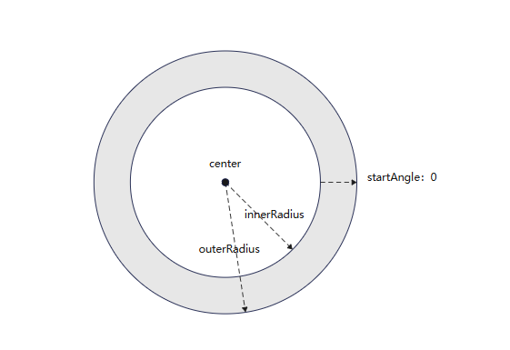

# ParticleAnnulusRegion

用于设置环形发射器区域的配置信息。
> **说明：**  
>  
> - outerRadius、innerRadius小于零或使用百分比单位时，会按零进行处理。  
>  
> - 当outerRadius小于innerRadius时（即外圆半径小于内圆半径时），会将当前较小的值作为新的内圆半径，将较大的值作为新的外圆半径。  
>  
> - 当endAngle小于startAngle时（即结束角度小于起始角度时），会将当前较小的值作为新的起始角度，将较大的值作为新的结束角度。  
>  
> 

**起始版本：** 20

<!--Device-unnamed-declare interface ParticleAnnulusRegion--><!--Device-unnamed-declare interface ParticleAnnulusRegion-End-->

**系统能力：** SystemCapability.ArkUI.ArkUI.Full

## center

```TypeScript
center?: PositionT<LengthMetrics>
```

The coordinates of the center of the annulus

**类型：** PositionT&lt;LengthMetrics&gt;

**默认值：** {x:LengthMetrics.percent(0.5),y:LengthMetrics.percent(0.5)}

**起始版本：** 20

**模型约束：** 此接口仅可在Stage模型下使用。

**原子化服务API：** 从API版本20开始，该接口支持在原子化服务API中使用。

<!--Device-ParticleAnnulusRegion-center?: PositionT<LengthMetrics>--><!--Device-ParticleAnnulusRegion-center?: PositionT<LengthMetrics>-End-->

**系统能力：** SystemCapability.ArkUI.ArkUI.Full

## endAngle

```TypeScript
endAngle?: number
```

The end angle of the annulus, in degree

**类型：** number

**默认值：** 360

**起始版本：** 20

**模型约束：** 此接口仅可在Stage模型下使用。

**原子化服务API：** 从API版本20开始，该接口支持在原子化服务API中使用。

<!--Device-ParticleAnnulusRegion-endAngle?: number--><!--Device-ParticleAnnulusRegion-endAngle?: number-End-->

**系统能力：** SystemCapability.ArkUI.ArkUI.Full

## innerRadius

```TypeScript
innerRadius: LengthMetrics
```

The inner radius of the annulus

**类型：** LengthMetrics

**起始版本：** 20

**模型约束：** 此接口仅可在Stage模型下使用。

**原子化服务API：** 从API版本20开始，该接口支持在原子化服务API中使用。

<!--Device-ParticleAnnulusRegion-innerRadius: LengthMetrics--><!--Device-ParticleAnnulusRegion-innerRadius: LengthMetrics-End-->

**系统能力：** SystemCapability.ArkUI.ArkUI.Full

## outerRadius

```TypeScript
outerRadius: LengthMetrics
```

The outer radius of the annulus

**类型：** LengthMetrics

**起始版本：** 20

**模型约束：** 此接口仅可在Stage模型下使用。

**原子化服务API：** 从API版本20开始，该接口支持在原子化服务API中使用。

<!--Device-ParticleAnnulusRegion-outerRadius: LengthMetrics--><!--Device-ParticleAnnulusRegion-outerRadius: LengthMetrics-End-->

**系统能力：** SystemCapability.ArkUI.ArkUI.Full

## startAngle

```TypeScript
startAngle?: number
```

The start angle of the annulus, in degree

**类型：** number

**默认值：** 0

**起始版本：** 20

**模型约束：** 此接口仅可在Stage模型下使用。

**原子化服务API：** 从API版本20开始，该接口支持在原子化服务API中使用。

<!--Device-ParticleAnnulusRegion-startAngle?: number--><!--Device-ParticleAnnulusRegion-startAngle?: number-End-->

**系统能力：** SystemCapability.ArkUI.ArkUI.Full

