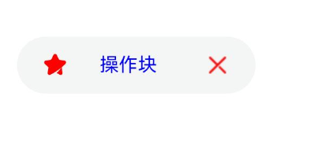

# ChipV2
<!--Kit: ArkUI-->
<!--Subsystem: ArkUI-->
<!--Owner: @youzhi92-->
<!--Designer: @youzhi92-->
<!--Tester: @TerryTsao-->
<!--Adviser: @Brilliantry_Rui-->

ChipV2用于搜索框历史记录、邮件发送列表等场景。

该组件基于[状态管理（V2）](../../../ui/state-management/arkts-state-management-overview.md#状态管理v2)实现，相较于[状态管理（V1）](../../../ui/state-management/arkts-state-management-overview.md#状态管理v1)，状态管理（V2）增强了对数据对象的深度观察与管理能力，不再局限于组件层级。借助状态管理（V2），开发者可以更灵活地控制组件的数据和状态，实现更高效的用户界面刷新。

> **说明：**
>
> 本模块接口仅可在Stage模型下使用。
>

**起始版本：** 26.0.0

## 导入模块

```ts
import { ChipV2, ChipV2Options, ChipV2Size } from '@kit.ArkUI';
```

## 子组件

无

## ChipV2

```ts
ChipV2({ chipV2Options: ChipV2Options })
```

### 属性

**起始版本：** 26.0.0

**装饰器类型：** @ComponentV2

**模型约束：** 此接口仅可在Stage模型下使用。

**原子化服务API：** 从API版本26.0.0开始，该接口支持在原子化服务中使用。

**系统能力：** SystemCapability.ArkUI.ArkUI.Full

**设备行为差异：** 该接口在Wearable设备上使用时，应用程序运行异常，异常信息中提示接口未定义，在其他设备中可正常调用。

| 名称    | 类型                        | 必填 | 装饰器类型 | 说明                 |
| ------- | --------------------------- | ---- | ---- | -------------------- |
| chipV2Options | [ChipV2Options](#chipv2options) | 是   | @Require<br>@Param | 定义ChipV2组件的参数。 |

### build

build(): void

build函数用于构造ChipV2高级组件。

**起始版本：** 26.0.0

**模型约束：** 此接口仅可在Stage模型下使用。

**原子化服务API：** 从API版本26.0.0开始，该接口支持在原子化服务中使用。

**系统能力：** SystemCapability.ArkUI.ArkUI.Full

**设备行为差异：** 该接口在Wearable设备上使用时，应用程序运行异常，异常信息中提示接口未定义，在其他设备中可正常调用。

## ChipV2Options

ChipV2Options定义ChipV2的样式及具体式样参数。

### 属性

**起始版本：** 26.0.0

**装饰器类型：** @ObservedV2

**模型约束：** 此接口仅可在Stage模型下使用。

**原子化服务API：** 从API版本26.0.0开始，该接口支持在原子化服务中使用。

**系统能力：** SystemCapability.ArkUI.ArkUI.Full

**设备行为差异：** 该接口在Wearable设备上使用时，应用程序运行异常，异常信息中提示接口未定义，在其他设备中可正常调用。

| 名称            | 类型                                                         | 只读 | 可选 | 说明                                                         |
| --------------- | ------------------------------------------------------------ | ---- | ------------------------------------------------------------ | ------------------------------------------------------------ |
| label            | [ChipV2Label](#chipv2label) | 否   | 否  | ChipV2文本属性。<br>**装饰器类型：** @Trace |
| prefixIcon      | [ChipV2Icon](#chipv2icon)                      | 否  | 是  | ChipV2前缀图标。<br>默认值：不显示前缀图标。<br>值为undefined时，按默认值处理。<br>图标为Symbol类型时，fontColor默认值为：normalFontColor：`[$r('sys.color.chip_usually_icon_color')]`、activatedFontColor：`[$r('sys.color.chip_active_icon_color')]`。fontSize默认值为16。<br>图标为Image类型时，fillColor默认值为：`$r('sys.color.chip_usually_icon_color')`，activatedFillColor默认值为：`$r('sys.color.chip_active_icon_color')`，fillColor和activatedFillColor对颜色的解析与Image组件保持一致。<br>**装饰器类型：** @Trace |
| suffixIcon      | [ChipV2Icon](#chipv2icon)                      | 否  | 是  | ChipV2后缀图标。<br>默认值：不显示后缀图标。<br>值为undefined时，按默认值处理。<br>图标为Symbol类型时，fontColor默认值为：normalFontColor：`[$r('sys.color.chip_usually_icon_color')]`、activatedFontColor：`[$r('sys.color.chip_active_icon_color')]`。fontSize默认值为16。<br>图标为Image类型时，fillColor默认值为：`$r('sys.color.chip_usually_icon_color')`，activatedFillColor默认值为：`$r('sys.color.chip_active_icon_color')`，fillColor和activatedFillColor对颜色的解析与Image组件保持一致。<br>**装饰器类型：** @Trace |
| allowClose      | boolean                                                      | 否  | 是  | 关闭图标是否显示。<br>当`suffixIcon`有传入参数时，`allowClose`不生效；`suffixIcon`没有传入参数时，`allowClose`决定是否显示删除图标。<br/>默认值：true<br>true：删除图标显示；false：删除图标不显示。<br>值为undefined时，按默认值处理。<br>**装饰器类型：** @Trace |
| closeIcon | [ChipV2CloseIcon](#chipv2closeicon) | 否 | 是 | 关闭图标的配置，包括无障碍属性配置。<br>默认值：<br>- 尺寸默认值：size为ChipV2Size.SMALL时，默认值为`$r('sys.float.chip_small_font_size')`；其他情况默认值为`$r('sys.float.chip_normal_font_size')`。<br>- 无障碍默认值：无无障碍描述。<br>值为undefined时，按默认值处理。<br>**装饰器类型：** @Trace |
| enabled         | boolean                                                      | 否  | 是  | ChipV2是否可选中。<br>默认值：true<br>true：操作块可选中；false：操作块不可选中。<br>值为undefined时，按默认值处理。<br>**装饰器类型：** @Trace |
| activated    | boolean                                        | 否  | 是  | ChipV2是否为激活态。<br>默认值：false<br>true：操作块为激活态；false：操作块为非激活态。<br>值为undefined时，按默认值处理。<br>**装饰器类型：** @Trace |
| backgroundColor | [ColorMetrics](../js-apis-arkui-graphics.md#colormetrics12)                   | 否  | 是  | ChipV2背景颜色。<br/>默认值：$r('sys.color.chip_background_color')<br>值为undefined时，按默认值处理。<br>值为非法值时，背景颜色透明。<br>**装饰器类型：** @Trace |
| activatedBackgroundColor | [ColorMetrics](../js-apis-arkui-graphics.md#colormetrics12)          | 否  | 是  | ChipV2激活时的背景颜色。<br/>默认值：$r('sys.color.chip_container_activated_color')<br>值为undefined时，按默认值处理。<br>值为非法值时，背景颜色透明。<br>**装饰器类型：** @Trace |
| borderRadius    | [LengthMetrics](../js-apis-arkui-graphics.md#lengthmetrics12)                         | 否  | 是  | ChipV2背景圆角半径大小，不支持百分比。<br/>默认值：<br/>size为ChipV2Size.NORMAL时，borderRadius默认值为：`$r('sys.float.chip_border_radius_normal')`。<br/>size为ChipV2Size.SMALL时，borderRadius默认值为：`$r('sys.float.chip_border_radius_small')`。<br/>值为undefined时，按默认值处理。<br/>**装饰器类型：** @Trace |
| size            | [ChipV2Size](#chipv2size) \| [SizeT](../js-apis-arkui-graphics.md#sizett12)<[LengthMetrics](../js-apis-arkui-graphics.md#lengthmetrics12)> | 否  | 是  | ChipV2尺寸。<br/>默认值：ChipV2Size.NORMAL<br/>SizeT\<LengthMetrics\>类型参数不支持百分比设置，异常值按默认值处理。<br>**说明**：[适老化](../../../ui/arkui-support-for-aging-adaptation.md)在size指定具体宽高时不生效，size设置为{ height: 0, width: 0 }除外。<br>**装饰器类型：** @Trace |
| direction | [Direction](ts-appendix-enums.md#direction) | 否 | 是 | 布局方向。<br/>默认值：Direction.Auto<br>值为undefined时，按默认值处理。<br>**装饰器类型：** @Trace |
| accessibilityDescription | [ResourceStr](ts-types.md#resourcestr) | 否 | 是 | ChipV2组件的无障碍描述。此描述用于向用户详细解释当前组件，开发人员应为组件的这一属性提供较为详尽的文本说明，以协助用户理解即将执行的操作及其可能产生的结果。特别是当这些结果无法仅从组件的属性和无障碍文本中直接获知时。如果组件同时具备文本属性和无障碍说明属性，当组件被选中时，系统将首先播报组件的文本属性，随后播报无障碍说明属性的内容。<br>默认值：空字符串。<br>值为undefined时，按默认值处理。<br>**装饰器类型：** @Trace |
| accessibilityLevel | string | 否 | 是 | ChipV2组件无障碍重要性。用于控制组件是否可被无障碍辅助服务所识别。<br>支持的值为：<br>"auto"：当前组件会转化为"yes"。<br>"yes"：当前组件可被无障碍辅助服务所识别。<br>"no"：当前组件不可被无障碍辅助服务所识别。<br>"no-hide-descendants"：当前组件及其所有子组件不可被无障碍辅助服务所识别。<br>默认值："auto"<br>值为undefined时，按默认值处理。<br>**装饰器类型：** @Trace |
| accessibilitySelectedType | [ChipV2AccessibilitySelectedType](#chipv2accessibilityselectedtype) | 否 | 是 | ChipV2组件选中态类型。<br>默认值：当设置了activated属性但未指定accessibilitySelectedType时，默认使用CHECKED类型。当未设置activated属性时，默认使用CLICKED类型。<br>值为undefined时，按默认值处理。<br>**装饰器类型：** @Trace |
| maxFontScale | number \| [Resource](ts-types.md#resource) | 否 | 是 | ChipV2组件文本与图标的最大的字体缩放倍数。<br>取值范围：[1, +∞)<br>设置的值小于1时，按值为1处理。异常值默认不生效。<br>**装饰器类型：** @Trace |
| minFontScale | number \| [Resource](ts-types.md#resource) | 否 | 是 | ChipV2组件文本与图标的最小的字体缩放倍数。<br>取值范围：[0, 1]<br>设置的值小于0时，按值为0处理。设置的值大于1时，按值为1处理。异常值默认不生效。<br>**装饰器类型：** @Trace |
| padding | [LocalizedPadding](ts-types.md#localizedpadding12) | 否 | 是 | ChipV2组件的内边距。<br>默认值：<br>- size为ChipV2Size.SMALL并且activated为true时，默认值：`{  start: LengthMetrics.resource('sys.float.chip_activated_small_text_padding'),   end: LengthMetrics.resource('sys.float.chip_activated_small_text_padding'),  top: LengthMetrics.vp(4),  bottom: LengthMetrics.vp(4)}`。 <br>- size为ChipV2Size.SMALL并且activated为false时，默认值：`{  start: LengthMetrics.resource('sys.float.chip_small_text_padding'),  end: LengthMetrics.resource('sys.float.chip_small_text_padding'),  top: LengthMetrics.vp(4),  bottom: LengthMetrics.vp(4)}`。 <br>- size不为ChipV2Size.SMALL并且activated为true时，默认值：`{  start: LengthMetrics.resource('sys.float.chip_activated_normal_text_padding'),  end: LengthMetrics.resource('sys.float.chip_activated_normal_text_padding'),  top: LengthMetrics.vp(4),  bottom: LengthMetrics.vp(4)}`。 <br>- size不为ChipV2Size.SMALL并且activated为false时，默认值：`{  start: LengthMetrics.resource('sys.float.chip_normal_text_padding'),  end: LengthMetrics.resource('sys.float.chip_normal_text_padding'),  top: LengthMetrics.vp(4),  bottom: LengthMetrics.vp(4)}`。<br>值为undefined时，按默认值处理。<br>**装饰器类型：** @Trace |
| fontSize | [LengthMetrics](../js-apis-arkui-graphics.md#lengthmetrics12) | 否 | 是 | 统一设置ChipV2组件的文本与图标的字体大小，不支持百分比。<br>该fontSize的优先级低于prefixSymbolIcon、label、suffixSymbolIcon和closeIcon中的fontSize属性。<br>默认值：<br>- size为ChipV2Size.SMALL时，文本默认值：`$r('sys.float.chip_small_font_size')`；图标默认值：`$r('sys.float.chip_small_icon_size')`。 <br>- 其他情况下，文本默认值：`$r('sys.float.chip_normal_font_size')`；图标默认值：`$r('sys.float.chip_normal_icon_size')`。 <br>值为undefined时，按默认值处理。<br>**装饰器类型：** @Trace |
| backgroundSystemMaterial | uiMaterial.[Material](../arkts-apis-uimaterial.md#material) | 否 | 是 | 设置组件系统材质样式。不同材质具有不同的效果，能够影响组件的背景色[backgroundColor](ts-universal-attributes-background.md#backgroundcolor)、边框颜色[borderColor](ts-universal-attributes-border.md#bordercolor)、边框宽度[borderWidth](ts-universal-attributes-border.md#borderwidth)、阴影[shadow](ts-universal-attributes-image-effect.md#shadow)效果、材质层滤镜效果[materialFilter](ts-universal-attributes-filter-effect.md#materialfilter23)。<br>默认值：undefined，不应用材质样式。<br>**装饰器类型：** @Trace |
| activatedBackgroundSystemMaterial | uiMaterial.[Material](../arkts-apis-uimaterial.md#material) | 否 | 是 | 设置组件激活状态下的系统材质样式。不同材质具有不同的效果，能够影响组件的背景色[backgroundColor](ts-universal-attributes-background.md#backgroundcolor)、边框颜色[borderColor](ts-universal-attributes-border.md#bordercolor)、边框宽度[borderWidth](ts-universal-attributes-border.md#borderwidth)、阴影[shadow](ts-universal-attributes-image-effect.md#shadow)效果、材质层滤镜效果[materialFilter](ts-universal-attributes-filter-effect.md#materialfilter23)。<br>默认值：undefined，不应用材质样式。<br>**装饰器类型：** @Trace |
| onClose         | [VoidCallback](ts-types.md#voidcallback12)  | 否  | 是  | 默认关闭图标点击事件。<br>默认值：undefined，不触发点击事件。 |
| onClicked     | [Callback](ts-types.md#callback12)\<void> | 否  | 是  | ChipV2点击事件。<br>默认值：undefined，不触发点击事件。 |

### constructor

constructor(config: IChipV2OptionsConfig)

ChipV2Options的构造函数。

**起始版本：** 26.0.0

**模型约束：** 此接口仅可在Stage模型下使用。

**原子化服务API：** 从API版本26.0.0开始，该接口支持在原子化服务中使用。

**系统能力：** SystemCapability.ArkUI.ArkUI.Full

**设备行为差异：** 该接口在Wearable设备上使用时，应用程序运行异常，异常信息中提示接口未定义，在其他设备中可正常调用。

**参数：**

| 参数名 | 类型 | 必填 | 说明 |
| ------ | ---- | ---- | ---- |
| config | [IChipV2OptionsConfig](#ichipv2optionsconfig) | 是 | ChipV2样式配置。 |

## IChipV2OptionsConfig

IChipV2OptionsConfig定义ChipV2选项的配置接口。

**起始版本：** 26.0.0

**模型约束：** 此接口仅可在Stage模型下使用。

**原子化服务API：** 从API版本26.0.0开始，该接口支持在原子化服务中使用。

**系统能力：** SystemCapability.ArkUI.ArkUI.Full

**设备行为差异：** 该接口在Wearable设备上使用时，应用程序运行异常，异常信息中提示接口未定义，在其他设备中可正常调用。

| 名称 | 类型 | 只读 | 可选 | 说明 |
| ---- | ---- | --- | ---- | ---- |
| label | [ChipV2Label](#chipv2label) | 否 | 否 | ChipV2文本属性。 |
| prefixIcon | [ChipV2Icon](#chipv2icon) | 否 | 是 | ChipV2前缀图标。<br>默认值：不显示前缀图标。<br>值为undefined时，按默认值处理。 |
| suffixIcon | [ChipV2Icon](#chipv2icon) | 否 | 是 | ChipV2后缀图标。<br>默认值：不显示后缀图标。<br>值为undefined时，按默认值处理。 |
| allowClose | boolean | 否 | 是 | 是否显示关闭图标。<br/>默认值：true<br>true：删除图标显示；false：删除图标不显示。<br>值为undefined时，按默认值处理。 |
| closeIcon | [ChipV2CloseIcon](#chipv2closeicon) | 否 | 是 | 关闭图标的配置，包括无障碍属性配置。<br>默认值：<br>- 尺寸默认值：size为ChipV2Size.SMALL时，默认值为`$r('sys.float.chip_small_font_size')`；其他情况默认值为`$r('sys.float.chip_normal_font_size')`。<br>- 无障碍默认值：无无障碍描述。<br>值为undefined时，按默认值处理。 |
| enabled | boolean | 否 | 是 | ChipV2是否可用。<br>默认值：true<br>true：操作块可选中；false：操作块不可选中。<br>值为undefined时，按默认值处理。 |
| activated | boolean | 否 | 是 | ChipV2是否为激活态。<br>默认值：false<br>true：操作块为激活态；false：操作块为非激活态。<br>值为undefined时，按默认值处理。 |
| backgroundColor | [ColorMetrics](../js-apis-arkui-graphics.md#colormetrics12) | 否 | 是 | ChipV2背景颜色。<br/>默认值：$r('sys.color.chip_background_color')<br>值为undefined时，按默认值处理。 |
| activatedBackgroundColor | [ColorMetrics](../js-apis-arkui-graphics.md#colormetrics12) | 否 | 是 | ChipV2激活时的背景颜色。<br/>默认值：$r('sys.color.chip_container_activated_color')<br>值为undefined时，按默认值处理。 |
| borderRadius | [LengthMetrics](../js-apis-arkui-graphics.md#lengthmetrics12) | 否 | 是 | ChipV2背景圆角半径大小，不支持百分比。<br/>默认值：<br/>size为ChipV2Size.NORMAL时，borderRadius默认值为：`$r('sys.float.chip_border_radius_normal')`。<br/>size为ChipV2Size.SMALL时，borderRadius默认值为：`$r('sys.float.chip_border_radius_small')`。<br/>值为undefined时，按默认值处理。 |
| size | [ChipV2Size](#chipv2size) \| [SizeT](../js-apis-arkui-graphics.md#sizett12)<[LengthMetrics](../js-apis-arkui-graphics.md#lengthmetrics12)> | 否 | 是 | ChipV2尺寸。<br/>默认值：ChipV2Size.NORMAL<br/>SizeT\<LengthMetrics\>类型参数不支持百分比设置，异常值按默认值处理。<br>**说明**：[适老化](../../../ui/arkui-support-for-aging-adaptation.md)在size指定具体宽高时不生效，size设置为{ height: 0, width: 0 }除外。 |
| direction | [Direction](ts-appendix-enums.md#direction) | 否 | 是 | 布局方向。<br/>默认值：Direction.Auto<br>值为undefined时，按默认值处理。 |
| accessibilityDescription | [ResourceStr](ts-types.md#resourcestr) | 否 | 是 | ChipV2的无障碍描述。此描述用于向用户详细解释当前组件，开发人员应为组件的这一属性提供较为详尽的文本说明，以协助用户理解即将执行的操作及其可能产生的结果。特别是当这些结果无法仅从组件的属性和无障碍文本中直接获知时。如果组件同时具备文本属性和无障碍说明属性，当组件被选中时，系统将首先播报组件的文本属性，随后播报无障碍说明属性的内容。<br>默认值：空字符串。<br>值为undefined时，按默认值处理。 |
| accessibilityLevel | string | 否 | 是 | ChipV2的无障碍重要性。用于控制组件是否可被无障碍辅助服务所识别。<br>支持的值为：<br>"auto"：当前组件会转化为"yes"。<br>"yes"：当前组件可被无障碍辅助服务所识别。<br>"no"：当前组件不可被无障碍辅助服务所识别。<br>"no-hide-descendants"：当前组件及其所有子组件不可被无障碍辅助服务所识别。<br>默认值："auto"<br>值为undefined时，按默认值处理。 |
| accessibilitySelectedType | [ChipV2AccessibilitySelectedType](#chipv2accessibilityselectedtype) | 否 | 是 | ChipV2组件选中态类型。<br>默认值：当设置了activated属性但未指定accessibilitySelectedType时，默认使用CHECKED类型。当未设置activated属性时，默认使用CLICKED类型。<br>值为undefined时，按默认值处理。 |
| maxFontScale | number \| [Resource](ts-types.md#resource) | 否 | 是 | ChipV2的最大字体缩放倍数。<br>取值范围：[1, +∞)<br>设置的值小于1时，按值为1处理。异常值默认不生效。 |
| minFontScale | number \| [Resource](ts-types.md#resource) | 否 | 是 | ChipV2的最小字体缩放倍数。<br>取值范围：[0, 1]<br>设置的值小于0时，按值为0处理。设置的值大于1时，按值为1处理。异常值默认不生效。 |
| padding | [LocalizedPadding](ts-types.md#localizedpadding12) | 否 | 是 | ChipV2的内边距。<br>默认值：<br>- size为ChipV2Size.SMALL并且activated为true时，默认值：`{  start: LengthMetrics.resource('sys.float.chip_activated_small_text_padding'),   end: LengthMetrics.resource('sys.float.chip_activated_small_text_padding'),  top: LengthMetrics.vp(4),  bottom: LengthMetrics.vp(4)}`。 <br>- size为ChipV2Size.SMALL并且activated为false时，默认值：`{  start: LengthMetrics.resource('sys.float.chip_small_text_padding'),  end: LengthMetrics.resource('sys.float.chip_small_text_padding'),  top: LengthMetrics.vp(4),  bottom: LengthMetrics.vp(4)}`。 <br>- size不为ChipV2Size.SMALL并且activated为true时，默认值：`{  start: LengthMetrics.resource('sys.float.chip_activated_normal_text_padding'),  end: LengthMetrics.resource('sys.float.chip_activated_normal_text_padding'),  top: LengthMetrics.vp(4),  bottom: LengthMetrics.vp(4)}`。 <br>- size不为ChipV2Size.SMALL并且activated为false时，默认值：`{  start: LengthMetrics.resource('sys.float.chip_normal_text_padding'),  end: LengthMetrics.resource('sys.float.chip_normal_text_padding'),  top: LengthMetrics.vp(4),  bottom: LengthMetrics.vp(4)}`。<br>值为undefined时，按默认值处理。 |
| fontSize | [LengthMetrics](../js-apis-arkui-graphics.md#lengthmetrics12) | 否 | 是 | 统一设置ChipV2的文本与图标的字体大小，不支持百分比。<br> 该fontSize的优先级低于prefixSymbolIcon、label、suffixSymbolIcon和closeIcon中的fontSize属性。<br>默认值：<br>- size为ChipV2Size.SMALL时，文本默认值：`$r('sys.float.chip_small_font_size')`；图标默认值：`$r('sys.float.chip_small_icon_size')`。 <br>- 其他情况下，文本默认值：`$r('sys.float.chip_normal_font_size')`；图标默认值：`$r('sys.float.chip_normal_icon_size')`。 <br>值为undefined时，按默认值处理。 |
| backgroundSystemMaterial | uiMaterial.[Material](../arkts-apis-uimaterial.md#material) | 否 | 是 | 设置组件系统材质样式。不同材质具有不同的效果，能够影响组件的背景色[backgroundColor](ts-universal-attributes-background.md#backgroundcolor)、边框颜色[borderColor](ts-universal-attributes-border.md#bordercolor)、边框宽度[borderWidth](ts-universal-attributes-border.md#borderwidth)、阴影[shadow](ts-universal-attributes-image-effect.md#shadow)效果、材质层滤镜效果[materialFilter](ts-universal-attributes-filter-effect.md#materialfilter23)。<br>默认值：undefined，不应用材质样式。 |
| activatedBackgroundSystemMaterial | uiMaterial.[Material](../arkts-apis-uimaterial.md#material) | 否 | 是 | 设置组件激活状态下的系统材质样式。不同材质具有不同的效果，能够影响组件的背景色[backgroundColor](ts-universal-attributes-background.md#backgroundcolor)、边框颜色[borderColor](ts-universal-attributes-border.md#bordercolor)、边框宽度[borderWidth](ts-universal-attributes-border.md#borderwidth)、阴影[shadow](ts-universal-attributes-image-effect.md#shadow)效果、材质层滤镜效果[materialFilter](ts-universal-attributes-filter-effect.md#materialfilter23)。<br>默认值：undefined，不应用材质样式。 |
| onClose | [VoidCallback](ts-types.md#voidcallback12) | 否 | 是 | 关闭图标点击事件。<br>值为undefined时，不触发点击事件。 |
| onClicked | [Callback](ts-types.md#callback12)\<void> | 否 | 是 | ChipV2点击事件。<br>值为undefined时，ChipV2不能被点击。 |

## ChipV2Label

ChipV2Label定义文本属性类。

### 属性

**起始版本：** 26.0.0

**装饰器类型：** @ObservedV2

**模型约束：** 此接口仅可在Stage模型下使用。

**原子化服务API：** 从API版本26.0.0开始，该接口支持在原子化服务中使用。

**系统能力：** SystemCapability.ArkUI.ArkUI.Full

**设备行为差异：** 该接口在Wearable设备上使用时，应用程序运行异常，异常信息中提示接口未定义，在其他设备中可正常调用。

| 名称 | 类型 | 只读 | 可选 | 说明 |
| ---- | ---- | ---- | ---- | ---- |
| text | string | 否 | 否 | 文本文字内容。<br>**装饰器类型：** @Trace |
| fontSize | [LengthMetrics](../js-apis-arkui-graphics.md#lengthmetrics12) | 否 | 是 | 文字字号，不支持百分比。<br/>默认值：$r('sys.float.ohos_id_text_size_button')<br>值为undefined时，按默认值处理。<br>**装饰器类型：** @Trace |
| fontColor | [ColorMetrics](../js-apis-arkui-graphics.md#colormetrics12) | 否 | 是 | 文字颜色。<br/>默认值：$r('sys.color.chip_font_color')<br>值为undefined时，按默认值处理。<br>**装饰器类型：** @Trace |
| activatedFontColor | [ColorMetrics](../js-apis-arkui-graphics.md#colormetrics12) | 否 | 是 | 操作块激活时的文字颜色。<br/>默认值：$r('sys.color.chip_activated_fontcolor')<br>值为undefined时，按默认值处理。<br>**装饰器类型：** @Trace |
| fontFamily | string | 否 | 是 | 文字字体。<br/>默认值："HarmonyOS Sans"<br>值为undefined时，按默认值处理。<br>**装饰器类型：** @Trace |
| labelMargin | [ChipV2LabelMarginConfig](#chipv2labelmarginconfig) | 否 | 是 | 文本与左右侧图标之间间距。<br>默认值：<br>size为ChipV2Size.SMALL时，默认值：{ left: 4, right: 4 }。<br>size为ChipV2Size.NORMAL时，默认值：{ left: 6, right: 6 }。<br>单位：vp<br>值为undefined时，按默认值处理。<br>**装饰器类型：** @Trace |
| localizedLabelMargin | [ChipV2LocalizedLabelMarginConfig](#chipv2localizedlabelmarginconfig) | 否 | 是 | 本地化文本与左右侧图标之间间距。<br/>默认值：<br>size为ChipV2Size.SMALL时，默认值：<br>`{  start: LengthMetrics.resource($r('sys.float.chip_small_text_margin')),  end: LengthMetrics.resource($r('sys.float.chip_small_text_margin')) }`。<br>size为ChipV2Size.NORMAL时，默认值：<br>`{  start: LengthMetrics.resource($r('sys.float.chip_normal_text_margin')),  end: LengthMetrics.resource($r('sys.float.chip_normal_text_margin')) }`。<br>值为undefined时，按默认值处理。<br>**装饰器类型：** @Trace |
| modifier | [TextModifier](ts-universal-attributes-attribute-modifier.md#自定义modifier) | 否 | 是 | 文本修饰器，用于设置文本的通用属性。<br>默认值：undefined，不应用修饰器。<br>**装饰器类型：** @Trace |

### constructor

constructor(config: ChipV2LabelConfig)

ChipV2Label的构造函数。

**起始版本：** 26.0.0

**模型约束：** 此接口仅可在Stage模型下使用。

**原子化服务API：** 从API版本26.0.0开始，该接口支持在原子化服务中使用。

**系统能力：** SystemCapability.ArkUI.ArkUI.Full

**设备行为差异：** 该接口在Wearable设备上使用时，应用程序运行异常，异常信息中提示接口未定义，在其他设备中可正常调用。

**参数：**

| 参数名 | 类型 | 必填 | 说明 |
| ------ | ---- | ---- | ---- |
| config | [ChipV2LabelConfig](#chipv2labelconfig) | 是 | 文本属性配置。 |

## ChipV2LabelConfig

ChipV2LabelConfig定义文本属性配置。

**起始版本：** 26.0.0

**模型约束：** 此接口仅可在Stage模型下使用。

**原子化服务API：** 从API版本26.0.0开始，该接口支持在原子化服务中使用。

**系统能力：** SystemCapability.ArkUI.ArkUI.Full

**设备行为差异：** 该接口在Wearable设备上使用时，应用程序运行异常，异常信息中提示接口未定义，在其他设备中可正常调用。

| 名称        | 类型                                       | 只读 | 可选 | 说明                                                         |
| ----------- | ------------------------------------------ | ---- | ------------------------------------------------------------ | ------------------------------------------------------------ |
| text        | string                                     | 否  | 否  | 文本文字内容。 |
| fontSize    | [LengthMetrics](../js-apis-arkui-graphics.md#lengthmetrics12)       | 否  | 是  | 文字字号，不支持百分比。<br/>默认值：$r('sys.float.chip_normal_font_size')<br>值为undefined时，按默认值处理。 |
| fontColor   | [ColorMetrics](../js-apis-arkui-graphics.md#colormetrics12) | 否  | 是  | 文字颜色。<br/>默认值：$r('sys.color.chip_font_color')<br>值为undefined时，按默认值处理。 |
| activatedFontColor   | [ColorMetrics](../js-apis-arkui-graphics.md#colormetrics12) | 否  | 是  | 操作块激活时的文字颜色。<br/>默认值：$r('sys.color.chip_activated_fontcolor')<br>值为undefined时，按默认值处理。 |
| fontFamily  | string                                     | 否  | 是  | 文字字体。<br/>默认值："HarmonyOS Sans"<br>值为undefined时，按默认值处理。 |
| labelMargin | [ChipV2LabelMarginConfig](#chipv2labelmarginconfig)  | 否  | 是  | 文本与左右侧图标之间间距。<br>默认值：<br>size为ChipV2Size.SMALL时，默认值：{ left: 4, right: 4 }。<br>size为ChipV2Size.NORMAL时，默认值：{ left: 6, right: 6 }。<br>单位：vp<br>值为undefined时，按默认值处理。 |
| localizedLabelMargin | [ChipV2LocalizedLabelMarginConfig](#chipv2localizedlabelmarginconfig) | 否 | 是 | 本地化文本与左右侧图标之间间距。<br/>默认值：<br>size为ChipV2Size.SMALL时，默认值：<br>`{  start: LengthMetrics.resource($r('sys.float.chip_small_text_margin')),  end: LengthMetrics.resource($r('sys.float.chip_small_text_margin')) }`。<br>size为ChipV2Size.NORMAL时，默认值：<br>`{  start: LengthMetrics.resource($r('sys.float.chip_normal_text_margin')),  end: LengthMetrics.resource($r('sys.float.chip_normal_text_margin')) }`。<br>值为undefined时，按默认值处理。 |
| modifier | [TextModifier](ts-universal-attributes-attribute-modifier.md#自定义modifier) | 否 | 是 | 文本修饰器，用于设置文本的通用属性。<br>默认值：undefined，不应用修饰器。 |

## ChipV2LabelMarginConfig

ChipV2LabelMarginConfig用于定义文本与左右侧图标之间间距配置。

**起始版本：** 26.0.0

**模型约束：** 此接口仅可在Stage模型下使用。

**原子化服务API：** 从API版本26.0.0开始，该接口支持在原子化服务中使用。

**系统能力：** SystemCapability.ArkUI.ArkUI.Full

**设备行为差异：** 该接口在Wearable设备上使用时，应用程序运行异常，异常信息中提示接口未定义，在其他设备中可正常调用。

| 名称  | 类型                                 | 只读 | 可选 | 说明                                                         |
| ----- | ------------------------------------ | ---- | ---- | ------------------------------------------------------------ |
| left  | [LengthMetrics](../js-apis-arkui-graphics.md#lengthmetrics12) | 否   | 是   | 文本与左侧图标之间间距，不支持百分比。<br>默认值：<br>无左侧图标时，left默认值：0。<br>有左侧图标且size为ChipV2Size.SMALL时，left默认值：4。<br>有左侧图标且size为ChipV2Size.NORMAL时，left默认值：6。<br>单位：vp<br>超出取值范围按默认值处理。<br>取值范围：[0, +∞) |
| right | [LengthMetrics](../js-apis-arkui-graphics.md#lengthmetrics12) | 否   | 是   | 文本与右侧图标之间间距，不支持百分比。<br>默认值：<br>无右侧图标时，right默认值：0。<br>有右侧图标且size为ChipV2Size.SMALL时，right默认值：4。<br>有右侧图标且size为ChipV2Size.NORMAL时，right默认值：6。<br>单位：vp<br>超出取值范围按默认值处理。<br>取值范围：[0, +∞) |

## ChipV2LocalizedLabelMarginConfig

ChipV2LocalizedLabelMarginConfig用于定义本地化文本与左右侧图标之间间距配置。

**起始版本：** 26.0.0

**模型约束：** 此接口仅可在Stage模型下使用。

**原子化服务API：** 从API版本26.0.0开始，该接口支持在原子化服务中使用。

**系统能力：** SystemCapability.ArkUI.ArkUI.Full

**设备行为差异：** 该接口在Wearable设备上使用时，应用程序运行异常，异常信息中提示接口未定义，在其他设备中可正常调用。

| 名称  | 类型                                                         | 只读 | 可选 | 说明                                                         |
| ----- | ------------------------------------------------------------ | ---- | ---- | ------------------------------------------------------------ |
| start | [LengthMetrics](../js-apis-arkui-graphics.md#lengthmetrics12) | 否   | 是   | 文本与左侧图标之间间距，不支持百分比。<br>默认值：<br>size为ChipV2Size.SMALL时，start默认值：<br>`LengthMetrics.resource($r('sys.float.chip_small_text_margin'))`。<br>size为ChipV2Size.NORMAL时，start默认值：<br>`LengthMetrics.resource($r('sys.float.chip_normal_text_margin'))`。<br>值为undefined时，按默认值处理。 |
| end   | [LengthMetrics](../js-apis-arkui-graphics.md#lengthmetrics12) | 否   | 是   | 文本与右侧图标之间间距，不支持百分比。<br>默认值：<br>size为ChipV2Size.SMALL时，end默认值：<br>`LengthMetrics.resource($r('sys.float.chip_small_text_margin'))`。<br>size为ChipV2Size.NORMAL时，end默认值：<br>`LengthMetrics.resource($r('sys.float.chip_normal_text_margin'))`。<br>值为undefined时，按默认值处理。 |

## ChipV2Icon

ChipV2Icon定义图标的基类。

**起始版本：** 26.0.0

**装饰器类型：** @ObservedV2

**模型约束：** 此接口仅可在Stage模型下使用。

**原子化服务API：** 从API版本26.0.0开始，该接口支持在原子化服务中使用。

**系统能力：** SystemCapability.ArkUI.ArkUI.Full

**设备行为差异：** 该接口在Wearable设备上使用时，应用程序运行异常，异常信息中提示接口未定义，在其他设备中可正常调用。

### constructor

constructor()

ChipV2Icon的构造函数。

**起始版本：** 26.0.0

**模型约束：** 此接口仅可在Stage模型下使用。

**原子化服务API：** 从API版本26.0.0开始，该接口支持在原子化服务中使用。

**系统能力：** SystemCapability.ArkUI.ArkUI.Full

**设备行为差异：** 该接口在Wearable设备上使用时，应用程序运行异常，异常信息中提示接口未定义，在其他设备中可正常调用。

## ChipV2SymbolIcon

ChipV2SymbolIcon定义Symbol图标类。

继承于[ChipV2Icon](#chipv2icon)。

### 属性

**起始版本：** 26.0.0

**装饰器类型：** @ObservedV2

**模型约束：** 此接口仅可在Stage模型下使用。

**原子化服务API：** 从API版本26.0.0开始，该接口支持在原子化服务中使用。

**系统能力：** SystemCapability.ArkUI.ArkUI.Full

**设备行为差异：** 该接口在Wearable设备上使用时，应用程序运行异常，异常信息中提示接口未定义，在其他设备中可正常调用。

| 名称 | 类型 | 只读 | 可选 | 说明 |
| ---- | ---- | ---- | ---- | ---- |
| normal | [SymbolGlyphModifier](ts-universal-attributes-attribute-symbolglyphmodifier.md#symbolglyphmodifier) | 否 | 是 | 非激活时图标设定。<br>默认值：undefined，不显示前缀图标或后缀图标。<br>不支持使用[SymbolEffect](ts-basic-components-symbolGlyph.md#symboleffect12对象说明)修改动效类型及[effectStrategy](./ts-basic-components-symbolGlyph.md#effectstrategy)设置动效。<br>**装饰器类型：** @Trace |
| activated | [SymbolGlyphModifier](ts-universal-attributes-attribute-symbolglyphmodifier.md#symbolglyphmodifier) | 否 | 是 | 激活时图标设定。<br>默认值：undefined，不显示前缀图标或后缀图标。<br>不支持使用[SymbolEffect](ts-basic-components-symbolGlyph.md#symboleffect12对象说明)修改动效类型及[effectStrategy](./ts-basic-components-symbolGlyph.md#effectstrategy)设置动效。<br>**装饰器类型：** @Trace |

### constructor

constructor(config: ChipV2SymbolIconConfig)

ChipV2SymbolIcon的构造函数。

**起始版本：** 26.0.0

**模型约束：** 此接口仅可在Stage模型下使用。

**原子化服务API：** 从API版本26.0.0开始，该接口支持在原子化服务中使用。

**系统能力：** SystemCapability.ArkUI.ArkUI.Full

**设备行为差异：** 该接口在Wearable设备上使用时，应用程序运行异常，异常信息中提示接口未定义，在其他设备中可正常调用。

**参数：**

| 参数名 | 类型 | 必填 | 说明 |
| ------ | ---- | ---- | ---- |
| config | [ChipV2SymbolIconConfig](#chipv2symboliconconfig) | 是 | Symbol图标属性配置。 |

## ChipV2SymbolIconConfig

ChipV2SymbolIconConfig定义Symbol图标的属性配置。

**起始版本：** 26.0.0

**模型约束：** 此接口仅可在Stage模型下使用。

**原子化服务API：** 从API版本26.0.0开始，该接口支持在原子化服务中使用。

**系统能力：** SystemCapability.ArkUI.ArkUI.Full

**设备行为差异：** 该接口在Wearable设备上使用时，应用程序运行异常，异常信息中提示接口未定义，在其他设备中可正常调用。

| 名称   | 类型       | 只读 | 可选 | 说明               |
| ------ | ---------- | ---- | ------------------ | ------------------ |
| normal | [SymbolGlyphModifier](ts-universal-attributes-attribute-symbolglyphmodifier.md#symbolglyphmodifier) | 否  | 是  | 非激活时图标设定。<br>默认值：不显示前缀图标或后缀图标。<br>值为undefined时，按默认值处理。 |
| activated | [SymbolGlyphModifier](ts-universal-attributes-attribute-symbolglyphmodifier.md#symbolglyphmodifier) | 否  | 是  | 激活时图标设定。<br>默认值：不显示前缀图标或后缀图标。<br>值为undefined时，按默认值处理。 |

## ChipV2PrefixSymbolIcon

ChipV2PrefixSymbolIcon定义前缀Symbol图标类。

继承于[ChipV2SymbolIcon](#chipv2symbolicon)。

**起始版本：** 26.0.0

**装饰器类型：** @ObservedV2

**模型约束：** 此接口仅可在Stage模型下使用。

**原子化服务API：** 从API版本26.0.0开始，该接口支持在原子化服务中使用。

**系统能力：** SystemCapability.ArkUI.ArkUI.Full

**设备行为差异：** 该接口在Wearable设备上使用时，应用程序运行异常，异常信息中提示接口未定义，在其他设备中可正常调用。

### constructor

constructor(config: ChipV2PrefixSymbolIconConfig)

ChipV2PrefixSymbolIcon的构造函数。

**起始版本：** 26.0.0

**模型约束：** 此接口仅可在Stage模型下使用。

**原子化服务API：** 从API版本26.0.0开始，该接口支持在原子化服务中使用。

**系统能力：** SystemCapability.ArkUI.ArkUI.Full

**设备行为差异：** 该接口在Wearable设备上使用时，应用程序运行异常，异常信息中提示接口未定义，在其他设备中可正常调用。

**参数：**

| 参数名 | 类型 | 必填 | 说明 |
| ------ | ---- | ---- | ---- |
| config | [ChipV2PrefixSymbolIconConfig](#chipv2prefixsymboliconconfig) | 是 | 前缀Symbol图标属性配置。 |

## ChipV2PrefixSymbolIconConfig

ChipV2PrefixSymbolIconConfig定义前缀Symbol图标的属性配置。

继承于[ChipV2SymbolIconConfig](#chipv2symboliconconfig)。

**起始版本：** 26.0.0

**模型约束：** 此接口仅可在Stage模型下使用。

**原子化服务API：** 从API版本26.0.0开始，该接口支持在原子化服务中使用。

**系统能力：** SystemCapability.ArkUI.ArkUI.Full

**设备行为差异：** 该接口在Wearable设备上使用时，应用程序运行异常，异常信息中提示接口未定义，在其他设备中可正常调用。

## ChipV2SuffixSymbolIcon

ChipV2SuffixSymbolIcon定义后缀Symbol图标类。

继承于[ChipV2SymbolIcon](#chipv2symbolicon)。

### 属性

**起始版本：** 26.0.0

**装饰器类型：** @ObservedV2

**模型约束：** 此接口仅可在Stage模型下使用。

**原子化服务API：** 从API版本26.0.0开始，该接口支持在原子化服务中使用。

**系统能力：** SystemCapability.ArkUI.ArkUI.Full

**设备行为差异：** 该接口在Wearable设备上使用时，应用程序运行异常，异常信息中提示接口未定义，在其他设备中可正常调用。

| 名称 | 类型 | 只读 | 可选 | 说明 |
| ---- | ---- | ---- | ---- | ---- |
| normalAccessibility | [ChipV2Accessibility](#chipv2accessibility) | 否 | 是 | 非激活态无障碍朗读功能属性。<br>默认值：undefined，无朗读内容。<br>**装饰器类型：** @Trace |
| activatedAccessibility | [ChipV2Accessibility](#chipv2accessibility) | 否 | 是 | 激活态无障碍朗读功能属性。<br>默认值：undefined，无朗读内容。<br>**装饰器类型：** @Trace |
| action | [VoidCallback](ts-types.md#voidcallback12) | 否 | 是 | 后缀图标设定事件。<br>默认值：undefined，无事件。<br>**装饰器类型：** @Trace |

### constructor

constructor(config: ChipV2SuffixSymbolIconConfig)

ChipV2SuffixSymbolIcon的构造函数。

**起始版本：** 26.0.0

**模型约束：** 此接口仅可在Stage模型下使用。

**原子化服务API：** 从API版本26.0.0开始，该接口支持在原子化服务中使用。

**系统能力：** SystemCapability.ArkUI.ArkUI.Full

**设备行为差异：** 该接口在Wearable设备上使用时，应用程序运行异常，异常信息中提示接口未定义，在其他设备中可正常调用。

**参数：**

| 参数名 | 类型 | 必填 | 说明 |
| ------ | ---- | ---- | ---- |
| config | [ChipV2SuffixSymbolIconConfig](#chipv2suffixsymboliconconfig) | 是 | 后缀Symbol图标属性配置。 |

## ChipV2SuffixSymbolIconConfig

ChipV2SuffixSymbolIconConfig定义后缀Symbol图标的属性配置。

继承于[ChipV2SymbolIconConfig](#chipv2symboliconconfig)。

**起始版本：** 26.0.0

**模型约束：** 此接口仅可在Stage模型下使用。

**原子化服务API：** 从API版本26.0.0开始，该接口支持在原子化服务中使用。

**系统能力：** SystemCapability.ArkUI.ArkUI.Full

**设备行为差异：** 该接口在Wearable设备上使用时，应用程序运行异常，异常信息中提示接口未定义，在其他设备中可正常调用。

| 名称 | 类型 | 只读 | 可选 | 说明 |
| ---- | ---- | --- | ---- | ---- |
| normalAccessibility | [ChipV2AccessibilityConfig](#chipv2accessibilityconfig) | 否 | 是 | 非激活态无障碍朗读功能属性。<br>默认值：undefined，无朗读内容。 |
| activatedAccessibility | [ChipV2AccessibilityConfig](#chipv2accessibilityconfig) | 否 | 是 | 激活态无障碍朗读功能属性。<br>默认值：undefined，无朗读内容。 |
| action | [VoidCallback](ts-types.md#voidcallback12) | 否 | 是 | 后缀图标设定事件。<br>默认值：undefined，无事件。 |

## ChipV2ImageIcon

ChipV2ImageIcon定义图标图片的基类。

继承于[ChipV2Icon](#chipv2icon)。

### 属性

**起始版本：** 26.0.0

**装饰器类型：** @ObservedV2

**模型约束：** 此接口仅可在Stage模型下使用。

**原子化服务API：** 从API版本26.0.0开始，该接口支持在原子化服务中使用。

**系统能力：** SystemCapability.ArkUI.ArkUI.Full

**设备行为差异：** 该接口在Wearable设备上使用时，应用程序运行异常，异常信息中提示接口未定义，在其他设备中可正常调用。

| 名称 | 类型 | 只读 | 可选 | 说明 |
| ---- | ---- | ---- | ---- | ---- |
| src | [ResourceStr](ts-types.md#resourcestr) | 否 | 否 | 图标图片或图片地址引用。<br>**装饰器类型：** @Trace |
| size | [SizeT](../js-apis-arkui-graphics.md#sizett12)<[LengthMetrics](../js-apis-arkui-graphics.md#lengthmetrics12)> | 否 | 是 | 图标大小，不支持百分比。<br/>默认值：<br/>- 当ChipV2Options.size为ChipV2Size.SMALL时，默认值为：{width: $r('sys.float.chip_small_icon_size'), height: $r('sys.float.chip_small_icon_size')}。<br>- 当ChipV2Options.size为ChipV2Size.NORMAL时，默认值为：{width: $r('sys.float.chip_normal_icon_size'), height: $r('sys.float.chip_normal_icon_size')}。<br>单位：vp<br>值为undefined时，按默认值处理。<br>**装饰器类型：** @Trace |
| fillColor | [ColorMetrics](../js-apis-arkui-graphics.md#colormetrics12) | 否 | 是 | 图标填充颜色。<br>默认值：$r('sys.color.chip_usually_icon_color')<br>值为undefined时，按默认值处理。<br>仅在图片格式为SVG时，fillColor属性才生效。<br>**装饰器类型：** @Trace |
| activatedFillColor | [ColorMetrics](../js-apis-arkui-graphics.md#colormetrics12) | 否 | 是 | 操作块激活时图标填充颜色。<br>默认值：$r('sys.color.chip_active_icon_color')<br>值为undefined时，按默认值处理。<br>仅在图片格式为SVG时，activatedFillColor属性才生效。<br>**装饰器类型：** @Trace |
| modifier | [ImageModifier](ts-universal-attributes-attribute-modifier.md#自定义modifier) | 否 | 是 | 图标修饰器，用于设置图标的通用属性。<br>默认值：undefined，不应用修饰器。<br>**装饰器类型：** @Trace |

### constructor

constructor(config: ChipV2ImageIconConfig)

ChipV2ImageIcon的构造函数。

**起始版本：** 26.0.0

**模型约束：** 此接口仅可在Stage模型下使用。

**原子化服务API：** 从API版本26.0.0开始，该接口支持在原子化服务中使用。

**系统能力：** SystemCapability.ArkUI.ArkUI.Full

**设备行为差异：** 该接口在Wearable设备上使用时，应用程序运行异常，异常信息中提示接口未定义，在其他设备中可正常调用。

**参数：**

| 参数名 | 类型 | 必填 | 说明 |
| ------ | ---- | ---- | ---- |
| config | [ChipV2ImageIconConfig](#chipv2imageiconconfig) | 是 | 图标共通属性配置。 |

## ChipV2ImageIconConfig

ChipV2ImageIconConfig定义图标的共通属性配置。

**起始版本：** 26.0.0

**模型约束：** 此接口仅可在Stage模型下使用。

**原子化服务API：** 从API版本26.0.0开始，该接口支持在原子化服务中使用。

**系统能力：** SystemCapability.ArkUI.ArkUI.Full

**设备行为差异：** 该接口在Wearable设备上使用时，应用程序运行异常，异常信息中提示接口未定义，在其他设备中可正常调用。

| 名称      | 类型                                       | 只读 | 可选 | 说明                                                         |
| --------- | ------------------------------------------ | ---- | ------------------------------------------------------------ | ------------------------------------------------------------ |
| src       | [ResourceStr](ts-types.md#resourcestr)     | 否  | 否  | 图标图片或图片地址引用。 |
| size      | [SizeT](../js-apis-arkui-graphics.md#sizett12)<[LengthMetrics](../js-apis-arkui-graphics.md#lengthmetrics12)>     | 否  | 是  | 图标大小，不支持百分比。<br/>默认值：<br/>- 当ChipV2Options.size为ChipV2Size.SMALL时，默认值为：{width: $r('sys.float.chip_small_icon_size'), height: $r('sys.float.chip_small_icon_size')}。<br>- 当ChipV2Options.size为ChipV2Size.NORMAL时，默认值为：{width: $r('sys.float.chip_normal_icon_size'), height: $r('sys.float.chip_normal_icon_size')}。<br>单位：vp<br>值为undefined时，按默认值处理。 |
| fillColor | [ColorMetrics](../js-apis-arkui-graphics.md#colormetrics12) | 否  | 是  | 图标填充颜色。<br>默认值：$r('sys.color.chip_usually_icon_color')<br>值为undefined时，按默认值处理。 |
| activatedFillColor | [ColorMetrics](../js-apis-arkui-graphics.md#colormetrics12) | 否  | 是  | 操作块激活时图标填充颜色。<br>默认值：$r('sys.color.chip_active_icon_color')<br>值为undefined时，按默认值处理。 |
| modifier | [ImageModifier](ts-universal-attributes-attribute-modifier.md#自定义modifier) | 否 | 是 | 图标修饰器，用于设置图标的通用属性。<br>默认值：undefined，不应用修饰器。 |

## ChipV2PrefixImageIcon

ChipV2PrefixImageIcon定义前缀图标类。

继承于[ChipV2ImageIcon](#chipv2imageicon)。

**起始版本：** 26.0.0

**装饰器类型：** @ObservedV2

**模型约束：** 此接口仅可在Stage模型下使用。

**原子化服务API：** 从API版本26.0.0开始，该接口支持在原子化服务中使用。

**系统能力：** SystemCapability.ArkUI.ArkUI.Full

**设备行为差异：** 该接口在Wearable设备上使用时，应用程序运行异常，异常信息中提示接口未定义，在其他设备中可正常调用。

### constructor

constructor(config: ChipV2PrefixImageIconConfig)

ChipV2PrefixImageIcon的构造函数。

**起始版本：** 26.0.0

**模型约束：** 此接口仅可在Stage模型下使用。

**原子化服务API：** 从API版本26.0.0开始，该接口支持在原子化服务中使用。

**系统能力：** SystemCapability.ArkUI.ArkUI.Full

**设备行为差异：** 该接口在Wearable设备上使用时，应用程序运行异常，异常信息中提示接口未定义，在其他设备中可正常调用。

**参数：**

| 参数名 | 类型 | 必填 | 说明 |
| ------ | ---- | ---- | ---- |
| config | [ChipV2PrefixImageIconConfig](#chipv2prefiximageiconconfig) | 是 | 前缀图标属性配置。 |

## ChipV2PrefixImageIconConfig

ChipV2PrefixImageIconConfig定义前缀图标的属性配置。

继承于[ChipV2ImageIconConfig](#chipv2imageiconconfig)。

**起始版本：** 26.0.0

**模型约束：** 此接口仅可在Stage模型下使用。

**原子化服务API：** 从API版本26.0.0开始，该接口支持在原子化服务中使用。

**系统能力：** SystemCapability.ArkUI.ArkUI.Full

**设备行为差异：** 该接口在Wearable设备上使用时，应用程序运行异常，异常信息中提示接口未定义，在其他设备中可正常调用。

## ChipV2SuffixImageIcon

ChipV2SuffixImageIcon定义后缀图标类。

继承于[ChipV2ImageIcon](#chipv2imageicon)。

### 属性

**起始版本：** 26.0.0

**装饰器类型：** @ObservedV2

**模型约束：** 此接口仅可在Stage模型下使用。

**原子化服务API：** 从API版本26.0.0开始，该接口支持在原子化服务中使用。

**系统能力：** SystemCapability.ArkUI.ArkUI.Full

**设备行为差异：** 该接口在Wearable设备上使用时，应用程序运行异常，异常信息中提示接口未定义，在其他设备中可正常调用。

| 名称 | 类型 | 只读 | 可选 | 说明 |
| ---- | ---- | ---- | ---- | ---- |
| accessibilityLevel | string | 否 | 是 | 无障碍重要性。用于控制后缀图标是否可被无障碍辅助服务所识别。<br>支持的值为：<br>"auto"：当前组件会转化为"yes"。<br>"yes"：当前组件可被无障碍辅助服务所识别。<br>"no"：当前组件不可被无障碍辅助服务所识别。<br>"no-hide-descendants"：当前组件及其所有子组件不可被无障碍辅助服务所识别。<br>默认值："auto"<br>值为undefined时，按默认值处理。<br>**装饰器类型：** @Trace |
| accessibilityText | [ResourceStr](ts-types.md#resourcestr) | 否 | 是 | 无障碍文本属性。当组件无文本属性时，屏幕朗读选中此组件不会播报，导致使用者无法清楚了解当前选中的组件。开发人员可为此类组件设置无障碍文本，屏幕朗读时将播报该文本，帮助使用者明确选中了什么组件。<br>默认值：空字符串。<br>值为undefined时，按默认值处理。<br>**装饰器类型：** @Trace |
| accessibilityDescription | [ResourceStr](ts-types.md#resourcestr) | 否 | 是 | 无障碍描述。此描述用于向用户详细解释当前组件，开发人员应提供详尽的文本说明，以协助用户理解即将执行的操作及其后果。特别是当这些后果无法仅从组件的属性和无障碍文本中直接获知时。如果组件同时具备文本属性和无障碍说明属性，当组件被选中时，系统将首先播报组件的文本属性，随后播报无障碍说明属性的内容。<br>默认值：空字符串。<br>值为undefined时，按默认值处理。<br>**装饰器类型：** @Trace |
| action | [VoidCallback](ts-types.md#voidcallback12) | 否 | 是 | 后缀图标设定事件。<br>值为undefined时，不设定后缀图标事件。<br>**装饰器类型：** @Trace |

### constructor

constructor(config: ChipV2SuffixImageIconConfig)

ChipV2SuffixImageIcon的构造函数。

**起始版本：** 26.0.0

**模型约束：** 此接口仅可在Stage模型下使用。

**原子化服务API：** 从API版本26.0.0开始，该接口支持在原子化服务中使用。

**系统能力：** SystemCapability.ArkUI.ArkUI.Full

**设备行为差异：** 该接口在Wearable设备上使用时，应用程序运行异常，异常信息中提示接口未定义，在其他设备中可正常调用。

**参数：**

| 参数名 | 类型 | 必填 | 说明 |
| ------ | ---- | ---- | ---- |
| config | [ChipV2SuffixImageIconConfig](#chipv2suffiximageiconconfig) | 是 | 后缀图标属性配置。 |

## ChipV2SuffixImageIconConfig

ChipV2SuffixImageIconConfig定义后缀图标的属性配置。

继承于[ChipV2ImageIconConfig](#chipv2imageiconconfig)和[ChipV2AccessibilityConfig](#chipv2accessibilityconfig)。

**起始版本：** 26.0.0

**模型约束：** 此接口仅可在Stage模型下使用。

**原子化服务API：** 从API版本26.0.0开始，该接口支持在原子化服务中使用。

**系统能力：** SystemCapability.ArkUI.ArkUI.Full

**设备行为差异：** 该接口在Wearable设备上使用时，应用程序运行异常，异常信息中提示接口未定义，在其他设备中可正常调用。

| 名称   | 类型       | 只读 | 可选 | 说明               |
| ------ | ---------- | ---- | ------------------ | ------------------ |
| action | [VoidCallback](ts-types.md#voidcallback12) | 否  | 是  | 后缀图标设定事件。<br>值为undefined时，不设定后缀图标事件。 |

## ChipV2CloseIcon

ChipV2CloseIcon用于定义ChipV2组件关闭图标的功能属性类，包括无障碍功能属性。

继承于[ChipV2Accessibility](#chipv2accessibility)。

### 属性

**起始版本：** 26.0.0

**装饰器类型：** @ObservedV2

**模型约束：** 此接口仅可在Stage模型下使用。

**原子化服务API：** 从API版本26.0.0开始，该接口支持在原子化服务中使用。

**系统能力：** SystemCapability.ArkUI.ArkUI.Full

**设备行为差异：** 该接口在Wearable设备上使用时，应用程序运行异常，异常信息中提示接口未定义，在其他设备中可正常调用。

| 名称 | 类型 | 只读 | 可选 | 说明 |
| ---- | ---- | ---- | ---- | ---- |
| fontSize | [LengthMetrics](../js-apis-arkui-graphics.md#lengthmetrics12) | 否 | 是 | 设置ChipV2组件默认关闭图标的大小，不支持百分比。<br>默认值：<br> size为ChipV2Size.SMALL时，默认值：`$r('sys.float.chip_small_font_size')`。 <br> 其他情况默认值：`$r('sys.float.chip_normal_font_size')`。 <br>值为undefined时，按默认值处理。<br>**装饰器类型：** @Trace |

### constructor

constructor(config: ChipV2CloseConfig)

ChipV2CloseIcon的构造函数。

**起始版本：** 26.0.0

**模型约束：** 此接口仅可在Stage模型下使用。

**原子化服务API：** 从API版本26.0.0开始，该接口支持在原子化服务中使用。

**系统能力：** SystemCapability.ArkUI.ArkUI.Full

**设备行为差异：** 该接口在Wearable设备上使用时，应用程序运行异常，异常信息中提示接口未定义，在其他设备中可正常调用。

**参数：**

| 参数名 | 类型 | 必填 | 说明 |
| ------ | ---- | ---- | ---- |
| config | [ChipV2CloseConfig](#chipv2closeconfig) | 是 | 关闭图标配置。 |

## ChipV2CloseConfig

ChipV2CloseConfig用于定义ChipV2组件关闭图标的功能属性配置，包括无障碍功能属性。

继承于[ChipV2AccessibilityConfig](#chipv2accessibilityconfig)。

**起始版本：** 26.0.0

**模型约束：** 此接口仅可在Stage模型下使用。

**原子化服务API：** 从API版本26.0.0开始，该接口支持在原子化服务中使用。

**系统能力：** SystemCapability.ArkUI.ArkUI.Full

**设备行为差异：** 该接口在Wearable设备上使用时，应用程序运行异常，异常信息中提示接口未定义，在其他设备中可正常调用。

| 名称  | 类型                                 | 只读 | 可选 | 说明                                                         |
| ----- | ------------------------------------ | ---- | ---- | ------------------------------------------------------------ |
|fontSize | [LengthMetrics](../js-apis-arkui-graphics.md#lengthmetrics12) | 否 | 是 | 设置ChipV2组件默认关闭图标的大小，不支持百分比。<br>默认值：<br> size为ChipV2Size.SMALL时，默认值：`$r('sys.float.chip_small_font_size')`。 <br> 其他情况默认值：`$r('sys.float.chip_normal_font_size')`。 <br>值为undefined时，按默认值处理。 |

## ChipV2Accessibility

ChipV2Accessibility定义无障碍属性类。

### 属性

**起始版本：** 26.0.0

**装饰器类型：** @ObservedV2

**模型约束：** 此接口仅可在Stage模型下使用。

**原子化服务API：** 从API版本26.0.0开始，该接口支持在原子化服务中使用。

**系统能力：** SystemCapability.ArkUI.ArkUI.Full

**设备行为差异：** 该接口在Wearable设备上使用时，应用程序运行异常，异常信息中提示接口未定义，在其他设备中可正常调用。

| 名称 | 类型 | 只读 | 可选 | 说明 |
| ---- | ---- | ---- | ---- | ---- |
| accessibilityLevel | string | 否 | 是 | 无障碍重要性。用于控制组件是否可被无障碍辅助服务识别。<br>支持的值为：<br>"auto"：当前组件会转换为"yes"。<br>"yes"：当前组件可被无障碍辅助服务所识别。<br>"no"：当前组件不可被无障碍辅助服务所识别。<br>"no-hide-descendants"：当前组件及其所有子组件不可被无障碍辅助服务所识别。<br>默认值："auto"<br>值为undefined时，按默认值处理。<br>**装饰器类型：** @Trace |
| accessibilityText | [ResourceStr](ts-types.md#resourcestr) | 否 | 是 | 无障碍文本属性。当组件无文本属性时，屏幕朗读选中此组件不会播报，导致使用者无法清楚了解当前选中的组件。开发人员可为此类组件设置无障碍文本，屏幕朗读时将播报该文本，帮助使用者明确选中了什么组件。<br>默认值：空字符串。<br>值为undefined时，按默认值处理。<br>**装饰器类型：** @Trace |
| accessibilityDescription | [ResourceStr](ts-types.md#resourcestr) | 否 | 是 | 无障碍描述。此描述用于向用户详细解释当前组件，开发人员应提供详尽的文本说明，以协助用户理解即将执行的操作及其后果。特别是当这些后果无法仅从组件的属性和无障碍文本中直接获知时。如果组件同时具备文本属性和无障碍说明属性，当组件被选中时，系统将首先播报组件的文本属性，随后播报无障碍说明属性的内容。<br>默认值：空字符串。<br>值为undefined时，按默认值处理。<br>**装饰器类型：** @Trace |

### constructor

constructor(config: ChipV2AccessibilityConfig)

ChipV2Accessibility的构造函数。

**起始版本：** 26.0.0

**模型约束：** 此接口仅可在Stage模型下使用。

**原子化服务API：** 从API版本26.0.0开始，该接口支持在原子化服务中使用。

**系统能力：** SystemCapability.ArkUI.ArkUI.Full

**设备行为差异：** 该接口在Wearable设备上使用时，应用程序运行异常，异常信息中提示接口未定义，在其他设备中可正常调用。

**参数：**

| 参数名 | 类型 | 必填 | 说明 |
| ------ | ---- | ---- | ---- |
| config | [ChipV2AccessibilityConfig](#chipv2accessibilityconfig) | 是 | 无障碍属性配置。 |

## ChipV2AccessibilityConfig

ChipV2AccessibilityConfig定义无障碍属性配置。

**起始版本：** 26.0.0

**模型约束：** 此接口仅可在Stage模型下使用。

**原子化服务API：** 从API版本26.0.0开始，该接口支持在原子化服务中使用。

**系统能力：** SystemCapability.ArkUI.ArkUI.Full

**设备行为差异：** 该接口在Wearable设备上使用时，应用程序运行异常，异常信息中提示接口未定义，在其他设备中可正常调用。

| 名称 | 类型 | 只读 | 可选 | 说明 |
| ------ | ---------- | ---- | ------------------ | ------------------ |
| accessibilityText | [ResourceStr](ts-types.md#resourcestr) | 否 | 是 | 无障碍文本属性。当组件无文本属性时，屏幕朗读选中此组件不会播报，导致使用者无法清楚了解当前选中的组件。开发人员可为此类组件设置无障碍文本，屏幕朗读时将播报该文本，帮助使用者明确选中了什么组件。<br>默认值：空字符串。<br>值为undefined时，按默认值处理。 |
| accessibilityDescription | [ResourceStr](ts-types.md#resourcestr) | 否 | 是 | 无障碍描述。此描述用于向用户详细解释当前组件，开发人员应提供详尽的文本说明，以协助用户理解即将执行的操作及其后果。特别是当这些后果无法仅从组件的属性和无障碍文本中直接获知时。如果组件同时具备文本属性和无障碍说明属性，当组件被选中时，系统将首先播报组件的文本属性，随后播报无障碍说明属性的内容。<br>默认值：空字符串。<br>值为undefined时，按默认值处理。 |
| accessibilityLevel | string | 否 | 是 | 无障碍重要性。用于控制组件是否可被无障碍辅助服务识别。<br>支持的值为：<br>"auto"：当前组件会转换为"yes"。<br>"yes"：当前组件可被无障碍辅助服务所识别。<br>"no"：当前组件不可被无障碍辅助服务所识别。<br>"no-hide-descendants"：当前组件及其所有子组件不可被无障碍辅助服务所识别。<br>默认值："auto"<br>值为undefined时，按默认值处理。 |

## ChipV2Size

ChipV2Size是ChipV2可指定的尺寸类型，如普通型ChipV2。

**起始版本：** 26.0.0

**模型约束：** 此接口仅可在Stage模型下使用。

**原子化服务API：** 从API版本26.0.0开始，该接口支持在原子化服务中使用。

**系统能力：** SystemCapability.ArkUI.ArkUI.Full

**设备行为差异：** 该接口在Wearable设备上使用时，应用程序运行异常，异常信息中提示接口未定义，在其他设备中可正常调用。

| 名称   | 值       | 说明               |
| ------ | -------- | ------------------ |
| NORMAL | 'NORMAL' | 普通尺寸操作块。 |
| SMALL  | 'SMALL'  | 小尺寸操作块。  |

## ChipV2AccessibilitySelectedType

ChipV2AccessibilitySelectedType是ChipV2可指定的选中态类型，用于控制无障碍服务如何向用户传达组件的选中状态。不同的选中态类型提供了不同的语义和用户体验。

**起始版本：** 26.0.0

**模型约束：** 此接口仅可在Stage模型下使用。

**原子化服务API：** 从API版本26.0.0开始，该接口支持在原子化服务中使用。

**系统能力：** SystemCapability.ArkUI.ArkUI.Full

**设备行为差异：** 该接口在Wearable设备上使用时，应用程序运行异常，异常信息中提示接口未定义，在其他设备中可正常调用。

| 名称 | 值 | 说明 |
| ---- | -- | ---- |
| CLICKED | 0 | 单击型。组件不向无障碍服务报告任何选中状态，仅作为可单击组件使用。适用于执行某个操作但不保持状态的场景，如普通按钮。 |
| CHECKED | 1 | 复选型。组件通过[accessibilityChecked](ts-universal-attributes-accessibility.md#accessibilitychecked13)属性向无障碍服务报告选中状态。适用于多选场景，如标签筛选、属性选择等。|
| SELECTED | 2 | 单选型。组件通过[accessibilitySelected](ts-universal-attributes-accessibility.md#accessibilityselected13)属性向无障碍服务报告选中状态。适用于表示当前选中项的场景，如导航栏标签、单选列表项等。|

## 示例

### 示例1（设置自定义图标）

该示例通过[ChipV2Options](#chipv2options)的prefixIcon、suffixIcon属性设置了自定义图标。

从API版本26.0.0开始，ChipV2Options新增prefixIcon、suffixIcon属性。

```ts
import { ChipV2, ChipV2Options, ChipV2Label, ChipV2PrefixImageIcon, ChipV2SuffixImageIcon, LengthMetrics, ColorMetrics } from '@kit.ArkUI';

@Entry
@ComponentV2
struct Index {
  build() {
    Column({ space: 10 }) {
      ChipV2({
        chipV2Options: new ChipV2Options({
          // 设置前缀图标属性。
          prefixIcon: new ChipV2PrefixImageIcon({
            // 'app.media.chips'仅作示例，请替换为实际使用图片。
            src: $r('app.media.chips'),
            size: { width: LengthMetrics.fp(16), height: LengthMetrics.fp(16) },
            fillColor: ColorMetrics.resourceColor(Color.Red)
          }),
          // 设置文本属性。
          label: new ChipV2Label({
            text: '操作块',
            fontSize: LengthMetrics.fp(12),
            fontColor: ColorMetrics.resourceColor(Color.Blue),
            fontFamily: 'HarmonyOS Sans',
            labelMargin: { left: LengthMetrics.fp(20), right: LengthMetrics.fp(30) }
          }),
          // 设置后缀图标属性。
          suffixIcon: new ChipV2SuffixImageIcon({
            // 'app.media.close'仅作示例，请替换为实际使用图片。
            src: $r('app.media.close'),
            size: { width: LengthMetrics.fp(16), height: LengthMetrics.fp(16) },
            fillColor: ColorMetrics.resourceColor(Color.Red)
          }),
          size: { width: LengthMetrics.fp(160), height: LengthMetrics.fp(36) },
          enabled: true,
          backgroundColor: ColorMetrics.resourceColor($r('sys.color.ohos_id_color_button_normal')),
          borderRadius: LengthMetrics.resource($r('sys.float.ohos_id_corner_radius_button')),
          minFontScale: 0.2,
          maxFontScale: 2,
          padding: {
            start: LengthMetrics.fp(20),
            end: LengthMetrics.fp(20)
          },
          fontSize: LengthMetrics.fp(12)
        })
      })
    }
  }
}
```



### 示例2（设置ChipV2激活状态）

该示例通过[ChipV2Options](#chipv2options)的activated属性设置了[ChipV2](#chipv2-1)的激活状态。

从API版本26.0.0开始，ChipV2Options新增activated属性。

```ts
import { ChipV2, ChipV2Options, ChipV2Label, ChipV2PrefixImageIcon, ChipV2CloseIcon, LengthMetrics, ColorMetrics } from '@kit.ArkUI';

@Entry
@ComponentV2
struct Index {
  @Local isActivated: boolean = false;

  build() {
    Column({ space: 10 }) {
      ChipV2({
        chipV2Options: new ChipV2Options({
          // 设置前缀图标属性。
          prefixIcon: new ChipV2PrefixImageIcon({
            // 'app.media.chips'仅作示例，请替换为实际使用图片。
            src: $r('app.media.chips'),
            size: { width: LengthMetrics.fp(16), height: LengthMetrics.fp(16) },
            fillColor: ColorMetrics.resourceColor(Color.Blue),
            activatedFillColor: ColorMetrics.resourceColor($r('sys.color.ohos_id_color_text_primary_contrary'))
          }),
          // 设置文本属性。
          label: new ChipV2Label({
            text: '操作块',
            fontSize: LengthMetrics.fp(12),
            fontColor: ColorMetrics.resourceColor(Color.Blue),
            activatedFontColor: ColorMetrics.resourceColor($r('sys.color.ohos_id_color_text_primary_contrary')),
            fontFamily: 'HarmonyOS Sans',
            labelMargin: { left: LengthMetrics.fp(20), right: LengthMetrics.fp(30) }
          }),
          size: { width: LengthMetrics.fp(160), height: LengthMetrics.fp(36) },
          allowClose: true,
          enabled: true,
          activated: this.isActivated,
          backgroundColor: ColorMetrics.resourceColor($r('sys.color.ohos_id_color_button_normal')),
          activatedBackgroundColor: ColorMetrics.resourceColor($r('sys.color.ohos_id_color_emphasize')),
          borderRadius: LengthMetrics.resource($r('sys.float.ohos_id_corner_radius_button')),
          closeIcon: new ChipV2CloseIcon({
            fontSize: LengthMetrics.fp(12)
          }),
          onClose: () => {
            console.info('chip on close');
          },
          onClicked: () => {
            console.info('chip on clicked');
          }
        })
      })
      // 点击"改变激活状态"，用于控制操作块的激活与关闭。
      Button('改变激活状态')
        .onClick(() => {
          this.isActivated = !this.isActivated;
        })
    }
  }
}
```


### 示例3（设置Symbol类型图标）

该示例通过[SymbolGlyphModifier](ts-universal-attributes-attribute-symbolglyphmodifier.md#symbolglyphmodifier)实现了[ChipV2](#chipv2-1)设置Symbol类型图标。

从API版本26.0.0开始，新增ChipV2。

```ts
import { ChipV2, ChipV2Options, ChipV2Label, ChipV2PrefixSymbolIcon, SymbolGlyphModifier, LengthMetrics, ColorMetrics } from '@kit.ArkUI';

@Entry
@ComponentV2
struct Index {
  @Local isActivated: boolean = false;

  build() {
    Column({ space: 10 }) {
      ChipV2({
        chipV2Options: new ChipV2Options({
          // 设置前缀图标属性，symbol类型。
          prefixIcon: new ChipV2PrefixSymbolIcon({
            normal: new SymbolGlyphModifier($r('sys.symbol.ohos_star')).fontSize(16).fontColor([Color.Green]),
            activated: new SymbolGlyphModifier($r('sys.symbol.ohos_star')).fontSize(16).fontColor([Color.Red]),
          }),
          // 设置文本属性。
          label: new ChipV2Label({
            text: '操作块',
            fontSize: LengthMetrics.fp(12),
            fontColor: ColorMetrics.resourceColor(Color.Blue),
            activatedFontColor: ColorMetrics.resourceColor($r('sys.color.ohos_id_color_text_primary_contrary')),
            fontFamily: 'HarmonyOS Sans',
            labelMargin: { left: LengthMetrics.fp(20), right: LengthMetrics.fp(30) },
          }),
          size: { width: LengthMetrics.fp(160), height: LengthMetrics.fp(36) },
          allowClose: true,
          enabled: true,
          activated: this.isActivated,
          backgroundColor: ColorMetrics.resourceColor($r('sys.color.ohos_id_color_button_normal')),
          activatedBackgroundColor: ColorMetrics.resourceColor($r('sys.color.ohos_id_color_emphasize')),
          borderRadius: LengthMetrics.resource($r('sys.float.ohos_id_corner_radius_button')),
          onClose: () => {
            console.info('chip on close');
          },
          onClicked: () => {
            console.info('chip on clicked');
          }
        })
      })

      Button('改变激活状态')
        .onClick(() => {
          this.isActivated = !this.isActivated;
        })
    }
  }
}
```


