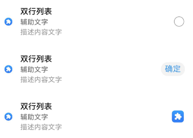
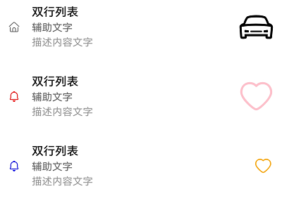

# ComposeListItemV2
<!--Kit: ArkUI-->
<!--Subsystem: ArkUI-->
<!--Owner: @wangrunsen-->
<!--Designer: @YanSanzo-->
<!--Tester: @ybhou1993-->
<!--Adviser: @Brilliantry_Rui-->


该组件用于展示一系列宽度相同的列表项，适用于展示连续、多行的同类数据组合（如图片与文本）。

该组件基于[状态管理（V2）](../../../ui/state-management/arkts-state-management-overview.md#状态管理v2)实现，相较于[状态管理（V1）](../../../ui/state-management/arkts-state-management-overview.md#状态管理v1)，状态管理（V2）增强了对数据对象的深度观察与管理能力，不再局限于组件层级。借助状态管理（V2），开发者可以通过该组件更灵活地控制列表项的数据和状态，实现更高效的用户界面刷新。

> **说明:**
>
> - 该组件仅可在Stage模型下使用。
>
> - 如果ComposeListItemV2设置[通用属性](ts-component-general-attributes.md)和[通用事件](ts-component-general-events.md)，编译工具链会额外生成节点__Common__，并将通用属性或通用事件挂载在__Common__上，而不是直接应用到ComposeListItemV2本身。这可能导致开发者设置的通用属性或通用事件不生效或不符合预期，因此，不建议ComposeListItemV2设置通用属性和通用事件。

**起始版本：** 26.0.0

## 导入模块

```ts
import { ComposeListItemV2, IconTypeV2, ContentItemV2, OperateItemV2 } from "@kit.ArkUI";
```

## 子组件

无

## ComposeListItemV2

ComposeListItemV2({ contentItemV2?: ContentItemV2, operateItemV2?: OperateItemV2 })

列表组件，可自定义列表左侧、中间元素以及右侧显示内容。

**起始版本：** 26.0.0

**装饰器类型:** \@ComponentV2

**模型约束：** 此接口仅可在Stage模型下使用。

**系统能力:** SystemCapability.ArkUI.ArkUI.Full

**原子化服务API:** 从API版本26.0.0开始，该接口支持在原子化服务中使用。


| 名称 | 类型 | 必填 | 装饰器类型 | 说明 |
| -------- | -------- | -------- | -------- | -------- |
| contentItemV2 | [ContentItemV2](#contentitemv2) | 否 | \@Param | 定义左侧以及中间元素。 |
| operateItemV2 | [OperateItemV2](#operateitemv2) | 否 | \@Param | 定义右侧元素。 |

## ContentItemV2

列表左侧显示的图标、图标大小以及中间元素文字内容。

**起始版本：** 26.0.0

**模型约束：** 此接口仅可在Stage模型下使用。

**装饰器类型:** \@ObservedV2

**系统能力:** SystemCapability.ArkUI.ArkUI.Full

**原子化服务API:** 从API版本26.0.0开始，该接口支持在原子化服务中使用。


| 名称 | 类型 | 只读 | 可选 | 说明    |
| -------- | -------- |---|----|-------------|
| iconStyle | [IconTypeV2](#icontypev2) | 否 | 是 | 左侧元素的图标样式。<br/>默认不设置或设置为undefined，表示不显示icon图标资源。<br>**装饰器类型：** @Trace       |
| icon | [ResourceStr](ts-types.md#resourcestr) | 否 | 是 | 左侧元素的图标资源。<br/>默认不设置或设置为undefined，表示不显示icon图标资源。<br>**装饰器类型：** @Trace        |
| symbolStyle | [SymbolGlyphModifier](ts-universal-attributes-attribute-symbolglyphmodifier.md#symbolglyphmodifier) | 否 | 是  | 左侧元素的Symbol图标资源，优先级大于icon，同时设置了icon和Symbol图标，只显示Symbol图标。<br/>默认不设置或设置为undefined，Symbol图标不显示。<br>**装饰器类型：** @Trace |
| primaryText | [ResourceStr](ts-types.md#resourcestr) | 否 | 是 | 中间元素的标题内容。<br/>默认不设置或设置为undefined，标题内容不显示。<br/>**文字处理规则:** 文本超长后无限换行显示。<br>**装饰器类型：** @Trace    |
| secondaryText | [ResourceStr](ts-types.md#resourcestr) | 否 | 是 | 中间元素的副标题内容。<br/>默认不设置或设置为undefine，副标题内容不显示。<br/>**文字处理规则:** 文本超长后无限换行显示。<br>**装饰器类型：** @Trace     |
| description | [ResourceStr](ts-types.md#resourcestr) | 否 | 是 | 中间元素的描述内容。<br/>默认不设置或设置为undefined，描述内容不显示。<br/>**文字处理规则:** 文本超长后无限换行显示。<br>**装饰器类型：** @Trace     |

### constructor

constructor(options?: ContentItemV2Options)

ContentItemV2的构造函数。

**起始版本：** 26.0.0

**模型约束：** 此接口仅可在Stage模型下使用。

**原子化服务API：** 从API版本26.0.0开始，该接口支持在原子化服务中使用。

**系统能力：** SystemCapability.ArkUI.ArkUI.Full

**设备行为差异：** 该接口在Wearable设备上使用时，应用程序运行异常，异常信息中提示接口未定义，在其他设备中可正常调用。

**参数：**

| 参数名 | 类型 | 必填 | 说明 |
| ------ | ---- | ---- | ---- |
| options | [ContentItemV2Options](#contentitemv2options) | 是 | 列表左侧属性配置。 |


## ContentItemV2Options

ContentItemV2构造函数的参数选项。

**起始版本：** 26.0.0

**模型约束：** 此接口仅可在Stage模型下使用。

**系统能力:** SystemCapability.ArkUI.ArkUI.Full

**原子化服务API:** 从API版本26.0.0开始，该接口支持在原子化服务中使用。

| 名称 | 类型 | 只读 | 可选 | 说明    |
| -------- | -------- | -------- | -------- | -------- |
| iconStyle | [IconTypeV2](#icontypev2) | 否 | 是 | 左侧元素的图标样式。 |
| icon | [ResourceStr](ts-types.md#resourcestr) | 否 | 是 | 左侧元素的图标资源。 |
| symbolStyle | [SymbolGlyphModifier](ts-universal-attributes-attribute-symbolglyphmodifier.md#symbolglyphmodifier) | 否 | 是 | 左侧元素的Symbol图标资源。 |
| primaryText | [ResourceStr](ts-types.md#resourcestr) | 否 | 是 | 中间元素的标题内容。 |
| secondaryText | [ResourceStr](ts-types.md#resourcestr) | 否 | 是 | 中间元素的副标题内容。 |
| description | [ResourceStr](ts-types.md#resourcestr) | 否 | 是 | 中间元素的描述内容。 |

## IconTypeV2

列表左侧图标类型。

**起始版本：** 26.0.0

**模型约束：** 此接口仅可在Stage模型下使用。

**原子化服务API:** 从API版本26.0.0开始，该接口支持在原子化服务中使用。

**系统能力:** SystemCapability.ArkUI.ArkUI.Full

| 名称 | 值 | 说明 |
| -------- | -------- | -------- |
| BADGE | 1 | 左侧图标为badge类型，图标大小为8\*8vp。 |
| NORMAL_ICON | 2 | 左侧图标为小图标类型，图标大小为16\*16vp。 |
| SYSTEM_ICON | 3 | 左侧图标为系统图标类型，图标大小为24\*24vp。 |
| HEAD_SCULPTURE | 4 | 左侧图标为头像类型，图标大小为40\*40vp。 |
| APP_ICON | 5 | 左侧图标为应用图标类型，图标大小为64\*64vp。 |
| PREVIEW | 6 | 左侧图标为预览图类型，图标大小为96\*96vp。 |
| LONGITUDINAL | 7 | 左侧图标为横向特殊比例（宽比高大），保持最长边为96vp。 |
| VERTICAL | 8 | 左侧图标为竖向特殊比例（高比宽大），保持最长边为96vp。 |

## OperateItemV2

列表右侧显示的元素类型。

**起始版本：** 26.0.0

**模型约束：** 此接口仅可在Stage模型下使用。

**装饰器类型:** \@ObservedV2

**系统能力:** SystemCapability.ArkUI.ArkUI.Full

**原子化服务API:** 从API版本26.0.0开始，该接口支持在原子化服务中使用。

| 名称 | 类型 | 只读 | 可选 | 说明           |
| -------- | -------- |---|---|-----------------|
| arrow | [OperateIconV2](#operateiconv2) | 否 | 是 | 右侧元素为箭头，大小为12\*24vp。<br/>默认不设置或设置为undefined，右侧箭头不显示。<br>**装饰器类型：** @Trace   |
| icon | [OperateIconV2](#operateiconv2) | 否 | 是 | 右侧元素的第一个图标，大小为24\*24vp。<br/>默认不设置或设置为undefined，右侧图标不显示。<br>**装饰器类型：** @Trace    |
| subIcon | [OperateIconV2](#operateiconv2) | 否 | 是 | 右侧元素的第二个图标，大小为24\*24vp。<br/>默认不设置或设置为undefined，右侧第二个图标不显示。<br>**装饰器类型：** @Trace   |
| button | [OperateButtonV2](#operatebuttonv2) | 否 | 是 | 右侧元素为按钮。<br/>默认不设置或设置为undefined，右侧按钮不显示。<br>**装饰器类型：** @Trace     |
| toggle | [OperateCheckV2](#operatecheckv2) | 否 | 是 | 右侧元素为开关。<br/>默认不设置或设置为undefined，右侧开关不显示。<br>**装饰器类型：** @Trace     |
| checkbox | [OperateCheckV2](#operatecheckv2) | 否 | 是 | 右侧元素为多选框，大小为24\*24vp。<br/>默认不设置或设置为undefined，右侧多选框不显示。<br>**装饰器类型：** @Trace  |
| radio | [OperateCheckV2](#operatecheckv2) | 否 | 是 | 右侧元素为单选框，大小为24\*24vp。<br/>默认不设置或设置为undefined，右侧单选框不显示。<br>**装饰器类型：** @Trace  |
| image | [ResourceStr](ts-types.md#resourcestr) | 否 | 是 | 右侧元素为图片，大小为48\*48vp。<br/>默认不设置或设置为undefined，右侧图片不显示。<br>**装饰器类型：** @Trace    |
| symbolStyle | [SymbolGlyphModifier](ts-universal-attributes-attribute-symbolglyphmodifier.md#symbolglyphmodifier) | 否 | 是 | 右侧元素为Symbol图标资源，大小为48\*48vp。<br/>默认不设置或设置为undefined，右侧Symbol图标不显示。<br>**装饰器类型：** @Trace  |
| text | [ResourceStr](ts-types.md#resourcestr) | 否 | 是 | 右侧元素为文字。 <br/>默认不设置或设置为undefined，右侧文字不显示。<br>**装饰器类型：** @Trace       |

### constructor

constructor(options?: OperateItemV2Options)

OperateItemV2的构造函数。

**起始版本：** 26.0.0

**模型约束：** 此接口仅可在Stage模型下使用。

**原子化服务API：** 从API版本26.0.0开始，该接口支持在原子化服务中使用。

**系统能力：** SystemCapability.ArkUI.ArkUI.Full

**设备行为差异：** 该接口在Wearable设备上使用时，应用程序运行异常，异常信息中提示接口未定义，在其他设备中可正常调用。

**参数：**

| 参数名 | 类型 | 必填 | 说明 |
| ------ | ---- | ---- | ---- |
| options | [OperateItemV2Options](#operateitemv2options) | 是 | 列表右侧属性配置。 |


## OperateItemV2Options

OperateItemV2构造函数的参数选项。

**起始版本：** 26.0.0

**模型约束：** 此接口仅可在Stage模型下使用。

**系统能力:** SystemCapability.ArkUI.ArkUI.Full

**原子化服务API:** 从API版本26.0.0开始，该接口支持在原子化服务中使用。

| 名称 | 类型 | 只读 | 可选 | 说明 |
| -------- | -------- | -------- | -------- | -------- |
| arrow | [OperateIconV2](#operateiconv2) | 否 | 是 | 右侧元素为箭头。 |
| icon | [OperateIconV2](#operateiconv2) | 否 | 是 | 右侧元素的第一个图标。 |
| subIcon | [OperateIconV2](#operateiconv2) | 否 | 是 | 右侧元素的第二个图标。 |
| button | [OperateButtonV2](#operatebuttonv2) | 否 | 是 | 右侧元素为按钮。 |
| toggle | [OperateCheckV2](#operatecheckv2) | 否 | 是 | 右侧元素为开关。 |
| checkbox | [OperateCheckV2](#operatecheckv2) | 否 | 是 | 右侧元素为多选框。 |
| radio | [OperateCheckV2](#operatecheckv2) | 否 | 是 | 右侧元素为单选框。 |
| image | [ResourceStr](ts-types.md#resourcestr) | 否 | 是 | 右侧元素为图片。 |
| symbolStyle | [SymbolGlyphModifier](ts-universal-attributes-attribute-symbolglyphmodifier.md#symbolglyphmodifier) | 否 | 是 | 右侧元素为Symbol图标资源。 |
| text | [ResourceStr](ts-types.md#resourcestr) | 否 | 是 | 右侧元素为文字。 |

## OperateIconV2

列表右侧图标元素的类型。

**起始版本：** 26.0.0

**模型约束：** 此接口仅可在Stage模型下使用。

**装饰器类型:** \@ObservedV2

**系统能力:** SystemCapability.ArkUI.ArkUI.Full

**原子化服务API:** 从API版本26.0.0开始，该接口支持在原子化服务中使用。

| 名称 | 类型 | 只读 | 可选 | 说明               |
| -------- | -------- |---|---|------------------|
| value | [ResourceStr](ts-types.md#resourcestr) | 否 | 是 | 右侧图标/箭头资源。<br>**装饰器类型：** @Trace    |
| symbolStyle | [SymbolGlyphModifier](ts-universal-attributes-attribute-symbolglyphmodifier.md#symbolglyphmodifier) | 否 | 是 | 右侧Symbol图标/箭头资源，优先级大于value。<br/>默认不设置或设置为undefined，Symbol图标不显示。<br>**装饰器类型：** @Trace      |
| action | [OnActionCallback](#onactioncallback) | 否 | 是 | 右侧图标/箭头点击事件。<br>**装饰器类型：** @Trace       |
| accessibilityText | [ResourceStr](ts-types.md#resourcestr) | 否 | 是 | 右侧图标/箭头的无障碍文本属性。当组件不包含文本属性时，屏幕朗读选中此组件时不播报，使用者无法清楚地知道当前选中了什么组件。为了解决此场景，开发人员可为不包含文字信息的组件设置无障碍文本，当屏幕朗读选中此组件时播报无障碍文本的内容，帮助屏幕朗读的使用者清楚地知道自己选中了什么组件。<br/>默认值:""<br>**装饰器类型：** @Trace   |
| accessibilityDescription | [ResourceStr](ts-types.md#resourcestr) | 否 | 是 | 右侧图标/箭头的无障碍描述。此描述用于向用户详细解释当前组件，开发人员应为组件的这一属性提供较为详尽的文本说明，以协助用户理解即将执行的操作及其可能产生的后果。特别是当这些后果无法仅从组件的属性和无障碍文本中直接获知时。如果组件同时具备文本属性和无障碍说明属性，当组件被选中时，系统将首先播报组件的文本属性，随后播报无障碍说明属性的内容。<br/>默认值为"单指双击即可执行"。<br>**装饰器类型：** @Trace   |
| accessibilityLevel | string | 否 | 是 | 右侧图标/箭头的无障碍重要性。用于控制当前项是否可被无障碍辅助服务所识别。<br/>支持的值为:<br/>"auto":当前组件会转换"no"。<br/>"yes":当前组件可被无障碍辅助服务所识别。<br/>"no":当前组件不可被无障碍辅助服务所识别。<br/>"no-hide-descendants":当前组件及其所有子组件不可被无障碍辅助服务所识别。<br/>默认值:"auto"<br>**装饰器类型：** @Trace  |

### constructor

constructor(options?: OperateIconV2Options)

OperateIconV2的构造函数。

**起始版本：** 26.0.0

**模型约束：** 此接口仅可在Stage模型下使用。

**原子化服务API：** 从API版本26.0.0开始，该接口支持在原子化服务中使用。

**系统能力：** SystemCapability.ArkUI.ArkUI.Full

**设备行为差异：** 该接口在Wearable设备上使用时，应用程序运行异常，异常信息中提示接口未定义，在其他设备中可正常调用。

**参数：**

| 参数名 | 类型 | 必填 | 说明 |
| ------ | ---- | ---- | ---- |
| options | [OperateIconV2Options](#operateiconv2options) | 是 | 列表右侧图标属性配置。 |


## OperateIconV2Options

OperateIconV2构造函数的参数选项。

**起始版本：** 26.0.0

**模型约束：** 此接口仅可在Stage模型下使用。

**系统能力:** SystemCapability.ArkUI.ArkUI.Full

**原子化服务API:** 从API版本26.0.0开始，该接口支持在原子化服务中使用。

| 名称 | 类型 | 只读 | 可选 | 说明 |
| -------- | -------- | -------- | -------- | -------- |
| value | [ResourceStr](ts-types.md#resourcestr) | 否 | 是 | 右侧图标/箭头资源。 |
| symbolStyle | [SymbolGlyphModifier](ts-universal-attributes-attribute-symbolglyphmodifier.md#symbolglyphmodifier) | 否 | 是 | 右侧Symbol图标/箭头资源。 |
| action | [OnActionCallback](#onactioncallback) | 否 | 是 | 右侧图标/箭头点击事件。 |
| accessibilityText | [ResourceStr](ts-types.md#resourcestr) | 否 | 是 | 右侧图标/箭头的无障碍文本属性。当组件不包含文本属性时，屏幕朗读选中此组件时不播报，使用者无法清楚地知道当前选中了什么组件。为了解决此场景，开发人员可为不包含文字信息的组件设置无障碍文本，当屏幕朗读选中此组件时播报无障碍文本的内容，帮助屏幕朗读的使用者清楚地知道自己选中了什么组件。<br/>默认值:"" |
| accessibilityDescription | [ResourceStr](ts-types.md#resourcestr) | 否 | 是 | 右侧图标/箭头的无障碍描述。此描述用于向用户详细解释当前组件，开发人员应为组件的这一属性提供较为详尽的文本说明，以协助用户理解即将执行的操作及其可能产生的后果。特别是当这些后果无法仅从组件的属性和无障碍文本中直接获知时。如果组件同时具备文本属性和无障碍说明属性，当组件被选中时，系统将首先播报组件的文本属性，随后播报无障碍说明属性的内容。<br/>默认值为"单指双击即可执行"。 |
| accessibilityLevel | string | 否 | 是 | 右侧图标/箭头的无障碍重要性。用于控制当前项是否可被无障碍辅助服务所识别。<br/>支持的值为:<br/>"auto":当前组件会转换"no"。<br/>"yes":当前组件可被无障碍辅助服务所识别。<br/>"no":当前组件不可被无障碍辅助服务所识别。<br/>"no-hide-descendants":当前组件及其所有子组件不可被无障碍辅助服务所识别。<br/>默认值:"auto" |

## OperateButtonV2

列表右侧按钮元素的类型。

**起始版本：** 26.0.0

**模型约束：** 此接口仅可在Stage模型下使用。

**装饰器类型:** \@ObservedV2

**系统能力:** SystemCapability.ArkUI.ArkUI.Full

**原子化服务API:** 从API版本26.0.0开始，该接口支持在原子化服务中使用。

| 名称 | 类型 | 只读 | 可选 | 说明    |
| -------- | -------- |---|---|-------------------|
| text | [ResourceStr](ts-types.md#resourcestr) | 否 | 是 | 右侧按钮文字。<br/>默认值:""<br>**装饰器类型：** @Trace      |
| accessibilityText | [ResourceStr](ts-types.md#resourcestr) | 否 | 是 | 右侧按钮的无障碍文本属性。当组件不包含文本属性时，屏幕朗读选中此组件时不播报，使用者无法清楚地知道当前选中了什么组件。为了解决此场景，开发人员可为不包含文字信息的组件设置无障碍文本，当屏幕朗读选中此组件时播报无障碍文本的内容，帮助屏幕朗读的使用者清楚地知道自己选中了什么组件。<br/>默认值:""<br>**装饰器类型：** @Trace     |
| accessibilityDescription | [ResourceStr](ts-types.md#resourcestr) | 否 | 是 | 右侧按钮的无障碍描述。此描述用于向用户详细解释当前组件，开发人员应为组件的这一属性提供较为详尽的文本说明，以协助用户理解即将执行的操作及其可能产生的后果。特别是当这些后果无法仅从组件的属性和无障碍文本中直接获知时。如果组件同时具备文本属性和无障碍说明属性，当组件被选中时，系统将首先播报组件的文本属性，随后播报无障碍说明属性的内容。<br/>默认值:"单指双击即可执行"。<br>**装饰器类型：** @Trace  |
| accessibilityLevel | string | 否 | 是 | 右侧按钮的无障碍重要性。用于控制当前项是否可被无障碍辅助服务所识别。<br/>支持的值为:<br/>"auto":当前组件会转换"no"。<br/>"yes":当前组件可被无障碍辅助服务所识别。<br/>"no":当前组件不可被无障碍辅助服务所识别。<br/>"no-hide-descendants":当前组件及其所有子组件不可被无障碍辅助服务所识别。<br/>默认值:"auto"<br>**装饰器类型：** @Trace  |

### constructor

constructor(options?: OperateButtonV2Options)

OperateButtonV2的构造函数。

**起始版本：** 26.0.0

**模型约束：** 此接口仅可在Stage模型下使用。

**原子化服务API：** 从API版本26.0.0开始，该接口支持在原子化服务中使用。

**系统能力：** SystemCapability.ArkUI.ArkUI.Full

**设备行为差异：** 该接口在Wearable设备上使用时，应用程序运行异常，异常信息中提示接口未定义，在其他设备中可正常调用。

**参数：**

| 参数名 | 类型 | 必填 | 说明 |
| ------ | ---- | ---- | ---- |
| options | [OperateButtonV2Options](#operatebuttonv2options) | 是 | 列表右侧按钮属性配置。 |


## OperateButtonV2Options

OperateButtonV2构造函数的参数选项。

**起始版本：** 26.0.0

**模型约束：** 此接口仅可在Stage模型下使用。

**系统能力:** SystemCapability.ArkUI.ArkUI.Full

**原子化服务API:** 从API版本26.0.0开始，该接口支持在原子化服务中使用。

| 名称 | 类型 | 只读 | 可选 | 说明 |
| -------- | -------- | -------- | -------- | -------- |
| text | [ResourceStr](ts-types.md#resourcestr) | 否 | 是 | 右侧按钮文字。 |
| accessibilityText | [ResourceStr](ts-types.md#resourcestr) | 否 | 是 | 右侧按钮的无障碍文本属性。 |
| accessibilityDescription | [ResourceStr](ts-types.md#resourcestr) | 否 | 是 | 右侧按钮的无障碍描述。 |
| accessibilityLevel | string | 否 | 是 | 右侧按钮的无障碍重要性。 |

## OperateCheckV2

列表右侧元素为Switch、CheckBox、Radio的类型。当右侧元素需要使用Switch、CheckBox、Radio时，可通过该类型配置对应属性。

**起始版本：** 26.0.0

**模型约束：** 此接口仅可在Stage模型下使用。

**装饰器类型:** \@ObservedV2

**系统能力:** SystemCapability.ArkUI.ArkUI.Full

**原子化服务API:** 从API版本26.0.0开始，该接口支持在原子化服务中使用。

| 名称 | 类型 | 只读 | 可选 | 说明              |
| -------- | -------- |---|----|--------------|
| isCheck | boolean | 否 | 是  | 右侧Switch/CheckBox/Radio选中状态。<br> isCheck默认值为false。<br> isCheck为true时，表示为选中。<br> isCheck为false时，表示为未选中。<br>**装饰器类型：** @Trace   |
| onChange | [OnChangeCallback](#onchangecallback) | 否 | 是  | 右侧Switch/CheckBox/Radio选中状态改变时触发回调。<br> value为true时，表示从未选中变为选中。<br> value为false时，表示从选中变为未选中。<br>**装饰器类型：** @Trace   |
| accessibilityText | [ResourceStr](ts-types.md#resourcestr) | 否 | 是  | 右侧Switch/CheckBox/Radio的无障碍文本属性。当组件不包含文本属性时，屏幕朗读选中此组件时不播报，使用者无法清楚地知道当前选中了什么组件。为了解决此场景，开发人员可为不包含文字信息的组件设置无障碍文本，当屏幕朗读选中此组件时播报无障碍文本的内容，帮助屏幕朗读的使用者清楚地知道自己选中了什么组件。<br/>默认值:""<br>**装饰器类型：** @Trace   |
| accessibilityDescription | [ResourceStr](ts-types.md#resourcestr) | 否 | 是  | 右侧Switch/CheckBox/Radio的无障碍描述。此描述用于向用户详细解释当前组件，开发人员应为组件的这一属性提供较为详尽的文本说明，以协助用户理解即将执行的操作及其可能产生的后果。特别是当这些后果无法仅从组件的属性和无障碍文本中直接获知时。如果组件同时具备文本属性和无障碍说明属性，当组件被选中时，系统将首先播报组件的文本属性，随后播报无障碍说明属性的内容。<br/>默认跟随基础组件Switch/CheckBox/Radio播报规则。<br>**装饰器类型：** @Trace |
| accessibilityLevel | string | 否 | 是  | 右侧Switch/CheckBox/Radio的无障碍重要性。用于控制当前项是否可被无障碍辅助服务所识别。<br/>支持的值为:<br/>"auto":当前组件会转换"no"。<br/>"yes":当前组件可被无障碍辅助服务所识别。<br/>"no":当前组件不可被无障碍辅助服务所识别。<br/>"no-hide-descendants":当前组件及其所有子组件不可被无障碍辅助服务所识别。<br/>默认值:"auto"<br>**装饰器类型：** @Trace |

### constructor

constructor(options?: OperateCheckV2Options)

OperateCheckV2的构造函数。

**起始版本：** 26.0.0

**模型约束：** 此接口仅可在Stage模型下使用。

**原子化服务API：** 从API版本26.0.0开始，该接口支持在原子化服务中使用。

**系统能力：** SystemCapability.ArkUI.ArkUI.Full

**设备行为差异：** 该接口在Wearable设备上使用时，应用程序运行异常，异常信息中提示接口未定义，在其他设备中可正常调用。

**参数：**

| 参数名 | 类型 | 必填 | 说明 |
| ------ | ---- | ---- | ---- |
| options | [OperateCheckV2Options](#operatecheckv2options) | 是 | 列表右侧元素为Switch、CheckBox、Radio属性配置。 |

## OperateCheckV2Options

OperateCheckV2构造函数的参数选项。

**起始版本：** 26.0.0

**模型约束：** 此接口仅可在Stage模型下使用。

**系统能力:** SystemCapability.ArkUI.ArkUI.Full

**原子化服务API:** 从API版本26.0.0开始，该接口支持在原子化服务中使用。

| 名称 | 只读 | 类型 | 可选 | 说明 |
| -------- | -------- | -------- | -------- | -------- |
| isCheck | boolean | 否 | 是 | 右侧Switch/CheckBox/Radio选中状态。 |
| onChange | [OnChangeCallback](#onchangecallback) | 否 | 是 | 右侧Switch/CheckBox/Radio选中状态改变时触发回调。 |
| accessibilityText | [ResourceStr](ts-types.md#resourcestr) | 否 | 是 | 右侧Switch/CheckBox/Radio的无障碍文本属性。 |
| accessibilityDescription | [ResourceStr](ts-types.md#resourcestr) | 否 | 是 | 右侧Switch/CheckBox/Radio的无障碍描述。 |
| accessibilityLevel | string | 否 | 是 | 右侧Switch/CheckBox/Radio的无障碍重要性。 |

## OnActionCallback

type OnActionCallback = () => void

列表右侧元素为图标/箭头，通过点击触发回调函数的类型。

**起始版本：** 26.0.0

**模型约束：** 此接口仅可在Stage模型下使用。

**系统能力:** SystemCapability.ArkUI.ArkUI.Full

**原子化服务API:** 从API版本26.0.0开始，该接口支持在原子化服务中使用。

| 类型 | 说明 |
| -------- | -------- |
| () => void | 右侧图标/箭头点击时的回调函数。 |

## OnChangeCallback

type OnChangeCallback = (value: boolean) => void

列表右侧元素为Switch/CheckBox/Radio时，当状态发生改变时的回调函数对应的类型。

**起始版本：** 26.0.0

**模型约束：** 此接口仅可在Stage模型下使用。

**系统能力:** SystemCapability.ArkUI.ArkUI.Full

**原子化服务API:** 从API版本26.0.0开始，该接口支持在原子化服务中使用。

| 类型 | 说明 |
| -------- | -------- |
| (value: boolean) => void | 右侧Switch/CheckBox/Radio选中状态改变时的回调函数。<br>value为true时，表示从未选中变为选中。<br>value为false时，表示从选中变为未选中。 |

## 事件
不支持[通用事件](ts-component-general-events.md)。

## 示例

### 示例1(设置简单列表项)

从API版本26.0.0开始，通过组件ComposeListItemV2接口实现带有主标题、副标题、描述、右侧按钮及文本的简单列表项。

```ts
// 该示例主要演示该组件的基础功能使用，包含左侧右侧元素的情况
import { IconTypeV2, ComposeListItemV2, ContentItemV2, OperateItemV2, OperateIconV2 } from '@kit.ArkUI';

@Entry
@ComponentV2
struct ComposeListItemV2Example {
  build(): void {
    Column() {
      List() {
        ListItem() {
          ComposeListItemV2({
            contentItemV2: new ContentItemV2({
              iconStyle: IconTypeV2.NORMAL_ICON,
              icon: $r('sys.media.ohos_app_icon'),
              primaryText: '双行列表',
              secondaryText: '辅助文字',
              description: '描述内容文字'
            }),
            operateItemV2: new OperateItemV2({
              icon: new OperateIconV2({
                value: $r('sys.media.ohos_app_icon'),
                action: () => {
                  this.getUIContext().getPromptAction().showToast({
                    message: 'icon'
                  });
                }
              }),
              text: '右侧文本'
            })
          })
        }
      }
    }
  }
}
```


### 示例2(设置右侧不同元素自定义播报)

从API版本26.0.0开始，通过设置属性接口accessibilityText、accessibilityDescription、accessibilityLevel，实现右侧图标、按钮、单选框自定义屏幕朗读播报文本。

```ts
import {
  IconTypeV2,
  ComposeListItemV2,
  ContentItemV2,
  OperateItemV2,
  OperateCheckV2,
  OperateButtonV2,
  OperateIconV2
} from '@kit.ArkUI';

@Entry
@ComponentV2
struct ComposeListItemV2Example {
  build(): void {
    Column() {
      List() {
        ListItem() {
          ComposeListItemV2({
            contentItemV2: new ContentItemV2({
              iconStyle: IconTypeV2.NORMAL_ICON,
              icon: $r('sys.media.ohos_app_icon'),
              primaryText: '双行列表',
              secondaryText: '辅助文字',
              description: '描述内容文字'
            }),
            operateItemV2: new OperateItemV2({
              radio: new OperateCheckV2({
                accessibilityText: '单选框', // 该单选框屏幕朗读播报文本为'单选框'
                accessibilityDescription: '未选中', // 该单选框屏幕朗读播报描述为'未选中'
                accessibilityLevel: 'yes'  // 该项可被无障碍屏幕朗读聚焦
              })
            })
          })
        }

        ListItem() {
          ComposeListItemV2({
            contentItemV2: new ContentItemV2({
              iconStyle: IconTypeV2.NORMAL_ICON,
              icon: $r('sys.media.ohos_app_icon'),
              primaryText: '双行列表',
              secondaryText: '辅助文字',
              description: '描述内容文字'
            }),
            operateItemV2: new OperateItemV2({
              button: new OperateButtonV2({
                text: '确定',
                accessibilityText: '这是一个按钮',
                accessibilityDescription: '单指双击即可执行',
                accessibilityLevel: 'no'  // 该按钮不可被屏幕朗读服务识别
              })
            })
          })
        }

        ListItem() {
          ComposeListItemV2({
            contentItemV2: new ContentItemV2({
              iconStyle: IconTypeV2.NORMAL_ICON,
              icon: $r('sys.media.ohos_app_icon'),
              primaryText: '双行列表',
              secondaryText: '辅助文字',
              description: '描述内容文字'
            }),
            operateItemV2: new OperateItemV2({
              icon: new OperateIconV2({
                value: $r('sys.media.ohos_app_icon'),
                action: () => {
                  this.getUIContext().getPromptAction().showToast({
                    message: 'icon'
                  });
                },
                accessibilityText: '这是一个icon', // 该icon屏幕朗读播报文本为'这是一个icon'
                accessibilityDescription: '单指双击即可弹出', // 该icon屏幕朗读播报描述为'单指双击即可弹出'
                accessibilityLevel: 'yes'  // 该项可被无障碍屏幕朗读聚焦
              })
            })
          })
        }
      }
    }
  }
}
```


### 示例3(设置Symbol类型图标)

从API版本26.0.0开始，通过设置ContentItemV2、OperateItemV2、OperateIconV2的属性接口symbolStyle，实现Symbol类型图标参数设置。

```ts
import {
  IconTypeV2,
  ComposeListItemV2,
  ContentItemV2,
  OperateItemV2,
  OperateIconV2,
  SymbolGlyphModifier
} from '@kit.ArkUI';

@Entry
@ComponentV2
struct ComposeListItemV2Example {
  build(): void {
    Column() {
      List() {
        ListItem() {
          ComposeListItemV2({
            contentItemV2: new ContentItemV2({
              iconStyle: IconTypeV2.NORMAL_ICON,
              icon: $r('sys.symbol.house'),
              primaryText: '双行列表',
              secondaryText: '辅助文字',
              description: '描述内容文字'
            }),
            operateItemV2: new OperateItemV2({
              image: $r('sys.symbol.car'),
            })
          })
        }

        ListItem() {
          ComposeListItemV2({
            contentItemV2: new ContentItemV2({
              iconStyle: IconTypeV2.NORMAL_ICON,
              icon: $r('sys.symbol.house'),
              symbolStyle: new SymbolGlyphModifier($r('sys.symbol.bell')).fontColor([Color.Red]),
              primaryText: '双行列表',
              secondaryText: '辅助文字',
              description: '描述内容文字'
            }),
            operateItemV2: new OperateItemV2({
              image: $r('sys.symbol.car'),
              symbolStyle: new SymbolGlyphModifier($r('sys.symbol.heart')).fontColor([Color.Pink]),
            })
          })
        }

        ListItem() {
          ComposeListItemV2({
            contentItemV2: new ContentItemV2({
              iconStyle: IconTypeV2.NORMAL_ICON,
              icon: $r('sys.symbol.house'),
              symbolStyle: new SymbolGlyphModifier($r('sys.symbol.bell')).fontColor([Color.Blue]),
              primaryText: '双行列表',
              secondaryText: '辅助文字',
              description: '描述内容文字'
            }),
            operateItemV2: new OperateItemV2({
              icon: new OperateIconV2({
                value: $r('sys.symbol.car'),
                symbolStyle: new SymbolGlyphModifier($r('sys.symbol.heart')).fontColor([Color.Orange]),
                action: () => {
                  this.getUIContext().getPromptAction().showToast({
                    message: 'icon'
                  });
                }
              })
            })
          })
        }
      }
    }
  }
}
```
