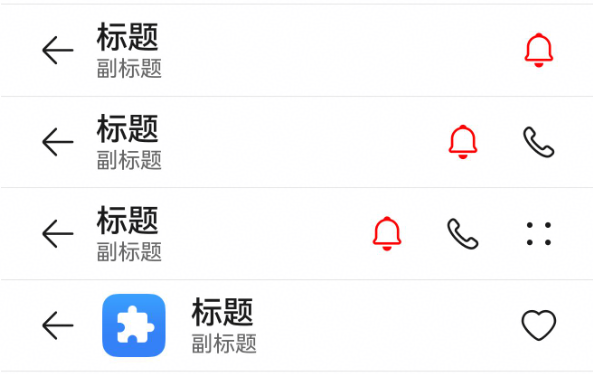

# ComposeTitleBar
<!--Kit: ArkUI-->
<!--Subsystem: ArkUI-->
<!--Owner: @wangrunsen-->
<!--Designer: @YanSanzo-->
<!--Tester: @ybhou1993-->
<!--Adviser: @Brilliantry_Rui-->


ComposeTitleBar是一种普通标题栏组件，支持设置标题、头像（可选）和副标题（可选），可用于一级页面、二级及其以上界面显示返回键。可快速构建统一风格的标题栏，简化页面开发，支持灵活的菜单项配置和图标自定义，帮助开发者快速实现导航和操作入口。


> **说明：**
>
> - 本模块同时支持ArkTS-Dyn、ArkTS-Sta。
>
> - 该组件从API version 10开始支持。后续版本如有新增内容，则采用上角标单独标记该内容的起始版本。
>
> - 该组件仅可在Stage模型下使用。
>
> - 如果ComposeTitleBar设置[通用属性](ts-component-general-attributes.md)和[通用事件](ts-component-general-events.md)，编译工具链会额外生成节点__Common__，并将通用属性或通用事件挂载在__Common__上，而不是直接应用到ComposeTitleBar本身。这可能导致开发者设置的通用属性或通用事件不生效或不符合预期，因此，不建议ComposeTitleBar设置通用属性和通用事件。

## 导入模块

```ts
import { ComposeTitleBar } from '@kit.ArkUI';
```


## 子组件

无

## ComposeTitleBar

ComposeTitleBar({item?: ComposeTitleBarMenuItem, title: ResourceStr, subtitle?: ResourceStr, menuItems?: Array&lt;ComposeTitleBarMenuItem&gt;})

**装饰器类型：**\@Component

**原子化服务API：** 从API version 11开始，该接口支持在原子化服务中使用。

**系统能力：** SystemCapability.ArkUI.ArkUI.Full

**设备行为差异：** 该接口在Wearable设备上使用时，应用程序运行异常，异常信息中提示接口未定义，在其他设备中可正常调用。

**ArkTS-Dyn起始版本：** 10 

**ArkTS-Sta起始版本：** 23

| 名称 | 类型 | 必填 | 说明 |
| -------- | -------- | -------- | -------- |
| item | [ComposeTitleBarMenuItem](#composetitlebarmenuitem) | 否 | 用于左侧头像的单个菜单项目。不设置时标题栏左侧不显示头像。 |
| title | [ResourceStr](ts-types.md#resourcestr) | 是 | 标题栏的标题文本。 |
| subtitle | [ResourceStr](ts-types.md#resourcestr) | 否 | 副标题。<br/>不设置（默认）或设置为undefined，副标题不显示。 |
| menuItems | Array&lt;[ComposeTitleBarMenuItem](#composetitlebarmenuitem)&gt; | 否 | 右侧菜单项目列表。<br/>不设置（默认）或设置为undefined，右侧菜单项目列表不显示。 |

> **说明：**
> 
> 入参对象不可为undefined，即`ComposeTitleBar(undefined)`。

## ComposeTitleBarMenuItem

**系统能力：** SystemCapability.ArkUI.ArkUI.Full

**设备行为差异：** 该接口在Wearable设备上使用时，应用程序运行异常，异常信息中提示接口未定义，在其他设备中可正常调用。

<!--Table: 20%; 20%; 8%; 8%; 44%-->
| 名称 | 类型 | 只读 | 可选 | 说明 |
| -------- | -------- |---|---| -------- |
| value | [ResourceStr](ts-types.md#resourcestr) | 否 | 否 | 图标资源。<br/>**原子化服务API：** 从API version 11开始，该接口支持在原子化服务中使用。<br/> **ArkTS-Dyn起始版本：** 10 <br/>**ArkTS-Sta起始版本：** 23 |
| symbolStyle<sup>18+</sup> | [SymbolGlyphModifier](ts-universal-attributes-attribute-symbolglyphmodifier.md#symbolglyphmodifier) | 否 | 是 | Symbol图标资源，优先级大于value，item左侧头像不支持设置该属性。不设置时使用value属性指定的图标资源。<br/>**原子化服务API：** 从API version 18开始，该接口支持在原子化服务中使用。<br/> **ArkTS-Dyn起始版本：** 18 <br/>**ArkTS-Sta起始版本：** 23 |
| label<sup>13+</sup> | [ResourceStr](ts-types.md#resourcestr) | 否 | 是 | 图标标签描述，用于设置图标的辅助文本信息。当未设置accessibilityText时，label可作为无障碍文本的默认值。<br/>**原子化服务API：** 从API version 13开始，该接口支持在原子化服务中使用。<br/> **ArkTS-Dyn起始版本：** 13 <br/>**ArkTS-Sta起始版本：** 23 |
| isEnabled | boolean | 否 | 是 | 是否启用。默认值：false。<br/>true表示启用，false表示禁用。<br/>item属性不支持触发isEnabled属性。<br/>**原子化服务API：** 从API version 11开始，该接口支持在原子化服务中使用。<br/> **ArkTS-Dyn起始版本：** 10 <br/>**ArkTS-Sta起始版本：** 23 |
| action | ()&nbsp;=&gt;&nbsp;void | 否 | 是 | 点击菜单项时触发的回调函数。item属性不支持触发action事件。<br/>**原子化服务API：** 从API version 11开始，该接口支持在原子化服务中使用。<br/> **ArkTS-Dyn起始版本：** 10 <br/>**ArkTS-Sta起始版本：** 23 |
| accessibilityLevel<sup>18+</sup>       | string  | 否 | 是 | 标题栏右侧自定义按钮无障碍重要性，控制当前项是否可被无障碍辅助服务识别。仅适用于menuItems中的项，不适用于item参数。<br/>支持的值为：<br/>"auto"：等同于"yes"。<br/>"yes"：可被无障碍辅助服务识别。<br/>"no"：不可被无障碍辅助服务识别。<br/>"no-hide-descendants"：当前项及其子组件均不可被识别。<br/>默认值："auto"。item属性不支持设置该属性。<br/>**原子化服务API：** 从API version 18开始，该接口支持在原子化服务中使用。<br/> **ArkTS-Dyn起始版本：** 18 <br/>**ArkTS-Sta起始版本：** 23 |
| accessibilityText<sup>18+</sup>        | [ResourceStr](ts-types.md#resourcestr) | 否 | 是 | 标题栏右侧自定义按钮的无障碍文本。当组件无文本属性时，屏幕朗读不会播报，设置此属性后屏幕朗读可播报该内容，帮助用户了解选中的组件。item属性不支持设置该属性。<br/>默认值：有label时默认值为当前项label属性内容，没有设置label时默认值为“ ”。<br/>**原子化服务API：** 从API version 18开始，该接口支持在原子化服务中使用。<br/> **ArkTS-Dyn起始版本：** 18 <br/>**ArkTS-Sta起始版本：** 23    |
| accessibilityDescription<sup>18+</sup> | [ResourceStr](ts-types.md#resourcestr) | 否 | 是 | 标题栏右侧自定义按钮的无障碍描述，用于向用户详细解释组件功能和操作后果。组件被选中时，系统先播报文本属性，再播报无障碍描述内容。item属性不支持设置该属性。<br/>默认值为“单指双击即可执行”。<br/>**原子化服务API：** 从API version 18开始，该接口支持在原子化服务中使用。<br/> **ArkTS-Dyn起始版本：** 18 <br/>**ArkTS-Sta起始版本：** 23 |

## 事件
不支持[通用事件](ts-component-general-events.md)。

## 示例

### 示例1（简单的标题栏）
该示例实现了简单的标题栏，带有返回箭头的标题栏及带有右侧菜单项目列表的标题栏。

ArkTS-Dyn示例：
```ts
import { ComposeTitleBar, Prompt, ComposeTitleBarMenuItem } from '@kit.ArkUI';

@Entry
@Component
struct Index {
  // 定义右侧菜单项目列表
  private menuItems: Array<ComposeTitleBarMenuItem> = [
    {
      // 菜单图片资源
      value: $r('sys.media.ohos_save_button_filled'),
      // 启用图标
      isEnabled: true,
      // 点击菜单时触发事件
      action: () => Prompt.showToast({ message: 'icon 1' }),
    },
    {
      value: $r('sys.media.ohos_ic_public_copy'),
      isEnabled: true,
      action: () => Prompt.showToast({ message: 'icon 2' }),
    },
    {
      value: $r('sys.media.ohos_ic_public_edit'),
      isEnabled: true,
      action: () => Prompt.showToast({ message: 'icon 3' }),
    },
    {
      value: $r('sys.media.ohos_ic_public_remove'),
      isEnabled: true,
      action: () => Prompt.showToast({ message: 'icon 4' }),
    },
  ]

  build() {
    Row() {
      Column() {
        // 分割线
        Divider().height(2).color(0xCCCCCC)
        ComposeTitleBar({
          title: '标题',
          subtitle: '副标题',
          menuItems: this.menuItems.slice(0, 1),
        })
        Divider().height(2).color(0xCCCCCC)
        ComposeTitleBar({
          title: '标题',
          subtitle: '副标题',
          menuItems: this.menuItems.slice(0, 2),
        })
        Divider().height(2).color(0xCCCCCC)
        ComposeTitleBar({
          title: '标题',
          subtitle: '副标题',
          menuItems: this.menuItems,
        })
        Divider().height(2).color(0xCCCCCC)
        // 定义带头像的标题栏
        ComposeTitleBar({
          menuItems: [{
            isEnabled: true, value: $r('sys.media.ohos_save_button_filled'),
            action: () => Prompt.showToast({ message: 'icon' }),
          }],
          title: '标题',
          subtitle: '副标题',
          item: { isEnabled: true, value: $r('sys.media.ohos_app_icon') }
        })
        Divider().height(2).color(0xCCCCCC)
      }
    }.height('100%')
  }
}
```
ArkTS-Sta示例：
```ts
import { Entry, Component, $r, Row, Column, Divider } from '@kit.ArkUI';
import { ComposeTitleBar, ComposeTitleBarMenuItem } from '@ohos.arkui.advanced.ComposeTitleBar';

@Entry
@Component
struct Index {
  // 定义右侧菜单项目列表
  private menuItems: Array<ComposeTitleBarMenuItem> = [
    {
      // 系统菜单图片资源
      value: $r('sys.media.ohos_save_button_filled'),
      // 启用图标
      isEnabled: true,
      // 点击菜单时触发事件
      action: () => this.getUIContext().getPromptAction().showToast({ message: 'icon 1' }),
    },
    {
      // 系统复制图片资源
      value: $r('sys.media.ohos_ic_public_copy'),
      isEnabled: true,
      action: () => this.getUIContext().getPromptAction().showToast({ message: 'icon 2' }),
    },
    {
      // 系统编辑图片资源
      value: $r('sys.media.ohos_ic_public_edit'),
      isEnabled: true,
      action: () => this.getUIContext().getPromptAction().showToast({ message: 'icon 3' }),
    },
    {
      // 系统删除图片资源
      value: $r('sys.media.ohos_ic_public_remove'),
      isEnabled: true,
      action: () => this.getUIContext().getPromptAction().showToast({ message: 'icon 4' }),
    },
  ]

  build() {
    Row() {
      Column() {
        // 分割线
        Divider().height(2).color(0xCCCCCC)
        ComposeTitleBar({
          title: '标题',
          subtitle: '副标题',
          menuItems: this.menuItems.slice(0, 1),
        })
        Divider().height(2).color(0xCCCCCC)
        ComposeTitleBar({
          title: '标题',
          subtitle: '副标题',
          menuItems: this.menuItems.slice(0, 2),
        })
        Divider().height(2).color(0xCCCCCC)
        ComposeTitleBar({
          title: '标题',
          subtitle: '副标题',
          menuItems: this.menuItems,
        })
        Divider().height(2).color(0xCCCCCC)
        // 定义带头像的标题栏
        ComposeTitleBar({
          menuItems: [{
            // 系统保存图片资源
            isEnabled: true, value: $r('sys.media.ohos_save_button_filled'),
            action: () => this.getUIContext().getPromptAction().showToast({ message: 'icon' }),
          }],
          title: '标题',
          subtitle: '副标题',
          // 系统app图标资源
          item: { isEnabled: true, value: $r('sys.media.ohos_app_icon') }
        })
        Divider().height(2).color(0xCCCCCC)
      }
    }.height('100%')
  }
}
```


### 示例2（右侧自定义按钮播报）
从API version 18开始，该示例通过设置标题栏右侧自定义按钮属性accessibilityText、accessibilityDescription、accessibilityLevel自定义屏幕朗读播报文本。

ArkTS-Dyn示例：
```ts
import { ComposeTitleBar, Prompt, ComposeTitleBarMenuItem } from '@kit.ArkUI';

@Entry
@Component
struct Index {
  // 定义右侧菜单项目列表
  private menuItems: Array<ComposeTitleBarMenuItem> = [
    {
      // 菜单图片资源
      value: $r('sys.media.ohos_save_button_filled'),
      // 启用图标
      isEnabled: true,
      // 点击菜单时触发事件
      action: () => Prompt.showToast({ message: 'icon 1' }),
      // 屏幕朗读播报文本，优先级比label高
      accessibilityText: '保存',
      // 屏幕朗读是否可以聚焦到
      accessibilityLevel: 'yes',
      // 屏幕朗读最后播报的描述文本
      accessibilityDescription: '点击操作保存图标',
    },
    {
      value: $r('sys.media.ohos_ic_public_copy'),
      isEnabled: true,
      action: () => Prompt.showToast({ message: 'icon 2' }),
      accessibilityText: '复制',
      // 此处为no，屏幕朗读不聚焦
      accessibilityLevel: 'no',
      accessibilityDescription: '点击操作复制图标',
    },
    {
      value: $r('sys.media.ohos_ic_public_edit'),
      isEnabled: true,
      action: () => Prompt.showToast({ message: 'icon 3' }),
      accessibilityText: '编辑',
      accessibilityLevel: 'yes',
      accessibilityDescription: '点击操作编辑图标',
    },
    {
      value: $r('sys.media.ohos_ic_public_remove'),
      isEnabled: true,
      action: () => Prompt.showToast({ message: 'icon 4' }),
      accessibilityText: '移除',
      accessibilityLevel: 'yes',
      accessibilityDescription: '点击操作移除图标',
    },
  ]

  build() {
    Row() {
      Column() {
        // 分割线
        Divider().height(2).color(0xCCCCCC)
        ComposeTitleBar({
          title: '标题',
          subtitle: '副标题',
          menuItems: this.menuItems.slice(0, 1),
        })
        Divider().height(2).color(0xCCCCCC)
        ComposeTitleBar({
          title: '标题',
          subtitle: '副标题',
          menuItems: this.menuItems.slice(0, 2),
        })
        Divider().height(2).color(0xCCCCCC)
        ComposeTitleBar({
          title: '标题',
          subtitle: '副标题',
          menuItems: this.menuItems,
        })
        Divider().height(2).color(0xCCCCCC)
        // 定义带头像的标题栏
        ComposeTitleBar({
          menuItems: [{
            isEnabled: true, value: $r('sys.media.ohos_save_button_filled'),
            action: () => Prompt.showToast({ message: 'icon' }),
          }],
          title: '标题',
          subtitle: '副标题',
          item: { isEnabled: true, value: $r('sys.media.ohos_app_icon') },
        })
        Divider().height(2).color(0xCCCCCC)
      }
    }.height('100%')
  }
}
```
ArkTS-Sta示例：
```ts
import { Entry, Component, $r, Row, Column, Divider } from '@kit.ArkUI';
import { ComposeTitleBar, ComposeTitleBarMenuItem } from '@ohos.arkui.advanced.ComposeTitleBar';

@Entry
@Component
struct Index {
  // 定义右侧菜单项目列表
  private menuItems: Array<ComposeTitleBarMenuItem> = [
    {
      // 系统菜单图片资源
      value: $r('sys.media.ohos_save_button_filled'),
      // 启用图标
      isEnabled: true,
      // 点击菜单时触发事件
      action: () => this.getUIContext().getPromptAction().showToast({ message: 'icon 1' }),
      // 屏幕朗读播报文本，优先级比label高
      accessibilityText: '保存',
      // 屏幕朗读是否可以聚焦到
      accessibilityLevel: 'yes',
      // 屏幕朗读最后播报的描述文本
      accessibilityDescription: '点击操作保存图标',
    },
    {
      // 系统复制图片资源
      value: $r('sys.media.ohos_ic_public_copy'),
      isEnabled: true,
      action: () => this.getUIContext().getPromptAction().showToast({ message: 'icon 2' }),
      accessibilityText: '复制',
      // 此处为no，屏幕朗读不聚焦
      accessibilityLevel: 'no',
      accessibilityDescription: '点击操作复制图标',
    },
    {
      // 系统编辑图片资源
      value: $r('sys.media.ohos_ic_public_edit'),
      isEnabled: true,
      action: () => this.getUIContext().getPromptAction().showToast({ message: 'icon 3' }),
      accessibilityText: '编辑',
      accessibilityLevel: 'yes',
      accessibilityDescription: '点击操作编辑图标',
    },
    {
      // 系统删除图片资源
      value: $r('sys.media.ohos_ic_public_remove'),
      isEnabled: true,
      action: () => this.getUIContext().getPromptAction().showToast({ message: 'icon 4' }),
      accessibilityText: '移除',
      accessibilityLevel: 'yes',
      accessibilityDescription: '点击操作移除图标',
    },
  ]

  build() {
    Row() {
      Column() {
        // 分割线
        Divider().height(2).color(0xCCCCCC)
        ComposeTitleBar({
          title: '标题',
          subtitle: '副标题',
          menuItems: this.menuItems.slice(0, 1),
        })
        Divider().height(2).color(0xCCCCCC)
        ComposeTitleBar({
          title: '标题',
          subtitle: '副标题',
          menuItems: this.menuItems.slice(0, 2),
        })
        Divider().height(2).color(0xCCCCCC)
        ComposeTitleBar({
          title: '标题',
          subtitle: '副标题',
          menuItems: this.menuItems,
        })
        Divider().height(2).color(0xCCCCCC)
        // 定义带头像的标题栏
        ComposeTitleBar({
          menuItems: [{
            // 系统保存图片资源
            isEnabled: true, value: $r('sys.media.ohos_save_button_filled'),
            action: () => this.getUIContext().getPromptAction().showToast({ message: 'icon' }),
          }],
          title: '标题',
          subtitle: '副标题',
          // 系统app图标资源
          item: { isEnabled: true, value: $r('sys.media.ohos_app_icon') },
        })
        Divider().height(2).color(0xCCCCCC)
      }
    }.height('100%')
  }
}
```


### 示例3（设置Symbol类型图标）

从API version 18开始，该示例通过设置ComposeTitleBarMenuItem的属性symbolStyle，展示了自定义Symbol类型图标。

ArkTS-Dyn示例：
```ts
import { ComposeTitleBar, Prompt, ComposeTitleBarMenuItem, SymbolGlyphModifier } from '@kit.ArkUI';

@Entry
@Component
struct Index {
  // 定义右侧菜单项目列表
  private menuItems: Array<ComposeTitleBarMenuItem> = [
    {
      // 菜单图片资源
      value: $r('sys.symbol.house'),
      // 菜单symbol图标
      symbolStyle: new SymbolGlyphModifier($r('sys.symbol.bell')).fontColor([Color.Red]),
      // 启用图标
      isEnabled: true,
      // 点击菜单时触发事件
      action: () => Prompt.showToast({ message: 'symbol icon 1' }),
    },
    {
      value: $r('sys.symbol.phone'),
      isEnabled: true,
      action: () => Prompt.showToast({ message: 'symbol icon 2' }),
    },
    {
      value: $r('sys.symbol.car'),
      symbolStyle: new SymbolGlyphModifier($r('sys.symbol.heart')).fontColor([Color.Pink]),
      isEnabled: true,
      action: () => Prompt.showToast({ message: 'symbol icon 3' }),
    },
    {
      value: $r('sys.symbol.car'),
      isEnabled: true,
      action: () => Prompt.showToast({ message: 'symbol icon 4' }),
    },
  ]

  build() {
    Row() {
      Column() {
        // 分割线
        Divider().height(2).color(0xCCCCCC)
        ComposeTitleBar({
          title: '标题',
          subtitle: '副标题',
          menuItems: this.menuItems.slice(0, 1),
        })
        Divider().height(2).color(0xCCCCCC)
        ComposeTitleBar({
          title: '标题',
          subtitle: '副标题',
          menuItems: this.menuItems.slice(0, 2),
        })
        Divider().height(2).color(0xCCCCCC)
        ComposeTitleBar({
          title: '标题',
          subtitle: '副标题',
          menuItems: this.menuItems,
        })
        Divider().height(2).color(0xCCCCCC)
        // 定义带头像的标题栏
        ComposeTitleBar({
          menuItems: [{
            isEnabled: true, value: $r('sys.symbol.heart'),
            action: () => Prompt.showToast({ message: 'symbol icon 1' }),
          }],
          title: '标题',
          subtitle: '副标题',
          item: { isEnabled: true, value: $r('sys.media.ohos_app_icon') },
        })
        Divider().height(2).color(0xCCCCCC)
      }
    }.height('100%')
  }
}
```
ArkTS-Sta示例：
```ts
import { Entry, Component, $r, Row, Column, Divider, SymbolGlyphModifier, Color } from '@kit.ArkUI';
import { ComposeTitleBar, ComposeTitleBarMenuItem } from '@ohos.arkui.advanced.ComposeTitleBar';

@Entry
@Component
struct Index {
  // 定义右侧菜单项目列表
  private menuItems: Array<ComposeTitleBarMenuItem> = [
    {
      // 系统房屋符号资源
      value: $r('sys.symbol.house'),
      // 系统响铃符号资源
      symbolStyle: new SymbolGlyphModifier($r('sys.symbol.bell')).fontColor([Color.Red]),
      // 启用图标
      isEnabled: true,
      // 点击菜单时触发事件
      action: () => this.getUIContext().getPromptAction().showToast({ message: 'symbol icon 1' }),
    },
    {
      // 系统电话符号资源
      value: $r('sys.symbol.phone'),
      isEnabled: true,
      action: () => this.getUIContext().getPromptAction().showToast({ message: 'symbol icon 2' }),
    },
    {
      // 系统汽车符号资源
      value: $r('sys.symbol.car'),
      // 系统心型符号资源
      symbolStyle: new SymbolGlyphModifier($r('sys.symbol.heart')).fontColor([Color.Pink]),
      isEnabled: true,
      action: () => this.getUIContext().getPromptAction().showToast({ message: 'symbol icon 3' }),
    },
    {
      // 系统汽车符号资源
      value: $r('sys.symbol.car'),
      isEnabled: true,
      action: () => this.getUIContext().getPromptAction().showToast({ message: 'symbol icon 4' }),
    },
  ]

  build() {
    Row() {
      Column() {
        // 分割线
        Divider().height(2).color(0xCCCCCC)
        ComposeTitleBar({
          title: '标题',
          subtitle: '副标题',
          menuItems: this.menuItems.slice(0, 1),
        })
        Divider().height(2).color(0xCCCCCC)
        ComposeTitleBar({
          title: '标题',
          subtitle: '副标题',
          menuItems: this.menuItems.slice(0, 2),
        })
        Divider().height(2).color(0xCCCCCC)
        ComposeTitleBar({
          title: '标题',
          subtitle: '副标题',
          menuItems: this.menuItems,
        })
        Divider().height(2).color(0xCCCCCC)
        // 定义带头像的标题栏
        ComposeTitleBar({
          menuItems: [{
            // 系统心型符号资源
            isEnabled: true, value: $r('sys.symbol.heart'),
            action: () => this.getUIContext().getPromptAction().showToast({ message: 'symbol icon 1' }),
          }],
          title: '标题',
          subtitle: '副标题',
          // 系统app图标资源
          item: { isEnabled: true, value: $r('sys.media.ohos_app_icon') },
        })
        Divider().height(2).color(0xCCCCCC)
      }
    }.height('100%')
  }
}
```


