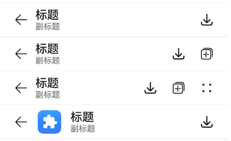
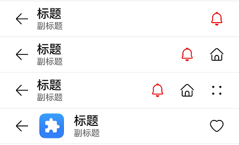

# ComposeTitleBarV2
<!--Kit: ArkUI-->
<!--Subsystem: ArkUI-->
<!--Owner: @wangrunsen-->
<!--Designer: @YanSanzo-->
<!--Tester: @ybhou1993-->
<!--Adviser: @Brilliantry_Rui-->

ComposeTitleBarV2组件是一种标题栏，支持设置标题、头像（可选）和副标题（可选），可用于一级页面、二级及其以上界面配置返回键。

该组件基于[状态管理（V2）](../../../ui/state-management/arkts-state-management-overview.md#状态管理v2)实现，相较于[状态管理（V1）](../../../ui/state-management/arkts-state-management-overview.md#状态管理v1)，状态管理（V2）增强了对数据对象的深度观察与管理能力，不再局限于组件层级。借助状态管理（V2），开发者可以通过该组件更灵活地控制普通标题栏的数据和状态，实现更高效的用户界面刷新。

> **说明：**
>
> - 该组件仅可在Stage模型下使用。
>
> - 如果ComposeTitleBarV2设置[通用属性](ts-component-general-attributes.md)和[通用事件](ts-component-general-events.md)，编译工具链会额外生成节点__Common__，并将通用属性或通用事件挂载在__Common__上，而不是直接应用到ComposeTitleBarV2本身。这可能导致开发者设置的通用属性或通用事件不生效或不符合预期，因此，不建议ComposeTitleBarV2设置通用属性和通用事件。

**起始版本：** 26.0.0

## 导入模块

```ts
import { ComposeTitleBarV2, ComposeTitleBarV2MenuItem } from '@kit.ArkUI';
```

## 子组件

无

## ComposeTitleBarV2

ComposeTitleBarV2({item?: ComposeTitleBarV2MenuItem, title: ResourceStr, subtitle?: ResourceStr, menuItems?: Array&lt;ComposeTitleBarV2MenuItem&gt;})

ComposeTitleBarV2组件是一种标题栏，支持设置标题、头像（可选）和副标题（可选），可用于一级页面、二级及其以上界面配置返回键。

> **说明：**
> 
> 入参不可为undefined，即ComposeTitleBarV2(undefined)。


**起始版本：** 26.0.0

**装饰器类型：** \@ComponentV2

**模型约束：** 此接口仅可在Stage模型下使用。

**原子化服务API：** 从API版本26.0.0开始，该接口支持在原子化服务中使用。

**系统能力：** SystemCapability.ArkUI.ArkUI.Full

**设备行为差异：** 本接口实际支持的设备类型范围（Phone、PC/2in1、Tablet、TV）小于其所属系统能力支持的设备类型范围（Phone、PC/2in1、Tablet、TV、Wearable）。因硬件能力限制，该接口在Wearable设备中调用将运行异常，异常信息中提示接口未定义。

| 名称    | 类型   | 必填 | 装饰器类型 | 说明      |
| -------- | -------- | -------- | -------- | -------- |
| item | [ComposeTitleBarV2MenuItem](#composetitlebarv2menuitem) | 否 | \@Param | 用于左侧头像的单个菜单项。 |
| title | [ResourceStr](ts-types.md#resourcestr) | 是 | \@Param | 标题。 |
| subtitle | [ResourceStr](ts-types.md#resourcestr) | 否 | \@Param | 副标题。 |
| menuItems | Array&lt;[ComposeTitleBarV2MenuItem](#composetitlebarv2menuitem)&gt; | 否 | \@Param | 右侧菜单项列表。 |

## ComposeTitleBarV2MenuItem

菜单项类，用于定义标题栏左侧头像或右侧菜单项。该类使用\@ObservedV2装饰器，支持响应式状态管理。

### 属性

**起始版本：** 26.0.0

**装饰器类型：** \@ObservedV2

**模型约束：** 此接口仅可在Stage模型下使用。

**原子化服务API：** 从API版本26.0.0开始，该接口支持在原子化服务中使用。

**系统能力：** SystemCapability.ArkUI.ArkUI.Full

**设备行为差异：** 本接口实际支持的设备类型范围（Phone、PC/2in1、Tablet、TV）小于其所属系统能力支持的设备类型范围（Phone、PC/2in1、Tablet、TV、Wearable）。因硬件能力限制，该接口在Wearable设备中调用将运行异常，异常信息中提示接口未定义。

| 名称 | 类型 | 只读 | 可选 | 说明 |
| -------- | -------- | -------- | -------- | -------- |
| value | [ResourceStr](ts-types.md#resourcestr) | 否 | 否 | 图标资源。<br>**装饰器类型：** @Trace  |
| symbolStyle | [SymbolGlyphModifier](ts-universal-attributes-attribute-symbolglyphmodifier.md#symbolglyphmodifier) | 否 | 是 | Symbol图标资源，优先级大于value，item左侧头像不支持设置该属性。<br>**装饰器类型：** @Trace  |
| label | [ResourceStr](ts-types.md#resourcestr) | 否 | 是 | 图标标签描述。<br>**装饰器类型：** @Trace  |
| isEnabled | boolean | 否 | 是 | 是否启用，默认启用。<br> isEnabled为true时，表示启用。<br> isEnabled为false时，表示禁用。<br>item属性不支持触发isEnabled属性。<br/>默认值：true。<br>**装饰器类型：** @Trace  |
| action | [OnActionCallback](#onactioncallback) | 否 | 是 | 触发时的动作闭包，item属性不支持触发action事件。<br>**装饰器类型：** @Trace  |
| accessibilityLevel | string | 否 | 是 | 标题栏右侧自定义按钮无障碍重要性。用于控制当前项是否可被无障碍辅助服务所识别。<br/>支持的值为：<br/>"auto"：当前组件会根据情况转换成'yes'或'no'。<br/>"yes"：当前组件可被无障碍辅助服务所识别。<br/>"no"：当前组件不可被无障碍辅助服务所识别。<br/>"no-hide-descendants"：当前组件及其所有子组件不可被无障碍辅助服务所识别。<br/>默认值："auto"。<br>**装饰器类型：** @Trace  |
| accessibilityText | [ResourceStr](ts-types.md#resourcestr) | 否 | 是 | 标题栏右侧自定义按钮的无障碍文本属性。当组件不包含文本属性时，屏幕朗读选中此组件时不播报，使用者无法清楚地知道当前选中了什么组件。为了解决此场景，开发人员可为不包含文字信息的组件设置无障碍文本，当屏幕朗读选中此组件时播报无障碍文本的内容，帮助屏幕朗读的使用者清楚地知道自己选中了什么组件。<br/>默认值：有label默认值为当前项label属性内容，没有设置label时，默认值为" "。<br>**装饰器类型：** @Trace  |
| accessibilityDescription | [ResourceStr](ts-types.md#resourcestr) | 否 | 是 | 标题栏右侧自定义按钮的无障碍描述。此描述用于向用户详细解释当前组件，开发人员应为组件的这一属性提供较为详尽的文本说明，以协助用户理解即将执行的操作及其可能产生的后果。特别是当这些后果无法仅从组件的属性和无障碍文本中直接获知时。如果组件同时具备文本属性和无障碍说明属性，当组件被选中时，系统将首先播报组件的文本属性，随后播报无障碍说明属性的内容。<br/>默认值："单指双击即可执行"。<br>**装饰器类型：** @Trace  |

### constructor

constructor(params?: ComposeTitleBarV2MenuItemParams)

ComposeTitleBarV2MenuItem的构造函数。

**起始版本：** 26.0.0

**模型约束：** 此接口仅可在Stage模型下使用。

**原子化服务API：** 从API版本26.0.0开始，该接口支持在原子化服务中使用。

**系统能力：** SystemCapability.ArkUI.ArkUI.Full

**设备行为差异：** 本接口实际支持的设备类型范围（Phone、PC/2in1、Tablet、TV）小于其所属系统能力支持的设备类型范围（Phone、PC/2in1、Tablet、TV、Wearable）。因硬件能力限制，该接口在Wearable设备中调用将运行异常，异常信息中提示接口未定义。

**参数：**

| 参数名 | 类型 | 必填 | 说明 |
| -------- | -------- | -------- | -------- |
| params | [ComposeTitleBarV2MenuItemParams](#composetitlebarv2menuitemparams) | 否 | 菜单项参数对象。 |

## ComposeTitleBarV2MenuItemParams

菜单项参数接口，用于创建ComposeTitleBarV2MenuItem实例。

**起始版本：** 26.0.0

**模型约束：** 此接口仅可在Stage模型下使用。

**原子化服务API：** 从API版本26.0.0开始，该接口支持在原子化服务中使用。

**系统能力：** SystemCapability.ArkUI.ArkUI.Full

**设备行为差异：** 本接口实际支持的设备类型范围（Phone、PC/2in1、Tablet、TV）小于其所属系统能力支持的设备类型范围（Phone、PC/2in1、Tablet、TV、Wearable）。因硬件能力限制，该接口在Wearable设备中调用将运行异常，异常信息中提示接口未定义。

| 名称 | 类型 | 只读 | 可选 | 说明 |
| -------- | -------- | -------- | -------- | -------- |
| value | [ResourceStr](ts-types.md#resourcestr) | 否 | 否 | 图标资源。 |
| symbolStyle | [SymbolGlyphModifier](ts-universal-attributes-attribute-symbolglyphmodifier.md#symbolglyphmodifier) | 否 | 是 | Symbol图标资源，优先级大于value，item左侧头像不支持设置该属性。 |
| label | [ResourceStr](ts-types.md#resourcestr) | 否 | 是 | 图标标签描述。 |
| isEnabled | boolean | 否 | 是 | 是否启用，默认启用。<br> isEnabled为true时，表示启用。<br> isEnabled为false时，表示禁用。<br>item属性不支持触发isEnabled属性。<br/>默认值：true。 |
| action | [OnActionCallback](#onactioncallback) | 否 | 是 | 触发时的动作闭包，item属性不支持触发action事件。 |
| accessibilityLevel | string | 否 | 是 | 标题栏右侧自定义按钮无障碍重要性。用于控制当前项是否可被无障碍辅助服务所识别。<br/>支持的值为：<br/>"auto"：当前组件会根据情况转换成'yes'或'no'。<br/>"yes"：当前组件可被无障碍辅助服务所识别。<br/>"no"：当前组件不可被无障碍辅助服务所识别。<br/>"no-hide-descendants"：当前组件及其所有子组件不可被无障碍辅助服务所识别。<br/>默认值："auto"。 |
| accessibilityText | [ResourceStr](ts-types.md#resourcestr) | 否 | 是 | 标题栏右侧自定义按钮的无障碍文本属性。当组件不包含文本属性时，屏幕朗读选中此组件时不播报，使用者无法清楚地知道当前选中了什么组件。为了解决此场景，开发人员可为不包含文字信息的组件设置无障碍文本，当屏幕朗读选中此组件时播报无障碍文本的内容，帮助屏幕朗读的使用者清楚地知道自己选中了什么组件。<br/>默认值：有label默认值为当前项label属性内容，没有设置label时，默认值为" "。 |
| accessibilityDescription | [ResourceStr](ts-types.md#resourcestr) | 否 | 是 | 标题栏右侧自定义按钮的无障碍描述。此描述用于向用户详细解释当前组件，开发人员应为组件的这一属性提供较为详尽的文本说明，以协助用户理解即将执行的操作及其可能产生的后果。特别是当这些后果无法仅从组件的属性和无障碍文本中直接获知时。如果组件同时具备文本属性和无障碍说明属性，当组件被选中时，系统将首先播报组件的文本属性，随后播报无障碍说明属性的内容。<br/>默认值："单指双击即可执行"。 |

## OnActionCallback

type OnActionCallback = () => void

点击菜单项时触发的回调函数类型。

**起始版本：** 26.0.0

**模型约束：** 此接口仅可在Stage模型下使用。

**系统能力：** SystemCapability.ArkUI.ArkUI.Full

**原子化服务API：** 从API版本26.0.0开始，该接口支持在原子化服务中使用。

**设备行为差异：** 本接口实际支持的设备类型范围（Phone、PC/2in1、Tablet、TV）小于其所属系统能力支持的设备类型范围（Phone、PC/2in1、Tablet、TV、Wearable）。因硬件能力限制，该接口在Wearable设备中调用将运行异常，异常信息中提示接口未定义。

## 事件
不支持[通用事件](ts-component-general-events.md)。

## 示例

### 示例1（简单的标题栏）

从API版本26.0.0开始，可以使用ComposeTitleBarV2接口实现简单的标题栏，该示例展示了ComposeTitleBarV2的基本用法。

```ts
import { ComposeTitleBarV2, ComposeTitleBarV2MenuItem, Prompt } from '@kit.ArkUI';

@Entry
@ComponentV2
struct Index {
  // 定义右侧菜单项目列表
  @Local menuItems: Array<ComposeTitleBarV2MenuItem> = [
    new ComposeTitleBarV2MenuItem({
      // 菜单图片资源
      value: $r('sys.media.ohos_save_button_filled'),
      // 启用图标
      isEnabled: true,
      // 点击菜单时触发事件
      action: () => Prompt.showToast({ message: 'icon 1' }),
    }),
    new ComposeTitleBarV2MenuItem({
      value: $r('sys.media.ohos_ic_public_copy'),
      isEnabled: true,
      action: () => Prompt.showToast({ message: 'icon 2' }),
    }),
    new ComposeTitleBarV2MenuItem({
      value: $r('sys.media.ohos_ic_public_edit'),
      isEnabled: true,
      action: () => Prompt.showToast({ message: 'icon 3' }),
    }),
    new ComposeTitleBarV2MenuItem({
      value: $r('sys.media.ohos_ic_public_remove'),
      isEnabled: true,
      action: () => Prompt.showToast({ message: 'icon 4' }),
    }),
  ]

  build(): void {
    Row() {
      Column() {
        // 分割线
        Divider().height(2).color(0xCCCCCC)
        ComposeTitleBarV2({
          title: '标题',
          subtitle: '副标题',
          menuItems: this.menuItems.slice(0, 1),
        })
        Divider().height(2).color(0xCCCCCC)
        ComposeTitleBarV2({
          title: '标题',
          subtitle: '副标题',
          menuItems: this.menuItems.slice(0, 2),
        })
        Divider().height(2).color(0xCCCCCC)
        ComposeTitleBarV2({
          title: '标题',
          subtitle: '副标题',
          menuItems: this.menuItems,
        })
        Divider().height(2).color(0xCCCCCC)
        // 定义带头像的标题栏
        ComposeTitleBarV2({
          menuItems: [
            new ComposeTitleBarV2MenuItem({
              isEnabled: true,
              value: $r('sys.media.ohos_save_button_filled'),
              action: () => Prompt.showToast({ message: 'icon' }),
            })
          ],
          title: '标题',
          subtitle: '副标题',
          item: new ComposeTitleBarV2MenuItem({
            isEnabled: true,
            value: $r('sys.media.ohos_app_icon')
          })
        })
        Divider().height(2).color(0xCCCCCC)
      }
    }.height('100%')
  }
}
```



### 示例2（右侧自定义按钮播报）

从API版本26.0.0开始，通过设置标题栏右侧自定义按钮的以下属性接口accessibilityText、accessibilityDescription、accessibilityLevel，实现自定义屏幕朗读播报文本。

```ts
import { ComposeTitleBarV2, ComposeTitleBarV2MenuItem, Prompt } from '@kit.ArkUI';

@Entry
@ComponentV2
struct Index {
  // 定义右侧菜单项目列表
  @Local menuItems: Array<ComposeTitleBarV2MenuItem> = [
    new ComposeTitleBarV2MenuItem({
      // 菜单图片资源
      value: $r('sys.media.ohos_save_button_filled'),
      // 启用图标
      isEnabled: true,
      // 点击菜单时触发事件
      action: () => Prompt.showToast({ message: 'icon 1' }),
      // 屏幕朗读播报文本，优先级比label高
      accessibilityText: '保存',
      // 屏幕朗读是否可以聚焦到
      accessibilityLevel: 'yes',
      // 屏幕朗读最后播报的描述文本
      accessibilityDescription: '点击操作保存图标',
    }),
    new ComposeTitleBarV2MenuItem({
      value: $r('sys.media.ohos_ic_public_copy'),
      isEnabled: true,
      action: () => Prompt.showToast({ message: 'icon 2' }),
      accessibilityText: '复制',
      // 此处为no，屏幕朗读不聚焦
      accessibilityLevel: 'no',
      accessibilityDescription: '点击操作复制图标',
    }),
    new ComposeTitleBarV2MenuItem({
      value: $r('sys.media.ohos_ic_public_edit'),
      isEnabled: true,
      action: () => Prompt.showToast({ message: 'icon 3' }),
      accessibilityText: '编辑',
      accessibilityLevel: 'yes',
      accessibilityDescription: '点击操作编辑图标',
    }),
    new ComposeTitleBarV2MenuItem({
      value: $r('sys.media.ohos_ic_public_remove'),
      isEnabled: true,
      action: () => Prompt.showToast({ message: 'icon 4' }),
      accessibilityText: '移除',
      accessibilityLevel: 'yes',
      accessibilityDescription: '点击操作移除图标',
    }),
  ]

  build(): void {
    Row() {
      Column() {
        // 分割线
        Divider().height(2).color(0xCCCCCC)
        ComposeTitleBarV2({
          title: '标题',
          subtitle: '副标题',
          menuItems: this.menuItems.slice(0, 1),
        })
        Divider().height(2).color(0xCCCCCC)
        ComposeTitleBarV2({
          title: '标题',
          subtitle: '副标题',
          menuItems: this.menuItems.slice(0, 2),
        })
        Divider().height(2).color(0xCCCCCC)
        ComposeTitleBarV2({
          title: '标题',
          subtitle: '副标题',
          menuItems: this.menuItems,
        })
        Divider().height(2).color(0xCCCCCC)
        // 定义带头像的标题栏
        ComposeTitleBarV2({
          menuItems: [
            new ComposeTitleBarV2MenuItem({
              isEnabled: true,
              value: $r('sys.media.ohos_save_button_filled'),
              action: () => Prompt.showToast({ message: 'icon' }),
            })
          ],
          title: '标题',
          subtitle: '副标题',
          item: new ComposeTitleBarV2MenuItem({
            isEnabled: true,
            value: $r('sys.media.ohos_app_icon'),
          }),
        })
        Divider().height(2).color(0xCCCCCC)
      }
    }.height('100%')
  }
}
```


### 示例3（设置Symbol类型图标）

从API版本26.0.0开始，通过设置ComposeTitleBarV2MenuItem的属性接口symbolStyle，实现Symbol类型图标的配置。

```ts
import { ComposeTitleBarV2, ComposeTitleBarV2MenuItem, Prompt, SymbolGlyphModifier } from '@kit.ArkUI';

@Entry
@ComponentV2
struct Index {
  // 定义右侧菜单项目列表
  @Local menuItems: Array<ComposeTitleBarV2MenuItem> = [
    new ComposeTitleBarV2MenuItem({
      // 菜单图片资源
      value: $r('sys.symbol.house'),
      // 菜单symbol图标，优先级大于value
      symbolStyle: new SymbolGlyphModifier($r('sys.symbol.bell')).fontColor([Color.Red]),
      // 启用图标
      isEnabled: true,
      // 点击菜单时触发事件
      action: () => Prompt.showToast({ message: 'symbol icon 1' }),
    }),
    new ComposeTitleBarV2MenuItem({
      value: $r('sys.symbol.house'),
      isEnabled: true,
      action: () => Prompt.showToast({ message: 'symbol icon 2' }),
    }),
    new ComposeTitleBarV2MenuItem({
      value: $r('sys.symbol.car'),
      symbolStyle: new SymbolGlyphModifier($r('sys.symbol.heart')).fontColor([Color.Pink]),
      isEnabled: true,
      action: () => Prompt.showToast({ message: 'symbol icon 3' }),
    }),
    new ComposeTitleBarV2MenuItem({
      value: $r('sys.symbol.car'),
      isEnabled: true,
      action: () => Prompt.showToast({ message: 'symbol icon 4' }),
    }),
  ]

  build(): void {
    Row() {
      Column() {
        // 分割线
        Divider().height(2).color(0xCCCCCC)
        ComposeTitleBarV2({
          title: '标题',
          subtitle: '副标题',
          menuItems: this.menuItems.slice(0, 1),
        })
        Divider().height(2).color(0xCCCCCC)
        ComposeTitleBarV2({
          title: '标题',
          subtitle: '副标题',
          menuItems: this.menuItems.slice(0, 2),
        })
        Divider().height(2).color(0xCCCCCC)
        ComposeTitleBarV2({
          title: '标题',
          subtitle: '副标题',
          menuItems: this.menuItems,
        })
        Divider().height(2).color(0xCCCCCC)
        // 定义带头像的标题栏
        ComposeTitleBarV2({
          menuItems: [
            new ComposeTitleBarV2MenuItem({
              isEnabled: true,
              value: $r('sys.symbol.heart'),
              action: () => Prompt.showToast({ message: 'symbol icon 1' }),
            })
          ],
          title: '标题',
          subtitle: '副标题',
          item: new ComposeTitleBarV2MenuItem({
            isEnabled: true,
            value: $r('sys.media.ohos_app_icon'),
          }),
        })
        Divider().height(2).color(0xCCCCCC)
      }
    }.height('100%')
  }
}
```

