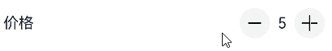
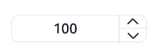
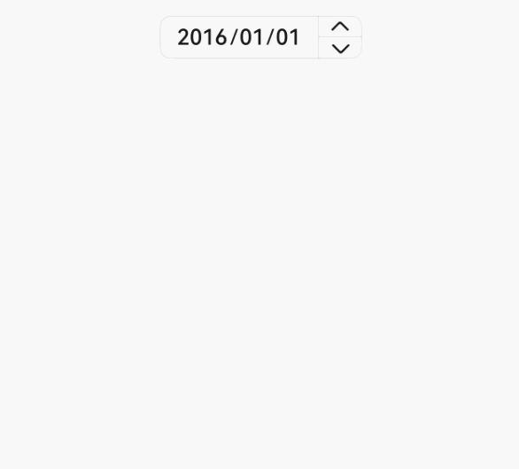
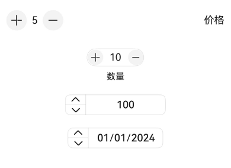

# CounterV2
<!--Kit: ArkUI-->
<!--Subsystem: ArkUI-->
<!--Owner: @xieziang-->
<!--Designer: @youzhi92-->
<!--Tester: @TerryTsao-->
<!--Adviser: @Brilliantry_Rui-->

CounterV2组件用于精确调节数值。

该组件基于[状态管理（V2）](../../../ui/state-management/arkts-state-management-overview.md#状态管理v2)实现，相较于[状态管理（V1）](../../../ui/state-management/arkts-state-management-overview.md#状态管理v1)，状态管理（V2）增强了对数据对象的深度观察与管理能力，不再局限于组件层级。借助状态管理（V2），开发者可以通过该组件更灵活地控制Counter的数据和状态，实现更高效的用户界面刷新。

> **说明：**
>
> - 该组件接口仅可在Stage模型下使用。
>
> - 如果CounterV2设置[通用属性](ts-component-general-attributes.md)和[通用事件](ts-component-general-events.md)，编译工具链会额外生成节点__Common__，并将通用属性或通用事件挂载在__Common__上，而不是直接应用到CounterV2本身。这可能导致开发者设置的通用属性或通用事件不生效或不符合预期，因此，不建议CounterV2设置通用属性和通用事件。

**起始版本：** 26.0.0

## 导入模块

```ts
import { CounterV2Type, CounterV2Component, CounterV2Options, CounterV2DateData } from '@kit.ArkUI';
```

## 子组件

无

## CounterV2Component

CounterV2Component({&nbsp;options:&nbsp;CounterV2Options&nbsp;})

定义CounterV2。

**起始版本：** 26.0.0

**装饰器类型：** \@ComponentV2

**原子化服务API：** 从API版本26.0.0开始，该接口支持在原子化服务中使用。

**系统能力：** SystemCapability.ArkUI.ArkUI.Full

| 名称   | 类型                                | 必填 | 装饰器类型 | 说明                        |
| ------- | ----------------------------------- | ---- | ---------- | --------------------------- |
| options | [CounterV2Options](#counterv2options) | 是   | \@Param   | 定义CounterV2组件的类型。 |

## CounterV2Options

CounterV2Options定义CounterV2类型及样式。

**起始版本：** 26.0.0

**原子化服务API：** 从API版本26.0.0开始，该接口支持在原子化服务中使用。

**系统能力：** SystemCapability.ArkUI.ArkUI.Full

| 名称          | 类型         | 只读 | 可选 | 说明                            |
| ------------- | ------------ | ---- | ---- | ------------------------------- |
| type | [CounterV2Type](#counterv2type) | 否  | 否  | 指定当前CounterV2的类型。 |
| direction | [Direction](ts-appendix-enums.md#direction) | 否 | 是 | 布局方向。<br/>默认值：Direction.Auto<br>值为undefined时，按默认值处理。 |
| numberOptions | [CounterV2NumberStyleOptions](#counterv2numberstyleoptions) | 否   | 是   | 列表型和紧凑型CounterV2的样式。<br>默认值：显示计数器为0的列表型或紧凑型CounterV2。<br>值为undefined时，按默认值处理。 |
| inlineOptions | [CounterV2InlineStyleOptions](#counterv2inlinestyleoptions) | 否 | 是 | 普通数字内联调节型CounterV2的样式。<br>默认值：显示计数器为0的普通数字内联调节型CounterV2。<br>值为undefined时，按默认值处理。 |
| dateOptions | [CounterV2DateStyleOptions](#counterv2datestyleoptions) | 否 | 是 | 日期内联型CounterV2的样式。<br>默认值：显示0001/01/01的日期内联型CounterV2。<br>值为undefined时，按默认值处理。 |

选择不同的CounterV2类型，需要选择对应的CounterV2样式。

| CounterV2类型             | CounterV2样式        |
| ----------------------- | ------------------ |
| CounterV2Type.LIST        | CounterV2NumberStyleOptions |
| CounterV2Type.COMPACT     | CounterV2NumberStyleOptions |
| CounterV2Type.INLINE      | CounterV2InlineStyleOptions |
| CounterV2Type.INLINE_DATE | CounterV2DateStyleOptions   |

## CounterV2Type

CounterV2Type指定CounterV2类型。

**起始版本：** 26.0.0

**原子化服务API：** 从API版本26.0.0开始，该接口支持在原子化服务中使用。

**系统能力：** SystemCapability.ArkUI.ArkUI.Full

| 名称        | 值   | 说明                        |
| ----------- | ---- | --------------------------- |
| LIST        | 0    | 列表型CounterV2。             |
| COMPACT     | 1    | 紧凑型CounterV2。             |
| INLINE      | 2    | 普通数字内联调节型CounterV2。 |
| INLINE_DATE | 3    | 日期内联型CounterV2。       |

各类型CounterV2组件的展示效果可参考[示例1（列表型CounterV2）](#示例1列表型counterv2)、[示例2（紧凑型CounterV2）](#示例2紧凑型counterv2)、[示例3（数值内联型CounterV2）](#示例3数值内联型counterv2)、[示例4（日期内联型CounterV2）](#示例4日期内联型counterv2)。

## OnCounterV2HoverCallback

type OnCounterV2HoverCallback = (isHover: boolean) => void

定义CounterV2的鼠标悬浮回调类型。

**起始版本：** 26.0.0

**原子化服务API：** 从API版本26.0.0开始，该接口支持在原子化服务中使用。

**系统能力：** SystemCapability.ArkUI.ArkUI.Full

**参数：**

| 参数名  | 类型      | 必填 | 说明                                                         |
| ------- | --------- | ---- | ------------------------------------------------------------ |
| isHover | boolean   | 是   | 表示鼠标是否悬浮在组件上。<br/>鼠标进入时为true，离开时为false。 |

## CounterV2CommonOptions

CounterV2CommonOptions定义了CounterV2的共通属性和事件。

**起始版本：** 26.0.0

**原子化服务API：** 从API版本26.0.0开始，该接口支持在原子化服务中使用。

**系统能力：** SystemCapability.ArkUI.ArkUI.Full

| 名称            | 类型                      | 只读 | 可选 | 说明                                                         |
| --------------- | ------------------------- | ---- | ---- | ------------------------------------------------------------ |
| focusable       | boolean                   | 否  | 是  | 设置CounterV2是否可获焦。<br/>**说明：** <br/>该属性对列表型和紧凑型CounterV2生效。<br/>默认值：true<br/>true：CounterV2可获焦；false：CounterV2不可获焦。<br>值为undefined时，按默认值处理。 |
| step            | number                    | 否  | 是  | 设置CounterV2的步长。<br/>取值范围：大于等于1的整数。<br/>默认值：1<br>超出取值范围按默认值处理。 |
| onHoverIncrease | [OnCounterV2HoverCallback](#oncounterv2hovercallback) | 否  | 是  | 鼠标进入或退出CounterV2组件的"增加按钮"时，触发该回调。<br/>默认值：undefined，表示不触发该回调。<br>值为undefined时，按默认值处理。 |
| onHoverDecrease | [OnCounterV2HoverCallback](#oncounterv2hovercallback) | 否  | 是  | 鼠标进入或退出CounterV2组件的"减小按钮"时，触发该回调。<br/>默认值：undefined，表示不触发该回调。<br>值为undefined时，按默认值处理。 |

## OnInlineCounterV2Change

type OnInlineCounterV2Change = (value: number) => void

定义数值内联型CounterV2的值变化回调类型。

**起始版本：** 26.0.0

**原子化服务API：** 从API版本26.0.0开始，该接口支持在原子化服务中使用。

**系统能力：** SystemCapability.ArkUI.ArkUI.Full

**参数：**

| 参数名 | 类型   | 必填 | 说明               |
| ------ | ------ | ---- | ------------------ |
| value  | number | 是   | 当前显示的数值。<br/>取值范围：(-∞, +∞) |

## CounterV2InlineStyleOptions

CounterV2InlineStyleOptions定义了数值内联型CounterV2的属性和事件。

继承于[CounterV2CommonOptions](#counterv2commonoptions)。

**起始版本：** 26.0.0

**原子化服务API：** 从API版本26.0.0开始，该接口支持在原子化服务中使用。

**系统能力：** SystemCapability.ArkUI.ArkUI.Full

| 名称      | 类型                   | 只读 | 可选 | 说明                                                   |
| --------- | ---------------------- | ---- | ---- | ------------------------------------------------------ |
| value     | number                 | 否  | 是  | 设置CounterV2的初始值。<br/>默认值：0<br>取值范围：[min, max]，其中min和max分别对应下述CounterV2的最小值和最大值。<br>超出取值范围时，如果值为undefined，按默认值处理，否则按最大值处理。 |
| min       | number                 | 否  | 是  | 设置CounterV2的最小值。<br/>默认值：0<br>取值范围：(-∞, +∞)<br>值为undefined时，按默认值处理。 |
| max       | number                 | 否  | 是  | 设置CounterV2的最大值。<br/>默认值：999<br>取值范围：(-∞, +∞)<br>值为undefined时，按默认值处理。 |
| textWidth | number                 | 否  | 是  | 设置数值文本的宽度。<br/>默认值：undefined<br/>取值范围：[0, +∞)<br/>单位：vp<br/>不设置该属性或者设置为undefined时，文本宽度由内容自适应撑开。小于0时，按0处理。 |
| onChange  | [OnInlineCounterV2Change](#oninlinecounterv2change) | 否  | 是  | 数值改变时，返回当前值。<br/>默认值：数值改变时，不返回值。<br>值为undefined时，按默认值处理。 |

## CounterV2NumberStyleOptions

CounterV2NumberStyleOptions定义了列表型和紧凑型CounterV2的属性和事件。

继承于[CounterV2InlineStyleOptions](#counterv2inlinestyleoptions)。

**起始版本：** 26.0.0

**原子化服务API：** 从API版本26.0.0开始，该接口支持在原子化服务中使用。

**系统能力：** SystemCapability.ArkUI.ArkUI.Full

| 名称            | 类型                                   | 只读 | 可选 | 说明                                                         |
| --------------- | -------------------------------------- | ---- | ---- | ------------------------------------------------------------ |
| label           | [ResourceStr](ts-types.md#resourcestr) | 否   | 是   | 设置CounterV2的说明文本。<br>默认值：' '<br>值为undefined时，按默认值处理。 |
| onFocusIncrease | [VoidCallback](ts-types.md#voidcallback12)                             | 否   | 是   | 当CounterV2组件的"增加按钮"获取焦点时，触发该回调。<br>默认值：undefined，表示不触发该回调。<br>值为undefined时，按默认值处理。 |
| onFocusDecrease | [VoidCallback](ts-types.md#voidcallback12)                             | 否   | 是   | 当CounterV2组件的"减小按钮"获取焦点时，触发该回调。<br>默认值：undefined，表示不触发该回调。<br>值为undefined时，按默认值处理。 |
| onBlurIncrease  | [VoidCallback](ts-types.md#voidcallback12)                             | 否   | 是   | 当CounterV2组件的"增加按钮"失去焦点时，触发该回调。<br>默认值：undefined，表示不触发该回调。<br>值为undefined时，按默认值处理。 |
| onBlurDecrease  | [VoidCallback](ts-types.md#voidcallback12)                             | 否   | 是   | 当CounterV2组件的"减小按钮"失去焦点时，触发该回调。<br>默认值：undefined，表示不触发该回调。<br>值为undefined时，按默认值处理。 |

## CounterV2DateData

CounterV2DateData定义了日期通用属性和方法，包括年、月、日。

### 属性

**起始版本：** 26.0.0

**原子化服务API：** 从API版本26.0.0开始，该接口支持在原子化服务中使用。

**系统能力：** SystemCapability.ArkUI.ArkUI.Full

| 名称  | 类型   | 只读 | 可选 | 说明                                                         |
| ----- | ------ | ---- | ---- | ------------------------------------------------------------ |
| year  | number | 否   | 否   | 设置日期内联型初始年份。<br/>默认值：1<br/>取值范围：[1, 5000]<br>超出取值范围按默认值处理。 |
| month | number | 否   | 否   | 设置日期内联型初始月份。<br/>默认值：1<br/>取值范围：[1, 12]<br>超出取值范围按默认值处理。 |
| day   | number | 否   | 否   | 设置日期内联型初始日。<br/>默认值：1<br/>取值范围：[1, 31]<br/>必须为合法日期，如month为2月时，day传入30将视为异常值，按默认值处理。 |

### constructor

constructor(year: number, month: number, day: number)

CounterV2DateData的构造函数用于初始化日期对象。

**起始版本：** 26.0.0

**原子化服务API：** 从API版本26.0.0开始，该接口支持在原子化服务中使用。

**系统能力：** SystemCapability.ArkUI.ArkUI.Full

**参数：**

| 参数名 | 类型 | 必填 | 说明 |
| ---------- | ------ |  ------ | ---------------------------- |
| year       | number |  是 | 设置日期内联型初始年份。<br/>取值范围：[1, 5000]<br/>超出取值范围按默认值处理。     |
| month      | number |  是 | 设置日期内联型初始月份。<br/>取值范围：[1, 12]<br/>超出取值范围按默认值处理。     |
| day        | number |  是 | 设置日期内联型初始日。<br/>取值范围：[1, 31]<br/>必须为合法日期，如month为2月时，day传入30将视为异常值，按默认值处理。       |

### toString

toString(): string

以字符串格式返回当前日期值。格式为'YYYY-MM-DD'。

**起始版本：** 26.0.0

**原子化服务API：** 从API版本26.0.0开始，该接口支持在原子化服务中使用。

**系统能力：** SystemCapability.ArkUI.ArkUI.Full

**返回值：**

| 类型 | 说明 |
| -------- | -------- |
| string | 当前日期值。 |

## OnDateCounterV2ChangeCallback

type OnDateCounterV2ChangeCallback = (date: CounterV2DateData) => void

定义日期型CounterV2的日期变化回调类型。

**起始版本：** 26.0.0

**原子化服务API：** 从API版本26.0.0开始，该接口支持在原子化服务中使用。

**系统能力：** SystemCapability.ArkUI.ArkUI.Full

**参数：**

| 参数名 | 类型                                  | 必填 | 说明               |
| ------ | ------------------------------------- | ---- | ------------------ |
| date   | [CounterV2DateData](#counterv2datedata) | 是   | 当前显示的日期值。 |

## CounterV2DateStyleOptions

CounterV2DateStyleOptions定义日期内联型CounterV2的属性和事件。

继承于[CounterV2CommonOptions](#counterv2commonoptions)。

**起始版本：** 26.0.0

**原子化服务API：** 从API版本26.0.0开始，该接口支持在原子化服务中使用。

**系统能力：** SystemCapability.ArkUI.ArkUI.Full

| 名称         | 类型                                | 只读 | 可选 | 说明                                                      |
| ------------ | ----------------------------------- | ---- | ---- | --------------------------------------------------------- |
| year         | number                              | 否  | 是  | 设置日期内联型初始年份。<br/>默认值：1<br/>取值范围：[1, 5000]<br>超出取值范围按默认值处理。 |
| month        | number                              | 否  | 是  | 设置日期内联型初始月份。<br/>默认值：1<br/>取值范围：[1, 12]<br>超出取值范围按默认值处理。 |
| day          | number                              | 否  | 是  | 设置日期内联型初始日。<br/>默认值：1<br/>取值范围：[1, 31]<br/>必须为合法日期，如month为2月时，day传入30将视为异常值，按默认值处理。 |
| onDateChange | [OnDateCounterV2ChangeCallback](#ondatecounterv2changecallback) | 否  | 是  | 当日期改变时，返回当前日期。<br/>值为undefined时，不显示当前的日期值。 |

## 属性
不支持[通用属性](ts-component-general-attributes.md)。

## 事件
不支持[通用事件](ts-component-general-events.md)。

## 示例

### 示例1（列表型CounterV2）

该示例通过设置[CounterV2Type](#counterv2type).LIST和配置[CounterV2Options](#counterv2options)的numberOptions属性，实现了列表型CounterV2。

从API版本26.0.0开始，[CounterV2Options](#counterv2options)支持numberOptions属性。

```ts
import { CounterV2Type, CounterV2Component } from '@kit.ArkUI';

@Entry
@ComponentV2
struct ListCounterExample {
  build() {
    Column() {
      // 列表型CounterV2
      CounterV2Component({
        options: {
          type: CounterV2Type.LIST,
          numberOptions: {
            label: '价格',
            min: 0,
            value: 5,
            max: 10
          }
        }
      })
    }
  }
}
```



### 示例2（紧凑型CounterV2）

该示例通过设置[CounterV2Type](#counterv2type).COMPACT和配置[CounterV2Options](#counterv2options)的numberOptions属性，实现紧凑型CounterV2。

从API版本26.0.0开始，[CounterV2Options](#counterv2options)支持numberOptions属性。

```ts
import { CounterV2Type, CounterV2Component } from '@kit.ArkUI';

@Entry
@ComponentV2
struct CompactCounterExample {
  build() {
    Column() {
      // 紧凑型CounterV2
      CounterV2Component({
        options: {
          type: CounterV2Type.COMPACT,
          numberOptions: {
            label: '数量',
            value: 10,
            min: 0,
            max: 100,
            step: 10
          }
        }
      })
    }
  }
}
```


### 示例3（数值内联型CounterV2）

该示例通过设置[CounterV2Type](#counterv2type).INLINE和配置[CounterV2Options](#counterv2options)的inlineOptions属性，实现数值内联型CounterV2。

从API版本26.0.0开始，[CounterV2Options](#counterv2options)支持inlineOptions属性。

```ts
import { CounterV2Type, CounterV2Component } from '@kit.ArkUI';

@Entry
@ComponentV2
struct NumberStyleExample {
  build() {
    Column() {
      // 数值内联型CounterV2
      CounterV2Component({
        options: {
          type: CounterV2Type.INLINE,
          inlineOptions: {
            value: 100,
            min: 10,
            step: 2,
            max: 1000,
            textWidth: 100,
            onChange: (value: number) => {
              console.info('onCounterV2Change Counter: ' + value.toString());
            }
          }
        }
      })
    }
  }
}
```



### 示例4（日期内联型CounterV2）

该示例通过设置[CounterV2Type](#counterv2type).INLINE_DATE和配置[CounterV2Options](#counterv2options)的dateOptions属性，实现日期内联型CounterV2。

从API版本26.0.0开始，[CounterV2Options](#counterv2options)支持dateOptions属性。

```ts
import { CounterV2Type, CounterV2Component, CounterV2DateData } from '@kit.ArkUI';

@Entry
@ComponentV2
struct DateStyleExample {
  build() {
    Column() {
      // 日期内联型CounterV2
      CounterV2Component({
        options: {
          type: CounterV2Type.INLINE_DATE,
          dateOptions: {
            year: 2016,
            onDateChange: (date: CounterV2DateData) => {
              console.info('onDateChange Date: ' + date.toString());
            }
          }
        }
      })
    }
  }
}
```



### 示例5（镜像布局展示）

该示例通过设置[CounterV2Options](#counterv2options)的direction属性，实现列表型、紧凑型、数字内联型、日期内联型CounterV2的镜像布局。

从API版本26.0.0开始，[CounterV2Options](#counterv2options)支持direction属性。

```ts
import { CounterV2Type, CounterV2Component, CounterV2DateData } from '@kit.ArkUI';

@Entry
@ComponentV2
struct CounterPage {
  @Local currentDirection: Direction = Direction.Rtl

  build() {
    Column({}) {

      // 列表型CounterV2
      CounterV2Component({
        options: {
          direction: this.currentDirection,
          type: CounterV2Type.LIST,
          numberOptions: {
            label: '价格',
            min: 0,
            value: 5,
            max: 10,
          }
        }
      })
        .width('80%')

      // 紧凑型CounterV2
      CounterV2Component({
        options: {
          direction: this.currentDirection,
          type: CounterV2Type.COMPACT,
          numberOptions: {
            label: '数量',
            value: 10,
            min: 0,
            max: 100,
            step: 10
          }
        }
      }).margin({ top: 20 })

      // 数值内联型CounterV2
      CounterV2Component({
        options: {
          type: CounterV2Type.INLINE,
          direction: this.currentDirection,
          inlineOptions: {
            value: 100,
            min: 10,
            step: 2,
            max: 1000,
            textWidth: 100,
            onChange: (value: number) => {
              console.info('onCounterV2Change Counter: ' + value.toString());
            }
          }
        }
      }).margin({ top: 20 })

      // 日期内联型CounterV2
      CounterV2Component({
        options: {
          direction: this.currentDirection,
          type: CounterV2Type.INLINE_DATE,
          dateOptions: {
            year: 2024,
            onDateChange: (date: CounterV2DateData) => {
              console.info('onDateChange Date: ' + date.toString());
            }
          }
        }
      }).margin({ top: 20 })
    }
    .width('100%')
    .height('100%')
    .justifyContent(FlexAlign.Center)
    .alignItems(HorizontalAlign.Center)
  }
}
```


