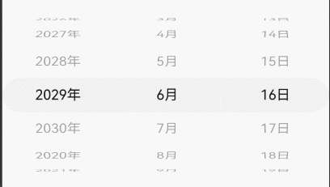
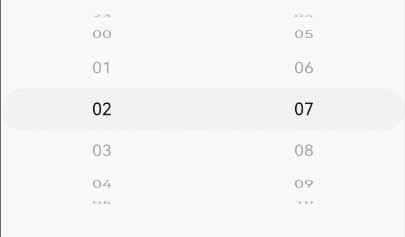
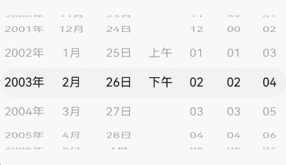
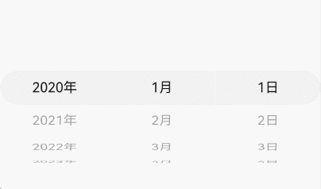

# DatePickerComponent
<!--Kit: ArkUI-->
<!--Subsystem: ArkUI-->
<!--Owner: @luoying_ace_admin-->
<!--Designer: @weixin_52725220-->
<!--Tester: @xiong0104-->
<!--Adviser: @Brilliantry_Rui-->

DatePickerComponent组件用于选择日期和时间。

**起始版本：** 26.0.0

## 导入模块

```ts
import { DatePickerComponent, DatePickerComponentOptions, DisplayMode, DateMode, TimeFormat, DatePickerComponentResult } from '@kit.ArkUI';
```

## 子组件

无

## DatePickerComponent

DatePickerComponent({ options: DatePickerComponentOptions })

定义日期时间选择器组件。

**起始版本：** 26.0.0

**装饰器类型：** @Component

**原子化服务API：** 从API版本26.0.0开始，该接口支持在原子化服务中使用。

**系统能力：** SystemCapability.ArkUI.ArkUI.Full

**模型约束：** 此接口仅可在Stage模型下使用。

| 名称 | 类型 | 必填 | 装饰器类型 | 说明 |
| ---- | ---- | ---- | ---------- | ---- |
| options | [DatePickerComponentOptions](#datepickercomponentoptions) | 是 | @Prop | 定义日期时间选择器组件的选项。 |

## DatePickerComponentOptions

DatePickerComponentOptions定义日期时间选择器组件的选项。

**起始版本：** 26.0.0

**原子化服务API：** 从API版本26.0.0开始，该接口支持在原子化服务中使用。

**系统能力：** SystemCapability.ArkUI.ArkUI.Full

**模型约束：** 此接口仅可在Stage模型下使用。

| 名称 | 类型 | 只读 | 可选 | 说明 |
| ---- | ---- | ---- | ---- | ---- |
| displayMode | [DisplayMode](#displaymode) | 否 | 是 | 选择器的显示模式。<br/>默认值：DisplayMode.DATE |
| dateOptions | [DateOptions](#dateoptions) | 否 | 是 | 日期选项。 |
| timeOptions | [TimeOptions](#timeoptions) | 否 | 是 | 时间选项。 |

## DisplayMode

DisplayMode枚举用于定义选择器的显示模式。

**起始版本：** 26.0.0

**原子化服务API：** 从API版本26.0.0开始，该接口支持在原子化服务中使用。

**系统能力：** SystemCapability.ArkUI.ArkUI.Full

**模型约束：** 此接口仅可在Stage模型下使用。

| 名称 | 值 | 说明 |
| ---- | -- | ---- |
| DATE | 0 | 仅显示日期。 |
| TIME | 1 | 仅显示时间。 |
| DATE_TIME | 2 | 同时显示日期和时间。 |

## DateMode

DateMode枚举用于定义日期选择器的模式。

**起始版本：** 26.0.0

**原子化服务API：** 从API版本26.0.0开始，该接口支持在原子化服务中使用。

**系统能力：** SystemCapability.ArkUI.ArkUI.Full

**模型约束：** 此接口仅可在Stage模型下使用。

| 名称 | 值 | 说明 |
| ---- | -- | ---- |
| DATE | 0 | 日期显示三列：年、月、日。 |
| YEAR_AND_MONTH | 1 | 日期显示两列：年、月。 |
| MONTH_AND_DAY | 2 | 定义以月和日显示日期的模式。在此模式下，当月份从12月变为1月时，年份不会增加；当月份从1月变为12月时，年份不会减少。年份保持当前设置的值不变。 |

## TimeFormat

TimeFormat枚举用于定义时间选择器的格式。

**起始版本：** 26.0.0

**原子化服务API：** 从API版本26.0.0开始，该接口支持在原子化服务中使用。

**系统能力：** SystemCapability.ArkUI.ArkUI.Full

**模型约束：** 此接口仅可在Stage模型下使用。

| 名称 | 值 | 说明 |
| ---- | -- | ---- |
| HOUR_MINUTE | 0 | 显示时、分。 |
| HOUR_MINUTE_SECOND | 1 | 显示时、分、秒。 |

## DatePickerComponentResult

DatePickerComponentResult定义日期时间选择器的选择结果。

**起始版本：** 26.0.0

**原子化服务API：** 从API版本26.0.0开始，该接口支持在原子化服务中使用。

**系统能力：** SystemCapability.ArkUI.ArkUI.Full

**模型约束：** 此接口仅可在Stage模型下使用。

| 名称 | 类型 | 只读 | 可选 | 说明 |
| ---- | ---- | ---- | ---- | ---- |
| year | number | 否 | 是 | 所选日期的年份。 |
| month | number | 否 | 是 | 所选日期的月份索引，从0开始，0表示1月，11表示12月。 |
| day | number | 否 | 是 | 所选日期的日。 |
| hour | number | 否 | 是 | 所选时间的小时部分。 |
| minute | number | 否 | 是 | 所选时间的分钟部分。 |
| second | number | 否 | 是 | 所选时间的秒部分。 |

## CommonOptions

CommonOptions定义日期时间选择器的通用选项。

>  **说明：**
>
> - Date的使用请参考[TimePickerOptions](ts-basic-components-timepicker.md#timepickeroptions对象说明)。
> - DatePickerComponent的字体字号在14vp至16vp范围内自适应变化，当组件宽度过窄时，可能出现文本显示截断的情况。
> - 参数缺省或者设置为undefined时，均保持默认值。
> - 在[DateOptions](#dateoptions)中设置start、end、selected时仅日期部分设置生效，在[TimeOptions](#timeoptions)中设置start、end、selected时仅时间部分设置生效。

**起始版本：** 26.0.0

**原子化服务API：** 从API版本26.0.0开始，该接口支持在原子化服务中使用。

**系统能力：** SystemCapability.ArkUI.ArkUI.Full

**模型约束：** 此接口仅可在Stage模型下使用。

| 名称 | 类型 | 只读 | 可选 | 说明 |
| ---- | ---- | ---- | ---- | ---- |
| start | Date | 否 | 是 | 选择器的起始日期或时间。<br/>默认值：Date(1970, 0, 1, 0, 0, 0)<br/>取值范围：\[Date(0, 0, 1, 0, 0, 0), Date(10000, 11, 31,23, 59, 59)] |
| end | Date | 否 | 是 | 选择器的结束日期或时间。<br/>默认值：Date(2100, 12, 31, 23, 59, 59)<br/>取值范围：\[Date(0, 0, 1, 0, 0, 0), Date(10000, 11, 31,23, 59, 59)] |
| selected | Date | 否 | 是 | 选中的日期。<br/>默认值为当前系统日期或时间。 |
| loop | boolean | 否 | 是 | 设置是否启用循环模式。<br/>- true：启用循环模式。<br/>- false：不启用循环模式。<br/>默认值：true |
| onChange | [Callback](ts-types.md#callback12)<[DatePickerComponentResult](#datepickercomponentresult)> | 否 | 是 | 选择日期或时间后触发该回调。 |
| onScrollStop | [Callback](ts-types.md#callback12)<[DatePickerComponentResult](#datepickercomponentresult)> | 否 | 是 | 选择器项被选中且滚动停止时触发该回调。 |
| enableHapticFeedback | boolean | 否 | 是 | 启用或禁用音振反馈。<br/>默认值：true<br/>- true：开启触控反馈。<br/>- false：不开启触控反馈。<br />**说明**：<br/>1. 设置为true后，其生效情况取决于系统的硬件是否支持。<br/>2. 开启触控反馈时，需要在工程的[module.json5](../../../quick-start/module-configuration-file.md)中配置requestPermissions字段以开启振动权限，配置如下：<br />"requestPermissions": [{"name": "ohos.permission.VIBRATE"}] |


**起始日期、结束日期和选中日期的异常情形说明：**

| 异常情形   | 对应结果  |
| -------- |  ------------------------------------------------------------ |
| 起始日期晚于结束日期，选中日期未设置。    | 起始日期、结束日期和选中日期都为默认值。 |
| 起始日期晚于结束日期，选中日期早于起始日期默认值。    | 起始日期、结束日期都为默认值，选中日期为起始日期默认值。  |
| 起始日期晚于结束日期，选中日期晚于结束日期默认值。    | 起始日期、结束日期都为默认值，选中日期为结束日期默认值。  |
| 起始日期晚于结束日期，选中日期在起始日期与结束日期默认值范围内。    | 起始日期、结束日期都为默认值，选中日期为设置的值。 |
| 选中日期早于起始日期。    | 选中日期为起始日期。  |
| 选中日期晚于结束日期。    | 选中日期为结束日期。  |
| 起始日期晚于当前系统日期，选中日期未设置。    | 选中日期为起始日期。  |
| 结束日期早于当前系统日期，选中日期未设置。    | 选中日期为结束日期。  |
| 日期格式不符合规范，如‘1999-13-32’。   | 取默认值。  |
| 起始日期或结束日期早于取值范围最小值。    | 起始日期或结束日期取起始日期默认值。 |
| 起始日期或结束日期晚于取值范围最大值。    | 起始日期或结束日期取结束日期默认值。 |
| 起始日期与结束日期同时早于取值范围最小值。 | 起始日期与结束日期取系统有效范围最早日期。 |
| 起始日期与结束日期同时晚于取值范围最大值。 | 起始日期与结束日期取系统有效范围最晚日期。 |

**起始时间和结束时间的异常情形说明：**

| 异常情形   | 对应结果  |
| -------- |  ------------------------------------------------------------ |
| 起始时间晚于结束时间。    | 起始时间、结束时间都为默认值。  |
| 选中时间早于起始时间。   | 选中时间为起始时间。  |
| 选中时间晚于结束时间。    | 选中时间为结束时间。  |
| 起始时间晚于当前系统时间，选中时间未设置。    | 选中时间为起始时间。 |
| 结束时间早于当前系统时间，选中时间未设置。    | 选中时间为结束时间。  |
| 时间格式不符合规范，如'01:61:61'。   | 取默认值。  |

## DateOptions

DateOptions定义日期选择器的选项。

继承于[CommonOptions](#commonoptions)。

**起始版本：** 26.0.0

**原子化服务API：** 从API版本26.0.0开始，该接口支持在原子化服务中使用。

**系统能力：** SystemCapability.ArkUI.ArkUI.Full

**模型约束：** 此接口仅可在Stage模型下使用。

| 名称 | 类型 | 只读 | 可选 | 说明 |
| ---- | ---- | ---- | ---- | ---- |
| mode | [DateMode](#datemode) | 否 | 是 | 定义日期选择器的模式。<br/>默认值：DateMode.DATE |
| lunar | boolean | 否 | 是 | 指定是否显示农历。<br/>- true：显示为农历。<br/>- false：不显示为农历。<br/>默认值：false<br />**说明**：<br/>仅在简体中文和繁体中文语言环境下生效，其他语言环境下设置该属性无效果。 |

## TimeOptions

TimeOptions定义时间选择器的选项。

继承于[CommonOptions](#commonoptions)。

**起始版本：** 26.0.0

**原子化服务API：** 从API版本26.0.0开始，该接口支持在原子化服务中使用。

**系统能力：** SystemCapability.ArkUI.ArkUI.Full

**模型约束：** 此接口仅可在Stage模型下使用。

| 名称 | 类型 | 只读 | 可选 | 说明 |
| ---- | ---- | ---- | ---- | ---- |
| format | [TimeFormat](#timeformat) | 否 | 是 | 定义时间选择器的格式。<br/>默认值：TimeFormat.HOUR_MINUTE |
| useMilitaryTime | boolean | 否 | 是 | 指定是否使用24小时制显示时间。<br/>- true：时间以24小时制展示。<br/>- false：时间以12小时制展示。<br/>默认值：false |

## 示例

### 示例1（日期选择器）

该示例通过设置[DatePickerComponentOptions](#datepickercomponentoptions)中的displayMode为DisplayMode.DATE，实现日期选择器。

从API版本26.0.0开始，新增[DatePickerComponentOptions](#datepickercomponentoptions)参数。

```ts
import { DatePickerComponent, DisplayMode, DateMode } from '@kit.ArkUI';

@Entry
@Component
struct DatePickerExample {
  build() {
    Column() {
      DatePickerComponent({
        options: {
          displayMode: DisplayMode.DATE,
          dateOptions: {
            mode: DateMode.DATE,
            selected: new Date(),
            start: new Date('2020-01-01'),
            end: new Date('2030-12-31'),
            enableHapticFeedback: true,
            onChange: (result) => {
              console.info('Selected date: ' + result.year + '-' + (result.month! + 1) + '-' + result.day);
            },
            onScrollStop: (result) => {
              console.info('Scroll stop: ' + result.year + '-' + (result.month! + 1) + '-' + result.day);
            }
          }
        }
      })
    }
  }
}
```



### 示例2（时间选择器）

该示例通过设置[DatePickerComponentOptions](#datepickercomponentoptions)中的displayMode为DisplayMode.TIME，实现时间选择器。

从API版本26.0.0开始，新增[DatePickerComponentOptions](#datepickercomponentoptions)参数。

```ts
import { DatePickerComponent, DisplayMode, TimeFormat } from '@kit.ArkUI';

@Entry
@Component
struct TimePickerExample {
  build() {
    Column() {
      DatePickerComponent({
        options: {
          displayMode: DisplayMode.TIME,
          timeOptions: {
            format: TimeFormat.HOUR_MINUTE,
            useMilitaryTime: true,
            enableHapticFeedback: true,
            onChange: (result) => {
              console.info('Selected time: ' + result.hour + ':' + result.minute);
            },
            onScrollStop: (result) => {
              console.info('Scroll stop: ' + result.hour + ':' + result.minute);
            }
          }
        }
      })
    }
  }
}
```



### 示例3（日期时间选择器）

该示例通过设置[DatePickerComponentOptions](#datepickercomponentoptions)中的displayMode为DisplayMode.DATE_TIME，同时选择日期和时间。

从API版本26.0.0开始，新增[DatePickerComponentOptions](#datepickercomponentoptions)参数。

```ts
import { DatePickerComponent, DisplayMode, DateMode, TimeFormat } from '@kit.ArkUI';

@Entry
@Component
struct DateTimePickerExample {
  build() {
    Column() {
      DatePickerComponent({
        options: {
          displayMode: DisplayMode.DATE_TIME,
          dateOptions: {
            mode: DateMode.DATE,
            lunar: false,
            enableHapticFeedback: true,
            onChange: (result) => {
              console.info('Selected: ' + JSON.stringify(result));
            },
            onScrollStop: (result) => {
              console.info('Scroll stop: ' + JSON.stringify(result));
            }
          },
          timeOptions: {
            format: TimeFormat.HOUR_MINUTE_SECOND,
            useMilitaryTime: false,
            onChange: (result) => {
              console.info('Selected: ' + JSON.stringify(result));
            },
            onScrollStop: (result) => {
              console.info('Scroll stop: ' + JSON.stringify(result));
            }
          }
        }
      })
    }
  }
}
```



### 示例4（关闭循环模式）

该示例通过设置[DateOptions](#dateoptions)中的loop为false，关闭选择器的循环滚动模式。

从API版本26.0.0开始，新增[DateOptions](#dateoptions)参数。

```ts
import { DatePickerComponent, DisplayMode, DateMode } from '@kit.ArkUI';

@Entry
@Component
struct NoLoopPickerExample {
  build() {
    Column() {
      DatePickerComponent({
        options: {
          displayMode: DisplayMode.DATE,
          dateOptions: {
            mode: DateMode.DATE,
            selected: new Date(),
            start: new Date('2020-01-01'),
            end: new Date('2030-12-31'),
            loop: false,
            onChange: (result) => {
              console.info('Selected date: ' + result.year + '-' + (result.month! + 1) + '-' + result.day);
            }
          }
        }
      })
    }
  }
}
```


