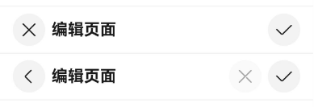
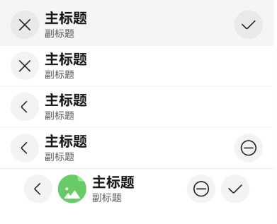
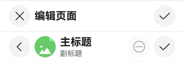
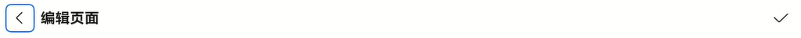
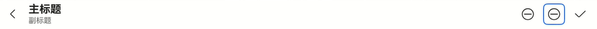
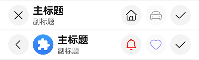

# EditableTitleBarV2
<!--Kit: ArkUI-->
<!--Subsystem: ArkUI-->
<!--Owner: @wangrunsen-->
<!--Designer: @YanSanzo-->
<!--Tester: @ybhou1993-->
<!--Adviser: @Brilliantry_Rui-->

编辑型标题栏，适用于多选界面或内容编辑界面，一般采取左叉右勾的形式。

该组件基于[状态管理（V2）](../../../ui/state-management/arkts-state-management-overview.md#状态管理v2)实现，相较于[状态管理（V1）](../../../ui/state-management/arkts-state-management-overview.md#状态管理v1)，状态管理（V2）增强了对数据对象的深度观察与管理能力，不再局限于组件层级。借助状态管理（V2），开发者可以通过该组件更灵活地控制编辑型标题栏的数据和状态，实现更高效的用户界面刷新。

> **说明：**
>
> - 该组件从API version 26.0.0开始支持。后续版本如有新增内容，则采用上角标单独标记该内容的起始版本。
>
> - 该组件仅可在Stage模型下使用。
>
> - 如果EditableTitleBarV2设置[通用属性](ts-component-general-attributes.md)和[通用事件](ts-component-general-events.md)，编译工具链会额外生成节点__Common__，并将通用属性或通用事件挂载在__Common__上，而不是直接应用到EditableTitleBarV2本身。这可能导致开发者设置的通用属性或通用事件不生效或不符合预期，因此，不建议EditableTitleBarV2设置通用属性和通用事件。

## 导入模块

```ts
import { EditableTitleBarV2 } from '@kit.ArkUI';
```

## 子组件

无

## EditableTitleBarV2

EditableTitleBarV2({leftIcon?: EditableLeftIconV2, title: ResourceStr \| EditableTitleV2, imageItem?: EditableTitleBarItemV2, menuItems?: Array&lt;EditableTitleBarMenuItemV2&gt;, saveButton?: EditableSaveButtonV2, options: EditableTitleBarStyleV2})

**装饰器类型：**\@ComponentV2

**原子化服务API：** 从API version 26.0.0开始，该接口支持在原子化服务中使用。

**系统能力：** SystemCapability.ArkUI.ArkUI.Full

**设备行为差异：** 该接口在Wearable设备上使用时，应用程序运行异常，异常信息中提示接口未定义，在其他设备中可正常调用。

| 名称 | 类型 | 必填 | 装饰器类型 | 说明 |
| -------- | -------- | -------- | -------- | -------- |
| leftIcon | [EditableLeftIconV2](#editablelefticonv2) | 否 | \@Param | 左侧图标配置。需要在标题栏左侧显示返回或取消图标时传入此参数，不传入时取默认值，不显示左侧图标。<br />默认值：undefined。 |
| title | [ResourceStr](ts-types.md#resourcestr) \| [EditableTitleV2](#editabletitlev2) | 是 | \@Param | 标题内容，支持字符串或对象形式配置。传入字符串时仅显示主标题，传入EditableTitleV2对象时可同时配置主标题和副标题。<br />默认值：new EditableTitleV2()，表示标题内容为空。 |
| imageItem | [EditableTitleBarItemV2](#editabletitlebaritemv2) | 否 | \@Param | 用于左侧头像的单个菜单项。需要在标题栏左侧显示头像时传入此参数，不传入时取默认值，不显示头像。<br />默认值：undefined。<br/>**说明：** 左侧头像不支持配置无障碍属性。 |
| menuItems | Array&lt;[EditableTitleBarMenuItemV2](#editabletitlebarmenuitemv2)&gt; | 否 | \@Param | 右侧菜单项列表。需要在标题栏右侧显示自定义操作按钮时传入此参数，不传入时取默认值，不显示右侧菜单项列表。<br/>**说明：** 最多支持配置3个菜单项，如果同时配置保存按钮，则最多支持2个菜单项。<br />默认值：undefined。 |
| saveButton | [EditableSaveButtonV2](#editablesavebuttonv2) | 否 | \@Param | 保存按钮配置。需要对标题栏右侧保存按钮的控制显示或隐藏状态、设置默认焦点、或者设置保存回调函数时传入此参数，不传入时取默认值，显示保存按钮。<br />默认值：undefined，显示保存按钮。 |
| options | [EditableTitleBarStyleV2](#editabletitlebarstylev2) | 是 | \@Param | 标题栏样式和布局配置。需要自定义标题栏背景、安全区域、边距等样式时传入此参数。<br />默认值：new EditableTitleBarStyleV2()。 |

> **说明：**
> 
> - 入参对象不可为undefined，即`EditableTitleBarV2(undefined)`。
> 
> - 若同时有多个可操作区域设置默认焦点，则设置过默认焦点的可操作区域中显示顺序的第一个为默认焦点。

## OnActionCallback

type OnActionCallback = () => void

点击事件的回调函数类型。

**原子化服务API：** 从API version 26.0.0开始，该接口支持在原子化服务中使用。

**系统能力：** SystemCapability.ArkUI.ArkUI.Full


## EditableLeftIconTypeV2

左侧图标类型枚举。

**原子化服务API：** 从API version 26.0.0开始，该接口支持在原子化服务中使用。

**系统能力：** SystemCapability.ArkUI.ArkUI.Full

**设备行为差异：** 该接口在Wearable设备上使用时，应用程序运行异常，异常信息中提示接口未定义，在其他设备中可正常调用。

| 名称 | 值 | 说明 |
| -------- | -------- | -------- |
| Back | 0 | 返回图标类型。点击时默认执行路由返回操作。 |
| Cancel | 1 | 取消图标类型。点击时无默认操作，需自定义回调。 |

## EditableLeftIconV2Options

左侧图标配置选项接口。

**原子化服务API：** 从API version 26.0.0开始，该接口支持在原子化服务中使用。

**系统能力：** SystemCapability.ArkUI.ArkUI.Full

| 名称 | 类型 | 只读 | 可选 | 说明 |
| -------- | -------- | -------- | -------- | -------- |
| iconType | [EditableLeftIconTypeV2](#editablelefticontypev2) | 否 | 是 | 图标类型，Back或Cancel。 |
| defaultFocus | boolean | 否 | 是 | 是否默认获取焦点。<br/>默认值：false。 |
| onAction | [OnActionCallback](#onactioncallback) | 否 | 是 | 点击左侧图标的回调函数。未设置时，Back类型默认执行路由返回，Cancel类型无操作。 |

## EditableLeftIconV2

左侧图标配置类，使用@ObservedV2装饰器，支持状态观察。

**原子化服务API：** 从API version 26.0.0开始，该接口支持在原子化服务中使用。

**系统能力：** SystemCapability.ArkUI.ArkUI.Full

**设备行为差异：** 该接口在Wearable设备上使用时，应用程序运行异常，异常信息中提示接口未定义，在其他设备中可正常调用。

**装饰器类型：** \@ObservedV2

| 名称 | 类型 | 只读 | 可选 | 说明 |
| -------- | -------- | -------- | -------- | -------- |
| iconType | [EditableLeftIconTypeV2](#editablelefticontypev2) | 否 | 否 | 图标类型。<br/>默认值：EditableLeftIconTypeV2.Back。 |
| defaultFocus | boolean | 否 | 否 | 是否默认获取焦点。<br/>默认值：false。 |
| onAction | [OnActionCallback](#onactioncallback) | 否 | 是 | 点击左侧图标的回调函数。 |

**构造函数：**

constructor(options?: [EditableLeftIconV2Options](#editablelefticonv2options))

**参数：**

| 参数名 | 类型 | 必填 | 说明 |
| -------- | -------- | -------- | -------- |
| options | [EditableLeftIconV2Options](#editablelefticonv2options) | 否 | 左侧图标配置选项。 |

## EditableTitleV2Options

标题配置选项接口。

**原子化服务API：** 从API version 26.0.0开始，该接口支持在原子化服务中使用。

**系统能力：** SystemCapability.ArkUI.ArkUI.Full

| 名称 | 类型 | 只读 | 可选 | 说明 |
| -------- | -------- | -------- | -------- | -------- |
| mainTitle | [ResourceStr](ts-types.md#resourcestr) | 否 | 是 | 主标题内容。 |
| subTitle | [ResourceStr](ts-types.md#resourcestr) | 否 | 是 | 副标题内容。需要在标题下方显示补充说明信息时传入此参数。 |

## EditableTitleV2

标题配置类，使用@ObservedV2装饰器，支持状态观察。

**原子化服务API：** 从API version 26.0.0开始，该接口支持在原子化服务中使用。

**系统能力：** SystemCapability.ArkUI.ArkUI.Full

**设备行为差异：** 该接口在Wearable设备上使用时，应用程序运行异常，异常信息中提示接口未定义，在其他设备中可正常调用。

**装饰器类型：** \@ObservedV2

| 名称 | 类型 | 只读 | 可选 | 说明 |
| -------- | -------- | -------- | -------- | -------- |
| mainTitle | [ResourceStr](ts-types.md#resourcestr) | 否 | 否 | 主标题内容。<br/>默认值：''，表示标题内容为空。 |
| subTitle | [ResourceStr](ts-types.md#resourcestr) | 否 | 是 | 副标题内容。 |

**构造函数：**

constructor(options?: [EditableTitleV2Options](#editabletitlev2options))

**参数：**

| 参数名 | 类型 | 必填 | 说明 |
| -------- | -------- | -------- | -------- |
| options | [EditableTitleV2Options](#editabletitlev2options) | 否 | 标题配置选项。 |

## EditableTitleBarMenuItemV2Options

菜单项配置选项接口。

**原子化服务API：** 从API version 26.0.0开始，该接口支持在原子化服务中使用。

**系统能力：** SystemCapability.ArkUI.ArkUI.Full

| 名称 | 类型 | 只读 | 可选 | 说明 |
| -------- | -------- | -------- | -------- | -------- |
| value | [ResourceStr](ts-types.md#resourcestr) | 否 | 是 | 图标资源，支持Symbol或Image。 |
| symbolStyle | [SymbolGlyphModifier](ts-universal-attributes-attribute-symbolglyphmodifier.md#symbolglyphmodifier) | 否 | 是 | Symbol图标样式修饰器，优先级大于value。 |
| isEnabled | boolean | 否 | 是 | 是否启用。<br/>默认值：true，表示启用。<br/>isEnabled为false时，表示禁用。 |
| label | [ResourceStr](ts-types.md#resourcestr) | 否 | 是 | 长按对话框的标签文本。 |
| action | [OnActionCallback](#onactioncallback) | 否 | 是 | 点击菜单项的回调函数。 |
| accessibilityLevel | string | 否 | 是 | 可访问性级别，用于控制当前项是否可被无障碍辅助服务所识别。<br/>支持的值为：<br/>"auto"：当前组件会转换为"yes"。<br/>"yes"：当前组件可被无障碍辅助服务所识别。<br/>"no"：当前组件不可被无障碍辅助服务所识别。<br/>"no-hide-descendants"：当前组件及其所有子组件不可被无障碍辅助服务所识别。<br/>默认值："auto" |
| accessibilityText | [ResourceStr](ts-types.md#resourcestr) | 否 | 是 | 屏幕阅读器的可访问性文本。当组件不包含文本属性时，屏幕朗读选中此组件时不播报，使用者无法清楚地知道当前选中了什么组件。为了解决此场景，开发人员可为不包含文字信息的组件设置无障碍文本，当屏幕朗读选中此组件时播报无障碍文本的内容。<br/>默认值：有label时默认值为当前项label属性内容，没有设置label时，默认值为" "。 |
| accessibilityDescription | [ResourceStr](ts-types.md#resourcestr) | 否 | 是 | 可访问性描述。此描述用于向用户详细解释当前组件，开发人员应为组件的这一属性提供较为详尽的文本说明，以协助用户理解即将执行的操作及其可能产生的后果。如果组件同时具备文本属性和无障碍说明属性，当组件被选中时，系统将首先播报组件的文本属性，随后播报无障碍说明属性的内容。<br/>默认值："单指双击即可执行"。  |
| defaultFocus | boolean | 否 | 是 | 是否设置为默认获焦。<br/>true：获焦。<br/>false：不获焦。<br/>默认值：false。<br/>使用defaultFocus属性时，需提前将isEnabled属性设置为true，否则defaultFocus值会被识别为false。 |

## EditableTitleBarMenuItemV2

菜单项配置类，使用@ObservedV2装饰器，支持状态观察。

**原子化服务API：** 从API version 26.0.0开始，该接口支持在原子化服务中使用。

**系统能力：** SystemCapability.ArkUI.ArkUI.Full

**设备行为差异：** 该接口在Wearable设备上使用时，应用程序运行异常，异常信息中提示接口未定义，在其他设备中可正常调用。

**装饰器类型：** \@ObservedV2

| 名称 | 类型 | 只读 | 可选 | 说明 |
| -------- | -------- | -------- | -------- | -------- |
| value | [ResourceStr](ts-types.md#resourcestr) | 否 | 否 | 图标资源，支持Symbol或Image。<br/>默认值：''。 |
| symbolStyle | [SymbolGlyphModifier](ts-universal-attributes-attribute-symbolglyphmodifier.md#symbolglyphmodifier) | 否 | 是 | Symbol图标样式修饰器，优先级大于value。 |
| isEnabled | boolean | 否 | 否 | 是否启用。<br/>默认值：true，表示启用。<br/>isEnabled为false时，表示禁用。 |
| label | [ResourceStr](ts-types.md#resourcestr) | 否 | 是 | 长按对话框的标签文本。 |
| action | [OnActionCallback](#onactioncallback) | 否 | 是 | 点击菜单项的回调函数。 |
| accessibilityLevel | string | 否 | 否 | 可访问性级别。<br/>默认值："auto"。  |
| accessibilityText | [ResourceStr](ts-types.md#resourcestr) | 否 | 是 | 屏幕阅读器的可访问性文本。 |
| accessibilityDescription | [ResourceStr](ts-types.md#resourcestr) | 否 | 是 | 可访问性描述。 |
| defaultFocus | boolean | 否 | 否 | 是否设置为默认获焦。<br/>默认值：false。 |

**构造函数：**

constructor(options?: [EditableTitleBarMenuItemV2Options](#editabletitlebarmenuitemv2options))

**参数：**

| 参数名 | 类型 | 必填 | 说明 |
| -------- | -------- | -------- | -------- |
| options | [EditableTitleBarMenuItemV2Options](#editabletitlebarmenuitemv2options) | 否 | 菜单项配置选项。 |

## EditableTitleBarItemV2

type EditableTitleBarItemV2 = EditableTitleBarMenuItemV2

左侧图像项类型别名。

**原子化服务API：** 从API version 26.0.0开始，该接口支持在原子化服务中使用。

**系统能力：** SystemCapability.ArkUI.ArkUI.Full

**设备行为差异：** 该接口在Wearable设备上使用时，应用程序运行异常，异常信息中提示接口未定义，在其他设备中可正常调用。

| 类型 | 说明 |
| -------- | -------- |
| [EditableTitleBarMenuItemV2](#editabletitlebarmenuitemv2) | 左侧头像的单个菜单项类型。 |

## EditableTitleBarItemV2Options

type EditableTitleBarItemV2Options = EditableTitleBarMenuItemV2Options

左侧图像项配置选项类型别名。

**原子化服务API：** 从API version 26.0.0开始，该接口支持在原子化服务中使用。

**系统能力：** SystemCapability.ArkUI.ArkUI.Full


| 类型 | 说明 |
| -------- | -------- |
| [EditableTitleBarMenuItemV2Options](#editabletitlebarmenuitemv2options) | 左侧头像的单个菜单项配置选项类型。 |

## EditableSaveButtonV2Options

保存按钮配置选项接口。

**原子化服务API：** 从API version 26.0.0开始，该接口支持在原子化服务中使用。

**系统能力：** SystemCapability.ArkUI.ArkUI.Full

| 名称 | 类型 | 只读 | 可选 | 说明 |
| -------- | -------- | -------- | -------- | -------- |
| isRequired | boolean | 否 | 是 | 是否显示保存按钮。<br/>默认值：true，表示显示保存按钮。 |
| defaultFocus | boolean | 否 | 是 | 是否默认获取焦点。<br/>默认值：false。 |
| onAction | [OnActionCallback](#onactioncallback) | 否 | 是 | 点击保存按钮的回调函数。未设置时点击按钮无响应。 |

## EditableSaveButtonV2

保存按钮配置类，使用@ObservedV2装饰器，支持状态观察。

**原子化服务API：** 从API version 26.0.0开始，该接口支持在原子化服务中使用。

**系统能力：** SystemCapability.ArkUI.ArkUI.Full

**设备行为差异：** 该接口在Wearable设备上使用时，应用程序运行异常，异常信息中提示接口未定义，在其他设备中可正常调用。

**装饰器类型：** \@ObservedV2

| 名称 | 类型 | 只读 | 可选 | 说明 |
| -------- | -------- | -------- | -------- | -------- |
| isRequired | boolean | 否 | 否 | 是否显示保存按钮。<br/>默认值：true，表示显示保存按钮。 |
| defaultFocus | boolean | 否 | 否 | 是否默认获取焦点。<br/>默认值：false。 |
| onAction | [OnActionCallback](#onactioncallback) | 否 | 是 | 点击保存按钮的回调函数。 |

**构造函数：**

constructor(options?: [EditableSaveButtonV2Options](#editablesavebuttonv2options))

**参数：**

| 参数名 | 类型 | 必填 | 说明 |
| -------- | -------- | -------- | -------- |
| options | [EditableSaveButtonV2Options](#editablesavebuttonv2options) | 否 | 保存按钮配置选项。 |

## EditableTitleBarStyleV2Options

标题栏样式配置选项接口。

**原子化服务API：** 从API version 26.0.0开始，该接口支持在原子化服务中使用。

**系统能力：** SystemCapability.ArkUI.ArkUI.Full

| 名称 | 类型 | 只读 | 可选 | 说明 |
| -------- | -------- | -------- | -------- | -------- |
| backgroundColor | [ResourceColor](ts-types.md#resourcecolor) | 否 | 是 | 标题栏背景色。<br/>默认值：'#00000000'，表示背景透明。  |
| backgroundBlurStyle | [BlurStyle](ts-universal-attributes-background.md#blurstyle9) | 否 | 是 | 标题栏背景模糊样式。<br/>默认值：BlurStyle.NONE，表示无模糊效果。  |
| safeAreaTypes | Array&lt;[SafeAreaType](ts-universal-attributes-expand-safe-area.md#safeareatype)&gt; | 否 | 是 | 扩展安全区域的类型。<br/>默认值：[SafeAreaType.SYSTEM]。  |
| safeAreaEdges | Array&lt;[SafeAreaEdge](ts-universal-attributes-expand-safe-area.md#safeareaedge)&gt; | 否 | 是 | 扩展安全区域的方向。<br/>默认值：[SafeAreaEdge.TOP]。  |
| contentMargin | [LocalizedMargin](ts-types.md#localizedmargin12) | 否 | 是 | 标题栏外边距，不支持设置负数。支持RTL布局，使用start和end替代left和right。<br/>默认值：<br/>{<br/>start: LengthMetrics.resource($r('sys.float.margin_left')),<br/>end: LengthMetrics.resource($r('sys.float.margin_right'))<br/>}。  |

## EditableTitleBarStyleV2

标题栏样式配置类，使用@ObservedV2装饰器，支持状态观察。

**原子化服务API：** 从API version 26.0.0开始，该接口支持在原子化服务中使用。

**系统能力：** SystemCapability.ArkUI.ArkUI.Full

**设备行为差异：** 该接口在Wearable设备上使用时，应用程序运行异常，异常信息中提示接口未定义，在其他设备中可正常调用。

**装饰器类型：** \@ObservedV2

| 名称 | 类型 | 只读 | 可选 | 说明 |
| -------- | -------- | -------- | -------- | -------- |
| backgroundColor | [ResourceColor](ts-types.md#resourcecolor) | 否 | 是 | 标题栏背景色。<br/>默认值：'#00000000'。  |
| backgroundBlurStyle | [BlurStyle](ts-universal-attributes-background.md#blurstyle9) | 否 | 是 | 标题栏背景模糊样式。<br/>默认值：BlurStyle.NONE。  |
| safeAreaTypes | Array&lt;[SafeAreaType](ts-universal-attributes-expand-safe-area.md#safeareatype)&gt; | 否 | 是 | 扩展安全区域的类型。<br/>默认值：[SafeAreaType.SYSTEM]。  |
| safeAreaEdges | Array&lt;[SafeAreaEdge](ts-universal-attributes-expand-safe-area.md#safeareaedge)&gt; | 否 | 是 | 扩展安全区域的方向。<br/>默认值：[SafeAreaEdge.TOP]。  |
| contentMargin | [LocalizedMargin](ts-types.md#localizedmargin12) | 否 | 是 | 标题栏外边距。 |

**构造函数：**

constructor(options?: [EditableTitleBarStyleV2Options](#editabletitlebarstylev2options))

**参数：**

| 参数名 | 类型 | 必填 | 说明 |
| -------- | -------- | -------- | -------- |
| options | [EditableTitleBarStyleV2Options](#editabletitlebarstylev2options) | 否 | 标题栏样式配置选项。 |

## 事件

不支持[通用事件](ts-component-general-events.md)。

## 示例

### 示例1（右侧图标自定义标题栏）

该示例主要演示EditableTitleBarV2设置左侧图标、主标题及自定义右侧图标区的效果。

```ts
import { Prompt } from '@kit.ArkUI';
import {
  EditableLeftIconTypeV2,
  EditableTitleBarV2,
  EditableLeftIconV2,
  EditableTitleBarMenuItemV2,
  EditableSaveButtonV2,
  EditableTitleBarStyleV2
} from '@kit.ArkUI';

@Entry
@ComponentV2
struct EditableTitleBarV2Demo01 {
  build(): void {
    Row() {
      Column() {
        Divider().height(2).color(0xCCCCCC)
        // 左侧取消按钮，右侧保存按钮。
        EditableTitleBarV2({
          leftIcon: new EditableLeftIconV2({
            iconType: EditableLeftIconTypeV2.Cancel,
            onAction: () => {
              Prompt.showToast({ message: 'on cancel' });
            }
          }),
          title: '编辑页面',
          menuItems: [],
          saveButton: new EditableSaveButtonV2({
            onAction: () => {
              Prompt.showToast({ message: 'on save' });
            }
          }),
          options: new EditableTitleBarStyleV2({
            safeAreaTypes: []
          })
        })
        Divider().height(2).color(0xCCCCCC)
        // 左侧返回按钮，右侧自定义取消按钮（disabled）、保存按钮。
        EditableTitleBarV2({
          leftIcon: new EditableLeftIconV2({
            iconType: EditableLeftIconTypeV2.Back
          }),
          title: '编辑页面',
          menuItems: [
            new EditableTitleBarMenuItemV2({
              value: $r('sys.media.ohos_ic_public_cancel'),
              isEnabled: false,
              action: () => {
                Prompt.showToast({ message: 'show toast index 2' });
              }
            })
          ],
          saveButton: new EditableSaveButtonV2({
            onAction: () => {
              Prompt.showToast({ message: 'on save' });
            }
          })
        })
        Divider().height(2).color(0xCCCCCC)
      }.width('100%')
    }.height('100%')
  }
}
```


### 示例2（头像与背景模糊标题栏）

该示例主要演示EditableTitleBarV2设置背景模糊、头像；取消右侧保存图标及自定义标题栏外边距的效果。

```ts
import { LengthMetrics, Prompt } from '@kit.ArkUI';
import {
  EditableLeftIconTypeV2,
  EditableTitleBarV2,
  EditableLeftIconV2,
  EditableTitleV2,
  EditableTitleBarStyleV2,
  EditableTitleBarMenuItemV2,
  EditableSaveButtonV2
} from '@kit.ArkUI';

@Entry
@Component
struct EditableTitleBarV2Demo02 {
  @State titleBarMargin: LocalizedMargin = {
    start: LengthMetrics.vp(35),
    end: LengthMetrics.vp(35),
  };

  build(): void {
    Row() {
      Column() {
        EditableTitleBarV2({
          leftIcon: new EditableLeftIconV2({
            iconType: EditableLeftIconTypeV2.Cancel,
          }),
          title: new EditableTitleV2({
            mainTitle: '主标题',
            subTitle: '副标题',
          }),
          // 设置背景模糊效果
          options: new EditableTitleBarStyleV2({
            backgroundBlurStyle: BlurStyle.COMPONENT_THICK,
          }),
          saveButton: new EditableSaveButtonV2({
            onAction: () => {
              Prompt.showToast({ message: "on save" });
            },
          })
        })
        Divider().height(2).color(0xCCCCCC);
        EditableTitleBarV2({
          leftIcon: new EditableLeftIconV2({
            iconType: EditableLeftIconTypeV2.Cancel,
          }),
          title: new EditableTitleV2({
            mainTitle: '主标题',
            subTitle: '副标题',
          }),
          // 取消右侧保存按钮
          saveButton: new EditableSaveButtonV2({
            isRequired: false
          })
        })
        Divider().height(2).color(0xCCCCCC);
        EditableTitleBarV2({
          leftIcon: new EditableLeftIconV2({
            iconType: EditableLeftIconTypeV2.Back,
            onAction: () => {
              this.getUIContext()?.getRouter()?.back();
            },
          }),
          title: new EditableTitleV2({
            mainTitle: '主标题',
            subTitle: '副标题',
          }),
          // 取消右侧保存按钮
          saveButton: new EditableSaveButtonV2({
            isRequired: false
          })
        })
        Divider().height(2).color(0xCCCCCC);
        EditableTitleBarV2({
          leftIcon: new EditableLeftIconV2({
            iconType: EditableLeftIconTypeV2.Back,
            // 点击左侧Back图标，触发的动作。
            onAction: () => {
              this.getUIContext()?.getRouter()?.back();
            },
          }),
          title: new EditableTitleV2({
            mainTitle: '主标题',
            subTitle: '副标题',
          }),
          menuItems: [
            new EditableTitleBarMenuItemV2({
              value: $r('sys.media.ohos_ic_public_remove'),
              isEnabled: true,
              action: () => {
                Prompt.showToast({ message: "show toast index 1" });
              }
            })
          ],
          // 取消右侧保存按钮
          saveButton: new EditableSaveButtonV2({
            isRequired: false
          })
        })
        Divider().height(2).color(0xCCCCCC);
        EditableTitleBarV2({
          leftIcon: new EditableLeftIconV2({
            iconType: EditableLeftIconTypeV2.Back,
            onAction: () => {
              this.getUIContext()?.getRouter()?.back();
            },
          }),
          title: new EditableTitleV2({
            mainTitle: '主标题',
            subTitle: '副标题',
          }),
          // 设置可点击头像
          imageItem: new EditableTitleBarMenuItemV2({
            value: $r('sys.media.ohos_ic_normal_white_grid_image'),
            isEnabled: true,
            action: () => {
              Prompt.showToast({ message: "show toast index 2" });
            }
          }),
          // 右侧图标配置
          menuItems: [
            new EditableTitleBarMenuItemV2({
              value: $r('sys.media.ohos_ic_public_remove'),
              isEnabled: true,
              action: () => {
                Prompt.showToast({ message: "show toast index 3" });
              }
            })
          ],
          options: new EditableTitleBarStyleV2({
            // 设置标题栏外边距
            contentMargin: this.titleBarMargin,
          })
        })
      }
    }
  }
}
```


### 示例3（右侧自定义按钮播报）

该示例通过设置标题栏的右侧自定义按钮属性accessibilityText、accessibilityDescription、accessibilityLevel自定义屏幕朗读播报文本。

```ts
import { Prompt } from '@kit.ArkUI';
import {
  EditableLeftIconTypeV2,
  EditableTitleBarV2,
  EditableLeftIconV2,
  EditableTitleV2,
  EditableTitleBarMenuItemV2,
  EditableSaveButtonV2
} from '@kit.ArkUI';

@Entry
@Component
struct EditableTitleBarV2Demo03 {
  build(): void {
    Row() {
      Column() {
        Divider().height(2).color(0xCCCCCC)
        EditableTitleBarV2({
          leftIcon: new EditableLeftIconV2({
            iconType: EditableLeftIconTypeV2.Cancel,
            onAction: () => {
              Prompt.showToast({ message: 'on cancel' });
            },
          }),
          title: '编辑页面',
          menuItems: [],
          saveButton: new EditableSaveButtonV2({
            onAction: () => {
              Prompt.showToast({ message: 'on save' });
            }
          })
        })
        Divider().height(2).color(0xCCCCCC)
        EditableTitleBarV2({
          // 头像、自定义按钮不可用
          leftIcon: new EditableLeftIconV2({
            iconType: EditableLeftIconTypeV2.Back,
            onAction: () => {
              this.getUIContext()?.getRouter()?.back();
            },
          }),
          title: new EditableTitleV2({
            mainTitle: '主标题',
            subTitle: '副标题',
          }),
          imageItem: new EditableTitleBarMenuItemV2({
            value: $r('sys.media.ohos_ic_normal_white_grid_image'),
            isEnabled: true,
            action: () => {
              Prompt.showToast({ message: "show toast index 1" });
            }
          }),
          menuItems: [
            new EditableTitleBarMenuItemV2({
              value: $r('sys.media.ohos_ic_public_remove'),
              label: '取消',
              isEnabled: false,
              accessibilityText: '删除',
              accessibilityDescription: '点击即可删除',
              action: () => {
                Prompt.showToast({ message: "show toast index 2" });
              }
            })
          ],
        })
        Divider().height(2).color(0xCCCCCC)
      }
    }
  }
}
```


### 示例4（左侧图标设置为默认焦点）

在获焦状态下，该示例通过设置标题栏属性leftIconDefaultFocus使左侧图标默认获焦。

```ts
import { Prompt } from '@kit.ArkUI';
import { EditableLeftIconTypeV2, EditableTitleBarV2, EditableLeftIconV2, EditableSaveButtonV2 } from '@kit.ArkUI';

@Entry
@Component
struct EditableTitleBarV2Demo04 {
  build(): void {
    Column() {
      EditableTitleBarV2({
        leftIcon: new EditableLeftIconV2({
          iconType: EditableLeftIconTypeV2.Back,
          defaultFocus: true, // 设置左侧图标默认获焦。
        }),
        title: '编辑页面',
        menuItems: [],
        saveButton: new EditableSaveButtonV2({
          onAction: () => {
            Prompt.showToast({ message: 'on save' });
          }
        }),
      })
    }
    .height('100%')
    .width('100%')
  }
}
```


### 示例5（右侧自定义图标设置为默认焦点）

在获焦状态下，该示例通过设置标题栏右侧图标属性defaultFocus使右侧图标默认获焦。

```ts
import { Prompt } from '@kit.ArkUI';
import {
  EditableLeftIconTypeV2,
  EditableTitleBarV2,
  EditableLeftIconV2,
  EditableTitleV2,
  EditableTitleBarMenuItemV2
} from '@kit.ArkUI';

@Entry
@Component
struct EditableTitleBarV2Demo05 {
  build(): void {
    Column() {
      EditableTitleBarV2({
        leftIcon: new EditableLeftIconV2({
          iconType: EditableLeftIconTypeV2.Back,
          onAction: () => {
            this.getUIContext()?.getRouter()?.back();
          },
        }),
        title: new EditableTitleV2({
          mainTitle: '主标题',
          subTitle: '副标题',
        }),
        // 右侧图标配置
        menuItems: [
          new EditableTitleBarMenuItemV2({
            value: $r('sys.media.ohos_ic_public_remove'),
            isEnabled: true,
            action: () => {
              Prompt.showToast({ message: "show toast index 1" });
            }
          }),
          new EditableTitleBarMenuItemV2({
            value: $r('sys.media.ohos_ic_public_remove'),
            isEnabled: true,
            defaultFocus: true,
            action: () => {
              Prompt.showToast({ message: "show toast index 2" });
            }
          })
        ],
      })
    }
    .height('100%')
    .width('100%')
  }
}
```


### 示例6（设置Symbol类型图标）

该示例通过设置EditableTitleBarMenuItem的属性symbolStyle，展示了自定义Symbol类型图标。

```ts
import { Prompt, SymbolGlyphModifier } from '@kit.ArkUI';
import {
  EditableLeftIconTypeV2,
  EditableTitleBarV2,
  EditableLeftIconV2,
  EditableTitleV2,
  EditableTitleBarMenuItemV2
} from '@kit.ArkUI';

@Entry
@Component
struct Index {
  build(): void {
    Row() {
      Column() {
        Divider().height(2).color(0xCCCCCC)
        EditableTitleBarV2({
          leftIcon: new EditableLeftIconV2({
            iconType: EditableLeftIconTypeV2.Cancel
          }),
          title: new EditableTitleV2({
            mainTitle: '主标题',
            subTitle: '副标题',
          }),
          // 右侧图标配置
          menuItems: [
            new EditableTitleBarMenuItemV2({
              value: $r('sys.symbol.house'),
              isEnabled: true,
              action: () => {
                Prompt.showToast({ message: 'show toast index 2' });
              }
            }),
            new EditableTitleBarMenuItemV2({
              value: $r('sys.symbol.car'),
              isEnabled: false
            })
          ]
        })
        Divider().height(2).color(0xCCCCCC)
        EditableTitleBarV2({
          leftIcon: new EditableLeftIconV2({
            iconType: EditableLeftIconTypeV2.Back
          }),
          title: new EditableTitleV2({
            mainTitle: '主标题',
            subTitle: '副标题',
          }),
          // 设置可点击头像
          imageItem: new EditableTitleBarMenuItemV2({
            value: $r('sys.media.ohos_app_icon'),
            isEnabled: true,
            action: () => {
              Prompt.showToast({ message: "show toast index 1" });
            }
          }),
          // 右侧图标配置
          menuItems: [
            new EditableTitleBarMenuItemV2({
              value: $r('sys.symbol.house'),
              symbolStyle: new SymbolGlyphModifier($r('sys.symbol.bell')).fontColor([Color.Red]),
              isEnabled: true,
              action: () => {
                Prompt.showToast({ message: 'show toast index 2' });
              }
            }),
            new EditableTitleBarMenuItemV2({
              value: $r('sys.symbol.car'),
              symbolStyle: new SymbolGlyphModifier($r('sys.symbol.heart')).fontColor([Color.Blue]),
              isEnabled: false,
            })
          ]
        })
        Divider().height(2).color(0xCCCCCC)
      }.width('100%')
    }.height('100%')
  }
}
```


