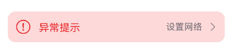
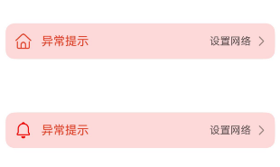

# ExceptionPromptV2
<!--Kit: ArkUI-->
<!--Subsystem: ArkUI-->
<!--Owner: @wangrunsen-->
<!--Designer: @YanSanzo-->
<!--Tester: @ybhou1993-->
<!--Adviser: @Brilliantry_Rui-->

异常提示V2组件，适用于有异常需要提示异常内容的情况。

该组件基于[状态管理（V2）](../../../ui/state-management/arkts-state-management-overview.md#状态管理v2)实现，相较于[状态管理（V1）](../../../ui/state-management/arkts-state-management-overview.md#状态管理v1)，状态管理（V2）增强了对数据对象的深度观察与管理能力，不再局限于组件层级。借助状态管理（V2），开发者可以通过该组件更灵活地控制异常提示的数据和状态，实现更高效的用户界面刷新。

> **说明：**
>
> - 该组件仅可在Stage模型下使用。
>
> - 如果ExceptionPromptV2设置[通用属性](ts-component-general-attributes.md)和[通用事件](ts-component-general-events.md)，编译工具链会额外生成节点__Common__，并将通用属性或通用事件挂载在__Common__上，而不是直接应用到ExceptionPromptV2本身。这可能导致开发者设置的通用属性或通用事件不生效或不符合预期，因此，不建议ExceptionPromptV2设置通用属性和通用事件。

**起始版本：** 26.0.0

## 导入模块

```ts
import { ExceptionPromptV2, PromptOptionsV2, MarginTypeV2 } from '@kit.ArkUI';
```

## 子组件

无

## ExceptionPromptV2

ExceptionPromptV2({ options: PromptOptionsV2, onTipClick?: OnTipClickCallback, onActionTextClick?: OnActionTextClickCallback })

异常提示，适用于有异常需要提示异常内容的情况。

**起始版本：** 26.0.0

**装饰器类型：** \@ComponentV2

**模型约束：** 此接口仅可在Stage模型下使用。

**原子化服务API：** 从API版本26.0.0开始，该接口支持在原子化服务中使用。

**系统能力：** SystemCapability.ArkUI.ArkUI.Full

**设备行为差异：** 本接口实际支持的设备类型范围（Phone、PC/2in1、Tablet、TV、Car）小于其所属系统能力支持的设备类型范围（Phone、PC/2in1、Tablet、TV、Wearable、Car）。因硬件能力限制，该接口在Wearable设备中调用将运行异常，异常信息中提示接口未定义。

**参数：**

| 名称 | 类型 | 必填 | 装饰器类型 | 说明 |
| -------- | -------- | -------- | -------- | -------- |
| options | [PromptOptionsV2](#promptoptionsv2) | 是 | \@Param | 指定当前异常提示的配置信息。 |
| onTipClick | [OnTipClickCallback](#ontipclickcallback) | 否 | \@Event | 点击左侧提示文本的回调函数，缺省时不执行任何操作。 |
| onActionTextClick | [OnActionTextClickCallback](#onactiontextclickcallback) | 否 | \@Event | 点击右侧图标按钮的回调函数。缺省时不执行任何操作。 |

## PromptOptionsV2Config

PromptOptionsV2Config定义用于构造PromptOptionsV2对象的配置信息接口。

**起始版本：** 26.0.0

**模型约束：** 此接口仅可在Stage模型下使用。

**原子化服务API：** 从API版本26.0.0开始，该接口支持在原子化服务中使用。

**系统能力：** SystemCapability.ArkUI.ArkUI.Full

**设备行为差异：** 本接口实际支持的设备类型范围（Phone、PC/2in1、Tablet、TV、Car）小于其所属系统能力支持的设备类型范围（Phone、PC/2in1、Tablet、TV、Wearable、Car）。因硬件能力限制，该接口在Wearable设备中调用将运行异常，异常信息中提示接口未定义。

| 名称 | 类型 | 只读 | 可选 | 说明 |
| -------- | -------- | -------- | -------- | -------- |
| marginType | [MarginTypeV2](#margintypev2) | 否 | 否 | 指定当前异常提示的边距样式。 |
| marginTop | [Dimension](ts-types.md#dimension10) | 否 | 否 | 指定当前异常提示的距离顶部的位置。 |
| icon | [ResourceStr](ts-types.md#resourcestr) | 否 | 是 | 指定当前异常提示的异常图标样式。<br/>默认不设置或设置为undefined，不显示异常图标。 |
| symbolStyle | [SymbolGlyphModifier](ts-universal-attributes-attribute-symbolglyphmodifier.md#symbolglyphmodifier) | 否 | 是 | 指定当前异常提示的异常Symbol图标样式，优先级大于icon。<br/>默认不设置或设置为undefined，Symbol图标不显示。 |
| tip | [ResourceStr](ts-types.md#resourcestr) | 否 | 是 | 指定当前异常提示的文字提示内容。<br />支持默认内置四种状态文字资源如下：<br />1. 无网络状态：显示网络未连接，引用\$r('sys.string.ohos_network_not_connected')。<br />2. 网络差状态：显示网络连接不稳定，请点击重试，引用\$r('sys.string.ohos_network_connected_unstable')。<br />3. 连不上服务器状态：显示无法连接到服务器，请点击重试，引用\$r('sys.string.ohos_unstable_connect_server')。<br />4. 有网但是获取不到位置状态：显示无法获取位置，请点击重试，引用\$r('sys.string.ohos_custom_network_tips_left')。<br/>默认不设置或设置为undefined，文字提示内容不显示。 |
| actionText | [ResourceStr](ts-types.md#resourcestr) | 否 | 是 | 指定当前异常提示的右侧图标按钮的文字内容。<br/>默认不设置或设置为undefined，文字内容不显示。 |
| isShown | boolean | 否 | 是 | 指定当前异常提示的显隐状态。<br />true：显示状态。<br />false：隐藏状态。<br/>默认值：false |

## PromptOptionsV2

PromptOptionsV2定义options的类型。

**起始版本：** 26.0.0

**装饰器类型：** \@ObservedV2

**模型约束：** 此接口仅可在Stage模型下使用。

**原子化服务API：** 从API版本26.0.0开始，该接口支持在原子化服务中使用。

**系统能力：** SystemCapability.ArkUI.ArkUI.Full

**设备行为差异：** 本接口实际支持的设备类型范围（Phone、PC/2in1、Tablet、TV、Car）小于其所属系统能力支持的设备类型范围（Phone、PC/2in1、Tablet、TV、Wearable、Car）。因硬件能力限制，该接口在Wearable设备中调用将运行异常，异常信息中提示接口未定义。

| 名称 | 类型 | 只读 | 可选 | 装饰器类型 | 说明 |
| -------- | -------- | -------- | -------- | -------- | -------- |
| icon | [ResourceStr](ts-types.md#resourcestr) | 否 | 是 | \@Trace | 指定当前异常提示的异常图标样式。<br/>默认不设置或设置为undefined，不显示异常图标。 |
| symbolStyle | [SymbolGlyphModifier](ts-universal-attributes-attribute-symbolglyphmodifier.md#symbolglyphmodifier) | 否 | 是 | \@Trace | 指定当前异常提示的异常Symbol图标样式，优先级大于icon。<br/>默认不设置或设置为undefined，Symbol图标不显示。 |
| tip | [ResourceStr](ts-types.md#resourcestr) | 否 | 是 | \@Trace | 指定当前异常提示的文字提示内容。<br />支持默认内置四种状态文字资源如下：<br />1. 无网络状态：显示网络未连接，引用\$r('sys.string.ohos_network_not_connected')。<br />2. 网络差状态：显示网络连接不稳定，请点击重试，引用\$r('sys.string.ohos_network_connected_unstable')。<br />3. 连不上服务器状态：显示无法连接到服务器，请点击重试，引用\$r('sys.string.ohos_unstable_connect_server')。<br />4. 有网但是获取不到位置状态：显示无法获取位置，请点击重试，引用\$r('sys.string.ohos_custom_network_tips_left')。<br/>默认不设置或设置为undefined，文字提示内容不显示。 |
| marginType | [MarginTypeV2](#margintypev2) | 否 | 否 | \@Trace | 指定当前异常提示的边距样式。 |
| actionText | [ResourceStr](ts-types.md#resourcestr) | 否 | 是 | \@Trace | 指定当前异常提示的右侧图标按钮的文字内容。<br/>默认不设置或设置为undefined，文字内容不显示。 |
| marginTop | [Dimension](ts-types.md#dimension10) | 否 | 否 | \@Trace | 指定当前异常提示的距离顶部的位置。 |
| isShown | boolean | 否 | 是 | \@Trace | 指定当前异常提示的显隐状态。<br />true：显示状态。<br />false：隐藏状态。<br/>默认值：false |

### constructor

constructor(config?: PromptOptionsV2Config);

PromptOptionsV2的构造函数。

**起始版本：** 26.0.0

**模型约束：** 此接口仅可在Stage模型下使用。

**原子化服务API：** 从API版本26.0.0开始，该接口支持在原子化服务中使用。

**系统能力：** SystemCapability.ArkUI.ArkUI.Full

**设备行为差异：** 本接口实际支持的设备类型范围（Phone、PC/2in1、Tablet、TV、Car）小于其所属系统能力支持的设备类型范围（Phone、PC/2in1、Tablet、TV、Wearable、Car）。因硬件能力限制，该接口在Wearable设备中调用将运行异常，异常信息中提示接口未定义。

**参数：**

| 参数名 | 类型 | 必填 | 说明 |
| -------- | -------- | -------- | -------- |
| config | [PromptOptionsV2Config](#promptoptionsv2config) | 否 | PromptOptionsV2的配置信息。如果不传入config，则使用默认值：marginType为MarginTypeV2.DEFAULT_MARGIN，marginTop为0。 |

## MarginTypeV2

异常提示的边距样式类型。

**起始版本：** 26.0.0

**模型约束：** 此接口仅可在Stage模型下使用。

**原子化服务API：** 从API版本26.0.0开始，该接口支持在原子化服务中使用。

**系统能力：** SystemCapability.ArkUI.ArkUI.Full

**设备行为差异：** 本接口实际支持的设备类型范围（Phone、PC/2in1、Tablet、TV、Car）小于其所属系统能力支持的设备类型范围（Phone、PC/2in1、Tablet、TV、Wearable、Car）。因硬件能力限制，该接口在Wearable设备中调用将运行异常，异常信息中提示接口未定义。

| 名称 | 值 | 说明 |
| -------- | -------- | -------- |
| DEFAULT_MARGIN | 0 | 默认边距：<br />左边距：引用\$r('sys.float.ohos_id_card_margin_start')。<br />右边距：引用\$r('sys.float.ohos_id_card_margin_end')。 |
| FIT_MARGIN | 1 | 可适配边距：<br />左边距：引用\$r('sys.float.ohos_id_max_padding_start')。<br />右边距：引用\$r('sys.float.ohos_id_max_padding_end')。 |

## OnTipClickCallback

type OnTipClickCallback = () => void

OnTipClickCallback定义点击左侧提示文本的回调函数类型。

**起始版本：** 26.0.0

**模型约束：** 此接口仅可在Stage模型下使用。

**原子化服务API：** 从API版本26.0.0开始，该接口支持在原子化服务中使用。

**系统能力：** SystemCapability.ArkUI.ArkUI.Full

**设备行为差异：** 本接口实际支持的设备类型范围（Phone、PC/2in1、Tablet、TV、Car）小于其所属系统能力支持的设备类型范围（Phone、PC/2in1、Tablet、TV、Wearable、Car）。因硬件能力限制，该接口在Wearable设备中调用将运行异常，异常信息中提示接口未定义。

## OnActionTextClickCallback

type OnActionTextClickCallback = () => void

OnActionTextClickCallback定义点击右侧图标按钮的回调函数类型。

**起始版本：** 26.0.0

**模型约束：** 此接口仅可在Stage模型下使用。

**原子化服务API：** 从API版本26.0.0开始，该接口支持在原子化服务中使用。

**系统能力：** SystemCapability.ArkUI.ArkUI.Full

**设备行为差异：** 本接口实际支持的设备类型范围（Phone、PC/2in1、Tablet、TV、Car）小于其所属系统能力支持的设备类型范围（Phone、PC/2in1、Tablet、TV、Wearable、Car）。因硬件能力限制，该接口在Wearable设备中调用将运行异常，异常信息中提示接口未定义。

## 事件

不支持[通用事件](ts-component-general-events.md)。

## 示例

### 示例1（设置异常提示）

从API版本26.0.0开始，该示例展示了如何设置异常提示的异常图标、异常提示的文字、边距样式和右侧图标按钮的文字内容。

```ts
import { ExceptionPromptV2, PromptOptionsV2, MarginTypeV2 } from '@kit.ArkUI';

@Entry
@ComponentV2
struct Index {
  @Local options: PromptOptionsV2 = new PromptOptionsV2({
    icon: $r('sys.media.ohos_ic_public_fail'),
    tip: '异常提示',
    marginType: MarginTypeV2.DEFAULT_MARGIN,
    actionText: '设置网络',
    marginTop: 80,
    isShown: true,
  });

  build(): void {
    Column() {
      ExceptionPromptV2({
        options: this.options,
        onTipClick: () => {
          // 单击左侧的文本切换到连接状态
        },
        onActionTextClick: () => {
          // 点击"设置网络"按钮，打开设置网络弹窗界面
        },
      })
    }
  }
}
```



### 示例2（设置弹窗类型的异常提示）

从API版本26.0.0开始，该示例使用自定义弹窗设置弹窗类型的异常提示。

```ts
import { promptAction } from '@kit.ArkUI';
import { ExceptionPromptV2, MarginTypeV2, PromptOptionsV2 } from '@kit.ArkUI';

@Entry
@ComponentV2
struct Index1 {
  @Local ButtonText: string = '';
  @Local MAP_HEIGHT: string = '30%';
  @Local duration: number = 2500;
  @Local tips: string = '';
  @Local actionText: string = '';
  controller: TextInputController = new TextInputController();
  cancel: () => void = () => {
  };
  confirm: () => void = () => {
  };
  @Local options: PromptOptionsV2 = new PromptOptionsV2({
    icon: $r('sys.media.ohos_ic_public_fail'),
    tip: '异常提示！',
    marginType: MarginTypeV2.DEFAULT_MARGIN,
    actionText: '设置',
    marginTop: 5,
    isShown: true,
  })
  @Local textValue: string = '';
  @Local inputValue: string = 'click me';

  onCancel(): void {
    console.info('Callback when the first button is clicked');
  }

  onAccept(): void {
    console.info('Callback when the second button is clicked');
  }

  existApp(): void {
    console.info('Click the callback in the blank area');
  }

  private customDialogComponentId: number = 0;

  build(): void {
    Column() {
      Button('Click Me')
        .width('30%')
        .margin({ top: 420 })
        .zIndex(999)
        .onClick(() => {
          promptAction.openCustomDialog({
            builder: () => {
              this.customDialogComponent()
            },
            onWillDismiss: (dismissDialogAction: DismissDialogAction) => {
              console.info('reason' + JSON.stringify(dismissDialogAction.reason));
              console.info('dialog onWillDismiss');
              if (dismissDialogAction.reason == DismissReason.PRESS_BACK) {
                dismissDialogAction.dismiss();
              }
              if (dismissDialogAction.reason == DismissReason.TOUCH_OUTSIDE) {
                dismissDialogAction.dismiss();
              }
            },
            autoCancel: true,
            alignment: DialogAlignment.Bottom,
            offset: { dx: 0, dy: -20 },
          })
            .then((dialogId: number) => {
              this.customDialogComponentId = dialogId;
            })
            .catch((error: BusinessError) => {
              console.error(`openCustomDialog error code is ${error.code}, message is ${error.message}`);
            })

        })
    }
    .height('100%')
    .width('100%')
  }

  @Builder
  customDialogComponent(): void {
    Column() {
      ExceptionPromptV2({
        options: this.options,
      })
      TextInput({ placeholder: '', text: this.textValue }).margin({ top: 70 }).height(60).width('90%')
        .onChange((value: string) => {
          this.textValue = value;
        })
      Text('Whether to change the text?').fontSize(16).margin({ bottom: 10 })
      Flex({ justifyContent: FlexAlign.SpaceAround }) {
        Button('cancel')
          .onClick(() => {
            try {
              this.getUIContext().getPromptAction().closeCustomDialog(this.customDialogComponentId)
            } catch (error) {
              let message = (error as BusinessError).message;
              let code = (error as BusinessError).code;
              console.error(`closeCustomDialog error code is ${code}, message is ${message}`);
            }
          }).backgroundColor(0xffffff).fontColor(Color.Black)
        Button('confirm')
          .onClick(() => {
            try {
              this.getUIContext().getPromptAction().closeCustomDialog(this.customDialogComponentId)
            } catch (error) {
              let message = (error as BusinessError).message;
              let code = (error as BusinessError).code;
              console.error(`closeCustomDialog error code is ${code}, message is ${message}`);
            }
          }).backgroundColor(0xffffff).fontColor(Color.Red)
      }.margin({ bottom: 10 })
    }
  }
}
```


### 示例3（设置Symbol类型图标）

从API版本26.0.0开始，该示例通过设置PromptOptionsV2的属性symbolStyle，展示了自定义Symbol类型图标。

```ts
import { ExceptionPromptV2, PromptOptionsV2, MarginTypeV2, SymbolGlyphModifier } from '@kit.ArkUI';

@Entry
@ComponentV2
struct Index {
  @Local options1: PromptOptionsV2 = new PromptOptionsV2({
    icon: $r('sys.symbol.house'),
    tip: '异常提示',
    marginType: MarginTypeV2.DEFAULT_MARGIN,
    actionText: '设置网络',
    marginTop: 80,
    isShown: true,
  });

  @Local options2: PromptOptionsV2 = new PromptOptionsV2({
    icon: $r('sys.symbol.house'),
    symbolStyle: new SymbolGlyphModifier($r('sys.symbol.bell')).fontColor([Color.Red]),
    tip: '异常提示',
    marginType: MarginTypeV2.DEFAULT_MARGIN,
    actionText: '设置网络',
    marginTop: 200,
    isShown: true,
  });

  build(): void {
    Column() {
      ExceptionPromptV2({
        options: this.options1,
      })
      ExceptionPromptV2({
        options: this.options2,
      })
    }
  }
}
```

