# FoldSplitContainer
<!--Kit: ArkUI-->
<!--Subsystem: ArkUI-->
<!--Owner: @fenglinbailu-->
<!--Designer: @lanshouren-->
<!--Tester: @liuli0427-->
<!--Adviser: @Brilliantry_Rui-->


FoldSplitContainer分栏布局，实现折叠屏二分栏、三分栏在展开态（设备完全展开状态）、悬停态（设备半折叠状态）以及折叠态（设备完全折叠状态）的区域控制。适用于折叠屏应用的响应式布局适配场景，可帮助开发者实现多屏状态下的智能分栏布局，提升用户体验。折叠状态详情可参考[display.FoldStatus](../js-apis-display.md#foldstatus10)。


> **说明：**
>
> - 该组件从API version 12开始支持。后续版本的新增接口，采用上角标单独标记接口的起始版本。
>
> - 本模块接口仅可在Stage模型下使用。
>
> - 窗口宽度小于等于600vp时默认使用二分栏，窗口宽度大于600vp时在上下分栏的同时可支持扩展区域，窗口宽度大于600vp且在横屏半折状态下可触发悬停态布局。悬停态布局时会增加折痕区的避让并且扩展区域不可以贯穿折痕区，悬停态可设置不展示扩展区域，详情请参考[示例](#示例)。

## 导入模块

```ts
import { FoldSplitContainer } from '@kit.ArkUI';
```

## 子组件

无

## FoldSplitContainer

FoldSplitContainer({primary: Callback&lt;void&gt;, secondary: Callback&lt;void&gt;, extra?: Callback&lt;void&gt;, expandedLayoutOptions: ExpandedRegionLayoutOptions, hoverModeLayoutOptions: HoverModeRegionLayoutOptions, foldedLayoutOptions: FoldedRegionLayoutOptions, animationOptions?: AnimateParam | null, onHoverStatusChange?: OnHoverStatusChangeHandler})

实现折叠屏二分栏（主要区域+次要区域）、三分栏（主要区域+次要区域+扩展区域）在展开态、悬停态以及折叠态的区域控制。

**装饰器类型：**[\@Component](../../../ui/state-management/arkts-create-custom-components.md#component)

**原子化服务API：** 从API version 12开始，该接口支持在原子化服务中使用。

**系统能力：** SystemCapability.ArkUI.ArkUI.Full

| 名称 | 类型 | 必填 | 装饰器类型 | 说明 |
| -------- | -------- | -------- | -------- | -------- |
| primary | Callback\<void> | 是 | [\@BuilderParam](../../../ui/state-management/arkts-builderparam.md) | 主要区域回调函数，用于构建主要区域的UI内容。回调函数无参数无返回值，在组件布局时被调用。 |
| secondary | Callback\<void> | 是 | [\@BuilderParam](../../../ui/state-management/arkts-builderparam.md) | 次要区域回调函数，用于构建次要区域的UI内容。回调函数无参数无返回值，在组件布局时被调用。 |
| extra | Callback\<void> | 否 | [\@BuilderParam](../../../ui/state-management/arkts-builderparam.md) | 扩展区域回调函数，用于构建扩展区域的UI内容。当需要实现三分栏布局或需要显示额外内容区域时传入此参数，不需要扩展区域时可省略此参数。回调函数无参数无返回值，不传入时没有对应区域。 |
| expandedLayoutOptions | [ExpandedRegionLayoutOptions](#expandedregionlayoutoptions) | 是 | [\@Prop](../../../ui/state-management/arkts-prop.md) | 展开态布局信息，用于控制折叠屏展开状态下扩展区域是否贯穿、区域比例和位置等。窗口宽度大于600vp时可支持扩展区域。 |
| hoverModeLayoutOptions | [HoverModeRegionLayoutOptions](#hovermoderegionlayoutoptions) | 是 | [\@Prop](../../../ui/state-management/arkts-prop.md) | 悬停态布局信息，用于控制折叠屏半折悬停状态下是否显示扩展区域、区域比例和位置等。窗口宽度大于600vp且在横屏半折状态下可触发悬停态布局。 |
| foldedLayoutOptions | [FoldedRegionLayoutOptions](#foldedregionlayoutoptions) | 是 | [\@Prop](../../../ui/state-management/arkts-prop.md) | 折叠态布局信息，用于控制折叠屏折叠状态下的主要区域与次要区域的高度比例等。当设备处于折叠状态时生效，窗口宽度小于等于600vp时默认使用二分栏。 |
| animationOptions | [AnimateParam](ts-explicit-animation.md#animateparam对象说明) \| null | 否 | [\@Prop](../../../ui/state-management/arkts-prop.md) | 设置动画效果相关的参数，null表示关闭动效。<br>默认值：null |
| onHoverStatusChange | [OnHoverStatusChangeHandler](#onhoverstatuschangehandler) | 否 | - | 折叠屏进入或退出悬停模式时触发的回调函数。不传入时，不回调悬停状态变化。 |

## ExpandedRegionLayoutOptions

展开态布局信息。

**原子化服务API：** 从API version 12开始，该接口支持在原子化服务中使用。

**系统能力：** SystemCapability.ArkUI.ArkUI.Full

| 名称 | 类型 | 只读 | 可选 | 说明 |
| -------- | -------- | -------- | -------- | -------- |
| isExtraRegionPerpendicular | boolean | 否 | 是 | 设置为true时，扩展区域从上到下贯穿整个组件；设置为false时，扩展区域不贯穿整个组件。此字段仅在extra有效时生效。<br>默认值：true |
| verticalSplitRatio | number | 否 | 是 | 主要区域高度与次要区域高度的比值。取值可使用PresetSplitRatio预设值或自定义数值，取值范围为(0, +∞)，传入小于等于0的值时使用默认值。例如：取值为1.5时，表示主要区域高度是次要区域高度的1.5倍（即3:2比例）。<br>默认值：[PresetSplitRatio](#presetsplitratio).LAYOUT_1V1 |
| horizontalSplitRatio | number | 否 | 是 | 主要区域宽度与扩展区域宽度的比值。取值可使用PresetSplitRatio预设值或自定义数值，取值范围为(0, +∞)，传入小于等于0的值时使用默认值。此字段在extra有效时生效。<br>默认值：[PresetSplitRatio](#presetsplitratio).LAYOUT_3V2 |
| extraRegionPosition | [ExtraRegionPosition](#extraregionposition) | 否 | 是 | 扩展区域的位置信息，可选值为TOP（上半区域）或BOTTOM（下半区域）。当isExtraRegionPerpendicular设置为false且extra有效时此字段生效。<br>默认值：`ExtraRegionPosition.TOP` |

## HoverModeRegionLayoutOptions

悬停态布局信息。

**原子化服务API：** 从API version 12开始，该接口支持在原子化服务中使用。

**系统能力：** SystemCapability.ArkUI.ArkUI.Full

| 名称 | 类型 | 只读 | 可选 | 说明 |
| -------- | -------- | -------- | -------- | -------- |
| showExtraRegion | boolean | 否 | 是 | 可折叠屏幕在半折叠状态下是否显示扩展区域。设置为true时表示显示扩展区域，设置为false时表示不显示扩展区域。<br>默认值：false |
| horizontalSplitRatio | number | 否 | 是 | 主要区域宽度与扩展区域宽度的比值。取值可使用PresetSplitRatio预设值或自定义数值，取值范围为(0, +∞)，传入小于等于0的值时使用默认值。此字段在extra有效且showExtraRegion设置为true时生效。extra有效是指FoldSplitContainer组件传入了extra参数。<br>默认值：[PresetSplitRatio](#presetsplitratio).LAYOUT_3V2 |
| extraRegionPosition | [ExtraRegionPosition](#extraregionposition) | 否 | 是 | 扩展区域的位置信息，可选值为TOP（上半区域）或BOTTOM（下半区域）。此字段在extra有效且showExtraRegion设置为true时生效。extra有效是指FoldSplitContainer组件传入了extra参数。<br>默认值：`ExtraRegionPosition.TOP` |

> **说明：**
>
> 1. 在悬停状态下，设备存在避让区域（折痕附近的区域，该区域内容可能不可见或受限），布局计算时需考虑该区域的影响。
> 2. 在悬停模式下，屏幕上半部分为显示区域，下半部分为操作区域。

## FoldedRegionLayoutOptions

折叠态布局信息。

**原子化服务API：** 从API version 12开始，该接口支持在原子化服务中使用。

**系统能力：** SystemCapability.ArkUI.ArkUI.Full

| 名称 | 类型 | 只读 | 可选 | 说明 |
| -------- | -------- | -------- | -------- | -------- |
| verticalSplitRatio | number | 否 | 是 | 主要区域高度与次要区域高度的比值。取值可使用PresetSplitRatio预设值或自定义数值，取值范围为(0, +∞)，传入小于等于0的值时使用默认值。此字段仅在折叠态布局下生效。例如：取值为1.5时，表示主要区域高度是次要区域高度的1.5倍（即3:2比例）。<br>默认值：[PresetSplitRatio](#presetsplitratio).LAYOUT_1V1 |

## OnHoverStatusChangeHandler

type OnHoverStatusChangeHandler = (status: HoverModeStatus) => void

悬停状态变化事件处理器。

**原子化服务API：** 从API version 12开始，该接口支持在原子化服务中使用。

**系统能力：** SystemCapability.ArkUI.ArkUI.Full

**参数：** 

| 参数名 | 类型 | 必填 | 说明 |
| -------- | -------- | -------- | -------- |
| status | [HoverModeStatus](#hovermodestatus) | 是 | 折叠屏进入或退出悬停模式时的状态信息。 |

## HoverModeStatus

设备或应用的折叠、悬停、旋转、窗口状态信息。

**原子化服务API：** 从API version 12开始，该接口支持在原子化服务中使用。

**系统能力：** SystemCapability.ArkUI.ArkUI.Full

| 名称 | 类型 | 只读 | 可选 | 说明 |
| -------- | -------- | -------- | -------- | -------- |
| foldStatus | [display.FoldStatus](../js-apis-display.md#foldstatus10) | 否 | 否 | 设备的折叠状态，包括展开、半折叠、完全折叠等状态。 |
| isHoverMode | boolean | 否 | 否 | 应用当前是否处于悬停态。值为true时表示当前为悬停态，值为false时表示当前为非悬停态。 |
| appRotation | number | 否 | 否 | 应用旋转角度，单位为度（degree）。 |
| windowStatusType | [window.WindowStatusType](../arkts-apis-window-e.md#windowstatustype11) | 否 | 否 | 窗口模式，包括全屏、分屏、自由窗口等模式。 |

## ExtraRegionPosition

扩展区域位置信息。

**原子化服务API：** 从API version 12开始，该接口支持在原子化服务中使用。

**系统能力：** SystemCapability.ArkUI.ArkUI.Full

| 名称 | 值 | 说明 |
| -------- | -------- | -------- |
| TOP | 1 | 扩展区域在组件上半区域。 |
| BOTTOM | 2 | 扩展区域在组件下半区域。 |

## PresetSplitRatio

区域比例。

**原子化服务API：** 从API version 12开始，该接口支持在原子化服务中使用。

**系统能力：** SystemCapability.ArkUI.ArkUI.Full

| 名称 | 值 | 说明 |
| -------- | -------- | -------- |
| LAYOUT_1V1 | 1 | 1:1比例，表示主要区域与次要区域尺寸相等。用于verticalSplitRatio时表示上下区域高度比为1:1，用于horizontalSplitRatio时表示左右区域宽度比为1:1。 |
| LAYOUT_3V2 | 1.5 | 3:2比例，表示主要区域尺寸是次要区域的1.5倍，即主要区域占3/5，次要区域占2/5。用于verticalSplitRatio时表示上下高度比为3:2，用于horizontalSplitRatio时表示左右宽度比为3:2。 |
| LAYOUT_2V3 | 0.6666666666666666 | 2:3比例，主要区域尺寸是次要区域的约0.667倍（2/3），即主要区域占2/5，次要区域占3/5。用于verticalSplitRatio时表示上下高度比为2:3，用于horizontalSplitRatio时表示左右宽度比为2:3。 |

## 示例

### 示例1（设置二分栏）

该示例实现了折叠屏二分栏在展开态、悬停态以及折叠态的区域控制。

```ts
import { FoldSplitContainer } from '@kit.ArkUI';

@Entry
@Component
struct TwoColumns {
  @Builder
  privateRegion() {
    Text("Primary")
      .backgroundColor('rgba(255, 0, 0, 0.1)')
      .fontSize(28)
      .textAlign(TextAlign.Center)
      .height('100%')
      .width('100%')
  }

  @Builder
  secondaryRegion() {
    Text("Secondary")
      .backgroundColor('rgba(0, 255, 0, 0.1)')
      .fontSize(28)
      .textAlign(TextAlign.Center)
      .height('100%')
      .width('100%')
  }

  build() {
    RelativeContainer() {
      FoldSplitContainer({
        // 主要区域回调函数
        primary: () => {
          this.privateRegion()
        },
        // 次要区域回调函数
        secondary: () => {
          this.secondaryRegion()
        }
      })
    }
    .height('100%')
    .width('100%')
  }
}
```

| 折叠态 | 展开态 | 悬停态 |
| ----- | ------ | ------ |
|  | 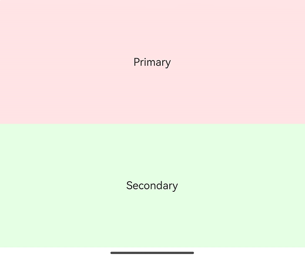 | 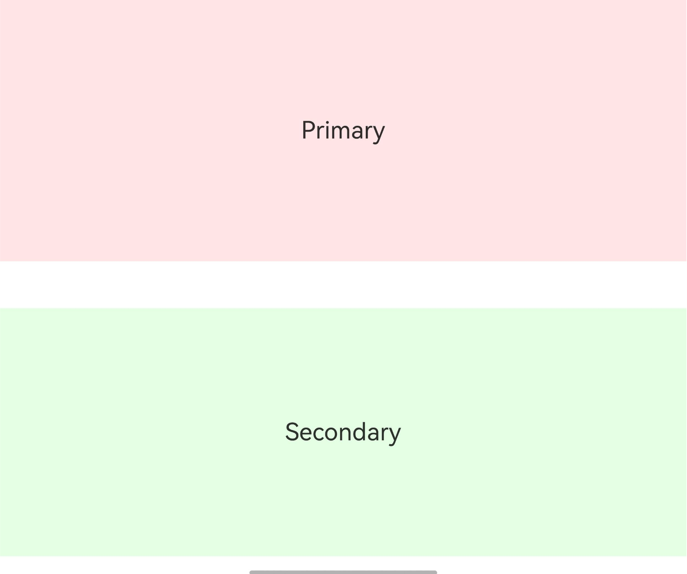 |

### 示例2（设置三分栏）

该示例实现了折叠屏三分栏在展开态、悬停态以及折叠态的区域控制。

```ts
import { FoldSplitContainer } from '@kit.ArkUI';

@Entry
@Component
struct ThreeColumns {
  @Builder
  privateRegion() {
    Text("Primary")
      .backgroundColor('rgba(255, 0, 0, 0.1)')
      .fontSize(28)
      .textAlign(TextAlign.Center)
      .height('100%')
      .width('100%')
  }

  @Builder
  secondaryRegion() {
    Text("Secondary")
      .backgroundColor('rgba(0, 255, 0, 0.1)')
      .fontSize(28)
      .textAlign(TextAlign.Center)
      .height('100%')
      .width('100%')
  }

  @Builder
  extraRegion() {
    Text("Extra")
      .backgroundColor('rgba(0, 0, 255, 0.1)')
      .fontSize(28)
      .textAlign(TextAlign.Center)
      .height('100%')
      .width('100%')
  }

  build() {
    RelativeContainer() {
      FoldSplitContainer({
        // 主要区域回调函数
        primary: () => {
          this.privateRegion()
        },
        // 次要区域回调函数
        secondary: () => {
          this.secondaryRegion()
        },
        // 扩展区域回调函数
        extra: () => {
          this.extraRegion()
        }
      })
    }
    .height('100%')
    .width('100%')
  }
}
```

| 折叠态 | 展开态 | 悬停态 |
| ----- | ------ | ------ |
| 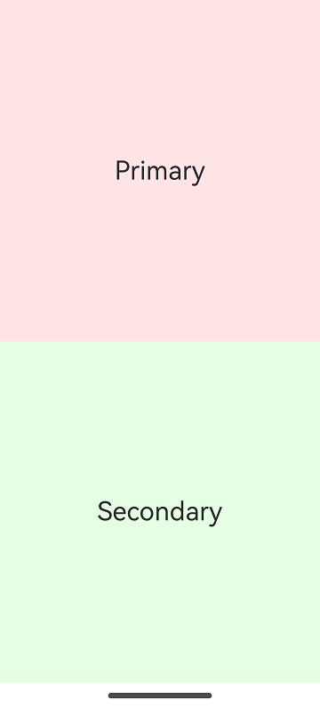 | 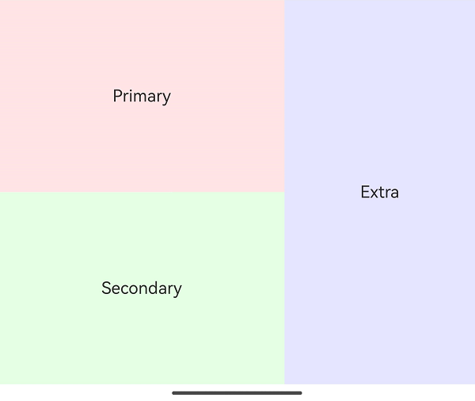 | 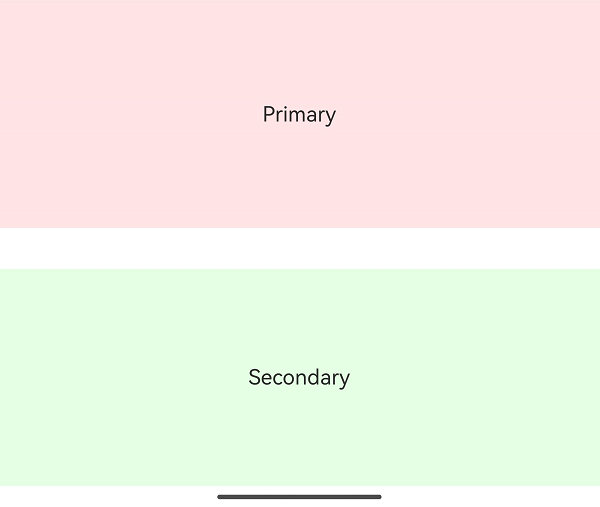 |

### 示例3（展示FoldSplitContainer折叠态、悬停态、展开态下的配置行为）

该示例通过[ExpandedRegionLayoutOptions](#expandedregionlayoutoptions)、[HoverModeRegionLayoutOptions](#hovermoderegionlayoutoptions)和[FoldedRegionLayoutOptions](#foldedregionlayoutoptions)分别配置折叠屏的展开态、悬停态和折叠态布局信息。示例提供交互式配置界面，用户可在各区域实时调整布局参数：主要区域（MajorRegion）用于配置折叠态参数，次要区域（MinorRegion）用于配置悬停态参数，扩展区域（ExtraRegion）用于配置展开态参数。这些区域使用封装的区域组件Region实现，其中RadioOptions为封装的切换单选框组件，SwitchOption为封装的切换开关组件。示意图展示了不同参数配置下的多种布局效果。

```ts
import { FoldSplitContainer, PresetSplitRatio, ExtraRegionPosition, ExpandedRegionLayoutOptions, HoverModeRegionLayoutOptions, FoldedRegionLayoutOptions } from '@kit.ArkUI';

@Component
struct Region {
  @Prop title: string;
  @BuilderParam content: () => void;
  @Prop compBackgroundColor: string;

  build() {
    Column({ space: 8 }) {
      Text(this.title)
        .fontSize("24fp")
        .fontWeight(600)

      Scroll() {
        this.content()
      }
      .layoutWeight(1)
      .width("100%")
    }
    .backgroundColor(this.compBackgroundColor)
    .width("100%")
    .height("100%")
    .padding(12)
  }
}

const noop = () => {
};

@Component
struct SwitchOption {
  @Prop label: string = ""
  @Prop value: boolean = false
  public onChange: (checked: boolean) => void = noop;

  build() {
    Row() {
      Text(this.label)
      Blank()
      Toggle({ type: ToggleType.Switch, isOn: this.value })
        .onChange((isOn) => {
          this.onChange(isOn);
        })
    }
    .backgroundColor(Color.White)
    .borderRadius(8)
    .padding(8)
    .width("100%")
  }
}

interface RadioOptions {
  label: string;
  value: Object | undefined | null;
  onChecked: () => void;
}

@Component
struct RadioOption {
  @Prop label: string;
  @Prop value: Object | undefined | null;
  @Prop options: Array<RadioOptions>;

  build() {
    Row() {
      Text(this.label)
      Blank()
      Column({ space: 4 }) {
        ForEach(this.options, (option: RadioOptions) => {
          Row() {
            Radio({
              group: this.label,
              value: JSON.stringify(option.value),
            })
              .checked(this.value === option.value)
              .onChange((checked) => {
                if (checked) {
                  option.onChecked();
                }
              })
            Text(option.label)
          }
        })
      }
      .alignItems(HorizontalAlign.Start)
    }
    .alignItems(VerticalAlign.Top)
    .backgroundColor(Color.White)
    .borderRadius(8)
    .padding(8)
    .width("100%")
  }
}

@Entry
@Component
struct Index {
  // 展开态布局配置
  @State expandedRegionLayoutOptions: ExpandedRegionLayoutOptions = {
    horizontalSplitRatio: PresetSplitRatio.LAYOUT_3V2,
    verticalSplitRatio: PresetSplitRatio.LAYOUT_1V1,
    isExtraRegionPerpendicular: true,
    extraRegionPosition: ExtraRegionPosition.TOP
  };
  // 悬停态布局配置
  @State hoverModeRegionLayoutOptions: HoverModeRegionLayoutOptions = {
    horizontalSplitRatio: PresetSplitRatio.LAYOUT_3V2,
    showExtraRegion: false,
    extraRegionPosition: ExtraRegionPosition.TOP
  };
  // 折叠态布局配置
  @State foldedRegionLayoutOptions: FoldedRegionLayoutOptions = {
    verticalSplitRatio: PresetSplitRatio.LAYOUT_1V1
  };

  @Builder
  // 主要区域自定义组件
  MajorRegion() {
    Region({
      title: "折叠态配置",
      compBackgroundColor: "rgba(255, 0, 0, 0.1)",
    }) {
      Column({ space: 4 }) {
        RadioOption({
          label: "折叠态垂直高度比",
          value: this.foldedRegionLayoutOptions.verticalSplitRatio,
          options: [
            {
              label: "1:1",
              value: PresetSplitRatio.LAYOUT_1V1,
              onChecked: () => {
                this.foldedRegionLayoutOptions.verticalSplitRatio = PresetSplitRatio.LAYOUT_1V1
              }
            },
            {
              label: "2:3",
              value: PresetSplitRatio.LAYOUT_2V3,
              onChecked: () => {
                this.foldedRegionLayoutOptions.verticalSplitRatio = PresetSplitRatio.LAYOUT_2V3
              }
            },
            {
              label: "3:2",
              value: PresetSplitRatio.LAYOUT_3V2,
              onChecked: () => {
                this.foldedRegionLayoutOptions.verticalSplitRatio = PresetSplitRatio.LAYOUT_3V2
              }
            },
            {
              label: "未定义",
              value: undefined,
              onChecked: () => {
                this.foldedRegionLayoutOptions.verticalSplitRatio = undefined
              }
            }
          ]
        })
      }
      .constraintSize({ minHeight: "100%" })
    }
  }

  @Builder
  // 次要区域自定义组件
  MinorRegion() {
    Region({
      title: "悬停态配置",
      compBackgroundColor: "rgba(0, 255, 0, 0.1)"
    }) {
      Column({ space: 4 }) {
        RadioOption({
          label: "悬停态水平宽度比",
          value: this.hoverModeRegionLayoutOptions.horizontalSplitRatio,
          options: [
            {
              label: "1:1",
              value: PresetSplitRatio.LAYOUT_1V1,
              onChecked: () => {
                this.hoverModeRegionLayoutOptions.horizontalSplitRatio = PresetSplitRatio.LAYOUT_1V1
              }
            },
            {
              label: "2:3",
              value: PresetSplitRatio.LAYOUT_2V3,
              onChecked: () => {
                this.hoverModeRegionLayoutOptions.horizontalSplitRatio = PresetSplitRatio.LAYOUT_2V3
              }
            },
            {
              label: "3:2",
              value: PresetSplitRatio.LAYOUT_3V2,
              onChecked: () => {
                this.hoverModeRegionLayoutOptions.horizontalSplitRatio = PresetSplitRatio.LAYOUT_3V2
              }
            },
            {
              label: "未定义",
              value: undefined,
              onChecked: () => {
                this.hoverModeRegionLayoutOptions.horizontalSplitRatio = undefined
              }
            },
          ]
        })

        SwitchOption({
          label: "悬停态是否显示扩展区",
          value: this.hoverModeRegionLayoutOptions.showExtraRegion,
          onChange: (checked) => {
            this.hoverModeRegionLayoutOptions.showExtraRegion = checked;
          }
        })

        if (this.hoverModeRegionLayoutOptions.showExtraRegion) {
          RadioOption({
            label: "悬停态扩展区位置",
            value: this.hoverModeRegionLayoutOptions.extraRegionPosition,
            options: [
              {
                label: "顶部",
                value: ExtraRegionPosition.TOP,
                onChecked: () => {
                  this.hoverModeRegionLayoutOptions.extraRegionPosition = ExtraRegionPosition.TOP
                }
              },
              {
                label: "底部",
                value: ExtraRegionPosition.BOTTOM,
                onChecked: () => {
                  this.hoverModeRegionLayoutOptions.extraRegionPosition = ExtraRegionPosition.BOTTOM
                }
              },
              {
                label: "未定义",
                value: undefined,
                onChecked: () => {
                  this.hoverModeRegionLayoutOptions.extraRegionPosition = undefined
                }
              },
            ]
          })
        }
      }
      .constraintSize({ minHeight: "100%" })
    }
  }

  @Builder
  // 扩展区域自定义组件
  ExtraRegion() {
    Region({
      title: "展开态配置",
      compBackgroundColor: "rgba(0, 0, 255, 0.1)"
    }) {
      Column({ space: 4 }) {
        RadioOption({
          label: "展开态水平宽度比",
          value: this.expandedRegionLayoutOptions.horizontalSplitRatio,
          options: [
            {
              label: "1:1",
              value: PresetSplitRatio.LAYOUT_1V1,
              onChecked: () => {
                this.expandedRegionLayoutOptions.horizontalSplitRatio = PresetSplitRatio.LAYOUT_1V1
              }
            },
            {
              label: "2:3",
              value: PresetSplitRatio.LAYOUT_2V3,
              onChecked: () => {
                this.expandedRegionLayoutOptions.horizontalSplitRatio = PresetSplitRatio.LAYOUT_2V3
              }
            },
            {
              label: "3:2",
              value: PresetSplitRatio.LAYOUT_3V2,
              onChecked: () => {
                this.expandedRegionLayoutOptions.horizontalSplitRatio = PresetSplitRatio.LAYOUT_3V2
              }
            },
            {
              label: "未定义",
              value: undefined,
              onChecked: () => {
                this.expandedRegionLayoutOptions.horizontalSplitRatio = undefined
              }
            },
          ]
        })

        RadioOption({
          label: "展开态垂直高度比",
          value: this.expandedRegionLayoutOptions.verticalSplitRatio,
          options: [
            {
              label: "1:1",
              value: PresetSplitRatio.LAYOUT_1V1,
              onChecked: () => {
                this.expandedRegionLayoutOptions.verticalSplitRatio = PresetSplitRatio.LAYOUT_1V1
              }
            },
            {
              label: "2:3",
              value: PresetSplitRatio.LAYOUT_2V3,
              onChecked: () => {
                this.expandedRegionLayoutOptions.verticalSplitRatio = PresetSplitRatio.LAYOUT_2V3
              }
            },
            {
              label: "3:2",
              value: PresetSplitRatio.LAYOUT_3V2,
              onChecked: () => {
                this.expandedRegionLayoutOptions.verticalSplitRatio = PresetSplitRatio.LAYOUT_3V2
              }
            },
            {
              label: "未定义",
              value: undefined,
              onChecked: () => {
                this.expandedRegionLayoutOptions.verticalSplitRatio = undefined
              }
            }
          ]
        })

        SwitchOption({
          label: "展开态扩展区是否上下贯穿",
          value: this.expandedRegionLayoutOptions.isExtraRegionPerpendicular,
          onChange: (checked) => {
            this.expandedRegionLayoutOptions.isExtraRegionPerpendicular = checked;
          }
        })

        if (!this.expandedRegionLayoutOptions.isExtraRegionPerpendicular) {
          RadioOption({
            label: "展开态扩展区位置",
            value: this.expandedRegionLayoutOptions.extraRegionPosition,
            options: [
              {
                label: "顶部",
                value: ExtraRegionPosition.TOP,
                onChecked: () => {
                  this.expandedRegionLayoutOptions.extraRegionPosition = ExtraRegionPosition.TOP
                }
              },
              {
                label: "底部",
                value: ExtraRegionPosition.BOTTOM,
                onChecked: () => {
                  this.expandedRegionLayoutOptions.extraRegionPosition = ExtraRegionPosition.BOTTOM
                }
              },
              {
                label: "未定义",
                value: undefined,
                onChecked: () => {
                  this.expandedRegionLayoutOptions.extraRegionPosition = undefined
                }
              },
            ]
          })
        }
      }
      .constraintSize({ minHeight: "100%" })
    }
  }

  build() {
    Column() {
      FoldSplitContainer({
        // 主要区域回调函数
        primary: () => {
          this.MajorRegion()
        },
        // 次要区域回调函数
        secondary: () => {
          this.MinorRegion()
        },
        // 扩展区域回调函数
        extra: () => {
          this.ExtraRegion()
        },
        expandedLayoutOptions: this.expandedRegionLayoutOptions,
        hoverModeLayoutOptions: this.hoverModeRegionLayoutOptions,
        foldedLayoutOptions: this.foldedRegionLayoutOptions,
      })
    }
    .width("100%")
    .height("100%")
  }
}
```

| 折叠态 | 展开态 | 悬停态 |
| ----- | ------ | ------ |
| 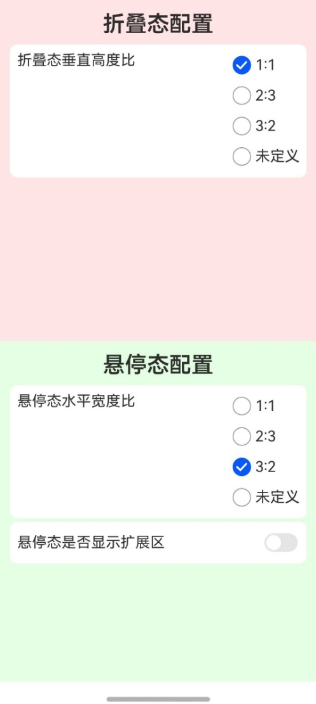 | 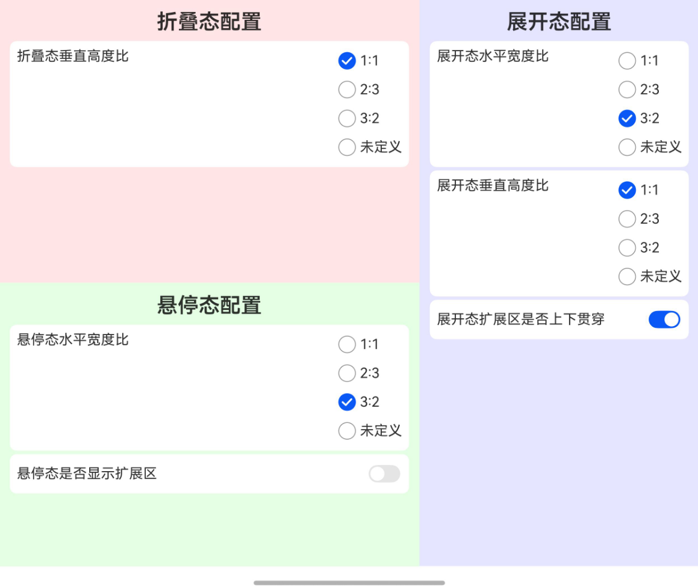 | 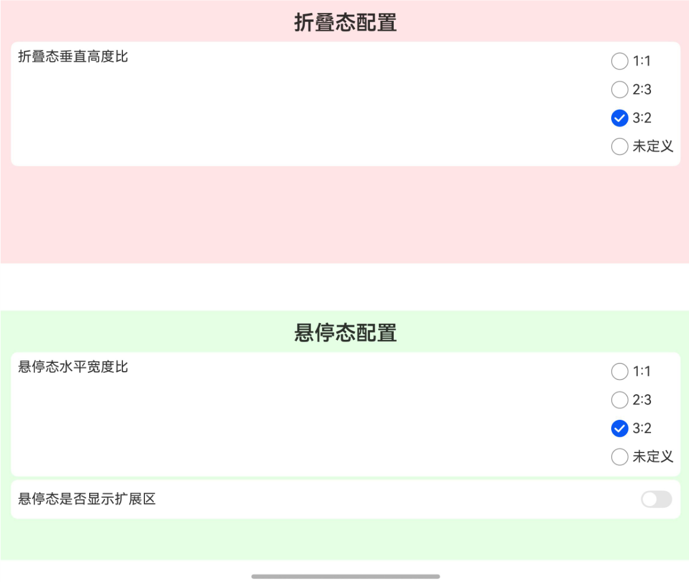 |
|               -                        | 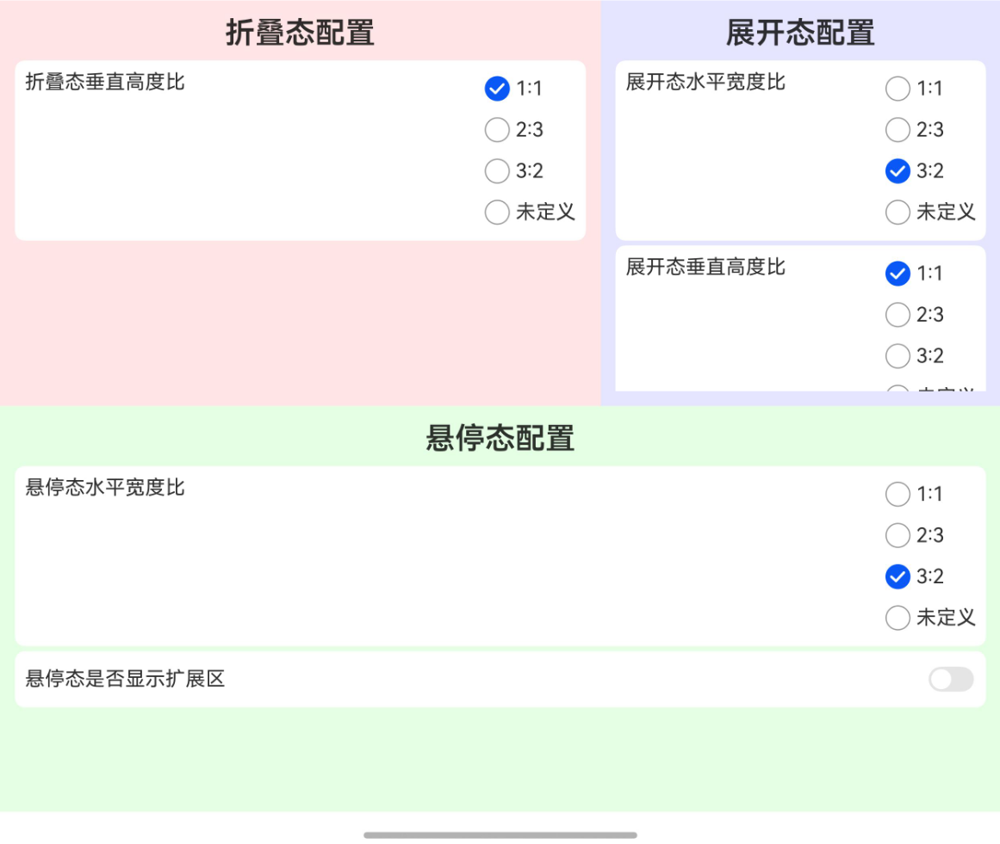 | 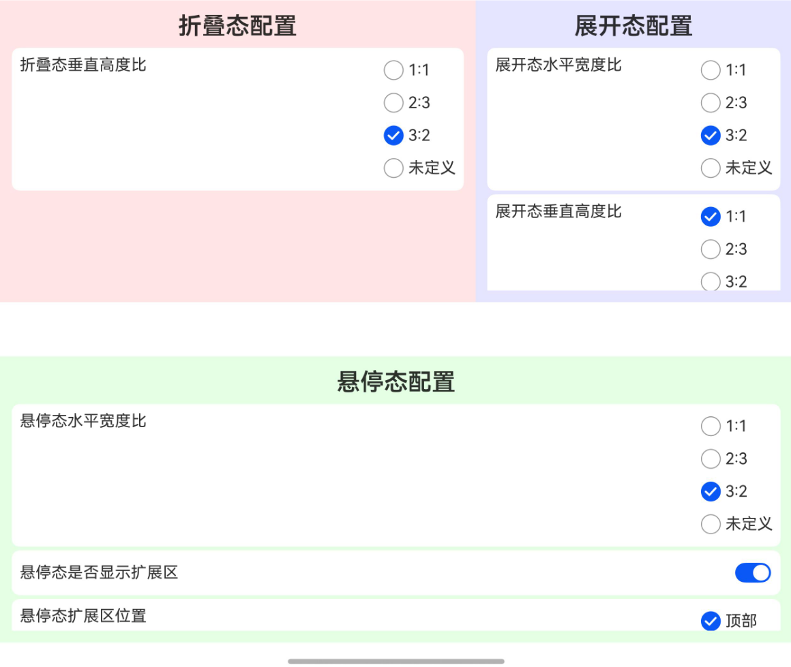 |
|               -                        | 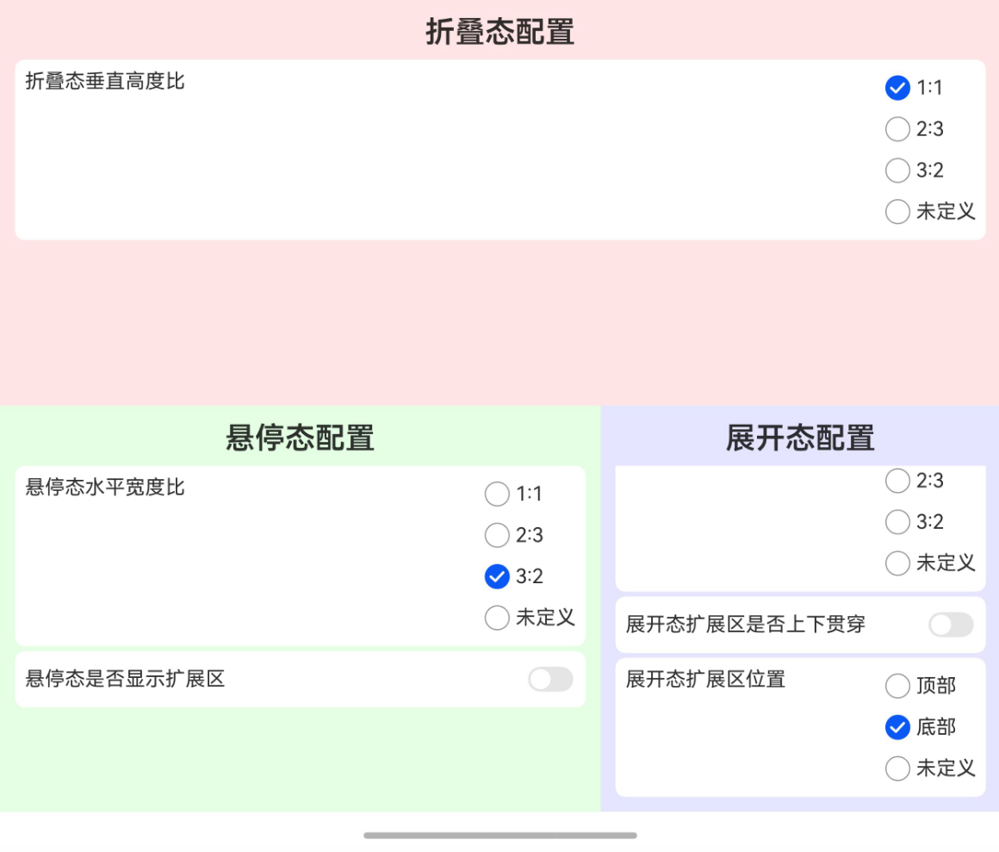 | 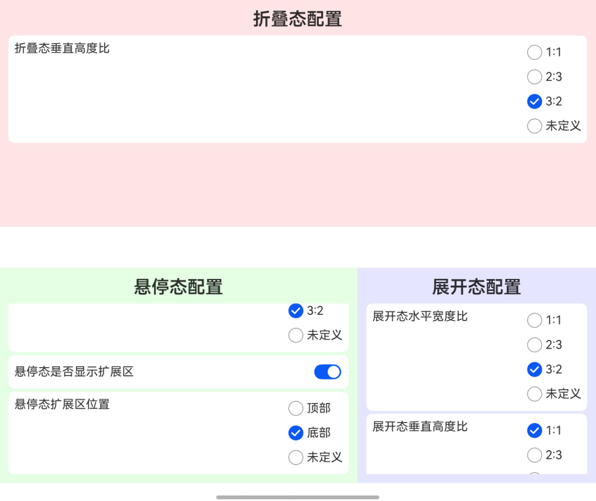 |
