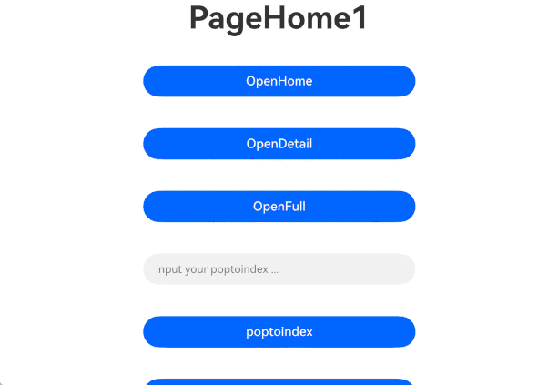
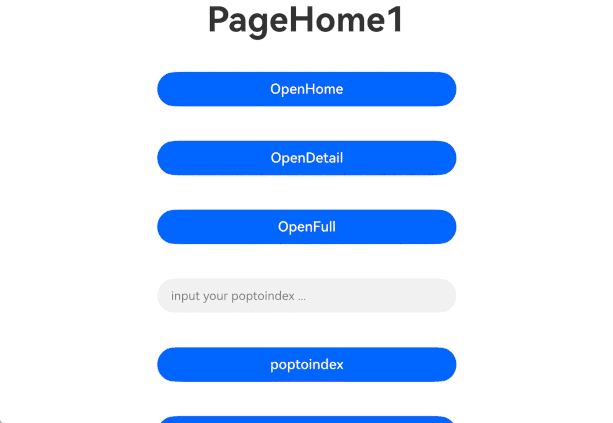

# MultiNavigation
<!--Kit: ArkUI-->
<!--Subsystem: ArkUI-->
<!--Owner: @tsj_20201-->
<!--Designer: @fangzhiyuan1-->
<!--Tester: @gouyuanyuan-->
<!--Adviser: @Brilliantry_Rui-->

MultiNavigation用于在大尺寸设备上分栏显示、进行路由跳转。

> **说明：**
>
> - 本模块同时支持ArkTS-Dyn、ArkTS-Sta。
>
> - 本模块接口仅可在Stage模型下使用。
>
> - 该组件从API version 14开始支持。后续版本如有新增内容，则采用上角标单独标记该内容的起始版本。
>
> - 由于MultiNavigation存在多层次的页面栈结构（主页、详情页、全屏页各自维护子栈，并由MultiNavPathStack统一管理），调用本文档明确说明的不支持接口或不在本文档支持接口列表中的接口(例如[getParent](ts-basic-components-navigation.md#getparent11)、[setInterception](ts-basic-components-navigation.md#setinterception12)、[pushDestination](ts-basic-components-navigation.md#pushdestination11)等)，可能会发生无法预期的问题。
>
> - MultiNavigation在深层嵌套场景下，可能存在路由动效异常的问题。

## 导入模块

```ts
import { MultiNavigation, MultiNavPathStack, SplitPolicy } from '@kit.ArkUI';
```

## 子组件

不可以包含子组件。

## MultiNavigation

ArkTS-Dyn: MultiNavigation({navDestination: NavDestinationBuildFunction, multiStack: MultiNavPathStack, onNavigationModeChange?: OnNavigationModeChangeCallback, onHomeShowOnTop?: OnHomeShowOnTopCallback})

ArkTS-Sta: MultiNavigation({navDestination: PageMapBuilder | undefined, multiStack: MultiNavPathStack, onNavigationModeChange?: OnNavigationModeChangeCallback, onHomeShowOnTop?: OnHomeShowOnTopCallback})

创建并初始化MultiNavigation组件。

MultiNavigation组件遵循默认的左起右清栈规则：从主页触发详情页加载时，会清除栈中已有的所有详情页，确保仅展示最新加载的详情页。然而，若在右侧的详情页上再次执行详情页加载操作，系统将不会执行清栈动作。效果可参见[示例](#示例)。

> **左起右清栈规则说明：**
>
> - 从主页（HOME_PAGE）点击加载详情页时：栈中已有的右侧详情页全部出栈，新详情页入栈，确保右侧仅展示最新加载的详情页。
>
> - 从详情页（DETAIL_PAGE）再次点击加载详情页时：不清栈，新详情页直接入栈，原有详情页保留。
>
> - 从全屏页（FULL_PAGE）加载详情页时：不影响已有详情页栈，新详情页入栈。

**装饰器类型：** [@Component](../../../ui/state-management/arkts-create-custom-components.md#component)

**原子化服务API（仅ArkTS-Dyn）：** 从API version 14开始，该接口支持在原子化服务中使用。

**系统能力：** SystemCapability.ArkUI.ArkUI.Full

**ArkTS-Dyn起始版本：** 14

**ArkTS-Sta起始版本：** 23

|   名称   |          类型          | 必填 | 装饰器类型 | 说明 |
|---------|----------------------|------ |------|-----------|
| multiStack | [MultiNavPathStack](#multinavpathstack) |  是 | [@State](ts-state-management-state.md) | 设置路由栈。 |
| navDestination |ArkTS-Dyn: [NavDestinationBuildFunction](#navdestinationbuildfunction) <br/>ArkTS-Sta: [PageMapBuilder](ts-types.md#pagemapbuilder23) \| undefined | 是 | [@BuilderParam](../../../ui/state-management/arkts-builderparam.md) | 设置加载目标页面的路由规则。<br/>取值为undefined时，不会加载。 |
| onNavigationModeChange | [OnNavigationModeChangeCallback](#onnavigationmodechangecallback) | 否 | - | 设置MultiNavigation模式变更时的回调。当需要在导航模式变化时执行特定业务逻辑（如调整页面布局、更新UI状态等）时传入此回调。不传入时不监听导航模式变更事件，导航模式变更时无回调触发。 |
| onHomeShowOnTop | [OnHomeShowOnTopCallback](#onhomeshowontopcallback) | 否 | - | 设置主页处于栈顶时的回调。不传入时不监听主页栈顶状态变化。 |

## MultiNavPathStack

MultiNavigation的路由栈仅支持由使用方自行创建，不支持通过回调方式获取。请勿使用[NavDestination](ts-basic-components-navdestination.md)的[onReady](ts-basic-components-navdestination.md#onready11)等类似事件或接口来获取NavPathStack并进行栈操作，因为这可能会导致不可预知的问题。

### constructor

constructor()

创建MultiNavPathStack路由栈实例。

**原子化服务API（仅ArkTS-Dyn）：** 从API version 14开始，该接口支持在原子化服务中使用。

**系统能力：** SystemCapability.ArkUI.ArkUI.Full

**ArkTS-Dyn起始版本：** 14

**ArkTS-Sta起始版本：** 23

### pushPath

pushPath(info: NavPathInfo, animated?: boolean, policy?: SplitPolicy): void

将指定的NavDestination页面信息入栈。

**原子化服务API（仅ArkTS-Dyn）：** 从API version 14开始，该接口支持在原子化服务中使用。

**系统能力：** SystemCapability.ArkUI.ArkUI.Full

**ArkTS-Dyn起始版本：** 14

**ArkTS-Sta起始版本：** 23

**参数：**

|  参数名   |                             类型                             | 必填 | 说明                                       |
| ------| ---------------------------------------------------------- | -- | ----------------------------------------- |
|   info   | [NavPathInfo](./ts-basic-components-navigation.md#navpathinfo10) |  是  | NavDestination页面的信息。                |
| animated |                           boolean                            |  否  | 是否支持转场动画。<br/>默认值：true<br/>true：支持转场动画。<br/>false：不支持转场动画。          |
|  policy  |               [SplitPolicy](#splitpolicy枚举说明)                |  否  | 当前入栈页面的策略。<br/>默认值：DETAIL_PAGE |

### pushPath

pushPath(info: NavPathInfo, options?: NavigationOptions, policy?: SplitPolicy): void

将指定的NavDestination页面信息入栈，通过NavigationOptions设置页面栈操作选项。

**原子化服务API（仅ArkTS-Dyn）：** 从API version 14开始，该接口支持在原子化服务中使用。

**系统能力：** SystemCapability.ArkUI.ArkUI.Full

**ArkTS-Dyn起始版本：** 14

**ArkTS-Sta起始版本：** 23

**参数：**

|  参数名   |                             类型                             | 必填 | 说明                                       |
| ----- | ---------------------------------------------------------- | -- | ------------------------------------------ |
|  info   | [NavPathInfo](./ts-basic-components-navigation.md#navpathinfo10) |  是  | NavDestination页面的信息。                 |
| options | [NavigationOptions](./ts-basic-components-navigation.md#navigationoptions12) |  否  | 页面栈操作选项。仅支持其中的animated字段，使用其他字段将被忽略。省略时使用默认动画配置。 |
| policy  |               [SplitPolicy](#splitpolicy枚举说明)                |  否  | 当前入栈页面的策略。<br/>默认值：DETAIL_PAGE    |

### pushPathByName

pushPathByName(name: string, param: Object, animated?: boolean, policy?: SplitPolicy): void

将name指定的NavDestination页面信息入栈，传递的数据为param。

**原子化服务API（仅ArkTS-Dyn）：** 从API version 14开始，该接口支持在原子化服务中使用。

**系统能力：** SystemCapability.ArkUI.ArkUI.Full

**ArkTS-Dyn起始版本：** 14

**ArkTS-Sta起始版本：** 23

**参数：**

|  参数名   |             类型              | 必填 | 说明           |
|:---------------------:|:------------:|:------:| --------------------- |
|         name          |    string    |   是    | NavDestination页面名称。需要与NavDestinationBuildFunction中注册的页面名称一致。   |
|         param         |   Object    |   是    | NavDestination页面详细参数，用于向目标页面传递自定义数据。具体字段规格请参考NavDestination相关文档。 |
|       animated        |   boolean    |   否    | 是否支持转场动画。<br/>默认值：true<br/>true：支持转场动画。<br/>false：不支持转场动画。 |
|        policy         | [SplitPolicy](#splitpolicy枚举说明)  |   否    | 当前入栈页面的策略。<br/>默认值：DETAIL_PAGE       |

### pushPathByName

pushPathByName(name: string, param: Object, onPop?: base.Callback\<PopInfo>, animated?: boolean, policy?: SplitPolicy): void

将name指定的NavDestination页面信息入栈，传递的数据为param，添加onPop回调接收入栈页面出栈时的返回结果，并进行处理。

**原子化服务API（仅ArkTS-Dyn）：** 从API version 14开始，该接口支持在原子化服务中使用。

**系统能力：** SystemCapability.ArkUI.ArkUI.Full

**ArkTS模式：** 该接口仅适用于ArkTS-Dyn。

**相关接口：** 该接口对应的ArkTS-Sta的接口是[pushPathByName<sup>23+</sup>](#pushpathbyname23)。

**ArkTS-Dyn起始版本：** 14

**参数：**

|  参数名   |             类型                | 必填 | 说明           |
|:---------:|:-------------------------------------------------------------:|:------:|------|
|   name    |                            string                             |   是    | NavDestination页面名称。需要与NavDestinationBuildFunction中注册的页面名称一致。   |
|   param   |                            Object                             |   是    | NavDestination页面详细参数，用于向目标页面传递自定义数据。具体字段规格请参考NavDestination相关文档。 |
|   onPop   | base.[Callback](../../apis-basic-services-kit/js-apis-base.md#callback)\<[PopInfo](ts-basic-components-navigation.md#popinfo11)>  |   否    | Callback回调，用于页面出栈时触发该回调处理返回结果。省略时不触发回调处理。可通过pop方法、popToName方法、popToIndex方法的result参数传递数据给此回调。 |
| animated  |                            boolean                            |   否    | 是否支持转场动画。<br/>默认值：true<br/>true：支持转场动画。<br/>false：不支持转场动画。 |
|  policy   |                          [SplitPolicy](#splitpolicy枚举说明)                          |   否    | 当前入栈页面的策略。<br/>默认值：DETAIL_PAGE       |

### pushPathByName<sup>23+</sup>

pushPathByName(name: string, param: Object, onPop?: Callback\<PopInfo>, animated?: boolean, policy?: SplitPolicy): void

将name指定的NavDestination页面信息入栈，传递的数据为param，添加onPop回调接收入栈页面出栈时的返回结果，并进行处理。

**系统能力：** SystemCapability.ArkUI.ArkUI.Full

**ArkTS模式：** 该接口仅适用于ArkTS-Sta。

**相关接口：** 该接口对应的ArkTS-Dyn的接口是[pushPathByName](#pushpathbyname)。

**ArkTS-Sta起始版本：** 23

**参数：**

|  参数名   |             类型                | 必填 | 说明           |
|---------|-------------------------------------------------------------|------|------|
|   name    |                            string                             |   是    | NavDestination页面名称。   |
|   param   |                            Object                             |   是    | NavDestination页面详细参数。 |
|   onPop   | [Callback](../../apis-basic-services-kit/js-apis-base.md#callback)\<[PopInfo](ts-basic-components-navigation.md#popinfo11)>  |   否    | Callback回调，用于页面出栈时触发该回调处理返回结果。 |
| animated  |                            boolean                            |   否    | 是否支持转场动画。<br/>默认值：true<br/>true：支持转场动画。<br/>false：不支持转场动画。 |
|  policy   |                          [SplitPolicy](#splitpolicy枚举说明)                          |  否    | 当前入栈页面的策略。默认值：DETAIL_PAGE       |

### replacePath

replacePath(info: NavPathInfo, animated?: boolean): void

将当前页面栈栈顶退出，将指定的NavDestination页面信息入栈，新页面的分栏策略继承原栈顶页面的策略。

**原子化服务API（仅ArkTS-Dyn）：** 从API version 14开始，该接口支持在原子化服务中使用。

**系统能力：** SystemCapability.ArkUI.ArkUI.Full

**ArkTS-Dyn起始版本：** 14

**ArkTS-Sta起始版本：** 23

**参数：**

|  参数名   |             类型                | 必填 | 说明           |
| ------ | ---------------------------------------------------------- | -- | -------------------------------- |
|   info   | [NavPathInfo](./ts-basic-components-navigation.md#navpathinfo10) |  是  | NavDestination页面的信息。       |
| animated |                           boolean                            |  否  | 是否支持转场动画。<br/>默认值：true<br/>true：支持转场动画。<br/>false：不支持转场动画。 |

### replacePath

replacePath(info: NavPathInfo, options?: NavigationOptions): void

将当前页面栈栈顶退出，将指定的NavDestination页面信息入栈，新页面的分栏策略继承原栈顶页面的策略，通过NavigationOptions设置页面栈操作选项。

**原子化服务API（仅ArkTS-Dyn）：** 从API version 14开始，该接口支持在原子化服务中使用。

**系统能力：** SystemCapability.ArkUI.ArkUI.Full

**ArkTS-Dyn起始版本：** 14

**ArkTS-Sta起始版本：** 23

**参数：**

|  参数名   |             类型                | 必填 | 说明           |
| ----- | ---------------------------------------------------------- | -- | ------------------------------------------ |
|  info   | [NavPathInfo](./ts-basic-components-navigation.md#navpathinfo10) |  是  | NavDestination页面的信息。                 |
| options | [NavigationOptions](./ts-basic-components-navigation.md#navigationoptions12) |  否  | 页面栈操作选项。仅支持其中的animated字段。 |

### replacePathByName

replacePathByName(name: string, param: Object, animated?: boolean): void

将当前页面栈栈顶退出，将name指定的页面入栈，新页面的分栏策略继承原栈顶页面的策略。

**原子化服务API（仅ArkTS-Dyn）：** 从API version 14开始，该接口支持在原子化服务中使用。

**系统能力：** SystemCapability.ArkUI.ArkUI.Full

**ArkTS-Dyn起始版本：** 14

**ArkTS-Sta起始版本：** 23

**参数：**

|  参数名   |             类型                | 必填 | 说明           |
|--------|---------|------|----------------------|
|   name   |  string   |   是    | NavDestination页面名称。  |
|  param   |  Object   |   是    | NavDestination页面详细参数。 |
| animated |  boolean  |  否    | 是否支持转场动画。<br/>默认值：true<br/>true：支持转场动画。<br/>false：不支持转场动画。   |

### removeByIndexes

ArkTS-Dyn: removeByIndexes(indexes: Array<number\>): number

ArkTS-Sta: removeByIndexes(indexes: Array<int\>): int

将页面栈内索引值在indexes中的NavDestination页面删除。

**原子化服务API（仅ArkTS-Dyn）：** 从API version 14开始，该接口支持在原子化服务中使用。

**系统能力：** SystemCapability.ArkUI.ArkUI.Full

**ArkTS-Dyn起始版本：** 14

**ArkTS-Sta起始版本：** 23

**参数：**

|  参数名   | 类型                         | 必填 | 说明           |
|--------|------------------------------------|------| ---------------------|
| indexes | ArkTS-Dyn: Array<number\><br/>ArkTS-Sta: Array<int\>  |   是  |  待删除NavDestination页面的索引值数组。<br/>number类型的取值范围：[0, +∞)，超出范围时操作不生效。|

**返回值：**

|      类型       | 说明                       |
|-------------| ------------------------ |
| ArkTS-Dyn: number<br/>ArkTS-Sta: int     | 返回删除的NavDestination页面数量。 |

### removeByName

ArkTS-Dyn: removeByName(name: string): number

ArkTS-Sta: removeByName(name: string): int

将页面栈内指定name的NavDestination页面删除。

**原子化服务API（仅ArkTS-Dyn）：** 从API version 14开始，该接口支持在原子化服务中使用。

**系统能力：** SystemCapability.ArkUI.ArkUI.Full

**ArkTS-Dyn起始版本：** 14

**ArkTS-Sta起始版本：** 23

**参数：**

|  参数名   | 类型   | 必填 | 说明           |
|-------| ------- | ---- | --------------------- |
|  name   | string  | 是    | 待删除NavDestination页面的名称。 |

**返回值：**

|      类型       | 说明                       |
|-------------| ------------------------ |
| ArkTS-Dyn: number<br/>ArkTS-Sta: int     | 返回删除的NavDestination页面数量。 |

### pop

pop(animated?: boolean): NavPathInfo | undefined

弹出路由栈栈顶元素。

> **说明：**
>
> 当调用[keepBottomPage](#keepbottompage)接口并设置为true时，会保留栈底页面。

**原子化服务API（仅ArkTS-Dyn）：** 从API version 14开始，该接口支持在原子化服务中使用。

**系统能力：** SystemCapability.ArkUI.ArkUI.Full

**ArkTS模式：** 该接口仅适用于ArkTS-Dyn。

**相关接口：** 该接口对应的ArkTS-Sta的接口是[pop](#pop23)。

**ArkTS-Dyn起始版本：** 14

**参数：**

|  参数名   |             类型                | 必填 | 说明           |
|-----------|--------|------| -------------------- |
|  animated   | boolean  |   否    | 是否支持转场动画。<br/>默认值：true<br/>true：支持转场动画。<br/>false：不支持转场动画。 |

**返回值：**

| 类型          | 说明                       |
| ----------- | ------------------------ |
| [NavPathInfo](./ts-basic-components-navigation.md#navpathinfo10) \| undefined | 返回栈顶NavDestination页面的信息。无页面信息时返回undefined。 |

### pop

pop(result?: Object, animated?: boolean): NavPathInfo | undefined

弹出路由栈栈顶元素，并触发onPop回调传入页面处理结果。

> **说明：**
>
> 当调用[keepBottomPage](#keepbottompage)接口并设置为true时，会保留栈底页面。

**原子化服务API（仅ArkTS-Dyn）：** 从API version 14开始，该接口支持在原子化服务中使用。

**系统能力：** SystemCapability.ArkUI.ArkUI.Full

**ArkTS模式：** 该接口仅适用于ArkTS-Dyn。

**相关接口：** 该接口对应的ArkTS-Sta的接口是[pop](#pop23)。

**ArkTS-Dyn起始版本：** 14

**参数：**

|  参数名   |             类型                | 必填 | 说明           |
|---------|-------------------------------|------| -------------------- |
|  result   |             Object              |   否    | 页面自定义处理结果。具体内容由开发者自定义，建议包含明确的业务标识和处理结果数据。该结果将传递给入栈时设置的onPop回调函数。省略时不传递结果数据。 |
| animated  |             boolean             |   否    | 是否支持转场动画。<br/>默认值：true<br/>true：支持转场动画。<br/>false：不支持转场动画。 |

**返回值：**

| 类型          | 说明                       |
| ----------- | ------------------------ |
| [NavPathInfo](./ts-basic-components-navigation.md#navpathinfo10) \| undefined | 返回栈顶NavDestination页面的信息。无页面信息时返回undefined。 |

### pop<sup>23+</sup>

pop(result?: Object, animated?: boolean): NavPathInfo | undefined

弹出路由栈栈顶元素，并触发onPop回调传入页面处理结果。

> **说明：**
>
> 当调用[keepBottomPage](#keepbottompage)接口并设置为true时，会保留栈底页面。

**系统能力：** SystemCapability.ArkUI.ArkUI.Full

**ArkTS模式：** 该接口仅适用于ArkTS-Sta。

**相关接口：** 该接口对应的ArkTS-Dyn的接口是[pop](#pop)和[pop](#pop-1)。

**ArkTS-Sta起始版本：** 23

**参数：**

|  参数名   |             类型                | 必填 | 说明           |
|---------|-------------------------------|------| -------------------- |
|  result   |             Object              |   否       | 页面自定义处理结果。 |
| animated  |             boolean             |   否    | 是否支持转场动画。<br/>默认值：true<br/>true：支持转场动画。<br/>false：不支持转场动画。 |

**返回值：**

| 类型          | 说明                       |
| ----------- | ------------------------ |
| [NavPathInfo](./ts-basic-components-navigation.md#navpathinfo10) \| undefined | 返回栈顶NavDestination页面的信息。无页面信息时返回undefined。 |

### popToName

ArkTS-Dyn: popToName(name: string, animated?: boolean): number

ArkTS-Sta: popToName(name: string, animated?: boolean): int

回退路由栈到由栈底开始第一个名为name的NavDestination页面。

**原子化服务API（仅ArkTS-Dyn）：** 从API version 14开始，该接口支持在原子化服务中使用。

**系统能力：** SystemCapability.ArkUI.ArkUI.Full

**ArkTS-Dyn起始版本：** 14

**ArkTS-Sta起始版本：** 23

**参数：**

|  参数名   | 类型   | 必填 | 说明           |
|----------|--------|------| ------------------- |
|    name    |  string  |   是    | NavDestination页面名称。 |
|  animated  | boolean  |   否    | 是否支持转场动画。<br/>默认值：true<br/>true：支持转场动画。<br/>false：不支持转场动画。 |

**返回值：**

| 类型     | 说明                                       |
| ------ | ---------------------------------------- |
| ArkTS-Dyn: number<br/>ArkTS-Sta: int | 如果栈中存在名为name的NavDestination页面，则返回由栈底开始第一个名为name的NavDestination页面的索引，否则返回-1。<br/>取值范围：[-1, +∞) |

### popToName

ArkTS-Dyn: popToName(name: string, result: Object, animated?: boolean): number

ArkTS-Sta: popToName(name: string, result: Object, animated?: boolean): int

回退路由栈到由栈底开始第一个名为name的NavDestination页面，并触发onPop回调传入页面处理结果。

**原子化服务API（仅ArkTS-Dyn）：** 从API version 14开始，该接口支持在原子化服务中使用。

**系统能力：** SystemCapability.ArkUI.ArkUI.Full

**ArkTS-Dyn起始版本：** 14

**ArkTS-Sta起始版本：** 23

**参数：**

|  参数名   | 类型   | 必填 | 说明           |
|---------|--------|------| ------------------- |
|   name    |  string  |   是    | NavDestination页面名称。 |
|  result   |  Object  |   是    | 页面自定义处理结果。具体内容由开发者自定义，建议包含明确的业务标识和处理结果数据。该结果将传递给入栈时设置的onPop回调函数。 |
| animated  | boolean  |   否    | 是否支持转场动画。<br/>默认值：true<br/>true：支持转场动画。<br/>false：不支持转场动画。 |

**返回值：**

| 类型     | 说明                                       |
| ------ | ---------------------------------------- |
| ArkTS-Dyn: number<br/>ArkTS-Sta: int | 如果栈中存在名为name的NavDestination页面，则返回由栈底开始第一个名为name的NavDestination页面的索引，否则返回-1。 |

### popToIndex

ArkTS-Dyn: popToIndex(index: number, animated?: boolean): void

ArkTS-Sta: popToIndex(index: int, animated?: boolean): void

回退路由栈到index指定的NavDestination页面。当index无效（超出范围）时，不执行回退操作。

**原子化服务API（仅ArkTS-Dyn）：** 从API version 14开始，该接口支持在原子化服务中使用。

**系统能力：** SystemCapability.ArkUI.ArkUI.Full

**ArkTS-Dyn起始版本：** 14

**ArkTS-Sta起始版本：** 23

**参数：**

|  参数名   | 类型   | 必填 | 说明           |
|------------|--------|------| ---------------------- |
|    index     | ArkTS-Dyn: number<br/>ArkTS-Sta: int  |   是    | NavDestination页面的位置索引。<br/>取值范围：[0, +∞)，超出范围时操作不生效。 |
|   animated   | boolean  |   否    | 是否支持转场动画。<br/>默认值：true<br/>true：支持转场动画。<br/>false：不支持转场动画。 |

### popToIndex

ArkTS-Dyn: popToIndex(index: number, result: Object, animated?: boolean): void

ArkTS-Sta: popToIndex(index: int, result: Object, animated?: boolean): void

回退路由栈到index指定的NavDestination页面，并触发onPop回调传入页面处理结果。

**原子化服务API（仅ArkTS-Dyn）：** 从API version 14开始，该接口支持在原子化服务中使用。

**系统能力：** SystemCapability.ArkUI.ArkUI.Full

**ArkTS-Dyn起始版本：** 14

**ArkTS-Sta起始版本：** 23

**参数：**

|  参数名   | 类型   | 必填 | 说明           |
| ----- | ------ | ---- | ---------------------- |
| index | ArkTS-Dyn: number<br/>ArkTS-Sta: int | 是    | NavDestination页面的位置索引。<br/>取值范围：[0, +∞)  |
| result | Object | 是 | 页面自定义处理结果。具体内容由开发者自定义，建议包含明确的业务标识和处理结果数据。 |
| animated | boolean | 否    | 是否支持转场动画。<br/>默认值：true<br/>true：支持转场动画。<br/>false：不支持转场动画。 |

### moveToTop

ArkTS-Dyn: moveToTop(name: string, animated?: boolean): number

ArkTS-Sta: moveToTop(name: string, animated?: boolean): int

将由栈底开始第一个名为name的NavDestination页面移到栈顶。

> **说明：**
>
> 根据找到的第一个名为name的页面的不同，MultiNavigation会进行不同的处理：
> 
> 1)当找到的是最上层主页或者全屏页，此时不做任何处理；
> 
> 2)当找到的是最上层主页对应的详情页，则会将对应的详情页移到栈顶；
> 
> 3)当找到的是非最上层的主页，则会将主页和对应所有详情页移到栈顶，详情页相对栈关系不变；
> 
> 4)当找到的是非最上层的详情页，则会将主页和对应所有详情页移到栈顶，且将目标详情页移动到对应所有详情页的栈顶；
> 
> 5)当找到的是非最上层的全屏页，则会将全屏页移动到栈顶。
>
> **场景总结：** 页面已在栈顶时不操作；详情页在栈顶时仅移动该详情页；非栈顶的主页或详情页移动时会同时携带其关联的详情页组；非栈顶的全屏页仅移动自身。

**原子化服务API（仅ArkTS-Dyn）：** 从API version 14开始，该接口支持在原子化服务中使用。

**系统能力：** SystemCapability.ArkUI.ArkUI.Full

**ArkTS-Dyn起始版本：** 14

**ArkTS-Sta起始版本：** 23

**参数：**

|  参数名   | 类型   | 必填 | 说明           |
|---------|--------|------| ------------------- |
|   name    |  string  |   是    | NavDestination页面名称。 |
| animated  | boolean  |   否    | 是否支持转场动画。<br/>默认值：true<br/>true：支持转场动画。<br/>false：不支持转场动画。 |

**返回值：**

|    类型    |                                      说明                                      |
|--------|----------------------------------------------------------------------------|
| ArkTS-Dyn: number<br/>ArkTS-Sta: int  | 如果栈中存在名为name的NavDestination页面，则返回由栈底开始第一个名为name的NavDestination页面的索引，否则返回-1。  |

### moveIndexToTop

ArkTS-Dyn: moveIndexToTop(index: number, animated?: boolean): void

ArkTS-Sta: moveIndexToTop(index: int, animated?: boolean): void

将指定index的NavDestination页面移到栈顶。

> **说明：**
>
> 根据指定的index找到的页面不同，MultiNavigation会进行不同的处理：
> 
> 1)当指定的是最上层主页或者全屏页的index，此时不做任何处理；
> 
> 2)当指定的是最上层主页对应的详情页的index，则会将对应的详情页移到栈顶；
> 
> 3)当指定的是非最上层的主页的index，则会将主页和对应所有详情页移到栈顶，详情页相对栈关系不变；
> 
> 4)当指定的是非最上层的详情页的index，则会将主页和对应所有详情页移到栈顶，且将目标详情页移动到对应所有详情页的栈顶；
> 
> 5)当指定的是非最上层的全屏页的index，则会将全屏页移动到栈顶。

**原子化服务API（仅ArkTS-Dyn）：** 从API version 14开始，该接口支持在原子化服务中使用。

**系统能力：** SystemCapability.ArkUI.ArkUI.Full

**ArkTS-Dyn起始版本：** 14

**ArkTS-Sta起始版本：** 23

**参数：**

|  参数名   | 类型   | 必填 | 说明           |
|---------|-------|------| ------------------- |
|   index    | ArkTS-Dyn: number<br/>ArkTS-Sta: int  |   是    | NavDestination页面的位置索引。<br/>取值范围：[0, +∞) |
| animated  | boolean |   否    | 是否支持转场动画。<br/>默认值：true<br/>true：支持转场动画。<br/>false：不支持转场动画。 |

### clear

clear(animated?: boolean): void

清除栈中所有页面。

> **说明：**
> 
> 当调用[keepBottomPage](#keepbottompage)接口并设置为true时，会保留栈底页面。

**原子化服务API（仅ArkTS-Dyn）：** 从API version 14开始，该接口支持在原子化服务中使用。

**系统能力：** SystemCapability.ArkUI.ArkUI.Full

**ArkTS-Dyn起始版本：** 14

**ArkTS-Sta起始版本：** 23

**参数：**

|  参数名   |             类型                | 必填 | 说明           |
|---------|--------|------| ---------------------- |
| animated  | boolean  |   否    | 是否支持转场动画。<br/>默认值：true<br/>true：支持转场动画。<br/>false：不支持转场动画。 |

### getAllPathName

getAllPathName(): Array<string\>

获取栈中所有NavDestination页面的名称。

**原子化服务API（仅ArkTS-Dyn）：** 从API version 14开始，该接口支持在原子化服务中使用。

**系统能力：** SystemCapability.ArkUI.ArkUI.Full

**ArkTS-Dyn起始版本：** 14

**ArkTS-Sta起始版本：** 23

**返回值：**

|        类型        | 说明                         |
|----------------| -------------------------- |
|  Array<string\>  | 返回栈中所有NavDestination页面的名称。 |

### getParamByIndex

ArkTS-Dyn: getParamByIndex(index: number): Object | undefined

ArkTS-Sta: getParamByIndex(index: int): Object | undefined

获取index指定的NavDestination页面的参数信息。

**原子化服务API（仅ArkTS-Dyn）：** 从API version 14开始，该接口支持在原子化服务中使用。

**系统能力：** SystemCapability.ArkUI.ArkUI.Full

**ArkTS-Dyn起始版本：** 14

**ArkTS-Sta起始版本：** 23

**参数：**

|  参数名   | 类型   | 必填 | 说明           |
|-------|--------|------| ---------------------- |
|  index  | ArkTS-Dyn: number<br/>ArkTS-Sta: int  |   是    | NavDestination页面的位置索引。<br/>取值范围：[0, +∞) |

**返回值：**

| 类型        | 说明                         |
| --------- | -------------------------- |
| Object \| undefined  | Object：返回对应NavDestination页面的参数信息，具体字段由pushPath或pushPathByName时传入的param决定。<br/>undefined: 传入index无效时返回undefined。|

### getParamByName

ArkTS-Dyn: getParamByName(name: string): Array<Object\>

ArkTS-Sta: getParamByName(name: string): Array<Object | null | undefined>

获取全部名为name的NavDestination页面的参数信息。

**原子化服务API（仅ArkTS-Dyn）：** 从API version 14开始，该接口支持在原子化服务中使用。

**系统能力：** SystemCapability.ArkUI.ArkUI.Full

**ArkTS-Dyn起始版本：** 14

**ArkTS-Sta起始版本：** 23

**参数：**

|  参数名   |             类型                | 必填 | 说明           |
|------|--------|------| ------------------- |
|  name  |  string  |   是    | NavDestination页面名称。 |

**返回值：**

| 类型              | 说明                                |
| --------------- | --------------------------------- |
| ArkTS-Dyn: Array<Object\><br/>ArkTS-Sta: Array<Object \| null \| undefined\> | 返回全部名为name的NavDestination页面的参数信息。传入的name无效时返回undefined。 |

### getIndexByName

ArkTS-Dyn: getIndexByName(name: string): Array<number\>

ArkTS-Sta: getIndexByName(name: string): Array<int\>

获取全部名为name的NavDestination页面的位置索引。

**原子化服务API（仅ArkTS-Dyn）：** 从API version 14开始，该接口支持在原子化服务中使用。

**系统能力：** SystemCapability.ArkUI.ArkUI.Full

**ArkTS-Dyn起始版本：** 14

**ArkTS-Sta起始版本：** 23

**参数：**

|  参数名   | 类型   | 必填 | 说明           |
|------|--------|------| ------------------- |
|  name  |  string  |   是    | NavDestination页面名称。 |

**返回值：**

| 类型             | 说明                                |
| -------------- | --------------------------------- |
| ArkTS-Dyn: Array<number\><br/>ArkTS-Sta: Array<int\> | 返回全部名为name的NavDestination页面的位置索引。<br/>number/int类型的取值范围：[0, +∞) |

### size

ArkTS-Dyn: size(): number

ArkTS-Sta: size(): int

获取栈大小。

**原子化服务API（仅ArkTS-Dyn）：** 从API version 14开始，该接口支持在原子化服务中使用。

**系统能力：** SystemCapability.ArkUI.ArkUI.Full

**ArkTS-Dyn起始版本：** 14

**ArkTS-Sta起始版本：** 23

**返回值：**

| 类型     | 说明     |
| ------ | ------ |
| ArkTS-Dyn: number<br/>ArkTS-Sta: int | 返回栈大小。<br/>取值范围：[0, +∞) |

### disableAnimation

disableAnimation(disable: boolean): void

关闭（true）或打开（false）当前MultiNavigation中所有转场动画。适用于需要提升页面切换性能或实现自定义转场效果的场景。

> **说明：**
>
> 此配置会影响以下栈操作方法的动画效果：pushPath、pushPathByName、replacePath、replacePathByName、pop、popToName、popToIndex、moveToTop、moveIndexToTop、clear。配置立即生效，在MultiNavigation生命周期内持续有效。建议在批量栈操作前调用disableAnimation(true)关闭动画以提升性能，操作完成后调用disableAnimation(false)恢复动画。

**原子化服务API（仅ArkTS-Dyn）：** 从API version 14开始，该接口支持在原子化服务中使用。

**系统能力：** SystemCapability.ArkUI.ArkUI.Full

**ArkTS-Dyn起始版本：** 14

**ArkTS-Sta起始版本：** 23

**参数：**

|  参数名   |             类型                | 必填 | 说明           |
| ----- | ------ | ---- | ---------------------- |
| disable | boolean | 是    | 是否关闭转场动画。<br/>默认值：false<br/>true：关闭转场动画。<br/>false：不关闭转场动画。|

### switchFullScreenState

switchFullScreenState(isFullScreen?: boolean): boolean

切换当前栈顶详情页面的显示模式。适用于视频播放、图片浏览等需要全屏展示的场景。

**原子化服务API（仅ArkTS-Dyn）：** 从API version 14开始，该接口支持在原子化服务中使用。

**系统能力：** SystemCapability.ArkUI.ArkUI.Full

**ArkTS-Dyn起始版本：** 14

**ArkTS-Sta起始版本：** 23

**参数：**

|  参数名   |             类型                | 必填 | 说明           |
| ---------- | ----- | -- | ----------------------------------------------------- |
| isFullScreen | boolean |  否  | 是否切换为全屏模式。<br/>默认值：false<br/>true：全屏模式；false：分栏模式。 |

**返回值：**

|    类型    |     说明     |
|--------|----------|
| boolean  |  切换成功或失败。<br/>true：切换成功。<br/>false：切换失败。  |

### setHomeWidthRange

ArkTS-Dyn: setHomeWidthRange(minPercent: number, maxPercent: number): void

ArkTS-Sta: setHomeWidthRange(minPercent: double, maxPercent: double): void

设置主页宽度可拖动范围。应用不设置的情况下宽度为50%，且不可拖动。

**原子化服务API（仅ArkTS-Dyn）：** 从API version 14开始，该接口支持在原子化服务中使用。

**系统能力：** SystemCapability.ArkUI.ArkUI.Full

**ArkTS-Dyn起始版本：** 14

**ArkTS-Sta起始版本：** 23

**参数：**

|  参数名   | 类型   | 必填 | 说明           |
|-------------|--------|-----|---|
| minPercent  | ArkTS-Dyn: number<br/>ArkTS-Sta: double  |   是   | 最小主页宽度百分比。<br/>取值范围：[0, 100]，且需小于等于maxPercent。 |
| maxPercent  | ArkTS-Dyn: number<br/>ArkTS-Sta: double  |   是   | 最大主页宽度百分比。<br/>取值范围：[0, 100]，且需小于等于maxPercent。 |

### keepBottomPage

keepBottomPage(keepBottom: boolean): void

设置在调用pop和clear接口时是否保留栈底页面。

> **说明：**
>
> MultiNavigation将主页也当作了NavDestination页面入栈，所以调用pop或clear接口时会将栈底页面也出栈。
> 应用调用此接口并设置为true时，MultiNavigation会在调用pop和clear接口时保留栈底页面。

**原子化服务API（仅ArkTS-Dyn）：** 从API version 14开始，该接口支持在原子化服务中使用。

**系统能力：** SystemCapability.ArkUI.ArkUI.Full

**ArkTS-Dyn起始版本：** 14

**ArkTS-Sta起始版本：** 23

**参数：**

|  参数名   |             类型                | 必填 | 说明           |
|-------------|--------|-----|--------------------|
| keepBottom  | boolean  |   是   | 是否保留栈底页面。<br/>默认值：false<br/>true：保留栈底页面。<br/>false：不保留栈底页面。 |

### setPlaceholderPage

setPlaceholderPage(info: NavPathInfo): void

设置占位页面。

> **说明：**
>
> 占位页面为特殊页面类型，当应用设置后，在一些大屏设备上会和主页默认形成左右分栏的效果，即左边主页，右边占位页。
> 
> 当应用可绘制区域小于600vp、折叠屏由展开态切换为折叠态及平板横屏转竖屏等场景时，会自动将占位页出栈，只显示主页；
> 
> 而当应用可绘制区域大于等于600vp、折叠屏由折叠态切换为展开态及平板竖屏转横屏等场景时，会自动补充占位页，形成分栏。

**原子化服务API（仅ArkTS-Dyn）：** 从API version 14开始，该接口支持在原子化服务中使用。

**系统能力：** SystemCapability.ArkUI.ArkUI.Full

**ArkTS-Dyn起始版本：** 14

**ArkTS-Sta起始版本：** 23

**参数：**

|  参数名   |        类型        | 必填 | 说明         |
|-------------|--------|-----|----------|
| info  | [NavPathInfo](./ts-basic-components-navigation.md#navpathinfo10)  |   是   | 占位页页面信息，用于设置占位页。占位页在大屏设备上会与主页形成左右分栏效果。|

## SplitPolicy枚举说明

表示MultiNavigation中页面的类型。

**原子化服务API（仅ArkTS-Dyn）：** 从API version 14开始，该接口支持在原子化服务中使用。

**系统能力：** SystemCapability.ArkUI.ArkUI.Full

**ArkTS-Dyn起始版本：** 14

**ArkTS-Sta起始版本：** 23

|       名称        |  值 |  说明           |
| --------------- | - | ------------- |
|     HOME_PAGE     |  0  | 主页页面类型。全屏模式显示。适用于应用主页，作为导航起始页面。  |
|    DETAIL_PAGE    |  1  | 详情页页面类型。分栏模式显示。适用于详情页面，在大屏设备上与主页形成左右分栏布局。 |
|     FULL_PAGE     |  2  | 全屏页页面类型。全屏模式显示。适用于视频播放、图片浏览等需要全屏展示的页面。 |

## NavDestinationBuildFunction

type NavDestinationBuildFunction = (name: string, param?: object) => void

MultiNavigation用以加载NavDestination的方法。

**原子化服务API（仅ArkTS-Dyn）：** 从API version 14开始，该接口支持在原子化服务中使用。

**系统能力：** SystemCapability.ArkUI.ArkUI.Full

**ArkTS模式：** 该接口仅适用于ArkTS-Dyn。

**ArkTS-Dyn起始版本：** 14

**参数：** 

| 参数名 | 类型 | 必填 | 说明 |
| --------------- | ------ |------ |------ |
|name | string |是| 路由页面的标识符。 |
| param | object | 否 | 路由跳转创建页面时传递的参数。默认效果：不传入时无参数传递。 |

## OnNavigationModeChangeCallback

type OnNavigationModeChangeCallback = (mode: NavigationMode) => void

当MultiNavigation的mode变化时触发的回调函数。

**原子化服务API（仅ArkTS-Dyn）：** 从API version 14开始，该接口支持在原子化服务中使用。

**系统能力：** SystemCapability.ArkUI.ArkUI.Full

**ArkTS-Dyn起始版本：** 14

**ArkTS-Sta起始版本：** 23

**参数：** 

| 参数名 | 类型                                                         | 必填 | 说明                           |
| ---- | ------------------------------------------------------------ | ---- | ------------------------------ |
| mode | [NavigationMode](./ts-basic-components-navigation.md#navigationmode9枚举说明) | 是   | 当回调触发时的NavigationMode。 |

## OnHomeShowOnTopCallback

type OnHomeShowOnTopCallback = (name: string) => void

当主页在栈顶显示时触发的回调函数。

**原子化服务API（仅ArkTS-Dyn）：** 从API version 14开始，该接口支持在原子化服务中使用。

**系统能力：** SystemCapability.ArkUI.ArkUI.Full

**ArkTS-Dyn起始版本：** 14

**ArkTS-Sta起始版本：** 23

**参数：** 

| 参数名 | 类型   | 必填 | 说明                       |
| ---- | ------ | ---- | -------------------------- |
| name | string | 是   | 显示在栈顶的页面的标识符。 |

## 属性

不支持[通用属性](ts-component-general-attributes.md)。

## 事件

不支持[通用事件](ts-component-general-events.md)。

## 示例

本示例演示MultiNavigation的基本功能。

<!--code_no_check-->
```typescript
// pages/Index.ets
import { MultiNavigation, MultiNavPathStack, SplitPolicy } from '@kit.ArkUI';
import { PageDetail1 } from './PageDetail1';
import { PageDetail2 } from './PageDetail2';
import { PageFull1 } from './PageFull1';
import { PageHome1 } from './PageHome1';
import { PagePlaceholder } from './PagePlaceholder';

@Entry
@Component
struct Index {
  @Provide('pageStack') pageStack: MultiNavPathStack = new MultiNavPathStack();

  @Builder
  PageMap(name: string, param?: object) {
    if (name === 'PageHome1') {
      PageHome1({ param: param });
    } else if (name === 'PageDetail1') {
      PageDetail1({ param: param });
    } else if (name === 'PageDetail2') {
      PageDetail2({ param: param });
    } else if (name === 'PageFull1') {
      PageFull1();
    } else if (name === 'PagePlaceholder') {
      PagePlaceholder();
    }
  }

  aboutToAppear(): void {
    this.pageStack.pushPathByName('PageHome1', 'paramTest', false, SplitPolicy.HOME_PAGE);
  }

  build() {
    Column() {
      Row() {
        MultiNavigation({ navDestination: this.PageMap, multiStack: this.pageStack })
      }
      .width('100%')
    }
  }
}
```
<!--code_no_check-->
```typescript
// pages/PageHome1.ets, 对应首页
import { MultiNavPathStack, SplitPolicy } from '@kit.ArkUI';
import { hilog } from '@kit.PerformanceAnalysisKit';

@Component
export struct PageHome1 {
  @State message: string = 'PageHome1';
  @Consume('pageStack') pageStack: MultiNavPathStack;
  controller: TextInputController = new TextInputController();
  text: string = '';
  param: Object = new Object();
  lastBackTime: number = 0;

  build() {
    if (this.log()) {
      NavDestination() {
        Column() {
          Column() {
            Text(this.message)
              .fontSize(40)
              .fontWeight(FontWeight.Bold)
          }
          .width('100%')
          .height('8%')
          Scroll(){
            Column() {
              Button('OpenHome', { stateEffect: true, type: ButtonType.Capsule})
                .width('50%')
                .height(40)
                .margin(20)
                .onClick(() => {
                  if (this.pageStack !== undefined && this.pageStack !== null) {
                    // 跳转至PageHome1页面
                    this.pageStack.pushPathByName('PageHome1', 'testParam', true, SplitPolicy.HOME_PAGE);
                  }
                })
              Button('OpenDetail', { stateEffect: true, type: ButtonType.Capsule})
                .width('50%')
                .height(40)
                .margin(20)
                .onClick(() => {
                  if (this.pageStack !== undefined && this.pageStack !== null) {
                    // 跳转至PageDetail1页面
                    this.pageStack.pushPathByName('PageDetail1', 'testParam');
                  }
                })
              Button('OpenFull', { stateEffect: true, type: ButtonType.Capsule})
                .width('50%')
                .height(40)
                .margin(20)
                .onClick(() => {
                  if (this.pageStack !== undefined && this.pageStack !== null) {
                    // 跳转至PageFull1页面
                    this.pageStack.pushPathByName('PageFull1', 'testParam', true, SplitPolicy.FULL_PAGE);
                  }
                })
              TextInput({placeholder: 'input your popToIndex ...', controller: this.controller })
                .placeholderColor(Color.Grey)
                .placeholderFont({ size: 14, weight: 400 })
                .caretColor(Color.Blue)
                .width('50%')
                .height(40)
                .margin(20)
                .type(InputType.Number)
                .fontSize(14)
                .fontColor(Color.Black)
                .onChange((value: string) => {
                  this.text = value;
                })
              Button('popToIndex', { stateEffect: true, type: ButtonType.Capsule})
                .width('50%')
                .height(40)
                .margin(20)
                .onClick(() => {
                  if (this.pageStack !== undefined && this.pageStack !== null) {
                    // 返回至指定index页面，删除大于该index的所有页面
                    this.pageStack.popToIndex(Number(this.text));
                    this.controller.caretPosition(1);
                  }
                })
              Button('OpenDetailWithName', { stateEffect: true, type: ButtonType.Capsule})
                .width('50%')
                .height(40)
                .margin(20)
                .onClick(() => {
                  if (this.pageStack !== undefined && this.pageStack !== null) {
                    // 跳转至PageDetail1页面
                    this.pageStack.pushPathByName('PageDetail1', 'testParam', undefined, true);
                  }
                })
              Button('pop', { stateEffect: true, type: ButtonType.Capsule})
                .width('50%')
                .height(40)
                .margin(20)
                .onClick(() => {
                  if (this.pageStack !== undefined && this.pageStack !== null) {
                    // 弹出路由栈栈顶元素
                    this.pageStack.pop();
                  }
                })
              Button('moveToTopByName: PageDetail1', { stateEffect: true, type: ButtonType.Capsule})
                .width('50%')
                .height(40)
                .margin(10)
                .onClick(() => {
                  if (this.pageStack !== undefined && this.pageStack !== null) {
                    // 将PageDetail1页面移动至栈顶
                    let indexFound = this.pageStack.moveToTop('PageDetail1');
                    hilog.info(0x0000, 'demoTest', 'moveToTopByName,indexFound:' + indexFound);
                  }
                })
              Button('removeByName HOME', { stateEffect: true, type: ButtonType.Capsule})
                .width('50%')
                .height(40)
                .margin(20)
                .onClick(() => {
                  if (this.pageStack !== undefined && this.pageStack !== null) {
                    // 删除名称为PageHome1的页面
                    this.pageStack.removeByName('PageHome1');
                  }
                })
              Button('removeByIndexes 0135', { stateEffect: true, type: ButtonType.Capsule})
                .width('50%')
                .height(40)
                .margin(20)
                .onClick(() => {
                  if (this.pageStack !== undefined && this.pageStack !== null) {
                    // 删除栈中index为0，1，3，5的页面
                    this.pageStack.removeByIndexes([0,1,3,5]);
                  }
                })
              Button('getAllPathName', { stateEffect: true, type: ButtonType.Capsule})
                .width('50%')
                .height(40)
                .margin(20)
                .onClick(() => {
                  if (this.pageStack !== undefined && this.pageStack !== null) {
                    let result = this.pageStack.getAllPathName();
                    hilog.info(0x0000, 'demoTest', 'getAllPathName: ' + result.toString());
                  }
                })
              Button('getParamByIndex0', { stateEffect: true, type: ButtonType.Capsule})
                .width('50%')
                .height(40)
                .margin(20)
                .onClick(() => {
                  if (this.pageStack !== undefined && this.pageStack !== null) {
                    // 获取index为0的页面的参数
                    let result = this.pageStack.getParamByIndex(0);
                    hilog.info(0x0000, 'demoTest', 'getParamByIndex: ' + result);
                  }
                })
              Button('getParamByNameHomePage', { stateEffect: true, type: ButtonType.Capsule})
                .width('50%')
                .height(40)
                .margin(20)
                .onClick(() => {
                  if (this.pageStack !== undefined && this.pageStack !== null) {
                    // 获取名称为PageHome1的页面的参数
                    let result = this.pageStack.getParamByName('PageHome1');
                    hilog.info(0x0000, 'demoTest', 'getParamByName: ' + result.toString());
                  }
                })
              Button('getIndexByNameHomePage', { stateEffect: true, type: ButtonType.Capsule})
                .width('50%')
                .height(40)
                .margin(20)
                .onClick(() => {
                  if (this.pageStack !== undefined && this.pageStack !== null) {
                    // 获取名称为PageHome1的页面的Index
                    let result = this.pageStack.getIndexByName('PageHome1');
                    hilog.info(0x0000, 'demoTest', 'getIndexByName: ' + result);
                  }
                })
              Button('keepBottomPage True', { stateEffect: true, type: ButtonType.Capsule})
                .width('50%')
                .height(40)
                .margin(10)
                .onClick(() => {
                  if (this.pageStack !== undefined && this.pageStack !== null) {
                    // 设置栈底页面无法被移除
                    this.pageStack.keepBottomPage(true);
                  }
                })
              Button('keepBottomPage False', { stateEffect: true, type: ButtonType.Capsule})
                .width('50%')
                .height(40)
                .margin(10)
                .onClick(() => {
                  if (this.pageStack !== undefined && this.pageStack !== null) {
                    // 设置栈底页面可以被移除
                    this.pageStack.keepBottomPage(false);
                  }
                })
              Button('setPlaceholderPage', { stateEffect: true, type: ButtonType.Capsule})
                .width('50%')
                .height(40)
                .margin(10)
                .onClick(() => {
                  if (this.pageStack !== undefined && this.pageStack !== null) {
                    this.pageStack.setPlaceholderPage({ name: 'PagePlaceholder' });
                  }
                })
            }.backgroundColor(0xFFFFFF).width('100%').padding(10).borderRadius(15)
            }
            .width('100%')
          }
          .width('100%')
          .height('92%')
        }.hideTitleBar(true)
      }
    }

  log(): boolean {
    hilog.info(0x0000, 'demoTest', 'PageHome1 build called');
    return true;
  }
}
```
<!--code_no_check-->
```typescript
// pages/PageDetail1.ets：详情页
import { MultiNavPathStack, SplitPolicy } from '@kit.ArkUI';
import { hilog } from '@kit.PerformanceAnalysisKit';

@Component
export struct PageDetail1 {
  @State message: string = 'PageDetail1';
  @Consume('pageStack') pageStack: MultiNavPathStack;
  controller: TextInputController = new TextInputController();
  text: string = '';
  param: Object = new Object();

  build() {
    if (this.log()) {
      NavDestination() {
        Column() {
          Column() {
            Text(this.message)
              .fontSize(40)
              .fontWeight(FontWeight.Bold)
          }
          .height('8%')
          .width('100%')
          Scroll(){
            Column(){
              Button('OpenHome', { stateEffect: true, type: ButtonType.Capsule})
                .width('50%')
                .height(40)
                .margin(20)
                .onClick(() => {
                  if (this.pageStack !== undefined && this.pageStack !== null) {
                    // 跳转至PageHome1页面
                    this.pageStack.pushPathByName('PageHome1', 'testParam', true, SplitPolicy.HOME_PAGE);
                  }
                })
              Button('OpenDetail', { stateEffect: true, type: ButtonType.Capsule})
                .width('50%')
                .height(40)
                .margin(20)
                .onClick(() => {
                  if (this.pageStack !== undefined && this.pageStack !== null) {
                    // 跳转至PageDetail1页面
                    this.pageStack.pushPathByName('PageDetail1', 'testParam');
                  }
                })
              Button('OpenFull', { stateEffect: true, type: ButtonType.Capsule})
                .width('50%')
                .height(40)
                .margin(20)
                .onClick(() => {
                  if (this.pageStack !== undefined && this.pageStack !== null) {
                    // 跳转至PageFull1页面
                    this.pageStack.pushPathByName('PageFull1', 'testParam', true, SplitPolicy.FULL_PAGE);
                  }
                })
              Button('ReplaceDetail', { stateEffect: true, type: ButtonType.Capsule})
                .width('50%')
                .height(40)
                .margin(20)
                .onClick(() => {
                  if (this.pageStack !== undefined && this.pageStack !== null) {
                    // 替换当前页面为PageDetail2
                    this.pageStack.replacePathByName('PageDetail2', 'testParam');
                  }
                })
              Button('removeByName PageDetail1', { stateEffect: true, type: ButtonType.Capsule})
                .width('50%')
                .height(40)
                .margin(20)
                .onClick(() => {
                  if (this.pageStack !== undefined && this.pageStack !== null) {
                    // 删除栈中name为PageDetail1的页面
                    this.pageStack.removeByName('PageDetail1');
                  }
                })
              Button('removeByIndexes 0135', { stateEffect: true, type: ButtonType.Capsule})
                .width('50%')
                .height(40)
                .margin(20)
                .onClick(() => {
                  if (this.pageStack !== undefined && this.pageStack !== null) {
                    // 删除栈中index为0，1，3，5的页面
                    this.pageStack.removeByIndexes([0,1,3,5]);
                  }
                })
              Button('switchFullScreenState true', { stateEffect: true, type: ButtonType.Capsule})
                .width('50%')
                .height(40)
                .margin(20)
                .onClick(() => {
                  if (this.pageStack !== undefined && this.pageStack !== null) {
                    // 将页面设置为全屏
                    this.pageStack.switchFullScreenState(true);
                  }
                })
              Button('switchFullScreenState false', { stateEffect: true, type: ButtonType.Capsule})
                .width('50%')
                .height(40)
                .margin(20)
                .onClick(() => {
                  if (this.pageStack !== undefined && this.pageStack !== null) {
                    // 将页面设置为非全屏
                    this.pageStack.switchFullScreenState(false);
                  }
                })
              Button('pop', { stateEffect: true, type: ButtonType.Capsule})
                .width('50%')
                .height(40)
                .margin(20)
                .onClick(() => {
                  if (this.pageStack !== undefined && this.pageStack !== null) {
                    this.pageStack.pop('123');
                  }
                })
              Button('popToHome1', { stateEffect: true, type: ButtonType.Capsule})
                .width('50%')
                .height(40)
                .margin(20)
                .onClick(() => {
                  if (this.pageStack !== undefined && this.pageStack !== null) {
                    // 返回至指定name的页面，删除大于该页面index的所有其他页面
                    this.pageStack.popToName('PageHome1');
                  }
                })
              TextInput({placeholder: 'input your popToIndex ...', controller: this.controller })
                .placeholderColor(Color.Grey)
                .placeholderFont({ size: 14, weight: 400 })
                .caretColor(Color.Blue)
                .type(InputType.Number)
                .width('50%')
                .height(40)
                .margin(20)
                .fontSize(14)
                .fontColor(Color.Black)
                .onChange((value: string) => {
                  this.text = value;
                })
              Button('popToIndex', { stateEffect: true, type: ButtonType.Capsule})
                .width('50%')
                .height(40)
                .margin(20)
                .onClick(() => {
                  if (this.pageStack !== undefined && this.pageStack !== null) {
                    // 返回至指定index页面，删除大于该index的所有页面
                    this.pageStack.popToIndex(Number(this.text));
                    this.controller.caretPosition(1);
                  }
                })
              Button('moveIndexToTop', { stateEffect: true, type: ButtonType.Capsule})
                .width('50%')
                .height(40)
                .margin(20)
                .onClick(() => {
                  if (this.pageStack !== undefined && this.pageStack !== null) {
                    // 将指定Index页面移动至栈顶
                    this.pageStack.moveIndexToTop(Number(this.text));
                    this.controller.caretPosition(1);
                  }
                })
              Button('clear', { stateEffect: true, type: ButtonType.Capsule})
                .width('50%')
                .height(40)
                .margin(20)
                .onClick(() => {
                  if (this.pageStack !== undefined && this.pageStack !== null) {
                    // 清空当前路由栈
                    this.pageStack.clear();
                  }
                })
              Button('disableAnimation', { stateEffect: true, type: ButtonType.Capsule})
                .width('50%')
                .height(40)
                .margin(20)
                .onClick(() => {
                  if (this.pageStack !== undefined && this.pageStack !== null) {
                    // 关闭当前栈对应栈操作的动画
                    this.pageStack.disableAnimation(true);
                  }
                })
              Button('enableAnimation', { stateEffect: true, type: ButtonType.Capsule})
                .width('50%')
                .height(40)
                .margin(20)
                .onClick(() => {
                  if (this.pageStack !== undefined && this.pageStack !== null) {
                    // 开启当前栈对应栈操作的动画
                    this.pageStack.disableAnimation(false);
                  }
                })
              Button('setHomeWidthRange(20, 80)', { stateEffect: true, type: ButtonType.Capsule})
                .width('50%')
                .height(40)
                .margin(20)
                .onClick(() => {
                  if (this.pageStack !== undefined && this.pageStack !== null) {
                    this.pageStack.setHomeWidthRange(20, 80);
                  }
                })
              Button('setHomeWidthRange(-1, 20)', { stateEffect: true, type: ButtonType.Capsule})
                .width('50%')
                .height(40)
                .margin(20)
                .onClick(() => {
                  if (this.pageStack !== undefined && this.pageStack !== null) {
                    this.pageStack.setHomeWidthRange(-1, 20);
                  }
                })
              Button('setHomeWidthRange(20, 120)', { stateEffect: true, type: ButtonType.Capsule})
                .width('50%')
                .height(40)
                .margin(20)
                .onClick(() => {
                  if (this.pageStack !== undefined && this.pageStack !== null) {
                    this.pageStack.setHomeWidthRange(20, 120);
                  }
                })
            }
            .width('100%')
          }
          .width('100%')
          .height('92%')
        }
      }.hideTitleBar(true)
    }
  }

  log(): boolean {
    hilog.info(0x0000, 'demoTest', 'PageDetail1 build called');
    return true;
  }
}
```
<!--code_no_check-->
```typescript
// pages/PageDetail2.ets: 详情页
import { MultiNavPathStack, SplitPolicy } from '@kit.ArkUI';
import { hilog } from '@kit.PerformanceAnalysisKit';

@Component
export struct PageDetail2 {
  @State message: string = 'PageDetail2';
  @Consume('pageStack') pageStack: MultiNavPathStack;
  controller: TextInputController = new TextInputController();
  text: string = '';
  param: Object = new Object();

  build() {
    if (this.log()) {
      NavDestination() {
        Column() {
          Column() {
            Text(this.message)
              .fontSize(40)
              .fontWeight(FontWeight.Bold)
          }
          .width('100%')
          .height('8%')
          Scroll(){
            Column() {
              Button('OpenHome', { stateEffect: true, type: ButtonType.Capsule})
                .width('50%')
                .height(40)
                .margin(20)
                .onClick(() => {
                  if (this.pageStack !== undefined && this.pageStack !== null) {
                    // 跳转至PageHome1页面
                    this.pageStack.pushPathByName('PageHome1', 'testParam', true, SplitPolicy.HOME_PAGE);
                  }
                })
              Button('OpenDetail', { stateEffect: true, type: ButtonType.Capsule})
                .width('50%')
                .height(40)
                .margin(20)
                .onClick(() => {
                  if (this.pageStack !== undefined && this.pageStack !== null) {
                    // 跳转至PageDetail1页面
                    this.pageStack.pushPathByName('PageDetail1', 'testParam');
                  }
                })
              Button('OpenFull', { stateEffect: true, type: ButtonType.Capsule})
                .width('50%')
                .height(40)
                .margin(20)
                .onClick(() => {
                  if (this.pageStack !== undefined && this.pageStack !== null) {
                    // 跳转至PageFull1页面
                    this.pageStack.pushPathByName('PageFull1', 'testParam', true, SplitPolicy.FULL_PAGE);
                  }
                })
              Button('ReplaceDetail', { stateEffect: true, type: ButtonType.Capsule})
                .width('50%')
                .height(40)
                .margin(20)
                .onClick(() => {
                  if (this.pageStack !== undefined && this.pageStack !== null) {
                    // 替换当前页面为PageDetail2
                    this.pageStack.replacePathByName('PageDetail2', 'testParam');
                  }
                })
              TextInput({placeholder: 'input your popToIndex ...', controller: this.controller })
                .placeholderColor(Color.Grey)
                .placeholderFont({ size: 14, weight: 400 })
                .caretColor(Color.Blue)
                .type(InputType.Number)
                .width('50%')
                .height(40)
                .margin(20)
                .fontSize(14)
                .fontColor(Color.Black)
                .onChange((value: string) => {
                  this.text = value;
                })
              Button('moveIndexToTop', { stateEffect: true, type: ButtonType.Capsule})
                .width('50%')
                .height(40)
                .margin(20)
                .onClick(() => {
                  if (this.pageStack !== undefined && this.pageStack !== null) {
                    // 将指定index的页面移动至栈顶
                    this.pageStack.moveIndexToTop(Number(this.text));
                    this.controller.caretPosition(1);
                  }
                })
              Button('pop', { stateEffect: true, type: ButtonType.Capsule})
                .width('50%')
                .height(40)
                .margin(20)
                .onClick(() => {
                  if (this.pageStack !== undefined && this.pageStack !== null) {
                    this.pageStack.pop();
                  }
                })
              TextInput({placeholder: 'input your popToIndex ...', controller: this.controller })
                .placeholderColor(Color.Grey)
                .placeholderFont({ size: 14, weight: 400 })
                .caretColor(Color.Blue)
                .type(InputType.Number)
                .width('50%')
                .height(40)
                .margin(20)
                .fontSize(14)
                .fontColor(Color.Black)
                .onChange((value: string) => {
                  this.text = value;
                })
              Button('popToIndex', { stateEffect: true, type: ButtonType.Capsule})
                .width('50%')
                .height(40)
                .margin(20)
                .onClick(() => {
                  if (this.pageStack !== undefined && this.pageStack !== null) {
                    // 返回至指定index页面，删除大于该index的所有页面
                    this.pageStack.popToIndex(Number(this.text));
                    this.controller.caretPosition(1);
                  }
                })
              Button('clear', { stateEffect: true, type: ButtonType.Capsule})
                .width('50%')
                .height(40)
                .margin(20)
                .onClick(() => {
                  if (this.pageStack !== undefined && this.pageStack !== null) {
                    // 清空当前路由栈
                    this.pageStack.clear();
                  }
                })
              Button('disableAnimation', { stateEffect: true, type: ButtonType.Capsule})
                .width('50%')
                .height(40)
                .margin(20)
                .onClick(() => {
                  if (this.pageStack !== undefined && this.pageStack !== null) {
                    // 关闭当前栈对应栈操作的动画
                    this.pageStack.disableAnimation(true);
                  }
                })
              Button('enableAnimation', { stateEffect: true, type: ButtonType.Capsule})
                .width('50%')
                .height(40)
                .margin(20)
                .onClick(() => {
                  if (this.pageStack !== undefined && this.pageStack !== null) {
                    // 开启当前栈对应栈操作的动画
                    this.pageStack.disableAnimation(false);
                  }
                })
            }
            .width('100%')
          }
          .width('100%')
          .height('92%')
        }
      }
      .hideTitleBar(true)
    }
  }

  log(): boolean {
    hilog.info(0x0000, 'demoTest', 'PageDetail2 build called');
    return true;
  }
}
```
<!--code_no_check-->
```typescript
// pages/PageFull1.ets: 不参与分栏的页面，默认全屏展示
import { MultiNavPathStack, SplitPolicy } from '@kit.ArkUI';
import { hilog } from '@kit.PerformanceAnalysisKit';

@Component
export struct PageFull1 {
  @State message: string = 'PageFull1';
  @Consume('pageStack') pageStack: MultiNavPathStack;
  controller: TextInputController = new TextInputController();
  text: string = '';

  build() {
    if (this.log()) {
      NavDestination() {
        Column() {
          Column() {
            Text(this.message)
              .fontSize(40)
              .fontWeight(FontWeight.Bold)
          }
          .width('100%')
          .height('8%')

          Scroll() {
            Column() {
              Button('OpenHome', { stateEffect: true, type: ButtonType.Capsule })
                .width('50%')
                .height(40)
                .margin(20)
                .onClick(() => {
                  if (this.pageStack !== undefined && this.pageStack !== null) {
                    // 跳转至PageHome1页面
                    this.pageStack.pushPathByName('PageHome1', 'testParam', true, SplitPolicy.HOME_PAGE);
                  }
                })
              Button('OpenDetail', { stateEffect: true, type: ButtonType.Capsule })
                .width('50%')
                .height(40)
                .margin(20)
                .onClick(() => {
                  if (this.pageStack !== undefined && this.pageStack !== null) {
                    // 跳转至PageDetail1页面
                    this.pageStack.pushPathByName('PageDetail1', 'testParam');
                  }
                })
              Button('OpenFull', { stateEffect: true, type: ButtonType.Capsule })
                .width('50%')
                .height(40)
                .margin(20)
                .onClick(() => {
                  if (this.pageStack !== undefined && this.pageStack !== null) {
                    // 跳转至PageFull1页面
                    this.pageStack.pushPathByName('PageFull1', 'testParam', true, SplitPolicy.FULL_PAGE);
                  }
                })
              Button('ReplaceFULL', { stateEffect: true, type: ButtonType.Capsule })
                .width('50%')
                .height(40)
                .margin(20)
                .onClick(() => {
                  if (this.pageStack !== undefined && this.pageStack !== null) {
                    // 使用PageFull1页面替换当前页面
                    this.pageStack.replacePathByName('PageFull1', 'testParam', true);
                  }
                })
              Button('removeByName PageFull1', { stateEffect: true, type: ButtonType.Capsule })
                .width('50%')
                .height(40)
                .margin(20)
                .onClick(() => {
                  if (this.pageStack !== undefined && this.pageStack !== null) {
                    // 删除栈中name为PageFull1的页面
                    this.pageStack.removeByName('PageFull1');
                  }
                })
              Button('removeByIndexes 0135', { stateEffect: true, type: ButtonType.Capsule })
                .width('50%')
                .height(40)
                .margin(20)
                .onClick(() => {
                  if (this.pageStack !== undefined && this.pageStack !== null) {
                    // 删除栈中index为0，1，3，5的页面
                    this.pageStack.removeByIndexes([0, 1, 3, 5]);
                  }
                })
              Button('pop', { stateEffect: true, type: ButtonType.Capsule })
                .width('50%')
                .height(40)
                .margin(20)
                .onClick(() => {
                  if (this.pageStack !== undefined && this.pageStack !== null) {
                    this.pageStack.pop();
                  }
                })
              TextInput({ placeholder: 'input your popToIndex ...', controller: this.controller })
                .placeholderColor(Color.Grey)
                .placeholderFont({ size: 14, weight: 400 })
                .caretColor(Color.Blue)
                .width('50%')
                .height(40)
                .margin(20)
                .type(InputType.Number)
                .fontSize(14)
                .fontColor(Color.Black)
                .onChange((value: string) => {
                  this.text = value;
                })
              Button('popToIndex', { stateEffect: true, type: ButtonType.Capsule })
                .width('50%')
                .height(40)
                .margin(20)
                .onClick(() => {
                  if (this.pageStack !== undefined && this.pageStack !== null) {
                    this.pageStack.popToIndex(Number(this.text));
                    this.controller.caretPosition(1);
                  }
                })
            }
            .width('100%')
          }
          .width('100%')
          .height('92%')
        }
      }
      .hideTitleBar(true)
      .onBackPressed(() => {
        hilog.info(0x0000, 'demoTest', 'PageFull1 onBackPressed: ');
        return false;
      })
    }
  }

  log(): boolean {
    hilog.info(0x0000, 'demoTest', 'PageFull1 build called');
    return true;
  }
}
```
<!--code_no_check-->
```typescript
// pages/PagePlaceholder.ets: 占位页
import { MultiNavPathStack } from '@kit.ArkUI';
import { hilog } from '@kit.PerformanceAnalysisKit';

@Component
export struct PagePlaceholder {
  @State message: string = 'PagePlaceholder';
  @Consume('pageStack') pageStack: MultiNavPathStack;
  controller: TextInputController = new TextInputController();
  text: string = '';
  lastBackTime: number = 0;

  build() {
    if (this.log()) {
      NavDestination() {
        Column() {
          Column() {
            Text(this.message)
              .fontSize(50)
              .fontWeight(FontWeight.Bold)
          }
          .width('100%')
          .height('8%')

          Stack({alignContent: Alignment.Center}) {
            Text('Placeholder示例页面')
              .fontSize(80)
              .fontWeight(FontWeight.Bold)
              .fontColor(Color.Red)
          }
          .width('100%')
          .height('92%')
        }
      }.hideTitleBar(true)
    }
  }

  log(): boolean {
    hilog.info(0x0000, 'demoTest', 'PagePlaceholder build called');
    return true;
  }
}
```

分栏效果演示：


主页跳转详情页效果演示：



全屏类型页面效果演示：

