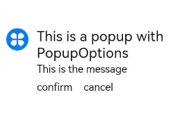
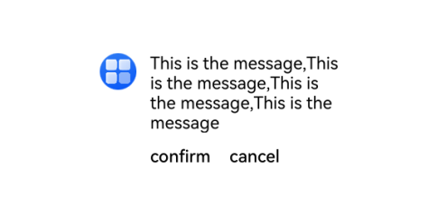

# Popup

Popup是用于显示特定样式气泡。

> **说明：**
>
> - 本模块同时支持ArkTS-Dyn、ArkTS-Sta。
>
> - 该组件从API version 11开始支持。后续版本如有新增内容，则采用上角标单独标记该内容的起始版本。
>
> - 该组件不支持在Wearable设备上使用。
>
> - 建议结合[Popup控制](ts-universal-attributes-popup.md)中的自定义气泡功能。

## 导入模块

```ts
import { Popup, PopupOptions, PopupTextOptions, PopupButtonOptions, PopupIconOptions } from '@kit.ArkUI';
```

##  子组件

无

## Popup

Popup(options: PopupOptions): void

**装饰器类型：**@Builder

**原子化服务API：** 从API version 12开始，该接口支持在原子化服务中使用。

**系统能力：** SystemCapability.ArkUI.ArkUI.Full

**ArkTS-Dyn起始版本：** 11

**ArkTS-Sta起始版本：** 23

**参数**：

| 参数名  | 类型                          | 必填 | 说明                  |
| ------- | ----------------------------- | ---- | --------------------- |
| options | [PopupOptions](#popupoptions) | 是   | 定义Popup组件的类型。 |

## PopupOptions

PopupOptions定义Popup的具体式样参数。

**系统能力：** SystemCapability.ArkUI.ArkUI.Full

| 名称        | 类型       | 必填        | 说明                            |
| ----------- | ---------- | ------| --------------------------------- |
| icon      | [PopupIconOptions](#popupiconoptions)                        | 否   | 设置popup图标。<br />**说明：**<br />当size设置异常值或0时不显示。<br/>**原子化服务API：** 从API version 12开始，该接口支持在原子化服务中使用。 <br/>**ArkTS-Dyn起始版本：** 11 <br/> **ArkTS-Sta起始版本：** 23 |
| title     | [PopupTextOptions](#popuptextoptions)                        | 否   | 设置popup标题文本。<br/>**原子化服务API：** 从API version 12开始，该接口支持在原子化服务中使用。 <br/>**ArkTS-Dyn起始版本：** 11 <br/> **ArkTS-Sta起始版本：** 23 |
| message   | [PopupTextOptions](#popuptextoptions)                        | 是   | 设置popup内容文本。<br />**说明：**<br />message不支持设置fontWeight。<br/>**原子化服务API：** 从API version 12开始，该接口支持在原子化服务中使用。<br /> **ArkTS模式：** 该接口仅适用于ArkTS-Dyn。<br/>**ArkTS-Dyn起始版本：** 11 |
| message<sup>23+</sup>   | [PopupTextOptions](#popuptextoptions)                        | 否   | 设置popup内容文本。<br />**说明：**<br />message不支持设置fontWeight。<br /> **ArkTS模式：** 该接口仅适用于ArkTS-Sta。<br/> **ArkTS-Sta起始版本：** 23 |
| showClose | boolean \| [Resource](ts-types.md#resource)                | 否   | 设置popup关闭按钮。值为true时，显示关闭按钮，值为false时，不显示关闭按钮。设置为Resource，显示对应的图标。<br />默认值：true<br/>**原子化服务API：** 从API version 12开始，该接口支持在原子化服务中使用。 <br/>**ArkTS-Dyn起始版本：** 11 <br/> **ArkTS-Sta起始版本：** 23 |
| onClose   | ArkTS-Dyn: () => void <br />  ArkTS-Sta : [Callback](ts-types.md#voidcallback12)                                                | 否   | 设置popup关闭按钮回调函数。<br/>**原子化服务API：** 从API version 12开始，该接口支持在原子化服务中使用。  <br/>**ArkTS-Dyn起始版本：** 11 <br/> **ArkTS-Sta起始版本：** 23 |
| buttons   | ArkTS-Dyn: [[PopupButtonOptions](#popupbuttonoptions)?,[PopupButtonOptions](#popupbuttonoptions)?]  <br />  ArkTS-Sta : [[PopupButtonOptions](#popupbuttonoptions) \| undefined,[PopupButtonOptions](#popupbuttonoptions) \| undefined]   | 否   | 设置popup操作按钮，按钮最多设置两个。<br/>**原子化服务API：** 从API version 12开始，该接口支持在原子化服务中使用。 <br/>**ArkTS-Dyn起始版本：** 11 <br/> **ArkTS-Sta起始版本：** 23 |
| direction<sup>12+</sup> | [Direction](ts-appendix-enums.md#direction)                                             | 否                                | 布局方向。<br/>默认值：Direction.Auto<br/>**原子化服务API：** 从API version 12开始，该接口支持在原子化服务中使用。 <br/>**ArkTS-Dyn起始版本：** 12 <br/> **ArkTS-Sta起始版本：** 23 |
| maxWidth<sup>18+</sup> | [Dimension](ts-types.md#dimension10)                                             | 否                                | 设置popup的最大宽度，通过此接口popup可以自定义宽度显示。<br />**说明：** <br />在使用引用资源类型时，规定其参数类型要与属性方法本身类型一致。maxWidth是数字类型，支持float和integer，例如$r('app.float.maxWidth')、$r('app.integer.maxWidth')。<br/>默认值：400vp<br/>**原子化服务API：** 从API version 18开始，该接口支持在原子化服务中使用。 <br/>**ArkTS-Dyn起始版本：** 18 <br/> **ArkTS-Sta起始版本：** 23 |

## PopupTextOptions

设置文本样式。

**原子化服务API：** 从API version 12开始，该接口支持在原子化服务中使用。

**系统能力：** SystemCapability.ArkUI.ArkUI.Full

| 名称       | 类型                                                         | 必填 | 说明         |
| ---------- | ------------------------------------------------------------ | ---- | ------------------ |
| text       | [ResourceStr](ts-types.md#resourcestr)                       | 是   | 设置文本内容。     <br /> **ArkTS模式：** 该接口仅适用于ArkTS-Dyn。<br/>**ArkTS-Dyn起始版本：** 11 |
| text<sup>23+</sup>       | [ResourceStr](ts-types.md#resourcestr)                       | 否   | 设置文本内容。     <br /> **ArkTS模式：** 该接口仅适用于ArkTS-Sta。<br/> **ArkTS-Sta起始版本：** 23|
| fontSize   | number \| string \| [Resource](ts-types.md#resource)         | 否   | 设置文本字体大小。<br />默认值：`$r('sys.float.ohos_id_text_size_body2')` <br/>string类型可选值：可以转化为数字的字符串（如'10'）或带长度单位的字符串（如'10px'），不支持设置百分比字符串。<br/>number：取值范围(0,+∞)。 <br/>**ArkTS-Dyn起始版本：** 11 <br/> **ArkTS-Sta起始版本：** 23|
| fontColor  | [ResourceColor](ts-types.md#resourcecolor)                   | 否   | 设置文本字体颜色。<br />默认值：`$r('sys.color.ohos_id_color_text_secondary')` <br/>**ArkTS-Dyn起始版本：** 11 <br/> **ArkTS-Sta起始版本：** 23|
| fontWeight | number \| [FontWeight](ts-appendix-enums.md#fontweight) \| string | 否   | 设置文本字体粗细。<br/>number类型取值[100,900]，取值间隔为100，默认为400，取值越大，字体越粗。<br/>string类型仅支持number类型取值的字符串形式，例如“400”，以及“bold”、“bolder”、“lighter”、“regular” 、“medium”分别对应FontWeight中相应的枚举值。<br />默认值：FontWeight.Regular <br/>**ArkTS-Dyn起始版本：** 11 <br/> **ArkTS-Sta起始版本：** 23|

## PopupButtonOptions

PopupButtonOptions定义按钮的相关属性和事件。

**原子化服务API：** 从API version 12开始，该接口支持在原子化服务中使用。

**系统能力：** SystemCapability.ArkUI.ArkUI.Full

| 名称      | 类型                                                 | 必填 | 说明                 |
| --------- | ---------------------------------------------------- | ---- | ---------------------- |
| text      | [ResourceStr](ts-types.md#resourcestr)               | 是   | 设置按钮内容。         <br /> **ArkTS模式：** 该接口仅适用于ArkTS-Dyn。<br/>**ArkTS-Dyn起始版本：** 11|
| text<sup>23+</sup>      | [ResourceStr](ts-types.md#resourcestr)               | 否   | 设置按钮内容。        <br /> **ArkTS模式：** 该接口仅适用于ArkTS-Sta。 <br/> **ArkTS-Sta起始版本：** 23|
| action    | ArkTS-Dyn: () => void <br />  ArkTS-Sta: [Callback](ts-types.md#voidcallback12)                                             | 否   | 设置按钮click回调。 <br/>**ArkTS-Dyn起始版本：** 11 <br/> **ArkTS-Sta起始版本：** 23|
| fontSize  | number \| string \| [Resource](ts-types.md#resource) | 否   | 设置按钮文本字体大小。 <br />默认值：`$r('sys.float.ohos_id_text_size_button2')` <br/>**ArkTS-Dyn起始版本：** 11 <br/> **ArkTS-Sta起始版本：** 23|
| fontColor | [ResourceColor](ts-types.md#resourcecolor)           | 否   | 设置按钮文本字体颜色。<br />默认值：`$r('sys.color.ohos_id_color_text_primary_activated')` <br/>**ArkTS-Dyn起始版本：** 11 <br/> **ArkTS-Sta起始版本：** 23|

##  PopupIconOptions

PopupIconOptions定义icon（左上角图标）的属性。

**原子化服务API：** 从API version 12开始，该接口支持在原子化服务中使用。

**系统能力：** SystemCapability.ArkUI.ArkUI.Full

| 名称         | 类型                                                         | 必填 | 说明                             |
| ------------ | ------------------------------------------------------------ | ---- | ---------------------------------- |
| image        | [ResourceStr](ts-types.md#resourcestr)                       | 是   | 设置图标内容。 <br /> **ArkTS模式：** 该接口仅适用于ArkTS-Dyn。<br/>**ArkTS-Dyn起始版本：** 11 |
| image<sup>23+</sup>        | [ResourceStr](ts-types.md#resourcestr)                       |  否   | 设置图标内容。<br /> **ArkTS模式：** 该接口仅适用于ArkTS-Sta。<br/> **ArkTS-Sta起始版本：** 23|
| width        | [Dimension](ts-types.md#dimension10)                         | 否   | 设置图标宽度。<br />默认值：32VP <br/>**ArkTS-Dyn起始版本：** 11 <br/> **ArkTS-Sta起始版本：** 23|
| height       | [Dimension](ts-types.md#dimension10)                         | 否   | 设置图标高度。<br />默认值：32VP <br/>**ArkTS-Dyn起始版本：** 11 <br/> **ArkTS-Sta起始版本：** 23|
| fillColor    | [ResourceColor](ts-types.md#resourcecolor)                   | 否   | 设置图标填充颜色。仅针对svg图源生效。<br/>**ArkTS-Dyn起始版本：** 11 <br/> **ArkTS-Sta起始版本：** 23|
| borderRadius | [Length](ts-types.md#length) \| [BorderRadiuses](ts-types.md#borderradiuses9) | 否   | 设置图标圆角。<br />默认值：`$r('sys.float.ohos_id_corner_radius_default_s')`  <br/>**ArkTS-Dyn起始版本：** 11 <br/> **ArkTS-Sta起始版本：** 23|

## 示例

### 示例1（设置气泡样式）

该示例通过配置PopupIconOptions、PopupTextOptions、PopupButtonOptions实现气泡的样式。

ArkTS-Dyn示例：

``` ts
// xxx.ets
import { Popup, PopupTextOptions, PopupButtonOptions, PopupIconOptions } from '@kit.ArkUI';

@Entry
@Component
struct PopupExample {
  build() {
    Row() {
      // popup 自定义高级组件
      Popup({
        // PopupIconOptions类型设置图标内容
        icon: {
          image: $r('app.media.icon'),
          width: 32,
          height: 32,
          fillColor: Color.White,
          borderRadius: 16
        } as PopupIconOptions,
        // PopupTextOptions类型设置文字内容
        title: {
          text: 'This is a popup with PopupOptions',
          fontSize: 20,
          fontColor: Color.Black,
          fontWeight: FontWeight.Normal
        } as PopupTextOptions,
        // PopupTextOptions类型设置文字内容
        message: {
          text: 'This is the message',
          fontSize: 15,
          fontColor: Color.Black
        } as PopupTextOptions,
        showClose: false,
        onClose: () => {
          console.info('close Button click');
        },
        // PopupButtonOptions类型设置按钮内容
        buttons: [{
          text: 'confirm',
          action: () => {
            console.info('confirm button click');
          },
          fontSize: 15,
          fontColor: Color.Black,
        },
          {
            text: 'cancel',
            action: () => {
              console.info('cancel button click');
            },
            fontSize: 15,
            fontColor: Color.Black
          },] as [PopupButtonOptions?, PopupButtonOptions?]
      })
    }
    .width(300)
    .height(200)
    .borderWidth(2)
    .justifyContent(FlexAlign.Center)
  }
}
```
ArkTS-Sta示例：

``` ts
// xxx.ets
import { Component, Row, Entry, FlexAlign, FontWeight, Color, $r } from '@ohos.arkui.component';
import { Popup, PopupOptions, PopupTextOptions, PopupIconOptions, PopupButtonOptions } from '@ohos.arkui.advanced.Popup';

@Entry
@Component
struct PopupExample {
  build() {
    Row() {
      // popup 自定义高级组件
      Popup({
        // PopupIconOptions类型设置图标内容
        icon: {
          image: $r('app.media.icon'),
          width: 32,
          height: 32,
          fillColor: Color.White,
          borderRadius: 16
        } as PopupIconOptions,
        // PopupTextOptions类型设置文字内容
        title: {
          text: 'This is a popup with PopupOptions',
          fontSize: 20,
          fontColor: Color.Black,
          fontWeight: FontWeight.Normal
        } as PopupTextOptions,
        // PopupTextOptions类型设置文字内容
        message: {
          text: 'This is the message',
          fontSize: 15,
          fontColor: Color.Black
        } as PopupTextOptions,
        showClose: false,
        onClose: () => {
          console.info('close Button click');
        },
        // PopupButtonOptions类型设置按钮内容
        buttons: [{
          text: 'confirm',
          action: () => {
            console.info('confirm button click');
          },
          fontSize: 15,
          fontColor: Color.Black,
        },
          {
            text: 'cancel',
            action: () => {
              console.info('cancel button click');
            },
            fontSize: 15,
            fontColor: Color.Black
          },] as [PopupButtonOptions | undefined, PopupButtonOptions | undefined]
      })
    }
    .width(300)
    .height(200)
    .borderWidth(2)
    .justifyContent(FlexAlign.Center)
  }
}
```


### 示例 2（设置镜像效果）
该示例通过配置direction参数实现Popup的镜像布局效果。

ArkTS-Dyn示例：

``` ts
// xxx.ets
import { Popup, PopupTextOptions, PopupButtonOptions, PopupIconOptions } from '@kit.ArkUI';

@Entry
@Component
struct PopupPage {
  @State currentDirection: Direction = Direction.Rtl;

  build() {
    Column() {
      // popup 自定义高级组件
      Popup({
        //PopupIconOptions 类型设置图标内容
        direction: this.currentDirection,
        icon: {
          image: $r('app.media.icon'),
          width: 32,
          height: 32,
          fillColor: Color.White,
          borderRadius: 16,
        } as PopupIconOptions,
        // PopupTextOptions 类型设置文字内容
        title: {
          text: 'This is a popup with PopupOptions',
          fontSize: 20,
          fontColor: Color.Black,
          fontWeight: FontWeight.Normal,

        } as PopupTextOptions,
        //PopupTextOptions 类型设置文字内容
        message: {
          text: 'This is the message',
          fontSize: 15,
          fontColor: Color.Black,
        } as PopupTextOptions,
        showClose: true,
        onClose: () => {
          console.info('close Button click');
        },
        // PopupButtonOptions 类型设置按钮内容
        buttons: [{
          text: 'confirm',
          action: () => {
            console.info('confirm button click');
          },
          fontSize: 15,
          fontColor: Color.Black,

        },
          {
            text: 'cancel',
            action: () => {
              console.info('cancel button click');
            },
            fontSize: 15,
            fontColor: Color.Black,
          },] as [PopupButtonOptions?, PopupButtonOptions?],
      })

    }
    .justifyContent(FlexAlign.Center)
    .width('100%')
    .height('100%')
  }
}
```
ArkTS-Sta示例：

``` ts
// xxx.ets
import { Component, Entry, Direction, Column, $r, Color, FontWeight, FlexAlign } from '@ohos.arkui.component';
import { State } from '@ohos.arkui.stateManagement';
import { Popup, PopupOptions,  PopupTextOptions,  PopupIconOptions,  PopupButtonOptions } from '@ohos.arkui.advanced.Popup';

@Entry
@Component
struct PopupPage {
  @State currentDirection: Direction = Direction.Rtl;

  build() {
    Column() {
      // popup 自定义高级组件
      Popup({
        //PopupIconOptions 类型设置图标内容
        direction: this.currentDirection,
        icon: {
          image: $r('app.media.icon'),
          width: 32,
          height: 32,
          fillColor: Color.White,
          borderRadius: 16,
        } as PopupIconOptions,
        // PopupTextOptions 类型设置文字内容
        title: {
          text: 'This is a popup with PopupOptions',
          fontSize: 20,
          fontColor: Color.Black,
          fontWeight: FontWeight.Normal,

        } as PopupTextOptions,
        //PopupTextOptions 类型设置文字内容
        message: {
          text: 'This is the message',
          fontSize: 15,
          fontColor: Color.Black,
        } as PopupTextOptions,
        showClose: true,
        onClose: () => {
          console.info('close Button click');
        },
        // PopupButtonOptions 类型设置按钮内容
        buttons: [{
          text: 'confirm',
          action: () => {
            console.info('confirm button click');
          },
          fontSize: 15,
          fontColor: Color.Black,

        },
          {
            text: 'cancel',
            action: () => {
              console.info('cancel button click');
            },
            fontSize: 15,
            fontColor: Color.Black,
          },] as [PopupButtonOptions | undefined, PopupButtonOptions | undefined],
      })

    }
    .justifyContent(FlexAlign.Center)
    .width('100%')
    .height('100%')
  }
}
```


### 示例3（设置自定义宽度）
该示例通过配置maxWidth实现Popup的自定义宽度效果。

ArkTS-Dyn示例：

``` ts
// xxx.ets
import { Popup, PopupTextOptions, PopupButtonOptions, PopupIconOptions } from '@kit.ArkUI';

@Entry
@Component
struct PopupPage {
  @State currentDirection: Direction = Direction.Rtl;

  build() {
    Row() {
      // popup 自定义高级组件
      Popup({
        //设置自定义宽度
        maxWidth: '50%',
        //PopupIconOptions 类型设置图标内容
        icon: {
          image: $r('app.media.startIcon'),
          width: 32,
          height: 32,
          fillColor: Color.White,
          borderRadius: 16,
        } as PopupIconOptions,
        // PopupTextOptions类型设置文字内容
        message: {
          text: 'This is the message,This is the message,This is the message,This is the message',
          fontSize: 15,
          fontColor: Color.Black
        } as PopupTextOptions,
        showClose: false,
        onClose: () => {
          console.info('close Button click');
        },
        // PopupButtonOptions类型设置按钮内容
        buttons: [{
          text: 'confirm',
          action: () => {
            console.info('confirm button click');
          },
          fontSize: 15,
          fontColor: Color.Black,
        },
          {
            text: 'cancel',
            action: () => {
              console.info('cancel button click');
            },
            fontSize: 15,
            fontColor: Color.Black
          },] as [PopupButtonOptions?, PopupButtonOptions?]
      })
    }
    .width(400)
    .height(200)
    .borderWidth(2)
    .justifyContent(FlexAlign.Center)
  }
}
```

ArkTS-Sta示例：

``` ts
// xxx.ets
import { Component, Row, Entry, FlexAlign, FontWeight, Color, $r, Direction } from '@ohos.arkui.component';
import { State } from '@ohos.arkui.stateManagement';
import { Popup,  PopupOptions,  PopupTextOptions,  PopupIconOptions,  PopupButtonOptions } from '@ohos.arkui.advanced.Popup';

@Entry
@Component
struct PopupPage {
  @State currentDirection: Direction = Direction.Rtl;

  build() {
    Row() {
      // popup 自定义高级组件
      Popup({
        //设置自定义宽度
        maxWidth: '50%',
        //PopupIconOptions 类型设置图标内容
        icon: {
          image: $r('app.media.startIcon'),
          width: 32,
          height: 32,
          fillColor: Color.White,
          borderRadius: 16,
        } as PopupIconOptions,
        // PopupTextOptions类型设置文字内容
        message: {
          text: 'This is the message,This is the message,This is the message,This is the message',
          fontSize: 15,
          fontColor: Color.Black
        } as PopupTextOptions,
        showClose: false,
        onClose: () => {
          console.info('close Button click');
        },
        // PopupButtonOptions类型设置按钮内容
        buttons: [{
          text: 'confirm',
          action: () => {
            console.info('confirm button click');
          },
          fontSize: 15,
          fontColor: Color.Black,
        },
          {
            text: 'cancel',
            action: () => {
              console.info('cancel button click');
            },
            fontSize: 15,
            fontColor: Color.Black
          },] as [PopupButtonOptions | undefined, PopupButtonOptions | undefined]
      })
    }
    .width(400)
    .height(200)
    .borderWidth(2)
    .justifyContent(FlexAlign.Center)
  }
}
```
