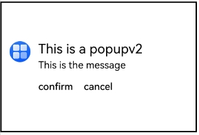
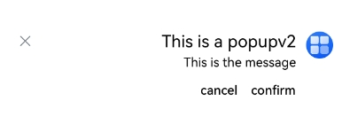
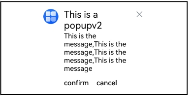

# PopupV2
<!--Kit: ArkUI-->
<!--Subsystem: ArkUI-->
<!--Owner: @liyi0309-->
<!--Designer: @liyi0309-->
<!--Tester: @lxl007-->
<!--Adviser: @Brilliantry_Rui-->

PopupV2用于显示特定样式的气泡。

该组件基于[状态管理（V2）](../../../ui/state-management/arkts-state-management-overview.md#状态管理v2)实现，相较于[状态管理（V1）](../../../ui/state-management/arkts-state-management-overview.md#状态管理v1)，状态管理（V2）增强了对数据对象的深度观察与管理能力，不再局限于组件层级。借助状态管理（V2），开发者可以通过该组件更灵活地控制显示特定样式的气泡，实现更高效的用户界面刷新。

**起始版本：** 26.0.0

## 导入模块

```ts
import { PopupV2, PopupV2Button, PopupV2InitInfo } from '@kit.ArkUI';
```

## 子组件

无

## PopupV2

PopupV2(options: PopupV2InitInfo): void

**起始版本：** 26.0.0

**装饰器类型：** @Builder

**原子化服务API：** 从API版本26.0.0开始，该接口支持在原子化服务中使用。

**系统能力：** SystemCapability.ArkUI.ArkUI.Full

**设备行为差异：** 该接口在Wearable设备上使用时，应用程序运行异常，异常信息中提示接口未定义，在其他设备中可正常调用。

**参数：**

| 参数名  | 类型                          | 必填 | 说明                  |
| ------- | ----------------------------- | ---- | --------------------- |
| options | [PopupV2InitInfo](#popupv2initinfo) | 是   | 定义PopupV2组件的配置参数。 |

## PopupV2InitInfo

定义PopupV2的具体样式参数。

**起始版本：** 26.0.0

**原子化服务API：** 从API版本26.0.0开始，该接口支持在原子化服务中使用。

**系统能力：** SystemCapability.ArkUI.ArkUI.Full

**设备行为差异：** 该接口在Wearable设备上使用时，应用程序运行异常，异常信息中提示接口未定义，在其他设备中可正常调用。

| 名称        | 类型       | 只读      | 可选      | 说明                            |
| ----------- | ---------- | ------| --------------------------------- | --------------------------------- |
| icon      | [ResourceStr](ts-types.md#resourcestr)                 | 否   | 是 | 设置PopupV2图标。<br/>**说明：** 默认值：''，不显示图标。  |
| title     | [ResourceStr](ts-types.md#resourcestr)                        | 否   | 是  | 设置PopupV2标题文本。<br/>**说明：** 默认值：''，不显示标题文本。 |
| message   | [ResourceStr](ts-types.md#resourcestr)                       | 是  | 否  | 设置PopupV2内容文本。<br/>**说明：** 默认值：''，不显示内容文本。|
| titleModifier      | [TextModifier](ts-universal-attributes-attribute-modifier.md#自定义modifier)                | 否   | 是 | 设置标题文本属性，如设置标题颜色、字体大小、字重等。<br/>默认值：undefined，使用系统标题文本属性。|
| iconModifier     | [ImageModifier](ts-universal-attributes-attribute-modifier.md#自定义modifier)                        | 否   | 是  | 设置图标属性，如图标颜色、大小、边框等。<br/>默认值：undefined，使用系统图标属性。|
| messageModifier   | [TextModifier](ts-universal-attributes-attribute-modifier.md#自定义modifier)                       | 否  | 是  | 设置内容文本属性，如设置内容文本颜色、字体大小、字重等。<br/>默认值：undefined，使用系统内容文本属性。|
| showClose | boolean \| [Resource](ts-types.md#resource)                | 否   | 是  | 设置PopupV2关闭按钮。true：显示关闭按钮；false：不显示关闭按钮。Resource类型：显示对应的图标。<br/>默认值：true|
| onClose   | Callback\<void\>                                                   | 否   | 是  | 设置PopupV2关闭按钮回调函数。<br/>默认不设置关闭按钮回调函数。|
| buttons   | [[PopupV2Button](#popupv2button)?,[PopupV2Button](#popupv2button)?] | 否   | 是  | 设置PopupV2操作按钮，按钮最多设置两个。默认不显示按钮。<br/>默认值：[{ text: '' }, { text: '' }] | 
| direction | [Direction](ts-appendix-enums.md#direction)                                             | 否                                | 是                               | 布局方向。<br/>默认值：Direction.Auto |
| maxWidth  | [Dimension](ts-types.md#dimension10)                                             | 否                                | 是                               |  设置PopupV2的最大宽度，通过此接口PopupV2可以自定义宽度显示。<br/>默认值：400vp<br/>**说明：** <br/>1. 在使用引用资源类型时，规定其参数类型要与属性方法本身类型一致。<br/>2. maxWidth是数字类型，支持float和整型，例如`$r('app.float.maxWidth')`、`$r('app.integer.maxWidth')`。<br/>3. 当类型为Resource时，如果未设置单位，默认单位为px。 |


## PopupV2Button

PopupV2Button定义按钮的相关属性和事件。

**起始版本：** 26.0.0

**原子化服务API：** 从API版本26.0.0开始，该接口支持在原子化服务中使用。

**系统能力：** SystemCapability.ArkUI.ArkUI.Full

**设备行为差异：** 该接口在Wearable设备上使用时，应用程序运行异常，异常信息中提示接口未定义，在其他设备中可正常调用。

| 名称      | 类型                                                 | 只读 | 可选 | 说明                 |
| --------- | ---------------------------------------------------- | ---- | ---------------------- | ---------------------- |
| text      | [ResourceStr](ts-types.md#resourcestr)               | 否  | 否  | 设置按钮内容。         |
| action    | Callback\<void\>                                            | 否   | 是  | 设置按钮点击回调。<br/>默认不执行任何操作。 |
| buttonTextModifier  | [TextModifier](ts-universal-attributes-attribute-modifier.md#自定义modifier) | 否   | 是  | 设置按钮文本属性，如设置文本颜色、字体大小等。默认值：undefined，值为undefined时，默认使用系统按钮文本属性。**模型约束**：此接口仅可在Stage模型下使用。 |

## 示例

### 示例1（设置气泡样式）

该示例通过配置[titleModifier](#popupv2initinfo)、[messageModifier](#popupv2initinfo)、[PopupV2Button](#popupv2button)实现气泡样式。

从API版本26.0.0开始，新增titleModifier、messageModifier、PopupV2Button。

```ts
// xxx.ets
import { PopupV2, PopupV2Button } from '@kit.ArkUI';
import { ImageModifier, TextModifier } from '@kit.ArkUI';

@Entry
@ComponentV2
struct PopupExample {

  build() {
    Row() {
      // PopupV2自定义高级组件
      PopupV2 ({
        // 请开发者替换为实际的资源文件
        icon:  $r('app.media.startIcon'),
        iconModifier: new ImageModifier().width(32).height(32).fillColor(Color.White).borderRadius(16),
        title: 'This is a popupv2',
        titleModifier: new TextModifier().fontSize(20).fontColor(Color.Black).fontWeight(FontWeight.Normal),
        message:  'This is the message',
        messageModifier: new TextModifier().fontSize(15).fontColor(Color.Black),
        showClose: false,
        onClose: () => {
          console.info('close Button click');
        },
        buttons: [{
          text: 'confirm',
          action: () => {
            console.info('confirm button click');
          },
          buttonTextModifier: new TextModifier().fontSize(15).fontColor(Color.Black)
        },
          {
            text: 'cancel',
            action: () => {
              console.info('cancel button click');
            },
            buttonTextModifier: new TextModifier().fontSize(15).fontColor(Color.Black)
          }] as [PopupV2Button| undefined, PopupV2Button|undefined]
      })
    }
    .width(300)
    .height(200)
    .borderWidth(2)
    .justifyContent(FlexAlign.Center)
  }
}
```



### 示例2（设置镜像效果）

该示例通过配置[direction](#popupv2initinfo)实现镜像布局效果。

从API版本26.0.0开始，新增direction参数。

```ts
// xxx.ets
import { PopupV2, PopupV2Button } from '@kit.ArkUI';
import { ImageModifier, TextModifier } from '@kit.ArkUI';

@Entry
@ComponentV2
struct PopupExample {

  build() {
    Column() {
      // PopupV2自定义高级组件
      PopupV2 ({
        direction: Direction.Rtl,
        // 请开发者替换为实际的资源文件
        icon:  $r('app.media.startIcon'),
        iconModifier: new ImageModifier().width(32).height(32).fillColor(Color.White).borderRadius(16),
        title: 'This is a popupv2',
        titleModifier: new TextModifier().fontSize(20).fontColor(Color.Black).fontWeight(FontWeight.Normal),
        message:  'This is the message',
        messageModifier: new TextModifier().fontSize(15).fontColor(Color.Black),
        showClose: true,
        onClose: () => {
          console.info('close Button click');
        },
        buttons: [{
          text: 'confirm',
          action: () => {
            console.info('confirm button click');
          },
          buttonTextModifier: new TextModifier().fontSize(15).fontColor(Color.Black)
        },
          {
            text: 'cancel',
            action: () => {
              console.info('cancel button click');
            },
            buttonTextModifier: new TextModifier().fontSize(15).fontColor(Color.Black)
          }] as [PopupV2Button| undefined, PopupV2Button|undefined]
      })
    }
    .width('100%')
    .height('100%')
    .justifyContent(FlexAlign.Center)
  }
}
```



### 示例3（设置自定义宽度）

该示例通过配置[maxWidth](#popupv2initinfo)实现自定义宽度效果。

从API版本26.0.0开始，新增maxWidth参数。

```ts
// xxx.ets
import { PopupV2, PopupV2Button } from '@kit.ArkUI';
import { ImageModifier, TextModifier } from '@kit.ArkUI';

@Entry
@ComponentV2
struct PopupExample {

  build() {
    Row() {
      // PopupV2自定义高级组件
      PopupV2 ({
        maxWidth: '50%',
        // 请开发者替换为实际的资源文件
        icon:  $r('app.media.startIcon'),
        iconModifier: new ImageModifier().width(32).height(32).fillColor(Color.White).borderRadius(16),
        title: 'This is a popupv2',
        titleModifier: new TextModifier().fontSize(20).fontColor(Color.Black).fontWeight(FontWeight.Normal),
        message:  'This is the message, This is the message, This is the message, This is the message',
        messageModifier: new TextModifier().fontSize(15).fontColor(Color.Black),
        showClose: true,
        onClose: () => {
          console.info('close Button click');
        },
        buttons: [{
          text: 'confirm',
          action: () => {
            console.info('confirm button click');
          },
          buttonTextModifier: new TextModifier().fontSize(15).fontColor(Color.Black)
        },
          {
            text: 'cancel',
            action: () => {
              console.info('cancel button click');
            },
            buttonTextModifier: new TextModifier().fontSize(15).fontColor(Color.Black)
          }] as [PopupV2Button| undefined, PopupV2Button|undefined]
      })
    }
    .width(400)
    .height(200)
    .borderWidth(2)
    .justifyContent(FlexAlign.Center)
  }
}
```



