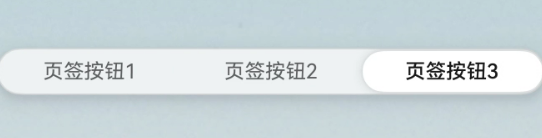

# SegmentButton(系统接口)

<!--Kit: ArkUI-->
<!--Subsystem: ArkUI-->
<!--Owner: @xieziang-->
<!--Designer: @youzhi92-->
<!--Tester: @TerryTsao-->
<!--Adviser: @Brilliantry_Rui-->

分段按钮组件，包含页签类分段按钮、胶囊类单选分段按钮、胶囊类多选分段按钮。

>**说明：**
>
>- 该组件从API version 11开始支持。后续版本如有新增内容，则采用上角标单独标记该内容的起始版本。
>
>- 该组件不支持在Wearable设备上使用。
>
>- 该组件仅支持2到5个按钮。
>
>- 当前页面仅包含本模块的系统接口，其他公开接口参见[SegmentButton](ohos-arkui-advanced-SegmentButton.md)。


## 导入模块

```ts
import { SegmentButton, SegmentButtonOptions, SegmentButtonItemOptionsArray } from '@kit.ArkUI';
```


## SegmentButtonOptions

>**说明：** 
> 
> 不支持设置字体类型。

分段按钮选项类，用于为分段按钮提供初始数据和自定义属性。

**装饰器类型：** @Observed

**系统接口：** 此接口为系统接口。

**系统能力：** SystemCapability.ArkUI.ArkUI.Full

**模型约束：** 此接口仅可在Stage模型下使用。

| 名称 | 类型 | 只读 | 可选 | 说明 |
| -------- | -------- | -------- | -------- | -------- |
| backgroundSystemMaterial<sup>23+</sup> | uiMaterial.Material  | 否 | 是 | 分段按钮组件的背景板的系统材质。不同系统材质包含不同的属性影响效果。<br/>默认值：无材质效果|

## CommonSegmentButtonOptions

用于定义分段按钮组件可自定义的属性。

**系统接口：** 此接口为系统接口。

**系统能力：** SystemCapability.ArkUI.ArkUI.Full

**模型约束：** 此接口仅可在Stage模型下使用。

| 名称 | 类型 | 只读 | 可选 | 说明 |
| -------- | -------- | -------- | -------- | -------- |
| backgroundSystemMaterial<sup>23+</sup> | uiMaterial.Material | 否 | 是 | 分段按钮组件的背景板的系统材质。不同系统材质包含不同的属性影响效果。<br/>默认值：无材质效果|


## 示例

### 示例1（设置背景板材质）
以下示例通过backgroundSystemMaterial属性，为分段按钮设置了半透明的背景板材质。

从API version 23开始，[SegmentButtonOptions](#segmentbuttonoptions)和[CommonSegmentButtonOptions](#commonsegmentbuttonoptions)中新增backgroundSystemMaterial属性。

```ts
import {
  ItemRestriction,
  SegmentButton,
  SegmentButtonOptions,
  SegmentButtonTextItem
} from '@kit.ArkUI';
import uiMaterial from '@ohos.arkui.uiMaterial';


@Entry
@Component
struct IndexCl {
  @State tabOptions: SegmentButtonOptions = SegmentButtonOptions.tab({
    buttons: [{ text: '页签按钮1' }, { text: '页签按钮2' }, {
      text: '页签按钮3'
    }] as ItemRestriction<SegmentButtonTextItem>,
    backgroundColor: Color.Transparent,
    // 设置为半透明材质
    backgroundSystemMaterial: new uiMaterial.Material({ type: uiMaterial.MaterialType.SEMI_TRANSPARENT } as uiMaterial.MaterialOptions)
  });

  @State tabSelectedIndexes: number[] = [1];

  build() {
    Stack() {
      // 替换为真实图片
      Image($r('app.media.pic'))
      Column() {
        SegmentButton({
          options: this.tabOptions,
          selectedIndexes: $tabSelectedIndexes
        })
      }
    }
  }
}

```

