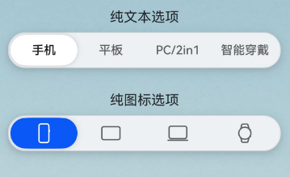

# SegmentButtonV2(系统接口)

<!--Kit: ArkUI-->
<!--Subsystem: ArkUI-->
<!--Owner: @xieziang-->
<!--Designer: @youzhi92-->
<!--Tester: @TerryTsao-->
<!--Adviser: @Brilliantry_Rui-->

分段按钮组件用于创建页签型、单选或多选的胶囊型分段按钮。

> **说明：**
>
> - 该组件从API version 18开始支持。后续版本如有新增内容，则采用上角标单独标记该内容的起始版本。
>
> - 当前页面仅包含本模块的系统接口，其他公开接口参见[SegmentButtonV2](ohos-arkui-advanced-SegmentButtonV2.md)。

## 导入模块

```ts
import { TabSegmentButtonV2, CapsuleSegmentButtonV2, MultiCapsuleSegmentButtonV2, SegmentButtonV2Items } from '@kit.ArkUI';
```

## TabSegmentButtonV2

页签型分段按钮。

**装饰器类型：** @ComponentV2

**系统能力：** SystemCapability.ArkUI.ArkUI.Full

**模型约束：** 此接口仅可在Stage模型下使用。

**设备行为差异：** 该接口在Wearable设备上使用时，应用程序运行异常，异常信息中提示接口未定义，在其他设备中可正常调用。

| 名称 | 类型  | 必填 | 装饰器类型 | 说明 |
| -------------------------------- | -------------------------------------------------------------------------------------------------------------------------------------------------------------- | ---- | ------------------ | ------------------------------------------------------------------------------------------------------------------------------------------------------------------------------------------------------------------------------------------------------------------------------------------------------------------------------------------------------------------- |
| backgroundSystemMaterial<sup>23+</sup> | [uiMaterial.Material](../arkts-apis-uimaterial-sys.md#material) | 否 | @Param | 分段按钮组件的背景板的系统材质。不同系统材质包含不同的属性影响效果。<br/>默认值：无材质效果 <br>该成员只读，不支持更改。<br>**系统接口：** 此接口为系统接口。|

## CapsuleSegmentButtonV2

胶囊型分段按钮。

**装饰器类型：** @ComponentV2

**系统能力：** SystemCapability.ArkUI.ArkUI.Full

**模型约束：** 此接口仅可在Stage模型下使用。

**设备行为差异：** 该接口在Wearable设备上使用时，应用程序运行异常，异常信息中提示接口未定义，在其他设备中可正常调用。

| 名称 | 类型  | 必填 | 装饰器类型 | 说明 |
| -------------------------------- | -------------------------------------------------------------------------------------------------------------------------------------------------------------- | ---- | ------------------ | ------------------------------------------------------------------------------------------------------------------------------------------------------------------------------------------------------------------------------------------------------------------------------------------------------------------------------------------------------------------- |
| backgroundSystemMaterial<sup>23+</sup> | [uiMaterial.Material](../arkts-apis-uimaterial-sys.md#material)  | 否 | @Param | 分段按钮组件的背景板的系统材质。不同系统材质包含不同的属性影响效果。<br/>默认值：无材质效果 <br>该成员只读，不支持更改。<br>**系统接口：** 此接口为系统接口。|

## 示例

### 示例1（设置背景板材质）
以下示例通过backgroundSystemMaterial属性，为分段按钮设置了半透明的背景板材质。

从API version 23开始，[TabSegmentButtonV2](#tabsegmentbuttonv2)和[CapsuleSegmentButtonV2](#capsulesegmentbuttonv2)中新增backgroundSystemMaterial属性。

```ts
import { SegmentButtonV2Items, TabSegmentButtonV2, CapsuleSegmentButtonV2 } from '@kit.ArkUI';
import uiMaterial from '@ohos.arkui.uiMaterial';

@Entry
@ComponentV2
struct TabSegmentButtonV2Example {
  @Local textItems: SegmentButtonV2Items = new SegmentButtonV2Items([
    { text: '手机' },
    { text: '平板' },
    { text: 'PC/2in1' },
    { text: '智能穿戴' },
  ]);
  @Local textSelectedIndex: number = 0;

  @Local imageItems: SegmentButtonV2Items = new SegmentButtonV2Items([
    { icon: $r('sys.media.ohos_ic_public_device_phone') },
    { icon: $r('sys.media.ohos_ic_public_device_pad') },
    { icon: $r('sys.media.ohos_ic_public_device_matebook') },
    { icon: $r('sys.media.ohos_ic_public_device_watch') },
  ]);
  @Local imageSelectedIndex: number = 0;

  build() {
    Scroll() {
      Stack() {
        // 作为分段按钮的背景，其中('app.media.pic')需要替换为开发者所需的图片
        Image($r('app.media.pic'))
        Column({ space: 12 }) {
          VCard({ title: '纯文本选项' }) {
            TabSegmentButtonV2({
              items: this.textItems,
              selectedIndex: this.textSelectedIndex!!,
              // 设置为半透明材质
              backgroundSystemMaterial:
              new uiMaterial.Material({ type: uiMaterial.MaterialType.SEMI_TRANSPARENT } as uiMaterial.MaterialOptions)
            })
          }

          VCard({ title: '纯文本选项' }) {
            CapsuleSegmentButtonV2({
              items: this.imageItems,
              selectedIndex: this.imageSelectedIndex!!,
              // 设置为半透明材质
              backgroundSystemMaterial:
              new uiMaterial.Material({ type: uiMaterial.MaterialType.SEMI_TRANSPARENT } as uiMaterial.MaterialOptions)
            })
          }

        }
        .constraintSize({ minHeight: '100%' })
        .justifyContent(FlexAlign.Start)
        .padding(16)
      }
      .backgroundColor('#f1f3f5')
      .width('100%')
      .height('100%')
    }
  }
}

@Builder
function Noop() {
}

@Component
export struct VCard {
  @Prop
  title: ResourceStr;
  @BuilderParam
  content: () => void = Noop;

  build() {
    Column({ space: 8 }) {
      if (this.title) {
        Text(this.title)
          .maxLines(1)
          .textOverflow({ overflow: TextOverflow.Ellipsis })
          .constraintSize({ maxWidth: '80%' })
      }
      this.content()
    }
    .backgroundColor(Color.Transparent)
    .borderRadius(8)
    .padding(8)
    .width('100%')
  }
}
```

