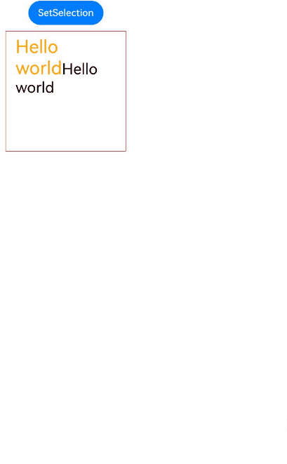
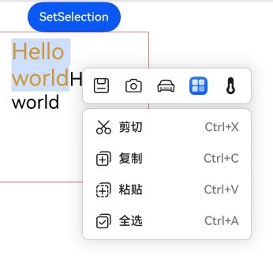
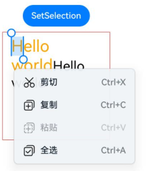

# SelectionMenu
<!--Kit: ArkUI-->
<!--Subsystem: ArkUI-->
<!--Owner: @hddgzw-->
<!--Designer: @xiangyuan6-->
<!--Tester: @jiaoaozihao-->
<!--Adviser: @Brilliantry_Rui-->


文本选择菜单，适用于[RichEditor](ts-basic-components-richeditor.md)组件通过[bindSelectionMenu](ts-basic-components-richeditor.md#bindselectionmenu)或[Text](ts-basic-components-text.md)组件通过[bindSelectionMenu](ts-basic-components-text.md#bindselectionmenu11)绑定自定义文本选择菜单，支持编辑菜单和扩展下拉菜单两种类型，可通过配置实现复制、粘贴、剪切、全选等内置功能，也可通过自定义菜单项和事件回调实现扩展功能。建议绑定鼠标右键或鼠标选中方式弹出，不支持作为普通组件单独使用。适用于富文本编辑场景，可为用户提供便捷的文本操作入口，提升文本编辑效率。


> **说明：**
>
> - 该组件从API version 11开始支持。后续版本的新增接口，采用上角标单独标记接口的起始版本。
>
> - 本模块接口仅可在Stage模型下使用。


## 导入模块

```ts
import { SelectionMenu, EditorMenuOptions, ExpandedMenuOptions, EditorEventInfo, SelectionMenuOptions } from '@kit.ArkUI';
```

## 子组件

无。

## SelectionMenu

SelectionMenu(options: SelectionMenuOptions): void

入参为空时，文本选择菜单组件SelectionMenu内容区大小及组件大小为零。例如，富文本组件[RichEditor](ts-basic-components-richeditor.md)使用[bindSelectionMenu](ts-basic-components-richeditor.md#bindselectionmenu)接口绑定一个SelectionMenu的右键菜单，则右键富文本组件区域时无任何菜单弹出。

**装饰器类型：**[@Builder](../../../ui/state-management/arkts-builder.md)

**原子化服务API：** 从API version 12开始，该接口支持在原子化服务中使用。

**系统能力：** SystemCapability.ArkUI.ArkUI.Full

**设备行为差异：** 该接口在Wearable设备上使用时，应用程序运行异常， 异常信息中提示接口未定义，在其他设备中可正常调用。

**参数：**

| 参数名 | 类型 | 必填 | 说明 |
| -------- | -------- | -------- | -------- |
| options | [SelectionMenuOptions](#selectionmenuoptions) | 是 | 文本选择菜单配置选项，用于配置编辑菜单、扩展下拉菜单、富文本控制器以及复制粘贴剪切等回调事件。 |

## SelectionMenuOptions

SelectionMenuOptions定义SelectionMenu的可选菜单类型项及其配置参数。

**系统能力：** SystemCapability.ArkUI.ArkUI.Full

**设备行为差异：** 该接口在Wearable设备上使用时，应用程序运行异常，异常信息中提示接口未定义，在其他设备中可正常调用。

<!--Table: 20%; 20%; 8%; 8%; 44%-->
| 名称 | 类型 | 只读 | 可选 | 说明 |
| -------- | -------- | -------- | -------- | -------- |
| editorMenuOptions | Array&lt;[EditorMenuOptions](#editormenuoptions)&gt; | 否 | 是 | 编辑菜单。<br>editorMenuOptions未配置时，不显示编辑菜单。<br>同时配置EditorMenuOptions中action和builder时，点击图标会同时响应。<br>点击编辑菜单图标默认不关闭整个菜单，应用可以通过action接口配置RichEditorController的closeSelectionMenu主动关闭菜单。<br>**原子化服务API：** 从API version 12开始，该接口支持在原子化服务中使用。 |
| expandedMenuOptions | Array&lt;[ExpandedMenuOptions](#expandedmenuoptions)&gt; | 否 | 是 | 扩展下拉菜单。<br>expandedMenuOptions参数为空时无更多按钮，不显示扩展下拉菜单。<br>expandedMenuOptions参数不为空时显示更多按钮，配置菜单项收起在更多按钮中，点击更多按钮展示。<br>controller为空时不显示更多按钮，expandedMenuOptions参数不为空则在下拉菜单中显示。<br>**原子化服务API：** 从API version 12开始，该接口支持在原子化服务中使用。 |
| controller | [RichEditorController](ts-basic-components-richeditor.md#richeditorcontroller) | 否 | 是 | 富文本控制器不为空时显示默认系统菜单（包含剪切复制粘贴等部分）且默认菜单功能内置。<br>controller为空时不显示更多按钮，expandedMenuOptions参数不为空则在下拉菜单中显示。<br>系统默认只支持复制粘贴富文本内容，图文混排需要应用自定义onCopy、onPaste接口。应用自行配置onCopy \| onPaste接口时，系统菜单默认复制粘贴失效，调用应用自定义函数。 <br>**说明：**<br> 点击自定义文本选择菜单内置复制功能选项后，自定义菜单消失选中文本高亮保留。<br> 点击自定义文本选择菜单内置全选功能选项后，自定义菜单消失文本全选高亮。<br> 点击自定义文本选择菜单内置粘贴功能选项后，空白处粘贴或者选中文本替换粘贴均是保留被复制文本的样式。<br> 当富文本组件[RichEditor](ts-basic-components-richeditor.md)的copyOptions属性设置为`CopyOptions.None`时，内置的复制剪切功能不会被限制。<br>**原子化服务API：** 从API version 12开始，该接口支持在原子化服务中使用。|
| onCopy | (event?: [EditorEventInfo](#editoreventinfo))&nbsp;=&gt;&nbsp;void | 否 | 是 | 替代内置系统菜单复制项的事件回调。<br>生效前提是一定要有controller参数，有系统默认菜单才能替换内置复制功能。<br>**说明：**<br> event为返回信息。<br>**原子化服务API：** 从API version 12开始，该接口支持在原子化服务中使用。 |
| onPaste | (event?: [EditorEventInfo](#editoreventinfo))&nbsp;=&gt;&nbsp;void | 否 | 是 | 替代内置系统菜单粘贴项的事件回调。<br>生效前提是一定要有controller参数，有系统默认菜单才能替换内置粘贴功能。<br>**说明：**<br> event为返回信息。<br>**原子化服务API：** 从API version 12开始，该接口支持在原子化服务中使用。 |
| onCut | (event?: [EditorEventInfo](#editoreventinfo))&nbsp;=&gt;&nbsp;void | 否 | 是 | 替代内置系统菜单剪切项的事件回调。<br>生效前提是一定要有controller参数，有系统默认菜单才能替换内置剪切功能。<br>**说明：**<br>event为返回信息。<br>**原子化服务API：** 从API version 12开始，该接口支持在原子化服务中使用。|
| onSelectAll | (event?: [EditorEventInfo](#editoreventinfo))&nbsp;=&gt;&nbsp;void | 否 | 是 | 替代内置系统菜单全选项的事件回调。<br>生效前提是一定要有controller参数，有系统默认菜单才能替换内置全选功能。<br>**说明：**<br>event为返回信息。<br>**原子化服务API：** 从API version 12开始，该接口支持在原子化服务中使用。|
| backgroundSystemMaterial | [uiMaterial.Material](../arkts-apis-uimaterial.md#material)    | 否 | 是 | 菜单背景板使用的系统材质，用于实现菜单背景的视觉效果（如模糊、透明度等）。不同系统材质包含不同的属性，影响最终的显示效果。具体材质类型及属性请参考[uiMaterial.Material](../arkts-apis-uimaterial.md#material)。默认值：undefined，无材质效果。<br>**起始版本：** 26.0.0 <br>**原子化服务API：** 从API版本26.0.0开始，该接口支持在原子化服务中使用。<br>**模型约束：** 此接口仅可在Stage模型下使用。 |

## EditorMenuOptions

编辑菜单选项。

**系统能力：** SystemCapability.ArkUI.ArkUI.Full

**设备行为差异：** 该接口在Wearable设备上使用时，应用程序运行异常，异常信息中提示接口未定义，在其他设备中可正常调用。

| 名称 | 类型 | 只读 | 可选 | 说明 |
| -------- | -------- | -------- | -------- | -------- |
| icon | [ResourceStr](ts-types.md#resourcestr) | 否 | 否 | 编辑菜单项的图标资源。若同时设置symbolStyle，则本属性不生效。<br>**原子化服务API：** 从API version 12开始，该接口支持在原子化服务中使用。 |
| builder | ()&nbsp;=&gt;&nbsp;void | 否 | 是 | 点击时显示用户自定义组件，自定义组件在构造时结合@Builder使用。不设置时不显示自定义组件。<br>**原子化服务API：** 从API version 12开始，该接口支持在原子化服务中使用。 |
| action | ()&nbsp;=&gt;&nbsp;void | 否 | 是 | 点击菜单项的事件回调。同时配置builder和action时，点击图标会同时响应。不设置时点击无响应。<br>**原子化服务API：** 从API version 12开始，该接口支持在原子化服务中使用。 |
| symbolStyle<sup>18+</sup> | [SymbolGlyphModifier](ts-universal-attributes-text-style.md#symbolglyphmodifier12) | 否 | 是 | Symbol图标资源。当需要使用系统Symbol图标（支持动态颜色、多色等高级特性）时传入此参数，不传入时使用icon属性指定的图标资源。优先级大于icon，同时设置时优先使用symbolStyle。<br>**原子化服务API：** 从API version 18开始，该接口支持在原子化服务中使用。 |


## ExpandedMenuOptions

扩展下拉菜单。

继承自[MenuItemOptions](ts-basic-components-menuitem.md#menuitemoptions对象说明)。

**原子化服务API：** 从API version 12开始，该接口支持在原子化服务中使用。

**系统能力：** SystemCapability.ArkUI.ArkUI.Full

**设备行为差异：** 该接口在Wearable设备上使用时，应用程序运行异常，异常信息中提示接口未定义，在其他设备中可正常调用。

| 名称 | 类型 | 只读 | 可选 | 说明 |
| -------- | -------- | -------- | -------- | -------- |
| action | ()&nbsp;=&gt;&nbsp;void | 否 | 是 | 点击菜单项的事件回调。不设置时点击无响应。 |

## EditorEventInfo

选中内容信息。

**原子化服务API：** 从API version 12开始，该接口支持在原子化服务中使用。

**系统能力：** SystemCapability.ArkUI.ArkUI.Full

**设备行为差异：** 该接口在Wearable设备上使用时，应用程序运行异常，异常信息中提示接口未定义，在其他设备中可正常调用。

| 名称 | 类型 | 只读 | 可选 | 说明 |
| -------- | -------- | -------- | -------- | -------- |
| content | [RichEditorSelection](ts-basic-components-richeditor.md#richeditorselection) | 否 | 是 | 选中的内容信息，包含选中的文本或图片片段（spans）及选择范围（selection）。 |

## 属性

不支持[通用属性](ts-component-general-attributes.md)，宽度默认224vp， 高度自适应内容。

## 事件
不支持[通用事件](ts-component-general-events.md)。

## 示例
### 示例1（绑定不同触发方式的自定义文本选择菜单）

该示例展示了文本绑定不同触发方式的自定义文本选择菜单的效果。

```ts
import {
  SelectionMenu,
  EditorMenuOptions,
  ExpandedMenuOptions,
  EditorEventInfo,
  SelectionMenuOptions
} from '@kit.ArkUI';

@Entry
@Component
struct Index {
  controller: RichEditorController = new RichEditorController();
  options: RichEditorOptions = { controller: this.controller };
  @State message: string = 'Hello world';
  @State textSize: number = 30;
  @State start: number = -1;
  @State end: number = -1;
  @State textStyle: RichEditorTextStyle = {};
  private editorMenuOptions: Array<EditorMenuOptions> =
    [
      {
        // $r('app.media.ic_notepad_textbold')需要替换为开发者所需的图像资源文件。
        icon: $r('app.media.ic_notepad_textbold'), action: () => {
        if (this.controller) {
          let selection = this.controller.getSelection();
          let spans = selection.spans;
          spans.forEach((item: RichEditorTextSpanResult | RichEditorImageSpanResult, index) => {
            if (typeof (item as RichEditorTextSpanResult)['textStyle'] != 'undefined') {
              let span = item as RichEditorTextSpanResult;
              this.textStyle = span.textStyle;
              let start = span.offsetInSpan[0];
              let end = span.offsetInSpan[1];
              let offset = span.spanPosition.spanRange[0];
              // 判断当前是否加粗，切换加粗/取消加粗样式
              if (this.textStyle.fontWeight != FontWeight.Bold) {
                this.textStyle.fontWeight = FontWeight.Bolder;
              } else {
                this.textStyle.fontWeight = FontWeight.Normal;
              }
              this.controller.updateSpanStyle({
                start: offset + start,
                end: offset + end,
                textStyle: this.textStyle
              })
            }
          })
        }
      }
      },
      {
        // $r('app.media.ic_notepad_texttilt')需要替换为开发者所需的图像资源文件。
        icon: $r('app.media.ic_notepad_texttilt'), action: () => {
        if (this.controller) {
          let selection = this.controller.getSelection();
          let spans = selection.spans;
          spans.forEach((item: RichEditorTextSpanResult | RichEditorImageSpanResult, index) => {
            if (typeof (item as RichEditorTextSpanResult)['textStyle'] != 'undefined') {
              let span = item as RichEditorTextSpanResult;
              this.textStyle = span.textStyle;
              let start = span.offsetInSpan[0];
              let end = span.offsetInSpan[1];
              let offset = span.spanPosition.spanRange[0];
              // 判断当前是否斜体，切换斜体/取消斜体样式
              if (this.textStyle.fontStyle == FontStyle.Italic) {
                this.textStyle.fontStyle = FontStyle.Normal;
              } else {
                this.textStyle.fontStyle = FontStyle.Italic;
              }
              this.controller.updateSpanStyle({
                start: offset + start,
                end: offset + end,
                textStyle: this.textStyle
              })
            }
          })
        }
      }
      },
      {
        // $r('app.media.ic_notepad_underline')需要替换为开发者所需的图像资源文件。
        icon: $r('app.media.ic_notepad_underline'),
        action: () => {
          if (this.controller) {
            let selection = this.controller.getSelection();
            let spans = selection.spans;
            spans.forEach((item: RichEditorTextSpanResult | RichEditorImageSpanResult, index) => {
              if (typeof (item as RichEditorTextSpanResult)['textStyle'] != 'undefined') {
                let span = item as RichEditorTextSpanResult;
                this.textStyle = span.textStyle;
                let start = span.offsetInSpan[0];
                let end = span.offsetInSpan[1];
                let offset = span.spanPosition.spanRange[0];
                if (this.textStyle.decoration) {
                  // 判断当前是否有下划线，切换下划线/取消下划线样式
                  if (this.textStyle.decoration.type == TextDecorationType.Underline) {
                    this.textStyle.decoration.type = TextDecorationType.None;
                  } else {
                    this.textStyle.decoration.type = TextDecorationType.Underline;
                  }
                } else {
                  this.textStyle.decoration = { type: TextDecorationType.Underline, color: Color.Black }
                }
                this.controller.updateSpanStyle({
                  start: offset + start,
                  end: offset + end,
                  textStyle: this.textStyle
                })
              }
            })
          }
        }
      },
      {
        // $r('app.media.ic_notepad_fontsize')需要替换为开发者所需的图像资源文件。
        icon: $r('app.media.ic_notepad_fontsize'), action: () => {
      }, builder: (): void => this.sliderPanel()
      },
      {
        // $r('app.media.ic_notepad_textcolor')需要替换为开发者所需的图像资源文件。
        icon: $r('app.media.ic_notepad_textcolor'), action: () => {
        if (this.controller) {
          let selection = this.controller.getSelection();
          let spans = selection.spans;
          spans.forEach((item: RichEditorTextSpanResult | RichEditorImageSpanResult, index) => {
            if (typeof (item as RichEditorTextSpanResult)['textStyle'] != 'undefined') {
              let span = item as RichEditorTextSpanResult;
              this.textStyle = span.textStyle;
              let start = span.offsetInSpan[0];
              let end = span.offsetInSpan[1];
              let offset = span.spanPosition.spanRange[0];
              // 判断当前是否为橙色（枚举值或十六进制字符串），切换橙色/黑色样式
              if (this.textStyle.fontColor == Color.Orange || this.textStyle.fontColor == '#FFFFA500') {
                this.textStyle.fontColor = Color.Black;
              } else {
                this.textStyle.fontColor = Color.Orange;
              }
              this.controller.updateSpanStyle({
                start: offset + start,
                end: offset + end,
                textStyle: this.textStyle
              })
            }
          })
        }
      }
      }]
  private expandedMenuOptions: Array<ExpandedMenuOptions> =
    [{
      // $r('app.media.startIcon')需要替换为开发者所需的图像资源文件。
      startIcon: $r('app.media.startIcon'), content: '词典', action: () => {
      }
    }, {
      // $r('app.media.startIcon')需要替换为开发者所需的图像资源文件。
      startIcon: $r('app.media.startIcon'), content: '翻译', action: () => {
      }
    }, {
      // $r('app.media.startIcon')需要替换为开发者所需的图像资源文件。
      startIcon: $r('app.media.startIcon'), content: '搜索', action: () => {
      }
    }]
  private expandedMenuOptions1: Array<ExpandedMenuOptions> = [];
  private selectionMenuOptions: SelectionMenuOptions = {
    editorMenuOptions: this.editorMenuOptions,
    expandedMenuOptions: this.expandedMenuOptions,
    controller: this.controller,
    onCut: (event?: EditorEventInfo) => {
      if (event && event.content) {
        event.content.spans.forEach((item: RichEditorTextSpanResult | RichEditorImageSpanResult, index) => {
          if (typeof (item as RichEditorTextSpanResult)['textStyle'] != 'undefined') {
            let span = item as RichEditorTextSpanResult;
            console.info('test onCut' + span.value);
            console.info('test start ' + span.offsetInSpan[0] + ' end: ' + span.offsetInSpan[1]);
          }
        })
      }
    },
    onPaste: (event?: EditorEventInfo) => {
      if (event && event.content) {
        event.content.spans.forEach((item: RichEditorTextSpanResult | RichEditorImageSpanResult, index) => {
          if (typeof (item as RichEditorTextSpanResult)['textStyle'] != 'undefined') {
            let span = item as RichEditorTextSpanResult;
            console.info('test onPaste' + span.value);
            console.info('test start ' + span.offsetInSpan[0] + ' end: ' + span.offsetInSpan[1]);
          }
        })
      }
    },
    onCopy: (event?: EditorEventInfo) => {
      if (event && event.content) {
        event.content.spans.forEach((item: RichEditorTextSpanResult | RichEditorImageSpanResult, index) => {
          if (typeof (item as RichEditorTextSpanResult)['textStyle'] != 'undefined') {
            let span = item as RichEditorTextSpanResult;
            console.info('test onCopy' + span.value);
            console.info('test start ' + span.offsetInSpan[0] + ' end: ' + span.offsetInSpan[1]);
          }
        })
      }
    },
    onSelectAll: (event?: EditorEventInfo) => {
      if (event && event.content) {
        event.content.spans.forEach((item: RichEditorTextSpanResult | RichEditorImageSpanResult, index) => {
          if (typeof (item as RichEditorTextSpanResult)['textStyle'] != 'undefined') {
            let span = item as RichEditorTextSpanResult;
            console.info('test onSelectAll' + span.value);
            console.info('test start ' + span.offsetInSpan[0] + ' end: ' + span.offsetInSpan[1]);
          }
        })
      }
    }
  };

  @Builder
  sliderPanel() {
    Column() {
      Flex({ justifyContent: FlexAlign.SpaceBetween, alignItems: ItemAlign.Center }) {
        Text('A').fontSize(15)
        Slider({ value: this.textSize, step: 10, style: SliderStyle.InSet })
          .width(210)
          .onChange((value: number, mode: SliderChangeMode) => {
            if (this.controller) {
              let selection = this.controller.getSelection();
              // 滑块拖动结束时，获取当前选中文本的最大字体大小作为起始值
              if (mode == SliderChangeMode.End) {
                if (this.textSize == undefined) {
                  this.textSize = 0;
                }
                let spans = selection.spans;
                spans.forEach((item: RichEditorTextSpanResult | RichEditorImageSpanResult, index) => {
                  if (typeof (item as RichEditorTextSpanResult)['textStyle'] != 'undefined') {
                    this.textSize = Math.max(this.textSize, (item as RichEditorTextSpanResult).textStyle.fontSize);
                  }
                })
              }
              // 滑块拖动中或点击时，实时更新选中文本的字体大小
              if (mode == SliderChangeMode.Moving || mode == SliderChangeMode.Click) {
                this.start = selection.selection[0];
                this.end = selection.selection[1];
                this.textSize = value;
                this.controller.updateSpanStyle({
                  start: this.start,
                  end: this.end,
                  textStyle: { fontSize: this.textSize }
                })
              }
            }
          })
        Text('A').fontSize(20).fontWeight(FontWeight.Medium)
      }.borderRadius($r('sys.float.ohos_id_corner_radius_card'))
    }
    .shadow(ShadowStyle.OUTER_DEFAULT_MD)
    .backgroundColor(Color.White)
    .borderRadius($r('sys.float.ohos_id_corner_radius_card'))
    .padding(15)
    .height(48)
  }

  @Builder
  MyMenu() {
    Column() {
      SelectionMenu(this.selectionMenuOptions)
    }
    .width(256)
    .backgroundColor(Color.Transparent)
  }

  @Builder
  MyMenu2() {
    Column() {
      SelectionMenu({
        editorMenuOptions: this.editorMenuOptions,
        expandedMenuOptions: this.expandedMenuOptions1,
        controller: this.controller,
      })
    }
    .width(256)
    .backgroundColor(Color.Transparent)
  }

  @Builder
  MyMenu3() {
    Column() {
      SelectionMenu({
        editorMenuOptions: this.editorMenuOptions,
        expandedMenuOptions: this.expandedMenuOptions,
        controller: this.controller,
      })
    }
    .width(256)
    .backgroundColor(Color.Transparent)
  }

  build() {
    Column() {
      Button('SetSelection')
        .onClick((event: ClickEvent) => {
          if (this.controller) {
            this.controller.setSelection(0, 2);
          }
        })

      RichEditor(this.options)
        .onReady(() => {
          this.controller.addTextSpan(this.message, { style: { fontColor: Color.Orange, fontSize: 30 } });
          this.controller.addTextSpan(this.message, { style: { fontColor: Color.Black, fontSize: 25 } });
        })
        .onSelect((value: RichEditorSelection) => {
          if (value.selection[0] == -1 && value.selection[1] == -1) {
            return;
          }
          this.start = value.selection[0];
          this.end = value.selection[1];
        })
        // 绑定鼠标右键操作自定义菜单
        .bindSelectionMenu(RichEditorSpanType.TEXT, this.MyMenu3(), RichEditorResponseType.RIGHT_CLICK)
        // 绑定鼠标选中操作自定义菜单
        .bindSelectionMenu(RichEditorSpanType.TEXT, this.MyMenu2(), RichEditorResponseType.SELECT)
        .borderWidth(1)
        .borderColor(Color.Red)
        .width(200)
        .height(200)
        .margin(10)
    }
  }
}
```
> **说明：**
>
> 系统暂未预置加粗、斜体等图标，示例代码使用本地资源图标，开发者使用时需自行替换editorMenuOptions中icon项的资源。
>
> 示例图为鼠标操作触发的自定义菜单弹出效果。



### 示例2（设置Symbol类型图标）

从API version 18开始，该示例通过设置[EditorMenuOptions](#editormenuoptions)的属性symbolStyle，展示了自定义Symbol类型图标。

```ts
import {
  SelectionMenu,
  EditorMenuOptions,
  ExpandedMenuOptions,
  EditorEventInfo,
  SelectionMenuOptions,
  SymbolGlyphModifier
} from '@kit.ArkUI'

@Entry
@Component
struct Index {
  controller: RichEditorController = new RichEditorController();
  options: RichEditorOptions = { controller: this.controller };
  @State message: string = 'Hello world';
  @State textSize: number = 30;
  @State start: number = -1;
  @State end: number = -1;
  @State textStyle: RichEditorTextStyle = {};
  private editorMenuOptions: Array<EditorMenuOptions> =
    [
      {
        icon: $r('sys.media.wifi_router_fill'),
        symbolStyle: new SymbolGlyphModifier($r('sys.symbol.save')),
        action: () => {
          if (this.controller) {
            let selection = this.controller.getSelection();
            let spans = selection.spans;
            spans.forEach((item: RichEditorTextSpanResult | RichEditorImageSpanResult, index) => {
              if (typeof (item as RichEditorTextSpanResult)['textStyle'] != 'undefined') {
                let span = item as RichEditorTextSpanResult;
                this.textStyle = span.textStyle;
                let start = span.offsetInSpan[0];
                let end = span.offsetInSpan[1];
                let offset = span.spanPosition.spanRange[0];
                // 判断当前是否加粗，切换加粗/取消加粗样式
                if (this.textStyle.fontWeight != FontWeight.Bold) {
                  this.textStyle.fontWeight = FontWeight.Bolder;
                } else {
                  this.textStyle.fontWeight = FontWeight.Normal;
                }
                this.controller.updateSpanStyle({
                  start: offset + start,
                  end: offset + end,
                  textStyle: this.textStyle
                })
              }
            })
          }
        }
      },
      {
        icon: $r('sys.media.save_button_picture'),
        symbolStyle: new SymbolGlyphModifier($r('sys.symbol.camera')),
        action: () => {
          if (this.controller) {
            let selection = this.controller.getSelection();
            let spans = selection.spans;
            spans.forEach((item: RichEditorTextSpanResult | RichEditorImageSpanResult, index) => {
              if (typeof (item as RichEditorTextSpanResult)['textStyle'] != 'undefined') {
                let span = item as RichEditorTextSpanResult;
                this.textStyle = span.textStyle;
                let start = span.offsetInSpan[0];
                let end = span.offsetInSpan[1];
                let offset = span.spanPosition.spanRange[0];
                // 判断当前是否斜体，切换斜体/取消斜体样式
                if (this.textStyle.fontStyle == FontStyle.Italic) {
                  this.textStyle.fontStyle = FontStyle.Normal;
                } else {
                  this.textStyle.fontStyle = FontStyle.Italic;
                }
                this.controller.updateSpanStyle({
                  start: offset + start,
                  end: offset + end,
                  textStyle: this.textStyle
                })
              }
            })
          }
        }
      },
      {
        icon: $r('sys.media.waveform_folder_fill'),
        symbolStyle: new SymbolGlyphModifier($r('sys.symbol.car')),
        action: () => {
          if (this.controller) {
            let selection = this.controller.getSelection();
            let spans = selection.spans;
            spans.forEach((item: RichEditorTextSpanResult | RichEditorImageSpanResult, index) => {
              if (typeof (item as RichEditorTextSpanResult)['textStyle'] != 'undefined') {
                let span = item as RichEditorTextSpanResult;
                this.textStyle = span.textStyle;
                let start = span.offsetInSpan[0];
                let end = span.offsetInSpan[1];
                let offset = span.spanPosition.spanRange[0];
                if (this.textStyle.decoration) {
                  // 判断当前是否有下划线，切换下划线/取消下划线样式
                  if (this.textStyle.decoration.type == TextDecorationType.Underline) {
                    this.textStyle.decoration.type = TextDecorationType.None;
                  } else {
                    this.textStyle.decoration.type = TextDecorationType.Underline;
                  }
                } else {
                  this.textStyle.decoration = { type: TextDecorationType.Underline, color: Color.Black }
                }
                this.controller.updateSpanStyle({
                  start: offset + start,
                  end: offset + end,
                  textStyle: this.textStyle
                })
              }
            })
          }
        }
      },
      {
        // $r('app.media.app_icon')需要替换为开发者所需的图像资源文件。
        icon: $r('app.media.app_icon'), action: () => {
      }, builder: (): void => this.sliderPanel()
      },
      {
        icon: $r('sys.media.thermometer_fill'), action: () => {
        if (this.controller) {
          let selection = this.controller.getSelection();
          let spans = selection.spans;
          spans.forEach((item: RichEditorTextSpanResult | RichEditorImageSpanResult, index) => {
            if (typeof (item as RichEditorTextSpanResult)['textStyle'] != 'undefined') {
              let span = item as RichEditorTextSpanResult;
              this.textStyle = span.textStyle;
              let start = span.offsetInSpan[0];
              let end = span.offsetInSpan[1];
              let offset = span.spanPosition.spanRange[0];
              // 判断当前是否为橙色（枚举值或十六进制字符串），切换橙色/黑色样式
              if (this.textStyle.fontColor == Color.Orange || this.textStyle.fontColor == '#FFFFA500') {
                this.textStyle.fontColor = Color.Black;
              } else {
                this.textStyle.fontColor = Color.Orange;
              }
              this.controller.updateSpanStyle({
                start: offset + start,
                end: offset + end,
                textStyle: this.textStyle
              })
            }
          })
        }
      }
      }]
  private expandedMenuOptions: Array<ExpandedMenuOptions> =
    [{
      // $r('app.media.startIcon')需要替换为开发者所需的图像资源文件。
      startIcon: $r('app.media.startIcon'), content: '词典', action: () => {
      }
    }, {
      // $r('app.media.startIcon')需要替换为开发者所需的图像资源文件。
      startIcon: $r('app.media.startIcon'), content: '翻译', action: () => {
      }
    }, {
      // $r('app.media.startIcon')需要替换为开发者所需的图像资源文件。
      startIcon: $r('app.media.startIcon'), content: '搜索', action: () => {
      }
    }]
  private expandedMenuOptions1: Array<ExpandedMenuOptions> = []
  private editorMenuOptions1: Array<EditorMenuOptions> = []
  private selectionMenuOptions: SelectionMenuOptions = {
    editorMenuOptions: this.editorMenuOptions,
    expandedMenuOptions: this.expandedMenuOptions,
    controller: this.controller,
    onCut: (event?: EditorEventInfo) => {
      if (event && event.content) {
        event.content.spans.forEach((item: RichEditorTextSpanResult | RichEditorImageSpanResult, index) => {
          if (typeof (item as RichEditorTextSpanResult)['textStyle'] != 'undefined') {
            let span = item as RichEditorTextSpanResult;
            console.info('test onCut' + span.value);
            console.info('test start ' + span.offsetInSpan[0] + ' end: ' + span.offsetInSpan[1]);
          }
        })
      }
    },
    onPaste: (event?: EditorEventInfo) => {
      if (event && event.content) {
        event.content.spans.forEach((item: RichEditorTextSpanResult | RichEditorImageSpanResult, index) => {
          if (typeof (item as RichEditorTextSpanResult)['textStyle'] != 'undefined') {
            let span = item as RichEditorTextSpanResult;
            console.info('test onPaste' + span.value);
            console.info('test start ' + span.offsetInSpan[0] + ' end: ' + span.offsetInSpan[1]);
          }
        })
      }
    },
    onCopy: (event?: EditorEventInfo) => {
      if (event && event.content) {
        event.content.spans.forEach((item: RichEditorTextSpanResult | RichEditorImageSpanResult, index) => {
          if (typeof (item as RichEditorTextSpanResult)['textStyle'] != 'undefined') {
            let span = item as RichEditorTextSpanResult;
            console.info('test onCopy' + span.value);
            console.info('test start ' + span.offsetInSpan[0] + ' end: ' + span.offsetInSpan[1]);
          }
        })
      }
    },
    onSelectAll: (event?: EditorEventInfo) => {
      if (event && event.content) {
        event.content.spans.forEach((item: RichEditorTextSpanResult | RichEditorImageSpanResult, index) => {
          if (typeof (item as RichEditorTextSpanResult)['textStyle'] != 'undefined') {
            let span = item as RichEditorTextSpanResult;
            console.info('test onSelectAll' + span.value);
            console.info('test start ' + span.offsetInSpan[0] + ' end: ' + span.offsetInSpan[1]);
          }
        })
      }
    }
  }

  @Builder
  sliderPanel() {
    Column() {
      Flex({ justifyContent: FlexAlign.SpaceBetween, alignItems: ItemAlign.Center }) {
        Text('A').fontSize(15)
        Slider({ value: this.textSize, step: 10, style: SliderStyle.InSet })
          .width(210)
          .onChange((value: number, mode: SliderChangeMode) => {
            if (this.controller) {
              let selection = this.controller.getSelection();
              // 滑块拖动结束时，获取当前选中文本的最大字体大小作为起始值
              if (mode == SliderChangeMode.End) {
                if (this.textSize == undefined) {
                  this.textSize = 0;
                }
                let spans = selection.spans;
                spans.forEach((item: RichEditorTextSpanResult | RichEditorImageSpanResult, index) => {
                  if (typeof (item as RichEditorTextSpanResult)['textStyle'] != 'undefined') {
                    this.textSize = Math.max(this.textSize, (item as RichEditorTextSpanResult).textStyle.fontSize);
                  }
                })
              }
              // 滑块拖动中或点击时，实时更新选中文本的字体大小
              if (mode == SliderChangeMode.Moving || mode == SliderChangeMode.Click) {
                this.start = selection.selection[0];
                this.end = selection.selection[1];
                this.textSize = value;
                this.controller.updateSpanStyle({
                  start: this.start,
                  end: this.end,
                  textStyle: { fontSize: this.textSize }
                })
              }
            }
          })
        Text('A').fontSize(20).fontWeight(FontWeight.Medium)
      }.borderRadius($r('sys.float.ohos_id_corner_radius_card'))
    }
    .shadow(ShadowStyle.OUTER_DEFAULT_MD)
    .backgroundColor(Color.White)
    .borderRadius($r('sys.float.ohos_id_corner_radius_card'))
    .padding(15)
    .height(48)
  }

  @Builder
  MyMenu() {
    Column() {
      SelectionMenu(this.selectionMenuOptions)
    }
    .width(256)
    .backgroundColor(Color.Transparent)
  }

  @Builder
  MyMenu2() {
    Column() {
      SelectionMenu({
        editorMenuOptions: this.editorMenuOptions,
        expandedMenuOptions: this.expandedMenuOptions1,
        controller: this.controller,
      })
    }
    .width(256)
    .backgroundColor(Color.Transparent)
  }

  @Builder
  MyMenu3() {
    Column() {
      SelectionMenu({
        editorMenuOptions: this.editorMenuOptions1,
        expandedMenuOptions: this.expandedMenuOptions,
        controller: this.controller,
      })
    }
    .width(256)
    .backgroundColor(Color.Transparent)
  }

  build() {
    Column() {
      Button('SetSelection')
        .onClick((event: ClickEvent) => {
          if (this.controller) {
            this.controller.setSelection(0, 2);
          }
        })

      RichEditor(this.options)
        .onReady(() => {
          this.controller.addTextSpan(this.message, { style: { fontColor: Color.Orange, fontSize: 30 } });
          this.controller.addTextSpan(this.message, { style: { fontColor: Color.Black, fontSize: 25 } });
        })
        .onSelect((value: RichEditorSelection) => {
          if (value.selection[0] == -1 && value.selection[1] == -1) {
            return;
          }
          this.start = value.selection[0];
          this.end = value.selection[1];
        })
        .bindSelectionMenu(RichEditorSpanType.TEXT, this.MyMenu3(), RichEditorResponseType.RIGHT_CLICK)
        .bindSelectionMenu(RichEditorSpanType.TEXT, this.MyMenu2(), RichEditorResponseType.SELECT)
        .borderWidth(1)
        .borderColor(Color.Red)
        .width(200)
        .height(200)
    }
  }
}
```



### 示例3（设置背景板材质）

该示例通过设置[SelectionMenuOptions](#selectionmenuoptions)的属性backgroundSystemMaterial，展示了超薄样式的背景板材质。

从API版本26.0.0开始，SelectionMenuOptions新增backgroundSystemMaterial属性。

```ts
import {
  SelectionMenu, EditorEventInfo, SelectionMenuOptions
} from '@kit.ArkUI';

import { uiMaterial } from '@kit.ArkUI';

@Entry
@Component
struct Index {
  controller: RichEditorController = new RichEditorController();
  options: RichEditorOptions = { controller: this.controller };
  @State message: string = 'Hello world';
  @State textStyle: RichEditorTextStyle = {};
  private selectionMenuOptions: SelectionMenuOptions = {
    controller: this.controller,
    onCut: (event?: EditorEventInfo) => {
      if (event && event.content) {
        event.content.spans.forEach((item: RichEditorTextSpanResult | RichEditorImageSpanResult, index) => {
          if (typeof (item as RichEditorTextSpanResult)['textStyle'] != 'undefined') {
            let span = item as RichEditorTextSpanResult;
            console.info('test onCut' + span.value);
            console.info('test start ' + span.offsetInSpan[0] + ' end: ' + span.offsetInSpan[1]);
          }
        })
      }
    },
    onPaste: (event?: EditorEventInfo) => {
      if (event && event.content) {
        event.content.spans.forEach((item: RichEditorTextSpanResult | RichEditorImageSpanResult, index) => {
          if (typeof (item as RichEditorTextSpanResult)['textStyle'] != 'undefined') {
            let span = item as RichEditorTextSpanResult;
            console.info('test onPaste' + span.value);
            console.info('test start ' + span.offsetInSpan[0] + ' end: ' + span.offsetInSpan[1]);
          }
        })
      }
    },
    onCopy: (event?: EditorEventInfo) => {
      if (event && event.content) {
        event.content.spans.forEach((item: RichEditorTextSpanResult | RichEditorImageSpanResult, index) => {
          if (typeof (item as RichEditorTextSpanResult)['textStyle'] != 'undefined') {
            let span = item as RichEditorTextSpanResult;
            console.info('test onCopy' + span.value);
            console.info('test start ' + span.offsetInSpan[0] + ' end: ' + span.offsetInSpan[1]);
          }
        })
      }
    },
    onSelectAll: (event?: EditorEventInfo) => {
      if (event && event.content) {
        event.content.spans.forEach((item: RichEditorTextSpanResult | RichEditorImageSpanResult, index) => {
          if (typeof (item as RichEditorTextSpanResult)['textStyle'] != 'undefined') {
            let span = item as RichEditorTextSpanResult;
            console.info('test onSelectAll' + span.value);
            console.info('test start ' + span.offsetInSpan[0] + ' end: ' + span.offsetInSpan[1]);
          }
        })
      }
    },
    // 使用系统材质，以超薄样式为例
    backgroundSystemMaterial: new uiMaterial.ImmersiveMaterial({
      style: uiMaterial.ImmersiveStyle.ULTRA_THIN
    })
  };

  @Builder
  MyMenu() {
    Column() {
      SelectionMenu(this.selectionMenuOptions)
    }
    .width(256)
    .backgroundColor(Color.Transparent)
  }

  build() {
    Column() {
      Button('SetSelection')
        .onClick((event: ClickEvent) => {
          if (this.controller) {
            this.controller.setSelection(0, 2);
          }
        })

      RichEditor(this.options)
        .onReady(() => {
          this.controller.addTextSpan(this.message, { style: { fontColor: Color.Orange, fontSize: 30 } });
          this.controller.addTextSpan(this.message, { style: { fontColor: Color.Black, fontSize: 25 } });
        })
        .onSelect((value: RichEditorSelection) => {
          if (value.selection[0] == -1 && value.selection[1] == -1) {
            return;
          }
        })
        .bindSelectionMenu(RichEditorSpanType.TEXT, this.MyMenu(), RichEditorResponseType.RIGHT_CLICK)
        .bindSelectionMenu(RichEditorSpanType.TEXT, this.MyMenu(), RichEditorResponseType.LONG_PRESS)
        .borderWidth(1)
        .borderColor(Color.Red)
        .width(200)
        .height(200)
        .margin(10)
    }
  }
}
```

