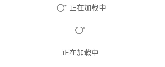

# SwipeRefresherV2
<!--Kit: ArkUI-->
<!--Subsystem: ArkUI-->
<!--Owner: @wangrunsen-->
<!--Designer: @YanSanzo-->
<!--Tester: @ybhou1993-->
<!--Adviser: @Brilliantry_Rui-->


SwipeRefresherV2组件用于内容加载，内容加载指获取内容并加载出来，常用于衔接展示下拉加载的内容。

该组件基于[状态管理（V2）](../../../ui/state-management/arkts-state-management-overview.md#状态管理v2)实现，相较于[状态管理（V1）](../../../ui/state-management/arkts-state-management-overview.md#状态管理v1)，状态管理（V2）增强了对数据对象的深度观察与管理能力，不再局限于组件层级。借助状态管理（V2），开发者可以通过该组件更灵活地控制内容加载的数据和状态，实现更高效的用户界面刷新。

> **说明：**
>
> - 该组件仅可在Stage模型下使用。
>
> - 如果SwipeRefresherV2设置[通用属性](ts-component-general-attributes.md)和[通用事件](ts-component-general-events.md)，编译工具链会额外生成节点__Common__，并将通用属性或通用事件挂载在__Common__上，而不是直接应用到SwipeRefresherV2本身。这可能导致开发者设置的通用属性或通用事件不生效或不符合预期，因此，不建议SwipeRefresherV2设置通用属性和通用事件。

**起始版本：** 26.0.0

## 导入模块

```ts
import { SwipeRefresherV2 } from '@kit.ArkUI';
```


## 子组件

无

## SwipeRefresherV2

SwipeRefresherV2 ({content?: ResourceStr, isLoading: boolean})

实现下拉刷新功能。当用户下拉页面时，会触发内容加载操作，即从数据源获取新内容并动态展示在界面中。

**起始版本：** 26.0.0

**装饰器类型：** \@ComponentV2

**模型约束：** 此接口仅可在Stage模型下使用。

**原子化服务API：** 从API版本26.0.0开始，该接口支持在原子化服务中使用。

**系统能力：** SystemCapability.ArkUI.ArkUI.Full

**设备行为差异：** 本接口实际支持的设备类型范围（Phone、PC/2in1、Tablet、TV）小于其所属系统能力支持的设备类型范围（Phone、PC/2in1、Tablet、TV、Wearable）。因硬件能力限制，该接口在Wearable设备中调用将运行异常，异常信息中提示接口未定义。

| 名称 | 类型 | 必填 | 装饰器类型 | 说明      |
| -------- | -------- | -------- | -------- |----------|
| content | [ResourceStr](ts-types.md#resourcestr) | 否 | \@Param | 内容加载时显示的文本。<br/>默认值：空字符串。<br/>**说明**：如果文本大于列宽时，文本被截断。 |
| isLoading | boolean | 是 | \@Require<br/>\@Param | 当前内容是否正在加载。<br> true：内容正在加载。<br> false：内容未在加载。 |

## 事件
不支持[通用事件](ts-component-general-events.md)。

## 示例

从API版本26.0.0开始，支持SwipeRefresherV2。如下示例展示SwipeRefresherV2设置属性content为空字符串或不为空、isLoading为true和false的不同加载效果。

```ts
import { SwipeRefresherV2 } from '@kit.ArkUI';

@Entry
@ComponentV2
struct Index {
  build(): void {
    Column() {
      SwipeRefresherV2({
        content: '正在加载中',
        isLoading: true
      })
      SwipeRefresherV2({
        content: '',
        isLoading: true
      })
      SwipeRefresherV2({
        content: '正在加载中',
        isLoading: false
      })
    }
  }
}
```

