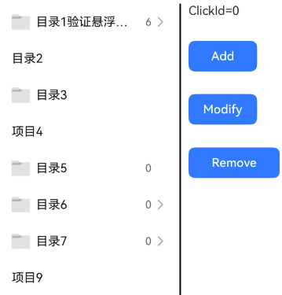
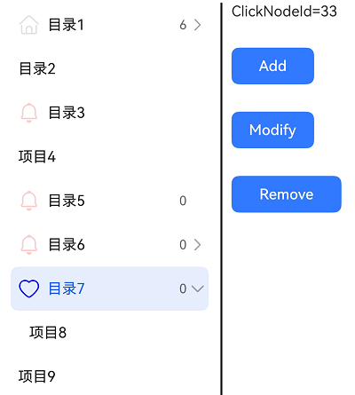

# TreeViewV2
<!--Kit: ArkUI-->
<!--Subsystem: ArkUI-->
<!--Owner: @wangrunsen-->
<!--Designer: @YanSanzo-->
<!--Tester: @ybhou1993-->
<!--Adviser: @Brilliantry_Rui-->


树视图V2组件。树视图作为一种分层显示的列表，适合显示嵌套结构。拥有父列表项和子列表项，可展开或折叠。

用于效率型应用，如备忘录、电子邮件、图库中的侧边导航栏。

该组件基于[状态管理（V2）](../../../ui/state-management/arkts-state-management-overview.md#状态管理v2)实现，相较于[状态管理（V1）](../../../ui/state-management/arkts-state-management-overview.md#状态管理v1)，状态管理（V2）增强了对数据对象的深度观察与管理能力，不再局限于组件层级。借助状态管理（V2），开发者可以通过该组件更灵活地控制树视图的数据和状态，实现更高效的用户界面刷新。

> **说明：**
>
> - 本模块接口仅可在Stage模型下使用。
>
> - 如果TreeViewV2设置[通用属性](ts-component-general-attributes.md)和[通用事件](ts-component-general-events.md)，编译工具链会额外生成节点__Common__，并将通用属性或通用事件挂载在__Common__上，而不是直接应用到TreeViewV2本身。这可能导致开发者设置的通用属性或通用事件不生效或不符合预期，因此，不建议TreeViewV2设置通用属性和通用事件。

**起始版本：** 26.0.0

## 导入模块

```ts
import { TreeViewV2 } from '@kit.ArkUI';
```

## 子组件

无

## TreeViewV2

TreeViewV2({ treeControllerV2: TreeControllerV2 })

树视图作为一种分层显示的列表，用于树形结构的组件显示。

**起始版本：** 26.0.0

**装饰器类型：** \@ComponentV2

**模型约束：** 此接口仅可在Stage模型下使用。

**原子化服务API：** 从API版本26.0.0开始，该接口支持在原子化服务中使用。

**系统能力：** SystemCapability.ArkUI.ArkUI.Full

**设备行为差异：** 本接口实际支持的设备类型范围（Phone、PC/2in1、Tablet、TV）小于其所属系统能力支持的设备类型范围（Phone、PC/2in1、Tablet、TV、Wearable）。因硬件能力限制，该接口在Wearable设备中调用将运行异常，异常信息中提示接口未定义。


| 名称 | 类型 | 必填 | 装饰器类型 | 说明 |
| -------- | -------- | -------- | -------- | -------- |
| treeControllerV2 | [TreeControllerV2](#treecontrollerv2) | 是 | @Param | 树视图节点控制器。 |


## TreeControllerV2

树视图组件的控制器，可以将此对象绑定至树视图组件，然后通过它控制树的节点信息，同一个控制器不可以控制多个树视图组件。

### addNode

addNode(nodeParam?: NodeParamV2): TreeControllerV2

点击某个节点后，调用该方法可以触发新增子节点。

**起始版本：** 26.0.0

**模型约束：** 此接口仅可在Stage模型下使用。

**原子化服务API：** 从API版本26.0.0开始，该接口支持在原子化服务中使用。

**系统能力：** SystemCapability.ArkUI.ArkUI.Full

**设备行为差异：** 本接口实际支持的设备类型范围（Phone、PC/2in1、Tablet、TV）小于其所属系统能力支持的设备类型范围（Phone、PC/2in1、Tablet、TV、Wearable）。因硬件能力限制，该接口在Wearable设备中调用将运行异常，异常信息中提示接口未定义。

**参数：**

| 参数名  | 类型 | 必填 | 说明 |
| -------- | -------- | -------- | -------- |
| nodeParam | [NodeParamV2](#nodeparamv2) | 否 | 节点信息，用于指定新增节点的属性。如果不传该参数，在当前选中的节点下添加一个标题为"新建文件夹"的节点。 |

**返回值：** 

| 类型                              | 说明                 |
| --------------------------------- | -------------------- |
| [TreeControllerV2](#treecontrollerv2) | 树视图组件的控制器。 |

### removeNode

removeNode(): void

点击某个节点后，调用该方法可以触发删除该节点。

**起始版本：** 26.0.0

**模型约束：** 此接口仅可在Stage模型下使用。

**原子化服务API：** 从API版本26.0.0开始，该接口支持在原子化服务中使用。

**系统能力：** SystemCapability.ArkUI.ArkUI.Full

**设备行为差异：** 本接口实际支持的设备类型范围（Phone、PC/2in1、Tablet、TV）小于其所属系统能力支持的设备类型范围（Phone、PC/2in1、Tablet、TV、Wearable）。因硬件能力限制，该接口在Wearable设备中调用将运行异常，异常信息中提示接口未定义。

### modifyNode

modifyNode(): void

点击某个节点后，调用该方法可以触发修改该节点，该节点进入编辑态。

**起始版本：** 26.0.0

**模型约束：** 此接口仅可在Stage模型下使用。

**原子化服务API：** 从API版本26.0.0开始，该接口支持在原子化服务中使用。

**系统能力：** SystemCapability.ArkUI.ArkUI.Full

**设备行为差异：** 本接口实际支持的设备类型范围（Phone、PC/2in1、Tablet、TV）小于其所属系统能力支持的设备类型范围（Phone、PC/2in1、Tablet、TV、Wearable）。因硬件能力限制，该接口在Wearable设备中调用将运行异常，异常信息中提示接口未定义。

### buildDone

buildDone(): void

建立树视图。节点增加完毕后，必须调用该方法，触发树信息的保存。

**起始版本：** 26.0.0

**模型约束：** 此接口仅可在Stage模型下使用。

**原子化服务API：** 从API版本26.0.0开始，该接口支持在原子化服务中使用。

**系统能力：** SystemCapability.ArkUI.ArkUI.Full

**设备行为差异：** 本接口实际支持的设备类型范围（Phone、PC/2in1、Tablet、TV）小于其所属系统能力支持的设备类型范围（Phone、PC/2in1、Tablet、TV、Wearable）。因硬件能力限制，该接口在Wearable设备中调用将运行异常，异常信息中提示接口未定义。


### refreshNode

refreshNode(parentId: number, parentSubTitle: ResourceStr, currentSubtitle: ResourceStr): void

更新树视图。调用该方法，更新当前节点的信息。

**起始版本：** 26.0.0

**模型约束：** 此接口仅可在Stage模型下使用。

**原子化服务API：** 从API版本26.0.0开始，该接口支持在原子化服务中使用。

**系统能力：** SystemCapability.ArkUI.ArkUI.Full

**设备行为差异：** 本接口实际支持的设备类型范围（Phone、PC/2in1、Tablet、TV）小于其所属系统能力支持的设备类型范围（Phone、PC/2in1、Tablet、TV、Wearable）。因硬件能力限制，该接口在Wearable设备中调用将运行异常，异常信息中提示接口未定义。

**参数：**

| 参数名  | 类型 | 必填 | 说明 |
| -------- | -------- | -------- | -------- |
| parentId | number | 是 | 父节点Id。<br />取值范围：大于等于-1。 |
| parentSubTitle | [ResourceStr](ts-types.md#resourcestr) | 是 | 父节点副标题。 |
| currentSubtitle | [ResourceStr](ts-types.md#resourcestr) | 是 | 当前节点副标题。 |

## NodeParamV2

节点参数接口，用于配置树节点的属性。

**起始版本：** 26.0.0

**模型约束：** 此接口仅可在Stage模型下使用。

**原子化服务API：** 从API版本26.0.0开始，该接口支持在原子化服务中使用。

**系统能力：** SystemCapability.ArkUI.ArkUI.Full

**设备行为差异：** 本接口实际支持的设备类型范围（Phone、PC/2in1、Tablet、TV）小于其所属系统能力支持的设备类型范围（Phone、PC/2in1、Tablet、TV、Wearable）。因硬件能力限制，该接口在Wearable设备中调用将运行异常，异常信息中提示接口未定义。

| 名称 | 类型 | 只读 | 可选 | 说明                                                                                                                                               |
| -------- | -------- |---|---|--------------------------------------------------------------------------------------------------------------------------------------------------|
| parentNodeId | number | 否 | 是 | 父节点Id。<br />取值范围：大于等于-1。<br />默认值：-1，根节点id值为-1。若设置数值小于-1，该节点无效，不显示在树视图上。                               |
| currentNodeId | number | 否 | 是 | 当前子节点Id。<br />取值范围：大于等于-1。<br />不能为根节点id，不能为null，否则会抛出异常。且不能设置两个相同的currentNodeId。<br />默认值：-1  |
| isFolder | boolean | 否 | 是 | 是否是目录。<br />默认值：false<br />true：是目录，false：不是目录。                                                         |
| icon | [ResourceStr](ts-types.md#resourcestr) | 否 | 是 | 图标。<br/>默认值：空字符串。                  |
| symbolIconStyle | [SymbolGlyphModifier](ts-universal-attributes-attribute-symbolglyphmodifier.md#symbolglyphmodifier) | 否 | 是 | Symbol图标样式，显示优先级大于icon，同时设置symbolIconStyle和icon，只显示Symbol图标。<br/>默认值：undefined，表示不显示Symbol图标。                  |
| selectedIcon | [ResourceStr](ts-types.md#resourcestr) | 否 | 是 | 选中图标。<br/>默认值：空字符串。        |
| symbolSelectedIconStyle | [SymbolGlyphModifier](ts-universal-attributes-attribute-symbolglyphmodifier.md#symbolglyphmodifier) | 否 | 是 | Symbol选中图标样式，优先级大于selectedIcon。<br/>默认值：undefined，选中时显示与未选中一样        |
| editIcon | [ResourceStr](ts-types.md#resourcestr) | 否 | 是 | 编辑图标。<br/>默认值：空字符串。          |
| symbolEditIconStyle | [SymbolGlyphModifier](ts-universal-attributes-attribute-symbolglyphmodifier.md#symbolglyphmodifier) | 否 | 是 | Symbol编辑图标样式，优先级大于editIcon。<br/>默认值：undefined，编辑时显示与非编辑态一样     |
| primaryTitle | [ResourceStr](ts-types.md#resourcestr) | 否 | 是 | 主标题。<br/>默认值：空字符串。                           |
| secondaryTitle | [ResourceStr](ts-types.md#resourcestr) | 否 | 是 | 副标题。<br/>默认值：空字符串。                         |
| container | [OnContainerCallback](#oncontainercallback) | 否 | 是 | 绑定在节点上的右键子组件，子组件由@Builder修饰。<br/>默认值：()&nbsp;=&gt;&nbsp;void                                 |

## TreeListenerManagerV2

树视图组件的监听管理器，可以将此对象绑定至树视图组件，然后通过它管理树视图监听器的变化，同一个监听管理器不可以控制多个树视图组件。

### getInstance

static getInstance(): TreeListenerManagerV2

获取树视图组件的监听管理器单例对象。

**起始版本：** 26.0.0

**模型约束：** 此接口仅可在Stage模型下使用。

**原子化服务API：** 从API版本26.0.0开始，该接口支持在原子化服务中使用。

**系统能力：** SystemCapability.ArkUI.ArkUI.Full

**设备行为差异：** 本接口实际支持的设备类型范围（Phone、PC/2in1、Tablet、TV）小于其所属系统能力支持的设备类型范围（Phone、PC/2in1、Tablet、TV、Wearable）。因硬件能力限制，该接口在Wearable设备中调用将运行异常，异常信息中提示接口未定义。

**返回值：**

| 类型              | 说明               |
| --------------- |------------------|
| [TreeListenerManagerV2](#treelistenermanagerv2) | 返回获取到的树视图组件的监听管理器单例对象。 |


### getTreeListener

getTreeListener(): TreeListenerV2

获取树视图监听器实例。

**起始版本：** 26.0.0

**模型约束：** 此接口仅可在Stage模型下使用。

**原子化服务API：** 从API版本26.0.0开始，该接口支持在原子化服务中使用。

**系统能力：** SystemCapability.ArkUI.ArkUI.Full

**设备行为差异：** 本接口实际支持的设备类型范围（Phone、PC/2in1、Tablet、TV）小于其所属系统能力支持的设备类型范围（Phone、PC/2in1、Tablet、TV、Wearable）。因硬件能力限制，该接口在Wearable设备中调用将运行异常，异常信息中提示接口未定义。

**返回值：**

| 类型           | 说明         |
| ------------ |------------|
| [TreeListenerV2](#treelistenerv2) | 返回获取到的树视图监听器实例。 |


## TreeListenerV2

树视图组件的监听器，可以将此对象绑定至树视图组件，然后通过它监听树视图的节点的变化，同一个树视图监听器不可以控制多个树视图组件。

### onNodeClick

onNodeClick(callback: OnChangedCallback): void

注册节点点击事件监听，持续监听节点点击事件。使用callback回调。

**起始版本：** 26.0.0

**模型约束：** 此接口仅可在Stage模型下使用。

**原子化服务API：** 从API版本26.0.0开始，该接口支持在原子化服务中使用。

**系统能力：** SystemCapability.ArkUI.ArkUI.Full

**设备行为差异：** 本接口实际支持的设备类型范围（Phone、PC/2in1、Tablet、TV）小于其所属系统能力支持的设备类型范围（Phone、PC/2in1、Tablet、TV、Wearable）。因硬件能力限制，该接口在Wearable设备中调用将运行异常，异常信息中提示接口未定义。

**参数：**

| 参数名  | 类型 | 必填 | 说明 |
| -------- | -------- | -------- | -------- |
| callback | [OnChangedCallback](#onchangedcallback) | 是 | 节点点击回调函数。 |


### onceNodeClick

onceNodeClick(callback: OnChangedCallback): void

注册节点点击事件监听，监听一次后自动销毁。使用callback回调。

**起始版本：** 26.0.0

**模型约束：** 此接口仅可在Stage模型下使用。

**原子化服务API：** 从API版本26.0.0开始，该接口支持在原子化服务中使用。

**系统能力：** SystemCapability.ArkUI.ArkUI.Full

**设备行为差异：** 本接口实际支持的设备类型范围（Phone、PC/2in1、Tablet、TV）小于其所属系统能力支持的设备类型范围（Phone、PC/2in1、Tablet、TV、Wearable）。因硬件能力限制，该接口在Wearable设备中调用将运行异常，异常信息中提示接口未定义。

**参数：**

| 参数名  | 类型 | 必填 | 说明 |
| -------- | -------- | -------- | -------- |
| callback | [OnChangedCallback](#onchangedcallback) | 是 | 节点点击回调函数。 |


### offNodeClick

offNodeClick(callback?: OnChangedCallback): void

取消节点点击事件监听。使用callback回调。

**起始版本：** 26.0.0

**模型约束：** 此接口仅可在Stage模型下使用。

**原子化服务API：** 从API版本26.0.0开始，该接口支持在原子化服务中使用。

**系统能力：** SystemCapability.ArkUI.ArkUI.Full

**设备行为差异：** 本接口实际支持的设备类型范围（Phone、PC/2in1、Tablet、TV）小于其所属系统能力支持的设备类型范围（Phone、PC/2in1、Tablet、TV、Wearable）。因硬件能力限制，该接口在Wearable设备中调用将运行异常，异常信息中提示接口未定义。

**参数：**

| 参数名  | 类型 | 必填 | 说明 |
| -------- | -------- | -------- | -------- |
| callback | [OnChangedCallback](#onchangedcallback) | 否 | 节点点击回调函数。传入时取消对应的监听，否则取消所有节点点击监听。 |


### onNodeAdd

onNodeAdd(callback: OnChangedCallback): void

注册节点添加事件监听，持续监听节点添加事件。使用callback回调。

**起始版本：** 26.0.0

**模型约束：** 此接口仅可在Stage模型下使用。

**原子化服务API：** 从API版本26.0.0开始，该接口支持在原子化服务中使用。

**系统能力：** SystemCapability.ArkUI.ArkUI.Full

**设备行为差异：** 本接口实际支持的设备类型范围（Phone、PC/2in1、Tablet、TV）小于其所属系统能力支持的设备类型范围（Phone、PC/2in1、Tablet、TV、Wearable）。因硬件能力限制，该接口在Wearable设备中调用将运行异常，异常信息中提示接口未定义。

**参数：**

| 参数名  | 类型 | 必填 | 说明 |
| -------- | -------- | -------- | -------- |
| callback | [OnChangedCallback](#onchangedcallback) | 是 | 节点添加回调函数。 |


### onceNodeAdd

onceNodeAdd(callback: OnChangedCallback): void

注册节点添加事件监听，监听一次后自动销毁。使用callback回调。

**起始版本：** 26.0.0

**模型约束：** 此接口仅可在Stage模型下使用。

**原子化服务API：** 从API版本26.0.0开始，该接口支持在原子化服务中使用。

**系统能力：** SystemCapability.ArkUI.ArkUI.Full

**设备行为差异：** 本接口实际支持的设备类型范围（Phone、PC/2in1、Tablet、TV）小于其所属系统能力支持的设备类型范围（Phone、PC/2in1、Tablet、TV、Wearable）。因硬件能力限制，该接口在Wearable设备中调用将运行异常，异常信息中提示接口未定义。

**参数：**

| 参数名  | 类型 | 必填 | 说明 |
| -------- | -------- | -------- | -------- |
| callback | [OnChangedCallback](#onchangedcallback) | 是 | 节点添加回调函数。 |


### offNodeAdd

offNodeAdd(callback?: OnChangedCallback): void

取消节点添加事件监听。使用callback回调。

**起始版本：** 26.0.0

**模型约束：** 此接口仅可在Stage模型下使用。

**原子化服务API：** 从API版本26.0.0开始，该接口支持在原子化服务中使用。

**系统能力：** SystemCapability.ArkUI.ArkUI.Full

**设备行为差异：** 本接口实际支持的设备类型范围（Phone、PC/2in1、Tablet、TV）小于其所属系统能力支持的设备类型范围（Phone、PC/2in1、Tablet、TV、Wearable）。因硬件能力限制，该接口在Wearable设备中调用将运行异常，异常信息中提示接口未定义。

**参数：**

| 参数名  | 类型 | 必填 | 说明 |
| -------- | -------- | -------- | -------- |
| callback | [OnChangedCallback](#onchangedcallback) | 否 | 节点添加回调函数。传入时取消对应的监听，否则取消所有节点添加监听。 |


### onNodeDelete

onNodeDelete(callback: OnChangedCallback): void

注册节点删除事件监听，持续监听节点删除事件。使用callback回调。

**起始版本：** 26.0.0

**模型约束：** 此接口仅可在Stage模型下使用。

**原子化服务API：** 从API版本26.0.0开始，该接口支持在原子化服务中使用。

**系统能力：** SystemCapability.ArkUI.ArkUI.Full

**设备行为差异：** 本接口实际支持的设备类型范围（Phone、PC/2in1、Tablet、TV）小于其所属系统能力支持的设备类型范围（Phone、PC/2in1、Tablet、TV、Wearable）。因硬件能力限制，该接口在Wearable设备中调用将运行异常，异常信息中提示接口未定义。

**参数：**

| 参数名  | 类型 | 必填 | 说明 |
| -------- | -------- | -------- | -------- |
| callback | [OnChangedCallback](#onchangedcallback) | 是 | 节点删除回调函数。 |


### onceNodeDelete

onceNodeDelete(callback: OnChangedCallback): void

注册节点删除事件监听，监听一次后自动销毁。使用callback回调。

**起始版本：** 26.0.0

**模型约束：** 此接口仅可在Stage模型下使用。

**原子化服务API：** 从API版本26.0.0开始，该接口支持在原子化服务中使用。

**系统能力：** SystemCapability.ArkUI.ArkUI.Full

**设备行为差异：** 本接口实际支持的设备类型范围（Phone、PC/2in1、Tablet、TV）小于其所属系统能力支持的设备类型范围（Phone、PC/2in1、Tablet、TV、Wearable）。因硬件能力限制，该接口在Wearable设备中调用将运行异常，异常信息中提示接口未定义。

**参数：**

| 参数名  | 类型 | 必填 | 说明 |
| -------- | -------- | -------- | -------- |
| callback | [OnChangedCallback](#onchangedcallback) | 是 | 节点删除回调函数。 |


### offNodeDelete

offNodeDelete(callback?: OnChangedCallback): void

取消节点删除事件监听。使用callback回调。

**起始版本：** 26.0.0

**模型约束：** 此接口仅可在Stage模型下使用。

**原子化服务API：** 从API版本26.0.0开始，该接口支持在原子化服务中使用。

**系统能力：** SystemCapability.ArkUI.ArkUI.Full

**设备行为差异：** 本接口实际支持的设备类型范围（Phone、PC/2in1、Tablet、TV）小于其所属系统能力支持的设备类型范围（Phone、PC/2in1、Tablet、TV、Wearable）。因硬件能力限制，该接口在Wearable设备中调用将运行异常，异常信息中提示接口未定义。

**参数：**

| 参数名  | 类型 | 必填 | 说明 |
| -------- | -------- | -------- | -------- |
| callback | [OnChangedCallback](#onchangedcallback) | 否 | 节点删除回调函数。传入时取消对应的监听，否则取消所有节点删除监听。 |


### onNodeModify

onNodeModify(callback: OnChangedCallback): void

注册节点修改事件监听，持续监听节点修改事件。使用callback回调。

**起始版本：** 26.0.0

**模型约束：** 此接口仅可在Stage模型下使用。

**原子化服务API：** 从API版本26.0.0开始，该接口支持在原子化服务中使用。

**系统能力：** SystemCapability.ArkUI.ArkUI.Full

**设备行为差异：** 本接口实际支持的设备类型范围（Phone、PC/2in1、Tablet、TV）小于其所属系统能力支持的设备类型范围（Phone、PC/2in1、Tablet、TV、Wearable）。因硬件能力限制，该接口在Wearable设备中调用将运行异常，异常信息中提示接口未定义。

**参数：**

| 参数名  | 类型 | 必填 | 说明 |
| -------- | -------- | -------- | -------- |
| callback | [OnChangedCallback](#onchangedcallback) | 是 | 节点修改回调函数。 |


### onceNodeModify

onceNodeModify(callback: OnChangedCallback): void

注册节点修改事件监听，监听一次后自动销毁。使用callback回调。

**起始版本：** 26.0.0

**模型约束：** 此接口仅可在Stage模型下使用。

**原子化服务API：** 从API版本26.0.0开始，该接口支持在原子化服务中使用。

**系统能力：** SystemCapability.ArkUI.ArkUI.Full

**设备行为差异：** 本接口实际支持的设备类型范围（Phone、PC/2in1、Tablet、TV）小于其所属系统能力支持的设备类型范围（Phone、PC/2in1、Tablet、TV、Wearable）。因硬件能力限制，该接口在Wearable设备中调用将运行异常，异常信息中提示接口未定义。

**参数：**

| 参数名  | 类型 | 必填 | 说明 |
| -------- | -------- | -------- | -------- |
| callback | [OnChangedCallback](#onchangedcallback) | 是 | 节点修改回调函数。 |


### offNodeModify

offNodeModify(callback?: OnChangedCallback): void

取消节点修改事件监听。使用callback回调。

**起始版本：** 26.0.0

**模型约束：** 此接口仅可在Stage模型下使用。

**原子化服务API：** 从API版本26.0.0开始，该接口支持在原子化服务中使用。

**系统能力：** SystemCapability.ArkUI.ArkUI.Full

**设备行为差异：** 本接口实际支持的设备类型范围（Phone、PC/2in1、Tablet、TV）小于其所属系统能力支持的设备类型范围（Phone、PC/2in1、Tablet、TV、Wearable）。因硬件能力限制，该接口在Wearable设备中调用将运行异常，异常信息中提示接口未定义。

**参数：**

| 参数名  | 类型 | 必填 | 说明 |
| -------- | -------- | -------- | -------- |
| callback | [OnChangedCallback](#onchangedcallback) | 否 | 节点修改回调函数。传入时取消对应的监听，否则取消所有节点修改监听。 |


### onNodeMove

onNodeMove(callback: OnChangedCallback): void

注册节点移动事件监听，持续监听节点移动事件。节点移动通过拖拽操作触发。使用callback回调。

**起始版本：** 26.0.0

**模型约束：** 此接口仅可在Stage模型下使用。

**原子化服务API：** 从API版本26.0.0开始，该接口支持在原子化服务中使用。

**系统能力：** SystemCapability.ArkUI.ArkUI.Full

**设备行为差异：** 本接口实际支持的设备类型范围（Phone、PC/2in1、Tablet、TV）小于其所属系统能力支持的设备类型范围（Phone、PC/2in1、Tablet、TV、Wearable）。因硬件能力限制，该接口在Wearable设备中调用将运行异常，异常信息中提示接口未定义。

**参数：**

| 参数名  | 类型 | 必填 | 说明 |
| -------- | -------- | -------- | -------- |
| callback | [OnChangedCallback](#onchangedcallback) | 是 | 节点移动回调函数。 |


### onceNodeMove

onceNodeMove(callback: OnChangedCallback): void

注册节点移动事件监听，监听一次后自动销毁。使用callback回调。

**起始版本：** 26.0.0

**模型约束：** 此接口仅可在Stage模型下使用。

**原子化服务API：** 从API版本26.0.0开始，该接口支持在原子化服务中使用。

**系统能力：** SystemCapability.ArkUI.ArkUI.Full

**设备行为差异：** 本接口实际支持的设备类型范围（Phone、PC/2in1、Tablet、TV）小于其所属系统能力支持的设备类型范围（Phone、PC/2in1、Tablet、TV、Wearable）。因硬件能力限制，该接口在Wearable设备中调用将运行异常，异常信息中提示接口未定义。

**参数：**

| 参数名  | 类型 | 必填 | 说明 |
| -------- | -------- | -------- | -------- |
| callback | [OnChangedCallback](#onchangedcallback) | 是 | 节点移动回调函数。 |


### offNodeMove

offNodeMove(callback?: OnChangedCallback): void

取消节点移动事件监听。使用callback回调。

**起始版本：** 26.0.0

**模型约束：** 此接口仅可在Stage模型下使用。

**原子化服务API：** 从API版本26.0.0开始，该接口支持在原子化服务中使用。

**系统能力：** SystemCapability.ArkUI.ArkUI.Full

**设备行为差异：** 本接口实际支持的设备类型范围（Phone、PC/2in1、Tablet、TV）小于其所属系统能力支持的设备类型范围（Phone、PC/2in1、Tablet、TV、Wearable）。因硬件能力限制，该接口在Wearable设备中调用将运行异常，异常信息中提示接口未定义。

**参数：**

| 参数名  | 类型 | 必填 | 说明 |
| -------- | -------- | -------- | -------- |
| callback | [OnChangedCallback](#onchangedcallback) | 否 | 节点移动回调函数。传入时取消对应的监听，否则取消所有节点移动监听。 |


## OnChangedCallback

type OnChangedCallback = (callbackParam: CallbackParamV2) => void

节点事件回调函数类型。

**起始版本：** 26.0.0

**模型约束：** 此接口仅可在Stage模型下使用。

**原子化服务API：** 从API版本26.0.0开始，该接口支持在原子化服务中使用。

**系统能力：** SystemCapability.ArkUI.ArkUI.Full

**参数：**

| 参数名     | 类型      | 必填 | 说明                                            |
| :------ |:--------| :- | :-------------------------------------------------- |
| callbackParam | [CallbackParamV2](#callbackparamv2) | 是  | 节点回调参数，用于传递节点事件回调的参数信息。 |

## CallbackParamV2

节点回调参数接口，用于传递节点事件回调的参数信息。

**起始版本：** 26.0.0

**模型约束：** 此接口仅可在Stage模型下使用。

**原子化服务API：** 从API版本26.0.0开始，该接口支持在原子化服务中使用。

**系统能力：** SystemCapability.ArkUI.ArkUI.Full

**设备行为差异：** 本接口实际支持的设备类型范围（Phone、PC/2in1、Tablet、TV）小于其所属系统能力支持的设备类型范围（Phone、PC/2in1、Tablet、TV、Wearable）。因硬件能力限制，该接口在Wearable设备中调用将运行异常，异常信息中提示接口未定义。

| 名称 | 类型 | 只读 | 可选 | 说明                                       |
| -------- | -------- |---|---|------------------------------------------|
| currentNodeId | number | 否 | 否 | 返回当前子节点id。<br />取值范围：大于等于0。              |
| parentNodeId | number | 否 | 是 | 返回当前父节点id。<br />取值范围：大于等于-1。<br />默认值：-1 |
| childIndex | number | 否 | 是 | 返回子索引。<br />取值范围：大于等于-1。<br />默认值：-1<br />仅在节点移动事件中有效，表示移动后的位置索引。   |

## OnContainerCallback

type OnContainerCallback = () => void

容器回调函数类型，用于定义绑定在树节点上的子组件回调。

**起始版本：** 26.0.0

**模型约束：** 此接口仅可在Stage模型下使用。

**原子化服务API：** 从API版本26.0.0开始，该接口支持在原子化服务中使用。

**系统能力：** SystemCapability.ArkUI.ArkUI.Full

**设备行为差异：** 本接口实际支持的设备类型范围（Phone、PC/2in1、Tablet、TV）小于其所属系统能力支持的设备类型范围（Phone、PC/2in1、Tablet、TV、Wearable）。因硬件能力限制，该接口在Wearable设备中调用将运行异常，异常信息中提示接口未定义。

## 事件
不支持[通用事件](ts-component-general-events.md)。

## 示例

### 示例1（设置树视图）

从API版本26.0.0开始，支持以下示例通过树视图组件的控制器接口对树视图的节点进行新增、删除、重命名等功能。

```ts
import {
  TreeControllerV2,
  TreeListenerV2,
  TreeListenerManagerV2,
  NodeParamV2,
  TreeViewV2,
  CallbackParamV2
} from '@kit.ArkUI';

@Entry
@ComponentV2
struct TreeViewV2Demo {
  // 新建树形视图控制器
  private treeControllerV2: TreeControllerV2 = new TreeControllerV2();
  // 新建树形视图监听器
  private treeListenerV2: TreeListenerV2 = TreeListenerManagerV2.getInstance().getTreeListener();
  // 记录当前点击的节点Id
  @Local clickNodeId: number = 0;

  // 组件销毁时，取消所有监听器
  aboutToDisappear(): void {
    this.treeListenerV2.offNodeClick();
    this.treeListenerV2.offNodeAdd();
    this.treeListenerV2.offNodeDelete();
    this.treeListenerV2.offNodeModify();
    this.treeListenerV2.offNodeMove();
  }

  // 组件初始化时。注册监听器并构建树结构
  aboutToAppear(): void {
    // 注册节点点击监听器
    this.treeListenerV2.onNodeClick((callbackParam: CallbackParamV2) => {
      this.clickNodeId = callbackParam.currentNodeId;
    })
    // 注册节点添加监听器
    this.treeListenerV2.onNodeAdd((callbackParam: CallbackParamV2) => {
      this.clickNodeId = callbackParam.currentNodeId;
    })
    // 注册节点删除监听器
    this.treeListenerV2.onNodeDelete((callbackParam: CallbackParamV2) => {
      this.clickNodeId = callbackParam.currentNodeId;
    })
    // 注册节点移动监听器
    this.treeListenerV2.onceNodeMove((callbackParam: CallbackParamV2) => {
      this.clickNodeId = callbackParam.currentNodeId;
      console.info(`Node moved to index: ${callbackParam.childIndex}`);
    })

    let normalResource: Resource = $r('sys.media.ohos_ic_normal_white_grid_folder');
    let selectedResource: Resource = $r('sys.media.ohos_ic_public_select_all');
    let editResource: Resource = $r('sys.media.ohos_ic_public_edit');

    let nodeParam: NodeParamV2 = {
      parentNodeId: -1,
      currentNodeId: 1,
      isFolder: true,
      icon: normalResource,
      selectedIcon: selectedResource,
      editIcon: editResource,
      primaryTitle: '目录1',
      secondaryTitle: '6'
    };

    // 构建树结构
    this.treeControllerV2
      .addNode(nodeParam)
      .addNode({
        parentNodeId: 1,
        currentNodeId: 2,
        isFolder: false,
        primaryTitle: '项目1_1'
      })
      .addNode({
        parentNodeId: -1,
        currentNodeId: 7,
        isFolder: true,
        primaryTitle: '目录2'
      })
      .addNode({
        parentNodeId: -1,
        currentNodeId: 23,
        isFolder: true,
        icon: normalResource,
        selectedIcon: selectedResource,
        editIcon: editResource,
        primaryTitle: '目录3'
      })
      .addNode({
        parentNodeId: -1,
        currentNodeId: 24,
        isFolder: false,
        primaryTitle: '项目4'
      })
      .addNode({
        parentNodeId: -1,
        currentNodeId: 31,
        isFolder: true,
        icon: normalResource,
        selectedIcon: selectedResource,
        editIcon: editResource,
        primaryTitle: '目录5',
        secondaryTitle: '0'
      })
      .addNode({
        parentNodeId: -1,
        currentNodeId: 32,
        isFolder: true,
        icon: normalResource,
        selectedIcon: selectedResource,
        editIcon: editResource,
        primaryTitle: '目录6',
        secondaryTitle: '0'
      })
      .addNode({
        parentNodeId: 32,
        currentNodeId: 35,
        isFolder: true,
        icon: normalResource,
        selectedIcon: selectedResource,
        editIcon: editResource,
        primaryTitle: '目录6-1',
        secondaryTitle: '0'
      })
      .addNode({
        parentNodeId: -1,
        currentNodeId: 33,
        isFolder: true,
        icon: normalResource,
        selectedIcon: selectedResource,
        editIcon: editResource,
        primaryTitle: '目录7',
        secondaryTitle: '0'
      })
      .addNode({
        parentNodeId: 33,
        currentNodeId: 34,
        isFolder: false,
        primaryTitle: '项目8'
      })
      .addNode({
        parentNodeId: -1,
        currentNodeId: 36,
        isFolder: false,
        primaryTitle: '项目9'
      })
      .buildDone();

    this.treeControllerV2.refreshNode(-1, '父节点', '子节点');
  }

  build(): void {
    Column() {
      SideBarContainer(SideBarContainerType.Embed) {
        // 树形视图组件
        TreeViewV2({ treeControllerV2: this.treeControllerV2 })
        Row() {
          Divider().vertical(true).strokeWidth(2).color(0x000000).lineCap(LineCapStyle.Round)
          Column({ space: 30 }) {
            Text('ClickNodeId=' + this.clickNodeId).fontSize('16fp')
            Button('Add', { type: ButtonType.Normal, stateEffect: true })
              .borderRadius(8).backgroundColor(0x317aff).width(90)
              .onClick((event: ClickEvent) => {
                this.treeControllerV2.addNode();
              })
            Button('Modify', { type: ButtonType.Normal, stateEffect: true })
              .borderRadius(8).backgroundColor(0x317aff).width(90)
              .onClick((event: ClickEvent) => {
                this.treeControllerV2.modifyNode();
              })
            Button('Remove', { type: ButtonType.Normal, stateEffect: true })
              .borderRadius(8).backgroundColor(0x317aff).width(120)
              .onClick((event: ClickEvent) => {
                this.treeControllerV2.removeNode();
              })
          }.height('100%').width('70%').alignItems(HorizontalAlign.Start).margin(10)
        }
      }
      .focusable(true)
      .showControlButton(false)
      .showSideBar(true)
    }
  }
}
```



### 示例2（设置Symbol类型图标）

从API版本26.0.0开始，支持以下示例通过设置[NodeParamV2](#nodeparamv2)的symbolIconStyle、symbolEditIconStyle、symbolSelectedIconStyle等属性接口，实现树视图中自定义Symbol类型图标的功能。

```ts
import {
  TreeControllerV2,
  TreeListenerV2,
  TreeListenerManagerV2,
  NodeParamV2,
  TreeViewV2,
  CallbackParamV2,
  SymbolGlyphModifier
} from '@kit.ArkUI';

@Entry
@ComponentV2
struct TreeViewV2Demo {
  // 新建树形视图控制器
  private treeControllerV2: TreeControllerV2 = new TreeControllerV2();
  // 新建树形视图监听器
  private treeListenerV2: TreeListenerV2 = TreeListenerManagerV2.getInstance().getTreeListener();
  // 记录当前点击的节点Id
  @Local clickNodeId: number = 0;

  // 组件销毁时，取消所有监听器
  aboutToDisappear(): void {
    this.treeListenerV2.offNodeClick();
    this.treeListenerV2.offNodeAdd();
    this.treeListenerV2.offNodeDelete();
    this.treeListenerV2.offNodeModify();
    this.treeListenerV2.offNodeMove();
  }

  // 组件初始化时。注册监听器并构建树结构
  aboutToAppear(): void {
    // 注册节点点击监听器
    this.treeListenerV2.onNodeClick((callbackParam: CallbackParamV2) => {
      this.clickNodeId = callbackParam.currentNodeId;
    })
    // 注册节点添加监听器
    this.treeListenerV2.onNodeAdd((callbackParam: CallbackParamV2) => {
      this.clickNodeId = callbackParam.currentNodeId;
    })
    // 注册节点删除监听器
    this.treeListenerV2.onNodeDelete((callbackParam: CallbackParamV2) => {
      this.clickNodeId = callbackParam.currentNodeId;
    })
    // 注册节点移动监听器
    this.treeListenerV2.onceNodeMove((callbackParam: CallbackParamV2) => {
      this.clickNodeId = callbackParam.currentNodeId;
      console.info(`Node moved to parent: ${callbackParam.parentNodeId}, index: ${callbackParam.childIndex}`);
    })

    let normalResource: Resource = $r('sys.symbol.house');
    let selectedResource: Resource = $r('sys.symbol.car');
    let editResource: Resource = $r('sys.symbol.calendar');

    let normalSymbolResource: SymbolGlyphModifier = new SymbolGlyphModifier($r('sys.symbol.bell'))
      .fontColor([Color.Red]);
    let selectedSymbolResource: SymbolGlyphModifier = new SymbolGlyphModifier($r('sys.symbol.heart'))
      .fontColor([Color.Blue]);
    let editSymbolResource: SymbolGlyphModifier = new SymbolGlyphModifier($r('sys.symbol.cake'))
      .fontColor([Color.Pink]);

    let nodeParam: NodeParamV2 = {
      parentNodeId: -1,
      currentNodeId: 1,
      isFolder: true,
      icon: normalResource,
      selectedIcon: selectedResource,
      editIcon: editResource,
      primaryTitle: '目录1',
      secondaryTitle: '6'
    };

    // 构建树结构
    this.treeControllerV2
      .addNode(nodeParam)
      .addNode({
        parentNodeId: 1,
        currentNodeId: 2,
        isFolder: false,
        primaryTitle: '项目1_1'
      })
      .addNode({
        parentNodeId: -1,
        currentNodeId: 7,
        isFolder: true,
        primaryTitle: '目录2'
      })
      .addNode({
        parentNodeId: -1,
        currentNodeId: 23,
        isFolder: true,
        icon: normalResource,
        symbolIconStyle: normalSymbolResource,
        selectedIcon: selectedResource,
        symbolSelectedIconStyle: selectedSymbolResource,
        editIcon: editResource,
        symbolEditIconStyle: editSymbolResource,
        primaryTitle: '目录3'
      })
      .addNode({
        parentNodeId: -1,
        currentNodeId: 24,
        isFolder: false,
        primaryTitle: '项目4'
      })
      .addNode({
        parentNodeId: -1,
        currentNodeId: 31,
        isFolder: true,
        icon: normalResource,
        symbolIconStyle: normalSymbolResource,
        selectedIcon: selectedResource,
        symbolSelectedIconStyle: selectedSymbolResource,
        editIcon: editResource,
        symbolEditIconStyle: editSymbolResource,
        primaryTitle: '目录5',
        secondaryTitle: '0'
      })
      .addNode({
        parentNodeId: -1,
        currentNodeId: 32,
        isFolder: true,
        icon: normalResource,
        symbolIconStyle: normalSymbolResource,
        selectedIcon: selectedResource,
        symbolSelectedIconStyle: selectedSymbolResource,
        editIcon: editResource,
        symbolEditIconStyle: editSymbolResource,
        primaryTitle: '目录6',
        secondaryTitle: '0'
      })
      .addNode({
        parentNodeId: 32,
        currentNodeId: 35,
        isFolder: true,
        icon: normalResource,
        symbolIconStyle: normalSymbolResource,
        selectedIcon: selectedResource,
        symbolSelectedIconStyle: selectedSymbolResource,
        editIcon: editResource,
        symbolEditIconStyle: editSymbolResource,
        primaryTitle: '目录6-1',
        secondaryTitle: '0'
      })
      .addNode({
        parentNodeId: -1,
        currentNodeId: 33,
        isFolder: true,
        icon: normalResource,
        symbolIconStyle: normalSymbolResource,
        selectedIcon: selectedResource,
        symbolSelectedIconStyle: selectedSymbolResource,
        editIcon: editResource,
        symbolEditIconStyle: editSymbolResource,
        primaryTitle: '目录7',
        secondaryTitle: '0'
      })
      .addNode({
        parentNodeId: 33,
        currentNodeId: 34,
        isFolder: false,
        primaryTitle: '项目8'
      })
      .addNode({
        parentNodeId: -1,
        currentNodeId: 36,
        isFolder: false,
        primaryTitle: '项目9'
      })
      .buildDone();

    this.treeControllerV2.refreshNode(-1, '父节点', '子节点');
  }

  build(): void {
    Column() {
      SideBarContainer(SideBarContainerType.Embed) {
        // 树形视图组件
        TreeViewV2({ treeControllerV2: this.treeControllerV2 })
        Row() {
          Divider().vertical(true).strokeWidth(2).color(0x000000).lineCap(LineCapStyle.Round)
          Column({ space: 30 }) {
            Text('ClickNodeId=' + this.clickNodeId).fontSize('16fp')
            Button('Add', { type: ButtonType.Normal, stateEffect: true })
              .borderRadius(8).backgroundColor(0x317aff).width(90)
              .onClick((event: ClickEvent) => {
                this.treeControllerV2.addNode();
              })
            Button('Modify', { type: ButtonType.Normal, stateEffect: true })
              .borderRadius(8).backgroundColor(0x317aff).width(90)
              .onClick((event: ClickEvent) => {
                this.treeControllerV2.modifyNode();
              })
            Button('Remove', { type: ButtonType.Normal, stateEffect: true })
              .borderRadius(8).backgroundColor(0x317aff).width(120)
              .onClick((event: ClickEvent) => {
                this.treeControllerV2.removeNode();
              })
          }.height('100%').width('80%').alignItems(HorizontalAlign.Start).margin(10)
        }
      }
      .focusable(true)
      .showControlButton(false)
      .showSideBar(true)
    }
  }
}
```


