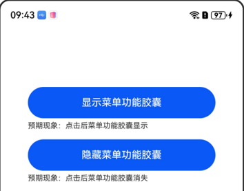
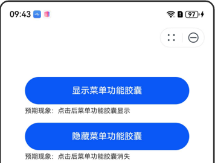

# AtomicServiceMenuBar

<!--Kit: ArkUI-->
<!--Subsystem: ArkUI-->
<!--Owner: @qq_36417014-->
<!--Designer: @autojuan-->
<!--Tester: @tinygreyy-->
<!--Adviser: @zengyawen-->

依赖当前元服务的上下文，创建AtomicServiceMenuBar对象，用于操控元服务右上角菜单功能胶囊的行为，包括菜单功能胶囊的显示、隐藏。

> **说明：**
>
> 该组件从API version 23开始支持。后续版本如有新增内容，则采用上角标单独标记该内容的起始版本。

## 导入模块

```ts
import { AtomicServiceMenuBar } from '@kit.ArkUI';
```

## 子组件

无

## 属性

不支持[通用属性](ts-component-general-attributes.md)

## AtomicServiceMenuBar

使用当前元服务的上下文信息创建的对象，利用其定义的接口可以实现对当前元服务菜单功能胶囊的状态进行操控。使用示例参见[示例](#示例)。

### constructor

constructor(uiContext: UIContext)

AtomicServiceMenuBar的构造函数。

**原子化服务API：** 从API version 23开始，该接口支持在原子化服务中使用。

**系统能力：** SystemCapability.ArkUI.ArkUI.Full

**模型约束：** 此接口仅可在Stage模型下使用。

**系统接口：** 此接口为系统接口。

**参数：**

| 参数名   | 类型                            | 必填   |  说明         |
| ---- | ----------------------------- | ---- | -------------------- |
| uiContext | [UIContext](../arkts-apis-uicontext-uicontext.md) | 是    | 当前元服务的上下文信息。 |

### setVisible

setVisible(visible: boolean): void

设置当前元服务菜单功能胶囊的显隐状态。

**原子化服务API：** 从API version 23开始，该接口支持在原子化服务中使用。

**系统能力：** SystemCapability.ArkUI.ArkUI.Full

**模型约束：** 此接口仅可在Stage模型下使用。

**系统接口：** 此接口为系统接口。

| 参数名   | 类型                            | 必填   |  说明         |
| ---- | ----------------------------- | ---- | -------------------- |
| visible | boolean | 是 | 菜单功能胶囊预期的状态。true表示显示菜单功能胶囊，false表示隐藏菜单功能胶囊。 |


## 示例

```ts
import { AtomicServiceMenuBar } from '@kit.ArkUI';

@Entry
@Component
struct Index {
  @Builder
  private EmbedCompLauncherShow(title: string, text: string, event?: () => void) {
    Column() {
      if (typeof event === 'function') {
        Button(title)
          .width(300)
          .height(50)
          .fontSize(16)
          .borderRadius(25)
          .onClick(() => {
            event();
          })
      }
      Text(`预期现象：${text}`)
        .width(300)
        .textAlign(TextAlign.Start)
        .fontSize(12)
        .margin({ top: 5, bottom: 15})
    }
  }

  build() {
    Column() {
      this.EmbedCompLauncherShow('显示menubar', '点击后menubar显示', () => {
        new AtomicServiceMenuBar(this.getUIContext()).setVisible(true);
      });
      this.EmbedCompLauncherShow('隐藏menubar', '点击后menubar消失', () => {
        new AtomicServiceMenuBar(this.getUIContext()).setVisible(false);
      });
    }
    .width('100%')
    .height('100%')
    .padding({ top: 100 })
  }
}
```
点击“隐藏menubar”按钮后，菜单功能胶囊消失。



点击“显示menubar”按钮后，菜单功能胶囊出现。


