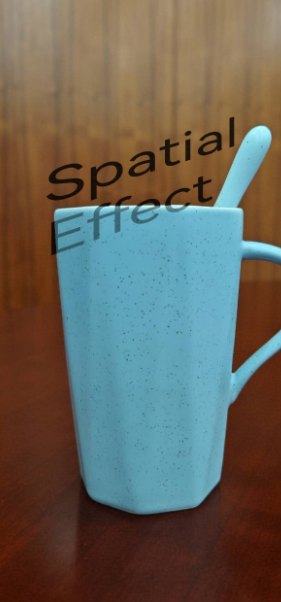
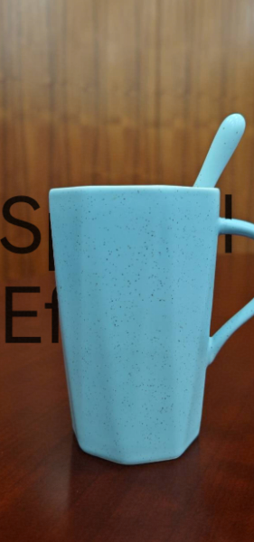
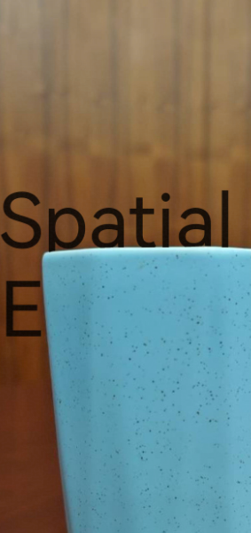

# DepthComponent (系统接口)
<!--Kit: ArkUI-->
<!--Subsystem: ArkUI-->
<!--Owner: @houguobiao-->
<!--Designer: @houguobiao-->
<!--Tester: @lxl007-->
<!--Adviser: @Brilliantry_Rui-->

景深组件利用背景与深度图，生成具有景深空间效果的内容。

> **说明：**
>
> - 子组件需要设置[空间效果](./ts-universal-attributes-spatial-effect-sys.md)，才能与景深组件的背景产生交互效果。
>
> - 具备基本的计算机图形学知识有助于更好地使用该组件。
>
> - 本模块为系统接口。

**起始版本：** 26.0.0

## 子组件

可以包含子组件。

## 接口

DepthComponent(background: ResourceStr | PixelMap, options?: DepthComponentOptions)

创建景深组件。

**起始版本：** 26.0.0

**模型约束：** 此接口仅可在Stage模型下使用。

**系统能力：** SystemCapability.ArkUI.ArkUI.Full

**系统接口：** 此接口为系统接口。

**参数：**

| 参数名 | 类型 | 必填 | 说明 |
| -------- | -------- | -------- | -------- |
| background | [ResourceStr](ts-types.md#resourcestr) \| [PixelMap](../../apis-image-kit/arkts-apis-image-PixelMap.md) | 是 | 背景资源。支持静态图片或3D模型。<br>静态图支持加载PixelMap和ResourceStr的数据源，引用方式请参考[加载图片资源](../../../ui/arkts-graphics-display.md#加载图片资源)。<br>3D模型仅支持加载ResourceStr的数据源，仅支持glTF和glb的3D模型格式。ResourceStr包含Resource和string格式。其中string格式可用于加载本地3D模型，支持绝对路径或file://前缀的沙箱URI，不支持网络资源的加载；Resource格式可以跨包/跨模块访问模型资源文件，推荐以该方式加载本地3D模型。 |
| options | [DepthComponentOptions](#depthcomponentoptions) | 否 | 景深组件配置项。默认值：`{ depthSpace: DepthSpaceType.INSTANCE }`。 |

## DepthComponentOptions

景深组件配置项。

**起始版本：** 26.0.0

**模型约束：** 此接口仅可在Stage模型下使用。

**系统能力：** SystemCapability.ArkUI.ArkUI.Full

**系统接口：** 此接口为系统接口。

| 名称 | 类型 | 只读 | 可选 | 说明 |
| -------- | -------- | -------- | -------- | -------- |
| depthSpace | [DepthSpaceType](#depthspacetype) | 否 | 是 | 景深空间类型。 |
| render3DScale | number | 否 | 是 | 3D渲染窗口的缩放比例，同时作用于宽度和高度。取值范围：(0.0, 1.0]，超出该范围的值无效（继承之前的取值，如果之前未设置取默认值）。默认值：1.0。 |

## DepthSpaceType

景深空间类型枚举。

> **说明：**
>
> 全局模式下，其余进程复用壁纸进程的背景、深度图及相机和光照参数，且不可自定义。

**起始版本：** 26.0.0

**模型约束：** 此接口仅可在Stage模型下使用。

**系统能力：** SystemCapability.ArkUI.ArkUI.Full

**系统接口：** 此接口为系统接口。

| 名称 | 值 | 说明 |
| -------- | -------- | -------- |
| INSTANCE | 0 | 实例模式。使用当前进程的背景、深度图、相机参数及光照参数。 |
| GLOBAL | 1 | 全局模式。使用全局的背景、深度图、相机参数及光照参数。 |

## 属性

除支持[通用属性](ts-component-general-attributes.md)外，还支持以下属性：

### depthMap

depthMap(depthMap: ResourceStr | PixelMap, callback?: DepthMapCallback)

设置用于景深计算和渲染的深度图。使用callback异步回调。

> **说明：**
>
> 深度图是用于描述在3D空间中，背景中每个像素点与相机距离的二维矩阵图像。
> 其数据格式为灰阶图，灰度值越大（颜色越白）的像素点距离相机越近。

**起始版本：** 26.0.0

**模型约束：** 此接口仅可在Stage模型下使用。

**系统能力：** SystemCapability.ArkUI.ArkUI.Full

**系统接口：** 此接口为系统接口。

**参数：**

| 参数名 | 类型 | 必填 | 说明 |
| -------- | -------- | -------- | -------- |
| depthMap | [ResourceStr](ts-types.md#resourcestr) \| [PixelMap](../../apis-image-kit/arkts-apis-image-PixelMap.md) | 是 | 深度图资源或PixelMap对象，引用方式与静态背景图一致。仅背景为静态图时需要设置深度图。深度图需要与背景图的分辨率保持一致。 |
| callback | [DepthMapCallback](#depthmapcallback) | 否 | 深度图加载完成时的回调函数。加载成功时error.code为0，加载失败时error中包含错误码和错误信息。 |

### camera

camera(camera: DepthCameraParams)

设置景深渲染使用的相机参数。

> **说明：**
>
> 以图片作为背景时，相机参数更新不会引起背景的变化。

**起始版本：** 26.0.0

**模型约束：** 此接口仅可在Stage模型下使用。

**系统能力：** SystemCapability.ArkUI.ArkUI.Full

**系统接口：** 此接口为系统接口。

**参数：**

| 参数名 | 类型 | 必填 | 说明 |
| -------- | -------- | -------- | -------- |
| camera | [DepthCameraParams](#depthcameraparams) | 是 | 相机参数。 |

### light

light(light: DepthLightParams)

设置景深渲染使用的光照参数。

**起始版本：** 26.0.0

**模型约束：** 此接口仅可在Stage模型下使用。

**系统能力：** SystemCapability.ArkUI.ArkUI.Full

**系统接口：** 此接口为系统接口。

**参数：**

| 参数名 | 类型 | 必填 | 说明 |
| -------- | -------- | -------- | -------- |
| light | [DepthLightParams](#depthlightparams) | 是 | 光照参数，包含方向、颜色和强度。 |

## 事件

### onComplete

onComplete(callback: DepthComponentCompleteCallback)

背景资源加载成功时触发该回调。使用callback异步回调。

**起始版本：** 26.0.0

**模型约束：** 此接口仅可在Stage模型下使用。

**系统能力：** SystemCapability.ArkUI.ArkUI.Full

**系统接口：** 此接口为系统接口。

**参数：**

| 参数名 | 类型 | 必填 | 说明 |
| -------- | -------- | -------- | -------- |
| callback | [DepthComponentCompleteCallback](#depthcomponentcompletecallback) | 是 | 背景资源加载成功的回调函数。 |

### onError

onError(callback: DepthComponentErrorCallback)

背景资源加载出现错误时触发该回调。使用callback异步回调。

**起始版本：** 26.0.0

**模型约束：** 此接口仅可在Stage模型下使用。

**系统能力：** SystemCapability.ArkUI.ArkUI.Full

**系统接口：** 此接口为系统接口。

**参数：**

| 参数名 | 类型 | 必填 | 说明 |
| -------- | -------- | -------- | -------- |
| callback | [DepthComponentErrorCallback](#depthcomponenterrorcallback) | 是 | 背景资源加载失败的回调函数。 |

## DepthMapCallback

深度图资源加载完成时的回调函数。使用callback异步回调。

type DepthMapCallback = (error: BusinessError&lt;void&gt;) => void

**起始版本：** 26.0.0

**模型约束：** 此接口仅可在Stage模型下使用。

**系统能力：** SystemCapability.ArkUI.ArkUI.Full

**系统接口：** 此接口为系统接口。

**参数：**

| 参数名 | 类型 | 必填 | 说明 |
| -------- | -------- | -------- | -------- |
| error | [BusinessError](../../apis-basic-services-kit/js-apis-base.md#businesserror)&lt;void&gt; | 是 | 深度图资源加载完成时返回的错误信息。加载成功时error.code为0，加载失败时error中包含错误码和错误信息。 |

## DepthCameraParams

相机参数。

**起始版本：** 26.0.0

**模型约束：** 此接口仅可在Stage模型下使用。

**系统能力：** SystemCapability.ArkUI.ArkUI.Full

**系统接口：** 此接口为系统接口。

| 名称 | 类型 | 只读 | 可选 | 说明 |
| -------- | -------- | -------- | -------- | -------- |
| position | [DepthVector3](ts-universal-attributes-spatial-effect-sys.md#depthvector3) | 否 | 否 | 相机在三维空间中的位置。无单位，其值表示3D空间中的坐标。 |
| quaternion | [DepthVector4](ts-universal-attributes-spatial-effect-sys.md#depthvector4) | 否 | 否 | 相机旋转四元数，按(x, y, z, w)表示。无单位。 |
| yFov | number | 否 | 否 | 相机垂直方向视场角，单位为弧度。 |
| zNear | number | 否 | 否 | 近裁剪面距离。无单位。必须为正数。 |
| zFar | number | 否 | 否 | 远裁剪面距离。无单位。必须为正数。 |
| cameraBufferCrop | [CameraBufferCrop](#camerabuffercrop) | 否 | 是 | 相机移轴裁剪参数。未设置时默认使用组件布局尺寸作为默认图像基准大小，裁剪偏移量为(0, 0)，缩放比例为1.0。 |

## CameraBufferCrop

相机移轴裁剪参数。

**起始版本：** 26.0.0

**模型约束：** 此接口仅可在Stage模型下使用。

**系统能力：** SystemCapability.ArkUI.ArkUI.Full

**系统接口：** 此接口为系统接口。

| 名称 | 类型 | 只读 | 可选 | 说明 |
| -------- | -------- | -------- | -------- | -------- |
| bufferWidth | number | 否 | 否 | 基准图宽度，单位为像素。需确保传入图片的宽度与实际图片宽度一致，否则可能导致显示异常，如位置偏移。 |
| bufferHeight | number | 否 | 否 | 基准图高度，单位为像素。需确保传入图片的高度与实际图片高度一致，否则可能导致显示异常，如位置偏移。 |
| cropOffset | [CropOffset](#cropoffset) | 否 | 否 | 裁剪区域偏移量。 |
| cropScale | number | 否 | 否 | 裁剪区域缩放比例，裁剪区基础大小为DepthComponent组件大小。 |

## CropOffset

裁剪偏移量。

**起始版本：** 26.0.0

**模型约束：** 此接口仅可在Stage模型下使用。

**系统能力：** SystemCapability.ArkUI.ArkUI.Full

**系统接口：** 此接口为系统接口。

| 名称 | 类型 | 只读 | 可选 | 说明 |
| -------- | -------- | -------- | -------- | -------- |
| x | number | 否 | 否 | 水平方向偏移量，单位为像素。 |
| y | number | 否 | 否 | 垂直方向偏移量，单位为像素。 |

## DepthLightParams

光照参数。

**起始版本：** 26.0.0

**模型约束：** 此接口仅可在Stage模型下使用。

**系统能力：** SystemCapability.ArkUI.ArkUI.Full

**系统接口：** 此接口为系统接口。

| 名称 | 类型 | 只读 | 可选 | 说明 |
| -------- | -------- | -------- | -------- | -------- |
| direction | [DepthVector3](ts-universal-attributes-spatial-effect-sys.md#depthvector3) | 否 | 否 | 光照方向向量。无单位，其值表示3D空间中的坐标。 |
| color | [DepthColorRGB](ts-universal-attributes-spatial-effect-sys.md#depthcolorrgb) | 否 | 否 | 光照颜色。 |
| intensity | number | 否 | 否 | 光照强度。无单位，取值范围[0, +∞)。<br>建议取值范围[0, 1]，当设置为0时，无光照。 |

## DepthComponentCompleteCallback

背景资源加载成功的回调函数。使用callback异步回调。

type DepthComponentCompleteCallback = (event: DepthComponentCompleteEvent) => void

**起始版本：** 26.0.0

**模型约束：** 此接口仅可在Stage模型下使用。

**系统能力：** SystemCapability.ArkUI.ArkUI.Full

**系统接口：** 此接口为系统接口。

**参数：**

| 参数名 | 类型 | 必填 | 说明 |
| -------- | -------- | -------- | -------- |
| event | [DepthComponentCompleteEvent](#depthcomponentcompleteevent) | 是 | 背景资源加载成功的事件信息。 |

## DepthComponentCompleteEvent

背景资源加载成功的事件信息。

**起始版本：** 26.0.0

**模型约束：** 此接口仅可在Stage模型下使用。

**系统能力：** SystemCapability.ArkUI.ArkUI.Full

**系统接口：** 此接口为系统接口。

| 名称 | 类型 | 只读 | 可选 | 说明 |
| -------- | -------- | -------- | -------- | -------- |
| componentWidth | number | 是 | 否 | 组件宽度，单位为vp。 |
| componentHeight | number | 是 | 否 | 组件高度，单位为vp。 |

## DepthComponentErrorCallback

背景资源加载失败的回调函数。使用callback异步回调。

type DepthComponentErrorCallback = (error: DepthComponentErrorEvent) => void

**起始版本：** 26.0.0

**模型约束：** 此接口仅可在Stage模型下使用。

**系统能力：** SystemCapability.ArkUI.ArkUI.Full

**系统接口：** 此接口为系统接口。

**参数：**

| 参数名 | 类型 | 必填 | 说明 |
| -------- | -------- | -------- | -------- |
| error | [DepthComponentErrorEvent](#depthcomponenterrorevent) | 是 | 背景资源加载失败的事件信息。 |

## DepthComponentErrorEvent

背景资源加载失败的事件信息。

**起始版本：** 26.0.0

**模型约束：** 此接口仅可在Stage模型下使用。

**系统能力：** SystemCapability.ArkUI.ArkUI.Full

**系统接口：** 此接口为系统接口。

| 名称 | 类型 | 只读 | 可选 | 说明 |
| -------- | -------- | -------- | -------- | -------- |
| componentWidth | number | 是 | 否 | 组件宽度，单位为vp。 |
| componentHeight | number | 是 | 否 | 组件高度，单位为vp。 |
| error | [BusinessError](../../apis-basic-services-kit/js-apis-base.md#businesserror)&lt;void&gt; | 是 | 是 | 加载失败的错误信息。 |

## 示例

### 示例1（实现文字视觉倾斜且部分内容被图片遮挡）

该示例通过配置子组件[SpatialEffectParams](ts-universal-attributes-spatial-effect-sys.md#spatialeffectparams)，配合深度图实现文字视觉倾斜且部分内容被图片遮挡。

从API版本26.0.0开始，新增SpatialEffectParams。

```ts
// xxx.ets
@Entry
@Component
struct DepthComponentInstanceExample {
  build() {
    Column() {
      // 请开发者替换为实际的资源文件
      DepthComponent($r('app.media.background')) {
        Text('Spatial Effect')
          .fontSize(100)
          .spatialEffect({
            position: {
              leftTop: { x: -0.355, y: 0.915, z: -1.941 },
              rightTop: { x: 0.483, y: 1.259, z: -2.295 },
              leftBottom: { x: -0.355, y: -0.281, z: -1.941 },
              rightBottom: { x: 0.483, y: 0.063, z: -2.295 }
            },
            occlusionWeight: 0.5
          })
      }
        .width('100%')
        .height('100%')
        .depthMap($r('app.media.depth_map'), (error: BusinessError<void>) => {
          // 请开发者替换为实际的资源文件
          if (error && error.code !== 0) {
            console.error(`Depth map load failed: ${error.code} - ${error.message}`);
          } else {
            console.info('Depth map loaded successfully');
          }
        })
        .camera({
          position: { x: 0, y: 0, z: 0 },
          quaternion: { x: 0, y: 0, z: 0, w: 1 },
          yFov: 1.05,
          zNear: 0.1,
          zFar: 100
        })
        .light({
          direction: { x: 0, y: 0, z: -1 },
          color: { red: 255, green: 255, blue: 255 },
          intensity: 1
        })
        .onComplete((event: DepthComponentCompleteEvent) => {
          console.info(`Background loaded: ${event.componentWidth}x${event.componentHeight}`);
        })
        .onError((event: DepthComponentErrorEvent) => {
          console.error(`Background load failed: ${event.componentWidth}x${event.componentHeight}`);
          if (event.error) {
            console.error(`Error: ${event.error.code} - ${event.error.message}`);
          }
        })
    }
    .width('100%')
    .padding(16)
  }
}
```


### 示例2（实现文字部分仅设置深度遮挡效果）

该示例通过配置子组件[SpatialEffectParams](ts-universal-attributes-spatial-effect-sys.md#spatialeffectparams)中的深度信息，配合深度图实现文字部分内容被图片遮挡。

从API版本26.0.0开始，新增SpatialEffectParams。

```ts
// xxx.ets
@Entry
@Component
struct DepthComponentInstanceExample {
  build() {
    Column() {
      // 请开发者替换为实际的资源文件
      DepthComponent($r('app.media.background')) {
        Text('Spatial Effect')
          .fontSize(100)
          .spatialEffect({
            position: -2.0,  // 设置子组件深度信息
            occlusionWeight: 1.0
          })
      }
        .width('100%')
        .height('100%')
        .depthMap($r('app.media.depth_map')) // 请开发者替换为实际的资源文件
        .camera({
          position: { x: 0, y: 0, z: 0 },
          quaternion: { x: 0, y: 0, z: 0, w: 1 },
          yFov: 1.05,
          zNear: 0.1,
          zFar: 100
        })
        .light({
          direction: { x: 0, y: 0, z: -1 },
          color: { red: 255, green: 255, blue: 255 },
          intensity: 1
        })
    }
    .width('100%')
    .padding(16)
  }
}
```


### 示例3（实现截取部分渲染内容）

该示例通过配置移轴相机[cameraBufferCrop](#camerabuffercrop)，配合深度图实现截取部分渲染内容。

从API版本26.0.0开始，新增DepthCameraParams的cameraBufferCrop属性。

```ts
// xxx.ets
@Entry
@Component
struct DepthComponentInstanceExample {
  build() {
    Column() {
      // 请开发者替换为实际的资源文件
      DepthComponent($r('app.media.background')) {
        Text('Spatial Effect')
          .fontSize(100)
          .spatialEffect({
            position: -10.0,      // 设置子组件深度信息
            occlusionWeight: 1.0
          })
      }
        .width('100%')
        .height('100%')
        .depthMap($r('app.media.depth_map')) // 请开发者替换为实际的资源文件
        .camera({
          position: { x: 0, y: 0, z: 0 },
          quaternion: { x: 0, y: 0, z: 0, w: 1 },
          yFov: 1.05,
          zNear: 0.1,
          zFar: 100,
          cameraBufferCrop: {
            bufferWidth: 1262,       // 背景图 background 宽度
            bufferHeight: 2560,      // 背景图 background 高度
            cropOffset: { x: 100.0, y: 100.0 },
            cropScale: 0.65
          }
        })
        .light({
          direction: { x: 0, y: 0, z: -1 },
          color: { red: 255, green: 255, blue: 255 },
          intensity: 1
        })
    }
    .width('100%')
    .padding(16)
  }
}
```

