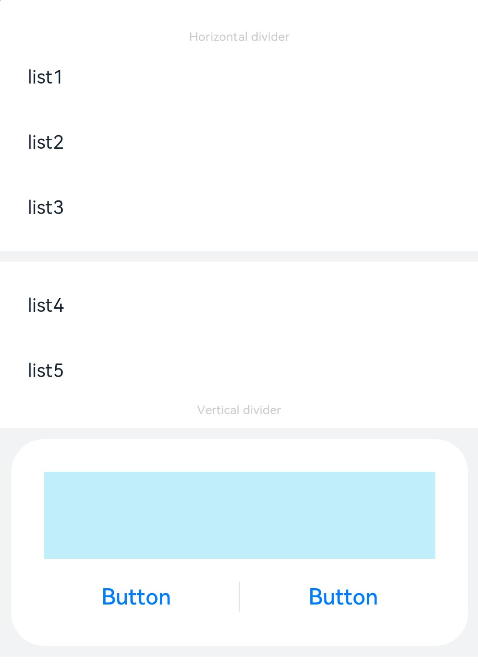
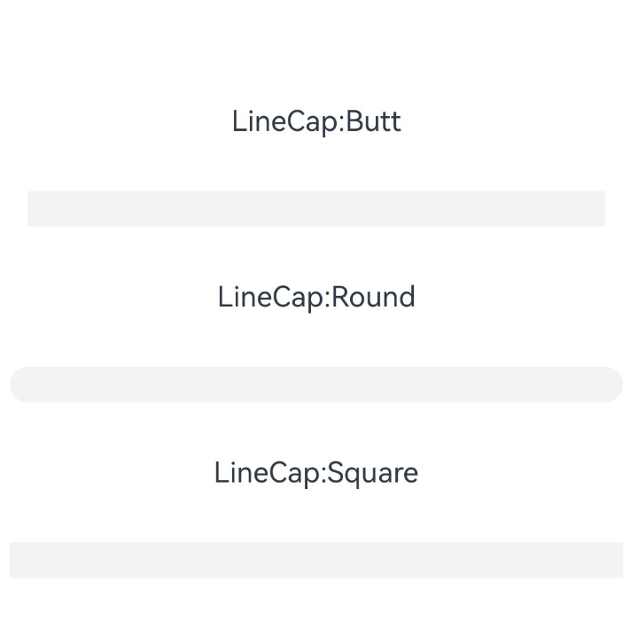

# Divider
<!--Kit: ArkUI-->
<!--Subsystem: ArkUI-->
<!--Owner: @zju_ljz-->
<!--Designer: @lanshouren-->
<!--Tester: @liuli0427-->
<!--Adviser: @Brilliantry_Rui-->

提供分割线组件，分割不同内容块/内容元素。

>  **说明：**
>
> - 本模块同时支持ArkTS-Dyn、ArkTS-Sta。
>
> - 该组件从API Version 7开始支持。后续版本如有新增内容，则采用上角标单独标记该内容的起始版本。
>
> - 如果出现分割线粗细不一或者消失的问题，请参考[组件级像素取整常见问题](./ts-universal-attributes-pixelRoundForComponent.md#常见问题)。

## 子组件

无

## 接口

Divider()

创建分割线组件。

**卡片能力（仅ArkTS-Dyn）：** 从API version 9开始，该接口支持在ArkTS卡片中使用。

**原子化服务API（仅ArkTS-Dyn）：** 从API version 11开始，该接口支持在原子化服务中使用。

**系统能力：** SystemCapability.ArkUI.ArkUI.Full

**ArkTS-Dyn起始版本：** 7

**ArkTS-Sta起始版本：** 24

## 属性

除支持[通用属性](ts-component-general-attributes.md)外，还支持以下属性：

### vertical

ArkTS-Dyn: vertical(value: boolean)

ArkTS-Sta: vertical(value: boolean | undefined)

设置分割线的方向，支持[attributeModifier](ts-universal-attributes-attribute-modifier.md#attributemodifier)动态设置属性方法。

**卡片能力（仅ArkTS-Dyn）：** 从API version 9开始，该接口支持在ArkTS卡片中使用。

**原子化服务API（仅ArkTS-Dyn）：** 从API version 11开始，该接口支持在原子化服务中使用。

**系统能力：** SystemCapability.ArkUI.ArkUI.Full

**ArkTS-Dyn起始版本：** 7

**ArkTS-Sta起始版本：** 23

**参数：**

| 参数名 | 类型    | 必填 | 说明                                                         |
| ------ | ------- | ---- | ------------------------------------------------------------ |
| value  | ArkTS-Dyn: boolean<br/>ArkTS-Sta: boolean \| undefined | 是   | 使用水平分割线还是垂直分割线。<br/>false：水平分割线；true：垂直分割线。<br/>默认值：false <br />非法值：按默认值处理。<br/>取值为undefined时，按默认值处理。 |

### color

ArkTS-Dyn: color(value: ResourceColor)

ArkTS-Sta: color(value: ResourceColor| undefined)

设置分割线的颜色，支持[attributeModifier](ts-universal-attributes-attribute-modifier.md#attributemodifier)动态设置属性方法。

**卡片能力（仅ArkTS-Dyn）：** 从API version 9开始，该接口支持在ArkTS卡片中使用。

**原子化服务API（仅ArkTS-Dyn）：** 从API version 11开始，该接口支持在原子化服务中使用。

**系统能力：** SystemCapability.ArkUI.ArkUI.Full

**ArkTS-Dyn起始版本：** 7

**ArkTS-Sta起始版本：** 23

**参数：**

| 参数名 | 类型                                       | 必填 | 说明                                  |
| ------ | ------------------------------------------ | ---- | ------------------------------------- |
| value  | ArkTS-Dyn: [ResourceColor](ts-types.md#resourcecolor)<br/>ArkTS-Sta: [ResourceColor](ts-types.md#resourcecolor) \| undefined | 是   | 分割线颜色。<br/>默认值：'\#33182431' <br />非法值：按默认值处理。<br/>取值为undefined时，按默认值处理。<br/>支持通过[WithTheme](ts-container-with-theme.md)设置通用分割线颜色。|

### strokeWidth

ArkTS-Dyn: strokeWidth(value: number | string)

ArkTS-Sta: strokeWidth(value: double | string | undefined)

设置分割线的宽度，支持[attributeModifier](ts-universal-attributes-attribute-modifier.md#attributemodifier)动态设置属性方法。

> **说明：**
> - 分割线的宽度不支持百分比设置。
> - 使用水平分割线时，strokeWidth控制高度，优先级低于通用属性[height](ts-universal-attributes-size.md#height)；使用垂直分割线时，strokeWidth控制宽度，优先级低于通用属性[width](ts-universal-attributes-size.md#width)。
> - 超过通用属性设置大小时，按照通用属性进行裁切。
> - 如果设备硬件存在1像素取整后分割线不显示问题，建议使用2像素。

**卡片能力（仅ArkTS-Dyn）：** 从API version 9开始，该接口支持在ArkTS卡片中使用。

**原子化服务API（仅ArkTS-Dyn）：** 从API version 11开始，该接口支持在原子化服务中使用。

**系统能力：** SystemCapability.ArkUI.ArkUI.Full

**ArkTS-Dyn起始版本：** 7

**ArkTS-Sta起始版本：** 23

**参数：**

| 参数名 | 类型                       | 必填 | 说明                                                         |
| ------ | -------------------------- | ---- | ------------------------------------------------------------ |
| value  | ArkTS-Dyn: number&nbsp;\|&nbsp;string<br/>ArkTS-Sta: double&nbsp;\|&nbsp;string \| undefined | 是   | 分割线宽度。<br/>默认值：1px  <br />非法值：按默认值处理。 <br/>单位：vp<br/>取值为undefined时，按默认值处理。 |

### lineCap

ArkTS-Dyn: lineCap(value: LineCapStyle)

ArkTS-Sta: lineCap(value: LineCapStyle | undefined)

设置分割线的端点样式，支持[attributeModifier](ts-universal-attributes-attribute-modifier.md#attributemodifier)动态设置属性方法。

**卡片能力（仅ArkTS-Dyn）：** 从API version 9开始，该接口支持在ArkTS卡片中使用。

**原子化服务API（仅ArkTS-Dyn）：** 从API version 11开始，该接口支持在原子化服务中使用。

**系统能力：** SystemCapability.ArkUI.ArkUI.Full

**ArkTS-Dyn起始版本：** 7

**ArkTS-Sta起始版本：** 23

**参数：**

| 参数名 | 类型                                              | 必填 | 说明                                             |
| ------ | ------------------------------------------------- | ---- | ------------------------------------------------ |
| value  | ArkTS-Dyn: [LineCapStyle](ts-appendix-enums.md#linecapstyle)<br/>ArkTS-Sta: [LineCapStyle](ts-appendix-enums.md#linecapstyle) \| undefined | 是   | 分割线的端点样式。<br/>默认值：LineCapStyle.Butt <br />非法值：按默认值处理。<br/>取值为undefined时，按默认值处理。 |

### attributeModifier<sup>12+</sup>

attributeModifier(modifier: AttributeModifier\<DividerAttribute> | AttributeModifier\<CommonMethod> | undefined)

设置组件的动态属性。

**系统能力：** SystemCapability.ArkUI.ArkUI.Full

**ArkTS模式：** 该接口仅适用于ArkTS-Sta。

**ArkTS-Sta起始版本：** 23

**参数：** 

| 参数名 | 类型                                                | 必填 | 说明                                                         |
| ------ | --------------------------------------------------- | ---- | ------------------------------------------------------------ |
| modifier  | [AttributeModifier](ts-universal-attributes-attribute-modifier.md#attributemodifiert)\<DividerAttribute> \| [AttributeModifier](ts-universal-attributes-attribute-modifier.md#attributemodifiert)\<CommonMethod> \| undefined | 是   | 动态设置Divider组件的属性。<br/>取值为undefined时，按当前组件的属性方法默认值处理。 |

## 事件

支持[通用事件](ts-component-general-events.md)。

## 示例

### 示例1（定义Divider方向、颜色及宽度）

该示例定义了Divider的样式，如方向、颜色及宽度。

**ArkTS-Dyn示例：**

```ts
// xxx.ets
@Entry
@Component
struct DividerExample {
  build() {
    Column() {
      // 使用横向分割线场景
      Text('Horizontal divider').fontSize(9).fontColor(0xCCCCCC)
      List() {
        ForEach([1, 2, 3], (item: number) => {
          ListItem() {
            Text('list' + item).width('100%').fontSize(14).fontColor('#182431').textAlign(TextAlign.Start)
          }.width(244).height(48)
        }, (item: number) => item.toString())
      }.padding({ left: 24, bottom: 8 })

      Divider().strokeWidth(8).color('#F1F3F5')
      List() {
        ForEach([4, 5], (item: number) => {
          ListItem() {
            Text('list' + item).width('100%').fontSize(14).fontColor('#182431').textAlign(TextAlign.Start)
          }.width(244).height(48)
        }, (item: number) => item.toString())
      }.padding({ left: 24, top: 8 })

      // 使用纵向分割线场景
      Text('Vertical divider').fontSize(9).fontColor(0xCCCCCC)
      Column() {
        Column() {
          Row().width(288).height(64).backgroundColor('#30C9F0').opacity(0.3)
          Row() {
            Button('Button')
              .width(136)
              .height(22)
              .fontSize(16)
              .fontColor('#007DFF')
              .fontWeight(500)
              .backgroundColor(Color.Transparent)
            Divider()
              .vertical(true)
              .height(22)
              .color('#182431')
              .opacity(0.6)
              .margin({ left: 8, right: 8 })
            Button('Button')
              .width(136)
              .height(22)
              .fontSize(16)
              .fontColor('#007DFF')
              .fontWeight(500)
              .backgroundColor(Color.Transparent)
          }.margin({ top: 17 })
        }
        .width(336)
        .height(152)
        .backgroundColor('#FFFFFF')
        .borderRadius(24)
        .padding(24)
      }
      .width('100%')
      .height(168)
      .backgroundColor('#F1F3F5')
      .justifyContent(FlexAlign.Center)
      .margin({ top: 8 })
    }.width('100%').padding({ top: 24 })
  }
}
```

**ArkTS-Sta示例：**

```ts
// xxx.ets
import { Entry, Component, Text, Button, Divider, Column, Row, Blank, List, ListItem, ForEach, ColumnOptions, ToggleType, Margin, Padding, Color, TextAlign, FlexAlign } from '@ohos.arkui.component';

@Entry
@Component
struct DividerExample {
  build() {
    Column() {
      // 使用横向分割线场景
      Text('Horizontal divider').fontSize(9).fontColor(0xCCCCCC)
      List() {
        ForEach([1, 2, 3], (item: Int, index: number) => {
          ListItem() {
            Text('list' + `${item}`).width('100%').fontSize(14).fontColor('#182431').textAlign(TextAlign.Start)
          }.width(244).height(48)
        })
      }.padding({ left: 24, bottom: 8 } as Padding)

      Divider().strokeWidth(8).color('#F1F3F5')
      List() {
        ForEach([4, 5], (item: Int, index: number) => {
          ListItem() {
            Text('list' + `${item}`).width('100%').fontSize(14).fontColor('#182431').textAlign(TextAlign.Start)
          }.width(244).height(48)
        })
      }.padding({ left: 24, top: 8 } as Padding)

      // 使用纵向分割线场景
      Text('Vertical divider').fontSize(9).fontColor(0xCCCCCC)
      Column() {
        Column() {
          Row().width(288).height(64).backgroundColor('#30C9F0').opacity(0.3)
          Row() {
            Button('Button')
              .width(136)
              .height(22)
              .fontSize(16)
              .fontColor('#007DFF')
              .fontWeight(500)
              .backgroundColor(Color.Transparent)
            Divider()
              .vertical(true)
              .height(22)
              .color('#182431')
              .opacity(0.6)
              .margin({ left: 8, right: 8 } as Margin)
            Button('Button')
              .width(136)
              .height(22)
              .fontSize(16)
              .fontColor('#007DFF')
              .fontWeight(500)
              .backgroundColor(Color.Transparent)
          }.margin({ top: 17 } as Margin)
        }
        .width(336)
        .height(152)
        .backgroundColor('#FFFFFF')
        .borderRadius(24)
        .padding(24)
      }
      .width('100%')
      .height(168)
      .backgroundColor('#F1F3F5')
      .justifyContent(FlexAlign.Center)
      .margin({ top: 8 } as Margin)
    }.width('100%').padding({ top: 24 } as Padding)
  }
}
```



### 示例2（定义Divider的lineCap样式）

该示例定义了Divider的lineCap样式。

```ts
// xxx.ets
@Entry
@Component
struct DividerExample {
  build() {
    Column({space:30}) {
      Text("LineCap:Butt")
      Divider()
        .strokeWidth(20)
        .width("90%")
        .color('#F1F3F5')
        .lineCap(LineCapStyle.Butt)

      Text("LineCap:Round")
      Divider()
        .strokeWidth(20)
        .width("90%")
        .color('#F1F3F5')
        .lineCap(LineCapStyle.Round)

      Text("LineCap:Square")
      Divider()
        .strokeWidth(20)
        .width("90%")
        .color('#F1F3F5')
        .lineCap(LineCapStyle.Square)

    }.width('100%').padding({ top: 24 })
  }
}
```

