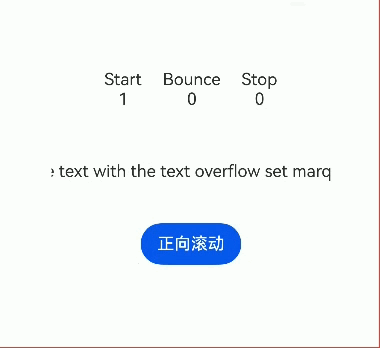

# Marquee
<!--Kit: ArkUI-->
<!--Subsystem: ArkUI-->
<!--Owner: @hddgzw-->
<!--Designer: @xiangyuan6-->
<!--Tester: @jiaoaozihao-->
<!--Adviser: @Brilliantry_Rui-->

跑马灯组件，用于滚动展示一段单行文本。仅当文本内容宽度大于等于跑马灯组件宽度时滚动，当文本内容宽度小于跑马灯组件宽度时不滚动。


>  **说明：**
>
>  本模块同时支持ArkTS-Dyn、ArkTS-Sta。
>
>  该组件从API version 8开始支持。后续版本如有新增内容，则采用上角标单独标记该内容的起始版本。
>
>  为了不影响滚动帧率，建议在滚动类组件中Marquee的个数不超过4个，或者使用[Text](ts-basic-components-text.md)组件的[TextOverflow.MARQUEE](ts-appendix-enums.md#textoverflow)替代。
>
> 对于Marquee组件动态帧率的场景，可以使用[MarqueeDynamicSyncScene](../arkts-apis-uicontext-marqueedynamicsyncscene.md)接口实现。
>
> 在文本宽度小于跑马灯组件宽度时，使用[属性动画](ts-animatorproperty.md)实现滚动。

## 子组件

无


## 接口

Marquee(options: MarqueeOptions)

创建跑马灯组件。

**卡片能力（仅ArkTS-Dyn）：** 从API version 9开始，该接口支持在ArkTS卡片中使用。

**原子化服务API（仅ArkTS-Dyn）：** 从API version 11开始，该接口支持在原子化服务中使用。

**系统能力：** SystemCapability.ArkUI.ArkUI.Full

**ArkTS-Dyn起始版本：** 8

**ArkTS-Sta起始版本：** 23

**参数：**

| 参数名 | 类型 | 必填 | 说明 |
| -------- | -------- | -------- | -------- |
| options | [MarqueeOptions](#marqueeoptions18对象说明)<sup>18+</sup> | 是 | 配置跑马灯组件的参数。|

## MarqueeOptions<sup>18+</sup>对象说明

Marquee初始化参数。

> **说明：**
>
> 为规范匿名对象的定义，API 18版本修改了此处的元素定义。其中，保留了历史匿名对象的起始版本信息，会出现外层元素@since版本号高于内层元素版本号的情况，但这不影响接口的使用。

**模型约束：** 此接口仅可在Stage模型下使用。

**系统能力：** SystemCapability.ArkUI.ArkUI.Full

**ArkTS-Dyn起始版本：** 18

**ArkTS-Sta起始版本：** 23

| 名称 | 类型 | 只读 | 可选 | 说明 |
| -------- | -------- | -------- | -------- | -------- |
| start<sup>8+</sup> | ArkTS-Dyn: boolean <br/>ArkTS-Sta: boolean \| undefined| 否 | 否 | 控制跑马灯是否进入播放状态。<br/>true：播放；false：不播放。<br/>默认值：false <br/>取值为undefined时，按默认值处理。<br/>**说明：**<br/>有限的滚动次数播放完毕后，不可以通过改变start重置滚动次数重新开始播放。<br/>**卡片能力（仅ArkTS-Dyn）：** 从API version 9开始，该接口支持在ArkTS卡片中使用。<br/>**原子化服务API（仅ArkTS-Dyn）：** 从API version 11开始，该接口支持在原子化服务中使用。<br/>**ArkTS-Dyn起始版本：** 8 <br/> **ArkTS-Sta起始版本：** 23|
| step<sup>8+</sup> | ArkTS-Dyn: number <br> ArkTS-Sta: double | 否 | 是 | 滚动动画的文本步长。当step大于Marquee的文本宽度时，取默认值。<br/>默认值：6 <br/>单位：[vp](ts-pixel-units.md#基本像素单位) <br/>**卡片能力（仅ArkTS-Dyn）：** 从API version 9开始，该接口支持在ArkTS卡片中使用。<br/>**原子化服务API（仅ArkTS-Dyn）：** 从API version 11开始，该接口支持在原子化服务中使用。<br/>**ArkTS-Dyn起始版本：** 8 <br/> **ArkTS-Sta起始版本：** 23|
| loop<sup>8+</sup> | ArkTS-Dyn: number <br> ArkTS-Sta: int | 否 | 是 | 设置重复滚动的次数，小于等于零时无限循环。<br/>默认值：-1<br/>**说明：**<br/>ArkTS卡片上该参数设置任意值都仅在可见时滚动一次。<br/>**卡片能力（仅ArkTS-Dyn）：** 从API version 9开始，该接口支持在ArkTS卡片中使用。 <br/>**原子化服务API（仅ArkTS-Dyn）：** 从API version 11开始，该接口支持在原子化服务中使用。<br/>**ArkTS-Dyn起始版本：** 8 <br/> **ArkTS-Sta起始版本：** 23|
| fromStart<sup>8+</sup> | boolean | 否 | 是 | 设置文本从头开始滚动或反向滚动。<br/>true：表示从头开始滚动<br/>false：表示反向滚动。<br/>默认值：true<br/>**卡片能力（仅ArkTS-Dyn）：** 从API version 9开始，该接口支持在ArkTS卡片中使用。<br/>**原子化服务API（仅ArkTS-Dyn）：** 从API version 11开始，该接口支持在原子化服务中使用。<br/>**ArkTS-Dyn起始版本：** 8 <br/> **ArkTS-Sta起始版本：** 23 |
| src<sup>8+</sup> | ArkTS-Dyn: string <br/>ArkTS-Sta: string \| undefined| 否 | 否 | 需要滚动的文本。<br/>默认值：'' <br/>取值为undefined时，按默认值处理。<br/>**卡片能力（仅ArkTS-Dyn）：** 从API version 9开始，该接口支持在ArkTS卡片中使用。<br/>**原子化服务API（仅ArkTS-Dyn）：** 从API version 11开始，该接口支持在原子化服务中使用。<br/>**ArkTS-Dyn起始版本：** 8 <br/> **ArkTS-Sta起始版本：** 23 |
| spacing<sup>23+</sup> | [LengthMetrics](../js-apis-arkui-graphics.md#lengthmetrics12) | 否 | 是 | 两轮跑马灯之间的间距。如果LengthMetrics的unit值是PERCENT，当前设置不生效，按默认值处理。<br/> 默认值：跑马灯组件宽度。 <br/>**卡片能力（仅ArkTS-Dyn）：** 从API version 23开始，该接口支持在ArkTS卡片中使用。<br/>**原子化服务API（仅ArkTS-Dyn）：** 从API version 23开始，该接口支持在原子化服务中使用。<br/>**模型约束：** 此接口仅可在Stage模型下使用。<br/>**ArkTS-Dyn起始版本：** 23 <br/> **ArkTS-Sta起始版本：** 23 |
| delay<sup>23+</sup> | ArkTS-Dyn: number <br > ArkTS-Sta: int | 否 | 是 | 设置每次滚动的时间间隔。<br/>默认值：0 <br/>取值范围：[0, +∞)，设置的值小于0时等价于设置0。<br/>单位：毫秒<br/>**卡片能力（仅ArkTS-Dyn）：** 从API version 23开始，该接口支持在ArkTS卡片中使用。<br/>**原子化服务API（仅ArkTS-Dyn）：** 从API version 23开始，该接口支持在原子化服务中使用。<br/>**模型约束：** 此接口仅可在Stage模型下使用。<br/>**ArkTS-Dyn起始版本：** 23 <br/> **ArkTS-Sta起始版本：** 23 |

## 属性

除支持[通用属性](ts-component-general-attributes.md)外，还支持以下属性：

### attributeModifier<sup>23+</sup>

attributeModifier(modifier: AttributeModifier\<MarqueeAttribute> | AttributeModifier\<CommonMethod> | undefined)

设置组件的动态属性。

**系统能力：** SystemCapability.ArkUI.ArkUI.Full

**模型约束：** 此接口仅可在Stage模型下使用。

**ArkTS模式：** 该接口仅适用于ArkTS-Sta。

**ArkTS-Sta起始版本：** 23

**参数：**

| 参数名 | 类型                                                | 必填 | 说明                                                         |
| ------ | --------------------------------------------------- | ---- | ------------------------------------------------------------ |
| modifier  | [AttributeModifier](ts-universal-attributes-attribute-modifier.md#attributemodifiert)\<MarqueeAttribute> \| [AttributeModifier](ts-universal-attributes-attribute-modifier.md#attributemodifiert)\<CommonMethod> \| undefined | 是   | 动态设置Marquee组件的属性。<br/>取值为undefined时，按当前组件的属性方法默认值处理。 |

### fontColor

ArkTS-Dyn: fontColor(value: ResourceColor)

ArkTS-Sta: fontColor(value: ResourceColor | undefined)

设置字体颜色。

**卡片能力（仅ArkTS-Dyn）：** 从API version 9开始，该接口支持在ArkTS卡片中使用。

**原子化服务API（仅ArkTS-Dyn）：** 从API version 11开始，该接口支持在原子化服务中使用。

**系统能力：** SystemCapability.ArkUI.ArkUI.Full

**ArkTS-Dyn起始版本：** 8

**ArkTS-Sta起始版本：** 23

**参数：** 

| 参数名 | 类型                                       | 必填 | 说明       |
| ------ | ------------------------------------------ | ---- | ---------- |
| value  | ArkTS-Dyn: [ResourceColor](ts-types.md#resourcecolor)<br > ArkTS-Sta: [ResourceColor](ts-types.md#resourcecolor) \| undefined | 是   | 字体颜色。<br />Wearable设备上默认值为：'#c5ffffff'，显示为淡蓝色，其他设备默认值为：'e6182431'，显示为黑色。<br/>设置undefined时按默认值处理。 |

### fontSize

ArkTS-Dyn: fontSize(value: Length)

ArkTS-Sta: fontSize(value: Length | undefined)

设置字体大小。

**卡片能力（仅ArkTS-Dyn）：** 从API version 9开始，该接口支持在ArkTS卡片中使用。

**原子化服务API（仅ArkTS-Dyn）：** 从API version 11开始，该接口支持在原子化服务中使用。

**系统能力：** SystemCapability.ArkUI.ArkUI.Full

**ArkTS-Dyn起始版本：** 8

**ArkTS-Sta起始版本：** 23

**参数：** 

| 参数名 | 类型                         | 必填 | 说明                                                         |
| ------ | ---------------------------- | ---- | ------------------------------------------------------------ |
| value  | ArkTS-Dyn: [Length](ts-types.md#length)<br > ArkTS-Sta: [Length](ts-types.md#length) \| undefined | 是   | 字体大小。fontSize为number类型时，使用fp单位。字体默认大小16fp。不支持设置百分比字符串。<br/>设置undefined时按默认值处理。 |

### fontWeight

ArkTS-Dyn: fontWeight(value: number | FontWeight | string)

ArkTS-Sta: fontWeight(value: int | FontWeight | ResourceStr | undefined)

设置文本的字体粗细，设置过大可能会在不同字体下有截断。

**卡片能力（仅ArkTS-Dyn）：** 从API version 9开始，该接口支持在ArkTS卡片中使用。

**原子化服务API（仅ArkTS-Dyn）：** 从API version 11开始，该接口支持在原子化服务中使用。

**系统能力：** SystemCapability.ArkUI.ArkUI.Full

**ArkTS-Dyn起始版本：** 8

**ArkTS-Sta起始版本：** 23

**参数：** 

| 参数名 | 类型                                                         | 必填 | 说明                                                         |
| ------ | ------------------------------------------------------------ | ---- | ------------------------------------------------------------ |
| value  | ArkTS-Dyn: number&nbsp;\|&nbsp;[FontWeight](ts-appendix-enums.md#fontweight)&nbsp;\|&nbsp;string <br > ArkTS-Sta: int&nbsp;\|&nbsp;[FontWeight](ts-appendix-enums.md#fontweight)&nbsp;\|&nbsp; [ResourceStr](ts-types.md#resourcestr) \|&nbsp; undefined | 是   | 文本的字体粗细，number类型取值[100,&nbsp;900]，取值间隔为100，默认为400，取值越大，字体越粗。string类型仅支持number类型取值的字符串形式，例如"400"，以及"bold"、"bolder"、"lighter"、"regular"、"medium"，分别对应FontWeight中相应的枚举值。<br/>默认值：FontWeight.Normal<br/>设置undefined时按默认值处理。 |

### fontFamily

ArkTS-Dyn: fontFamily(value: string | Resource)

ArkTS-Sta: fontFamily(value: string | Resource | undefined)

设置字体列表。

**卡片能力（仅ArkTS-Dyn）：** 从API version 9开始，该接口支持在ArkTS卡片中使用。

**原子化服务API（仅ArkTS-Dyn）：** 从API version 11开始，该接口支持在原子化服务中使用。

**系统能力：** SystemCapability.ArkUI.ArkUI.Full

**ArkTS-Dyn起始版本：** 8

**ArkTS-Sta起始版本：** 23

**参数：** 

| 参数名 | 类型                                                 | 必填 | 说明                                                         |
| ------ | ---------------------------------------------------- | ---- | ------------------------------------------------------------ |
| value  | ArkTS-Dyn: string&nbsp;\|&nbsp;[Resource](ts-types.md#resource) <br/>ArkTS-Sta: string&nbsp;\|&nbsp;[Resource](ts-types.md#resource) \|&nbsp; undefined | 是   | 字体列表。默认字体'HarmonyOS Sans'。<br>应用当前支持'HarmonyOS Sans'字体和注册自定义字体[loadFontSync](../../apis-arkgraphics2d/js-apis-graphics-text.md#loadfontsync)。<br>卡片当前仅支持'HarmonyOS Sans'字体。<br/>设置undefined时按默认值处理。 |

### allowScale

ArkTS-Dyn: allowScale(value: boolean)

ArkTS-Sta: allowScale(value: boolean | undefined)

设置是否允许文本缩放。

**卡片能力（仅ArkTS-Dyn）：** 从API version 9开始，该接口支持在ArkTS卡片中使用。

**原子化服务API（仅ArkTS-Dyn）：** 从API version 11开始，该接口支持在原子化服务中使用。

**系统能力：** SystemCapability.ArkUI.ArkUI.Full

**ArkTS-Dyn起始版本：** 8

**ArkTS-Sta起始版本：** 23

**参数：**

| 参数名 | 类型    | 必填 | 说明                                 |
| ------ | ------- | ---- | ------------------------------------ |
| value  | ArkTS-Dyn: boolean <br/> ArkTS-Sta: boolean \| undefined | 是   | 是否允许文本缩放。<br/>true：允许文本缩放；false：不允许文本缩放。<br/>默认值：false<br/>**说明：**<br/>仅当[fontSize](#fontsize)为fp单位时生效。<br/>设置undefined时按默认值处理。 |

### marqueeUpdateStrategy<sup>12+</sup>

ArkTS-Dyn: marqueeUpdateStrategy(value: MarqueeUpdateStrategy)

ArkTS-Sta: marqueeUpdateStrategy(value: MarqueeUpdateStrategy | undefined)

跑马灯组件属性更新后，跑马灯的滚动策略。(当跑马灯为播放状态，且文本内容宽度超过跑马灯组件宽度时，该属性生效。)

**原子化服务API（仅ArkTS-Dyn）：** 从API version 12开始，该接口支持在原子化服务中使用。

**模型约束：** 此接口仅可在Stage模型下使用。

**系统能力：** SystemCapability.ArkUI.ArkUI.Full

**ArkTS-Dyn起始版本：** 12

**ArkTS-Sta起始版本：** 23

**参数：**

| 参数名 | 类型    | 必填 | 说明                                 |
| ------ | ------- | ---- | ------------------------------------ |
| value | ArkTS-Dyn: [MarqueeUpdateStrategy](ts-appendix-enums.md#marqueeupdatestrategy12) <br/> ArkTS-Sta:  [MarqueeUpdateStrategy](ts-appendix-enums.md#marqueeupdatestrategy12) \| undefined | 是 | 跑马灯组件属性更新后，跑马灯的滚动策略。<br/>默认值: MarqueeUpdateStrategy.DEFAULT <br/>设置undefined时按默认值处理。|

## 事件

### onStart

ArkTS-Dyn: onStart(event:&nbsp;()&nbsp;=&gt;&nbsp;void)

ArkTS-Sta: onStart(event:&nbsp;(()&nbsp;=&gt;&nbsp;void) | undefined)

当滚动的文本内容变化或者开始滚动时触发回调。

**卡片能力（仅ArkTS-Dyn）：** 从API version 9开始，该接口支持在ArkTS卡片中使用。

**原子化服务API（仅ArkTS-Dyn）：** 从API version 11开始，该接口支持在原子化服务中使用。

**系统能力：** SystemCapability.ArkUI.ArkUI.Full

**ArkTS-Dyn起始版本：** 8

**ArkTS-Sta起始版本：** 23

**参数：**

| 参数名 | 类型                                  | 必填 | 说明           |
| ------ | ------------------------------------- | ---- | -------------- |
| event  | ArkTS-Dyn: &nbsp;()&nbsp;=&gt;&nbsp;void ArkTS-Sta: &nbsp;(()&nbsp;=&gt;&nbsp;void) \| undefined| 是   | 当滚动的文本内容变化或者开始滚动时的回调。<br/>设置为undefined时不会执行回调。 |

### onBounce

ArkTS-Dyn: onBounce(event:&nbsp;()&nbsp;=&gt;&nbsp;void)

ArkTS-Sta: onBounce(event:&nbsp;(()&nbsp;=&gt;&nbsp;void) | undefined)

完成一次滚动时触发，若循环次数不为1，则该事件会多次触发。

**卡片能力（仅ArkTS-Dyn）：** 从API version 9开始，该接口支持在ArkTS卡片中使用。

**原子化服务API（仅ArkTS-Dyn）：** 从API version 11开始，该接口支持在原子化服务中使用。

**系统能力：** SystemCapability.ArkUI.ArkUI.Full

**ArkTS-Dyn起始版本：** 8

**ArkTS-Sta起始版本：** 23

**参数：**

| 参数名 | 类型                                  | 必填 | 说明           |
| ------ | ------------------------------------- | ---- | -------------- |
| event  | ArkTS-Dyn: &nbsp;()&nbsp;=&gt;&nbsp;void ArkTS-Sta: &nbsp;(()&nbsp;=&gt;&nbsp;void) \| undefined| 是   | 完成一次滚动时触发的回调。<br/>设置为undefined时不会执行回调。 |

### onFinish

ArkTS-Dyn: onFinish(event:&nbsp;()&nbsp;=&gt;&nbsp;void)

ArkTS-Sta: onFinish(event:&nbsp;(()&nbsp;=&gt;&nbsp;void) | undefined)

滚动全部循环次数完成时触发回调。

**卡片能力（仅ArkTS-Dyn）：** 从API version 9开始，该接口支持在ArkTS卡片中使用。

**原子化服务API（仅ArkTS-Dyn）：** 从API version 11开始，该接口支持在原子化服务中使用。

**系统能力：** SystemCapability.ArkUI.ArkUI.Full

**ArkTS-Dyn起始版本：** 8

**ArkTS-Sta起始版本：** 23

**参数：**

| 参数名 | 类型                                  | 必填 | 说明           |
| ------ | ------------------------------------- | ---- | -------------- |
| event  | ArkTS-Dyn: &nbsp;()&nbsp;=&gt;&nbsp;void ArkTS-Sta: &nbsp;(()&nbsp;=&gt;&nbsp;void) \| undefined | 是   | 滚动全部循环次数完成时的回调。<br/>设置为undefined时不会执行回调。 |

### onStop

ArkTS-Dyn: onStop(event:&nbsp;Callback&lt;void&gt; \| undefined)

ArkTS-Sta: onStop(event: VoidCallback \| undefined)

跑马灯滚动结束或停止时触发回调。

跑马灯停止表示跑马灯将从开始位置，重新开始循环，不包含暂停场景，暂停不会触发该回调。

**卡片能力（仅ArkTS-Dyn）：** 从API版本26.0.0开始，该接口支持在ArkTS卡片中使用。

**原子化服务API（仅ArkTS-Dyn）：** 从API版本26.0.0开始，该接口支持在原子化服务中使用。

**系统能力：** SystemCapability.ArkUI.ArkUI.Full

**模型约束：** 此接口仅可在Stage模型下使用。

**ArkTS-Dyn起始版本：** 26.0.0

**ArkTS-Sta起始版本：** 26.0.0

**参数：**

| 参数名 | 类型                                  | 必填 | 说明           |
| ------ | ------------------------------------- | ---- | -------------- |
| event  | ArkTS-Dyn: [&nbsp;Callback](ts-types.md#callback12)&lt;void&gt;\| undefined <br > ArkTS-Sta: [VoidCallback](ts-types.md#voidcallback12) \| undefined | 是   | 跑马灯滚动结束或停止时触发回调。<br/>设置为undefined时不会执行回调。 |

## 示例

### 示例1（跑马灯内容动态更新）

该示例通过设置[MarqueeOptions](#marqueeoptions18对象说明)的start、step、loop、fromStart、src、spacing、delay属性和[marqueeUpdateStrategy](#marqueeupdatestrategy12)展示了跑马灯内容动态更新时运行的效果。

从API version 23开始，[MarqueeOptions](#marqueeoptions18对象说明)新增spacing、delay属性。

ArkTS-Dyn示例：
```ts
import { LengthMetrics } from '@kit.ArkUI';

// xxx.ets
@Entry
@Component
struct MarqueeExample {
  @State start: boolean = false;
  @State src: string = '';
  @State marqueeText: string = 'Running Marquee';
  private fromStart: boolean = true;
  private step: number = 10;
  private loop: number = Number.POSITIVE_INFINITY;
  controller: TextClockController = new TextClockController();

  convert2time(value: number): string {
    let date = new Date(Number(value + '000'));
    let hours = date.getHours().toString().padStart(2, '0');
    let minutes = date.getMinutes().toString().padStart(2, '0');
    let seconds = date.getSeconds().toString().padStart(2, '0');
    return hours + ":" + minutes + ":" + seconds;
  }

  build() {
    Flex({ direction: FlexDirection.Column, alignItems: ItemAlign.Center, justifyContent: FlexAlign.Center }) {
      Marquee({
        start: this.start,
        step: this.step,
        loop: this.loop,
        fromStart: this.fromStart,
        src: this.marqueeText + this.src,
        spacing: LengthMetrics.vp(300), // 从API version 23开始，新增spacing属性
        delay: 0, // 从API version 23开始，新增delay属性
      })
        .marqueeUpdateStrategy(MarqueeUpdateStrategy.PRESERVE_POSITION)
        .width('300vp')
        .height('80vp')
        .fontColor('#FFFFFF')
        .fontSize('48fp')
        .allowScale(true) // 当fontSize为‘fp’单位且想要Marquee组件文本跟随系统字体大小缩放，可以设置该属性为true
        .fontWeight(700)
        .fontFamily('HarmonyOS Sans') // 不想跟随主题字体可设置该属性为默认字体'HarmonyOS Sans'
        .backgroundColor('#182431')
        .margin({ bottom: '40vp' })
        .onStart(() => {
          console.info('Succeeded in completing the onStart callback of marquee animation');
        })
        .onBounce(() => {
          console.info('Succeeded in completing the onBounce callback of marquee animation');
        })
        .onFinish(() => {
          console.info('Succeeded in completing the onFinish callback of marquee animation');
        })
      Button('Start')
        .onClick(() => {
          this.start = true
          // 启动文本时钟
          this.controller.start();
        })
        .width('120vp')
        .height('40vp')
        .fontSize('16fp')
        .fontWeight(500)
        .backgroundColor('#007DFF')
      TextClock({ timeZoneOffset: -8, controller: this.controller })
        .format('hms')
        .onDateChange((value: number) => {
          this.src = this.convert2time(value);
        })
        .margin('20vp')
        .fontSize('30fp')
    }
    .width('100%')
    .height('100%')
  }
}
```

ArkTS-Sta示例：
```ts
import { Entry, Text, Column, Component, Button, ClickEvent, TextOverflow, EllipsisMode, FlexDirection, Flex, FlexAlign, ItemAlign, MarqueeStartPolicy,
  Row, Marquee, TextClock, MarqueeUpdatePolicy, LengthMetrics, TextAlign, MarqueeState, MarqueeUpdateStrategy, TextClockController } from '@ohos.arkui.component';
import { State } from '@ohos.arkui.stateManagement';

@Entry
@Component
struct MarqueeExample {
  @State start: boolean = false;
  @State src: string = '';
  @State marqueeText: string = 'Running Marquee';
  private fromStart: boolean = true;
  private step: int = 10;
  private loop: int = -1;
  controller: TextClockController = new TextClockController();

  convert2time(value: long): string {
    let date = new Date();
    let hours = date.getHours().toString().padStart(2, '0');
    let minutes = date.getMinutes().toString().padStart(2, '0');
    let seconds = date.getSeconds().toString().padStart(2, '0');
    return hours + ":" + minutes + ":" + seconds;
  }

  build() {
    Flex({ direction: FlexDirection.Column, alignItems: ItemAlign.Center, justifyContent: FlexAlign.Center }) {
      Marquee({
        start: this.start,
        step: this.step,
        loop: this.loop,
        fromStart: this.fromStart,
        src: this.marqueeText + this.src,
        spacing: LengthMetrics.vp(300), // 从API version 23开始，新增spacing属性
        delay: 0, // 从API version 23开始，新增delay属性
      })
        .marqueeUpdateStrategy(MarqueeUpdateStrategy.PRESERVE_POSITION)
        .width('300vp')
        .height('80vp')
        .fontColor('#FFFFFF')
        .fontSize('48fp')
        .allowScale(true) // 当fontSize为'fp'单位且想要Marquee组件文本跟随系统字体大小缩放，可以设置该属性为true
        .fontWeight(700)
        .fontFamily('HarmonyOS Sans') // 不想跟随主题字体可设置该属性为默认字体'HarmonyOS Sans'
        .backgroundColor('#182431')
        .margin({ bottom: '40vp' })
        .onStart(() => {
          console.info('Succeeded in completing the onStart callback of marquee animation');
        })
        .onBounce(() => {
          console.info('Succeeded in completing the onBounce callback of marquee animation');
        })
        .onFinish(() => {
          console.info('Succeeded in completing the onFinish callback of marquee animation');
        })
      Button('Start')
        .onClick(() => {
          this.start = true
          // 启动文本时钟
          this.controller.start();
        })
        .width('120vp')
        .height('40vp')
        .fontSize('16fp')
        .fontWeight(500)
        .backgroundColor('#007DFF')
      TextClock({ timeZoneOffset: -8, controller: this.controller })
        .format('hms')
        .onDateChange((value: long) => {
          this.src = this.convert2time(value);
        })
        .margin('20vp')
        .fontSize('30fp')
    }
    .width('100%')
    .height('100%')
  }
}
```


### 示例2（设置跑马灯停止回调）

该示例通过变更跑马灯状态来触发跑马灯的onStop回调，触发onStop回调后使停止计数器numberSTOP的值加1。

从API版本26.0.0开始，新增[onStop](#onstop)接口。

ArkTS-Dyn示例：
```ts
// xxx.ets
@Entry
@Component
struct MarqueeStop4 {
  @State change :boolean = true;
  @State isString: String = '正向滚动';
  @State marqueeText: string =
    'This is the text with the text overflow set marquee This is the text with the text overflow set marquee This is the text with the text overflow set marquee';
  @State numberSTART: number = 0;
  @State numberBOUNCE: number = 0;
  @State numberSTOP: number = 0;

  build() {
    Scroll() {
      Column() {
        Row() {
          Column() {
            Text('Start')
            Text(this.numberSTART.toString())
          }.margin(10)

          Column() {
            Text('Bounce')
            Text(this.numberBOUNCE.toString())
          }.margin(10)

          Column() {
            Text('Stop')
            Text(this.numberSTOP.toString())
          }.margin(10)
        }.margin(20)

        Marquee({
          start: true,
          step: 6,
          loop: 1,
          fromStart: this.change,
          src: this.marqueeText
        })
          .marqueeUpdateStrategy(MarqueeUpdateStrategy.DEFAULT)
          .margin(20)
          .onStart(() => {
            // '收到状态: START';
            this.numberSTART++;
          })
          .onBounce(() => {
            // '收到状态: BOUNCE';
            this.numberBOUNCE++;
          })
          .onStop(() => {
            // '收到状态: STOP';
            this.numberSTOP++;
          })
        Button(this.isString.toString()).onClick(() => {
          if (this.change) {
            this.change = false
            this.isString = '反向滚动';
          } else {
            this.change = true
            this.isString = '正向滚动';
          }
        }).margin(20)
      }.height(600).width('100%').padding({ left: 35, right: 35, top: 35 })
    }
  }
}
```

ArkTS-Sta示例：
```ts
import { Entry, Text, Column, Row, Component, Button, Marquee, Scroll, MarqueeUpdateStrategy } from '@kit.ArkUI';
import { State } from '@ohos.arkui.stateManagement';
@Entry
@Component
struct MarqueeStop4 {
  @State change :boolean = true;
  @State isString: String = '正向滚动';
  @State marqueeText: string =
    'This is the text with the text overflow set marquee This is the text with the text overflow set marquee This is the text with the text overflow set marquee';
  @State numberSTART: number = 0;
  @State numberBOUNCE: number = 0;
  @State numberSTOP: number = 0;

  build() {
    Scroll() {
      Column() {
        Row() {
          Column() {
            Text('Start')
            Text(this.numberSTART.toString())
          }.margin(10)

          Column() {
            Text('Bounce')
            Text(this.numberBOUNCE.toString())
          }.margin(10)

          Column() {
            Text('Stop')
            Text(this.numberSTOP.toString())
          }.margin(10)
        }.margin(20)

        Marquee({
          start: true,
          step: 6,
          loop: 1,
          fromStart: this.change,
          src: this.marqueeText
        })
          .marqueeUpdateStrategy(MarqueeUpdateStrategy.DEFAULT)
          .margin(20)
          .onStart(() => {
            // '收到状态: START';
            this.numberSTART++;
          })
          .onBounce(() => {
            // '收到状态: BOUNCE';
            this.numberBOUNCE++;
          })
          .onStop(() => {
            // '收到状态: STOP';
            this.numberSTOP++;
          })
        Button(this.isString.toString()).onClick(() => {
          if (this.change) {
            this.change = false
            this.isString = '反向滚动';
          } else {
            this.change = true
            this.isString = '正向滚动';
          }
        }).margin(20)
      }.height(600).width('100%').padding({ left: 35, right: 35, top: 35 })
    }
  }
}
```

