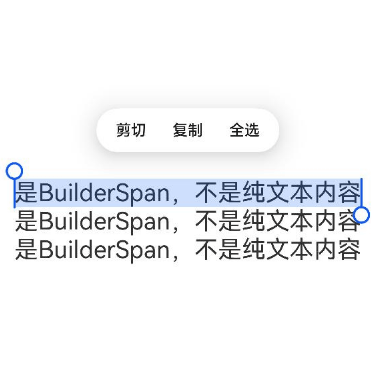

# RichEditor (系统接口)
<!--Kit: ArkUI-->
<!--Subsystem: ArkUI-->
<!--Owner: @carnivore233-->
<!--Designer: @xiangyuan6-->
<!--Tester: @mateng_Holtens-->
<!--Adviser: @Brilliantry_Rui-->

支持图文混排和文本交互式编辑的组件。

>  **说明：**
>
> - 该组件从API version 10开始支持。后续版本如有新增内容，则采用上角标单独标记该内容的起始版本。
>
> - 本模块接口仅可在Stage模型下使用。
>
> - 当前页面仅包含本模块的系统接口，其他公开接口参见[RichEditor](ts-basic-components-richeditor.md)。
## RichEditorBuilderSpanOptions<sup>11+</sup>

设置builder的偏移位置和样式。

**系统接口：** 此接口为系统接口。

**系统能力：** SystemCapability.ArkUI.ArkUI.Full

| 名称     | 类型     | 必填   | 说明                                    |
| ------ | ------ | ---- | ------------------------------------- |
| dragBackgroundColor<sup>18+</sup> | [ColorMetrics](../js-apis-arkui-graphics.md#colormetrics12) | 否 | 设置 BuilderSpan 单独拖拽时的背板颜色。未配置或传入无效颜色值时，按默认值处理。<br/>默认值：跟随系统主题拖拽背板色。  |
| isDragShadowNeeded<sup>18+</sup> | boolean | 否    | 设置 BuilderSpan 单独拖拽时是否需要投影。true表示需要投影，false表示不需要投影。未配置或传入无效值时，按默认值处理。<br/>默认值：true。 |

## RichEditorGesture<sup>11+</sup>

用户手势事件。

**系统接口：** 此接口为系统接口。

**系统能力：** SystemCapability.ArkUI.ArkUI.Full

| 名称          | 类型         | 必填   | 说明            |
| ----------- | ---------- | ---- | ------------- |
| onDoubleClick<sup>14+</sup> | Callback\<[GestureEvent](ts-gesture-common.md#gestureevent对象说明)\>  | 否    | 双击事件回调函数，在用户双击操作完成时触发。回调参数为[GestureEvent](ts-gesture-common.md#gestureevent对象说明)对象，包含手势事件信息。|

## RichEditorChangeValue<sup>12+</sup>

图文变化信息。

**系统接口：** 此接口为系统接口。

**系统能力：** SystemCapability.ArkUI.ArkUI.Full

| 名称 | 类型 | 必填 | 说明 |
| --- | --- | --- | --- |
| changeReason<sup>20+</sup> | [TextChangeReason](ts-text-common-sys.md#textchangereason20)  | 否 | 组件内容变化的原因，用于标识触发内容变化的操作类型（如用户输入、粘贴、剪切等），需通过注册onWillChange回调获取。开发者可根据changeReason的值在onWillChange回调中针对不同变化原因做出相应处理决策。字段缺省值为undefined。|

## 示例

### 示例1（获取组件内容变化原因）
从API version 20开始，该示例通过onWillChange接口返回的changeReason获取组件内容变化的原因。

```ts
@Entry
@Component
struct RichEditorExample {
  controller: RichEditorController = new RichEditorController();
  options: RichEditorOptions = { controller: this.controller };

  build() {
    Column() {
      RichEditor(this.options)
        .height('25%')
        .width('100%')
        .border({ width: 1, color: Color.Blue })
        .onWillChange((value: RichEditorChangeValue) => {
          console.info('onWillChange, changeReason=' + value.changeReason);
          return true; // 允许图文被更改
        })
    }
  }
}
```

### 示例2（设置自定义布局拖拽背板及拖拽投影配置）
从API version 18开始，该示例通过使用addBuilderSpan接口中的[dragBackgroundColor](#richeditorbuilderspanoptions11)和[isDragShadowNeeded](#richeditorbuilderspanoptions11)在拖拽场景中为自定义布局的拖拽背板和拖拽投影设置相关参数。

```ts
// xxx.ets
import { ColorMetrics } from '@kit.ArkUI';

@Entry
@Component
struct RichEditorDragConfigExample {
  controller: RichEditorController = new RichEditorController();
  options: RichEditorOptions = { controller: this.controller };
  build() {
    Column({ space: 10 }) {
      Column() {
        RichEditor(this.options)
          .onReady(() => {
            // 添加自定义布局Span，设置RGBA颜色拖拽背板且禁用拖拽投影
            this.controller.addBuilderSpan(() => {
              this.placeholderBuilder()
            }, {
              offset: -1,
              dragBackgroundColor: ColorMetrics.rgba(0xff, 0x80, 0, 0xff), // 设置拖拽背板为橙色
              isDragShadowNeeded: false // 禁用拖拽投影
            })
            // 添加自定义布局Span，设置拖拽背板且启用拖拽投影
            this.controller.addBuilderSpan(() => {
              this.placeholderBuilder()
            }, {
              offset: -1,
              dragBackgroundColor: ColorMetrics.resourceColor('#ffff0000')
                .blendColor(ColorMetrics.resourceColor('#ff00ff00')), // 设置基础拖拽背板颜色为红色，叠加混合色为绿色
              isDragShadowNeeded: true // 启用拖拽投影
            })
            this.controller.addBuilderSpan(() => {
              this.placeholderBuilder()
            }, { offset: -1 })
          })
          .borderWidth(1)
          .width('100%')
          .height('50%')
          .margin(50)
      }
      .width('100%')
      .margin({ top:100 })
    }
  }

  @Builder
  placeholderBuilder() {
    Row() {
      Text('是BuilderSpan，不是纯文本内容')
        .fontSize(22)
        .copyOption(CopyOptions.InApp)
    }
  }
}
```
