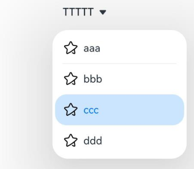
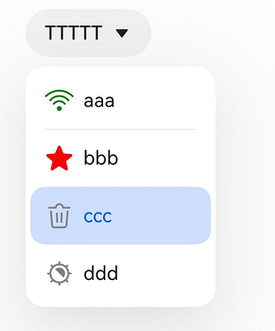
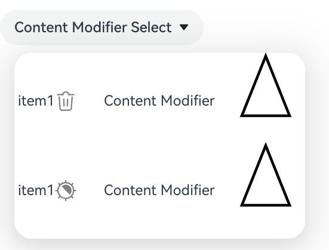
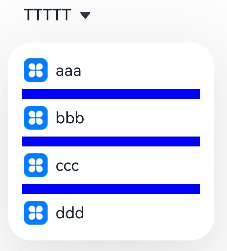
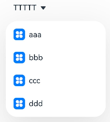
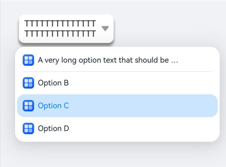
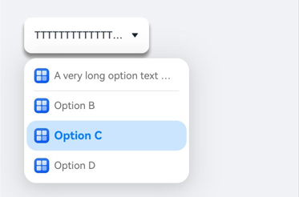
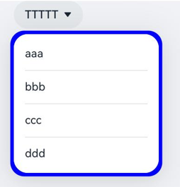

#  Select

提供下拉选择菜单，让用户在多个选项间选择。

>  **说明：**
>
>  - 本模块同时支持ArkTS-Dyn、ArkTS-Sta。
>
>  - 该组件从API version 8开始支持。后续版本如有新增内容，则采用上角标单独标记该内容的起始版本。

## 子组件

无

## 接口

Select(options: Array\<SelectOption\>)

**原子化服务API：** 从API version 11开始，该接口支持在原子化服务中使用。

**系统能力：** SystemCapability.ArkUI.ArkUI.Full

**ArkTS-Dyn起始版本：** 8

**ArkTS-Sta起始版本：** 23

**参数：**

| 参数名  | 类型                                           | 必填 | 说明           |
| ------- | ---------------------------------------------- | ---- | -------------- |
| options | Array\<[SelectOption](#selectoption对象说明)\> | 是   | 设置下拉选项。 |

## SelectOption对象说明

下拉菜单项的信息。

**系统能力：** SystemCapability.ArkUI.ArkUI.Full

| 名称 | 类型                            | 必填 | 说明             |
| ------ | ----------------------------------- | ---- | -------------- |
| value  | [ResourceStr](ts-types.md#resourcestr) | 是   | 下拉选项内容。<br/>**原子化服务API：** 从API version 11开始，该接口支持在原子化服务中使用。<br/> **ArkTS-Dyn起始版本：** 8 <br/> **ArkTS-Sta起始版本：** 23 |
| icon   | [ResourceStr](ts-types.md#resourcestr) | 否   | 下拉选项图片。<br/>**原子化服务API：** 从API version 11开始，该接口支持在原子化服务中使用。<br/> **ArkTS-Dyn起始版本：** 8 <br/> **ArkTS-Sta起始版本：** 23 |
| symbolIcon<sup>12+</sup>  | [SymbolGlyphModifier](ts-universal-attributes-attribute-modifier.md) | 否   | 下拉选项Symbol图片。<br/>symbolIcon优先级高于icon。<br/>**原子化服务API：** 从API version 12开始，该接口支持在原子化服务中使用。<br/> **ArkTS-Dyn起始版本：** 12 <br/> **ArkTS-Sta起始版本：** 23|

## MenuAlignType<sup>10+</sup>

定义Select组件下拉菜单与Select组件本身的对齐方式。

**原子化服务API：** 从API version 11开始，该接口支持在原子化服务中使用。

**系统能力：** SystemCapability.ArkUI.ArkUI.Full

**ArkTS-Dyn起始版本：** 10

**ArkTS-Sta起始版本：** 23

| 名称   | 值   | 说明                     |
| ------ | ---- | ------------------------ |
| START  | 0    | 菜单与Select组件左对齐。  |
| CENTER | 1    | 菜单与Select组件居中对齐。|
| END    | 2    | 菜单与Select组件右对齐。  |

## AvoidanceMode<sup>19+</sup>

定义Select下拉菜单的避让模式。

**原子化服务API：** 从API version 19开始，该接口支持在原子化服务中使用。

**系统能力：** SystemCapability.ArkUI.ArkUI.Full

**ArkTS-Dyn起始版本：** 19

**ArkTS-Sta起始版本：** 23

| 名称                | 值   | 说明                                                         |
| ------------------- | ---- | ------------------------------------------------------------ |
| COVER_TARGET       | 0    | 菜单覆盖目标组件。                                           |
| AVOID_AROUND_TARGET | 1    | 菜单在最大空间内显示（压缩滚动条）。                         |

## OnSelectCallback<sup>18+</sup>

type OnSelectCallback = (index: number, selectStr: string) => void

Select组件选择项的回调函数类型。

**原子化服务API：** 从API version 18开始，该接口支持在原子化服务中使用。

**系统能力：** SystemCapability.ArkUI.ArkUI.Full

**ArkTS-Dyn起始版本：** 18

**ArkTS-Sta起始版本：** 23

**参数：**

| 参数名     | 类型   | 必填 | 说明                 |
| ---------- | ------ | ---- | -------------------- |
| index      | number | 是   | 选中的项的索引。     |
| selectStr  | string | 是   | 选中的项的文本内容。 |

## MenuOutlineOptions<sup>20+</sup>

菜单外描边选项。

**原子化服务API：** 从API version 20开始，该接口支持在原子化服务中使用。

**系统能力：** SystemCapability.ArkUI.ArkUI.Full

**ArkTS-Dyn起始版本：** 20

**ArkTS-Sta起始版本：** 23

| 名称  | 类型                                                     | 必填 | 说明           |
| ----- | -------------------------------------------------------- | ---- | -------------- |
| width | [Dimension](ts-types.md#dimension10) \| [EdgeOutlineWidths](ts-types.md#edgeoutlinewidths9) | 否   | 外描边宽度。   |
| color | [ResourceColor](ts-types.md#resourcecolor) \| [EdgeColors](ts-types.md#edgecolors9) | 否   | 外描边颜色。   |

## MenuItemConfiguration<sup>12+</sup>

菜单项配置接口，用于ContentModifier中。

**原子化服务API：** 从API version 12开始，该接口支持在原子化服务中使用。

**系统能力：** SystemCapability.ArkUI.ArkUI.Full

**ArkTS-Dyn起始版本：** 12

**ArkTS-Sta起始版本：** 23

| 名称        | 类型                                                         | 只读 | 可选 | 说明                     |
| ----------- | ------------------------------------------------------------ | ---- | ---- | ------------------------ |
| value       | [ResourceStr](ts-types.md#resourcestr)                     | 否   | 否   | 菜单项的文本内容。       |
| icon        | [ResourceStr](ts-types.md#resourcestr)                     | 否   | 是   | 菜单项的图标。           |
| symbolIcon  | [SymbolGlyphModifier](ts-universal-attributes-attribute-modifier.md) | 否   | 是   | 菜单项的Symbol图标。     |
| selected    | boolean                                                      | 否   | 否   | 菜单项是否被选中。       |
| index       | number                                                       | 否   | 否   | 菜单项的索引。           |

### triggerSelect<sup>12+</sup>

triggerSelect(index: number, value: string): void

触发选中该菜单项。

**系统能力：** SystemCapability.ArkUI.ArkUI.Full

**ArkTS-Dyn起始版本：** 12

**ArkTS-Sta起始版本：** 23

**参数：**

| 参数名 | 类型   | 必填 | 说明                 |
| ------ | ------ | ---- | -------------------- |
| index  | number | 是   | 菜单项的索引。       |
| value  | string | 是   | 菜单项的文本内容。   |

## 属性

除支持[通用属性](ts-component-general-attributes.md)外，还支持以下属性：

### selected<sup>8+</sup>

selected(value: number | Resource)

设置下拉菜单初始选项的索引，第一项的索引为0。当不设置selected属性或设置为异常值时，默认选中值为-1，菜单项不选中；当设置为undefined、null时，选中第一项。

从API version 10开始，该属性支持[$$](../../../ui/state-management/arkts-two-way-sync.md)双向绑定变量。从API version 18开始，该属性支持[!!](../../../ui/state-management/arkts-new-binding.md#系统组件参数双向绑定)双向绑定变量。

**原子化服务API：** 从API version 11开始，该接口支持在原子化服务中使用。

**系统能力：** SystemCapability.ArkUI.ArkUI.Full

**ArkTS模式：** 该接口仅适用于ArkTS-Dyn。

**相关接口：** 该接口对应的ArkTS-Sta的接口是[selected](#selected23)。

**ArkTS-Dyn起始版本：** 8

**参数：**

| 参数名 | 类型                                                         | 必填 | 说明                     |
| ------ | ------------------------------------------------------------ | ---- | ------------------------ |
| value  | number&nbsp;\|&nbsp;[Resource](ts-types.md#resource)<sup>11+</sup>| 是   | 下拉菜单初始选项的索引，索引值从0开始。 |

### selected<sup>18+</sup>

selected(numCount: Optional\<number | Resource\>)

设置下拉菜单初始选项的索引，第一项的索引为0。当不设置selected属性或设置异常值时，默认选择值为-1，菜单项不选中；当设置为undefined、null时，选中第一项。

该属性支持[$$](../../../ui/state-management/arkts-two-way-sync.md)、[!!](../../../ui/state-management/arkts-new-binding.md#系统组件参数双向绑定)双向绑定变量。

**原子化服务API：** 从API version 18开始，该接口支持在原子化服务中使用。

**系统能力：** SystemCapability.ArkUI.ArkUI.Full

**ArkTS模式：** 该接口仅适用于ArkTS-Dyn。

**相关接口：** 该接口对应的ArkTS-Sta的接口是[selected](#selected23)。

**ArkTS-Dyn起始版本：** 18

**参数：**

| 参数名   | 类型                                                         | 必填 | 说明                                                         |
| -------- | ------------------------------------------------------------ | ---- | ------------------------------------------------------------ |
| numCount | [Optional](ts-universal-attributes-custom-property.md#optional12)\<number&nbsp;\|&nbsp;[Resource](ts-types.md#resource)\> | 是   | 下拉菜单初始选项的索引。<br/>当numCount的值为undefined时，选中第一项。 |

### selected<sup>23+</sup>

selected(numCount: int | Resource | undefined | Bindable\<int\> | Bindable\<Resource\>)

设置下拉菜单初始选项的索引，第一项的索引为0。当不设置selected属性或设置异常值时，默认选择值为-1，菜单项不选中；当设置为undefined、null时，选中第一项。

该属性支持Bindable双向绑定变量。

**系统能力：** SystemCapability.ArkUI.ArkUI.Full

**ArkTS模式：** 该接口仅适用于ArkTS-Sta。

**相关接口：** 该接口对应的ArkTS-Dyn的接口是[selected](#selected)和[selected<sup>18+</sup>](#selected18)。

**ArkTS-Sta起始版本：** 23

**参数：** 

| 参数名   | 类型                                                         | 必填 | 说明                                                         |
| -------- | ------------------------------------------------------------ | ---- | ------------------------------------------------------------ |
| numCount  | int&nbsp;\|&nbsp;[Resource](ts-types.md#resource) \| undefined \| Bindable\<int\> \| Bindable\<[Resource](ts-types.md#resource)\> | 是   | 下拉菜单初始选项的索引。<br/>当numCount的值为undefined时，选中第一项。 |

### value<sup>8+</sup>

value(value: ResourceStr)

设置下拉按钮的文本内容。选中菜单项后，按钮文本将自动更新为选中的菜单项文本。

从API version 10开始，该参数支持[$$](../../../ui/state-management/arkts-two-way-sync.md)双向绑定变量。从API version 18开始，该参数支持[!!](../../../ui/state-management/arkts-new-binding.md#系统组件参数双向绑定)双向绑定变量。

**原子化服务API：** 从API version 11开始，该接口支持在原子化服务中使用。

**系统能力：** SystemCapability.ArkUI.ArkUI.Full

**ArkTS模式：** 该接口仅适用于ArkTS-Dyn。

**相关接口：** 该接口对应的ArkTS-Sta的接口是[value](#value23)。

**ArkTS-Dyn起始版本：** 8

**参数：**

| 参数名 | 类型                                                 | 必填 | 说明                     |
| ------ | ---------------------------------------------------- | ---- | ------------------------ |
| value  | [ResourceStr](ts-types.md#resourcestr)<sup>11+</sup> | 是   | 下拉按钮本身的文本内容。<br/>**说明：** 文本长度大于列宽时，文本被截断。 |

### value<sup>18+</sup>

value(resStr: Optional\<ResourceStr\>)

设置下拉按钮的文本内容。选中菜单项后，按钮文本将自动更新为选中的菜单项文本。与[value](#value)相比，resStr参数新增了对undefined类型的支持。

该参数支持[$$](../../../ui/state-management/arkts-two-way-sync.md)、[!!](../../../ui/state-management/arkts-new-binding.md#系统组件参数双向绑定)双向绑定变量。

**原子化服务API：** 从API version 18开始，该接口支持在原子化服务中使用。

**系统能力：** SystemCapability.ArkUI.ArkUI.Full

**ArkTS模式：** 该接口仅适用于ArkTS-Dyn。

**相关接口：** 该接口对应的ArkTS-Sta的接口是[value](#value23)。

**ArkTS-Dyn起始版本：** 18

**参数：**

| 参数名 | 类型                                                         | 必填 | 说明                                                         |
| ------ | ------------------------------------------------------------ | ---- | ------------------------------------------------------------ |
| resStr | [Optional](ts-universal-attributes-custom-property.md#optional12)\<[ResourceStr](ts-types.md#resourcestr)\> | 是   | 下拉按钮本身的文本内容。<br/>当resStr的值为undefined时维持上次取值。 |

### value<sup>23+</sup>

value(resStr: ResourceStr | undefined | Bindable\<string\> | Bindable\<Resource\>)

设置下拉按钮的文本内容。选中菜单项后，按钮文本将自动更新为选中的菜单项文本。string和resource类型支持Bindable双向绑定变量。

**系统能力：** SystemCapability.ArkUI.ArkUI.Full

**ArkTS模式：** 该接口仅适用于ArkTS-Sta。

**相关接口：** 该接口对应的ArkTS-Dyn的接口是[value](#value)和[value<sup>18+</sup>](#value18)。

**ArkTS-Sta起始版本：** 23

**参数：** 

| 参数名 | 类型                                                         | 必填 | 说明                                                         |
| ------ | ------------------------------------------------------------ | ---- | ------------------------------------------------------------ |
| resStr | <[Resource](ts-types.md#resource) \| undefined \| Bindable\<string\> \| Bindable\<[Resource](ts-types.md#resource)\> | 是   | 下拉按钮本身的文本内容。<br/>当resStr的值为undefined时维持上次取值。 |

### controlSize<sup>12+</sup>

controlSize(value: ControlSize)

设置Select组件的尺寸。

**原子化服务API：** 从API version 12开始，该接口支持在原子化服务中使用。

**系统能力：** SystemCapability.ArkUI.ArkUI.Full

**ArkTS模式：** 该接口仅适用于ArkTS-Dyn。

**相关接口：** 该接口对应的ArkTS-Sta的接口是[controlSize<sup>23+</sup>](#controlsize23).

**ArkTS-Dyn起始版本：** 12

**参数：**

| 参数名 | 类型                                                         | 必填 | 说明                                              |
| ------ | ------------------------------------------------------------ | ---- | ------------------------------------------------- |
| value  | [ControlSize](ts-basic-components-button.md#controlsize11枚举说明)<sup>11+</sup>| 是   | Select组件的尺寸。<br/>默认值：ControlSize.NORMAL |

controlSize、width、height接口作用优先级：

   1）如果开发者只设置了width和height，当文字大小设置为较大的值时，文字会超出组件大小，且以省略号方式显示；

   2）如果开发者只设置了controlSize，没有设置width和height，组件宽高自适应文字，文字不超出组件，并设置最小宽度minWidth和最小高度minHeight；

   3）如果同时设置了controlSize、width、height接口，width和height设置的值生效，但如果width和height设置的值小于controlSize设置的最小宽度minWidth和最小高度minHeight，width和height设置的值不生效，宽高仍保持controlSize设置的最小宽度minWidth和最小高度minHeight。

### controlSize<sup>18+</sup>

controlSize(size: Optional\<ControlSize\>)

设置Select组件的尺寸。与[controlSize](#controlsize12)<sup>12+</sup>相比，size参数新增了对undefined类型的支持。

**原子化服务API：** 从API version 18开始，该接口支持在原子化服务中使用。

**系统能力：** SystemCapability.ArkUI.ArkUI.Full

**ArkTS模式：** 该接口仅适用于ArkTS-Dyn。

**相关接口：** 该接口对应的ArkTS-Sta的接口是[controlSize<sup>23+</sup>](#controlsize23)。

**ArkTS-Dyn起始版本：** 18

**参数：** 

| 参数名 | 类型                                                         | 必填 | 说明                                                         |
| ------ | ------------------------------------------------------------ | ---- | ------------------------------------------------------------ |
| size   | [Optional](ts-universal-attributes-custom-property.md#optional12)\<[ControlSize](ts-basic-components-button.md#controlsize11枚举说明)\> | 是   | Select组件的尺寸。<br/>当size的值为undefined时，默认值为ControlSize.NORMAL。 |

controlSize、width、height接口作用优先级：

   1）如果开发者只设置了width和height，当文字大小设置的是比较大的值的时候，文字超出组件大小，且以省略号方式显示；

   2）如果开发者只设置了controlSize，没有设置width和height，组件宽高自适应文字，文字不超出组件，并设置最小宽度minWidth和最小高度minHeight；

   3）如果controlSize、width、height接口都设置了，width和height设置的值生效，但如果width和height设置的值小于controlSize设置的最小宽度minWidth和最小高度minHeight，width和height设置的值不生效，宽高仍保持controlSize设置的最小宽度minWidth和最小高度minHeight。

### controlSize<sup>23+</sup>

controlSize(value: ControlSize | undefined)

设置Select组件的尺寸。

**系统能力：** SystemCapability.ArkUI.ArkUI.Full

**ArkTS模式：** 该接口仅适用于ArkTS-Sta。

**相关接口：** 该接口对应的ArkTS-Dyn的接口是[controlSize<sup>12+</sup>](#controlsize12)和[controlSize<sup>18+</sup>](#controlsize18)。

**ArkTS-Sta起始版本：** 23

**参数：** 

| 参数名 | 类型 | 必填 | 说明                                                         |
| ------ | ------------------------------------------------------------ | ---- | ------------------------------------------------------------ |
| value  | [ControlSize](ts-basic-components-button.md#controlsize11枚举说明) \| undefined | 是   | Select组件的尺寸。<br/>当value的值为undefined时，默认值为ControlSize.NORMAL。 |

controlSize、width、height接口作用优先级：

   1）如果开发者只设置了width和height，当文字大小设置的是比较大的值的时候，文字超出组件大小，且以省略号方式显示；

   2）如果开发者只设置了controlSize，没有设置width和height，组件宽高自适应文字，文字不超出组件，并设置最小宽度minWidth和最小高度minHeight；

   3）如果controlSize、width、height接口都设置了，width和height设置的值生效，但如果width和height设置的值小于controlSize设置的最小宽度minWidth和最小高度minHeight，width和height设置的值不生效，宽高仍保持controlSize设置的最小宽度minWidth和最小高度minHeight。

### menuItemContentModifier<sup>12+</sup>

menuItemContentModifier(modifier: ContentModifier\<MenuItemConfiguration\>)

定制Select下拉菜单项内容区的方法。在应用了menuItemContentModifier后，下拉菜单的内容将完全由开发者自定义，此时为Select组件设置的分割线、选项颜色及下拉菜单的字体颜色等属性将不再生效。

**原子化服务API：** 从API version 12开始，该接口支持在原子化服务中使用。

**系统能力：** SystemCapability.ArkUI.ArkUI.Full

**ArkTS模式：** 该接口仅适用于ArkTS-Dyn。

**相关接口：** 该接口对应的ArkTS-Sta的接口是[menuItemContentModifier<sup>23+</sup>](#menuitemcontentmodifier23)。

**ArkTS-Dyn起始版本：** 12

**参数：**

| 参数名 | 类型                                          | 必填 | 说明                                             |
| ------ | --------------------------------------------- | ---- | ------------------------------------------------ |
| modifier  | [ContentModifier\<MenuItemConfiguration\>](#menuitemconfiguration12对象说明) | 是   | 在Select组件上，定制下拉菜单项内容区的方法。<br/>modifier：内容修改器，开发者需要自定义class实现ContentModifier接口。 |

### menuItemContentModifier<sup>18+</sup>

menuItemContentModifier(modifier: Optional\<ContentModifier\<MenuItemConfiguration\>>)

定制Select下拉菜单项内容区的方法。与[menuItemContentModifier](#menuitemcontentmodifier12)<sup>12+</sup>相比，modifier参数新增了对undefined类型的支持。在应用了menuItemContentModifier后，下拉菜单的内容将完全由开发者自定义，此时为Select组件设置的分割线、选项颜色及下拉菜单的字体颜色等属性将不再生效。

**原子化服务API：** 从API version 18开始，该接口支持在原子化服务中使用。

**系统能力：** SystemCapability.ArkUI.ArkUI.Full

**ArkTS模式：** 该接口仅适用于ArkTS-Dyn。

**相关接口：** 该接口对应的ArkTS-Sta的接口是[menuItemContentModifier<sup>23+</sup>](#menuitemcontentmodifier23)。

**ArkTS-Dyn起始版本：** 18

**参数：**

| 参数名   | 类型                                                         | 必填 | 说明                                                         |
| -------- | ------------------------------------------------------------ | ---- | ------------------------------------------------------------ |
| modifier | [Optional](ts-universal-attributes-custom-property.md#optional12)\<[ContentModifier\<MenuItemConfiguration\>](#menuitemconfiguration12对象说明)\> | 是   | 在Select组件上，定制下拉菜单项内容区的方法。<br/>modifier：内容修改器，开发者需要自定义class实现ContentModifier接口。<br/>当modifier的值为undefined时，不使用内容修改器。 |

### menuItemContentModifier<sup>23+</sup>

menuItemContentModifier(modifier: ContentModifier\<MenuItemConfiguration\> | undefined)

定制Select下拉菜单项内容区的方法。

**系统能力：** SystemCapability.ArkUI.ArkUI.Full

**ArkTS模式：** 该接口仅适用于ArkTS-Sta。

**相关接口：** 该接口对应的ArkTS-Dyn的接口是[menuItemContentModifier<sup>12+</sup>](#menuitemcontentmodifier12)和[menuItemContentModifier<sup>18+</sup>](#menuitemcontentmodifier18)。

**ArkTS-Sta起始版本：** 23

**参数：**

| 参数名   | 类型                                                         | 必填 | 说明                                                         |
| -------- | ------------------------------------------------------------ | ---- | ------------------------------------------------------------ |
| modifier | [ContentModifier\<MenuItemConfiguration\>](#menuitemconfiguration12对象说明) \| undefined | 是   | 在Select组件上，定制下拉菜单项内容区的方法。<br/>modifier：内容修改器，开发者需要自定义class实现ContentModifier接口。<br/>当modifier的值为undefined时，不使用内容修改器。 |

### divider<sup>12+</sup>

divider(options: Optional\<DividerOptions\> | null)

设置分割线样式，不设置该属性则按"默认值"展示分割线。

**原子化服务API：** 从API version 12开始，该接口支持在原子化服务中使用。

**系统能力：** SystemCapability.ArkUI.ArkUI.Full

**ArkTS模式：** 该接口仅适用于ArkTS-Dyn。

**相关接口：** 该接口对应的ArkTS-Sta的接口是[divider<sup>23+</sup>](#divider23).

**ArkTS-Dyn起始版本：** 12

**参数：**

| 参数名 | 类型    | 必填 | 说明                                                                  |
| ------ | ------- | ---- | --------------------------------------------------------------------- |
| options  | Optional\<[DividerOptions](ts-basic-components-textpicker.md#divideroptions12对象说明)\> \| null | 是   | 1.设置DividerOptions，则按设置的样式显示分割线。<br/>默认值：<br/>{<br/>strokeWidth: '1px' , <br/>color: '#33182431'<br/>}<br/>2.设置为null时，不显示分割线。<br/>3.strokeWidth设置过宽时，会覆盖文字。分割线会从每一个Item底部开始，同时向上向下画分割线。<br/>4.startMargin和endMargin的默认值与不设置divider属性时的分割线样式保持一致。startMargin和endMargin的和与optionWidth的值相等时，不显示分割线。 startMargin和endMargin的和超过optionWidth的值时，按照默认样式显示分割线.|

### divider<sup>23+</sup>

divider(value: DividerOptions | null | undefined)

设置分割线样式，不设置该属性则按"默认值"展示分割线。

**系统能力：** SystemCapability.ArkUI.ArkUI.Full

**ArkTS模式：** 该接口仅适用于ArkTS-Sta。

**相关接口：** 该接口对应的ArkTS-Dyn的接口是[divider<sup>12+</sup>](#divider12)。

**ArkTS-Sta起始版本：** 23

**参数：** 

| 参数名 | 类型    | 必填 | 说明                                                                  |
| ------ | ------- | ---- | --------------------------------------------------------------------- |
| value  | [DividerOptions](ts-basic-components-textpicker.md#divideroptions12对象说明) \| null \| undefined| 是   | 1.设置DividerOptions，则按设置的样式显示分割线。<br/>默认值：<br/>{<br/>strokeWidth: '1px' , <br/>color: '#33182431'<br/>}<br/>2.设置为null时，不显示分割线。<br/>3.strokeWidth设置过宽时，会覆盖文字。分割线会从每一个Item底部开始，同时向上向下画分割线。<br/>4.startMargin和endMargin的默认值与不设置divider属性时的分割线样式保持一致。startMargin和endMargin的和与optionWidth的值相等时，不显示分割线。 startMargin和endMargin的和超过optionWidth的值时，按照默认样式显示分割线。|

### dividerStyle<sup>19+</sup>

dividerStyle(style: Optional\<DividerStyleOptions\>)

设置分割线样式，不设置该属性则按"默认值"展示分割线。该属性与divider互斥，按调用顺序生效。

**原子化服务API：** 从API version 19开始，该接口支持在原子化服务中使用。

**系统能力：** SystemCapability.ArkUI.ArkUI.Full

**ArkTS模式：** 该接口仅适用于ArkTS-Dyn。

**相关接口：** 该接口对应的ArkTS-Sta的接口是[dividerStyle<sup>23+</sup>](#dividerstyle23)。

**ArkTS-Dyn起始版本：** 19

**参数：**

| 参数名 | 类型    | 必填 | 说明                                                                  |
| ------ | ------- | ---- | --------------------------------------------------------------------- |
| style  | Optional\<[DividerStyleOptions](ts-types.md#dividerstyleoptions12)\>  | 是   | 1.设置DividerOptions，则按设置的样式显示分割线。<br/>默认值：<br/>{<br/>strokeWidth: '1px' , <br/>color: '#33182431'<br/>}<br/>2.设置为null或undefined时，展示默认分割线。<br/>3.当mode为FLOAT_ABOVE_MENU时，strokeWidth设置过宽时，会覆盖文字。分割线会从每一个Item底部开始，同时向上向下画分割线。当mode为EMBEDDED_IN_MENU时，分割线在Menu中展开，独立占用高度。<br/>4.startMargin和endMargin的默认值与不设置divider属性时的分割线样式保持一致。startMargin和endMargin的和与optionWidth的值相等时，不显示分割线。startMargin和endMargin的和超过optionWidth的值时，按照默认样式显示分割线。|

### dividerStyle<sup>23+</sup>

dividerStyle(value: DividerStyleOptions | undefined)

设置分割线样式，不设置该属性则按"默认值"展示分割线。该属性与divider互斥，按调用顺序生效。

**系统能力：** SystemCapability.ArkUI.ArkUI.Full

**ArkTS模式：** 该接口仅适用于ArkTS-Sta。

**相关接口：** 该接口对应的ArkTS-Dyn的接口是[dividerStyle<sup>19+</sup>](#dividerstyle19)。

**ArkTS-Sta起始版本：** 23

**参数：**

| 参数名 | 类型    | 必填 | 说明                                                                  |
| ------ | ------- | ---- | --------------------------------------------------------------------- |
| value  |[DividerStyleOptions](ts-types.md#dividerstyleoptions12) \| undefined| 是   | 1.设置DividerOptions，则按设置的样式显示分割线。<br/>默认值：<br/>{<br/>strokeWidth: '1px' , <br/>color: '#33182431'<br/>}<br/>2.设置为null或undefined时，展示默认分割线。<br/>3.当mode为FLOAT_ABOVE_MENU时，strokeWidth设置过宽时，会覆盖文字。分割线会从每一个Item底部开始，同时向上向下画分割线。当mode为EMBEDDED_IN_MENU时，分割线在Menu中展开，独立占用高度。<br/>4.startMargin和endMargin的默认值与不设置divider属性时的分割线样式保持一致。startMargin和endMargin的和与optionWidth的值相等时，不显示分割线。startMargin和endMargin的和超过optionWidth的值时，按照默认样式显示分割线。|

### font<sup>8+</sup>

font(value: Font)

设置下拉按钮本身的文本样式。当size为0时，文本不显示，当size为负值时，文本的size按照默认值显示。

**原子化服务API：** 从API version 11开始，该接口支持在原子化服务中使用。

**系统能力：** SystemCapability.ArkUI.ArkUI.Full

**ArkTS模式：** 该接口仅适用于ArkTS-Dyn。

**相关接口：** 该接口对应的ArkTS-Sta的接口是[font<sup>23+</sup>](#font23)。

**ArkTS-Dyn起始版本：** 8

**参数：** 

| 参数名 | 类型                     | 必填 | 说明                                                         |
| ------ | ------------------------ | ---- | ------------------------------------------------------------ |
| value  | [Font](ts-types.md#font)| 是   | 下拉按钮本身的文本样式。<br/>API Version 11及以前默认值：<br/>{<br/>size:&nbsp;`$r('sys.float.ohos_id_text_size_button1')`,<br/>weight:&nbsp;FontWeight.Medium<br/>} <br/>API Version 12以后，如果设置controlSize的值为：controlSize.SMALL，size默认值是`$r('sys.float.ohos_id_text_size_button2')`，否则为`$r('sys.float.ohos_id_text_size_button1')`。 |

### font<sup>18+</sup>

font(selectFont: Optional\<Font\>)

设置下拉按钮本身的文本样式。当size为0时，文本不显示，当size为负值时，文本的size按照默认值显示。与[font](#font)相比，selectFont参数新增了对undefined类型的支持。

**原子化服务API：** 从API version 18开始，该接口支持在原子化服务中使用。

**系统能力：** SystemCapability.ArkUI.ArkUI.Full

**ArkTS模式：** 该接口仅适用于ArkTS-Dyn。

**相关接口：** 该接口对应的ArkTS-Sta的接口是[font<sup>23+</sup>](#font23)。

**ArkTS-Dyn起始版本：** 18

**参数：** 

| 参数名     | 类型                                                         | 必填 | 说明                                                         |
| ---------- | ------------------------------------------------------------ | ---- | ------------------------------------------------------------ |
| selectFont | [Optional](ts-universal-attributes-custom-property.md#optional12)\<[Font](ts-types.md#font)\> | 是   | 下拉按钮本身的文本样式。<br/>如果设置controlSize的值为：controlSize.SMALL，size默认值是`$r('sys.float.ohos_id_text_size_button2')`，否则为`$r('sys.float.ohos_id_text_size_button1')`。<br/>当value的值为undefined时，恢复为系统文本样式。 |

### font<sup>23+</sup>

font(value: Font | undefined)

设置下拉按钮本身的文本样式。当size为0时，文本不显示，当size为负值时，文本的size按照默认值显示。与[font](#font)相比，value参数新增了对undefined类型的支持。

**系统能力：** SystemCapability.ArkUI.ArkUI.Full

**ArkTS模式：** 该接口仅适用于ArkTS-Sta。

**相关接口：** 该接口对应的ArkTS-Dyn的接口是[font](#font)和[font<sup>18+</sup>](#font18)。

**ArkTS-Sta起始版本：** 23

**参数：** 

| 参数名     | 类型                                                         | 必填 | 说明                                                         |
| ---------- | ------------------------------------------------------------ | ---- | ------------------------------------------------------------ |
| value | [Font](ts-types.md#font) \| undefined | 是   | 下拉按钮本身的文本样式。<br/>如果设置controlSize的值为：controlSize.SMALL，size默认值是`$r('sys.float.ohos_id_text_size_button2')`，否则为`$r('sys.float.ohos_id_text_size_button1')`。<br/>当value的值为undefined时，恢复为系统文本样式。 |

### fontColor<sup>8+</sup>

fontColor(value: ResourceColor)

设置下拉按钮本身的文本颜色。

**原子化服务API：** 从API version 11开始，该接口支持在原子化服务中使用。

**系统能力：** SystemCapability.ArkUI.ArkUI.Full

**ArkTS模式：** 该接口仅适用于ArkTS-Dyn。

**相关接口：** 该接口对应的ArkTS-Sta的接口是[fontColor<sup>23+</sup>](#fontcolor23)。

**ArkTS-Dyn起始版本：** 8

**参数：** 

| 参数名 | 类型                                       | 必填 | 说明                                                         |
| ------ | ------------------------------------------ | ---- | ------------------------------------------------------------ |
| value  | [ResourceColor](ts-types.md#resourcecolor) | 是   | 下拉按钮本身的文本颜色。<br/>默认值：`$r('sys.color.ohos_id_color_text_primary')`混合`$r('sys.color.ohos_id_alpha_content_primary')`的透明度。 |

### fontColor<sup>18+</sup>

fontColor(resColor: Optional\<ResourceColor\>)

设置下拉按钮本身的文本颜色。与[fontColor](#fontcolor)相比，resColor参数新增了对undefined类型的支持。

**原子化服务API：** 从API version 18开始，该接口支持在原子化服务中使用。

**系统能力：** SystemCapability.ArkUI.ArkUI.Full

**ArkTS模式：** 该接口仅适用于ArkTS-Dyn。

**相关接口：** 该接口对应的ArkTS-Sta的接口是[fontColor<sup>23+</sup>](#fontcolor23)。

**ArkTS-Dyn起始版本：** 18

**参数：** 

| 参数名   | 类型                                                         | 必填 | 说明                                                         |
| -------- | ------------------------------------------------------------ | ---- | ------------------------------------------------------------ |
| resColor | [Optional](ts-universal-attributes-custom-property.md#optional12)\<[ResourceColor](ts-types.md#resourcecolor)\> | 是   | 下拉按钮本身的文本颜色。<br/>当resColor的值为undefined时，默认值：`$r('sys.color.ohos_id_color_text_primary')`混合`$r('sys.color.ohos_id_alpha_content_primary')`的透明度。<br/>当value的值为undefined时，维持上次取值。 |

### fontColor<sup>23+</sup>

fontColor(value: ResourceColor | undefined)

设置下拉按钮本身的文本颜色。与[fontColor](#fontcolor)相比，value参数新增了对undefined类型的支持。

**系统能力：** SystemCapability.ArkUI.ArkUI.Full

**ArkTS模式：** 该接口仅适用于ArkTS-Sta。

**相关接口：** 该接口对应的ArkTS-Dyn的接口是[fontColor](#fontcolor)和[fontColor<sup>18+</sup>](#fontcolor18)。

**ArkTS-Sta起始版本：** 23

**参数：** 

| 参数名   | 类型                                                         | 必填 | 说明                                                         |
| -------- | ------------------------------------------------------------ | ---- | ------------------------------------------------------------ |
| value | [ResourceColor](ts-types.md#resourcecolor) \| undefined | 是   | 下拉按钮本身的文本颜色。<br/>当resColor的值为undefined时，默认值：`$r('sys.color.ohos_id_color_text_primary')`混合`$r('sys.color.ohos_id_alpha_content_primary')`的透明度。<br/>当value的值为undefined时，维持上次取值。 |

### selectedOptionBgColor<sup>8+</sup>

selectedOptionBgColor(value: ResourceColor)

设置下拉菜单选中项的背景色。

**原子化服务API：** 从API version 11开始，该接口支持在原子化服务中使用。

**系统能力：** SystemCapability.ArkUI.ArkUI.Full

**ArkTS模式：** 该接口仅适用于ArkTS-Dyn。

**相关接口：** 该接口对应的ArkTS-Sta的接口是[selectedOptionBgColor<sup>23+</sup>](#selectedoptionbgcolor23)。

**ArkTS-Dyn起始版本：** 8

**参数：** 

| 参数名 | 类型                                       | 必填 | 说明                                                         |
| ------ | ------------------------------------------ | ---- | ------------------------------------------------------------ |
| value  | [ResourceColor](ts-types.md#resourcecolor) | 是   | 下拉菜单选中项的背景色。<br/>默认值：`$r('sys.color.ohos_id_color_component_activated')`混合`$r('sys.color.ohos_id_alpha_highlight_bg')`的透明度。 |

### selectedOptionBgColor<sup>18+</sup>

selectedOptionBgColor(resColor: Optional\<ResourceColor\>)

设置下拉菜单选中项的背景色。与[selectedOptionBgColor](#selectedoptionbgcolor)相比，resColor参数新增了对undefined类型的支持。

**原子化服务API：** 从API version 18开始，该接口支持在原子化服务中使用。

**系统能力：** SystemCapability.ArkUI.ArkUI.Full

**ArkTS模式：** 该接口仅适用于ArkTS-Dyn。

**相关接口：** 该接口对应的ArkTS-Sta的接口是[selectedOptionBgColor<sup>23+</sup>](#selectedoptionbgcolor23)。

**ArkTS-Dyn起始版本：** 18

**参数：** 

| 参数名   | 类型                                                         | 必填 | 说明                                                         |
| -------- | ------------------------------------------------------------ | ---- | ------------------------------------------------------------ |
| resColor | [Optional](ts-universal-attributes-custom-property.md#optional12)\<[ResourceColor](ts-types.md#resourcecolor)\> | 是   | 下拉菜单选中项的背景色。<br/>当resColor的值为undefined时，默认值：`$r('sys.color.ohos_id_color_component_activated')`混合`$r('sys.color.ohos_id_alpha_highlight_bg')`的透明度。 |

### selectedOptionBgColor<sup>23+</sup>

selectedOptionBgColor(value: ResourceColor | undefined)

设置下拉菜单选中项的背景色。与[selectedOptionBgColor](#selectedoptionbgcolor)相比，resColor参数新增了对undefined类型的支持。

**系统能力：** SystemCapability.ArkUI.ArkUI.Full

**ArkTS模式：** 该接口仅适用于ArkTS-Sta。

**相关接口：** 该接口对应的ArkTS-Dyn的接口是[selectedOptionBgColor](#selectedoptionbgcolor)和[selectedOptionBgColor<sup>18+</sup>](#selectedoptionbgcolor18)。

**ArkTS-Sta起始版本：** 23

**参数：** 

| 参数名   | 类型                                                         | 必填 | 说明                                                         |
| -------- | ------------------------------------------------------------ | ---- | ------------------------------------------------------------ |
| value  | [ResourceColor](ts-types.md#resourcecolor) \| undefined| 是   | 下拉菜单选中项的背景色。<br/>当resColor的值为undefined时，默认值：`$r('sys.color.ohos_id_color_component_activated')`混合`$r('sys.color.ohos_id_alpha_highlight_bg')`的透明度。 |

### selectedOptionFont<sup>8+</sup>

selectedOptionFont(value: Font)

设置下拉菜单选中项的文本样式。当size为0的时候，文本不显示，当size为负值的时候，文本的size按照默认值显示。

**原子化服务API：** 从API version 11开始，该接口支持在原子化服务中使用。

**系统能力：** SystemCapability.ArkUI.ArkUI.Full

**ArkTS模式：** 该接口仅适用于ArkTS-Dyn。

**相关接口：** 该接口对应的ArkTS-Sta的接口是[selectedOptionFont<sup>23+</sup>](#selectedoptionfont23)。

**ArkTS-Dyn起始版本：** 8

**参数：** 

| 参数名 | 类型                     | 必填 | 说明                                                         |
| ------ | ------------------------ | ---- | ------------------------------------------------------------ |
| value  | [Font](ts-types.md#font)  | 是   | 下拉菜单选中项的文本样式。<br/>默认值：<br/>{<br/>size:&nbsp;$r('sys.float.ohos_id_text_size_body1'),<br/>weight:&nbsp;FontWeight.Regular<br/>} |

### selectedOptionFont<sup>18+</sup>

selectedOptionFont(selectFont: Optional\<Font\>)

设置下拉菜单选中项的文本样式。当size为0的时候，文本不显示，当size为负值的时候，文本的size按照默认值显示。与[selectedOptionFont](#selectedoptionfont)相比，selectFont参数新增了对undefined类型的支持。

**原子化服务API：** 从API version 18开始，该接口支持在原子化服务中使用。

**系统能力：** SystemCapability.ArkUI.ArkUI.Full

**ArkTS模式：** 该接口仅适用于ArkTS-Dyn。

**相关接口：** 该接口对应的ArkTS-Sta的接口是[selectedOptionFont<sup>23+</sup>](#selectedoptionfont23)。

**ArkTS-Dyn起始版本：** 18

**参数：** 

| 参数名     | 类型                                                         | 必填 | 说明                                                         |
| ---------- | ------------------------------------------------------------ | ---- | ------------------------------------------------------------ |
| selectFont | [Optional](ts-universal-attributes-custom-property.md#optional12)\<[Font](ts-types.md#font)\> | 是   | 下拉菜单选中项的文本样式。<br/>当value的值为undefined时，默认值：<br/>{<br/>size:&nbsp;$r('sys.float.ohos_id_text_size_body1'),<br/>weight:&nbsp;FontWeight.Regular<br/>} |

### selectedOptionFont<sup>23+</sup>

selectedOptionFont(value: Font | undefined)

设置下拉菜单选中项的文本样式。当size为0的时候，文本不显示，当size为负值的时候，文本的size按照默认值显示。与[selectedOptionFont](#selectedoptionfont)相比，value参数新增了对undefined类型的支持。

**系统能力：** SystemCapability.ArkUI.ArkUI.Full

**ArkTS模式：** 该接口仅适用于ArkTS-Sta。

**相关接口：** 该接口对应的ArkTS-Dyn的接口是[selectedOptionFont](#selectedoptionfont)和[selectedOptionFont<sup>18+</sup>](#selectedoptionfont18)。

**ArkTS-Sta起始版本：** 23

**参数：** 

| 参数名     | 类型                                                         | 必填 | 说明                                                         |
| ---------- | ------------------------------------------------------------ | ---- | ------------------------------------------------------------ |
| value | [Font](ts-types.md#font) \| undefined | 是   | 下拉菜单选中项的文本样式。<br/>当value的值为undefined时，默认值：<br/>{<br/>size:&nbsp;$r('sys.float.ohos_id_text_size_body1'),<br/>weight:&nbsp;FontWeight.Regular<br/>} |

### selectedOptionFontColor<sup>8+</sup>

selectedOptionFontColor(value: ResourceColor)

设置下拉菜单选中项的文本颜色。

**原子化服务API：** 从API version 11开始，该接口支持在原子化服务中使用。

**系统能力：** SystemCapability.ArkUI.ArkUI.Full

**ArkTS模式：** 该接口仅适用于ArkTS-Dyn。

**相关接口：** 该接口对应的ArkTS-Sta的接口是[selectedOptionFontColor<sup>23+</sup>](#selectedoptionfontcolor23)。

**ArkTS-Dyn起始版本：** 8

**参数：** 

| 参数名 | 类型                                       | 必填 | 说明                                                         |
| ------ | ------------------------------------------ | ---- | ------------------------------------------------------------ |
| value  | [ResourceColor](ts-types.md#resourcecolor)| 是   | 下拉菜单选中项的文本颜色。<br/>默认值：$r('sys.color.ohos_id_color_text_primary_activated') |

### selectedOptionFontColor<sup>18+</sup>

selectedOptionFontColor(resColor: Optional\<ResourceColor\>)

设置下拉菜单选中项的文本颜色。与[selectedOptionFontColor](#selectedoptionfontcolor)相比，resColor参数新增了对undefined类型的支持。

**原子化服务API：** 从API version 18开始，该接口支持在原子化服务中使用。

**系统能力：** SystemCapability.ArkUI.ArkUI.Full

**ArkTS模式：** 该接口仅适用于ArkTS-Dyn。

**相关接口：** 该接口对应的ArkTS-Sta的接口是[selectedOptionFontColor<sup>23+</sup>](#selectedoptionfontcolor23)。

**ArkTS-Dyn起始版本：** 18

**参数：** 

| 参数名   | 类型                                                         | 必填 | 说明                                                         |
| -------- | ------------------------------------------------------------ | ---- | ------------------------------------------------------------ |
| resColor | [Optional](ts-universal-attributes-custom-property.md#optional12)\<[ResourceColor](ts-types.md#resourcecolor)\> | 是   | 下拉菜单选中项的文本颜色。<br/>当resColor的值为undefined时，默认值为$r('sys.color.ohos_id_color_text_primary_activated')。 |

### selectedOptionFontColor<sup>23+</sup>

selectedOptionFontColor(value: ResourceColor | undefined)

设置下拉菜单选中项的文本颜色。与[selectedOptionFontColor](#selectedoptionfontcolor)相比，resColor参数新增了对undefined类型的支持。

**系统能力：** SystemCapability.ArkUI.ArkUI.Full

**ArkTS模式：** 该接口仅适用于ArkTS-Sta。

**相关接口：** 该接口对应的ArkTS-Dyn的接口是[selectedOptionFontColor](#selectedoptionfontcolor)和[selectedOptionFontColor<sup>18+</sup>](#selectedoptionfontcolor18)。

**ArkTS-Sta起始版本：** 23

**参数：** 

| 参数名   | 类型                                                         | 必填 | 说明                                                         |
| -------- | ------------------------------------------------------------ | ---- | ------------------------------------------------------------ |
| value  | [ResourceColor](ts-types.md#resourcecolor) \| undefined | 是   | 下拉菜单选中项的文本颜色。<br/>当resColor的值为undefined时，默认值为$r('sys.color.ohos_id_color_text_primary_activated')。 |

### optionBgColor<sup>8+</sup>

optionBgColor(value: ResourceColor)

设置下拉菜单项的背景色。

**原子化服务API：** 从API version 11开始，该接口支持在原子化服务中使用。

**系统能力：** SystemCapability.ArkUI.ArkUI.Full

**ArkTS模式：** 该接口仅适用于ArkTS-Dyn。

**相关接口：** 该接口对应的ArkTS-Sta的接口是[optionBgColor<sup>23+</sup>](#optionbgcolor23)。

**ArkTS-Dyn起始版本：** 8

**参数：** 

| 参数名 | 类型                                       | 必填 | 说明                                                         |
| ------ | ------------------------------------------ | ---- | ------------------------------------------------------------ |
| value  | [ResourceColor](ts-types.md#resourcecolor)  | 是   | 下拉菜单项的背景色。<br/>默认值：<br/>API version 11之前，默认值为Color.White。<br/>API version 11及之后，默认值为Color.Transparent。 |

### optionBgColor<sup>18+</sup>

optionBgColor(resColor: Optional\<ResourceColor\>)

设置下拉菜单项的背景色。与[optionBgColor](#optionbgcolor)相比，resColor参数新增了对undefined类型的支持。

**原子化服务API：** 从API version 18开始，该接口支持在原子化服务中使用。

**系统能力：** SystemCapability.ArkUI.ArkUI.Full

**ArkTS模式：** 该接口仅适用于ArkTS-Dyn。

**相关接口：** 该接口对应的ArkTS-Sta的接口是[optionBgColor<sup>23+</sup>](#optionbgcolor23)。

**ArkTS-Dyn起始版本：** 18

**参数：** 

| 参数名   | 类型                                                         | 必填 | 说明                                                         |
| -------- | ------------------------------------------------------------ | ---- | ------------------------------------------------------------ |
| resColor | [Optional](ts-universal-attributes-custom-property.md#optional12)\<[ResourceColor](ts-types.md#resourcecolor)\> | 是   | 下拉菜单项的背景色。<br/>当resColor的值为undefined时，默认值为Color.Transparent。 |

### optionBgColor<sup>23+</sup>

optionBgColor(value: ResourceColor | undefined)

设置下拉菜单项的背景色。与[optionBgColor](#optionbgcolor)相比，value参数新增了对undefined类型的支持。

**系统能力：** SystemCapability.ArkUI.ArkUI.Full

**ArkTS模式：** 该接口仅适用于ArkTS-Sta。

**相关接口：** 该接口对应的ArkTS-Dyn的接口是[optionBgColor](#optionbgcolor)和[optionBgColor<sup>18+</sup>](#optionbgcolor18)。

**ArkTS-Sta起始版本：** 23

**参数：** 

| 参数名   | 类型                                                         | 必填 | 说明                                                         |
| -------- | ------------------------------------------------------------ | ---- | ------------------------------------------------------------ |
| value  | [ResourceColor](ts-types.md#resourcecolor) \| undefined | 是   | 下拉菜单项的背景色。<br/>当resColor的值为undefined时，默认值为Color.Transparent。 |

### optionFont<sup>8+</sup>

optionFont(value: Font)

设置下拉菜单项的文本样式。当size为0的时候，文本不显示，当size为负值的时候，文本的size按照默认值显示。

**原子化服务API：** 从API version 11开始，该接口支持在原子化服务中使用。

**系统能力：** SystemCapability.ArkUI.ArkUI.Full

**ArkTS模式：** 该接口仅适用于ArkTS-Dyn。

**相关接口：** 该接口对应的ArkTS-Sta的接口是[optionFont<sup>23+</sup>](#optionfont23)。

**ArkTS-Dyn起始版本：** 8

**参数：** 

| 参数名 | 类型                     | 必填 | 说明                                                         |
| ------ | ------------------------ | ---- | ------------------------------------------------------------ |
| value  | [Font](ts-types.md#font) | 是   | 下拉菜单项的文本样式。<br/>默认值：<br/>{<br/>size:&nbsp;$r('sys.float.ohos_id_text_size_body1'),<br/>weight:&nbsp;FontWeight.Regular<br/>} |

### optionFont<sup>18+</sup>

optionFont(selectFont: Optional\<Font\>)

设置下拉菜单项的文本样式。当size为0的时候，文本不显示，当size为负值的时候，文本的size按照默认值显示。

与[optionFont](#optionfont)相比，selectFont参数新增了对undefined类型的支持。

**原子化服务API：** 从API version 18开始，该接口支持在原子化服务中使用。

**系统能力：** SystemCapability.ArkUI.ArkUI.Full

**ArkTS模式：** 该接口仅适用于ArkTS-Dyn。

**相关接口：** 该接口对应的ArkTS-Sta的接口是[optionFont<sup>23+</sup>](#optionfont23)。

**ArkTS-Dyn起始版本：** 18

**参数：** 

| 参数名     | 类型                                                         | 必填 | 说明                                                         |
| ---------- | ------------------------------------------------------------ | ---- | ------------------------------------------------------------ |
| selectFont | [Optional](ts-universal-attributes-custom-property.md#optional12)\<[Font](ts-types.md#font)\> | 是   | 下拉菜单项的文本样式。<br/>当value的值为undefined时，默认值：<br/>{<br/>size:&nbsp;$r('sys.float.ohos_id_text_size_body1'),<br/>weight:&nbsp;FontWeight.Regular<br/>} |

### optionFont<sup>23+</sup>

optionFont(value: Font | undefined)

设置下拉菜单项的文本样式。当size为0的时候，文本不显示，当size为负值的时候，文本的size按照默认值显示。

与[optionFont](#optionfont)相比，value参数新增了对undefined类型的支持。

**系统能力：** SystemCapability.ArkUI.ArkUI.Full

**ArkTS模式：** 该接口仅适用于ArkTS-Sta。

**相关接口：** 该接口对应的ArkTS-Dyn的接口是[optionFont](#optionfont)和[optionFont<sup>18+</sup>](#optionfont18)。

**ArkTS-Sta起始版本：** 23

**参数：** 

| 参数名     | 类型                                                         | 必填 | 说明                                                         |
| ---------- | ------------------------------------------------------------ | ---- | ------------------------------------------------------------ |
| value  | [Font](ts-types.md#font) \| undefined | 是   | 下拉菜单项的文本样式。<br/>当value的值为undefined时，默认值：<br/>{<br/>size:&nbsp;$r('sys.float.ohos_id_text_size_body1'),<br/>weight:&nbsp;FontWeight.Regular<br/>} |

### optionFontColor<sup>8+</sup>

optionFontColor(value: ResourceColor)

设置下拉菜单项的文本颜色。

**原子化服务API：** 从API version 11开始，该接口支持在原子化服务中使用。

**系统能力：** SystemCapability.ArkUI.ArkUI.Full

**ArkTS模式：** 该接口仅适用于ArkTS-Dyn。

**相关接口：** 该接口对应的ArkTS-Sta的接口是[optionFontColor<sup>23+</sup>](#optionfontcolor23)。

**ArkTS-Dyn起始版本：** 8

**参数：** 

| 参数名 | 类型                                       | 必填 | 说明                                                         |
| ------ | ------------------------------------------ | ---- | ------------------------------------------------------------ |
| value  | [ResourceColor](ts-types.md#resourcecolor) <br/>ArkTS-Sta: [ResourceColor](ts-types.md#resourcecolor) \| undefined | 是   | 下拉菜单项的文本颜色。<br/>默认值：$r('sys.color.ohos_id_color_text_primary') |

### optionFontColor<sup>18+</sup>

optionFontColor(resColor: Optional\<ResourceColor\>)

设置下拉菜单项的文本颜色。与[optionFontColor](#optionfontcolor)相比，resColor参数新增了对undefined类型的支持。

**原子化服务API：** 从API version 18开始，该接口支持在原子化服务中使用。

**系统能力：** SystemCapability.ArkUI.ArkUI.Full

**ArkTS模式：** 该接口仅适用于ArkTS-Dyn。

**相关接口：** 该接口对应的ArkTS-Sta的接口是[optionFontColor<sup>23+</sup>](#optionfontcolor23)。

**ArkTS-Dyn起始版本：** 18

**参数：** 

| 参数名   | 类型                                                         | 必填 | 说明                                                         |
| -------- | ------------------------------------------------------------ | ---- | ------------------------------------------------------------ |
| resColor | [Optional](ts-universal-attributes-custom-property.md#optional12)\<[ResourceColor](ts-types.md#resourcecolor)\> <br/>ArkTS-Sta: [ResourceColor](ts-types.md#resourcecolor) \| undefined | 是   | 下拉菜单项的文本颜色。<br/>当resColor的值为undefined时，默认值：$r('sys.color.ohos_id_color_text_primary') |

### optionFontColor<sup>23+</sup>

optionFontColor(value: ResourceColor | undefined)

设置下拉菜单项的文本颜色。与[optionFontColor](#optionfontcolor)相比，resColor参数新增了对undefined类型的支持。

**系统能力：** SystemCapability.ArkUI.ArkUI.Full

**ArkTS模式：** 该接口仅适用于ArkTS-Sta。

**相关接口：** 该接口对应的ArkTS-Dyn的接口是[optionFontColor](#optionfontcolor)和[optionFontColor<sup>18+</sup>](#optionfontcolor18)。

**ArkTS-Sta起始版本：** 23

**参数：** 

| 参数名   | 类型                                                         | 必填 | 说明                                                         |
| -------- | ------------------------------------------------------------ | ---- | ------------------------------------------------------------ |
| value  | [ResourceColor](ts-types.md#resourcecolor) \| undefined | 是   | 下拉菜单项的文本颜色。<br/>当value的值为undefined时，默认值：$r('sys.color.ohos_id_color_text_primary') |

### space<sup>10+</sup>

space(value: Length)

设置下拉菜单项的文本与箭头的间距。不支持设置百分比。将间距设置为null、undefined，或者小于等于8的值时，取默认值。

**原子化服务API：** 从API version 11开始，该接口支持在原子化服务中使用。

**系统能力：** SystemCapability.ArkUI.ArkUI.Full

**ArkTS模式：** 该接口仅适用于ArkTS-Dyn。

**相关接口：** 该接口对应的ArkTS-Sta的接口是[optionFontColor<sup>23+</sup>](#optionfontcolor23)。

**ArkTS-Dyn起始版本：** 10

**参数：** 

| 参数名 | 类型                         | 必填 | 说明                                             |
| ------ | ---------------------------- | ---- | ------------------------------------------------ |
| value  | [Length](ts-types.md#length) | 是   | 下拉菜单项的文本与箭头的间距。<br/>默认值：8<br/>**说明：** 设置string类型时，不支持百分比。 |

### space<sup>18+</sup>

space(spaceLength: Optional\<Length\>)

设置下拉菜单项的文本与箭头的间距。不支持设置百分比。设置为null、undefined，或者小于等于8的值，取默认值。

**原子化服务API：** 从API version 18开始，该接口支持在原子化服务中使用。

**系统能力：** SystemCapability.ArkUI.ArkUI.Full

**ArkTS模式：** 该接口仅适用于ArkTS-Dyn。

**ArkTS-Dyn起始版本：** 18

**参数：**

| 参数名      | 类型                                                         | 必填 | 说明                                                         |
| ----------- | ------------------------------------------------------------ | ---- | ------------------------------------------------------------ |
| spaceLength | [Optional](ts-universal-attributes-custom-property.md#optional12)\<[Length](ts-types.md#length)\> <br/>ArkTS-Sta: [Length](ts-types.md#length) \| undefined | 是   | 下拉菜单项的文本与箭头之间的间距。<br/>当spaceLength的值为undefined时，默认值：8 |

### space<sup>23+</sup>

space(value: Length | undefined)

设置下拉菜单项的文本与箭头的间距。不支持设置百分比。设置为null、undefined，或者小于等于8的值，取默认值。

**系统能力：** SystemCapability.ArkUI.ArkUI.Full

**ArkTS模式：** 该接口仅适用于ArkTS-Sta。

**ArkTS-Sta起始版本：** 23

**参数：** 

| 参数名      | 类型                                                         | 必填 | 说明                                                         |
| ----------- | ------------------------------------------------------------ | ---- | ------------------------------------------------------------ |
| value | [Length](ts-types.md#length) \| undefined | 是   | 下拉菜单项的文本与箭头之间的间距。<br/>当value的值为undefined时，默认值：8 |

### arrowPosition<sup>10+</sup>

arrowPosition(value: ArrowPosition)

设置下拉菜单项的文本与箭头之间的对齐方式。

**原子化服务API：** 从API version 11开始，该接口支持在原子化服务中使用。

**系统能力：** SystemCapability.ArkUI.ArkUI.Full

**ArkTS模式：** 该接口仅适用于ArkTS-Dyn。

**相关接口：** 该接口对应的ArkTS-Sta的接口是[arrowPosition<sup>23+</sup>](#arrowposition23)。

**ArkTS-Dyn起始版本：** 10

**参数：** 

| 参数名 | 类型                                      | 必填 | 说明                                                         |
| ------ | ----------------------------------------- | ---- | ------------------------------------------------------------ |
| value  | [ArrowPosition](#arrowposition10枚举说明) | 是   | 下拉菜单项的文本与箭头之间的对齐方式。<br/>默认值：ArrowPosition.END |

### arrowPosition<sup>18+</sup>

arrowPosition(position: Optional\<ArrowPosition\>)

设置下拉菜单项的文本与箭头之间的对齐方式。与[arrowPosition](#arrowposition10)相比，position参数新增了对undefined类型的支持。

**原子化服务API：** 从API version 18开始，该接口支持在原子化服务中使用。

**系统能力：** SystemCapability.ArkUI.ArkUI.Full

**ArkTS模式：** 该接口仅适用于ArkTS-Dyn。

**相关接口：** 该接口对应的ArkTS-Sta的接口是[arrowPosition<sup>23+</sup>](#arrowposition23)。

**ArkTS-Dyn起始版本：** 18

**参数：** 

| 参数名   | 类型                                                         | 必填 | 说明                                                         |
| -------- | ------------------------------------------------------------ | ---- | ------------------------------------------------------------ |
| position | [Optional](ts-universal-attributes-custom-property.md#optional12)\<[ArrowPosition](#arrowposition10枚举说明)\> <br/>ArkTS-Sta: [ArrowPosition](#arrowposition10枚举说明) \| undefined | 是   | 下拉菜单项的文本与箭头之间的对齐方式。<br/>当position的值为undefined时，默认值：ArrowPosition.END |

### arrowPosition<sup>23+</sup>

arrowPosition(value: ArrowPosition | undefined)

设置下拉菜单项的文本与箭头之间的对齐方式。与[arrowPosition](#arrowposition10)相比，position参数新增了对undefined类型的支持。

**系统能力：** SystemCapability.ArkUI.ArkUI.Full

**ArkTS模式：** 该接口仅适用于ArkTS-Sta。

**相关接口：** 该接口对应的ArkTS-Dyn的接口是[arrowPosition<sup>10+</sup>](#arrowposition10)和[arrowPosition<sup>18+</sup>](#arrowposition18)。

**ArkTS-Sta起始版本：** 23

**参数：** 

| 参数名   | 类型                                                         | 必填 | 说明                                                         |
| -------- | ------------------------------------------------------------ | ---- | ------------------------------------------------------------ |
| value  | [ArrowPosition](#arrowposition10枚举说明) \| undefined | 是   | 下拉菜单项的文本与箭头之间的对齐方式。<br/>当value的值为undefined时，默认值：ArrowPosition.END |

### menuAlign<sup>10+</sup>

menuAlign(alignType: MenuAlignType, offset?: Offset)

设置下拉按钮与下拉菜单间的对齐方式。

**原子化服务API：** 从API version 11开始，该接口支持在原子化服务中使用。

**系统能力：** SystemCapability.ArkUI.ArkUI.Full

**ArkTS模式：** 该接口仅适用于ArkTS-Dyn。

**相关接口：** 该接口对应的ArkTS-Sta的接口是[menuAlign<sup>23+</sup>](#menualign23)。

**ArkTS-Dyn起始版本：** 10

**参数：** 

| 参数名    | 类型                                      | 必填 | 说明                                                         |
| --------- | ----------------------------------------- | ---- | ------------------------------------------------------------ |
| alignType | [MenuAlignType](#menualigntype10枚举说明) | 是   | 对齐方式类型。<br/>默认值：MenuAlignType.START               |
| offset    | [Offset](ts-types.md#offset)              | 否   | 按照对齐类型对齐后，下拉菜单相对下拉按钮的偏移量。<br/> 默认值：{dx: 0, dy: 0} |

### menuAlign<sup>18+</sup>

menuAlign(alignType: Optional\<MenuAlignType\>, offset?: Offset)

设置下拉按钮与下拉菜单间的对齐方式。与[menuAlign](#menualign10)<sup>10+</sup>相比，alignType参数新增了对undefined类型的支持。

**原子化服务API：** 从API version 18开始，该接口支持在原子化服务中使用。

**系统能力：** SystemCapability.ArkUI.ArkUI.Full

**ArkTS模式：** 该接口仅适用于ArkTS-Dyn。

**相关接口：** 该接口对应的ArkTS-Sta的接口是[menuAlign<sup>23+</sup>](#menualign23)。

**ArkTS-Dyn起始版本：** 18

**参数：** 

| 参数名    | 类型                                                         | 必填 | 说明                                                         |
| --------- | ------------------------------------------------------------ | ---- | ------------------------------------------------------------ |
| alignType | [Optional](ts-universal-attributes-custom-property.md#optional12)\<[MenuAlignType](#menualigntype10枚举说明)\> | 是   | 对齐方式类型。<br/>当alignType的值为undefined时，默认值：MenuAlignType.START |
| offset    | [Offset](ts-types.md#offset)                                 | 否   | 按照对齐类型对齐后，下拉菜单相对下拉按钮的偏移量。<br/> 默认值：{dx: 0, dy: 0} |

### menuAlign<sup>23+</sup>

menuAlign(alignType: MenuAlignType | undefined, offset?: Offset)

设置下拉按钮与下拉菜单间的对齐方式。

**系统能力：** SystemCapability.ArkUI.ArkUI.Full

**ArkTS模式：** 该接口仅适用于ArkTS-Sta。

**相关接口：** 该接口对应的ArkTS-Dyn的接口是[menuAlign<sup>10+</sup>](#menualign10)和[menuAlign<sup>18+</sup>](#menualign18)。

**ArkTS-Sta起始版本：** 23

**参数：** 

| 参数名    | 类型                                                         | 必填 | 说明                                                         |
| --------- | ------------------------------------------------------------ | ---- | ------------------------------------------------------------ |
| alignType | [MenuAlignType](#menualigntype10枚举说明) \| undefined | 是   | 对齐方式类型。<br/>当alignType的值为undefined时，默认值：MenuAlignType.START |
| offset    | [Offset](ts-types.md#offset)                                 | 否   | 按照对齐类型对齐后，下拉菜单相对下拉按钮的偏移量。<br/> 默认值：{dx: 0, dy: 0} |

### optionWidth<sup>11+</sup>

optionWidth(value: Dimension | OptionWidthMode )

设置下拉菜单项的宽度，不支持设置百分比。OptionWidthMode类型为枚举类型，OptionWidthMode决定下拉菜单是否继承下拉按钮宽度。

当设置为异常值或小于最小宽度56vp时，属性无效，菜单项宽度设为默认值，即2栅格。

**原子化服务API：** 从API version 12开始，该接口支持在原子化服务中使用。

**系统能力：** SystemCapability.ArkUI.ArkUI.Full

**ArkTS模式：** 该接口仅适用于ArkTS-Dyn。

**相关接口：** 该接口对应的ArkTS-Sta的接口是[optionWidth<sup>23+</sup>](#optionwidth23)。

**ArkTS-Dyn起始版本：** 11

**参数：** 

| 参数名 | 类型                                                         | 必填 | 说明               |
| ------ | ------------------------------------------------------------ | ---- | ------------------ |
| value  | [Dimension](ts-types.md#dimension10)&nbsp;\|&nbsp;[OptionWidthMode](ts-appendix-enums.md#optionwidthmode11) | 是   | 下拉菜单项的宽度。 |

### optionWidth<sup>18+</sup>

optionWidth(width: Optional\<Dimension | OptionWidthMode\> )

设置下拉菜单项的宽度，不支持设置百分比。OptionWidthMode类型为枚举类型，OptionWidthMode决定下拉菜单是否继承下拉按钮宽度。与[optionWidth](#optionwidth11)<sup>11+</sup>相比，width参数新增了对undefined类型的支持。

当设置为异常值或小于最小宽度56vp时，属性无效，菜单项宽度设为默认值，即2栅格。

**原子化服务API：** 从API version 18开始，该接口支持在原子化服务中使用。

**系统能力：** SystemCapability.ArkUI.ArkUI.Full

**ArkTS模式：** 该接口仅适用于ArkTS-Dyn。

**相关接口：** 该接口对应的ArkTS-Sta的接口是[optionWidth<sup>23+</sup>](#optionwidth23)。

**ArkTS-Dyn起始版本：** 18

**参数：** 

| 参数名 | 类型                                                         | 必填 | 说明                                                         |
| ------ | ------------------------------------------------------------ | ---- | ------------------------------------------------------------ |
| width  | [Optional](ts-universal-attributes-custom-property.md#optional12)\<[Dimension](ts-types.md#dimension10)&nbsp;\|&nbsp;[OptionWidthMode](ts-appendix-enums.md#optionwidthmode11)\> | 是   | 下拉菜单项的宽度。<br/>当width的值为undefined时，属性无效，菜单项宽度设为默认值，即2栅格。 |

### optionWidth<sup>23+</sup>

optionWidth(value: Dimension | OptionWidthMode | undefined )

设置下拉菜单项的宽度，不支持设置百分比。OptionWidthMode类型为枚举类型，OptionWidthMode决定下拉菜单是否继承下拉按钮宽度。与[optionWidth](#optionwidth11)<sup>11+</sup>相比，width参数新增了对undefined类型的支持。

当设置为异常值或小于最小宽度56vp时，属性无效，菜单项宽度设为默认值，即2栅格。

**系统能力：** SystemCapability.ArkUI.ArkUI.Full

**ArkTS模式：** 该接口仅适用于ArkTS-Sta。

**相关接口：** 该接口对应的ArkTS-Dyn的接口是[optionWidth<sup>11+</sup>](#optionwidth11)和[optionWidth<sup>18+</sup>](#optionwidth18)。

**ArkTS-Sta起始版本：** 23

**参数：** 

| 参数名 | 类型                                                         | 必填 | 说明                                                         |
| ------ | ------------------------------------------------------------ | ---- | ------------------------------------------------------------ |
| value  | [Dimension](ts-types.md#dimension10)&nbsp;\|&nbsp;[OptionWidthMode](ts-appendix-enums.md#optionwidthmode11) \| undefined | 是   | 下拉菜单项的宽度。<br/>当width的值为undefined时，属性无效，菜单项宽度设为默认值，即2栅格。 |

### optionHeight<sup>11+</sup>

optionHeight(value: Dimension)

设置下拉菜单显示的最大高度，不支持设置百分比。默认最大高度是屏幕可用高度的80%，设置的菜单最大高度不能超过默认最大高度。

当设置为异常值或零时，属性不生效。

如果下拉菜单所有选项的实际高度没有设定的高度大，下拉菜单的高度按实际高度显示。

**原子化服务API：** 从API version 12开始，该接口支持在原子化服务中使用。

**系统能力：** SystemCapability.ArkUI.ArkUI.Full

**ArkTS模式：** 该接口仅适用于ArkTS-Dyn。

**相关接口：** 该接口对应的ArkTS-Sta的接口是[optionHeight<sup>23+</sup>](#optionheight23)。

**ArkTS-Dyn起始版本：** 11

**参数：** 

| 参数名 | 类型                                 | 必填 | 说明                     |
| ------ | ------------------------------------ | ---- | ------------------------ |
| value  | [Dimension](ts-types.md#dimension10)  | 是   | 下拉菜单显示的最大高度。 |

### optionHeight<sup>18+</sup>

optionHeight(height: Optional\<Dimension\>)

设置下拉菜单显示的最大高度，不支持设置百分比。默认最大高度是屏幕可用高度的80%，设置的菜单最大高度不能超过默认最大高度。与[optionHeight](#optionheight11)<sup>11+</sup>相比，height参数新增了对undefined类型的支持。

当设置为异常值或零时，属性不生效。

如果下拉菜单所有选项的实际高度小于设定的高度，下拉菜单的高度按实际高度显示。

**原子化服务API：** 从API version 18开始，该接口支持在原子化服务中使用。

**系统能力：** SystemCapability.ArkUI.ArkUI.Full

**ArkTS模式：** 该接口仅适用于ArkTS-Dyn。

**相关接口：** 该接口对应的ArkTS-Sta的接口是[optionHeight<sup>23+</sup>](#optionheight23)。

**ArkTS-Dyn起始版本：** 18

**参数：** 

| 参数名 | 类型                                                         | 必填 | 说明                                                         |
| ------ | ------------------------------------------------------------ | ---- | ------------------------------------------------------------ |
| height | [Optional](ts-universal-attributes-custom-property.md#optional12)\<[Dimension](ts-types.md#dimension10)\> | 是   | 下拉菜单显示的最大高度。<br/>当height的值为undefined时，属性不生效，下拉菜单最大高度设为默认值，即下拉菜单最大高度默认值为屏幕可用高度的80%。 |

### optionHeight<sup>23+</sup>

optionHeight(value: Dimension | undefined)

设置下拉菜单显示的最大高度，不支持设置百分比。默认最大高度是屏幕可用高度的80%，设置的菜单最大高度不能超过默认最大高度。与[optionHeight](#optionheight11)<sup>11+</sup>相比，height参数新增了对undefined类型的支持。

当设置为异常值或零时，属性不生效。

如果下拉菜单所有选项的实际高度小于设定的高度，下拉菜单的高度按实际高度显示。

**系统能力：** SystemCapability.ArkUI.ArkUI.Full

**ArkTS模式：** 该接口仅适用于ArkTS-Sta。

**相关接口：** 该接口对应的ArkTS-Dyn的接口是[optionHeight<sup>11+</sup>](#optionheight11)和[optionHeight<sup>18+</sup>](#optionheight18)。

**ArkTS-Sta起始版本：** 23

**参数：** 

| 参数名 | 类型                                                         | 必填 | 说明                                                         |
| ------ | ------------------------------------------------------------ | ---- | ------------------------------------------------------------ |
| value | [Dimension](ts-types.md#dimension10) \| undefined | 是   | 下拉菜单显示的最大高度。<br/>当height的值为undefined时，属性不生效，下拉菜单最大高度设为默认值，即下拉菜单最大高度默认值为屏幕可用高度的80%。 |

### menuBackgroundColor<sup>11+</sup>

menuBackgroundColor(value: ResourceColor)

设置下拉菜单的背景色。

**原子化服务API：** 从API version 12开始，该接口支持在原子化服务中使用。

**系统能力：** SystemCapability.ArkUI.ArkUI.Full

**ArkTS模式：** 该接口仅适用于ArkTS-Dyn。

**相关接口：** 该接口对应的ArkTS-Sta的接口是[menuBackgroundColor<sup>23+</sup>](#menubackgroundcolor23)。

**ArkTS-Dyn起始版本：** 11

**参数：** 

| 参数名 | 类型                                       | 必填 | 说明                                                         |
| ------ | ------------------------------------------ | ---- | ------------------------------------------------------------ |
| value  | [ResourceColor](ts-types.md#resourcecolor) | 是   | 下拉菜单的背景色。<br/>默认值：<br/>API version 11之前，默认值为$r('sys.color.ohos_id_color_card_bg')。<br/>API version 11及之后，默认值为Color.Transparent。 |

### menuBackgroundColor<sup>18+</sup>

menuBackgroundColor(resColor: Optional\<ResourceColor\>)

设置下拉菜单的背景色。与[menuBackgroundColor](#menubackgroundcolor11)<sup>11+</sup>相比，resColor参数新增了对undefined类型的支持。

**原子化服务API：** 从API version 18开始，该接口支持在原子化服务中使用。

**系统能力：** SystemCapability.ArkUI.ArkUI.Full

**ArkTS模式：** 该接口仅适用于ArkTS-Dyn。

**相关接口：** 该接口对应的ArkTS-Sta的接口是[menuBackgroundColor<sup>23+</sup>](#menubackgroundcolor23)。

**ArkTS-Dyn起始版本：** 18

**参数：** 

| 参数名   | 类型                                                         | 必填 | 说明                                                         |
| -------- | ------------------------------------------------------------ | ---- | ------------------------------------------------------------ |
| resColor | [Optional](ts-universal-attributes-custom-property.md#optional12)\<[ResourceColor](ts-types.md#resourcecolor)\> | 是   | 下拉菜单的背景色。<br/>当resColor的值为undefined时，默认值为Color.Transparent。 |

### menuBackgroundColor<sup>23+</sup>

menuBackgroundColor(value: ResourceColor | undefined)

设置下拉菜单的背景色。与[menuBackgroundColor](#menubackgroundcolor11)<sup>11+</sup>相比，resColor参数新增了对undefined类型的支持。

**系统能力：** SystemCapability.ArkUI.ArkUI.Full

**ArkTS模式：** 该接口仅适用于ArkTS-Sta。

**相关接口：** 该接口对应的ArkTS-Dyn的接口是[menuBackgroundColor<sup>11+</sup>](#menubackgroundcolor11)和[menuBackgroundColor<sup>18+</sup>](#menubackgroundcolor18)。

**ArkTS-Sta起始版本：** 23

**参数：** 

| 参数名   | 类型                                                         | 必填 | 说明                                                         |
| -------- | ------------------------------------------------------------ | ---- | ------------------------------------------------------------ |
| value  | [ResourceColor](ts-types.md#resourcecolor) \| undefined | 是   | 下拉菜单的背景色。<br/>当resColor的值为undefined时，默认值为Color.Transparent。 |

### menuBackgroundBlurStyle<sup>11+</sup>

menuBackgroundBlurStyle(value: BlurStyle)

设置下拉菜单的背景模糊材质。

**原子化服务API：** 从API version 12开始，该接口支持在原子化服务中使用。

**系统能力：** SystemCapability.ArkUI.ArkUI.Full

**ArkTS模式：** 该接口仅适用于ArkTS-Dyn。

**相关接口：** 该接口对应的ArkTS-Sta的接口是[menuBackgroundBlurStyle<sup>23+</sup>](#menubackgroundblurstyle23)。

**ArkTS-Dyn起始版本：** 11

**参数：** 

| 参数名 | 类型                                                         | 必填 | 说明                                                         |
| ------ | ------------------------------------------------------------ | ---- | ------------------------------------------------------------ |
| value  | [BlurStyle](ts-universal-attributes-background.md#blurstyle9) | 是   | 下拉菜单的背景模糊材质。<br/>默认值：BlurStyle.COMPONENT_ULTRA_THICK |

### menuBackgroundBlurStyle<sup>18+</sup>

menuBackgroundBlurStyle(style: Optional\<BlurStyle\>)

设置下拉菜单的背景模糊材质。与[menuBackgroundBlurStyle](#menubackgroundblurstyle11)<sup>11+</sup>相比，style参数新增了对undefined类型的支持。

**原子化服务API：** 从API version 18开始，该接口支持在原子化服务中使用。

**系统能力：** SystemCapability.ArkUI.ArkUI.Full

**ArkTS模式：** 该接口仅适用于ArkTS-Dyn。

**相关接口：** 该接口对应的ArkTS-Sta的接口是[menuBackgroundBlurStyle<sup>23+</sup>](#menubackgroundblurstyle23)。

**ArkTS-Dyn起始版本：** 18

**参数：**

| 参数名 | 类型                                                         | 必填 | 说明                                                         |
| ------ | ------------------------------------------------------------ | ---- | ------------------------------------------------------------ |
| style  | [Optional](ts-universal-attributes-custom-property.md#optional12)\<[BlurStyle](ts-universal-attributes-background.md#blurstyle9)\> | 是   | 下拉菜单的背景模糊材质。<br/>当style的值为undefined时，默认值：BlurStyle.COMPONENT_ULTRA_THICK |

### menuBackgroundBlurStyle<sup>23+</sup>

menuBackgroundBlurStyle(value: BlurStyle | undefined)

设置下拉菜单的背景模糊材质。

**系统能力：** SystemCapability.ArkUI.ArkUI.Full

**ArkTS模式：** 该接口仅适用于ArkTS-Sta。

**相关接口：** 该接口对应的ArkTS-Dyn的接口是[menuBackgroundBlurStyle<sup>11+</sup>](#menubackgroundblurstyle11)和[menuBackgroundBlurStyle<sup>18+</sup>](#menubackgroundblurstyle18)。

**ArkTS-Sta起始版本：** 23

**参数：** 

| 参数名 | 类型                                                         | 必填 | 说明                                                         |
| ------ | ------------------------------------------------------------ | ---- | ------------------------------------------------------------ |
| value  | [BlurStyle](ts-universal-attributes-background.md#blurstyle9) \| undefined | 是   | 下拉菜单的背景模糊材质。<br/>当style的值为undefined时，默认值：BlurStyle.COMPONENT_ULTRA_THICK |

### avoidance<sup>19+</sup>

avoidance(mode: AvoidanceMode)

设置下拉菜单的避让模式。

**原子化服务API：** 从API version 19开始，该接口支持在原子化服务中使用。

**系统能力：** SystemCapability.ArkUI.ArkUI.Full

**ArkTS模式：** 该接口仅适用于ArkTS-Dyn。

**相关接口：** 该接口对应的ArkTS-Sta的接口是[avoidance<sup>23+</sup>](#avoidance23)。

**ArkTS-Dyn起始版本：** 19

**参数：** 

| 参数名    | 类型                                      | 必填 | 说明                                                         |
| --------- | ----------------------------------------- | ---- | ------------------------------------------------------------ |
| mode      | [AvoidanceMode](#avoidancemode19枚举说明)  | 是   | 设置下拉菜单的避让模式。<br/>默认值：AvoidanceMode.COVER_TARGET |

### avoidance<sup>23+</sup>

avoidance(value: AvoidanceMode | undefined)

设置下拉菜单的避让模式。

**系统能力：** SystemCapability.ArkUI.ArkUI.Full

**ArkTS模式：** 该接口仅适用于ArkTS-Sta。

**相关接口：** 该接口对应的ArkTS-Dyn的接口是[avoidance<sup>19+</sup>](#avoidance19)。

**ArkTS-Sta起始版本：** 23

**参数：** 

| 参数名    | 类型                                      | 必填 | 说明                                                         |
| --------- | ----------------------------------------- | ---- | ------------------------------------------------------------ |
| value       | [AvoidanceMode](#avoidancemode19枚举说明) \| undefined | 是   | 设置下拉菜单的避让模式。<br/>默认值：AvoidanceMode.COVER_TARGET |

### menuOutline<sup>20+</sup>

ArkTS-Dyn: menuOutline(outline: MenuOutlineOptions)

ArkTS-Sta: menuOutline(outline: MenuOutlineOptions | undefined)

设置下拉菜单框的外描边样式。

**原子化服务API：** 从API version 20开始，该接口支持在原子化服务中使用。

**系统能力：** SystemCapability.ArkUI.ArkUI.Full

**ArkTS-Dyn起始版本：** 20

**ArkTS-Sta起始版本：** 23

**参数：** 

| 参数名 | 类型                                                         | 必填 | 说明                                                         |
| ------ | ------------------------------------------------------------ | ---- | ------------------------------------------------------------ |
| outline  | ArkTS-Dyn: [MenuOutlineOptions](#menuoutlineoptions20对象说明)<br/>ArkTS-Sta: [MenuOutlineOptions](#menuoutlineoptions20对象说明) \| undefined | 是   | 下拉菜单框的外描边样式。 |

### showDefaultSelectedIcon<sup>20+</sup>

ArkTS-Dyn: showDefaultSelectedIcon(show: boolean)

ArkTS-Sta: showDefaultSelectedIcon(show:boolean | undefined)

设置是否显示默认选择的图标。

**原子化服务API：** 从API version 20开始，该接口支持在原子化服务中使用。

**系统能力：** SystemCapability.ArkUI.ArkUI.Full

**ArkTS-Dyn起始版本：** 20 

**ArkTS-Sta起始版本：** 23

**参数：** 

| 参数名 | 类型                                                         | 必填 | 说明                                                         |
| ------ | ------------------------------------------------------------ | ---- | ------------------------------------------------------------ |
| show  | ArkTS-Dyn: boolean<br>ArkTS-Sta: boolean \| undefined | 是   | 是否显示默认选定的图标。<br>默认值为false，true代表显示默认选择的图标，false代表不显示默认选择的图标。<br>当show为true，并且通过selectedOptionBgColor设置选中项的背景色时，同时显示所设置的选中项的背景色和默认选定的图标；当show为true，但未通过selectedOptionBgColor设置选中项的背景色时，不突出显示背景色，只显示默认选定的图标。false代表不显示默认选定的图标，通过突出显示背景色来表示选中。 |

### textModifier<sup>20+</sup>

textModifier(modifier: Optional\<[TextModifier](ts-universal-attributes-attribute-modifier.md)\>)

定制Select按钮文本样式的方法，在应用了textModifier之后，Select按钮的文本样式将完全由开发者自定义。

**原子化服务API：** 从API version 20开始，该接口支持在原子化服务中使用。

**系统能力：** SystemCapability.ArkUI.ArkUI.Full

**ArkTS模式：** 该接口仅适用于ArkTS-Dyn。

**相关接口：** 该接口对应的ArkTS-Sta的接口是[textModifier<sup>23+</sup>](#textmodifier23)。

**ArkTS-Dyn起始版本：** 20

**参数：** 

| 参数名   | 类型                                                         | 必填 | 说明                                                         |
| ------ | ------------------------------------------------------------ | ---- | ------------------------------------------------------------ |
| modifier  | [Optional](ts-universal-attributes-custom-property.md#optional12)\<[TextModifier](ts-universal-attributes-attribute-modifier.md)\> | 是   | 在Select组件上，定制按钮文本样式的方法。 |

### textModifier<sup>23+</sup>

textModifier(value: TextModifier | undefined)

定制Select按钮文本样式的方法，在应用了textModifier之后，Select按钮的文本样式将完全由开发者自定义。

**系统能力：** SystemCapability.ArkUI.ArkUI.Full

**ArkTS模式：** 该接口仅适用于ArkTS-Sta。

**相关接口：** 该接口对应的ArkTS-Dyn的接口是[textModifier<sup>20+</sup>](#textmodifier20)。

**ArkTS-Sta起始版本：** 23

**参数：** 

| 参数名   | 类型                                                         | 必填 | 说明                                                         |
| ------ | ------------------------------------------------------------ | ---- | ------------------------------------------------------------ |
| value  | [TextModifier](ts-universal-attributes-attribute-modifier.md) \| undefined | 是   | 在Select组件上，定制按钮文本样式的方法。|

### arrowModifier<sup>20+</sup>

arrowModifier(modifier: Optional\<[SymbolGlyphModifier](ts-universal-attributes-attribute-modifier.md)\>)

定制Select按钮下拉箭头图标样式的方法，在应用arrowModifier之后，Select按钮下拉箭头的图标样式将完全由开发者自定义。

**原子化服务API：** 从API version 20开始，该接口支持在原子化服务中使用。

**系统能力：** SystemCapability.ArkUI.ArkUI.Full

**ArkTS模式：** 该接口仅适用于ArkTS-Dyn。

**相关接口：** 该接口对应的ArkTS-Sta的接口是[arrowModifier<sup>23+</sup>](#arrowmodifier23)。

**ArkTS-Dyn起始版本：** 20

**参数：** 

| 参数名   | 类型                                                         | 必填 | 说明                                                         |
| ------ | ------------------------------------------------------------ | ---- | ------------------------------------------------------------ |
| modifier  | [Optional](ts-universal-attributes-custom-property.md#optional12)\<[SymbolGlyphModifier](ts-universal-attributes-attribute-modifier.md)\> | 是   | 在Select组件上，定制Select按钮下拉箭头图标样式的方法。 |

### arrowModifier<sup>23+</sup>

arrowModifier(value: SymbolGlyphModifier | undefined)

定制Select按钮下拉箭头图标样式的方法，在应用arrowModifier之后，Select按钮下拉箭头的图标样式将完全由开发者自定义。

**系统能力：** SystemCapability.ArkUI.ArkUI.Full

**ArkTS模式：** 该接口仅适用于ArkTS-Sta。

**相关接口：** 该接口对应的ArkTS-Dyn的接口是[arrowModifier<sup>20+</sup>](#arrowmodifier20)。

**ArkTS-Sta起始版本：** 23

**参数：** 

| 参数名   | 类型                                                         | 必填 | 说明                                                         |
| ------ | ------------------------------------------------------------ | ---- | ------------------------------------------------------------ |
| value  | [SymbolGlyphModifier](ts-universal-attributes-attribute-modifier.md) \| undefined | 是   | 在Select组件上，定制Select按钮下拉箭头图标样式的方法。 |

### optionTextModifier<sup>20+</sup>

optionTextModifier(modifier: Optional\<[TextModifier](ts-universal-attributes-attribute-modifier.md)\>)

定制Select下拉菜单未选中项文本样式的方法，在应用optionTextModifier之后，下拉菜单未选中项的文本样式将完全由开发者自定义。

如果[optionFont](#optionfont)与optionTextModifier的Font属性同时设置，则优先使用[optionFont](#optionfont)设置下拉菜单未选中项的文本样式；[optionFont](#optionfont)中缺省的属性将设置为对应的默认值。

**原子化服务API：** 从API version 20开始，该接口支持在原子化服务中使用。

**系统能力：** SystemCapability.ArkUI.ArkUI.Full

**ArkTS模式：** 该接口仅适用于ArkTS-Dyn。

**相关接口：** 该接口对应的ArkTS-Sta的接口是[optionTextModifier<sup>23+</sup>](#optiontextmodifier23)。

**ArkTS-Dyn起始版本：** 20

**参数：** 

| 参数名   | 类型                                                         | 必填 | 说明                                                         |
| ------ | ------------------------------------------------------------ | ---- | ------------------------------------------------------------ |
| modifier  | [Optional](ts-universal-attributes-custom-property.md#optional12)\<[TextModifier](ts-universal-attributes-attribute-modifier.md)\> | 是   | 在Select组件上，定制Select下拉菜单未选中项样式的方法。|

### optionTextModifier<sup>23+</sup>

optionTextModifier(value: [TextModifier](ts-universal-attributes-attribute-modifier.md) | undefined)

定制Select下拉菜单未选中项项文本样式的方法，在应用optionTextModifier之后，下拉菜单未选中项的文本样式将完全由开发者自定义。

如果[optionFont](#optionfont)与optionTextModifier的Font属性同时设置，则优先使用[optionFont](#optionfont)设置下拉菜单未选中项的文本样式；[optionFont](#optionfont)中缺省的属性将设置为对应的默认值。

**系统能力：** SystemCapability.ArkUI.ArkUI.Full

**ArkTS模式：** 该接口仅适用于ArkTS-Sta。

**相关接口：** 该接口对应的ArkTS-Dyn的接口是[optionTextModifier<sup>20+</sup>](#optiontextmodifier20)。

**ArkTS-Sta起始版本：** 23

**参数：** 

| 参数名   | 类型                                                         | 必填 | 说明                                                         |
| ------ | ------------------------------------------------------------ | ---- | ------------------------------------------------------------ |
| value   | [TextModifier](ts-universal-attributes-attribute-modifier.md) \| undefined | 是   | 在Select组件上，定制Select下拉菜单未选中项样式的方法。|

### selectedOptionTextModifier<sup>20+</sup>

selectedOptionTextModifier(modifier: Optional\<[TextModifier](ts-universal-attributes-attribute-modifier.md)\>)

定制Select下拉菜单选中项文本样式的方法，在应用selectedOptionTextModifier之后，下拉菜单选中项的文本样式将完全由开发者自定义。

如果[selectedOptionFont](#selectedoptionfont)与selectedOptionTextModifier的Font属性同时设置，则优先使用[selectedOptionFont](#selectedoptionfont)设置下拉菜单选中项的文本样式；若未设置[selectedOptionFont](#selectedoptionfont)，则优先使用[optionFont](#optionfont)设置下拉菜单选中项的文本样式。其中[selectedOptionFont](#selectedoptionfont)或者[optionFont](#optionfont)缺省的属性将设置为对应的默认值。

**原子化服务API：** 从API version 20开始，该接口支持在原子化服务中使用。

**系统能力：** SystemCapability.ArkUI.ArkUI.Full

**ArkTS模式：** 该接口仅适用于ArkTS-Dyn。

**相关接口：** 该接口对应的ArkTS-Sta的接口是[selectedOptionTextModifier<sup>23+</sup>](#selectedoptiontextmodifier23)。

**ArkTS-Dyn起始版本：** 20

**参数：** 

| 参数名   | 类型                                                         | 必填 | 说明                                                         |
| ------ | ------------------------------------------------------------ | ---- | ------------------------------------------------------------ |
| modifier  | [Optional](ts-universal-attributes-custom-property.md#optional12)\<[TextModifier](ts-universal-attributes-attribute-modifier.md)\> | 是   | 设置下拉菜单项选中项的文本样式。<br/>开发者可以根据需要管理和维护文本的样式进行设置。 |

### selectedOptionTextModifier<sup>23+</sup>

selectedOptionTextModifier(modifier: TextModifier | undefined)

定制Select下拉菜单选中项文本样式的方法，在应用selectedOptionTextModifier之后，下拉菜单选中项的文本样式将完全由开发者自定义。

如果[selectedOptionFont](#selectedoptionfont)与selectedOptionTextModifier的Font属性同时设置，则优先使用[selectedOptionFont](#selectedoptionfont)设置下拉菜单选中项的文本样式；若未设置[selectedOptionFont](#selectedoptionfont)，则优先使用[optionFont](#optionfont)设置下拉菜单选中项的文本样式。其中[selectedOptionFont](#selectedoptionfont)或者[optionFont](#optionfont)缺省的属性将设置为对应的默认值。

**系统能力：** SystemCapability.ArkUI.ArkUI.Full

**ArkTS模式：** 该接口仅适用于ArkTS-Sta。

**相关接口：** 该接口对应的ArkTS-Dyn的接口是[selectedOptionTextModifier<sup>20+</sup>](#selectedoptiontextmodifier20)。

**ArkTS-Sta起始版本：** 23

**参数：** 

| 参数名   | 类型                                                         | 必填 | 说明                                                         |
| ------ | ------------------------------------------------------------ | ---- | ------------------------------------------------------------ |
| modifier  | [TextModifier](ts-universal-attributes-attribute-modifier.md) \| undefined | 是   | 设置下拉菜单项选中项的文本样式。<br/>开发者可以根据需要管理和维护文本的样式进行设置。 |

### showInSubWindow<sup>20+</sup>

ArkTS-Dyn: showInSubWindow(showInSubWindow:Optional\<boolean\>)

ArkTS-Sta: showInSubWindow(showInSubWindow: boolean | undefined)

设置Select的Menu是否显示在子窗中。

**原子化服务API：** 从API version 20开始，该接口支持在原子化服务中使用。

**系统能力：** SystemCapability.ArkUI.ArkUI.Full

**ArkTS-Dyn起始版本：** 20

**ArkTS-Sta起始版本：** 23

**参数：** 

| 参数名 | 类型   | 必填 | 说明           |
| ------ | ------ | ---- | -------------- |
| showInSubWindow  | ArkTS-Dyn: [Optional](ts-universal-attributes-custom-property.md#optional12)\<boolean\><br>ArkTS-Sta: boolean \| undefined | 是   | 设置Select的Menu是否显示在子窗中。<br>true代表Select的Menu显示在子窗中，仅对2in1设备生效。<br>false代表Select的Menu不显示在子窗中。<br>默认值：2in1设备为true，其他设备为false。 |

### keyboardAvoidMode<sup>23+</sup>

ArkTS-Dyn: keyboardAvoidMode(mode: Optional\<MenuKeyboardAvoidMode\>)

ArkTS-Sta: keyboardAvoidMode(mode: MenuKeyboardAvoidMode | undefined)

设置Select菜单避让键盘的模式。默认不避让。

**系统能力：** SystemCapability.ArkUI.ArkUI.Full

**模型限制：** 仅支持Stage模型。

**ArkTS-Dyn起始版本：** 23

**ArkTS-Sta起始版本：** 23

**参数：**

| 参数名 | 类型                                                         | 必填 | 说明                                                         |
| ------ | ------------------------------------------------------------ | ---- | ------------------------------------------------------------ |
| mode   | ArkTS-Dyn: [Optional](ts-universal-attributes-custom-property.md#optional12)\<MenuKeyboardAvoidMode\><br/>ArkTS-Sta: MenuKeyboardAvoidMode \| undefined | 是   | Select菜单避让键盘的模式。<br/>当mode的值为undefined时，默认不避让键盘。 |

### minKeyboardAvoidDistance<sup>23+</sup>

ArkTS-Dyn: minKeyboardAvoidDistance(distance: Optional\<LengthMetrics\>)

ArkTS-Sta: minKeyboardAvoidDistance(distance: LengthMetrics | undefined)

设置Select菜单与键盘之间的最小距离。

**系统能力：** SystemCapability.ArkUI.ArkUI.Full

**模型限制：** 仅支持Stage模型。

**ArkTS-Dyn起始版本：** 23

**ArkTS-Sta起始版本：** 23

**参数：**

| 参数名   | 类型                                                         | 必填 | 说明                                                         |
| -------- | ------------------------------------------------------------ | ---- | ------------------------------------------------------------ |
| distance | ArkTS-Dyn: [Optional](ts-universal-attributes-custom-property.md#optional12)\<LengthMetrics\><br/>ArkTS-Sta: LengthMetrics \| undefined | 是   | Select菜单与键盘之间的最小距离。<br/>当distance的值为undefined时，使用默认距离。 |

### menuSystemMaterial<sup>23+</sup>

ArkTS-Dyn: menuSystemMaterial(material: Optional\<SystemUiMaterial\>)

ArkTS-Sta: menuSystemMaterial(material: SystemUiMaterial | undefined)

设置Select菜单的系统材质。不同材质具有不同的效果，可以影响Select菜单的backgroundColor、border、shadow等视觉属性。

**设备差异：** 相同的材质在不同设备上的效果可能会有所不同，具体取决于设备的计算能力。

**系统能力：** SystemCapability.ArkUI.ArkUI.Full

**模型限制：** 仅支持Stage模型。

**系统API：** 此接口为系统接口。

**ArkTS-Dyn起始版本：** 23

**ArkTS-Sta起始版本：** 23

**参数：**

| 参数名    | 类型                                                         | 必填 | 说明                                                         |
| --------- | ------------------------------------------------------------ | ---- | ------------------------------------------------------------ |
| material | ArkTS-Dyn: [Optional](ts-universal-attributes-custom-property.md#optional12)\<SystemUiMaterial\><br/>ArkTS-Sta: SystemUiMaterial \| undefined | 是   | Select菜单的系统材质。<br/>当material的值为undefined时，保留Select菜单的原始视觉样式。 |

### attributeModifier<sup>23+</sup>

attributeModifier(modifier: AttributeModifier\<SelectAttribute\> | AttributeModifier\<CommonMethod\> | undefined)

设置Select组件的属性修改器。

**系统能力：** SystemCapability.ArkUI.ArkUI.Full

**ArkTS模式：** 该接口仅适用于ArkTS-Sta。

**ArkTS-Sta起始版本：** 23

**参数：**

| 参数名   | 类型                                                                                                                                   | 必填 | 说明                                                         |
| -------- | -------------------------------------------------------------------------------------------------------------------------------------- | ---- | ------------------------------------------------------------ |
| modifier | AttributeModifier\<[SelectAttribute](#属性)\> \| AttributeModifier\<[CommonMethod](ts-universal-attributes-common.md)\> \| undefined | 是   | Select组件的属性修改器。<br/>当modifier的值为undefined时，不使用属性修改器。 |

## ArrowPosition<sup>10+</sup>枚举说明

箭头的位置。

**原子化服务API：** 从API version 11开始，该接口支持在原子化服务中使用。

**系统能力：** SystemCapability.ArkUI.ArkUI.Full

**ArkTS-Dyn起始版本：** 10

**ArkTS-Sta起始版本：** 23

| 名称                | 值               | 说明             |
| ------------------- | ------------------ | ------------------ |
| END | 0 | 文字在前，箭头在后。 |
| START | 1 | 箭头在前，文字在后。 |

## MenuAlignType<sup>10+</sup>枚举说明

下拉菜单的对齐方式。

**原子化服务API：** 从API version 11开始，该接口支持在原子化服务中使用。

**系统能力：** SystemCapability.ArkUI.ArkUI.Full

**ArkTS-Dyn起始版本：** 10

**ArkTS-Sta起始版本：** 23

| 名称                | 值 | 说明             |
| ------------------- | --- | ------------------ |
| START               | 0 |按照语言方向起始端对齐。 |
| CENTER              | 1 |居中对齐。 |
| END                 | 2 |按照语言方向末端对齐。 |

## AvoidanceMode<sup>19+</sup>枚举说明

下拉菜单避让模式的枚举选项。

**原子化服务API：** 从API version 19开始，该接口支持在原子化服务中使用。

**系统能力：** SystemCapability.ArkUI.ArkUI.Full

**ArkTS-Dyn起始版本：** 19

**ArkTS-Sta起始版本：** 23

| 名称                | 值               | 说明             |
| ------------------- | ------------------ | ------------------ |
| COVER_TARGET        | 0                  | 目标组件下方无足够空间时，覆盖目标组件。 |
| AVOID_AROUND_TARGET | 1                  | 目标组件四周无足够空间时，在最大空间处压缩显示（可滚动）。 |

## MenuItemConfiguration<sup>12+</sup>对象说明

开发者需要自定义class实现ContentModifier接口。

### 属性

**原子化服务API：** 从API version 12开始，该接口支持在原子化服务中使用。

**系统能力：** SystemCapability.ArkUI.ArkUI.Full

**ArkTS-Dyn起始版本：** 12

**ArkTS-Sta起始版本：** 23

| 名称 | 类型                                         | 必填 | 说明                                                         |
| ------ | -------------------------------------------- | ---- | ------------------------------------------------------------ |
| value  | [ResourceStr](ts-types.md#resourcestr) | 是   | 下拉菜单项的文本内容。<br/>**说明：** 当文本字符的长度超过菜单项文本区域的宽度时，文本将会被截断。 |
| icon  | [ResourceStr](ts-types.md#resourcestr) | 否   | 下拉菜单项的图片内容。<br/>**说明：** string格式可用于加载网络图片和本地图片。 |
| symbolIcon  | [SymbolGlyphModifier](ts-universal-attributes-attribute-modifier.md) | 否   | 下拉选项Symbol图片内容。|
| selected  | boolean | 是   | 下拉菜单项是否被选中。值为true表示选中，值为false表示未选中。<br/>默认值：false |
| index  | ArkTS-Dyn: number <br> ArkTS-Sta: int | 是   | 下拉菜单项的索引，索引值从0开始。 |

### triggerSelect<sup>12+</sup>

ArkTS-Dyn: triggerSelect(index: number, value: string): void

ArkTS-Sta: triggerSelect(index: int, value: string): void

下拉菜单选中某一项的回调函数。index会赋值给事件onSelect回调中的索引参数； value会返回给Select组件显示，同时会赋值给事件onSelect回调中的文本参数。

**原子化服务API：** 从API version 12开始，该接口支持在原子化服务中使用。

**系统能力：** SystemCapability.ArkUI.ArkUI.Full

**ArkTS-Dyn起始版本：** 12

**ArkTS-Sta起始版本：** 23

**参数：** 

| 参数名 | 类型   | 必填 | 说明           |
| ------ | ------ | ---- | -------------- |
| index  | ArkTS-Dyn: number <br> ArkTS-Sta: int | 是   | 选中菜单项的索引。 |
| value | string | 是   | 选中菜单项的文本。   |

## MenuOutlineOptions<sup>20+</sup>对象说明

下拉菜单框的外描边参数对象。

**原子化服务API：** 从API version 20开始，该接口支持在原子化服务中使用。

**系统能力：** SystemCapability.ArkUI.ArkUI.Full

**ArkTS-Dyn起始版本：** 20

**ArkTS-Sta起始版本：** 23

| 名称   | 类型                   |必填                                      | 说明                                                         |
| ------ | ----------------------|-------------------------------------- | ------------------------------------------------------------ |
| width  | [Dimension](ts-types.md#dimension10)&nbsp;\|&nbsp;[EdgeOutlineWidths](ts-universal-attributes-outline.md#edgeoutlinewidths对象说明)| 否| 设置外描边宽度，不支持百分比。<br/>默认值：0 |
| color  | [ResourceColor](ts-types.md#resourcecolor)&nbsp;\|&nbsp;[EdgeColors](ts-universal-attributes-outline.md#edgecolors对象说明)|否 | 设置外描边颜色。<br/>默认值：#19ffffff|

## 事件

### onSelect<sup>8+</sup>

onSelect(callback: (index: number, value: string) => void)

下拉菜单选中某一项时，会触发回调。

**原子化服务API：** 从API version 11开始，该接口支持在原子化服务中使用。

**系统能力：** SystemCapability.ArkUI.ArkUI.Full

**ArkTS-Dyn起始版本：** 8

**ArkTS-Sta起始版本：** 23

**参数：** 

| 参数名 | 类型   | 必填 | 说明                          |
| ------ | ------ | ---- | ----------------------------- |
| index  | number | 是   | 选中项的索引，索引值从0开始。 |
| value  | string | 是   | 选中项的值。                  |

### onSelect<sup>18+</sup>

onSelect(callback: Optional\<OnSelectCallback\> )

下拉菜单选中某一项时，会触发回调。与[onSelect](#onselect)相比，callback参数新增了对undefined类型的支持。

**原子化服务API：** 从API version 18开始，该接口支持在原子化服务中使用。

**系统能力：** SystemCapability.ArkUI.ArkUI.Full

**ArkTS模式：** 该接口仅适用于ArkTS-Dyn。

**相关接口：** 该接口对应的ArkTS-Sta的接口是[onSelect<sup>23+</sup>](#onselect23)。

**ArkTS-Dyn起始版本：** 18

**参数：** 

| 参数名   | 类型                                                         | 必填 | 说明                                                         |
| -------- | ------------------------------------------------------------ | ---- | ------------------------------------------------------------ |
| callback | [Optional](ts-universal-attributes-custom-property.md#optional12)\<[OnSelectCallback](#onselectcallback18)\> | 是   | 下拉菜单选中某一项的回调。<br/>当callback的值为undefined时，不使用回调函数。 |

### onSelect<sup>23+</sup>

onSelect(callback: OnSelectCallback | undefined)

下拉菜单选中某一项时，触发回调。

**系统能力：** SystemCapability.ArkUI.ArkUI.Full

**ArkTS模式：** 该接口仅适用于ArkTS-Sta。

**相关接口：** 该接口对应的ArkTS-Dyn的接口是[onSelect](#onselect)和[onSelect<sup>18+</sup>](#onselect18)。

**ArkTS-Sta起始版本：** 23

**参数：** 

| 参数名   | 类型                                                         | 必填 | 说明                                                         |
| -------- | ------------------------------------------------------------ | ---- | ------------------------------------------------------------ |
| callback | [Optional](ts-universal-attributes-custom-property.md#optional12)\<[OnSelectCallback](#onselectcallback18)\> | 是   | 下拉菜单选中某一项的回调。<br/>当callback的值为undefined时，不使用回调函数。 |

## OnSelectCallback<sup>18+</sup>

ArkTS-Dyn: type OnSelectCallback = (index: number, selectStr: string) => void

ArkTS-Sta: type OnSelectCallback = (index: int, selectStr: string) => void

下拉菜单选中某一项时触发的回调函数类型定义。

**原子化服务API：** 从API version 18开始，该接口支持在原子化服务中使用。

**系统能力：** SystemCapability.ArkUI.ArkUI.Full

**ArkTS-Dyn起始版本：** 18

**ArkTS-Sta起始版本：** 23

**参数：** 

| 参数名 | 类型   | 必填 | 说明           |
| ------ | ------ | ---- | -------------- |
| index  | ArkTS-Dyn: number <br> ArkTS-Sta: int | 是   | 选中项的索引，索引值从0开始。 |
| selectStr | string | 是   | 选中项的值。   |

##  示例1（设置下拉菜单）

该示例通过配置SelectOptions实现下拉菜单。

```ts
// xxx.ets
@Entry
@Component
struct SelectExample {
  @State text: string = "TTTTT";
  @State index: number = 2;
  @State space: number = 8;
  @State arrowPosition: ArrowPosition = ArrowPosition.END;

  build() {
    Column() {
      Select([{ value: 'aaa', icon: $r("app.media.selection") },
        { value: 'bbb', icon: $r("app.media.selection") },
        { value: 'ccc', icon: $r("app.media.selection") },
        { value: 'ddd', icon: $r("app.media.selection") }])
        .selected(this.index)
        .value(this.text)
        .font({ size: 16, weight: 500 })
        .fontColor('#182431')
        .selectedOptionFont({ size: 16, weight: 400 })
        .optionFont({ size: 16, weight: 400 })
        .space(this.space)
        .arrowPosition(this.arrowPosition)
        .menuAlign(MenuAlignType.START, { dx: 0, dy: 0 })
        .optionWidth(200)
        .optionHeight(300)
        .onSelect((index: number, text?: string | undefined) => {
          console.info('Select:' + index);
          this.index = index;
          if (text) {
            this.text = text;
          }
        })
        .avoidance(AvoidanceMode.COVER_TARGET);
    }.width('100%')
  }
}
```



##  示例2（设置symbol类型图标）
该示例实现了一个下拉菜单中图片为Symbol的Select组件。

```ts
// xxx.ets
import { SymbolGlyphModifier } from '@kit.ArkUI';

@Entry
@Component
struct SelectExample {
  @State text: string = "TTTTT";
  @State index: number = 2;
  @State space: number = 8;
  @State arrowPosition: ArrowPosition = ArrowPosition.END;
  @State symbolModifier1: SymbolGlyphModifier =
    new SymbolGlyphModifier($r('sys.symbol.ohos_wifi')).fontColor([Color.Green]);
  @State symbolModifier2: SymbolGlyphModifier =
    new SymbolGlyphModifier($r('sys.symbol.ohos_star')).fontColor([Color.Red]);
  @State symbolModifier3: SymbolGlyphModifier =
    new SymbolGlyphModifier($r('sys.symbol.ohos_trash')).fontColor([Color.Gray]);
  @@State symbolModifier4: SymbolGlyphModifier =
    new SymbolGlyphModifier($r('sys.symbol.exposure')).fontColor([Color.Gray]);

  build() {
    Column() {
      Select([{ value: 'aaa', symbolIcon: this.symbolModifier1 },
        { value: 'bbb', symbolIcon: this.symbolModifier2 },
        { value: 'ccc', symbolIcon: this.symbolModifier3 },
        { value: 'ddd', symbolIcon: this.symbolModifier4 }])
        .selected(this.index)
        .value(this.text)
        .font({ size: 16, weight: 500 })
        .fontColor('#182431')
        .selectedOptionFont({ size: 16, weight: 400 })
        .optionFont({ size: 16, weight: 400 })
        .space(this.space)
        .arrowPosition(this.arrowPosition)
        .menuAlign(MenuAlignType.START, { dx: 0, dy: 0 })
        .onSelect((index: number, text?: string | undefined) => {
          console.info('Select:' + index);
          this.index = index;
          if (text) {
            this.text = text;
          }
        })
        .avoidance(AvoidanceMode.COVER_TARGET);
    }.width('100%')
  }
}
```



##  示例3（自定义下拉菜单）
该示例实现了一个自定义下拉菜选项的Select组件。自定义下拉菜单选项样式为"文本 + Symbol图片 + 空白间隔 + 文本 + 绘制三角形"，点击菜单选项后Select组件显示菜单选项的文本内容。

```ts
import { SymbolGlyphModifier } from '@kit.ArkUI';

class MyMenuItemContentModifier implements ContentModifier<MenuItemConfiguration> {
  modifierText: string = "";

  constructor(text: string) {
    this.modifierText = text;
  }

  applyContent(): WrappedBuilder<[MenuItemConfiguration]> {
    return wrapBuilder(MenuItemBuilder);
  }
}

@Builder
function MenuItemBuilder(configuration: MenuItemConfiguration) {
  Row() {
    Text(configuration.value)
    Blank()
    if (configuration.symbolIcon) {
      SymbolGlyph().attributeModifier(configuration.symbolIcon).fontSize(24)
    } else if (configuration.icon) {
      Image(configuration.icon).size({ width: 24, height: 24 })
    }
    Blank(30)
    Text((configuration.contentModifier as MyMenuItemContentModifier).modifierText)
    Blank(30)
    Path()
      .width('100px')
      .height('150px')
      .commands('M40 0 L80 100 L0 100 Z')
      .fillOpacity(0)
      .stroke(Color.Black)
)
      .strokeWidth(3)
  }
  .onClick(() => {
    configuration.triggerSelect(configuration.index, configuration.value.valueOf().toString());
  })
}

@Entry
@Component
struct SelectExample {
  @State text: string = "Content Modifier Select";
  @State symbolModifier1: SymbolGlyphModifier =
    new SymbolGlyphModifier($r('sys.symbol.ohos_trash')).fontColor([Color.Gray]);
  @State symbolModifier2: SymbolGlyphModifier =
    new SymbolGlyphModifier($r('sys.symbol.exposure')).fontColor([Color.Gray]);

  build() {
    Column() {
      Row() {
        Select([{ value: 'item1', icon: $r('app.media.icon'), symbolIcon: this.symbolModifier1 },
          { value: 'item1', icon: $r('app.media.icon'), symbolIcon: this.symbolModifier2 }])
          .value(this.text)
          .onSelect((index: number, text?: string) => {
            console.info('Select index:' + index);
            console.info('Select text:' + text);
          })
          .menuItemContentModifier(new MyMenuItemContentModifier("Content Modifier"))

      }.alignItems(VerticalAlign.Center).height('50%')
    }
  }
}
```


##  示例4（设置分割线样式）
该示例通过配置divider的DividerOptions类型实现分割线样式的下拉菜单。

```ts
// xxx.ets
@Entry
@Component
struct SelectExample {
  @State text: string = "TTTTT";
  @State index: number = -1;
  @State arrowPosition: ArrowPosition = ArrowPosition.END;

  build() {
    Column() {
      Select([{ value: 'aaa', icon: $r("app.media.icon") },
        { value: 'bbb', icon: $r("app.media.icon") },
        { value: 'ccc', icon: $r("app.media.icon") },
        { value: 'ddd', icon: $r("app.media.icon") }])
        .selected(this.index)
        .value(this.text)
        .font({ size: 16, weight: 500 })
        .fontColor('#182431')
        .selectedOptionFont({ size: 16, weight: 400 })
        .optionFont({ size: 16, weight: 400 })
        .arrowPosition(this.arrowPosition)
        .menuAlign(MenuAlignType.START, { dx: 0, dy: 0 })
        .optionWidth(200)
        .optionHeight(300)
        .divider({
          strokeWidth: 5,
          color: Color.Blue,
          startMargin: 10,
          endMargin: 10
        })
        .onSelect((index: number, text?: string | undefined) => {
          console.info('Select:' + index);
          this.index = index;
          if (text) {
            this.text = text;
          }
        })
        .avoidance(AvoidanceMode.COVER_TARGET);
    }.width('100%')
  }
}
```


##  示例5（设置无分割线样式）
该示例通过配置divider为null实现无分割线样式的下拉菜单。

```ts
// xxx.ets
@Entry
@Component
struct SelectExample {
  @State text: string = "TTTTT";
  @State index: number = -1;
  @State arrowPosition: ArrowPosition = ArrowPosition.END;

  build() {
    Column() {
      Select([{ value: 'aaa', icon: $r("app.media.icon") },
        { value: 'bbb', icon: $r("app.media.icon") },
        { value: 'ccc', icon: $r("app.media.icon") },
        { value: 'ddd', icon: $r("app.media.icon") }])
        .selected(this.index)
        .value(this.text)
        .font({ size: 16, weight: 500 })
        .fontColor('#182431')
        .selectedOptionFont({ size: 16, weight: 400 })
        .optionFont({ size: 16, weight: 400 })
        .arrowPosition(this.arrowPosition)
        .menuAlign(MenuAlignType.START, { dx: 0, dy: 0 })
        .optionWidth(200)
        .optionHeight(300)
        .divider(null)
        .onSelect((index: number, text?: string | undefined) => {
          console.info('Select:' + index);
          this.index = index;
          if (text) {
            this.text = text;
          }
        })
        .avoidance(AvoidanceMode.COVER_TARGET);
    }.width('100%')
  }
}
```


##  示例6（设置Select中文本和箭头样式）
该示例通过textModifier和arrowModifier设置文本以及箭头样式。

```ts
import { TextModifier, SymbolGlyphModifier } from "@kit.ArkUI";

@Entry
@Component
struct SelectExample {
  @State text: string = "TTTTTTTTTT".repeat(3);
  @State index: number = 2;
  textModifier: TextModifier = new TextModifier();
  symbolGlyphModifier: SymbolGlyphModifier = new SymbolGlyphModifier();

  aboutToAppear(): void {
    this.textModifier
      .maxLines(2)
      .fontSize(18)
      .textAlign(TextAlign.Center)
      .fontColor('#333333')
      .fontWeight(FontWeight.Medium)
      .textOverflow({overflow:TextOverflow.Clip})

    this.symbolGlyphModifier
      .fontSize(25)
      .fontColor(['#999999'])
  }

  build() {
    Column() {
      Select([
        { value: 'A very long option text that should be truncated nicely'.repeat(3), icon: $r("app.media.startIcon") },
        { value: 'Option B', icon: $r("app.media.startIcon") },
        { value: 'Option C', icon: $r("app) {
          console.info('Select:' + index);
          this.index = index;
          if (text) {
            this.text = text;
          }
        })
        .width('90%')
        .margin({ top: 20,left:30 })
        .borderRadius(12)
        .width(200)
        .padding(9)
        .backgroundColor(Color.White)
        .shadow({ radius: 10, color: '#888888', offsetX: 0, offsetY: 10 })
    }
    .alignItems(HorizontalAlign.Start)
    .padding(10)
    .backgroundColor('#F0F2F5')
    .width('100%')
    .height('100%')
  }
}

```


##  示例7（设置Select下拉菜单选中和非选中项文本样式）
该示例通过optionTextModifier和selectedOptionTextModifier设置下拉菜单选中和非选中项文本样式。

```ts
import { TextModifier } from "@kit.ArkUI";

@Entry
@Component
struct SelectExample {
  @State text: string = "TTTTTTTTTT".repeat(3);
  @State index: number = 2;
  optiontextModifier: TextModifier = new TextModifier();
  selectedOptiontextModifier: TextModifier = new TextModifier();
  aboutToAppear(): void {
    this.optiontextModifier
      .maxLines(1)
      .fontSize(16)
      .textAlign(TextAlign.Start)
      .fontColor('#666666')
      .fontWeight(FontWeight.Normal)
      .width(200)

    this.selectedOptiontextModifier
      .maxLines(1)
      .fontSize(18)
      .textAlign(TextAlign.Start)
      .fontColor('#007BFF')
      .fontWeight(FontWeight.Bold)
      .width(200)
  }

  build() {
    Column() {
      Select([
        { value: 'A very long option text that should be truncated nicely'.repeat(3), icon: $r("app.media.startIcon") },
        { value: 'Option B', icon: $r("app.media.startIcon") },
        { value: 'Option C', icon: $r("app.media.startIcon") },
        { value: 'Option D', icon: $r("app.media.startIcon") }
      ])
        .selected(this.index)
        .value(this.text)
        .onSelect((index: number, text?: string) => {
          console.info('Select:' + index);
          this.index = index;
          if (text) {
            this.text = text;
          }
        })
        .optionTextModifier(this.optiontextModifier)
        .selectedOptionTextModifier(this.selectedOptiontextModifier)
        .width('90%')
        .margin({ top: 20,left:30 })
        .borderRadius(12)
        .width(200)
        .padding(9)
        .backgroundColor(Color.White)
        .shadow({ radius: 10, color: '#888888', offsetX: 0, offsetY: 10 })
    }
    .alignItems(HorizontalAlign.Start)
    .padding(10)
    .backgroundColor('#F0F2F5')
    .width('100%')
    .height('100%')
  }
}

```


## 示例8（设置分割线模式）

该示例通过配置dividerStyle的mode属性设置分割线模式。

```ts
import { LengthMetrics } from '@kit.ArkUI'

@Entry
@Component
struct Index {
  build() {
    RelativeContainer() {
      Select([{ value: "SelectItem" }, { value: "SelectItem" }, { value: "SelectItem" },])
        .value("请选择")
        .dividerStyle({
          strokeWidth: LengthMetrics.vp(5),
          color: '#d5d5d5',
          mode: DividerMode.EMBEDDED_IN_MENU
        })
    }
    .height('100%')
    .width('100%')
  }
}
```


## 示例9（设置Select下拉菜单外描边样式）

该示例通过配置menuOutline的width和color属性设置下拉菜单外描边样式。

```ts
// xxx.ets
@Entry
@Component
struct SelectExample {
  @State text: string = "TTTTT";
  @State index: number = -1;
  @State arrowPosition: ArrowPosition = ArrowPosition.END;

  build() {
    Column() {
      Select([{ value: 'aaa' },
        { value: 'bbb' },
        { value: 'ccc' },
        { value: 'ddd' }])
        .selected(this.index)
        .value(this.text)
        .font({ size: 16, weight: 500 })
        .fontColor('#182431')
        .selectedOptionFont({ size: 16, weight: 400 })
        .optionFont({ size: 16, weight: 400 })
        .arrowPosition(this.arrowPosition)
        .menuAlign(MenuAlignType.START, { dx: 0, dy: 0 })
        .optionWidth(200)
        .optionHeight(300)
        .menuOutline({
          width: '5vp',
          color: Color.Blue
        })
        .onSelect((index: number, text?: string | undefined) => {
          console.info('Select:' + index);
          this.index = index;
          if (text) {
            this.text = text;
          }
        })
    }
    .width('100%')
    .height('100%')
    .backgroundColor('#F0F2F5')
  }
}
```


