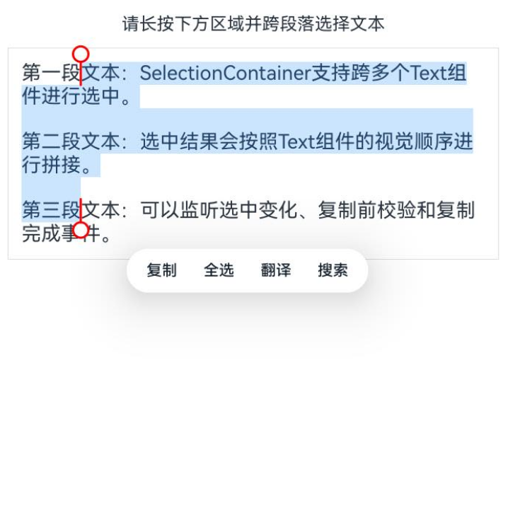

# SelectionContainer
<!--Kit: ArkUI-->
<!--Subsystem: ArkUI-->
<!--Owner: @xiangyuan6-->
<!--Designer: @xiangyuan6-->
<!--Tester: @jiaoaozihao-->
<!--Adviser: @Brilliantry_Rui-->

SelectionContainer组件用于为多个文本节点提供跨节点文本选中、复制及菜单扩展能力。

> **说明：**
>
> - 本组件中选中文本相关回调返回的文本内容，按照Text组件的视觉顺序进行拼接。
> - 本模块接口仅可在Stage模型下使用。

**起始版本：** 26.0.0

## 子组件

可以包含子组件。

> **说明：**
>
> 仅Text组件中的文本内容参与跨节点选中与文本拼接。

## 接口

SelectionContainer()

创建一个SelectionContainer组件。

**起始版本：** 26.0.0

**原子化服务API：** 从API版本26.0.0开始，该接口支持在原子化服务中使用。

**系统能力：** SystemCapability.ArkUI.ArkUI.Full

## 属性

支持[通用属性](ts-component-general-attributes.md)。

### copyOption

copyOption(value: Optional\<CopyOptions>)

设置组件的复制粘贴配置项。未通过该接口设置时，默认为CopyOptions.InApp。

> **说明：**
>
> Text子组件已显式设置[copyOption](ts-basic-components-text.md#copyoption9)时，优先使用Text子组件的配置；未设置时，使用SelectionContainer的配置。

**起始版本：** 26.0.0

**原子化服务API：** 从API版本26.0.0开始，该接口支持在原子化服务中使用。

**系统能力：** SystemCapability.ArkUI.ArkUI.Full

**参数：**

| 参数名 | 类型 | 必填 | 说明 |
| ------ | ---- | ---- | ---- |
| value | [Optional](ts-universal-attributes-custom-property.md#optionalt)\<[CopyOptions](ts-appendix-enums.md#copyoptions9)> | 是 | 复制粘贴配置项。 |

### caretColor

caretColor(color: Optional\<ResourceColor>)

设置选中文本手柄颜色。

**起始版本：** 26.0.0

**原子化服务API：** 从API版本26.0.0开始，该接口支持在原子化服务中使用。

**系统能力：** SystemCapability.ArkUI.ArkUI.Full

**参数：**

| 参数名 | 类型 | 必填 | 说明 |
| ------ | ---- | ---- | ---- |
| color | [Optional](ts-universal-attributes-custom-property.md#optionalt)\<[ResourceColor](ts-types.md#resourcecolor)> | 是 | 手柄颜色。 |

### selectedBackgroundColor

selectedBackgroundColor(color: Optional\<ResourceColor>)

设置选中文本底板颜色。

> **说明：**
>
> - 该属性在跨节点场景中用于各Text子组件选中区域的高亮颜色。
> - Text子组件已显式设置[selectedBackgroundColor](ts-basic-components-text.md#selectedbackgroundcolor14)时，优先使用Text子组件的配置；未设置时，使用SelectionContainer的配置。

**起始版本：** 26.0.0

**原子化服务API：** 从API版本26.0.0开始，该接口支持在原子化服务中使用。

**系统能力：** SystemCapability.ArkUI.ArkUI.Full

**参数：**

| 参数名 | 类型 | 必填 | 说明 |
| ------ | ---- | ---- | ---- |
| color | [Optional](ts-universal-attributes-custom-property.md#optionalt)\<[ResourceColor](ts-types.md#resourcecolor)> | 是 | 选中文本底板颜色。 |

### enableHapticFeedback

enableHapticFeedback(isEnabled: Optional\<boolean>)

设置是否开启触控反馈。未通过该接口设置时，默认开启。

**起始版本：** 26.0.0

**原子化服务API：** 从API版本26.0.0开始，该接口支持在原子化服务中使用。

**系统能力：** SystemCapability.ArkUI.ArkUI.Full

**参数：**

| 参数名 | 类型 | 必填 | 说明 |
| ------ | ---- | ---- | ---- |
| isEnabled | [Optional](ts-universal-attributes-custom-property.md#optionalt)\<boolean> | 是 | 是否开启触控反馈。<br/>true表示开启触控反馈，false表示不开启触控反馈。 |

### textJoinStyle

textJoinStyle(style: Optional\<SelectionContainerTextJoinStyle>)

设置SelectionContainer内聚合文本的拼接方式。未通过该接口设置时，默认为SelectionContainerTextJoinStyle.NEWLINE，表示不同文本节点之间使用换行符\n拼接。

> **说明：**
>
> - 该配置会影响[onWillCopy](#onwillcopy)、[onCopy](#oncopy)、[bindSelectionMenu](#bindselectionmenu)相关回调中返回的文本内容。
> - 该配置也会影响系统内置菜单项中依赖文本拼接结果的逻辑。例如，选择两个Text节点中的文本时，若配置为SelectionContainerTextJoinStyle.NEWLINE，执行复制后两段文本之间会插入换行符；若配置为SelectionContainerTextJoinStyle.DIRECT，执行复制后两段文本会直接拼接。

**起始版本：** 26.0.0

**原子化服务API：** 从API版本26.0.0开始，该接口支持在原子化服务中使用。

**系统能力：** SystemCapability.ArkUI.ArkUI.Full

**参数：**

| 参数名 | 类型 | 必填 | 说明 |
| ------ | ---- | ---- | ---- |
| style | [Optional](ts-universal-attributes-custom-property.md#optionalt)\<[SelectionContainerTextJoinStyle](#selectioncontainertextjoinstyle)> | 是 | 聚合文本拼接方式。 |

### bindSelectionMenu

bindSelectionMenu(spanType: Optional\<TextSpanType>, content: Optional\<CustomBuilder>, responseType: Optional\<TextResponseType>, options?: Optional\<SelectionContainerMenuOptions>)

设置自定义选择菜单。未通过该接口设置时，spanType默认值为TextSpanType.TEXT，responseType默认值为TextResponseType.LONG_PRESS。

> **说明：**
>
> - bindSelectionMenu的长按响应时长为600ms，[bindContextMenu](ts-universal-attributes-menu.md#bindcontextmenu8)的长按响应时长为800ms，当两者同时绑定且触发方式均为长按时，优先响应bindSelectionMenu。
> - 自定义菜单过长时，建议内部嵌套使用[Scroll](./ts-container-scroll.md)组件，避免键盘被遮挡。
> - 选区跨越不可复制Text时，菜单仅基于实际选中的可复制文本进行显示和处理。

**起始版本：** 26.0.0

**原子化服务API：** 从API版本26.0.0开始，该接口支持在原子化服务中使用。

**系统能力：** SystemCapability.ArkUI.ArkUI.Full

**参数：**

| 参数名 | 类型 | 必填 | 说明 |
| ------ | ---- | ---- | ---- |
| spanType | [Optional](ts-universal-attributes-custom-property.md#optionalt)\<[TextSpanType](ts-basic-components-text.md#textspantype11枚举说明)> | 是 | 选择菜单类型。 |
| content | [Optional](ts-universal-attributes-custom-property.md#optionalt)\<[CustomBuilder](ts-types.md#custombuilder8)> | 是 | 选择菜单内容。 |
| responseType | [Optional](ts-universal-attributes-custom-property.md#optionalt)\<[TextResponseType](ts-basic-components-text.md#textresponsetype11枚举说明)> | 是 | 选择菜单响应类型。 |
| options | [Optional](ts-universal-attributes-custom-property.md#optionalt)\<[SelectionContainerMenuOptions](#selectioncontainermenuoptions)> | 否 | 选择菜单选项。 |

### editMenuOptions

editMenuOptions(editMenu: Optional\<SelectionContainerEditMenuOptions>)

设置选中文本后的扩展菜单选项，包括菜单文本、图标和回调等。

> **说明：**
>
> 当同时为当前场景设置了[bindSelectionMenu](#bindselectionmenu)和editMenuOptions时，优先使用bindSelectionMenu，editMenuOptions不生效。

**起始版本：** 26.0.0

**原子化服务API：** 从API版本26.0.0开始，该接口支持在原子化服务中使用。

**系统能力：** SystemCapability.ArkUI.ArkUI.Full

**参数：**

| 参数名 | 类型 | 必填 | 说明 |
| ------ | ---- | ---- | ---- |
| editMenu | [Optional](ts-universal-attributes-custom-property.md#optionalt)\<[SelectionContainerEditMenuOptions](#selectioncontainereditmenuoptions)> | 是 | 自定义菜单扩展配置。 |

## 事件

### onTextSelectionChange

onTextSelectionChange(callback: Optional\<Callback\<Array\<string>>>)

SelectionContainer中选中文本发生变化时触发该回调。使用callback异步回调。

> **说明：**
>
> - 回调参数数组中各项顺序与Text组件视觉顺序一致。
> - 数组中的每一项对应一个Text子组件的选中文本。
> - 仅包含有选中文本的Text子组件，不包含未选中Text子组件，也不包含不可复制Text的空字符串占位。

**起始版本：** 26.0.0

**原子化服务API：** 从API版本26.0.0开始，该接口支持在原子化服务中使用。

**系统能力：** SystemCapability.ArkUI.ArkUI.Full

**参数：**

| 参数名 | 类型 | 必填 | 说明 |
| ------ | ---- | ---- | ---- |
| callback | [Optional](ts-universal-attributes-custom-property.md#optionalt)\<[Callback](ts-types.md#callback12)\<Array\<string>>> | 是 | 选中文本变化回调。 |

### onWillCopy

onWillCopy(callback: Optional\<Callback\<string, boolean>>)

在进行复制操作前，触发该回调。使用callback异步回调。

> **说明：**
>
> - 回调参数为按Text组件视觉顺序拼接后的选中文本。
> - 返回false时，会阻止本次跨节点复制及容器级[onCopy](#oncopy)回调触发，但不会影响各Text子组件已独立处理完成的复制事件逻辑。

**起始版本：** 26.0.0

**原子化服务API：** 从API版本26.0.0开始，该接口支持在原子化服务中使用。

**系统能力：** SystemCapability.ArkUI.ArkUI.Full

**参数：**

| 参数名 | 类型 | 必填 | 说明 |
| ------ | ---- | ---- | ---- |
| callback | [Optional](ts-universal-attributes-custom-property.md#optionalt)\<[Callback](ts-types.md#callback12)\<string, boolean>> | 是 | 复制前检查回调，返回true表示允许复制，返回false表示不允许复制。 |

### onCopy

onCopy(callback: Optional\<Callback\<string>>)

长按文本内部区域弹出剪贴板后，点击剪贴板复制按钮，触发该回调。仅支持复制文本。使用callback异步回调。

> **说明：**
>
> - 回调参数为按Text组件视觉顺序拼接后的选中文本。
> - 仅当容器级[onWillCopy](#onwillcopy)返回true时，该回调才会触发。

**起始版本：** 26.0.0

**原子化服务API：** 从API版本26.0.0开始，该接口支持在原子化服务中使用。

**系统能力：** SystemCapability.ArkUI.ArkUI.Full

**参数：**

| 参数名 | 类型 | 必填 | 说明 |
| ------ | ---- | ---- | ---- |
| callback | [Optional](ts-universal-attributes-custom-property.md#optionalt)\<[Callback](ts-types.md#callback12)\<string>> | 是 | 复制回调。 |

## SelectionContainerTextJoinStyle

文本聚合拼接方式。

**起始版本：** 26.0.0

**原子化服务API：** 从API版本26.0.0开始，该接口支持在原子化服务中使用。

**系统能力：** SystemCapability.ArkUI.ArkUI.Full

| 名称 | 值 | 说明 |
| ---- | -- | ---- |
| NEWLINE | 0 | 不同文本节点之间使用换行符`\n`拼接。 |
| DIRECT | 1 | 不同文本节点之间直接拼接，不添加分隔符。 |

## SelectionContainerMenuOptions

配置选择菜单中的选项。

**起始版本：** 26.0.0

**原子化服务API：** 从API版本26.0.0开始，该接口支持在原子化服务中使用。

**系统能力：** SystemCapability.ArkUI.ArkUI.Full

| 名称 | 类型 | 只读 | 可选 | 说明 |
| ---- | ---- | ---- | ---- | ---- |
| onAppear | [Callback](ts-types.md#callback12)\<string> | 否 | 是 | 选择菜单出现时触发。回调参数为按Text组件视觉顺序拼接后的选中文本。默认值为空。 |
| onDisappear | [Callback](ts-types.md#callback12)\<void> | 否 | 是 | 选择菜单消失时触发。默认值为空。 |
| onMenuShow | [Callback](ts-types.md#callback12)\<string> | 否 | 是 | 选择菜单显示时触发。回调参数为按Text组件视觉顺序拼接后的选中文本。默认值为空。 |
| onMenuHide | [Callback](ts-types.md#callback12)\<string> | 否 | 是 | 选择菜单隐藏时触发。回调参数为按Text组件视觉顺序拼接后的选中文本。默认值为空。 |

## OnMenuItemClickWithTextCallback

type OnMenuItemClickWithTextCallback = (menuItem: TextMenuItem, value: string) => boolean

点击菜单项时触发，可拦截系统默认菜单项（如复制、粘贴菜单项）的执行行为。

**起始版本：** 26.0.0

**原子化服务API：** 从API版本26.0.0开始，该接口支持在原子化服务中使用。

**系统能力：** SystemCapability.ArkUI.ArkUI.Full

**参数：**

| 参数名 | 类型 | 必填 | 说明 |
| ------ | ---- | ---- | ---- |
| menuItem | [TextMenuItem](ts-text-common.md#textmenuitem12对象说明) | 是 | 当前点击的菜单项。 |
| value | string | 是 | 选中文本内容。 |

**返回值：**

| 类型 | 说明 |
| ---- | ---- |
| boolean | 菜单项点击事件的处理结果。返回true表示事件已处理，返回false表示未处理。 |

## OnCreateMenuCallback

type OnCreateMenuCallback = (menuItems: Array\<TextMenuItem>) => Array\<TextMenuItem>

菜单创建时触发。

**起始版本：** 26.0.0

**原子化服务API：** 从API版本26.0.0开始，该接口支持在原子化服务中使用。

**系统能力：** SystemCapability.ArkUI.ArkUI.Full

**参数：**

| 参数名 | 类型 | 必填 | 说明 |
| ------ | ---- | ---- | ---- |
| menuItems | Array\<[TextMenuItem](ts-text-common.md#textmenuitem12对象说明)> | 是 | 当前显示的菜单项。<br/>**说明：**<br/>对默认菜单项的名称、图标、快捷键提示修改不生效。 |

**返回值：**

| 类型 | 说明 |
| ---- | ---- |
| Array\<[TextMenuItem](ts-text-common.md#textmenuitem12对象说明)> | 处理后的菜单项。 |

## SelectionContainerEditMenuOptions

SelectionContainer自定义编辑菜单选项。

**起始版本：** 26.0.0

**原子化服务API：** 从API版本26.0.0开始，该接口支持在原子化服务中使用。

**系统能力：** SystemCapability.ArkUI.ArkUI.Full

| 名称 | 类型 | 只读 | 可选 | 说明 |
| ---- | ---- | ---- | ---- | ---- |
| onCreateMenu | [OnCreateMenuCallback](#oncreatemenucallback) | 否 | 是 | 每次菜单显示前触发，传入默认菜单项并返回处理后的菜单项。默认值为空。 |
| onMenuItemClick | [OnMenuItemClickWithTextCallback](#onmenuitemclickwithtextcallback) | 否 | 是 | 点击菜单项时触发，可拦截系统默认菜单执行行为。默认值为空。 |
| onPrepareMenu | [OnPrepareMenuCallback](ts-text-common.md#onpreparemenucallback20) | 否 | 是 | 文本选中内容变化后、菜单显示前触发，可在该回调中调整菜单数据。默认值为空。 |

## 示例

### 示例1（跨节点选中文本并复制）

该示例通过[SelectionContainer](#接口)、[copyOption](#copyoption)、[textJoinStyle](#textjoinstyle)、[onTextSelectionChange](#ontextselectionchange)、[onWillCopy](#onwillcopy)、[onCopy](#oncopy)接口展示跨多个Text组件选中文本、拼接选中文本并处理复制回调的能力。

从API版本26.0.0开始，新增SelectionContainer组件和copyOption等接口。

```ts
import {
  ColorMetrics,
  OnMenuItemClickWithTextCallback,
  SelectionContainer,
  SelectionContainerAttribute,
  SelectionContainerEditMenuOptions,
  SelectionContainerInstance,
  SelectionContainerMenuOptions,
  SelectionContainerTextJoinStyle
} from '@kit.ArkUI';

@Entry
@Component
struct SelectionContainerExample {
  @State selectedParts: string[] = [];
  @State copiedText: string = '';

  build() {
    Column({ space: 12 }) {
      Text('请长按下方区域并跨节点选择文本')
        .fontSize(16)

      SelectionContainer() {
        Column({ space: 8 }) {
          Text('第一段文本：SelectionContainer支持跨多个Text组件进行选中。')
            .fontSize(18)
            .copyOption(CopyOptions.InApp)
          Text('第二段文本：选中结果会按照Text组件的视觉顺序进行拼接。')
            .fontSize(18)
            .copyOption(CopyOptions.InApp)
          Text('第三段文本：可以监听选中变化、复制前校验和复制完成事件。')
            .fontSize(18)
            .copyOption(CopyOptions.InApp)
        }
      }
      .copyOption(CopyOptions.InApp)
      .textJoinStyle(SelectionContainerTextJoinStyle.NEWLINE)
      .caretColor(Color.Red)
      .selectedBackgroundColor('#33007DFF')
      .onTextSelectionChange((value: Array<string>) => {
        this.selectedParts = value;
      })
      .onWillCopy((value: string) => {
        this.copiedText = `准备复制：${value}`;
        return true;
      })
      .onCopy((value: string) => {
        this.copiedText = `复制成功：${value}`;
      })
      .border({ width: 1, color: '#DCDCDC' })
      .padding(12)
      .width('100%')
    }
    .width('100%')
    .padding(16)
  }
}
```

