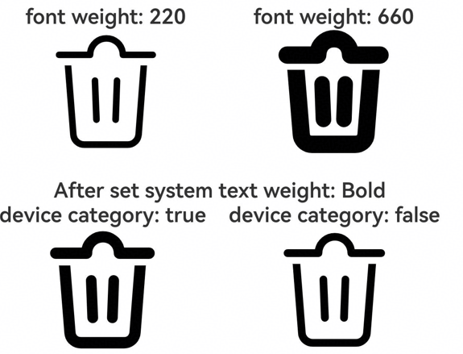

# SymbolSpan
<!--Kit: ArkUI-->
<!--Subsystem: ArkUI-->
<!--Owner: @xiangyuan6-->
<!--Designer: @xiangyuan6-->
<!--Tester: @jiaoaozihao-->
<!--Adviser: @Brilliantry_Rui-->

SymbolSpan作为Text组件的子组件，用于在文本中显示系统预置的图标小符号（Symbol图标）。支持设置颜色、大小、粗细、渲染策略和动效策略等属性，适用于需要在文本中嵌入图标符号的场景，如状态指示、功能标识等。SymbolSpan仅支持系统预置的symbol资源，可继承父组件Text的属性设置。

>  **说明：**
>
> - 该组件从API version 11开始支持。后续版本的新增接口，采用上角标单独标记接口的起始版本。
>
> - 本模块接口仅可在Stage模型下使用。
>
> - 该组件支持继承父组件Text的属性，即如果子组件未设置属性且父组件设置属性，则继承父组件设置的全部属性。
>
> - SymbolSpan拖拽不会置灰显示。

## 子组件

不支持子组件。

## 接口

SymbolSpan(value: Resource)

**卡片能力：** 从API version 12开始，该接口支持在ArkTS卡片中使用。

**原子化服务API：** 从API version 12开始，该接口支持在原子化服务中使用。

**系统能力：** SystemCapability.ArkUI.ArkUI.Full

**参数：** 

| 参数名 | 类型 | 必填 | 说明 |
| -------- | -------- | -------- | -------- |
| value | [Resource](ts-types.md#resource)| 是 | SymbolSpan组件的资源引用，如 $r('sys.symbol.ohos_wifi')。仅支持系统预置的symbol资源，引用非symbol资源将显示异常。 |

>  **说明：**
>
>  $r('sys.symbol.ohos_wifi')中引用的资源为系统预置，SymbolSpan仅支持系统预置的symbol资源，引用非symbol资源将显示异常。

## 属性

不支持[通用属性](ts-component-general-attributes.md)，支持以下属性：

### fontColor

fontColor(value: Array&lt;ResourceColor&gt;)

设置SymbolSpan组件颜色。未通过该接口设置时，默认颜色随[renderingStrategy](#renderingstrategy)变化，单色渲染策略（SINGLE）下默认为单色；多色渲染策略（MULTIPLE_COLOR）和分层渲染策略（MULTIPLE_OPACITY）下默认取图标资源预设的多色配置。具体说明请参考[SymbolRenderingStrategy](ts-basic-components-symbolGlyph.md#symbolrenderingstrategy11枚举说明)。

>**说明：**
>
> 从API version 12开始，该接口支持在[attributeModifier](ts-universal-attributes-attribute-modifier.md#attributemodifier)中调用。

**卡片能力：** 从API version 12开始，该接口支持在ArkTS卡片中使用。

**原子化服务API：** 从API version 12开始，该接口支持在原子化服务中使用。

**系统能力：** SystemCapability.ArkUI.ArkUI.Full

**参数：** 

| 参数名 | 类型                                                | 必填 | 说明                                                         |
| ------ | --------------------------------------------------- | ---- | ------------------------------------------------------------ |
| value  | Array\<[ResourceColor](ts-types.md#resourcecolor)\> | 是   | SymbolSpan组件颜色。具体颜色渲染模式及其说明请参考[SymbolRenderingStrategy](ts-basic-components-symbolGlyph.md#symbolrenderingstrategy11枚举说明)。 |

### fontSize

fontSize(value: number | string | Resource)

设置SymbolSpan组件大小。设置string类型时，支持number类型取值的字符串形式，可以附带单位，例如"10"、"10fp"。未通过该接口设置时，默认组件大小为16fp。

>**说明：**
>
> 从API version 12开始，该接口支持在[attributeModifier](ts-universal-attributes-attribute-modifier.md#attributemodifier)中调用。

**卡片能力：** 从API version 12开始，该接口支持在ArkTS卡片中使用。

**原子化服务API：** 从API version 12开始，该接口支持在原子化服务中使用。

**系统能力：** SystemCapability.ArkUI.ArkUI.Full

**参数：** 

| 参数名 | 类型                                                         | 必填 | 说明                                          |
| ------ | ------------------------------------------------------------ | ---- | --------------------------------------------- |
| value  | number&nbsp;\|&nbsp;string&nbsp;\|&nbsp;[Resource](ts-types.md#resource) | 是   | SymbolSpan组件大小。<br>取值范围：[0,&nbsp;+∞)<br>单位：[fp](ts-pixel-units.md#基本像素单位) |

### fontWeight

fontWeight(value: number | FontWeight | string)

设置SymbolSpan组件字体粗细。未通过该接口设置时，默认字体粗细为FontWeight.Normal（正常粗细，对应数值400）。

sys.symbol.ohos_lungs图标不支持设置fontWeight。

>**说明：**
>
> 从API version 12开始，该接口支持在[attributeModifier](ts-universal-attributes-attribute-modifier.md#attributemodifier)中调用。

**卡片能力：** 从API version 12开始，该接口支持在ArkTS卡片中使用。

**原子化服务API：** 从API version 12开始，该接口支持在原子化服务中使用。

**系统能力：** SystemCapability.ArkUI.ArkUI.Full

**参数：** 

| 参数名 | 类型                                                         | 必填 | 说明                                               |
| ------ | ------------------------------------------------------------ | ---- | -------------------------------------------------- |
| value  | number&nbsp;\|&nbsp;[FontWeight](ts-appendix-enums.md#fontweight)&nbsp;\|&nbsp;string | 是   | SymbolSpan组件字体粗细。<br>number类型取值[100,&nbsp;900]，取值间隔为100，默认为400，取值越大，字体越粗。string类型仅支持number类型取值的字符串形式，例如“400”，以及“bold”、“bolder”、“lighter”、“regular”、“medium”，分别对应FontWeight中相应的枚举值。设置过大可能会在不同字体下有截断。传入超出取值范围或不符合间隔要求的值时取默认值。|

### fontWeight

fontWeight(value: number | FontWeight | ResourceStr, fontWeightConfigs?: FontWeightConfigs)

设置SymbolSpan组件字体粗细，支持通过FontWeightConfigs配置是否开启可变字重调节、是否开启随设备的字体粗细级别自动更新字重。未通过该接口设置时，默认字体粗细为FontWeight.Normal（正常粗细，对应数值400）。

sys.symbol.ohos_lungs图标不支持设置fontWeight。

**起始版本：** 26.0.0

**卡片能力：** 从API版本26.0.0开始，该接口支持在ArkTS卡片中使用。

**原子化服务API：** 从API版本26.0.0开始，该接口支持在原子化服务中使用。

**模型约束：** 此接口仅可在Stage模型下使用。

**系统能力：** SystemCapability.ArkUI.ArkUI.Full

**参数：**

| 参数名 | 类型 | 必填 | 说明 |
| ------ | ---- | ---- | ---- |
| value | number&nbsp;\|&nbsp;[FontWeight](ts-appendix-enums.md#fontweight)&nbsp;\|&nbsp;[ResourceStr](ts-types.md#resourcestr) | 是 | SymbolSpan组件字体粗细。<br>number类型取值[100,&nbsp;900]，取值间隔为100，默认为400，取值越大，字体越粗。string类型仅支持number类型取值的字符串形式，例如“400”，以及“bold”、“bolder”、“lighter”、“regular”、“medium”，分别对应FontWeight中相应的枚举值。设置过大可能会在不同字体下有截断。<br>传入超出取值范围的值时取默认值。传入不符合间隔要求的值时，若设置fontWeightConfigs的enableVariableFontWeight为true，使用传入值；若设置为false，使用默认值。|
| fontWeightConfigs | [FontWeightConfigs](ts-text-common.md#fontweightconfigs24对象说明) | 否 | 字体粗细配置。当需要启用可变字重调节（设置非100整数倍的精细字重值如220、660）或跟随设备字体粗细级别自动更新字重时传入此参数。默认值继承[FontWeightConfigs](ts-text-common.md#fontweightconfigs24对象说明)。 |

### renderingStrategy

renderingStrategy(value: SymbolRenderingStrategy)

设置SymbolSpan渲染策略。未通过该接口设置时，默认渲染策略为SymbolRenderingStrategy.SINGLE。

SINGLE表示单色渲染，适用于需要统一颜色的图标显示场景；MULTIPLE_COLOR表示多色渲染，适用于需要展示图标多层不同颜色的场景；MULTIPLE_OPACITY表示分层渲染，适用于需要展示图标层次效果的场景。

>**说明：**
>
> 从API version 12开始，该接口支持在[attributeModifier](ts-universal-attributes-attribute-modifier.md#attributemodifier)中调用。

**卡片能力：** 从API version 12开始，该接口支持在ArkTS卡片中使用。

**原子化服务API：** 从API version 12开始，该接口支持在原子化服务中使用。

**系统能力：** SystemCapability.ArkUI.ArkUI.Full

**参数：** 

| 参数名 | 类型                                                         | 必填 | 说明                                                         |
| ------ | ------------------------------------------------------------ | ---- | ------------------------------------------------------------ |
| value  | [SymbolRenderingStrategy](ts-basic-components-symbolGlyph.md#symbolrenderingstrategy11枚举说明) | 是   | SymbolSpan渲染策略。|

不同渲染策略效果可参考以下示意图。


### effectStrategy

effectStrategy(value: SymbolEffectStrategy)

设置SymbolSpan动效策略。未通过该接口设置时，默认动效策略为SymbolEffectStrategy.NONE。

NONE表示无动效，适用于静态展示场景；SCALE表示整体缩放动效，适用于需要吸引用户注意力的场景，如按钮点击反馈；HIERARCHICAL表示层级动效，适用于需要突出图标层次感的场景。

不同动效策略效果可以参考[示例1（设置渲染和动效策略）](#示例1设置渲染和动效策略)。

>**说明：**
>
> 从API version 12开始，该接口支持在[attributeModifier](ts-universal-attributes-attribute-modifier.md#attributemodifier)中调用。

**卡片能力：** 从API version 12开始，该接口支持在ArkTS卡片中使用。

**原子化服务API：** 从API version 12开始，该接口支持在原子化服务中使用。

**系统能力：** SystemCapability.ArkUI.ArkUI.Full

**参数：** 

| 参数名 | 类型                                                         | 必填 | 说明                                                       |
| ------ | ------------------------------------------------------------ | ---- | ---------------------------------------------------------- |
| value  | [SymbolEffectStrategy](ts-basic-components-symbolGlyph.md#symboleffectstrategy11枚举说明) | 是   | SymbolSpan动效策略。|

### attributeModifier<sup>12+</sup>

attributeModifier(modifier: AttributeModifier\<SymbolSpanAttribute>)

设置组件的动态属性。

**原子化服务API：** 从API version 12开始，该接口支持在原子化服务中使用。

**系统能力：** SystemCapability.ArkUI.ArkUI.Full

**参数：** 

| 参数名 | 类型                                                | 必填 | 说明                                                         |
| ------ | --------------------------------------------------- | ---- | ------------------------------------------------------------ |
| modifier  | [AttributeModifier](ts-universal-attributes-attribute-modifier.md#attributemodifiert)\<SymbolSpanAttribute> | 是   | 动态设置组件的属性。 |

## 事件

不支持[通用事件](ts-component-general-events.md)。

## 示例

### 示例1（设置渲染和动效策略）
从API version 11开始，该示例通过[renderingStrategy](#renderingstrategy)、[effectStrategy](#effectstrategy)属性展示了不同的渲染和动效策略。

```ts
// xxx.ets
@Entry
@Component
struct Index {
  build() {
    Column() {
      Row() {
        Column() {
          Text('Light')
          Text() {
            SymbolSpan($r('sys.symbol.ohos_trash'))
              .fontWeight(FontWeight.Lighter)
              .fontSize(96)
          }
        }

        Column() {
          Text('Normal')
          Text() {
            SymbolSpan($r('sys.symbol.ohos_trash'))
              .fontWeight(FontWeight.Normal)
              .fontSize(96)
          }
        }

        Column() {
          Text('Bold')
          Text() {
            SymbolSpan($r('sys.symbol.ohos_trash'))
              .fontWeight(FontWeight.Bold)
              .fontSize(96)
          }
        }
      }

      Row() {
        Column() {
          Text('单色')
          Text() {
            SymbolSpan($r('sys.symbol.ohos_folder_badge_plus'))
              .fontSize(96)
              .renderingStrategy(SymbolRenderingStrategy.SINGLE)
              .fontColor([Color.Black, Color.Green, Color.White])
          }
        }

        Column() {
          Text('多色')
          Text() {
            SymbolSpan($r('sys.symbol.ohos_folder_badge_plus'))
              .fontSize(96)
              .renderingStrategy(SymbolRenderingStrategy.MULTIPLE_COLOR)
              .fontColor([Color.Black, Color.Green, Color.White])
          }
        }

        Column() {
          Text('分层')
          Text() {
            SymbolSpan($r('sys.symbol.ohos_folder_badge_plus'))
              .fontSize(96)
              .renderingStrategy(SymbolRenderingStrategy.MULTIPLE_OPACITY)
              .fontColor([Color.Black, Color.Green, Color.White])
          }
        }
      }

      Row() {
        Column() {
          Text('无动效')
          Text() {
            SymbolSpan($r('sys.symbol.ohos_wifi'))
              .fontSize(96)
              .effectStrategy(SymbolEffectStrategy.NONE)
          }
        }

        Column() {
          Text('整体缩放动效')
          Text() {
            SymbolSpan($r('sys.symbol.ohos_wifi'))
              .fontSize(96)
              .effectStrategy(SymbolEffectStrategy.SCALE)
          }
        }

        Column() {
          Text('层级动效')
          Text() {
            SymbolSpan($r('sys.symbol.ohos_wifi'))
              .fontSize(96)
              .effectStrategy(SymbolEffectStrategy.HIERARCHICAL)
          }
        }
      }
    }
  }
}
```


### 示例2（设置动态属性）
从API version 12开始，该示例通过[attributeModifier](#attributemodifier12)属性创建指定样式图标。

```ts
import { SymbolSpanModifier } from '@kit.ArkUI';

@Entry
@Component
struct Index {
  @State modifier: SymbolSpanModifier =
    new SymbolSpanModifier($r('sys.symbol.ohos_wifi')).fontColor([Color.Blue]).fontSize(100);

  build() {
    Row() {
      Column() {
        Text() {
          SymbolSpan(undefined).attributeModifier(this.modifier)
        }

        Button('更改SymbolSpanModifier')
          .onClick(() => {
            this.modifier = new SymbolSpanModifier($r("sys.symbol.ohos_trash")).fontColor([Color.Red]).fontSize(100);
          })
      }
      .width('100%')
    }
    .height('100%')
  }
}
```


### 示例3（设置字体粗细）

该示例通过[fontWeight](#fontweight-1)属性展示SymbolSpan不同粗细配置下的效果：第一行图标小符号展示启用可变字重后，分别设置字重值为220和660的效果；第二行图标小符号展示在将设备的系统字体粗细设置为粗体后，分别设置跟随和不跟随设备的字体粗细级别自动更新的效果。

从API版本26.0.0开始，新增[fontWeight](#fontweight-1)属性。

```ts
// xxx.ets
@Entry
@Component
struct Index {
  build() {
    Column() {
      Row() {
        Column() {
          Text('font weight: 220')
          Text() {
            // ohos_trash为系统预置的垃圾桶小符号
            SymbolSpan($r('sys.symbol.ohos_trash'))
              .fontWeight(220, { enableVariableFontWeight: true })
              .fontSize(96)
          }
        }
        Column() {
          Text('            ')
        }
        Column() {
          Text('font weight: 660')
          Text() {
            // ohos_trash为系统预置的垃圾桶小符号
            SymbolSpan($r('sys.symbol.ohos_trash'))
              .fontWeight(660, { enableVariableFontWeight: true })
              .fontSize(96)
          }
        }
      }
      Row() {
        Text('    ')
      }
      Row() {
        Text('After set system text weight: Bold')
      }
      Row() {
        Column() {
          Text('device category: true')
          Text() {
            // ohos_trash为系统预置的垃圾桶小符号
            SymbolSpan($r('sys.symbol.ohos_trash'))
              .fontWeight(FontWeight.Normal, { enableDeviceFontWeightCategory: true })
              .fontSize(96)
          }
        }
        Column() {
          Text('    ')
        }
        Column() {
          Text('device category: false')
          Text() {
            // ohos_trash为系统预置的垃圾桶小符号
            SymbolSpan($r('sys.symbol.ohos_trash'))
              .fontWeight(FontWeight.Normal, { enableDeviceFontWeightCategory: false })
              .fontSize(96)
          }
        }
      }
    }
  }
}
```

