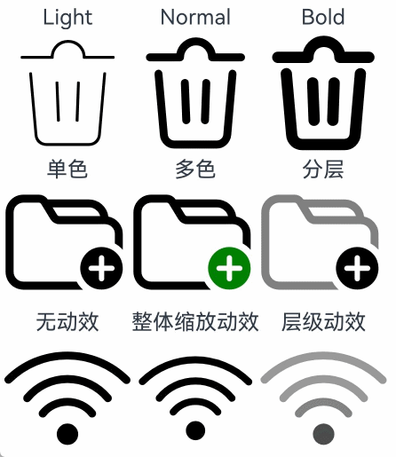
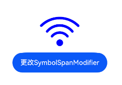

# SymbolSpan
<!--Kit: ArkUI-->
<!--Subsystem: ArkUI-->
<!--Owner: @xiangyuan6-->
<!--Designer: @xiangyuan6-->
<!--Tester: @jiaoaozihao-->
<!--Adviser: @Brilliantry_Rui-->

作为Text组件的子组件，用于显示图标小符号的组件。

>  **说明：**
>
> - 该组件从API version 11开始支持。后续版本如有新增内容，则采用上角标单独标记该内容的起始版本。
>
> - 本模块同时支持ArkTS-Dyn、ArkTS-Sta。
>
> - 本模块接口仅可在Stage模型下使用。
>
> - 该组件支持继承父组件Text的属性，即如果子组件未设置属性且父组件设置属性，则继承父组件设置的全部属性。
>
> - SymbolSpan拖拽不会置灰显示。

## 子组件

不支持子组件。

## 接口

SymbolSpan(value: Resource)

**卡片能力（仅ArkTS-Dyn）：** 从API version 12开始，该接口支持在ArkTS卡片中使用。

**原子化服务API（仅ArkTS-Dyn）：** 从API version 12开始，该接口支持在原子化服务中使用。

**系统能力：** SystemCapability.ArkUI.ArkUI.Full

**ArkTS-Dyn起始版本：** 11

**ArkTS-Sta起始版本：** 23

**参数：** 

| 参数名 | 类型 | 必填 | 说明 |
| -------- | -------- | -------- | -------- |
| value | [Resource](ts-types.md#resource)| 是 | SymbolSpan组件的资源名，如 $r('sys.symbol.ohos_wifi')。 |

>  **说明：**
>
>  $r('sys.symbol.ohos_wifi')中引用的资源为系统预置，SymbolSpan仅支持系统预置的symbol资源名，引用非symbol资源将显示异常。

## 属性

不支持[通用属性](ts-component-general-attributes.md)，支持以下属性：

### fontColor

ArkTS-Dyn: fontColor(value: Array&lt;ResourceColor&gt;)

ArkTS-Sta: fontColor(value: Array&lt;ResourceColor&gt; | undefined)

设置SymbolSpan组件颜色。

>**说明：**
>
> 从API version 12开始，该接口支持在[attributeModifier](ts-universal-attributes-attribute-modifier.md#attributemodifier)中调用。

**卡片能力（仅ArkTS-Dyn）：** 从API version 12开始，该接口支持在ArkTS卡片中使用。

**原子化服务API（仅ArkTS-Dyn）：** 从API version 12开始，该接口支持在原子化服务中使用。

**系统能力：** SystemCapability.ArkUI.ArkUI.Full

**ArkTS-Dyn起始版本：** 11

**ArkTS-Sta起始版本：** 23

**参数：** 

| 参数名 | 类型                                                | 必填 | 说明                                                         |
| ------ | --------------------------------------------------- | ---- | ------------------------------------------------------------ |
| value  | ArkTS-Dyn: Array\<[ResourceColor](ts-types.md#resourcecolor)\><br/>ArkTS-Sta: Array\<[ResourceColor](ts-types.md#resourcecolor)\> \| undefined | 是   | SymbolSpan组件颜色。<br/> 默认值：不同渲染策略下默认值不同。<br/>取值为undefined时，按默认值处理。 |

### fontSize

ArkTS-Dyn: fontSize(value: number | string | Resource)

ArkTS-Sta: fontSize(value: double | string | Resource | undefined)

设置SymbolSpan组件大小。设置string类型时，支持number类型取值的字符串形式，可以附带单位，例如"10"、"10fp"。

>**说明：**
>
> 从API version 12开始，该接口支持在[attributeModifier](ts-universal-attributes-attribute-modifier.md#attributemodifier)中调用。

**卡片能力（仅ArkTS-Dyn）：** 从API version 12开始，该接口支持在ArkTS卡片中使用。

**原子化服务API（仅ArkTS-Dyn）：** 从API version 12开始，该接口支持在原子化服务中使用。

**系统能力：** SystemCapability.ArkUI.ArkUI.Full

**ArkTS-Dyn起始版本：** 11

**ArkTS-Sta起始版本：** 23

**参数：** 

| 参数名 | 类型                                                         | 必填 | 说明                                          |
| ------ | ------------------------------------------------------------ | ---- | --------------------------------------------- |
| value  | ArkTS-Dyn: number&nbsp;\|&nbsp;string&nbsp;\|&nbsp;[Resource](ts-types.md#resource)<br/>ArkTS-Sta: double&nbsp;\|&nbsp;string&nbsp;\|&nbsp;[Resource](ts-types.md#resource) \| undefined | 是   | SymbolSpan组件大小。<br/>默认值：16fp<br/>单位：[fp](ts-pixel-units.md#基本像素单位) <br/>取值为undefined时，按默认值处理。|

### fontWeight

ArkTS-Dyn: fontWeight(value: number | FontWeight | string)

ArkTS-Sta: fontWeight(value: int | FontWeight | string | undefined)

设置SymbolSpan组件粗细。number类型取值[100,900]，取值间隔为100，默认为400，取值越大，字体越粗。string类型仅支持number类型取值的字符串形式，例如“400”，以及“bold”、“bolder”、“lighter”、“regular” 、“medium”分别对应FontWeight中相应的枚举值。

sys.symbol.ohos_lungs图标不支持设置fontWeight。

>**说明：**
>
> 从API version 12开始，该接口支持在[attributeModifier](ts-universal-attributes-attribute-modifier.md#attributemodifier)中调用。

**卡片能力（仅ArkTS-Dyn）：** 从API version 12开始，该接口支持在ArkTS卡片中使用。

**原子化服务API（仅ArkTS-Dyn）：** 从API version 12开始，该接口支持在原子化服务中使用。

**系统能力：** SystemCapability.ArkUI.ArkUI.Full

**ArkTS-Dyn起始版本：** 11

**ArkTS-Sta起始版本：** 23

**参数：** 

| 参数名 | 类型                                                         | 必填 | 说明                                               |
| ------ | ------------------------------------------------------------ | ---- | -------------------------------------------------- |
| value  | ArkTS-Dyn: number&nbsp;\|&nbsp;[FontWeight](ts-appendix-enums.md#fontweight)&nbsp;\|&nbsp;string<br/>ArkTS-Sta: int&nbsp;\|&nbsp;[FontWeight](ts-appendix-enums.md#fontweight)&nbsp;\|&nbsp;string&nbsp;\|&nbsp;undefined | 是   | SymbolSpan组件粗细。<br/>默认值：FontWeight.Normal<br/>取值为undefined时，按默认值处理。 |

### renderingStrategy

ArkTS-Dyn: renderingStrategy(value: SymbolRenderingStrategy)

ArkTS-Sta: renderingStrategy(value: SymbolRenderingStrategy | undefined)

设置SymbolSpan渲染策略。

>**说明：**
>
> 从API version 12开始，该接口支持在[attributeModifier](ts-universal-attributes-attribute-modifier.md#attributemodifier)中调用。

**卡片能力（仅ArkTS-Dyn）：** 从API version 12开始，该接口支持在ArkTS卡片中使用。

**原子化服务API（仅ArkTS-Dyn）：** 从API version 12开始，该接口支持在原子化服务中使用。

**系统能力：** SystemCapability.ArkUI.ArkUI.Full

**ArkTS-Dyn起始版本：** 11

**ArkTS-Sta起始版本：** 23

**参数：** 

| 参数名 | 类型                                                         | 必填 | 说明                                                         |
| ------ | ------------------------------------------------------------ | ---- | ------------------------------------------------------------ |
| value  | ArkTS-Dyn: [SymbolRenderingStrategy](ts-basic-components-symbolGlyph.md#symbolrenderingstrategy11枚举说明)<br/>ArkTS-Sta: [SymbolRenderingStrategy](ts-basic-components-symbolGlyph.md#symbolrenderingstrategy11枚举说明) \| undefined | 是   | SymbolSpan渲染策略。<br/>默认值：SymbolRenderingStrategy.SINGLE<br/>取值为undefined时，按默认值处理。 |

不同渲染策略效果可参考以下示意图。


### effectStrategy

ArkTS-Dyn: effectStrategy(value: SymbolEffectStrategy)

ArkTS-Sta: effectStrategy(value: SymbolEffectStrategy | undefined)

设置SymbolSpan动效策略。

>**说明：**
>
> 从API version 12开始，该接口支持在[attributeModifier](ts-universal-attributes-attribute-modifier.md#attributemodifier)中调用。

**卡片能力（仅ArkTS-Dyn）：** 从API version 12开始，该接口支持在ArkTS卡片中使用。

**原子化服务API（仅ArkTS-Dyn）：** 从API version 12开始，该接口支持在原子化服务中使用。

**系统能力：** SystemCapability.ArkUI.ArkUI.Full

**ArkTS-Dyn起始版本：** 11

**ArkTS-Sta起始版本：** 23

**参数：** 

| 参数名 | 类型                                                         | 必填 | 说明                                                       |
| ------ | ------------------------------------------------------------ | ---- | ---------------------------------------------------------- |
| value  | ArkTS-Dyn: [SymbolEffectStrategy](ts-basic-components-symbolGlyph.md#symboleffectstrategy11枚举说明)<br/>ArkTS-Sta: [SymbolEffectStrategy](ts-basic-components-symbolGlyph.md#symboleffectstrategy11枚举说明) \| undefined | 是   | SymbolSpan动效策略。<br/>默认值：SymbolEffectStrategy.NONE<br/>取值为undefined时，按默认值处理。 |

### attributeModifier<sup>12+</sup>

ArkTS-Dyn: attributeModifier(modifier: AttributeModifier\<SymbolSpanAttribute>)

ArkTS-Sta: attributeModifier(modifier: AttributeModifier\<SymbolSpanAttribute> | undefined)

设置组件的动态属性。

**原子化服务API（仅ArkTS-Dyn）：** 从API version 12开始，该接口支持在原子化服务中使用。

**系统能力：** SystemCapability.ArkUI.ArkUI.Full

**ArkTS-Dyn起始版本：** 12

**ArkTS-Sta起始版本：** 23

**参数：** 

| 参数名 | 类型                                                | 必填 | 说明                                                         |
| ------ | --------------------------------------------------- | ---- | ------------------------------------------------------------ |
| modifier  | ArkTS-Dyn: [AttributeModifier](ts-universal-attributes-attribute-modifier.md#attributemodifiert)\<SymbolSpanAttribute><br/>ArkTS-Sta: [AttributeModifier](ts-universal-attributes-attribute-modifier.md#attributemodifiert)\<SymbolSpanAttribute> \| undefined | 是   | 动态设置组件的属性。<br/>取值为undefined时，按当前组件的属性方法默认值处理。 |

### key<sup>23+</sup>

key(value: string | undefined)

组件的唯一标识，唯一性由使用者保证。

此接口仅用于对应用的测试。与id同时使用时，后赋值的属性会覆盖先赋值的属性，建议仅设置[id](#id23)。

**系统能力：** SystemCapability.ArkUI.ArkUI.Full

**ArkTS模式：** 该接口仅适用于ArkTS-Sta。

**ArkTS-Sta起始版本：** 23

**参数：** 

| 参数名 | 类型                                                | 必填 | 说明                                                         |
| ------ | --------------------------------------------------- | ---- | ------------------------------------------------------------ |
| value  | string \| undefined | 是   |组件的唯一标识，唯一性由使用者保证。<br/>默认值：''<br/>取值为undefined时，按默认值处理。 |

### id<sup>23+</sup>

id(value: string | undefined)

组件的唯一标识，唯一性由使用者保证。

**系统能力：** SystemCapability.ArkUI.ArkUI.Full

**ArkTS模式：** 该接口仅适用于ArkTS-Sta。

**ArkTS-Sta起始版本：** 23

**参数：** 

| 参数名 | 类型                                                | 必填 | 说明                                                         |
| ------ | --------------------------------------------------- | ---- | ------------------------------------------------------------ |
| value  | string \| undefined | 是   |组件的唯一标识，唯一性由使用者保证。<br/>默认值：''<br/>取值为undefined时，按默认值处理。 |

### debugLine<sup>24+</sup>

debugLine(sourceLine: string, moduleName?: string)

设置组件源码重定向信息。

**系统能力：** SystemCapability.ArkUI.ArkUI.Full

**ArkTS模式：** 该接口仅适用于ArkTS-Sta。

**ArkTS-Sta起始版本：** 24

**参数：**

| 参数名 | 类型 | 必填 | 说明 |
| -------- | -------- | -------- | -------- |
| sourceLine | string | 是 | 源码行号。 |
| moduleName | string | 否 | 组件所属模块名。 |

## 事件

不支持[通用事件](ts-component-general-events.md)。

## 示例

### 示例1（设置渲染和动效策略）
从API version 11开始，该示例通过[renderingStrategy](#renderingstrategy)、[effectStrategy](#effectstrategy)属性展示了不同的渲染和动效策略。

```ts
// xxx.ets
@Entry
@Component
struct Index {
  build() {
    Column() {
      Row() {
        Column() {
          Text("Light")
          Text() {
            SymbolSpan($r('sys.symbol.ohos_trash'))
              .fontWeight(FontWeight.Lighter)
              .fontSize(96)
          }
        }

        Column() {
          Text("Normal")
          Text() {
            SymbolSpan($r('sys.symbol.ohos_trash'))
              .fontWeight(FontWeight.Normal)
              .fontSize(96)
          }
        }

        Column() {
          Text("Bold")
          Text() {
            SymbolSpan($r('sys.symbol.ohos_trash'))
              .fontWeight(FontWeight.Bold)
              .fontSize(96)
          }
        }
      }

      Row() {
        Column() {
          Text("单色")
          Text() {
            SymbolSpan($r('sys.symbol.ohos_folder_badge_plus'))
              .fontSize(96)
              .renderingStrategy(SymbolRenderingStrategy.SINGLE)
              .fontColor([Color.Black, Color.Green, Color.White])
          }
        }

        Column() {
          Text("多色")
          Text() {
            SymbolSpan($r('sys.symbol.ohos_folder_badge_plus'))
              .fontSize(96)
              .renderingStrategy(SymbolRenderingStrategy.MULTIPLE_COLOR)
              .fontColor([Color.Black, Color.Green, Color.White])
          }
        }

        Column() {
          Text("分层")
          Text() {
            SymbolSpan($r('sys.symbol.ohos_folder_badge_plus'))
              .fontSize(96)
              .renderingStrategy(SymbolRenderingStrategy.MULTIPLE_OPACITY)
              .fontColor([Color.Black, Color.Green, Color.White])
          }
        }
      }

      Row() {
        Column() {
          Text("无动效")
          Text() {
            SymbolSpan($r('sys.symbol.ohos_wifi'))
              .fontSize(96)
              .effectStrategy(SymbolEffectStrategy.NONE)
          }
        }

        Column() {
          Text("整体缩放动效")
          Text() {
            SymbolSpan($r('sys.symbol.ohos_wifi'))
              .fontSize(96)
              .effectStrategy(SymbolEffectStrategy.SCALE)
          }
        }

        Column() {
          Text("层级动效")
          Text() {
            SymbolSpan($r('sys.symbol.ohos_wifi'))
              .fontSize(96)
              .effectStrategy(SymbolEffectStrategy.HIERARCHICAL)
          }
        }
      }
    }
  }
}
```


### 示例2（设置动态属性）
从API version 12开始，该示例通过[attributeModifier](#attributemodifier12)属性创建指定样式图标。

```ts
import { SymbolSpanModifier } from '@kit.ArkUI';

@Entry
@Component
struct Index {
  @State modifier: SymbolSpanModifier =
    new SymbolSpanModifier($r("sys.symbol.ohos_wifi")).fontColor([Color.Blue]).fontSize(100);

  build() {
    Row() {
      Column() {
        Text() {
          SymbolSpan(undefined).attributeModifier(this.modifier)
        }

        Button('更改SymbolSpanModifier')
          .onClick(() => {
            this.modifier = new SymbolSpanModifier($r("sys.symbol.ohos_trash")).fontColor([Color.Red]).fontSize(100);
          })
      }
      .width('100%')
    }
    .height('100%')
  }
}
```
