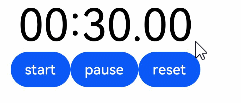
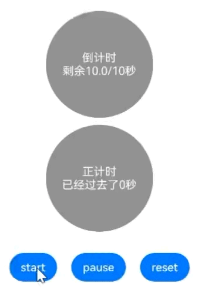
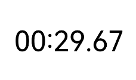
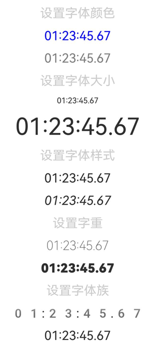
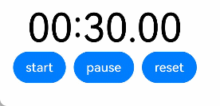

# TextTimer
<!--Kit: ArkUI-->
<!--Subsystem: ArkUI-->
<!--Owner: @Zhang-Dong-hui-->
<!--Designer: @xiangyuan6-->
<!--Tester:@jiaoaozihao-->
<!--Adviser: @Brilliantry_Rui-->

TextTimer是通过文本显示计时信息并控制其计时器状态的组件，支持正向计时与倒计时两种模式，可自定义显示格式，适用于秒表、活动倒计时等需要展示时间流逝的场景。常用于倒计时场景，如考试倒计时、限时活动、运动计时等。

组件不可见（非锁屏状态和应用后台状态）时，UI时间变动将停止（即该组件此时不会绘制），[onTimer](#ontimer)仍然会正常触发。

>  **说明：**
>
> 该组件从API version 8开始支持。后续版本的新增接口，采用上角标单独标记接口的起始版本。

## 子组件

无

## 接口

TextTimer(options?: TextTimerOptions)

**卡片能力：** 从API version 10开始，该接口支持在ArkTS卡片中使用。

**原子化服务API：** 从API version 11开始，该接口支持在原子化服务中使用。

**系统能力：** SystemCapability.ArkUI.ArkUI.Full

**参数：** 

| 参数名 | 类型 | 必填 | 说明 |
| -------- | -------- | -------- | -------- |
| options | [TextTimerOptions](#texttimeroptions对象说明)| 否 | 通过文本显示计时信息并控制其计时器状态的组件参数。当需要自定义计时器配置（如设置倒计时开关、计时时间、初始时间、控制器等）时传入此参数；不传入时使用TextTimerOptions的默认配置。<br>默认值继承[TextTimerOptions](#texttimeroptions对象说明) 。|

## TextTimerOptions对象说明

用于构建TextTimer组件的选项。

**系统能力：** SystemCapability.ArkUI.ArkUI.Full

| 名称   | 类型     | 只读 | 可选 | 说明                   |
| ----------- | -------- | -------- | -------- | -------- |
| isCountDown | boolean  | 否  | 是  | 倒计时开关。<br>true：计时器开启倒计时，例如从30秒~0秒。<br>false：计时器开始计时，例如从0秒~30秒。<br>默认值：false <br>**卡片能力：** 从API version 10开始，该接口支持在ArkTS卡片中使用。<br>**原子化服务API：** 从API version 11开始，该接口支持在原子化服务中使用。 |
| count       | number   | 否  | 是  | 计时器初始时间，单位为毫秒，isCountDown为true时生效。<br>默认值：60000<br>取值范围为(0, 86400000)，即不超过24小时。超出取值范围时置为默认值。<br>**卡片能力：** 从API version 10开始，该接口支持在ArkTS卡片中使用。<br>**原子化服务API：** 从API version 11开始，该接口支持在原子化服务中使用。 |
| controller | [TextTimerController](#texttimercontroller) | 否 | 是 | TextTimer控制器，用于通过编程方式控制计时器的启动、暂停和重置。不传入时，计时器仍可正常显示但无法通过代码控制其状态。<br>**卡片能力：** 从API version 10开始，该接口支持在ArkTS卡片中使用。<br>**原子化服务API：** 从API version 11开始，该接口支持在原子化服务中使用。 |
| startTime | number | 否 | 是 | 计时器正向计时模式下的初始时间，仅当isCountDown为false时该参数设置生效。<br>取值范围：[−2147483648, 2147483647]。<br>默认值：0 <br>单位：毫秒 <br>当值为负数时，计时器将从负值开始计时，经过0后继续向正数计时。<br>**起始版本：** 26.0.0 <br>**模型约束：** 此接口仅可在Stage模型下使用。<br>**卡片能力：** 从API版本26.0.0开始，该接口支持在ArkTS卡片中使用。<br>**原子化服务API：** 从API版本26.0.0开始，该接口支持在原子化服务中使用。 |

## 属性

除支持[通用属性](ts-component-general-attributes.md)外，还支持以下属性：

### format

format(value: string)

设置自定义时间格式，需至少包含一个HH、mm、ss、SS中的关键字。使用yy、MM、dd等日期格式时，不支持该格式，将使用默认格式'HH:mm:ss.SS'。

计时器更新频率按format最小单位处理，例如：format设置为'HH:mm'时，更新频率为一分钟。设置高精度的format（如包含SS）时，可能会导致onTimer回调间隔不均匀。

**卡片能力：** 从API version 10开始，该接口支持在ArkTS卡片中使用。

**原子化服务API：** 从API version 11开始，该接口支持在原子化服务中使用。

**模型约束：** 此接口仅可在Stage模型下使用。

**系统能力：** SystemCapability.ArkUI.ArkUI.Full

**参数：** 

| 参数名 | 类型   | 必填 | 说明                                   |
| ------ | ------ | ---- | -------------------------------------- |
| value  | string | 是   | 自定义计时器显示的时间格式，需至少包含一个HH、mm、ss、SS中的关键字。<br>默认值：'HH:mm:ss.SS' |


### fontColor

fontColor(value: ResourceColor)

设置字体颜色。

**卡片能力：** 从API version 10开始，该接口支持在ArkTS卡片中使用。

**原子化服务API：** 从API version 11开始，该接口支持在原子化服务中使用。

**模型约束：** 此接口仅可在Stage模型下使用。

**系统能力：** SystemCapability.ArkUI.ArkUI.Full

**参数：** 

| 参数名 | 类型                                       | 必填 | 说明       |
| ------ | ------------------------------------------ | ---- | ---------- |
| value  | [ResourceColor](ts-types.md#resourcecolor) | 是   | 字体颜色。<br>Wearable设备上默认值为：'#c5ffffff'，显示白色。<br>其他设备上默认值：'#e6182431'，显示黑色。|

### fontSize

fontSize(value: Length)

设置字体大小。

**卡片能力：** 从API version 10开始，该接口支持在ArkTS卡片中使用。

**原子化服务API：** 从API version 11开始，该接口支持在原子化服务中使用。

**模型约束：** 此接口仅可在Stage模型下使用。

**系统能力：** SystemCapability.ArkUI.ArkUI.Full

**参数：** 

| 参数名 | 类型                         | 必填 | 说明                                                         |
| ------ | ---------------------------- | ---- | ------------------------------------------------------------ |
| value  | [Length](ts-types.md#length) | 是   | 字体大小。<br>默认值：16fp<br>value为Length中的number类型时，单位为fp。value为Length中的string类型时，若设置值为非数字开头，则按0fp处理；若设置值为数字开头，当数字后内容包含除[像素单位](ts-pixel-units.md)外的字符（如字母、特殊符号等）时，取值字符串开头的数字部分，单位为fp。<br>例如：设置值为"abc"时取值为0fp，设置值为"10vp"时取值为10vp，设置值为"10vp11abc"时取值为10fp。不支持设置百分比字符串。 |

### fontStyle

fontStyle(value: FontStyle)

设置字体样式。

**卡片能力：** 从API version 10开始，该接口支持在ArkTS卡片中使用。

**原子化服务API：** 从API version 11开始，该接口支持在原子化服务中使用。

**模型约束：** 此接口仅可在Stage模型下使用。

**系统能力：** SystemCapability.ArkUI.ArkUI.Full

**参数：** 

| 参数名 | 类型                                        | 必填 | 说明                                    |
| ------ | ------------------------------------------- | ---- | --------------------------------------- |
| value  | [FontStyle](ts-appendix-enums.md#fontstyle) | 是   | 字体样式，例如斜体的字体样式。<br>默认值：FontStyle.Normal |

### fontWeight

fontWeight(value: number | FontWeight | ResourceStr)

设置文本的字体粗细，设置过大可能会导致不同字体下的文字出现截断。

**卡片能力：** 从API version 10开始，该接口支持在ArkTS卡片中使用。

**原子化服务API：** 从API version 11开始，该接口支持在原子化服务中使用。

**模型约束：** 此接口仅可在Stage模型下使用。

**系统能力：** SystemCapability.ArkUI.ArkUI.Full

**参数：** 

| 参数名 | 类型  | 必填 | 说明      |
| ------ | ---------- | ------ | ----------------- |
| value  | number&nbsp;\|&nbsp;[FontWeight](ts-appendix-enums.md#fontweight)&nbsp;\|&nbsp;[ResourceStr](ts-types.md#resourcestr) | 是   | 文本的字体粗细，number类型取值范围为[100, 900]，取值间隔为100，取值越大，字体越粗。number类型取值范围外的默认值为400。[ResourceStr](ts-types.md#resourcestr)类型仅支持number类型取值的字符串形式，例如"400"，以及"bold"、"bolder"、"lighter"、"regular"、"medium"，分别对应FontWeight中相应的枚举值。<br>默认值：FontWeight.Normal <br>从API version 20开始，支持Resource类型。|

### fontFamily

fontFamily(value: ResourceStr)

设置字体列表。

**卡片能力：** 从API version 10开始，该接口支持在ArkTS卡片中使用。

**原子化服务API：** 从API version 11开始，该接口支持在原子化服务中使用。

**模型约束：** 此接口仅可在Stage模型下使用。

**系统能力：** SystemCapability.ArkUI.ArkUI.Full

**参数：** 

| 参数名 | 类型                                   | 必填 | 说明                                                         |
| ------ | -------------------------------------- | ---- | ------------------------------------------------------------ |
| value  | [ResourceStr](ts-types.md#resourcestr) | 是   | 字体列表。默认字体为'HarmonyOS Sans'。<br>应用当前支持'HarmonyOS Sans'字体和[注册自定义字体](../js-apis-font.md)。<br>卡片当前仅支持'HarmonyOS Sans'字体。 |

### textShadow<sup>11+</sup>

textShadow(value: ShadowOptions | Array&lt;ShadowOptions&gt;)

设置文字阴影效果。该接口支持以数组形式入参，实现多重文字阴影。不支持fill字段和智能取色模式。

>**说明：**
>
> 从API version 12开始，该接口支持在[attributeModifier](ts-universal-attributes-attribute-modifier.md#attributemodifier)中调用。

**原子化服务API：** 从API version 12开始，该接口支持在原子化服务中使用。

**模型约束：** 此接口仅可在Stage模型下使用。

**系统能力：** SystemCapability.ArkUI.ArkUI.Full

**参数：** 

| 参数名 | 类型                                                         | 必填 | 说明           |
| ------ | ------------------------------------------------------------ | ---- | -------------- |
| value  | [ShadowOptions](ts-universal-attributes-image-effect.md#shadowoptions对象说明)&nbsp;\|&nbsp;Array&lt;[ShadowOptions](ts-universal-attributes-image-effect.md#shadowoptions对象说明)> | 是   | 文字阴影效果的参数，包括颜色、模糊半径、偏移量。 |

### contentModifier<sup>12+</sup>

contentModifier(modifier: ContentModifier\<TextTimerConfiguration>)

定制TextTimer内容区的方法。当默认的文本显示样式无法满足需求时，可用于实现自定义的计时器UI效果。

**原子化服务API：** 从API version 12开始，该接口支持在原子化服务中使用。

**模型约束：** 此接口仅可在Stage模型下使用。

**系统能力：** SystemCapability.ArkUI.ArkUI.Full

**参数：**

| 参数名 | 类型                                          | 必填 | 说明                                             |
| ------ | --------------------------------------------- | ---- | ------------------------------------------------ |
| modifier  | [ContentModifier](./ts-universal-attributes-content-modifier.md#contentmodifiert)\<[TextTimerConfiguration](#texttimerconfiguration12对象说明)> | 是   | 在TextTimer组件上，定制内容区的方法。<br>modifier： 内容修改器，开发者需要自定义class实现ContentModifier接口。 |

## 事件

### onTimer

onTimer(event:&nbsp;(utc:&nbsp;number,&nbsp;elapsedTime:&nbsp;number)&nbsp;=&gt;&nbsp;void)

时间文本发生变化时触发该事件。锁屏状态和应用后台状态下不会触发该事件。组件不可见（非锁屏状态和应用后台状态）时，UI时间变动将停止，但该事件仍会正常触发。设置高精度的[format](#format)（SS）时，回调间隔可能不均匀，相邻两次回调的时间间隔可能存在差异。

**卡片能力：** 从API version 10开始，该接口支持在ArkTS卡片中使用。

**原子化服务API：** 从API version 11开始，该接口支持在原子化服务中使用。

**模型约束：** 此接口仅可在Stage模型下使用。

**系统能力：** SystemCapability.ArkUI.ArkUI.Full

**参数：** 

| 参数名      | 类型   | 必填 | 说明                                                         |
| ----------- | ------ | ---- | ------------------------------------------------------------ |
| utc         | number | 是   | Linux时间戳，即自1970年1月1日起经过的时间，单位为[format](#format)属性设置格式中的最小时间单位。 |
| elapsedTime | number | 是   | 计时器经过的时间，单位为设置格式的最小单位。                 |

## TextTimerController

TextTimer组件的控制器，用于控制文本计时器。一个TextTimer组件仅支持绑定一个控制器，组件创建完成后相关指令才能被调用。一个TextTimerController只能控制最后一个绑定此TextTimerController的TextTimer组件。

**卡片能力：** 从API version 10开始，该接口支持在ArkTS卡片中使用。

**原子化服务API：** 从API version 11开始，该接口支持在原子化服务中使用。

**模型约束：** 此接口仅可在Stage模型下使用。

### 导入对象

``` ts
textTimerController: TextTimerController = new TextTimerController();
```

### constructor

constructor()

TextTimerController的构造函数。

**卡片能力：** 从API version 10开始，该接口支持在ArkTS卡片中使用。

**原子化服务API：** 从API version 11开始，该接口支持在原子化服务中使用。

**模型约束：** 此接口仅可在Stage模型下使用。

**系统能力：** SystemCapability.ArkUI.ArkUI.Full

### start

start()

计时开始。需在TextTimer组件创建完成并绑定控制器后调用。

**卡片能力：** 从API version 10开始，该接口支持在ArkTS卡片中使用。

**原子化服务API：** 从API version 11开始，该接口支持在原子化服务中使用。

**模型约束：** 此接口仅可在Stage模型下使用。

**系统能力：** SystemCapability.ArkUI.ArkUI.Full

### pause

pause()

计时暂停。需在组件创建完成后调用。

**卡片能力：** 从API version 10开始，该接口支持在ArkTS卡片中使用。

**原子化服务API：** 从API version 11开始，该接口支持在原子化服务中使用。

**模型约束：** 此接口仅可在Stage模型下使用。

**系统能力：** SystemCapability.ArkUI.ArkUI.Full

### reset

reset()

重置计时器。需在组件创建完成后调用。

**卡片能力：** 从API version 10开始，该接口支持在ArkTS卡片中使用。

**原子化服务API：** 从API version 11开始，该接口支持在原子化服务中使用。

**模型约束：** 此接口仅可在Stage模型下使用。

**系统能力：** SystemCapability.ArkUI.ArkUI.Full

## TextTimerConfiguration<sup>12+</sup>对象说明

ContentModifier接口使用的TextTimer配置。

开发者需要自定义class实现ContentModifier接口。

**模型约束：** 此接口仅可在Stage模型下使用。

**系统能力：** SystemCapability.ArkUI.ArkUI.Full

| 名称 | 类型    |  只读  |  可选   |  说明              |
| ------ | ------ | ------ | ------ |-------------------------------- |
| count | number | 否 | 否 | 计时器初始时间，单位为毫秒，isCountDown为true时生效。<br>默认值：60000<br>取值范围为(0, 86400000)，即不超过24小时。超出取值范围时置为默认值。<br>**原子化服务API：** 从API version 12开始，该接口支持在原子化服务中使用。 |
| isCountDown | boolean| 否 | 否 | 是否倒计时。<br>true：计时器开启倒计时，例如从30秒~0秒；false：计时器开始计时，例如从0秒~30秒。<br> 默认值：false <br>**原子化服务API：** 从API version 12开始，该接口支持在原子化服务中使用。 |
| started | boolean | 否 | 否 | 是否已经开始了计时。<br>true：开始计时；false：未开始计时。<br>默认值：false <br>**原子化服务API：** 从API version 12开始，该接口支持在原子化服务中使用。 |
| elapsedTime | number | 否 | 否 |计时器经过的时间，单位为设置格式的最小单位。<br>**原子化服务API：** 从API version 12开始，该接口支持在原子化服务中使用。 |
| startTime | number | 否 | 是 | 计时器正向计时模式下的初始时间，仅当isCountDown为false时该参数设置生效。<br>取值范围：无上限，支持负数。<br>默认值：0 <br>单位：毫秒 <br>当值为负数时，计时器将从负值开始计时，经过0后继续向正数计时。<br>**起始版本：** 26.0.0<br>**原子化服务API：** 从API版本26.0.0开始，该接口支持在原子化服务中使用。 |

## 示例
### 示例1（支持手动启停的文本计时器）

该示例展示了TextTimer组件的基本使用方法，通过[format](#format)属性设置计时器的文本显示格式。

用户可以通过点击"start"、"pause"、"reset"按钮，开启、暂停、重置计时器。

```ts
// xxx.ets
@Entry
@Component
struct TextTimerExample {
  textTimerController: TextTimerController = new TextTimerController();
  @State format: string = 'mm:ss.SS';

  build() {
    Column() {
      TextTimer({ isCountDown: true, count: 30000, controller: this.textTimerController })
        .format(this.format)
        .fontColor(Color.Black)
        .fontSize(50)
        .onTimer((utc: number, elapsedTime: number) => {
          console.info('textTimer countDown utc is：' + utc + ', elapsedTime: ' + elapsedTime);
        })
      Row() {
        Button('start').onClick(() => {
          this.textTimerController.start();
        })
        Button('pause').onClick(() => {
          this.textTimerController.pause();
        })
        Button('reset').onClick(() => {
          this.textTimerController.reset();
        })
      }
    }
  }
}
```




### 示例2（设定文本阴影样式）

该示例通过[textShadow](#textshadow11)属性设置计时器的文本阴影样式。

``` ts
// xxx.ets
@Entry
@Component
struct TextTimerExample {
  @State textShadows: ShadowOptions | Array<ShadowOptions> = [{
    radius: 10,
    color: Color.Red,
    offsetX: 10,
    offsetY: 0
  }, {
    radius: 10,
    color: Color.Black,
    offsetX: 20,
    offsetY: 0
  }, {
    radius: 10,
    color: Color.Brown,
    offsetX: 30,
    offsetY: 0
  }, {
    radius: 10,
    color: Color.Green,
    offsetX: 40,
    offsetY: 0
  }, {
    radius: 10,
    color: Color.Yellow,
    offsetX: 100,
    offsetY: 0
  }];

  build() {
    Column({ space: 8 }) {
      TextTimer().fontSize(50).textShadow(this.textShadows)
    }
  }
}
```


### 示例3（设定自定义内容区）

该示例实现了两个简易秒表，使用浅灰色背景。计时器开始后，会实时显示时间变化。倒计时器开始后，背景会变成黑色，正计时器开始后，背景会变成灰色。

``` ts
// xxx.ets
class MyTextTimerModifier implements ContentModifier<TextTimerConfiguration> {
  constructor() {
  }

  applyContent(): WrappedBuilder<[TextTimerConfiguration]> {
    return wrapBuilder(buildTextTimer);
  }
}

@Builder
function buildTextTimer(config: TextTimerConfiguration) {
  Column() {
    Stack({ alignContent: Alignment.Center }) {
      Circle({ width: 150, height: 150 })
        .fill(config.started ? (config.isCountDown ? 0xFF232323 : 0xFF717171) : 0xFF929292)
      Column() {
        Text(config.isCountDown ? '倒计时' : '正计时').fontColor(Color.White)
        Text(
          (config.isCountDown ? '剩余' : '已经过去了') + (config.isCountDown ?
            (Math.max(config.count / 1000 - config.elapsedTime / 100, 0)).toFixed(1) + '/' +
            (config.count / 1000).toFixed(0)
            : ((config.elapsedTime / 100).toFixed(0))
          ) + '秒'
        ).fontColor(Color.White)
      }
    }
  }
}

@Entry
@Component
struct Index {
  @State count: number = 10000;
  @State myTimerModifier: MyTextTimerModifier = new MyTextTimerModifier();
  countDownTextTimerController: TextTimerController = new TextTimerController();
  countUpTextTimerController: TextTimerController = new TextTimerController();

  build() {
    Row() {
      Column() {
        TextTimer({ isCountDown: true, count: this.count, controller: this.countDownTextTimerController })
          .contentModifier(this.myTimerModifier)
          .onTimer((utc: number, elapsedTime: number) => {
            console.info('textTimer onTimer utc is：' + utc + ', elapsedTime: ' + elapsedTime);
          })
          .margin(10)
        TextTimer({ isCountDown: false, controller: this.countUpTextTimerController })
          .contentModifier(this.myTimerModifier)
          .onTimer((utc: number, elapsedTime: number) => {
            console.info('textTimer onTimer utc is：' + utc + ', elapsedTime: ' + elapsedTime);
          })
        Row() {
          Button('start').onClick(() => {
            this.countDownTextTimerController.start();
            this.countUpTextTimerController.start();
          }).margin(10)
          Button('pause').onClick(() => {
            this.countDownTextTimerController.pause();
            this.countUpTextTimerController.pause();
          }).margin(10)
          Button('reset').onClick(() => {
            this.countDownTextTimerController.reset();
            this.countUpTextTimerController.reset();
          }).margin(10)
        }.margin(20)
      }.width('100%')
    }.height('100%')
  }
}
```


### 示例4（创建之后立即执行计时）

该示例展示了TextTimer计时器如何在创建完成之后立即开始计时。

``` ts
// xxx.ets
@Entry
@Component
struct TextTimerStart {
  textTimerController: TextTimerController = new TextTimerController();
  @State format: string = 'mm:ss.SS';

  build() {
    Column() {
      TextTimer({ isCountDown: true, count: 30000, controller: this.textTimerController })
        .format(this.format)
        .fontColor(Color.Black)
        .fontSize(50)
        .onTimer((utc: number, elapsedTime: number) => {
          console.info('textTimer countDown utc is：' + utc + ', elapsedTime: ' + elapsedTime);
        })
        .onAppear(() => {
          this.textTimerController.start();
        })
    }
    .height('100%')
    .width('100%')
    .justifyContent(FlexAlign.Center)
  }
}
```


### 示例5（设置文本样式）

该示例通过[fontColor](#fontcolor)、[fontSize](#fontsize)、[fontStyle](#fontstyle)、[fontWeight](#fontweight)、[fontFamily](#fontfamily)属性展示了不同样式的文本效果。

``` ts
// xxx.ets
@Entry
@Component
struct TextTimerDemo {
  textTimerController: TextTimerController = new TextTimerController();
  @State countValue: number = 5025678;

  build() {
    Column({ space: 10 }) {
      Text('设置字体颜色').fontColor(0xCCCCCC)
      TextTimer({ isCountDown: true, count: this.countValue, controller: this.textTimerController })
        .fontColor(Color.Blue)
      TextTimer({ isCountDown: true, count: this.countValue, controller: this.textTimerController })
        .fontColor(Color.Gray)

      Text('设置字体大小').fontColor(0xCCCCCC)
      TextTimer({ isCountDown: true, count: this.countValue, controller: this.textTimerController })
        .fontSize(10)
      TextTimer({ isCountDown: true, count: this.countValue, controller: this.textTimerController })
        .fontSize(30)

      Text('设置字体样式').fontColor(0xCCCCCC)
      TextTimer({ isCountDown: true, count: this.countValue, controller: this.textTimerController })
        .fontStyle(FontStyle.Normal)
      TextTimer({ isCountDown: true, count: this.countValue, controller: this.textTimerController })
        .fontStyle(FontStyle.Italic)

      Text('设置字重').fontColor(0xCCCCCC)
      TextTimer({ isCountDown: true, count: this.countValue, controller: this.textTimerController })
        .fontWeight(FontWeight.Lighter)
      TextTimer({ isCountDown: true, count: this.countValue, controller: this.textTimerController })
        .fontWeight(FontWeight.Bolder)

      Text('设置字体族').fontColor(0xCCCCCC)
      TextTimer({ isCountDown: true, count: this.countValue, controller: this.textTimerController })
        .fontFamily('HMOS Color Emoji')
      TextTimer({ isCountDown: true, count: this.countValue, controller: this.textTimerController })
        .fontFamily('HarmonyOS Sans')
    }
    .width('100%')
    .height('100%')
    .justifyContent(FlexAlign.Center)
  }
}
```



### 示例6（设置初始计时时间）

该示例通过[TextTimerOptions](#texttimeroptions对象说明)的startTime属性设置计时器初始计时时间。

从API版本26.0.0开始，[TextTimerOptions](#texttimeroptions对象说明)新增了startTime属性。

``` ts
// xxx.ets
@Entry
@Component
struct TextTimerExample {
  textTimerController: TextTimerController = new TextTimerController();
  @State format: string = 'mm:ss.SS';

  build() {
    Column() {
      TextTimer({ isCountDown: false, controller: this.textTimerController, startTime: 30000 })
        .format(this.format)
        .fontColor(Color.Black)
        .fontSize(50)
        .onTimer((utc: number, elapsedTime: number) => {
          console.info('textTimer notCountDown utc is：' + utc + ', elapsedTime: ' + elapsedTime);
        })
      Row({ space: 10 }) {
        Button('start').onClick(() => {
          this.textTimerController.start();
        })
        Button('pause').onClick(() => {
          this.textTimerController.pause();
        })
        Button('reset').onClick(() => {
          this.textTimerController.reset();
        })
      }
    }
  }
}
```

