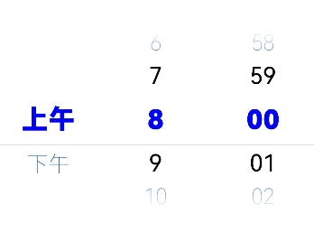
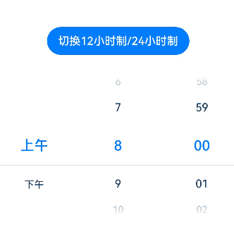
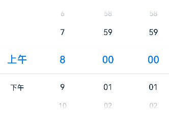
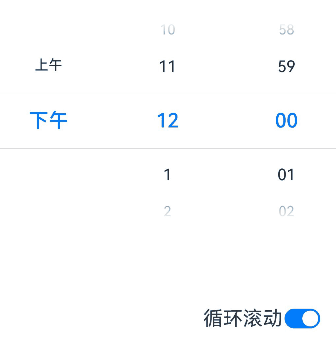
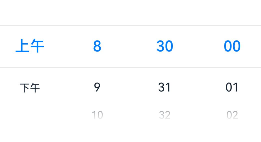
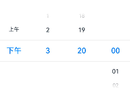

# TimePicker
<!--Kit: ArkUI-->
<!--Subsystem: ArkUI-->
<!--Owner: @luoying_ace_admin-->
<!--Designer: @weixin_52725220-->
<!--Tester: @xiong0104-->
<!--Adviser: @Brilliantry_Rui-->

TimePicker是用于滑动选择时间的组件，支持12/24小时制、多种时间格式（小时/分钟/秒）、循环滚动、样式定制和时间范围限制等功能。适用于日程安排、时间预约、任务管理等需要用户选择时间的场景，能够提升用户体验，减少输入错误，并可快速集成到应用中。

>  **说明：**
>
> - 该组件从API version 8开始支持。后续版本的新增接口，采用上角标单独标记接口的起始版本。
>
> - 该组件不建议开发者在动效过程中修改属性数据。
>
> - 最大显示行数在横、竖屏模式下存在差异。竖屏时默认为5行，横屏时依赖系统配置，未配置时默认显示为3行。可通过如下参数查看具体配置值$r('sys.float.ohos_id_picker_show_count_landscape')。


## 子组件

该组件为基础组件，不建议包含子组件。


## 接口

创建滑动选择器，默认使用24小时的时间区间。适用于日程安排、闹钟设置、时间记录等需要选择时间的场景。

创建时间选择器，默认使用24小时的时间区间。

**原子化服务API：** 从API version 11开始，该接口支持在原子化服务中使用。

**系统能力：** SystemCapability.ArkUI.ArkUI.Full

**参数：**

| 参数名  | 类型                                            | 必填 | 说明                     |
| ------- | ----------------------------------------------- | ---- | ------------------------ |
| options | [TimePickerOptions](#timepickeroptions对象说明) | 否   | 配置时间选择组件的参数。当需要自定义初始选中时间、时间格式、时间范围等配置时传入此参数，不传入时使用默认配置（初始选中时间为当前系统时间，时间格式默认为小时和分钟，时间范围默认为00:00-23:59（默认结束时间为23:59:59））。 |

## TimePickerOptions对象说明

时间选择器组件的参数说明。

**系统能力：** SystemCapability.ArkUI.ArkUI.Full

| 名称                 | 类型                                            | 只读 | 可选 | 说明                                                         |
| -------------------- | ----------------------------------------------- | ---- | ---- | ------------------------------------------------------------ |
| selected             | Date                                            | 否   | 是   | 设置选中项的时间。<br>默认值：当前系统时间<br>从API version 10开始，该参数支持[$$](../../../ui/state-management/arkts-two-way-sync.md)双向绑定变量。<br>**原子化服务API：** 从API version 11开始，该接口支持在原子化服务中使用。 |
| format<sup>11+</sup> | [TimePickerFormat](#timepickerformat11枚举说明) | 否   | 是   | 指定需要显示的TimePicker的格式。<br>默认值：TimePickerFormat.HOUR_MINUTE <br>**原子化服务API：** 从API version 12开始，该接口支持在原子化服务中使用。<br>**模型约束：** 此接口仅可在Stage模型下使用。 |
| start<sup>18+</sup>  | Date                                            | 否   | 是   | 指定时间选择组件的起始时间。<br>默认值：起始时间为00:00:00（小时=0，分钟=0）<br>**说明：**<br>1. 仅设置的小时和分钟生效。<br>2. 设置了start或end且为非默认值的场景下，loop不生效。 <br>**原子化服务API：** 从API version 18开始，该接口支持在原子化服务中使用。<br>**模型约束：** 此接口仅可在Stage模型下使用。 |
| end<sup>18+</sup>    | Date                                            | 否   | 是   | 指定时间选择组件的结束时间。<br>默认值：结束时间为23:59:59（小时=23，分钟=59）<br>**说明：**<br>1. 仅设置的小时和分钟生效。<br>2. 设置了start或end且为非默认值的场景下，loop不生效。 <br>**原子化服务API：** 从API version 18开始，该接口支持在原子化服务中使用。<br>**模型约束：** 此接口仅可在Stage模型下使用。 |

在TimePicker组件滑动过程中修改TimePickerOptions中的属性，会导致这些属性无法生效。

Date对象用于处理日期和时间，使用方式如下。

**方式1：** new Date()

获取系统当前日期和时间。

**方式2：** new Date(value: number | string)

| 参数名   | 类型   | 必填 | 说明   |
| ------- | ------ | ---- | ------ |
| value   | number&nbsp;\|&nbsp;string  | 是 | 设置日期格式。<br>number：毫秒，自1970年1月1日00:00:00开始的毫秒数。取值范围：[0, +∞)。<br>string：时间格式的字符串，如‘2025-02-20 08:00:00’或‘2025-02-20T08:00:00’。|

**方式3：** new Date(year: number, monthIndex: number, date?: number, hours?: number, minutes?: number, seconds?: number, ms?: number)

| 参数名   | 类型   | 必填 | 说明   |
| --------| ------ | ---- | ------ |
| year        | number | 是   | 设置年份，例如2025。|
| monthIndex  | number | 是   | 设置月份索引（取值范围0-11），其中0表示1月，11表示12月。例如：传入0表示1月，传入2表示3月。超出范围时会导致日期计算错误。|
| date        | number | 否   | 设置日期，例如10（如果设置hours，则date不能省略）。|
| hours       | number | 否   | 设置小时，例如15（如果设置minutes，则hours不能省略）。|
| minutes     | number | 否   | 设置分钟，例如20（如果设置seconds，则minutes不能省略）。|
| seconds     | number | 否   | 设置秒，例如20（如果设置ms，则seconds不能省略）。|
| hours       | number | 否   | 设置小时，取值范围[0, 23]。超出范围时会导致日期计算错误。例如15（如果设置minutes，则hours不能省略）。单位：小时。|
| minutes     | number | 否   | 设置分钟，取值范围[0, 59]。超出范围时会导致日期计算错误。例如20（如果设置seconds，则minutes不能省略）。单位：分钟。|
| seconds     | number | 否   | 设置秒，取值范围[0, 59]。超出范围时会导致日期计算错误。例如20（如果设置ms，则seconds不能省略）。单位：秒。|
| ms          | number | 否   | 设置毫秒，取值范围[0, 999]。超出范围时会导致日期计算错误。例如10。单位：ms（毫秒）。|

**起始时间和结束时间的异常情形说明：**

| 异常情形   | 对应结果  |
| -------- |  ------------------------------------------------------------ |
| 起始时间晚于结束时间。    | 起始时间、结束时间都为默认值。  |
| 选中时间早于起始时间。   | 选中时间为起始时间。  |
| 选中时间晚于结束时间。    | 选中时间为结束时间。  |
| 起始时间晚于当前系统时间，选中时间未设置。    | 选中时间为起始时间。 |
| 结束时间早于当前系统时间，选中时间未设置。    | 选中时间为结束时间。  |
| 时间格式不符合规范，如'01:61:61'。   | 取默认值。  |

## TimePickerFormat<sup>11+</sup>枚举说明

时间选择器的数据格式。

**原子化服务API：** 从API version 12开始，该接口支持在原子化服务中使用。

**模型约束：** 此接口仅可在Stage模型下使用。

**系统能力：** SystemCapability.ArkUI.ArkUI.Full

| 名称               | 值 | 说明                     |
| ------------------ | - | ------------------------ |
| HOUR_MINUTE        | 0 | 按照小时和分钟进行显示。       |
| HOUR_MINUTE_SECOND | 1 | 按照小时、分钟和秒进行显示。 |

## 属性

除支持[通用属性](ts-component-general-attributes.md)外，还支持以下属性：

### useMilitaryTime

useMilitaryTime(value: boolean)

设置时间是否以24小时制展示，未通过该接口设置时，默认跟随系统设置展示。24小时制适用于精确的时间记录和调度场景，12小时制适用于日常闹钟设置等更直观的时间显示需求。

**原子化服务API：** 从API version 11开始，该接口支持在原子化服务中使用。

**系统能力：** SystemCapability.ArkUI.ArkUI.Full

**参数：** 

| 参数名 | 类型    | 必填 | 说明                                       |
| ------ | ------- | ---- | ------------------------------------------ |
| value  | boolean | 是   | 时间是否以24小时制展示。<br>- true：时间以24小时制展示。<br>- false：时间以12小时制展示。|

### useMilitaryTime<sup>18+</sup>

useMilitaryTime(isMilitaryTime: Optional\<boolean>)

设置展示时间是否为24小时制，未通过该接口设置时，默认跟随系统设置展示。与[useMilitaryTime](#usemilitarytime)相比，isMilitaryTime参数新增了对undefined类型的支持。

**原子化服务API：** 从API version 18开始，该接口支持在原子化服务中使用。

**模型约束：** 此接口仅可在Stage模型下使用。

**系统能力：** SystemCapability.ArkUI.ArkUI.Full

**参数：**

| 参数名 | 类型    | 必填 | 说明                                       |
| ------ | ------- | ---- | ------------------------------------------ |
| isMilitaryTime | [Optional](ts-universal-attributes-custom-property.md#optionalt)\<boolean> | 是   | 展示时间是否为24小时制。<br>- true：展示时间为24小时制。<br>- false：展示时间为12小时制。<br>当isMilitaryTime的值为undefined时，跟随系统设置。|

### disappearTextStyle<sup>10+</sup>

disappearTextStyle(value: PickerTextStyle)

设置边缘项（以选中项为基准向上或向下的第二项）的文本颜色、字号、字体粗细。

**原子化服务API：** 从API version 11开始，该接口支持在原子化服务中使用。

**模型约束：** 此接口仅可在Stage模型下使用。

**系统能力：** SystemCapability.ArkUI.ArkUI.Full

**参数：** 

| 参数名 | 类型                                                         | 必填 | 说明                                                         |
| ------ | ------------------------------------------------------------ | ---- | ------------------------------------------------------------ |
| value  | [PickerTextStyle](ts-picker-common.md#pickertextstyle对象说明) | 是   | 边缘项（以选中项为基准向上或向下的第二项）的文本颜色、字号和字体粗细。<br>默认值：<br>{<br>color: '#ff182431',<br>font: {<br>size: '14fp', <br>weight: FontWeight.Regular<br>}<br>} |

>  **说明：**
>
> 若选中项向上或向下的可视项数低于两项则无对应边缘项。

### disappearTextStyle<sup>18+</sup>

disappearTextStyle(style: Optional\<PickerTextStyle>)

设置边缘项（以选中项为基准向上或向下的第二项）的文本颜色、字号、字体粗细。与[disappearTextStyle<sup>10+</sup>](#disappeartextstyle10)相比，style参数新增了对undefined类型的支持。

**原子化服务API：** 从API version 18开始，该接口支持在原子化服务中使用。

**模型约束：** 此接口仅可在Stage模型下使用。

**系统能力：** SystemCapability.ArkUI.ArkUI.Full

**参数：**

| 参数名 | 类型                                                         | 必填 | 说明                                                         |
| ------ | ------------------------------------------------------------ | ---- | ------------------------------------------------------------ |
| style  | [Optional](ts-universal-attributes-custom-property.md#optionalt)\<[PickerTextStyle](ts-picker-common.md#pickertextstyle对象说明)> | 是   | 边缘项的文本颜色、字号、字体粗细。<br>默认值：<br>{<br>color: '#ff182431',<br>font: {<br>size: '14fp', <br>weight: FontWeight.Regular<br>}<br>}<br>当style的值为undefined时，使用默认值。 |

>  **说明：**
>
> 若选中项向上或向下的可视项数低于两项则无对应边缘项。

### textStyle<sup>10+</sup>

textStyle(value: PickerTextStyle)

设置待选项（以选中项为基准向上或向下的第一项）的文本颜色、字号、字体粗细。

**原子化服务API：** 从API version 11开始，该接口支持在原子化服务中使用。

**模型约束：** 此接口仅可在Stage模型下使用。

**系统能力：** SystemCapability.ArkUI.ArkUI.Full

**参数：** 

| 参数名 | 类型                                                         | 必填 | 说明                                                         |
| ------ | ------------------------------------------------------------ | ---- | ------------------------------------------------------------ |
| value  | [PickerTextStyle](ts-picker-common.md#pickertextstyle对象说明) | 是   | 待选项的文本颜色、字号、字体粗细。<br>默认值：<br>{<br>color: '#ff182431',<br>font: {<br>size: '16fp', <br>weight: FontWeight.Regular<br>}<br>} |

>  **说明：**
>
> 若选中项向上或向下可视项数低于一项则无对应待选项。

### textStyle<sup>18+</sup>

textStyle(style: Optional\<PickerTextStyle>)

设置待选项（以选中项为基准向上或向下的第一项）的文本颜色、字号、字体粗细。与[textStyle<sup>10+</sup>](#textstyle10)相比，style参数新增了对undefined类型的支持。

**原子化服务API：** 从API version 18开始，该接口支持在原子化服务中使用。

**模型约束：** 此接口仅可在Stage模型下使用。

**系统能力：** SystemCapability.ArkUI.ArkUI.Full

**参数：**

| 参数名 | 类型                                                         | 必填 | 说明                                                         |
| ------ | ------------------------------------------------------------ | ---- | ------------------------------------------------------------ |
| style  | [Optional](ts-universal-attributes-custom-property.md#optionalt)\<[PickerTextStyle](ts-picker-common.md#pickertextstyle对象说明)> | 是   | 待选项的文本颜色、字号、字体粗细。<br>默认值：<br>{<br>color: '#ff182431',<br>font: {<br>size: '16fp', <br>weight: FontWeight.Regular<br>}<br>}<br>当style的值为undefined时，使用默认值。 |

>  **说明：**
>
> 若选中项向上或向下可视项数低于一项则无对应待选项。

### selectedTextStyle<sup>10+</sup>

selectedTextStyle(value: PickerTextStyle)

设置选中项的文本颜色、字号和字体粗细。

**原子化服务API：** 从API version 11开始，该接口支持在原子化服务中使用。

**模型约束：** 此接口仅可在Stage模型下使用。

**系统能力：** SystemCapability.ArkUI.ArkUI.Full

**参数：**

| 参数名 | 类型                                                         | 必填 | 说明                                                         |
| ------ | ------------------------------------------------------------ | ---- | ------------------------------------------------------------ |
| value  | [PickerTextStyle](ts-picker-common.md#pickertextstyle对象说明) | 是   | 选中项的文本颜色、字号、字体粗细。<br>默认值：<br>{<br>color: '#ff007dff',<br>font: {<br>size: '20fp', <br>weight: FontWeight.Medium<br>}<br>} |

### selectedTextStyle<sup>18+</sup>

selectedTextStyle(style: Optional\<PickerTextStyle>)

设置选中项的文本颜色、字号及字体粗细。与[selectedTextStyle<sup>10+</sup>](#selectedtextstyle10)相比，style参数新增了对undefined类型的支持。

**原子化服务API：** 从API version 18开始，该接口支持在原子化服务中使用。

**模型约束：** 此接口仅可在Stage模型下使用。

**系统能力：** SystemCapability.ArkUI.ArkUI.Full

**参数：**

| 参数名 | 类型                                                         | 必填 | 说明                                                         |
| ------ | ------------------------------------------------------------ | ---- | ------------------------------------------------------------ |
| style  | [Optional](ts-universal-attributes-custom-property.md#optionalt)\<[PickerTextStyle](ts-picker-common.md#pickertextstyle对象说明)> | 是   | 选中项的文本颜色、字号、字体粗细。<br>默认值：<br>{<br>color: '#ff007dff',<br>font: {<br>size: '20fp', <br>weight: FontWeight.Medium<br>}<br>}<br>当style的值为undefined时，使用默认值。 |

### loop<sup>11+</sup>

loop(value: boolean)

设置是否启用循环模式。循环模式适用于需要连续滚动选择时间的场景，非循环模式适用于固定时间范围的限制场景。

**原子化服务API：** 从API version 12开始，该接口支持在原子化服务中使用。

**模型约束：** 此接口仅可在Stage模型下使用。

**系统能力：** SystemCapability.ArkUI.ArkUI.Full

**参数：**

| 参数名 | 类型    | 必填 | 说明                                                         |
| ------ | ------- | ---- | ------------------------------------------------------------ |
| value  | boolean | 是   | 是否启用循环模式。<br>- true：启用循环模式。<br>- false：不启用循环模式。<br>默认值：true<br>**说明：** 设置了start或end且为非默认值的场景下，loop不生效。 |

### loop<sup>18+</sup>

loop(isLoop: Optional\<boolean>)

设置是否启用循环模式。与[loop<sup>11+</sup>](#loop11)相比，isLoop参数新增了对undefined类型的支持。

> **说明：**
>
> 设置了start或end且为非默认值的场景下，loop不生效。

**原子化服务API：** 从API version 18开始，该接口支持在原子化服务中使用。

**模型约束：** 此接口仅可在Stage模型下使用。

**系统能力：** SystemCapability.ArkUI.ArkUI.Full

**参数：**

| 参数名 | 类型    | 必填 | 说明                                                         |
| ------ | ------- | ---- | ------------------------------------------------------------ |
| isLoop  | [Optional](ts-universal-attributes-custom-property.md#optionalt)\<boolean> | 是   | 是否启用循环模式。<br>- true：启用循环模式。<br>- false：不启用循环模式。<br>默认值：true<br>当isLoop的值为undefined时，使用默认值。 |

### dateTimeOptions<sup>12+</sup>

dateTimeOptions(value: DateTimeOptions)

设置时分秒是否显示前导0。'2-digit'适用于需要统一格式显示的场景（如表格、报表），'numeric'适用于更简洁的显示需求。

**原子化服务API：** 从API version 12开始，该接口支持在原子化服务中使用。

**模型约束：** 此接口仅可在Stage模型下使用。

**系统能力：** SystemCapability.ArkUI.ArkUI.Full

**参数：** 

| 参数名 | 类型                                      | 必填 | 说明                                                         |
| ------ | ----------------------------------------- | ---- | ------------------------------------------------------------ |
| value  | [DateTimeOptions](#datetimeoptions12类型说明) | 是   | 设置时分秒是否显示前导0。<br>默认值：<br>hour: 24小时制默认为"2-digit"，设置hour是否按照2位数字显示，如果实际数值小于10，则会补充前导0并显示，即为"0X"；12小时制默认为"numeric"，即没有前导0。<br>minute: 默认为"2-digit"，设置minute是否按照2位数字显示，如果实际数值小于10，则会补充前导0并显示，即为"0X"。<br>second: 默认为"2-digit"，设置second是否按照2位数字显示，如果实际数值小于10，则会补充前导0并显示，即为"0X"。<br> 当hour、minute、second的值设置为undefined时，显示效果与其默认值规则一致。|

### dateTimeOptions<sup>18+</sup>

dateTimeOptions(timeFormat: Optional\<DateTimeOptions>)

设置时分秒是否显示前导0。与[dateTimeOptions<sup>12+</sup>](#datetimeoptions12)相比，timeFormat参数新增了对undefined类型的支持。

**原子化服务API：** 从API version 18开始，该接口支持在原子化服务中使用。

**模型约束：** 此接口仅可在Stage模型下使用。

**系统能力：** SystemCapability.ArkUI.ArkUI.Full

**参数：**

| 参数名 | 类型                                                         | 必填 | 说明                                                         |
| ------ | ------------------------------------------------------------ | ---- | ------------------------------------------------------------ |
| timeFormat  | [Optional](ts-universal-attributes-custom-property.md#optionalt)\<[DateTimeOptions](#datetimeoptions12类型说明)> | 是   | 设置时分秒是否显示前导0，目前只支持设置hour、minute和second参数。<br>默认值：<br>hour: 24小时制默认为"2-digit"，设置hour是否按照2位数字显示，如果实际数值小于10，则会补充前导0并显示，即为"0X"；12小时制默认为"numeric"，即没有前导0。<br>minute: 默认为"2-digit"，设置minute是否按照2位数字显示，如果实际数值小于10，则会补充前导0并显示，即为"0X"。<br>second: 默认为"2-digit"，设置second是否按照2位数字显示，如果实际数值小于10，则会补充前导0并显示，即为"0X"。<br> 当hour、minute、second的值设置为undefined时，显示效果与其默认值规则一致。|

### enableHapticFeedback<sup>12+</sup>

enableHapticFeedback(enable: boolean)

设置是否开启触控反馈。

开启触控反馈时，需要在工程的src/main/module.json5文件的"module"内配置requestPermissions字段开启振动权限，配置如下：

``` json
"requestPermissions": [
   {
      "name": "ohos.permission.VIBRATE"
   }
]
```

>**说明：**
>
> 从API version 18开始，该接口支持在[attributeModifier](ts-universal-attributes-attribute-modifier.md#attributemodifier)中调用。

**原子化服务API：** 从API version 12开始，该接口支持在原子化服务中使用。

**模型约束：** 此接口仅可在Stage模型下使用。

**系统能力：** SystemCapability.ArkUI.ArkUI.Full

**参数：**

| 参数名 | 类型                                          | 必填  | 说明                                                                                  |
| ------ | --------------------------------------------- | ----- |-------------------------------------------------------------------------------------|
| enable  | boolean | 是   | 设置是否开启触控反馈。<br>- true：开启触控反馈。<br>- false：不开启触控反馈。<br>默认值：true<br>设置为true后，若系统硬件不支持振动功能，则不会产生振动反馈。 |

### enableHapticFeedback<sup>18+</sup>

enableHapticFeedback(enable: Optional\<boolean>)

设置是否开启触控反馈。与[enableHapticFeedback<sup>12+</sup>](#enablehapticfeedback12)相比，enable参数新增了对undefined类型的支持。

开启触控反馈时，需要在工程的src/main/module.json5文件的"module"内配置requestPermissions字段开启振动权限，配置如下：

``` json
"requestPermissions": [
  {
    "name": "ohos.permission.VIBRATE"
  }
]
```

**原子化服务API：** 从API version 18开始，该接口支持在原子化服务中使用。

**模型约束：** 此接口仅可在Stage模型下使用。

**系统能力：** SystemCapability.ArkUI.ArkUI.Full

**参数：**

| 参数名 | 类型                                          | 必填  | 说明                                                                                  |
| ------ | --------------------------------------------- |-----|-------------------------------------------------------------------------------------|
| enable  | [Optional](ts-universal-attributes-custom-property.md#optionalt)\<boolean> | 是   | 设置是否开启触控反馈。<br>- true：开启触控反馈。<br>- false：不开启触控反馈。<br>默认值：true<br>当enable的值为undefined时，使用默认值。<br>设置为true后，若系统硬件不支持振动功能，则不会产生振动反馈。 |

### enableCascade<sup>18+</sup>

enableCascade(enabled: boolean)

设置上午和下午的标识是否根据小时数自动切换，仅在[useMilitaryTime](#usemilitarytime)设置为false时生效。自动切换适用于闹钟、日程等注重操作效率和流畅体验的日常消费场景，手动切换适用于医疗、法律等对时间精确性要求严苛、不容歧义的场景。

**原子化服务API：** 从API version 18开始，该接口支持在原子化服务中使用。

**模型约束：** 此接口仅可在Stage模型下使用。

**系统能力：** SystemCapability.ArkUI.ArkUI.Full

**参数：**

| 参数名 | 类型                                          | 必填  | 说明                                                                                  |
| ------ | --------------------------------------------- |-----|-------------------------------------------------------------------------------------|
| enabled | boolean | 是   | 上午和下午的标识是否根据小时数自动切换，仅在useMilitaryTime设置为false时生效。<br>- true：自动切换。当enabled设置为true时，仅在loop参数同时为true时生效。<br>- false：不自动切换。上午/下午标识需手动选择，不会根据小时数自动调整。<br>默认值：false |

>**说明：**
>
> **制约关系：**
>
> - 若loop参数为false或未设置为true，enableCascade(true)将不生效，上午/下午标识不会自动切换。
> - 必须同时设置loop(true)才能启用自动切换功能。
> - 设置了非默认start/end时，enableCascade的自动切换也不生效。
> - 与useMilitaryTime存在依赖：仅当useMilitaryTime为false（12小时制）时，enableCascade才生效。

### digitalCrownSensitivity<sup>18+</sup>
digitalCrownSensitivity(sensitivity: Optional\<CrownSensitivity>)

设置表冠灵敏度。高灵敏度适用于需要快速调整时间的场景，低灵敏度适用于需要精确调整时间的场景。

**原子化服务API：** 从API version 18开始，该接口支持在原子化服务中使用。

**模型约束：** 此接口仅可在Stage模型下使用。

**系统能力：** SystemCapability.ArkUI.ArkUI.Full

**参数：**

| 参数名   | 类型                                     | 必填   | 说明                      |
| ----- | ---------------------------------------- | ---- | ------------------------- |
| sensitivity | [Optional](ts-universal-attributes-custom-property.md#optionalt)\<[CrownSensitivity](ts-appendix-enums.md#crownsensitivity18)> | 是    | 表冠响应灵敏度。<br>默认值：CrownSensitivity.MEDIUM，表示响应速度适中。                    |

>  **说明：**
>
>  用于圆形屏幕的穿戴设备。组件响应[表冠事件](ts-universal-events-crown.md)，需要先获取焦点。

## 事件

除支持[通用事件](ts-component-general-events.md)外，还支持以下事件：

### onChange

onChange(callback:&nbsp;(value:&nbsp;TimePickerResult )&nbsp;=&gt;&nbsp;void)

滑动TimePicker后，时间选项归位至选中项位置时，触发该回调。不能通过双向绑定的状态变量触发。适用于需要在用户确认时间选择后执行保存、更新UI等操作的场景。

回调会在滑动动画结束后触发，如果需要快速获取索引值变化，建议使用[onEnterSelectedArea](#onenterselectedarea18)接口。需要注意的是，当[enableCascade](#enablecascade18)设置为true时，由于上午/下午列与小时列存在联动关系，该回调的行为可能不符合预期，不建议在此场景下使用。

**原子化服务API：** 从API version 11开始，该接口支持在原子化服务中使用。

**系统能力：** SystemCapability.ArkUI.ArkUI.Full

**参数：** 

| 参数名 | 类型                                          | 必填 | 说明           |
| ------ | --------------------------------------------- | ---- | -------------- |
| value  | [TimePickerResult](#timepickerresult对象说明) | 是   | 选中的时间结果，hour取值0-23，与展示制式无关。 |

### onChange<sup>18+</sup>

onChange(callback: Optional\<OnTimePickerChangeCallback>)

滑动TimePicker后，时间选项归位至选中项位置时，触发该回调。不能通过双向绑定的状态变量触发。与[onChange](#onchange)相比，callback参数新增了对undefined类型的支持。

回调会在滑动动画结束后触发，如果需要快速获取索引值变化，建议使用[onEnterSelectedArea](#onenterselectedarea18)接口。需要注意的是，当[enableCascade](#enablecascade18)设置为true时，由于上午/下午列与小时列存在联动关系，该回调的行为可能不符合预期，不建议在此场景下使用。

**原子化服务API：** 从API version 18开始，该接口支持在原子化服务中使用。

**模型约束：** 此接口仅可在Stage模型下使用。

**系统能力：** SystemCapability.ArkUI.ArkUI.Full

**参数：**

| 参数名   | 类型                                                         | 必填 | 说明                                                         |
| -------- | ------------------------------------------------------------ | ---- | ------------------------------------------------------------ |
| callback | [Optional](ts-universal-attributes-custom-property.md#optionalt)\<[OnTimePickerChangeCallback](#ontimepickerchangecallback18)> | 是   | 选择时间时触发该回调。<br>当callback的值为undefined时，不使用回调函数。 |

### onEnterSelectedArea<sup>18+</sup>

onEnterSelectedArea(callback: Callback\<TimePickerResult>)

滑动TimePicker过程中，选项进入分割线区域内，触发该回调。适用于需要在滑动过程中实时更新UI、实时验证时间范围等需要快速响应的场景。与onChange相比，该回调触发时机更早，适合需要即时反馈的场景。

与[onChange](#onchange)事件的差别在于，该事件的触发时机早于[onChange](#onchange)事件，当滑动列的滑动距离超过选中项高度的一半时，选项已经进入分割线区域内，会触发该事件。当[enableCascade](#enablecascade18)设置为true时，由于上午/下午列与小时列存在联动关系（即上午/下午标识会根据小时数自动调整），不建议使用该回调。该回调标识的是滑动过程中选项进入分割线区域内的节点，而联动变化的选项并不涉及滑动，因此，回调的返回值中，仅当前滑动列的值会正常变化，其余未滑动列的值保持不变。

> **说明：**
>
> 该接口不支持在[attributeModifier](ts-universal-attributes-attribute-modifier.md#attributemodifier)中调用。

**原子化服务API：** 从API version 18开始，该接口支持在原子化服务中使用。

**模型约束：** 此接口仅可在Stage模型下使用。

**系统能力：** SystemCapability.ArkUI.ArkUI.Full

**参数：** 

| 参数名   | 类型                       | 必填 | 说明                                       |
| -------- | -------------------------- | ---- | ------------------------------------------ |
| callback | Callback\<[TimePickerResult](#timepickerresult对象说明)> | 是   | 滑动TimePicker过程中，选项进入分割线区域时触发的回调。 |

## DateTimeOptions<sup>12+</sup>类型说明

type DateTimeOptions = import('../api/@ohos.intl').default.DateTimeOptions

时间、日期格式化时可设置的配置项。

**原子化服务API：** 从API version 12开始，该接口支持在原子化服务中使用。

**模型约束：** 此接口仅可在Stage模型下使用。

**系统能力：** SystemCapability.ArkUI.ArkUI.Full

| 类型                                                         | 说明                                       |
| ------------------------------------------------------------ | ------------------------------------------ |
| import('../api/@ohos.intl').default.[DateTimeOptions](../../apis-localization-kit/js-apis-intl.md#datetimeoptionsdeprecated) | 创建时间、日期格式化对象时可设置的配置项。 |

## OnTimePickerChangeCallback<sup>18+</sup>

type OnTimePickerChangeCallback = (result: TimePickerResult) => void

选择时间时触发该事件。

**原子化服务API：** 从API version 18开始，该接口支持在原子化服务中使用。

**模型约束：** 此接口仅可在Stage模型下使用。

**系统能力：** SystemCapability.ArkUI.ArkUI.Full

**参数：** 

| 参数名 | 类型                                          | 必填 | 说明           |
| ------ | --------------------------------------------- | ---- | -------------- |
| result | [TimePickerResult](#timepickerresult对象说明) | 是   | 选中的时间结果，hour取值0-23，与展示制式无关。 |

## TimePickerResult对象说明

返回选中的时间结果，hour取值0-23，与展示制式无关。

**原子化服务API：** 从API version 11开始，该接口支持在原子化服务中使用。

**系统能力：** SystemCapability.ArkUI.ArkUI.Full

| 名称                 | 类型   | 只读 | 可选 | 说明                                |
| -------------------- | ------ | ---- | ---- | ----------------------------------- |
| hour                 | number | 否   | 否   | 选中时间的时。<br>取值范围：[0-23]，与展示制式无关。 |
| minute               | number | 否   | 否   | 选中时间的分。<br>取值范围：[0-59] |
| second<sup>11+</sup> | number | 否   | 否   | 选中时间的秒。<br>取值范围：[0-59]<br>**模型约束：** 此接口仅可在Stage模型下使用。 |

## 示例

### 示例1（设置文本样式）

该示例通过配置[disappearTextStyle](#disappeartextstyle10)、[textStyle](#textstyle10)和[selectedTextStyle](#selectedtextstyle10)实现文本选择器中的文本样式。

```ts
// xxx.ets
@Entry
@Component
struct TimePickerExample {
  private selectedTime: Date = new Date('2022-07-22T08:00:00');

  build() {
    TimePicker({
      selected: this.selectedTime
    })
      .disappearTextStyle({ color: '#004aaf', font: { size: 24, weight: FontWeight.Lighter } })
      .textStyle({ color: Color.Black, font: { size: 26, weight: FontWeight.Normal } })
      .selectedTextStyle({ color: Color.Blue, font: { size: 30, weight: FontWeight.Bolder } })
      .onChange((value: TimePickerResult) => {
        if (value.hour >= 0) {
          this.selectedTime.setHours(value.hour, value.minute);
            this.selectedTime.setHours(value.hour, value.minute, value.second);
        }
      })
  }
}
```



### 示例2（切换小时制）

该示例通过配置useMilitaryTime实现12小时制、24小时制的切换。

```ts
// xxx.ets
@Entry
@Component
struct TimePickerExample {
  @State isMilitaryTime: boolean = false;
  private selectedTime: Date = new Date('2022-07-22T08:00:00');

  build() {
    Column() {
      Button('切换12小时制/24小时制')
        .margin(30)
        .onClick(() => {
          this.isMilitaryTime = !this.isMilitaryTime;
        })

      TimePicker({
        selected: this.selectedTime
      })
        .useMilitaryTime(this.isMilitaryTime)
        .onChange((value: TimePickerResult) => {
          if (value.hour >= 0) {
            this.selectedTime.setHours(value.hour, value.minute);
            console.info('select current time is: ' + JSON.stringify(value));
          }
        })
        .onEnterSelectedArea((value: TimePickerResult) => {
            console.info('item enter selected area, time is: ' + JSON.stringify(value));
        })
    }.width('100%')
  }
}
```



### 示例3（设置时间格式）

该示例使用format和dateTimeOptions设置TimePicker时间格式。

```ts
// xxx.ets
@Entry
@Component
struct TimePickerExample {
  private selectedTime: Date = new Date('2022-07-22T08:00:00');

  build() {
    Column() {
      TimePicker({
        selected: this.selectedTime,
        format: TimePickerFormat.HOUR_MINUTE_SECOND
      })
        .dateTimeOptions({ hour: "numeric", minute: "2-digit", second: "2-digit" })
        .onChange((value: TimePickerResult) => {
          if (value.hour >= 0) {
            this.selectedTime.setHours(value.hour, value.minute, value.second);
            console.info('select current time is: ' + JSON.stringify(value));
          }
        })
    }.width('100%')
  }
}
```



### 示例4（设置循环滚动）

该示例通过配置[loop](#loop11)设置TimePicker是否循环滚动。

```ts
// xxx.ets
@Entry
@Component
struct TimePickerExample {
  @State isLoop: boolean = true;
  @State selectedTime: Date = new Date('2022-07-22T12:00:00');

  build() {
    Column() {
      TimePicker({
        selected: this.selectedTime
      })
        .loop(this.isLoop)
        .onChange((value: TimePickerResult) => {
          if (value.hour >= 0) {
            this.selectedTime.setHours(value.hour, value.minute);
            console.info('select current time is: ' + JSON.stringify(value));
          }
        })

      Row() {
        Text('循环滚动').fontSize(20)

        Toggle({ type: ToggleType.Switch, isOn: true })
          .onChange((isOn: boolean) => {
            this.isLoop = isOn;
          })
      }.position({ x: '60%', y: '40%' })

    }.width('100%')
  }
}
```



### 示例5（设置时间选择组件的起始时间）

该示例设置TimePicker的起始时间。

```ts
// xxx.ets
@Entry
@Component
struct TimePickerExample {
  private selectedTime: Date = new Date('2022-07-22T08:50:00');

  build() {
    Column() {
      TimePicker({
        selected: this.selectedTime,
        format: TimePickerFormat.HOUR_MINUTE_SECOND,
        start: new Date('2022-07-22T08:30:00')
      })
        .dateTimeOptions({ hour: "numeric", minute: "2-digit", second: "2-digit" })
        .onChange((value: TimePickerResult) => {
          if (value.hour >= 0) {
            this.selectedTime.setHours(value.hour, value.minute);
            console.info('select current time is: ' + JSON.stringify(value));
          }
        })
    }.width('100%')
  }
}
```


### 示例6（设置时间选择组件的结束时间）

该示例设置TimePicker的结束时间。

```ts
// xxx.ets
@Entry
@Component
struct TimePickerExample {
  private selectedTime: Date = new Date('2022-07-22T08:50:00');

  build() {
    Column() {
      TimePicker({
        selected: this.selectedTime,
        format: TimePickerFormat.HOUR_MINUTE_SECOND,
        end: new Date('2022-07-22T15:20:00'),
      })
        .dateTimeOptions({ hour: "numeric", minute: "2-digit", second: "2-digit" })
        .onChange((value: TimePickerResult) => {
          if (value.hour >= 0) {
            this.selectedTime.setHours(value.hour, value.minute, value.second);
            console.info('select current time is: ' + JSON.stringify(value));
          }
        })
    }.width('100%')
  }
}
```



### 示例7（设置上午/下午跟随时间联动）

该示例通过配置[enableCascade](#enablecascade18)、[loop](#loop11)实现12小时制时上午/下午跟随时间联动。

从API version 18开始，新增enableCascade接口。

```ts
// xxx.ets
@Entry
@Component
struct TimePickerExample {
  private selectedTime: Date = new Date('2022-07-22T08:00:00');

  build() {
    Column() {
      TimePicker({
        selected: this.selectedTime,
      })
        .useMilitaryTime(false)
        .enableCascade(true)
        .loop(true)
        .onChange((value: TimePickerResult) => {
          if (value.hour >= 0) {
            this.selectedTime.setHours(value.hour, value.minute);
          console.info('select current time is: ' + JSON.stringify(value));
          }
        })
    }.width('100%')
  }
}
```


