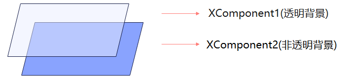
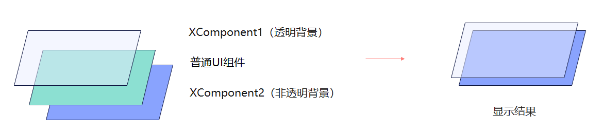
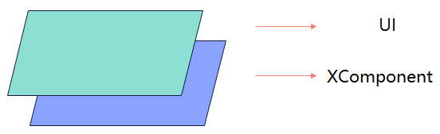

# XComponent (系统接口)
<!--Kit: ArkUI-->
<!--Subsystem: ArkUI-->
<!--Owner: @pengzhiwen3-->
<!--Designer: @dutie123-->
<!--Tester: @liuli0427-->
<!--Adviser: @Brilliantry_Rui-->

提供用于图形绘制和媒体数据写入的Surface，XComponent负责将其嵌入到视图中，支持应用自定义Surface位置和大小。适用于视频播放、相机预览、游戏渲染等需要在应用内展示自渲染内容的场景，方便开发者灵活控制画面的显示区域与层级。

> **说明：**
>
> 该组件从API version 8 开始支持。后续版本的新增接口，采用上角标单独标记接口的起始版本。
>
> 当前页面仅包含本模块的系统接口，其他公开接口参见[XComponent](ts-basic-components-xcomponent.md)。

## XComponentOptions12+

定义XComponent的具体配置参数。

**模型约束：** 此接口仅可在Stage模型下使用。

**系统能力：** SystemCapability.ArkUI.ArkUI.Full

| 名称 | 类型 | 只读 | 可选 | 说明 |
| -------- | -------- | -------- | -------- | -------- |
| screenId17+ | number | 否 | 是 | 给组件设置关联屏幕ID，通过此项可在组件上显示关联屏幕画面。屏幕ID可通过[@ohos.screen](../js-apis-screen-sys.md#screengetallscreens)模块的getAllScreens接口获取。默认值：0，表示主屏幕。 **系统接口：** 此接口为系统接口。|

  > **说明：**
  >
  > 仅type为SURFACE时有效。
  >
  > 不支持[ArkUI NDK接口](../../../ui/ndk-build-ui-overview.md)创建的XComponent组件。

## 接口

### enableTransparentLayer18+

enableTransparentLayer(enabled: boolean)

当背景颜色设置半透明的XComponent需要开启独立图层（即将该组件的内容置于单独的合成图层上进行渲染，以避免半透明区域与下方内容混合时出现渲染异常）时，使用本接口。

使用本接口，并不代表一定会被设置为独立图层。出于以下原因：硬件规格（如硬件不支持独立图层进行硬件合成）、软件规格（如独立图层与带有模糊效果的UI组件相交），将导致半透明XComponent无法设置为独立图层。

由于绘制独立图层的原理，使用本接口时需要按照以下要求使用，否则会出现显示问题。

1. 当设置了独立图层的XComponent下方有相交的XComponent时，下方的XComponent也应该设置为独立图层。

   

2. 在通过本接口设置了独立图层且背景为半透明的XComponent下方摆放UI组件，合成时会出现UI组件显示内容消失的异常。

   

   已开启独立图层的XComponent需要在所有与其相交的UI元素下方。

   

3. 在布局静态的场景下对带半透明背景XComponent设置独立图层，例如：非页面跳转场景、视频弹幕静止的播放场景。

**系统接口：** 此接口为系统接口。

**模型约束：** 此接口仅可在Stage模型下使用。

**系统能力：** SystemCapability.ArkUI.ArkUI.Full

**参数：**

| 参数名   | 类型     | 必填 | 说明                   |
| ------- | ------- | ---- | ---------------------- |
| enabled | boolean | 是   | 是否开启组件背景半透明状态下的独立图层。 true：开启独立图层；false：关闭独立图层。 设置为true时，由于硬件规格（如硬件不支持独立图层进行硬件合成）或软件规格（如独立图层与带有模糊效果的UI组件相交）等原因，可能无法实际生效，详见上方接口说明。 默认值：false |

  > **说明：**
  >
  > 仅type为SURFACE时有效。
  >
  > 不支持[ArkUI NDK接口](../../../ui/ndk-build-ui-overview.md)创建的XComponent组件。