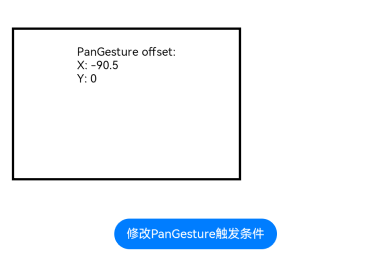
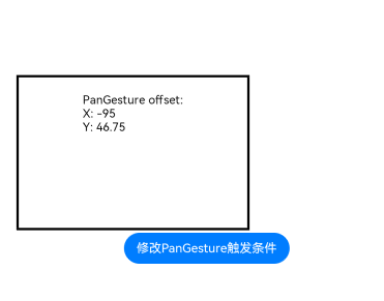

# PanGesture
<!--Kit: ArkUI-->
<!--Subsystem: ArkUI-->
<!--Owner: @yihao-lin-->
<!--Designer: @piggyguy-->
<!--Tester: @songyanhong-->
<!--Adviser: @Brilliantry_Rui-->

滑动手势事件，当滑动的最小距离达到设定的最小值时触发滑动手势事件。

以下场景可以触发滑动手势：

| 触发方式              | 输入源类型           | 输入设备类型            | 备注                              | 
|----------------------|---------------------|------------------------|-----------------------------------|
| 手指按下滑动。          | [SourceTool](ts-gesture-settings.md#sourcetool枚举说明9).Finger   | [SourceType](ts-gesture-settings.md#sourcetype枚举说明8).TouchScreen | axisVertical和axisHorizontal均为0。 |
| 鼠标左键按下滑动。      | [SourceTool](ts-gesture-settings.md#sourcetool枚举说明9).MOUSE    | [SourceType](ts-gesture-settings.md#sourcetype枚举说明8).Mouse        | axisVertical和axisHorizontal均为0。 |
| 鼠标滚轮滚动。          | [SourceTool](ts-gesture-settings.md#sourcetool枚举说明9).MOUSE    | [SourceType](ts-gesture-settings.md#sourcetype枚举说明8).Mouse        | axisVertical或axisHorizontal不为0。 |
| 触摸板按下左键后滑动。  | [SourceTool](ts-gesture-settings.md#sourcetool枚举说明9).MOUSE  | [SourceType](ts-gesture-settings.md#sourcetype枚举说明8).Mouse     | axisVertical和axisHorizontal均为0。 |
| 触摸板双指滑动。       | [SourceTool](ts-gesture-settings.md#sourcetool枚举说明9).TOUCHPAD  | [SourceType](ts-gesture-settings.md#sourcetype枚举说明8).Mouse      | axisVertical或axisHorizontal不为0。 |
| 手写笔滑动。       | [SourceTool](ts-gesture-settings.md#sourcetool枚举说明9).Pen  | [SourceType](ts-gesture-settings.md#sourcetype枚举说明8).TouchScreen      | axisVertical和axisHorizontal均为0。 |

>  **说明：**
>
> - 本模块同时支持ArkTS-Dyn、ArkTS-Sta。
>
> - 本模块首批接口从API version 7开始支持。后续版本的新增接口，采用上角标单独标记接口的起始版本。


## 接口

### PanGesture

PanGesture(value?: { fingers?: number; direction?: PanDirection; distance?: number } | PanGestureOptions)

创建滑动手势对象。继承自[GestureInterface\<T>](ts-gesture-common.md#gestureinterfacet11)

**原子化服务API（仅ArkTS-Dyn）：** 从API version 11开始，该接口支持在原子化服务中使用。

**系统能力：** SystemCapability.ArkUI.ArkUI.Full

**ArkTS模式：** 该接口仅适用于ArkTS-Dyn。

**相关接口：** 该接口对应的ArkTS-Sta的接口是[PanGesture<sup>15+</sup>](#pangesture15)。

**ArkTS-Dyn起始版本：** 7

**参数：**

| 参数名 | 类型 | 必填 | 说明 |
| -------- | -------- | -------- | -------- |
| value | { fingers?: number; direction?: [PanDirection](ts-basic-gestures-pangesture.md#pandirection枚举说明); distance?: number } \| [PanGestureOptions](#pangestureoptions) | 否 | 滑动手势参数。<br> - fingers：用于指定触发滑动的最少手指数，最小为1指，最大取值为10指。<br/>默认值：1<br/>取值范围：[1, 10]<br/>**说明：** <br/>当设置的值小于1或不设置时，会被转化为默认值。<br> - direction：用于指定触发滑动的手势方向，此枚举值支持逻辑与(&amp;)和逻辑或（\|）运算。<br/>默认值：PanDirection.All<br> - distance：用于指定触发滑动手势事件的最小滑动距离，单位为vp。<br/>取值范围：[0, +∞)<br/>手写笔默认值：8，其余输入源默认值：5<br/>**说明：**<br/>[Tabs](ts-container-tabs.md)组件滑动与该滑动手势事件同时存在时，可将distance值设为1，使滑动更灵敏，避免造成事件错乱。<br/>当设定的值小于0时，按默认值处理。<br/>当组件应用了[scale](./ts-universal-attributes-transformation.md#scale)缩放变换时，distance的实际识别距离会按照scale比例进行缩放。 |

### PanGesture<sup>15+</sup>

PanGesture(options?: PanGestureHandlerOptions)

创建滑动手势对象。与[PanGesture](#pangesture-1)相比，options参数新增了对isFingerCountLimited和distanceMap参数，分别表示是否检查触摸屏幕的手指数量以及指定不同输入源触发滑动手势事件的最小滑动距离。

**原子化服务API（仅ArkTS-Dyn）：** 从API version 15开始，该接口支持在原子化服务中使用。

**模型约束：** 此接口仅可在Stage模型下使用。

**系统能力：** SystemCapability.ArkUI.ArkUI.Full

**ArkTS-Dyn起始版本：** 15

**ArkTS-Sta起始版本：** 23

**参数：**

| 参数名 | 类型 | 必填 | 说明 |
| -------- | -------- | -------- | -------- |
| options   | [PanGestureHandlerOptions](./ts-gesturehandler.md#pangesturehandleroptions)   | 否   | 滑动手势处理器配置参数。 |

## PanDirection枚举说明

与SwipeDirection不同，PanDirection没有角度限制。

**原子化服务API（仅ArkTS-Dyn）：** 从API version 11开始，该接口支持在原子化服务中使用。

**系统能力：** SystemCapability.ArkUI.ArkUI.Full

| 名称 | 值 | 说明 |
| -------- | -------- | -------- |
| None | 0 | 任何方向都不可触发滑动手势事件。<br/>**ArkTS-Dyn起始版本：** 7<br/>**ArkTS-Sta起始版本：** 23 |
| Left | 1 | 向左滑动。<br/>**ArkTS-Dyn起始版本：** 7<br/>**ArkTS-Sta起始版本：** 23 |
| Right | 2 | 向右滑动。<br/>**ArkTS-Dyn起始版本：** 7<br/>**ArkTS-Sta起始版本：** 23 |
| Horizontal | 3 | 水平方向。<br/>**ArkTS-Dyn起始版本：** 7<br/>**ArkTS-Sta起始版本：** 23 |
| Up | 4 | 向上滑动。<br/>**ArkTS-Dyn起始版本：** 7<br/>**ArkTS-Sta起始版本：** 23 |
| UP_LEFT<sup>23+</sup> | 5 | 向上或左滑动。<br/>**ArkTS模式：** 该接口仅适用于ArkTS-Sta。<br/>**ArkTS-Sta起始版本：** 23 |
| UP_RIGHT<sup>23+</sup> | 6 | 向上或右滑动。<br/>**ArkTS模式：** 该接口仅适用于ArkTS-Sta。<br/>**ArkTS-Sta起始版本：** 23 |
| UP_HORIZONTAL<sup>23+</sup> | 7 | 向上或水平滑动。<br/>**ArkTS模式：** 该接口仅适用于ArkTS-Sta。<br/>**ArkTS-Sta起始版本：** 23 |
| Down | 8 | 向下滑动。<br/>**ArkTS-Dyn起始版本：** 7<br/>**ArkTS-Sta起始版本：** 23 |
| DOWN_LEFT<sup>23+</sup> | 9 | 向下或左滑动。<br/>**ArkTS模式：** 该接口仅适用于ArkTS-Sta。<br/>**ArkTS-Sta起始版本：** 23 |
| DOWN_RIGHT<sup>23+</sup> | 10 | 向下或右滑动。<br/>**ArkTS模式：** 该接口仅适用于ArkTS-Sta。<br/>**ArkTS-Sta起始版本：** 23 |
| DOWN_HORIZONTAL<sup>23+</sup> | 11 | 向下或水平滑动。<br/>**ArkTS模式：** 该接口仅适用于ArkTS-Sta。<br/>**ArkTS-Sta起始版本：** 23 |
| Vertical | 12 | 竖直方向。<br/>**ArkTS-Dyn起始版本：** 7<br/>**ArkTS-Sta起始版本：** 23 |
| VERTICAL_LEFT<sup>23+</sup> | 13 | 竖直或左滑动。<br/>**ArkTS模式：** 该接口仅适用于ArkTS-Sta。<br/>**ArkTS-Sta起始版本：** 23 |
| VERTICAL_RIGHT<sup>23+</sup> | 14 | 竖直或右滑动。<br/>**ArkTS模式：** 该接口仅适用于ArkTS-Sta。<br/>**ArkTS-Sta起始版本：** 23 |
| All | 15 | 所有方向。<br/>**ArkTS-Dyn起始版本：** 7<br/>**ArkTS-Sta起始版本：** 23 |


## PanGestureOptions

### constructor

ArkTS-Dyn: constructor(value?: { fingers?: number; direction?: PanDirection; distance?: number })

ArkTS-Sta: constructor(value?: PanGestureHandlerOptions)

创建滑动手势配置参数对象。通过PanGestureOptions对象接口可以动态修改滑动手势的属性，从而避免通过状态变量修改属性（状态变量修改会导致UI刷新）。

**原子化服务API（仅ArkTS-Dyn）：** 从API version 11开始，该接口支持在原子化服务中使用。

**系统能力：** SystemCapability.ArkUI.ArkUI.Full

**ArkTS-Dyn起始版本：** 7

**ArkTS-Sta起始版本：** 23

**参数：**

| 参数名 | 类型 | 必填 | 说明 |
| --------- | ------------------------------------- | ---- | ------------------------------------------------------------ |
| value   | ArkTS-Dyn: { fingers?: number; direction?: [PanDirection](#pandirection枚举说明); distance?: number }<br/>ArkTS-Sta: [PanGestureHandlerOptions](./ts-gesturehandler.md#pangesturehandleroptions) | 否   | 滑动手势配置参数对象。<br/>fingers用于指定触发滑动的最少手指数，最小为1指，&nbsp;最大取值为10指。<br/>默认值：1 <br/>direction用于指定触发滑动的手势方向，此枚举值支持逻辑与(&amp;)和逻辑或（\|）运算。<br/>默认值：PanDirection.All<br/>distance用于指定触发滑动手势事件的最小滑动距离，单位为vp。<br/>手写笔默认值：8，其余输入源默认值：5<br/>**说明：**<br/>[Tabs](ts-container-tabs.md)组件滑动与该滑动手势事件同时存在时，可将distance值设为1，使滑动更灵敏，避免造成事件错乱。<br/>当设定的值小于0时，按默认值处理。<br/>建议设置合理的滑动距离，滑动距离设置过大时会导致滑动不跟手（响应时延慢）的问题。<br/>当组件应用了[scale](./ts-universal-attributes-transformation.md#scale)缩放变换时，distance的实际识别距离会按照scale比例进行缩放。|

### setDirection

setDirection(value: PanDirection)

设置滑动方向。

**原子化服务API（仅ArkTS-Dyn）：** 从API version 11开始，该接口支持在原子化服务中使用。

**系统能力：** SystemCapability.ArkUI.ArkUI.Full

**ArkTS-Dyn起始版本：** 7

**ArkTS-Sta起始版本：** 23

**参数：**

| 参数名 | 类型                                       | 必填 | 说明                      |
| ------ | ------------------------------------------ | ---- | ---------------------------- |
| value  |  [PanDirection](#pandirection枚举说明) | 是   | 用于指定触发滑动的手势方向，此枚举值支持逻辑与(&amp;)和逻辑或（\|）运算。<br/>默认值：PanDirection.All |

### setDistance

ArkTS-Dyn: setDistance(value: number)

ArkTS-Sta: setDistance(value: double): void

设置触发滑动手势事件的最小滑动距离，单位为vp。距离值不宜设置过大，避免因滑动脱手、响应时延过大等问题导致性能劣化，最佳实践请参考：[减小拖动识别距离](https://developer.huawei.com/consumer/cn/doc/best-practices/bpta-application-latency-optimization-cases#section1116134115286)。

**原子化服务API（仅ArkTS-Dyn）：** 从API version 11开始，该接口支持在原子化服务中使用。

**系统能力：** SystemCapability.ArkUI.ArkUI.Full

**ArkTS-Dyn起始版本：** 7

**ArkTS-Sta起始版本：** 23

**参数：**

| 参数名 | 类型                                       | 必填 | 说明                        |
| ------ | ------------------------------------------ | ---- | ---------------------------- |
| value  |  ArkTS-Dyn: number<br/>ArkTS-Sta: double | 是   | 触发滑动手势事件的最小滑动距离，单位为vp。<br/>手写笔默认值：8，其余输入源默认值：5<br/>**说明：**<br/>[Tabs组件](ts-container-tabs.md)滑动与该滑动手势事件同时存在时，可将distance值设为1，使滑动更灵敏，避免造成事件错乱。<br/>当设定的值小于0时，按默认值处理。<br/>建议设置合理的滑动距离，滑动距离设置过大时会导致滑动不跟手（响应时延慢）的问题。<br/>当组件应用了[scale](./ts-universal-attributes-transformation.md#scale)缩放变换时，distance的实际识别距离会按照scale比例进行缩放。 |

### setFingers

ArkTS-Dyn: setFingers(value: number)

ArkTS-Sta: setFingers(value: int): void

设置触发滑动的最少手指数。

**原子化服务API（仅ArkTS-Dyn）：** 从API version 11开始，该接口支持在原子化服务中使用。

**系统能力：** SystemCapability.ArkUI.ArkUI.Full

**ArkTS-Dyn起始版本：** 7

**ArkTS-Sta起始版本：** 23

**参数：**

| 参数名 | 类型                                       | 必填 | 说明                         |
| ------ | ------------------------------------------ | ---- | ---------------------------- |
| value  |  ArkTS-Dyn: number<br/>ArkTS-Sta: int | 是   | 触发滑动的最少手指数，最小为1指，&nbsp;最大取值为10指。<br/>默认值：1 |

### getDirection<sup>12+</sup>

getDirection(): PanDirection

获取滑动方向。

**原子化服务API（仅ArkTS-Dyn）：** 从API version 12开始，该接口支持在原子化服务中使用。

**模型约束：** 此接口仅可在Stage模型下使用。

**系统能力：** SystemCapability.ArkUI.ArkUI.Full

**ArkTS-Dyn起始版本：** 12

**ArkTS-Sta起始版本：** 23

**返回值：**

| 类型     | 说明        |
| ------ | --------- |
| [PanDirection](#pandirection枚举说明) | 滑动方向。 |

### getDistance<sup>18+</sup>

ArkTS-Dyn: getDistance(): number

ArkTS-Sta: getDistance(): double

获取触发滑动手势事件的最小滑动距离。

**原子化服务API（仅ArkTS-Dyn）：** 从API version 18开始，该接口支持在原子化服务中使用。

**模型约束：** 此接口仅可在Stage模型下使用。

**系统能力：** SystemCapability.ArkUI.ArkUI.Full

**ArkTS-Dyn起始版本：** 18

**ArkTS-Sta起始版本：** 23

**返回值：**

| 类型     | 说明        |
| ------ | --------- |
| ArkTS-Dyn: number<br/>ArkTS-Sta: double | 滑动手势事件的最小滑动距离。 |

## 事件

>  **说明：**
>
>  在[GestureEvent](ts-gesture-common.md#gestureevent对象说明)的fingerList元素中，手指索引编号与位置相对应，即fingerList[index]的id为index。对于先按下但未参与当前手势触发的手指，fingerList中对应的位置为空。建议优先使用fingerInfos。

### onActionStart

ArkTS-Dyn: onActionStart(event: (event: GestureEvent) => void)

ArkTS-Sta: onActionStart(event: Callback\<GestureEvent>)

设置滑动手势识别成功回调。

**原子化服务API（仅ArkTS-Dyn）：** 从API version 11开始，该接口支持在原子化服务中使用。

**系统能力：** SystemCapability.ArkUI.ArkUI.Full

**ArkTS-Dyn起始版本：** 7

**ArkTS-Sta起始版本：** 23

**参数：**

| 参数名 | 类型 | 必填 | 说明 |
| -------- | -------- | -------- | -------- |
| event | ArkTS-Dyn: (event: [GestureEvent](ts-gesture-common.md#gestureevent对象说明)) => void<br/>ArkTS-Sta: Callback<[GestureEvent](ts-gesture-common.md#gestureevent对象说明)> | 是 | 滑动手势识别成功回调。 |

### onActionUpdate

ArkTS-Dyn: onActionUpdate(event: (event: GestureEvent) => void)

ArkTS-Sta: onActionUpdate(event: Callback\<GestureEvent>)

设置滑动手势更新回调。fingerList为多根手指时，该回调监听每次只会更新一根手指的位置信息。

**原子化服务API（仅ArkTS-Dyn）：** 从API version 11开始，该接口支持在原子化服务中使用。

**系统能力：** SystemCapability.ArkUI.ArkUI.Full

**ArkTS-Dyn起始版本：** 7

**ArkTS-Sta起始版本：** 23

**参数：**

| 参数名 | 类型 | 必填 | 说明 |
| -------- | -------- | -------- | -------- |
| event | ArkTS-Dyn: (event: [GestureEvent](ts-gesture-common.md#gestureevent对象说明)) => void<br/>ArkTS-Sta: Callback<[GestureEvent](ts-gesture-common.md#gestureevent对象说明)> | 是 | 滑动手势更新回调。 |

### onActionEnd

ArkTS-Dyn: onActionEnd(event: (event: GestureEvent) => void)

ArkTS-Sta: onActionEnd(event: Callback\<GestureEvent>)

设置滑动手势结束回调。滑动手势识别成功后，手指抬起时触发回调。

**原子化服务API（仅ArkTS-Dyn）：** 从API version 11开始，该接口支持在原子化服务中使用。

**系统能力：** SystemCapability.ArkUI.ArkUI.Full

**ArkTS-Dyn起始版本：** 7

**ArkTS-Sta起始版本：** 23

**参数：**

| 参数名 | 类型 | 必填 | 说明 |
| -------- | -------- | -------- | -------- |
| event | ArkTS-Dyn: (event: [GestureEvent](ts-gesture-common.md#gestureevent对象说明)) => void<br/>ArkTS-Sta: Callback<[GestureEvent](ts-gesture-common.md#gestureevent对象说明)> | 是 | 滑动手势结束回调。 |

### onActionCancel

onActionCancel(event: () => void)

设置滑动手势取消回调。滑动手势识别成功后，接收到触摸取消事件时触发回调。不返回手势事件信息。

**原子化服务API（仅ArkTS-Dyn）：** 从API version 11开始，该接口支持在原子化服务中使用。

**系统能力：** SystemCapability.ArkUI.ArkUI.Full

**ArkTS模式：** 该接口仅适用于ArkTS-Dyn。

**相关接口：** 该接口对应的ArkTS-Sta的接口是[onActionCancel<sup>18+</sup>](#onactioncancel18)。

**ArkTS-Dyn起始版本：** 7

**参数：**

| 参数名 | 类型                                       | 必填 | 说明                         |
| ------ | ------------------------------------------ | ---- | ---------------------------- |
| event  |  () => void | 是   | 滑动手势取消回调。 |

### onActionCancel<sup>18+</sup>

onActionCancel(event: Callback\<GestureEvent>)

设置滑动手势取消回调。滑动手势识别成功后，接收到触摸取消事件时触发回调。返回手势事件信息。

**原子化服务API（仅ArkTS-Dyn）：** 从API version 18开始，该接口支持在原子化服务中使用。

**系统能力：** SystemCapability.ArkUI.ArkUI.Full

**ArkTS-Dyn起始版本：** 18

**ArkTS-Sta起始版本：** 23

**参数：**

| 参数名 | 类型                                       | 必填 | 说明                         |
| ------ | ------------------------------------------ | ---- | ---------------------------- |
| event  |  Callback\<[GestureEvent](ts-gesture-common.md#gestureevent对象说明)> | 是   | 滑动手势取消回调。 |

## 示例

该示例通过PanGesture实现了单指/双指滑动手势的识别。

```ts
// xxx.ets
@Entry
@Component
struct PanGestureExample {
  @State offsetX: number = 0;
  @State offsetY: number = 0;
  @State positionX: number = 0;
  @State positionY: number = 0;
  private panOption: PanGestureOptions = new PanGestureOptions({ direction: PanDirection.Left | PanDirection.Right });

  build() {
    Column() {
      Column() {
        Text('PanGesture offset:\nX: ' + this.offsetX + '\n' + 'Y: ' + this.offsetY)
      }
      .height(200)
      .width(300)
      .padding(20)
      .border({ width: 3 })
      .margin(50)
      .translate({ x: this.offsetX, y: this.offsetY, z: 0 }) // 以组件左上角为坐标原点进行移动
      // 左右滑动触发该手势事件
      .gesture(
      PanGesture(this.panOption)
        .onActionStart((event: GestureEvent) => {
          console.info('Pan start');
          console.info(`Pan start timeStamp is: ${event.timestamp}`);
        })
        .onActionUpdate((event: GestureEvent) => {
          if (event) {
            this.offsetX = this.positionX + event.offsetX;
            this.offsetY = this.positionY + event.offsetY;
          }
        })
        .onActionEnd((event: GestureEvent) => {
          this.positionX = this.offsetX;
          this.positionY = this.offsetY;
          console.info('Pan end');
          console.info(`Pan end timeStamp is: ${event.timestamp}`);
        })
      )

      Button('修改PanGesture触发条件')
        .onClick(() => {
          // 将PanGesture手势事件触发条件改为双指以任意方向滑动
          this.panOption.setDirection(PanDirection.All);
          this.panOption.setFingers(2);
        })
    }
  }
}
```

示意图：

向左滑动：

 

点击按钮时，修改PanGesture触发条件为双指以任意方向滑动：

  