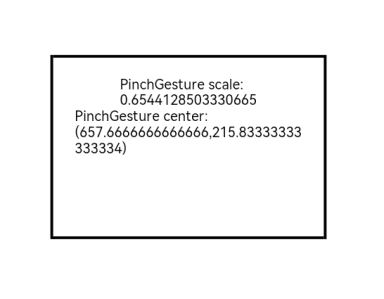

# PinchGesture

用于触发捏合手势，最少需要2指，最多5指，最小识别距离为5vp。

>  **说明：**
>
>  - 本模块同时支持ArkTS-Dyn、ArkTS-Sta。
>
>  - 从API version 7开始支持。后续版本如有新增内容，则采用上角标单独标记该内容的起始版本。
>
>  - 捏合手势触发成功后，抬起手指直至不再满足触发条件。再次满足条件时，可重新触发捏合手势。


## 接口

### PinchGesture

PinchGesture(value?: { fingers?: number; distance?: number })

继承自[GestureInterface\<T>](ts-gesture-common.md#gestureinterfacet11)，设置捏合手势事件。

**原子化服务API：** 从API version 11开始，该接口支持在原子化服务中使用。

**系统能力：** SystemCapability.ArkUI.ArkUI.Full

**ArkTS模式：** 该接口仅适用于ArkTS-Dyn。

**相关接口：** 该接口对应的ArkTS-Sta的接口是[PinchGesture<sup>15+</sup>](#pinchgesture15)。

**ArkTS-Dyn起始版本：** 7

**参数：**

| 参数名 | 类型 | 必填 | 说明 |
| -------- | -------- | -------- | -------- |
| value | { fingers?: number; distance?: number } | 否 | 设置捏合手势事件参数。<br> - fingers：触发捏合的最少手指数，最小为2指，最大为5指。<br/>默认值：2 <br/>取值范围：[2, 5]。当设置的值不在该范围内时，会被转化为默认值。<br/>触发手势的手指数量可以多于fingers数目，但只有最先落下的与fingers相同数目的手指参与手势计算。<br> - distance：最小识别距离，单位为vp。该距离是指当前多根手指位置与手指中心位置的平均距离，与手指落下时的平均距离之间的差值。当这一差值大于或等于最小识别距离时，捏合手势被视为成功。<br/>默认值：5 <br/>**说明：** <br/>取值范围：[0, +∞)。当识别距离的值小于等于0时，会被转化为默认值。|

### PinchGesture<sup>15+</sup>

PinchGesture(options?: PinchGestureHandlerOptions)

设置捏合手势事件。与[PinchGesture](#pinchgesture-1)相比，options参数新增isFingerCountLimited，表示是否检查触摸屏幕的手指数量。

**原子化服务API：** 从API version 15开始，该接口支持在原子化服务中使用。

**系统能力：** SystemCapability.ArkUI.ArkUI.Full

**ArkTS-Dyn起始版本：** 15

**ArkTS-Sta起始版本：** 23

**参数：**

| 参数名  | 类型                                                         | 必填 | 说明                     |
| ------- | ------------------------------------------------------------ | ---- | ------------------------ |
| options | [PinchGestureHandlerOptions](./ts-gesturehandler.md#pinchgesturehandleroptions) | 否   | 捏合手势处理器配置参数。 |


## 事件

>  **说明：**
>
>  在[GestureEvent](ts-gesture-common.md#gestureevent对象说明)的fingerList元素中，手指索引编号与位置相对应，即fingerList[index]的id为index。对于先按下但未参与当前手势触发的手指，fingerList中对应的位置为空。建议开发者优先使用fingerInfos。

### onActionStart

ArkTS-Dyn: onActionStart(event: (event: GestureEvent) => void)

ArkTS-Sta: onActionStart(event: Callback\<GestureEvent>)

Pinch手势识别成功后触发回调。

**原子化服务API：** 从API version 11开始，该接口支持在原子化服务中使用。

**系统能力：** SystemCapability.ArkUI.ArkUI.Full

**ArkTS-Dyn起始版本：** 7

**ArkTS-Sta起始版本：** 23

**参数：**

| 参数名 | 类型 | 必填 | 说明 |
| -------- | -------- | -------- | -------- |
| event | ArkTS-Dyn: (event: [GestureEvent](ts-gesture-common.md#gestureevent对象说明)) => void<br/>ArkTS-Sta: Callback<[GestureEvent](ts-gesture-common.md#gestureevent对象说明)> | 是 | 手势事件回调函数。 |

### onActionUpdate

ArkTS-Dyn: onActionUpdate(event: (event: GestureEvent) => void)

ArkTS-Sta: onActionUpdate(event: Callback\<GestureEvent>)

Pinch手势移动过程中回调。

**原子化服务API：** 从API version 11开始，该接口支持在原子化服务中使用。

**系统能力：** SystemCapability.ArkUI.ArkUI.Full

**ArkTS-Dyn起始版本：** 7

**ArkTS-Sta起始版本：** 23

**参数：**

| 参数名 | 类型 | 必填 | 说明 |
| -------- | -------- | -------- | -------- |
| event | ArkTS-Dyn: (event: [GestureEvent](ts-gesture-common.md#gestureevent对象说明)) => void<br/>ArkTS-Sta: Callback<[GestureEvent](ts-gesture-common.md#gestureevent对象说明)> | 是 | 手势事件回调函数。 |

### onActionEnd

ArkTS-Dyn: onActionEnd(event: (event: GestureEvent) => void)

ArkTS-Sta: onActionEnd(event: Callback\<GestureEvent>)

Pinch手势识别成功，当抬起最后一根满足手势触发条件的手指后，触发回调。

**原子化服务API：** 从API version 11开始，该接口支持在原子化服务中使用。

**系统能力：** SystemCapability.ArkUI.ArkUI.Full

**ArkTS-Dyn起始版本：** 7

**ArkTS-Sta起始版本：** 23

**参数：**

| 参数名 | 类型 | 必填 | 说明 |
| -------- | -------- | -------- | -------- |
| event | ArkTS-Dyn: (event: [GestureEvent](ts-gesture-common.md#gestureevent对象说明)) => void<br/>ArkTS-Sta: Callback<[GestureEvent](ts-gesture-common.md#gestureevent对象说明)> | 是 | 手势事件回调函数。 |

### onActionCancel

onActionCancel(event: () => void)

Pinch手势识别成功，接收到触摸取消事件触发的回调，不返回手势事件信息。

**原子化服务API：** 从API version 11开始，该接口支持在原子化服务中使用。

**系统能力：** SystemCapability.ArkUI.ArkUI.Full

**ArkTS模式：** 该接口仅适用于ArkTS-Dyn。

**相关接口：** 该接口对应的ArkTS-Sta的接口是[onActionCancel](#onactioncancel18)。

**ArkTS-Dyn起始版本：** 7

**参数：**

| 参数名 | 类型 | 必填 | 说明 |
| -------- | -------- | -------- | -------- |
| event | () => void | 是   | 手势事件回调函数。 |

### onActionCancel<sup>18+</sup>

onActionCancel(event: Callback\<GestureEvent\>)

Pinch手势识别成功并接收到触摸取消事件的回调。与[onActionCancel](#onactioncancel)相比，该回调返回手势事件信息。

**原子化服务API：** 从API version 18开始，该接口支持在原子化服务中使用。

**系统能力：** SystemCapability.ArkUI.ArkUI.Full

**ArkTS-Dyn起始版本：** 18

**ArkTS-Sta起始版本：** 23

**参数：**

| 参数名 | 类型 | 必填 | 说明 |
| -------- | -------- | -------- | -------- |
| event |  Callback\<[GestureEvent](ts-gesture-common.md#gestureevent对象说明)> | 是   | 手势事件回调函数。 |

## 示例

该示例通过配置PinchGesture实现了三指捏合手势的识别。

```ts
// xxx.ets
@Entry
@Component
struct PinchGestureExample {
  @State scaleValue: number = 1;
  @State pinchValue: number = 1;
  @State pinchX: number = 0;
  @State pinchY: number = 0;

  build() {
    Column() {
      Column() {
        Text('PinchGesture scale:\n' + this.scaleValue)
        Text('PinchGesture center:\n(' + this.pinchX + ',' + this.pinchY + ')')
      }
      .height(200)
      .width(300)
      .padding(20)
      .border({ width: 3 })
      .margin({ top: 100 })
      .scale({ x: this.scaleValue, y: this.scaleValue, z: 1 })
      // 三指捏合触发该手势事件
      .gesture(
      PinchGesture({ fingers: 3 })
        .onActionStart((event: GestureEvent) => {
          console.info('Pinch start')
        })
        .onActionUpdate((event: GestureEvent) => {
          if (event) {
            this.scaleValue = this.pinchValue * event.scale
            this.pinchX = event.pinchCenterX
            this.pinchY = event.pinchCenterY
          }
        })
        .onActionEnd((event: GestureEvent) => {
          this.pinchValue = this.scaleValue
          console.info('Pinch end')
        })
      )
    }.width('100%')
  }
}
```

 
