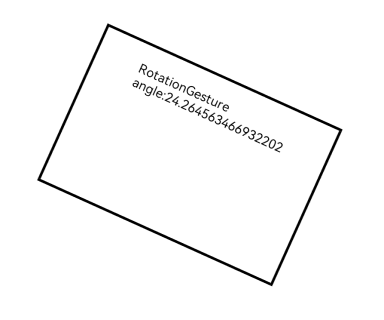

# RotationGesture
<!--Kit: ArkUI-->
<!--Subsystem: ArkUI-->
<!--Owner: @yihao-lin-->
<!--Designer: @piggyguy-->
<!--Tester: @songyanhong-->
<!--Adviser: @Brilliantry_Rui-->

用于触发旋转手势，最少需要2指，最多5指，最小角度变化为1度，适用于需要识别用户多指旋转操作并实现旋转类交互的场景。该手势不支持通过触控板双指旋转操作触发。

>  **说明：**
>
>  从API version 7开始支持。后续版本的新增接口，采用上角标单独标记接口的起始版本。


## 接口

### RotationGesture

RotationGesture(value?: { fingers?: number; angle?: number })

继承自[GestureInterface\<T>](ts-gesture-common.md#gestureinterfacet11)，设置旋转手势事件。

**原子化服务API：** 从API version 11开始，该接口支持在原子化服务中使用。

**系统能力：** SystemCapability.ArkUI.ArkUI.Full

**参数：**

| 参数名 | 类型 | 必填 | 说明 |
| -------- | -------- | -------- | -------- |
| value | { fingers?: number; angle?: number } | 否 | 设置旋转手势事件参数。<br> - fingers：触发旋转手势所需的最少手指数，&nbsp;最小为2指，最大为5指。<br>默认值：2 <br>取值范围：[2, 5]。当设置的值小于2或大于5时，会被转化为默认值。<br>触发手势时手指数量可以多于fingers参数值，但仅最先落下的两指参与手势计算。<br> - angle：触发旋转手势所需的最小角度变化，单位为deg。<br>默认值：1 <br>**说明：** <br>当改变度数的值小于等于0或大于360时，会被转化为默认值。 |

### RotationGesture<sup>15+</sup>

RotationGesture(options?: RotationGestureHandlerOptions)

设置旋转手势事件。与[RotationGesture](#rotationgesture-1)相比，options参数新增了isFingerCountLimited参数，表示是否检查触摸屏幕的手指数量。

**原子化服务API：** 从API version 15开始，该接口支持在原子化服务中使用。

**模型约束：** 此接口仅可在Stage模型下使用。

**系统能力：** SystemCapability.ArkUI.ArkUI.Full

**参数：**

| 参数名 | 类型 | 必填 | 说明 |
| -------- | -------- | -------- | -------- |
| options | [RotationGestureHandlerOptions](./ts-gesturehandler.md#rotationgesturehandleroptions) | 否 | 旋转手势处理器配置参数。 |


## 事件

>  **说明：**
>
>  在[GestureEvent](ts-gesture-common.md#gestureevent对象说明)的fingerList元素中，手指索引编号与位置相对应，即fingerList[index]的id为index。对于先按下但未参与当前手势触发的手指，fingerList中对应的位置为空。建议优先使用fingerInfos。

### onActionStart

onActionStart(event: (event: GestureEvent) => void)

旋转手势识别成功后触发的回调。

**原子化服务API：** 从API version 11开始，该接口支持在原子化服务中使用。

**系统能力：** SystemCapability.ArkUI.ArkUI.Full

**参数：**

| 参数名 | 类型                                       | 必填 | 说明                         |
| ------ | ------------------------------------------ | ---- | ---------------------------- |
| event  |  (event: [GestureEvent](ts-gesture-common.md#gestureevent对象说明)) => void | 是   | 手势事件回调函数。GestureEvent的fingerList元素中，手指索引编号与位置相对应，即fingerList[index]的id为index；对于先按下但未参与当前手势触发的手指，fingerList中对应的位置为空，建议优先使用fingerInfos。 |

### onActionUpdate

onActionUpdate(event: (event: GestureEvent) => void)

旋转手势移动过程中触发的回调。

**原子化服务API：** 从API version 11开始，该接口支持在原子化服务中使用。

**系统能力：** SystemCapability.ArkUI.ArkUI.Full

**参数：**

| 参数名 | 类型                                       | 必填 | 说明                        |
| ------ | ------------------------------------------ | ---- | ---------------------------- |
| event  |  (event: [GestureEvent](ts-gesture-common.md#gestureevent对象说明)) => void | 是   | 手势事件回调函数。 |

### onActionEnd

onActionEnd(event: (event: GestureEvent) => void)

旋转手势识别成功，当抬起最后一根满足手势触发条件的手指后触发的回调。

**原子化服务API：** 从API version 11开始，该接口支持在原子化服务中使用。

**系统能力：** SystemCapability.ArkUI.ArkUI.Full

**参数：**

| 参数名 | 类型                                       | 必填 | 说明                         |
| ------ | ------------------------------------------ | ---- | ---------------------------- |
| event  |  (event: [GestureEvent](ts-gesture-common.md#gestureevent对象说明)) => void | 是   | 手势事件回调函数。 |

### onActionCancel

onActionCancel(event: () => void)

旋转手势识别成功，接收到触摸取消事件时触发的回调。该回调不返回手势事件信息。

**原子化服务API：** 从API version 11开始，该接口支持在原子化服务中使用。

**系统能力：** SystemCapability.ArkUI.ArkUI.Full

**参数：**

| 参数名 | 类型                                       | 必填 | 说明                         |
| ------ | ------------------------------------------ | ---- | ---------------------------- |
| event  |  () => void | 是   | 手势事件回调函数，用于处理旋转手势取消事件；该回调不接收参数，不返回手势事件信息。 |

### onActionCancel<sup>18+</sup>

onActionCancel(event: Callback\<GestureEvent\>)

旋转手势识别成功，接收到触摸取消事件时触发的回调。与[onActionCancel](#onactioncancel)相比，该回调返回手势事件信息。

**原子化服务API：** 从API version 18开始，该接口支持在原子化服务中使用。

**模型约束：** 此接口仅可在Stage模型下使用。

**系统能力：** SystemCapability.ArkUI.ArkUI.Full

**参数：**

| 参数名 | 类型                                       | 必填 | 说明                         |
| ------ | ------------------------------------------ | ---- | ---------------------------- |
| event  |  Callback\<[GestureEvent](ts-gesture-common.md#gestureevent对象说明)> | 是   | 手势事件回调函数，用于接收旋转手势取消时的手势事件信息，回调参数为GestureEvent对象。 |

## 示例

该示例通过配置RotationGesture实现了双指旋转手势的识别。

```ts
// xxx.ets
@Entry
@Component
struct RotationGestureExample {
  @State angle: number = 0;
  @State rotateValue: number = 0;

  build() {
    Column() {
      Column() {
        Text('RotationGesture angle:' + this.angle)
      }
      .height(200)
      .width(300)
      .padding(20)
      .border({ width: 3 })
      .margin(80)
      .rotate({ angle: this.angle })
      // 双指旋转触发该手势事件
      .gesture(
      RotationGesture()
        .onActionStart(() => {
          console.info('Rotation start');
        })
        .onActionUpdate((event: GestureEvent) => {
          if (event) {
            // 根据本次手势变化角度和已保存旋转角度，更新组件当前旋转角度。
            this.angle = this.rotateValue + event.angle;
          }
        })
        .onActionEnd(() => {
          // 手势结束时保存当前旋转角度，作为下一次旋转计算的初始值。
          this.rotateValue = this.angle;
          console.info('Rotation end');
        })
      )
    }.width('100%')
  }
}
```

 