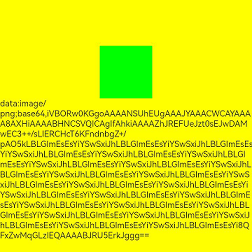
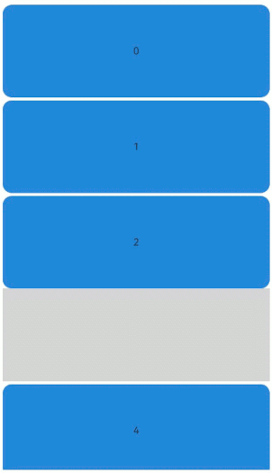
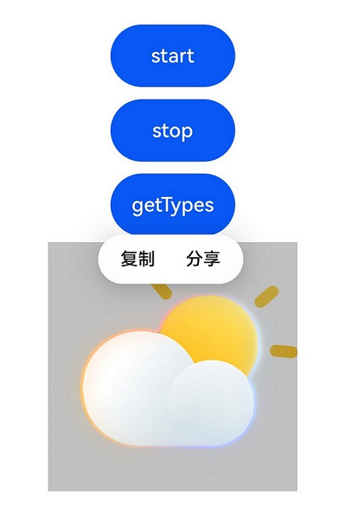
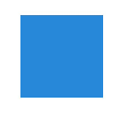

# CanvasRenderingContext2D
<!--Kit: ArkUI-->
<!--Subsystem: ArkUI-->
<!--Owner: @camlostshi-->
<!--Designer: @fenglinbailu-->
<!--Tester: @liuli0427-->
<!--Adviser: @Brilliantry_Rui-->

CanvasRenderingContext2D对象与Canvas组件绑定后，可在Canvas组件上绘制，绘制对象可以是形状、文本、图片等。

> **说明：**
>
> * 从API version 8开始支持。后续版本如有新增内容，则采用上角标单独标记该内容的起始版本。
>
> * 建议使用时将CanvasRenderingContext2D对象与Canvas组件封装到同一个自定义组件中，保证两者一一对应且生命周期保持一致。
>
> * 本文绘制接口在调用时会存入被关联的Canvas组件的指令队列中。仅当当前帧进入渲染阶段且关联的Canvas组件处于可见状态时，这些指令才会从队列中被提取并执行。因此，在Canvas组件不可见的情况下，应尽量避免频繁调用绘制接口，以防止指令在队列中堆积，从而避免内存占用过大的问题，具体示例请参考[控制在画布组件不可见时不进行绘制](../../../ui/arkts-drawing-customization-on-canvas.md#控制在画布组件不可见时不进行绘制)。
>
> * [beginPath](./ts-components-canvas-common-method.md#beginpath)、[moveTo](./ts-components-canvas-common-method.md#moveto)、[lineTo](./ts-components-canvas-common-method.md#lineto)、[closePath](./ts-components-canvas-common-method.md#closepath)、[bezierCurveTo](./ts-components-canvas-common-method.md#beziercurveto)、[quadraticCurveTo](./ts-components-canvas-common-method.md#quadraticcurveto)、[arc](./ts-components-canvas-common-method.md#arc)、[arcTo](./ts-components-canvas-common-method.md#arcto)、[ellipse](./ts-components-canvas-common-method.md#ellipse)、[rect](./ts-components-canvas-common-method.md#rect)和[roundRect](./ts-components-canvas-common-method.md#roundrect20)接口只能对CanvasRenderingContext2D中的路径生效，无法对[OffscreenCanvasRenderingContext2D](./ts-offscreencanvasrenderingcontext2d.md)和[Path2D](./ts-components-canvas-path2d.md)对象中设置的路径生效。
>
> * Canvas组件的宽或高超过8000px时使用CPU渲染，会导致性能明显下降，此时推荐使用[自定义渲染节点 (RenderNode)](../../../ui/arkts-user-defined-arktsNode-renderNode.md)。
>
> * 支持使用[画布绘制通用方法](./ts-components-canvas-common-method.md)和设置[画布绘制通用属性](./ts-components-canvas-common-property.md)。

## constructor

constructor(settings?: RenderingContextSettings)

构造Canvas画布对象，支持配置CanvasRenderingContext2D对象的参数。

**卡片能力：** 从API version 9开始，该接口支持在ArkTS卡片中使用。

**原子化服务API：** 从API version 11开始，该接口支持在原子化服务中使用。

**系统能力：** SystemCapability.ArkUI.ArkUI.Full

**参数：**

| 参数名      | 类型  | 必填   | 说明    |
| -------- | ---------------------------------------- | ---- | ---------------------------------------- |
| settings | [RenderingContextSettings](#renderingcontextsettings) | 否    | 用来配置CanvasRenderingContext2D对象的参数，见[RenderingContextSettings](#renderingcontextsettings)。<br>异常值undefined和null按[RenderingContextSettings](#renderingcontextsettings)的默认值处理。 |

## constructor<sup>12+</sup>

constructor(settings?: RenderingContextSettings, unit?: LengthMetricsUnit)

构造Canvas画布对象，支持配置CanvasRenderingContext2D对象的参数和单位模式。

**卡片能力：** 从API version 12开始，该接口支持在ArkTS卡片中使用。

**原子化服务API：** 从API version 12开始，该接口支持在原子化服务中使用。

**模型约束：** 此接口仅可在Stage模型下使用。

**系统能力：** SystemCapability.ArkUI.ArkUI.Full

**参数：**

| 参数名      | 类型  | 必填   | 说明    |
| -------- | ---------------------------------------- | ---- | ---------------------------------------- |
| settings | [RenderingContextSettings](#renderingcontextsettings) | 否    | 用来配置CanvasRenderingContext2D对象的参数，见[RenderingContextSettings](#renderingcontextsettings)。<br>异常值undefined和null按[RenderingContextSettings](#renderingcontextsettings)的默认值处理。 |
| unit  | [LengthMetricsUnit](../js-apis-arkui-graphics.md#lengthmetricsunit12) | 否    | 用来配置CanvasRenderingContext2D对象的单位模式，配置后无法更改。<br>异常值undefined、NaN和Infinity按默认值处理。<br>默认值：DEFAULT |

**示例：**

以下示例展示了配置CanvasRenderingContext2D对象的单位模式，默认单位模式为LengthMetricsUnit.DEFAULT，对应默认单位vp，配置后无法动态更改。详细说明见[LengthMetricsUnit](../js-apis-arkui-graphics.md#lengthmetricsunit12)。

```ts
// xxx.ets
import { LengthMetricsUnit } from '@kit.ArkUI'

@Entry
@Component
struct LengthMetricsUnitDemo {
  private settings: RenderingContextSettings = new RenderingContextSettings(true);
  private contextPX: CanvasRenderingContext2D = new CanvasRenderingContext2D(this.settings, LengthMetricsUnit.PX);
  private contextVP: CanvasRenderingContext2D = new CanvasRenderingContext2D(this.settings);

  build() {
    Flex({ direction: FlexDirection.Column, alignItems: ItemAlign.Center, justifyContent: FlexAlign.Center }) {
      Canvas(this.contextPX)
        .width('100%')
        .height(150)
        .backgroundColor('#ffff00')
        .onReady(() => {
          this.contextPX.fillRect(10, 10, 100, 100)
          this.contextPX.clearRect(10, 10, 50, 50)
        })

      Canvas(this.contextVP)
        .width('100%')
        .height(150)
        .backgroundColor('#ffff00')
        .onReady(() => {
          this.contextVP.fillRect(10, 10, 100, 100)
          this.contextVP.clearRect(10, 10, 50, 50)
        })
    }
    .width('100%')
    .height('100%')
  }
}
```


## 属性

**系统能力：** SystemCapability.ArkUI.ArkUI.Full

| 名称     | 类型 | 只读 | 可选 | 说明 |
| ------ | ------ | ----- | -------- | --------------------------- |
| width | number | 是 | 否 | CanvasRenderingContext2D的组件宽度。<br/>默认单位：vp <br/>**卡片能力：** 从API version 9开始，该接口支持在ArkTS卡片中使用。<br/>**原子化服务API：** 从API version 11开始，该接口支持在原子化服务中使用。 |
| height | number | 是 | 否 | CanvasRenderingContext2D的组件高度。<br/>默认单位：vp <br/>**卡片能力：** 从API version 9开始，该接口支持在ArkTS卡片中使用。<br/>**原子化服务API：** 从API version 11开始，该接口支持在原子化服务中使用。 |
| canvas<sup>13+</sup> | [FrameNode](../../apis-arkui/js-apis-arkui-frameNode.md) | 是 | 否 | 获取和CanvasRenderingContext2D关联的Canvas组件的FrameNode实例，可用于监听关联的Canvas组件的可见状态。<br/>默认值：null <br/>**原子化服务API：** 从API version 13开始，该接口支持在原子化服务中使用。|

## toDataURL

toDataURL(type?: string, quality?: any): string

生成一个包含图片展示的URL，该接口存在内存拷贝行为，高耗时，应避免频繁使用。

**卡片能力：** 从API version 9开始，该接口支持在ArkTS卡片中使用。

**原子化服务API：** 从API version 11开始，该接口支持在原子化服务中使用。

**系统能力：** SystemCapability.ArkUI.ArkUI.Full

**参数：** 

| 参数名     | 类型   | 必填  | 说明  |
| ------- | ------ | ---- | ---------------------------------------- |
| type    | string | 否  | 用于指定图像格式。<br/>可选参数为："image/png"，"image/jpeg"，"image/webp"。<br>异常值undefined或null按默认值处理。<br>默认值：image/png            |
| quality | any | 否  | 在指定图片格式为image/jpeg或image/webp的情况下，可以从0到1的区间内选择图片的质量。如果超出取值范围，将会使用默认值0.92。<br>异常值undefined、null、NaN和Infinity按默认值处理。<br>默认值：0.92 |

**返回值：** 

| 类型     | 说明        |
| ------ | --------- |
| string | 图像的URL地址。 |

**示例：**

  ```ts
  // xxx.ets
  @Entry
  @Component
  struct CanvasExample {
    private settings: RenderingContextSettings = new RenderingContextSettings(true)
    private context: CanvasRenderingContext2D = new CanvasRenderingContext2D(this.settings)
    @State toDataURL: string = ""

    build() {
      Flex({ direction: FlexDirection.Column, alignItems: ItemAlign.Center, justifyContent: FlexAlign.Center }) {
        Canvas(this.context)
          .width(100)
          .height(100)
          .onReady(() =>{
            this.context.fillStyle = "#00ff00"
            this.context.fillRect(0,0,100,100)
            this.toDataURL = this.context.toDataURL("image/png", 0.92)
          })
        Text(this.toDataURL)
      }
      .width('100%')
      .height('100%')
      .backgroundColor('#ffff00')
    }
  }
  ```
    

## on('onAttach')<sup>13+</sup>

on(type: 'onAttach', callback: Callback\<void>): void

订阅CanvasRenderingContext2D与Canvas组件发生绑定的场景。

**原子化服务API：** 从API version 13开始，该接口支持在原子化服务中使用。

**模型约束：** 此接口仅可在Stage模型下使用。

**系统能力：** SystemCapability.ArkUI.ArkUI.Full

**参数：**

| 参数名 | 类型      | 必填 | 说明                                                                   |
| ------ | --------- | ---- | ---------------------------------------------------------------------- |
| type   | string | 是   | 订阅CanvasRenderingContext2D与Canvas组件发生绑定的事件类型，固定为'onAttach'。<br>异常值undefined或null按无效值处理。 |
| callback   | [Callback](ts-types.md#callback12)\<void> | 是   | 订阅CanvasRenderingContext2D与Canvas组件发生绑定后触发的回调。<br>异常值undefined或null按无效值处理。|

**错误码：**

以下错误码的详细介绍请参见[通用错误码](../../errorcode-universal.md)。

| 错误码ID | 错误信息                                      |
| -------- | -------------------------------------------- |
| 401 | Input parameter error. Possible causes: 1. Mandatory parameters are left unspecified;2. Incorrect parameter types;3. Parameter verification failed.|

> **说明：**
>
> CanvasRenderingContext2D对象在同一时间只能与一个Canvas组件绑定。</br>
> 当CanvasRenderingContext2D对象和Canvas组件发生绑定时，会触发'onAttach'回调，表示可以获取到[canvas](#属性)。</br>
> 避免在'onAttach'中执行绘制方法，应保证Canvas组件已经'[onReady](ts-components-canvas-canvas.md#onready)'再进行绘制。</br>
> 触发'onAttach'回调的一般场景：</br>
> 1、Canvas组件创建时绑定CanvasRenderingContext2D对象;</br>
> 2、CanvasRenderingContext2D对象新绑定一个Canvas组件时。</br>
  
## on('onDetach')<sup>13+</sup>

on(type: 'onDetach', callback: Callback\<void>): void

订阅CanvasRenderingContext2D与Canvas组件解除绑定的场景。

**原子化服务API：** 从API version 13开始，该接口支持在原子化服务中使用。

**模型约束：** 此接口仅可在Stage模型下使用。

**系统能力：** SystemCapability.ArkUI.ArkUI.Full

**参数：**

| 参数名 | 类型      | 必填 | 说明                                                                   |
| ------ | --------- | ---- | ---------------------------------------------------------------------- |
| type   | string | 是   | 订阅CanvasRenderingContext2D与Canvas组件解除绑定的事件类型，固定为'onDetach'。<br>异常值undefined或null按无效值处理。 |
| callback   | [Callback](ts-types.md#callback12)\<void> | 是   | 订阅CanvasRenderingContext2D与Canvas组件解除绑定后触发的回调。<br>异常值undefined或null按无效值处理。 |

**错误码：**

以下错误码的详细介绍请参见[通用错误码](../../errorcode-universal.md)。

| 错误码ID | 错误信息                                      |
| -------- | -------------------------------------------- |
| 401 | Input parameter error. Possible causes: 1. Mandatory parameters are left unspecified;2. Incorrect parameter types;3. Parameter verification failed.|

> **说明：**
>
> 当CanvasRenderingContext2D对象和Canvas组件解除绑定时，会触发'onDetach'回调，表示应停止绘制行为。</br>
> 触发'onDetach'回调的一般场景：</br>
> 1、Canvas组件销毁时解除绑定CanvasRenderingContext2D对象;</br>
> 2、CanvasRenderingContext2D对象新绑定一个Canvas组件，会先解除已有的绑定。</br>

## off('onAttach')<sup>13+</sup>

off(type: 'onAttach', callback?: Callback\<void>): void

取消订阅CanvasRenderingContext2D与Canvas组件发生绑定的场景。

**原子化服务API：** 从API version 13开始，该接口支持在原子化服务中使用。

**模型约束：** 此接口仅可在Stage模型下使用。

**系统能力：** SystemCapability.ArkUI.ArkUI.Full

**参数：**

| 参数名 | 类型      | 必填 | 说明                                                                   |
| ------ | --------- | ---- | ---------------------------------------------------------------------- |
| type   | string | 是   | 取消订阅CanvasRenderingContext2D与Canvas组件发生绑定的事件类型，固定为'onAttach'。<br>异常值undefined或null按无效值处理。 |
| callback   | [Callback](ts-types.md#callback12)\<void> | 否   | 为空表示取消所有订阅CanvasRenderingContext2D与Canvas组件发生绑定后触发的回调。<br>非空则取消订阅发生绑定对应的回调。<br>异常值undefined或null按无效值处理。 |

**错误码：**

以下错误码的详细介绍请参见[通用错误码](../../errorcode-universal.md)。

| 错误码ID | 错误信息                                      |
| -------- | -------------------------------------------- |
| 401 | Input parameter error. Possible causes: 1. Mandatory parameters are left unspecified;2. Incorrect parameter types;3. Parameter verification failed.|

## off('onDetach')<sup>13+</sup>

off(type: 'onDetach', callback?: Callback\<void>): void

取消订阅CanvasRenderingContext2D与Canvas组件解除绑定的场景。

**原子化服务API：** 从API version 13开始，该接口支持在原子化服务中使用。

**模型约束：** 此接口仅可在Stage模型下使用。

**系统能力：** SystemCapability.ArkUI.ArkUI.Full

**参数：**

| 参数名 | 类型      | 必填 | 说明                                                                   |
| ------ | --------- | ---- | ---------------------------------------------------------------------- |
| type   | string | 是   | 取消订阅CanvasRenderingContext2D与Canvas组件解除绑定的事件类型，固定为'onDetach'。<br>异常值undefined或null按无效值处理。 |
| callback   | [Callback](ts-types.md#callback12)\<void> | 否   | 为空代表取消所有订阅CanvasRenderingContext2D与Canvas组件解除绑定后触发的回调。<br>非空代表取消订阅解除绑定对应的回调。<br>异常值undefined或null按无效值处理。 |

**错误码：**

以下错误码的详细介绍请参见[通用错误码](../../errorcode-universal.md)。

| 错误码ID | 错误信息                                      |
| -------- | -------------------------------------------- |
| 401 | Input parameter error. Possible causes: 1. Mandatory parameters are left unspecified;2. Incorrect parameter types;3. Parameter verification failed.|

**示例：**

```ts
import { BusinessError } from '@kit.BasicServicesKit';
import { FrameNode } from '@kit.ArkUI'

// xxx.ets
@Entry
@Component
struct AttachDetachExample {
  private settings: RenderingContextSettings = new RenderingContextSettings(true)
  private context: CanvasRenderingContext2D = new CanvasRenderingContext2D(this.settings)
  private scroller: Scroller = new Scroller()
  private arr: number[] = [0, 1, 2, 3, 4, 5, 6, 7, 8, 9, 10, 11, 12, 13, 14, 15]
  private node: FrameNode | null = null
  attachCallback = () => {
    console.info('CanvasRenderingContext2D attached to the canvas frame node.')
    this.node = this.context.canvas
  }
  detachCallback = () => {
    console.info('CanvasRenderingContext2D detach from the canvas frame node.')
    this.node = null
  }

  aboutToAppear(): void {
    try {
      this.context.on('onAttach', this.attachCallback)
      this.context.on('onDetach', this.detachCallback)
    } catch (error) {
      let e: BusinessError = error as BusinessError;
      console.error(`Error code: ${e.code}, message: ${e.message}`);
    }
  }

  aboutToDisappear(): void {
    try {
      this.context.off('onAttach')
      this.context.off('onDetach')
    } catch (error) {
      let e: BusinessError = error as BusinessError;
      console.error(`Error code: ${e.code}, message: ${e.message}`);
    }
  }

  build() {
    Flex({ direction: FlexDirection.Column, alignItems: ItemAlign.Center, justifyContent: FlexAlign.Center }) {
      Scroll(this.scroller) {
        Flex({ direction: FlexDirection.Column }) {
          ForEach(this.arr, (item: number) => {
            Row() {
              if (item == 3) {
                Canvas(this.context)
                  .width('100%')
                  .height(150)
                  .backgroundColor('rgb(213,213,213)')
                  .onReady(() => {
                    this.context.font = '30vp sans-serif'
                    this.node?.commonEvent.setOnVisibleAreaApproximateChange(
                      { ratios: [0, 1], expectedUpdateInterval: 10 },
                      (isVisible: boolean, currentRatio: number) => {
                        if (!isVisible && currentRatio <= 0.0) {
                          console.info('Canvas is completely invisible.')
                        }
                        if (isVisible && currentRatio >= 1.0) {
                          console.info('Canvas is fully visible.')
                        }
                      }
                    )
                  })
              } else {
                Text(item.toString())
                  .width('100%')
                  .height(150)
                  .backgroundColor('rgb(39,135,217)')
                  .borderRadius(15)
                  .fontSize(16)
                  .textAlign(TextAlign.Center)
                  .margin({ top: 5 })
              }
            }
          }, (item: number) => item.toString())
        }
      }
      .width('90%')
      .scrollBar(BarState.Off)
      .scrollable(ScrollDirection.Vertical)
    }
    .width('100%')
    .height('100%')
  }
}
```



## startImageAnalyzer<sup>12+</sup>

startImageAnalyzer(config: ImageAnalyzerConfig): Promise\<void>

配置并启动AI分析功能，使用Promise异步回调。使用前需先设置[enableAnalyzer](ts-components-canvas-canvas.md#enableanalyzer12)为true，启用图像AI分析能力。<br>该方法调用时，将截取调用时刻的画面帧进行分析，使用时需注意启动分析的时机，避免出现画面和分析内容不一致的情况。<br>未执行完重复调用该方法会触发错误回调。示例代码同stopImageAnalyzer。

> **说明：**
> 
> 分析类型不支持动态修改。
> 当检测到画面有变化时，分析结果将自动销毁，可重新调用本接口启动分析。
> 该特性依赖设备能力，不支持该能力的情况下，将返回错误码。

**原子化服务API：** 从API version 12开始，该接口支持在原子化服务中使用。

**系统能力：** SystemCapability.ArkUI.ArkUI.Full

**参数：**

| 参数名 | 类型      | 必填 | 说明                                                                   |
| ------ | --------- | ---- | ---------------------------------------------------------------------- |
| config   | [ImageAnalyzerConfig](ts-image-common.md#imageanalyzerconfig12) | 是   | 执行AI分析所需要的入参，用于配置AI分析功能。<br>异常值undefined或null按无效值处理。 |

**返回值：**

| 类型              | 说明                                 |
| ----------------- | ------------------------------------ |
| Promise\<void>  | Promise对象，无返回结果。 |

**错误码：**

以下错误码的详细介绍请参见[图像AI分析错误码](errorcode-image-analyzer.md)。

| 错误码ID | 错误信息                                      |
| -------- | -------------------------------------------- |
| 110001 | Image analysis feature is unsupported.               |
| 110002 | Image analysis is currently being executed.  |
| 110003 | Image analysis is stopped.  |

## stopImageAnalyzer<sup>12+</sup>

stopImageAnalyzer(): void

停止AI分析功能，AI分析展示的内容将被销毁。

> **说明：**
> 
> 在startImageAnalyzer方法未返回结果时调用本方法，会触发其错误回调。
> 该特性依赖设备能力。

**原子化服务API：** 从API version 12开始，该接口支持在原子化服务中使用。

**模型约束：** 此接口仅可在Stage模型下使用。

**系统能力：** SystemCapability.ArkUI.ArkUI.Full

**示例：**

```ts
// xxx.ets
import { BusinessError } from '@kit.BasicServicesKit';

@Entry
@Component
struct ImageAnalyzerExample {
  private settings: RenderingContextSettings = new RenderingContextSettings(true)
  private context: CanvasRenderingContext2D = new CanvasRenderingContext2D(this.settings)
  private config: ImageAnalyzerConfig = {
    types: [ImageAnalyzerType.SUBJECT, ImageAnalyzerType.TEXT]
  }
  // 'common/images/example.png'需要替换为开发者所需的图像资源文件
  private img = new ImageBitmap('common/images/example.png')
  private aiController: ImageAnalyzerController = new ImageAnalyzerController()
  private options: ImageAIOptions = {
    types: [ImageAnalyzerType.SUBJECT, ImageAnalyzerType.TEXT],
    aiController: this.aiController
  }

  build() {
    Flex({ direction: FlexDirection.Column, alignItems: ItemAlign.Center, justifyContent: FlexAlign.Center }) {
      Button('start')
        .width(100)
        .height(50)
        .margin(5)
        .onClick(() => {
          this.context.startImageAnalyzer(this.config)
            .then(() => {
              console.info("analysis complete")
            })
            .catch((error: BusinessError) => {
              let e: BusinessError = error as BusinessError
              console.error(`Error code: ${e.code}, message: ${e.message}`)
            })
        })
      Button('stop')
        .width(100)
        .height(50)
        .margin(5)
        .onClick(() => {
          this.context.stopImageAnalyzer()
        })
      Button('getTypes')
        .width(100)
        .height(50)
        .margin(5)
        .onClick(() => {
          this.aiController.getImageAnalyzerSupportTypes()
        })
      Canvas(this.context, this.options)
        .width(200)
        .height(200)
        .enableAnalyzer(true)
        .onReady(() => {
          this.context.drawImage(this.img, 0, 0, 200, 200)
        })
    }
    .width('100%')
    .height('100%')
  }
}
```



## getContext2DFromDrawingContext<sup>23+</sup>

static getContext2DFromDrawingContext(drawingContext: DrawingRenderingContext, options?: RenderingContextOptions): CanvasRenderingContext2D

从一个DrawingRenderingContext对象中获取一个CanvasRenderingContext2D对象，该CanvasRenderingContext2D对象与入参的DrawingRenderingContext对象绑定了相同的Canvas组件。

> **说明：**
>
> - 从该接口获取的CanvasRenderingContext2D对象不允许作为参数创建[Canvas](ts-components-canvas-canvas.md)组件，否则会导致应用崩溃。
>
> - 当入参的DrawingRenderingContext对象未绑定Canvas组件时，将返回错误码。

**原子化服务API：** 从API version 23开始，该接口支持在原子化服务中使用。

**系统能力：** SystemCapability.ArkUI.ArkUI.Full

**模型约束：** 此接口仅可在Stage模型下使用。

**参数：**

| 参数名         | 类型                                                         | 必填 | 说明                                    |
| -------------- | ------------------------------------------------------------ | ---- | --------------------------------------- |
| drawingContext | [DrawingRenderingContext](ts-drawingrenderingcontext.md) | 是   | 一个DrawingRenderingContext类型的对象。 |
| options        | [RenderingContextOptions](#renderingcontextoptions23) | 否   | 渲染上下文的配置选项。<br/>默认值：{ antialias: false }|

**返回值：**

| 类型                     | 说明                                                         |
| ------------------------ | ------------------------------------------------------------ |
| CanvasRenderingContext2D | 返回一个CanvasRenderingContext2D对象，其与入参的DrawingRenderingContext绑定了相同的Canvas组件。 |

**错误码：**

以下错误码的详细介绍请参见[Canvas组件错误码](../errorcode-canvas.md)。

| 错误码ID | 错误信息                                               |
| -------- | ------------------------------------------------------ |
| 103702   | The drawingContext is not bound to a canvas component. |

**示例：**

``` ts
// xxx.ets
import { LengthMetricsUnit } from '@kit.ArkUI';

@Entry
@Component
struct CanvasExample {
  build() {
    Flex({ direction: FlexDirection.Column, alignItems: ItemAlign.Center, justifyContent: FlexAlign.Center }) {
      Canvas({ unit: LengthMetricsUnit.DEFAULT })
        .onReady((drawingContext?: DrawingRenderingContext) => {
          if (!drawingContext) {
            return
          }
          let context2D: CanvasRenderingContext2D =
            CanvasRenderingContext2D.getContext2DFromDrawingContext(drawingContext, { antialias: true })
          context2D.fillStyle = 'rgb(39,135,217)'
          context2D.fillRect(10, 30, 100, 100)
        })
    }
    .width('100%')
    .height('100%')
  }
}
```



## RenderingContextOptions<sup>23+</sup>

定义渲染上下文的具体配置参数。

**原子化服务API：** 从API version 23开始，该接口支持在原子化服务中使用。

**系统能力：** SystemCapability.ArkUI.ArkUI.Full

**模型约束：** 此接口仅可在Stage模型下使用。

| 名称      | 类型    | 只读 | 可选 | 说明                                                         |
| --------- | ------- | ---- | ---- | ------------------------------------------------------------ |
| antialias | boolean | 否   | 是   | 表明RenderingContext是否需要开启抗锯齿。<br/>取值为undefined时按默认值处理。<br/>true：开启抗锯齿；false：不开启抗锯齿。<br/>默认值：false |

## RenderingContextSettings

用来配置CanvasRenderingContext2D对象的参数，包括是否开启抗锯齿。

### constructor

constructor(antialias?: boolean)

构造CanvasRenderingContext2D对象，支持配置开启抗锯齿。

**卡片能力：** 从API version 9开始，该接口支持在ArkTS卡片中使用。

**原子化服务API：** 从API version 11开始，该接口支持在原子化服务中使用。

**系统能力：** SystemCapability.ArkUI.ArkUI.Full

**参数：**

| 参数名       | 类型    | 必填   | 说明                          |
| --------- | ------- | ---- | ----------------------------- |
| antialias | boolean | 否    | 表明canvas是否开启抗锯齿。<br>异常值undefined按默认值处理。<br>false：表示不开启抗锯齿功能，true：表示开启抗锯齿。<br>默认值：false<br>**说明：**<br>绘制文本默认开启抗锯齿效果，RenderingContextSettings的antialias无法影响绘制文本的抗锯齿效果，如需修改文本抗锯齿效果，请使用[antialias<sup>24+</sup>](./ts-components-canvas-common-property.md#antialias24)接口。 |

### 属性

**卡片能力：** 从API version 9开始，该接口支持在ArkTS卡片中使用。

**原子化服务API：** 从API version 11开始，该接口支持在原子化服务中使用。

**系统能力：** SystemCapability.ArkUI.ArkUI.Full

| 名称     | 类型   | 只读 | 可选 | 说明 |
| ------ | -------- | --------- | ---------- | ------------------------------ |
| antialias | boolean | 否 | 是 | 表明canvas是否开启抗锯齿。<br>异常值undefined按默认值处理。<br>false：表示不开启抗锯齿功能，true：表示开启抗锯齿。<br>默认值：false<br>**说明：**<br>绘制文本默认开启抗锯齿效果，RenderingContextSettings的antialias无法影响绘制文本的抗锯齿效果，如需修改文本抗锯齿效果，请使用[antialias<sup>24+</sup>](./ts-components-canvas-common-property.md#antialias24)接口。 |

## 示例

### 示例1（width属性用法）

```ts
// xxx.ets
@Entry
@Component
struct WidthExample {
  private settings: RenderingContextSettings = new RenderingContextSettings(true)
  private context: CanvasRenderingContext2D = new CanvasRenderingContext2D(this.settings)

  build() {
    Flex({ direction: FlexDirection.Column, alignItems: ItemAlign.Center, justifyContent: FlexAlign.Center }) {
      Canvas(this.context)
        .width(300)
        .height(300)
        .backgroundColor('#ffff00')
        .onReady(() => {
          let w = this.context.width
          this.context.fillRect(0, 0, w / 2, 300)
        })
    }
    .width('100%')
    .height('100%')
  }
}
```


### 示例2（height属性用法）

```ts
// xxx.ets
@Entry
@Component
struct HeightExample {
  private settings: RenderingContextSettings = new RenderingContextSettings(true)
  private context: CanvasRenderingContext2D = new CanvasRenderingContext2D(this.settings)

  build() {
    Flex({ direction: FlexDirection.Column, alignItems: ItemAlign.Center, justifyContent: FlexAlign.Center }) {
      Canvas(this.context)
        .width(300)
        .height(300)
        .backgroundColor('#ffff00')
        .onReady(() => {
          let h = this.context.height
          this.context.fillRect(0, 0, 300, h / 2)
        })
    }
    .width('100%')
    .height('100%')
  }
}
```


### 示例3（canvas属性用法）

```ts
import { FrameNode } from '@kit.ArkUI'
// xxx.ets
@Entry
@Component
struct CanvasExample {
  private settings: RenderingContextSettings = new RenderingContextSettings(true)
  private context: CanvasRenderingContext2D = new CanvasRenderingContext2D(this.settings)
  private text: string = ''

  build() {
    Flex({ direction: FlexDirection.Column, alignItems: ItemAlign.Center, justifyContent: FlexAlign.Center }) {
      Canvas(this.context)
        .width('100%')
        .height('100%')
        .backgroundColor('#ffff00')
        .onReady(() => {
          let node: FrameNode = this.context.canvas
          node?.commonEvent.setOnVisibleAreaApproximateChange(
            { ratios: [0, 1], expectedUpdateInterval: 10},
            (isVisible: boolean, currentRatio: number) => {
              if (!isVisible && currentRatio <= 0.0) {
                this.text = 'Canvas is completely invisible.'
              }
              if (isVisible && currentRatio >= 1.0) {
                this.text = 'Canvas is fully visible.'
              }
              this.context.reset()
              this.context.font = '30vp sans-serif'
              this.context.fillText(this.text, 50, 50)
            }
          )
        })
    }
    .width('100%')
    .height('100%')
  }
}
```


