# 画布绘制通用方法
<!--Kit: ArkUI-->
<!--Subsystem: ArkUI-->
<!--Owner: @camlostshi-->
<!--Designer: @fenglinbailu-->
<!--Tester: @l30014443-->
<!--Adviser: @Brilliantry_Rui-->

为画布绘制组件[CanvasRenderingContext2D](ts-canvasrenderingcontext2d.md)和[OffscreenCanvasRenderingContext2D](ts-offscreencanvasrenderingcontext2d.md)提供绘制能力的通用方法。

> **说明：**
>
> - 本模块首批接口从API version 8开始支持。后续版本的新增接口，采用上角标单独标记接口的起始版本。
>
> - 以下方法在隐藏页面中调用会产生缓存，应避免在隐藏页面中频繁刷新Canvas。

## fillRect

fillRect(x: number, y: number, w: number, h: number): void

填充一个矩形。

**卡片能力：** 从API version 9开始，该接口支持在ArkTS卡片中使用。

**原子化服务API：** 从API version 11开始，该接口支持在原子化服务中使用。

**系统能力：** SystemCapability.ArkUI.ArkUI.Full

 **参数：**

| 参数名    | 类型     | 必填   | 说明            |
| ------ | ------ | ---- | ------------- |
| x      | number | 是   | 指定矩形左上角点的x坐标。<br>异常值undefined、null、NaN或Infinity按无效值处理，不进行绘制。<br>默认单位：vp |
| y      | number | 是   | 指定矩形左上角点的y坐标。<br>异常值undefined、null、NaN或Infinity按无效值处理，不进行绘制。<br>默认单位：vp |
| w      | number | 是   | 指定矩形的宽度。<br>异常值undefined、null、NaN或Infinity按无效值处理，不进行绘制。<br>默认单位：vp |
| h      | number | 是   | 指定矩形的高度。<br>异常值undefined、null、NaN或Infinity按无效值处理，不进行绘制。<br>默认单位：vp |

 **示例：**

  ```ts
  // xxx.ets
  @Entry
  @Component
  struct FillRect {
    private settings: RenderingContextSettings = new RenderingContextSettings(true);
    private context: CanvasRenderingContext2D = new CanvasRenderingContext2D(this.settings);
    private offCanvas: OffscreenCanvas = new OffscreenCanvas(600, 600);
    
    build() {
      Flex({ direction: FlexDirection.Column, alignItems: ItemAlign.Center, justifyContent: FlexAlign.Center }) {
        Canvas(this.context)
          .width('100%')
          .height('100%')
          .backgroundColor('rgb(213,213,213)')
          .onReady(() => {
            let offContext = this.offCanvas.getContext("2d", this.settings)
            offContext.fillRect(30, 30, 100, 100)
            let image = this.offCanvas.transferToImageBitmap()
            this.context.transferFromImageBitmap(image)
         })
        }
      .width('100%')
      .height('100%')
    }
  }
  ```

  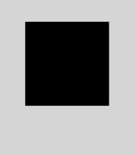


## strokeRect

strokeRect(x: number, y: number, w: number, h: number): void

绘制具有边框的矩形，矩形内部不填充。

**卡片能力：** 从API version 9开始，该接口支持在ArkTS卡片中使用。

**原子化服务API：** 从API version 11开始，该接口支持在原子化服务中使用。

**系统能力：** SystemCapability.ArkUI.ArkUI.Full

 **参数：**

| 参数名     | 类型     | 必填   | 说明           |
| ------ | ------ | ---- | ------------ |
| x      | number | 是   | 指定矩形的左上角x坐标。<br>异常值undefined、null、NaN或Infinity按无效值处理，不进行绘制。<br>默认单位：vp |
| y      | number | 是   | 指定矩形的左上角y坐标。<br>异常值undefined、null、NaN或Infinity按无效值处理，不进行绘制。<br>默认单位：vp |
| w      | number | 是   | 指定矩形的宽度。<br>异常值undefined、null、NaN或Infinity按无效值处理，不进行绘制。<br>默认单位：vp |
| h      | number | 是   | 指定矩形的高度。<br>异常值undefined、null、NaN或Infinity按无效值处理，不进行绘制。<br>默认单位：vp |

 **示例：**

  ```ts
  // xxx.ets
  @Entry
  @Component
  struct StrokeRect {
    private settings: RenderingContextSettings = new RenderingContextSettings(true);
    private context: CanvasRenderingContext2D = new CanvasRenderingContext2D(this.settings);
    private offCanvas: OffscreenCanvas = new OffscreenCanvas(600, 600);

    build() {
      Flex({ direction: FlexDirection.Column, alignItems: ItemAlign.Center, justifyContent: FlexAlign.Center }) {
        Canvas(this.context)
          .width('100%')
          .height('100%')
          .backgroundColor('#ffff00')
          .onReady(() => {
            let offContext = this.offCanvas.getContext("2d", this.settings)
            offContext.strokeRect(30, 30, 200, 150)
            let image = this.offCanvas.transferToImageBitmap()
            this.context.transferFromImageBitmap(image)
        })
      }
      .width('100%')
      .height('100%')
    }
  }
  ```

  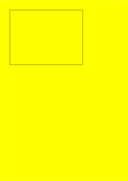


## clearRect

clearRect(x: number, y: number, w: number, h: number): void

删除指定区域内的绘制内容。

**卡片能力：** 从API version 9开始，该接口支持在ArkTS卡片中使用。

**原子化服务API：** 从API version 11开始，该接口支持在原子化服务中使用。

**系统能力：** SystemCapability.ArkUI.ArkUI.Full

 **参数：**

| 参数名   | 类型     | 必填   | 说明            |
| ------ | ------ | ---- | ------------- |
| x      | number | 是   | 指定矩形上的左上角x坐标。<br>异常值undefined、null、NaN或Infinity按无效值处理，不进行绘制。<br>默认单位：vp |
| y      | number | 是   | 指定矩形上的左上角y坐标。<br>异常值undefined、null、NaN或Infinity按无效值处理，不进行绘制。<br>默认单位：vp |
| w      | number | 是   | 指定矩形的宽度。<br>异常值undefined、null、NaN或Infinity按无效值处理，不进行绘制。<br>默认单位：vp |
| h      | number | 是   | 指定矩形的高度。<br>异常值undefined、null、NaN或Infinity按无效值处理，不进行绘制。<br>默认单位：vp |

 **示例：**

  ```ts
  // xxx.ets
  @Entry
  @Component
  struct ClearRect {
    private settings: RenderingContextSettings = new RenderingContextSettings(true);
    private context: CanvasRenderingContext2D = new CanvasRenderingContext2D(this.settings);
    private offCanvas: OffscreenCanvas = new OffscreenCanvas(600, 600);

    build() {
      Flex({ direction: FlexDirection.Column, alignItems: ItemAlign.Center, justifyContent: FlexAlign.Center }) {
        Canvas(this.context)
          .width('100%')
          .height('100%')
          .backgroundColor('#ffff00')
          .onReady(() => {
            let offContext = this.offCanvas.getContext("2d", this.settings)
            offContext.fillStyle = 'rgb(0,0,255)'
            offContext.fillRect(20, 20, 200, 200)
            offContext.clearRect(30, 30, 150, 100)
            let image = this.offCanvas.transferToImageBitmap()
            this.context.transferFromImageBitmap(image)
          })
      }
      .width('100%')
      .height('100%')
    }
  }
  ```

  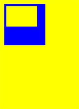


## fillText

fillText(text: string, x: number, y: number, maxWidth?: number): void

绘制填充类文本。

**卡片能力：** 从API version 9开始，该接口支持在ArkTS卡片中使用。

**原子化服务API：** 从API version 11开始，该接口支持在原子化服务中使用。

**系统能力：** SystemCapability.ArkUI.ArkUI.Full

**参数：**

| 参数名       | 类型     | 必填   | 说明              |
| -------- | ------ | ----  | --------------- |
| text     | string | 是    | 需要绘制的文本内容。<br>异常值undefined或null按无效值处理，不进行绘制。 |
| x        | number | 是    | 文本绘制起点的x轴坐标。<br>异常值undefined、null、NaN或Infinity按无效值处理，不进行绘制。<br>默认单位：vp |
| y        | number | 是    | 文本绘制起点的y轴坐标。<br>异常值undefined、null、NaN或Infinity按无效值处理，不进行绘制。<br>默认单位：vp |
| maxWidth | number | 否    | 指定文本允许的最大宽度。<br>异常值null按无效值处理，不进行绘制，undefined、NaN或Infinity按默认值处理。<br>默认单位：vp<br>默认值：不限制宽度。 |

 **示例：**

  ```ts
  // xxx.ets
  @Entry
  @Component
  struct FillText {
    private settings: RenderingContextSettings = new RenderingContextSettings(true);
    private context: CanvasRenderingContext2D = new CanvasRenderingContext2D(this.settings);
    private offCanvas: OffscreenCanvas = new OffscreenCanvas(600, 600);

    build() {
      Flex({ direction: FlexDirection.Column, alignItems: ItemAlign.Center, justifyContent: FlexAlign.Center }) {
        Canvas(this.context)
          .width('100%')
          .height('100%')
          .backgroundColor('#ffff00')
          .onReady(() => {
            let offContext = this.offCanvas.getContext("2d", this.settings)
            offContext.font = '30px sans-serif'
            offContext.fillText("Hello World!", 20, 100)
            let image = this.offCanvas.transferToImageBitmap()
            this.context.transferFromImageBitmap(image)
        })
      }
      .width('100%')
      .height('100%')
    }
  }
  ```

  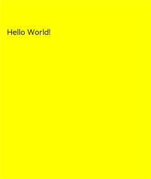


## strokeText

strokeText(text: string, x: number, y: number, maxWidth?: number): void

绘制描边类文本。

**卡片能力：** 从API version 9开始，该接口支持在ArkTS卡片中使用。

**原子化服务API：** 从API version 11开始，该接口支持在原子化服务中使用。

**系统能力：** SystemCapability.ArkUI.ArkUI.Full

**参数：**

| 参数名       | 类型     | 必填   | 说明       |
| -------- | ------ | ---- | --------------- |
| text     | string | 是  | 需要绘制的文本内容。<br>异常值undefined或null按无效值处理，不进行绘制。 |
| x        | number | 是  | 文本绘制起点的x轴坐标。<br>异常值undefined、null、NaN或Infinity按无效值处理，不进行绘制。<br>默认单位：vp |
| y        | number | 是  | 文本绘制起点的y轴坐标。<br>异常值undefined、null、NaN或Infinity按无效值处理，不进行绘制。<br>默认单位：vp |
| maxWidth | number | 否  | 需要绘制的文本的最大宽度。<br>异常值null按无效值处理，不进行绘制，undefined、NaN或Infinity按默认值处理。<br>默认单位：vp<br>默认值：不限制宽度。 |

 **示例：**

  ```ts
  // xxx.ets
  @Entry
  @Component
  struct StrokeText {
    private settings: RenderingContextSettings = new RenderingContextSettings(true);
    private context: CanvasRenderingContext2D = new CanvasRenderingContext2D(this.settings);
    private offCanvas: OffscreenCanvas = new OffscreenCanvas(600, 600);

    build() {
      Flex({ direction: FlexDirection.Column, alignItems: ItemAlign.Center, justifyContent: FlexAlign.Center }) {
        Canvas(this.context)
          .width('100%')
          .height('100%')
          .backgroundColor('#ffff00')
          .onReady(() => {
            let offContext = this.offCanvas.getContext("2d", this.settings)
            offContext.font = '55px sans-serif'
            offContext.strokeText("Hello World!", 20, 60)
            let image = this.offCanvas.transferToImageBitmap()
            this.context.transferFromImageBitmap(image)
        })
      }
      .width('100%')
      .height('100%')
    }
  }
  ```

  


## measureText

measureText(text: string): TextMetrics

该方法返回一个文本测算的对象，通过该对象可以获取指定文本的宽度值。

**卡片能力：** 从API version 9开始，该接口支持在ArkTS卡片中使用。

**原子化服务API：** 从API version 11开始，该接口支持在原子化服务中使用。

**系统能力：** SystemCapability.ArkUI.ArkUI.Full

 **参数：**

| 参数名  | 类型     | 必填  | 说明         |
| ---- | ------ | ---- | ---------- |
| text | string | 是  | 需要进行测量的文本。 |

 **返回值：**

| 类型          | 说明                                       |
| ----------- | ---------------------------------------- |
| [TextMetrics](#textmetrics) | 文本的尺寸信息。<br>传入异常值undefined或null时按"undefined"或"null"计算。 |

 **示例：**

  ```ts
  // xxx.ets
  @Entry
  @Component
  struct MeasureText {
    private settings: RenderingContextSettings = new RenderingContextSettings(true);
    private context: CanvasRenderingContext2D = new CanvasRenderingContext2D(this.settings);
    private offCanvas: OffscreenCanvas = new OffscreenCanvas(600, 600);

    build() {
      Flex({ direction: FlexDirection.Column, alignItems: ItemAlign.Center, justifyContent: FlexAlign.Center }) {
        Canvas(this.context)
          .width('100%')
          .height('100%')
          .backgroundColor('rgb(213,213,213)')
          .onReady(() => {
            let offContext = this.offCanvas.getContext("2d", this.settings)
            offContext.font = '50px sans-serif'
            offContext.fillText("Hello World!", 20, 100)
            offContext.fillText("width:" + offContext.measureText("Hello World!").width, 20, 200)
            let image = this.offCanvas.transferToImageBitmap()
            this.context.transferFromImageBitmap(image)
        })
      }
      .width('100%')
      .height('100%')
    }
  }
  ```

  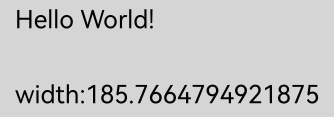


## stroke

stroke(): void

根据当前的路径，进行边框绘制操作。

**卡片能力：** 从API version 9开始，该接口支持在ArkTS卡片中使用。

**原子化服务API：** 从API version 11开始，该接口支持在原子化服务中使用。

**系统能力：** SystemCapability.ArkUI.ArkUI.Full

**示例：**

  ```ts
  // xxx.ets
  @Entry
  @Component
  struct Stroke {
    private settings: RenderingContextSettings = new RenderingContextSettings(true);
    private context: CanvasRenderingContext2D = new CanvasRenderingContext2D(this.settings);
    private offCanvas: OffscreenCanvas = new OffscreenCanvas(600, 600);

    build() {
      Flex({ direction: FlexDirection.Column, alignItems: ItemAlign.Center, justifyContent: FlexAlign.Center }) {
        Canvas(this.context)
          .width('100%')
          .height('100%')
          .backgroundColor('#ffff00')
          .onReady(() => {
            let offContext = this.offCanvas.getContext("2d", this.settings)
            offContext.moveTo(125, 25)
            offContext.lineTo(125, 105)
            offContext.lineTo(175, 105)
            offContext.lineTo(175, 25)
            offContext.strokeStyle = 'rgb(255,0,0)'
            offContext.stroke()
            let image = this.offCanvas.transferToImageBitmap()
            this.context.transferFromImageBitmap(image)
          })
      }
      .width('100%')
      .height('100%')
    }
  }
  ```

  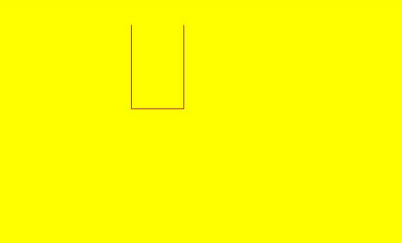

## stroke

stroke(path: Path2D): void

根据指定的路径，进行边框绘制操作。

**卡片能力：** 从API version 9开始，该接口支持在ArkTS卡片中使用。

**原子化服务API：** 从API version 11开始，该接口支持在原子化服务中使用。

**系统能力：** SystemCapability.ArkUI.ArkUI.Full

 **参数：**

| 参数名   | 类型                                       | 必填   | 说明 |
| ---- | ---------------------------------------- | ---- | ------------ |
| path | [Path2D](ts-components-canvas-path2d.md) | 是    |  需要绘制的Path2D。<br>异常值undefined或null按无效值处理，不进行绘制。 |

 **示例：**

  ```ts
  // xxx.ets
  @Entry
  @Component
  struct Stroke {
    private settings: RenderingContextSettings = new RenderingContextSettings(true);
    private context: CanvasRenderingContext2D = new CanvasRenderingContext2D(this.settings);
    private offCanvas: OffscreenCanvas = new OffscreenCanvas(600, 600);
    private path2Da: Path2D = new Path2D();

    build() {
      Flex({ direction: FlexDirection.Column, alignItems: ItemAlign.Center, justifyContent: FlexAlign.Center }) {
        Canvas(this.context)
          .width('100%')
          .height('100%')
          .backgroundColor('#ffff00')
          .onReady(() => {
            let offContext = this.offCanvas.getContext("2d", this.settings)
            this.path2Da.moveTo(25, 25)
            this.path2Da.lineTo(25, 105)
            this.path2Da.lineTo(75, 105)
            this.path2Da.lineTo(75, 25)
            offContext.strokeStyle = 'rgb(0,0,255)'
            offContext.stroke(this.path2Da)
            let image = this.offCanvas.transferToImageBitmap()
            this.context.transferFromImageBitmap(image)
          })
      }
      .width('100%')
      .height('100%')
    }
  }
  ```

  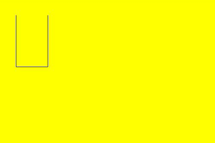


## beginPath

beginPath(): void

创建一个新的绘制路径。

**卡片能力：** 从API version 9开始，该接口支持在ArkTS卡片中使用。

**原子化服务API：** 从API version 11开始，该接口支持在原子化服务中使用。

**系统能力：** SystemCapability.ArkUI.ArkUI.Full

 **示例：**

  ```ts
  // xxx.ets
  @Entry
  @Component
  struct BeginPath {
    private settings: RenderingContextSettings = new RenderingContextSettings(true);
    private context: CanvasRenderingContext2D = new CanvasRenderingContext2D(this.settings);
    private offCanvas: OffscreenCanvas = new OffscreenCanvas(600, 600);

    build() {
      Flex({ direction: FlexDirection.Column, alignItems: ItemAlign.Center, justifyContent: FlexAlign.Center }) {
        Canvas(this.context)
          .width('100%')
          .height('100%')
          .backgroundColor('rgb(213,213,213)')
          .onReady(() => {
            let offContext = this.offCanvas.getContext("2d", this.settings)
            offContext.beginPath()
            offContext.lineWidth = 6
            offContext.strokeStyle = '#0000ff'
            offContext.moveTo(15, 80)
            offContext.lineTo(280, 160)
            offContext.stroke()
            let image = this.offCanvas.transferToImageBitmap()
            this.context.transferFromImageBitmap(image)
          })
      }
      .width('100%')
      .height('100%')
    }
  }
  ```

  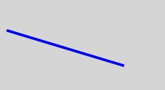


## moveTo

moveTo(x: number, y: number): void

路径从当前点移动到指定点。

**卡片能力：** 从API version 9开始，该接口支持在ArkTS卡片中使用。

**原子化服务API：** 从API version 11开始，该接口支持在原子化服务中使用。

**系统能力：** SystemCapability.ArkUI.ArkUI.Full

 **参数：**

| 参数名   | 类型     | 必填   | 说明        |
| ---- | ------ | ---- | --------- |
| x    | number | 是    | 指定位置的x坐标。<br>API version 18之前，设置NaN或Infinity时，整条路径不显示；设置null或undefined时，当前接口不生效。API version 18及以后，设置NaN、Infinity、null或undefined时当前接口不生效，其他传入有效参数的路径方法正常绘制。<br>默认单位：vp |
| y    | number | 是    | 指定位置的y坐标。<br>API version 18之前，设置NaN或Infinity时，整条路径不显示；设置null或undefined时，当前接口不生效。API version 18及以后，设置NaN、Infinity、null或undefined时当前接口不生效，其他传入有效参数的路径方法正常绘制。<br>默认单位：vp |

> **说明：**
>
> API version 18之前，若未执行moveTo接口或moveTo接口传入无效参数，路径以(0,0)为起点。
>
> API version 18及以后，若未执行moveTo接口或moveTo接口传入无效参数，路径以初次调用的lineTo、arcTo、bezierCurveTo或quadraticCurveTo接口中的起始点为起点。

 **示例：**

  ```ts
  // xxx.ets
  @Entry
  @Component
  struct MoveTo {
    private settings: RenderingContextSettings = new RenderingContextSettings(true);
    private context: CanvasRenderingContext2D = new CanvasRenderingContext2D(this.settings);
    private offCanvas: OffscreenCanvas = new OffscreenCanvas(600, 600);

    build() {
      Flex({ direction: FlexDirection.Column, alignItems: ItemAlign.Center, justifyContent: FlexAlign.Center }) {
        Canvas(this.context)
          .width('100%')
          .height('100%')
          .backgroundColor('#ffff00')
          .onReady(() => {
            let offContext = this.offCanvas.getContext("2d", this.settings)
            offContext.beginPath()
            offContext.moveTo(10, 10)
            offContext.lineTo(280, 160)
            offContext.stroke()
            let image = this.offCanvas.transferToImageBitmap()
            this.context.transferFromImageBitmap(image)
          })
      }
      .width('100%')
      .height('100%')
    }
  }
  ```

  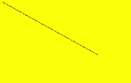


## lineTo

lineTo(x: number, y: number): void

从当前点到指定点进行路径连接。

**卡片能力：** 从API version 9开始，该接口支持在ArkTS卡片中使用。

**原子化服务API：** 从API version 11开始，该接口支持在原子化服务中使用。

**系统能力：** SystemCapability.ArkUI.ArkUI.Full

 **参数：**

| 参数名   | 类型     | 必填   | 说明        |
| ---- | ------ | ----  | --------- |
| x    | number | 是    | 指定位置的x坐标。<br>API version 18之前，设置NaN或Infinity时，整条路径不显示；设置null或undefined时，当前接口不生效。API version 18及以后，设置NaN、Infinity、null或undefined时当前接口不生效，其他传入有效参数的路径方法正常绘制。<br>默认单位：vp |
| y    | number | 是    | 指定位置的y坐标。<br>API version 18之前，设置NaN或Infinity时，整条路径不显示；设置null或undefined时，当前接口不生效。API version 18及以后，设置NaN、Infinity、null或undefined时当前接口不生效，其他传入有效参数的路径方法正常绘制。<br>默认单位：vp |

 **示例：**

  ```ts
  // xxx.ets
  @Entry
  @Component
  struct LineTo {
    private settings: RenderingContextSettings = new RenderingContextSettings(true);
    private context: CanvasRenderingContext2D = new CanvasRenderingContext2D(this.settings);
    private offCanvas: OffscreenCanvas = new OffscreenCanvas(600, 600);

    build() {
      Flex({ direction: FlexDirection.Column, alignItems: ItemAlign.Center, justifyContent: FlexAlign.Center }) {
        Canvas(this.context)
          .width('100%')
          .height('100%')
          .backgroundColor('#ffff00')
          .onReady(() => {
            let offContext = this.offCanvas.getContext("2d", this.settings)
            offContext.beginPath()
            offContext.moveTo(10, 10)
            offContext.lineTo(280, 160)
            offContext.stroke()
            let image = this.offCanvas.transferToImageBitmap()
            this.context.transferFromImageBitmap(image)
          })
      }
      .width('100%')
      .height('100%')
    }
  }
  ```

  


## closePath

closePath(): void

结束当前路径形成一个封闭路径。

**卡片能力：** 从API version 9开始，该接口支持在ArkTS卡片中使用。

**原子化服务API：** 从API version 11开始，该接口支持在原子化服务中使用。

**系统能力：** SystemCapability.ArkUI.ArkUI.Full

 **示例：**

  ```ts
  // xxx.ets
  @Entry
  @Component
  struct ClosePath {
    private settings: RenderingContextSettings = new RenderingContextSettings(true);
    private context: CanvasRenderingContext2D = new CanvasRenderingContext2D(this.settings);
    private offCanvas: OffscreenCanvas = new OffscreenCanvas(600, 600);

    build() {
      Flex({ direction: FlexDirection.Column, alignItems: ItemAlign.Center, justifyContent: FlexAlign.Center }) {
        Canvas(this.context)
          .width('100%')
          .height('100%')
          .backgroundColor('#ffff00')
          .onReady(() => {
              let offContext = this.offCanvas.getContext("2d", this.settings)
              offContext.beginPath()
              offContext.moveTo(30, 30)
              offContext.lineTo(110, 30)
              offContext.lineTo(70, 90)
              offContext.closePath()
              offContext.stroke()
              let image = this.offCanvas.transferToImageBitmap()
              this.context.transferFromImageBitmap(image)
          })
      }
      .width('100%')
      .height('100%')
    }
  }
  ```

  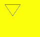


## createPattern

createPattern(image: ImageBitmap, repetition: string | null): CanvasPattern | null

通过指定图像和重复方式创建图片填充的模板。

**卡片能力：** 从API version 9开始，该接口支持在ArkTS卡片中使用。

**原子化服务API：** 从API version 11开始，该接口支持在原子化服务中使用。

**系统能力：** SystemCapability.ArkUI.ArkUI.Full

**参数：**

| 参数名 | 类型 | 必填   | 说明 |
| ---------- | ---------------------------------------- | ---- | ---------------------------------------- |
| image      | [ImageBitmap](ts-components-canvas-imagebitmap.md) | 是    | 图源对象，具体参考ImageBitmap对象。<br>异常值undefined或null按无效值处理。 |
| repetition | string \| null  | 是  | 设置图像重复的方式：<br>'repeat'：沿x轴和y轴重复绘制图像；<br>'repeat-x'：沿x轴重复绘制图像；<br>'repeat-y'：沿y轴重复绘制图像；<br>'no-repeat'：不重复绘制图像；<br>'clamp'：在原始边界外绘制时，超出部分使用边缘的颜色绘制；<br>'mirror'：沿x轴和y轴重复翻转绘制图像。<br>异常值undefined或null按无效值处理。 |

**返回值：**

| 类型                                       | 说明                      |
| ---------------------------------------- | ----------------------- |
| [CanvasPattern](ts-components-canvas-canvaspattern.md) \| null | 通过指定图像和重复方式创建图片填充的模板对象。 |

 **示例：**

> **说明：**
>
> 此示例的资源不在src > main > resource目录下，从DevEco Studio 6.0.0 Beta2版本开始，新建工程或模块时，默认创建的模块不会对非resources目录下的资源进行打包，需使能相关开关：模块的build-profile.json5中buildOption > resOptions > copyCodeResource > enable设置为true，详见resOptions中[copyCodeResource](https://developer.huawei.com/consumer/cn/doc/harmonyos-guides/ide-hvigor-build-profile#section754823013348)相关介绍。

  ```ts
  // xxx.ets
  @Entry
  @Component
  struct CreatePattern {
    private settings: RenderingContextSettings = new RenderingContextSettings(true);
    private context: CanvasRenderingContext2D = new CanvasRenderingContext2D(this.settings);
    // "common/images/example.jpg"需要替换为开发者所需的图像资源文件
    private img:ImageBitmap = new ImageBitmap("common/images/example.jpg");
    private offCanvas: OffscreenCanvas = new OffscreenCanvas(600, 600);

    build() {
      Flex({ direction: FlexDirection.Column, alignItems: ItemAlign.Center, justifyContent: FlexAlign.Center }) {
        Canvas(this.context)
          .width('100%')
          .height('100%')
          .backgroundColor('rgb(213,213,213)')
          .onReady(() => {
            let offContext = this.offCanvas.getContext("2d", this.settings)
            let pattern = offContext.createPattern(this.img, 'repeat')
            offContext.fillStyle = pattern as CanvasPattern
            offContext.fillRect(0, 0, 200, 200)
            let image = this.offCanvas.transferToImageBitmap()
            this.context.transferFromImageBitmap(image)
          })
      }
      .width('100%')
      .height('100%')
    }
  }
  ```

  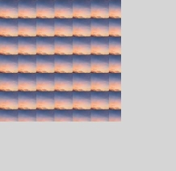


## bezierCurveTo

bezierCurveTo(cp1x: number, cp1y: number, cp2x: number, cp2y: number, x: number, y: number): void

创建三次贝塞尔曲线的路径。

**卡片能力：** 从API version 9开始，该接口支持在ArkTS卡片中使用。

**原子化服务API：** 从API version 11开始，该接口支持在原子化服务中使用。

**系统能力：** SystemCapability.ArkUI.ArkUI.Full

 **参数：**

<!--Table: 10%; 10%; 10%; 70%-->
| 参数名   | 类型     | 必填  | 说明             |
| ---- | ------ | ---- | -------------- |
| cp1x | number | 是  | 第一个贝塞尔参数的x坐标值。<br>API version 18之前，设置NaN或Infinity时，整条路径不显示；设置null或undefined时，当前接口不生效。API version 18及以后，设置NaN、Infinity、null或undefined时当前接口不生效，其他传入有效参数的路径方法正常绘制。<br>默认单位：vp |
| cp1y | number | 是  | 第一个贝塞尔参数的y坐标值。<br>API version 18之前，设置NaN或Infinity时，整条路径不显示；设置null或undefined时，当前接口不生效。API version 18及以后，设置NaN、Infinity、null或undefined时当前接口不生效，其他传入有效参数的路径方法正常绘制。<br>默认单位：vp |
| cp2x | number | 是  | 第二个贝塞尔参数的x坐标值。<br>API version 18之前，设置NaN或Infinity时，整条路径不显示；设置null或undefined时，当前接口不生效。API version 18及以后，设置NaN、Infinity、null或undefined时当前接口不生效，其他传入有效参数的路径方法正常绘制。<br>默认单位：vp |
| cp2y | number | 是  | 第二个贝塞尔参数的y坐标值。<br>API version 18之前，设置NaN或Infinity时，整条路径不显示；设置null或undefined时，当前接口不生效。API version 18及以后，设置NaN、Infinity、null或undefined时当前接口不生效，其他传入有效参数的路径方法正常绘制。<br>默认单位：vp |
| x    | number | 是  | 路径结束时的x坐标值。<br>API version 18之前，设置NaN或Infinity时，整条路径不显示；设置null或undefined时，当前接口不生效。API version 18及以后，设置NaN、Infinity、null或undefined时当前接口不生效，其他传入有效参数的路径方法正常绘制。<br>默认单位：vp |
| y    | number | 是  | 路径结束时的y坐标值。<br>API version 18之前，设置NaN或Infinity时，整条路径不显示；设置null或undefined时，当前接口不生效。API version 18及以后，设置NaN、Infinity、null或undefined时当前接口不生效，其他传入有效参数的路径方法正常绘制。<br>默认单位：vp |

**示例：**

``` ts
// xxx.ets
import { Point } from '@kit.TestKit';

@Entry
@Component
struct BezierCurveTo {
  private settings: RenderingContextSettings = new RenderingContextSettings(true);
  private context: CanvasRenderingContext2D = new CanvasRenderingContext2D(this.settings);
  private offCanvas: OffscreenCanvas = new OffscreenCanvas(600, 600);
  private start: Point = { x: 50, y: 50 };
  private end: Point = { x: 250, y: 100 };
  private cp1: Point = { x: 200, y: 30 };
  private cp2: Point = { x: 130, y: 80 };

  build() {
    Flex({ direction: FlexDirection.Column, alignItems: ItemAlign.Center, justifyContent: FlexAlign.Center }) {
      Canvas(this.context)
        .width('100%')
        .height('100%')
        .backgroundColor('rgb(213,213,213)')
        .onReady(() => {
          let offContext = this.offCanvas.getContext("2d", this.settings)
          // 三次贝塞尔曲线
          offContext.beginPath();
          offContext.moveTo(this.start.x, this.start.y);
          offContext.bezierCurveTo(this.cp1.x, this.cp1.y, this.cp2.x, this.cp2.y, this.end.x, this.end.y);
          offContext.stroke();

          // 起点和终点
          offContext.fillStyle = 'rgb(39,135,217)';
          offContext.beginPath();
          offContext.arc(this.start.x, this.start.y, 5, 0, 2 * Math.PI); // 起点
          offContext.arc(this.end.x, this.end.y, 5, 0, 2 * Math.PI); // 终点
          offContext.fill();

          // 控制点
          offContext.fillStyle = 'rgb(23,169,141)';
          offContext.beginPath();
          offContext.arc(this.cp1.x, this.cp1.y, 5, 0, 2 * Math.PI); // 控制点一
          offContext.arc(this.cp2.x, this.cp2.y, 5, 0, 2 * Math.PI); // 控制点二
          offContext.fill();
          let image = this.offCanvas.transferToImageBitmap();
          this.context.transferFromImageBitmap(image);
        })
    }
    .width('100%')
    .height('100%')
  }
}
```

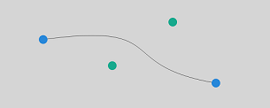


## quadraticCurveTo

quadraticCurveTo(cpx: number, cpy: number, x: number, y: number): void

创建二次贝塞尔曲线的路径。

**卡片能力：** 从API version 9开始，该接口支持在ArkTS卡片中使用。

**原子化服务API：** 从API version 11开始，该接口支持在原子化服务中使用。

**系统能力：** SystemCapability.ArkUI.ArkUI.Full

 **参数：**
 
| 参数名   | 类型     | 必填  | 说明             |
| ---- | ------ | ---- | -------------- |
| cpx  | number | 是   | 贝塞尔参数的x坐标值。<br>API version 18之前，设置NaN或Infinity时，整条路径不显示；设置null或undefined时，当前接口不生效。API version 18及以后，设置NaN、Infinity、null或undefined时当前接口不生效，其他传入有效参数的路径方法正常绘制。<br>默认单位：vp |
| cpy  | number | 是   | 贝塞尔参数的y坐标值。<br>API version 18之前，设置NaN或Infinity时，整条路径不显示；设置null或undefined时，当前接口不生效。API version 18及以后，设置NaN、Infinity、null或undefined时当前接口不生效，其他传入有效参数的路径方法正常绘制。<br>默认单位：vp |
| x    | number | 是   | 路径结束时的x坐标值。<br>API version 18之前，设置NaN或Infinity时，整条路径不显示；设置null或undefined时，当前接口不生效。API version 18及以后，设置NaN、Infinity、null或undefined时当前接口不生效，其他传入有效参数的路径方法正常绘制。<br>默认单位：vp |
| y    | number | 是   | 路径结束时的y坐标值。<br>API version 18之前，设置NaN或Infinity时，整条路径不显示；设置null或undefined时，当前接口不生效。API version 18及以后，设置NaN、Infinity、null或undefined时当前接口不生效，其他传入有效参数的路径方法正常绘制。<br>默认单位：vp |

**示例：**

``` ts
// xxx.ets
import { Point } from '@kit.TestKit';

@Entry
@Component
struct QuadraticCurveTo {
  private settings: RenderingContextSettings = new RenderingContextSettings(true);
  private context: CanvasRenderingContext2D = new CanvasRenderingContext2D(this.settings);
  private offCanvas: OffscreenCanvas = new OffscreenCanvas(600, 600);
  private start: Point = { x: 50, y: 20 };
  private end: Point = { x: 50, y: 100 };
  private cp: Point = { x: 230, y: 30 };

  build() {
    Flex({ direction: FlexDirection.Column, alignItems: ItemAlign.Center, justifyContent: FlexAlign.Center }) {
      Canvas(this.context)
        .width('100%')
        .height('100%')
        .backgroundColor('rgb(213,213,213)')
        .onReady(() => {
          let offContext = this.offCanvas.getContext("2d", this.settings);
          // 二次贝塞尔曲线
          offContext.beginPath();
          offContext.moveTo(this.start.x, this.start.y);
          offContext.quadraticCurveTo(this.cp.x, this.cp.y, this.end.x, this.end.y);
          offContext.stroke();

          // 起始点和结束点
          offContext.fillStyle = 'rgb(39,135,217)';
          offContext.beginPath();
          offContext.arc(this.start.x, this.start.y, 5, 0, 2 * Math.PI); // 起始点
          offContext.arc(this.end.x, this.end.y, 5, 0, 2 * Math.PI); // 结束点
          offContext.fill();

          // 控制点
          offContext.fillStyle = 'rgb(23,169,141)';
          offContext.beginPath();
          offContext.arc(this.cp.x, this.cp.y, 5, 0, 2 * Math.PI);
          offContext.fill();

          let image = this.offCanvas.transferToImageBitmap();
          this.context.transferFromImageBitmap(image);
        })
    }
    .width('100%')
    .height('100%')
  }
}
```

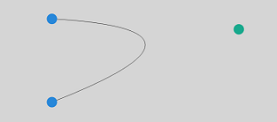

## arc

arc(x: number, y: number, radius: number, startAngle: number, endAngle: number, counterclockwise?: boolean): void

绘制弧线路径。

**卡片能力：** 从API version 9开始，该接口支持在ArkTS卡片中使用。

**原子化服务API：** 从API version 11开始，该接口支持在原子化服务中使用。

**系统能力：** SystemCapability.ArkUI.ArkUI.Full

 **参数：**

<!--Table: 10%; 10%; 10%; 70%-->
| 参数名 | 类型      | 必填   | 说明         |
| ---------------- | ------- | ---- | ---------- |
| x                | number  | 是   | 弧线圆心的x坐标值。<br>API version 18之前，设置NaN或Infinity时，整条路径不显示；设置null或undefined时，当前接口不生效。API version 18及以后，设置NaN、Infinity、null或undefined时当前接口不生效，其他传入有效参数的路径方法正常绘制。<br>默认单位：vp |
| y                | number  | 是   | 弧线圆心的y坐标值。<br>API version 18之前，设置NaN或Infinity时，整条路径不显示；设置null或undefined时，当前接口不生效。API version 18及以后，设置NaN、Infinity、null或undefined时当前接口不生效，其他传入有效参数的路径方法正常绘制。<br>默认单位：vp |
| radius           | number  | 是   | 弧线的圆半径。<br>API version 18之前，设置NaN或Infinity时，整条路径不显示；设置null或undefined时，当前接口不生效。API version 18及以后，设置NaN、Infinity、null或undefined时当前接口不生效，其他传入有效参数的路径方法正常绘制。<br>默认单位：vp |
| startAngle       | number  | 是   | 弧线的起始弧度。<br>API version 18之前，设置NaN或Infinity时，整条路径不显示；设置null或undefined时，当前接口不生效。API version 18及以后，设置NaN、Infinity、null或undefined时当前接口不生效，其他传入有效参数的路径方法正常绘制。<br>默认单位：弧度 |
| endAngle         | number  | 是   | 弧线的终止弧度。<br>API version 18之前，设置NaN或Infinity时，整条路径不显示；设置null或undefined时，当前接口不生效。API version 18及以后，设置NaN、Infinity、null或undefined时当前接口不生效，其他传入有效参数的路径方法正常绘制。<br>默认单位：弧度 |
| counterclockwise | boolean | 否   | 是否逆时针绘制圆弧。<br/>true：逆时针绘制圆弧；false：顺时针绘制圆弧。<br>默认值：false，设置null或undefined按默认值处理。 |

 **示例：**

  ```ts
  // xxx.ets
  @Entry
  @Component
  struct Arc {
    private settings: RenderingContextSettings = new RenderingContextSettings(true);
    private context: CanvasRenderingContext2D = new CanvasRenderingContext2D(this.settings);
    private offCanvas: OffscreenCanvas = new OffscreenCanvas(600, 600);

    build() {
      Flex({ direction: FlexDirection.Column, alignItems: ItemAlign.Center, justifyContent: FlexAlign.Center }) {
        Canvas(this.context)
          .width('100%')
          .height('100%')
          .backgroundColor('#ffff00')
          .onReady(() => {
            let offContext = this.offCanvas.getContext("2d", this.settings)
            offContext.beginPath()
            offContext.arc(100, 75, 50, 0, 6.28)
            offContext.stroke()
            let image = this.offCanvas.transferToImageBitmap()
            this.context.transferFromImageBitmap(image)
          })
      }
      .width('100%')
      .height('100%')
    }
  }
  ```

  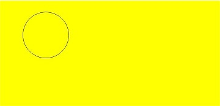


## arcTo

arcTo(x1: number, y1: number, x2: number, y2: number, radius: number): void

依据给定的控制点和圆弧半径创建圆弧路径。

**卡片能力：** 从API version 9开始，该接口支持在ArkTS卡片中使用。

**原子化服务API：** 从API version 11开始，该接口支持在原子化服务中使用。

**系统能力：** SystemCapability.ArkUI.ArkUI.Full

 **参数：**

<!--Table: 10%; 10%; 10%; 70%-->
| 参数名    | 类型     | 必填  | 说明         |
| ------ | ------ | ---- | --------------- |
| x1     | number | 是  | 第一个控制点的x坐标值。<br>API version 18之前，设置NaN或Infinity时，整条路径不显示；设置null或undefined时，当前接口不生效。API version 18及以后，设置NaN、Infinity、null或undefined时当前接口不生效，其他传入有效参数的路径方法正常绘制。<br>默认单位：vp |
| y1     | number | 是  | 第一个控制点的y坐标值。<br>API version 18之前，设置NaN或Infinity时，整条路径不显示；设置null或undefined时，当前接口不生效。API version 18及以后，设置NaN、Infinity、null或undefined时当前接口不生效，其他传入有效参数的路径方法正常绘制。<br>默认单位：vp |
| x2     | number | 是  | 第二个控制点的x坐标值。<br>API version 18之前，设置NaN或Infinity时，整条路径不显示；设置null或undefined时，当前接口不生效。API version 18及以后，设置NaN、Infinity、null或undefined时当前接口不生效，其他传入有效参数的路径方法正常绘制。<br>默认单位：vp |
| y2     | number | 是  | 第二个控制点的y坐标值。<br>API version 18之前，设置NaN或Infinity时，整条路径不显示；设置null或undefined时，当前接口不生效。API version 18及以后，设置NaN、Infinity、null或undefined时当前接口不生效，其他传入有效参数的路径方法正常绘制。<br>默认单位：vp |
| radius | number | 是  | 圆弧的圆半径值。<br>API version 18之前，设置NaN或Infinity时，整条路径不显示；设置null或undefined时，当前接口不生效。API version 18及以后，设置NaN、Infinity、null或undefined时当前接口不生效，其他传入有效参数的路径方法正常绘制。<br>默认单位：vp |

 **示例：**

  ```ts
  // xxx.ets
  @Entry
  @Component
  struct ArcTo {
    private settings: RenderingContextSettings = new RenderingContextSettings(true);
    private context: CanvasRenderingContext2D = new CanvasRenderingContext2D(this.settings);
    private offCanvas: OffscreenCanvas = new OffscreenCanvas(600, 600);

    build() {
      Flex({ direction: FlexDirection.Column, alignItems: ItemAlign.Center, justifyContent: FlexAlign.Center }) {
        Canvas(this.context)
          .width('100%')
          .height('100%')
          .backgroundColor('#ffff00')
          .onReady(() => {
            let offContext = this.offCanvas.getContext("2d", this.settings)

            // 切线
            offContext.beginPath()
            offContext.strokeStyle = '#808080'
            offContext.lineWidth = 1.5;
            offContext.moveTo(360, 20);
            offContext.lineTo(360, 170);
            offContext.lineTo(110, 170);
            offContext.stroke();

            // 圆弧
            offContext.beginPath()
            offContext.strokeStyle = '#000000'
            offContext.lineWidth = 3;
            offContext.moveTo(360, 20)
            offContext.arcTo(360, 170, 110, 170, 150)
            offContext.stroke()

            // 起始点
            offContext.beginPath();
            offContext.fillStyle = '#00ff00';
            offContext.arc(360, 20, 4, 0, 2 * Math.PI);
            offContext.fill();

            // 控制点
            offContext.beginPath();
            offContext.fillStyle = '#ff0000';
            offContext.arc(360, 170, 4, 0, 2 * Math.PI);
            offContext.arc(110, 170, 4, 0, 2 * Math.PI);
            offContext.fill();

            let image = this.offCanvas.transferToImageBitmap()
            this.context.transferFromImageBitmap(image)
          })
      }
      .width('100%')
      .height('100%')
    }
  }
  ```

  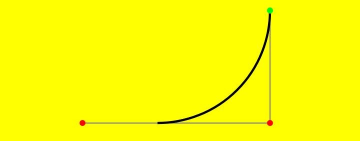

  > 此示例中，arcTo()创建的圆弧为黑色，圆弧的两条切线为灰色。控制点为红色，起始点为绿色。
  >
  > 可以想象两条切线：一条切线从起始点到第一个控制点，另一条切线从第一个控制点到第二个控制点。arcTo()在这两条切线间创建一个圆弧，并使圆弧与这两条切线都相切。


## ellipse

ellipse(x: number, y: number, radiusX: number, radiusY: number, rotation: number, startAngle: number, endAngle: number, counterclockwise?: boolean): void

在规定的矩形区域绘制一个椭圆。

**卡片能力：** 从API version 9开始，该接口支持在ArkTS卡片中使用。

**原子化服务API：** 从API version 11开始，该接口支持在原子化服务中使用。

**系统能力：** SystemCapability.ArkUI.ArkUI.Full

 **参数：**

<!--Table: 10%; 10%; 10%; 70%-->
| 参数名              | 类型      | 必填   | 说明 |
| ---------------- | ------- | ---- | ---------------------------------------- |
| x                | number  | 是     | 椭圆圆心的x轴坐标。<br>API version 18之前，设置NaN或Infinity时，整条路径不显示；设置null或undefined时，当前接口不生效。API version 18及以后，设置NaN、Infinity、null或undefined时当前接口不生效，其他传入有效参数的路径方法正常绘制。<br>默认单位：vp |
| y                | number  | 是     | 椭圆圆心的y轴坐标。<br>API version 18之前，设置NaN或Infinity时，整条路径不显示；设置null或undefined时，当前接口不生效。API version 18及以后，设置NaN、Infinity、null或undefined时当前接口不生效，其他传入有效参数的路径方法正常绘制。<br>默认单位：vp |
| radiusX          | number  | 是     | 椭圆x轴的半径长度。<br>API version 18之前，设置NaN或Infinity时，整条路径不显示；设置null或undefined时，当前接口不生效。API version 18及以后，设置NaN、Infinity、null或undefined时当前接口不生效，其他传入有效参数的路径方法正常绘制。<br>默认单位：vp |
| radiusY          | number  | 是     | 椭圆y轴的半径长度。<br>API version 18之前，设置NaN或Infinity时，整条路径不显示；设置null或undefined时，当前接口不生效。API version 18及以后，设置NaN、Infinity、null或undefined时当前接口不生效，其他传入有效参数的路径方法正常绘制。<br>默认单位：vp |
| rotation         | number  | 是     | 椭圆的旋转角度。<br>API version 18之前，设置NaN或Infinity时，整条路径不显示；设置null或undefined时，当前接口不生效。API version 18及以后，设置NaN、Infinity、null或undefined时当前接口不生效，其他传入有效参数的路径方法正常绘制。<br>单位为弧度。 |
| startAngle       | number  | 是     | 椭圆绘制的起始点角度。<br>API version 18之前，设置NaN或Infinity时，整条路径不显示；设置null或undefined时，当前接口不生效。API version 18及以后，设置NaN、Infinity、null或undefined时当前接口不生效，其他传入有效参数的路径方法正常绘制。<br>单位为弧度。 |
| endAngle         | number  | 是     | 椭圆绘制的结束点角度。<br>API version 18之前，设置NaN或Infinity时，整条路径不显示；设置null或undefined时，当前接口不生效。API version 18及以后，设置NaN、Infinity、null或undefined时当前接口不生效，其他传入有效参数的路径方法正常绘制。<br>单位为弧度。 |
| counterclockwise | boolean | 否     | 是否以逆时针方向绘制椭圆。<br>true：逆时针方向绘制椭圆。<br>false：顺时针方向绘制椭圆。<br>默认值：false，设置null或undefined按默认值处理。 |

 **示例：**

  ```ts
  // xxx.ets
  @Entry
  @Component
  struct CanvasExample {
    private settings: RenderingContextSettings = new RenderingContextSettings(true);
    private context: CanvasRenderingContext2D = new CanvasRenderingContext2D(this.settings);
    private offCanvas: OffscreenCanvas = new OffscreenCanvas(600, 600);
    build() {
      Flex({ direction: FlexDirection.Column, alignItems: ItemAlign.Center, justifyContent: FlexAlign.Center }) {
        Canvas(this.context)
          .width('100%')
          .height('100%')
          .backgroundColor('#ffff00')
          .onReady(() => {
            let offContext = this.offCanvas.getContext("2d", this.settings)
            offContext.beginPath()
            offContext.ellipse(200, 200, 50, 100, Math.PI * 0.25, Math.PI * 0.5, Math.PI * 2, false)
            offContext.stroke()
            offContext.beginPath()
            offContext.ellipse(200, 300, 50, 100, Math.PI * 0.25, Math.PI * 0.5, Math.PI * 2, true)
            offContext.stroke()
            let image = this.offCanvas.transferToImageBitmap()
            this.context.transferFromImageBitmap(image)
          })
      }
      .width('100%')
      .height('100%')
    }
  }
  ```

  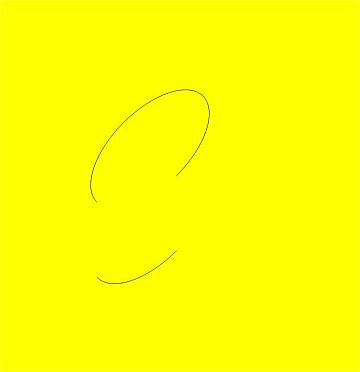

## rect

rect(x: number, y: number, w: number, h: number): void

创建矩形路径。

**卡片能力：** 从API version 9开始，该接口支持在ArkTS卡片中使用。

**原子化服务API：** 从API version 11开始，该接口支持在原子化服务中使用。

**系统能力：** SystemCapability.ArkUI.ArkUI.Full

 **参数：**

<!--Table: 10%; 10%; 10%; 70%-->
| 参数名  | 类型     | 必填 | 说明 |
| ---- | ------ | ---- | ------------- |
| x    | number | 是  | 指定矩形的左上角x坐标值。<br>API version 18之前，设置NaN或Infinity时，整条路径不显示；设置null或undefined时，当前接口不生效。API version 18及以后，设置NaN、Infinity、null或undefined时当前接口不生效，其他传入有效参数的路径方法正常绘制。<br>默认单位：vp |
| y    | number | 是  | 指定矩形的左上角y坐标值。<br>API version 18之前，设置NaN或Infinity时，整条路径不显示；设置null或undefined时，当前接口不生效。API version 18及以后，设置NaN、Infinity、null或undefined时当前接口不生效，其他传入有效参数的路径方法正常绘制。<br>默认单位：vp |
| w    | number | 是  | 指定矩形的宽度。<br>API version 18之前，设置NaN或Infinity时，整条路径不显示；设置null或undefined时，当前接口不生效。API version 18及以后，设置NaN、Infinity、null或undefined时当前接口不生效，其他传入有效参数的路径方法正常绘制。<br>默认单位：vp |
| h    | number | 是  | 指定矩形的高度。<br>API version 18之前，设置NaN或Infinity时，整条路径不显示；设置null或undefined时，当前接口不生效。API version 18及以后，设置NaN、Infinity、null或undefined时当前接口不生效，其他传入有效参数的路径方法正常绘制。<br>默认单位：vp |

 **示例：**

  ```ts
  // xxx.ets
  @Entry
  @Component
  struct CanvasExample {
    private settings: RenderingContextSettings = new RenderingContextSettings(true);
    private context: CanvasRenderingContext2D = new CanvasRenderingContext2D(this.settings);
    private offCanvas: OffscreenCanvas = new OffscreenCanvas(600, 600);

    build() {
      Flex({ direction: FlexDirection.Column, alignItems: ItemAlign.Center, justifyContent: FlexAlign.Center }) {
        Canvas(this.context)
          .width('100%')
          .height('100%')
          .backgroundColor('#ffff00')
          .onReady(() => {
            let offContext = this.offCanvas.getContext("2d", this.settings)
            offContext.rect(20, 20, 100, 100) // Create a 100*100 rectangle at (20, 20)
            offContext.stroke()
            let image = this.offCanvas.transferToImageBitmap()
            this.context.transferFromImageBitmap(image)
          })
      }
      .width('100%')
      .height('100%')
    }
  }
  ```

  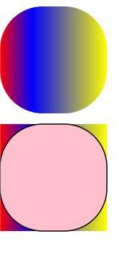

## roundRect<sup>20+</sup>

roundRect(x: number, y: number, w: number, h: number, radii?: number | Array\<number>): void

创建圆角矩形路径，此方法不会直接渲染内容，如需将圆角矩形绘制到画布上，可以使用fill或stroke方法。

**卡片能力：** 从API version 20开始，该接口支持在ArkTS卡片中使用。

**原子化服务API：** 从API version 20开始，该接口支持在原子化服务中使用。

**模型约束：** 此接口仅可在Stage模型下使用。

**系统能力：** SystemCapability.ArkUI.ArkUI.Full

**参数：**

<!--Table: 10%; 10%; 10%; 70%-->
| 参数名   | 类型     | 必填   | 说明            |
| ---- | ------ | ---- | ------------- |
| x    | number | 是    | 指定矩形的左上角x坐标值。<br>null按0处理，undefined按无效值处理，不进行绘制。<br>如需绘制完整矩形，取值范围：[0, Canvas宽度)。<br>默认单位：vp |
| y    | number | 是    | 指定矩形的左上角y坐标值。<br>null按0处理，undefined按无效值处理，不进行绘制。<br>如需绘制完整矩形，取值范围：[0, Canvas高度)。<br>默认单位：vp |
| w    | number | 是    | 指定矩形的宽度，设置负值为向左绘制。<br>null按0处理，undefined按无效值处理，不进行绘制。<br>如需绘制完整矩形，取值范围：[-x, Canvas宽度 - x]。<br>默认单位：vp |
| h    | number | 是    | 指定矩形的高度，设置负值为向上绘制。<br>null按0处理，undefined按无效值处理，不进行绘制。<br>如需绘制完整矩形，取值范围：[-y, Canvas高度 - y]。<br>默认单位：vp |
| radii | number \| Array\<number> | 否 | 指定用于矩形角的圆弧半径的数字或列表。<br>参数类型为number时，所有矩形角的圆弧半径按该数字执行。<br>参数类型为Array\<number>时，数目为1-4个按下面执行：<br>1. [所有矩形角的圆弧半径]<br>2. [左上及右下矩形角的圆弧半径, 右上及左下矩形角的圆弧半径]<br>3. [左上矩形角的圆弧半径, 右上及左下矩形角的圆弧半径, 右下矩形角的圆弧半径]<br>4. [左上矩形角的圆弧半径, 右上矩形角的圆弧半径, 右下矩形角的圆弧半径, 左下矩形角的圆弧半径]<br>radii存在负数或列表的数目不在[1,4]内时抛出异常，错误码：103701。<br>默认值：0，null和undefined按默认值处理。<br>圆弧半径超过矩形宽高时会等比例缩放到宽高的长度。<br>默认单位：vp |

**错误码：**

以下错误码的详细介绍请参见[Canvas组件错误码](../errorcode-canvas.md)。

| 错误码ID | 错误信息 | 可能原因 |
| -------- | -------- | -------- |
| 103701   | Parameter error.| 1. The param radii is a list that has zero or more than four elements; 2. The param radii contains negative value. |

**示例：**

该示例展示了绘制六个圆角矩形：

1. 创建一个(10vp, 10vp)为起点，宽高为100vp，四个矩形角圆弧半径为10vp的圆角矩形并填充；

2. 创建一个(120vp, 10vp)为起点，宽高为100vp，四个矩形角圆弧半径为10vp的圆角矩形并填充；

3. 创建一个(10vp, 120vp)为起点，宽高为100vp，左上矩形角圆弧半径及右下矩形角圆弧半径为10vp，右上矩形角圆弧半径及左下矩形角圆弧半径为20vp的圆角矩形并描边；

4. 创建一个(120vp, 120vp)为起点，宽高为100vp，左上矩形角圆弧半径为10vp，右上矩形角圆弧半径及左下矩形角圆弧半径为20vp，右下矩形角圆弧半径为30vp的圆角矩形并描边；

5. 创建一个(10vp, 230vp)为起点，宽高为100vp，左上矩形角圆弧半径为10vp，右上矩形角圆弧半径为20vp，右下矩形角圆弧半径为30vp，左下矩形角圆弧半径为40vp的圆角矩形并描边；

6. 创建一个(220vp, 330vp)为起点，宽高为-100vp，左上矩形角圆弧半径为10vp，右上矩形角圆弧半径为20vp，右下矩形角圆弧半径为30vp，左下矩形角圆弧半径为40vp的圆角矩形并描边。

  ```ts
  // xxx.ets
  import { BusinessError } from '@kit.BasicServicesKit';

  @Entry
  @Component
  struct CanvasExample {
    private settings: RenderingContextSettings = new RenderingContextSettings(true);
    private context: CanvasRenderingContext2D = new CanvasRenderingContext2D(this.settings);
    private offCanvas: OffscreenCanvas = new OffscreenCanvas(600, 600);

    build() {
      Flex({ direction: FlexDirection.Column, alignItems: ItemAlign.Center, justifyContent: FlexAlign.Center }) {
        Canvas(this.context)
          .width('100%')
          .height('100%')
          .backgroundColor('#D5D5D5')
          .onReady(() => {
            let offContext = this.offCanvas.getContext("2d", this.settings)
            try {
              offContext.fillStyle = '#707070'
              offContext.beginPath()
              // 创建一个(10vp, 10vp)为起点，宽高为100vp，四个矩形角圆弧半径为10vp的圆角矩形
              offContext.roundRect(10, 10, 100, 100, 10)
              // 创建一个(120vp, 10vp)为起点，宽高为100vp，四个矩形角圆弧半径为10vp的圆角矩形
              offContext.roundRect(120, 10, 100, 100, [10])
              offContext.fill()
              offContext.beginPath()
              // 创建一个(10vp, 120vp)为起点，宽高为100vp，左上矩形角圆弧半径及右下矩形角圆弧半径为10vp，右上矩形角圆弧半径及左下矩形角圆弧半径为20vp的圆角矩形
              offContext.roundRect(10, 120, 100, 100, [10, 20])
              // 创建一个(120vp, 120vp)为起点，宽高为100vp，左上矩形角圆弧半径为10vp，右上矩形角圆弧半径及左下矩形角圆弧半径为20vp，右下矩形角圆弧半径为30vp的圆角矩形
              offContext.roundRect(120, 120, 100, 100, [10, 20, 30])
              // 创建一个(10vp, 230vp)为起点，宽高为100vp，左上矩形角圆弧半径为10vp，右上矩形角圆弧半径为20vp，右下矩形角圆弧半径为30vp，左下矩形角圆弧半径为40vp的圆角矩形
              offContext.roundRect(10, 230, 100, 100, [10, 20, 30, 40])
              // 创建一个(220vp, 330vp)为起点，宽高为-100vp，左上矩形角圆弧半径为10vp，右上矩形角圆弧半径为20vp，右下矩形角圆弧半径为30vp，左下矩形角圆弧半径为40vp的圆角矩形
              offContext.roundRect(220, 330, -100, -100, [10, 20, 30, 40])
              offContext.stroke()
            } catch (error) {
              let e: BusinessError = error as BusinessError;
              console.error(`Failed to create roundRect. Code: ${e.code}, message: ${e.message}`);
            }
            // 在离屏画布最近渲染的图像上创建一个ImageBitmap对象
            let image = this.offCanvas.transferToImageBitmap()
            // 将创建的ImageBitmap对象显示在Canvas画布上
            this.context.transferFromImageBitmap(image)
          })
      }
      .width('100%')
      .height('100%')
    }
  }
  ```

  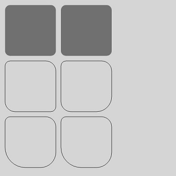

## fill

fill(fillRule?: CanvasFillRule): void

对当前路径进行填充。

**卡片能力：** 从API version 9开始，该接口支持在ArkTS卡片中使用。

**原子化服务API：** 从API version 11开始，该接口支持在原子化服务中使用。

**系统能力：** SystemCapability.ArkUI.ArkUI.Full

**参数:** 

| 参数名 | 类型 | 必填   | 说明 |
| -------- | -------------- | ---- | ---------------------------------------- |
| fillRule | [CanvasFillRule](#canvasfillrule) | 否 | 指定要填充对象的规则。<br/>可选参数为："nonzero"，"evenodd"。<br>异常值undefined或null按默认值处理。<br>默认值："nonzero" |

  ```ts
  // xxx.ets
  @Entry
  @Component
  struct Fill {
    private settings: RenderingContextSettings = new RenderingContextSettings(true);
    private context: CanvasRenderingContext2D = new CanvasRenderingContext2D(this.settings);
    private offCanvas: OffscreenCanvas = new OffscreenCanvas(600, 600);

    build() {
      Flex({ direction: FlexDirection.Column, alignItems: ItemAlign.Center, justifyContent: FlexAlign.Center }) {
        Canvas(this.context)
          .width('100%')
          .height('100%')
          .backgroundColor('#ffff00')
          .onReady(() => {
            let offContext = this.offCanvas.getContext("2d", this.settings)
            offContext.fillStyle = '#000000'
            offContext.rect(20, 20, 100, 100) // Create a 100*100 rectangle at (20, 20)
            offContext.fill()
            let image = this.offCanvas.transferToImageBitmap()
            this.context.transferFromImageBitmap(image)
          })
      }
      .width('100%')
      .height('100%')
    }
  }
  ```

  

## fill

fill(path: Path2D, fillRule?: CanvasFillRule): void

对指定路径进行填充。

**卡片能力：** 从API version 9开始，该接口支持在ArkTS卡片中使用。

**原子化服务API：** 从API version 11开始，该接口支持在原子化服务中使用。

**系统能力：** SystemCapability.ArkUI.ArkUI.Full

**参数:** 

| 参数名       | 类型 | 必填 | 说明 |
| -------- | -------------- | ---- | ----------------- |
| path     | [Path2D](ts-components-canvas-path2d.md)         | 是   | Path2D填充路径。<br>异常值undefined或null按无效值处理。 |
| fillRule | [CanvasFillRule](#canvasfillrule) | 否 | 指定要填充对象的规则。<br/>可选参数为："nonzero"，"evenodd"。<br>异常值undefined或null按默认值处理。<br>默认值："nonzero" |

**示例:**   

```ts
// xxx.ets
@Entry
@Component
struct Fill {
  private settings: RenderingContextSettings = new RenderingContextSettings(true);
  private context: CanvasRenderingContext2D = new CanvasRenderingContext2D(this.settings);
  private offCanvas: OffscreenCanvas = new OffscreenCanvas(600, 600);

  build() {
    Flex({ direction: FlexDirection.Column, alignItems: ItemAlign.Center, justifyContent: FlexAlign.Center }) {
      Canvas(this.context)
        .width('100%')
        .height('100%')
        .backgroundColor('#ffff00')
        .onReady(() => {
          let offContext = this.offCanvas.getContext("2d", this.settings)
          let region = new Path2D()
          region.moveTo(30, 90)
          region.lineTo(110, 20)
          region.lineTo(240, 130)
          region.lineTo(60, 130)
          region.lineTo(190, 20)
          region.lineTo(270, 90)
          region.closePath()
          // Fill path
          offContext.fillStyle = '#00ff00'
          offContext.fill(region, "evenodd")
          let image = this.offCanvas.transferToImageBitmap()
          this.context.transferFromImageBitmap(image)
        })
    }
    .width('100%')
    .height('100%')
  }
}
```

 

## clip

clip(fillRule?: CanvasFillRule): void

设置当前路径为剪切路径。

**卡片能力：** 从API version 9开始，该接口支持在ArkTS卡片中使用。

**原子化服务API：** 从API version 11开始，该接口支持在原子化服务中使用。

**系统能力：** SystemCapability.ArkUI.ArkUI.Full

**参数:** 

| 参数名 | 类型 | 必填   | 说明 |
| -------- | -------------- | ---- | ---------------------------------------- |
| fillRule | [CanvasFillRule](#canvasfillrule) | 否 | 指定要剪切对象的规则。<br/>可选参数为："nonzero"，"evenodd"。<br>异常值undefined或null按默认值处理。<br>默认值："nonzero" |

 **示例：**

  ```ts
  // xxx.ets
  @Entry
  @Component
  struct Clip {
    private settings: RenderingContextSettings = new RenderingContextSettings(true);
    private context: CanvasRenderingContext2D = new CanvasRenderingContext2D(this.settings);
    private offCanvas: OffscreenCanvas = new OffscreenCanvas(600, 600);

    build() {
      Flex({ direction: FlexDirection.Column, alignItems: ItemAlign.Center, justifyContent: FlexAlign.Center }) {
        Canvas(this.context)
          .width('100%')
          .height('100%')
          .backgroundColor('#ffff00')
          .onReady(() => {
            let offContext = this.offCanvas.getContext("2d", this.settings)
            offContext.rect(0, 0, 100, 200)
            offContext.stroke()
            offContext.clip()
            offContext.fillStyle = "rgb(255,0,0)"
            offContext.fillRect(0, 0, 200, 200)
            let image = this.offCanvas.transferToImageBitmap()
            this.context.transferFromImageBitmap(image)
          })
      }
      .width('100%')
      .height('100%')
    }
  }
  ```

  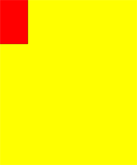

## clip

clip(path: Path2D, fillRule?: CanvasFillRule): void

设置指定路径为剪切路径。

**卡片能力：** 从API version 9开始，该接口支持在ArkTS卡片中使用。

**原子化服务API：** 从API version 11开始，该接口支持在原子化服务中使用。

**系统能力：** SystemCapability.ArkUI.ArkUI.Full

**参数:** 

| 参数名       | 类型 | 必填   | 说明                                       |
| -------- | -------------- | ---- | ---------------------------------------- |
| path | [Path2D](ts-components-canvas-path2d.md) | 是 | Path2D剪切路径。<br>异常值undefined或null按无效值处理。 |
| fillRule | [CanvasFillRule](#canvasfillrule) | 否 | 指定要剪切对象的规则。<br/>可选参数为："nonzero"，"evenodd"。<br>异常值undefined或null按默认值处理。<br>默认值："nonzero" |

 **示例：**

  ```ts
  // xxx.ets
  @Entry
  @Component
  struct Clip {
    private settings: RenderingContextSettings = new RenderingContextSettings(true);
    private context: CanvasRenderingContext2D = new CanvasRenderingContext2D(this.settings);
    private offCanvas: OffscreenCanvas = new OffscreenCanvas(600, 600);

    build() {
      Flex({ direction: FlexDirection.Column, alignItems: ItemAlign.Center, justifyContent: FlexAlign.Center }) {
        Canvas(this.context)
          .width('100%')
          .height('100%')
          .backgroundColor('#ffff00')
          .onReady(() => {
            let offContext = this.offCanvas.getContext("2d", this.settings)
            let region = new Path2D()
            region.moveTo(30, 90)
            region.lineTo(110, 20)
            region.lineTo(240, 130)
            region.lineTo(60, 130)
            region.lineTo(190, 20)
            region.lineTo(270, 90)
            region.closePath()
            offContext.clip(region,"evenodd")
            offContext.fillStyle = "rgb(0,255,0)"
            offContext.fillRect(0, 0, 600, 600)
            let image = this.offCanvas.transferToImageBitmap()
            this.context.transferFromImageBitmap(image)
          })
      }
      .width('100%')
      .height('100%')
    }
  }
  ```

  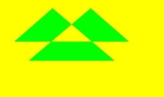


## reset<sup>12+</sup>

reset(): void

将OffscreenCanvasRenderingContext2D重置为其默认状态，清除后台缓冲区、绘制状态栈、绘制路径和样式。

**原子化服务API：** 从API version 12开始，该接口支持在原子化服务中使用。

**模型约束：** 此接口仅可在Stage模型下使用。

**系统能力：** SystemCapability.ArkUI.ArkUI.Full

**示例：**

  ```ts
  // xxx.ets
  @Entry
  @Component
  struct Reset {
    private settings: RenderingContextSettings = new RenderingContextSettings(true);
    private context: CanvasRenderingContext2D = new CanvasRenderingContext2D(this.settings);
    private offCanvas: OffscreenCanvas = new OffscreenCanvas(600, 600);

    build() {
      Flex({ direction: FlexDirection.Column, alignItems: ItemAlign.Center, justifyContent: FlexAlign.Center }) {
        Canvas(this.context)
          .width('100%')
          .height('100%')
          .backgroundColor('#ffff00')
          .onReady(() => {
            let offContext = this.offCanvas.getContext("2d", this.settings)
            offContext.fillStyle = '#0000ff'
            offContext.fillRect(20, 20, 150, 100)
            offContext.reset()
            offContext.fillRect(20, 150, 150, 100)
            let image = this.offCanvas.transferToImageBitmap()
            this.context.transferFromImageBitmap(image)
          })
      }
      .width('100%')
      .height('100%')
    }
  }
  ```

  

## saveLayer<sup>12+</sup>

saveLayer(): void

创建一个图层。

**原子化服务API：** 从API version 12开始，该接口支持在原子化服务中使用。

**模型约束：** 此接口仅可在Stage模型下使用。

**系统能力：** SystemCapability.ArkUI.ArkUI.Full

**示例：**

  ```ts
  // xxx.ets
  @Entry
  @Component
  struct saveLayer {
    private settings: RenderingContextSettings = new RenderingContextSettings(true);
    private context: CanvasRenderingContext2D = new CanvasRenderingContext2D(this.settings);
    private offCanvas: OffscreenCanvas = new OffscreenCanvas(600, 600);

    build() {
      Flex({ direction: FlexDirection.Column, alignItems: ItemAlign.Center, justifyContent: FlexAlign.Center }) {
        Canvas(this.context)
          .width('100%')
          .height('100%')
          .backgroundColor('#ffff00')
          .onReady(() => {
            let offContext = this.offCanvas.getContext("2d", this.settings)
            offContext.fillStyle = "#0000ff"
            offContext.fillRect(50, 100, 300, 100)
            offContext.fillStyle = "#00ffff"
            offContext.fillRect(50, 150, 300, 100)
            offContext.globalCompositeOperation = 'destination-over'
            offContext.saveLayer()
            offContext.globalCompositeOperation = 'source-over'
            offContext.fillStyle = "#ff0000"
            offContext.fillRect(100, 50, 100, 300)
            offContext.fillStyle = "#00ff00"
            offContext.fillRect(150, 50, 100, 300)
            offContext.restoreLayer()
            let image = this.offCanvas.transferToImageBitmap()
            this.context.transferFromImageBitmap(image)
          })
      }
      .width('100%')
      .height('100%')
    }
  }
  ```
  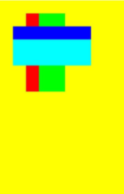

## restoreLayer<sup>12+</sup>

restoreLayer(): void

恢复图像变换和裁剪状态至saveLayer前的状态，并将图层绘制在canvas上。restoreLayer示例同saveLayer。

**原子化服务API：** 从API version 12开始，该接口支持在原子化服务中使用。

**模型约束：** 此接口仅可在Stage模型下使用。

**系统能力：** SystemCapability.ArkUI.ArkUI.Full

## resetTransform
 
resetTransform(): void

使用单位矩阵重新设置当前矩阵。

**卡片能力：** 从API version 9开始，该接口支持在ArkTS卡片中使用。

**原子化服务API：** 从API version 11开始，该接口支持在原子化服务中使用。

**系统能力：** SystemCapability.ArkUI.ArkUI.Full

**示例：**

  ```ts
  // xxx.ets
  @Entry
  @Component
  struct ResetTransform {
    private settings: RenderingContextSettings = new RenderingContextSettings(true);
    private context: CanvasRenderingContext2D = new CanvasRenderingContext2D(this.settings);
    private offCanvas: OffscreenCanvas = new OffscreenCanvas(600, 600);

    build() {
      Flex({ direction: FlexDirection.Column, alignItems: ItemAlign.Center, justifyContent: FlexAlign.Center }) {
        Canvas(this.context)
          .width('100%')
          .height('100%')
          .backgroundColor('#ffff00')
          .onReady(() => {
            let offContext = this.offCanvas.getContext("2d", this.settings)
            offContext.setTransform(1,0.5, -0.5, 1, 10, 10)
            offContext.fillStyle = 'rgb(0,0,255)'
            offContext.fillRect(0, 0, 100, 100)
            offContext.resetTransform()
            offContext.fillStyle = 'rgb(255,0,0)'
            offContext.fillRect(0, 0, 100, 100)
            let image = this.offCanvas.transferToImageBitmap()
            this.context.transferFromImageBitmap(image)
          })
      }
      .width('100%')
      .height('100%')
    }
  }
  ```
  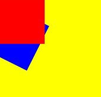

## rotate

rotate(angle: number): void

针对当前坐标轴进行顺时针旋转。

**卡片能力：** 从API version 9开始，该接口支持在ArkTS卡片中使用。

**原子化服务API：** 从API version 11开始，该接口支持在原子化服务中使用。

**系统能力：** SystemCapability.ArkUI.ArkUI.Full

 **参数：**

| 参数名    | 类型     | 必填   | 说明 |
| ----- | ------ | ---- | ---------------------------------------- |
| angle | number | 是    | 设置顺时针旋转的弧度值，可以通过 degree * Math.PI / 180 将角度转换为弧度值。<br>API version 18之前，设置NaN或Infinity时，在该方法后执行的绘制方法无法绘制；设置null或undefined时，当前接口不生效。API version 18及以后，设置NaN、Infinity、null或undefined时当前接口不生效，其他传入有效参数的绘制方法正常绘制。<br>单位：弧度 |

 **示例：**

  ```ts
  // xxx.ets
  @Entry
  @Component
  struct Rotate {
    private settings: RenderingContextSettings = new RenderingContextSettings(true);
    private context: CanvasRenderingContext2D = new CanvasRenderingContext2D(this.settings);
    private offCanvas: OffscreenCanvas = new OffscreenCanvas(600, 600);

    build() {
      Flex({ direction: FlexDirection.Column, alignItems: ItemAlign.Center, justifyContent: FlexAlign.Center }) {
        Canvas(this.context)
          .width('100%')
          .height('100%')
          .backgroundColor('#ffff00')
          .onReady(() => {
            let offContext = this.offCanvas.getContext("2d", this.settings)
            offContext.rotate(45 * Math.PI / 180)
            offContext.fillRect(70, 20, 50, 50)
            let image = this.offCanvas.transferToImageBitmap()
            this.context.transferFromImageBitmap(image)
          })
      }
      .width('100%')
      .height('100%')
    }
  }
  ```

  


## scale

scale(x: number, y: number): void

设置canvas画布的缩放变换属性，后续的绘制操作将按照缩放比例进行缩放。

**卡片能力：** 从API version 9开始，该接口支持在ArkTS卡片中使用。

**原子化服务API：** 从API version 11开始，该接口支持在原子化服务中使用。

**系统能力：** SystemCapability.ArkUI.ArkUI.Full

 **参数：**

| 参数名   | 类型     | 必填   |  说明      |
| ---- | ------ | ---- | ----------- |
| x    | number | 是  | 设置水平方向的缩放值。<br>API version 18之前，设置NaN或Infinity时，在该方法后执行的绘制方法无法绘制；设置null或undefined时，当前接口不生效。API version 18及以后，设置NaN、Infinity、null或undefined时当前接口不生效，其他传入有效参数的绘制方法正常绘制。 |
| y    | number | 是  | 设置垂直方向的缩放值。<br>API version 18之前，设置NaN或Infinity时，在该方法后执行的绘制方法无法绘制；设置null或undefined时，当前接口不生效。API version 18及以后，设置NaN、Infinity、null或undefined时当前接口不生效，其他传入有效参数的绘制方法正常绘制。 |

 **示例：**

  ```ts
  // xxx.ets
  @Entry
  @Component
  struct Scale {
    private settings: RenderingContextSettings = new RenderingContextSettings(true);
    private context: CanvasRenderingContext2D = new CanvasRenderingContext2D(this.settings);
    private offCanvas: OffscreenCanvas = new OffscreenCanvas(600, 600);

    build() {
      Flex({ direction: FlexDirection.Column, alignItems: ItemAlign.Center, justifyContent: FlexAlign.Center }) {
        Canvas(this.context)
          .width('100%')
          .height('100%')
          .backgroundColor('#ffff00')
          .onReady(() => {
            let offContext = this.offCanvas.getContext("2d", this.settings)
            offContext.lineWidth = 3
            offContext.strokeRect(30, 30, 50, 50)
            offContext.scale(2, 2) // Scale to 200%
            offContext.strokeRect(30, 30, 50, 50)
            let image = this.offCanvas.transferToImageBitmap()
            this.context.transferFromImageBitmap(image)
          })
      }
      .width('100%')
      .height('100%')
    }
  }
  ```

  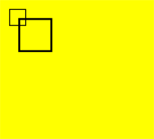


## transform

transform(a: number, b: number, c: number, d: number, e: number, f: number): void

transform方法对应一个变换矩阵，想对一个图形进行变化的时候，只要设置此变换矩阵相应的参数，对图形的各个定点的坐标分别乘以这个矩阵，就能得到新的定点的坐标。矩阵变换效果可叠加。

**卡片能力：** 从API version 9开始，该接口支持在ArkTS卡片中使用。

**原子化服务API：** 从API version 11开始，该接口支持在原子化服务中使用。

**系统能力：** SystemCapability.ArkUI.ArkUI.Full

> **说明：**
>
> 图形中各个点变换后的坐标可通过下方坐标计算公式计算。
>
> 变换后的坐标计算方式（x和y为变换前坐标，x'和y'为变换后坐标）：
>
> - x' = a \* x + c \* y + e
>
> - y' = b \* x + d \* y + f

**参数：**

| 参数名   | 类型     | 必填 | 说明 |
| ---- | ------ | ---- | -------------------- |
| a    | number | 是    | scaleX：指定水平缩放值，支持设置负数。<br>API version 18之前，设置NaN或Infinity时，在该方法后执行的绘制方法无法绘制；设置null或undefined时，当前接口不生效。API version 18及以后，设置NaN、Infinity、null或undefined时当前接口不生效，其他传入有效参数的绘制方法正常绘制。 |
| b    | number | 是    | skewY：指定垂直倾斜值，支持设置负数。<br>API version 18之前，设置NaN或Infinity时，在该方法后执行的绘制方法无法绘制；设置null或undefined时，当前接口不生效。API version 18及以后，设置NaN、Infinity、null或undefined时当前接口不生效，其他传入有效参数的绘制方法正常绘制。  |
| c    | number | 是    | skewX：指定水平倾斜值，支持设置负数。<br>API version 18之前，设置NaN或Infinity时，在该方法后执行的绘制方法无法绘制；设置null或undefined时，当前接口不生效。API version 18及以后，设置NaN、Infinity、null或undefined时当前接口不生效，其他传入有效参数的绘制方法正常绘制。  |
| d    | number | 是    | scaleY：指定垂直缩放值，支持设置负数。<br>API version 18之前，设置NaN或Infinity时，在该方法后执行的绘制方法无法绘制；设置null或undefined时，当前接口不生效。API version 18及以后，设置NaN、Infinity、null或undefined时当前接口不生效，其他传入有效参数的绘制方法正常绘制。 |
| e    | number | 是    | translateX：指定水平移动值，支持设置负数。<br>API version 18之前，设置NaN或Infinity时，在该方法后执行的绘制方法无法绘制；设置null或undefined时，当前接口不生效。API version 18及以后，设置NaN、Infinity、null或undefined时当前接口不生效，其他传入有效参数的绘制方法正常绘制。<br>默认单位：vp |
| f    | number | 是    | translateY：指定垂直移动值，支持设置负数。<br>API version 18之前，设置NaN或Infinity时，在该方法后执行的绘制方法无法绘制；设置null或undefined时，当前接口不生效。API version 18及以后，设置NaN、Infinity、null或undefined时当前接口不生效，其他传入有效参数的绘制方法正常绘制。<br>默认单位：vp |

 **示例：**

  ```ts
  // xxx.ets
  @Entry
  @Component
  struct Transform {
    private settings: RenderingContextSettings = new RenderingContextSettings(true);
    private context: CanvasRenderingContext2D = new CanvasRenderingContext2D(this.settings);
    private offCanvas: OffscreenCanvas = new OffscreenCanvas(600, 600);

    build() {
      Flex({ direction: FlexDirection.Column, alignItems: ItemAlign.Center, justifyContent: FlexAlign.Center }) {
        Canvas(this.context)
          .width('100%')
          .height('100%')
          .backgroundColor('rgb(213,213,213)')
          .onReady(() => {
            let offContext = this.offCanvas.getContext("2d", this.settings)
            offContext.fillStyle = 'rgb(112,112,112)'
            offContext.fillRect(0, 0, 100, 100)
            offContext.transform(1, 0.5, -0.5, 1, 10, 10)
            offContext.fillStyle = 'rgb(0,74,175)'
            offContext.fillRect(0, 0, 100, 100)
            offContext.transform(1, 0.5, -0.5, 1, 10, 10)
            offContext.fillStyle = 'rgb(39,135,217)'
            offContext.fillRect(0, 0, 100, 100)
            let image = this.offCanvas.transferToImageBitmap()
            this.context.transferFromImageBitmap(image)
          })
      }
      .width('100%')
      .height('100%')
    }
  }
  ```

  


## setTransform

setTransform(a: number, b: number, c: number, d: number, e: number, f: number): void

setTransform方法使用的参数和transform()方法相同，但setTransform()方法会重置现有的变换矩阵并创建新的变换矩阵。

**卡片能力：** 从API version 9开始，该接口支持在ArkTS卡片中使用。

**原子化服务API：** 从API version 11开始，该接口支持在原子化服务中使用。

**系统能力：** SystemCapability.ArkUI.ArkUI.Full

> **说明：**
>
> 图形中各个点变换后的坐标可通过下方坐标计算公式计算。
>
> 变换后的坐标计算方式（x和y为变换前坐标，x'和y'为变换后坐标）：
>
> - x' = a \* x + c \* y + e
>
> - y' = b \* x + d \* y + f

**参数：**

<!--Table: 10%; 10%; 10%; 70%-->
| 参数名   | 类型     | 必填 | 说明 |
| ---- | ------ | ---- | -------------------- |
| a    | number | 是    | scaleX：指定水平缩放值，支持设置负数。<br>API version 18之前，设置NaN或Infinity时，在该方法后执行的绘制方法无法绘制；设置null或undefined时，当前接口不生效。API version 18及以后，设置NaN、Infinity、null或undefined时当前接口不生效，其他传入有效参数的绘制方法正常绘制。 |
| b    | number | 是    | skewY：指定垂直倾斜值，支持设置负数。<br>API version 18之前，设置NaN或Infinity时，在该方法后执行的绘制方法无法绘制；设置null或undefined时，当前接口不生效。API version 18及以后，设置NaN、Infinity、null或undefined时当前接口不生效，其他传入有效参数的绘制方法正常绘制。  |
| c    | number | 是    | skewX：指定水平倾斜值，支持设置负数。<br>API version 18之前，设置NaN或Infinity时，在该方法后执行的绘制方法无法绘制；设置null或undefined时，当前接口不生效。API version 18及以后，设置NaN、Infinity、null或undefined时当前接口不生效，其他传入有效参数的绘制方法正常绘制。  |
| d    | number | 是    | scaleY：指定垂直缩放值，支持设置负数。<br>API version 18之前，设置NaN或Infinity时，在该方法后执行的绘制方法无法绘制；设置null或undefined时，当前接口不生效。API version 18及以后，设置NaN、Infinity、null或undefined时当前接口不生效，其他传入有效参数的绘制方法正常绘制。 |
| e    | number | 是    | translateX：指定水平移动值，支持设置负数。<br>API version 18之前，设置NaN或Infinity时，在该方法后执行的绘制方法无法绘制；设置null或undefined时，当前接口不生效。API version 18及以后，设置NaN、Infinity、null或undefined时当前接口不生效，其他传入有效参数的绘制方法正常绘制。<br>默认单位：vp |
| f    | number | 是    | translateY：指定垂直移动值，支持设置负数。<br>API version 18之前，设置NaN或Infinity时，在该方法后执行的绘制方法无法绘制；设置null或undefined时，当前接口不生效。API version 18及以后，设置NaN、Infinity、null或undefined时当前接口不生效，其他传入有效参数的绘制方法正常绘制。<br>默认单位：vp |

 **示例：**

  ```ts
  // xxx.ets
  @Entry
  @Component
  struct SetTransform {
    private settings: RenderingContextSettings = new RenderingContextSettings(true);
    private context: CanvasRenderingContext2D = new CanvasRenderingContext2D(this.settings);
    private offCanvas: OffscreenCanvas = new OffscreenCanvas(600, 600);

    build() {
      Flex({ direction: FlexDirection.Column, alignItems: ItemAlign.Center, justifyContent: FlexAlign.Center }) {
        Canvas(this.context)
          .width('100%')
          .height('100%')
          .backgroundColor('#ffff00')
          .onReady(() => {
            let offContext = this.offCanvas.getContext("2d", this.settings)
            offContext.fillStyle = 'rgb(255,0,0)'
            offContext.fillRect(0, 0, 100, 100)
            offContext.setTransform(1,0.5, -0.5, 1, 10, 10)
            offContext.fillStyle = 'rgb(0,0,255)'
            offContext.fillRect(0, 0, 100, 100)
            let image = this.offCanvas.transferToImageBitmap()
            this.context.transferFromImageBitmap(image)
          })
      }
      .width('100%')
      .height('100%')
    }
  }
  ```

  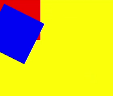

## setTransform

setTransform(transform?: Matrix2D): void

以Matrix2D对象为模板重置现有的变换矩阵并创建新的变换矩阵。

**卡片能力：** 从API version 9开始，该接口支持在ArkTS卡片中使用。

**原子化服务API：** 从API version 11开始，该接口支持在原子化服务中使用。

**系统能力：** SystemCapability.ArkUI.ArkUI.Full

**参数：**

| 参数名       | 类型 | 必填   | 说明    |
| --------- | ---------------------------------------- | ---- | ----- |
| transform | [Matrix2D](ts-components-canvas-matrix2d.md) | 否 | 变换矩阵。<br>异常值undefined或null按无效值处理。<br>默认值：null |

**示例：**
 ```ts
 // xxx.ets
  @Entry
  @Component
  struct TransFormDemo {
    private settings: RenderingContextSettings = new RenderingContextSettings(true);
    private context1: CanvasRenderingContext2D = new CanvasRenderingContext2D(this.settings);
    private offcontext1: OffscreenCanvasRenderingContext2D = new OffscreenCanvasRenderingContext2D(600, 200, this.settings);
    private context2: CanvasRenderingContext2D = new CanvasRenderingContext2D(this.settings);
    private offcontext2: OffscreenCanvasRenderingContext2D = new OffscreenCanvasRenderingContext2D(600, 200, this.settings);

    build() {
      Flex({ direction: FlexDirection.Column, alignItems: ItemAlign.Center, justifyContent: FlexAlign.Center }) {
        Text('context1');
        Canvas(this.context1)
          .width('230vp')
          .height('160vp')
          .backgroundColor('#ffff00')
          .onReady(() => {
            this.offcontext1.fillRect(100, 20, 50, 50);
            this.offcontext1.setTransform(1, 0.5, -0.5, 1, 10, 10);
            this.offcontext1.fillRect(100, 20, 50, 50);
            let image = this.offcontext1.transferToImageBitmap();
            this.context1.transferFromImageBitmap(image);
          })
        Text('context2');
        Canvas(this.context2)
          .width('230vp')
          .height('160vp')
          .backgroundColor('#0ffff0')
          .onReady(() => {
            this.offcontext2.fillRect(100, 20, 50, 50);
            let storedTransform = this.offcontext1.getTransform();
            this.offcontext2.setTransform(storedTransform);
            this.offcontext2.fillRect(100, 20, 50, 50);
            let image = this.offcontext2.transferToImageBitmap();
            this.context2.transferFromImageBitmap(image);
          })
      }
      .width('100%')
      .height('100%')
    }
  }
 ```
 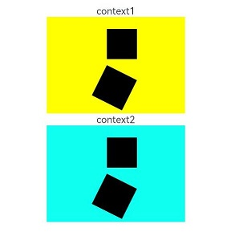

## getTransform

getTransform(): Matrix2D

获取当前被应用到上下文的转换矩阵。

**卡片能力：** 从API version 9开始，该接口支持在ArkTS卡片中使用。

**原子化服务API：** 从API version 11开始，该接口支持在原子化服务中使用。

**系统能力：** SystemCapability.ArkUI.ArkUI.Full

**返回值：**

| 类型                                       | 说明    |
| ---------------------------------------- | ----- |
| [Matrix2D](ts-components-canvas-matrix2d.md) | 当前被应用到上下文的转换矩阵。 |

**示例：**

  ```ts
  // xxx.ets
  @Entry
  @Component
  struct TransFormDemo {
    private settings: RenderingContextSettings = new RenderingContextSettings(true);
    private context1: CanvasRenderingContext2D = new CanvasRenderingContext2D(this.settings);
    private offcontext1: OffscreenCanvasRenderingContext2D =
      new OffscreenCanvasRenderingContext2D(600, 100, this.settings);
    private context2: CanvasRenderingContext2D = new CanvasRenderingContext2D(this.settings);
    private offcontext2: OffscreenCanvasRenderingContext2D =
      new OffscreenCanvasRenderingContext2D(600, 100, this.settings);

    build() {
      Flex({ direction: FlexDirection.Column, alignItems: ItemAlign.Center, justifyContent: FlexAlign.Center }) {
        Text('context1');
        Canvas(this.context1)
          .width('230vp')
          .height('120vp')
          .backgroundColor('#ffff00')
          .onReady(() => {
            this.offcontext1.fillRect(50, 50, 50, 50);
            this.offcontext1.setTransform(1.2, Math.PI / 8, Math.PI / 6, 0.5, 30, -25);
            this.offcontext1.fillRect(50, 50, 50, 50);
            let image = this.offcontext1.transferToImageBitmap();
            this.context1.transferFromImageBitmap(image);
          })
        Text('context2');
        Canvas(this.context2)
          .width('230vp')
          .height('120vp')
          .backgroundColor('#0ffff0')
          .onReady(() => {
            this.offcontext2.fillRect(50, 50, 50, 50);
            let storedTransform = this.offcontext1.getTransform();
            console.info(`Matrix [scaleX = ${storedTransform.scaleX}, scaleY = ${storedTransform.scaleY}, rotateX = ${storedTransform.rotateX}, rotateY = ${storedTransform.rotateY}, translateX = ${storedTransform.translateX}, translateY = ${storedTransform.translateY}]`)
            this.offcontext2.setTransform(storedTransform);
            this.offcontext2.fillRect(50, 50, 50, 50);
            let image = this.offcontext2.transferToImageBitmap();
            this.context2.transferFromImageBitmap(image);
          })
      }
      .width('100%')
      .height('100%')
    }
  }
  ```

  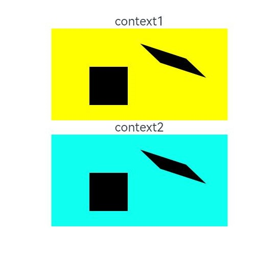

## translate

translate(x: number, y: number): void

移动当前坐标系的原点。

**卡片能力：** 从API version 9开始，该接口支持在ArkTS卡片中使用。

**原子化服务API：** 从API version 11开始，该接口支持在原子化服务中使用。

**系统能力：** SystemCapability.ArkUI.ArkUI.Full

 **参数：**

<!--Table: 10%; 10%; 10%; 70%-->
| 参数名   | 类型     | 必填   | 说明 |
| ---- | ------ | ---- | -------- |
| x    | number | 是  | 设置水平平移量。<br>API version 18之前，设置NaN或Infinity时，在该方法后执行的绘制方法无法绘制；设置null或undefined时，当前接口不生效。API version 18及以后，设置NaN、Infinity、null或undefined时当前接口不生效，其他传入有效参数的绘制方法正常绘制。<br>默认单位：vp |
| y    | number | 是  | 设置垂直平移量。<br>API version 18之前，设置NaN或Infinity时，在该方法后执行的绘制方法无法绘制；设置null或undefined时，当前接口不生效。API version 18及以后，设置NaN、Infinity、null或undefined时当前接口不生效，其他传入有效参数的绘制方法正常绘制。<br>默认单位：vp |

 **示例：**

  ```ts
  // xxx.ets
  @Entry
  @Component
  struct Translate {
    private settings: RenderingContextSettings = new RenderingContextSettings(true);
    private context: CanvasRenderingContext2D = new CanvasRenderingContext2D(this.settings);
    private offCanvas: OffscreenCanvas = new OffscreenCanvas(600, 600);

    build() {
      Flex({ direction: FlexDirection.Column, alignItems: ItemAlign.Center, justifyContent: FlexAlign.Center }) {
        Canvas(this.context)
          .width('100%')
          .height('100%')
          .backgroundColor('#ffff00')
          .onReady(() => {
            let offContext = this.offCanvas.getContext("2d", this.settings)
            offContext.fillRect(10, 10, 50, 50)
            offContext.translate(70, 70)
            offContext.fillRect(10, 10, 50, 50)
            let image = this.offCanvas.transferToImageBitmap()
            this.context.transferFromImageBitmap(image)
          })
      }
      .width('100%')
      .height('100%')
    }
  }
  ```

  


## drawImage

drawImage(image: ImageBitmap | PixelMap, dx: number, dy: number): void

进行图像绘制。

**卡片能力：** 从API version 9开始，该接口支持在ArkTS卡片中使用，卡片中不支持PixelMap对象。

**原子化服务API：** 从API version 11开始，该接口支持在原子化服务中使用。

**系统能力：** SystemCapability.ArkUI.ArkUI.Full

 **参数：**

<!--Table: 10%; 10%; 10%; 70%-->
| 参数名    | 类型 | 必填   | 说明 |
| ----- | ---------------------------------------- | ---- | ----------------------------- |
| image | [ImageBitmap](ts-components-canvas-imagebitmap.md) \| [PixelMap](../../apis-image-kit/arkts-apis-image-PixelMap.md) | 是 | 图片资源，请参考ImageBitmap或PixelMap。<br>异常值undefined或null按无效值处理，不进行绘制。 |
| dx    | number | 是  | 绘制区域左上角在x轴的位置。<br>异常值undefined或null按0处理，NaN和Infinity按无效值处理，不进行绘制。<br>默认单位：vp |
| dy    | number | 是  | 绘制区域左上角在y轴的位置。<br>异常值undefined或null按0处理，NaN和Infinity按无效值处理，不进行绘制。<br>默认单位：vp |

 **示例：**

> **说明：**
>
> 此示例的资源不在src > main > resource目录下，从DevEco Studio 6.0.0 Beta2版本开始，新建工程或模块时，默认创建的模块不会对非resources目录下的资源进行打包，需使能相关开关：模块的build-profile.json5中buildOption > resOptions > copyCodeResource > enable设置为true，详见resOptions中[copyCodeResource](https://developer.huawei.com/consumer/cn/doc/harmonyos-guides/ide-hvigor-build-profile#section754823013348)相关介绍。

  ```ts
  // xxx.ets
  @Entry
  @Component
  struct DrawImage {
    private settings: RenderingContextSettings = new RenderingContextSettings(true);
    private context: CanvasRenderingContext2D = new CanvasRenderingContext2D(this.settings);
    // "common/images/example.jpg"需要替换为开发者所需的图像资源文件
    private img: ImageBitmap = new ImageBitmap("common/images/example.jpg");
    private offCanvas: OffscreenCanvas = new OffscreenCanvas(600, 600);

    build() {
      Flex({ direction: FlexDirection.Column, alignItems: ItemAlign.Center, justifyContent: FlexAlign.Center }) {
        Canvas(this.context)
          .width('100%')
          .height('100%')
          .backgroundColor('#D5D5D5')
          .onReady(() => {
            let offContext = this.offCanvas.getContext("2d", this.settings)
            offContext.drawImage(this.img, 0, 0)
            let image = this.offCanvas.transferToImageBitmap()
            this.context.transferFromImageBitmap(image)
          })
      }
      .width('100%')
      .height('100%')
    }
  }
  ```

  

## drawImage

drawImage(image: ImageBitmap | PixelMap, dx: number, dy: number, dw: number, dh: number): void

将图像拉伸或压缩绘制。

**卡片能力：** 从API version 9开始，该接口支持在ArkTS卡片中使用，卡片中不支持PixelMap对象。

**原子化服务API：** 从API version 11开始，该接口支持在原子化服务中使用。

**系统能力：** SystemCapability.ArkUI.ArkUI.Full

 **参数：**

| 参数名    | 类型 | 必填   | 说明 |
| ----- | ---------------------------------------- | ---- | ----------------------------- |
| image | [ImageBitmap](ts-components-canvas-imagebitmap.md) \| [PixelMap](../../apis-image-kit/arkts-apis-image-PixelMap.md) | 是 | 图片资源，请参考ImageBitmap或PixelMap。<br>异常值undefined或null按无效值处理，不进行绘制。 |
| dx    | number | 是  | 绘制区域左上角在x轴的位置。<br>异常值undefined或null按0处理，NaN和Infinity按无效值处理，不进行绘制。<br>默认单位：vp |
| dy    | number | 是  | 绘制区域左上角在y轴的位置。<br>异常值undefined或null按0处理，NaN和Infinity按无效值处理，不进行绘制。<br>默认单位：vp |
| dw    | number | 是  | 绘制区域的宽度。<br>负数、异常值undefined或null按0处理，NaN和Infinity按无效值处理，不进行绘制。<br>默认单位：vp |
| dh    | number | 是  | 绘制区域的高度。<br>负数、异常值undefined或null按0处理，NaN和Infinity按无效值处理，不进行绘制。<br>默认单位：vp |

 **示例：**

> **说明：**
>
> 此示例的资源不在src > main > resource目录下，从DevEco Studio 6.0.0 Beta2版本开始，新建工程或模块时，默认创建的模块不会对非resources目录下的资源进行打包，需使能相关开关：模块的build-profile.json5中buildOption > resOptions > copyCodeResource > enable设置为true，详见resOptions中[copyCodeResource](https://developer.huawei.com/consumer/cn/doc/harmonyos-guides/ide-hvigor-build-profile#section754823013348)相关介绍。

  ```ts
  // xxx.ets
  @Entry
  @Component
  struct DrawImage {
    private settings: RenderingContextSettings = new RenderingContextSettings(true);
    private context: CanvasRenderingContext2D = new CanvasRenderingContext2D(this.settings);
    // "common/images/example.jpg"需要替换为开发者所需的图像资源文件
    private img: ImageBitmap = new ImageBitmap("common/images/example.jpg");
    private offCanvas: OffscreenCanvas = new OffscreenCanvas(600, 600);

    build() {
      Flex({ direction: FlexDirection.Column, alignItems: ItemAlign.Center, justifyContent: FlexAlign.Center }) {
        Canvas(this.context)
          .width('100%')
          .height('100%')
          .backgroundColor('#D5D5D5')
          .onReady(() => {
            let offContext = this.offCanvas.getContext("2d", this.settings)
            offContext.drawImage(this.img, 0, 0, 300, 300)
            let image = this.offCanvas.transferToImageBitmap()
            this.context.transferFromImageBitmap(image)
          })
      }
      .width('100%')
      .height('100%')
    }
  }
  ```

  

## drawImage

drawImage(image: ImageBitmap | PixelMap, sx: number, sy: number, sw: number, sh: number, dx: number, dy: number, dw: number, dh: number): void

将图像裁剪后拉伸或压缩绘制。

**卡片能力：** 从API version 9开始，该接口支持在ArkTS卡片中使用，卡片中不支持PixelMap对象。

**原子化服务API：** 从API version 11开始，该接口支持在原子化服务中使用。

**系统能力：** SystemCapability.ArkUI.ArkUI.Full

 **参数：**

| 参数名    | 类型 | 必填   | 说明 |
| ----- | ---------------------------------------- | ---- | ----------------------------- |
| image | [ImageBitmap](ts-components-canvas-imagebitmap.md) \| [PixelMap](../../apis-image-kit/arkts-apis-image-PixelMap.md) | 是 | 图片资源，请参考ImageBitmap或PixelMap。<br>异常值undefined或null按无效值处理，不进行绘制。 |
| sx    | number | 是  | 裁切源图像时距离源图像左上角的x坐标值。<br>异常值undefined或null按0处理，NaN和Infinity按无效值处理，不进行绘制。<br>image类型为ImageBitmap时，默认单位：vp<br>image类型为PixelMap时，API version 18前，默认单位：px；API version 18及以后，默认单位：vp |
| sy    | number | 是  | 裁切源图像时距离源图像左上角的y坐标值。<br>异常值undefined或null按0处理，NaN和Infinity按无效值处理，不进行绘制。<br>image类型为ImageBitmap时，默认单位：vp<br>image类型为PixelMap时，API version 18前，默认单位：px；API version 18及以后，默认单位：vp |
| sw    | number | 是  | 裁切源图像时需要裁切的宽度。<br>负数、异常值undefined或null按0处理，NaN和Infinity按无效值处理，不进行绘制。<br>image类型为ImageBitmap时，默认单位：vp<br>image类型为PixelMap时，API version 18前，默认单位：px；API version 18及以后，默认单位：vp |
| sh    | number | 是  | 裁切源图像时需要裁切的高度。<br>负数、异常值undefined或null按0处理，NaN和Infinity按无效值处理，不进行绘制。<br>image类型为ImageBitmap时，默认单位：vp<br>image类型为PixelMap时，API version 18前，默认单位：px；API version 18及以后，默认单位：vp |
| dx    | number | 是  | 绘制区域左上角在x轴的位置。<br>异常值undefined或null按0处理，NaN和Infinity按无效值处理，不进行绘制。<br>默认单位：vp |
| dy    | number | 是  | 绘制区域左上角在y轴的位置。<br>异常值undefined或null按0处理，NaN和Infinity按无效值处理，不进行绘制。<br>默认单位：vp |
| dw    | number | 是  | 绘制区域的宽度。<br>负数、异常值undefined或null按0处理，NaN和Infinity按无效值处理，不进行绘制。<br>默认单位：vp |
| dh    | number | 是  | 绘制区域的高度。<br>负数、异常值undefined或null按0处理，NaN和Infinity按无效值处理，不进行绘制。<br>默认单位：vp |

 **示例：**

> **说明：**
>
> 此示例的资源不在src > main > resource目录下，从DevEco Studio 6.0.0 Beta2版本开始，新建工程或模块时，默认创建的模块不会对非resources目录下的资源进行打包，需使能相关开关：模块的build-profile.json5中buildOption > resOptions > copyCodeResource > enable设置为true，详见resOptions中[copyCodeResource](https://developer.huawei.com/consumer/cn/doc/harmonyos-guides/ide-hvigor-build-profile#section754823013348)相关介绍。

  ```ts
  // xxx.ets
  @Entry
  @Component
  struct DrawImage {
    private settings: RenderingContextSettings = new RenderingContextSettings(true);
    private context: CanvasRenderingContext2D = new CanvasRenderingContext2D(this.settings);
    // "common/images/example.jpg"需要替换为开发者所需的图像资源文件
    private img: ImageBitmap = new ImageBitmap("common/images/example.jpg");
    private offCanvas: OffscreenCanvas = new OffscreenCanvas(600, 600);

    build() {
      Flex({ direction: FlexDirection.Column, alignItems: ItemAlign.Center, justifyContent: FlexAlign.Center }) {
        Canvas(this.context)
          .width('100%')
          .height('100%')
          .backgroundColor('#D5D5D5')
          .onReady(() => {
            let offContext = this.offCanvas.getContext("2d", this.settings)
            offContext.drawImage(this.img, 0, 0, 500, 500, 0, 0, 400, 300)
            let image = this.offCanvas.transferToImageBitmap()
            this.context.transferFromImageBitmap(image)
          })
      }
      .width('100%')
      .height('100%')
    }
  }
  ```

  

## createImageData

createImageData(sw: number, sh: number): ImageData

根据当前ImageData对象重新创建一个宽、高相同的ImageData对象，请参考[ImageData](ts-components-canvas-imagedata.md)，该接口存在内存拷贝行为，高耗时，应避免频繁使用。createImageData示例同putImageData。

**卡片能力：** 从API version 9开始，该接口支持在ArkTS卡片中使用。

**原子化服务API：** 从API version 11开始，该接口支持在原子化服务中使用。

**系统能力：** SystemCapability.ArkUI.ArkUI.Full

 **参数：**

| 参数名   | 类型     | 必填     | 说明   |
| ---- | ------ | ---- | ------------- |
| sw   | number | 是   | ImageData的宽度。<br>异常值undefined、null、NaN和Infinity按0处理。<br>默认单位：vp |
| sh   | number | 是   | ImageData的高度。<br>异常值undefined、null、NaN和Infinity按0处理。<br>默认单位：vp |

 **返回值：**

| 类型                                       | 说明            |
| ---------------------------------------- | ------------- |
| [ImageData](ts-components-canvas-imagedata.md) | 新的ImageData对象。 |

## createImageData

createImageData(imageData: ImageData): ImageData

根据已创建的ImageData对象创建新的ImageData对象（不会复制图像数据），请参考[ImageData](ts-components-canvas-imagedata.md)，该接口存在内存拷贝行为，高耗时，应避免频繁使用。createImageData示例同putImageData。

**卡片能力：** 从API version 9开始，该接口支持在ArkTS卡片中使用。

**原子化服务API：** 从API version 11开始，该接口支持在原子化服务中使用。

**系统能力：** SystemCapability.ArkUI.ArkUI.Full

 **参数：**

| 参数名       | 类型 | 必填   | 说明 |
| --------- | ---------------------------------------- | ---- | ---------------- |
| imageData | [ImageData](ts-components-canvas-imagedata.md) | 是  | 被复制的ImageData对象。<br>异常值undefined和null按width和height为0的ImageData处理。 |

 **返回值：**

| 类型                                       | 说明            |
| ---------------------------------------- | ------------- |
| [ImageData](ts-components-canvas-imagedata.md) | 新的ImageData对象。 |

## getPixelMap

getPixelMap(sx: number, sy: number, sw: number, sh: number): PixelMap

以当前canvas指定区域内的像素创建[PixelMap](../../apis-image-kit/arkts-apis-image-PixelMap.md)对象，该接口存在内存拷贝行为，高耗时，应避免频繁使用。

**原子化服务API：** 从API version 11开始，该接口支持在原子化服务中使用。

**系统能力：** SystemCapability.ArkUI.ArkUI.Full

 **参数：**

| 参数名   | 类型     | 必填  | 说明            |
| ---- | ------ | ---- | --------------- |
| sx   | number | 是  | 需要输出的区域的左上角x坐标。<br>异常值undefined、null、NaN和Infinity按0处理。<br>默认单位：vp |
| sy   | number | 是  | 需要输出的区域的左上角y坐标。<br>异常值undefined、null、NaN和Infinity按0处理。<br>默认单位：vp |
| sw   | number | 是  | 需要输出的区域的宽度。<br>异常值undefined、null、NaN和Infinity按0处理。<br>默认单位：vp |
| sh   | number | 是  | 需要输出的区域的高度。<br>异常值undefined、null、NaN和Infinity按0处理。<br>默认单位：vp |

**返回值：**

| 类型                                       | 说明           |
| ---------------------------------------- | ------------ |
| [PixelMap](../../apis-image-kit/arkts-apis-image-PixelMap.md) | 新的PixelMap对象。 |

**示例：**

> **说明：**
>
> - DevEco Studio的预览器不支持显示使用setPixelMap绘制的内容。
>
> - 此示例的资源不在src > main > resource目录下，从DevEco Studio 6.0.0 Beta2版本开始，新建工程或模块时，默认创建的模块不会对非resources目录下的资源进行打包，需使能相关开关：模块的build-profile.json5中buildOption > resOptions > copyCodeResource > enable设置为true，详见resOptions中[copyCodeResource](https://developer.huawei.com/consumer/cn/doc/harmonyos-guides/ide-hvigor-build-profile#section754823013348)相关介绍。


  ```ts
  // xxx.ets
  @Entry
  @Component
  struct GetPixelMap {
    private settings: RenderingContextSettings = new RenderingContextSettings(true);
    private context: CanvasRenderingContext2D = new CanvasRenderingContext2D(this.settings);
    // "common/images/example.jpg"需要替换为开发者所需的图像资源文件
    private img: ImageBitmap = new ImageBitmap("common/images/example.jpg");
    private offCanvas: OffscreenCanvas = new OffscreenCanvas(600, 600);

    build() {
      Flex({ direction: FlexDirection.Column, alignItems: ItemAlign.Center, justifyContent: FlexAlign.Center }) {
        Canvas(this.context)
          .width('100%')
          .height('100%')
          .backgroundColor('#ffff00')
          .onReady(() => {
            let offContext = this.offCanvas.getContext("2d", this.settings)
            offContext.drawImage(this.img, 100, 100, 130, 130)
            let pixelmap = offContext.getPixelMap(150, 150, 130, 130)
            offContext.setPixelMap(pixelmap)
            let image = this.offCanvas.transferToImageBitmap()
            this.context.transferFromImageBitmap(image)
          })
      }
      .width('100%')
      .height('100%')
    }
  }
  ```

  

## setPixelMap

setPixelMap(value?: PixelMap): void

将当前传入[PixelMap](../../apis-image-kit/arkts-apis-image-PixelMap.md)对象绘制在画布上。setPixelMap示例同getPixelMap。

**原子化服务API：** 从API version 11开始，该接口支持在原子化服务中使用。

**系统能力：** SystemCapability.ArkUI.ArkUI.Full

 **参数：**

| 参数名   | 类型     | 必填   | 说明 |
| ---- | ------ | ---- | --------------- |
|  value  | [PixelMap](../../apis-image-kit/arkts-apis-image-PixelMap.md) | 否 | 包含像素值的PixelMap对象。<br>异常值undefined和null按无效值处理，不进行绘制。<br>默认值：null |


## getImageData

getImageData(sx: number, sy: number, sw: number, sh: number): ImageData

以当前canvas指定区域内的像素创建[ImageData](ts-components-canvas-imagedata.md)对象，该接口存在内存拷贝行为，高耗时，应避免频繁使用。

**卡片能力：** 从API version 9开始，该接口支持在ArkTS卡片中使用。

**原子化服务API：** 从API version 11开始，该接口支持在原子化服务中使用。

**系统能力：** SystemCapability.ArkUI.ArkUI.Full

 **参数：**

| 参数名   | 类型     | 必填 | 说明      |
| ---- | ------ | ---- | --------------- |
| sx   | number | 是 | 需要输出的区域的左上角x坐标。<br>异常值undefined、null、NaN和Infinity按0处理。<br>默认单位：vp |
| sy   | number | 是 | 需要输出的区域的左上角y坐标。<br>异常值undefined、null、NaN和Infinity按0处理。<br>默认单位：vp |
| sw   | number | 是 | 需要输出的区域的宽度。<br>异常值undefined、null、NaN和Infinity按0处理。<br>默认单位：vp |
| sh   | number | 是 | 需要输出的区域的高度。<br>异常值undefined、null、NaN和Infinity按0处理。<br>默认单位：vp |

   **返回值：**

| 类型                                       | 说明            |
| ---------------------------------------- | ------------- |
| [ImageData](ts-components-canvas-imagedata.md) | 新的ImageData对象。 |


**示例：**

> **说明：**
>
> 此示例的资源不在src > main > resource目录下，从DevEco Studio 6.0.0 Beta2版本开始，新建工程或模块时，默认创建的模块不会对非resources目录下的资源进行打包，需使能相关开关：模块的build-profile.json5中buildOption > resOptions > copyCodeResource > enable设置为true，详见resOptions中[copyCodeResource](https://developer.huawei.com/consumer/cn/doc/harmonyos-guides/ide-hvigor-build-profile#section754823013348)相关介绍。

  ```ts
  // xxx.ets
  @Entry
  @Component
  struct GetImageData {
    private settings: RenderingContextSettings = new RenderingContextSettings(true);
    private context: CanvasRenderingContext2D = new CanvasRenderingContext2D(this.settings);
    private offCanvas: OffscreenCanvas = new OffscreenCanvas(600, 600);
    // "/common/images/1234.png"需要替换为开发者所需的图像资源文件
    private img:ImageBitmap = new ImageBitmap("/common/images/1234.png");

    build() {
      Flex({ direction: FlexDirection.Column, alignItems: ItemAlign.Center, justifyContent: FlexAlign.Center }) {
        Canvas(this.context)
          .width('100%')
          .height('100%')
          .backgroundColor('#ffff00')
          .onReady(() => {
            let offContext = this.offCanvas.getContext("2d", this.settings)
            offContext.drawImage(this.img, 0, 0, 130, 130)
            let imageData = offContext.getImageData(50,50,130,130)
            offContext.putImageData(imageData, 150, 150)
            let image = this.offCanvas.transferToImageBitmap()
            this.context.transferFromImageBitmap(image)
          })
      }
      .width('100%')
      .height('100%')
    }
  }
  ```

  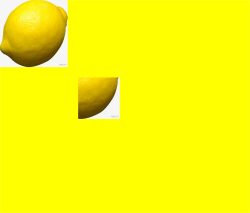

## putImageData

putImageData(imageData: ImageData, dx: number | string, dy: number | string): void

使用[ImageData](ts-components-canvas-imagedata.md)数据填充新的矩形区域。

**卡片能力：** 从API version 9开始，该接口支持在ArkTS卡片中使用。

**原子化服务API：** 从API version 11开始，该接口支持在原子化服务中使用。

**系统能力：** SystemCapability.ArkUI.ArkUI.Full

 **参数：**

| 参数名          | 类型 | 必填 | 说明 |
| ----------- | ---------------------------------------- | ---- | ----------------------------- |
| imageData   | [ImageData](ts-components-canvas-imagedata.md) | 是 | 包含像素值的ImageData对象。<br>异常值undefined或null按无效值处理，不进行绘制。 |
| dx          | number&nbsp;\|&nbsp;string<sup>10+</sup> | 是 | 填充区域在x轴方向的偏移量。<br>异常值undefined、null、NaN和Infinity按0处理。<br>默认单位：vp |
| dy          | number&nbsp;\|&nbsp;string<sup>10+</sup> | 是   | 填充区域在y轴方向的偏移量。<br>异常值undefined、null、NaN和Infinity按0处理。<br>默认单位：vp |

 **示例：**

  ```ts
  // xxx.ets
  @Entry
  @Component
  struct PutImageData {
    private settings: RenderingContextSettings = new RenderingContextSettings(true);
    private context: CanvasRenderingContext2D = new CanvasRenderingContext2D(this.settings);
    private offCanvas: OffscreenCanvas = new OffscreenCanvas(600, 600);

    build() {
      Flex({ direction: FlexDirection.Column, alignItems: ItemAlign.Center, justifyContent: FlexAlign.Center }) {
        Canvas(this.context)
          .width('100%')
          .height('100%')
          .backgroundColor('rgb(213,213,213)')
          .onReady(() => {
            let offContext = this.offCanvas.getContext("2d", this.settings)
            let imageDataNum = offContext.createImageData(100, 100)
            let imageData = offContext.createImageData(imageDataNum)
            for (let i = 0; i < imageData.data.length; i += 4) {
              imageData.data[i + 0] = 112
              imageData.data[i + 1] = 112
              imageData.data[i + 2] = 112
              imageData.data[i + 3] = 255
            }
            offContext.putImageData(imageData, 10, 10)
            let image = this.offCanvas.transferToImageBitmap()
            this.context.transferFromImageBitmap(image)
          })
      }
      .width('100%')
      .height('100%')
    }
  }
  ```

  

## putImageData

putImageData(imageData: ImageData, dx: number | string, dy: number | string, dirtyX: number | string, dirtyY: number | string, dirtyWidth: number | string, dirtyHeight: number | string): void

使用[ImageData](ts-components-canvas-imagedata.md)数据裁剪后填充至新的矩形区域。

**卡片能力：** 从API version 9开始，该接口支持在ArkTS卡片中使用。

**原子化服务API：** 从API version 11开始，该接口支持在原子化服务中使用。

**系统能力：** SystemCapability.ArkUI.ArkUI.Full

 **参数：**

| 参数名          | 类型 | 必填 | 说明 |
| ----------- | ---------------------------------------- | ---- | ----------------------------- |
| imageData   | [ImageData](ts-components-canvas-imagedata.md) | 是 | 包含像素值的ImageData对象。<br>异常值undefined或null按无效值处理，不进行绘制。 |
| dx          | number&nbsp;\|&nbsp;string<sup>10+</sup> | 是 | 填充区域在x轴方向的偏移量。<br>异常值undefined、null、NaN和Infinity按0处理。<br>默认单位：vp |
| dy          | number&nbsp;\|&nbsp;string<sup>10+</sup> | 是   | 填充区域在y轴方向的偏移量。<br>异常值undefined、null、NaN和Infinity按0处理。<br>默认单位：vp |
| dirtyX      | number&nbsp;\|&nbsp;string<sup>10+</sup> | 是  | 源图像数据矩形裁切范围左上角距离源图像左上角的x轴偏移量。<br>异常值undefined、null、NaN和Infinity按0处理。<br>默认单位：vp |
| dirtyY      | number&nbsp;\|&nbsp;string<sup>10+</sup> | 是  | 源图像数据矩形裁切范围左上角距离源图像左上角的y轴偏移量。<br>异常值undefined、null、NaN和Infinity按0处理。<br>默认单位：vp |
| dirtyWidth  | number&nbsp;\|&nbsp;string<sup>10+</sup> | 是 | 源图像数据矩形裁切范围的宽度。<br>异常值undefined、null、NaN和Infinity按0处理。<br>默认单位：vp |
| dirtyHeight | number&nbsp;\|&nbsp;string<sup>10+</sup> | 是 | 源图像数据矩形裁切范围的高度。<br>异常值undefined、null、NaN和Infinity按0处理。<br>默认单位：vp |

 **示例：**

  ```ts
  // xxx.ets
  @Entry
  @Component
  struct PutImageData {
    private settings: RenderingContextSettings = new RenderingContextSettings(true);
    private context: CanvasRenderingContext2D = new CanvasRenderingContext2D(this.settings);
    private offCanvas: OffscreenCanvas = new OffscreenCanvas(600, 600);

    build() {
      Flex({ direction: FlexDirection.Column, alignItems: ItemAlign.Center, justifyContent: FlexAlign.Center }) {
        Canvas(this.context)
          .width('100%')
          .height('100%')
          .backgroundColor('rgb(213,213,213)')
          .onReady(() => {
            let offContext = this.offCanvas.getContext("2d", this.settings)
            let imageDataNum = offContext.createImageData(100, 100)
            let imageData = offContext.createImageData(imageDataNum)
            for (let i = 0; i < imageData.data.length; i += 4) {
              imageData.data[i + 0] = 112
              imageData.data[i + 1] = 112
              imageData.data[i + 2] = 112
              imageData.data[i + 3] = 255
            }
            offContext.putImageData(imageData, 10, 10, 0, 0, 100, 50)
            let image = this.offCanvas.transferToImageBitmap()
            this.context.transferFromImageBitmap(image)
          })
      }
      .width('100%')
      .height('100%')
    }
  }
  ```

  

## setLineDash

setLineDash(segments: number[]): void

设置画布的虚线样式。

**卡片能力：** 从API version 9开始，该接口支持在ArkTS卡片中使用。

**原子化服务API：** 从API version 11开始，该接口支持在原子化服务中使用。

**系统能力：** SystemCapability.ArkUI.ArkUI.Full

**参数：** 

| 参数名      | 类型   |  必填  | 说明             |
| -------- | -------- | -------- | ------------------- |
| segments | number[] | 是 | 描述线段如何交替和线段间距长度的数组。<br>异常值undefined或null按无效值处理。<br>默认单位：vp |

**示例：** 

  ```ts
  // xxx.ets
  @Entry
  @Component
  struct SetLineDash {
    private settings: RenderingContextSettings = new RenderingContextSettings(true);
    private context: CanvasRenderingContext2D = new CanvasRenderingContext2D(this.settings);
    private offCanvas: OffscreenCanvas = new OffscreenCanvas(600, 600);

    build() {
      Flex({ direction: FlexDirection.Column, alignItems: ItemAlign.Center, justifyContent: FlexAlign.Center }) {
        Canvas(this.context)
          .width('100%')
          .height('100%')
          .backgroundColor('#D5D5D5')
          .onReady(() => {
            let offContext = this.offCanvas.getContext("2d", this.settings)
            offContext.arc(100, 75, 50, 0, 6.28)
            offContext.setLineDash([10, 20])
            offContext.stroke()
            let image = this.offCanvas.transferToImageBitmap()
            this.context.transferFromImageBitmap(image)
          })
      }
      .width('100%')
      .height('100%')
    }
  }
  ```
  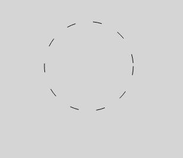

### transferFromImageBitmap

transferFromImageBitmap(bitmap: ImageBitmap): void

显示给定的ImageBitmap对象。

**卡片能力：** 从API version 9开始，该接口支持在ArkTS卡片中使用。

**原子化服务API：** 从API version 11开始，该接口支持在原子化服务中使用。

**系统能力：** SystemCapability.ArkUI.ArkUI.Full

**参数：** 

| 参数名 | 类型  | 必填 | 说明  |
| ------ | ----------------------- | ----------------- | ------------------ |
| bitmap | [ImageBitmap](ts-components-canvas-imagebitmap.md)  | 是 | 待显示的ImageBitmap对象。 |

**示例：** 

  ```ts
  // xxx.ets
  @Entry
  @Component
  struct TransferFromImageBitmap {
    private settings: RenderingContextSettings = new RenderingContextSettings(true)
    private context: CanvasRenderingContext2D = new CanvasRenderingContext2D(this.settings)
    private offContext: OffscreenCanvasRenderingContext2D = new OffscreenCanvasRenderingContext2D(600, 600, this.settings)

    build() {
      Flex({ direction: FlexDirection.Column, alignItems: ItemAlign.Center, justifyContent: FlexAlign.Center }) {
        Canvas(this.context)
          .width('100%')
          .height('100%')
          .backgroundColor('rgb(213,213,213)')
          .onReady(() =>{
            let imageData = this.offContext.createImageData(100, 100)
            for (let i = 0; i < imageData.data.length; i += 4) {
              imageData.data[i + 0] = 255
              imageData.data[i + 1] = 0
              imageData.data[i + 2] = 60
              imageData.data[i + 3] = 80
            }
            this.offContext.putImageData(imageData, 10, 10)
            let image = this.offContext.transferToImageBitmap()
            this.context.transferFromImageBitmap(image)
          })
      }
      .width('100%')
      .height('100%')
    }
  }
  ```
  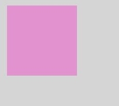  

## getLineDash

getLineDash(): number[]

获得当前画布的虚线样式。

**卡片能力：** 从API version 9开始，该接口支持在ArkTS卡片中使用。

**原子化服务API：** 从API version 11开始，该接口支持在原子化服务中使用。

**系统能力：** SystemCapability.ArkUI.ArkUI.Full

**返回值：** 

| 类型       | 说明                       |
| -------- | ------------------------ |
| number[] | 返回数组，该数组用来描述线段如何交替和间距长度。<br>异常值undefined或null按无效值处理。<br>默认单位：vp |

**示例：** 

  ```ts
  // xxx.ets
  @Entry
  @Component
  struct OffscreenCanvasGetLineDash {
    @State message: string = 'Hello World';
    private settings: RenderingContextSettings = new RenderingContextSettings(true);
    private context: CanvasRenderingContext2D = new CanvasRenderingContext2D(this.settings);
    private offCanvas: OffscreenCanvas = new OffscreenCanvas(600, 600);

    build() {
      Row() {
        Column() {
          Text(this.message)
            .fontSize(50)
            .fontWeight(FontWeight.Bold)
          Canvas(this.context)
            .width('100%')
            .height('100%')
            .backgroundColor('#D5D5D5')
            .onReady(() => {
              let offContext = this.offCanvas.getContext("2d", this.settings)
              offContext.arc(100, 75, 50, 0, 6.28)
              offContext.setLineDash([10, 20])
              offContext.stroke()
              let res = offContext.getLineDash()
              this.message = JSON.stringify(res)
              let image = this.offCanvas.transferToImageBitmap()
              this.context.transferFromImageBitmap(image)
            })
        }
        .width('100%')
      }
      .height('100%')
    }
  }
  ```
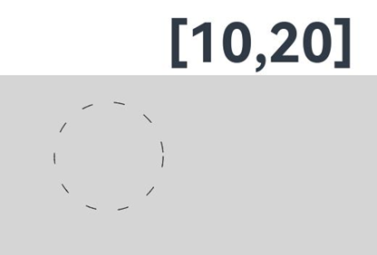 

## restore

restore(): void

对保存的绘图上下文进行恢复。

> **说明：**
>
> 当restore()次数未超出save()次数时，从栈中弹出存储的绘制状态并恢复CanvasRenderingContext2D对象的属性、剪切路径和变换矩阵的值。</br>
> 当restore()次数超出save()次数时，此方法不做任何改变。</br>
> 当没有保存状态时，此方法不做任何改变。

**卡片能力：** 从API version 9开始，该接口支持在ArkTS卡片中使用。

**原子化服务API：** 从API version 11开始，该接口支持在原子化服务中使用。

**系统能力：** SystemCapability.ArkUI.ArkUI.Full

 **示例：**

  ```ts
  // xxx.ets
  @Entry
  @Component
  struct CanvasExample {
    private settings: RenderingContextSettings = new RenderingContextSettings(true);
    private context: CanvasRenderingContext2D = new CanvasRenderingContext2D(this.settings);
    private offCanvas: OffscreenCanvas = new OffscreenCanvas(600, 600);
    
    build() {
      Flex({ direction: FlexDirection.Column, alignItems: ItemAlign.Center, justifyContent: FlexAlign.Center }) {
        Canvas(this.context)
          .width('100%')
          .height('100%')
          .backgroundColor('#ffff00')
          .onReady(() => {
            let offContext = this.offCanvas.getContext("2d", this.settings)
            offContext.save() // save the default state
            offContext.fillStyle = "#00ff00"
            offContext.fillRect(20, 20, 100, 100)
            offContext.restore() // restore to the default state
            offContext.fillRect(150, 75, 100, 100)
            let image = this.offCanvas.transferToImageBitmap()
            this.context.transferFromImageBitmap(image)
          })
      }
      .width('100%')
      .height('100%')
    }
  }
  ```
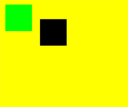 

## save

save(): void

对当前的绘图上下文进行保存。

**卡片能力：** 从API version 9开始，该接口支持在ArkTS卡片中使用。

**原子化服务API：** 从API version 11开始，该接口支持在原子化服务中使用。

**系统能力：** SystemCapability.ArkUI.ArkUI.Full

 **示例：** 

  ```ts
  // xxx.ets
  @Entry
  @Component
  struct CanvasExample {
    private settings: RenderingContextSettings = new RenderingContextSettings(true);
    private context: CanvasRenderingContext2D = new CanvasRenderingContext2D(this.settings);
    private offCanvas: OffscreenCanvas = new OffscreenCanvas(600, 600);
    
    build() {
      Flex({ direction: FlexDirection.Column, alignItems: ItemAlign.Center, justifyContent: FlexAlign.Center }) {
        Canvas(this.context)
          .width('100%')
          .height('100%')
          .backgroundColor('#ffff00')
          .onReady(() => {
            let offContext = this.offCanvas.getContext("2d", this.settings)
            offContext.save() // save the default state
            offContext.fillStyle = "#00ff00"
            offContext.fillRect(20, 20, 100, 100)
            offContext.restore() // restore to the default state
            offContext.fillRect(150, 75, 100, 100)
            let image = this.offCanvas.transferToImageBitmap()
            this.context.transferFromImageBitmap(image)
          })
      }
      .width('100%')
      .height('100%')
    }
  }
  ```
 

## createLinearGradient

createLinearGradient(x0: number, y0: number, x1: number, y1: number): CanvasGradient

创建一个线性渐变色。

**卡片能力：** 从API version 9开始，该接口支持在ArkTS卡片中使用。

**原子化服务API：** 从API version 11开始，该接口支持在原子化服务中使用。

**系统能力：** SystemCapability.ArkUI.ArkUI.Full

 **参数：**

| 参数名   | 类型     | 必填  | 说明 |
| ---- | ------ | ---- | -------- |
| x0   | number | 是  | 起点的x轴坐标。<br>异常值undefined和null会导致此接口返回undefined，NaN和Infinity按无效值处理。<br>默认单位：vp |
| y0   | number | 是  | 起点的y轴坐标。<br>异常值undefined和null会导致此接口返回undefined，NaN和Infinity按无效值处理。<br>默认单位：vp |
| x1   | number | 是  | 终点的x轴坐标。<br>异常值undefined和null会导致此接口返回undefined，NaN和Infinity按无效值处理。<br>默认单位：vp |
| y1   | number | 是  | 终点的y轴坐标。<br>异常值undefined和null会导致此接口返回undefined，NaN和Infinity按无效值处理。<br>默认单位：vp |

**返回值：** 

| 类型     | 说明        |
| ------ | --------- |
| [CanvasGradient](ts-components-canvas-canvasgradient.md) | 新的CanvasGradient对象，用于在offscreenCanvas上创建渐变效果。 |

 **示例：** 

  ```ts
  // xxx.ets
  @Entry
  @Component
  struct CreateLinearGradient {
    private settings: RenderingContextSettings = new RenderingContextSettings(true);
    private context: CanvasRenderingContext2D = new CanvasRenderingContext2D(this.settings);
    private offCanvas: OffscreenCanvas = new OffscreenCanvas(600, 600);
    
    build() {
      Flex({ direction: FlexDirection.Column, alignItems: ItemAlign.Center, justifyContent: FlexAlign.Center }) {
        Canvas(this.context)
          .width('100%')
          .height('100%')
          .backgroundColor('rgb(213,213,213)')
          .onReady(() => {
            let offContext = this.offCanvas.getContext("2d", this.settings)
            let grad = offContext.createLinearGradient(50,0, 300,100)
            grad.addColorStop(0.0, 'rgb(39,135,217)')
            grad.addColorStop(0.5, 'rgb(255,238,240)')
            grad.addColorStop(1.0, 'rgb(23,169,141)')
            offContext.fillStyle = grad
            offContext.fillRect(0, 0, 400, 400)
            let image = this.offCanvas.transferToImageBitmap()
            this.context.transferFromImageBitmap(image)
          })
      }
      .width('100%')
      .height('100%')
    }
  }
  ```

  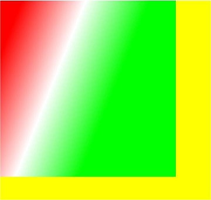

## createRadialGradient

createRadialGradient(x0: number, y0: number, r0: number, x1: number, y1: number, r1: number): CanvasGradient

创建一个径向渐变色。

**卡片能力：** 从API version 9开始，该接口支持在ArkTS卡片中使用。

**原子化服务API：** 从API version 11开始，该接口支持在原子化服务中使用。

**系统能力：** SystemCapability.ArkUI.ArkUI.Full

  **参数：**

| 参数名   | 类型     | 必填   | 说明 |
| ---- | ------ | ---- | ----------------- |
| x0   | number | 是  | 起始圆的x轴坐标。<br>异常值undefined和null会导致此接口返回undefined，NaN和Infinity按无效值处理。<br>默认单位：vp |
| y0   | number | 是  | 起始圆的y轴坐标。<br>异常值undefined和null会导致此接口返回undefined，NaN和Infinity按无效值处理。<br>默认单位：vp |
| r0   | number | 是  | 起始圆的半径。必须是非负且有限的。<br>异常值undefined和null会导致此接口返回undefined，NaN和Infinity按无效值处理。<br>默认单位：vp |
| x1   | number | 是  | 终点圆的x轴坐标。<br>异常值undefined和null会导致此接口返回undefined，NaN和Infinity按无效值处理。<br>默认单位：vp |
| y1   | number | 是  | 终点圆的y轴坐标。<br>异常值undefined和null会导致此接口返回undefined，NaN和Infinity按无效值处理。<br>默认单位：vp |
| r1   | number | 是  | 终点圆的半径。必须为非负且有限的。<br>异常值undefined和null会导致此接口返回undefined，NaN和Infinity按无效值处理。<br>默认单位：vp |

**返回值：** 

| 类型     | 说明        |
| ------ | --------- |
| [CanvasGradient](ts-components-canvas-canvasgradient.md) | 新的CanvasGradient对象，用于在offscreenCanvas上创建渐变效果。 |

  **示例：**  

  ```ts
  // xxx.ets
  @Entry
  @Component
  struct CreateRadialGradient {
    private settings: RenderingContextSettings = new RenderingContextSettings(true);
    private context: CanvasRenderingContext2D = new CanvasRenderingContext2D(this.settings);
    private offCanvas: OffscreenCanvas = new OffscreenCanvas(600, 600);
    
    build() {
      Flex({ direction: FlexDirection.Column, alignItems: ItemAlign.Center, justifyContent: FlexAlign.Center }) {
        Canvas(this.context)
          .width('100%')
          .height('100%')
          .backgroundColor('rgb(213,213,213)')
          .onReady(() => {
            let offContext = this.offCanvas.getContext("2d", this.settings)
            let grad = offContext.createRadialGradient(200,200,50, 200,200,200)
            grad.addColorStop(0.0, 'rgb(39,135,217)')
            grad.addColorStop(0.5, 'rgb(255,238,240)')
            grad.addColorStop(1.0, 'rgb(112,112,112)')
            offContext.fillStyle = grad
            offContext.fillRect(0, 0, 440, 440)
            let image = this.offCanvas.transferToImageBitmap()
            this.context.transferFromImageBitmap(image)
          })
      }
      .width('100%')
      .height('100%')
    }
  }
  ```

  

## createConicGradient<sup>10+</sup>

createConicGradient(startAngle: number, x: number, y: number): CanvasGradient

创建一个圆锥渐变色。

**原子化服务API：** 从API version 11开始，该接口支持在原子化服务中使用。

**模型约束：** 此接口仅可在Stage模型下使用。

**系统能力：** SystemCapability.ArkUI.ArkUI.Full

**参数：**

| 参数名 | 类型 | 必填 | 说明 |
| ---------- | ------ | ----  | ----------------------------------- |
| startAngle | number | 是    | 开始渐变的角度。角度测量从中心右侧水平开始，顺时针移动。<br>异常值undefined和null按0处理，NaN和Infinity按无效值处理。<br>单位：弧度 |
| x          | number | 是    | 圆锥渐变的中心x轴坐标。<br>异常值undefined和null按0处理，NaN和Infinity按无效值处理。<br>默认单位：vp |
| y          | number | 是    | 圆锥渐变的中心y轴坐标。<br>异常值undefined和null按0处理，NaN和Infinity按无效值处理。<br>默认单位：vp |

**返回值：** 

| 类型     | 说明        |
| ------ | --------- |
| [CanvasGradient](ts-components-canvas-canvasgradient.md) | 新的CanvasGradient对象，用于在offscreenCanvas上创建渐变效果。 |

**示例：**

```ts
// xxx.ets
@Entry
@Component
struct OffscreenCanvasConicGradientPage {
  private settings: RenderingContextSettings = new RenderingContextSettings(true);
  private context: CanvasRenderingContext2D = new CanvasRenderingContext2D(this.settings);
  private offCanvas: OffscreenCanvas = new OffscreenCanvas(600, 600);

  build() {
    Flex({ direction: FlexDirection.Column, alignItems: ItemAlign.Center, justifyContent: FlexAlign.Center }) {
      Canvas(this.context)
        .width('100%')
        .height('100%')
        .backgroundColor('#ffffff')
        .onReady(() => {
          let offContext = this.offCanvas.getContext("2d", this.settings)
          let grad = offContext.createConicGradient(0, 50, 80)
          grad.addColorStop(0.0, '#ff0000')
          grad.addColorStop(0.5, '#ffffff')
          grad.addColorStop(1.0, '#00ff00')
          offContext.fillStyle = grad
          offContext.fillRect(0, 30, 100, 100)
          let image = this.offCanvas.transferToImageBitmap()
          this.context.transferFromImageBitmap(image)
        })
    }
    .width('100%')
    .height('100%')
  }
}
```

  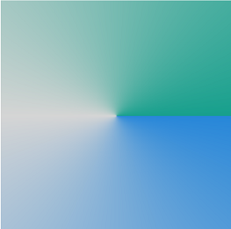

## CanvasFillRule

type CanvasFillRule = "evenodd" | "nonzero"

定义用于确定点是在路径内还是路径外的填充样式算法的类型。取值类型为下表类型中的并集。

**卡片能力：** 从API version 9开始，该接口支持在ArkTS卡片中使用。

**原子化服务API：** 从API version 11开始，该接口支持在原子化服务中使用。

**系统能力：** SystemCapability.ArkUI.ArkUI.Full

| 类型      | 说明    |
| ------- | ----- |
| "evenodd" | 奇偶规则。<br/>此规则通过从画布上的某点向任意方向发射一条射线，并统计图形路径与射线的交点数量来判断该点是否在图形内部。如果交点数量是奇数，则该点在图形内部，否则在图形外部。 |
| "nonzero" | 非零规则。<br/>此规则通过从画布上的某点向任意方向发射一条射线，并检查图形路径与射线的交点来判断该点是否在图形内部。初始计数为0，为路径的每一段线段指定一个方向值，每当路径从左向右穿过射线时加1，从右向左穿过时减1。如果最终的结果是0，则该点在图形外部，否则在图形内部。 |

**示例**

```ts
// xxx.ets
@Entry
@Component
struct Index {
  private settings: RenderingContextSettings = new RenderingContextSettings(true);
  private context: CanvasRenderingContext2D = new CanvasRenderingContext2D(this.settings);
  private offCanvas: OffscreenCanvas = new OffscreenCanvas(600, 600);

  build() {
    Flex({ direction: FlexDirection.Column, alignItems: ItemAlign.Center, justifyContent: FlexAlign.Center }) {
      Canvas(this.context)
        .width('100%')
        .height('100%')
        .backgroundColor('rgb(213, 213, 213)')
        .onReady(() => {
          let offContext = this.offCanvas.getContext("2d", this.settings)
          offContext.font = '60px sans-serif'
          offContext.fillStyle = 'rgb(39, 135, 217)';
          // 非零环绕规则 (nonzero)
          offContext.beginPath();
          offContext.arc(100, 100, 60, 0, Math.PI * 2);
          offContext.arc(100, 100, 20, 0, Math.PI * 2);
          offContext.fill('nonzero'); // 使用非零环绕规则
          offContext.fillText('nonzero', 65, 200)
          // 奇偶环绕规则 (evenodd)
          offContext.beginPath();
          offContext.arc(250, 100, 60, 0, Math.PI * 2);
          offContext.arc(250, 100, 20, 0, Math.PI * 2);
          offContext.fill('evenodd'); // 使用奇偶环绕规则
          offContext.fillText('evenodd', 215, 200)
          let image = this.offCanvas.transferToImageBitmap()
          this.context.transferFromImageBitmap(image)
        })
    }
    .width('100%')
    .height('100%')
  }
}
```

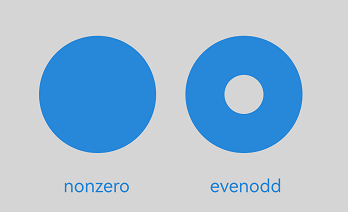

## TextMetrics

**卡片能力：** 从API version 9开始，该接口支持在ArkTS卡片中使用。

**原子化服务API：** 从API version 11开始，该接口支持在原子化服务中使用。

**系统能力：** SystemCapability.ArkUI.ArkUI.Full

<!--Table: 25%; 10%; 10%; 10%; 45%-->
| 名称 | 类型 | 只读 | 可选 | 说明 |
| ---------- | -------------- | ------ | ---------------- | ------------------------ |
| width                    | number | 是 | 否 | 只读属性，文本方块的宽度。 |
| height                   | number | 是 | 否 | 只读属性，文本方块的高度。 |
| actualBoundingBoxAscent  | number | 是 | 否 | 只读属性，从[textBaseline](./ts-components-canvas-common-property.md#canvastextbaseline)属性标明的水平线到渲染文本的矩形边界顶部的距离。 |
| actualBoundingBoxDescent | number | 是 | 否 | 只读属性，从[textBaseline](./ts-components-canvas-common-property.md#canvastextbaseline)属性标明的水平线到渲染文本的矩形边界底部的距离。 |
| actualBoundingBoxLeft    | number | 是 | 否 | 只读属性，平行于基线，从[textAlign](./ts-components-canvas-common-property.md#canvastextalign)属性确定的对齐点到文本矩形边界左侧的距离。 |
| actualBoundingBoxRight   | number | 是 | 否 | 只读属性，平行于基线，从[textAlign](./ts-components-canvas-common-property.md#canvastextalign)属性确定的对齐点到文本矩形边界右侧的距离。 |
| alphabeticBaseline       | number | 是 | 否 | 只读属性，从[textBaseline](./ts-components-canvas-common-property.md#canvastextbaseline)属性标明的水平线到线框的 alphabetic 基线的距离。 |
| emHeightAscent           | number | 是 | 否 | 只读属性，从[textBaseline](./ts-components-canvas-common-property.md#canvastextbaseline)属性标明的水平线到线框中 em 方块顶部的距离。 |
| emHeightDescent          | number | 是 | 否 | 只读属性，从[textBaseline](./ts-components-canvas-common-property.md#canvastextbaseline)属性标明的水平线到线框中 em 方块底部的距离。 |
| fontBoundingBoxAscent    | number | 是 | 否 | 只读属性，从[textBaseline](./ts-components-canvas-common-property.md#canvastextbaseline)属性标明的水平线到渲染文本的所有字体的矩形最高边界顶部的距离。 |
| fontBoundingBoxDescent   | number | 是 | 否 | 只读属性，从[textBaseline](./ts-components-canvas-common-property.md#canvastextbaseline)属性标明的水平线到渲染文本的所有字体的矩形边界最底部的距离。 |
| hangingBaseline          | number | 是 | 否 | 只读属性，从[textBaseline](./ts-components-canvas-common-property.md#canvastextbaseline)属性标明的水平线到线框的 hanging 基线的距离。 |
| ideographicBaseline      | number | 是 | 否 | 只读属性，从[textBaseline](./ts-components-canvas-common-property.md#canvastextbaseline)属性标明的水平线到线框的 ideographic 基线的距离。 |
