# 画布绘制通用属性
<!--Kit: ArkUI-->
<!--Subsystem: ArkUI-->
<!--Owner: @camlostshi-->
<!--Designer: @fenglinbailu-->
<!--Tester: @l30014443-->
<!--Adviser: @Brilliantry_Rui-->

画布绘制组件[CanvasRenderingContext2D](ts-canvasrenderingcontext2d.md)和[OffscreenCanvasRenderingContext2D](ts-offscreencanvasrenderingcontext2d.md)的通用属性。

> **说明：**
>
> - 本模块首批接口从API version 8开始支持。后续版本的新增接口，采用上角标单独标记接口的起始版本。
>
> - fillStyle、shadowColor与strokeStyle中string类型格式为'rgb(255, 255, 255)'，'rgba(255, 255, 255, 1.0)'，'\#FFFFFF'。

## fillStyle

指定绘制的填充色，此属性为只写属性，可通过赋值语句设置其值，但无法通过读取操作获取其当前值，若尝试读取将返回undefined。

**卡片能力：** 从API version 9开始，该接口支持在ArkTS卡片中使用。

**原子化服务API：** 从API version 11开始，该接口支持在原子化服务中使用。

**系统能力：** SystemCapability.ArkUI.ArkUI.Full

| 名称 | 类型 | 只读 | 可选 | 说明 |
| ------ | ------ | ---------- | -------------- | ---------------------------------------- |
| fillStyle | string&nbsp;\|&nbsp;number<sup>10+</sup>&nbsp;\|&nbsp;[CanvasGradient](ts-components-canvas-canvasgradient.md)&nbsp;\|&nbsp;[CanvasPattern](ts-components-canvas-canvaspattern.md) | 否 | 否 | <br/>-&nbsp;类型为string时，表示设置填充区域的颜色，颜色格式参考[ResourceColor](ts-types.md#resourcecolor)中string类型说明。<br/>- 类型为number时，表示设置填充区域的颜色，不支持设置全透明色，颜色格式参考[ResourceColor](ts-types.md#resourcecolor)中number类型说明。<br/>-&nbsp;类型为CanvasGradient时，表示渐变对象，使用[createLinearGradient](ts-components-canvas-common-method.md#createlineargradient)方法创建。<br/>-&nbsp;类型为CanvasPattern时，使用[createPattern](ts-components-canvas-common-method.md#createpattern)方法创建。<br/>默认值：'#000000'（黑色）<br/>异常值设置无效。<br/> |

**示例：**

```ts
// xxx.ets
@Entry
@Component
struct FillStyleExample {
  private settings: RenderingContextSettings = new RenderingContextSettings(true);
  private context: CanvasRenderingContext2D = new CanvasRenderingContext2D(this.settings);
  private offCanvas: OffscreenCanvas = new OffscreenCanvas(600, 600);

  build() {
    Flex({ direction: FlexDirection.Column, alignItems: ItemAlign.Center, justifyContent: FlexAlign.Center }) {
      Canvas(this.context)
        .width('100%')
        .height('100%')
        .backgroundColor('#ffff00')
        .onReady(() => {
          let offContext = this.offCanvas.getContext("2d", this.settings)
          // 使用string设置fillStyle属性
          offContext.fillStyle = '#0000ff'
          offContext.fillRect(20, 20, 150, 100)
          let image = this.offCanvas.transferToImageBitmap()
          this.context.transferFromImageBitmap(image)
        })
    }
    .width('100%')
    .height('100%')
  }
}
```

```ts
// xxx.ets
@Entry
@Component
struct FillStyleExample {
  private settings: RenderingContextSettings = new RenderingContextSettings(true);
  private context: CanvasRenderingContext2D = new CanvasRenderingContext2D(this.settings);
  private offCanvas: OffscreenCanvas = new OffscreenCanvas(600, 600);

  build() {
    Flex({ direction: FlexDirection.Column, alignItems: ItemAlign.Center, justifyContent: FlexAlign.Center }) {
      Canvas(this.context)
        .width('100%')
        .height('100%')
        .backgroundColor('#ffff00')
        .onReady(() => {
          let offContext = this.offCanvas.getContext("2d", this.settings)
          // 使用number设置fillStyle属性
          offContext.fillStyle = 0x0000FF
          offContext.fillRect(20, 20, 150, 100)
          let image = this.offCanvas.transferToImageBitmap()
          this.context.transferFromImageBitmap(image)
        })
    }
    .width('100%')
    .height('100%')
  }
}
```

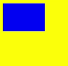

## lineWidth

设置绘制线条的宽度，此属性为只写属性，可通过赋值语句设置其值，但无法通过读取操作获取其当前值，若尝试读取将返回undefined。

**卡片能力：** 从API version 9开始，该接口支持在ArkTS卡片中使用。

**原子化服务API：** 从API version 11开始，该接口支持在原子化服务中使用。

**系统能力：** SystemCapability.ArkUI.ArkUI.Full

| 名称 | 类型 | 只读 | 可选 | 说明 |
| ------ | ------ | ---------- | -------------- | ---------------------------------------- |
| lineWidth | number | 否 | 否 | 绘制线条的宽度。<br/>默认值：1（px）<br/>默认单位：vp<br/>lineWidth取值不支持0和负数，0、负数和NaN按默认值处理，Infinity会导致和lineWidth属性相关的接口无法绘制。 |

**示例：**

```ts
// xxx.ets
@Entry
@Component
struct LineWidthExample {
  private settings: RenderingContextSettings = new RenderingContextSettings(true);
  private context: CanvasRenderingContext2D = new CanvasRenderingContext2D(this.settings);
  private offCanvas: OffscreenCanvas = new OffscreenCanvas(600, 600);

  build() {
    Flex({ direction: FlexDirection.Column, alignItems: ItemAlign.Center, justifyContent: FlexAlign.Center }) {
      Canvas(this.context)
        .width('100%')
        .height('100%')
        .backgroundColor('#ffff00')
        .onReady(() => {
          let offContext = this.offCanvas.getContext("2d", this.settings)
          // 设置lineWidth属性
          offContext.lineWidth = 5
          offContext.strokeRect(25, 25, 85, 105)
          let image = this.offCanvas.transferToImageBitmap()
          this.context.transferFromImageBitmap(image)
        })
    }
    .width('100%')
    .height('100%')
  }
}
```

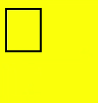

## strokeStyle

设置线条的颜色，此属性为只写属性，可通过赋值语句设置其值，但无法通过读取操作获取其当前值，若尝试读取将返回undefined。

**卡片能力：** 从API version 9开始，该接口支持在ArkTS卡片中使用。

**原子化服务API：** 从API version 11开始，该接口支持在原子化服务中使用。

**系统能力：** SystemCapability.ArkUI.ArkUI.Full

| 名称 | 类型 | 只读 | 可选 | 说明 |
| ------ | ------ | ---------- | -------------- | ---------------------------------------- |
| strokeStyle | string&nbsp;\|&nbsp;number<sup>10+</sup>&nbsp;\|&nbsp;[CanvasGradient](ts-components-canvas-canvasgradient.md)&nbsp;\|&nbsp;[CanvasPattern](ts-components-canvas-canvaspattern.md) | 否 | 否 | <br/>-&nbsp;类型为string时，表示设置线条使用的颜色，颜色格式参考[ResourceColor](ts-types.md#resourcecolor)中string类型说明。<br/>- 类型为number时，表示设置线条使用的颜色，不支持设置全透明色，颜色格式参考[ResourceColor](ts-types.md#resourcecolor)中number类型说明。<br/>-&nbsp;类型为CanvasGradient时，表示渐变对象，使用[createLinearGradient](./ts-components-canvas-common-method.md#createlineargradient)方法创建。<br/>-&nbsp;类型为CanvasPattern时，使用[createPattern](./ts-components-canvas-common-method.md#createpattern)方法创建。<br/>默认值：'#000000'（黑色）<br/>异常值设置无效。<br/> |

**示例：**

```ts
// xxx.ets
@Entry
@Component
struct StrokeStyleExample {
  private settings: RenderingContextSettings = new RenderingContextSettings(true);
  private context: CanvasRenderingContext2D = new CanvasRenderingContext2D(this.settings);
  private offCanvas: OffscreenCanvas = new OffscreenCanvas(600, 600);

  build() {
    Flex({ direction: FlexDirection.Column, alignItems: ItemAlign.Center, justifyContent: FlexAlign.Center }) {
      Canvas(this.context)
        .width('100%')
        .height('100%')
        .backgroundColor('#ffff00')
        .onReady(() => {
          let offContext = this.offCanvas.getContext("2d", this.settings)
          offContext.lineWidth = 10
          // 使用string设置strokeStyle属性
          offContext.strokeStyle = '#0000ff'
          offContext.strokeRect(25, 25, 155, 105)
          let image = this.offCanvas.transferToImageBitmap()
          this.context.transferFromImageBitmap(image)
        })
    }
    .width('100%')
    .height('100%')
  }
}
```

```ts
// xxx.ets
@Entry
@Component
struct StrokeStyleExample {
  private settings: RenderingContextSettings = new RenderingContextSettings(true);
  private context: CanvasRenderingContext2D = new CanvasRenderingContext2D(this.settings);
  private offCanvas: OffscreenCanvas = new OffscreenCanvas(600, 600);

  build() {
    Flex({ direction: FlexDirection.Column, alignItems: ItemAlign.Center, justifyContent: FlexAlign.Center }) {
      Canvas(this.context)
        .width('100%')
        .height('100%')
        .backgroundColor('#ffff00')
        .onReady(() => {
          let offContext = this.offCanvas.getContext("2d", this.settings)
          offContext.lineWidth = 10
          // 使用number设置strokeStyle属性
          offContext.strokeStyle = 0x0000ff
          offContext.strokeRect(25, 25, 155, 105)
          let image = this.offCanvas.transferToImageBitmap()
          this.context.transferFromImageBitmap(image)
        })
    }
    .width('100%')
    .height('100%')
  }
}
```

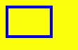

## lineCap

指定线端点的样式，此属性为只写属性，可通过赋值语句设置其值，但无法通过读取操作获取其当前值，若尝试读取将返回undefined。

**卡片能力：** 从API version 9开始，该接口支持在ArkTS卡片中使用。

**原子化服务API：** 从API version 11开始，该接口支持在原子化服务中使用。

**系统能力：** SystemCapability.ArkUI.ArkUI.Full

| 名称 | 类型 | 只读 | 可选 | 说明 |
| ------ | ------ | ---------- | -------------- | ---------------------------------------- |
| lineCap | [CanvasLineCap](#canvaslinecap) | 否 | 否 | 线端点的样式。<br/>默认值：'butt' |

**示例：**

```ts
// xxx.ets
@Entry
@Component
struct LineCapExample {
  private settings: RenderingContextSettings = new RenderingContextSettings(true);
  private context: CanvasRenderingContext2D = new CanvasRenderingContext2D(this.settings);
  private offCanvas: OffscreenCanvas = new OffscreenCanvas(600, 600);

  build() {
    Flex({ direction: FlexDirection.Column, alignItems: ItemAlign.Center, justifyContent: FlexAlign.Center }) {
      Canvas(this.context)
        .width('100%')
        .height('100%')
        .backgroundColor('#ffff00')
        .onReady(() => {
          let offContext = this.offCanvas.getContext("2d", this.settings)
          offContext.lineWidth = 8
          offContext.beginPath()
          // 设置lineCap属性
          offContext.lineCap = 'round'
          offContext.moveTo(30, 50)
          offContext.lineTo(220, 50)
          offContext.stroke()
          let image = this.offCanvas.transferToImageBitmap()
          this.context.transferFromImageBitmap(image)
        })
    }
    .width('100%')
    .height('100%')
  }
}
```

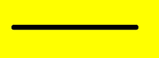

## lineJoin

指定线段间相交的交点样式，此属性为只写属性，可通过赋值语句设置其值，但无法通过读取操作获取其当前值，若尝试读取将返回undefined。

**卡片能力：** 从API version 9开始，该接口支持在ArkTS卡片中使用。

**原子化服务API：** 从API version 11开始，该接口支持在原子化服务中使用。

**系统能力：** SystemCapability.ArkUI.ArkUI.Full

| 名称 | 类型 | 只读 | 可选 | 说明 |
| ------ | ------ | ---------- | -------------- | ---------------------------------------- |
| lineJoin | [CanvasLineJoin](#canvaslinejoin) | 否 | 否 | 线段间相交的交点样式。<br/>默认值：'miter' |

**示例：**

```ts
// xxx.ets
@Entry
@Component
struct LineJoinExample {
  private settings: RenderingContextSettings = new RenderingContextSettings(true);
  private context: CanvasRenderingContext2D = new CanvasRenderingContext2D(this.settings);
  private offCanvas: OffscreenCanvas = new OffscreenCanvas(600, 600);

  build() {
    Flex({ direction: FlexDirection.Column, alignItems: ItemAlign.Center, justifyContent: FlexAlign.Center }) {
      Canvas(this.context)
        .width('100%')
        .height('100%')
        .backgroundColor('#ffff00')
        .onReady(() => {
          let offContext = this.offCanvas.getContext("2d", this.settings)
          offContext.beginPath()
          offContext.lineWidth = 8
          // 设置lineJoin属性
          offContext.lineJoin = 'miter'
          offContext.moveTo(30, 30)
          offContext.lineTo(120, 60)
          offContext.lineTo(30, 110)
          offContext.stroke()
          let image = this.offCanvas.transferToImageBitmap()
          this.context.transferFromImageBitmap(image)
      })
    }
    .width('100%')
    .height('100%')
  }
}
```


## miterLimit

设置斜接面限制值，该值指定了线条相交处内角和外角的距离，仅当设置了lineJoin为miter才生效，此属性为只写属性，可通过赋值语句设置其值，但无法通过读取操作获取其当前值，若尝试读取将返回undefined。

**卡片能力：** 从API version 9开始，该接口支持在ArkTS卡片中使用。

**原子化服务API：** 从API version 11开始，该接口支持在原子化服务中使用。

**系统能力：** SystemCapability.ArkUI.ArkUI.Full

| 名称 | 类型 | 只读 | 可选 | 说明 |
| ------ | ------ | ---------- | -------------- | ---------------------------------------- |
| miterLimit | number | 否 | 否 | 斜接面限制值。<br/>默认值：10px<br/>单位：px <br/>miterLimit取值不支持0和负数，0、负数和NaN按默认值处理，Infinity会导致和miterLimit属性相关的接口无法绘制。 |

**示例：**

```ts
// xxx.ets
@Entry
@Component
struct MiterLimit {
  private settings: RenderingContextSettings = new RenderingContextSettings(true);
  private context: CanvasRenderingContext2D = new CanvasRenderingContext2D(this.settings);
  private offCanvas: OffscreenCanvas = new OffscreenCanvas(600, 600);
  
  build() {
    Flex({ direction: FlexDirection.Column, alignItems: ItemAlign.Center, justifyContent: FlexAlign.Center }) {
      Canvas(this.context)
        .width('100%')
        .height('100%')
        .backgroundColor('#ffff00')
        .onReady(() => {
          let offContext = this.offCanvas.getContext("2d", this.settings)
          offContext.lineWidth = 8
          offContext.lineJoin = 'miter'
          // 设置miterLimit属性
          offContext.miterLimit = 3
          offContext.moveTo(30, 30)
          offContext.lineTo(60, 35)
          offContext.lineTo(30, 37)
          offContext.stroke()
          let image = this.offCanvas.transferToImageBitmap()
          this.context.transferFromImageBitmap(image)
      })
    }
    .width('100%')
    .height('100%')
  }
}
```


## font

设置文本绘制中的字体样式，此属性为只写属性，可通过赋值语句设置其值，但无法通过读取操作获取其当前值，若尝试读取将返回undefined。

语法：ctx.font&nbsp;=&nbsp;'font-style&nbsp;font-weight&nbsp;font-size&nbsp;font-family'<br/>-&nbsp;font-style(可选)，用于指定字体样式，支持如下几种样式：'normal','italic'。<br/>-&nbsp;font-weight(可选)，用于指定字体的粗细，支持如下几种类型：'normal',&nbsp;'bold',&nbsp;'bolder',&nbsp;'lighter',&nbsp;100,&nbsp;200,&nbsp;300,&nbsp;400,&nbsp;500,&nbsp;600,&nbsp;700,&nbsp;800,&nbsp;900。<br/>-&nbsp;font-size(可选)，指定字号和行高，单位支持px、vp。使用时需要添加单位。<br/>-&nbsp;font-family(可选)，指定字体系列，支持如下几种类型：'sans-serif',&nbsp;'serif',&nbsp;'monospace'。

从API version 20开始，支持通过该接口设置注册过的自定义字体（只能在主线程使用，不支持在worker线程中使用；DevEco Studio的预览器不支持显示自定义字体）。自定义字体注册有以下两种方式。一种是通过ArkUI的异步接口this.uiContext.getFont().[registerFont](../arkts-apis-uicontext-font.md#registerfont)注册，调用后立即绘制可能会导致自定义字体不生效。另一种是直接调用字体引擎的fontCollection.[loadFontSync](../../apis-arkgraphics2d/js-apis-graphics-text.md#loadfontsync)接口来注册自定义字体到字体引擎。在直接调用字体引擎接口注册自定义字体时，fontCollection的实例需要是text.FontCollection.getGlobalInstance()，因为组件默认会从该实例加载字体。如果使用其他实例，可能会导致自定义字体不生效。

**卡片能力：** 从API version 9开始，该接口支持在ArkTS卡片中使用。

**原子化服务API：** 从API version 11开始，该接口支持在原子化服务中使用。

**系统能力：** SystemCapability.ArkUI.ArkUI.Full

| 名称 | 类型 | 只读 | 可选 | 说明 |
| ------ | ------ | ---------- | -------------- | ---------------------------------------- |
| font | string | 否 | 否 | 文本绘制中的字体样式。<br/>默认值：'normal normal 14px sans-serif' |

**示例：**

```ts
import { text } from '@kit.ArkGraphics2D';

@Entry
@Component
struct FontDemo {
  private settings: RenderingContextSettings = new RenderingContextSettings(true);
  private context: CanvasRenderingContext2D = new CanvasRenderingContext2D(this.settings);
  private offCanvas: OffscreenCanvas = new OffscreenCanvas(600, 600);

  build() {
    Flex({ direction: FlexDirection.Column, alignItems: ItemAlign.Center, justifyContent: FlexAlign.Center }) {
      Canvas(this.context)
        .width('100%')
        .height('100%')
        .backgroundColor('rgb(213,213,213)')
        .onReady(() => {
          let offContext = this.offCanvas.getContext("2d", this.settings);
          // 常规字体样式，常规粗细，字体大小为30px，字体系列为sans-serif
          offContext.font = 'normal normal 30px sans-serif'
          offContext.fillText("Hello px", 20, 60)
          // 斜体样式，加粗，字体大小为30vp，字体系列为monospace
          offContext.font = 'italic bold 30vp monospace'
          offContext.fillText("Hello vp", 20, 100)
          // 加载rawfile目录下的自定义字体文件HarmonyOS_Sans_Thin_Italic.ttf
          let fontCollection = text.FontCollection.getGlobalInstance();
          fontCollection.loadFontSync('HarmonyOS_Sans_Thin_Italic', $rawfile("HarmonyOS_Sans_Thin_Italic.ttf"))
          // 加粗，字体大小为30vp，字体系列为HarmonyOS_Sans_Thin_Italic
          offContext.font = "bold 30vp HarmonyOS_Sans_Thin_Italic"
          offContext.fillText("Hello customFont", 20, 140)
          let image = this.offCanvas.transferToImageBitmap();
          this.context.transferFromImageBitmap(image)
        })
    }
    .width('100%')
    .height('100%')
  }
}
```


## textAlign

设置文本绘制中的文本对齐方式，此属性为只写属性，可通过赋值语句设置其值，但无法通过读取操作获取其当前值，若尝试读取将返回undefined。

**卡片能力：** 从API version 9开始，该接口支持在ArkTS卡片中使用。

**原子化服务API：** 从API version 11开始，该接口支持在原子化服务中使用。

**系统能力：** SystemCapability.ArkUI.ArkUI.Full

| 名称 | 类型 | 只读 | 可选 | 说明 |
| ------ | ------ | ---------- | -------------- | ---------------------------------------- |
| textAlign | [CanvasTextAlign](#canvastextalign) | 否 | 否 | 文本绘制中的文本对齐方式。<br/>ltr布局模式下'start'和'left'一致，rtl布局模式下'start'和'right'一致。<br/>默认值：'left' |

**示例：**

```ts
// xxx.ets
@Entry
@Component
struct CanvasExample {
  private settings: RenderingContextSettings = new RenderingContextSettings(true);
  private context: CanvasRenderingContext2D = new CanvasRenderingContext2D(this.settings);
  private offCanvas: OffscreenCanvas = new OffscreenCanvas(600, 600);

  build() {
    Flex({ direction: FlexDirection.Column, alignItems: ItemAlign.Center, justifyContent: FlexAlign.Center }) {
      Canvas(this.context)
        .width('100%')
        .height('100%')
        .backgroundColor('rgb(213,213,213)')
        .onReady(() => {
          let offContext = this.offCanvas.getContext("2d", this.settings)
          offContext.strokeStyle = 'rgb(39,135,217)'
          offContext.moveTo(140, 10)
          offContext.lineTo(140, 160)
          offContext.stroke()

          offContext.font = '50px sans-serif'

          // 设置textAlign属性为start
          offContext.textAlign = 'start'
          offContext.fillText('textAlign=start', 140, 60)
          // 设置textAlign属性为end
          offContext.textAlign = 'end'
          offContext.fillText('textAlign=end', 140, 80)
          // 设置textAlign属性为left
          offContext.textAlign = 'left'
          offContext.fillText('textAlign=left', 140, 100)
          // 设置textAlign属性为center
          offContext.textAlign = 'center'
          offContext.fillText('textAlign=center', 140, 120)
          // 设置textAlign属性为right
          offContext.textAlign = 'right'
          offContext.fillText('textAlign=right', 140, 140)
          let image = this.offCanvas.transferToImageBitmap()
          this.context.transferFromImageBitmap(image)
        })
    }
    .width('100%')
    .height('100%')
  }
}
```

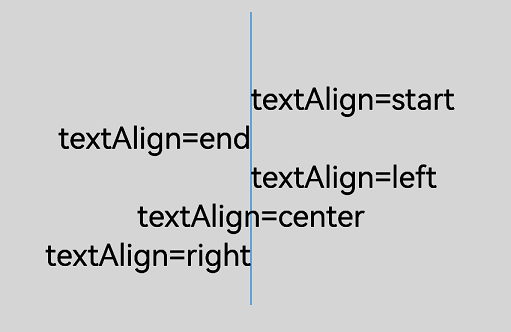

## textBaseline

设置文本绘制中的基线对齐方式，此属性为只写属性，可通过赋值语句设置其值，但无法通过读取操作获取其当前值，若尝试读取将返回undefined。

**卡片能力：** 从API version 9开始，该接口支持在ArkTS卡片中使用。

**原子化服务API：** 从API version 11开始，该接口支持在原子化服务中使用。

**系统能力：** SystemCapability.ArkUI.ArkUI.Full

| 名称 | 类型 | 只读 | 可选 | 说明 |
| ------ | ------ | ---------- | -------------- | ---------------------------------------- |
| textBaseline | [CanvasTextBaseline](#canvastextbaseline) | 否 | 否 | 文本绘制中的基线对齐方式。<br/>默认值：'alphabetic' |

**示例：**

```ts
// xxx.ets
@Entry
@Component
struct TextBaseline {
  private settings: RenderingContextSettings = new RenderingContextSettings(true);
  private context: CanvasRenderingContext2D = new CanvasRenderingContext2D(this.settings);
  private offCanvas: OffscreenCanvas = new OffscreenCanvas(600, 600);
  
  build() {
    Flex({ direction: FlexDirection.Column, alignItems: ItemAlign.Center, justifyContent: FlexAlign.Center }) {
      Canvas(this.context)
        .width('100%')
        .height('100%')
        .backgroundColor('rgb(213,213,213)')
        .onReady(() => {
          let offContext = this.offCanvas.getContext("2d", this.settings)
          offContext.strokeStyle = '#0000ff'
          offContext.moveTo(0, 120)
          offContext.lineTo(400, 120)
          offContext.stroke()

          offContext.font = '20px sans-serif'

          // 设置textBaseline属性为top
          offContext.textBaseline = 'top'
          offContext.fillText('Top', 10, 120)
          // 设置textBaseline属性为bottom
          offContext.textBaseline = 'bottom'
          offContext.fillText('Bottom', 55, 120)
          // 设置textBaseline属性为middle
          offContext.textBaseline = 'middle'
          offContext.fillText('Middle', 125, 120)
          // 设置textBaseline属性为alphabetic
          offContext.textBaseline = 'alphabetic'
          offContext.fillText('Alphabetic', 195, 120)
          // 设置textBaseline属性为hanging
          offContext.textBaseline = 'hanging'
          offContext.fillText('Hanging', 295, 120)
          let image = this.offCanvas.transferToImageBitmap()
          this.context.transferFromImageBitmap(image)
      })
    }
    .width('100%')
    .height('100%')
  }
}
```

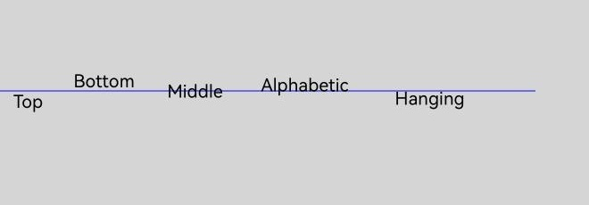

## globalAlpha

设置透明度，此属性为只写属性，可通过赋值语句设置其值，但无法通过读取操作获取其当前值，若尝试读取将返回undefined。

**卡片能力：** 从API version 9开始，该接口支持在ArkTS卡片中使用。

**原子化服务API：** 从API version 11开始，该接口支持在原子化服务中使用。

**系统能力：** SystemCapability.ArkUI.ArkUI.Full

| 名称 | 类型 | 只读 | 可选 | 说明 |
| ------ | ------ | ---------- | -------------- | ---------------------------------------- |
| globalAlpha | number | 否 | 否 | 透明度。<br/>范围为[0.0, 1.0]，0.0为完全透明，1.0为完全不透明。若给定值小于0.0，则取值0.0；若给定值大于1.0，则取值1.0。<br>API version 18之前，设置NaN或Infinity时，在该方法后执行的绘制方法无法绘制。API version 18及以后，设置NaN或Infinity时当前接口不生效，其他传入有效参数的绘制方法正常绘制。<br/>默认值：1.0 |

**示例：**

```ts
// xxx.ets
@Entry
@Component
struct GlobalAlpha {
  private settings: RenderingContextSettings = new RenderingContextSettings(true);
  private context: CanvasRenderingContext2D = new CanvasRenderingContext2D(this.settings);
  private offCanvas: OffscreenCanvas = new OffscreenCanvas(600, 600);
  
  build() {
    Flex({ direction: FlexDirection.Column, alignItems: ItemAlign.Center, justifyContent: FlexAlign.Center }) {
      Canvas(this.context)
        .width('100%')
        .height('100%')
        .backgroundColor('#ffff00')
        .onReady(() => {
          let offContext = this.offCanvas.getContext("2d", this.settings)
          offContext.fillStyle = 'rgb(0,0,255)'
          offContext.fillRect(0, 0, 50, 50)
          // 设置globalAlpha属性
          offContext.globalAlpha = 0.4
          offContext.fillStyle = 'rgb(0,0,255)'
          offContext.fillRect(50, 50, 50, 50)
          let image = this.offCanvas.transferToImageBitmap()
          this.context.transferFromImageBitmap(image)
      })
    }
    .width('100%')
    .height('100%')
  }
}
```

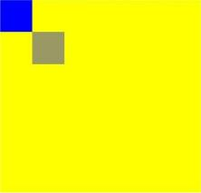

## lineDashOffset

设置画布的虚线偏移量，精度为float，仅当设置setLineDash时属性才生效，此属性为只写属性，可通过赋值语句设置其值，但无法通过读取操作获取其当前值，若尝试读取将返回undefined。

**卡片能力：** 从API version 9开始，该接口支持在ArkTS卡片中使用。

**原子化服务API：** 从API version 11开始，该接口支持在原子化服务中使用。

**系统能力：** SystemCapability.ArkUI.ArkUI.Full

| 名称 | 类型 | 只读 | 可选 | 说明 |
| ------ | ------ | ---------- | -------------- | ---------------------------------------- |
| lineDashOffset | number | 否 | 否 | 画布的虚线偏移量。<br/>默认值：0.0<br/>单位：vp<br/>异常值NaN和Infinity按默认值处理。 |

**示例：**

```ts
// xxx.ets
@Entry
@Component
struct LineDashOffset {
  private settings: RenderingContextSettings = new RenderingContextSettings(true);
  private context: CanvasRenderingContext2D = new CanvasRenderingContext2D(this.settings);
  private offCanvas: OffscreenCanvas = new OffscreenCanvas(600, 600);
  
  build() {
    Flex({ direction: FlexDirection.Column, alignItems: ItemAlign.Center, justifyContent: FlexAlign.Center }) {
      Canvas(this.context)
        .width('100%')
        .height('100%')
        .backgroundColor('#ffff00')
        .onReady(() => {
          let offContext = this.offCanvas.getContext("2d", this.settings)
          offContext.arc(100, 75, 50, 0, 6.28)
          offContext.setLineDash([10, 20])
          // 设置lineDashOffset属性
          offContext.lineDashOffset = 10.0
          offContext.stroke()
          let image = this.offCanvas.transferToImageBitmap()
          this.context.transferFromImageBitmap(image)
      })
    }
    .width('100%')
    .height('100%')
  }
}

```
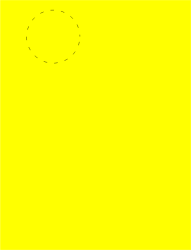

## globalCompositeOperation

设置合成操作的方式，此属性为只写属性，可通过赋值语句设置其值，但无法通过读取操作获取其当前值，若尝试读取将返回undefined。

**卡片能力：** 从API version 9开始，该接口支持在ArkTS卡片中使用。

**原子化服务API：** 从API version 11开始，该接口支持在原子化服务中使用。

**系统能力：** SystemCapability.ArkUI.ArkUI.Full

| 名称 | 类型 | 只读 | 可选 | 说明 |
| ------ | ------ | ---------- | -------------- | ---------------------------------------- |
| globalCompositeOperation | string | 否 | 否 | 合成操作的方式。<br/>类型字段可选值有'source-over'，'source-atop'，'source-in'，'source-out'，'destination-over'，'destination-atop'，'destination-in'，'destination-out'，'lighter'，'copy'，'xor'。<br/>默认值：'source-over' |

| 名称               | 描述                       |
| ---------------- | ------------------------ |
| source-over      | 在现有绘制内容上显示新绘制内容，属于默认值。   |
| source-atop      | 在现有绘制内容顶部显示新绘制内容。        |
| source-in        | 在现有绘制内容中显示新绘制内容。         |
| source-out       | 在现有绘制内容之外显示新绘制内容。        |
| destination-over | 在新绘制内容上方显示现有绘制内容。        |
| destination-atop | 在新绘制内容顶部显示现有绘制内容。        |
| destination-in   | 在新绘制内容中显示现有绘制内容。         |
| destination-out  | 在新绘制内容外显示现有绘制内容。         |
| lighter          | 显示新绘制内容和现有绘制内容。          |
| copy             | 显示新绘制内容而忽略现有绘制内容。        |
| xor              | 使用异或操作对新绘制内容与现有绘制内容进行融合。 |

**示例：**

``` ts
// xxx.ets
@Entry
@Component
struct GlobalCompositeOperation {
  private settings: RenderingContextSettings = new RenderingContextSettings(true);
  private context1: CanvasRenderingContext2D = new CanvasRenderingContext2D(this.settings);
  private context2: CanvasRenderingContext2D = new CanvasRenderingContext2D(this.settings);
  private context3: CanvasRenderingContext2D = new CanvasRenderingContext2D(this.settings);
  private context4: CanvasRenderingContext2D = new CanvasRenderingContext2D(this.settings);
  private context5: CanvasRenderingContext2D = new CanvasRenderingContext2D(this.settings);
  private context6: CanvasRenderingContext2D = new CanvasRenderingContext2D(this.settings);

  build() {
    Column() {
      Row() {
        // 1. source-over：新图形覆盖在原有图形上方（默认行为）
        Canvas(this.context1)
          .width('45%')
          .borderWidth(1)
          .margin(5)
          .onReady(() => {
            let ctx1 = this.context1;
            let offContext = new OffscreenCanvasRenderingContext2D(ctx1.width, ctx1.height, this.settings);
            offContext.fillStyle = 'rgb(39,135,217)';
            offContext.fillRect(25, 25, 75, 75); // 原有图形
            offContext.globalCompositeOperation = 'source-over'; // 默认值，可省略
            offContext.fillStyle = 'rgb(23,169,141)';
            offContext.fillRect(75, 75, 75, 75); // 新图形覆盖
            let image = offContext.transferToImageBitmap();
            this.context1.transferFromImageBitmap(image);
          })
        // 2. destination-out：新图形擦除原有图形（橡皮擦核心逻辑）
        Canvas(this.context2)
          .width('45%')
          .borderWidth(1)
          .margin(5)
          .onReady(() => {
            let ctx2 = this.context2;
            let offContext = new OffscreenCanvasRenderingContext2D(ctx2.width, ctx2.height, this.settings);
            // 先绘制背景
            offContext.fillStyle = 'rgb(39,135,217)';
            offContext.fillRect(0, 0, ctx2.width, ctx2.height);
            // 设置合成模式为擦除
            offContext.globalCompositeOperation = 'destination-out';
            // 绘制圆形作为橡皮擦
            offContext.beginPath();
            offContext.arc(ctx2.width / 2, ctx2.height / 2, 60, 0, Math.PI * 2);
            offContext.fill(); // 擦除圆形区域的背景
            let image = offContext.transferToImageBitmap();
            this.context2.transferFromImageBitmap(image);
          })
      }
      .height('30%')

      Row() {
        // 3. source-in：仅保留新图形与原有图形重叠的部分（裁剪或蒙版）
        Canvas(this.context3)
          .width('45%')
          .borderWidth(1)
          .margin(5)
          .onReady(() => {
            let ctx3 = this.context3;
            let offContext = new OffscreenCanvasRenderingContext2D(ctx3.width, ctx3.height, this.settings);
            // 先绘制原有图形（圆形蒙版）
            offContext.beginPath();
            offContext.arc(ctx3.width / 2, ctx3.height / 2, 80, 0, Math.PI * 2);
            offContext.fillStyle = '#fff';
            offContext.fill();
            // 设置合成模式
            offContext.globalCompositeOperation = 'source-in';
            // 绘制新图形（渐变矩形）
            const gradient = offContext.createLinearGradient(0, 0, ctx3.width, ctx3.height);
            gradient.addColorStop(0, 'rgb(23,169,141)');
            gradient.addColorStop(1, 'rgb(39,135,217)');
            offContext.fillStyle = gradient;
            offContext.fillRect(0, 0, 200, 200); // 仅圆形区域显示渐变
            let image = offContext.transferToImageBitmap();
            this.context3.transferFromImageBitmap(image);
          })
        // 4. lighter：新图形与原有图形叠加（亮度相加，滤色效果）
        Canvas(this.context4)
          .width('45%')
          .borderWidth(1)
          .margin(5)
          .onReady(() => {
            let ctx4 = this.context4;
            let offContext = new OffscreenCanvasRenderingContext2D(ctx4.width, ctx4.height, this.settings);
            // 原有图形（半透明红色圆）
            offContext.beginPath();
            offContext.arc(70, 100, 50, 0, Math.PI * 2);
            offContext.fillStyle = 'rgba(234, 67, 53, 0.7)';
            offContext.fill();
            // 设置合成模式
            offContext.globalCompositeOperation = 'lighter';
            // 新图形（半透明蓝色圆）
            offContext.beginPath();
            offContext.arc(110, 100, 50, 0, Math.PI * 2);
            offContext.fillStyle = 'rgba(66, 133, 244, 0.7)';
            offContext.fill(); // 重叠区域变成紫色（亮度叠加）
            let image = offContext.transferToImageBitmap();
            this.context4.transferFromImageBitmap(image);
          })
      }
      .height('30%')

      Row() {
        // 5. destination-atop：保留原有图形与新图形重叠的部分，移除其他区域
        Canvas(this.context5)
          .width('45%')
          .borderWidth(1)
          .margin(5)
          .onReady(() => {
            let ctx5 = this.context5;
            let offContext = new OffscreenCanvasRenderingContext2D(ctx5.width, ctx5.height, this.settings);
            // 原有图形（绿色矩形）
            offContext.fillStyle = 'rgb(23,169,141)';
            offContext.fillRect(0, 0, ctx5.width, ctx5.height);
            // 设置合成模式
            offContext.globalCompositeOperation = 'destination-atop';
            // 新图形（小圆形）
            offContext.beginPath();
            offContext.arc(ctx5.width / 2, ctx5.height / 2, 60, 0, Math.PI * 2);
            offContext.fillStyle = '#000';
            offContext.fill(); // 仅矩形与圆形重叠的部分保留
            let image = offContext.transferToImageBitmap();
            this.context5.transferFromImageBitmap(image);
          })
        // 6. 文字蒙版（“source-in”的高级用法）
        Canvas(this.context6)
          .width('45%')
          .borderWidth(1)
          .margin(5)
          .onReady(() => {
            let ctx6 = this.context6;
            let offContext = new OffscreenCanvasRenderingContext2D(ctx6.width, ctx6.height, this.settings);
            // 先绘制文字（作为蒙版）
            offContext.font = 'bold 40vp';
            offContext.textAlign = 'center';
            offContext.textBaseline = 'middle';
            offContext.fillText('CANVAS', ctx6.width / 2, ctx6.height / 2);
            // 设置合成模式
            offContext.globalCompositeOperation = 'source-in';
            // 绘制渐变背景（仅文字区域显示）
            let textGradient = offContext.createLinearGradient(50, 0, 300, 100);
            textGradient.addColorStop(0.0, 'rgb(39,135,217)');
            textGradient.addColorStop(0.5, 'rgb(255,238,240)');
            textGradient.addColorStop(1.0, 'rgb(23,169,141)');
            offContext.fillStyle = textGradient;
            offContext.fillRect(0, 0, 200, 200); // 渐变仅填充文字区域
            let image = offContext.transferToImageBitmap();
            this.context6.transferFromImageBitmap(image);
          })
      }
      .height('30%')
    }
    .width('100%')
    .height('100%')
  }
}
```

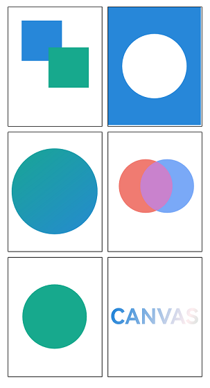

## shadowBlur

设置绘制阴影时的模糊级别，此属性为只写属性，可通过赋值语句设置其值，但无法通过读取操作获取其当前值，若尝试读取将返回undefined。

**卡片能力：** 从API version 9开始，该接口支持在ArkTS卡片中使用。

**原子化服务API：** 从API version 11开始，该接口支持在原子化服务中使用。

**系统能力：** SystemCapability.ArkUI.ArkUI.Full

| 名称 | 类型 | 只读 | 可选 | 说明 |
| ------ | ------ | ---------- | -------------- | ---------------------------------------- |
| shadowBlur | number | 否 | 否 | 绘制阴影时的模糊级别，值越大越模糊，精度为float，取值范围≥0。<br/>默认值：0.0<br/>单位：px<br/>shadowBlur取值不支持负数，负数、NaN和Infinity按默认值处理。 |

**示例：**

```ts
// xxx.ets
@Entry
@Component
struct ShadowBlur {
  private settings: RenderingContextSettings = new RenderingContextSettings(true);
  private context: CanvasRenderingContext2D = new CanvasRenderingContext2D(this.settings);
  private offCanvas: OffscreenCanvas = new OffscreenCanvas(600, 600);
  
  build() {
    Flex({ direction: FlexDirection.Column, alignItems: ItemAlign.Center, justifyContent: FlexAlign.Center }) {
      Canvas(this.context)
        .width('100%')
        .height('100%')
        .backgroundColor('rgb(213,213,213)')
        .onReady(() => {
          let offContext = this.offCanvas.getContext("2d", this.settings)
          // 设置shadowBlur属性
          offContext.shadowBlur = 30
          offContext.shadowColor = 'rgb(0,0,0)'
          offContext.fillStyle = 'rgb(39,135,217)'
          offContext.fillRect(20, 20, 100, 80)
          let image = this.offCanvas.transferToImageBitmap()
          this.context.transferFromImageBitmap(image)
      })
    }
    .width('100%')
    .height('100%')
  }
}
```

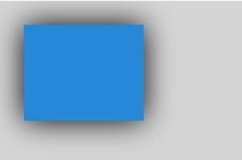

## shadowColor

设置绘制阴影时的阴影颜色，此属性为只写属性，可通过赋值语句设置其值，但无法通过读取操作获取其当前值，若尝试读取将返回undefined。

**卡片能力：** 从API version 9开始，该接口支持在ArkTS卡片中使用。

**原子化服务API：** 从API version 11开始，该接口支持在原子化服务中使用。

**系统能力：** SystemCapability.ArkUI.ArkUI.Full

| 名称 | 类型 | 只读 | 可选 | 说明 |
| ------ | ------ | ---------- | -------------- | ---------------------------------------- |
| shadowColor | string | 否 | 否 | 绘制阴影时的阴影颜色，颜色格式参考[ResourceColor](ts-types.md#resourcecolor)中string类型说明。<br/>默认值：透明黑色 |

**示例：**

```ts
// xxx.ets
@Entry
@Component
struct ShadowColor {
  private settings: RenderingContextSettings = new RenderingContextSettings(true);
  private context: CanvasRenderingContext2D = new CanvasRenderingContext2D(this.settings);
  private offCanvas: OffscreenCanvas = new OffscreenCanvas(600, 600);
  
  build() {
    Flex({ direction: FlexDirection.Column, alignItems: ItemAlign.Center, justifyContent: FlexAlign.Center }) {
      Canvas(this.context)
        .width('100%')
        .height('100%')
        .backgroundColor('rgb(213,213,213)')
        .onReady(() => {
          let offContext = this.offCanvas.getContext("2d", this.settings)
          offContext.shadowBlur = 30
          // 设置shadowColor属性
          offContext.shadowColor = 'rgb(255,192,0)'
          offContext.fillStyle = 'rgb(39,135,217)'
          offContext.fillRect(30, 30, 100, 100)
          let image = this.offCanvas.transferToImageBitmap()
          this.context.transferFromImageBitmap(image)
      })
    }
    .width('100%')
    .height('100%')
  }
}
```

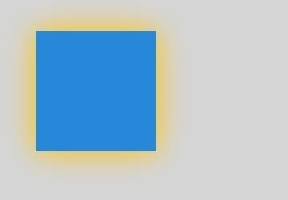

## shadowOffsetX

设置绘制阴影时和原有对象的水平偏移值，此属性为只写属性，可通过赋值语句设置其值，但无法通过读取操作获取其当前值，若尝试读取将返回undefined。

**卡片能力：** 从API version 9开始，该接口支持在ArkTS卡片中使用。

**原子化服务API：** 从API version 11开始，该接口支持在原子化服务中使用。

**系统能力：** SystemCapability.ArkUI.ArkUI.Full

| 名称 | 类型 | 只读 | 可选 | 说明 |
| ------ | ------ | ---------- | -------------- | ---------------------------------------- |
| shadowOffsetX | number | 否 | 否 | 绘制阴影时和原有对象的水平偏移值。<br/>默认值：0.0<br/>默认单位：vp<br/>异常值NaN和Infinity按默认值处理。 |

**示例：**

```ts
// xxx.ets
@Entry
@Component
struct ShadowOffsetX {
  private settings: RenderingContextSettings = new RenderingContextSettings(true);
  private context: CanvasRenderingContext2D = new CanvasRenderingContext2D(this.settings);
  private offCanvas: OffscreenCanvas = new OffscreenCanvas(600, 600);
  
  build() {
    Flex({ direction: FlexDirection.Column, alignItems: ItemAlign.Center, justifyContent: FlexAlign.Center }) {
      Canvas(this.context)
        .width('100%')
        .height('100%')
        .backgroundColor('#ffff00')
        .onReady(() => {
          let offContext = this.offCanvas.getContext("2d", this.settings)
          offContext.shadowBlur = 10
          // 设置shadowOffsetX属性
          offContext.shadowOffsetX = 20
          offContext.shadowColor = 'rgb(0,0,0)'
          offContext.fillStyle = 'rgb(255,0,0)'
          offContext.fillRect(20, 20, 100, 80)
          let image = this.offCanvas.transferToImageBitmap()
          this.context.transferFromImageBitmap(image)
      })
    }
    .width('100%')
    .height('100%')
  }
}
```

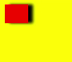

## shadowOffsetY

设置绘制阴影时和原有对象的垂直偏移值，此属性为只写属性，可通过赋值语句设置其值，但无法通过读取操作获取其当前值，若尝试读取将返回undefined。

**卡片能力：** 从API version 9开始，该接口支持在ArkTS卡片中使用。

**原子化服务API：** 从API version 11开始，该接口支持在原子化服务中使用。

**系统能力：** SystemCapability.ArkUI.ArkUI.Full

| 名称 | 类型 | 只读 | 可选 | 说明 |
| ------ | ------ | ---------- | -------------- | ---------------------------------------- |
| shadowOffsetY | number | 否 | 否 | 绘制阴影时和原有对象的垂直偏移值。<br/>默认值：0.0<br/>默认单位：vp<br/>异常值NaN和Infinity按默认值处理。 |

**示例：**

```ts
// xxx.ets
@Entry
@Component
struct ShadowOffsetY {
  private settings: RenderingContextSettings = new RenderingContextSettings(true);
  private context: CanvasRenderingContext2D = new CanvasRenderingContext2D(this.settings);
  private offCanvas: OffscreenCanvas = new OffscreenCanvas(600, 600);

  build() {
    Flex({ direction: FlexDirection.Column, alignItems: ItemAlign.Center, justifyContent: FlexAlign.Center }) {
      Canvas(this.context)
        .width('100%')
        .height('100%')
        .backgroundColor('#ffff00')
        .onReady(() => {
          let offContext = this.offCanvas.getContext("2d", this.settings)
          offContext.shadowBlur = 10
          // 设置shadowOffsetY属性
          offContext.shadowOffsetY = 20
          offContext.shadowColor = 'rgb(0,0,0)'
          offContext.fillStyle = 'rgb(255,0,0)'
          offContext.fillRect(30, 30, 100, 100)
          let image = this.offCanvas.transferToImageBitmap()
          this.context.transferFromImageBitmap(image)
      })
    }
    .width('100%')
    .height('100%')
  }
}
```

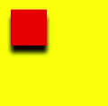

## imageSmoothingEnabled

用于设置绘制图片时是否进行图像平滑度调整，true为启用，false为不启用，此属性为只写属性，可通过赋值语句设置其值，但无法通过读取操作获取其当前值，若尝试读取将返回undefined。

**卡片能力：** 从API version 9开始，该接口支持在ArkTS卡片中使用。

**原子化服务API：** 从API version 11开始，该接口支持在原子化服务中使用。

**系统能力：** SystemCapability.ArkUI.ArkUI.Full

| 名称 | 类型 | 只读 | 可选 | 说明 |
| ------ | ------ | ---------- | -------------- | ---------------------------------------- |
| imageSmoothingEnabled | boolean | 否 | 否 | 绘制图片时是否进行图像平滑度调整。<br/>默认值：true |

**示例：**

> **说明：**
>
> 此示例的资源不在src > main > resource目录下，从DevEco Studio 6.0.0 Beta2版本开始，新建工程或模块时，默认创建的模块不会对非resources目录下的资源进行打包，需使能相关开关：模块的build-profile.json5中buildOption > resOptions > copyCodeResource > enable设置为true，详见resOptions中[copyCodeResource](https://developer.huawei.com/consumer/cn/doc/harmonyos-guides/ide-hvigor-build-profile#section754823013348)相关介绍。

```ts
// xxx.ets
@Entry
@Component
struct ImageSmoothingEnabled {
  private settings: RenderingContextSettings = new RenderingContextSettings(true);
  private context: CanvasRenderingContext2D = new CanvasRenderingContext2D(this.settings);
  // "common/images/icon.jpg"需要替换为开发者所需的图像资源文件
  private img:ImageBitmap = new ImageBitmap("common/images/icon.jpg");
  private offCanvas: OffscreenCanvas = new OffscreenCanvas(600, 600);
  
  build() {
    Flex({ direction: FlexDirection.Column, alignItems: ItemAlign.Center, justifyContent: FlexAlign.Center }) {
      Canvas(this.context)
        .width('100%')
        .height('100%')
        .backgroundColor('#ffff00')
        .onReady(() => {
          let offContext = this.offCanvas.getContext("2d", this.settings)
          // 设置imageSmoothingEnabled属性
          offContext.imageSmoothingEnabled = false
          offContext.drawImage(this.img, 0, 0, 400, 200)
          let image = this.offCanvas.transferToImageBitmap()
          this.context.transferFromImageBitmap(image)
      })
    }
    .width('100%')
    .height('100%')
  }
}
```

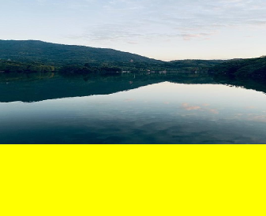

## imageSmoothingQuality

imageSmoothingEnabled为true时，用于设置图像平滑度，此属性为只写属性，可通过赋值语句设置其值，但无法通过读取操作获取其当前值，若尝试读取将返回undefined。

**卡片能力：** 从API version 9开始，该接口支持在ArkTS卡片中使用。

**原子化服务API：** 从API version 11开始，该接口支持在原子化服务中使用。

**系统能力：** SystemCapability.ArkUI.ArkUI.Full

| 名称 | 类型 | 只读 | 可选 | 说明 |
| ------ | ------ | ---------- | -------------- | ---------------------------------------- |
| imageSmoothingQuality | [ImageSmoothingQuality](#imagesmoothingquality) | 否 | 否 | 图像平滑度。<br/>默认值："low" |

**示例：**

> **说明：**
>
> 此示例的资源不在src > main > resource目录下，从DevEco Studio 6.0.0 Beta2版本开始，新建工程或模块时，默认创建的模块不会对非resources目录下的资源进行打包，需使能相关开关：模块的build-profile.json5中buildOption > resOptions > copyCodeResource > enable设置为true，详见resOptions中[copyCodeResource](https://developer.huawei.com/consumer/cn/doc/harmonyos-guides/ide-hvigor-build-profile#section754823013348)相关介绍。

```ts
  // xxx.ets
  @Entry
  @Component
  struct ImageSmoothingQualityDemoOff {
    private settings: RenderingContextSettings = new RenderingContextSettings(true);
    private context: CanvasRenderingContext2D = new CanvasRenderingContext2D(this.
settings);
    private offCanvas: OffscreenCanvas = new OffscreenCanvas(600, 600);
    // "common/images/example.jpg"需要替换为开发者所需的图像资源文件
    private img:ImageBitmap = new ImageBitmap("common/images/example.jpg");

    build() {
      Flex({ direction: FlexDirection.Column, alignItems: ItemAlign.Center, 
justifyContent: FlexAlign.Center }) {
        Canvas(this.context)
          .width('100%')
          .height('100%')
          .backgroundColor('#ffff00')
          .onReady(() => {
            let offContext = this.offCanvas.getContext("2d", this.settings)
            let offctx = offContext
            offctx.imageSmoothingEnabled = true
            // 设置imageSmoothingQuality属性
            offctx.imageSmoothingQuality = 'high'
            offctx.drawImage(this.img, 0, 0, 400, 200)

            let image = this.offCanvas.transferToImageBitmap()
            this.context.transferFromImageBitmap(image)
          })
      }
      .width('100%')
      .height('100%')
    }
  }
```

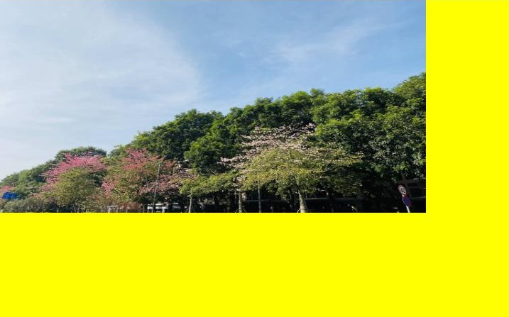

## direction

用于设置绘制文字时使用的文字方向，此属性为只写属性，可通过赋值语句设置其值，但无法通过读取操作获取其当前值，若尝试读取将返回undefined。

**卡片能力：** 从API version 9开始，该接口支持在ArkTS卡片中使用。

**原子化服务API：** 从API version 11开始，该接口支持在原子化服务中使用。

**系统能力：** SystemCapability.ArkUI.ArkUI.Full

| 名称 | 类型 | 只读 | 可选 | 说明 |
| ------ | ------ | ---------- | -------------- | ---------------------------------------- |
| direction | [CanvasDirection](#canvasdirection) | 否 | 否 | 绘制文字时使用的文字方向。<br/>默认值："inherit" |

**示例：**

```ts
  // xxx.ets
  @Entry
  @Component
  struct DirectionDemoOff {
    private settings: RenderingContextSettings = new RenderingContextSettings(true);
    private context: CanvasRenderingContext2D = new CanvasRenderingContext2D(this.
settings);
    private offCanvas: OffscreenCanvas = new OffscreenCanvas(600, 600);

    build() {
      Flex({ direction: FlexDirection.Column, alignItems: ItemAlign.Center, 
justifyContent: FlexAlign.Center }) {
        Canvas(this.context)
          .width('100%')
          .height('100%')
          .backgroundColor('#ffff00')
          .onReady(() => {
            let offContext = this.offCanvas.getContext("2d", this.settings)
            let offctx = offContext
            offctx.font = '48px serif';
            offctx.textAlign = 'start'
            offctx.fillText("Hi ltr!", 200, 50);

            // 设置direction属性
            offctx.direction = "rtl";
            offctx.fillText("Hi rtl!", 200, 100);

            let image = offctx.transferToImageBitmap()
            this.context.transferFromImageBitmap(image)
          })
      }
      .width('100%')
      .height('100%')
    }
  }
```


## filter

用于设置图像的滤镜，可以组合任意数量的滤镜，此属性为只写属性，可通过赋值语句设置其值，但无法通过读取操作获取其当前值，若尝试读取将返回undefined。

**卡片能力：** 从API version 9开始，该接口支持在ArkTS卡片中使用。

**原子化服务API：** 从API version 11开始，该接口支持在原子化服务中使用。

**系统能力：** SystemCapability.ArkUI.ArkUI.Full

<!--Table: 10%; 10%; 10%; 70%-->
| 名称 | 类型 | 只读 | 可选 | 说明 |
| ------ | ------ | ---------- | -------------- | ---------------------------------------- |
| filter | string | 否 | 否 | 图像的滤镜。<br/>支持的滤镜效果如下：<br/>- 'none': 无滤镜效果。<br/>- 'blur(\<length>)'：给图像设置高斯模糊，取值范围≥0，支持单位px、vp、rem，默认值：blur(0px)。<br/>- 'brightness([\<number>\|\<percentage>])'：给图片应用一种线性乘法，使其看起来更亮或更暗，支持数字和百分比参数，取值范围≥0，默认值：brightness(1)。<br/>- 'contrast([\<number>\|\<percentage>])'：调整图像的对比度，支持数字和百分比参数，取值范围≥0，默认值：contrast(1)。<br/>- 'grayscale([\<number>\|\<percentage>])'：将图像转换为灰度图像，支持数字和百分比参数，取值范围[0, 1]，默认值：grayscale(0)。<br/>- 'hue-rotate(\<angle>)'：给图像应用色相旋转，取值范围0deg-360deg，默认值：hue-rotate(0deg)。<br/>- 'invert([\<number>\|\<percentage>])'：反转输入图像，支持数字和百分比参数，取值范围[0, 1]，默认值：invert(0)。<br/>- 'opacity([\<number>\|\<percentage>])'：调整图像的透明程度，支持数字和百分比参数，取值范围[0, 1]，默认值：opacity(1)。<br/>- 'saturate([\<number>\|\<percentage>])'：转换图像饱和度，支持数字和百分比参数，取值范围≥0，默认值：saturate(1)。<br/>- 'sepia([\<number>\|\<percentage>])'：将图像转换为深褐色，支持数字和百分比参数，取值范围[0, 1]，默认值：sepia(0)。|

**示例：**

> **说明：**
>
> 此示例的资源不在src > main > resource目录下，从DevEco Studio 6.0.0 Beta2版本开始，新建工程或模块时，默认创建的模块不会对非resources目录下的资源进行打包，需使能相关开关：模块的build-profile.json5中buildOption > resOptions > copyCodeResource > enable设置为true，详见resOptions中[copyCodeResource](https://developer.huawei.com/consumer/cn/doc/harmonyos-guides/ide-hvigor-build-profile#section754823013348)相关介绍。

```ts
  // xxx.ets
  @Entry
  @Component
  struct FilterDemoOff {
    private settings: RenderingContextSettings = new RenderingContextSettings(true);
    private context: CanvasRenderingContext2D = new CanvasRenderingContext2D(this.settings);
    private offCanvas: OffscreenCanvas = new OffscreenCanvas(600, 600);
    // "common/images/example.jpg"需要替换为开发者所需的图像资源文件
    private img: ImageBitmap = new ImageBitmap("common/images/example.jpg");

    build() {
      Flex({ direction: FlexDirection.Column, alignItems: ItemAlign.Center, justifyContent: FlexAlign.Center }) {
        Canvas(this.context)
          .width('100%')
          .height('100%')
          .onReady(() => {
            let offContext = this.offCanvas.getContext("2d", this.settings)
            let img = this.img

            offContext.drawImage(img, 0, 0, 100, 100);

            offContext.filter = 'grayscale(50%)';
            offContext.drawImage(img, 100, 0, 100, 100);

            offContext.filter = 'sepia(60%)';
            offContext.drawImage(img, 200, 0, 100, 100);

            offContext.filter = 'saturate(30%)';
            offContext.drawImage(img, 0, 100, 100, 100);

            offContext.filter = 'hue-rotate(90deg)';
            offContext.drawImage(img, 100, 100, 100, 100);

            offContext.filter = 'invert(100%)';
            offContext.drawImage(img, 200, 100, 100, 100);

            offContext.filter = 'opacity(25%)';
            offContext.drawImage(img, 0, 200, 100, 100);

            offContext.filter = 'brightness(0.4)';
            offContext.drawImage(img, 100, 200, 100, 100);

            offContext.filter = 'contrast(200%)';
            offContext.drawImage(img, 200, 200, 100, 100);

            offContext.filter = 'blur(5px)';
            offContext.drawImage(img, 0, 300, 100, 100);

            // Applying multiple filters
            offContext.filter = 'opacity(50%) contrast(200%) grayscale(50%)';
            offContext.drawImage(img, 100, 300, 100, 100);

            let image = this.offCanvas.transferToImageBitmap()
            this.context.transferFromImageBitmap(image)
          })
      }
      .width('100%')
      .height('100%')
    }
  }
```


## letterSpacing<sup>18+</sup>

用于指定绘制文本时字母之间的间距，此属性为只写属性，可通过赋值语句设置其值，但无法通过读取操作获取其当前值，若尝试读取将返回undefined。

**原子化服务API：** 从API version 18开始，该接口支持在原子化服务中使用。

**系统能力：** SystemCapability.ArkUI.ArkUI.Full

<!--Table: 25%; 10%; 10%; 55%-->
| 名称 | 类型 | 只读 | 可选 | 说明 |
| ------ | ------ | ---------- | -------------- | ---------------------------------------- |
| letterSpacing | string&nbsp;\| [LengthMetrics](../js-apis-arkui-graphics.md#lengthmetrics12) | 否 | 否 | 绘制文本时字母之间的间距。<br/>当使用LengthMetrics时：<br/>字间距按照指定的单位设置；<br/>不支持FP、PERCENT和LPX（按无效值处理）；<br/>支持负数和小数，设为小数时字间距不四舍五入。<br/>当使用string时：<br/>不支持设置百分比（按无效值处理）；<br/>支持负数和小数，设为小数时字间距不四舍五入；<br/>若letterSpacing的赋值未指定单位（例如：letterSpacing='10'），且未指定LengthMetricsUnit时，默认单位设置为vp；<br/>指定LengthMetricsUnit为px时，默认单位设置为px；<br/>当letterSpacing的赋值指定单位时（例如：letterSpacing='10vp'），字间距按照指定的单位设置。<br/>默认值：0（输入无效值时，字间距设为默认值）<br/>注：推荐使用LengthMetrics，性能更好。 |

**示例：**

```ts
  // xxx.ets
  import { LengthMetrics, LengthUnit } from '@kit.ArkUI';

  @Entry
  @Component
  struct letterSpacingDemo {
    private settings: RenderingContextSettings = new RenderingContextSettings(true);
    private context: CanvasRenderingContext2D = new CanvasRenderingContext2D(this.settings);
    private offCanvas: OffscreenCanvas = new OffscreenCanvas(600, 600);

    build() {
      Flex({ direction: FlexDirection.Column, alignItems: ItemAlign.Center, justifyContent: FlexAlign.Center }) {
        Canvas(this.context)
          .width('100%')
          .height('100%')
          .backgroundColor('rgb(213,213,213)')
          .onReady(() => {
            let offContext = this.offCanvas.getContext("2d", this.settings)
            offContext.font = '30vp'
            // 使用string设置letterSpacing属性
            offContext.letterSpacing = '10vp'
            offContext.fillText('hello world', 30, 50)
            // 使用LengthMetrics对象设置letterSpacing属性
            offContext.letterSpacing = new LengthMetrics(10, LengthUnit.VP)
            offContext.fillText('hello world', 30, 100)
            let image = this.offCanvas.transferToImageBitmap()
            this.context.transferFromImageBitmap(image)
          })
      }
      .width('100%')
      .height('100%')
    }
  }
```

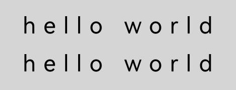

## antialias<sup>24+</sup>

用于设置绘制图形和文本时是否开启抗锯齿。设置此接口会覆盖[RenderingContextSettings](ts-canvasrenderingcontext2d.md#renderingcontextsettings)中的抗锯齿效果，未通过该接口设置时，默认值为undefined，与[RenderingContextSettings](ts-canvasrenderingcontext2d.md#renderingcontextsettings)中的抗锯齿效果保持一致。

**模型约束：** 此接口仅可在Stage模型下使用。

**原子化服务API：** 从API version 24开始，该接口支持在原子化服务中使用。

**系统能力：** SystemCapability.ArkUI.ArkUI.Full

| 名称 | 类型 | 只读 | 可选 | 说明 |
| ------ | ------ | ------ | ------ | ------ |
| antialias | boolean | 否 | 否 | 设置绘制图形和文本时是否开启抗锯齿。<br/>true表示开启抗锯齿；false表示不开启抗锯齿。<br/>值为undefined时，与[RenderingContextSettings](ts-canvasrenderingcontext2d.md#renderingcontextsettings)中的抗锯齿效果保持一致。 |

**示例：** 

```ts
// xxx.ets
@Entry
@Component
struct AntialiasDemoOff {
  private settings: RenderingContextSettings = new RenderingContextSettings(true);
  private context: CanvasRenderingContext2D = new CanvasRenderingContext2D(this.settings);
  private offCanvas: OffscreenCanvas = new OffscreenCanvas(600, 600);

  build() {
    Flex({ direction: FlexDirection.Column, alignItems: ItemAlign.Center, justifyContent: FlexAlign.Center }) {
      Canvas(this.context)
        .width('100%')
        .height('100%')
        .backgroundColor('rgb(213,213,213)')
        .onReady(() => {
          let offContext = this.offCanvas.getContext("2d", this.settings);
          let anti = offContext.antialias;
          console.info(`current antialias is ${anti}`);
          // 设置antialias属性为非抗锯齿
          offContext.antialias = false;
          offContext.strokeStyle = 'rgb(0,0,0)';
          offContext.lineWidth = 2;
          offContext.beginPath();
          offContext.arc(150, 150, 100, 0, Math.PI);
          offContext.stroke();
          offContext.font = 'normal bold 30vp monospace';
          offContext.fillText("Hello World", 20, 100);
          anti = offContext.antialias;
          console.info(`current antialias is ${anti}`);

          // 设置antialias属性为抗锯齿
          offContext.antialias = true;
          offContext.beginPath();
          offContext.arc(150, 350, 100, 0, Math.PI);
          offContext.stroke();
          offContext.font = 'normal bold 30vp monospace';
          offContext.fillText("Hello World", 20, 300);
          anti = offContext.antialias;
          console.info(`current antialias is ${anti}`);
          let image = this.offCanvas.transferToImageBitmap();
          this.context.transferFromImageBitmap(image);
        })
    }
    .width('100%')
    .height('100%')
  }
}
```

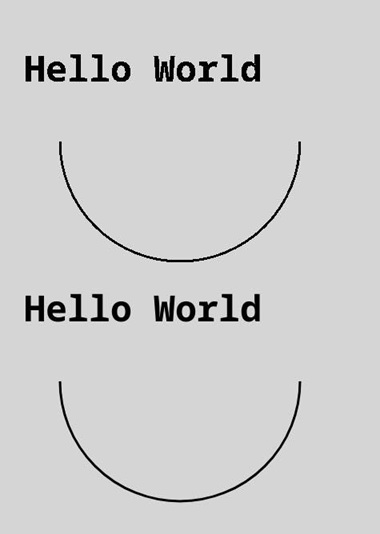

## CanvasDirection

type CanvasDirection = "inherit" | "ltr" | "rtl"

定义当前文本方向的类型。取值类型为下表类型中的并集。

**卡片能力：** 从API version 9开始，该接口支持在ArkTS卡片中使用。

**原子化服务API：** 从API version 11开始，该接口支持在原子化服务中使用。

**系统能力：** SystemCapability.ArkUI.ArkUI.Full

| 类型      | 说明                  |
| ------- | ------------------- |
| "inherit" | 继承canvas组件通用属性已设定的文本方向，若canvas组件未设置direction属性，则跟随系统文字方向。 |
| "ltr"     | 从左往右。               |
| "rtl"     | 从右往左。               |

## CanvasLineCap

type CanvasLineCap = "butt" | "round" | "square"

定义绘制每条线段端点的类型。取值类型为下表类型中的并集。

**卡片能力：** 从API version 9开始，该接口支持在ArkTS卡片中使用。

**原子化服务API：** 从API version 11开始，该接口支持在原子化服务中使用。

**系统能力：** SystemCapability.ArkUI.ArkUI.Full

| 类型      | 说明                           |
| ------ | ----------------------------- |
| "butt"   | 线条两端为平行线，不额外扩展。               |
| "round"  | 在线条两端延伸半个圆，直径等于线宽。            |
| "square" | 在线条两端延伸一个矩形，宽度等于线宽的一半，高度等于线宽。 |

## CanvasLineJoin

type CanvasLineJoin = "bevel" | "miter" | "round"

定义长度不为0的两个连接部分（线段、圆弧和曲线）的类型。取值类型为下表类型中的并集。

**卡片能力：** 从API version 9开始，该接口支持在ArkTS卡片中使用。

**原子化服务API：** 从API version 11开始，该接口支持在原子化服务中使用。

**系统能力：** SystemCapability.ArkUI.ArkUI.Full

| 类型      | 说明                                       |
| ----- | ---------------------------------------- |
| "bevel" | 在线段相连处使用三角形为底填充， 每个部分矩形拐角独立。             |
| "miter" | 在相连部分的外边缘处进行延伸，使其相交于一点，形成一个菱形区域，该属性可以通过设置miterLimit属性展现效果。 |
| "round" | 在线段相连处绘制一个扇形，扇形的圆角半径是线段的宽度。              |

## CanvasTextAlign

type CanvasTextAlign = "center" | "end" | "left" | "right" | "start"

定义文本对齐方式的类型。取值类型为下表类型中的并集。

**卡片能力：** 从API version 9开始，该接口支持在ArkTS卡片中使用。

**原子化服务API：** 从API version 11开始，该接口支持在原子化服务中使用。

**系统能力：** SystemCapability.ArkUI.ArkUI.Full

| 类型      | 说明           |
| ------ | ------------ |
| "center" | 文本居中对齐。      |
| "start"  | 文本对齐界线开始的地方。 |
| "end"    | 文本对齐界线结束的地方。 |
| "left"   | 文本左对齐。       |
| "right"  | 文本右对齐。       |

## CanvasTextBaseline

type CanvasTextBaseline = "alphabetic" | "bottom" | "hanging" | "ideographic" | "middle" | "top"

定义文本基线类型。取值类型为下表类型中的并集。

**卡片能力：** 从API version 9开始，该接口支持在ArkTS卡片中使用。

**原子化服务API：** 从API version 11开始，该接口支持在原子化服务中使用。

**系统能力：** SystemCapability.ArkUI.ArkUI.Full

| 类型      | 说明                                       |
| ----------- | ---------------------------------------- |
| "alphabetic"  | 文本基线是标准的字母基线。                            |
| "bottom"      | 文本基线在文本块的底部。 与ideographic基线的区别在于ideographic基线不需要考虑下行字母。 |
| "hanging"     | 文本基线是悬挂基线。                               |
| "ideographic" | 文字基线是表意字基线；如果字符本身超出了alphabetic基线，那么ideographic基线位置在字符本身的底部。 |
| "middle"      | 文本基线在文本块的中间。                             |
| "top"         | 文本基线在文本块的顶部。                             |

## ImageSmoothingQuality

type ImageSmoothingQuality = "high" | "low" | "medium"

定义图片平滑度类型。取值类型为下表类型中的并集。

**卡片能力：** 从API version 9开始，该接口支持在ArkTS卡片中使用。

**原子化服务API：** 从API version 11开始，该接口支持在原子化服务中使用。

**系统能力：** SystemCapability.ArkUI.ArkUI.Full

| 类型      | 说明   |
| ------ | ---- |
| "low"    | 低画质。  |
| "medium" | 中画质。  |
| "high"   | 高画质。  |
