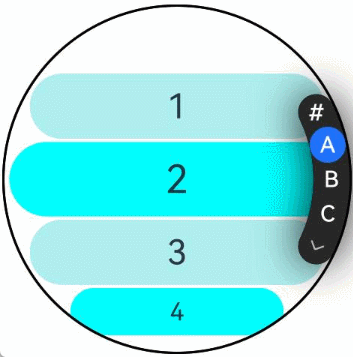

# ArcAlphabetIndexer

弧形索引条是一种弧形的、可按字母顺序排序进行快速定位的组件，可以与容器组件联动，按逻辑结构快速定位至容器显示区域。

>  **说明：**
>
>	 
> - 本模块同时支持ArkTS-Dyn、ArkTS-Sta。
>
> - 该组件从API version 18开始支持。后续版本如有新增内容，则采用上角标单独标记该内容的起始版本。


## 导入模块

```
import { ArcAlphabetIndexer, ArcAlphabetIndexerAttribute } from '@kit.ArkUI';
```


## 子组件

无


## 接口

ArcAlphabetIndexer(info: ArcAlphabetIndexerInitInfo)

创建弧形索引条实例，传入弧形索引条配置项参数。

**原子化服务API：** 从API version 18开始，该接口支持在原子化服务中使用。

**系统能力：** SystemCapability.ArkUI.ArkUI.Circle

**模型约束：** 此接口仅可在Stage模型下使用。

**ArkTS-Dyn起始版本：** 18
 	 
**ArkTS-Sta起始版本：** 24

**参数：**  参数内容为设置弧形索引条索引项字符串数组、初始选中项索引位置。

| 参数名     | 类型     | 必填     | 说明     |
| -------- | -------- | -------- | -------- |
| info     | [ArcAlphabetIndexerInitInfo](#arcalphabetindexerinitinfo对象说明) | 是 | 定义弧形字母索引条的初始化参数。 |


## 属性

除支持[通用属性](ts-component-general-attributes.md)外，还支持以下属性：

### color

color(color: Optional&lt;ColorMetrics&gt;)

设置普通状态下索引项文字颜色。未通过该接口设置时，默认0xFFFFFF，显示为白色。

**原子化服务API：** 从API version 18开始，该接口支持在原子化服务中使用。

**系统能力：** SystemCapability.ArkUI.ArkUI.Circle

**模型约束：** 此接口仅可在Stage模型下使用。

**ArkTS-Dyn起始版本：** 18
 	 
**ArkTS-Sta起始版本：** 24

**参数：**

| 参数名 | 类型                                       | 必填 | 说明                                |
| ------ | ------------------------------------------ | ---- | ----------------------------------- |
| color  | [Optional](ts-universal-attributes-custom-property.md#optional12)&lt;[ColorMetrics](../js-apis-arkui-graphics.md#colormetrics12)&gt; | 是  | 文字颜色。<br/>取值为undefined时，普通状态下索引项文字颜色为0xFFFFFF，显示为白色。 |

### selectedColor

selectedColor(color: Optional&lt;ColorMetrics&gt;)

设置选中项文字颜色。未通过该接口设置时，默认0xFFFFFF，显示为白色。

**原子化服务API：** 从API version 18开始，该接口支持在原子化服务中使用。

**系统能力：** SystemCapability.ArkUI.ArkUI.Circle

**模型约束：** 此接口仅可在Stage模型下使用。

**ArkTS-Dyn起始版本：** 18
 	 
**ArkTS-Sta起始版本：** 24

**参数：**

| 参数名 | 类型                                       | 必填 | 说明                                      |
| ------ | ------------------------------------------ | ---- | ----------------------------------------- |
| color  | [Optional](ts-universal-attributes-custom-property.md#optional12)&lt;[ColorMetrics](../js-apis-arkui-graphics.md#colormetrics12)&gt; | 是   | 选中项文字颜色。<br/>取值为undefined时，选中项文字颜色为0xFFFFFF，显示为白色。 |

### popupColor

popupColor(color: Optional&lt;ColorMetrics&gt;)

设置提示弹窗文字颜色。未通过该接口设置时，默认0xFFFFFF，显示为白色。

**原子化服务API：** 从API version 18开始，该接口支持在原子化服务中使用。

**系统能力：** SystemCapability.ArkUI.ArkUI.Circle

**模型约束：** 此接口仅可在Stage模型下使用。

**ArkTS-Dyn起始版本：** 18
 	 
**ArkTS-Sta起始版本：** 24

**参数：**

| 参数名 | 类型                                       | 必填 | 说明                                        |
| ------ | ------------------------------------------ | ---- | ------------------------------------------- |
| color  | [Optional](ts-universal-attributes-custom-property.md#optional12)&lt;[ColorMetrics](../js-apis-arkui-graphics.md#colormetrics12)&gt; | 是   | 提示弹窗文字颜色。<br/>取值为undefined时，提示弹窗文字颜色为0xFFFFFF，显示为白色。 |

### selectedBackgroundColor

selectedBackgroundColor(color: Optional&lt;ColorMetrics&gt;)

设置选中项背景颜色。未通过该接口设置时，默认0x1F71FF，显示为蓝色。

**原子化服务API：** 从API version 18开始，该接口支持在原子化服务中使用。

**系统能力：** SystemCapability.ArkUI.ArkUI.Circle

**模型约束：** 此接口仅可在Stage模型下使用。

**ArkTS-Dyn起始版本：** 18
 	 
**ArkTS-Sta起始版本：** 24

**参数：**

| 参数名 | 类型                                       | 必填 | 说明                                      |
| ------ | ------------------------------------------ | ---- | ----------------------------------------- |
| color  | [Optional](ts-universal-attributes-custom-property.md#optional12)&lt;[ColorMetrics](../js-apis-arkui-graphics.md#colormetrics12)&gt; | 是   | 选中项背景颜色。<br/>取值为undefined时，选中项背景颜色为0x1F71FF，显示为蓝色。 |

### popupBackground

popupBackground(color: Optional&lt;ColorMetrics&gt;)

设置提示弹窗背景色。未通过该接口设置时，默认0xD8404040，显示为灰色。

**原子化服务API：** 从API version 18开始，该接口支持在原子化服务中使用。

**系统能力：** SystemCapability.ArkUI.ArkUI.Circle

**模型约束：** 此接口仅可在Stage模型下使用。

**ArkTS-Dyn起始版本：** 18
 	 
**ArkTS-Sta起始版本：** 24

**参数：**

| 参数名 | 类型                                                     | 必填 | 说明                                                         |
| ------ | -------------------------------------------------------- | ---- | ------------------------------------------------------------ |
| color  | [Optional](ts-universal-attributes-custom-property.md#optional12)&lt;[ColorMetrics](../js-apis-arkui-graphics.md#colormetrics12)&gt; | 是   | 提示弹窗背景色。<br/>取值为undefined时，提示弹窗背景色为0xD8404040，显示为灰色。 |

>  **说明：**
>
>  当通过popupBackground设置弹窗气泡的背景颜色后，不建议再通过[popupBackgroundBlurStyle](#popupbackgroundblurstyle)设置背景模糊效果。

### usePopup

usePopup(enabled: Optional&lt;boolean&gt;)

设置是否使用提示弹窗。未通过该接口设置时，默认为false，不使用提示弹窗。

**原子化服务API：** 从API version 18开始，该接口支持在原子化服务中使用。

**系统能力：** SystemCapability.ArkUI.ArkUI.Circle

**模型约束：** 此接口仅可在Stage模型下使用。

**ArkTS-Dyn起始版本：** 18
 	 
**ArkTS-Sta起始版本：** 24

**参数：**

| 参数名 | 类型    | 必填 | 说明                                   |
| ------ | ------- | ---- | -------------------------------------- |
| enabled | [Optional](ts-universal-attributes-custom-property.md#optional12)&lt;boolean&gt; | 是   | 是否使用提示弹窗。<br/>true表示使用提示弹窗；false表示不使用提示弹窗。<br/>取值为undefined时，不使用提示弹窗。 |

### selectedFont

selectedFont(font: Optional&lt;Font&gt;)

设置选中项文字尺寸、粗细、字体族、倾斜等样式。未通过该接口设置时，默认样式为{size: '13.0fp', style: FontStyle.Normal, weight:500, family: 'HarmonyOS Sans' }。

**原子化服务API：** 从API version 18开始，该接口支持在原子化服务中使用。

**系统能力：** SystemCapability.ArkUI.ArkUI.Circle

**模型约束：** 此接口仅可在Stage模型下使用。

**ArkTS-Dyn起始版本：** 18
 	 
**ArkTS-Sta起始版本：** 24

**参数：**

| 参数名 | 类型                                     | 必填 | 说明                                                         |
| ------ | ---------------------------------------- | ---- | ------------------------------------------------------------ |
| font   | [Optional](ts-universal-attributes-custom-property.md#optional12)&lt;[Font](ts-types.md#font)&gt; | 是   | 选中项文字样式。<br/>取值为undefined时，选中项文字尺寸、粗细、字体族、倾斜等样式为：<br/>{<br/>size:'13.0fp',<br/> style:FontStyle.Normal,<br/> weight:500,<br/> family:'HarmonyOS Sans'<br/>} |

### popupFont

popupFont(font: Optional&lt;Font&gt;)

设置提示弹窗字体样式。未通过该接口设置时，默认样式为{size: '13.0fp', style: FontStyle.Normal, weight:500, family: 'HarmonyOS Sans'}。

**原子化服务API：** 从API version 18开始，该接口支持在原子化服务中使用。

**系统能力：** SystemCapability.ArkUI.ArkUI.Circle

**模型约束：** 此接口仅可在Stage模型下使用。

**ArkTS-Dyn起始版本：** 18
 	 
**ArkTS-Sta起始版本：** 24

**参数：**

| 参数名 | 类型                     | 必填 | 说明                                                         |
| ------ | ------------------------ | ---- | ------------------------------------------------------------ |
| font  | [Optional](ts-universal-attributes-custom-property.md#optional12)&lt;[Font](ts-types.md#font)&gt; | 是   | 提示弹窗字体样式。<br/>取值为undefined时，弹窗字体样式为：<br/>{<br/>size:'13.0fp',<br/> style:FontStyle.Normal,<br/> weight:500,<br/> family:'HarmonyOS Sans'<br/>} |

### font

font(font: Optional&lt;Font&gt;)

设置字母索引条默认字体样式。未通过该接口设置时，默认样式为{size: '13.0fp', style: FontStyle.Normal, weight:500, family: 'HarmonyOS Sans'}。

**原子化服务API：** 从API version 18开始，该接口支持在原子化服务中使用。

**系统能力：** SystemCapability.ArkUI.ArkUI.Circle

**模型约束：** 此接口仅可在Stage模型下使用。

**ArkTS-Dyn起始版本：** 18
 	 
**ArkTS-Sta起始版本：** 24

**参数：**

| 参数名 | 类型                     | 必填 | 说明                                                         |
| ------ | ------------------------ | ---- | ------------------------------------------------------------ |
| font   | [Optional](ts-universal-attributes-custom-property.md#optional12)&lt;[Font](ts-types.md#font)&gt; | 是   | 字母索引条默认字体样式。<br/>取值为undefined时，字母索引条默认字体样式为：<br/>{<br/>size:'13.0fp',<br/> style:FontStyle.Normal,<br/> weight:500,<br/> family:'HarmonyOS Sans'<br/>} |

### itemSize

itemSize(size: Optional&lt;LengthMetrics&gt;)

设置字母索引条字母区域大小。未通过该接口设置时，默认字母索引条区域大小为24.0vp。

**原子化服务API：** 从API version 18开始，该接口支持在原子化服务中使用。

**系统能力：** SystemCapability.ArkUI.ArkUI.Circle

**模型约束：** 此接口仅可在Stage模型下使用。

**ArkTS-Dyn起始版本：** 18
 	 
**ArkTS-Sta起始版本：** 24

**参数：**

| 参数名 | 类型                       | 必填 | 说明                                                         |
| ------ | -------------------------- | ---- | ------------------------------------------------------------ |
| size  | [Optional](ts-universal-attributes-custom-property.md#optional12)&lt;[LengthMetrics](../js-apis-arkui-graphics.md#lengthmetrics12)&gt; | 是   | 字母索引条字母区域大小，字母区域为圆形，即圆形直径。不支持设置为百分比。<br/>取值为undefined时，字母索引条字母区域大小为24.0。 <br/>单位：vp |

### selected

selected(index: Optional&lt;number&gt;)

设置选中项索引值。未通过该接口设置时，选中项索引值默认为0。

**原子化服务API：** 从API version 18开始，该接口支持在原子化服务中使用。

**系统能力：** SystemCapability.ArkUI.ArkUI.Circle

**模型约束：** 此接口仅可在Stage模型下使用。

**ArkTS-Dyn起始版本：** 18
 	 
**ArkTS-Sta起始版本：** 24

**参数：**

| 参数名 | 类型   | 必填 | 说明                         |
| ------ | ------ | ---- | ---------------------------- |
| index  | ArkTS-Dyn: [Optional](ts-universal-attributes-custom-property.md#optional12)&lt;number&gt;</br>ArkTS-Sta: [Optional](ts-universal-attributes-custom-property.md#optional12)&lt;int&gt; \| Bindable&lt;int&gt; | 是   | 选中项索引值。<br/>取值为undefined时，选中项索引值为0。 <br/>该参数支持[!!](../../../ui/state-management/arkts-new-binding.md)双向绑定变量。|

### autoCollapse

autoCollapse(enable: Optional&lt;boolean&gt;)

设置是否使用自适应折叠模式。未通过该接口设置时，默认使用自适应折叠模式。

**原子化服务API：** 从API version 18开始，该接口支持在原子化服务中使用。

**系统能力：** SystemCapability.ArkUI.ArkUI.Circle

**模型约束：** 此接口仅可在Stage模型下使用。

**ArkTS-Dyn起始版本：** 18
 	 
**ArkTS-Sta起始版本：** 24

**参数：**

| 参数名 | 类型    | 必填 | 说明                                       |
| ------ | ------- | ---- | ------------------------------------------ |
| enable  | [Optional](ts-universal-attributes-custom-property.md#optional12)&lt;boolean&gt; | 是   | 是否使用自适应折叠模式。<br/>true表示使用自适应折叠模式；false表示不使用自适应折叠模式。<br/>取值为undefined时，使用自适应折叠模式。 |

### popupBackgroundBlurStyle

popupBackgroundBlurStyle(style: Optional&lt;BlurStyle&gt;)

设置提示弹窗的背景模糊材质。未通过该接口设置时，默认取值为BlurStyle.NONE，表示无模糊。

**原子化服务API：** 从API version 18开始，该接口支持在原子化服务中使用。

**系统能力：** SystemCapability.ArkUI.ArkUI.Circle

**模型约束：** 此接口仅可在Stage模型下使用。

**ArkTS-Dyn起始版本：** 18
 	 
**ArkTS-Sta起始版本：** 24

**参数：**

| 参数名 | 类型                                         | 必填 | 说明                                                         |
| ------ | -------------------------------------------- | ---- | ------------------------------------------------------------ |
| style  | [Optional](ts-universal-attributes-custom-property.md#optional12)&lt;[BlurStyle](ts-universal-attributes-background.md#blurstyle9)&gt; | 是   | 设置提示弹窗的背景模糊材质。<br/>取值为undefined时，提示弹窗的背景模糊材质为BlurStyle.NONE，无模糊效果。 |

>  **说明：**
>
>  当通过popupBackgroundBlurStyle设置弹窗气泡的背景模糊材质时，不建议再通过[popupBackground](#popupbackground)设置背景色。

## 事件

除支持[通用事件](ts-component-general-events.md)外，还支持以下事件：

### onSelect

onSelect(handler: Optional&lt;OnSelectCallback&gt;)

索引条选中回调，返回值为当前选中索引。

**原子化服务API：** 从API version 18开始，该接口支持在原子化服务中使用。

**系统能力：** SystemCapability.ArkUI.ArkUI.Circle

**模型约束：** 此接口仅可在Stage模型下使用。

**ArkTS-Dyn起始版本：** 18
 	 
**ArkTS-Sta起始版本：** 24

**参数：**

| 参数名 | 类型   | 必填 | 说明             |
| ------ | ------ | ---- | ---------------- |
| handler  | [Optional](ts-universal-attributes-custom-property.md#optional12)&lt;[OnSelectCallback](#onselectcallback)&gt; | 是   | 回调函数类型。<br>取值为undefined时，无回调。 |


## ArcAlphabetIndexerInitInfo对象说明

定义弧形字母索引条的初始化参数。

**原子化服务API：** 从API version 18开始，该接口支持在原子化服务中使用。

**系统能力：** SystemCapability.ArkUI.ArkUI.Circle

**模型约束：** 此接口仅可在Stage模型下使用。

**ArkTS-Dyn起始版本：** 18
 	 
**ArkTS-Sta起始版本：** 24

**参数：**

| 名称 | 类型 | 必填 | 说明 |
| -------- | -------- | -------- | -------- |
| arrayValue | string[] | 是 | 字母索引字符串数组，不可设置为空。 |
| selected   | ArkTS-Dyn: number</br>ArkTS-Sta: int \| Bindable&lt;int&gt;              | 是 | 初始选中项索引值，若超出索引值范围，则取默认值0。<br />该参数支持[!!](../../../ui/state-management/arkts-new-binding.md)双向绑定变量。|

## OnSelectCallback

ArkTS-Dyn: type OnSelectCallback =  (index: number) => void

ArkTS-Sta: type OnSelectCallback =  (index: int) => void

定义[onSelect](#onselect)中使用的回调类型。

**原子化服务API：** 从API version 18开始，该接口支持在原子化服务中使用。

**系统能力：** SystemCapability.ArkUI.ArkUI.Circle

**模型约束：** 此接口仅可在Stage模型下使用。

**ArkTS-Dyn起始版本：** 18
 	 
**ArkTS-Sta起始版本：** 24

**参数：**

| 参数名  | 类型    | 必填 | 说明              |
| ------ | ------ | ---- | ---------------- |
| index  | ArkTS-Dyn: number</br>ArkTS-Sta: int | 是 | 选中项序号。 |


## 示例

该示例实现了弧形索引条和弧形列表联动控制和定位。

ArkTS-Dyn示例：

```ts
// xxx.ets	 
import { LengthMetrics, ColorMetrics,	ArcList, ArcListItem, ArcListAttribute,	ArcListItemAttribute,	ArcAlphabetIndexer, ArcAlphabetIndexerAttribute } from '@kit.ArkUI';	 

@Builder	 
function buildText() {	 
  Stack() {	 
    Text('head')	 
      .fontSize(30)	 
      .padding(10)	 
      .backgroundColor(0xF9CF93)	 
      .border({ width: '1px', color: Color.Black })	 
    Divider().width('100%').height('1px')	 
  }	 
  .alignContent(Alignment.Bottom)	 
}	 

@Entry	 
@Component	 
struct ArcListAndIndexer {	 
  private fullValue: string[] = [	 
    '#', 'A', 'B', 'C', 'D', 'E', 'F', 'G', 'H', 'I', 'J', 'K', 'L', 'M', 'N',	 
    'O', 'P', 'Q', 'R', 'S', 'T', 'U', 'V', 'W', 'X', 'Y', 'Z'	 
  ];	 
  private arrName : string[] = [	 
    '1','2','3','4','5','6','7','8','9','10','11','12','13','14','15','16','17','18','19','20',	 
    '21','22','23','24','25','26','27','28','29','30','31','32','33','34','35','36','37','38',	 
    '39','40', '41','42',	 
  ];	 

  private scrollerForList: Scroller = new Scroller();	 
  @State indexerIndex: number = 0;	 
  private watchSize: string = '466px'; // 手表默认宽高：233*233	 
  private itemSize: number = 24;  // 索引项默认大小：24	 

  build() {	 
    Column() {	 
      Row() {	 
        Stack() {	 
          ArcList({ scroller : this.scrollerForList, initialIndex: 0 }) {	 
            ForEach(this.arrName, (itemName: string, index: number) => {	 
              ArcListItem() {	 
                Text(itemName)	 
                  .width('90%')	 
                  .height('92px')	 
                  .fontSize(16)	 
                  .textAlign(TextAlign.Center)	 
                  .backgroundColor(index % 2 == 0 ? 0xAFEEEE : 0x00FFFF)	 
                  .borderRadius(23)	 
              }	 
            })	 
          }	 
          .scrollBar(BarState.Off)	 
          .onScrollIndex((firstIndex: number, lastIndex: number, centerIndex: number) => {	 
            this.indexerIndex = centerIndex;	 
          })	 
          .borderWidth(1)	 
          .width(this.watchSize)	 
          .height(this.watchSize)	 
          .borderRadius(this.watchSize)	 
          .space(LengthMetrics.px(4))	 
          ArcAlphabetIndexer({ arrayValue: this.fullValue, selected: 0 })	 
            .autoCollapse(true)	 
            .width(this.watchSize)	 
            .height(this.watchSize)	 
            .usePopup(false)	 
            .selected(this.indexerIndex)	 
            .onSelect((index: number) => {	 
              this.indexerIndex = index;	 
              this.scrollerForList.scrollToIndex(this.indexerIndex);	 
            })	 
            .borderWidth(1)	 
            .hitTestBehavior(HitTestMode.Transparent)	 
            .selectedColor(ColorMetrics.resourceColor(0xFFFFFF))	 
            .selectedBackgroundColor(ColorMetrics.resourceColor(0x1F71FF))	 
            .color(ColorMetrics.resourceColor(0xFFFFFF))	 
            .popupColor(ColorMetrics.resourceColor(0xFFFFFF))	 
            .popupBackground(ColorMetrics.resourceColor(0xD8404040))	 
            .itemSize(LengthMetrics.px(this.itemSize))	 
            .selectedFont({	 
              size:'11.0fp',	 
              style:FontStyle.Normal,	 
              weight:500,	 
              family:'HarmonyOS Sans'	 
            })	 
            .font({	 
              size:'11.0fp',	 
              style:FontStyle.Normal,	 
              weight:500,	 
              family:'HarmonyOS Sans'	 
            })	 
        }.width('100%').height('100%')	 
      }.width('100%').height('100%')	 
    }	 
  }	 
}
```

ArkTS-Sta示例：

```ts
import{ Entry, Text, Column, Component, Button, ClickEvent, TextAlign, Scroller, LazyForEach, BarState, Stack, BlurStyle, FontStyle, IDataSource, DataChangeListener, Row, Alignment, Color, Divider, LengthMetrics, HitTestMode, ColorMetrics } from '@ohos.arkui.component';
import { State } from '@ohos.arkui.stateManagement';
import hilog from '@ohos.hilog';
import { ArcList, ArcListItem } from '@ohos.arkui.ArcList';
import { ArcAlphabetIndexer, ArcAlphabetIndexerAttribute, ArcAlphabetIndexerInitInfo, OnSelectCallback } from '@ohos.arkui.ArcAlphabetIndexer';

export class MyDataSource implements IDataSource<string> {
  private list: string[] = [
    '1', '2', '3', '4', '5', '6', '7', '8', '9', '10', '11', '12', '13', '14', '15', '16', '17', '18', '19', '20',
    '21', '22', '23', '24', '25', '26', '27', '28', '29', '30', '31', '32', '33', '34', '35', '36', '37', '38',
    '39', '40', '41', '42',
  ];

  constructor(list: string[]) {
    this.list = list;
  }

  totalCount(): int {
    return this.list.length;
  }

  getData(index: int): string {
    return this.list[index];
  }

  registerDataChangeListener(listener: DataChangeListener): void {
  }

  unregisterDataChangeListener(listener: DataChangeListener): void {
  }
}

@Builder
function buildText() {
  Stack() {
    Text('head')
      .fontSize(30)
      .padding(10)
      .backgroundColor(0xF9CF93)
      .border({ width: '1px', color: Color.Black })

    Divider().width('100%').height('1px')
  }
  .alignContent(Alignment.Bottom)
}

@Entry
@Component
struct ArcListAndIndexer {
  private arrName: MyDataSource = new MyDataSource([]);
  private fullValue: string[] = [
    '#', 'A', 'B', 'C', 'D', 'E', 'F', 'G', 'H', 'I', 'J', 'K', 'L', 'M', 'N',
    'O', 'P', 'Q', 'R', 'S', 'T', 'U', 'V', 'W', 'X', 'Y', 'Z'
  ];
  private arrNameList: string[] = [
    '1', '2', '3', '4', '5', '6', '7', '8', '9', '10', '11', '12', '13', '14', '15', '16', '17', '18', '19', '20',
    '21', '22', '23', '24', '25', '26', '27', '28', '29', '30', '31', '32', '33', '34', '35', '36', '37', '38',
    '39', '40', '41', '42',
  ];
  private scrollerForList: Scroller = new Scroller();
  @State indexerIndex: Int = 0;
  private watchSize: string = '466px'; // 手表默认宽高：233*233
  private itemSize: Int = 24; // 索引项默认大小：24

  aboutToAppear(): void {
    this.arrName = new MyDataSource(this.arrNameList);
  }

  build() {
    Column() {
      Row() {
        Stack() {
          ArcList({ scroller: this.scrollerForList, initialIndex: 0 }) {
            LazyForEach(this.arrName, (itemName: string, index: Int) => {
              ArcListItem() {
                Text(itemName)
                  .width('90%')
                  .height('92px')
                  .fontSize(16)
                  .textAlign(TextAlign.Center)
                  .backgroundColor(index % 2 == 0 ? 0xAFEEEE : 0x00FFFF)
                  .borderRadius(23)
              }
            })
          }
          .scrollBar(BarState.Off)
          .onScrollIndex((firstIndex: Int, lastIndex: Int, centerIndex: Int) => {
            this.indexerIndex = centerIndex;
          })
          .borderWidth(1)
          .width(this.watchSize)
          .height(this.watchSize)
          .borderRadius(this.watchSize)
          .space(LengthMetrics.px(4))

          ArcAlphabetIndexer({ arrayValue: this.fullValue, selected: 0 })
            .autoCollapse(true)
            .width(this.watchSize)
            .height(this.watchSize)
            .usePopup(false)
            .selected(this.indexerIndex)
            .onSelect((index: Int) => {
              this.indexerIndex = index;
              this.scrollerForList.scrollToIndex(this.indexerIndex);
            } as OnSelectCallback)
            .borderWidth(1)
            .hitTestBehavior(HitTestMode.Transparent)
            .selectedColor(ColorMetrics.resourceColor(0xFFFFFF))
            .selectedBackgroundColor(ColorMetrics.resourceColor(0x1F71FF))
            .color(ColorMetrics.resourceColor(0xFFFFFF))
            .popupColor(ColorMetrics.resourceColor(0xFFFFFF))
            .popupBackgroundBlurStyle(BlurStyle.Thick)
            .itemSize(LengthMetrics.px(this.itemSize))
            .selectedFont({
              size:'11.0fp',
              style:FontStyle.Normal,
              weight:500,
              family:'HarmonyOS Sans'
            })
            .font({
              size:'11.0fp',
              style:FontStyle.Normal,
              weight:500,
              family:'HarmonyOS Sans'
            })

        }.width('100%').height('100%')
      }.width('100%').height('100%')
    }
  }
}
```


