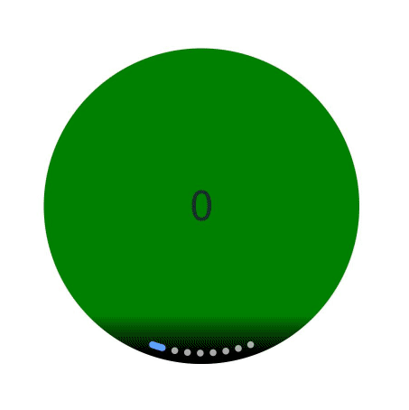
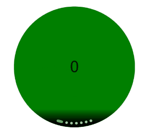

# ArcSwiper
<!--Kit: ArkUI-->
<!--Subsystem: ArkUI-->
<!--Owner: @Hu_ZeQi-->
<!--Designer: @Hu_ZeQi-->
<!--Tester: @gouyuanyuan-->
<!--Adviser: @Brilliantry_Rui-->

弧形滑块视图容器，提供子组件滑动轮播显示的能力。 

> **说明：**
>
> - 本模块同时支持ArkTS-Dyn、ArkTS-Sta。
>
> - 该组件从API version 18开始支持。后续版本如有新增内容，则采用上角标单独标记该内容的起始版本。

## 导入模块

> **说明：**
>
> - ArcSwiperAttribute是用于配置ArcSwiper组件属性的关键接口。API version 21及之前版本，导入ArcSwiper组件后需要开发者手动导入ArcSwiperAttribute，否则会编译报错。从API version 22开始，编译工具链识别到导入ArcSwiper组件后，会自动导入ArcSwiperAttribute，无需开发者手动导入ArcSwiperAttribute。
> - 如果开发者手动导入ArcSwiperAttribute，DevEco Studio会显示置灰，API version 21及之前版本删除会编译报错，从API version 22开始，删除对功能无影响。
> - 该组件支持在Phone、PC/2in1、Tablet、TV、Wearable设备上使用。API version 22及以前版本，在Phone、PC/2in1、Tablet、TV上使用会编译告警，但可以正常运行。

API version 21及之前版本：

```ts
import {
  ArcSwiper,
  ArcSwiperAttribute,
  ArcDotIndicator,
  ArcDirection,
  ArcSwiperController
} from '@kit.ArkUI';
```

API version 22及之后版本：

```ts
import { 
  ArcSwiper, 
  ArcDotIndicator,
  ArcDirection,
  ArcSwiperController
} from '@kit.ArkUI';
```

## 子组件

可以包含子组件。

>  **说明：** 
>
>  - 子组件类型：系统组件和自定义组件，支持渲染控制类型（[if/else](../../../ui/rendering-control/arkts-rendering-control-ifelse.md)、[ForEach](../../../ui/rendering-control/arkts-rendering-control-foreach.md)和[LazyForEach](../../../ui/rendering-control/arkts-rendering-control-lazyforeach.md)）。
>- 不建议在执行翻页动画过程中增加或减少子组件，会导致未进行动画的子组件提前进入视窗，引起显示异常。

## 接口

ArcSwiper(controller?: ArcSwiperController)

创建弧形滑块视图容器。

**原子化服务API：** 从API version 18开始，该接口支持在原子化服务中使用。

**系统能力：** SystemCapability.ArkUI.ArkUI.Circle

**ArkTS-Dyn起始版本：** 18

**ArkTS-Sta起始版本：** 24

**参数：** 

| 参数名     | 类型                                        | 必填 | 说明                                     |
| ---------- | ------------------------------------------- | ---- | ---------------------------------------- |
| controller | [ArcSwiperController](#arcswipercontroller) | 否   | 给组件绑定一个控制器，用来控制组件翻页。 |


## 属性

除支持[通用属性](ts-component-general-attributes.md)外，还支持以下属性，不支持[Menu控制](ts-universal-attributes-menu.md)。 

### index

ArkTS-Dyn: index(index: Optional\<number>)

ArkTS-Sta: index(index: int | undefined)

设置当前在容器中显示的子组件的索引值。设置小于0或大于等于子组件数量时，按照默认值0处理。

**原子化服务API：** 从API version 18开始，该接口支持在原子化服务中使用。

**系统能力：** SystemCapability.ArkUI.ArkUI.Circle

**ArkTS-Dyn起始版本：** 18

**ArkTS-Sta起始版本：** 24

**参数：**

| 参数名 | 类型   | 必填 | 说明                                             |
| ------ | ------ | ---- | ------------------------------------------------ |
| index  | ArkTS-Dyn: [Optional](ts-universal-attributes-custom-property.md#optionalt)\<number></br>ArkTS-Sta: int \| undefined | 是   | 当前在容器中显示的子组件的索引值。<br/>取值为undefined时，当前在容器中显示的子组件的索引值为0。 |

### indicator

ArkTS-Dyn: indicator(style: Optional\<ArcDotIndicator | boolean>)

ArkTS-Sta: indicator(style: ArcDotIndicator | boolean | undefined)

设置弧形圆点指示器样式。未通过该接口设置时，默认启用弧形圆点指示器样式。

**原子化服务API：** 从API version 18开始，该接口支持在原子化服务中使用。

**系统能力：** SystemCapability.ArkUI.ArkUI.Circle

**ArkTS-Dyn起始版本：** 18

**ArkTS-Sta起始版本：** 24

**参数：**

| 参数名 | 类型                                                         | 必填 | 说明                                           |
| ------ | ------------------------------------------------------------ | ---- | ---------------------------------------------- |
| style  | ArkTS-Dyn: [Optional](ts-universal-attributes-custom-property.md#optionalt)\<[ArcDotIndicator](#arcdotindicator)&nbsp;&nbsp;\|&nbsp;boolean></br>ArkTS-Sta: [ArcDotIndicator](#arcdotindicator)&nbsp;&nbsp;\|&nbsp;boolean \| undefined | 是   | - ArcDotIndicator：弧形圆点指示器属性及功能。<br/>- boolean：是否启用弧形圆点指示器。设置为true启用，false不启用。<br/>取值为undefined时，启用弧形圆点指示器样式。<br/>默认类型：ArcDotIndicator |

### duration

ArkTS-Dyn: duration(duration: Optional\<number>)

ArkTS-Sta: duration(duration: int | undefined)

设置子组件切换的动画时长。未通过该接口设置时，默认子组件切换的动画时长为400ms。

**原子化服务API：** 从API version 18开始，该接口支持在原子化服务中使用。

**系统能力：** SystemCapability.ArkUI.ArkUI.Circle

**ArkTS-Dyn起始版本：** 18

**ArkTS-Sta起始版本：** 24

**参数：**

| 参数名    | 类型                                                         | 必填 | 说明                                       |
| --------- | ------------------------------------------------------------ | ---- | ------------------------------------------ |
| duration | ArkTS-Dyn: [Optional](ts-universal-attributes-custom-property.md#optionalt)\<number></br>ArkTS-Sta: int \| undefined | 是   | 子组件切换的动画时长。<br/>取值为undefined时，子组件切换的动画时长为400。<br/>单位：毫秒 |

### vertical

ArkTS-Dyn: vertical(isVertical: Optional\<boolean>)

ArkTS-Sta: vertical(isVertical: boolean | undefined)

设置是否为纵向滑动。未通过该接口设置时，默认为横向滑动。

**原子化服务API：** 从API version 18开始，该接口支持在原子化服务中使用。

**系统能力：** SystemCapability.ArkUI.ArkUI.Circle

**ArkTS-Dyn起始版本：** 18

**ArkTS-Sta起始版本：** 24

**参数：**

| 参数名      | 类型                                                         | 必填 | 说明                                               |
| ----------- | ------------------------------------------------------------ | ---- | -------------------------------------------------- |
| isVertical | ArkTS-Dyn: [Optional](ts-universal-attributes-custom-property.md#optionalt)\<boolean></br>ArkTS-Sta: boolean \| undefined | 是   | 是否为纵向滑动。<br/>true表示纵向滑动；false表示横向滑动。<br/>取值为undefined时，进行横向滑动。 |

### disableSwipe

ArkTS-Dyn: disableSwipe(disabled: Optional\<boolean>)

ArkTS-Sta: disableSwipe(disabled: boolean | undefined)

是否禁用组件滑动切换功能。未通过该接口设置时，默认不禁用组件滑动切换功能。

**原子化服务API：** 从API version 18开始，该接口支持在原子化服务中使用。

**系统能力：** SystemCapability.ArkUI.ArkUI.Circle

**ArkTS-Dyn起始版本：** 18

**ArkTS-Sta起始版本：** 24

**参数：**

| 参数名  | 类型                                                         | 必填 | 说明                                               |
| ------- | ------------------------------------------------------------ | ---- | -------------------------------------------------- |
| disabled | ArkTS-Dyn: [Optional](ts-universal-attributes-custom-property.md#optionalt)\<boolean></br>ArkTS-Sta: boolean \| undefined | 是   | 是否禁用组件滑动切换功能。设置为true禁用，false不禁用。<br/>取值为undefined时，不禁用组件滑动切换功能。 |

### digitalCrownSensitivity

ArkTS-Dyn: digitalCrownSensitivity(sensitivity: Optional\<CrownSensitivity>)

ArkTS-Sta: digitalCrownSensitivity(sensitivity: CrownSensitivity | undefined)

设置旋转表冠的灵敏度。未通过该接口设置时，旋转表冠的灵敏度默认为CrownSensitivity.MEDIUM。

**原子化服务API：** 从API version 18开始，该接口支持在原子化服务中使用。

**系统能力：** SystemCapability.ArkUI.ArkUI.Circle

**ArkTS-Dyn起始版本：** 18

**ArkTS-Sta起始版本：** 24

**参数：**

| 参数名      | 类型                                                                                             | 必填 | 说明                                                        |
| ----------- | ------------------------------------------------------------------------------------------------ | ---- | ----------------------------------------------------------- |
| sensitivity | ArkTS-Dyn: [Optional](ts-universal-attributes-custom-property.md#optionalt)\<[CrownSensitivity](ts-appendix-enums.md#crownsensitivity18)></br>ArkTS-Sta: [CrownSensitivity](ts-appendix-enums.md#crownsensitivity18) \| undefined | 是   | 旋转表冠的灵敏度。<br/>取值为undefined时，旋转表冠的灵敏度为CrownSensitivity.MEDIUM。 |

### effectMode

ArkTS-Dyn: effectMode(edgeEffect: Optional\<EdgeEffect>)

ArkTS-Sta: effectMode(edgeEffect: EdgeEffect | undefined)

设置边缘滑动效果。未通过该接口设置时，边缘滑动效果默认为EdgeEffect.Spring。

**原子化服务API：** 从API version 18开始，该接口支持在原子化服务中使用。

**系统能力：** SystemCapability.ArkUI.ArkUI.Circle

**ArkTS-Dyn起始版本：** 18

**ArkTS-Sta起始版本：** 24

**参数：**

| 参数名    | 类型                                                          | 必填 | 说明                                             |
| --------- | ------------------------------------------------------------- | ---- | ------------------------------------------------ |
| edgeEffect | ArkTS-Dyn: [Optional](ts-universal-attributes-custom-property.md#optionalt)\<[EdgeEffect](ts-appendix-enums.md#edgeeffect)></br>ArkTS-Sta: [EdgeEffect](ts-appendix-enums.md#edgeeffect) \| undefined | 是   | 边缘滑动效果。<br/>取值为undefined时，边缘滑动效果为EdgeEffect.Spring。 |

### disableTransitionAnimation

ArkTS-Dyn: disableTransitionAnimation(disabled: Optional\<boolean>)

ArkTS-Sta: disableTransitionAnimation(disabled: boolean | undefined)

是否关闭特殊动效效果。未通过该接口设置时，默认不关闭特殊动效效果。

**原子化服务API：** 从API version 18开始，该接口支持在原子化服务中使用。

**系统能力：** SystemCapability.ArkUI.ArkUI.Circle

**ArkTS-Dyn起始版本：** 18

**ArkTS-Sta起始版本：** 24

**参数：**

| 参数名  | 类型                                                         | 必填 | 说明                                                     |
| ------- | ------------------------------------------------------------ | ---- | -------------------------------------------------------- |
| disabled | ArkTS-Dyn: [Optional](ts-universal-attributes-custom-property.md#optionalt)\<boolean></br>ArkTS-Sta: boolean \| undefined | 是   | 是否关闭特殊动效效果。<br/>取值为undefined时，不关闭特殊动效效果。 |

## ArcSwiperController

ArcSwiper容器组件的控制器，可以将此对象绑定至ArcSwiper组件，实现控制ArcSwiper翻页等功能。

**原子化服务API：** 从API version 18开始，该接口支持在原子化服务中使用。

**系统能力：** SystemCapability.ArkUI.ArkUI.Circle

**ArkTS-Dyn起始版本：** 18

**ArkTS-Sta起始版本：** 24

### constructor

constructor()

ArcSwiperController的构造函数。

**原子化服务API：** 从API version 18开始，该接口支持在原子化服务中使用。

**系统能力：** SystemCapability.ArkUI.ArkUI.Circle

**ArkTS-Dyn起始版本：** 18

**ArkTS-Sta起始版本：** 24

### showNext

showNext()

翻至下一页。翻页带动效切换过程，时长通过[duration](#duration)指定。

**原子化服务API：** 从API version 18开始，该接口支持在原子化服务中使用。

**系统能力：** SystemCapability.ArkUI.ArkUI.Circle

**ArkTS-Dyn起始版本：** 18

**ArkTS-Sta起始版本：** 24

### showPrevious

showPrevious()

翻至上一页。翻页带动效切换过程，时长通过[duration](#duration)指定。

**原子化服务API：** 从API version 18开始，该接口支持在原子化服务中使用。

**系统能力：** SystemCapability.ArkUI.ArkUI.Circle

**ArkTS-Dyn起始版本：** 18

**ArkTS-Sta起始版本：** 24

### finishAnimation

finishAnimation(handler?: FinishAnimationHandler)

停止播放动画。默认无回调。

**原子化服务API：** 从API version 18开始，该接口支持在原子化服务中使用。

**系统能力：** SystemCapability.ArkUI.ArkUI.Circle

**ArkTS-Dyn起始版本：** 18

**ArkTS-Sta起始版本：** 24

**参数：**

| 参数名  | 类型                                              | 必填 | 说明                                             |
| ------- | ------------------------------------------------- | ---- | ------------------------------------------------ |
| handler | [FinishAnimationHandler](#finishanimationhandler) | 否   | 动画结束的回调。<br>默认值：不传入的情况，无回调 |

## ArcDotIndicator

提供弧形圆点指示器属性及功能。

**原子化服务API：** 从API version 18开始，该接口支持在原子化服务中使用。

**系统能力：** SystemCapability.ArkUI.ArkUI.Circle

**ArkTS-Dyn起始版本：** 18

**ArkTS-Sta起始版本：** 24

### constructor

constructor()

ArcDotIndicator的构造函数。

**原子化服务API：** 从API version 18开始，该接口支持在原子化服务中使用。

**系统能力：** SystemCapability.ArkUI.ArkUI.Circle

**ArkTS-Dyn起始版本：** 18

**ArkTS-Sta起始版本：** 24

### arcDirection

ArkTS-Dyn: arcDirection(direction: Optional\<ArcDirection>): ArcDotIndicator

ArkTS-Sta: arcDirection(direction: ArcDirection | undefined): ArcDotIndicator

设置弧形指示器的方向。未通过该接口设置时，形指示器的方向默认为6点钟方向。

**原子化服务API：** 从API version 18开始，该接口支持在原子化服务中使用。

**系统能力：** SystemCapability.ArkUI.ArkUI.Circle

**ArkTS-Dyn起始版本：** 18

**ArkTS-Sta起始版本：** 24

**参数：**

| 参数名    | 类型                                                          | 必填 | 说明                                               |
| --------- | ------------------------------------------------------------- | ---- | ------------------------------------------------ |
| direction | ArkTS-Dyn: [Optional](ts-universal-attributes-custom-property.md#optionalt)\<[ArcDirection](#arcdirection-1)> </br>ArkTS-Sta: [ArcDirection](#arcdirection-1) \| undefined | 是   | 设置弧形指示器的方向。<br/>取值为undefined时，弧形指示器的方向为6点钟方向。 |

**返回值：**

| 类型                                | 说明                           |
| ----------------------------------- | ------------------------------ |
| [ArcDotIndicator](#arcdotindicator) | 提供弧形圆点指示器属性及功能。 |

### itemColor

ArkTS-Dyn: itemColor(color: Optional\<ResourceColor>): ArcDotIndicator

ArkTS-Sta: itemColor(color: ResourceColor | undefined): ArcDotIndicator

设置弧形指示器中，未选中导航点的颜色。未通过该接口设置时，未选中导航点的颜色默认为'#A9FFFFFF'。

**原子化服务API：** 从API version 18开始，该接口支持在原子化服务中使用。

**系统能力：** SystemCapability.ArkUI.ArkUI.Circle

**ArkTS-Dyn起始版本：** 18

**ArkTS-Sta起始版本：** 24

**参数：**

| 参数名 | 类型                                                         | 必填 | 说明                                                       |
| ------ | ------------------------------------------------------------ | ---- | ---------------------------------------------------------- |
| color  | ArkTS-Dyn: [Optional](ts-universal-attributes-custom-property.md#optionalt)\<[ResourceColor](ts-types.md#resourcecolor)></br>ArkTS-Sta: [ResourceColor](ts-types.md#resourcecolor) \| undefined | 是   | 设置弧形指示器中，未选中导航点的颜色。<br/>取值为undefined时，未选中导航点的颜色为'#A9FFFFFF'。 |

**返回值：**

| 类型                                | 说明                           |
| ----------------------------------- | ------------------------------ |
| [ArcDotIndicator](#arcdotindicator) | 提供弧形圆点指示器属性及功能。 |

### selectedItemColor

ArkTS-Dyn: selectedItemColor(color: Optional\<ResourceColor>): ArcDotIndicator

ArkTS-Sta: selectedItemColor(color: ResourceColor | undefined): ArcDotIndicator

设置弧形指示器中，选中导航点的颜色。未通过该接口设置时，选中导航点的颜色默认为'#FF5EA1FF'。

**原子化服务API：** 从API version 18开始，该接口支持在原子化服务中使用。

**系统能力：** SystemCapability.ArkUI.ArkUI.Circle

**ArkTS-Dyn起始版本：** 18

**ArkTS-Sta起始版本：** 24

**参数：**

| 参数名 | 类型                                                         | 必填 | 说明                                                       |
| ------ | ------------------------------------------------------------ | ---- | ---------------------------------------------------------- |
| color  | ArkTS-Dyn: [Optional](ts-universal-attributes-custom-property.md#optionalt)\<[ResourceColor](ts-types.md#resourcecolor)></br>ArkTS-Sta: [ResourceColor](ts-types.md#resourcecolor) \| undefined | 是   | 设置弧形指示器中，选中导航点的颜色。<br/>取值为undefined时，选中导航点的颜色为'#FF5EA1FF'。 |

**返回值：**

| 类型                                | 说明                           |
| ----------------------------------- | ------------------------------ |
| [ArcDotIndicator](#arcdotindicator) | 提供弧形圆点指示器属性及功能。 |

### backgroundColor

ArkTS-Dyn: backgroundColor(color: Optional\<ResourceColor>): ArcDotIndicator

ArkTS-Sta: backgroundColor(color: ResourceColor | undefined): ArcDotIndicator

设置弧形指示器被长按时，弧形指示器的颜色。未通过该接口设置时，弧形指示器被长按时，弧形指示器的颜色默认为'#FF404040'。

**原子化服务API：** 从API version 18开始，该接口支持在原子化服务中使用。

**系统能力：** SystemCapability.ArkUI.ArkUI.Circle

**ArkTS-Dyn起始版本：** 18

**ArkTS-Sta起始版本：** 24

**参数：**

| 参数名 | 类型                                                         | 必填 | 说明                                                       |
| ------ | ------------------------------------------------------------ | ---- | ---------------------------------------------------------- |
| color  | ArkTS-Dyn: [Optional](ts-universal-attributes-custom-property.md#optionalt)\<[ResourceColor](ts-types.md#resourcecolor)></br>ArkTS-Sta: [ResourceColor](ts-types.md#resourcecolor) \| undefined | 是   | 设置弧形指示器被长按时，弧形指示器的颜色。<br/>取值为undefined时，弧形指示器被长按时，弧形指示器的颜色为'#FF404040'。 |

**返回值：**

| 类型                                | 说明                           |
| ----------------------------------- | ------------------------------ |
| [ArcDotIndicator](#arcdotindicator) | 提供弧形圆点指示器属性及功能。 |

### maskColor

ArkTS-Dyn: maskColor(color: Optional\<LinearGradient>): ArcDotIndicator

ArkTS-Sta: maskColor(color: LinearGradient | undefined): ArcDotIndicator

设置弧形指示器的遮罩渐变色。未通过该接口设置时，弧形指示器的遮罩渐变色起始颜色默认为'#00000000'，结束颜色默认为'#FF000000'。

**原子化服务API：** 从API version 18开始，该接口支持在原子化服务中使用。

**系统能力：** SystemCapability.ArkUI.ArkUI.Circle

**ArkTS-Dyn起始版本：** 18

**ArkTS-Sta起始版本：** 24

**参数：**

| 参数名 | 类型                                                                                       | 必填 | 说明                                                                                       |
| ------ | ------------------------------------------------------------------------------------------ | ---- | ------------------------------------------------------------------------------------------ |
| color  | ArkTS-Dyn: [Optional](ts-universal-attributes-custom-property.md#optionalt)\<[LinearGradient](ts-basic-components-datapanel.md#lineargradient10)></br>ArkTS-Sta: [LinearGradient](ts-basic-components-datapanel.md#lineargradient10) \| undefined | 是   | 设置弧形指示器的遮罩渐变色。<br/>取值为undefined时，弧形指示器的遮罩渐变色起始颜色为'#00000000'，结束颜色为'#FF000000'。 |

**返回值：**

| 类型                                | 说明                           |
| ----------------------------------- | ------------------------------ |
| [ArcDotIndicator](#arcdotindicator) | 提供弧形圆点指示器属性及功能。 |

## ArcDirection

弧形方向。

**原子化服务API：** 从API version 18开始，该接口支持在原子化服务中使用。

**系统能力：** SystemCapability.ArkUI.ArkUI.Circle

**ArkTS-Dyn起始版本：** 18

**ArkTS-Sta起始版本：** 24

| 名称                  | 值   | 说明        |
| --------------------- | ---- | ----------- |
| THREE_CLOCK_DIRECTION | 0    | 3点钟方向。 |
| SIX_CLOCK_DIRECTION   | 1    | 6点钟方向。 |
| NINE_CLOCK_DIRECTION  | 2    | 9点钟方向。 |

## FinishAnimationHandler

type FinishAnimationHandler = () => void

停止播放动画时，告知应用。

**原子化服务API：** 从API version 18开始，该接口支持在原子化服务中使用。

**系统能力：** SystemCapability.ArkUI.ArkUI.Circle

**ArkTS-Dyn起始版本：** 18

**ArkTS-Sta起始版本：** 24

## IndexChangedHandler

ArkTS-Dyn: type IndexChangedHandler = (index: number) => void

ArkTS-Sta: type IndexChangedHandler = (index: int) => void

当前显示元素的索引变化时，告知应用。

**原子化服务API：** 从API version 18开始，该接口支持在原子化服务中使用。

**系统能力：** SystemCapability.ArkUI.ArkUI.Circle

**ArkTS-Dyn起始版本：** 18

**ArkTS-Sta起始版本：** 24

**参数：** 

| 参数名 | 类型                                                         | 必填 | 说明                                   |
| ------ | ------------------------------------------------------------ | ---- | -------------------------------------- |
| index  | ArkTS-Dyn: number</br>ArkTS-Sta: int | 是   | 当前显示元素的索引。index序列从0开始。 |

## AnimationStartHandler

ArkTS-Dyn: type AnimationStartHandler = (index: number, targetIndex: number, event: SwiperAnimationEvent) => void

ArkTS-Sta: type AnimationStartHandler = (index: int, targetIndex: int, event: SwiperAnimationEvent) => void

切换动画开始时的回调。

**原子化服务API：** 从API version 18开始，该接口支持在原子化服务中使用。

**系统能力：** SystemCapability.ArkUI.ArkUI.Circle

**ArkTS-Dyn起始版本：** 18

**ArkTS-Sta起始版本：** 24

**参数：** 

| 参数名      | 类型                                                         | 必填 | 说明                                                         |
| ----------- | ------------------------------------------------------------ | ---- | ------------------------------------------------------------ |
| index       | ArkTS-Dyn: number</br>ArkTS-Sta: int                                                       | 是   | 当前显示元素的索引，动画开始前的index值（不是最终结束动画的index值）。 |
| targetIndex | ArkTS-Dyn: number</br>ArkTS-Sta: int                                                       | 是   | 切换动画目标元素的索引。                                     |
| event       | [SwiperAnimationEvent](ts-container-swiper.md#swiperanimationevent10对象说明) | 是   | 动画相关信息，包括主轴方向上当前显示元素和目标元素相对ArcSwiper起始位置的位移，以及离手速度。 |

## AnimationEndHandler

ArkTS-Dyn: type AnimationEndHandler = (index: number, event: SwiperAnimationEvent) => void

ArkTS-Sta: type AnimationEndHandler = (index: int, event: SwiperAnimationEvent) => void

切换动画结束时的回调。

**原子化服务API：** 从API version 18开始，该接口支持在原子化服务中使用。

**系统能力：** SystemCapability.ArkUI.ArkUI.Circle

**ArkTS-Dyn起始版本：** 18

**ArkTS-Sta起始版本：** 24

**参数：** 

| 参数名 | 类型                                                         | 必填 | 说明                                                         |
| ------ | ------------------------------------------------------------ | ---- | ------------------------------------------------------------ |
| index  | ArkTS-Dyn: number</br>ArkTS-Sta: int                                                       | 是   | 当前显示元素的索引。                                         |
| event  | [SwiperAnimationEvent](ts-container-swiper.md#swiperanimationevent10对象说明) | 是   | 动画相关信息，只返回主轴方向上当前显示元素相对于ArcSwiper起始位置的位移。 |

## GestureSwipeHandler

ArkTS-Dyn: type GestureSwipeHandler = (index: number, event: SwiperAnimationEvent) => void

ArkTS-Sta: type GestureSwipeHandler = (index: int, event: SwiperAnimationEvent) => void

在页面跟手滑动过程中，逐帧触发的回调。

**原子化服务API：** 从API version 18开始，该接口支持在原子化服务中使用。

**系统能力：** SystemCapability.ArkUI.ArkUI.Circle

**ArkTS-Dyn起始版本：** 18

**ArkTS-Sta起始版本：** 24

**参数：** 

| 参数名 | 类型                                                         | 必填 | 说明                                                         |
| ------ | ------------------------------------------------------------ | ---- | ------------------------------------------------------------ |
| index  | ArkTS-Dyn: number</br>ArkTS-Sta: int                                                       | 是   | 当前显示元素的索引。                                         |
| event  | [SwiperAnimationEvent](ts-container-swiper.md#swiperanimationevent10对象说明) | 是   | 动画相关信息，只返回主轴方向上当前显示元素相对于ArcSwiper起始位置的位移。 |

## 事件

除支持[通用事件](ts-component-general-events.md)外，还支持以下事件：

### onChange

ArkTS-Dyn: onChange(handler: Optional\<IndexChangedHandler>)

ArkTS-Sta: onChange(handler: IndexChangedHandler | undefined)

当前显示子组件的索引变化时触发该事件，返回值为当前显示子组件的索引值。

ArcSwiper组件结合[LazyForEach](../../../ui/rendering-control/arkts-rendering-control-lazyforeach.md)使用时，不能在onChange事件里触发子页面UI的刷新。

**原子化服务API：** 从API version 18开始，该接口支持在原子化服务中使用。

**系统能力：** SystemCapability.ArkUI.ArkUI.Circle

**ArkTS-Dyn起始版本：** 18

**ArkTS-Sta起始版本：** 24

**参数：**

| 参数名 | 类型                                                        | 必填 | 说明                                           |
| ------ | ----------------------------------------------------------- | ---- | ---------------------------------------------- |
| handler | ArkTS-Dyn: [Optional](ts-universal-attributes-custom-property.md#optionalt)\<[IndexChangedHandler](#indexchangedhandler)></br>ArkTS-Sta: [IndexChangedHandler](#indexchangedhandler) \| undefined | 是   | 当前显示的子组件索引变化时触发该事件。<br/>取值为undefined时，无回调。 |

### onAnimationStart

ArkTS-Dyn: onAnimationStart(handler: Optional\<AnimationStartHandler>)

ArkTS-Sta: onAnimationStart(handler: AnimationStartHandler | undefined)

切换动画开始时触发该回调。

**原子化服务API：** 从API version 18开始，该接口支持在原子化服务中使用。

**系统能力：** SystemCapability.ArkUI.ArkUI.Circle

**ArkTS-Dyn起始版本：** 18

**ArkTS-Sta起始版本：** 24

**参数：**

| 参数名  | 类型                                                                 | 必填 | 说明                                                   |
| ------- | -------------------------------------------------------------------- | ---- | ------------------------------------------------------ |
| handler | ArkTS-Dyn:[Optional](ts-universal-attributes-custom-property.md#optionalt)\<[AnimationStartHandler](#animationstarthandler)></br>ArkTS-Sta: [AnimationStartHandler](#animationstarthandler) \| undefined | 是   | 切换动画开始时的回调。<br/>取值为undefined时，无回调。 |

### onAnimationEnd

ArkTS-Dyn: onAnimationEnd(handler: Optional\<AnimationEndHandler>)

ArkTS-Sta: onAnimationEnd(handler: AnimationEndHandler | undefined)

切换动画结束时触发该回调。默认无回调。

当ArcSwiper切换动效结束时触发，包括动画过程中手势中断，通过[SwiperController](ts-container-swiper.md#swipercontroller)调用finishAnimation。参数为动画结束后的index值，多列ArcSwiper时，index为最左侧组件的索引。

**原子化服务API：** 从API version 18开始，该接口支持在原子化服务中使用。

**系统能力：** SystemCapability.ArkUI.ArkUI.Circle

**ArkTS-Dyn起始版本：** 18

**ArkTS-Sta起始版本：** 24

**参数：**

| 参数名  | 类型                                                             | 必填 | 说明                                                         |
| ------- | ---------------------------------------------------------------- | ---- | ------------------------------------------------------------ |
| handler | ArkTS-Dyn:[Optional](ts-universal-attributes-custom-property.md#optionalt)\<[AnimationEndHandler](#animationendhandler)></br>ArkTS-Sta: [AnimationEndHandler](#animationendhandler) \| undefined | 是   | 切换动画结束时触发该回调。<br/>取值为undefined时，无回调。 |

### onGestureSwipe

ArkTS-Dyn: onGestureSwipe(handler: Optional\<GestureSwipeHandler>)

ArkTS-Sta: onGestureSwipe(handler: GestureSwipeHandler | undefined)

在页面跟手滑动过程中，逐帧触发该回调。

**原子化服务API：** 从API version 18开始，该接口支持在原子化服务中使用。

**系统能力：** SystemCapability.ArkUI.ArkUI.Circle

**ArkTS-Dyn起始版本：** 18

**ArkTS-Sta起始版本：** 24

**参数：**

| 参数名  | 类型                                                             | 必填 | 说明                                                                 |
| ------- | ---------------------------------------------------------------- | ---- | -------------------------------------------------------------------- |
| handler | ArkTS-Dyn: [Optional](ts-universal-attributes-custom-property.md#optionalt)\<[GestureSwipeHandler](#gestureswipehandler)></br>ArkTS-Sta: [GestureSwipeHandler](#gestureswipehandler) \| undefined | 是   | 在页面跟手滑动过程中，逐帧触发该回调。<br/>取值为undefined时，无回调。 |

### customContentTransition

ArkTS-Dyn: customContentTransition(transition: Optional\<SwiperContentAnimatedTransition>)

ArkTS-Sta: customContentTransition(transition: ArcSwiperContentAnimatedTransition | undefined)

自定义ArcSwiper页面切换动画。在页面跟手滑动和离手后执行切换动画的过程中，会对视窗内所有页面逐帧触发回调。开发者可以在回调中设置透明度、缩放比例、位移等属性来自定义切换动画。

在页面跟手滑动和离手后执行切换动画的过程中，会对视窗内所有页面逐帧触发[SwiperContentTransitionProxy](#swipercontenttransitionproxy)回调。例如，当视窗内有下标为0、1的两个页面时，会每帧触发两次index值分别为0和1的回调。

**原子化服务API：** 从API version 18开始，该接口支持在原子化服务中使用。

**系统能力：** SystemCapability.ArkUI.ArkUI.Circle

**ArkTS-Dyn起始版本：** 18

**ArkTS-Sta起始版本：** 24

**参数：**

| 参数名     | 类型                                                                                         | 必填 | 说明                                                                   |
| ---------- | -------------------------------------------------------------------------------------------- | ---- | ---------------------------------------------------------------------- |
| transition | ArkTS-Dyn: [Optional](ts-universal-attributes-custom-property.md#optionalt)\<[SwiperContentAnimatedTransition](#swipercontentanimatedtransition)></br>ArkTS-Sta: [ArcSwiperContentAnimatedTransition](#arcswipercontentanimatedtransition24) \| undefined | 是   | ArcSwiper自定义切换动画相关信息。<br/>取值为undefined时，无回调。 |

## SwiperContentAnimatedTransition

ArcSwiper自定义切换动画相关信息。

**原子化服务API：** 从API version 18开始，该接口支持在原子化服务中使用。

**系统能力：** SystemCapability.ArkUI.ArkUI.Circle

**ArkTS模式：** 该接口仅适用于ArkTS-Dyn。

**ArkTS-Dyn起始版本：** 18

| 名称 | 类型 | 只读 | 可选 | 说明 |
| ------ | ---- | ---- | ---- | ---- |
| timeout | number| 否 | 是 | ArcSwiper自定义切换动画超时时间。从页面执行默认动画（页面滑动）至移出视窗外的第一帧开始计时，如果到达该时间后，开发者仍未调用[SwiperContentTransitionProxy](#swipercontenttransitionproxy)的[finishTransition](#finishtransition)接口通知ArcSwiper组件此页面的自定义动画已结束，那么组件就会认为此页面的自定义动画已结束，立即在该页面节点下渲染树。单位ms，默认值为0。 |
| transition | Callback\<[SwiperContentTransitionProxy](#swipercontenttransitionproxy)> | 否 | 否 | 自定义切换动画具体内容。 |

## ArcSwiperContentAnimatedTransition<sup>24+</sup>

ArcSwiper自定义切换动画相关信息。

**系统能力：** SystemCapability.ArkUI.ArkUI.Circle

**ArkTS模式：** 该接口仅适用于ArkTS-Sta。

**ArkTS-Sta起始版本：** 24

| 名称 | 类型 | 只读 | 可选 | 说明 |
| ------ | ---- | ---- | ---- | ---- |
| timeout<sup>24+</sup> | int | 否 | 是 | ArcSwiper自定义切换动画超时时间。从页面执行默认动画（页面滑动）至移出视窗外的第一帧开始计时，如果到达该时间后，开发者仍未调用[SwiperContentTransitionProxy](#swipercontenttransitionproxy)的[finishTransition](#finishtransition)接口通知ArcSwiper组件此页面的自定义动画已结束，那么组件就会认为此页面的自定义动画已结束，立即在该页面节点下渲染树。单位ms，默认值为0。 |
| transition<sup>24+</sup> | Callback\<[ArcSwiperContentTransitionProxy](#arcswipercontenttransitionproxy24)> | 否 | 否 | 自定义切换动画具体内容。 |

## ArcSwiperContentTransitionProxy<sup>24+</sup>

ArcSwiper自定义切换动画执行过程中，返回给开发者的proxy对象。开发者可通过该对象获取自定义动画视窗内的页面信息，同时，也可以通过调用该对象的finishTransition接口通知ArcSwiper组件页面自定义动画已结束。

>**说明：** 
>
> - 假设当前选中的子组件的索引为0，从第0页切换到第1页的动画过程中，每帧都会对视窗内所有页面触发回调，当视窗内有第0页和第1页两页时，每帧会触发两次回调。其中第一次回调的selectedIndex为0，index为0，position为当前帧第0页相对于动画开始前第0页的移动比例，mainAxisLength为主轴方向上第0页的长度；第二次回调的selectedIndex仍为0，index为1，position为当前帧第1页相对于动画开始前第0页的移动比例，mainAxisLength为主轴方向上第1页的长度。
>
> - 若动画曲线为弹簧插值曲线，从第0页切换到第1页的动画过程中，可能会因为离手时的位置和速度，先过滑到第2页，再回弹到第1页，该过程中每帧会对视窗内第1页和第2页触发回调。

### 属性

**系统能力：** SystemCapability.ArkUI.ArkUI.Circle

**模型约束**：此接口仅可在Stage模型下使用。

**ArkTS模式：** 该接口仅适用于ArkTS-Sta。

**ArkTS-Sta起始版本：** 24

| 名称 | 类型 | 只读 | 可选 | 说明 |
| ------ | ---- | ---- | ---- | ---- |
| selectedIndex<sup>24+</sup> | int | 否 | 否 | 当前选中页面的索引。 |
| index<sup>24+</sup> | int | 否 | 否 | 视窗内页面的索引。 |
| position<sup>24+</sup> | double | 否 | 否 | index页面相对于ArcSwiper主轴起始位置（selectedIndex对应页面的起始位置）的移动比例。 |
| mainAxisLength<sup>24+</sup> |  double | 否 | 否 | index对应页面在主轴方向上的长度。<br/>单位：vp |

### finishTransition<sup>24+</sup>

finishTransition(): void

通知ArcSwiper组件，此页面的自定义动画已结束。

**原子化服务API：** 从API version 18开始，该接口支持在原子化服务中使用。

**系统能力：** SystemCapability.ArkUI.ArkUI.Circle

**模型约束**：此接口仅可在Stage模型下使用。

**ArkTS模式：** 该接口仅适用于ArkTS-Sta。

**ArkTS-Sta起始版本：** 24

## SwiperContentTransitionProxy

ArcSwiper自定义切换动画执行过程中，返回给开发者的proxy对象。开发者可通过该对象获取自定义动画视窗内的页面信息，同时，也可以通过调用该对象的finishTransition接口通知ArcSwiper组件页面自定义动画已结束。

>**说明：** 
>
> - 假设当前选中的子组件的索引为0，从第0页切换到第1页的动画过程中，每帧都会对视窗内所有页面触发回调，当视窗内有第0页和第1页两页时，每帧会触发两次回调。其中第一次回调的selectedIndex为0，index为0，position为当前帧第0页相对于动画开始前第0页的移动比例，mainAxisLength为主轴方向上第0页的长度；第二次回调的selectedIndex仍为0，index为1，position为当前帧第1页相对于动画开始前第0页的移动比例，mainAxisLength为主轴方向上第1页的长度。
>
> - 若动画曲线为弹簧插值曲线，从第0页切换到第1页的动画过程中，可能会因为离手时的位置和速度，先过滑到第2页，再回弹到第1页，该过程中每帧会对视窗内第1页和第2页触发回调。

### 属性

**原子化服务API：** 从API version 18开始，该接口支持在原子化服务中使用。

**系统能力：** SystemCapability.ArkUI.ArkUI.Circle

**ArkTS模式：** 该接口仅适用于ArkTS-Dyn。

**ArkTS-Dyn起始版本：** 18

| 名称 | 类型 | 只读 | 可选 | 说明 |
| ------ | ---- | ---- | ---- | ---- |
| selectedIndex | number | 否 | 否 | 当前选中页面的索引。 |
| index |  number| 否 | 否 | 视窗内页面的索引。 |
| position |  number | 否 | 否 | index页面相对于ArcSwiper主轴起始位置（selectedIndex对应页面的起始位置）的移动比例。 |
| mainAxisLength | number | 否 | 否 | index对应页面在主轴方向上的长度。<br/>单位：vp |

### finishTransition

finishTransition(): void

通知ArcSwiper组件，此页面的自定义动画已结束。

**原子化服务API：** 从API version 18开始，该接口支持在原子化服务中使用。

**系统能力：** SystemCapability.ArkUI.ArkUI.Circle

**ArkTS模式：** 该接口仅适用于ArkTS-Sta。

**ArkTS-Dyn起始版本：** 18

## 示例

### 示例1（设置arcSwiper基本属性）

该示例通过设置arcSwiper的基本属性，展示了组件的基本功能。

```ts
// xxx.ets
import {
  CircleShape,
  ArcSwiper,
  ArcSwiperAttribute, 
  ArcDotIndicator,
  ArcDirection,
  ArcSwiperController
} from '@kit.ArkUI';
// 从API version 22开始，无需手动导入ArcSwiperAttribute。具体请参考ArcSwiper的导入模块说明

class MyDataSource implements IDataSource {
  private list: Color[] = [];

  constructor(list: Color[]) {
    this.list = list;
  }

  totalCount(): number {
    return this.list.length;
  }

  getData(index: number): Color {
    return this.list[index];
  }

  registerDataChangeListener(listener: DataChangeListener): void {
  }

  unregisterDataChangeListener() {
  }
}

@Entry
@Component
struct TestNewInterface {
  @State itemSimpleColor: Color | number | string = '';
  @State selectedItemSimpleColor: Color | number | string = '';
  private wearableSwiperController: ArcSwiperController = new ArcSwiperController();
  private arcDotIndicator: ArcDotIndicator = new ArcDotIndicator();
  private data: MyDataSource = new MyDataSource([]);
  @State backgroundColors: Color[] =
    [Color.Green, Color.Blue, Color.Yellow, Color.Pink, Color.White, Color.Gray, Color.Orange, Color.Transparent];
  innerSelectedIndex: number = 0;

  aboutToAppear(): void {
    let list: Color[] = [];
    for (let i = 1; i <= 6; i++) {
      list.push(i);
    }
    this.data = new MyDataSource(this.backgroundColors);
  }

  build() {
    Column() {
      Row() {
        ArcSwiper(this.wearableSwiperController) {
          LazyForEach(this.data, (backgroundColor: Color, index: number) => {
            Text(index.toString())
              .width(233)
              .height(233)
              .backgroundColor(backgroundColor)
              .textAlign(TextAlign.Center)
              .fontSize(30)
          })
        }
        .clipShape(new CircleShape({ width: 233, height: 233 }))
        .effectMode(EdgeEffect.None)
        .backgroundColor(Color.Transparent)
        .index(0)
        .duration(400)
        .vertical(false)
        .indicator(this.arcDotIndicator
          .arcDirection(ArcDirection.SIX_CLOCK_DIRECTION)
          .itemColor(this.itemSimpleColor)
          .selectedItemColor(this.selectedItemSimpleColor)
        )
        .disableSwipe(false)
        .digitalCrownSensitivity(CrownSensitivity.MEDIUM)
        .onChange((index: number) => {
          console.info("onChange:" + index.toString());
        })
        .onAnimationStart((index: number, targetIndex: number, extraInfo: SwiperAnimationEvent) => {
          this.innerSelectedIndex = targetIndex;
          console.info("index: " + index);
          console.info("targetIndex: " + targetIndex);
          console.info("current offset: " + extraInfo.currentOffset);
          console.info("target offset: " + extraInfo.targetOffset);
          console.info("velocity: " + extraInfo.velocity);
        })
        .onGestureRecognizerJudgeBegin((event: BaseGestureEvent, current: GestureRecognizer,
          others: Array<GestureRecognizer>): GestureJudgeResult => { // 在识别器即将要成功时，根据当前组件状态，设置识别器使能状态
          if (current) {
            let target = current.getEventTargetInfo();
            if (target && current.isBuiltIn() && current.getType() == GestureControl.GestureType.PAN_GESTURE) {
              // 此处判断swiperTarget.isBegin()或innerSelectedIndex === 0，表明ArcSwiper滑动到开头
              let swiperTarget = target as ScrollableTargetInfo
              if (swiperTarget instanceof ScrollableTargetInfo &&
                (swiperTarget.isBegin() || this.innerSelectedIndex === 0)) {
                let panEvent = event as PanGestureEvent;
                if (panEvent && panEvent.offsetX > 0 && (swiperTarget.isBegin() || this.innerSelectedIndex === 0)) {
                  return GestureJudgeResult.REJECT;
                }
              }
            }
          }
          return GestureJudgeResult.CONTINUE;
        })
        .onAnimationEnd((index: number, extraInfo: SwiperAnimationEvent) => {
          console.info("index: " + index);
          console.info("current offset: " + extraInfo.currentOffset);
        })
        .disableTransitionAnimation(false)
      }.height('100%')
    }.width('100%')
  }
}
```



### 示例2（设置ArcSwiper自定义页面切换动画）

该示例通过[customContentTransition](#customcontenttransition)接口，实现了自定义ArcSwiper页面切换动画。

``` ts
import { Decimal } from '@kit.ArkTS';
import { CircleShape, ArcSwiper, ArcSwiperAttribute } from '@kit.ArkUI';

// 从API version 22开始，无需手动导入ArcSwiperAttribute。具体请参考ArcSwiper的导入模块说明
@Entry
@Component
struct TestNewInterface {
  private backgroundColors: Color[] =
    [Color.Green, Color.Blue, Color.Yellow, Color.Pink, Color.White, Color.Gray, Color.Orange];
  @State scaleList: number[] = [];

  aboutToAppear(): void {
    for (let i = 0; i < this.backgroundColors.length; i++) {
      this.scaleList.push(1.0);
    }
  }

  build() {
    Column() {
      Row() {
        ArcSwiper() {
          ForEach(this.backgroundColors, (backgroundColor: Color, index: number) => {
            Text(index.toString())
              .width(233)
              .height(233)
              .backgroundColor(backgroundColor)
              .textAlign(TextAlign.Center)
              .fontSize(30)
              .scale({ x: this.scaleList[index], y: this.scaleList[index] })
          })
        }
        .clipShape(new CircleShape({ width: 233, height: 233 }))
        .effectMode(EdgeEffect.None)
        .onChange((index: number) => {
          console.info('onChange:' + index.toString());
        })
        .customContentTransition({
          // 页面移除视窗时超时1000ms下渲染树
          timeout: 1000,
          // 对视窗内所有页面逐帧回调transition，在回调中修改opacity属性值，实现自定义动画
          transition: (proxy: SwiperContentTransitionProxy) => {
            if (proxy.position <= -1 || proxy.position >= 1) {
              // 页面完全滑出视窗外时，重置属性值
              this.scaleList[proxy.index] = 1.0;
            } else {
              let position: number = Decimal.abs(proxy.position).toNumber();
              this.scaleList[proxy.index] = 1 - position;
            }
          }
        })
        .disableTransitionAnimation(false)
      }.height('100%')
    }.width('100%')
  }
}
```
