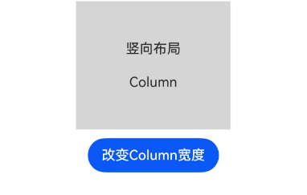
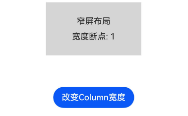

# ContainerReader
<!--Kit: ArkUI-->
<!--Subsystem: ArkUI-->
<!--Owner: @song-song-song-->
<!--Designer: @fenglinbailu-->
<!--Tester: @weixin_45530366-->
<!--Adviser: @Brilliantry_Rui-->

ContainerReader是容器断点组件，用于在动态场景下根据容器尺寸获取断点信息并进行响应式布局。该组件通过[双向绑定](../../../ui/state-management/arkts-new-binding.md#系统组件参数双向绑定)实时返回容器的尺寸和断点，使开发者能够基于容器大小进行差异化的组件创建和布局。

> **说明：**
>
> - 使用ContainerReader时，ContainerReader父组件不要依赖其子组件确定自身尺寸。
> - 容器断点基于组件自身的实际尺寸和断点阈值数组确定高度和宽度断点值，组件尺寸和断点信息仅作用于当前组件及其子组件，同一页面中的多个容器可拥有各自独立的断点状态。
> - ContainerReader组件的尺寸需要由父容器和自身布局确定，不受子组件影响。在不同父容器下的布局规格：父容器为[Flex](ts-container-flex.md)、[Column](ts-container-column.md)、[Row](ts-container-row.md)时撑满容器剩余空间；父容器为其他类型时撑满父容器。
> - ContainerReader接口的参数必须使用状态变量结合双向绑定形式([!!语法](../../../ui/state-management/arkts-new-binding.md))，以便在后端计算尺寸变化时及时通知前端刷新UI。

**起始版本：** 26.0.0

## 子组件

可以包含子组件。

## 接口

### ContainerReader

ContainerReader(value: ContainerReaderInfo)

创建容器断点组件并配置容器读取参数。

**起始版本：** 26.0.0

**模型约束：** 此接口仅可在Stage模型下使用。

**卡片能力：** 从API版本26.0.0开始，该接口支持在ArkTS卡片中使用。

**原子化服务API：** 从API版本26.0.0开始，该接口支持在原子化服务中使用。

**系统能力：** SystemCapability.ArkUI.ArkUI.Full

**参数：**

| 参数名 | 类型 | 必填 | 说明 |
| ------ | ---- | ---- | ---- |
| value | [ContainerReaderInfo](#containerreaderinfo) | 是 | 容器读取配置选项，包含尺寸数据和断点配置。 |

## ContainerReaderInfo

定义ContainerReader组件的配置选项，用于指定容器尺寸读取和断点值获取的参数，不能通过此参数改变组件尺寸和断点值。

**起始版本：** 26.0.0

**模型约束：** 此接口仅可在Stage模型下使用。

**卡片能力：** 从API版本26.0.0开始，该接口支持在ArkTS卡片中使用。

**原子化服务API：** 从API版本26.0.0开始，该接口支持在原子化服务中使用。

**系统能力：** SystemCapability.ArkUI.ArkUI.Full

| 名称 | 类型 | 只读 | 可选 | 说明 |
| ---- | ---- | ---- | ---- | ---- |
| size | [Size](../js-apis-arkui-graphics.md#size) | 否 | 否 | 获取到的当前ContainerReader组件的尺寸，用于布局分析和断点计算。<br/>**说明：** <br/>该参数支持[!!](../../../ui/state-management/arkts-new-binding.md#系统组件参数双向绑定)双向绑定变量。绑定后组件尺寸值变化时，size绑定的变量值会自动更新。 |
| widthBreakpoint | [WidthBreakpoint](./ts-appendix-enums.md#widthbreakpoint13) | 否 | 是 | 容器的宽度断点，为获取到的当前ContainerReader组件的宽度断点枚举值。<br/>默认值：WidthBreakpoint.XS<br/>**说明：** <br/>该参数支持[!!](../../../ui/state-management/arkts-new-binding.md#系统组件参数双向绑定)双向绑定变量。绑定后组件宽度断点值变化时，widthBreakpoint绑定的变量值会自动更新。 |
| heightBreakpoint | [HeightBreakpoint](./ts-appendix-enums.md#heightbreakpoint13) | 否 | 是 | 容器的高度断点，为获取到的当前ContainerReader组件的高宽比断点枚举值。<br/>默认值：HeightBreakpoint.SM<br/>**说明：** <br/>该参数支持[!!](../../../ui/state-management/arkts-new-binding.md#系统组件参数双向绑定)双向绑定变量。绑定后组件高度断点值变化时，heightBreakpoint绑定的变量值会自动更新。 |

## 属性

除支持[通用属性](ts-component-general-attributes.md)外，还支持以下属性：

### breakpointConfig

breakpointConfig(value?: BreakpointOptions)

设置断点配置选项，定义触发不同布局行为的尺寸阈值。

**起始版本：** 26.0.0

**模型约束：** 此接口仅可在Stage模型下使用。

**卡片能力：** 从API版本26.0.0开始，该接口支持在ArkTS卡片中使用。

**原子化服务API：** 从API版本26.0.0开始，该接口支持在原子化服务中使用。

**系统能力：** SystemCapability.ArkUI.ArkUI.Full

**参数：**

| 参数名 | 类型 | 必填 | 说明 |
| ------ | ---- | ---- | ---- |
| value | [BreakpointOptions](#breakpointoptions) | 否 | 断点配置选项，包含宽度和高度的断点阈值数组。 |

## BreakpointOptions

定义断点配置选项，用于指定容器尺寸分析的阈值参数。

**起始版本：** 26.0.0

**模型约束：** 此接口仅可在Stage模型下使用。

**卡片能力：** 从API版本26.0.0开始，该接口支持在ArkTS卡片中使用。

**原子化服务API：** 从API版本26.0.0开始，该接口支持在原子化服务中使用。

**系统能力：** SystemCapability.ArkUI.ArkUI.Full

| 名称 | 类型 | 只读 | 可选 | 说明 |
| ---- | ---- | ---- | ---- | ---- |
| width | Array\<number\> | 否 | 是 | 宽度断点值数组。数组必须为单调递增数组。<br/>默认值：[320, 600, 840, 1440]，单位vp，与窗口宽度断点默认值一致。<br/>**说明：** <br/>最多可支持5个断点，即数组最大长度为4。 |
| height | Array\<number\> | 否 | 是 | 高度断点值数组，高度断点值是组件高度与宽度的比值。无单位。数组必须为单调递增数组。<br/>默认值：[0.8, 1.2]，与窗口高度断点默认值一致。<br/>**说明：** <br/>最多支持3个断点，即数组最大长度为2。 |


## 事件

支持[通用事件](ts-component-general-events.md)。


## 示例

### 示例1 （根据ContainerReader宽度断点切换布局方向）

该示例展示了[ContainerReader](#containerreader-1)组件，如何通过双向绑定获取容器尺寸和断点信息，并根据宽度断点切换布局方向。

从API版本26.0.0开始，新增ContainerReader。

```ts
// xxx.ets
import { ContainerReader, ContainerReaderAttribute, Size } from '@kit.ArkUI';

@Entry
@Component
struct Index {
  @State containerSize: Size = { width: 0, height: 0 };
  @State widthBp: WidthBreakpoint = WidthBreakpoint.WIDTH_XS;
  @State heightBp: HeightBreakpoint = HeightBreakpoint.HEIGHT_SM;
  @State columnWidth: number = 180

  build() {
    Column({space: 10}) {
      Column({space: 10}) {
        ContainerReader({
          size: this.containerSize!!, // 和this.containerSize变量绑定，ContainerReader尺寸变化时this.containerSize自动更新。
          widthBreakpoint: this.widthBp!!,
          heightBreakpoint: this.heightBp!!
        }) {
          // 根据宽度断点切换布局方向
          if (this.widthBp === WidthBreakpoint.WIDTH_XS) {
            Column({space: 20}) {
              Text('竖向布局')
              Text(`Column`)
            }
            .width('100%')
            .height('100%')
            .backgroundColor('#D5D5D5')
            .justifyContent(FlexAlign.Center)
          } else {
            Row({space: 20}) {
              Text('横向布局')
              Text(`Row`)
            }
            .width('100%')
            .height('100%')
            .backgroundColor('#2787D9')
            .justifyContent(FlexAlign.Center)
          }
        }
        .backgroundColor('#F0FAFF')
      }
      .height('20%')
      .width(this.columnWidth)
      Button('改变Column宽度')
        .onClick(()=>{
          if (this.columnWidth == 180) {
            this.columnWidth = 320;
          } else {
            this.columnWidth = 180;
          }
        })
    }
    .height('100%')
    .width('100%')
  }
}
```



### 示例2 （自定义断点配置）

该示例展示了如何通过[breakpointConfig](#breakpointconfig)自定义断点阈值，定义不同的宽窄布局尺寸要求，实现更精细化的布局控制。

从API版本26.0.0开始，新增ContainerReader与breakpointConfig。

```ts
// xxx.ets
import { ContainerReader, ContainerReaderAttribute, Size } from '@kit.ArkUI';

@Entry
@Component
struct Index {
  @State containerSize: Size = { width: 0, height: 0 };
  @State widthBp: WidthBreakpoint = WidthBreakpoint.WIDTH_XS;
  @State heightBp: HeightBreakpoint = HeightBreakpoint.HEIGHT_SM;
  @State columnWidth: number = 180

  build() {
    Column({space: 10}) {
      Column({space: 10}) {
        ContainerReader({
          size: this.containerSize!!,
          widthBreakpoint: this.widthBp!!,
          heightBreakpoint: this.heightBp!!
        }) {
          if (this.widthBp === WidthBreakpoint.WIDTH_XS || this.widthBp === WidthBreakpoint.WIDTH_SM) {
            Column({space: 10}) {
              Text('窄屏布局')
                .fontSize(16)
              Text(`宽度断点: ${this.widthBp}`)
            }
            .width('100%')
            .height('100%')
            .backgroundColor('#D5D5D5')
            .justifyContent(FlexAlign.Center)
          } else {
            Row({space: 10}) {
              Text('宽屏布局')
                .fontSize(16)
              Text(`宽度断点: ${this.widthBp}`)
            }
            .width('100%')
            .height('100%')
            .backgroundColor('#2787D9')
            .justifyContent(FlexAlign.Center)
          }
        }
        .height(100)
        .width('100%')
        .backgroundColor('#F0FAFF')
        .breakpointConfig({ width: [100, 200, 400, 500], height: [0.8, 1.2] })
      }
      .height('20%')
      .width(this.columnWidth)

      Button('改变Column宽度')
        .onClick(()=>{
          if (this.columnWidth == 180) {
            this.columnWidth = 320;
          } else {
            this.columnWidth = 180;
          }
        })
    }
    .height('100%')
    .width('100%')
  }
}
```

通过单击按钮改变父容器的宽度，返回不同的宽度断点值，从而调整布局方向。



### 示例3 （利用宽度断点动态调整列数）

该示例展示了如何根据ContainerReader得到的宽度断点动态调整列数，实现多设备自适应布局。根据宽度断点不同设置不同的列数。

从API版本26.0.0开始，新增ContainerReader。

```ts
// xxx.ets
import { ContainerReader, ContainerReaderAttribute, Size } from '@kit.ArkUI';

@Entry
@Component
struct Index {
  @State containerSize: Size = { width: 0, height: 0 };
  @State widthBp: WidthBreakpoint = WidthBreakpoint.WIDTH_XS;
  @State columnWidth: number = 180

  build() {
    Column({space: 10}) {
      Column({space: 10}) {
        ContainerReader({
          size: this.containerSize!!,
          widthBreakpoint: this.widthBp!!
        }) {
          Row({ space: 2 }) {
            if (this.widthBp === WidthBreakpoint.WIDTH_XS || this.widthBp === WidthBreakpoint.WIDTH_SM) {
              Column() {
                Text(`第 1 个 Column`)
                  .fontColor(Color.White)
              }
              .width('100%')
              .height(60)
              .backgroundColor('#D5D5D5')
              .justifyContent(FlexAlign.Center)
              .borderRadius(8)
              .layoutWeight(1)
            } else {
              Column() {
                Text(`第 1 个 Column`)
                  .fontColor(Color.White)
              }
              .width('100%')
              .height(60)
              .backgroundColor('#D5D5D5')
              .justifyContent(FlexAlign.Center)
              .borderRadius(8)
              .layoutWeight(1)
              Column() {
                Text(`第 2 个 Column`)
                  .fontColor(Color.White)
              }
              .width('100%')
              .height(60)
              .backgroundColor('#707070')
              .justifyContent(FlexAlign.Center)
              .borderRadius(8)
              .layoutWeight(1)
            }
          }
          .width('100%')
          .height('100%')
        }
        .breakpointConfig({ width: [100, 200, 400, 500] })
        .backgroundColor('#F0FAFF')
      }
      .height('20%')
      .width(this.columnWidth)

      Button('改变Column宽度')
        .onClick(()=>{
          if (this.columnWidth == 180) {
            this.columnWidth = 320;
          } else {
            this.columnWidth = 180;
          }
        })
    }
    .height('100%')
    .width('100%')
  }
}
```

