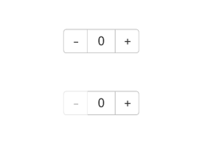

# Counter

计数器组件，提供相应的增加或者减少的计数操作。

>  **说明：**
>
> - 本模块同时支持ArkTS-Dyn、ArkTS-Sta。
>
> - 该组件从API Version 7开始支持。后续版本如有新增内容，则采用上角标单独标记该内容的起始版本。


## 子组件

可以包含子组件。


## 接口

Counter()

**卡片能力：** 从API version 9开始，该接口支持在ArkTS卡片中使用。

**原子化服务API：** 从API version 11开始，该接口支持在原子化服务中使用。

**系统能力：** SystemCapability.ArkUI.ArkUI.Full

## 属性

除支持[通用属性](ts-component-general-attributes.md)外，还支持以下属性。 

### enableInc<sup>10+</sup>

ArkTS-Dyn: enableInc(value: boolean)

ArkTS-Sta: enableInc(value: boolean | undefined)

设置增加按钮的禁用或使能。

**原子化服务API：** 从API version 11开始，该接口支持在原子化服务中使用。

**系统能力：** SystemCapability.ArkUI.ArkUI.Full

**ArkTS-Dyn起始版本：** 7

**ArkTS-Sta起始版本：** 22

**参数：** 

| 参数名 | 类型    | 必填 | 说明                                  |
| ------ | ------- | ---- | ------------------------------------- |
| value  | ArkTS-Dyn: boolean <br/>ArkTS-Sta: boolean  \| undefined | 是   | 增加按钮禁用或使能。<br/>默认值：true，true表示可以增加按钮，false表示禁止增加按钮 |

### enableDec<sup>10+</sup>

ArkTS-Dyn: enableDec(value: boolean)

ArkTS-Sta: enableDec(value: boolean | undefined)

设置减少按钮的禁用或使能。

**原子化服务API：** 从API version 11开始，该接口支持在原子化服务中使用。

**系统能力：** SystemCapability.ArkUI.ArkUI.Full

**ArkTS-Dyn起始版本：** 7

**ArkTS-Sta起始版本：** 22

**参数：** 

| 参数名 | 类型    | 必填 | 说明                                  |
| ------ | ------- | ---- | ------------------------------------- |
| value  | ArkTS-Dyn: boolean <br/>ArkTS-Sta: boolean  \| undefined | 是   | 减少按钮禁用或使能。<br/>默认值：true，true表示可以减少按钮，false表示禁止减少按钮。 |

## 事件

除支持[通用事件](ts-component-general-events.md)外，还支持以下事件：

### onInc

ArkTS-Dyn: onInc(event:&nbsp;VoidCallback)

ArkTS-Sta: onInc(event:&nbsp;VoidCallback | undefined)

监听数值增加事件。

**卡片能力：** 从API version 9开始，该接口支持在ArkTS卡片中使用。

**原子化服务API：** 从API version 11开始，该接口支持在原子化服务中使用。

**系统能力：** SystemCapability.ArkUI.ArkUI.Full

**ArkTS-Dyn起始版本：** 7

**ArkTS-Sta起始版本：** 22

**参数：** 

| 参数名 | 类型                                           | 必填 | 说明                                 |
| ------ | --------------------------------------------- | ---- | ----------------------------------- |
| event  | ArkTS-Dyn: [VoidCallback](ts-types.md#voidcallback12) <br/>ArkTS-Sta: [VoidCallback](ts-types.md#voidcallback12)  \| undefined    | 是   | Counter数值增加的回调函数。 |

### onDec

ArkTS-Dyn: onDec(event:&nbsp;VoidCallback)

ArkTS-Sta: onDec(event:&nbsp;VoidCallback | undefined)

监听数值减少事件。

**卡片能力：** 从API version 9开始，该接口支持在ArkTS卡片中使用。

**原子化服务API：** 从API version 11开始，该接口支持在原子化服务中使用。

**系统能力：** SystemCapability.ArkUI.ArkUI.Full

**ArkTS-Dyn起始版本：** 7

**ArkTS-Sta起始版本：** 22

**参数：** 

| 参数名 | 类型                                           | 必填 | 说明                                 |
| ------ | --------------------------------------------- | ---- | ----------------------------------- |
| event  | ArkTS-Dyn: [VoidCallback](ts-types.md#voidcallback12) <br/>ArkTS-Sta: [VoidCallback](ts-types.md#voidcallback12)  \| undefined    | 是   | Counter数值减少的回调函数。 |


## 示例

该示例展示了Counter组件的基本使用方法。点击+、-按钮可以修改value值。

```ts
// xxx.ets
@Entry
@Component
struct CounterExample {
  @State value: number = 0;

  build() {
    Column() {
      Counter() {
        Text(this.value.toString())
      }.margin(100)
      .onInc(() => {
        this.value++;
      })
      .onDec(() => {
        this.value--;
      })
    }.width("100%")
  }
}
```


